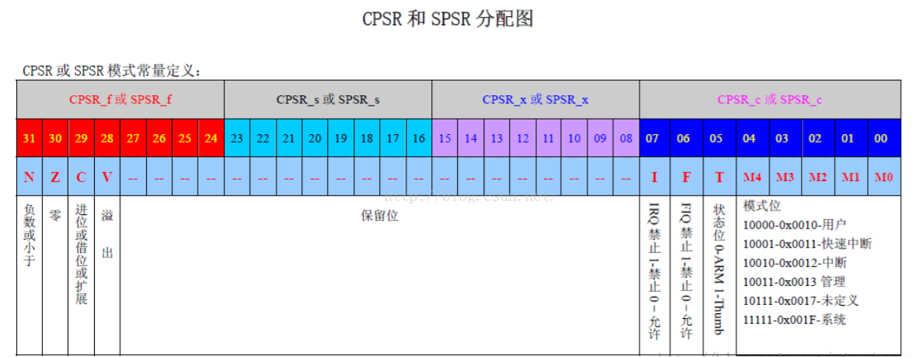
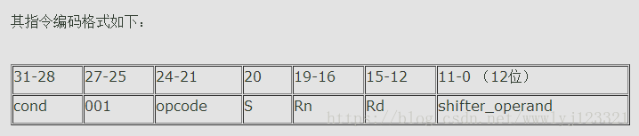

# [ARM] 体系结构简介
## 一、ARM基础知识

### 1.1变量

ARM处理器采用32位架构，这意味着它可以一次处理32位（4字节）的数据，**<font color= red>ARM的地址0X00000000是以字节为单位的，即PC每次移动4字节</font>**。ARM处理器也支持8位（1字节）和16位（2字节）的数据类型，分别称为字节（byte）和半字（halfword）。在ARM中，一个字（word）是32位（4字节）的数据类型。

在C语言中，我们可以使用不同的数据类型来定义变量，例如char，short，int，long等。这些数据类型在不同的编译器和平台下可能有不同的大小。例如，在一个32位的ARM平台上，一个char类型的变量占用1个字节，一个short类型的变量占用2个字节，一个int类型的变量占用4个字节，一个long类型的变量也占用4个字节。但是，在一个64位的ARM平台上，一个long类型的变量可能占用8个字节。

为了避免这种不确定性，我们可以使用C99标准提供的固定宽度整数类型，例如int8_t，int16_t，int32_t等。这些类型可以保证在不同的平台下具有相同的大小和符号性。例如，在任何平台上，一个int8_t类型的变量都占用1个字节，并且是有符号的。


### 1.2指令集

指令编码和各条助记符见《ARM 指令集》。这里只区分 ARM 上常见的三套指令宽度：

- ARM 指令是 32 位，功能全，代码体积大。
- Thumb 以 16 位指令为主，省空间，能做的事少一些。
- Thumb-2 混用 16 位和 32 位，是现在 Cortex-M/A 工具链默认生成的那一套。ARMv8 的 AArch64 是另一套 64 位指令，不在这三套里面。

### 1.3工作模式
|      工作模式      | 特权级别 |               寄存器集合                |                   异常处理                   |                              作用                              |
| :----------------: | :------: | :-------------------------------------: | :------------------------------------------: | :------------------------------------------------------------: |
|      用户模式      |  非特权  |                 R0-R15                  |                      无                      |          正常执行程序，不能直接访问硬件资源或切换模式          |
|      系统模式      |   特权   |                 R0-R15                  |                      无                      |        运行具有特权的操作系统任务，可以访问所有系统资源        |
|    快速中断模式    |   特权   |  R0-R7, R8_fiq-R14_fiq, SPSR_fiq, R15   |          处理高速数据传输或通道处理          |          处理高优先级的中断请求，拥有独立的寄存器集合          |
|    外部中断模式    |   特权   | R0-R12, R13_irq, R14_irq, SPSR_irq, R15 |             处理一般情况下的中断             |             处理低优先级的中断请求，共享寄存器集合             |
|      管理模式      |   特权   | R0-R12, R13_svc, R14_svc, SPSR_svc, R15 |           处理软件中断或系统初始化           |         操作系统使用的保护模式，处理软件中断或系统调用         |
|  数据访问终止模式  |   特权   | R0-R12, R13_abt, R14_abt, SPSR_abt, R15 |  处理存储器故障或实现虚拟存储器和存储器保护  |   当数据或指令预取终止时进入该模式，可用于虚拟存储或存储保护   |
| 未定义指令中止模式 |   特权   | R0-R12, R13_und, R14_und, SPSR_und, R15 | 处理未定义的指令或支持硬件协处理器的软件仿真 | 当执行未定义指令时进入该模式，可用于支持硬件协处理器的软件仿真 |

### 1.4寄存器
寄存器是处理器内部的一种高速存储单元，它可以用来存放数据、指令、地址或状态信息。寄存器的访问速度比内存快得多，因此处理器通常会把频繁使用的数据或指令放在寄存器中，以提高执行效率。

#### ARM有哪些寄存器？

ARM处理器一般共有37个寄存器，其中包括：

- 31个通用寄存器，包括程序计数器（PC）在内，都是32位的寄存器。
- 6个状态寄存器，都是32位的寄存器，但只使用了其中的12位。

ARM处理器共有7种不同的处理器模式，在每一种处理器模式中有一组相应的寄存器。在任意一种处理器模式下，可见的寄存器包括15个通用寄存器（R0~R14）、一个或者二个状态寄存器以及程序计数器（PC）。在所有的寄存器中，有些是各模式共用同一个物理寄存器，有些寄存器是各个模式自己拥有独立的物理寄存器。

#### ARM通用寄存器有什么作用？

ARM通用寄存器（R0-R15）可分为三类：不分组寄存器R0\~R7；分组寄存器R8~R14；程序计数器PC。

- 不分组寄存器R0~R7

不分组寄存器R0~R7在所有处理器模式下，它们每一个都访问一样的32位寄存器。它们是真正的通用寄存器，没有体系结构所隐含的特殊用途。根据“ARM-thumb过程调用标准”，R0-R3用作传入函数参数，传出函数返回值。在子程序调用之间，可以将R0-R3用于任何用途。被调用函数在返回之前不必恢复R0-R3。如果调用函数需要再次使用R0-R3的内容，则它必须保留这些内容。

- 分组寄存器R8~R14

分组寄存器R8～R14对应的物理寄存器取决于当前的处理器模式。要访问特定的物理寄存器而不依赖当前的处理器模式，则要使用规定的名字。寄存器R8~R12各有两组物理寄存器：一组为FIQ模式，另一组为除了FIQ以外的所有模式。根据“ARM-thumb过程调用标准”，R4-R11被用来存放函数的局部变量。如果被调用函数使用了这些寄存器，它在返回之前必须恢复这些寄存器的值。在Thumb程序中，通常只能使用R4-R7来保存局部变量。寄存器R12用作子程序间暂时寄存器IP。它在过程链接胶合代码（例如，交互操作胶合代码）中用于此角色。在过程调用之间，可以将它用于任何用途。被调用函数在返回之前不必恢复R12。

- 程序计数器PC

程序计数器PC是通用寄存器中最特殊的一个，它总是指向当前正在执行指令后面两条指令处（因为ARM采用了流水线机制）。PC不能直接参与算术运算或逻辑运算，在某些情况下可以将PC当作一个普通地址来读取或写入数据。

## 什么是状态寄存器？

状态寄存器是ARM处理器中用来保存当前程序运行时的状态信息的寄存器。状态寄存器有两种类型：当前程序状态寄存器（CPSR）和保存程序状态寄存器（SPSR）。CPSR是所有处理器模式下都可访问的，而SPSR只有在异常模式下才有，并且每种异常模式都有一个对应的SPSR。当异常发生时，SPSR用于保存CPSR的内容，以便在异常返回后恢复原来的状态。

#### CPSR有哪些字段？

CPSR是一个32位的寄存器，它可以分为四个8位的区域：标志域（F）、状态域（S）、扩展域（X）和控制域（C）。每个区域都有一些特定的位，用来表示不同的信息。下面是CPSR的结构图：



- 标志域（F）

标志域包含四个条件码标志位：N、Z、C、V。这些标志位用来表示算术或逻辑运算的结果的特征，例如是否为负数、是否为零、是否有进位或借位、是否有溢出等。这些标志位可以用来控制指令的条件执行，例如BEQ表示如果Z为1则跳转，BGT表示如果N和V相同且Z为0则跳转等。

- 状态域（S）

状态域包含一些与处理器模式相关的位，例如Q、J、T、GE[3:0]等。这些位用来表示处理器的一些特殊状态，例如是否发生饱和运算、是否处于Jazelle模式、是否处于Thumb模式、是否有SIMD运算大于等于等。

- 扩展域（X）

扩展域包含一些与处理器扩展相关的位，例如IT[7:0]、E等。这些位用来表示处理器的一些扩展功能，例如是否处于Thumb-2 if-then块中、是否使用大端字节序等。

- 控制域（C）

控制域包含一些与处理器控制相关的位，例如I、F、M[4:0]等。这些位用来表示处理器的一些控制选项，例如是否屏蔽中断、是否屏蔽快速中断、当前处于哪种处理器模式等。

#### SPSR有哪些作用？

SPSR是保存程序状态寄存器，它只有在异常模式下才存在，并且每种异常模式都有一个对应的SPSR。当异常发生时，SPSR会自动保存CPSR的内容，以便在异常返回后恢复原来的状态。SPSR和CPSR具有相同的结构和字段，只是不能直接访问或修改。要访问或修改SPSR，必须使用专门的指令MRS或MSR，并指定要操作的字段。

#### NZCV
NZCV是CPSR寄存器中的标志域（F）的四个条件码标志位，它们分别表示：

- N：负数标志位（Negative）。当算术或逻辑运算的结果为负数时，N=1；当结果为非负数时，N=0。例如，如果执行`SUBS R0, R1, R2`指令后，R0的值为0xFFFFFFFF，则N=1；如果R0的值为0x00000001，则N=0。
- Z：零标志位（Zero）。当算术或逻辑运算的结果为零时，Z=1；当结果为非零时，Z=0。例如，如果执行`SUBS R0, R1, R2`指令后，R0的值为0x00000000，则Z=1；如果R0的值为0x00000001，则Z=0。
- C：进位标志位（Carry）。当算术或逻辑运算产生进位或借位时，C=1；当没有进位或借位时，C=0。例如，如果执行`ADDS R0, R1, R2`指令后，R1和R2的最高位相加产生进位，则C=1；如果没有进位，则C=0。如果执行SUBS R0, R1, R2指令后，R1小于R2产生借位，则C=0；如果没有借位，则C=1。
- V：溢出标志位（Overflow）。当算术或逻辑运算产生有符号数溢出时，V=1；当没有溢出时，V=0。例如，如果执行`ADDS R0, R1, R2`指令后，R1和R2的符号相同，但是R0的符号与它们不同，则V=1；如果没有这种情况，则V=0。如果执行SUBS R0, R1, R2指令后，R1和R2的符号不同，但是R0的符号与R2相同，则V=1；如果没有这种情况，则V=0。
这四个标志位可以用来控制指令的条件执行，例如：

>BEQ：如果Z=1，则跳转到指定地址。
BNE：如果Z=0，则跳转到指定地址。
BCS：如果C=1，则跳转到指定地址。
BCC：如果C=0，则跳转到指定地址。
BMI：如果N=1，则跳转到指定地址。
BPL：如果N=0，则跳转到指定地址。
BVS：如果V=1，则跳转到指定地址。
BVC：如果V=0，则跳转到指定地址。


<br>
<br>

---

## 二、ARM指令系统语法格式

### 2.1 语法格式

一条ARM指令语法格式分为如下几个部分：

> \<opcode> {\<cond>} {S} \<Rd>,\<Rn> {,<shifter_operand>}


其中，<>内的项是必须的， {}内的项是可选的，如\<opcode>是指令助记符，是必须的，而 {\<cond>}为指令执行条件，是可选的，如果不写则使用默认条件AL (无条件执行)。

编码后的机器码格式如下所示：



（1）Opcode 指令助记符，如LDR，STR 等

（2）Cond 执行条件，如EQ，NE 等

（3）S 是否影响CPSR 寄存器的值，书写时影响CPSR，否则不影响

（4）Rd 目标寄存器

（5）Rn 第一个操作数的寄存器

（6）shifter_operand 第二个操作数

仔细看表格中的shifter_operand所占的位数：12位。

要用一个12位的编码来表示任意的32位数是绝对不可能的 （12位数有2^12^种可能，而32位数有 2^32^ 种）。 但是又要用12位的编码来表示32位数，怎么办？ 只有在表示数的数量上做限制。 通过编码来实现用12位的编码来表示32位数。

### 2.2 编码显示

#### 合法立即数
ARM中采用了一种叫做modified immediate constants的方法，来扩展立即数的范围。这种方法是把12位分成两部分，8位用来表示一个常数（immed_8），4位用来表示一个循环右移的次数（rotate_imm）。

循环右移就是把一个二进制数的最右边的一位移到最左边，然后重复这个操作若干次。比如00010011循环右移一次就变成10001001，再循环右移一次就变成01000100。

通过这种方法，可以用8位常数循环右移偶数次（0到30次），来生成一些32位的数值。比如00000000000000000000000011111111（255）可以循环右移16次，得到11111111000000000000000000000000（4278190080）。

这样就可以用12位来编码一些32位的立即数了。但是并不是所有的32位数都可以用这种方法表示，只有符合一定规律的才可以。比如必须是8个连续的1或0，然后循环移动偶数次。

所以在ARM中，有些立即数是合法的，有些是非法的。合法的立即数就是能用modified immediate constants方法表示的，非法的就是不能用这种方法表示的。判断一个立即数是否合法，可以先看它是否在0到255之间，如果是，就直接用8位表示，不需要移动。如果不是，就看它是否能由一个8位常数循环右移偶数次得到，并且移动次数最小。如果能，就用8位常数和移动次数表示。如果不能，就说明它是非法的立即数。

#### 非法立即数
为了处理非法立即数，有以下几种常用的方法：
- 使用LDR伪指令，把非法立即数放在代码段或数据段中，然后用LDR指令从内存中加载到寄存器中。比如LDR R1, =0x12345678。
- 使用多条指令，把非法立即数分成几个合法的立即数，然后用移位和逻辑运算组合起来。比如MOV R1, #0x12000000; ORR R1, R1, #0x3456; LSL R1, R1, #8; ORR R1, R1, #0x78。
- 使用协处理器指令MCR或MRC，把非法立即数写入或读出协处理器的寄存器中。比如MCR P15, 0, R1, C2, C0, 0; LDR R1, =0x12345678; MCR P15, 0, R1, C2, C0, 0。

<br>
<br>

---
## 三、 ARM条件指令

### 3.1 条件执行指令码

#### 什么是条件执行指令码？

条件执行指令码是指在ARM指令中附加的一个两位或三位的后缀，用来表示该指令是否根据某些条件来执行。条件执行指令码可以用来实现条件判断语句，避免不必要的跳转，提高代码的效率和可读性。

#### 条件执行指令码有哪些？

条件执行指令码有以下几种：

| 后缀  |    标志寄存器    |       含义       |
| :---: | :--------------: | :--------------: |
|  EQ   |      Z == 1      |       等于       |
|  NE   |      Z == 0      |      不等于      |
| CS/HS |      C == 1      | 无符号大于或等于 |
| CC/LO |      C == 0      |    无符号小于    |
|  MI   |      N == 1      |       负数       |
|  PL   |      N == 0      |     正数或零     |
|  VS   |      V == 1      |       溢出       |
|  VC   |      V == 0      |      无溢出      |
|  HI   | C == 1 && Z == 0 |    无符号大于    |
|  LS   |      C == 0      |                  | Z == 1 | 无符号小于或等于 |
|  GE   |      N == V      | 有符号大于或等于 |
|  LT   |      N != V      |    有符号小于    |
|  GT   | Z == 0 && N == V |    有符号大于    |
|  LE   |      Z == 1      |                  | N != V | 有符号小于或等于 |
|  AL   |     任何情况     |       始终       |

#### 如何使用条件执行指令码？

条件执行指令码可以附加在任何ARM指令的操作码后面，表示该指令只有在满足相应的条件时才执行，否则不执行。例如，以下代码表示如果R0和R1相等，则将R2和R3相加，并将结果保存在R4中：

```assembly
CMP R0, R1
ADDEQ R4, R2, R3
```
如果不使用条件执行指令码，上面的代码可以用以下方式实现：
```assembly
CMP R0, R1
BNE skip
ADD R4, R2, R3
skip:
```
可以看出，使用条件执行指令码可以减少一条跳转指令，简化代码的结构。