# [ARM] 引脚与串口

同一根引脚在不同芯片上的地址和复用值都不一样，但配置时要问的问题是一样的。

1. 看原理图：这根脚接到蜂鸣器、串口还是采样电路。
2. 选复用：一根脚往往可以当 GPIO、PWM 或 UART。裸机写 pinmux 寄存器，Linux 里写在设备树的 pinctrl 里。
3. 再配功能模块：PWM 要周期和占空比，串口要波特率和数据位，ADC 要通道和时钟。复用没选对时，模块寄存器写了也没有波形。
4. 打开时钟：控制器的总线时钟没开，访问寄存器会失败或读数不变。

裸机程序可以直接用手册里的物理地址。跑 Linux 时不要把地址写进 C 文件，让设备树描述引脚和控制器，驱动在 `probe` 里拿资源。RK3588 的引脚名、复用值和基址以它的手册和内核里的 `rk3588` pinctrl 为准，和下面这块板不是同一套数。

从 1.1 起是 **FS4412（Exynos 4412）课堂板** 的例子。原理图、`0x114000A0` 这类地址和代码只对那块板成立。

## 一、ARM引脚控制

在裸机编程中，想要控制引脚就需要配置该引脚相应的寄存器

### 1.1 pwm控制无源蜂鸣器

下面是 FS4412 的特例，不是通用 PWM 编程步骤。

1. 看原理图
本例采用fs4412开发板，pwm外接了一个蜂鸣器BUZZER，电路图如下：
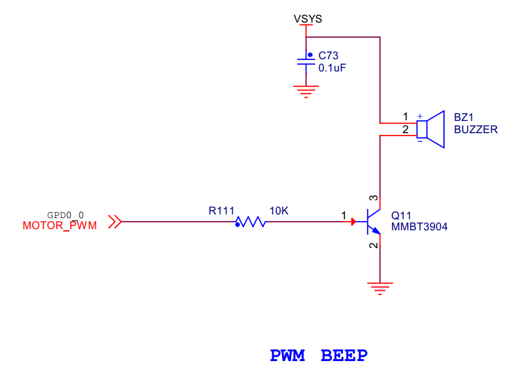

继续查找pwm的引脚：

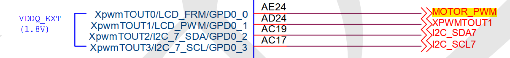

可知要配置的是GPD0_0。

再看pwm的内部模块以此知道要配置的寄存器：
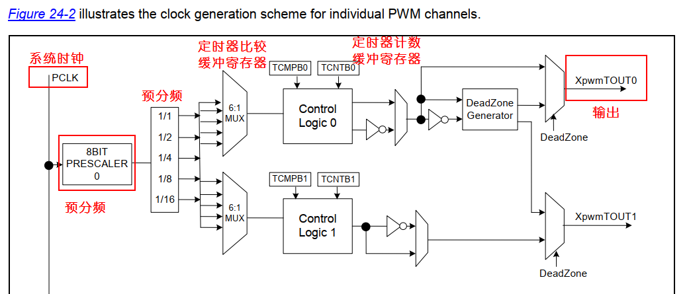

>工作的步骤：
>1. 当时钟PCLK被使能后，定时器计数缓冲寄存器（TCNTBn）把计数器初始值下载到递减计数器中。
>2. 定时器比较缓冲寄存器（TCMPBn）把其初始值下载到比较寄存器中，并将该值与递减计数器的值进行比较。当递减计数器和比较寄存器值相同时，输出电平翻转。
>3. 递减计数器减至0后，输出电平再次翻转，完成一个输出周期。这种基于TCNTBn和TCMPBn的双缓冲特性使定时器在频率和占空比变化时能产生稳定的输出。
>4. 每个定时器都有一个专用的由定时器时钟驱动的16位递减计数器。
当递减计数器的计数值达到0时，就会产生定时器中断请求来通知ＣＰＵ定时器操作完成。当定时器递减计数器达到０的时候，如果设置了Auto-Reload 功能，相应的TCNTBn的值会自动重载到递减计数器中以继续下次操作。
>5. 然而，如果定时器停止了，比如在定时器运行时清除TCON中定时器使能位，TCNTBn的值不会被重载到递减计数器中。
>6. TCMPBn 的值用于脉冲宽度调制。当定时器的递减计数器的值和比较寄存器的值相匹配的时候，定时器控制逻辑将改变输出电平。因此，比较寄存器决定了PWM 输出的开关时间。

2. 看寄存器
pwm需要的寄存器如下图（还需要将GPD0CON设置为0x2即TOUT_0，pwm输出模式）：
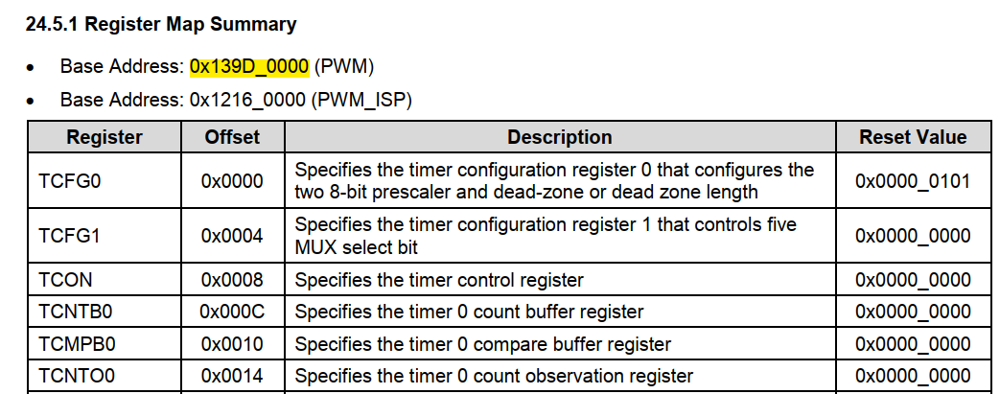

(1)TFCG0
定时器配置寄存器0（TFCG0） ，主要用于预分频设置。
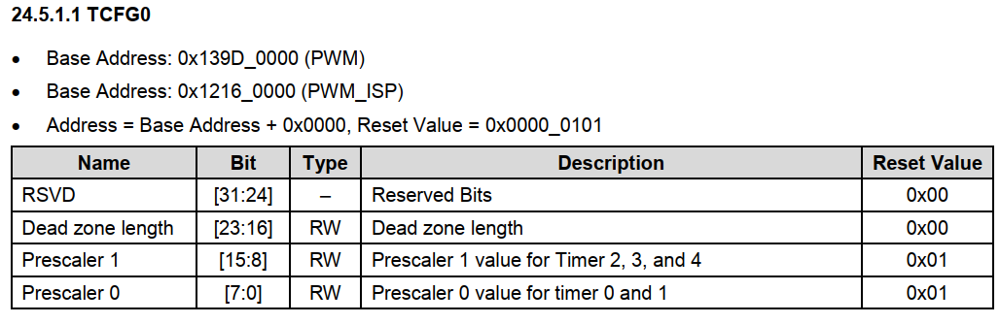

(2)TFCG1
定时器配置寄存器1（TFCG1） ，主要用于预分频设置。
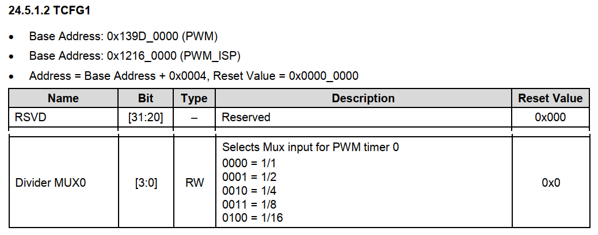

(3)TCON
timer控制寄存器TCON,主要用于使能定时器，设置自动重载，设置输出电平翻转等。
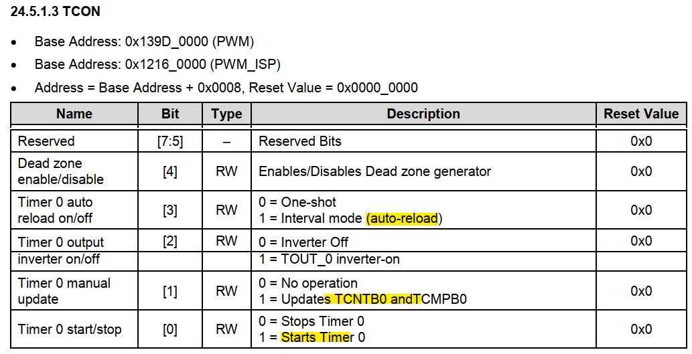
- bite[3] : 设置定时器是只执行一个周期(One-shot)还是周期执行（auto-reload）
- bite[1]: 置为1，则更新TCNTB0 、TCMPB0 的值
- bit[0]：开启或者停止定时器

(4)TCNTB0
定时器计数缓冲寄存器（TCNTB0），主要用于设置定时器的初始值。
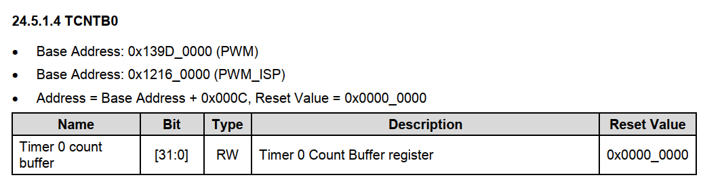

(5)TCMPB0
定时器比较缓冲寄存器（TCMPB0），主要用于设置定时器的比较值。
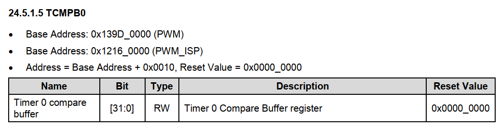

3.代码
总体流程如下：
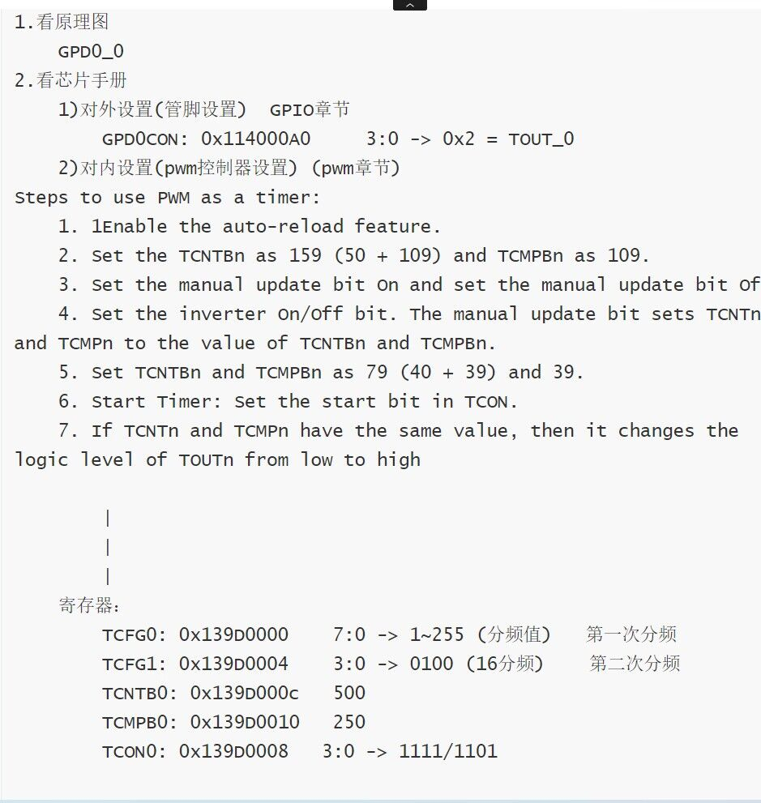

代码如下：
- pwm.c
```c
#define GPD0CON (*((volatile unsigned int *)0x114000A0))
#define TCFG0   (*((volatile unsigned int *)0x139D0000))
#define TCFG1   (*((volatile unsigned int *)0x139D0004))
#define TCON0   (*((volatile unsigned int *)0x139D0008))
#define TCNTB0  (*((volatile unsigned int *)0x139D000c))
#define TCMPB0  (*((volatile unsigned int *)0x139D0010))

//1.对外设置
void PWM_GPIO_Init(void)
{

    //GPD0_0: TOUT0
    GPD0CON &= ~0xf;
    GPD0CON |= 0x2;
}

//2.对内设置
void PWM_Init(void)
{ 
    TCFG0 = 255;//第一次分频    分频值:255+1
    
    TCFG1 &= ~0xf; //第二次分频  16分频
    TCFG1 |= 0x4;

    TCNTB0 = 500;//计数周期值
    TCMPB0 = 250;//比较值

    TCON0 &= ~0xf;
    TCON0 |= 0xe;//auto reload:1   manual update: 1
    TCON0 &= 0xc;//auto reload:1   manual update: 0

}

//3.buzzer on
void buzzer_on(void)
{
    TCON0 |= 0x1;
}

//4.buzzer off
void buzzer_off(void)
{
    TCON0 &= ~0x1;
}
```
- main.c

```c
int main(int argc, char *argv[])
{

    
    PWM_GPIO_Init();
    PWM_Init();

    buzzer_on();//开buzzer

    while(1)
    {

    }
    return 0;
} 


```
-start.s

```s
    .global  delay1s 
    .text     
    .global _start
_start:
		b		reset                        @0x00
		ldr		pc,_undefined_instruction  @0x04
		ldr		pc,_software_interrupt     
		ldr		pc,_prefetch_abort
		ldr		pc,_data_abort
		ldr		pc,_not_used
		ldr		pc,_irq
		ldr		pc,_fiq

_undefined_instruction: .word  _undefined_instruction
_software_interrupt:	.word  _software_interrupt
_prefetch_abort:		.word  _prefetch_abort
_data_abort:			.word  _data_abort
_not_used:				.word  _not_used
_irq:					.word  _irq 
_fiq:					.word  _fiq


reset: 
	ldr	r0,=0x40008000      @设置异常向量表的起始地址为0x40008000
	mcr	p15,0,r0,c12,c0,0		@ Vector Base Address Register  修改异常向量表的起始地址

init_stack:
	ldr		r0,stacktop         /*get stack top pointer*/

	/********svc mode stack********/
		mov		sp,r0
		sub		r0,#128*4          /*512 byte  for irq mode of stack*/
	/****irq mode stack**/
		msr		cpsr,#0xd2
		mov		sp,r0
		sub		r0,#128*4          /*512 byte  for irq mode of stack*/
	/***fiq mode stack***/
		msr 	cpsr,#0xd1
		mov		sp,r0
		sub		r0,#0
	/***abort mode stack***/
		msr		cpsr,#0xd7
		mov		sp,r0
		sub		r0,#0
	/***undefine mode stack***/
		msr		cpsr,#0xdb
		mov		sp,r0
		sub		r0,#0
   /*** sys mode and usr mode stack ***/
		msr		cpsr,#0x10
		mov		sp,r0             /*1024 byte  for user mode of stack*/

		b		main

delay1s:
     ldr      r4,=0x1ffffff   
delay1s_loop:
     sub    r4,r4,#1
     cmp   r4,#0         
     bne    delay1s_loop
     mov   pc,lr	


	.align	4

	/****  swi_interrupt handler  ****/


stacktop:    .word 		stack+4*512

.data

stack:	
  .space  4*512
.end
```

- makefile

```makefile
all:
	arm-none-linux-gnueabi-gcc -fno-builtin -nostdinc -c -o start.o start.s
	arm-none-linux-gnueabi-gcc -fno-builtin -nostdinc -c -o main.o main.c
	arm-none-linux-gnueabi-gcc -fno-builtin -nostdinc -c -o pwm.o pwm.c
	arm-none-linux-gnueabi-ld *.o  -Tmap.lds -o buzzer.elf
	arm-none-linux-gnueabi-objcopy -O binary buzzer.elf buzzer.bin
	arm-none-linux-gnueabi-objdump -D buzzer.elf > buzzer.dis
clean:
	rm -rf *.bak *.o *.elf *.dis *.bin
```
- map.lds

```c
/*linux下的连接脚本模板*/
OUTPUT_FORMAT("elf32-littlearm", "elf32-littlearm", "elf32-littlearm") /*指定输出可执行文件是elf格式，32位ARM指令，小端*/
OUTPUT_ARCH(arm)  /*指定输出可执行文件的平台(arm平台)*/
ENTRY(_start)     /*指定连接之后第一条指令的地址为_start*/
SECTIONS  /*指定连接之后的代码段(.text) 数据段(.data) .bss段如何摆放*/
{
	. = 0x40008000; /*指定链接的起始地址 从0x40008000地址开始摆放*/
	. = ALIGN(4);   /*指令对齐(4字节对齐)*/
	.text      :    /*代码段开始*/
	{
		start.o(.text)  /*0x40008000地址放start.o对应的start.s的第一条指令*/
		*(.text)        /* *：其他的*.o文件系统自动安排位置*/
	}
	. = ALIGN(4);
    .data :         /*数据段开始*/
	{ *(.data) }    /*数据段也让系统自动分配*/
    . = ALIGN(4);
    .bss :
     { *(.bss) }
}
```

<br>
<br>

---

### 1.2 串口控制

仍是 FS4412 的特例：哪根脚当 TX/RX、波特率分频寄存器的地址，都要换成你那颗芯片的手册。

- uart.c

```c
#define GPA1CON (*((volatile unsigned int *)0x11400020))
#define ULCON2  (*((volatile unsigned int *)0x13820000))
#define UCON    (*((volatile unsigned int *)0x13820004))
#define UTRSTAT2 (*((volatile unsigned int *)0x13820010))
#define UTXH2   (*((volatile unsigned int *)0x13820020))
#define URXH2   (*((volatile unsigned int *)0x13820024))
#define UBRDIV2 (*((volatile unsigned int *)0x13820028))
#define UFRACVAL2 (*((volatile unsigned int *)0x1382002c))


//1.对外设置
void GPIO_Init()
{
    //GPA1CON: 7:0->0x22  uart管脚
    GPA1CON &= ~0xff; //7:0清0
    GPA1CON |= 0x22; // 7:0->0x22
}

//2.对内设置  uart设置
void  UART_Init()
{
    //1.ULCON2：  data:8    stop:1    Bau:115200   parity:无 

    ULCON2 = 0x3;

    //2.UCON: 设置发送接收方式 polling
    UCON &= ~0xf;
    UCON |= 0x5;

    //3.设置波特率  115200
    UBRDIV2 = 53;
    UFRACVAL2 = 4;
}

//3.串口发送
void uart_send(char ch)
{
    while((UTRSTAT2 & 0x2) == 0);//等发送数据寄存器为空
    UTXH2 = ch; 

}

//4.串口接收
char uart_recv(void)
{
    char ch;

    while((UTRSTAT2 & 0x1) == 0);//等接收数据寄存器不为空
    ch = URXH2;
}

//5.发送字符串
void puts(char *str)
{
    char *ptr = str;
    while(*ptr)
    {
        uart_send(*ptr);
        ptr++;
    }
}


void put_int(int num)
{
    char buf[100];
    int i = 0;
    if (0 == num)
        buf[i++] = '0';
    while (num) {
        buf[i] = num % 10 + '0';
        i++;
        num = num / 10;
    }
    int j, k;
    for (j=0,k=i-1; j < k; j++,k--) {
        char c = buf[j];
        buf[j] = buf[k];
        buf[k] = c;
    }
    buf[i] = '\r';
    buf[i+1] = '\n';
    buf[i+2] = '\0';
    puts(buf);
}

```
- main.c

```c

#include "uart.c"

int main(int argc, char *argv)
{
    GPIO_Init();
    UART_init();

    char rev;
    while (1)
    {
        rev = uart_recv();
        uart_send(rev);
        if (rev == '1')
        {
            // 将寄存器GPX2DAT的第7位置1
            GPX2DAT |= 0x80;
        }
        else if (rev == '0')
        {
            GPX2DAT &= ~0x80;
        }
        mydelay(100);
    }
    return 0;
}
```

<br>
<br>

---

### 1.3 adc

仍是这块板的 ADC 寄存器。通道号、参考电压和结果位宽换芯片就会变。

- adc.c

```c
#define ADCCON (*(volatile unsigned int *)0x126c0000)
#define ADCDAT (*(volatile unsigned int *)0x126c000c)
#define ADCMUX (*(volatile unsigned int *)0x126c001c)

void ADC_Init(void)
{
    ADCCON |= 0x1 << 16; //12bits分辨率
    ADCCON |= 0x1 << 14;//分频使能

    ADCCON &= ~(0xff << 6);//13:6清0
    ADCCON |= 0xff << 6;//分频值: 255+1

    ADCCON &= ~(0x1 << 2);//正常模式
    
    ADCMUX = 0x3;//选择AIN3
}

int read_adc(void)
{
    int data = 0;
    int voltage = 0;
    //1.开始转换
    ADCCON |= 0x1;

    //2.开始读
    while((ADCCON & (0x1 <<15)) == 0);//等待转换完成
    data = ADCDAT & 0xfff; //读取转换结果
    
    voltage = 1800 * data / 4096; //电压

    return voltage;

}

```

<br>
<br>

---

### 1.4 中断编程

中断号和 GPIO 外部中断寄存器同样只对 FS4412 成立。通用的是：引脚配成中断源，打开对应中断，处理函数里清掉中断标志。

总的流程图如下：

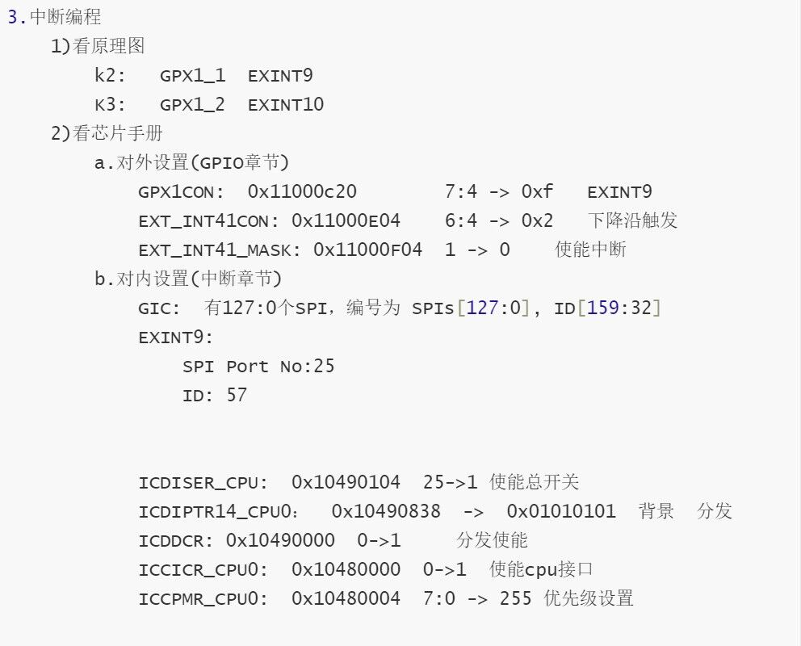

- irq.c

```c
#define GPX1CON (*(volatile unsigned long *)0x11000C20)
#define GPX1DAT (*(volatile unsigned long *)0x11000C24)
#define EXT_INT41_CON (*(volatile unsigned long *)0x11000E04)
#define EXT_INT41_MASK (*(volatile unsigned long *)0x11000F04)

#define ICDISER_CPU (*(volatile unsigned long *)0x10490104)
#define ICDIPTR14_CPU0 (*(volatile unsigned long *)0x10490838)
#define ICDDCR (*(volatile unsigned long *)0x10490000)
#define ICCICR_CPU0 (*(volatile unsigned long *)0x10480000)
#define ICCPMR_CPU0 (*(volatile unsigned long *)0x10480004)

#define EXT_INT41_PEND (*(volatile unsigned long *)0x11000F44)
#define ICCIAR (*(volatile unsigned long *)0x1048000C)
#define ICCEOIR (*(volatile unsigned long *)0x10480010)
#define ICDICPR_CPU (*(volatile unsigned long *)0x10490284)
void IRQ_Init()
{
    GPX1CON |= 0xf << 8; // EINT10
    EXT_INT41_CON &= ~(0x7 << 8);
    EXT_INT41_CON |= 0x2 << 8; // falling edge
    EXT_INT41_MASK &= ~(0x1 << 2);

    ICDISER_CPU |= 0x1 << 26;    // 使能中断
    ICDIPTR14_CPU0 = 0x01010101; // 分发器
    ICDDCR |= 0x1;               // 分发器使能
    ICCICR_CPU0 |= 0x1;          // cpu接口使能
    ICCPMR_CPU0 = 0xff;          // 优先级掩码
}

void irq_handler(void)
{
    int irq_no = -1;
    int i = 0xffff; // 消抖
    while (i > 0)
    {
        i--;
    }
    if (GPX1DAT & 0x1 << 2)
    {

        irq_no = ICCIAR & 0x3ff; // 取出中断号

        switch (irq_no)
        {
        case 57:

            break;
        case 58:
            uart_send('a');

            EXT_INT41_PEND |= 0x1 << 2; // 标准中断已发生
            ICDICPR_CPU |= 0x1 << 26;   // 清除中断挂起
            break;
        default:
            break;
        }
    }

    ICCEOIR &= ~0x3ff; // 清除中断号
    ICCEOIR |= irq_no;
}
```

另一种写法：

test.S:
```s
.global delay
.global _start
_start:
    b reset  
    ldr pc,_undefined_instruction
    ldr pc,_software_interrupt
    ldr pc,_prefetch_abort
    ldr pc,_data_abort
    ldr pc,_not_used
    ldr pc,_irq
    ldr pc,_fiq

    _undefined_instruction:  .word _undefined_instruction
    _software_interrupt:     .word _software_interrupt
    _prefetch_abort:         .word _prefetch_abort
    _data_abort:             .word _data_abort
    _not_used:               .word _not_used
    _irq:                    .word irq_handler
    _fiq:                    .word _fiq
    nop
    nop
reset:
    mrs r0 ,cpsr
    bic r0,r0,#0x1f
    orr r0,r0,#0xd3
    msr cpsr,r0

    ldr r0,=0x41000000
    mcr p15,0,r0,c12,c0,0
    ldr sp,=(stack_svc+128)

    mrs r0 ,cpsr
    bic r0,r0,#0x1f
    orr r0,r0,#0x12
    msr cpsr,r0
    ldr sp,=(stack_swi+128)

    mrs r0,cpsr
    bic r0,r0,#0xff
    orr r0,r0,#0x10
    msr cpsr,r0
    ldr sp,=stack_user
    add sp,sp,#128
    bl main

delay:
    stmfd sp!,{lr}
    ldr r0,=0xfff00000
loop:
    sub r0,r0,#1
    cmp r0,#0
    bgt loop
    ldmfd sp!,{pc}

irq_handler:
    sub lr,lr,#4
    stmfd sp!,{r0-r12,lr}
    bl irq_handler_fun
    ldmfd sp!,{r0-r12,pc}^


stack_user: .space 128
stack_svc: .space 128
stack_swi: .space 128
    
```
main.c
```c
/*===============================================
*   文件名称：main.c
*   创 建 者：   向某某
*   创建日期：2024年06月20日
*   描    述：
================================================*/
#define GPA1CON *(volatile unsigned int *)0x11400020
#define ULCON2 *(volatile unsigned int *)0x13820000
#define UCON2 *(volatile unsigned int *)0x13820004
#define UFCON2 *(volatile unsigned int *)0x13820008
#define UTXH2 *(volatile unsigned int *)0x13820020
#define URXH2 *(volatile unsigned int *)0x13820024
#define UBRDIV2 *(volatile unsigned int *)0x13820028
#define UFRACVAL2 *(volatile unsigned int *)0x1382002c
#define UTRSTAT2 *(volatile unsigned int *)0x13820010

#define GPX1CON (*(volatile unsigned long *)0x11000C20)
#define GPX1DAT (*(volatile unsigned long *)0x11000C24)
#define EXT_INT41_CON (*(volatile unsigned long *)0x11000E04)
#define EXT_INT41_MASK (*(volatile unsigned long *)0x11000F04)

#define ICDISER_CPU (*(volatile unsigned long *)0x10490104)
#define ICDIPTR14_CPU0 (*(volatile unsigned long *)0x10490838)
#define ICDIPR14_CPU0 (*(volatile unsigned long *)0x10490438)
#define ICDDCR (*(volatile unsigned long *)0x10490000)
#define ICCICR_CPU0 (*(volatile unsigned long *)0x10480000)
#define ICCPMR_CPU0 (*(volatile unsigned long *)0x10480004)

#define EXT_INT41_PEND (*(volatile unsigned long *)0x11000F44)
#define ICCIAR (*(volatile unsigned long *)0x1048000C)
#define ICCEOIR (*(volatile unsigned long *)0x10480010)
#define ICDICPR_CPU (*(volatile unsigned long *)0x10490284)

void irq_init()
{
   GPX1CON |= 0xF << 4;
   EXT_INT41_CON &= ~(0x7 << 4);
   EXT_INT41_CON |= 0x2 << 4;
   EXT_INT41_MASK &= ~(0x1 << 1);

   ICDDCR |= 0x1;
   ICDISER_CPU |= 0x1 << 25;
   ICDIPR14_CPU0 &= ~(0xFF << 8);
   ICDIPTR14_CPU0 &= ~(0xFF << 8);
   ICDIPTR14_CPU0 |= 0x01 << 8;

   ICCICR_CPU0 |= 0x1;
   ICCPMR_CPU0 |= 0xFF;
}

void send(char c)
{
   while (0 == (UTRSTAT2 >> 2) & 0X1);
   UTXH2 = c;
}

void irq_handler_fun()
{
   int irq_no = -1;
   irq_no = ICDDCR & 0x3FF;
   char a = 's';
   send(a);
   EXT_INT41_PEND |= 0x1 << 1;
   ICCEOIR &= ~(0x3FF);
   ICCEOIR |= irq_no;
}
void time(void)
{
   int n = 1000000;
   while (n--)
      ;
}
void UART_in(void)
{
   GPA1CON = (GPA1CON & ~(0xF << 4)) | (0x2 << 4);
   GPA1CON = (GPA1CON & ~(0xF)) | (0x2);
   ULCON2 = 0X3;
   UCON2 = (UCON2 & ~(0XF << 2)) | (0X1 << 2);
   UCON2 = (UCON2 & ~(0X3)) | (0X1);
   UFCON2 = UFCON2 & ~(0x1);
   //   UTXH2     = 0x41;
   UBRDIV2 = 53;
   UFRACVAL2 = 4;
}
char uart_recv()
{
   while (0 == (UTRSTAT2 & 0X1))
      ;
   return UTXH2 & 0XFF;
}


void send_str(char *s)
{
   while (*s != '\0')
   {
      send(*s);
      s++;
   }
}
int main()
{
   UART_in();
   irq_init();
   send('a');
   while(1){
      
   }
   return 0;
}

```

>注：进入中断后lr-4的原因，因为发生中断时cpu会处理完当前指令，进入中断时，pc指向了下一个指令，lr指向下下个指令，所以lr-4