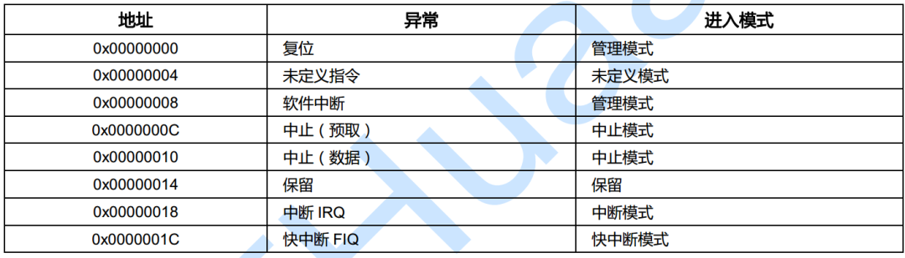

# [ARM] 指令集
## 一、基本指令

1. 搬移指令：这类指令主要用于在寄存器之间复制数据，或者把立即数值复制到寄存器。

   - `MOV`: 这个指令将第二个操作数的值复制到第一个操作数（一个寄存器）。例如，`MOV r0, r1`将把r1寄存器的值复制到r0寄存器。

   - `MVN`: 这个指令将第二个操作数的值取反然后复制到第一个操作数（一个寄存器）。例如，`MVN r0, r1`将把r1寄存器的值取反，然后将结果复制到r0寄存器。

2. 逻辑指令：这类指令用于执行逻辑运算，如AND、OR、NOT和XOR。

   - `CMP` (Compare): 这个指令用于比较两个操作数的值。它将第一个操作数和第二个操作数相减，然后设置条件代码标志，但不保存结果。例如，`CMP r0, r1`会比较r0和r1的值。如果r0大于r1，那么会设置大于标志；如果r0等于r1，那么会设置等于标志；如果r0小于r1，那么会设置小于标志。

>`CMP`主要用于改变程序的状态寄存器（CPSR），包括以下几个标志：
>
>（1）**Z（零标志）**：如果两个操作数相等，即它们相减的结果为0，那么零标志就会被设置。
>
>（2）**N（负标志）**：如果第一个操作数小于第二个操作数，那么结果会是负数，此时负标志会被设置。
>
>（3）**C（进位标志）**：如果在无符号比较中，第一个操作数小于第二个操作数，进位标志会被设置。
>
>（4）**V（溢出标志）**：如果在有符号比较中发生溢出，溢出标志会被设置。
>
>在`CMP`指令后通常会跟随一个条件跳转指令，如`BNE`（如果上一个比较操作的结果不为零，则跳转），`BLT`（如果上一个比较操作的结果为负，则跳转）等，这些指令根据CPSR中的标志来决定是否跳转。


   - `AND`: 这个指令将第一个和第二个操作数进行位与运算，然后将结果存入第一个操作数。例如，`AND r0, r1`将r0和r1的每一位进行与运算，然后将结果存入r0。

   - `ORR`: 这个指令将第一个和第二个操作数进行位或运算，然后将结果存入第一个操作数。例如，`ORR r0, r1`将r0和r1的每一位进行或运算，然后将结果存入r0。

   - `EOR`: 这个指令将第一个和第二个操作数进行异或运算，然后将结果存入第一个操作数。例如，`EOR r0, r1`将r0和r1的每一位进行异或运算，然后将结果存入r0。

   - `BIC`: 这个指令将第一个操作数和第二个操作数的反码进行位与运算，然后将结果存入第一个操作数。例如，`BIC r0, r1`将r0和r1的反码进行与运算，然后将结果存入r0。

   - `TST`: 这个指令用于测试两个操作数的位模式。它将第一个操作数和第二个操作数进行位与运算，然后设置条件代码标志，但不保存结果。例如，TST r0, r1会将r0和r1进行位与运算。如果结果为0，那么会设置零标志；否则，不设置零标志。

3. 位移指令：这类指令主要用于在位级别上移动寄存器的值。

   - `LSL`: 逻辑左移。这个指令将第一个操作数的值左移第二个操作数指定的位数，空出的位用0填充。例如，`LSL r0, r1, #2`将把r1寄存器的值左移2位，然后将结果存入r0寄存器。

   - `LSR`: 逻辑右移。这个指令将第一个操作数的值右移第二个操作数指定的位数，空出的位用0填充。例如，`LSR r0, r1, #2`将把r1寄存器的值右移2位，然后将结果存入r0寄存器。
  
   - `ROR`: 循环右移。这个指令将第一个操作数的值右移第二个操作数指定的位数，从尾部移出的位被插入到头部。例如，ROR r0, r1, #2将把r1寄存器的值右移2位，然后将结果存入r0寄存器。

   - `RRX`: 带扩展的循环右移。这个指令将第一个操作数的值右移一位，将进位标志放入最高有效位，并将最低有效位放入进位标志。例如，RRX r0, r1将把r1寄存器的值右移一位，然后将结果存入r0寄存器。

4. 加载/存储指令：这些指令用于在存储器和寄存器之间传输数据。最常见的有`LDR`（Load Register）和`STR`（Store Register）。
   >ldr r1,=srcBuf @将标准srcBuf的地址加载到寄存器r1。
   - `LDR`：从内存中加载数据到寄存器。例如，`LDR r0, [r1]`将从r1寄存器指向的内存地址加载数据到r0寄存器。也就是r0 = *r1
   - `STR`：将寄存器中的数据存储到内存。例如，`STR r0, [r1]`将把r0寄存器中的数据存储到r1寄存器指向的内存地址。 *r1 = r0
   - 
5. 批量操作指令：这些指令允许你一次对多个寄存器进行操作。常见的有`LDM`（Load Multiple）和`STM`（Store Multiple）。
   - `LDM`：从内存中加载多个寄存器。例如，`LDMIA r0!, {r1-r3}`会从r0寄存器指向的地址开始连续加载r1, r2, r3这三个寄存器，并且在加载后自动增加r0的值。
   - `STM`：将多个寄存器的值存储到内存中。例如，`STMIA r0!, {r1-r3}`会将r1, r2, r3这三个寄存器的值连续存储到r0寄存器指向的地址开始的内存位置，并且在存储后自动增加r0的值。

6. 堆栈指令：堆栈是一种特殊的数据结构，后入先出（LIFO）。ARM汇编中，通常使用`PUSH`和`POP`指令操作堆栈。
   - `PUSH`：将一个或多个寄存器的值压入堆栈。例如，`PUSH {r0, lr}`会将r0寄存器和链接寄存器lr的值压入堆栈。
   - `POP`：从堆栈中弹出一个或多个值到寄存器。例如，`POP {r0, lr}`会将堆栈的顶部两个值弹出，分别存入r0寄存器和链接寄存器lr。
   - `STMFD`用于函数调用的过程中保存和恢复寄存器的状态。`STMFD sp!, {r0-r3, lr}`将把r0至r3和lr这些寄存器的值连续存储到栈（由栈指针sp指向的内存）中，并且在存储后自动减小sp的值（因为在ARM中，栈是向下增长的）；
   - `LDMFD`用于函数调用的过程中保存和恢复寄存器的状态。`LDMFD sp!, {r0-r3, pc}`则从栈中加载r0至r3和程序计数器pc的值，并且在加载后自动增加sp的值。

7. 软中断指令：`SWI`（Software Interrupt）指令用于触发软件中断。这通常用于调用操作系统的服务。
   - `SWI`：后面跟一个立即数，表示中断号。例如，`SWI 0x123456`会触发中断号为0x123456的软件中断。


8. LDMFD/STMFD：这是`LDM`和`STM`的特殊形式，通常用于函数调用的过程中保存和恢复寄存器的状态。例如，`STMFD sp!, {r0-r3, lr}`将把r0至r3和lr这些寄存器的值连续存储到栈（由栈指针sp指向的内存）中，并且在存储后自动减小sp的值（因为在ARM中，栈是向下增长的）；`LDMFD sp!, {r0-r3, pc}`则从栈中加载r0至r3和程序计数器pc的值，并且在加载后自动增加sp的值。


<br>
<br>

---

## 二、异常

### 2.1 异常简介

ARM的异常是指任何改变程序正常执行流程的条件或系统事件。

ARM架构将异常分为两大类：同步异常和异步异常。
  - 同步异常是由当前执行的指令引起的，例如未定义指令，数据终止，或者系统调用等。
  - 异步异常是由外部事件引起的，例如中断或者调试请求等。

当发生异常时，处理器会停止当前执行的代码，跳转到一个专门处理该异常的代码段，称为**异常处理程序**。每种异常类型都有自己的**异常向量表**。

ARM架构还引入了不同的**特权级别**和**异常级别**来控制软件对系统和处理器资源的访问权限。
  - 特权级别决定了软件实体可以看到和控制哪些处理器资源。
  - 异常级别表示当前处理器处于哪种特权级别。只有在发生异常或者从异常返回时，当前的特权级别才会改变。
### 2.2 异常向量表
- ARM的异常向量表是一个存储**异常处理程序地址**的内存区域。
  - 每个**异常级别**（EL3，EL2，EL1）都有自己的向量表。
  - 向量表中的每个条目包含一个要执行的指令，通常是一个跳转到完整异常处理程序的分支指令。
  - 向量表中的每个条目占16个指令（在ARMv7-A和AArch32中，每个条目只占4个字节）。
- 向量表的基地址由**向量基址寄存器**（VBAR_EL3，VBAR_EL2和VBAR_EL1）给出。
  - 每个条目相对于基地址有一个固定的偏移量。
  - 向量表有16个条目，每个条目占128字节（32个指令）。
- 使用哪个条目取决于以下几个因素：
  - 异常类型（SError，FIQ，IRQ或同步）
  - 如果在同一异常级别发生异常，要使用的栈指针（SP0或SPn）
  - 如果在较低异常级别发生异常，下一较低级别的执行状态（AArch64或AArch32）



>异常指定了优先级和固定的服务顺序:
>- Reset（复位）
>- Data Abort（数据中止）
>- FIQ（快中断）
>- IRQ（中断）
>- Prefetch About（预取中止）
>- SWI（软中断）
>- Undefined instruction（未定义指令）

### 2.3 异常过程
- ARM的异常处理过程是通过一个称为**向量表**的内存区域来控制的。
  - 向量表通常位于内存映射的底部，从0x0到0x1c。
  - 每种异常类型在向量表中分配一个字，该字包含一个分支指令或者一个异常处理程序的地址。
  
用一个"Undefined Instruction"异常作为示例：
1. 当执行到无效的指令时，会引发一个"Undefined Instruction"异常。

2. ARM核心首先会停止当前指令的执行，并将异常指令的地址+4（如果在ARM状态下）或者+2（如果在Thumb状态下）保存到LR中。

3. 接着，ARM核心会将CPSR的值保存到SPSR中，切换到Undefined模式，并更新CPSR的值以反映新的状态。这包括将模式位设置为Undefined模式，禁用一些或所有中断，并设置适当的指令集。

4. 然后，ARM核心会将PC寄存器设置为"Undefined Instruction"异常向量的地址（通常是0x00000004），并开始执行位于该地址的异常处理程序。

5. 在开始执行异常处理程序前，会使用STMFD SP!, {R0-R12, LR}指令将当前的寄存器状态保存到堆栈中。

6. 异常处理程序执行完毕后，会使用LDMFD SP!, {R0-R12, PC}^指令从堆栈中恢复之前保存的寄存器状态。

7. 最后，异常处理程序通过将SPSR的值复制回CPSR，并将LR的值复制回PC，从而恢复到异常发生前的状态，并继续执行下一个指令。

下面是ASM的异常标准格式：
.word 是汇编语言中的一个伪指令，它用于在内存中存储一个固定大小的数据。在大多数汇编语言中，.word 通常用于存储一个整数或者一个地址。(一般是存储过大的立即数)
```ASM
    .global  delay1s 
    .text     
    .global _start
_start:
		b		reset                        @0x00
		ldr		pc,_undefined_instruction  @0x04
		ldr		pc,_software_interrupt     
		ldr		pc,_prefetch_abort
		ldr		pc,_data_abort
		ldr		pc,_not_used
		ldr		pc,_irq
		ldr		pc,_fiq

_undefined_instruction: .word  _undefined_instruction
_software_interrupt:	.word  _software_interrupt
_prefetch_abort:		.word  _prefetch_abort
_data_abort:			.word  _data_abort
_not_used:				.word  _not_used
_irq:					.word  _irq 
_fiq:					.word  _fiq


reset: 
	ldr	r0,=0x40008000      @设置异常向量表的起始地址为0x40008000，也就是开始位置
	mcr	p15,0,r0,c12,c0,0		@ Vector Base Address Register  修改异常向量表的起始地址

init_stack:
	ldr		r0,stacktop         /*这样做的目的是使得每个模式都有自己的独立堆栈空间，这样当处理器在不同模式之间切换时，每个模式的堆栈上下文都能被保留，从而避免了上下文切换时的混乱。*/

	/********svc mode stack********/
		mov		sp,r0
		sub		r0,#128*4          /*512 byte  for irq mode of stack*/
	/****irq mode stack**/
		msr		cpsr,#0xd2
		mov		sp,r0
		sub		r0,#128*4          /*512 byte  for irq mode of stack*/
	/***fiq mode stack***/
		msr 	cpsr,#0xd1
		mov		sp,r0
		sub		r0,#0
	/***abort mode stack***/
		msr		cpsr,#0xd7
		mov		sp,r0
		sub		r0,#0
	/***undefine mode stack***/
		msr		cpsr,#0xdb
		mov		sp,r0
		sub		r0,#0
   /*** sys mode and usr mode stack ***/
		msr		cpsr,#0x10
		mov		sp,r0             /*1024 byte  for user mode of stack*/

		b		main    /*跳转到c的main函数*/

delay1s:
     ldr      r4,=0x1ffffff   
delay1s_loop:
     sub    r4,r4,#1
     cmp   r4,#0         
     bne    delay1s_loop
     mov   pc,lr	


	.align	4

	/****  swi_interrupt handler  ****/


stacktop:    .word 		stack+4*512

.data

stack:	
  .space  4*512
.end

```
<br>
<br>

---

## 三、汇编和c的混合编写

### 3.1 内联汇编

在C语言中，可以使用`asm`关键字将汇编代码嵌入到C代码中。这种方式被称为内联汇编。一个简单的例子如下(汇编用的ARM)：

```c
#include <stdio.h>

int add(int a, int b) {
    int result;
    __asm__("add %0, %1, %2"
            : "=r" (result)
            : "r" (a), "r" (b)
            );
    return result;
}

int main() {
    int result = add(5, 10);
    printf("The result is %d\n", result);
    return 0;
}

//在这个例子中，__asm__关键字后面的字符串是我们插入的汇编代码。"add %0, %1, %2"是一条ARM加法指令，它将%1和%2的值相加，然后将结果存储在%0中。%0、%1和%2是我们用来引用C变量的占位符，它们在后面的冒号后的列表中定义。=r、r和r是约束，它们告诉编译器result、a和b都应该在通用寄存器中。
```


### 3.2 联合编译

在汇编代码中跳转到C的main函数，这种情况通常发生在引导加载器或者内核代码中。

这种需要用到相关makefile和lds脚本。

这里提供点亮led灯的两个makefile和lds(linux下)：

makefile：
```tex
all:
	arm-none-linux-gnueabi-gcc -fno-builtin -nostdinc -c -o start.o start.s
	arm-none-linux-gnueabi-gcc -fno-builtin -nostdinc -c -o main.o main.c
	arm-none-linux-gnueabi-ld start.o main.o -Tmap.lds -o led.elf
	arm-none-linux-gnueabi-objcopy -O binary led.elf led.bin
	arm-none-linux-gnueabi-objdump -D led.elf > led.dis
clean:
	rm -rf *.bak *.o *.elf *.dis *.bin

```

lds:
```tex
/*linux下的连接脚本模板*/
OUTPUT_FORMAT("elf32-littlearm", "elf32-littlearm", "elf32-littlearm") /*指定输出可执行文件是elf格式，32位ARM指令，小端*/
OUTPUT_ARCH(arm)  /*指定输出可执行文件的平台(arm平台)*/
ENTRY(_start)     /*指定连接之后第一条指令的地址为_start*/
SECTIONS  /*指定连接之后的代码段(.text) 数据段(.data) .bss段如何摆放*/
{
	. = 0x40008000; /*指定链接的起始地址 从0x40008000地址开始摆放*/
	. = ALIGN(4);   /*指令对齐(4字节对齐)*/
	.text      :    /*代码段开始*/
	{
		start.o(.text)  /*0x40008000地址放start.o对应的start.s的第一条指令*/
		*(.text)        /* *：其他的*.o文件系统自动安排位置*/
	}
	. = ALIGN(4);
    .data :         /*数据段开始*/
	{ *(.data) }    /*数据段也让系统自动分配*/
    . = ALIGN(4);
    .bss :
     { *(.bss) }
}
```

### 3.3 外部函数声明

假设你有一个名为`add.s`的汇编文件，其中定义了一个加法函数：
```ASM
.global add
add:
    add r0, r1, r2
    bx lr

```

然后，你可以在你的C代码中使用外部函数声明来调用这个汇编函数：

```c
#include <stdio.h>

extern int add(int a, int b);

int main() {
    int result = add(5, 10);
    printf("The result is %d\n", result);
    return 0;
}

```

#### 3.3.1 外部声明例子
实现的是在C语言的mian函数中调用汇编的方法
test.S:
```asm
.global _start
.global u_add
.global u_sub
_start:
    b reset
    ldr pc, _undefined_instruction
    ldr pc, _software_interrupt
    ldr pc, _prefetch_abort
    ldr pc, _data_abort
    ldr pc, _not_used
    ldr pc, _irq
    ldr pc, _fiq

_undefined_instruction: .word undefined_instruction
_software_interrupt: .word swi_handler
_prefetch_abort: .word prefetch_abort
_data_abort: .word data_abort
_not_used: .word not_used
_irq: .word irq
_fiq: .word fiq

reset:

    mrs r0, cpsr
    bic r0, r0, #0x1F
    orr r0, r0, #0xd3
    msr cpsr_c, r0

    ldr r0, =0x0
    mcr p15, 0, r0, c7, c7, 0
    ldr sp, =stack_svc
    
    mrs r0, cpsr
    bic r0, r0, #0x1F
    orr r0, r0, #0x10
    msr cpsr_c, r0
    ldr sp, =stack_user
    add sp, sp, #64

    bl main

u_add:
    stmfd sp!, {lr}
    swi 0
    ldmfd sp!, {pc}
u_sub:
    stmfd sp!, {lr}
    swi 1
    ldmfd sp!, {pc}

swi_handler:
    stmfd sp!, {lr}
    ldr r10, [lr, #-4]
    and r10, r10, #1
    cmp r10, #0
    bleq sys_add
    blne sys_sub
    ldmfd sp!, {pc}^

sys_add:
	stmfd sp!, {lr}
	add r0, r0, r1
	ldmfd sp!, {pc}
sys_sub:
	stmfd sp!, {lr}
	sub r0, r0, r1
	ldmfd sp!, {pc}

undefined_instruction:
    b .

prefetch_abort:
    b .

data_abort:
    b .

not_used:
    b .

irq:
    b .

fiq:
    b .

stack_user: .space 64
stack_svc: .space 64

```

main.c:
```c
int u_add(int a, int b);
int u_sub(int a, int b);

int main(int argc, char *argv[])
{ 
    int a = 1, b = 2, c = 0;
    c = a + b;
    c= u_add(a, b);
    int d=1;
    c= u_sub(a, b);
    int e=100;
    while(1){

    }
    return 0;
} 

```
连接文件（为了让main.o和test.o能按一定顺序编排）
map.lds:
```txt
OUTPUT_FORMAT("elf32-littlearm", "elf32-bigarm", "elf32-littlearm")
OUTPUT_ARCH(arm)
ENTRY(_start)
SECTIONS
{
    . = 0x0;
    . = ALIGN(4);
    .text : { 
        test.o(.text)
        *(.text)
    }

    . = ALIGN(4);
    .rodata : {
        *(.rodata)
    }

    . = ALIGN(4);
    .data : {
        *(.data)
    }

    . = ALIGN(4);
    .bss : {
        *(.bss)
    }
    
}
```

编译方式：
```txt
arm-linux-gcc main.c -o main.o -c -g
arm-linux-gcc test.S -o test.o -c -g
arm-linux-ld test.o main.o -o test.elf -Tmap.lds

调试，用qemu：
qemu-system-arm -machine xilinx-zynq-a9 -m 256M -serial stdio -kernel test.elf -S -s

再在另一个终端中：
arm-none-linux-gnueabi-gdb test.elf
进入后：
target remote 127.0.0.1:1234
```
>注：为什么创建栈后需要add sp, sp, #64，因为栈的存储是高地址到低地址，创建时`ldr sp, =stack_user`此时指向的是栈的低地址，所以需要`add sp, sp, #64`，将栈指向栈的高地址。

>注：堆可以用链表实现，每个使用空间都会有一个信息头，里面存放了这个空间的大小，是否被使用等信息，以及下一个空闲空间的地址。
开始时会产生一个heap头，其大小为0，指向第一个空间的地址，每次申请空间时，且有空间时，会在空间的后面产生一个信息头，然后heap头的next会变成后面空闲空间的首地址，后面空闲空间的next为NULL
如果前面的空间被释放，会将后面空闲空间的next指向被释放空间的首地址，释放空间的next变为NULL

>注：正在运行的函数的局部变量可能存在寄存器，也有可能在栈中，如果在栈中，如果使用volitile修饰，编译器不会对其进行优化，每次都会从栈中取值，如果不使用volitile，编译器可能会将其优化并放在寄存器中。