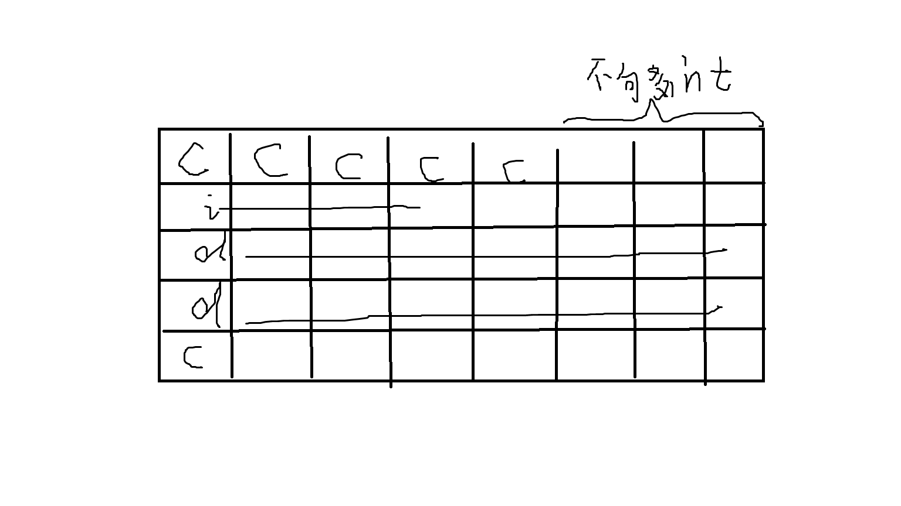

# <font color=green>C语言复习-基础部分</font>

<br>
<br>

---


# 目录

数据类型

变量、常量，存储类别

函数、指针、数组

结构体、共用体、枚举

----

<br>
<br>
<br>


# 一、数据类型

| 数据类型        | 大小（字节） | 范围                              |
|----------------|-----------|----------------------------------|
| `char`         | 1         | -128 到 127 或 0 到 255          |
| `unsigned char`| 1         | 0 到 255                          |
| `signed char`  | 1         | -128 到 127                       |
| `int`          | 4         | -2,147,483,648 到 2,147,483,647   |
| `unsigned int` | 4         | 0 到 4,294,967,295                |
| `short`        | 2         | -32,768 到 32,767                 |
| `unsigned short`| 2        | 0 到 65,535                       |
| `long`         | 4 或 8    | -2,147,483,648 到 2,147,483,647 或 -9,223,372,036,854,775,808 到 9,223,372,036,854,775,807 |
| `unsigned long`| 4 或 8    | 0 到 4,294,967,295 或 0 到 18,446,744,073,709,551,615 |
| `float`        | 4         | 约 ±3.4e−38 到 ±3.4e+38 的 6-7 位有效数字 |
| `double`       | 8         | 约 ±1.7e−308 到 ±1.7e+308 的 15-16 位有效数字 |
| `long double`  | 8 或 16   | 取决于实现                         |


## 1.1 浮点数精度问题

  想搞清楚浮点数精度问题，首先得知道C中浮点数的表示方法和十进制中小数部分转为二进制的过程。

  十进制的小数部分转为二进制的过程为：乘2取整，取整的部分为二进制的一位，剩下的部分再乘2取整，取整的部分为二进制的第二位，以此类推，直到小数部分为0。
  但是这样可能会遇到无限循环的情况，即小数部分永远不为0，计算机的内存是有限的，所以只能取一定的位数（float精度大概是6-7位十进制，double精度大概是15-16位十进制），这样就会损失精度。

  以float为例，float的表示方法为：`符号位 + 指数位 + 尾数位`，其中符号位为1位，指数位为8位，尾数位为23位。
>例如，将十进制数 5.75 转换为浮点表示：
它首先被转换为二进制形式：101.11
然后标准化为 1.xxxx 形式：1.0111 × 2²
接着，以 IEEE 754 格式编码：
符号位为 0，因为它是正数。
指数为 2，偏移后为 129（即 2 + 127），二进制表示为 10000001。
尾数为 0111，但要填充到 23 位，所以变为 01110000000000000000000。
最终，5.75 的 float 表示为 0 10000001 01110000000000000000000。

如果想解决此类问题，可以采取更高精度的数据类型，数据库的使用，定点表示法，预定误差等方法。


---

## 1.2 char与int的数字的关系

从技术层面来看，char是一个整型，只是它的大小是1个字节。里面存储的是对应的ASCII码。其中数字0-9对应的ASCII码是48-57，所以char类型的数字0-9对应的ASCII码是48-57，而不是0-9。（字母A-Z对应的ASCII码是65-90，a-z对应的ASCII码是97-122）

---

## 1.3 字符数组与字符串

字符数组与字符串的区别在于，字符数组中的元素可以是任意字符，而字符串中的元素必须是字符。

在C语言中，字符串是以空字符'\0'结尾的字符数组，所以字符串的长度比字符数组的长度少1。

```c
char str[] = "hello"; // 自动加上 '\0'

char arr[] = {'h', 'e', 'l', 'l', 'o'}; // 没有 '\0'，不是一个字符串，在打印这样的字符数组时，会出现乱码。所以要加上 '\0' 才是一个字符串。
```

用字符数组存储字符串时，一定要注意数组的长度，要比字符串的长度多1，即最后一个元素是'\0'。少了'\0'会出现打印或者安全检查的问题，因为计算机不知道字符串的结束位置，会一直往后读取，直到遇到'\0'为止。（越界操作）

---

## 1.4 位运算

嵌入式中，在对寄存器进行操作时，常常会用到位运算。

1. **位与（AND）`&`**：
   - 清除特定位：`x & ~0x10` 会清除 `x` 的第 5 位。
   - 检查位是否设置：`if (x & 0x01)` 检查 `x` 的最低位是否为 1。

2. **位或（OR）`|`**：
   - 设置特定位：`x | 0x10` 会设置 `x` 的第 5 位。
   - 合并位集合：用于将多个位模式组合在一起。

3. **位异或（XOR）`^`**：
   - 切换特定位：`x ^ 0x10` 会切换 `x` 的第 5 位。
   - 反转所有位：`x ^ 0xFF` 会反转 `x` 的所有位。

4. **位非（NOT）`~`**：
   - 取反所有位：`~x` 会将 `x` 中的 0 变为 1，1 变为 0。

5. **左移 `<<`**：
   - 向左移位：`x << 2` 将 `x` 中的所有位向左移动两位。
   - 常用于乘以 2 的幂。

6. **右移 `>>`**：
   - 向右移位：`x >> 2` 将 `x` 中的所有位向右移动两位。
   - 常用于除以 2 的幂。注意：右移的行为（算术或逻辑）可能依编译器和平台而异。

7. **位域操作**：
   - 结合掩码（mask）和移位来访问和修改特定的位域。


简单应用：
| 功能       | 示例 | 含义                              |
|----------------|-----------|----------------------------------|
| 清除特定位 | `x & ~0x10`或者`x&(~(1<<(5-1)))` | `x`的第 5 位清零 |
| 设置特定位 | ` x \| 0x10`或者`x^(1<<(5-1))`  | `x` 的第 5 位设置为 1 |
| 切换特定位 | `x ^ 0x10`或者`x^(1<<(5-1))`  | `x` 的第 5 位切换 |
| 检查特定位 | `x & 0x10`或者`x&(1<<(5-1))`  | 检查 `x` 的第 5 位是否为 1 |
| 反转所有位 | `x ^ 0xFF`或者`x^~0`  | 反转 `x` 的所有位 |


---

## 1.4 优先级

关于自增和自减，a++是先赋值再自增，++a是先自增再赋值。但是在实际应用中，应该减少使用自增和自减，

1. 当一个变量在表达式中同时出现多个自增或自减时，计算机可能不会按照我们的预期的顺序来计算。
2. 当一个变量出现在一个函数的参数中时，计算机也可能不会按照我们的预期的顺序来计算。


>注：逻辑表达式中，顺序是从左到右的，且&&的优先级高于||，所以a||b&&c等价于a||(b&&c)。

---

## 1.5 类型大小

判断类型的大小，可以用`sizeof()`函数或者strlen()函数。

`sizeof()`函数返回的是类型的大小`size_t size = sizeof(int);`，单位是字节，而strlen()函数返回的是字符串的长度(从1开始，不包括\0)，返回字符。

>注:size_t是一种数据类型，它是unsigned int的别名，用于存储内存中对象的大小。


---

## 1.6  代码存储

当c执行时，其数据和代码会存储到不同的地方。其中包括代码区，数据区，堆区，栈区等。

* 代码区

 这一区域存储的是程序的执行代码，通常为只读

 * 数据区

数据区通常分为数据段和BSS段

数据段：存放的是程序中已初始化的全局变量和静态变量以及常量（常量只读）
BSS段：存放的是程序中未初始化的全局变量和静态变量。（程序启动时自动初始化为0）

* 堆区

主要用于存放动态分配的内存块，比如`malloc` `calloc` `realloc` `new`等，这些内存需要程序员自己来释放。（指针也要NULL）

* 栈区

用于存放的是函数的参数值，返回地址和局部变量等，编译器自动分配释放

<br>
<br>


# 二、变量、常量，存储类别

## 2.1 常量

C语言中的常量分为以下几种：

1. 字面常量：整数常量、浮点数常量、字符常量、字符串常量
2. 枚举常量：枚举常量即在程序中定义的枚举类型的常量。
3. 符号常量：用#define预处理器来定义符号常量。或用const关键字来定义符号常量。
4. 指针常量：`int const *p=&a;`—-p的内容不能改,`int *const p=&a;`—-p的指向不能改

>注：
>1. 字符串常量容易与字符数组混淆，字符串常量是一个字符数组，但是字符数组不一定是字符串常量。字符串常量是只能读取，不能修改的，而字符数组是可以修改的。
>2. 字符串常量（如由 char* a = "hello"; 指向的）不应被修改。字符数组（如 char a[] = "hello"; 定义的）可以修改，但要注意不要越界。

### 2.2 变量

想要理解变量的存储类别，首先要理解作用域和生存期以及链接的概念。

>1. **作用域**：作用域是程序中定义的标识符所表示的区域。作用域决定了在程序中的哪些位置可以访问标识符。C语言中有三个作用域：块作用域（花括号）、函数作用域（局部作用域）、文件作用域（全局作用域）。
>2. **生存期**：生存期是程序执行过程中变量存在的时间。C语言中有三个生存期：自动存储期（如局部变量）、静态存储期（变量在整个运行期间一直存在），动态存储期（通常需要自动销毁，如动态分配内存）。
>3. **链接**：链接是指标识符在不同文件中的声明如何相互关联的。C语言中有三种链接：外部链接、内部链接、无链接。

在C语言中，变量的存储类别都有关键字来表示，如下表所示：

| 存储类别        | 关键字 | 作用域                              | 生存期 | 链接 |
|----------------|-----------|----------------------------------|--------|------|
| `auto`         | `auto`    | 块作用域（花括号）                  | 自动存储期 | 无链接 |
| `register`     | `register`| 块作用域（花括号）                  | 自动存储期 | 无链接 |
| `static`       | `static`  | 块作用域（花括号）                  | 静态存储期 | 无链接 |
| `static`       | `static`  | 文件作用域（全局作用域）             | 静态存储期 | 内部链接 |
| `extern`       | `extern`  | 文件作用域（全局作用域）             | 静态存储期 | 外部链接 |

解释：
   * auto：
用于定义局部变量，一般不用，因为默认就是auto。
   * register：
将变量存储在寄存器中可以优化性能，无法通过地址访问。而且现在一般不用，因为编译器会自动优化。
   * static：
用于定义局部变量，使变量在函数调用之间保持值，即使函数退出，变量的值也不会消失。
用于定义全局变量，使变量的作用域限制在声明它的文件内。
   * extern：
用于声明全局变量或函数，如果想在其它文件中使用全局变量或函数，在使用前用头文件中extern声明一下。现在的做法是，将全局变量和函数都放在头文件中，然后在需要的文件中包含头文件即可（不加extern）。但是要注意，在一些系统下，如果全局变量在头文件中定义，那么在其它文件中包含头文件时，全局变量会被重复定义，所以要在头文件中加上extern声明，这样就不会重复定义了。

>注：在c++中用extern "C"来声明c语言的函数和变量，这样可以在c++中调用c语言的函数和变量。


### 2.3 其它关键字

#### 2.3.1 define和typedef

1. define：用于定义符号常量，也可以用于定义宏。在预处理阶段即编译之前，会将define定义的符号常量或宏替换为对应的值。

```c
#define PI 3.14159
#define MAX(a, b) ((a) > (b) ? (a) : (b))
```

2. typedef：用于定义类型别名，可以用于定义结构体类型、枚举类型、指针类型、函数类型等。在编译时处理。

```c
typedef unsigned long ulong;
typedef struct {
    int x;
    int y;
} Point;
```

#### 2.3.2 volatile

volatile关键字用于告诉编译器，该变量可能会被意想不到地改变，所以编译器不要对该变量进行优化。这个关键字用于那些可能由程序外部以预料不到的方式改变的变量，比如硬件设备的状态、由中断处理程序修改的变量或者可能在多线程环境下被不同线程访问的变量。

```c
volatile int flag = 0;

void interrupt_handler() {
    flag = 1;
}

void main_loop() {
    while (flag == 0) {
        // 等待中断处理程序设置 flag
    }
    // 执行后续操作
}
```

#### 2.3.3 _Thread_local

在C语言中，_Thread_local 是`C11`标准引入的一个存储类别说明符，用于声明线程局部存储。它指示每个线程都有该变量的自己的独立实例。换句话说，每个线程都有该变量的副本，线程间的变量互不影响。\

```c
#include <stdio.h>
#include <threads.h>

_Thread_local int threadLocalVar = 0;

int threadFunction(void* arg) {
    threadLocalVar++;
    printf("Thread %d, threadLocalVar = %d\n", (int)(intptr_t)arg, threadLocalVar);
    return 0;
}

int main() {
    thrd_t thread1, thread2;
    thrd_create(&thread1, threadFunction, (void*)(intptr_t)1);
    thrd_create(&thread2, threadFunction, (void*)(intptr_t)2);

    thrd_join(thread1, NULL);
    thrd_join(thread2, NULL);

    return 0;
}
```

在这个例子中，threadLocalVar 是一个 _Thread_local 变量。即使两个线程执行相同的函数并修改这个变量，每个线程的 threadLocalVar 都是独立的，互不影响。


---

<br>
<br>


# 三、函数、指针、数组

## 3.1 指针与数组

指针与数组的关系：数组名是数组首元素的地址，指针变量存储的是地址，所以指针变量可以指向数组。一般趋近于数组名是指向数组首元素的指针。

>数组名arr和&arr的区别
>arr本身是指针，指向的是数组首地址，但是arr+1只是将数组偏移到下一个元素
>&arr也是指针，指向的是数组首地址，但是&arr+1是将数组偏移整个数组

```c
//对于一维数组
int arr[5] = {1,2,3,4,5};
int (*p)[5] = arr;   // 类型不对：arr 退化成 int*，不能直接赋给指向数组的指针
int (*q)[5] = &arr;  // 正确。p、q 每加 1，跳过整个 int[5]

printf("%p\n", (void *)arr);
printf("%p\n", (void *)(arr + 1));   // 跳过一个 int
printf("%p\n", (void *)(&arr + 1));  // 跳过整个数组
```

`*p` 降一维之后，偏移量从整个数组变成一个元素。`int a[]` 这种数组名是常量，不能对它做 `++`。

### 3.1.1 指针与数组关于字符串的区别
但是在字符数组代表字符串的情况下，字符数组代表的字符串是可以修改的，而指针指向的字符串是不能修改的。

```c
char str[] = "hello"; // 自动加上 '\0'，可修改
char *p = "hello"; // 自动加上 '\0'，不可修改
```

### 3.1.2 指针与数组关于sizeof的区别

1. sizeof(数组名)：数组名代表整个数组，所以sizeof(数组名)返回的是整个数组的大小，单位是字节。
2. sizeof(指针变量)：指针变量存储的是地址，所以sizeof(指针变量)返回的是指针变量的大小，单位是字节。

这点在函数中尤其重要，**因为数组作为函数参数时，会退化为指针**，所以在函数中无法通过sizeof(数组名)来获取数组的大小，而是要通过传入数组的长度来获取数组的大小。

```c
void func(int arr[]) {
    printf("%d\n", sizeof(arr)); // 8
}

int main() {
    int arr[10];
    printf("%d\n", sizeof(arr)); // 40
    func(arr);
    return 0;
}
```

### 3.1.3 指针与数组关于++的区别

1. 数组名++：数组名代表整个数组，所以数组名++是不合法的。
2. 指针变量++：指针变量存储的是地址，所以指针变量++是合法的。


### 3.1.4 指针与多维数组

指针与多维数组的关系：指针变量存储的是地址，多维数组的每个元素也是一个数组，所以指针变量可以指向多维数组。

```c

int arr[3][2][2]={
    {{1,2},{3,4}},
    {{5,6},{7,8}},
    {{9,10},{11,12}}
};

int (*p)[2][2] = arr; // 指向二维数组的指针
int (*q)[2] = arr[0]; // 指向一维数组的指针
int *r = arr[0][0]; // 指向元素的指针
// 即可以把arr[i][j][k]看成*(arr[i][j]+k),进一步可以拆成*(*(arr+i)+j)+k
```

>注意：
>>arr=&arr[0]----------------sizeof(arr)=12
>>arr[0]=*arr=&arr[0][0]---------------sizeof(*arr)=8
>>arr[0][0]=\*\*arr=&arr[0][0][0]----------------sizeof(**arr)=4
>
>上面三个的值都是数组首元素的地址，但是类型不同，因为数组的类型包含了数组的长度，所以类型不同。

### 3.1.5 指针数组与数组指针

1. 指针数组：数组中的元素是指针，指针数组的元素都是指针，指针数组的元素的类型是指针类型。
2. 数组指针：指针指向的是数组，数组指针指向的是数组，数组指针的类型是数组类型。

```c
int *p[3] = {arr[0],arr[1],arr[2]}; // 本质是数组。指针数组，数组中的元素是指针，指针数组的元素都是指针，指针数组的元素的类型是指针类型。可以有二级指针
int (*p)[3] = arr; // 本质是指针。数组指针，指针指向的是数组，数组指针指向的是数组，数组指针的类型是数组类型。
```
### 3.1.6 数组，指针与堆栈

&emsp;&emsp;用通常的定义数组和指针时，他们都是在栈上分配的空间，而栈的空间是有限的，所以数组和指针的大小也是有限且无法修改大小的。

&emsp;&emsp;但是在C语言中，可以通过malloc函数在堆上分配空间，这样就可以动态的分配空间，而且可以通过realloc函数来修改空间的大小。

>注意：
>1. malloc函数分配的空间是连续的，realloc函数修改空间的大小时，如果原来的空间后面有空间，那么会在原来的空间后面继续分配空间，如果原来的空间后面没有空间，那么会在原来的空间前面分配空间，然后将原来的空间的内容拷贝到新的空间中，然后释放原来的空间。(即无法保证原来的空间的地址不变)
>2. malloc函数返回的是void*类型的指针，所以要强制转换为对应的类型。
>3. malloc函数分配的空间不会自动释放，需要手动释放（free），否则会造成内存泄漏。

```c
int *p = (int *)malloc(sizeof(int) * 10); // 分配10个int类型的空间
p = (int *)realloc(p, sizeof(int) * 20);  // 修改空间的大小为20个int类型的空间
free(p); // 释放空间
```

## 3.2 指针与函数

### 3.2.1 函数返回指针

指针可以作为函数的参数和返回值。
* 指针作为函数的参数,本质是值传递，传递的是指针变量的值，即地址。形参和实参的指针变量不同但指向的是同一个地址。
* **函数的返回值是局部变量的地址是不合法的**（即把函数中的局部变量指针作为返回值），因为函数执行完毕后，局部变量就会被销毁，所以返回的地址就是无效的。

* 但是因为堆和全局变量的空间是在程序运行期间一直存在的，所以返回堆（malloc）或者全局变量的地址是合法的。

```c

int *func() {
    int a = 10;
    int *p = &a;
    return p; // 返回局部变量的地址是不合法的
}

int *func() {
    int *p = (int *)malloc(sizeof(int));
    return p; // 返回堆上分配的空间的地址是合法的
}

int *func() {
    static int a = 10;
    return &a; // 返回全局变量的地址是合法的
}
```

### 3.2.2 函数指针与回调函数

1. 函数指针：指向函数的指针，函数指针的类型是函数类型。

2. 回调函数：函数指针作为函数的参数，这个函数就是回调函数。

为什么要用回调函数？因为函数指针可以作为函数的参数，所以可以通过回调函数来实现函数的动态调用。（这就有点像面向对象中的多态）

下面是一个回调函数的例子：

```c
//冒泡排序

#include <stdio.h>

// 排序函数，主要是处理比较后两个数的排序问题
void bubble_sort(int *arr, int len, int (*compare)(int, int)) {
    int i, j, temp;
    for (i = 0; i < len - 1; i++) {
        for (j = 0; j < len - 1 - i; j++) {
            if (compare(arr[j], arr[j + 1])) {
                temp = arr[j];
                arr[j] = arr[j + 1];
                arr[j + 1] = temp;
            }
        }
    }
}

// 比较函数，用于比较两个数的大小
//这里的compare就是回调函数，通过修改compare函数，可以实现不同的排序方式
int compareMax(int a, int b) {
    return a > b;
}

int compareMin(int a, int b) {
    return a < b;
}


//这样在主函数中就可以通过选择用哪一个比较函数来实现不同的排序方式
int main() {
    int arr[] = {1, 3, 2, 5, 4};
    int len = sizeof(arr) / sizeof(arr[0]);
    bubble_sort(arr, len, compareMax);
    for (int i = 0; i < len; i++) {
        printf("%d ", arr[i]);
    }
    printf("\n");
    return 0;
}
```

>补充：tyoedef可以用来定义函数类型，这样就可以用函数类型来定义函数指针了。

```c
typedef int (*compare_func)(int, int);
//这样就可以用    compare_func(函数指针类型) cmopare（函数指针名）    来定义函数指针了

int (*compare_func)(int, int);
//这样是直接定义了一个叫compare_func函数指针


typedef int arr[10];
arr a;
//数组也是可以用typedef来定义的
```

---

<br>
<br>

# 四、结构体、共用体、枚举

## 4.1 结构体

结构体是一种自定义的数据类型，可以包含多个不同类型的成员，这些成员可以是基本类型，也可以是自定义的数据类型。

### 4.1.1结构体基础

```c
#include <stdio.h>
#include <string.h>

// 定义结构体 Person
typedef struct {
    char name[50]; // 结构体成员：名字
    int age;       // 结构体成员：年龄
    float height;  // 结构体成员：身高
} Person;

// 函数声明：打印 Person 信息
void printPersonInfo(Person p);

int main() {
    // 初始化结构体实例
    Person person1 = {"Alice", 30, 5.5}; // 直接初始化
    Person person2;                      // 后续赋值
    strcpy(person2.name, "Bob");         // 字符串赋值使用 strcpy
    person2.age = 40;
    person2.height = 6.0;

    //结构体指针
    Person *p = &person1;
    printf("%s\n", p->name); // 通过指针访问结构体成员，使用 ->
    printf("%s\n", (*p).name); // 通过结构体变量访问结构体成员，使用 .
    printf("%s\n", person1.name); // 通过结构体变量访问结构体成员，使用 .

    // 使用结构体
    printPersonInfo(person1); // 将结构体作为参数传递给函数
    printPersonInfo(person2);

    return 0;
}

// 函数定义：打印 Person 信息
void printPersonInfo(Person p) {
    printf("Name: %s, Age: %d, Height: %.2f\n", p.name, p.age, p.height);
}

```

### 4.2 结构体大小

想要知道结构体的大小，是通过结构体字节对齐的方式来计算的。

结构体字节对齐的方式：
简单说就是，结构体的成员按照定义的顺序依次存放，但是每个成员的起始位置必须是该成员大小的整数倍，如果不是，那么编译器会在成员之间加上填充字节，使得成员的起始位置是该成员大小的整数倍。


1. 找到最大的成员的大小，按照该大小的整数倍进行划分。
2. 结构体中最大的成员的大小如果超过了计算机的字长，那么以该字长为准，即该成员的起始位置必须是该字长的整数倍。（如32位系统的最大字长是4字节(char*,double,long)，64位系统的最大字长是8字节((char*,double,long)),其他字长是一样的）
3. 将里面的成员按照顺序依次存放，如果成员存储完后发现超过了最大大小跑到了下一行，则将该成员存到下一行的起始位置。并且在上一行的最后一个成员后面加上填充字节。
4. 数组的大小分成每个成员计算。

```c
//32位系统

struct A {
    char a[5]; // 5
    int b; // 4，因为5+4=9>8，所以下一行
    double c[2] // 最大的成员是8，所以按照8的整数倍划分，8+8=16
    char d; // 1,后面不够最大整数倍，所以要补齐7个字节
}; // 40

```



> 注：如果想要将函数中的结构体作为返回值，那么用malloc函数在堆上分配空间，然后返回指针即可。


## 4.2 联合体

联合体是C语言中的一个数据类型，允许在相同的内存位置存储不同的数据类型。联合体的所有成员共享同一块内存空间。

联合体的大小是其最大成员的大小。每次只能存储一个成员，对一个成员的赋值会覆盖其它成员的值。

```c

union Data {
    int i;
    float f;
    char str[20];
};

```

### 4.3 枚举

枚举是C语言中的一种数据类型，用于定义变量，每个变量都可以赋予一个特定的值，这些值必须是整数，而且是不同的。每个变量的大小大概率是int类型的大小。通常用于定义状态码。

```c
//默认情况下，第一个枚举值的值为0，后续枚举值的值依次加1
enum StatusCode {
    OK = 200,
    NOT_FOUND = 404,
    SERVER_ERROR = 500
};

enum StatusCode status = OK;

if(status == NOT_FOUND) {
    // do something
}
```

---

## 附录：零散问答（整理自旧笔记）

<br>
<br>

---


1. char在arm-linux-gcc为unsigned char，而在x86为signed char
2. c语言输入函数scanf要求输入的内容要与scanf函数的参数一致
3. sizeof()是一个运算符，不是函数
4. 一个算法得有零个或多个输入，一个或多个输出，有穷性，确定性，可行性
5. 在结构体的最后一个成员后面加入char data[0]，不占用结构体的空间，但是在需要的时候可以动态的分配空间
6. a=1,b=2 则 a|b=3 (按位或)
7. 结构体只在定义的时候才分配内存，定义后的结构体变量才有实际的内存空间
8. 当需要访问的数组较大时，系统会按行的顺序分配内存，所以访问数组元素时，按行访问会比较快，按列访问会比较慢
9. c语言中外部变量和局部变量同名时，局部变量优先。但在c++中，外部变量和局部变量同名时，可以通过::来访问外部变量
10. 在函数的形参中a[]会退化成指针，和*a是等价的
11. 在free()之后，指针的值不会变，但指针变成了野指针，任何对野指针的操作都是不安全的
12. 在C++中，成员函数可以返回一个值。有时候，如果你不希望这个返回值被修改，你可以将返回值声明为 const 类型。这样做的原因是，返回一个 const 值意味着该值不能被修改，从而保护数据的完整性。
13. 全局变量在声明时已经分配了内存，局部变量在函数调用时才分配内存
14. return *this返回的是当前对象的克隆或者本身，return this返回当前对象的地址
15. p为指针变量，p=NULL和p=0,p='\0'是等价的
16. for中第一个参数是初始化，第二个参数是条件，第三个参数是增量，第一个参数只在for循环开始时执行一次
17. 类的所有成员共享一个静态成员。静态类数据成员必须在类的内部声明，在类的外部初始化。在访问静态成员时，可以通过对象访问，也可以通过类访问。通过this指针访问的数据成员和方法成员都必须是类的非静态成员。
18. scanf不能指定输入精度，可以指定长度
19. 函数参数的入栈顺序是从右到左，但栈的入栈方向是从高地址到低地址，即栈的顶部是低地址，栈的底部是高地址。最右边的参数在栈中的地址最高
20. 只能使用成员函数重载的运算符有：=、()、[]、->、new、delete。其他运算符能通过成员函数或友元函数重载
21. c中实数常数的科学表示法格式为：实数部分（实数）`E`指数部分（整数）,且不能忽略
22. #include命令的功能是在命令处插入一个文本文件（.h和.txt的编码方式是一样的）
23. 在fork外面进行循环时，进程会以2的n次方的速度增长
24. c语言中最简单的类型是整型，浮点型和字符型
25. 预处理的作用是在编译之前对源程序进行处理，包括宏定义，文件包含，条件编译等
26. 逗号表达式会计算所有表达式的值，但只返回最后一个表达式的值
27. printf函数的表达式中是从右向左计算的，且计算完后才会输出
