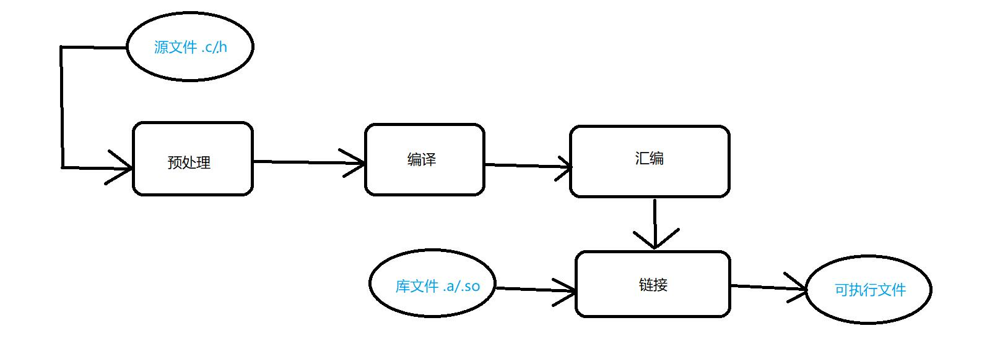

# [C语言] 静态库与动态库
---

## 一、前言

c语言程序编译的步骤（源文件到可执行文件的编译）：

>预处理 -> 编译 -> 汇编 -> 链接


预处理：是使用预编译器cpp进行处理.c源文件和.h头文件，最终生成一个.i的文件。
```tex
gcc -E hello.c -o hello.i
或
cpp hello.c > hello.i
```
编译：是将`预处理`完的文件进行一系列的词法分析、语法分析、语义分析及优化，最后生成 .s 汇编代码文件。
```tex 
gcc -S hello.i -o hello.s
```
汇编：将汇编代码转变成机器可以执行的指令， 每一条汇编代码几乎都对应着一条机器指令。
```tex
gcc -c hello.s -o hello.o 或者 as hello.s -o hello.o
```

链接把目标文件和库合成可执行文件。`printf` 来自 C 库：静态链接会把用到的目标代码收进可执行文件，动态链接只记下库的名字，运行时再加载 `.so`。现在的桌面 Linux 默认是动态链接 glibc。

```text
ar rcs libxxx.a a.o b.o          静态库
gcc main.c -L. -lxxx
gcc -shared -fPIC -o libxxx.so a.o b.o
gcc main.c -L. -lxxx             动态库，运行时还要能找到 .so
```

`gcc -c` 得到的是目标文件，还不能直接运行。预处理、编译、汇编可以分步看，日常一条 `gcc main.c -o main` 会把四步都做完。



<br>
<br>

---

## 二、静态库与动态库概念

### 2.1 C头文件的编译
对于<>文件，gcc会在系统预设包含文件目录(如/usr/include)中搜寻相应的文件
>  cpp-v：查看默认搜索头文件路径
对于""文件，gcc会首先当前目录中搜寻头文件，如没有则需要在编译选项中使用`-I 头文件所在目录` 到指定的目录下寻找头文件

### 2.2 库的概念

* 库函数：由某些组织或机构提供的，应用程序员可以直接调用。如Printf等

* 库：若干个函数的可执行代码，打包为库文件，提供了系统调用和c库的基本函数。

* 静态库：把需要的.c文件做出一个.a库文件，gcc编译时直接编译进可执行文件中。就只需要链接这个库文件。会让可执行文件变大。而且如果库文件更新了，可执行文件就需要重新编译

* 动态库：把需要的.c文件做出一个.so库文件，动态库中的代码是可执行文件在运行中加载执行的，gcc编译时不会编译进可执行的文件中。而是留好了记号，库文件更新了，可执行文件不用重新编译。


<br>
<br>

---

## 三、静态库和动态库的使用

### 3.1 静态库
 
* 生成静态库：
>1. 把库函数所属的.c文件编译成.o文件
>2. 用ar命令归档，生成文件libmyc.a。`ar -rc <生成的档案文件名> <.o文件名列表>`(一般取名是  `lib+名字+.a`)
* 使用静态库
假设头文件在includes目录中，生成的libmymath.a库在libs中
>1. 编译头文件：`gcc -c main.c -I ./includes`
>2. 链接静态库：`gcc main.o -o main -L ./libs -lmymath` (链接库的名字时只需要`-l+名字`，不用加前面的lib)

* 用makefile实现
```sh
ALL := main                          # := 是递归赋值，即使变量已经被赋值了还能赋值
CC := gcc
CFLAGS := -Wall -g -I ./includes/    #wall：显示所有警告信息 -g：编译时生成调试信息 “-I ./includes/”表示将当前目录下的“includes”文件夹添加到头文件搜索路径中
LDFLAGS := -L ./libs -lmamath        #-L ./libs -lymamath”。其中，“-L ./libs”表示将当前目录下的“libs”文件夹添加到链接库搜索路径中，“-lymamath”表示链接名为“libymamath.so”的库文件。
SRC := $(wildcard *.c)               #用“wildcard”函获取当前目录下的所有.c文件
OBJ := $(patsubst %.c, %.o , $(SRC)) #用“patsubst”函数将变量SRC中的每个文件名中的“.c”替换为“.o”
$(ALL) : $(OBJ)
    $(CC) -o $@ $^ $(LDFLAGS)        #$@”表示规则的目标文件，“$^”表示规则的所有依赖文件。
%.o : %.c
    $(CC) -c $< $(CFLAGS)            #编译所有的C源文件，生成对应的目标文件,其中$<表示的是第一个依赖文件，也就是当前正在被编译的c源文件
clean:
    rm main *.o


```
### 3.2 动态库

* 动态库的封装

>对要封装的.c文件（假设是mymath.c）使用指令：`gcc -o libmymath.so -shared -fPIC mymath.c`

* 动态库的使用

>编译：和静态库差不多，编译头文件：`gcc -c main.c -I ./includes`
再编译动态库：`gcc main.o  -o main -L ./libs -lmymath`(记得去掉打头的lib和结尾的.so)
>运行：先把编译的库的目录加入到环境变量中（设库目录是./libs）：`export LD_LIBRARY_PATH=$LD_LIBRARY_PATH:./libs`(将./libs追加到环境变量的后面)。再启动执行文件
