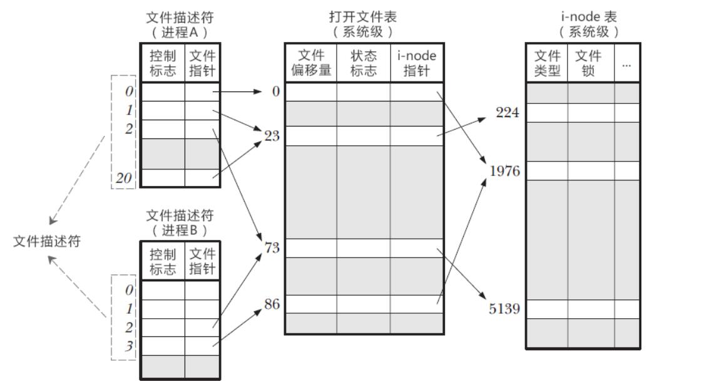

# [Linux] 文件与系统 IO

标准 I/O 是 C 库（`fopen`、`fread`）包在系统调用外面的一层，自己有用户空间缓冲区。文件 I/O（`open`、`read`、`write`）是系统调用，没有这层用户空间缓冲，但数据通常仍会进内核的页缓存，除非打开时加了 `O_DIRECT`。`fopen` 也能打开 `/dev` 下的设备，只是缓冲会让终端、串口这类设备的读写时机和你想的不一样。

文件描述符是进程文件描述符表里的下标，不是“最多只能到 1023”。0、1、2 在程序启动后通常是标准输入、输出和错误；新打开的描述符是当前最小的空闲编号，不一定是 3。`RLIMIT_NOFILE` 决定一个进程最多能开多少个，默认常见是 1024，可以用 `ulimit -n` 查看和调整。

每个进程有一张文件描述符表。表项指向系统级的打开文件描述（里面有偏移量、打开标志），打开文件描述再指向 inode。所以 `fork` 之后父子会共享同一个打开文件描述，写文件时偏移是一起往后走的；两个进程分别 `open` 同一个路径，则各有各的偏移。

标准流有三种缓冲：磁盘文件一般是全缓冲，终端上的 `stdout` 一般是行缓冲，`stderr` 没有缓冲。程序正常结束时会冲洗标准 I/O 的缓冲区。`gets` 不检查长度，C11 已经把它从标准里删掉，读一行用 `fgets`。

## 一、IO概念

### 1. 标准IO和文件IO的区别：


>1. 标准IO是c库函数，文件IO是系统调用接口
>2. 标准IO自带缓冲区，文件IO没有缓冲
>3. 标准IO是文件IO的基础上封装出来的API接口


|                  | 文件io                          | 标准io                              |
| ---------------- | ------------------------------- | ----------------------------------- |
| 缓冲             | 无                              | 有                                  |
| 高低级           | linux系统io、低级io             | 高级io                              |
| 操作对象         | 文件描述符                      | 流                                  |
| 能否打开设备文件 | 可以                            | 可以，但缓冲可能让设备读写时机不符合预期 |
| API              | open，close，read，write，lseek | fopen，fclose，fread，fwrite，fseek |

### 2. 缓冲区：
&emsp;&emsp;缓冲区是内存空间的一部分，在内存中预留了一定的存储空间，用来暂时保存输入和输出等I/O操作的一些数据，这些预留的空间就叫做缓冲区。缓冲区是为了减少cpu对磁盘的读写次数，从内存（即缓冲区）中读取数据来加快运行速度

1. 全缓冲：当缓冲区满了或者特定的情况下才会刷新，最经典的是对磁盘文件的读写

2. 行缓冲：当缓冲区中有了换行\n就会刷新，经典的有标准输入（stdin）输出（stdout）流

3. 无缓冲：任何东西进入缓冲区马上被刷新走，经典的有标准错误输出流（stderr）

默认：程序结束会刷新缓冲区

### 3. 流
&emsp;&emsp;在C语言中，将在不同的输入/输出设备之间进行传递的数据抽象为“流”。C中有三种标准流：标准输入流`stdin`，标准输出流`stdout`，标准错误流`stderr`
&emsp;&emsp;流实际上就是一个字节序列，输入函数的字节序列被称为输入流，输出函数的字节序列称为输出流。
&emsp;&emsp;根据数据形式，输入输出流可以分为`文本流`（字符流）和`二进制流`。
>文本流和二进制流：
>
>* 文本文件：（又称ASCII文件）该文件中一个字符占用一个字节，存储单元中存放单个字符对应的ASCII 码。在文本流中输入输出的数据是字符或字符串，可以被修改；
>* 二进制文件：按内存中的字节原样存放。文本和二进制都能改，差别是要不要做换行转换、会不会把 `0x0A` 当成一行的结束。Linux 上这两类流通常不做转换。

### 4. 文件
&emsp;&emsp;C语言使用的文件系统为：`缓冲文件系统`（标准I/O）和`非缓冲文件系统`（系统I/O）。其中ANSIC标准采用“缓冲文件系统”处理文件。

&emsp;&emsp;文件指针：
在C语言中，所有文件操作必须依靠指针完成，通常用fopen（）为文件变量进行赋值。标准输入输出流，标准错误流都是文件指针类型的，可以给文件指针变量进行赋值。
>FILE *变量名
### 5. 文件描述符
&emsp;&emsp;文件描述符：就是内核为了高效管理已被打开的文件所创的索引，是一个非负整数（通常为0-1023），所有执行I/O操作的系统调用都是通过文件描述符来实现。并规定系统刚启动时0是标准输入，1是标准输出，2是标准错误。如果打开新的文件，那么它的文件描述符会是3。<font color=blue>简单理解文件描述符就是一个数值的下标，下标的内容就是指向打开文件的指针。</font>
<br>
&emsp;&emsp;实际上关于文件描述符，Linux内核维护了3个数据结构： 

* 进程级的文件描述符表
* 系统级的打开文件描述符表
* 文件系统的i-node表

#### 5.1 进程级的文件描述表

&emsp;&emsp;一个Linux进程启动后，会在内核空间创建一个PCB控制块（PCB是进程控制块的缩写，包含了如进程的状态、程序计数器、堆栈指针、打开的文件列表、进程优先级等。主要用于进程之间切换时，对该进程的PCB进行保存和恢复状态），PCB内部有个 记录当前进程所有可用的文件描述符 的文件描述符表，除了这张表，系统还要维护另外两张表：打开文件描述表和i-node表

#### 5.2 系统级的打开文件描述表
* 当前文件的偏移量
* 打开文件时的标识（open()里的flags参数）
* 文件的访问模式（mode）
* 与信号驱动相关的设置
* 对该文件i-node对象的引用，即i-node指针

#### 5.3 文件系统的i-node表
* 文件类型（例如：常规文件，套接字或FIFO）和访问权限
* 一个指针，指向该文件所持有的锁链表（即对文件的锁定）
* 文件的各种属性，包括文件大小以及与不同类型操作相关的时间戳

<br>

这三个表之间的关系如下图：

* 在进程 A 中，文件描述符 1 和 20 都指向了同一个打开文件表项，标号为 23（指向了打开文件表中下标为 23 的数组元素），这可能是通过调用 dup()、dup2()、fcntl() 或者对同一个文件多次调用了 open() 函数形成的。
* 进程 A 的文件描述符 2 和进程 B 的文件描述符 2 都指向了同一个文件，这可能是在调用 fork() 后出现的（即进程 A、B 是父子进程关系），或者是不同的进程独自去调用 open() 函数打开了同一个文件，此时进程内部的描述符正好分配到与其他进程打开该文件的描述符一样。
* 进程 A 的描述符 0 和进程 B 的描述符 3 分别指向不同的打开文件表项，但这些表项均指向 i-node 表的同一个条目（标号为 1976）；换言之，它们指向了同一个文件。发生这种情况是因为每个进程各自对同一个文件发起了 open() 调用。同一个进程两次打开同一个文件，也会发生类似情况。 
**这就说明：同一个进程的不同文件描述符可以指向同一个文件；不同进程可以拥有相同的文件描述符；不同进程的同一个文件描述符可以指向不同的文件（一般也是这样，除了 0、1、2 这三个特殊的文件）；不同进程的不同文件描述符也可以指向同一个文件。**
<br>
<br>

 ---

## 二、I/O函数

### 1. 更改缓冲区类型：setvbuf

```tex
int setvbuf(FILE *stream, char *buf, int mode, size_t size);
功能：可以更改缓冲区类型（缓冲区可以人为指定）
头文件：不需要特定头文件
返回值：成功返回0，失败返回非0
stream：流，表示要更改缓冲类型的流
buf：缓冲区地址 填NULL就是系统默认缓冲区
mode：要改成的缓冲区类型
	_IONBF：无缓冲
	_IOLBF：行缓冲
	_IOFBF：全缓冲
size：要更改buf的大小（单位字节）填BUFSIZ的话就是系统默认缓冲区大小
```

错误perror、errno、stderr

```tex
errno：错误号，用于内核调用完函数后设置调用结果的编号，int型
perror：输出对应错误号的信息
stderr：标准出错流 -- 无缓冲，通常结合fprintf使用
```

标准流：

```tex
标准输入流：stdin -- 0
标准输出流：stdout -- 1
标准出错流：stderr -- 2

每打开一个终端，都会默认打开这三个流
```

### 2. 刷新流的缓冲区：fflush

```tex
int fflush(FILE *stream);
功能：强制刷新一个流（Linux下不能刷新stdin）
头文件：#include <stdio.h>
返回值：成功返回0，失败返回EOF
stream：要刷新的流
```

### 3. 打开文件/流：open,fopen 
```tex
int open(const char *pathname, int flags);
int open(const char* pathname,int flags,mode_t mode);
功能：open是c标准库之外的系统调用函数。用来打开一个文件
头文件：#include <sys/types.h> #include <sys/stat.h> #include <fcntl.h>
返回值：成功返回文件描述符。失败返回
pathname：要打开的文件名（包含路径）
flags:指定文件的打开/创建模式：
	O_RDONLY(只读) 
	O_WRONLY(只写) 
	O_RDWR (读写)
这些是常用的且必选一，还有其它选用的参数，中间用|结合  
	O_CREAT：如果该文件不存在，就创建一个新的文件，并用第三的参数为其设置权限。
    O_EXCL：如果使用O_CREAT时文件存在，则可返回错误消息。这一参数可测试文件是否存在。
    O_NOCTTY：使用本参数时，如文件为终端，那么终端不可以作为调用open()系统调用的那个进程的控制终端
    O_APPEND：以添加方式打开文件，所以对文件的写操作都在文件的末尾进行。
    O_TRUNC：如文件已经存在，那么打开文件时先删除文件中原有数据。（截断式打开：如果文件有内容，先清空文件内容，再打开）
mode：指定文件的访问权限，是由（-rw-r--r--）之类的组成的参数值（0644）
```
```tex
FILE *fopen(const char *pathname, const char *mode);
功能：让内核打开一个文件并且标记它
头文件：#include <stdio.h>
返回值：成功返回流指针，失败返回NULL
pathname：要打开的文件名（包含路径）
mode：打开文件的方式（只读、只写...）
	“r”：只读方式打开文件，文件必须存在
	“w”：只写方式打开文件，如果文件存在则清空文件，如果文件不存在则创建文件
	“a”：以追加方式打开文件，如果文件不存在则创建文件
	“r+”：读写方式打开文件，文件必须存在
	“w+”：读写方式打开文件，如果文件存在则清空文件，如果文件不存在则创建文件
	“a+”：读写方式打开文件，如果文件不存在则创建文件，并在文件末尾写入数据
	(注意：a+在追加时会从文件末尾另起一行再加，想要在末尾加就用fseek偏移后用fputs)
注：如果操作二进制文件，那么打开文件时的方式可以加上b(如r+b, wb等)，但是Linux下不区分二进制流和文本流
```
#### open()和fopen()区别
 `open()` 和 `fopen()` 都是用于打开文件的函数，但是它们有以下几个主要的区别：

>1. **语法不同**：`open()` 是一个系统调用，使用 C 语言的语法，而 `fopen()` 是一个标准 C 库函数，使用 C 标准库的语法。
>2. **返回值不同**：`open()` 的返回值是一个文件描述符，而 `fopen()` 的返回值是一个文件指针。
>3. **文件模式不同**：`open()` 可以打开任何类型的文件，包括设备文件和管道等，而 `fopen()` 只能打开普通文件。此外，`open()` 可以指定文件的打开模式，如只读、只写、读写等，而 `fopen()` 只能指定文件的访问模式，如只读、只写、读写等。
>4. **缓冲不同**：`fopen()` 打开文件时会创建一个缓冲区，用于提高读写效率，而 `open()` 不会创建缓冲区。
>5. 如果需要打开普通文件并使用标准 C 库函数进行读写操作，应该使用 `fopen()` 函数；如果需要打开设备文件、管道等非普通文件，或者需要更细粒度的文件访问控制，应该使用 `open()` 系统调用函数。

### 4. 关闭文件/流：close和fclose
```tex
int close(int fd)
功能：关闭文件描述符，但不删除文件（删除用unlink()）
头文件：#include <unistd.h>
返回值：成功返回0，失败返回EOF
fd：要关闭的文件标识符
```
```tex
int fclose(FILE *stream)
功能：关闭已经打开的流,防止文件损坏
头文件：#include <stdio.h>
返回值：成功返回0，失败返回EOF
stream：要关闭的流
```
#### close()和fclose()区别
>1. **关闭文件不同**：close关闭open打开的文件，fclose关闭fopen打开的文件。
>2. **缓冲不同**：close不会刷新缓冲区，fclose会刷新缓冲区

### 5，文件/流偏移：lseek和fseek
```tex
off_t lseek(int fd, off_t offset, int whence);
功能：用于在打开的文件描述符中设置文件偏移量。文件偏移量是文件中下一个读取或写入操作的位置。
头文件：#include <unistd.h>
返回值：成功返回off_t整型(头文件是<sys/types.h>)新的文件偏移量，如果出错则返回-1。
fd：文件描述符，
offset：偏移量，
whence：基准位置。可以取下面的值
	- `SEEK_SET`：相对位置从文件开头开始计算。
	- `SEEK_CUR`：相对位置从当前位置开始计算。
	- `SEEK_END`：相对位置从文件结尾开始计算。
```

```tex
int fseek(FILE *stream, long offset, int whence);
功能：用于设置文件指针的位置
头文件：#include <stdio.h>
返回值：成功返回0，失败返回非0
stream：指向要设置位置的文件的指针
offset：是要设置的相对位置
whence：是指定相对位置的起始点。可以取下面的值
	- `SEEK_SET`：相对位置从文件开头开始计算。
	- `SEEK_CUR`：相对位置从当前位置开始计算。
	- `SEEK_END`：相对位置从文件结尾开始计算。
```

#### lseek()和fseek()区别
>1. **操作文件不同**：lseek操作open打开的文件流，fseek操作fopen打开的文件描述符。
>2. **缓冲不同**：lseek不会刷新缓冲区，fseek会刷新缓冲区

### 6. 读写文件/流：

### 6.1 按字符读：getc，fgetc

```tex
int getc(FILE *stream);
功能：从文件里面读取一个字符
头文件：#include <stdio.h>
返回值：成功返回读到的字符，失败返回EOF
stream：要读的流
```
```tex
int fgetc(FILE *stream);
功能：从流里面读取一个字符
头文件：#include <stdio.h>
返回值：成功返回读到的字符(int)，失败返回EOF
stream：要读的流
```
两者功能等价，但getc()函数的参数可以是任何类型的文件指针，包括标准输入、标准输出和标准错误，或者是文件描述符。而fgetc()函数的参数必须是一个指向文件的指针。

### 6.2 按字符写：putc，fputc
```tex
int putc(int c, FILE *stream);
功能：往文件里面写一个字符
头文件：#include <stdio.h>
返回值：成功返回写入的字符，失败返回EOF
c：要写的字符
stream：要写入的流
```
```tex
int fputc(int c, FILE *stream);
功能：往流里面写一个字符
头文件：#include <stdio.h>
返回值：成功返回写入的字符，失败返回EOF
c：要写的字符
stream：要写入的流
```
两者完全等价，参数都能填文件指针或者文件描述符

### 6.3 按行读：gets，fgets
gets()函数可能会导致缓冲区溢出，不建议使用。
```tex
char *fgets(char *s, int size, FILE *stream);
功能：读取一行的内容
头文件：#include <stdio.h>
返回值：成功返回s的地址，失败返回NULL
s：要把内容读到哪里去（缓冲区）
size：预计要读的字节数，一般用sizeof()
stream：从哪个流读取

注：fgets是表示遇到了换行符才终止并且会把换行符存进去，如果size比一行的数据大，就读完所有内容。size如果比一行数据小，只读size-1个，追加一个'\0'，表示没读完。(即后面一定会加'\0'，在遇到文件末尾时才会'\n',再加'\0'。在可以在'\0'前面是否有'\n'来判断一行是否读取完。)
注2：fgets时当一行的大小大于了size-1时，将文件指针停在下一个数据而不是下一行，下次读取时会继续读取这一行的剩余部分直到遇到换行符或者大小超过size-1。
```
**<font color=red>注意：sizeof(str)是指的str的有效长度，即整个长度-1。设char str[6],那么sizeof(str)为5。</font>**

### 6.4 按行写：puts,fputs
```tex
int puts(const char *str);
功能：将一个字符串输出到标准输出流。
头文件：#include <stdio.h>
返回值：成功返回非负数，失败返回EOF
s：要写入的内容所在的缓冲区
```
```tex
int fputs(const char *s, FILE *stream);
功能：往一个流里面写一行数据
头文件：#include <stdio.h>
返回值：成功返回非负数，失败返回EOF
s：要写入的内容所在的缓冲区
stream：要写入的流
```
puts会在字符串输出后自动添加一个换行，fputs不会添加

### 6.5 按对象读：read，fread
```tex
size_t read(int fd, void *buf, size_t count);
功能：从文件描述符中读取数据的系统调用
头文件：#include <unistd.h>
返回值：读取到的字节数，如果读取到文件末尾则返回0，错误返回EOF
fd：文件描述符
buf：要存放读出数据的缓冲区
count：要读取的字节数
```
```tex
size_t fread(void *ptr, size_t size, size_t nmemb, FILE *stream);
功能：从流里面读取内容，内容分了组（对象）
头文件：#include <stdio.h>
返回值：成功返回实际读到的对象个数，失败返回EOF
ptr：要把读到内容放在哪个缓冲区
size：每个对象的字节大小
nmemb：预计要读多少个对象
stream：要读的流

注：size * nmemb不能超过缓冲区(ptr)大小。通常用char数组作为缓冲区
```
#### read()和fread()区别

>read函数是系统调用，直接与操作系统交互，因此它的效率比fread函数高。但是，fread函数是标准库函数，具有更好的移植性和可移植性。在读取文本文件时，fread函数会自动进行字符集转换，而read函数则不会。
所以如果需要高效地读取二进制文件，可以使用read函数；如果需要读取文本文件或者需要移植性更好的代码，可以使用fread函数。
### 6.6 按对象写：write，fwrite
```tex
size_t write(int fd, const void *buf, size_t count);
功能：将数据从指定的缓冲区写入到文件描述符中
头文件：#include <unistd.h>
返回值：成功返回写入的字节数，如果错误返回EOF
fd：文件描述符
buf：要写入的数据所在的缓冲区
count：要写入的字节数
```
```tex
size_t fwrite(const void *ptr, size_t size, size_t nmemb,FILE *stream);
功能：把缓冲区的内容写入到流里面
头文件：#include <stdio.h>
返回值：成功返回实际写入的对象个数，失败返回EOF
ptr：要写入的数据所在的缓冲区
size：每个对象的字节大小
nmemb：预计要写入的对象个数
stream：要写入的流
```
#### write()和fwrite()区别

>* write 函数是系统调用函数，直接将数据写入到文件中，而 fwrite 函数是标准库函数，先将数据写入到缓冲区中，再由标准库将缓冲区中的数据写入到文件中。
>* write 函数的参数中需要指定文件描述符，而 fwrite 函数的参数中需要指定文件流。
>* write 函数的返回值是实际写入的字节数，而 fwrite 函数的返回值是实际写入的数据项个数。


### 7. 重定向

```tex
FILE *freopen(const char *pathname, const char *mode, FILE *stream);
功能：打开一个文件并且会产生一个流，stream所表示的流会被替代
头文件：#include <stdio.h>
返回值：成功返回流指针，失败返回NULL
pathname：要打开的文件
mode：打开文件的方式("w"之类的)
stream：要重定向的流
```
重定向例子：
```c
#include <stdio.h>

int main()
{
    FILE *fp;

    fp = freopen("output.txt", "w", stdout);

    printf("This will be written to output.txt\n");

    fclose(fp);

    return 0;
}

```
在这个例子中，freopen 函数将文件名为 output.txt 的文件与标准输出流 stdout 关联起来，打开方式为写入模式。然后，程序使用 printf 函数向 stdout 中写入一条消息，这条消息会被重定向写到 output.txt 文件中。最后，程序关闭文件指针 fp，结束程序。
**注意：freopen 函数只能用于重新定向标准输入输出流，不能用于其他类型的流**


### 8.查看文件权限stat
```tex
int stat(const char * file_name, struct stat *buf);
功能：stat()用来将参数file_name 所指的文件状态, 复制到参数buf 所指的结构中（查看文件权限）
头文件：#include<sys/stat.h>  #include<uninstd.h>
返回值：执行成功则返回0，失败返回-1，错误代码存于errno。
file_name：文件名
buf：文件状态存储区


struct stat {
    dev_t st_dev; //device 文件的设备编号
    ino_t st_ino; //inode 文件的i-node
    mode_t st_mode; //protection 文件的类型和存取的权限
    nlink_t st_nlink; //number of hard links 连到该文件的硬连接数目, 刚建立的文件值为1.
    uid_t st_uid; //user ID of owner 文件所有者的用户识别码 
    gid_t st_gid; //group ID of owner 文件所有者的组识别码 
    dev_t st_rdev; //device type 若此文件为装置设备文件, 则为其设备编号 
    off_t st_size; //total size, in bytes 文件大小, 以字节计算 
    unsigned long st_blksize; //blocksize for filesystem I/O 文件系统的I/O 缓冲区大小. 
    u nsigned long st_blocks; //number of blocks allocated 占用文件区块的个数, 每一区块大小为512 个字节. 
    time_t st_atime; //time of lastaccess 文件最近一次被存取或被执行的时间, 一般只有在用mknod、 utime、read、write 与tructate 时改变.
    time_t st_mtime; //time of last modification 文件最后一次被修改的时间, 一般只有在用mknod、 utime 和write 时才会改变
    time_t st_ctime; //time of last change i-node 最近一次被更改的时间, 此参数会在文件所有者、组、 权限被更改时更新 
}

其中st_mode是文件的类型和存取的权限，可以通过宏来判断文件的类型和权限，其值都有对应的宏定义。用到时自行查找。
```