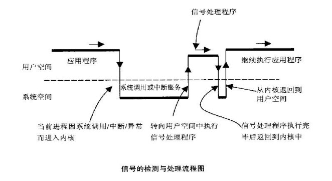
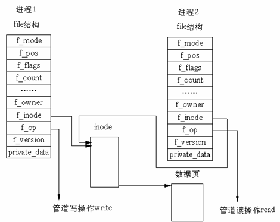
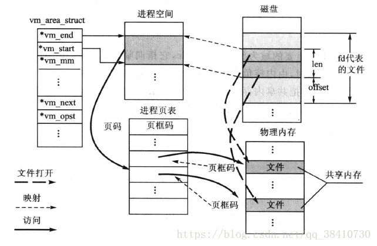
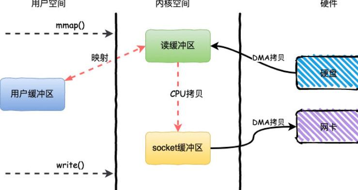
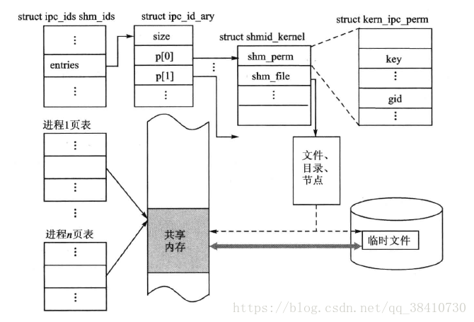
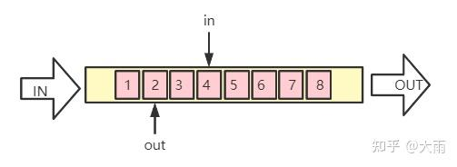
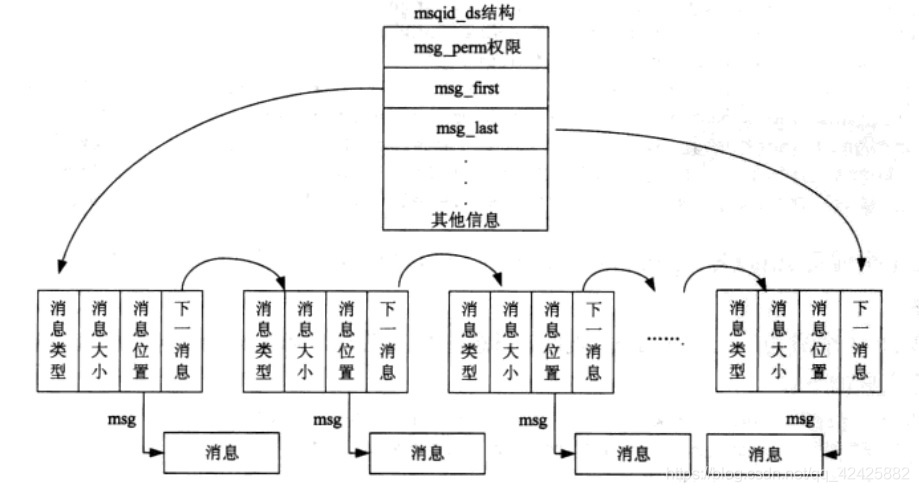
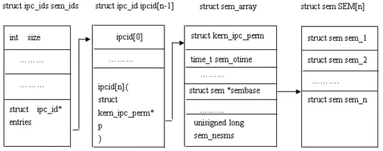
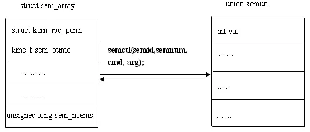

# [Linux] 进程与线程

## 一、基本概念

### 1. 进程和线程

* 程序：是一些二进制、数据的有序集合，没有被加载到内存。没有“生命”
* 进程：程序执行一次的过程。程序执行时资源分配的总称。Linux 是一个多道程序设计系统，因此系统中存在彼此相互独立的进程同时运行。
* 页表：
  &emsp;&emsp;在 Linux 中，每个进程都有自己的页表，用于映射虚拟地址到物理地址。页表是由一系列页表项（PTE）组成的数据结构，每个页表项对应着虚拟地址空间中的一个页面（通常是4KB），并描述了该页面的物理地址、访问权限等信息。
  &emsp;&emsp;Linux 中的页表采用了多级页表的结构，即每个页表项可以指向下一级的页表，最终指向物理页面。
  &emsp;&emsp;Linux 中的页表是按需分配的，即当进程需要访问某个虚拟地址时，如果该地址对应的页表项不存在，则会触发缺页异常，内核会根据需要分配新的物理页面，并更新页表项，使得虚拟地址能够正确映射到物理地址。
* 线程：线程是进程中的执行单元，它与进程共享同一个地址空间，因此线程之间可以直接共享数据。线程相对于进程来说更加轻量级。多个线程可以共享一个进程的以下资源(可执行的指令,静态数据,进程中打开的文件描述符,信号处理函数,当前工作目录用户ID,用户组ID)

### 2. 守护进程

&emsp;&emsp;守护进程没有控制终端，用户退出登录后它还在。传统做法是 `fork` 两次、调用 `setsid` 脱离终端。现在用 systemd 管理的服务不一定要自己双 `fork`，单元文件里把 `Type` 设对即可。每隔一分钟醒来看有没有任务的，是 `cron` 这一类计划任务，不是另一类内核进程。

### 3. 父进程与子进程
&emsp;&emsp;在 Linux 系统中，进程通过 `fork` 创建。调用 `fork` 的是父进程，新进程是子进程。内核先让两者看起来各有一份地址空间，但物理页要等到某一方写入时才复制，这叫写时复制（copy-on-write）。因此 `fork` 之后父进程修改变量，子进程看不到。

&emsp;&emsp;`fork` 前已经打开的文件，父子会共享同一个打开文件描述，偏移量是共用的。文件内容本身在磁盘上，两边都能看见对方写进去的数据。

&emsp;&emsp;区分父子看 `fork` 的返回值：父进程得到子进程的 pid（大于 0），子进程得到 0，失败返回 -1。子进程要知道自己的 pid，调用 `getpid`。`pid == 0` 只说明这段代码跑在子进程里，不是说子进程的 pid 是 0。

### 4. Linux进程间的通信
Linux 里常见的进程间通信有这些，下面列了七种，不是六种：
1. 信号 signal
2. 无名管道 pipe
3. 共享内存 shared memory
4. 先入先出队列（也叫有名管道） fifo
5. 消息队列 message queue
6. 套接字 socket
7. 信号量 semaphore

>同一套 IPC 对象用两个名字指代。`key` 是进程之间事先约定的外部名字，`ftok` 或直接写一个整数都能得到它。`msgget`、`shmget` 这些函数根据 key 找到或创建对象，再返回一个本机有效的标识符 id。之后的 `msgsnd`、`shmat` 用的是 id，不是 key。id 不是“只能在一个进程内部用”，拿到同一个 id 的进程可以通信。

<br>

#### 4.1 信号 signal

##### 4.1.1 信号的基本概念
&emsp;&emsp;信号是在软件层次对中断机制的一种模拟，是一种异步通信方式。信号可以直接进行用户空间进程和内核之间的交互，内核也能利用它来通知用户空间进程发生了哪些系统事件。

##### 4.1.2 信号的处理流程
&emsp;&emsp;操作系统给进程发送信号，本质上是给进程的task_struct（是 Linux 内核中的一个通过双向链表来组织的结构体，它代表了一个进程或线程）中写入数据，修改相应的task_struct字段(里面有进程 ID、进程状态、进程优先级、进程的父进程、进程的子进程等等)，然后进程在合适的时间(内核态发回用户态时)去处理所接受的信号。


例子说明：
>1. 假设用户启动一个交互式的前台进程，然后输入ctrl+c结束它，系统通过键盘产生一个硬件中断。
>2. cpu暂停用户空间的代码，cpu从用户态切换至内核态处理中断
>3. 系统驱动程序将ctlr+c解释为一个SIGINT信号，并将其记在该进程的task_struct中的信号位上；
>4. 当某时刻进程从内核态返回用户态继续执行之前，检查task_struct中的信号域，SIGINT信号的默认处理动作为终止进程，所以直接终止进程而不再返回到它的用户空间代码。

##### 4.1.3 常用的信号(前面是它的编号)
Linux 中可以通过`kill -l`查看信号表
```tex
1.  SIGHUP：   本信号在用户终端结束时发出，通常是在终端的控制进程结束时，通知同一会话期内的各个作业，这时他们与控制终端不在关联。比如，登录Linux时，系统会自动分配给登录用户一个控制终端，在这个终端运行的所有程序，包括前台和后台进程组，一般都属于同一个会话。当用户退出时，所有进程组都将收到该信号，这个信号的默认操作是终止进程。此外对于与终端脱离关系的守护进程，这个信号用于通知它重新读取配置文件。
2.  SIGINT：   程序终止信号。当用户按下CRTL+C时通知前台进程组终止进程。
3.  SIGQUIT：  Ctrl+\控制，进程收到该信号退出时会产生core文件，类似于程序错误信号。
4.  SIGILL：   执行了非法指令。通常是因为可执行文件本身出现错误，或者数据段、堆栈溢出时也有可能产生这个信号。
5.  SIGTRAP：  由断点指令或其他陷进指令产生，由调试器使用。
6.  SIGABRT：  调用abort函数产生，将会使程序非正常结束。
7.  SIGBUS：   非法地址。包括内存地址对齐出错。比如访问一个4个字长的整数，但其地址不是4的倍数。它与SIGSEGV的区别在于后者是由于对合法地址的非法访问触发。
8.  SIGFPE：   发生致命的算术运算错误。
9.  SIGKILL：  用来立即结束程序的运行。不能被捕捉、阻塞或忽略，只能执行默认动作。
10. SIGUSR1：  留给用户使用，用户可自定义。
11. SIGSEGV：  访问未分配给用户的内存区。或操作没有权限的区域。
12. SIGUSR2：  留给用户使用，用户可自定义。
13. SIGPIPE：  管道破裂信号。当对一个读进程已经运行结束的管道执行写操作时产生。
14. SIGALRM：  时钟定时信号。由alarm函数设定的时间终止时产生。
15. SIGTERM：  程序结束信号。shell使用kill产生该信号，当结束不了该进程，尝试使用SIGKILL信号。
16. SIGSTKFLT：堆栈错误。
17. SIGCHLD：  子进程结束，父进程会收到。如果子进程结束时父进程不等待或不处理该信号，子进程会变成僵尸进程。
18. SIGCONT：  让一个停止的进程继续执行。
19. SIGSTOP：  停止进程执行。不能被捕捉、阻塞或忽略，只能执行默认动作。
20. SIGTSTP：  停止终端交互运行，可以被忽略。按下Ctrl+z发出这个信号。
21. SIGTTIN：  当后台进程需要从终端接收数据时，所有进程会收到该信号，暂停执行。
22. SIGTTOU：  与SIGTTIN类似，在后台的进程向终端输出数据时产生。
23. SIGURG：   套接字上出现紧急情况时产生。向当前正在运行的进程发出些信号，报告有紧急数据到达，如网络带外数据到达。
24. SIGXCPU：  超过CPU时间资源限制时产生的信号。
25. SIGXFSZ：  当进程企图扩大文件以至于超过文件大小资源限制时产生。
26. SIGVTALRM：虚拟使用信号。计算的是进程占用CPU调用的时间。
27. SIGPROF：  包括进程使用CPU的时间以及系统调用的时间。
28. SIGWINCH： 窗口大小改变时。
29. SIGIO：    文件描述符准备就绪，表示可以进行输入输出操作。
30. SIGPWR：   电源失效信号，即关机。
31. SIGSYS：   非法的系统调用。
```

##### 4.1.4 信号的处理
信号的3种状态：
>未决：进程接收到信号，但是还没有处理它。这个信号会被添加到进程的信号掩码中，等待进程处理。
>阻塞：进程可以选择阻塞某些信号，这样当这些信号发送时，进程不会接收到它们。阻塞信号可以通过 sigprocmask() 函数设置。
>处理：当进程接收到一个信号时，它需要处理这个信号。处理信号的方式可以是执行一个信号处理函数，或者使用默认的信号处理方式。可以使用 signal() 函数或 sigaction() 函数来设置信号处理函数。

信号的5种默认处理动作
> Term	终止进程
> Ign	当前进程忽略此信号
> Core	终止进程，并生成一个Core文件
> Stop	暂停当前进程
> Cont	继续执行当前被暂停的进程

##### 4.1.5 信号集
信号集：顾名思义，就是信号的集合。在linux中，它的类型是`sigset_t`,大小是64bits。（Linux中一个只有64个信号）。在头文件`signal.h`提供了五个处理信号集的函数。

<br>

#### 4.2 无名管道 pipe

##### 4.2.1 pipe的基本概念
&emsp;&emsp;管道是一种最基本的IPC机制，作用于有血缘关系的进程之间，完成数据传递。调用pipe系统函数即可创建一个管道。有如下特质：

1. 其本质是一个伪文件(实为内核缓冲区)

2. 由两个文件描述符引用，一个表示读端，一个表示写端。

3. 规定数据从管道的写端流入管道，从读端流出。

管道的原理: 管道实为内核使用环形队列机制，借助内核缓冲区(4k)实现。

管道的局限性：
① 数据自己读不能自己写。
② 数据一旦被读走，便不在管道中存在，不可反复读取。
③ 由于管道采用半双工通信方式。因此，数据只能在一个方向上流动。
④ 只能在有公共祖先的进程间使用管道。
常见的通信方式有，单工通信、半双工通信、全双工通信。

##### 4.2.2 pipe的创建

&emsp;&emsp;管道两端可分别用描述符fd[0] 以及fd[1]来描述。需要注意的是，管道两端的任务是固定的，一端只能用于读，由描述符fd[0]表示，称其为管道读端，另一端只能用于写，由描述符fd[1]来表示，称其为管道写端。如果试图从管道写端读数据，或者向管道读端写数据都将导致出错。

&emsp;&emsp;管道是一种文件，因此对文件操作的I/O函数都可以用于管道，如read，write等。
##### 4.2.3 pipe的读写
&emsp;&emsp;如果某个进程要读取管道中的数据，那么该进程应当关闭fd[1]，向管道写数据的进程应当关闭fd[0]。因为管道只能用于具有亲缘关系的进程间的通信，在进行通信时，他们共享文件描述符。在使用前，应及时地关闭不需要的管道的另一端，以避免意外错误的发生。

&emsp;&emsp;进程在管道的读端读数据时，如果管道的写端不存在，则读进程认为已经读到了数据的末尾，读函数返回读出的字节数为0；管道的写端如果存在，且请求读取的字节数大于PIPE_BUF，则返回管道中现有的所有数据；如果请求的字节数不大于PIPE_BUF，则返回管道中现有的所有数据（此时，管道中数据量小于请求的数据量），或者返回请求的字节数（此时，管道中数据量大于等于请求的数据量）。
##### 4.2.4 pipe的实现细节
在 Linux 中，管道的实现并没有使用专门的数据结构，而是借助了文件系统的file结构和VFS的索引节点inode。通过将两个 file 结构指向同一个临时的 VFS 索引节点，而这个 VFS 索引节点又指向一个物理页面而实现的。如下图


#### 4.3 共享内存 shared memory

##### 4.3.1 共享内存概念

&emsp;&emsp;实现进程间通信最简单也是最直接的方法就是共享内存——为参与通信的多个进程在内存中开辟一个共享区。由于进程可以直接对共享内存进行读写操作，因此这种通信方式效率特别高，但其弱点是，它没有互斥机制，需要信号量之类的手段来配合。

##### 4.3.2 共享内存方法
>为了实现共享内存，就需要做两件事：
>1. 在内存划出一块区域来作为共享区；
>2. 把这个区域映射到参与通信的各个进程空间。
   
&emsp;&emsp;在Linux中，共享内存有两种方式：System V IPC和POSIX IPC。

&emsp;&emsp;System V IPC：System V IPC是一种传统的IPC机制，它提供了三种IPC方式：消息队列、共享内存和信号量。其中，共享内存是一种最快的IPC方式，因为它直接将内存映射到进程的地址空间中，避免了数据的拷贝和内核态和用户态之间的切换。共享内存的使用需要调用一系列的函数，包括shmget()、shmat()、shmdt()和shmctl()等。

&emsp;&emsp;POSIX IPC：POSIX IPC是一种比System V IPC更加灵活和可移植的IPC机制，它提供了两种IPC方式：消息队列和共享内存。与System V IPC不同的是，POSIX IPC使用命名对象来标识IPC资源，这些对象存储在文件系统中，可以在进程间共享。POSIX共享内存的使用需要调用一系列的函数，包括shm_open()、shm_unlink()、mmap()和munmap()等。
##### 4.3.3 文件映射

###### 4.3.3.1 mmap的基本概念
&emsp;&emsp;通常在内存划出一个区域的方法是，在内存中打开一个文件，若通过系统调用`mmap()`把这个文件所占用的内存空间映射到参与通信的各个进程地址空间，则这些进程就都可以看到这个共享区域，进而实现进程间的通信。实现这样的映射关系后，进程就可以采用指针的方式读写操作这一段内存，而系统会自动回写脏页面（脏页面是指已经被修改但还没有被写回到磁盘的页面）到对应的文件磁盘上，即完成了对文件的操作而不必再调用read,write等系统调用函数。
&emsp;&emsp;总而言之，常规文件操作需要从磁盘到页缓存再到用户主存的两次数据拷贝。而mmap操控文件，只需要从磁盘到用户主存的一次数据拷贝过程。而且这个映射的过程是动态的，即请求多少映射多少。所以mmap适用与大型文件的操作。
&emsp;&emsp;mmap()原型如下：
```tex
void *mmap(void *addr, size_t length, int prot, int flags, int fd, off_t offset);

功能：将一个文件或者其它对象映射到进程的地址空间中，从而让进程可以像访问内存一样访问这些对象。
返回值：返回映射区域的起始地址。如果调用失败，则返回MAP_FAILED宏。
addr：指定映射的起始地址，通常设置为0，表示让系统自动选择一个合适的地址。
length：指定映射区域的长度，单位是字节。
prot：指定映射区域的保护方式，可以是以下值的按位或：
    PROT_EXEC：可执行
    PROT_READ：可读
    PROT_WRITE：可写
    PROT_NONE：不可访问
flags：指定映射区域的标志，可以是以下值的按位或：
    MAP_SHARED：共享映射
    MAP_PRIVATE：私有映射
    MAP_ANONYMOUS：匿名映射
fd：指定要映射的文件描述符，如果是匿名映射，则设置为-1。
offset：指定映射区域在文件中的偏移量，通常设置为0。。
```
###### 4.3.3.2 mmap的文件映射过程

mmap本身其实是一个很简单的操作，在进程页表中添加一个页表项，该页表项是物理内存的地址。调用mmap的时候，内核会在该进程的地址空间的映射区域查找一块满足需求的空间用于映射该文件，然后生成该虚拟地址的页表项，改页表项此时的有效位（标志是否已经在物理内存中）为0，页表项的内容是文件的磁盘地址，此时mmap的任务已经完成。第一次访问该块内存的时候，因为页表项的有效位还是0，就会发生缺页中断，然后CPU会使用该页表项的内容也就是磁盘的文件地址，讲该地址指向的内容加载到物理内存，并需改页表项的内容为该物理地址，有效位置为1。 

简而言之，就是在进程对应的虚存段添加一个段，也就是创建一个新的vm_area_struct结构，并将其与文件的物理磁盘地址相连。在创建虚拟区间并完成地址映射，但是并没有将任何文件数据的拷贝至主存。真正的文件读取是当进程发起读或写操作时。进程的读或写操作访问虚拟地址空间这一段映射地址，通过查询页表，引发缺页异常（缺页指的是当进程需要访问的页面不在物理内存中时，就会发生缺页中断，此时操作系统会将该页面从磁盘中读取到内存中，以满足进程的需求。），内核进行请页。


<font color=blue>再简单点，就是在进程的虚拟地址的合适位置添加一个vm_area_struct结构体。而进程的页表用于映射虚拟地址到物理地址，所以会给添加的结构体添加一个页表项即物理内存的地址。通过这个进程中映射的地址就能访问到共享的物理地址了</font>


##### 4.3.4 共享内存的映射
&emsp;&emsp;共享内存通信方式与上面的mmap()方式极为相似，但因为建立一个文件的目的仅是为了通信，于是这种文件没有永久保存的意义，因此IPC并没有使用正规的文件系统，而是在系统初始化时在磁盘交换区建立了一个专门用来实现共享内存的特殊临时文件系统shm，当系统断电后，其中的文件会全部自行销毁。（不是人为的，mapp创造的内存空间随着进程的消亡而消亡，而共享内存的是在断电后才消失）

##### 4.3.5 共享内存的结构
在 Linux 中，kern_ipc_perm 结构体用于跟踪进程间通信（IPC）对象的权限。IPC 对象包括消息队列、信号量和共享内存段等。
(这里只展示了有关共享内存的结构体，IPC还有很多其它的结构体，shmid_kernel，ipc_id_ary，ipc_ids是共享内存中独有的，而kern_ipc_perm也能用于其它IPC中)
```c
struct kern_ipc_perm {
    key_t key;          /* 键值 */
    uid_t uid;          /* 拥有者的用户 ID */
    gid_t gid;          /* 拥有者的组 ID */
    uid_t cuid;         /* 创建者的用户 ID */
    gid_t cgid;         /* 创建者的组 ID */
    mode_t mode;        /* 访问权限 */
    unsigned short seq; /* 序列号 */
    key_serial_t sem_perm_seq;
};
```
共享内存段的内核数据结构shmid_kernel如下：
```c
struct shmid_kernel /* private to the kernel */
{	
	struct kern_ipc_perm	shm_perm;        //描述进程间通信许可的结构
	struct file *		shm_file;            //指向共享内存文件的指针
	unsigned long		shm_nattch;            //挂接到本段共享内存的进程数
	unsigned long		shm_segsz;            //段大小
	time_t			shm_atim;            //最后挂接时间
	time_t			shm_dtim;            //最后解除挂接时间
	time_t			shm_ctim;            //最后变化时间
	pid_t			shm_cprid;            //创建进程的PID
	pid_t			shm_lprid;            //最后使用进程的PID
	struct user_struct	*mlock_user;
};
```
为了便于管理，内核把共享内存区的所有描述结构shmid_kernel都存放在结构ipc_id_ary中的一个数组中。结构ipc_id_ary的定义如下：
```c
struct ipc_id_ary
{
        int size;
        struct kern_ipc_perm *p[0];            //存放段描述结构的数组
};
```
同样，为了描述一个共享内存区的概貌，内核使用了数据结构ipc_ids。该结构的定义如下：
```c
struct ipc_ids {
	int in_use;
	unsigned short seq;
	unsigned short seq_max;
	struct rw_semaphore rw_mutex;
	struct idr ipcs_idr;
        struct ipc_id_ary *entries;        //指向struct ipc_id_ary的指针
};
```

由多个共享段组成的共享区的结构如下所示：

IPC内核中有许多的结构体：

在共享内存中，ipc_ids结构体维护了所有共享内存的ID，ipc_id_ary结构体维护了共享内存的索引，kern_ipc_perm结构体维护了共享内存的权限信息，shmid_kernel结构体维护了共享内存的管理信息。这些结构体相互配合，实现了IPC机制的管理和控制。

它们之间的关系如下所示：

ipc_ids中存储了所有IPC对象的ID，每个ID对应一个ipc_id_ary中的元素。

ipc_id_ary中存储了所有IPC对象的ID，每个ID对应一个kern_ipc_perm结构体。

kern_ipc_perm结构体中包含了一个指向共享内存的指针，这个指针指向一个shmid_kernel结构体。

#### 4.4 先入先出队列（也叫有名管道） fifo

&emsp;&emsp;FIFO和Pipe都可以用于进程间通信，但它们的实现方式略有不同。Pipe是一种匿名管道，它只存在于内存中，而FIFO是一种特殊的文件类型，它存在于文件系统中。因此，FIFO可以用于不同进程甚至不同计算机之间的通信，而Pipe只能用于具有亲缘关系的进程之间的通信。

&emsp;&emsp;FIFO主要用于缓冲速度不匹配的通信。例如生产者（数据产生者）可能在短时间内生成大量数据，导致消费者（数据使用方）无法立即处理完，那么就需要用到队列。生产者可以突然生成大量数据存到队列中，然后就去休息，消费者再有条不紊地将数据一条条取出解析。通常会结合DMA操作。

&emsp;&emsp;FIFO为一种特殊的文件类型，它在文件系统中有对应的路径。当一个进程以读(r)的方式打开该文件，而另一个进程以写(w)的方式打开该文件，那么内核就会在这两个进程之间建立管道，所以FIFO实际上也由内核管理，不与硬盘打交道。之所以叫FIFO，是因为管道本质上是一个先进先出的队列数据结构，最早放入的数据被最先读出来，从而保证信息交流的顺序。FIFO只是借用了文件系统(file system,命名管道是一种特殊类型的文件，因为Linux中所有事物都是文件，它在文件系统中以文件名的形式存在。)来为管道命名。写模式的进程向FIFO文件中写入，而读模式的进程从FIFO文件中读出。当删除FIFO文件时，管道连接也随之消失。FIFO的好处在于我们可以通过文件的路径来识别管道，从而让没有亲缘关系的进程之间建立连接

##### 4.4.1 fifo的实现方式
fifo 是用户空间的实现，而 kfifo 是内核空间的实现。

kfifo是linux内核的对队列功能的实现。在内核中，它被称为无锁环形队列。

所谓无锁，就是当只有一个生产者和只有一个消费者时，操作fifo不需要加锁。这是因为kfifo出队和入队时，不会改动到相同的变量。

kfifo使用了in和out两个变量分别作为入队和出队的索引：

* 入队n个数据时，in变量就+n
* 出队k个数据时，out变量就+k
* out不允许大于in（out等于in时表示fifo为空）
* in不允许比out大超过fifo空间（比如上图，in最多比out多8，此时表示fifo已满）
如果in和out大于fifo空间了，比如上图中的8，会减去8后重新开始吗？

不，这两个索引会一直往前加，不轻易回头，为出入队操作省下了几个指令周期。

那入队和出队的数据从哪里开始存储/读取呢，我们第一时间会想到，把 in/out 用“%”对fifo大小取余就行了，是吧？

不，取余这种耗费资源的运算，内核开发者怎会轻易采用呢，kfifo的办法是，把 `in/out & fifo->mask`。这个mask等于fifo的空间大小减一（其要求fifo的空间必须是2的次方大小）。这个“与”操作可比取余操作快得多了。

由此，kfifo就实现了“无锁”“环形”队列。

了解了上述原理，我们就能意识到，这个无锁只是针对“单生产者-单消费者”而言的。“多生产者”时，则需要对入队操作进行加锁；同样的，“多消费者”时需要对出队操作进行加锁。


#### 4.5 消息队列 Message

##### 4.5.1 消息队列概念
消息队列是消息的链接表 ,存放在内核中并由消息队列标识符标识。我们将称消息队列为“队列”，其标识符为“队列 I D”。我们并不一定要以先进先出次序取消息，也可以按消息的类型字段取消息。消息队列的优点是能够实现异步通信。缺点是消息的大小受到限制。



#### 4.7 信号量 semaphore

##### 4.7.1 信号量概述

信号量与其他进程间通信方式不大相同，它主要提供对进程间共享资源访问控制机制。相当于内存中的标志，进程可以根据它判定是否能够访问某些共享资源（临界区，类似于互斥锁），同时，进程也可以修改该标志。除了用于访问控制外，还可用于进程同步。信号量有以下两种类型：

* 二值信号量：最简单的信号量形式，信号量的值只能取0或1，类似于互斥锁。
注：二值信号量能够实现互斥锁的功能，但两者的关注内容不同。信号量强调共享资源，只要共享资源可用，其他进程同样可以修改信号量的值；互斥锁更强调进程，占用资源的进程使用完资源后，必须由进程本身来解锁。
* 计算信号量：信号量的值可以取任意非负值（当然受内核本身的约束）。

##### 4.7.2 Linux信号量

linux对信号量的支持状况与消息队列一样，在red had 8.0发行版本中支持的是系统V的信号量。因此，本文将主要介绍系统V信号量及其相应API。在没有声明的情况下，以下讨论中指的都是系统V信号量。

注意：通常所说的系统V信号量指的是计数信号量集。

##### 4.7.2 信号量和内核

1. 系统V信号量是随内核持续的，只有在内核重起或者显示删除一个信号量集时，该信号量集才会真正被删除。因此系统中记录信号量的数据结构（struct ipc_ids sem_ids）位于内核中，系统中的所有信号量都可以在结构sem_ids中找到访问入口。

2. 下图说明了内核与信号量是怎样建立起联系的：


其中：structipc_ids sem_ids是内核中记录信号量的全局数据结构；描述一个具体的信号量及其相关信息。

其中，struct sem结构如下：
```c
struct sem
{    
  int semval; // current value    
  int sempid; // pid of last operation
}
```
从上图可以看出，全局数据结构struct ipc_ids sem_ids可以访问到struct ipc_id ipcid的一个成员：struct kern_ipc_perm；而每个struct kern_ipc_perm能够与具体的信号量集对应起来是因为在该结构中，有一个key_t类型成员key，而key则唯一确定一个信号量集struct sem_array；同时，结构struct sem_array的最后一个成员sem_nsems确定了该信号量在信号量集中的顺序，这样内核就能够记录每个信号量的信息了。

kern_ipc_perm结构如下：
```c
//内核中全局数据结构sem_ids能够访问到该结构；
struct kern_ipc_perm {
    struct ipc_namespace *ns;  // IPC 命名空间
    uid_t uid;  // 拥有者的用户 ID
    gid_t gid;  // 拥有者的组 ID
    uid_t cuid;  // 创建者的用户 ID
    gid_t cgid;  // 创建者的组 ID
    mode_t mode;  // 访问权限
    unsigned int locked:1;  // 锁定标志
    unsigned int deleted:1;  // 删除标志
    unsigned int id;  // IPC 对象的 ID
    key_t key;  // IPC 对象的键值
    struct rcu_head rcu;  // RCU 头
};
/*系统中的每个信号量集对应一个sem_array 结构 */
struct sem_array {
    struct kern_ipc_perm sem_perm;  // 信号量的内核 IPC 权限
    struct sem *sem_base;  // 指向信号量集合的第一个信号量的指针
    unsigned short sem_nsems;  // 信号量集合中信号量的数量
    time_t sem_otime;  // 最后一次 semop 操作的时间
    time_t sem_ctime;  // 最后一次修改 sem_array 的时间
    struct sem_queue *sem_pending;  // 指向等待信号量的进程队列的指针
    struct sem_queue **sem_pending_last;  // 指向等待信号量的进程队列的最后一个 sem_queue 结构体的指针
    struct sem_undo *undo;  // 指向撤销操作链表的指针
    unsigned short *sem_unused;  // 未使用的信号量的数量
};
```
其中，sem_queue结构如下：
```c
/* 系统中每个因为信号量而睡眠的进程，都对应一个sem_queue结构*/
struct sem_queue 
{
    struct sem_queue * next; /* next entry in the queue */
    struct sem_queue ** prev; /* previous entry in the queue, *(q->prev) == q */
    struct task_struct* sleeper; /* this process */
    struct sem_undo * undo; /* undo structure */
    int pid; /* process id of requesting process */
    int status; /* completion status of operation */
    struct sem_array * sma; /* semaphore array for operations */
    int id; /* internal sem id */
    struct sembuf * sops; /* array of pending operations */
    int nsops; /* number of operations */
    int alter; /* operation will alter semaphore */
};
```

##### 4.7.3 操作信号量

对信号量的操作无非有下面三种类型：

1. 打开或创建信号量 与消息队列的创建及打开基本相同，不再详述。

2. 信号量值操作 linux可以增加或减小信号量的值，相应于对共享资源的释放和占有。具体参见后面的semop系统调用。

3. 获得或设置信号量属性： 系统中的每一个信号量集都对应一个struct sem_array结构，该结构记录了信号量集的各种信息，存在于系统空间。为了设置、获得该信号量集的各种信息及属性，在用户空间有一个重要的联合结构与之对应，即union semun。



联合semun数据结构：
```c
union semun {
    int val;                  // 用于SETVAL操作，表示信号量的初始值
    struct semid_ds *buf;     // 用于IPC_STAT和IPC_SET操作，指向一个semid_ds结构体，用于获取和设置信号量集的属性
    unsigned short *array;    // 用于GETALL和SETALL操作，指向一个无符号短整型数组，用于获取和设置信号量集中每个信号量的值
    #if defined(__linux__)
    struct seminfo *__buf;    // 用于IPC_INFO操作，指向一个seminfo结构体，用于获取信号量实现的一些限制
    #endif
};

 
semid_ds数据结构在<sys/sem.h>头文件中定义如下：
 
struct semid_ds {
    struct ipc_perm sem_perm; // 信号量集合的权限结构体，包含了拥有者、创建者的用户和组ID，以及权限信息
    time_t          sem_otime; // 上次semop操作的时间，如果没有操作则为0
    time_t          sem_ctime; // 上次semctl操作更改信号量集合的时间
    unsigned long   sem_nsems; // 信号量集合中信号量的数量
};

 
ipc_perm结构体在<sys/ipc.h>头文件中定义如下:

struct ipc_perm {
    key_t  __key;     // 外部键，用于获取IPC对象的键值
    uid_t  uid;       // 拥有者（用户）的用户ID
    gid_t  gid;       // 拥有者（用户）的组ID
    uid_t  cuid;      // 创建者（用户）的用户ID
    gid_t  cgid;      // 创建者（用户）的组ID
    mode_t mode;      // 读写权限标志，包括用户、组和其他用户的读写权限
};

 
//如果在包含<sys/sem.h>头文件之前定义了_GNU_SOURCE特性测试宏，那么seminfo结构体将在<sys/sem.h>头文件中定义。_GNU_SOURCE是一个预处理器宏，用于启用GNU扩展功能。
 
struct seminfo {
    int semmap;     // 系统范围内映射的信号量集数的上限
    int semmni;     // 系统范围内信号量标识符数（信号量集）的上限
    int semmns;     // 系统范围内信号量数的上限
    int semmnu;     // 系统范围内未使用信号量数的上限
    int semmsl;     // 单个信号量集中信号量数的上限
    int semopm;     // 单个`semop`操作中可以执行的最大操作数
    int semume;     // 单个进程可持有的信号量撤销结构（undo structure）的最大数量
    int semusz;     // 系统范围内的信号量撤销结构总大小的上限
    int semvmx;     // 单个信号量的最大值
    int semaem;     // 系统范围内的调整值（adjust）的最大值
};

//semmsl、semmns、semopm和semmni这些设置可以通过/proc/sys/kernel/sem进行修改；请参阅proc(5)文档了解详细信息。
```

### 5. Linux线程的同步和互斥

#### 5.1 线程同步
同步是指多个线程按照约定的顺序相互配合完成一件事情，例如一个线程需要等待另一个线程的结果才能继续执行。
Linux线程的同步和进程的差不多，都是用的信号量来进行p/v操作。
```tex
信号量操作：

​			创建信号量 -- sem_init()

​			P操作 -- 申请资源 -- sem_wait()

​					if（资源）

​					{

​							执行代码;

​							信号量值-1；

​					}

​					else

​					{

​							阻塞；  //直到有资源才会继续执行

​					}

​			V操作 -- 释放资源 -- sem_post()

​					信号量值+1；

​					如果有阻塞需要资源代码，则会唤醒让其继续执行
```

但也有不同：
* posix的信号量常用于线程，system v的信号量常用于进程的同步。
* posix的信号量是个非负整数，system v的信号量是一个或多个信号量的集合，对应一个信号量结构体。
* posix的信号量是基于内存的，放在共享内存中，由名字来标识。system v的信号量是基于内核的，放在内核里面。

#### 5.2 线程互斥锁

互斥主要用来保护临界资源，任何时刻最多只有一个线程能访问该资源，必须先获得互斥锁才能访问临界资源，访问完后要释放互斥锁。多个线程访问只有一个互斥锁的资源时会进行争抢，所以无法知道哪个线程会抢到该资源

线程的同步和互斥都是为了保证数据的一致性和正确性，但同步更强调线程之间的逻辑关系，而互斥更强调线程之间的排他性。

<br>
<br>

---


## 二、相关函数使用

### 2.1 进程

#### 2.1.1 进程的创建
##### 子进程创建fork
```tex
pid_t fork(void);
功能：创建一个子进程出来，并和父进程并发执行
头文件：#include <unistd.h>
返回值：如果调用成功，fork()函数将返回两次。在父进程中，它返回子进程的进程ID，而在子进程中，它返回0。如果调用失败，则返回一个负值，表示错误类型。(可以用pid是否等于0来分别编写子进程函数(==0)和父进程函数(>0))

注：父进程和子进程空间完全独立
```

示例代码：
```c
#include <stdio.h>
#include <stdlib.h>
#include <unistd.h>

int main(void) {
    pid_t pid;
    int x = 0;

    pid = fork();

    if (pid < 0) {
        fprintf(stderr, "Fork failed\n");
        exit(1);
    }
    else if (pid == 0) { // 子进程
        printf("I am the child process, x = %d\n", ++x);
    }
    else { // 父进程
        printf("I am the parent process, x = %d\n", --x);
        wait(NULL); // 父进程等待子进程执行完毕
    }

    return 0;
}
//以上示例代码创建了一个新的进程，它的执行结果取决于操作系统调度进程的顺序。在该示例代码中，父进程和子进程分别执行不同的代码段，从而改变变量x的值。父进程调用wait()函数等待子进程执行完毕，以便正确处理进程的退出状态。
```

##### 实时拷贝vfork：

```tex
pid_t vfork(void);
功能：创建一个子进程出来,创建的新进程与父进程共享同一个地址空间，因此在子进程中修改变量或调用函数可能会影响到父进程的数据。
头文件：#include <unistd.h>
返回值：返回0给子进程，返回子进程的id(>0)给父进程，-1出错

注：一定是子进程先运行，并且子进程不结束exit()或者不调用exec函数簇，父进程不会运行（正确运行）
```
##### 进程替换exec族：

```tex-
int execl(const char *path, const char *arg0, ..., const char *argn, (char *) NULL);
int execlp(const char *file, const char *arg0, ..., const char *argn, (char *) NULL);
int execle(const char *path, const char *arg0, ..., const char *argn, (char *) NULL, char *const envp[]);
int execv(const char *path, char *const argv[]);
int execvp(const char *file, char *const argv[]);
int execve(const char *path, char *const argv[], char *const envp[]);

功能：
exec()函数族用于在当前进程中执行一个新的程序，替换当前进程的镜像。这些函数的不同之处在于它们的参数形式和处理方式不同。换句话说，就是在调用进程内部执行一个可执行文件。进程 ID 并未改变。exec 只是用另一个新程序替换了当前进程的正文、数据、堆和栈段（进程替换）(exec会使之后的代码失效，而system会执行完系统调用后继续下面的代码)。
execl()函数将程序名和参数逐个列举出来，每个参数都是一个独立的字符串，以NULL指针结束。
execlp()函数与execl()函数相似，但是它还允许通过PATH环境变量查找可执行文件。
execle()函数与execl()函数类似，但是它还允许指定环境变量。
execv()函数和execl()函数类似，但是它接受一个字符串数组作为参数列表。
execvp()函数和execlp()函数类似，但是它接受一个字符串数组作为参数列表。
execve()函数和execle()函数类似，但是它接受一个字符串数组作为参数列表，并允许指定环境变量。


头文件：#include <unistd.h>


返回值：如果调用成功，exec()函数将不会返回。如果调用失败，则返回-1


参数：
path：要执行的程序的路径名。
file：要执行的程序的文件名，如果没有指定路径，则使用PATH环境变量查找可执行文件。
arg0 ~ argn：要传递给新程序的参数列表。
argv：一个字符串数组，包含要传递给新程序的参数列表。
envp：一个字符串数组，包含要传递给新程序的环境变量列表，**以NULL指针结束**。


注意：argn和envp数组要用NULL来表示结束，否则会出错
```
示例代码：
```c
#include <stdio.h>
#include <unistd.h>

int main() {
  char *envp[] = {"USER=chatgpt", "PATH=/bin", NULL}; //
  execle("/bin/ls", "ls", "-l", NULL, envp);
  printf("这行代码不会执行，除非 execle() 失败。\n");
  return 0;
}
//这个程序将使用 execle() 函数执行 /bin/ls 程序，并使用 ls -l 作为命令行参数。它还将设置两个新的环境变量 USER 和 PATH。如果 execle() 函数成功，则它不会返回，而是执行 /bin/ls 程序，如果失败则会返回-1。
```
<br>

#### 2.1.2 进程的退出

##### 进程退出exit

```tex
void exit(int status);
功能：终止程序的执行，并返回给操作系统一个退出状态。
头文件：#include <stdlib.h>
返回值：无返回值，程序将终止执行。
参数：
    status：可选参数，用于指定程序的退出状态。
```
##### _exit
_exit() 函数也用于终止程序的执行，但它不会执行任何清理工作，例如关闭文件描述符或刷新流缓冲区等操作。不刷新缓冲区的话，可能会导致输出的内容不及时或不完整。

```tex
#include <unistd.h>

void _exit(int status);
```
#### 2.1.2 进程的等待wait

##### wait

```tex=
pid_t wait(int *status);
功能：调用该函数进程阻塞，直到任一一个子进程结束或者是该进程接收到了一个信号为止，如果该进程没有子进程或者其子进程已经结束，wait函数会立即返回。
头文件：#include <sys/types.h>、#include <sys/wait.h>
返回值：如果成功，则返回子进程的进程 ID，否则返回-1。
参数：
    status：可选参数，用于获取子进程的退出状态。

```

示例代码:
```c
#include <stdio.h>
#include <unistd.h>
#include <sys/wait.h>

int main() {
  pid_t pid = fork();
  if (pid < 0) {
    printf("创建子进程失败。\n");
    return 1;
  } else if (pid == 0) {
    printf("这是子进程，进程 ID 为 %d。\n", getpid());
    sleep(3);
    printf("子进程结束。\n");
    return 42;
  } else {
    printf("这是父进程，进程 ID 为 %d。\n", getpid());
    int status;
    pid_t child_pid = wait(&status);
    if (child_pid == -1) {
      printf("等待子进程结束失败。\n");
      return 1;
    } else {
      printf("子进程 %d 结束，退出状态为 %d。\n", child_pid, status);
      return 0;
    }
  }
}
//这个程序创建了一个子进程，并在子进程中等待 3 秒钟后退出，并返回状态码 42。在父进程中，我们使用 wait() 函数等待子进程的结束，并获取其退出状态。如果 wait() 函数成功，则返回子进程的进程 ID，并将子进程的退出状态存储在 status 参数中。在本例中，父进程将打印子进程的进程 ID 和退出状态。如果等待子进程结束失败，则程序将返回非零值
```

##### waitpid

```tex
pid_t waitpid(pid_t pid, int *status, int options);
功能：waitpid() 函数与 wait() 函数类似，也用于等待一个子进程的结束，并获取该子进程的退出状态。但 waitpid() 函数提供了更多的控制选项，例如可以等待特定进程的结束，可以在不阻塞的情况下查询进程状态等。
头文件：#include <sys/types.h>、#include <sys/wait.h>
返回值：如果成功，则返回子进程的进程 ID，否则返回-1。
参数：
    pid：要等待的进程 ID，如果为-1，则表示等待任何子进程的结束。
    status：可选参数，用于获取子进程的退出状态。
    options：等待选项，可以是 0（阻塞模式）或 WNOHANG（非阻塞模式）。

注：非阻塞模式下父进程可能会在子进程结束前就执行过了waitpid导致接收不到子进程的退出状态。
```

#### 2.1.3 守护进程

##### 守护进程的定义

1. 守护进程是脱离于终端并且在后台运行的进程

2. 守护进程脱离终端是为了避免在执行过程中的信息在任何终端上显示，并且不被任何终端产生的终端信息所打断

3. 守护进程通常在系统引导装入时启动

##### 守护进程的作用
1. 守护进程是一个生存周期较长的进程，通常独立于控制终端并且周期性的执行某种任务或者等待处理某些待发生的事件

2. 大多数服务都是通过守护进程实现的

3. 关闭终端，相应的进程都会被关闭，而守护进程却能够突破这种限制

##### 守护进程的创建过程：

>1. 创建子进程，父进程退出。这样可以使子进程成为孤儿进程，从而被init进程收养，避免成为僵尸进程。
>2. 在子进程中创建新会话。这样可以使子进程摆脱原来的会话，进程组，控制终端的影响，成为新会话的首进程和组长进程。
>3. 改变当前工作目录为根目录。这样可以使子进程不依赖于原来的工作目录，避免影响文件系统的卸载和挂载。
>4. 重设文件权限掩码。这样可以使子进程拥有更大的文件操作权限，避免受到原来的权限掩码的限制。
>5. 关闭不需要的文件描述符。这样可以使子进程释放无用的资源，避免占用系统资源和引起安全问题。

##### 查看系统中的守护进程
```tex
ps -axj

PPID：父进程ID
PID： 进程ID
PGID：进程组ID
SID:  会话期ID
TTY:  终端ID
TPGID:终端进程组ID
STAT: 状态
UID:  用户
TIME: 运行时间
```
##### 守护进程的创建的代码实现：
需要用到的函数
* setsid函数
```tex
pid_t setsid(void);

功能：用于创建一个新的会话，该会话成为当前进程的会话，同时将当前进程设置为该会话的首进程，该函数还将当前进程的进程组ID设置为其进程ID。这意味着当前进程将成为一个新的进程组和会话的首进程，不再属于原来的进程组或会话。
头文件：#include <unistd.h>
返回值：函数成功调用返回新会话的ID号，如果出错则返回-1。

```
* getdtablesize函数
```tex
int getdtablesize(void);

功能：getdtablesize()函数用于获取当前进程可以打开的最大文件描述符数量，但由于该函数已经过时，不再被建议使用。取而代之的是使用getrlimit()函数来获取最大文件描述符数量。
头文件：#include <unistd.h>
返回值：函数成功调用返回当前进程可以打开的最大文件描述符数量，如果出错则返回-1。

```
* getrlimit函数
```tex
int getrlimit(int resource, struct rlimit *rlim);
int setrlimit(int resource, const struct rlimit *rlim);

功能：   getrlimit()函数用于获取指定资源的当前软限制和硬限制值。
        setrlimit()函数则用于设置指定资源的软限制和硬限制值。
头文件：#include <sys/time.h>  #include <sys/resource.h>
返回值：getrlimit()函数成功调用返回0，失败返回-1；
        setrlimit()函数成功调用返回0，失败返回-1。
参数：getrlimit()函数有两个参数，分别是资源类型和rlim结构体的指针，其中rlim结构体用来存储获取到的软限制和硬限制值。资源类型可以是以下常量之一：
    RLIMIT_CPU：CPU时间限制。
    RLIMIT_FSIZE：文件大小限制。
    RLIMIT_DATA：数据段大小限制。
    RLIMIT_STACK：栈大小限制。
    RLIMIT_CORE：核心转储文件大小限制。
    RLIMIT_RSS：驻留内存集大小限制。
    RLIMIT_NOFILE：打开的文件数量限制。
    RLIMIT_AS：虚拟内存总量限制。
    RLIMIT_NPROC：进程数量限制。
    RLIMIT_MEMLOCK：内存锁定大小限制。
    RLIMIT_LOCKS：文件锁数量限制。
    RLIMIT_SIGPENDING：挂起的信号数量限制。
    RLIMIT_MSGQUEUE：POSIX消息队列的大小限制。
    RLIMIT_NICE：优先级限制。
    RLIMIT_RTPRIO：实时优先级限制。
    RLIMIT_RTTIME：实时时间限制。
setrlimit()函数有两个参数，分别是资源类型和rlim结构体的指针，其中rlim结构体用来存储新的软限制和硬限制值。

rlimt结构体定义如下：
struct rlimit {
    rlim_t rlim_cur;  // 软限制值
    rlim_t rlim_max;  // 硬限制值
};

rlim_t是一个无符号整型类型

```
* umask函数
```tex
mode_t umask(mode_t cmask);

功能：用来设置当前进程的文件创建屏蔽字。文件创建屏蔽字是一种文件权限掩码，用来掩盖掉新建的文件的某些权限。文件创建屏蔽字是一个由9个常量按位或构成的mode_t类型的值，对应9种访问权限。在文件创建时，系统会将umask值和用户创建一个新文件或目录时指定一个文件权限值按位取反后进行按位与操作，以得到最终权限值。文件创建屏蔽字可以分为硬限制和软限制。

头文件：#include <sys/stat.h>
返回值：函数成功调用返回原文件创建屏蔽字的值，如果出错则返回-1。
```

* chdir函数
```tex
int chdir(const char *path);

功能：用来改变当前进程的工作目录，即将当前工作目录更改为path指定的目录。
头文件：#include <unistd.h>
返回值：函数成功调用返回0，失败返回-1。
参数：path，表示要改变的工作目录路径。

```
```c
#include <stdio.h>
#include <stdlib.h>
#include <unistd.h>
#include <signal.h>
#include <sys/types.h>
#include <sys/stat.h>
#include <fcntl.h>

void handle_signal(int sig)
{
    // 处理信号
}

int main()
{
    pid_t pid;

    // 创建子进程
    pid = fork();

    if (pid < 0) {
        // 创建子进程失败
        exit(EXIT_FAILURE);
    }

    if (pid > 0) {
        // 父进程退出
        exit(EXIT_SUCCESS);
    }

    // 子进程继续执行

    // 脱离终端
    setsid();

    // 关闭文件描述符,gettablesize()用于获取当前进程的文件描述符数量上限,循环关闭

    //int fdtablesize = getdtablesize();
    //for(fd = 0;fd<fdtablesize;fd++) close(fd);
    struct rlimit rlim;
    int ret = getrlimit(RLIMIT_NOFILE, &rlim);
    for(fd=0;fd < ret:fd++) close(fd);
    // 设置文件权限掩码，umask(0)不屏蔽任何权限
    umask(0);

    // 改变工作目录 通常是把"/"或"/tmp"作为守护进程的当前目录
    chdir("/");

   

    // 处理信号
    signal(SIGCHLD, SIG_IGN);
    signal(SIGHUP, handle_signal);
    signal(SIGTERM, handle_signal);
    signal(SIGINT, handle_signal);

    // 启动守护进程
    while (1) {
        // 守护进程的主要工作
    }

    exit(EXIT_SUCCESS);
}

```

### 2.2 线程

#### 2.2.1 线程的创建

##### 进程创建pthread_create

```tex
int pthread_create(pthread_t *thread, const pthread_attr_t *attr, void *(*start_routine) (void *), void *arg);

功能：用于创建一个新的线程，并执行指定的函数。线程创建后立即执行指定的函数，如果指定的函数执行完毕后没有调用pthread_exit函数或返回值为NULL，则线程将自动调用pthread_exit函数并返回NULL。

头文件：#include <pthread.h>
返回值：函数成功调用返回0，失败返回错误码。
参数：
    thread：指向线程ID的指针，用于存储新线程的ID。
    attr：指向线程属性结构体的指针，用于指定新线程的属性，如果为NULL则使用默认属性。
    start_routine：指向线程函数的指针，表示新线程要执行的函数。
    arg：指向void类型的指针，表示传递给线程函数的参数。

注意：用了pthred函数后编译时要在后面链接一个phread库。-lpthread
```

#### 2.2.2 线程的等待pthread_join

```tex
int pthread_join(pthread_t thread, void **retval);

功能：用于等待指定的线程结束，并获取线程的返回值。如果指定的线程已经结束，则该函数会立即返回；否则该函数会阻塞当前线程，直到指定的线程结束为止。

头文件：#include <pthread.h>
返回值：函数成功调用返回0，失败返回错误码。
参数：
    thread：要等待的线程ID。
    retval：指向指针的指针，用于存储线程的返回值。
```

#### 2.2.3 线程的取消pthread_cancel

>线程有取消类型：
>
>是否允许取消，pthread_setcancelstate()，参数可选值：
    >>PTHREAD_CANCEL_ENABLE 这是默认值，该线程可以响应取消请求。
    >>PTHREAD_CANCEL_DISABLE 无法响应取消请求
>
>设置取消类型，pthread_setcanceltype()，参数可选值：
    >>PTHREAD_CANCEL_ASYNCHRONOUS，异步方式，当发出取消请求后，线程可能会在任何点被杀死。
    >>PTHREAD_CANCEL_DEFERRED，延迟方式，线程只会在特定的取消点（cancellation points，调用某个函数前）被杀死。

>在Linux系统中，以下是一些常见的取消点：
>
   >> - I/O操作，如read、write、open等
   >> - 等待信号，如sigsuspend、sigwait等
   >> - 等待锁，如pthreadmutexlock、pthreadmutextimedlock等
   >> - 等待条件变量，如pthreadcondwait、pthreadcondtimedwait等
   >> - 睡眠，如sleep、nanosleep等

```tex
int pthread_cancel(pthread_t thread);

功能：pthread_cancel函数用于请求取消指定的线程。线程在接收到取消请求后，可以选择立即取消或者继续执行直到响应取消请求为止。线程可以通过设置线程取消状态来控制是否接收取消请求。

头文件：#include <pthread.h>
返回值：函数成功调用返回0，失败返回错误码。
参数：
    thread：要取消的线程ID。

注意：pthread_cancel只是像线程发送了一个取消请求，如果线程的退出
```

示例代码：
```c
#include <stdio.h>
#include <pthread.h>
#include <unistd.h>

void *thread_func(void *arg) {
    printf("Thread is running.\n");
    sleep(10);  // 线程执行10秒
    printf("Thread is exiting.\n");
    return NULL;
}

int main() {
    pthread_t thread_id;
    if (pthread_create(&thread_id, NULL, thread_func, NULL) != 0) {
        printf("Failed to create new thread.\n");
        return 1;
    } else {
        printf("New thread created successfully.\n");
        sleep(2);  // 稍微等待一下
        if (pthread_cancel(thread_id) != 0) {
            printf("Failed to cancel thread.\n");
        } else {
            printf("Thread is canceled.\n");
        }
        pthread_join(thread_id, NULL);
    }
    return 0;
}

//这个程序中创建了一个线程并让线程运行10秒，主线程运行2秒后调pthread_cancel取消线程，并pthread_join等待阻塞,但因为sleep是一个取消点，线程会被取消返回，所以整个进程在大概2秒后结束。如果 pthread_join 在 pthread_cancel之前或者没有取消点，整个进程则会运行大概10秒后结束。
```
#### 2.2.4 线程的退出pthread_exit
* 需要回收的pthread_exit和自然退出
```tex
void pthread_exit(void *retval);

功能:pthread_exit()函数用于结束当前线程的执行，并返回一个指定的返回值。如果没有调用pthread_exit()函数，线程将在函数返回时自动退出。

头文件: #include <pthread.h>

返回值:pthread_exit()函数没有返回值，它只是用于结束当前线程的执行。

参数：
    void *retval：即线程返回值的指针（记得要是void）。retval参数可以用来指定当前线程的返回值，这个返回值可以被其他线程调用pthread_join()函数获取。

注意：
    1. pthread_exit函数和return语句的区别是，pthread_exit函数只会终止当前线程，不会影响进程中其他线程的执行，而return语句会终止整个进程。此外，pthread_exit函数可以自动调用线程清理程序和析构函数
    2. pthread_exit函数和pthread_cancel函数的区别是，pthread_exit函数是线程主动退出的方式，它可以指定一个返回值给其他线程；pthread_cancel函数是线程被动退出的方式，它是由其他线程发送一个取消请求给目标线程，然后目标线程在取消点检查并终止执行。被取消的线程可以选择忽略取消或者控制如何被取消。
    3. pthread_detach函数可以使线程与主线程分离，不需要等待或回收，而pthread_exit函数可以使线程退出，但需要其他线程调用pthread_join函数来等待或回收（自然退出也是）。另外，pthread_detach函数是在线程运行过程中调用的，pthread_exit函数是在线程结束时调用的。
```

示例代码
```c
#include <stdio.h>
#include <stdlib.h>
#include <pthread.h>

void *thread_func(void *arg) {
    int *value_ptr = (int *) arg;
    printf("Thread function started with value %d\n", *value_ptr);
    *value_ptr += 1;
    pthread_exit(value_ptr);
}

int main() {
    pthread_t thread;
    int value = 42;
    int *return_value_ptr;

    pthread_create(&thread, NULL, thread_func, &value);
    pthread_join(thread, (void **) &return_value_ptr);

    printf("Thread returned value %d\n", *return_value_ptr);
    free(return_value_ptr);

    return 0;
    //在这个例子中，我们使用 pthread_create 创建了一个新线程，并传递了一个指向整数值 value 的指针。线程函数 thread_func 接受这个值，将其加 1，然后使用指向更新后值的指针调用 pthread_exit。在主线程中，我们调用 pthread_join 等待子线程终止并检索其返回值。然后我们打印出返回值并释放其分配的内存。
}
```
* 自动回收的pthread_detach

```tex
int pthread_detach(pthread_t thread);

功能：主线程中使用，用于将指定的线程标记为可被回收资源的状态，从而让线程在终止时能够自动释放占用的资源，无需其他线程调用pthread_join来等待其退出。
头文件：#include <pthread.h>
返回值：函数返回值为0表示成功，返回其他值表示失败。
函数参数：
  thread: 要被标记为可被回收状态的线程的线程ID。

注意：只能对还未被其他线程使用pthread_join函数等待的线程进行pthread_detach操作。
```
<br>

### 2.3 进程间通信

#### 2.3.1 无名管道pipe

```tex
int pipe(int pipefd[2]);

功能:用于创建一个管道，它返回两个文件描述符，一个用于读取管道中的数据，一个用于写入数据到管道中。
头文件:在使用pipe函数时需要包含头文件<unistd.h>，该头文件中包含了pipe函数的声明。
返回值:pipe函数成功执行时返回0，失败时返回-1。
参数:
    fd:该数组用于存储创建的管道的读取和写入文件描述符。fd[0]用于读取管道中的数据，fd[1]用于向管道中写入数据。

注意：pipe有读写特性
读特性
	写端存在：
        管道中有数据：返回读到的字节数
        管道中无数据：阻塞
    写端不存在：
       	管道中有数据：返回读到的字节数
        管道中无数据：返回0
写特性
    读端存在：
        空间足够：返回写入的字节数
        空间不足：阻塞
    读端不存在：    
        无论是否有空间：管道破裂
```
示例代码：
```c
#include <unistd.h>
#include <stdio.h>
#include <stdlib.h>
#include <string.h>

int main()
{
    int pipefd[2];
    char buf[256];

    if (pipe(pipefd) == -1) {
        perror("pipe error");
        exit(EXIT_FAILURE);
    }

    pid_t pid = fork();
    if (pid == -1) {
        perror("fork error");
        exit(EXIT_FAILURE);
    }
    else if (pid == 0) { // 子进程
        close(pipefd[0]); // 关闭读端
        char* msg = "Hello, parent process!";
        write(pipefd[1], msg, strlen(msg) + 1); // 写入管道
        exit(EXIT_SUCCESS);
    }
    else { // 父进程
        close(pipefd[1]); // 关闭写端
        ssize_t num = read(pipefd[0], buf, sizeof(buf)); // 读取管道数据
        printf("Received message from child process: %s\n", buf);
        exit(EXIT_SUCCESS);
    }
}
//创建一个子进程，并在父子进程间创建一个管道，子进程写管道，父进程读管道
```

#### 2.3.2 有名管道fifo

```tex
int mkfifo(const char *pathname, mode_t mode);

功能：mkfifo函数用于创建一个FIFO文件，FIFO文件是一种特殊的文件，可以实现进程间通信。
头文件：#include <sys/types.h>  #include <sys/stat.h>
返回值：函数返回值为0表示成功，返回其他值表示失败。
参数：
    pathname: FIFO文件的路径和名称。
    mode: FIFO文件的权限。
```

示例代码：
```c
#include <stdio.h>
#include <stdlib.h>
#include <string.h>
#include <unistd.h>
#include <fcntl.h>
#include <sys/types.h>
#include <sys/stat.h>

int main() {
    char* fifo_name = "./myfifo";
    int fd;

    // 创建FIFO文件
    if (mkfifo(fifo_name, 0666) < 0) {
        perror("mkfifo error");
        exit(EXIT_FAILURE);
    }

    pid_t pid = fork();
    if (pid == -1) {
        perror("fork error");
        exit(EXIT_FAILURE);
    } else if (pid == 0) { // 子进程
        char buf[256];
        memset(buf, 0, sizeof(buf));
        // 打开FIFO文件
        if ((fd = open(fifo_name, O_RDONLY)) < 0) {
            perror("open error");
            exit(EXIT_FAILURE);
        }
        // 从FIFO读取数据
        if (read(fd, buf, sizeof(buf)) > 0) {
            printf("Received message from parent: %s\n", buf);
        }
        // 关闭FIFO文件
        close(fd);
    } else { // 父进程
        // 打开FIFO文件
        if ((fd = open(fifo_name, O_WRONLY)) < 0) {
            perror("open error");
            exit(EXIT_FAILURE);
        }
        // 向FIFO写入数据
        char* message = "Hello, child process!";
        if (write(fd, message, strlen(message)) < 0) {
            perror("write error");
        }
        // 关闭FIFO文件
        close(fd);
    }

    // 删除FIFO文件
    if (unlink(fifo_name) < 0) {
        perror("unlink error");
    }

    return 0;
}
//在这个示例代码中，使用mkfifo函数创建一个名为"myfifo"的FIFO文件，然后创建子进程。在父进程中，使用open函数打开FIFO文件，并使用write函数向其中写入一条消息。在子进程中，使用open函数打开FIFO文件，并使用read函数从其中读取一条消息。在最后，使用unlink函数删除FIFO文件。

```

#### 2.3.3 共享内存
##### 生成键值 ftok

```tex
key_t ftok(const char *pathname, int proj_id);

功能：ftok函数用于生成一个唯一的键值，这个键值通常用于创建或获取共享内存、消息队列等系统对象。
头文件：#include <sys/types.h>  #include <sys/ipc.h>
返回值：函数返回值为一个非零整数，如果生成键值失败则返回-1。
函数参数：
    pathname: 已存在的文件路径和名称，用于生成键值。可以填"."表示当前目录
    proj_id: 项目ID，用于进一步生成键值。可以填0~255。
注意事项：
    1. ftok函数根据文件路径和名称以及项目ID生成一个唯一的键值，这个键值通常用于创建或获取共享内存、消息队列等系统对象。
    2. 为了保证生成的键值唯一，需要选择一个具有唯一性的文件路径和名称以及项目ID。
    3. 在使用ftok函数生成键值时，需要注意文件路径和名称的正确性以及是否具有可读可写的权限。
```

##### 创建共享内存shmget

```tex
int shmget(key_t key, size_t size, int shmflg);

功能：shmget函数用于创建或获取一个共享内存段。
头文件：#include <sys/types.h> #include <sys/ipc.h> #include <sys/shm.h>
返回值：函数返回值为共享内存段的标识符，如果创建或获取共享内存段失败则返回-1。
函数参数：
    key: 共享内存段的键值。
    size: 共享内存段的大小。
    shmflg: 共享内存段的标志位，用于指定共享内存的权限和创建方式等。中间用 | 来连接。
        - IPC_CREAT：如果共享内存段不存在，则创建它。
        - IPC_EXCL：如果同时指定了 IPC_CREAT 和 IPC_EXCL，并且共享内存段已经存在，则返回错误。
        - SHM_HUGETLB：使用大页面分配共享内存段。
        - SHM_NORESERVE：不为共享内存段保留交换空间。
        - 0664：共享内存的权限（也可以是其它的数）
```

##### 映射共享内存shmat

```tex
void *shmat(int shmid, const void *shmaddr, int shmflg);

功能：shmat函数用于将共享内存段映射到当前进程的地址空间，并返回共享内存段的起始地址。
头文件：#include <sys/types.h>  #include <sys/shm.h>
返回值：函数返回值为共享内存段的起始地址，如果映射失败则返回-1。
函数参数：
    shmid: 共享内存段的标识符。
    shmaddr: 映射共享内存段的首地址，通常设置为NULL。
    shmflg: 映射共享内存段的标志位，用于指定映射的方式和权限等。一般填0，为读写
```

##### 解除共享内存的映射shmdt

```tex
int shmdt(const void *shmaddr);

功能：shmdt函数用于解除共享内存段和当前进程地址空间的映射。
头文件：#include <sys/shm.h>
返回值：函数成功时返回 0，失败时返回 -1。
函数参数：
    shmaddr：指向共享内存区域的指针。通常，该指针是由 shmat() 函数返回的共享内存区域地址。
注意事项：
    1. 在调用 shmdt 函数分离共享内存区域后，程序不应该再使用该指针访问共享内存，因为这样会导致未定义的行为。
    2. 如果当前进程是最后一个附加到该共享内存区域的进程，那么该共享内存区域会被系统自动删除。
```

##### 控制共享内存shmctl

```tex
int shmctl(int shmid, int cmd, struct shmid_ds *buf);

功能：shmctl 函数用于对共享内存区域进行控制操作，包括获取共享内存区域的状态信息、修改共享内存区域的权限和删除共享内存区域等操作。

头文件：#include <sys/shm.h>

返回值：函数成功时返回 0，失败时返回 -1。

函数参数：

    shmid：共享内存区域的标识符，由 shmget 函数返回。
    cmd：控制操作命令。常见的操作命令包括：
        IPC_STAT：获取共享内存区域的状态信息，将共享内存的相关信息保存到 buf 结构体中。
        IPC_SET：修改共享内存区域的状态信息，使用 buf 结构体中的信息更新共享内存的相关属性。
        IPC_RMID：删除共享内存区域。
    buf：指向 shmid_ds 结构体的指针，用于存储共享内存区域的状态信息或更新共享内存的相关属性。如果 cmd 参数为 IPC_STAT 或 IPC_SET，则需要传入一个有效的 shmid_ds 结构体指针。
注意事项：

    1. 在使用 shmctl 函数删除共享内存区域时，应该确保没有任何进程正在使用该共享内存，否则删除操作会失败。
    2. 如果 shmctl 函数的 cmd 参数为 IPC_RMID，则系统会立即删除共享内存区域，而不管当前是否有进程正在使用该共享内存。
```

##### 代码示例

```c
#include <stdio.h>
#include <stdlib.h>
#include <string.h>
#include <unistd.h>
#include <sys/ipc.h>
#include <sys/shm.h>

#define SHM_SIZE 1024

int main() {
    int shmid;
    key_t key;
    char *shm, *s;

    // 生成一个唯一的 key
    if ((key = ftok(".", 'R')) == -1) {
        perror("ftok");
        exit(1);
    }

    // 创建共享内存段
    if ((shmid = shmget(key, SHM_SIZE, 0644 | IPC_CREAT)) == -1) {
        perror("shmget");
        exit(1);
    }

    // 将共享内存段连接到当前进程的地址空间
    if ((shm = shmat(shmid, NULL, 0)) == (char *) -1) {
        perror("shmat");
        exit(1);
    }

    // 向共享内存段写入数据
    s = shm;
    for (char c = 'a'; c <= 'z'; c++) {
        *s++ = c;
    }
    *s = '\0';

    // 从共享内存段读取数据并输出
    for (s = shm; *s != '\0'; s++) {
        putchar(*s);
    }
    putchar('\n');

    // 将共享内存段从当前进程的地址空间分离
    if (shmdt(shm) == -1) {
        perror("shmdt");
        exit(1);
    }

    // 删除共享内存段
    if (shmctl(shmid, IPC_RMID, NULL) == -1) {
        perror("shmctl");
        exit(1);
    }

    return 0;
}

//代码中首先使用 ftok 函数生成一个唯一的 key，然后使用 shmget 函数创建一个大小为 SHM_SIZE 的共享内存段，并将其连接到当前进程的地址空间中。接着，向共享内存段写入数据，从共享内存段读取数据并输出。最后，将共享内存段从当前进程的地址空间分离，并使用 shmctl 函数删除共享内存段。
```

#### 2.3.4 进程间异步通信-信号

##### 信号的发送

* kill
```tex
int kill(pid_t pid, int sig);

头文件：#include <sys/types.h>  #include <signal.h>
返回值：函数返回值为 0 表示成功，返回 -1 表示失败。
参数：
        pid：指定进程或进程组的进程 ID，可以取以下几个值：
                >0：发送信号给进程 ID 为 pid 的进程。
                0：发送信号给当前进程所在进程组中的所有进程。
                -1：发送信号给所有有权限发送信号的进程。
                <-1：发送信号给进程组 ID 为 -pid 的进程组中的所有进程。
        sig：指定要发送的信号的编号或者名字，可以是以下几个值：
                SIGKILL：无条件终止进程。
                SIGTERM：向进程发送终止信号，请求进程自己终止。
                SIGINT：中断信号，通常是通过键盘发送给进程的。
                其他信号编号，可以参考上面信号部分的笔记
注意事项：
1. 只有具有特权的进程才能向其他进程发送信号。
2. SIGKILL和SIGSTOP信号不能被进程捕获或忽略，一旦进程接收到该信号，它会立即终止。
3. SIGTERM 信号可以被进程捕获或忽略，进程可以在收到该信号后进行清理工作后再终止。
4. 如果向进程组发送信号，则该信号会被所有在该进程组中的进程接收到。
```

* raise
```tex
int raise(int sig);

功能：raise()函数用于发送一个信号给调用进程或者线程。这个函数可以用来模拟信号的接收，以便测试信号处理函数。

头文件：#include <signal.h>

返回值：成功时，返回0；失败时，返回非0值。

参数：
    sig：要发送的信号。信号可以是SIGTERM、SIGABRT等，具体取决于您想要发送的信号类型。

注意事项：

1. 当一个进程或线程收到一个信号时，它将暂停当前的工作，并根据信号的类型来执行相应的处理函数。因此，在使用raise()函数时要注意不要产生死锁或者循环依赖。
2. 在多线程环境下，raise()函数可能发送信号给同一进程中的任意线程，而不是特定的调用线程。所以，在多线程环境下使用raise()函数时，要特别注意。
3. 该函数仅将信号发送到调用它的进程或线程。主要用于测试或模拟信号处理。
```
##### 信号的等待

* 定时器alarm
  
```tex
unsigned int alarm(unsigned int seconds);

功能：alarm()函数用于设置一个实时闹钟，当闹钟到期时，会向当前进程发送SIGALRM信号。如果在闹钟到期之前再次调用alarm()，则先前设置的闹钟会被新的设置覆盖。

头文件：#include <unistd.h>

返回值：如果之前已经设置了闹钟，则返回剩余的秒数，否则返回0。

参数：

    unsigned int seconds：从当前时间开始，经过的秒数。设置为0表示取消先前设置的闹钟。

注意事项：

1. 在使用alarm()函数之前，请确保已经正确注册了信号处理函数（如SIGALRM信号），以便在信号发送后可以正确处理。
2. alarm()函数不是线程安全的，因此在多线程环境下使用时要小心。在多线程环境下，建议使用timer_create()和timer_settime()等函数来设置定时器。
3. alarm()函数设置的闹钟是进程级别的，而非线程级别的。因此，所有线程共享同一个闹钟。
4. 一个进程只允许一个闹钟，如果在上一个闹钟还没结束时调用了另一个闹钟，则新闹钟的返回值是前一个闹钟还剩下的时间
```

* 进程暂停pause

```tex
int pause(void);

功能：pause()函数用于使调用进程暂停，直到收到一个信号。当收到信号后，该函数会返回，并且进程会继续执行。

头文件：#include <unistd.h>

返回值：pause()函数在成功接收信号后返回-1，并设置errno为EINTR。


注意事项：

1. pause()函数通常与信号处理函数一起使用，当需要让进程等待信号时，可以使用pause()函数。
2. 如果进程在调用pause()之前就已经收到信号，那么pause()函数可能会导致进程永久阻塞。
3. 在多线程环境下使用pause()函数时要小心，因为它会影响整个进程。在多线程环境下，可以考虑使用条件变量、信号量等其他同步原语。
```

##### 信号的处理

```tex
typedef void (*sighandler_t)(int);
sighandler_t signal(int signum, sighandler_t handler);

功能：signal()函数用于设置信号处理函数。当进程接收到指定类型的信号时，它将执行给定的信号处理函数。

头文件：#include <signal.h>

返回值：成功时，返回先前的信号处理函数指针；失败时，返回SIG_ERR。

参数：

int signum：要设置处理函数的信号。例如，SIGINT、SIGTERM等。
sighandler_t handler：用于处理指定信号的函数指针。可以是用户定义的处理函数，也可以是SIG_IGN（忽略信号）或SIG_DFL（使用默认操作）。
注意事项：

1. 信号处理函数应尽量简短且不阻塞，写在信号产生之前，因为它会中断正常的程序执行。此外，请确保信号处理函数是可重入的，因为它可能在任何时间被调用。
2. signal()函数在不同的系统和库实现中可能具有不同的行为。在某些情况下，建议使用sigaction()函数代替signal()函数，以获得更可靠和可移植的行为。
```

##### 信号的示例代码

```c
#include <stdio.h>
#include <stdlib.h>
#include <unistd.h>
#include <signal.h>
#include <sys/types.h>
#include <sys/wait.h>

// SIGALRM信号处理函数
void sigalrm_handler(int sig) {
    printf("子进程: 收到SIGALRM信号，发送SIGUSR1信号给父进程\n");
    kill(getppid(), SIGUSR1);
}

// SIGUSR1信号处理函数
void sigusr1_handler(int sig) {
    printf("父进程: 收到SIGUSR1信号\n");
}

int main() {
    pid_t pid = fork();

    if (pid == -1) {
        perror("创建子进程失败");
        return 1;
    }

    if (pid == 0) { // 子进程
        if (signal(SIGALRM, sigalrm_handler) == SIG_ERR) {
            perror("子进程: 注册SIGALRM信号处理函数失败");
            exit(1);
        }
        printf("子进程: 设置3秒后触发闹钟\n");
        alarm(3);
        pause();
    } else { // 父进程
        if (signal(SIGUSR1, sigusr1_handler) == SIG_ERR) {
            perror("父进程: 注册SIGUSR1信号处理函数失败");
            return 1;
        }
        printf("父进程: 等待SIGUSR1信号\n");
        pause();
        wait(NULL);
        printf("父进程: 子进程已退出\n");
    }

    return 0;
}

//在这个示例中，我们首先创建了一个子进程。子进程设置了一个3秒后触发的闹钟，并注册了一个处理SIGALRM信号的信号处理函数。然后子进程调用pause()函数等待信号。

//父进程注册了一个处理SIGUSR1信号的信号处理函数，并调用pause()函数等待信号。当子进程的闹钟触发后，它会接收到SIGALRM信号并调用信号处理函数，这个函数会向父进程发送SIGUSR1信号。父进程接收到SIGUSR1信号后，执行信号处理函数并继续执行。最后，父进程等待子进程退出并打印一条消息
```

#### 2.3.5 进程间同步和互斥
##### 生成键值 ftok

和共享内存相似，生成信号量前要先生成一个键值：

```tex
key_t ftok(const char *pathname, int proj_id);

功能：ftok函数用于生成一个唯一的键值，这个键值通常用于创建或获取共享内存、消息队列等系统对象。
头文件：#include <sys/types.h>  #include <sys/ipc.h>
返回值：函数返回值为一个非零整数，如果生成键值失败则返回-1。
函数参数：
    pathname: 已存在的文件路径和名称，用于生成键值。可以填"."表示当前目录
    proj_id: 项目ID，用于进一步生成键值。可以填0~255
注意事项：
    1. ftok函数根据文件路径和名称以及项目ID生成一个唯一的键值，这个键值通常用于创建或获取共享内存、消息队列等系统对象。
    2. 为了保证生成的键值唯一，需要选择一个具有唯一性的文件路径和名称以及项目ID。
    3. 在使用ftok函数生成键值时，需要注意文件路径和名称的正确性以及是否具有可读可写的权限。
```

##### 创建信号量集semget

```tex
int semget(key_t key, int nsems, int semflg);

功能：

semget 函数用于获取一个信号量集的标识符。如果指定的键值 key 对应的信号量集已经存在，则返回该信号量集的标识符；否则，根据指定的键值 key 和信号量集的数量 nsems 创建一个新的信号量集，并返回其标识符。

头文件：#include <sys/types.h> #include <sys/ipc.h> #include <sys/sem.h>

返回值：

如果成功，semget 函数返回一个非负整数，即信号量集的标识符；否则，返回 -1 并设置 errno 变量以指示错误。

参数：

        - key_t key：一个键值，用于标识信号量集。可以使用 ftok 函数生成一个键值。
        - int nsems：信号量集中信号量的数量。
        - int semflg：标志位，用于指定信号量集的访问权限和行为。可以使用 IPC_CREAT 标志位创建一个新的信号量集。

注意事项：

1. semget 函数是一个系统调用，它可以用于在进程间共享信号量集。如果多个进程使用相同的键值调用 semget 函数，则它们将共享同一个信号量集。
2. semget 函数返回的标识符可以用于后续的信号量操作，如 semop 函数。
3. 如果您使用 IPC_CREAT 标志位创建一个新的信号量集，则需要使用 semctl 函数来初始化信号量集中的每个信号量。
```

##### 操作信号量集semop

```tex
int semop(int semid, struct sembuf *sops, size_t nsops);

功能：

semop 函数用于对一个信号量集进行操作。它可以对一个或多个信号量进行 P 操作或 V 操作，也可以对一个或多个信号量进行 Z 操作。

头文件：
#include <sys/types.h> #include <sys/ipc.h> #include <sys/sem.h>

返回值：
如果成功，semop 函数返回 0；否则，返回 -1 并设置 errno 变量以指示错误。

参数：
        - int semid：信号量集的标识符，即 semget 函数返回的值。
        - struct sembuf *sops：指向一个 sembuf 结构体数组的指针，每个 sembuf 结构体描述了一个信号量操作。
        - size_t nsops：sembuf 结构体数组的长度。

注意事项：
1. semop 函数是一个系统调用，它可以用于在进程间共享信号量集。
2. semop 函数可以对一个或多个信号量进行操作，每个操作由一个 sembuf 结构体描述。
3. semop 函数可以对信号量进行 P 操作、V 操作或 Z 操作。
4. 如果您使用了 SEM_UNDO 标志位，则在进程退出时会自动撤销信号量操作。
5. 如果您使用了 IPC_NOWAIT 标志位，则 semop 函数会立即返回，而不是等待信号量变为 0。
```

sembuf 结构体定义如下：

```tex
struct sembuf {
    unsigned short sem_num;  // 信号量在信号量集中的编号
    short sem_op;            // 信号量操作，可以是 P、V 或 Z
    short sem_flg;           // 操作标志，可以是 IPC_NOWAIT 或 SEM_UNDO
};
sem_op 可以是以下值之一：
        - sem_op > 0：V 操作，即释放一个信号量。
        - sem_op < 0：P 操作，即获取一个信号量。
        - sem_op = 0：Z 操作，即等待一个信号量变为 0。

sem_flg 可以是以下值之一：
        - 0：默认值，表示在操作完成之前等待信号量变为 0。
        - IPC_NOWAIT：表示不等待信号量变为 0，立即返回。
        - SEM_UNDO：表示在进程退出时自动撤销信号量操作。
```

##### 改变信号量集semctl
* semun结构体
```tex
union semun { 
    int val; //用于SETVAL命令 
    struct semid_ds *buf; //用于IPC_STAT和IPC_SET命令 
    unsigned short *array; //用于GETALL和SETALL命令 
    };

    结构体semun的val是用于设置或获取信号量集的值的整数，它是用于SETVAL命令的参数，表示要设置的信号量的值。例如，如果要将第0个信号量的值设置为1，可以这样写：
    union semun arg; arg.val = 1; semctl(semid, 0, SETVAL, arg);
```
```tex
int semctl(int semid, int semnum, int cmd, ...);

函数功能:
semctl 函数允许我们控制信号量，包括获取或设置信号量的值、初始化信号量、删除信号量等。

头文件:#include <sys/sem.h>

返回值:
semctl 函数的返回值取决于 cmd 参数的值，具体如下：
        当 cmd 为 IPC_STAT 时，返回值为 0，表示成功。
        当 cmd 为 IPC_SET 时，返回值为 0，表示成功。
        当 cmd 为 IPC_RMID 时，返回值为 0，表示成功。
        其他情况下，返回值为信号量集合的值或者 -1，表示出错。

参数:
semid：信号量集合的 ID，由 semget 函数返回。
semnum：信号量在集合中的编号，从 0 开始。
cmd：要执行的操作
        IPC_STAT：获取信号量集的状态信息，包括信号量集的 ID、拥有者的 ID、访问权限、信号量集中的信号量数量等。需要传入一个指向 semid_ds 结构体的指针，用于保存信号量集的状态信息。
        IPC_SET：设置信号量集的状态信息，例如设置信号量集的访问权限、设置信号量集中信号量的数量等。需要传入一个指向 semid_ds 结构体的指针，用于设置信号量集的状态信息。
        IPC_RMID：删除信号量集。不需要传入参数，可以传入一个 NULL 指针。
        GETVAL：获取指定信号量的当前值。不需要传入参数，可以传入一个 NULL 指针。
        SETVAL：设置指定信号量的值。需要传入一个 int 类型的参数，表示要设置的信号量的值。
        GETALL：获取信号量集中所有信号量的值。需要传入一个指向 unsigned short 类型数组的指针，用于保存所有信号量的当前值。
        SETALL：设置信号量集中所有信号量的值。需要传入一个指向 unsigned short 类型数组的指针，用于设置所有信号量的值。
        GETPID：获取上一次操作该信号量的进程 ID。不需要传入参数，可以传入一个 NULL 指针。
        GETNCNT：获取正在等待信号量的进程数。不需要传入参数，可以传入一个 NULL 指针。
        GETZCNT：获取等待信号量变为 0 的进程数。不需要传入参数，可以传入一个 NULL 指针。
...：根据 cmd 的值不同，后面的参数也不同。

注意事项
semctl 函数可以对一个信号量集合进行多种操作，包括获取或设置信号量的值、初始化信号量、删除信号量等。
semctl 函数的第三个参数 cmd 决定了要执行的操作，具体操作请参考 semctl 的手册。
semctl 函数的第四个参数是一个可选参数，根据 cmd 的值不同，后面的参数也不同。具体参数请参考 semctl 的手册。
semctl 函数是一个比较底层的函数，如果不是很熟悉信号量的使用，建议使用更高级别的函数，如 semop。
```

示例代码：

```c
#include <stdio.h>
#include <stdlib.h>
#include <unistd.h>
#include <sys/sem.h>

union semun {
    int val;
    struct semid_ds *buf;
    unsigned short *array;
};

// 初始化一个信号量
void init_sem(int semid, int semnum, int initval) {
    union semun arg;
    arg.val = initval;
    if (semctl(semid, semnum, SETVAL, arg) == -1) {
        perror("semctl");
        exit(EXIT_FAILURE);
    }
}

// 等待信号量
void wait_sem(int semid, int semnum) {
    struct sembuf buf = {semnum, -1, 0};
    if (semop(semid, &buf, 1) == -1) {
        perror("semop");
        exit(EXIT_FAILURE);
    }
}

// 释放信号量
void signal_sem(int semid, int semnum) {
    struct sembuf buf = {semnum, 1, 0};
    if (semop(semid, &buf, 1) == -1) {
        perror("semop");
        exit(EXIT_FAILURE);
    }
}

int main() {
    int semid, retval;
    key_t key;
    union semun arg;
    struct sembuf buf;

    // 创建一个新的信号量集合
    key = ftok(".", 's');
    if ((semid = semget(key, 1, 0666 | IPC_CREAT)) == -1) {
        perror("semget");
        exit(EXIT_FAILURE);
    }

    // 初始化信号量集合中的第一个信号量
    init_sem(semid, 0, 1);

    // 等待信号量，相当于 P 操作
    printf("Waiting for semaphore...\n");
    wait_sem(semid, 0);
    printf("Semaphore acquired.\n");

    // 释放信号量，相当于 V 操作
    printf("Releasing semaphore...\n");
    signal_sem(semid, 0);

    // 获取信号量的值
    retval = semctl(semid, 0, GETVAL, arg);
    printf("The value of the semaphore is %d\n", retval);

    // 删除信号量集合
    if (semctl(semid, 0, IPC_RMID, arg) == -1) {
        perror("semctl");
        exit(EXIT_FAILURE);
    }

    return 0;
}
//在这个示例代码中，我们首先使用 ftok 函数创建一个用于标识信号量集合的 key。然后使用 semget 函数创建一个新的信号量集合，并使用 init_sem 函数初始化了信号量集合中的第一个信号量。

//接下来，我们使用 wait_sem 函数等待信号量，这里的信号量初值为 1，因此程序不会一直阻塞在这里。等待信号量之后，我们使用 signal_sem 函数释放信号量。

//接着，我们使用 semctl 函数获取信号量的值，并打印出来。最后，我们使用 semctl 函数删除信号量集合
```
#### 2.3.6 消息队列

##### 创建键值ftok

##### 消息队列创建msgget
```tex
int msgget(key_t key, int msgflg);

功能：
    1. 如果给定的键值 key 对应的消息队列已经存在，则返回其标识符。
    2. 如果给定的键值 key 对应的消息队列不存在，则根据给定的标志 msgflg 创建一个新的消息队列，并返回其标识符。
头文件：
    #include <sys/types.h>
    #include <sys/ipc.h>
    #include <sys/msg.h>
返回值：
    成功：返回一个非负整数，表示消息队列的标识符。
    失败：返回 -1，并设置 errno 错误码以指示错误的类型。
参数：
    -key：用于标识消息队列的键值。
    -msgflg：用于指定消息队列的访问权限和创建方式的标志。
            -IPC_CREAT：如果消息队列不存在，则创建一个新的消息队列，并返回其标识符。如果消息队列已经存在，则返回其标识符。
            -IPC_EXCL：如果消息队列已经存在，则返回错误（EEXIST）。
            -IPC_PRIVATE：创建一个新的消息队列，并将其关联到一个新的私有键值上。这种方式只能由当前进程及其子进程访问。
注意：
1. 在使用消息队列之前，必须先定义一个消息结构体，以便可以将消息传递到队列中。
2. 在使用完消息队列后，应该使用 msgctl 函数删除它。可以通过设置 IPC_RMID 标志来删除消息队列。

消息结构体：
struct msgbuf {
    long mtype;
    char mtext[MSG_SIZE];
};

mtype的值可以用来区分不同的消息内容或不同的消息来源，也可以用来实现消息的优先级或过滤。
```
##### 消息队列的发送msgsnd
```tex
int msgsnd(int msqid, const void *msgp, size_t msgsz, int msgflg);

功能：
    将一个消息发送到指定的消息队列中。

头文件：
    #include <sys/types.h>
    #include <sys/ipc.h>
    #include <sys/msg.h>

返回值：
    成功：返回 0。
    失败：返回 -1，并设置 errno 错误码以指示错误的类型。

参数：
    -msqid：要发送消息的消息队列标识符。
    -msgp：指向一个消息结构体的指针，用于指定要发送的消息。消息结构体必须包含一个 long 类型的成员 mtype，表示消息类型。在发送消息之前，需要设置该成员的值。
    -msgsz：要发送的消息的大小，以字节为单位。一般可以为(sizeof(MSG)-sizeof(long))即除 mtype 以外的消息部分的大小。
    -msgflg：用于指定发送消息的行为的标志。0代表默认。它是一些位掩码，可以使用按位或运算符将它们组合在一起。常用的标志包括：
        -IPC_NOWAIT：如果消息队列已满，则不等待并立即返回错误（EAGAIN）。
        -MSG_NOERROR：如果消息的大小超过消息队列中定义的最大消息大小，则将消息截断并发送其截断后的部分，而不返回错误（但是，截断后的消息可能无法使用 msgrcv 函数完全接收）。
```

##### 消息队列的接收msgrcv
```tex
ssize_t msgrcv(int msqid, void *msgp, size_t msgsz, long msgtyp, int msgflg);


功能：从指定的消息队列中接收一个消息，并将其存储到指定的消息结构体中。

头文件：
    #include <sys/types.h>
    #include <sys/ipc.h>
    #include <sys/msg.h>

返回值：
    成功：返回接收到的消息的大小（以字节为单位）。
    失败：返回 -1，并设置 errno 错误码以指示错误的类型。

参数：
    -msqid：要接收消息的消息队列标识符。
    -msgp：指向一个消息结构体的指针，用于存储接收到的消息。消息结构体必须包含一个 long 类型的成员 mtype，表示消息类型。在接收消息之前，需要设置该成员的值。
    -msgsz：存储接收到的消息的缓冲区大小，以字节为单位。一般可以为(sizeof(MSG)-sizeof(long))
    -msgtyp：要接收的消息类型。如果设置为 0，则接收队列中的第一条消息。一般要和要发送消息的结构体中的mtype中的值一样（有点像协议，两边约定同一个端口，即mtype的值）
    -msgflg：用于指定接收消息的行为的标志。0表示默认。它是一些位掩码，可以使用按位或运算符将它们组合在一起。常用的标志包括：
        -IPC_NOWAIT：如果消息队列中没有符合条件的消息，则立即返回错误（ENOMSG）。
        -MSG_EXCEPT：用于指定接收队列中第一个不等于 msgtyp 的消息。如果没有这样的消息，则返回错误（ENOMSG）。
        -MSG_NOERROR：如果消息的大小超过存储接收到的消息的缓冲区的大小，则将消息截断并接收其截断后的部分，而不返回错误。
```

##### 内存空间中值的设定memset
```tex
void *memset(void *s, int c, size_t n);

功能：
将一段内存空间的前 n 个字节设置为指定的值。

头文件：#include <string.h>

返回值：
返回指向目标内存空间的指针 s。

参数：
    s：指向要填充的内存空间的指针。
    c：要设置的值，以 int 类型表示，但实际上只使用一个字节。通常使用无符号字符（unsigned char）类型的值，例如 '\0' 或 0xFF。
    n：要设置的字节数。
```
##### 消息队列的示例代码
这里实现的是同一目录下的两个进程之间相互发送和接受信息，注意里面的key值要一样

A文件：
```c
#include <stdio.h>
#include <sys/types.h>
#include <sys/ipc.h>
#include <sys/msg.h>
#include <stdlib.h>
#include <unistd.h>
#include <string.h>
typedef struct msgbuf
{
    long mtype;
    char mtext[1024];
}MSG;

#define LEN (sizeof(MSG)-sizeof(long)) //发送消息的大小
#define TYPEA 100  //A向B发送消息的类型，msgtyp
#define TYPEB 200  //B向A发送消息的类型，msgtyp

int main(int argc, char *argv[])
{ 
    MSG msg;
    int ret;

    key_t key = ftok(".", 'a'); //创建键值

    int msgid = msgget(key, IPC_CREAT|0666); //创建消息队列
    if(msgid < 0)
    {
        perror("msgget");
        exit(-1);
    }

    while(1)
    {
        msg.mtype = TYPEA;  //设置消息类型
        fgets(msg.mtext, 1024, stdin); 
        ret = msgsnd(msgid, &msg, LEN, 0); //发送消息类型为TYPEA，大小为LEN的消息
        if(ret < 0)
        {
            perror("msgsnd");
            exit(-1);
        }
        memset(&msg, 0, sizeof(msg)); //将消息中的值清空
        ret = msgrcv(msgid, &msg, LEN, TYPEB, 0); //接收消息类型为TYPEB，大小为LEN的消息
        if(ret < 0)
        {
            perror("msgrcv");
            exit(-1);
        }
        printf("recv:%s\n", msg.mtext);

    }

    

    return 0;
} 

```

B文件：
```c
#include <stdio.h>
#include <sys/types.h>
#include <sys/ipc.h>
#include <sys/msg.h>
#include <stdlib.h>
#include <unistd.h>
#include <string.h>
typedef struct msgbuf
{
    long mtype;
    char mtext[1024];
}MSG;

#define LEN (sizeof(MSG)-sizeof(long))
#define TYPEA 100
#define TYPEB 200

int main(int argc, char *argv[])
{ 
    MSG msg;
    int ret;

    key_t key = ftok(".", 'a');

    int msgid = msgget(key, IPC_CREAT|0666);
    if(msgid < 0)
    {
        perror("msgget");
        exit(-1);
    }

    while(1)
    {
        memset(&msg, 0, sizeof(msg));
        ret = msgrcv(msgid, &msg, LEN, TYPEA, 0);//接收消息类型为TYPEA，大小为LEN的消息
        if(ret < 0)
        {
            perror("msgrcv");
            exit(-1);
        }
        printf("recv:%s\n", msg.mtext);

        msg.mtype = TYPEB;
        fgets(msg.mtext, 1024, stdin);
        ret = msgsnd(msgid, &msg, LEN, 0);//发送消息类型为TYPEB，大小为LEN的消息
        if(ret < 0)
        {
            perror("msgsnd");
            exit(-1);
        }

    }

    

    return 0;
} 

```

### 2.4 线程间同步和互斥

#### 2.4.1 同步

* 初始化信号量sem_init
```tex
int sem_init(sem_t *sem, int pshared, unsigned int value);

功能：
sem_init() 函数用于初始化一个 POSIX 信号量（Semaphore），该信号量用于线程间或进程间同步和互斥访问共享资源。

头文件：#include <semaphore.h>

返回值：
若调用成功则返回 0，否则返回 -1 并设置 errno 错误码。

参数：
        sem：指向要初始化的信号量的指针。
        pshared：指定信号量是线程共享还是进程共享，如果是线程共享，则 pshared 值为 0，否则为非零值。对于不同的进程，只有当它们都指定同一个 pshared 值时，它们才能够共享同一个信号量。
        value：指定信号量的初值。如果初值为 0，则所有试图使用该信号量进行 wait 操作的线程或进程将会被阻塞。
```

* 等待信号量sem_wait

```tex
int sem_wait(sem_t *sem);

功能：
sem_wait() 函数用于对指定的 POSIX 信号量进行 wait 操作，即尝试从信号量中取走一个资源，如果当前没有资源，则阻塞等待直到有资源可用。
头文件：#include <semaphore.h>

返回值：
若调用成功则返回 0，否则返回 -1 并设置 errno 错误码。

参数：
sem：指向要进行 wait 操作的 POSIX 信号量的指针。
```
示例代码

```c
#include <stdio.h>
#include <stdlib.h>
#include <pthread.h>
#include <semaphore.h>

#define BUFFER_SIZE 10

int buffer[BUFFER_SIZE];
sem_t empty, full, mutex;
int in = 0, out = 0;

void *producer(void *arg) {
    int item;
    while (1) {
        item = rand() % 100; // 生产一个随机数
        sem_wait(&empty); // 等待缓冲区非满
        sem_wait(&mutex); // 互斥访问缓冲区
        buffer[in] = item; // 将 item 放入缓冲区
        in = (in + 1) % BUFFER_SIZE; // 更新 in 指针
        printf("生产者生产了 %d\n", item);
        sem_post(&mutex); // 释放缓冲区
        sem_post(&full); // 增加缓冲区中的项目数
    }
}

void *consumer(void *arg) {
    int item;
    while (1) {
        sem_wait(&full); // 等待缓冲区非空
        sem_wait(&mutex); // 互斥访问缓冲区
        item = buffer[out]; // 从缓冲区中取出一个项目
        out = (out + 1) % BUFFER_SIZE; // 更新 out 指针
        printf("消费者消费了 %d\n", item);
        sem_post(&mutex); // 释放缓冲区
        sem_post(&empty); // 增加缓冲区中的空闲位置数
    }
}

int main() {
    pthread_t tid1, tid2;
    sem_init(&empty, 0, BUFFER_SIZE); // 初始化 empty 为 BUFFER_SIZE
    sem_init(&full, 0, 0); // 初始化 full 为 0
    sem_init(&mutex, 0, 1); // 初始化 mutex 为 1
    pthread_create(&tid1, NULL, producer, NULL);
    pthread_create(&tid2, NULL, consumer, NULL);
    pthread_join(tid1, NULL);
    pthread_join(tid2, NULL);
    sem_destroy(&empty);
    sem_destroy(&full);
    sem_destroy(&mutex);
    return 0;
}

//这是一个生产者-消费者问题的解决方案，使用了信号量来实现线程之间的同步和互斥。其中，sem_init() 用于初始化信号量，sem_wait() 用于等待信号量的值变为非零，sem_post() 用于增加信号量的值。在生产者线程中，当缓冲区非满时，生产者将一个项目放入缓冲区，并增加缓冲区中的项目数；在消费者线程中，当缓冲区非空时，消费者从缓冲区中取出一个项目，并增加缓冲区中的空闲位置数。同时，为了保证线程之间的互斥访问，使用了一个互斥信号量 mutex。
```

#### 2.4.2 互斥锁

* 创建互斥锁pthread_mutex_init


设函数中有pthread_mutex_t mutex;

```tex
int pthread_mutex_init(pthread_mutex_t *mutex, const pthread_mutexattr_t *attr);

功能：pthread_mutex_init() 函数用于初始化一个互斥锁
头文件：#include <pthread.h>

返回值：
若调用成功则返回 0，否则返回一个非零错误码。

参数：
        mutex：指向要初始化的互斥锁的指针。
        attr：指向 pthread_mutexattr_t 类型的互斥锁属性对象的指针。如果该参数为 NULL，则使用默认属性。
```

* 请求互斥锁pthread_mutex_lock

```tex
int pthread_mutex_lock(pthread_mutex_t *mutex);

功能：pthread_mutex_lock() 函数用于请求锁，如果当前锁已被其他线程持有，则调用线程将会阻塞等待，直到锁被释放。

头文件：#include <pthread.h>

返回值：
若调用成功则返回 0，否则返回一个非零错误码。

参数：
        mutex：指向要请求的互斥锁的指针。
```

示例代码：
```c
#include <stdio.h>
#include <stdlib.h>
#include <pthread.h>

pthread_mutex_t mutex;

void *thread_func(void *arg) {
    pthread_mutex_lock(&mutex); // 请求锁
    printf("Thread is running with the mutex locked.\n");
    sleep(2); // 模拟线程执行任务
    pthread_mutex_unlock(&mutex); // 释放锁
    printf("Thread has released the mutex.\n");
    pthread_exit(NULL);
}

int main() {
    pthread_t thread;

    pthread_mutex_init(&mutex, NULL); // 初始化互斥锁

    pthread_create(&thread, NULL, thread_func, NULL);

    pthread_mutex_lock(&mutex); // 请求锁
    printf("Main thread is running with the mutex locked.\n");
    sleep(2); // 模拟线程执行任务
    pthread_mutex_unlock(&mutex); // 释放锁
    printf("Main thread has released the mutex.\n");

    pthread_join(thread, NULL);

    pthread_mutex_destroy(&mutex); // 销毁互斥锁

    return 0;
}

```