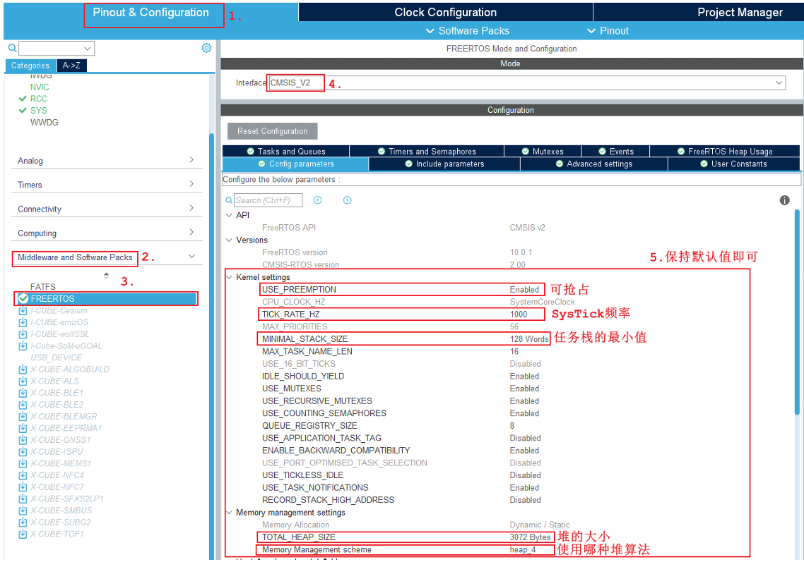

# <font color=green>FreeRTOS移植</font>

<br>
<br>

---


## 一、手动移植

1. 到FreeRTOS官网下载最新版本的FreeRTOS
2. 创建一个新的工程（可以将SYS中的时钟设置为TIM2，使用于延时函数，SysTikc被用作任务切换了），其它的和裸机一样
3. 在keil软件的项目中创建两个文件夹（`FreeRTOS/Source`和`FreeRTOS/Other`）
4. 在实际的工程根目录下创建一个FreeRTOS文件夹，
5. 先将下载的FreeRTOS源码中的`FreeRTOSv202212.01\FreeRTOS\Source`两个文件夹`include` 和`portable`,以及所有的`*.c`文件复制到工程的`FreeRTOS`文件夹下
6. 裁剪工程中的`FreeRTOS\portable`文件夹下的文件，只保留`keil`,`MemMang`和`RVDS`文件夹.
7. `RVDS`文件夹中只保留`ARM_CM3`
8. 在keil软件里将移植的文件添加到工程中。
* 将`FreeRTOS`下的所有`.c`文件(不包括文件夹中的)添加到工程`FreeRTOS/Source`中。
* 将`FreeRTOS\portable\MemMang`下的`heap_4.c`添加到工程`FreeRTOS/Other`中。
* 将`FreeRTOS\portable\RVDS\ARM_CM3`下的`port.c`添加到工程`FreeRTOS/Other`中。
9. 在工程中添加头文件路径，`FreeRTOS\include`和`FreeRTOS\portable\RVDS\ARM_CM3`，以及`FreeRTOS`(在后面FreeRTOSConfig.h会用到)
10. 将源码`FreeRTOSv202212.01\FreeRTOS\Demo\CORTEX_STM32F103_Keil`下的`FreeRTOSConfig.h`文件复制到工程的`FreeRTOS`下。(可以顺便加到keil的工程目录`FreeRTOS/Source`中)
11. 修改`FreeRTOSConfig.h`文件，在文件最后（#endif前）添加几个宏定义

```c
#define xPortPendSVHandler  PendSV_Handler
#define vPortSVCHandler     SVC_Handler
#define xPortSysTickHandler SysTick_Handler
```
12. 找到`stm32f1xx_it.c`,将其中的`void SVC_Handler(void)`,`void PendSV_Handler(void)`,`void SysTick_Handler(void)`，注释掉
13. 编译工程，如果没有错误，就可以开始使用FreeRTOS了

要在FreeRTOS中使用任务，需要在`main`函数前添加任务函数，然后在`main`函数中创建任务

```c


TaskHandle_t LED1handler,LED2handler;//对应任务的句柄

//任务执行函数
void vTask1(void *pvParameters){
	while(1){
		HAL_GPIO_WritePin(LED_1_GPIO_Port,LED_1_Pin,0);
		HAL_Delay(1000);
		HAL_GPIO_WritePin(LED_1_GPIO_Port,LED_1_Pin,1);
		HAL_Delay(1000);
	}
}

void vTask2(void *pvParameters){
	while(1){
		HAL_GPIO_WritePin(LED_2_GPIO_Port,LED_2_Pin,0);
		HAL_Delay(500);
		HAL_GPIO_WritePin(LED_2_GPIO_Port,LED_2_Pin,1);
		HAL_Delay(500);
	}
}


int main(void)
{
    //创建任务(函数名，任务名，堆栈大小，传递参数，任务优先级，句柄地址)
	xTaskCreate(vTask1,"LED1",128,NULL,2,&LED1handler); 
	xTaskCreate(vTask2,"LED2",128,NULL,2,&LED2handler);
	
	vTaskStartScheduler(); //开启任务

  while (1)
  {

  }

}

```
<br>
<br>

---

## 二、使用CubeMX移植

1. 前面一样，创建一个基础工程，配置时钟，SYS中的时钟设置为TIM2。
2. 左边菜单栏下的Middleware中找到FreeRTOS，点击配置，选择版本(一般CMSIS_V2)
3. 配置FreeRTOS基本设置



4. 按需求配置任务，队列，信号量等