# <font color=green>stm32基础</font>

<br>
<br>

---


# 一、工程建立

## 1.1 自行建立工程

* 启动文件start：启动文件是一个汇编文件，用于初始化芯片的各种寄存器，设置堆栈指针，设置中断向量表等。`固件库\STM32F10x_StdPeriph_Lib_V3.5.0\STM32F10x_StdPeriph_Lib_V3.5.0\Libraries\CMSIS\CM3\DeviceSupport\ST\STM32F10x\startup\arm`中所有文件复制到工程目录的start文件下。还有`\固件库\STM32F10x_StdPeriph_Lib_V3.5.0\STM32F10x_StdPeriph_Lib_V3.5.0\Libraries\CMSIS\CM3\DeviceSupport\ST\STM32F10x`下的三个文件也要复制到start文件下。stm32f10x.h文件是芯片的寄存器定义文件，system_stm32f10x.c和system_stm32f10x.h是时钟初始化文件。`固件库\STM32F10x_StdPeriph_Lib_V3.5.0\STM32F10x_StdPeriph_Lib_V3.5.0\Libraries\CMSIS\CM3\CoreSupport`中的core_cm3.c和core_cm3.h文件也要复制到start文件下,他们是CMSIS的核心支持文件。工程中加入md.s和所有.c,.h文件。还要在工程中添加头文件路径，在keil5的魔术棒->c/c++->include path中，加入start文件路径。 在start中的stm32f10x.h中结尾的USE_STDPERIPH_DRIVER字符串添加到keil5的魔术棒->c/c++->define中

* 库文件：库文件是一些函数库，用于方便我们编程。`固件库\STM32F10x_StdPeriph_Lib_V3.5.0\STM32F10x_StdPeriph_Lib_V3.5.0\Libraries\STM32F10x_StdPeriph_Driver\src`和`固件库\STM32F10x_StdPeriph_Lib_V3.5.0\STM32F10x_StdPeriph_Lib_V3.5.0\Libraries\STM32F10x_StdPeriph_Driver\inc`所有文件复制到工程目录的libray文件。还要在工程中添加头文件路径，在keil5的魔术棒->c/c++->include path中，加入libray文件路径

* 用户文件：`\固件库\STM32F10x_StdPeriph_Lib_V3.5.0\STM32F10x_StdPeriph_Lib_V3.5.0\Project\STM32F10x_StdPeriph_Template`中的`stm32f10x_conf.h`和`stm32f10x_it.c`和`stm32f10x_it.h`文件要复制到User文件下，并创建一个main.c。还要在工程中添加头文件路径，在keil5的魔术棒->c/c++->include path中，加入User文件路径

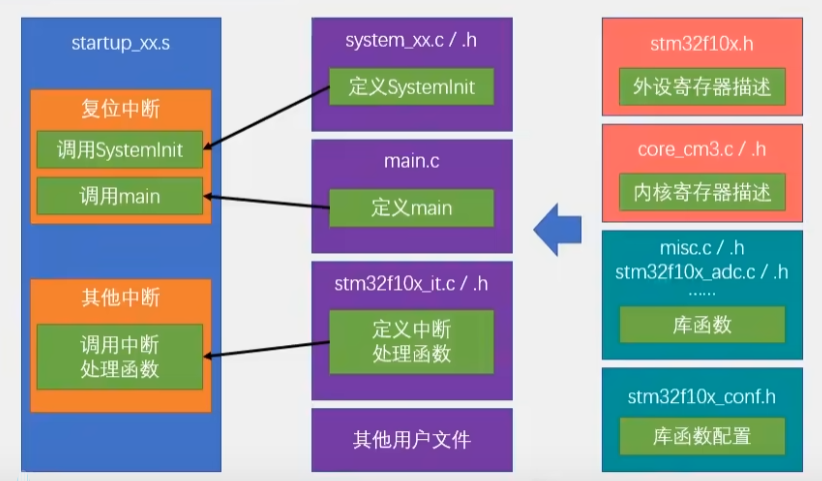


<br>
<br>

---

# 二、基础知识

## 2.1 STM32F103C8T6

系列：主流系列STM32F1
内核：ARM Cortex-M3
主频：72MHz
RAM：20K（SRAM）
ROM：64K（Flash）
供电：2.0~3.6V（标准3.3V）
封装：LQFP48

## 2.2 片上资源

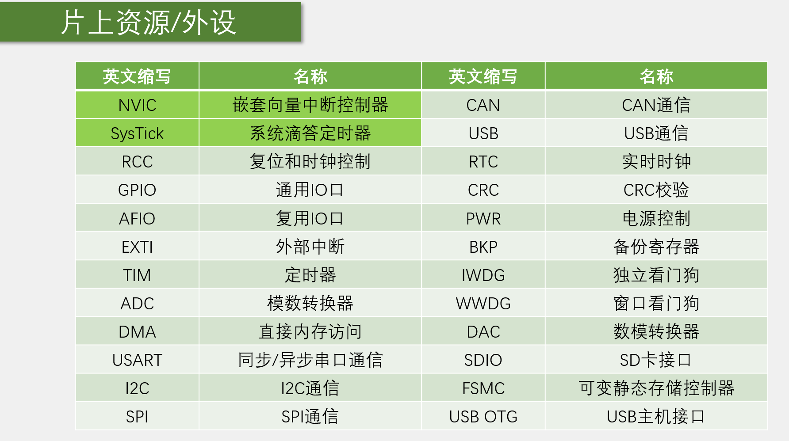

### 2.3 系统结构

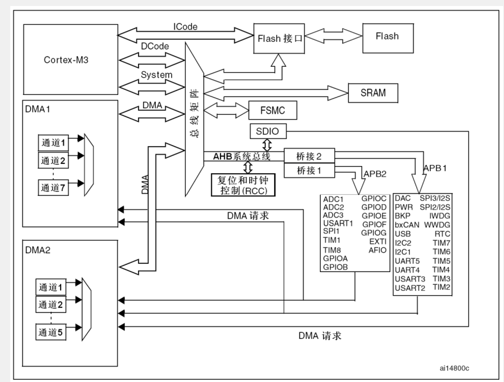

* Cortex-M3内核：内核引出了3条总线，分别是指令总线（I-Bus）、数据总线（D-Bus）和系统总线（System-Bus）。指令总线用于访问Flash和系统内存，数据总线用于传输数据，系统总线用于访问外设和内存。
* AHB总线：高级总线，用于连接内核、内存和DMA控制器，还有复位和时钟控制器（RCC）。AHB总线的速度最高为72MHz。
* APB总线：低级总线，用于连接外设。因为AHB总线的速度比APB总线快，所以APB总线上的外设要通过APB桥接器才能访问AHB总线。APB1总线的时钟频率最高为36MHz，APB2总线的时钟频率最高为72MHz。所以APB2总线上的外设更重要一些。
* DMA控制器：直接存储器访问控制器，用于实现外设和内存之间的数据传输，减轻CPU的负担。

#### 2.3.1 引脚定义

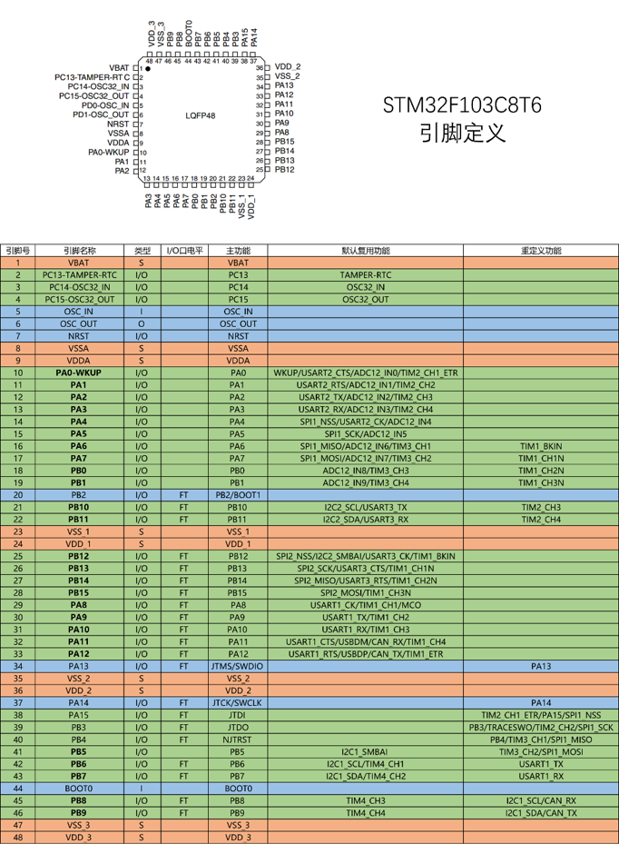

<br>
<br>

---

### 2.4 时钟系统

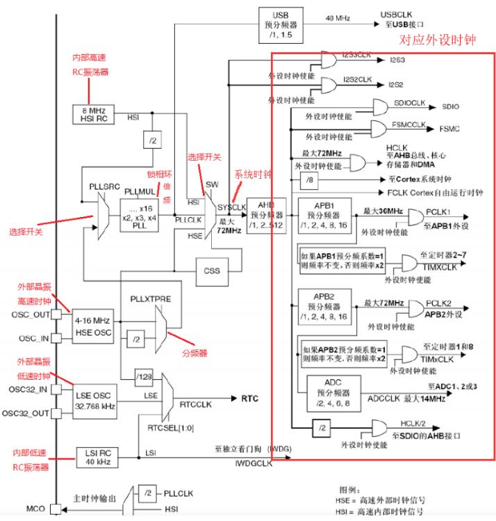

#### 2.4.1 时钟源(左边部分)

STM32 有4个独立时钟源:HSI、HSE、LSI、LSE。

* HSI是高速内部时钟，RC振荡器，频率为8MHz，精度不高。
* HSE是高速外部时钟，可接石英/陶瓷谐振器，或者接外部时钟源，频率范围为4MHz~16MHz。
* LSI是低速内部时钟，RC振荡器，频率为40kHz，提供低功耗时钟。
* LSE是低速外部时钟，接频率为32.768kHz的石英晶体。

PLL为锁相环倍频输出，其时钟输入源可选择为HSI/2、HSE或者HSE/2。倍频可选择为2~16倍，但是其输出频率最大不得超过72MHz。 通过倍频之后作为系统时钟的时钟源

>Keil编写程序是默认的时钟为72Mhz，其实是这么来的：外部晶振(HSE)提供的8MHz（与电路板上的晶振的相关）通过PLLXTPRE分频器后，进入PLLSRC选择开关，进而通过PLLMUL锁相环进行倍频（x9）后，为系统提供72MHz的系统时钟（SYSCLK）。之后是AHB预分频器对时钟信号进行分频，然后为低速外设提供时钟。或者内部RC振荡器(HSI) 为8MHz  /2 为4MHz 进入PLLSRC选择开关，通过PLLMUL锁相环进行倍频（x18）后 为72MHz

#### 2.4.2 系统时钟通过AHB分频器给外设提供时钟(右边部分)

从左到右可以简单理解为  系统时钟--->AHB分频器--->各个外设分频倍频器 ---> 外设时钟的设置

右边部分为：系统时钟SYSCLK通过AHB分频器分频后送给各模块使用，AHB分频器可选择1、2、4、8、16、64、128、256、512分频。其中AHB分频器输出的时钟送给5大模块使用：

①内核总线：送给AHB总线、内核、内存和DMA使用的HCLK时钟。
②Tick定时器：通过8分频后送给Cortex的系统定时器时钟。
③I2S总线：直接送给Cortex的空闲运行时钟FCLK。
④APB1外设：送给APB1分频器。APB1分频器可选择1、2、4、8、16分频，其输出一路供APB1外设使用(PCLK1，最大频率36MHz)，另一路送给通用定时器使用。该倍频器可选择1或者2倍频，时钟输出供定时器2-7使用。
⑤APB2外设：送给APB2分频器。APB2分频器可选择1、2、4、8、16分频，其输出一路供APB2外设使用(PCLK2，最大频率72MHz)，另一路送给高级定时器。该倍频器可选择1或者2倍频，时钟输出供定时器1和定时器8使用。

另外，APB2分频器还有一路输出供ADC分频器使用，分频后送给ADC模块使用。ADC分频器可选择为2、4、6、8分频。
需要注意的是，如果 APB 预分频器分频系数是 1，则定时器时钟频率 (TIMxCLK) 为 PCLKx。否则，定      时器时钟频率将为 APB 域的频率的两倍：TIMxCLK = 2xPCLKx。

#### 2.4.3 RCC初始化

使用HSE时钟，程序设置时钟参数流程：
1. 将RCC寄存器重新设置为默认值   `RCC_DeInit;`
2. 打开外部高速时钟晶振HSE       `RCC_HSEConfig(RCC_HSE_ON);`
3. 等待外部高速时钟晶振工作      `HSEStartUpStatus = RCC_WaitForHSEStartUp();`
4. 设置AHB时钟        ` RCC_HCLKConfig;`
5. 设置高速AHB时钟     `RCC_PCLK2Config;`
6. 设置低速速AHB时钟   `RCC_PCLK1Config;`
7. 设置PLL              `RCC_PLLConfig;`
8. 打开PLL              `RCC_PLLCmd(ENABLE);`
9. 等待PLL工作          `while(RCC_GetFlagStatus(RCC_FLAG_PLLRDY) == RESET)`
10. 设置系统时钟       ` RCC_SYSCLKConfig;`
11. 判断是否PLL是系统时钟     `while(RCC_GetSYSCLKSource() != 0x08)`
12. 打开要使用的外设时钟      `RCC_APB2PeriphClockCmd()/RCC_APB1PeriphClockCmd()`

<br>
<br>

---

### 2.5 GPIO

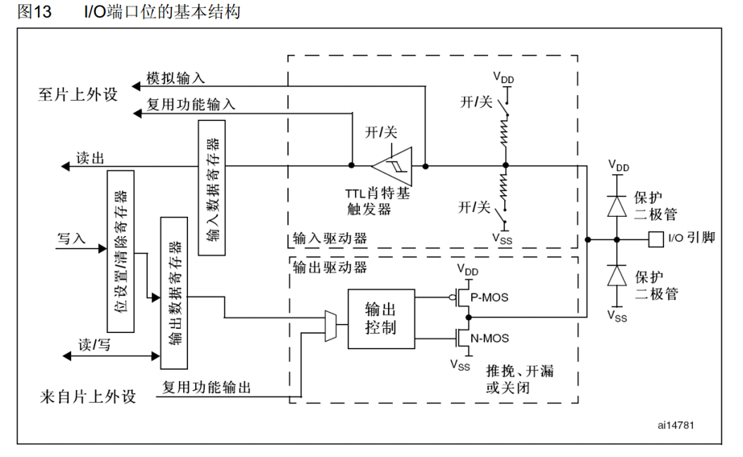

* 施密特发生器是消除抖动用的，高于阈值后就高电平，低于阈值后就低电平
* 库函数就是用到了位设置和位清除寄存器的方法
* 输入部分：有两个开关，分别对应了上拉输入和下拉输入，还有浮空输入，目的的确定默认的输入电平，浮空的话根据外界确定。
* 推挽输出：两个mos管均有效，写高时上面导通，下面断开，输出1
* 开漏输出：上面mos管未工作，写高时下面断开，io高阻态(防止干扰且输出的电压由外面的上拉电阻决定)

#### 2.5.1 GPIO的工作方式

* GPIO的工作模式：输入模式、输出模式、复用功能模式、模拟模式
* GPIO的输出模式：推挽输出、开漏输出
* GPIO的输入模式：浮空输入、上拉输入、下拉输入

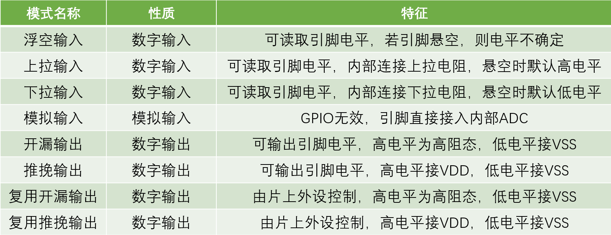

复用推挽输出和推挽输出的区别是，复用推挽输出的控制信号来自单片机的内置外设控制器，而推挽输出的控制信号来自输出数据寄存器。复用推挽输出可以实现一些特殊功能，如SPI、USART等，而推挽输出只能实现普通的数字输出

下面是外设的常用GPIO配置：
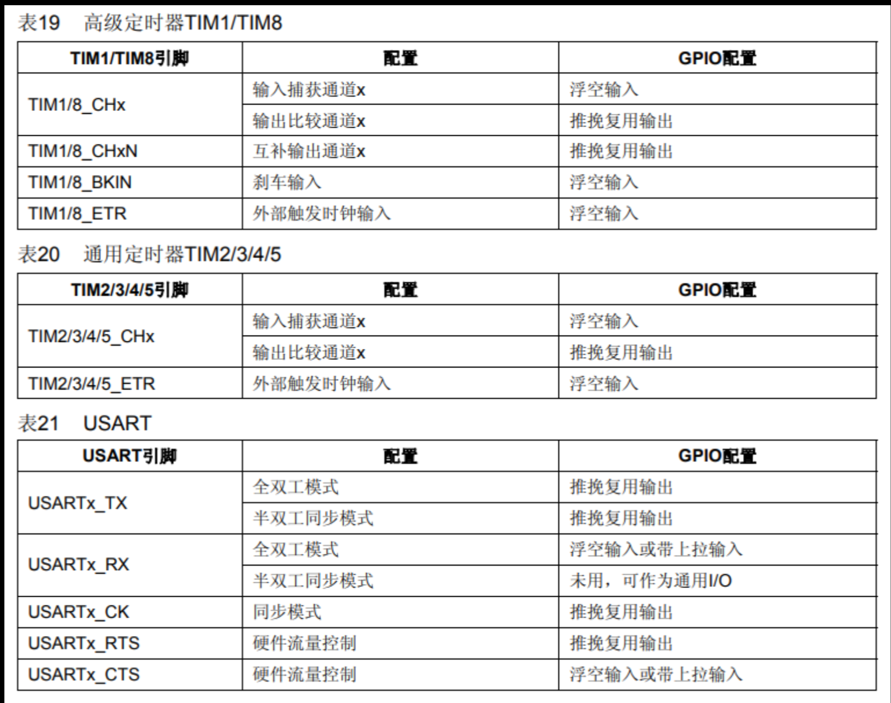
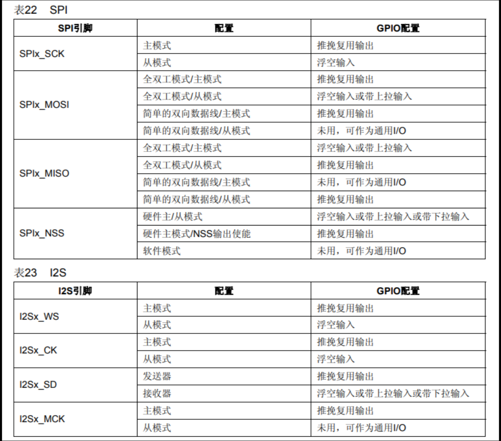
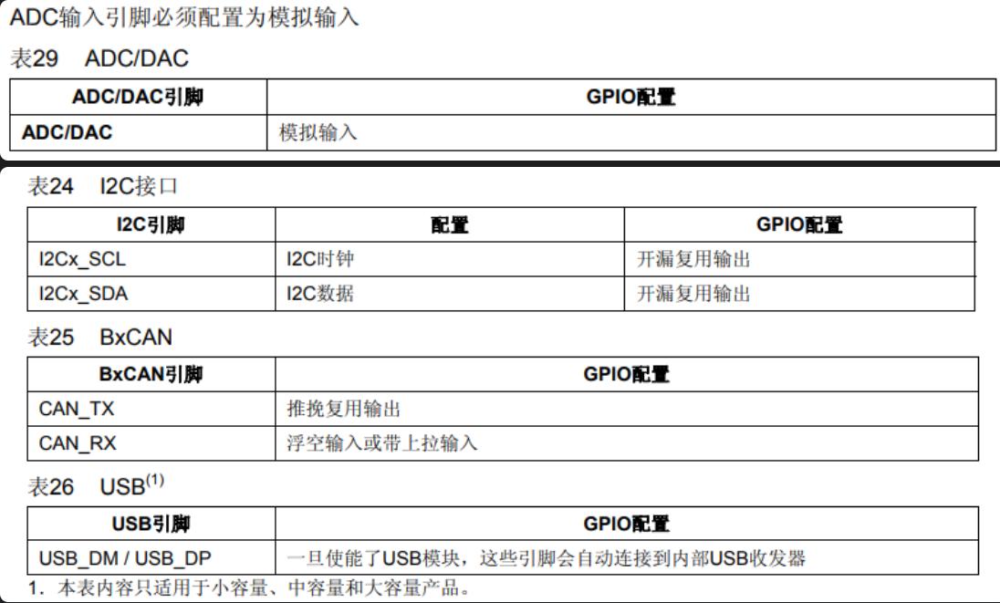

#### 2.5.2 GPIO基本操作

要使用GPIO，首先要初始化GPIO，然后才能对GPIO进行操作。GPIO的初始化如下：

1. 配置对应的RCC时钟
2. 配置GPIO的结构体，包括GPIO的引脚、模式、速度
3. 初始化GPIO

GPIO输出例子（流水灯）：
```c
#include "stm32f10x.h"                  // Device header
#include "Delay.h"

int main(void)
{
	/*开启时钟*/
	RCC_APB2PeriphClockCmd(RCC_APB2Periph_GPIOA, ENABLE);	//开启GPIOA的时钟
															//使用各个外设前必须开启时钟，否则对外设的操作无效
	
	/*GPIO初始化*/
	GPIO_InitTypeDef GPIO_InitStructure;					//定义结构体变量
	
	GPIO_InitStructure.GPIO_Mode = GPIO_Mode_Out_PP;		//GPIO模式，赋值为推挽输出模式
	GPIO_InitStructure.GPIO_Pin = GPIO_Pin_All;				//GPIO引脚，赋值为所有引脚,如果是多个单独引脚可以用|连接
	GPIO_InitStructure.GPIO_Speed = GPIO_Speed_50MHz;		//GPIO速度，赋值为50MHz
	
	GPIO_Init(GPIOA, &GPIO_InitStructure);					//将赋值后的构体变量传递给GPIO_Init函数
															//函数内部会自动根据结构体的参数配置相应寄存器
															//实现GPIOA的初始化
	
	/*主循环，循环体内的代码会一直循环执行*/
	while (1)
	{
		/*使用GPIO_Write，同时设置GPIOA所有引脚的高低电平，实现LED流水灯*/
		GPIO_Write(GPIOA, ~0x0001);	//0000 0000 0000 0001，PA0引脚为低电平，其他引脚均为高电平，注意数据有按位取反
		Delay_ms(100);				//延时100ms
		GPIO_Write(GPIOA, ~0x0002);	//0000 0000 0000 0010，PA1引脚为低电平，其他引脚均为高电平
		Delay_ms(100);				//延时100ms
		GPIO_Write(GPIOA, ~0x0004);	//0000 0000 0000 0100，PA2引脚为低电平，其他引脚均为高电平
		Delay_ms(100);				//延时100ms
		GPIO_Write(GPIOA, ~0x0008);	//0000 0000 0000 1000，PA3引脚为低电平，其他引脚均为高电平
		Delay_ms(100);				//延时100ms
		GPIO_Write(GPIOA, ~0x0010);	//0000 0000 0001 0000，PA4引脚为低电平，其他引脚均为高电平
		Delay_ms(100);				//延时100ms
		GPIO_Write(GPIOA, ~0x0020);	//0000 0000 0010 0000，PA5引脚为低电平，其他引脚均为高电平
		Delay_ms(100);				//延时100ms
		GPIO_Write(GPIOA, ~0x0040);	//0000 0000 0100 0000，PA6引脚为低电平，其他引脚均为高电平
		Delay_ms(100);				//延时100ms
		GPIO_Write(GPIOA, ~0x0080);	//0000 0000 1000 0000，PA7引脚为低电平，其他引脚均为高电平
		Delay_ms(100);				//延时100ms
	}
}
```

GPIO输入例子（按键）：
```c
#include "stm32f10x.h"                  // Device header
#include "Delay.h"

/**
  * 函    数：按键初始化
  * 参    数：无
  * 返 回 值：无
  */
void Key_Init(void)
{
	/*开启时钟*/
	RCC_APB2PeriphClockCmd(RCC_APB2Periph_GPIOB, ENABLE);		//开启GPIOB的时钟
	
	/*GPIO初始化*/
	GPIO_InitTypeDef GPIO_InitStructure;
	GPIO_InitStructure.GPIO_Mode = GPIO_Mode_IPU; //GPIO模式，赋值为上拉输入模式,默认为高电平
	GPIO_InitStructure.GPIO_Pin = GPIO_Pin_1 | GPIO_Pin_11;
	GPIO_InitStructure.GPIO_Speed = GPIO_Speed_50MHz;
	GPIO_Init(GPIOB, &GPIO_InitStructure);						//将PB1和PB11引脚初始化为上拉输入
}

/**
  * 函    数：按键获取键码
  * 参    数：无
  * 返 回 值：按下按键的键码值，范围：0~2，返回0代表没有按键按下
  * 注意事项：此函数是阻塞式操作，当按键按住不放时，函数会卡住，直到按键松手
  */
uint8_t Key_GetNum(void)
{
	uint8_t KeyNum = 0;		//定义变量，默认键码值为0
	
	if (GPIO_ReadInputDataBit(GPIOB, GPIO_Pin_1) == 0)			//读PB1输入寄存器的状态，如果为0，则代表按键1按下
	{
		Delay_ms(20);											//延时消抖
		while (GPIO_ReadInputDataBit(GPIOB, GPIO_Pin_1) == 0);	//等待按键松手
		Delay_ms(20);											//延时消抖
		KeyNum = 1;												//置键码为1
	}
	
	if (GPIO_ReadInputDataBit(GPIOB, GPIO_Pin_11) == 0)			//读PB11输入寄存器的状态，如果为0，则代表按键2按下
	{
		Delay_ms(20);											//延时消抖
		while (GPIO_ReadInputDataBit(GPIOB, GPIO_Pin_11) == 0);	//等待按键松手
		Delay_ms(20);											//延时消抖
		KeyNum = 2;												//置键码为2
	}
	
	return KeyNum;			//返回键码值，如果没有按键按下，所有if都不成立，则键码为默认值0
}

```

#### 2.5.3 GPIO复用

GPIO复用是指将GPIO引脚的功能从普通的GPIO引脚转换为其他外设的引脚，如串口、SPI、I2C等。一个GPIO口的功能除了默认功能，还有其复用功能和重定向功能。

* 开启复用功能的步骤：

1. 配置对应GPIO的RCC时钟
2. 配置GPIO的结构体，包括GPIO的引脚、模式（查看STM32外设引脚模式）、速度
3. 初始化GPIO

* 开启重定向功能的步骤：
  
1. 配置对应GPIO的RCC时钟
2. 配置对应的外设时钟
3. 配置AFIO时钟
4. 开启GPIO重定向功能`GPIO_PinRemapConfig(GPIO_Remap_USART1,ENABLE);`
5. 配置GPIO的结构体，包括GPIO的引脚、模式、速度
6. 初始化GPIO

>**注：有些GPIO口本身是用作调试端口，所以在使用时要先关闭调试功能，但是别乱用GPIO_Remap_SWJ_Disable，因为这个功能会关闭所有的调试功能，包括JTAG和SWD，如果关闭了JTAG，那么就不能用ST-LINK下载程序了**

<br>
<br>

---

### 2.6 中断

#### 2.6.1 中断的基本概念

STM32中有68个可屏蔽中断通道，包含EXTI、TIM、ADC、USART、SPI、I2C、RTC等多个外设。前10个是内核中断，其它为外设中断。

这些中断通道都由NVIC统一管理中断的优先级，每个中断通道（除了内核的3个固定）都拥有16个可编程的优先等级，可对优先级进行分组，进一步设置抢占优先级和响应优先级。（只能16个，如果有两个中断优先级完全相同了就按向量表上的序号来决定，序号小的优先）

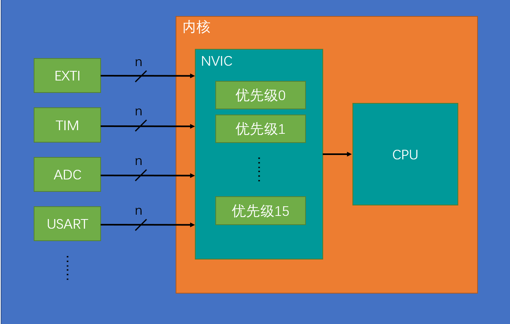

* NVIC分组：

NVIC的中断优先级由优先级寄存器的4位（0~15）决定，这4位可以进行切分，分为高n位的抢占优先级和低4-n位的响应优先级

抢占优先级高的可以中断嵌套，响应优先级高的可以优先排队，抢占优先级和响应优先级均相同的按中断号排队

| 分组 | 抢占优先级 | 响应优先级 |
| ---- | ---------- | ---------- |
| 0    | 0位（范围0）          | 4位（范围0-15）  | 
| 1    | 1位  （范围0-1）        | 3位   （范围0-7）       | 
| 2    | 2位   （范围0-3）        | 2位    （范围0-3）      |
| 3    | 3位    （范围0-7）       | 1位   （范围0-1）       |
| 4    | 4位    （范围0-15）      | 0位   （范围0）        |


#### 2.6.2 外设中断EXTI

* EXTI可以监测指定GPIO口的电平信号，当其指定的GPIO口产生电平变化时，EXTI将立即向NVIC发出中断申请，经过NVIC裁决后即可中断CPU主程序，使CPU执行EXTI对应的中断程序
* 支持的触发方式：上升沿/下降沿/双边沿/软件触发
* 支持的GPIO口：所有GPIO口，**但相同的Pin不能同时触发中断**
* 通道数：16个GPIO_Pin，外加PVD输出、RTC闹钟、USB唤醒、以太网唤醒
* 触发响应方式：中断响应/事件响应

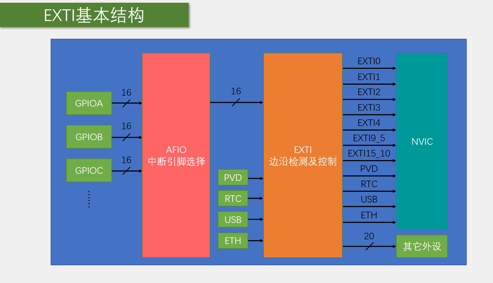

>这里要注意两点：
>1. 因为EXIT只有16条通道，所以相同的Pin不能同时触发中断（如PA0和PB0不能同时触发中断）
>2. 因为STM32将EXIT5到EXIT9的中断线共用，将EXIT10到EXIT15的中断线共用，所以如果要使用这些中断，还要在进入中断后通过标志位判断是哪个中断源

>并且，要开启中断，一般要先开启对应外设的中断，这个每个外设中断函数不同（一般有ITConfig），还要选择对应的NVIC通道，这个是固定的。

一条通道选择哪个pin脚是AFIO进行选择。AFIO在STM32中，AFIO主要完成两个任务：复用功能引脚重映射、中断引脚选择

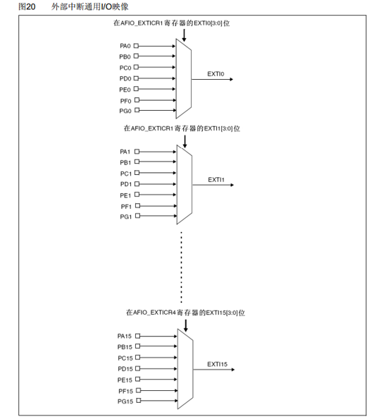

* EXIT内部框图

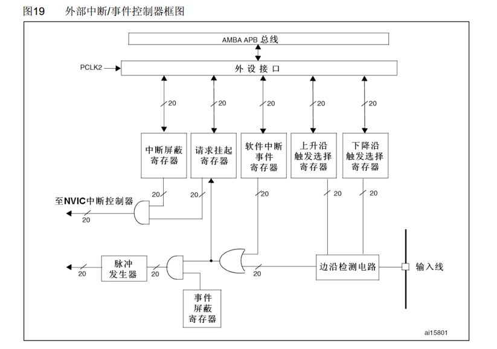

#### 2.6.3 EXIT中断步骤

1. 配置对应GPIO的RCC时钟
2. 配置AFIO时钟
3. 配置GPIO的结构体，包括GPIO的引脚、模式、速度
4. 初始化GPIO
5. 配置AFIO的EXTI线（一般是哪个GPIO口对应的EXTI线）
6. 配置EXTI的结构体，包括EXTI的线路、触发方式、中断使能、模式
7. 初始化EXTI
8. 配置NVIC分组
9. 配置NVIC的结构体，包括中断通道、优先级、使能
10. 初始化NVIC
11. 编写中断服务函数（中断服务函数的名字是固定的，不可更改）

例子：

* 编码器：

编码器的两个引脚会产生相位相差90°的两个信号，通过这两个信号的变化可以判断转动的方向和速度。编码器的两个引脚可以通过外部中断来检测，当其中一个引脚产生上升沿时，另一个引脚的电平就是编码器的方向信号，通过这两个信号的变化可以判断转动的方向和速度。

```c
#include "stm32f10x.h"                  // Device header

int16_t Encoder_Count;					//全局变量，用于计数旋转编码器的增量值

/**
  * 函    数：旋转编码器初始化
  * 参    数：无
  * 返 回 值：无
  */
void Encoder_Init(void)
{
	/*开启时钟*/
	RCC_APB2PeriphClockCmd(RCC_APB2Periph_GPIOB, ENABLE);		//开启GPIOB的时钟
	RCC_APB2PeriphClockCmd(RCC_APB2Periph_AFIO, ENABLE);		//开启AFIO的时钟，外部中断必须开启AFIO的时钟
	
	/*GPIO初始化*/
	GPIO_InitTypeDef GPIO_InitStructure;
	GPIO_InitStructure.GPIO_Mode = GPIO_Mode_IPU;
	GPIO_InitStructure.GPIO_Pin = GPIO_Pin_0 | GPIO_Pin_1;
	GPIO_InitStructure.GPIO_Speed = GPIO_Speed_50MHz;
	GPIO_Init(GPIOB, &GPIO_InitStructure);						//将PB0和PB1引脚初始化为上拉输入
	
	/*AFIO选择中断引脚*/
	GPIO_EXTILineConfig(GPIO_PortSourceGPIOB, GPIO_PinSource0);//将外部中断的0号线映射到GPIOB，即选择PB0为外部中断引脚
	GPIO_EXTILineConfig(GPIO_PortSourceGPIOB, GPIO_PinSource1);//将外部中断的1号线映射到GPIOB，即选择PB1为外部中断引脚
	
	/*EXTI初始化*/
	EXTI_InitTypeDef EXTI_InitStructure;						//定义结构体变量
	EXTI_InitStructure.EXTI_Line = EXTI_Line0 | EXTI_Line1;		//选择配置外部中断的0号线和1号线
	EXTI_InitStructure.EXTI_LineCmd = ENABLE;					//指定外部中断线使能
	EXTI_InitStructure.EXTI_Mode = EXTI_Mode_Interrupt;			//指定外部中断线为中断模式
	EXTI_InitStructure.EXTI_Trigger = EXTI_Trigger_Falling;		//指定外部中断线为下降沿触发
	EXTI_Init(&EXTI_InitStructure);								//将结构体变量交给EXTI_Init，配置EXTI外设
	
	/*NVIC中断分组*/
	NVIC_PriorityGroupConfig(NVIC_PriorityGroup_2);				//配置NVIC为分组2
																//即抢占优先级范围：0~3，响应优先级范围：0~3
																//此分组配置在整个工程中仅需调用一次
																//若有多个中断，可以把此代码放在main函数内，while循环之前
																//若调用多次配置分组的代码，则后执行的配置会覆盖先执行的配置
	
	/*NVIC配置*/
	NVIC_InitTypeDef NVIC_InitStructure;						//定义结构体变量
	NVIC_InitStructure.NVIC_IRQChannel = EXTI0_IRQn;			//选择配置NVIC的EXTI0线
	NVIC_InitStructure.NVIC_IRQChannelCmd = ENABLE;				//指定NVIC线路使能
	NVIC_InitStructure.NVIC_IRQChannelPreemptionPriority = 1;	//指定NVIC线路的抢占优先级为1
	NVIC_InitStructure.NVIC_IRQChannelSubPriority = 1;			//指定NVIC线路的响应优先级为1
	NVIC_Init(&NVIC_InitStructure);								//将结构体变量交给NVIC_Init，配置NVIC外设

	NVIC_InitStructure.NVIC_IRQChannel = EXTI1_IRQn;			//选择配置NVIC的EXTI1线
	NVIC_InitStructure.NVIC_IRQChannelCmd = ENABLE;				//指定NVIC线路使能
	NVIC_InitStructure.NVIC_IRQChannelPreemptionPriority = 1;	//指定NVIC线路的抢占优先级为1
	NVIC_InitStructure.NVIC_IRQChannelSubPriority = 2;			//指定NVIC线路的响应优先级为2
	NVIC_Init(&NVIC_InitStructure);								//将结构体变量交给NVIC_Init，配置NVIC外设
}

/**
  * 函    数：旋转编码器获取增量值
  * 参    数：无
  * 返 回 值：自上此调用此函数后，旋转编码器的增量值
  */
int16_t Encoder_Get(void)
{
	/*使用Temp变量作为中继，目的是返回Encoder_Count后将其清零*/
	/*在这里，也可以直接返回Encoder_Count
	  但这样就不是获取增量值的操作方法了
	  也可以实现功能，只是思路不一样*/
	int16_t Temp;
	Temp = Encoder_Count;
	Encoder_Count = 0;
	return Temp;
}

/**
  * 函    数：EXTI0外部中断函数
  * 参    数：无
  * 返 回 值：无
  * 注意事项：此函数为中断函数，无需调用，中断触发后自动执行
  *           函数名为预留的指定名称，可以从启动文件复制
  *           请确保函数名正确，不能有任何差异，否则中断函数将不能进入
  */
void EXTI0_IRQHandler(void)
{
	if (EXTI_GetITStatus(EXTI_Line0) == SET)		//判断是否是外部中断0号线触发的中断
	{
		/*如果出现数据乱跳的现象，可再次判断引脚电平，以避免抖动*/
		if (GPIO_ReadInputDataBit(GPIOB, GPIO_Pin_0) == 0)
		{
			if (GPIO_ReadInputDataBit(GPIOB, GPIO_Pin_1) == 0)		//PB0的下降沿触发中断，此时检测另一相PB1的电平，目的是判断旋转方向
			{
				Encoder_Count --;					//此方向定义为反转，计数变量自减
			}
		}
		EXTI_ClearITPendingBit(EXTI_Line0);			//清除外部中断0号线的中断标志位
													//中断标志位必须清除
													//否则中断将连续不断地触发，导致主程序卡死
	}
}

/**
  * 函    数：EXTI1外部中断函数
  * 参    数：无
  * 返 回 值：无
  * 注意事项：此函数为中断函数，无需调用，中断触发后自动执行
  *           函数名为预留的指定名称，可以从启动文件复制
  *           请确保函数名正确，不能有任何差异，否则中断函数将不能进入
  */
void EXTI1_IRQHandler(void)
{
	if (EXTI_GetITStatus(EXTI_Line1) == SET)		//判断是否是外部中断1号线触发的中断
	{
		/*如果出现数据乱跳的现象，可再次判断引脚电平，以避免抖动*/
		if (GPIO_ReadInputDataBit(GPIOB, GPIO_Pin_1) == 0)
		{
			if (GPIO_ReadInputDataBit(GPIOB, GPIO_Pin_0) == 0)		//PB1的下降沿触发中断，此时检测另一相PB0的电平，目的是判断旋转方向
			{
				Encoder_Count ++;					//此方向定义为正转，计数变量自增
			}
		}
		EXTI_ClearITPendingBit(EXTI_Line1);			//清除外部中断1号线的中断标志位
													//中断标志位必须清除
													//否则中断将连续不断地触发，导致主程序卡死
	}
}
```

<br>
<br>

---

### 2.7 定时器

#### 2.7.1 定时器的基本概念

##### 2.7.1.1 定时器简介 

* 定时器可以对输入的时钟进行计数，并在计数值达到设定值时触发中断
* 16位计数器、预分频器、自动重装寄存器的时基单元，在72MHz计数时钟下可以实现最大59.65s的定时
* 不仅具备基本的定时中断功能，而且还包含内外时钟源选择、输入捕获、输出比较、编码器接口、主从触发模式等多种功能
* 根据复杂度和应用场景分为了高级定时器、通用定时器、基本定时器三种类型

##### 2.7.1.2 定时器类型

| 类型 | 编号 | 总线 | 功能 |
| ---- | ---- | ---- | ---- |
| 基本定时器 | TIM6、TIM7 | APB1 | 拥有定时中断、主模式触发DAC的功能 |
| 通用定时器 | TIM2、TIM3、TIM4、TIM5 | APB1 | 拥有基本定时器全部功能，并额外具有内外时钟源选择、输入捕获、输出比较、编码器接口、主从触发模式等功能|
| 高级定时器 | TIM1、TIM8 | APB2 | 拥有通用定时器全部功能，并额外具有重复计数器、死区生成、互补输出、刹车输入等功能|

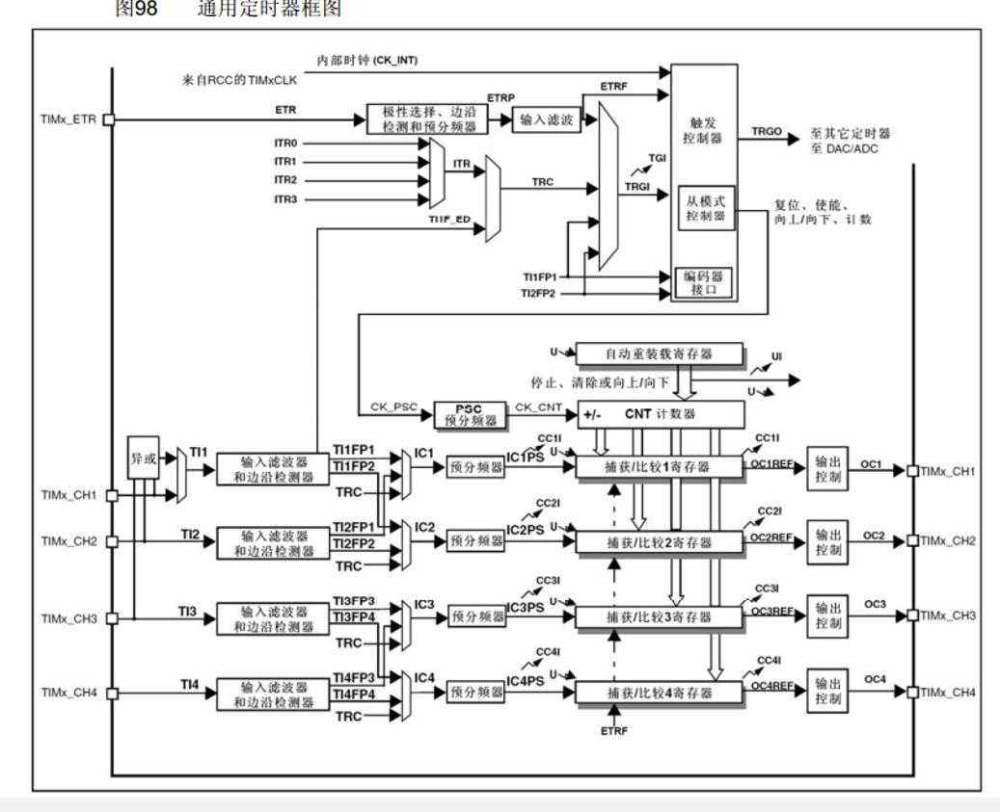

>基本定时器TIM6和TIM7只有一个计数器，没有捕获比较寄存器，只能用来产生定时中断，不能用来产生PWM波形

* 时钟源：内部时钟（72MHZ），外部时钟（可以是TIMx_ETR引脚的外部时钟信号，可以是其他定时器的时钟信号ITRx,可以是捕获的上升沿/下降沿信号TI1F_ED,可以是捕获的编码器的时钟信号TI1FP1和TI2FP2）
* 时基单元：通过预分频后，将输入时钟分频后每次加1，计数器计数到设定值后产生中断
* 输出比较、输入捕获：输出比较是将计数器的值与比较寄存器的值进行比较，当计数器的值等于比较寄存器的值时产生中断信号或进行输出电平翻转等控制，输入捕获是捕获外部信号的上升沿或下降沿，可以用来测量脉冲宽度或者脉冲间隔

>高级定时器还会多出一些功能，如重复计数器、死区生成、互补输出、刹车输入等功能
>预分频器，自动重装寄存器，捕获/比较寄存器，都有一个影子寄存器，如果使用影子寄存器，那么在更新寄存器的时候，计数器只会在计数到0的时候更新。

#### 2.7.2 定时器中断

定时器中断是定时器的基本功能，通过定时器的计数器和自动重装寄存器，当计数器的值等于自动重装寄存器的值时产生中断。

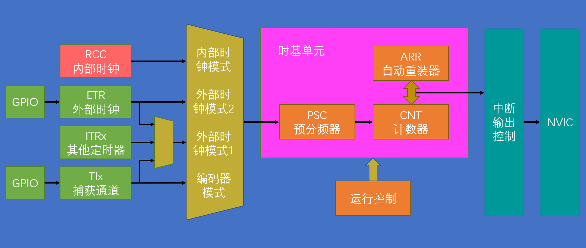

* 定时器中断的基本步骤：

1. 配置对应定时器的RCC时钟
2. 配置时钟源（默认为内部时钟）
3. 配置定时器的结构体，包括定时器的预分频、计数器、自动重装寄存器、时钟分频、计数模式
4. 初始化定时器
5. 清除定时器更新标志位（TIM_TimeBaseInit函数末尾，手动产生了更新事件，则开启中断后，会立刻进入一次中断）
6. 开启对应定时器的中断
7. 配置NVIC分组
8. 配置NVIC的结构体，包括中断通道、优先级、使能
9. 初始化NVIC
10. 使能定时器
11. 编写中断服务函数

例子：

定时器更新中断（1s一次）：

```c
#include "stm32f10x.h"                  // Device header

/**
  * 函    数：定时中断初始化
  * 参    数：无
  * 返 回 值：无
  */
void Timer_Init(void)
{
	/*开启时钟*/
	RCC_APB1PeriphClockCmd(RCC_APB1Periph_TIM2, ENABLE);			//开启TIM2的时钟
	
	/*配置时钟源*/
	TIM_InternalClockConfig(TIM2);		//选择TIM2为内部时钟，若不调用此函数，TIM默认也为内部时钟
	
	/*时基单元初始化*/
	TIM_TimeBaseInitTypeDef TIM_TimeBaseInitStructure;				//定义结构体变量
	TIM_TimeBaseInitStructure.TIM_ClockDivision = TIM_CKD_DIV1;		//时钟分频，选择不分频，此参数用于配置滤波器时钟，不影响时基单元功能
	TIM_TimeBaseInitStructure.TIM_CounterMode = TIM_CounterMode_Up;	//计数器模式，选择向上计数
	TIM_TimeBaseInitStructure.TIM_Period = 10000 - 1;				//计数周期，即ARR的值
	TIM_TimeBaseInitStructure.TIM_Prescaler = 7200 - 1;				//预分频器，即PSC的值
	TIM_TimeBaseInitStructure.TIM_RepetitionCounter = 0;			//重复计数器，高级定时器才会用到
	TIM_TimeBaseInit(TIM2, &TIM_TimeBaseInitStructure);				//将结构体变量交给TIM_TimeBaseInit，配置TIM2的时基单元	
	
	/*中断输出配置*/
	TIM_ClearFlag(TIM2, TIM_FLAG_Update);						//清除定时器更新标志位
																//TIM_TimeBaseInit函数末尾，手动产生了更新事件
																//若不清除此标志位，则开启中断后，会立刻进入一次中断
																//如果不介意此问题，则不清除此标志位也可
	
	TIM_ITConfig(TIM2, TIM_IT_Update, ENABLE);					//开启TIM2的更新中断
	
	/*NVIC中断分组*/
	NVIC_PriorityGroupConfig(NVIC_PriorityGroup_2);				//配置NVIC为分组2,即两个抢占优先级，两个响应优先级
																//即抢占优先级范围：0~3，响应优先级范围：0~3
																//此分组配置在整个工程中仅需调用一次
																//若有多个中断，可以把此代码放在main函数内，while循环之前
																//若调用多次配置分组的代码，则后执行的配置会覆盖先执行的配置
	
	/*NVIC配置*/
	NVIC_InitTypeDef NVIC_InitStructure;						//定义结构体变量
	NVIC_InitStructure.NVIC_IRQChannel = TIM2_IRQn;				//选择配置NVIC的TIM2线
	NVIC_InitStructure.NVIC_IRQChannelCmd = ENABLE;				//指定NVIC线路使能
	NVIC_InitStructure.NVIC_IRQChannelPreemptionPriority = 2;	//指定NVIC线路的抢占优先级为2
	NVIC_InitStructure.NVIC_IRQChannelSubPriority = 1;			//指定NVIC线路的响应优先级为1
	NVIC_Init(&NVIC_InitStructure);								//将结构体变量交给NVIC_Init，配置NVIC外设
	
	/*TIM使能*/
	TIM_Cmd(TIM2, ENABLE);			//使能TIM2，定时器开始运行
}

/* 定时器中断函数，可以复制到使用它的地方
void TIM2_IRQHandler(void)
{
	//如果是更新中断，则要把标志位清除
	if (TIM_GetITStatus(TIM2, TIM_IT_Update) == SET)
	{
		
		TIM_ClearITPendingBit(TIM2, TIM_IT_Update);
	}
}
*/
```

#### 2.7.3 定时器输出比较

##### 2.7.3.1 定时器输出比较简介

* OC（Output Compare）输出比较
* 输出比较可以通过比较CNT与CCR寄存器值的关系，来对输出电平进行置1、置0或翻转的操作，用于输出一定频率和占空比的PWM波形
* 每个高级定时器和通用定时器都拥有4个输出比较通道
* 高级定时器的前3个通道额外拥有死区生成和互补输出的功能

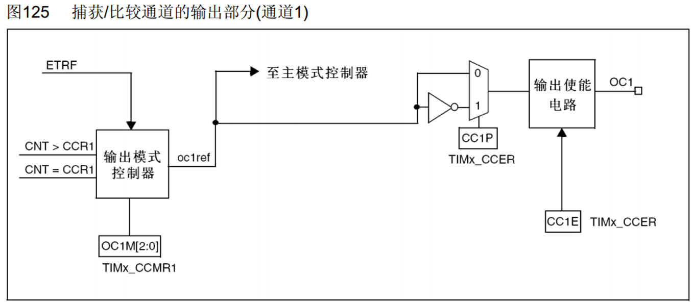

其中输出模式控制器有8种模式：冻结模式、比较模式、匹配置有效，匹配配置无效，强制输出低、强制输出高、匹配输出反转、PWM模式1、PWM模式2。用的最多的是PWM模式1和PWM模式2。

##### 2.7.3.2 PWM简介

PWM（Pulse Width Modulation）脉宽调制，是一种通过改变脉冲的宽度来控制电平的技术，通过改变脉冲的占空比，可以控制电机的转速、LED的亮度等。

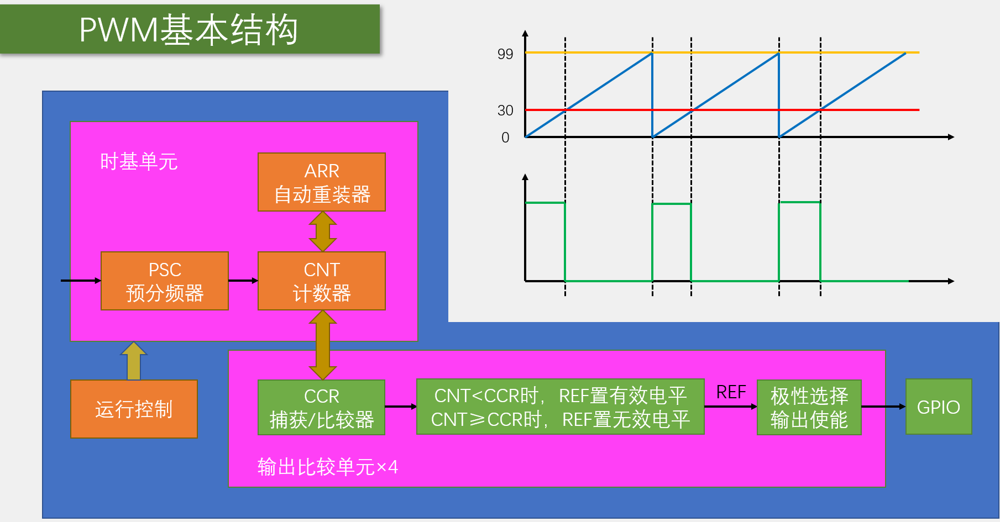


>图中是PWM1模式

PWM的关键参数：

* psc：预分频器，即计数一次所需的频率（如内部时钟72MHz，预分频器为7200，那么计数一次的频率为10KHz，即计数器每1/(72000000/7200)=100us加1）
* arr：自动重装寄存器，即计数器的最大值（如arr为10000，预分频器为7200，那么计数器的最大值为10000*100us=1s）
* ccr：比较寄存器，即比较计数器的值（如ccr为5000，那么当计数器的值等于5000时，输出电平翻转）

>注：在写代码时都要-1，因为计数器是从0开始计数的


例子：

PWM输出（直流电机）：

* PWM.c:

```c
#include "stm32f10x.h"                  // Device header

/**
  * 函    数：PWM初始化
  * 参    数：无
  * 返 回 值：无
  */
void PWM_Init(void)
{
	/*开启时钟*/
	RCC_APB1PeriphClockCmd(RCC_APB1Periph_TIM2, ENABLE);			//开启TIM2的时钟
	RCC_APB2PeriphClockCmd(RCC_APB2Periph_GPIOA, ENABLE);			//开启GPIOA的时钟
	
	/*GPIO初始化*/
	GPIO_InitTypeDef GPIO_InitStructure;
	GPIO_InitStructure.GPIO_Mode = GPIO_Mode_AF_PP;
	GPIO_InitStructure.GPIO_Pin = GPIO_Pin_2;
	GPIO_InitStructure.GPIO_Speed = GPIO_Speed_50MHz;
	GPIO_Init(GPIOA, &GPIO_InitStructure);							//将PA2引脚初始化为复用推挽输出	
																	//受外设控制的引脚，均需要配置为复用模式
	
	/*配置时钟源*/
	TIM_InternalClockConfig(TIM2);		//选择TIM2为内部时钟，若不调用此函数，TIM默认也为内部时钟
	
	/*时基单元初始化*/
	TIM_TimeBaseInitTypeDef TIM_TimeBaseInitStructure;				//定义结构体变量
	TIM_TimeBaseInitStructure.TIM_ClockDivision = TIM_CKD_DIV1;     //时钟分频，选择不分频，此参数用于配置滤波器时钟，不影响时基单元功能
	TIM_TimeBaseInitStructure.TIM_CounterMode = TIM_CounterMode_Up; //计数器模式，选择向上计数
	TIM_TimeBaseInitStructure.TIM_Period = 100 - 1;                 //计数周期，即ARR的值
	TIM_TimeBaseInitStructure.TIM_Prescaler = 36 - 1;               //预分频器，即PSC的值
	TIM_TimeBaseInitStructure.TIM_RepetitionCounter = 0;            //重复计数器，高级定时器才会用到
	TIM_TimeBaseInit(TIM2, &TIM_TimeBaseInitStructure);             //将结构体变量交给TIM_TimeBaseInit，配置TIM2的时基单元
	
	/*输出比较初始化*/ 
	TIM_OCInitTypeDef TIM_OCInitStructure;							//定义结构体变量
	TIM_OCStructInit(&TIM_OCInitStructure);                         //结构体初始化，若结构体没有完整赋值
	                                                                //则最好执行此函数，给结构体所有成员都赋一个默认值
	                                                                //避免结构体初值不确定的问题
	TIM_OCInitStructure.TIM_OCMode = TIM_OCMode_PWM1;               //输出比较模式，选择PWM模式1
	TIM_OCInitStructure.TIM_OCPolarity = TIM_OCPolarity_High;       //输出极性，选择为高，若选择极性为低，则输出高低电平取反
	TIM_OCInitStructure.TIM_OutputState = TIM_OutputState_Enable;   //输出使能
	TIM_OCInitStructure.TIM_Pulse = 0;								//初始的CCR值
	TIM_OC3Init(TIM2, &TIM_OCInitStructure);                        //将结构体变量交给TIM_OC3Init，配置TIM2的输出比较通道3
	
	/*TIM使能*/
	TIM_Cmd(TIM2, ENABLE);			//使能TIM2，定时器开始运行
}

/**
  * 函    数：PWM设置CCR
  * 参    数：Compare 要写入的CCR的值，范围：0~100
  * 返 回 值：无
  * 注意事项：CCR和ARR共同决定占空比，此函数仅设置CCR的值，并不直接是占空比
  *           占空比Duty = CCR / (ARR + 1)
  */
void PWM_SetCompare3(uint16_t Compare)
{
	TIM_SetCompare3(TIM2, Compare);		//设置CCR3的值
}
```
motor.c

```c
#include "stm32f10x.h"                  // Device header
#include "PWM.h"

/**
  * 函    数：直流电机初始化
  * 参    数：无
  * 返 回 值：无
  */
void Motor_Init(void)
{
	/*开启时钟*/
	RCC_APB2PeriphClockCmd(RCC_APB2Periph_GPIOA, ENABLE);		//开启GPIOA的时钟
	
	GPIO_InitTypeDef GPIO_InitStructure;
	GPIO_InitStructure.GPIO_Mode = GPIO_Mode_Out_PP;
	GPIO_InitStructure.GPIO_Pin = GPIO_Pin_4 | GPIO_Pin_5;
	GPIO_InitStructure.GPIO_Speed = GPIO_Speed_50MHz;
	GPIO_Init(GPIOA, &GPIO_InitStructure);						//将PA4和PA5引脚初始化为推挽输出	
	
	PWM_Init();													//初始化直流电机的底层PWM
}

/**
  * 函    数：直流电机设置速度
  * 参    数：Speed 要设置的速度，范围：-100~100
  * 返 回 值：无
  */
void Motor_SetSpeed(int8_t Speed)
{
	if (Speed >= 0)							//如果设置正转的速度值
	{
		GPIO_SetBits(GPIOA, GPIO_Pin_4);	//PA4置高电平
		GPIO_ResetBits(GPIOA, GPIO_Pin_5);	//PA5置低电平，设置方向为正转
		PWM_SetCompare3(Speed);				//PWM设置为速度值
	}
	else									//否则，即设置反转的速度值
	{
		GPIO_ResetBits(GPIOA, GPIO_Pin_4);	//PA4置低电平
		GPIO_SetBits(GPIOA, GPIO_Pin_5);	//PA5置高电平，设置方向为反转
		PWM_SetCompare3(-Speed);			//PWM设置为负的速度值，因为此时速度值为负数，而PWM只能给正数
	}
}
```

#### 2.7.4 定时器输入捕获

##### 2.7.4.1 定时器输入捕获简介

* IC（Input Capture）输入捕获
* 输入捕获模式下，当通道输入引脚出现指定电平跳变时，当前CNT的值将被锁存到CCR中，可用于测量PWM波形的频率、占空比、脉冲间隔、电平持续时间等参数
* 每个高级定时器和通用定时器都拥有4个输入捕获通道
* 可配置为PWMI模式，同时测量频率和占空比
* 可配合主从触发模式，实现硬件全自动测量

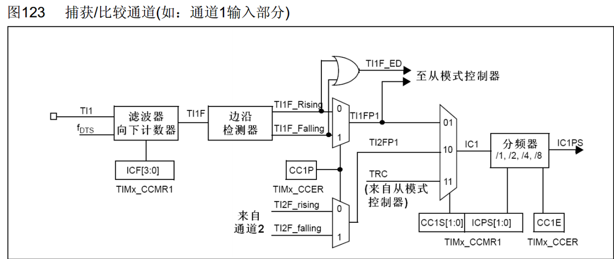

##### 2.7.4.2 主从触发模式

* 主模式能将定时器内部的触发信号输出到TRGO用于触发其他外设
* 从模式先进行触发源的选择（选择是内部还是外部信号触发），触发后进入对应的从模式的操作(如清除CNT)

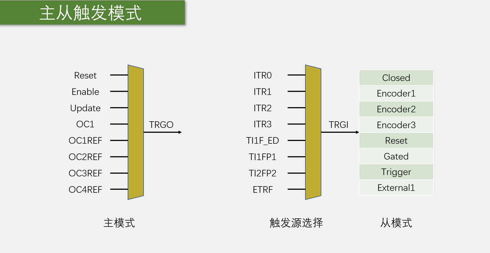

##### 2.7.4.2 输入捕获基本结构

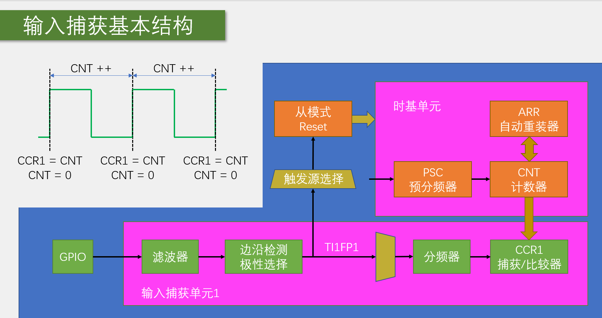

PWMI模式下，当捕获到上升沿时，捕获到的CNT值会被锁存到CCR1中，当捕获到下降沿时，捕获到的CNT值会被锁存到CCR2中，然后计算CCR2-CCR1的值即可得到一个脉冲的周期，再计算CCR2-CCR1的值即可得到一个脉冲的占空比。

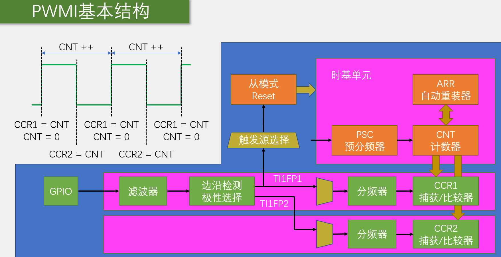

##### 2.7.4.3 频率测量方法

因为输入捕获的只是两个触发沿间隔中CNT的计数值，所以如果想要测量频率，还要进行一定的转换，主要有两种方法：


测频法：一定时间内捕获到的脉冲数量除以这段时间（即触发一次+1），计算后即可得到频率

测周期法：定义一个频率更快的已知脉冲（CNT），测量两个脉冲之间的时间过了多少个标准脉冲，即两次触发沿后得到CNT值，然后除以标准脉冲的时间即可得到频率

>测量占空比即一个测上升沿，一个测下降沿，然后计算两者的比值即可得到占空比

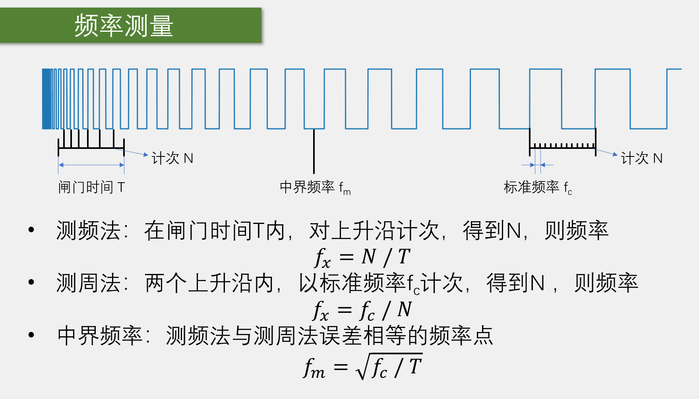

##### 2.7.4.4 编码器接口

* 编码器接口可接收增量（正交）编码器的信号，根据编码器旋转产生的正交信号脉冲，自动控制CNT自增或自减，从而指示编码器的位置、旋转方向和旋转速度
* 每个高级定时器和通用定时器都拥有1个编码器接口
* 两个输入引脚借用了输入捕获的通道1和通道2

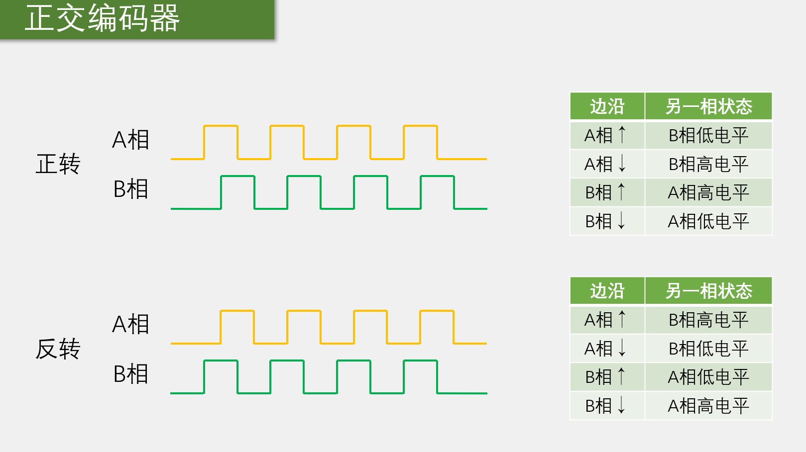

>编码器一般是上升沿和下降沿均有效，到一个信号发生变化时，就会检测另一个信号的电平，以判断旋转方向。

**下图是当两个电平极性都是正的时候(即极性都是上升沿)对应的计数**：
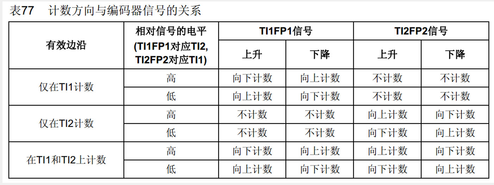

>用第三钟计数模式时，可以有效过滤掉毛刺，因为当有毛刺时，一个相一直保持一个电平，另一个出现许多脉冲，但是每次上升下降沿时就会+1-1，所以最后的计数值是不变的。

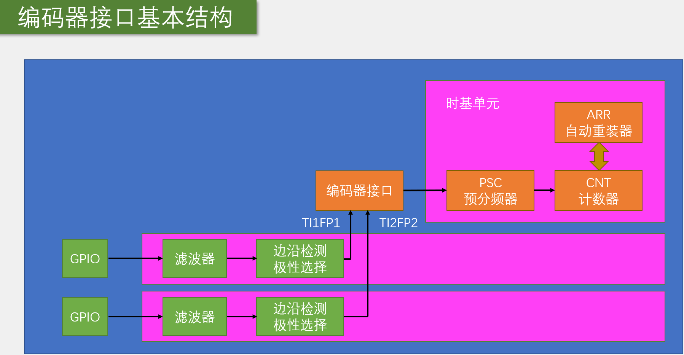

>注：该编码器默认是高电平，所以GPIO的初始化要设置为上拉输入。
>并且，因为上升沿下降沿均有效，这里的极性选择只是一种电平转换，即一个信号发生变化时，另一个信号的电平是否翻转（一般是下降沿是翻转）。一般想翻转方向时就使两个极性不同即可。

#### 2.7.5 定时器代码

##### 2.7.5.1 输出一个PWM波形并测量频率

* PWM.c:
```c
#include "stm32f10x.h"                  // Device header

/**
  * 函    数：PWM初始化
  * 参    数：无
  * 返 回 值：无
  */
void PWM_Init(void)
{
	/*开启时钟*/
	RCC_APB1PeriphClockCmd(RCC_APB1Periph_TIM2, ENABLE);			//开启TIM2的时钟
	RCC_APB2PeriphClockCmd(RCC_APB2Periph_GPIOA, ENABLE);			//开启GPIOA的时钟
	
	/*GPIO重映射*/
//	RCC_APB2PeriphClockCmd(RCC_APB2Periph_AFIO, ENABLE);			//开启AFIO的时钟，重映射必须先开启AFIO的时钟
//	GPIO_PinRemapConfig(GPIO_PartialRemap1_TIM2, ENABLE);			//将TIM2的引脚部分重映射，具体的映射方案需查看参考手册
//	GPIO_PinRemapConfig(GPIO_Remap_SWJ_JTAGDisable, ENABLE);		//将JTAG引脚失能，作为普通GPIO引脚使用
	
	/*GPIO初始化*/
	GPIO_InitTypeDef GPIO_InitStructure;
	GPIO_InitStructure.GPIO_Mode = GPIO_Mode_AF_PP;
	GPIO_InitStructure.GPIO_Pin = GPIO_Pin_0;		//GPIO_Pin_15;
	GPIO_InitStructure.GPIO_Speed = GPIO_Speed_50MHz;
	GPIO_Init(GPIOA, &GPIO_InitStructure);							//将PA0引脚初始化为复用推挽输出	
																	//受外设控制的引脚，均需要配置为复用模式		
	
	/*配置时钟源*/
	TIM_InternalClockConfig(TIM2);		//选择TIM2为内部时钟，若不调用此函数，TIM默认也为内部时钟
	
	/*时基单元初始化*/
	TIM_TimeBaseInitTypeDef TIM_TimeBaseInitStructure;				//定义结构体变量
	TIM_TimeBaseInitStructure.TIM_ClockDivision = TIM_CKD_DIV1;     //时钟分频，选择不分频，此参数用于配置滤波器时钟，不影响时基单元功能
	TIM_TimeBaseInitStructure.TIM_CounterMode = TIM_CounterMode_Up; //计数器模式，选择向上计数
	TIM_TimeBaseInitStructure.TIM_Period = 100 - 1;					//计数周期，即ARR的值
	TIM_TimeBaseInitStructure.TIM_Prescaler = 720 - 1;				//预分频器，即PSC的值
	TIM_TimeBaseInitStructure.TIM_RepetitionCounter = 0;            //重复计数器，高级定时器才会用到
	TIM_TimeBaseInit(TIM2, &TIM_TimeBaseInitStructure);             //将结构体变量交给TIM_TimeBaseInit，配置TIM2的时基单元
	
	/*输出比较初始化*/
	TIM_OCInitTypeDef TIM_OCInitStructure;							//定义结构体变量
	TIM_OCStructInit(&TIM_OCInitStructure);							//结构体初始化，若结构体没有完整赋值
																	//则最好执行此函数，给结构体所有成员都赋一个默认值
																	//避免结构体初值不确定的问题
	TIM_OCInitStructure.TIM_OCMode = TIM_OCMode_PWM1;				//输出比较模式，选择PWM模式1
	TIM_OCInitStructure.TIM_OCPolarity = TIM_OCPolarity_High;		//输出极性，选择为高，若选择极性为低，则输出高低电平取反
	TIM_OCInitStructure.TIM_OutputState = TIM_OutputState_Enable;	//输出使能
	TIM_OCInitStructure.TIM_Pulse = 0;								//初始的CCR值
	TIM_OC1Init(TIM2, &TIM_OCInitStructure);						//将结构体变量交给TIM_OC1Init，配置TIM2的输出比较通道1
	
	/*TIM使能*/
	TIM_Cmd(TIM2, ENABLE);			//使能TIM2，定时器开始运行
}

/**
  * 函    数：PWM设置CCR
  * 参    数：Compare 要写入的CCR的值，范围：0~100
  * 返 回 值：无
  * 注意事项：CCR和ARR共同决定占空比，此函数仅设置CCR的值，并不直接是占空比
  *           占空比Duty = CCR / (ARR + 1)
  */
void PWM_SetCompare1(uint16_t Compare)
{
	TIM_SetCompare1(TIM2, Compare);		//设置CCR1的值
}

/**
  * 函    数：PWM设置PSC
  * 参    数：Prescaler 要写入的PSC的值，范围：0~65535
  * 返 回 值：无
  * 注意事项：PSC和ARR共同决定频率，此函数仅设置PSC的值，并不直接是频率
  *           频率Freq = CK_PSC / (PSC + 1) / (ARR + 1)
  */
void PWM_SetPrescaler(uint16_t Prescaler)
{
	TIM_PrescalerConfig(TIM2, Prescaler, TIM_PSCReloadMode_Immediate);		//设置PSC的值
}
```
* IC.c(仅频率):
```c
#include "stm32f10x.h"                  // Device header

/**
  * 函    数：输入捕获初始化
  * 参    数：无
  * 返 回 值：无
  */
void IC_Init(void)
{
	/*开启时钟*/
	RCC_APB1PeriphClockCmd(RCC_APB1Periph_TIM3, ENABLE);			//开启TIM3的时钟
	RCC_APB2PeriphClockCmd(RCC_APB2Periph_GPIOA, ENABLE);			//开启GPIOA的时钟
	
	/*GPIO初始化*/
	GPIO_InitTypeDef GPIO_InitStructure;
	GPIO_InitStructure.GPIO_Mode = GPIO_Mode_IPU;
	GPIO_InitStructure.GPIO_Pin = GPIO_Pin_6;
	GPIO_InitStructure.GPIO_Speed = GPIO_Speed_50MHz;
	GPIO_Init(GPIOA, &GPIO_InitStructure);							//将PA6引脚初始化为上拉输入
	
	/*配置时钟源*/
	TIM_InternalClockConfig(TIM3);		//选择TIM3为内部时钟，若不调用此函数，TIM默认也为内部时钟
	
	/*时基单元初始化*/
	TIM_TimeBaseInitTypeDef TIM_TimeBaseInitStructure;				//定义结构体变量
	TIM_TimeBaseInitStructure.TIM_ClockDivision = TIM_CKD_DIV1;     //时钟分频，选择不分频，此参数用于配置滤波器时钟，不影响时基单元功能
	TIM_TimeBaseInitStructure.TIM_CounterMode = TIM_CounterMode_Up; //计数器模式，选择向上计数
	TIM_TimeBaseInitStructure.TIM_Period = 65536 - 1;               //计数周期，即ARR的值
	TIM_TimeBaseInitStructure.TIM_Prescaler = 72 - 1;               //预分频器，即PSC的值
	TIM_TimeBaseInitStructure.TIM_RepetitionCounter = 0;            //重复计数器，高级定时器才会用到
	TIM_TimeBaseInit(TIM3, &TIM_TimeBaseInitStructure);             //将结构体变量交给TIM_TimeBaseInit，配置TIM3的时基单元
	
	/*输入捕获初始化*/
	TIM_ICInitTypeDef TIM_ICInitStructure;							//定义结构体变量
	TIM_ICInitStructure.TIM_Channel = TIM_Channel_1;				//选择配置定时器通道1
	TIM_ICInitStructure.TIM_ICFilter = 0xF;							//输入滤波器参数，可以过滤信号抖动
	TIM_ICInitStructure.TIM_ICPolarity = TIM_ICPolarity_Rising;		//极性，选择为上升沿触发捕获
	TIM_ICInitStructure.TIM_ICPrescaler = TIM_ICPSC_DIV1;			//捕获预分频，选择不分频，每次信号都触发捕获
	TIM_ICInitStructure.TIM_ICSelection = TIM_ICSelection_DirectTI;	//输入信号交叉，选择直通，不交叉
	TIM_ICInit(TIM3, &TIM_ICInitStructure);							//将结构体变量交给TIM_ICInit，配置TIM3的输入捕获通道
	
	/*选择触发源及从模式*/
	TIM_SelectInputTrigger(TIM3, TIM_TS_TI1FP1);					//触发源选择TI1FP1
	TIM_SelectSlaveMode(TIM3, TIM_SlaveMode_Reset);					//从模式选择复位
																	//即TI1产生上升沿时，会触发CNT归零
	
	/*TIM使能*/
	TIM_Cmd(TIM3, ENABLE);			//使能TIM3，定时器开始运行
}

/**
  * 函    数：获取输入捕获的频率
  * 参    数：无
  * 返 回 值：捕获得到的频率
  */
uint32_t IC_GetFreq(void)
{
	return 1000000 / (TIM_GetCapture1(TIM3) + 1);		//测周法得到频率fx = fc / N，这里不执行+1的操作也可
}
```

IC.c(频率和占空比):
```c
#include "stm32f10x.h"                  // Device header

/**
  * 函    数：输入捕获初始化
  * 参    数：无
  * 返 回 值：无
  */
void IC_Init(void)
{
	/*开启时钟*/
	RCC_APB1PeriphClockCmd(RCC_APB1Periph_TIM3, ENABLE);			//开启TIM3的时钟
	RCC_APB2PeriphClockCmd(RCC_APB2Periph_GPIOA, ENABLE);			//开启GPIOA的时钟
	
	/*GPIO初始化*/
	GPIO_InitTypeDef GPIO_InitStructure;
	GPIO_InitStructure.GPIO_Mode = GPIO_Mode_IPU;
	GPIO_InitStructure.GPIO_Pin = GPIO_Pin_6;
	GPIO_InitStructure.GPIO_Speed = GPIO_Speed_50MHz;
	GPIO_Init(GPIOA, &GPIO_InitStructure);							//将PA6引脚初始化为上拉输入
	
	/*配置时钟源*/
	TIM_InternalClockConfig(TIM3);		//选择TIM3为内部时钟，若不调用此函数，TIM默认也为内部时钟
	
	/*时基单元初始化*/
	TIM_TimeBaseInitTypeDef TIM_TimeBaseInitStructure;				//定义结构体变量
	TIM_TimeBaseInitStructure.TIM_ClockDivision = TIM_CKD_DIV1;     //时钟分频，选择不分频，此参数用于配置滤波器时钟，不影响时基单元功能
	TIM_TimeBaseInitStructure.TIM_CounterMode = TIM_CounterMode_Up; //计数器模式，选择向上计数
	TIM_TimeBaseInitStructure.TIM_Period = 65536 - 1;               //计数周期，即ARR的值
	TIM_TimeBaseInitStructure.TIM_Prescaler = 72 - 1;               //预分频器，即PSC的值
	TIM_TimeBaseInitStructure.TIM_RepetitionCounter = 0;            //重复计数器，高级定时器才会用到
	TIM_TimeBaseInit(TIM3, &TIM_TimeBaseInitStructure);             //将结构体变量交给TIM_TimeBaseInit，配置TIM3的时基单元
	
	/*PWMI模式初始化*/
	TIM_ICInitTypeDef TIM_ICInitStructure;							//定义结构体变量
	TIM_ICInitStructure.TIM_Channel = TIM_Channel_1;				//选择配置定时器通道1
	TIM_ICInitStructure.TIM_ICFilter = 0xF;							//输入滤波器参数，可以过滤信号抖动
	TIM_ICInitStructure.TIM_ICPolarity = TIM_ICPolarity_Rising;		//极性，选择为上升沿触发捕获
	TIM_ICInitStructure.TIM_ICPrescaler = TIM_ICPSC_DIV1;			//捕获预分频，选择不分频，每次信号都触发捕获
	TIM_ICInitStructure.TIM_ICSelection = TIM_ICSelection_DirectTI;	//输入信号交叉，选择直通，不交叉
	TIM_PWMIConfig(TIM3, &TIM_ICInitStructure);						//将结构体变量交给TIM_PWMIConfig，配置TIM3的输入捕获通道
																	//此函数同时会把另一个通道配置为相反的配置，实现PWMI模式

	/*选择触发源及从模式*/
	TIM_SelectInputTrigger(TIM3, TIM_TS_TI1FP1);					//触发源选择TI1FP1
	TIM_SelectSlaveMode(TIM3, TIM_SlaveMode_Reset);					//从模式选择复位
																	//即TI1产生上升沿时，会触发CNT归零
	
	/*TIM使能*/
	TIM_Cmd(TIM3, ENABLE);			//使能TIM3，定时器开始运行
}

/**
  * 函    数：获取输入捕获的频率
  * 参    数：无
  * 返 回 值：捕获得到的频率
  */
uint32_t IC_GetFreq(void)
{
	return 1000000 / (TIM_GetCapture1(TIM3) + 1);		//测周法得到频率fx = fc / N，这里不执行+1的操作也可
}

/**
  * 函    数：获取输入捕获的占空比
  * 参    数：无
  * 返 回 值：捕获得到的占空比
  */
uint32_t IC_GetDuty(void)
{
	return (TIM_GetCapture2(TIM3) + 1) * 100 / (TIM_GetCapture1(TIM3) + 1);	//占空比Duty = CCR2 / CCR1 * 100，这里不执行+1的操作也可
}

```

##### 2.7.5.1 编码器速度测量

Encoder.c:
```c
#include "stm32f10x.h"                  // Device header

/**
  * 函    数：编码器初始化
  * 参    数：无
  * 返 回 值：无
  */
void Encoder_Init(void)
{
	/*开启时钟*/
	RCC_APB1PeriphClockCmd(RCC_APB1Periph_TIM3, ENABLE);			//开启TIM3的时钟
	RCC_APB2PeriphClockCmd(RCC_APB2Periph_GPIOA, ENABLE);			//开启GPIOA的时钟
	
	/*GPIO初始化*/
	GPIO_InitTypeDef GPIO_InitStructure;
	GPIO_InitStructure.GPIO_Mode = GPIO_Mode_IPU;
	GPIO_InitStructure.GPIO_Pin = GPIO_Pin_6 | GPIO_Pin_7;
	GPIO_InitStructure.GPIO_Speed = GPIO_Speed_50MHz;
	GPIO_Init(GPIOA, &GPIO_InitStructure);							//将PA6和PA7引脚初始化为上拉输入
	
	/*时基单元初始化*/
	TIM_TimeBaseInitTypeDef TIM_TimeBaseInitStructure;				//定义结构体变量
	TIM_TimeBaseInitStructure.TIM_ClockDivision = TIM_CKD_DIV1;     //时钟分频，选择不分频，此参数用于配置滤波器时钟，不影响时基单元功能
	TIM_TimeBaseInitStructure.TIM_CounterMode = TIM_CounterMode_Up; //计数器模式，选择向上计数
	TIM_TimeBaseInitStructure.TIM_Period = 65536 - 1;               //计数周期，即ARR的值
	TIM_TimeBaseInitStructure.TIM_Prescaler = 1 - 1;                //预分频器，即PSC的值
	TIM_TimeBaseInitStructure.TIM_RepetitionCounter = 0;            //重复计数器，高级定时器才会用到
	TIM_TimeBaseInit(TIM3, &TIM_TimeBaseInitStructure);             //将结构体变量交给TIM_TimeBaseInit，配置TIM3的时基单元
	
	/*输入捕获初始化*/
	TIM_ICInitTypeDef TIM_ICInitStructure;							//定义结构体变量
	TIM_ICStructInit(&TIM_ICInitStructure);							//结构体初始化，若结构体没有完整赋值
																	//则最好执行此函数，给结构体所有成员都赋一个默认值
																	//避免结构体初值不确定的问题
	TIM_ICInitStructure.TIM_Channel = TIM_Channel_1;				//选择配置定时器通道1
	TIM_ICInitStructure.TIM_ICFilter = 0xF;							//输入滤波器参数，可以过滤信号抖动
	TIM_ICInit(TIM3, &TIM_ICInitStructure);							//将结构体变量交给TIM_ICInit，配置TIM3的输入捕获通道
	TIM_ICInitStructure.TIM_Channel = TIM_Channel_2;				//选择配置定时器通道2
	TIM_ICInitStructure.TIM_ICFilter = 0xF;							//输入滤波器参数，可以过滤信号抖动
	TIM_ICInit(TIM3, &TIM_ICInitStructure);							//将结构体变量交给TIM_ICInit，配置TIM3的输入捕获通道
	
	/*编码器接口配置*/
	TIM_EncoderInterfaceConfig(TIM3, TIM_EncoderMode_TI12, TIM_ICPolarity_Rising, TIM_ICPolarity_Rising);
																	//配置编码器模式以及两个输入通道是否反相
																	//注意此时参数的Rising和Falling已经不代表上升沿和下降沿了，而是代表是否反相
																	//此函数必须在输入捕获初始化之后进行，否则输入捕获的配置会覆盖此函数的部分配置
	
	/*TIM使能*/
	TIM_Cmd(TIM3, ENABLE);			//使能TIM3，定时器开始运行
}

/**
  * 函    数：获取编码器的增量值
  * 参    数：无
  * 返 回 值：自上此调用此函数后，编码器的增量值
  */
int16_t Encoder_Get(void)
{
	/*使用Temp变量作为中继，目的是返回CNT后将其清零*/
	int16_t Temp;
	Temp = TIM_GetCounter(TIM3);
	TIM_SetCounter(TIM3, 0);
	return Temp;
}

```

>注：main.c中要有延迟`OLED_ShowSignedNum(1,6,Encoder_Get(),5);Delay_s(1);`
>正常情况应该是没有负数，到0后继续减则变成65535.但是将返回值的uint16_t转换为int16_t，然后通过ShowSignedNum显示在OLED上（即转换成有符号整数），这样可以显示正负数。

<br>
<br>

---

### 2.8 ADC

#### 2.8.1 ADC简介

* ADC可以将引脚上连续变化的模拟电压转换为内存中存储的数字变量，建立模拟电路到数字电路的桥梁
* 12位逐次逼近型ADC，1us转换时间
* 输入电压范围：0~3.3V，转换结果范围：0~4095
* 18个输入通道，可测量16个外部和2个内部信号源
* 规则组和注入组两个转换单元
* 模拟看门狗自动监测输入电压范围

可以通过分压的方式测量较大电压,显示时`n/3.3*(输入电压最大值)`：
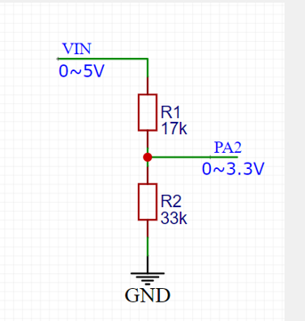

* STM32F103C8T6 ADC资源：ADC1、ADC2，10个外部输入通道

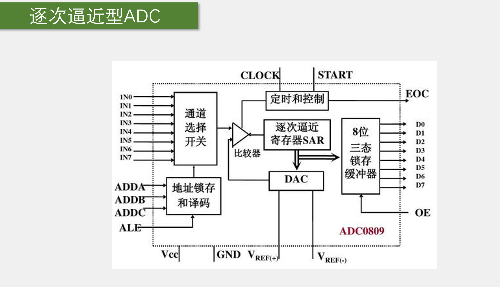

>逐次逼近型ADC：将输入电压与一个内部参考电压进行比较，从最高位开始，逐位比较，如果输入电压大于参考电压，则该位为1，否则为0，直到比较完所有位，就能得到相近的数字电压。（有点像二分法）

#### 2.8.2 ADC基本结构

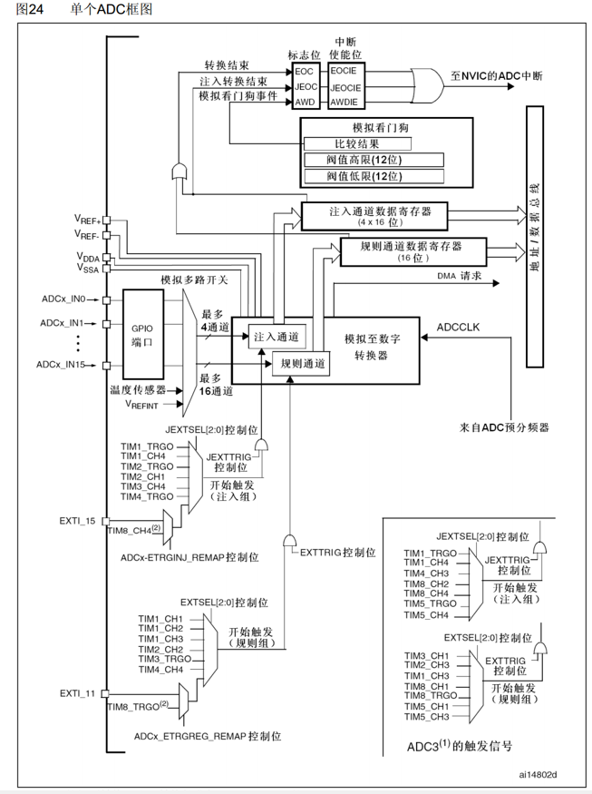

* 其中触发转换源有软件触发（调用函数）、硬件触发（如定时器主模式TRGO（这样就能不用频繁进入中断了），定时器通道，外部中断引脚）等。
* 不同的触发方式有对应的通道（注入通道、规则通道），在图上对应，一般使用规则通道。
* 规则通道有规则组（16个），但是规则组只有一个数据寄存器，所以每个通道的数据只能一个一个进行转换，这样就会使上个通道的数据被覆盖。（通常使用DMA来解决这个问题）
* ADC转换后可以直接输出到总线，也可以触发中断或看门狗事件
* ADC需要时钟，其最大时钟频率为14MHz，源头是APB2的72MHZ，所以只能使用6分频，即12MHz，以及8分频，即9MHz。

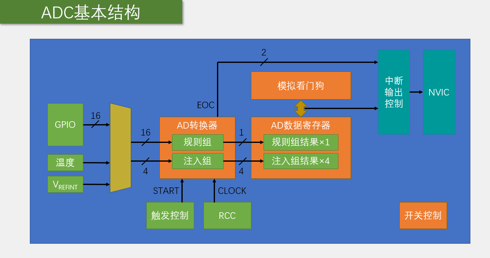

>GPIO的通道是一一对应的，在GPIO映射表上可查。


#### 2.8.3 ADC参数
1. 通道与规则组

* 通道是定死的，规则组大小是可变的，是要将通道放在在对应规则组中才能进行后续操作 

2. 转换模式
ADC有四种转换模式：即单次转换扫描，单次转换非扫描，连续转换扫描，连续转换非扫描。
* 单次：触发一次转换一次，转换完后停止，EOC置1。
* 连续：不停地转换，所以只需要开启一次，每次转换后
* 扫描：转换多个通道，规则组因为只有一个寄存器，所以每次扫描下一个通道时会覆盖上一个数据（DMA可解决，每扫描一个通道会产生一个DMA可以响应的事件）
* 非扫描：只转换一个通道

3. 数据对齐

* 左对齐：数据的高位对齐，低位补0
* 右对齐：数据的低位对齐，高位补0（常用）

4. 转换时间
* STM32 ADC的总转换时间为：
	TCONV = 采样时间 + 12.5个ADC周期
* 例如：当ADCCLK=14MHz，采样时间为1.5个ADC周期
	TCONV = 1.5 + 12.5 = 14个ADC周期 = 1μs


5. 校准
* ADC有一个内置自校准模式。校准可大幅减小因内部电容器组的变化而造成的准精度误差。校准期间，在每个电容器上都会计算出一个误差修正码(数字值)，这个码用于消除在随后的转换中每个电容器上产生的误差
* 建议在每次上电后执行一次校准
* 启动校准前， ADC必须处于关电状态超过至少两个ADC时钟周期

#### 2.8.4 ADC步骤

1. 开启ADC和GPIO时钟
2. 设置ADC时钟分频
3. 初始化GIPO结构体，包括模式、速度、引脚
4. 初始化ADC结构体，包括链接模式、数据对齐、触发源、转换模式、通道数
5. 使能ADC
6. 开启ADC校准
7. 如果需要中断或看门狗，记得开启中断\看门狗，并设置NVIC

#### 2.8.5 ADC代码

多路ADC输入（无DMA）：
这里是单次非扫描模式，只用了1个通道，需要哪个ADC输出时就把需要的通道放在规则组1中（因为扫描时下一个通道数据会覆盖上一个通道数据，不用DMA的话只能这样）
```c
#include "stm32f10x.h"                  // Device header

/**
  * 函    数：AD初始化
  * 参    数：无
  * 返 回 值：无
  */
void AD_Init(void)
{
	/*开启时钟*/
	RCC_APB2PeriphClockCmd(RCC_APB2Periph_ADC1, ENABLE);	//开启ADC1的时钟
	RCC_APB2PeriphClockCmd(RCC_APB2Periph_GPIOA, ENABLE);	//开启GPIOA的时钟
	
	/*设置ADC时钟*/
	RCC_ADCCLKConfig(RCC_PCLK2_Div6);						//选择时钟6分频，ADCCLK = 72MHz / 6 = 12MHz
	
	/*GPIO初始化*/
	GPIO_InitTypeDef GPIO_InitStructure;
	GPIO_InitStructure.GPIO_Mode = GPIO_Mode_AIN;
	GPIO_InitStructure.GPIO_Pin = GPIO_Pin_0 | GPIO_Pin_1 | GPIO_Pin_2 | GPIO_Pin_3;
	GPIO_InitStructure.GPIO_Speed = GPIO_Speed_50MHz;
	GPIO_Init(GPIOA, &GPIO_InitStructure);					//将PA0、PA1、PA2和PA3引脚初始化为模拟输入
	
	/*不在此处配置规则组序列，而是在每次AD转换前配置，这样可以灵活更改AD转换的通道*/
	
	/*ADC初始化*/
	ADC_InitTypeDef ADC_InitStructure;						//定义结构体变量
	ADC_InitStructure.ADC_Mode = ADC_Mode_Independent;		//模式，选择独立模式，即单独使用ADC1
	ADC_InitStructure.ADC_DataAlign = ADC_DataAlign_Right;	//数据对齐，选择右对齐
	ADC_InitStructure.ADC_ExternalTrigConv = ADC_ExternalTrigConv_None;	//外部触发，使用软件触发，不需要外部触发
	ADC_InitStructure.ADC_ContinuousConvMode = DISABLE;		//连续转换，失能，每转换一次规则组序列后停止
	ADC_InitStructure.ADC_ScanConvMode = DISABLE;			//扫描模式，失能，只转换规则组的序列1这一个位置
	ADC_InitStructure.ADC_NbrOfChannel = 1;					//通道数，为1，仅在扫描模式下，才需要指定大于1的数，在非扫描模式下，只能是1
	ADC_Init(ADC1, &ADC_InitStructure);						//将结构体变量交给ADC_Init，配置ADC1
	
	/*ADC使能*/
	ADC_Cmd(ADC1, ENABLE);									//使能ADC1，ADC开始运行
	
	/*ADC校准*/
	ADC_ResetCalibration(ADC1);								//固定流程，内部有电路会自动执行校准
	while (ADC_GetResetCalibrationStatus(ADC1) == SET);
	ADC_StartCalibration(ADC1);
	while (ADC_GetCalibrationStatus(ADC1) == SET);
}

/**
  * 函    数：获取AD转换的值
  * 参    数：ADC_Channel 指定AD转换的通道，范围：ADC_Channel_x，其中x可以是0/1/2/3
  * 返 回 值：AD转换的值，范围：0~4095
  */
uint16_t AD_GetValue(uint8_t ADC_Channel)
{
	ADC_RegularChannelConfig(ADC1, ADC_Channel, 1, ADC_SampleTime_55Cycles5);	//在每次转换前，根据函数形参灵活更改ADC,规则组的通道，以及采样时间
	ADC_SoftwareStartConvCmd(ADC1, ENABLE);					//软件触发AD转换一次
	while (ADC_GetFlagStatus(ADC1, ADC_FLAG_EOC) == RESET);	//等待EOC标志位，即等待AD转换结束
	return ADC_GetConversionValue(ADC1);					//读数据寄存器，得到AD转换的结果
}
```
>main.c中获取通道0（其他同理）`uint16_t AD0 = AD_GetValue(ADC_Channel_0);`

下面代码将得到的值转化为电压：

```c
Voltage = (float)ADValue / 4095 * 3.3;		//将AD值线性变换到0~3.3的范围，表示电压
		
OLED_ShowNum(1, 9, ADValue, 4);				//显示AD值
OLED_ShowNum(2, 9, Voltage, 1);				//显示电压值的整数部分
OLED_ShowNum(2, 11, (uint16_t)(Voltage * 100) % 100, 2);	//显示电压值的小数部分
```

<br>
<br>

---

### 2.9 DMA

#### 2.9.1 DMA简介
* DMA（Direct Memory Access）直接存储器存取
* DMA可以提供外设和存储器或者存储器和存储器之间的高速数据传输，无须CPU干预，节省了CPU的资源
* 12个独立可配置的通道： DMA1（7个通道）， DMA2（5个通道）
* 每个通道都支持软件触发和特定的硬件触发

* STM32F103C8T6 DMA资源：DMA1（7个通道）

#### 2.9.2 存储器映像

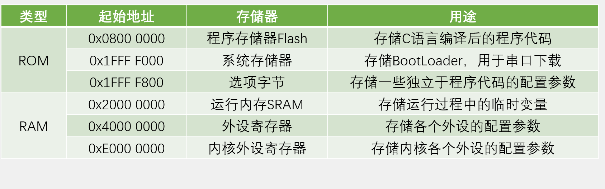

>注：falsh只读，也用来存储常量

>bootloader：引导程序，用于启动系统，一般在flash的前面，用于检测系统是否正常，如果不正常则跳转到用户程序

#### 2.9.3 DMA基本结构

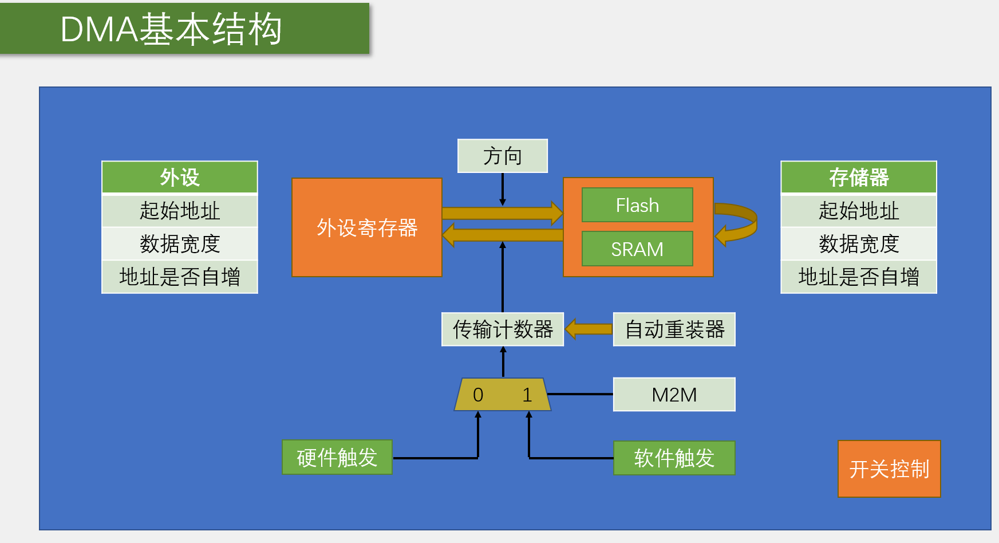

* 传输结构：包括起始地址，数据宽度（不对称时高位补0或移除高位），是否自增
* 方向：可以是内存到外设，外设到内存，内存到内存（不能到flash）
* 计数器：转移次数，当计数器减到0时，自增的地址回到原位。并考虑是否自动重装，不重装DMA停止。如果ADC是扫描连续转换模式，则需要DMA重装
* M2M:给1时**软件触发（是指立即执行DMA并不断触发，直到计数器清零，不是只运行一次）**，给0时硬件触发。
* 开关控制：要使能

#### 2.9.4 DMA硬件触发通道

软件触发每个通道是相同的，但是硬件触发每个通道是固定的：

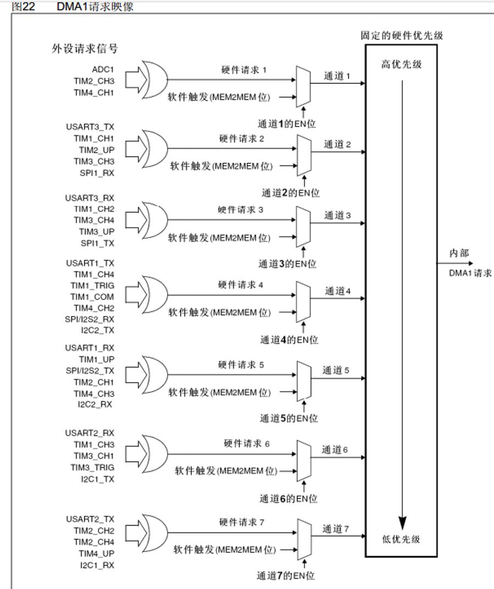

#### 2.9.5 DMA常见方式

1. 内存到内存（数组转移）

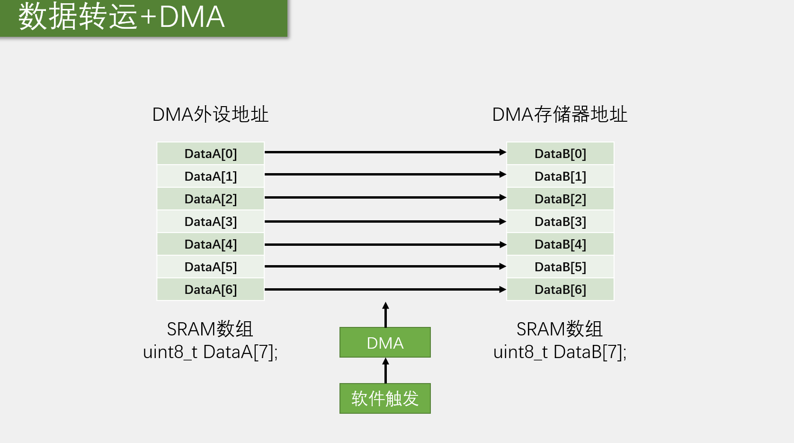

2. 外设到内存（ADC转移）

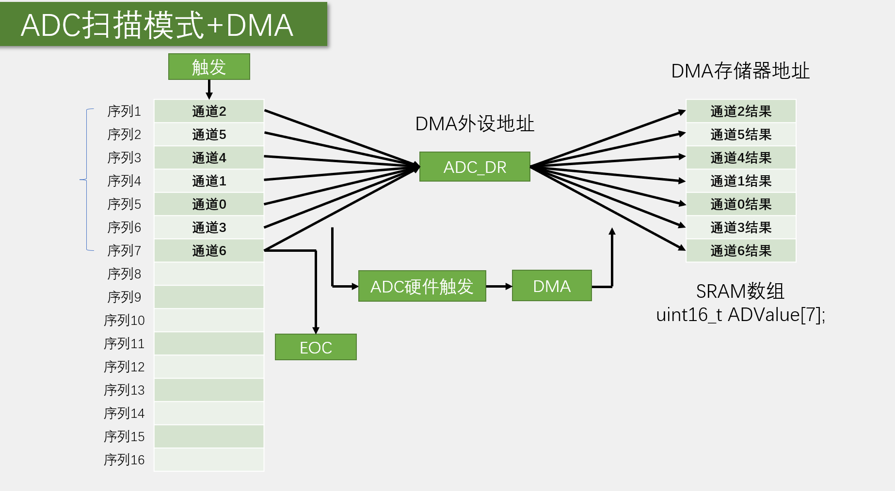

>这里外设地址只有一个，所以不能自增

#### 2.9.6 DMA代码

数组SRAM到SRAM：
```c
#include "stm32f10x.h"                  // Device header

uint16_t MyDMA_Size;					//定义全局变量，用于记住Init函数的Size，供Transfer函数使用

/**
  * 函    数：DMA初始化
  * 参    数：AddrA 原数组的首地址
  * 参    数：AddrB 目的数组的首地址
  * 参    数：Size 转运的数据大小（转运次数）
  * 返 回 值：无
  */
void MyDMA_Init(uint32_t AddrA, uint32_t AddrB, uint16_t Size)
{
	MyDMA_Size = Size;					//将Size写入到全局变量，记住参数Size
	
	/*开启时钟*/
	RCC_AHBPeriphClockCmd(RCC_AHBPeriph_DMA1, ENABLE);						//开启DMA的时钟
	
	/*DMA初始化*/
	DMA_InitTypeDef DMA_InitStructure;					//定义结构体变量
	DMA_InitStructure.DMA_PeripheralBaseAddr = AddrA;			//外设基地址，给定形参AddrA
	DMA_InitStructure.DMA_PeripheralDataSize = DMA_PeripheralDataSize_Byte;	//外设数据宽度，选择字节
	DMA_InitStructure.DMA_PeripheralInc = DMA_PeripheralInc_Enable;		//外设地址自增，选择使能
	DMA_InitStructure.DMA_MemoryBaseAddr = AddrB;				//存储器基地址，给定形参AddrB
	DMA_InitStructure.DMA_MemoryDataSize = DMA_MemoryDataSize_Byte;		//存储器数据宽度，选择字节
	DMA_InitStructure.DMA_MemoryInc = DMA_MemoryInc_Enable;			//存储器地址自增，选择使能
	DMA_InitStructure.DMA_DIR = DMA_DIR_PeripheralSRC;			//数据传输方向，选择由外设到存储器
	DMA_InitStructure.DMA_BufferSize = Size;				//转运的数据大小（转运次数）
	DMA_InitStructure.DMA_Mode = DMA_Mode_Normal;				//模式，选择正常模式
	DMA_InitStructure.DMA_M2M = DMA_M2M_Enable;				//存储器到存储器，选择使能
	DMA_InitStructure.DMA_Priority = DMA_Priority_Medium;			//优先级，选择中等
	DMA_Init(DMA1_Channel1, &DMA_InitStructure);				//将结构体变量交给DMA_Init，配置DMA1的通道1
	
	/*DMA使能*/
	DMA_Cmd(DMA1_Channel1, DISABLE);	//这里先不给使能，初始化后不会立刻工作，等后续调用Transfer后，再开始
}

/**
  * 函    数：启动DMA数据转运
  * 参    数：无
  * 返 回 值：无
  */
void MyDMA_Transfer(void)
{
	DMA_Cmd(DMA1_Channel1, DISABLE);					//DMA失能，在写入传输计数器之前，需要DMA暂停工作
	DMA_SetCurrDataCounter(DMA1_Channel1, MyDMA_Size);	//写入传输计数器，指定将要转运的次数
	DMA_Cmd(DMA1_Channel1, ENABLE);						//DMA使能，开始工作
	
	while (DMA_GetFlagStatus(DMA1_FLAG_TC1) == RESET);	//等待DMA工作完成
	DMA_ClearFlag(DMA1_FLAG_TC1);						//清除工作完成标志位
}
```
>**注：DMA结构体选择传输方向时只有两个选项，外设到存储器或存储器到外设，没有存储器到存储器。如果要存储器到存储器，需要选择外设到存储器。**

>main.c中调用`MyDMA_Init((uint32_t)AddrA, (uint32_t)AddrB, 10);MyDMA_Transfer();`

ADC到SRAM(ADC的DMA使能要打开)：
```c
#include "stm32f10x.h"                  // Device header

uint16_t AD_Value[4];					//定义用于存放AD转换结果的全局数组

/**
  * 函    数：AD初始化
  * 参    数：无
  * 返 回 值：无
  */
void AD_Init(void)
{
	/*开启时钟*/
	RCC_APB2PeriphClockCmd(RCC_APB2Periph_ADC1, ENABLE);	//开启ADC1的时钟
	RCC_APB2PeriphClockCmd(RCC_APB2Periph_GPIOA, ENABLE);	//开启GPIOA的时钟
	RCC_AHBPeriphClockCmd(RCC_AHBPeriph_DMA1, ENABLE);		//开启DMA1的时钟
	
	/*设置ADC时钟*/
	RCC_ADCCLKConfig(RCC_PCLK2_Div6);						//选择时钟6分频，ADCCLK = 72MHz / 6 = 12MHz
	
	/*GPIO初始化*/
	GPIO_InitTypeDef GPIO_InitStructure;
	GPIO_InitStructure.GPIO_Mode = GPIO_Mode_AIN;
	GPIO_InitStructure.GPIO_Pin = GPIO_Pin_0 | GPIO_Pin_1 | GPIO_Pin_2 | GPIO_Pin_3;
	GPIO_InitStructure.GPIO_Speed = GPIO_Speed_50MHz;
	GPIO_Init(GPIOA, &GPIO_InitStructure);					//将PA0、PA1、PA2和PA3引脚初始化为模拟输入
	
	/*规则组通道配置*/
	ADC_RegularChannelConfig(ADC1, ADC_Channel_0, 1, ADC_SampleTime_55Cycles5);	//规则组序列1的位置，配置为通道0
	ADC_RegularChannelConfig(ADC1, ADC_Channel_1, 2, ADC_SampleTime_55Cycles5);	//规则组序列2的位置，配置为通道1
	ADC_RegularChannelConfig(ADC1, ADC_Channel_2, 3, ADC_SampleTime_55Cycles5);	//规则组序列3的位置，配置为通道2
	ADC_RegularChannelConfig(ADC1, ADC_Channel_3, 4, ADC_SampleTime_55Cycles5);	//规则组序列4的位置，配置为通道3
	
	/*ADC初始化*/
	ADC_InitTypeDef ADC_InitStructure;											//定义结构体变量
	ADC_InitStructure.ADC_Mode = ADC_Mode_Independent;							//模式，选择独立模式，即单独使用ADC1
	ADC_InitStructure.ADC_DataAlign = ADC_DataAlign_Right;						//数据对齐，选择右对齐
	ADC_InitStructure.ADC_ExternalTrigConv = ADC_ExternalTrigConv_None;			//外部触发，使用软件触发，不需要外部触发
	ADC_InitStructure.ADC_ContinuousConvMode = ENABLE;							//连续转换，使能，每转换一次规则组序列后立刻开始下一次转换
	ADC_InitStructure.ADC_ScanConvMode = ENABLE;								//扫描模式，使能，扫描规则组的序列，扫描数量由ADC_NbrOfChannel确定
	ADC_InitStructure.ADC_NbrOfChannel = 4;										//通道数，为4，扫描规则组的前4个通道
	ADC_Init(ADC1, &ADC_InitStructure);											//将结构体变量交给ADC_Init，配置ADC1
	
	/*DMA初始化*/
	DMA_InitTypeDef DMA_InitStructure;											//定义结构体变量
	DMA_InitStructure.DMA_PeripheralBaseAddr = (uint32_t)&ADC1->DR;				//外设基地址，给定形参AddrA
	DMA_InitStructure.DMA_PeripheralDataSize = DMA_PeripheralDataSize_HalfWord;	//外设数据宽度，选择半字，对应16为的ADC数据寄存器
	DMA_InitStructure.DMA_PeripheralInc = DMA_PeripheralInc_Disable;			//外设地址自增，选择失能，始终以ADC数据寄存器为源
	DMA_InitStructure.DMA_MemoryBaseAddr = (uint32_t)AD_Value;					//存储器基地址，给定存放AD转换结果的全局数组AD_Value
	DMA_InitStructure.DMA_MemoryDataSize = DMA_MemoryDataSize_HalfWord;			//存储器数据宽度，选择半字，与源数据宽度对应
	DMA_InitStructure.DMA_MemoryInc = DMA_MemoryInc_Enable;						//存储器地址自增，选择使能，每次转运后，数组移到下一个位置
	DMA_InitStructure.DMA_DIR = DMA_DIR_PeripheralSRC;							//数据传输方向，选择由外设到存储器，ADC数据寄存器转到数组
	DMA_InitStructure.DMA_BufferSize = 4;										//转运的数据大小（转运次数），与ADC通道数一致
	DMA_InitStructure.DMA_Mode = DMA_Mode_Circular;								//模式，选择循环模式，与ADC的连续转换一致
	DMA_InitStructure.DMA_M2M = DMA_M2M_Disable;								//存储器到存储器，选择失能，数据由ADC外设触发转运到存储器
	DMA_InitStructure.DMA_Priority = DMA_Priority_Medium;						//优先级，选择中等
	DMA_Init(DMA1_Channel1, &DMA_InitStructure);								//将结构体变量交给DMA_Init，配置DMA1的通道1
	
	/*DMA和ADC使能*/
	DMA_Cmd(DMA1_Channel1, ENABLE);							//DMA1的通道1使能
	ADC_DMACmd(ADC1, ENABLE);								//ADC1触发DMA1的信号使能
	ADC_Cmd(ADC1, ENABLE);									//ADC1使能
	
	/*ADC校准*/
	ADC_ResetCalibration(ADC1);								//固定流程，内部有电路会自动执行校准
	while (ADC_GetResetCalibrationStatus(ADC1) == SET);
	ADC_StartCalibration(ADC1);
	while (ADC_GetCalibrationStatus(ADC1) == SET);
	
	/*ADC触发*/
	ADC_SoftwareStartConvCmd(ADC1, ENABLE);	//软件触发ADC开始工作，由于ADC处于连续转换模式，故触发一次后ADC就可以一直连续不断地工作
}
```

<br>
<br>

---

### 2.10 USART

帧格式和波特率的概念见《通信协议 I2C、SPI 与 UART》里的 UART。这里只写 STM32 的引脚和收发代码。

#### 2.10.1 串口简介

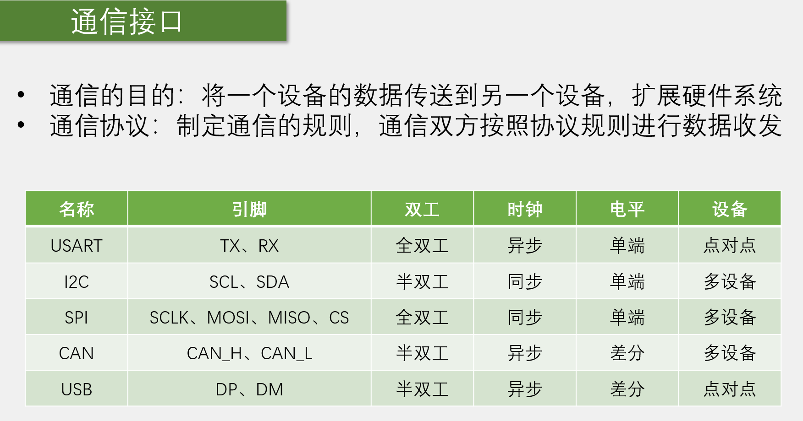

>当电平标准不一致时，需要加电平转换芯片

#### 2.10.2 串口参数
* 波特率：串口通信的速率`波特率 = fPCLK2/1 / (16 * DIV)`
* 起始位：标志一个数据帧的开始，固定为低电平
* 数据位：数据帧的有效载荷，1为高电平，0为低电平，低位先行
* 校验位：用于数据验证，根据数据位计算得来
* 停止位：用于数据帧间隔，固定为高电平

#### 2.10.3 USART基本结构

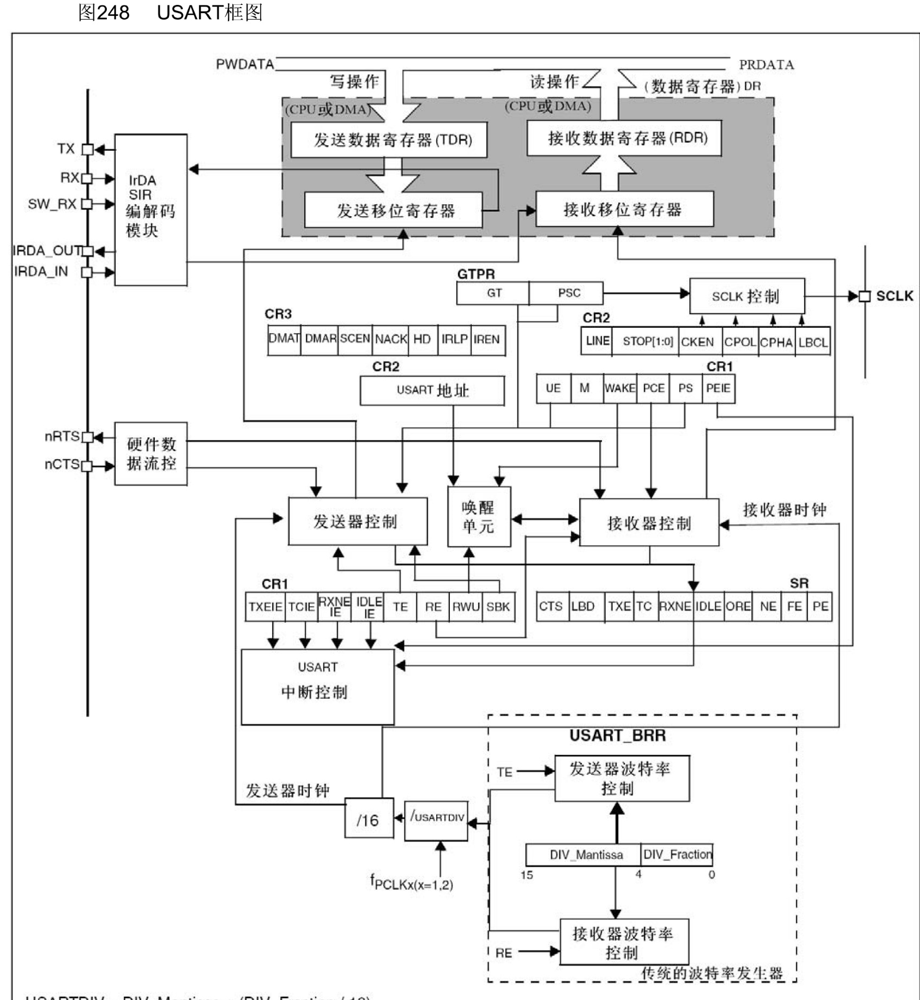

* 当数据写出去时并不是直接发送，而是要先进入发送位移寄存器，然后由位移寄存器发送出去。当数据全部进入位移寄存器后，会产生一个发送完成的标志位（TXE置1），这时才能继续写入数据。
* 接收同理，当接收到数据后，会进入接收位移寄存器，然后由位移寄存器发送到接收寄存器，当数据全部移动到接收寄存器时，会产生一个接收完成的标志位（RXNE置1），这时才能继续读取数据。
* 位移寄存器方向从左到右，即从低位到高位
* nRETS，nCTS是硬件流控制的引脚，用于控制数据的流动，当nRETS为低时，数据可以发送，当nCTS为低时，数据可以接收（需要硬件支持）
* SCLK：输出时钟，常用于让接收方测量波特率
* 唤醒单元：当一条总线上有多个设备时，可以通过唤醒单元唤醒特定设备
* 中断控制：用于是否开启中断
* 数据移动：低位先行，即先发送低位，再发送高位

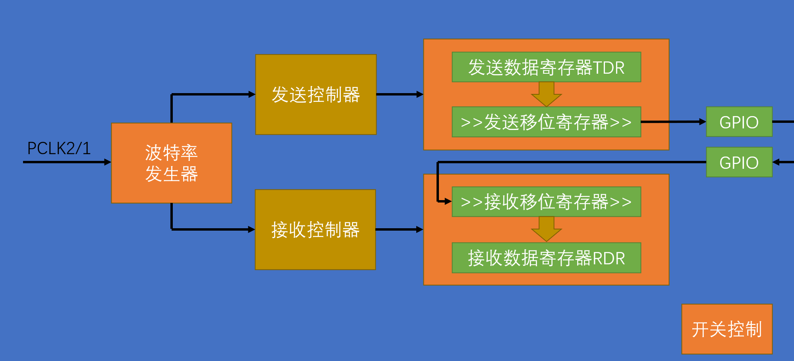

#### 2.10.3 USART发送接收原理

##### 2.10.3.1 数据帧结构

数据长度可以是8位或9位，校验位可以是奇校验、偶校验、无校验，停止位可以是0.5位、1位、1.5位、2位。

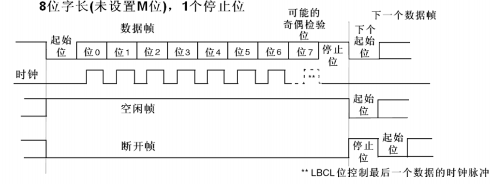

##### 2.10.3.2 数据开始检测和采样

为了保证数据的准确性，USART在接收数据时，即当出现低电平时，会开始16个时钟周期的采样，以保证数据的准确性。读取数据位时是采样的中间的3个时钟周期的位。如果其中有1（或说成不同的电平）,会将NE置1表示出现噪声。

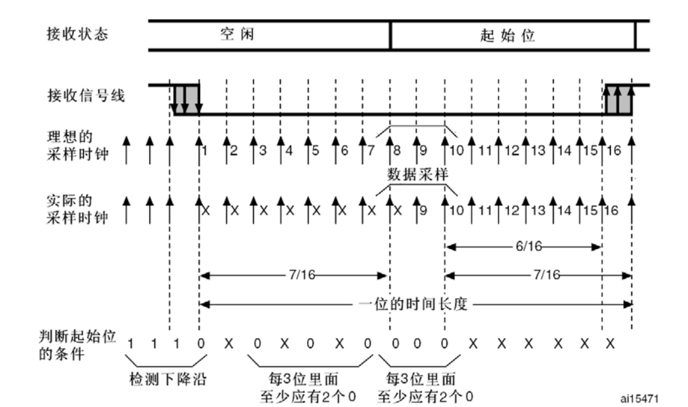

##### 2.10.3.3 数据形式

串口数据一般两种形式：HEX和ASCII。HEX是16进制，ASCII是字符。

本质都是HEX，只是ASCII是将HEX转换为字符进行编码

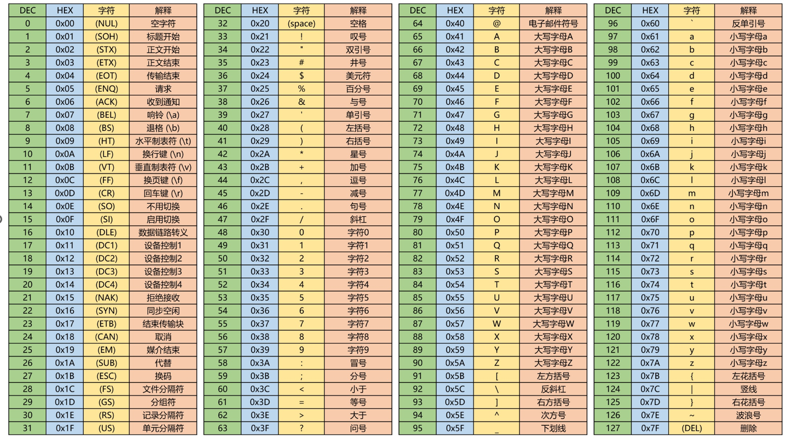

##### 2.10.3.4 数据包封装

1. HEX数据包

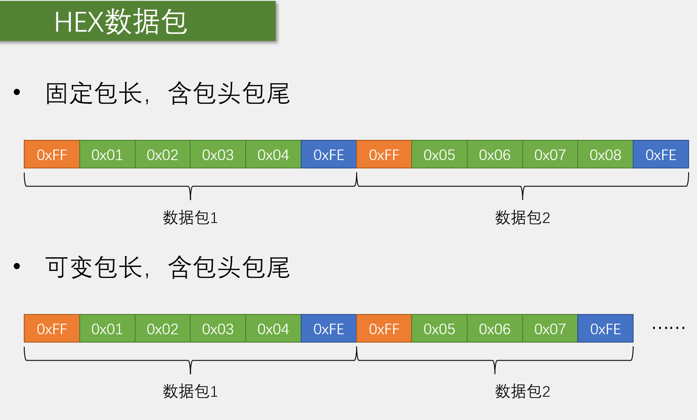
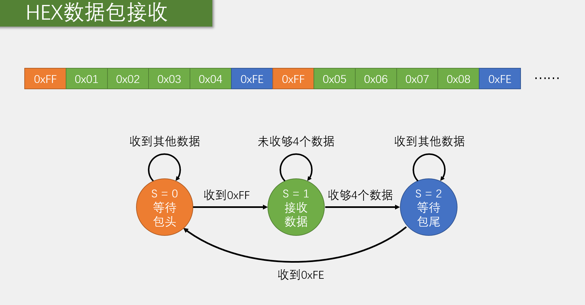

2. ASCII数据包

WIN系统串口发送时，会自动加上回车`\r`和换行`\n`，所以在接收时需要注意。

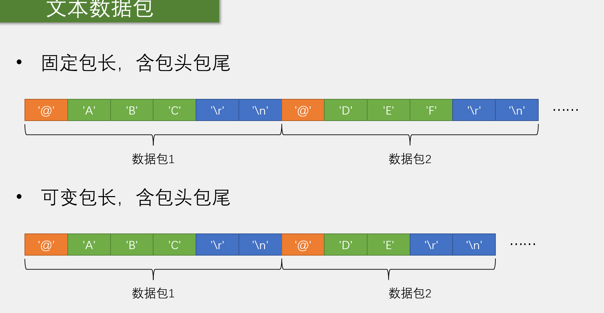
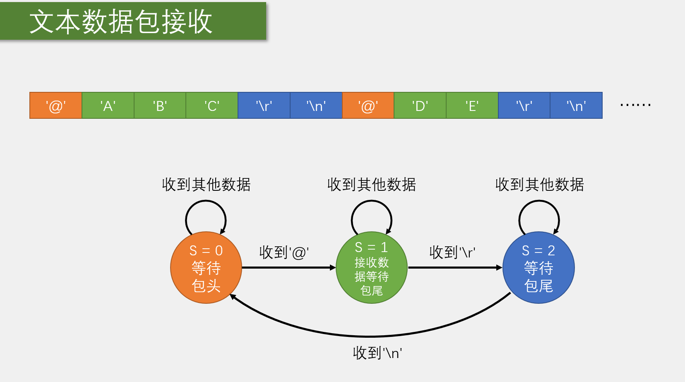

#### 2.10.4 USART代码

发送接收HEX数据包：
```c
#include "stm32f10x.h"                  // Device header
#include <stdio.h>
#include <stdarg.h>

uint8_t Serial_TxPacket[4];				//定义发送数据包数组，数据包格式：FF 01 02 03 04 FE
uint8_t Serial_RxPacket[4];				//定义接收数据包数组
uint8_t Serial_RxFlag;					//定义接收数据包标志位

/**
  * 函    数：串口初始化
  * 参    数：无
  * 返 回 值：无
  */
void Serial_Init(void)
{
	/*开启时钟*/
	RCC_APB2PeriphClockCmd(RCC_APB2Periph_USART1, ENABLE);	//开启USART1的时钟
	RCC_APB2PeriphClockCmd(RCC_APB2Periph_GPIOA, ENABLE);	//开启GPIOA的时钟
	
	/*GPIO初始化*/
	GPIO_InitTypeDef GPIO_InitStructure;
	GPIO_InitStructure.GPIO_Mode = GPIO_Mode_AF_PP;
	GPIO_InitStructure.GPIO_Pin = GPIO_Pin_9;
	GPIO_InitStructure.GPIO_Speed = GPIO_Speed_50MHz;
	GPIO_Init(GPIOA, &GPIO_InitStructure);					//将PA9引脚初始化为复用推挽输出
	
	GPIO_InitStructure.GPIO_Mode = GPIO_Mode_IPU;
	GPIO_InitStructure.GPIO_Pin = GPIO_Pin_10;
	GPIO_InitStructure.GPIO_Speed = GPIO_Speed_50MHz;
	GPIO_Init(GPIOA, &GPIO_InitStructure);					//将PA10引脚初始化为上拉输入
	
	/*USART初始化*/
	USART_InitTypeDef USART_InitStructure;					//定义结构体变量
	USART_InitStructure.USART_BaudRate = 9600;				//波特率
	USART_InitStructure.USART_HardwareFlowControl = USART_HardwareFlowControl_None;	//硬件流控制，不需要
	USART_InitStructure.USART_Mode = USART_Mode_Tx | USART_Mode_Rx;	//模式，发送模式和接收模式均选择
	USART_InitStructure.USART_Parity = USART_Parity_No;		//奇偶校验，不需要
	USART_InitStructure.USART_StopBits = USART_StopBits_1;	//停止位，选择1位
	USART_InitStructure.USART_WordLength = USART_WordLength_8b;		//字长，选择8位
	USART_Init(USART1, &USART_InitStructure);				//将结构体变量交给USART_Init，配置USART1
	
	/*中断输出配置*/
	USART_ITConfig(USART1, USART_IT_RXNE, ENABLE);			//开启串口接收数据的中断
	
	/*NVIC中断分组*/
	NVIC_PriorityGroupConfig(NVIC_PriorityGroup_2);			//配置NVIC为分组2
	
	/*NVIC配置*/
	NVIC_InitTypeDef NVIC_InitStructure;					//定义结构体变量
	NVIC_InitStructure.NVIC_IRQChannel = USART1_IRQn;		//选择配置NVIC的USART1线
	NVIC_InitStructure.NVIC_IRQChannelCmd = ENABLE;			//指定NVIC线路使能
	NVIC_InitStructure.NVIC_IRQChannelPreemptionPriority = 1;		//指定NVIC线路的抢占优先级为1
	NVIC_InitStructure.NVIC_IRQChannelSubPriority = 1;		//指定NVIC线路的响应优先级为1
	NVIC_Init(&NVIC_InitStructure);							//将结构体变量交给NVIC_Init，配置NVIC外设
	
	/*USART使能*/
	USART_Cmd(USART1, ENABLE);								//使能USART1，串口开始运行
}

/**
  * 函    数：串口发送一个字节
  * 参    数：Byte 要发送的一个字节
  * 返 回 值：无
  */
void Serial_SendByte(uint8_t Byte)
{
	USART_SendData(USART1, Byte);		//将字节数据写入数据寄存器，写入后USART自动生成时序波形
	while (USART_GetFlagStatus(USART1, USART_FLAG_TXE) == RESET);	//等待发送完成
	/*下次写入数据寄存器会自动清除发送完成标志位，故此循环后，无需清除标志位*/
}

/**
  * 函    数：串口发送一个数组
  * 参    数：Array 要发送数组的首地址
  * 参    数：Length 要发送数组的长度
  * 返 回 值：无
  */
void Serial_SendArray(uint8_t *Array, uint16_t Length)
{
	uint16_t i;
	for (i = 0; i < Length; i ++)		//遍历数组
	{
		Serial_SendByte(Array[i]);		//依次调用Serial_SendByte发送每个字节数据
	}
}

/**
  * 函    数：串口发送一个字符串
  * 参    数：String 要发送字符串的首地址
  * 返 回 值：无
  */
void Serial_SendString(char *String)
{
	uint8_t i;
	for (i = 0; String[i] != '\0'; i ++)//遍历字符数组（字符串），遇到字符串结束标志位后停止
	{
		Serial_SendByte(String[i]);		//依次调用Serial_SendByte发送每个字节数据
	}
}

/**
  * 函    数：次方函数（内部使用）
  * 返 回 值：返回值等于X的Y次方
  */
uint32_t Serial_Pow(uint32_t X, uint32_t Y)
{
	uint32_t Result = 1;	//设置结果初值为1
	while (Y --)			//执行Y次
	{
		Result *= X;		//将X累乘到结果
	}
	return Result;
}

/**
  * 函    数：串口发送数字
  * 参    数：Number 要发送的数字，范围：0~4294967295
  * 参    数：Length 要发送数字的长度，范围：0~10
  * 返 回 值：无
  */
void Serial_SendNumber(uint32_t Number, uint8_t Length)
{
	uint8_t i;
	for (i = 0; i < Length; i ++)		//根据数字长度遍历数字的每一位
	{
		Serial_SendByte(Number / Serial_Pow(10, Length - i - 1) % 10 + '0');	//依次调用Serial_SendByte发送每位数字(从个位开始)
	}
}

/**
  * 函    数：使用printf需要重定向的底层函数
  * 参    数：保持原始格式即可，无需变动
  * 返 回 值：保持原始格式即可，无需变动
  */
int fputc(int ch, FILE *f)
{
	Serial_SendByte(ch);			//将printf的底层重定向到自己的发送字节函数
	return ch;
}

/**
  * 函    数：自己封装的prinf函数
  * 参    数：format 格式化字符串
  * 参    数：... 可变的参数列表
  * 返 回 值：无
  */
void Serial_Printf(char *format, ...)
{
	char String[100];				//定义字符数组
	va_list arg;					//定义可变参数列表数据类型的变量arg
	va_start(arg, format);			//从format开始，接收参数列表到arg变量
	vsprintf(String, format, arg);	//使用vsprintf打印格式化字符串和参数列表到字符数组中
	va_end(arg);					//结束变量arg
	Serial_SendString(String);		//串口发送字符数组（字符串）
}

/**
  * 函    数：串口发送数据包
  * 参    数：无
  * 返 回 值：无
  * 说    明：调用此函数后，Serial_TxPacket数组的内容将加上包头（FF）包尾（FE）后，作为数据包发送出去
  */
void Serial_SendPacket(void)
{
	Serial_SendByte(0xFF);
	Serial_SendArray(Serial_TxPacket, 4);
	Serial_SendByte(0xFE);
}

/**
  * 函    数：获取串口接收数据包标志位
  * 参    数：无
  * 返 回 值：串口接收数据包标志位，范围：0~1，接收到数据包后，标志位置1，读取后标志位自动清零
  */
uint8_t Serial_GetRxFlag(void)
{
	if (Serial_RxFlag == 1)			//如果标志位为1
	{
		Serial_RxFlag = 0;
		return 1;					//则返回1，并自动清零标志位
	}
	return 0;						//如果标志位为0，则返回0
}

/**
  * 函    数：USART1中断函数
  * 参    数：无
  * 返 回 值：无
  * 注意事项：此函数为中断函数，无需调用，中断触发后自动执行
  *           函数名为预留的指定名称，可以从启动文件复制
  *           请确保函数名正确，不能有任何差异，否则中断函数将不能进入
  */
void USART1_IRQHandler(void)
{
	static uint8_t RxState = 0;		//定义表示当前状态机状态的静态变量
	static uint8_t pRxPacket = 0;	//定义表示当前接收数据位置的静态变量
	if (USART_GetITStatus(USART1, USART_IT_RXNE) == SET)		//判断是否是USART1的接收事件触发的中断
	{
		uint8_t RxData = USART_ReceiveData(USART1);				//读取数据寄存器，存放在接收的数据变量
		
		/*使用状态机的思路，依次处理数据包的不同部分*/
		
		/*当前状态为0，接收数据包包头*/
		if (RxState == 0)
		{
			if (RxData == 0xFF)			//如果数据确实是包头
			{
				RxState = 1;			//置下一个状态
				pRxPacket = 0;			//数据包的位置归零
			}
		}
		/*当前状态为1，接收数据包数据*/
		else if (RxState == 1)
		{
			Serial_RxPacket[pRxPacket] = RxData;	//将数据存入数据包数组的指定位置
			pRxPacket ++;				//数据包的位置自增
			if (pRxPacket >= 4)			//如果收够4个数据
			{
				RxState = 2;			//置下一个状态
			}
		}
		/*当前状态为2，接收数据包包尾*/
		else if (RxState == 2)
		{
			if (RxData == 0xFE)			//如果数据确实是包尾部
			{
				RxState = 0;			//状态归0
				Serial_RxFlag = 1;		//接收数据包标志位置1，成功接收一个数据包
			}
		}
		
		USART_ClearITPendingBit(USART1, USART_IT_RXNE);		//清除标志位
	}
}

```

发送接收文本数据包：

**这里文本接收比HEX接收有一些不同，HEX接收的数据是固定长度（即还在处理上一个数组数据，结果判断标志位后函数`Serial_GetRxFlag`中将标志位`Serial_RxFlag`置0了，可能在处理时新的数据将旧的数据覆盖了），这里是可变长度，所以这里如果发生了错位问题较大（比如发送得太快处理得慢，长字符串还没处理玩就又接收了短的字符串，就会出现问题），所以改变策略，将`Serial_RxFlag`当作处理完毕标志位，当接收字符数组使用完了后才将`Serial_RxFlag`置0**

体现为代码就是HEX发送接收代码中有Serial_GetRxFlag()函数，当调用时就会把Serial_RxFlag置0，只要调用了获取标志位函数后就能就收新的。而文本发送接收代码中没有Serial_GetRxFlag()函数，Serial_RxFlag只有在处理完数据后才会置0，即处理玩数据后才接收新的。

```c
#include "stm32f10x.h"                  // Device header
#include <stdio.h>
#include <stdarg.h>

char Serial_RxPacket[100];				//定义接收数据包数组，数据包格式"@MSG\r\n"
uint8_t Serial_RxFlag;					//定义接收数据包标志位

/**
  * 函    数：串口初始化
  * 参    数：无
  * 返 回 值：无
  */
void Serial_Init(void)
{
	/*开启时钟*/
	RCC_APB2PeriphClockCmd(RCC_APB2Periph_USART1, ENABLE);	//开启USART1的时钟
	RCC_APB2PeriphClockCmd(RCC_APB2Periph_GPIOA, ENABLE);	//开启GPIOA的时钟
	
	/*GPIO初始化*/
	GPIO_InitTypeDef GPIO_InitStructure;
	GPIO_InitStructure.GPIO_Mode = GPIO_Mode_AF_PP;
	GPIO_InitStructure.GPIO_Pin = GPIO_Pin_9;
	GPIO_InitStructure.GPIO_Speed = GPIO_Speed_50MHz;
	GPIO_Init(GPIOA, &GPIO_InitStructure);					//将PA9引脚初始化为复用推挽输出
	
	GPIO_InitStructure.GPIO_Mode = GPIO_Mode_IPU;
	GPIO_InitStructure.GPIO_Pin = GPIO_Pin_10;
	GPIO_InitStructure.GPIO_Speed = GPIO_Speed_50MHz;
	GPIO_Init(GPIOA, &GPIO_InitStructure);					//将PA10引脚初始化为上拉输入
	
	/*USART初始化*/
	USART_InitTypeDef USART_InitStructure;					//定义结构体变量
	USART_InitStructure.USART_BaudRate = 9600;				//波特率
	USART_InitStructure.USART_HardwareFlowControl = USART_HardwareFlowControl_None;	//硬件流控制，不需要
	USART_InitStructure.USART_Mode = USART_Mode_Tx | USART_Mode_Rx;	//模式，发送模式和接收模式均选择
	USART_InitStructure.USART_Parity = USART_Parity_No;		//奇偶校验，不需要
	USART_InitStructure.USART_StopBits = USART_StopBits_1;	//停止位，选择1位
	USART_InitStructure.USART_WordLength = USART_WordLength_8b;		//字长，选择8位
	USART_Init(USART1, &USART_InitStructure);				//将结构体变量交给USART_Init，配置USART1
	
	/*中断输出配置*/
	USART_ITConfig(USART1, USART_IT_RXNE, ENABLE);			//开启串口接收数据的中断
	
	/*NVIC中断分组*/
	NVIC_PriorityGroupConfig(NVIC_PriorityGroup_2);			//配置NVIC为分组2
	
	/*NVIC配置*/
	NVIC_InitTypeDef NVIC_InitStructure;					//定义结构体变量
	NVIC_InitStructure.NVIC_IRQChannel = USART1_IRQn;		//选择配置NVIC的USART1线
	NVIC_InitStructure.NVIC_IRQChannelCmd = ENABLE;			//指定NVIC线路使能
	NVIC_InitStructure.NVIC_IRQChannelPreemptionPriority = 1;		//指定NVIC线路的抢占优先级为1
	NVIC_InitStructure.NVIC_IRQChannelSubPriority = 1;		//指定NVIC线路的响应优先级为1
	NVIC_Init(&NVIC_InitStructure);							//将结构体变量交给NVIC_Init，配置NVIC外设
	
	/*USART使能*/
	USART_Cmd(USART1, ENABLE);								//使能USART1，串口开始运行
}

/**
  * 函    数：串口发送一个字节
  * 参    数：Byte 要发送的一个字节
  * 返 回 值：无
  */
void Serial_SendByte(uint8_t Byte)
{
	USART_SendData(USART1, Byte);		//将字节数据写入数据寄存器，写入后USART自动生成时序波形
	while (USART_GetFlagStatus(USART1, USART_FLAG_TXE) == RESET);	//等待发送完成
	/*下次写入数据寄存器会自动清除发送完成标志位，故此循环后，无需清除标志位*/
}

/**
  * 函    数：串口发送一个数组
  * 参    数：Array 要发送数组的首地址
  * 参    数：Length 要发送数组的长度
  * 返 回 值：无
  */
void Serial_SendArray(uint8_t *Array, uint16_t Length)
{
	uint16_t i;
	for (i = 0; i < Length; i ++)		//遍历数组
	{
		Serial_SendByte(Array[i]);		//依次调用Serial_SendByte发送每个字节数据
	}
}

/**
  * 函    数：串口发送一个字符串
  * 参    数：String 要发送字符串的首地址
  * 返 回 值：无
  */
void Serial_SendString(char *String)
{
	uint8_t i;
	for (i = 0; String[i] != '\0'; i ++)//遍历字符数组（字符串），遇到字符串结束标志位后停止
	{
		Serial_SendByte(String[i]);		//依次调用Serial_SendByte发送每个字节数据
	}
}

/**
  * 函    数：次方函数（内部使用）
  * 返 回 值：返回值等于X的Y次方
  */
uint32_t Serial_Pow(uint32_t X, uint32_t Y)
{
	uint32_t Result = 1;	//设置结果初值为1
	while (Y --)			//执行Y次
	{
		Result *= X;		//将X累乘到结果
	}
	return Result;
}

/**
  * 函    数：串口发送数字
  * 参    数：Number 要发送的数字，范围：0~4294967295
  * 参    数：Length 要发送数字的长度，范围：0~10
  * 返 回 值：无
  */
void Serial_SendNumber(uint32_t Number, uint8_t Length)
{
	uint8_t i;
	for (i = 0; i < Length; i ++)		//根据数字长度遍历数字的每一位
	{
		Serial_SendByte(Number / Serial_Pow(10, Length - i - 1) % 10 + '0');	//依次调用Serial_SendByte发送每位数字
	}
}

/**
  * 函    数：使用printf需要重定向的底层函数
  * 参    数：保持原始格式即可，无需变动
  * 返 回 值：保持原始格式即可，无需变动
  */
int fputc(int ch, FILE *f)
{
	Serial_SendByte(ch);			//将printf的底层重定向到自己的发送字节函数
	return ch;
}

/**
  * 函    数：自己封装的prinf函数
  * 参    数：format 格式化字符串
  * 参    数：... 可变的参数列表
  * 返 回 值：无
  */
void Serial_Printf(char *format, ...)
{
	char String[100];				//定义字符数组
	va_list arg;					//定义可变参数列表数据类型的变量arg
	va_start(arg, format);			//从format开始，接收参数列表到arg变量
	vsprintf(String, format, arg);	//使用vsprintf打印格式化字符串和参数列表到字符数组中
	va_end(arg);					//结束变量arg
	Serial_SendString(String);		//串口发送字符数组（字符串）
}

/**
  * 函    数：USART1中断函数
  * 参    数：无
  * 返 回 值：无
  * 注意事项：此函数为中断函数，无需调用，中断触发后自动执行
  *           函数名为预留的指定名称，可以从启动文件复制
  *           请确保函数名正确，不能有任何差异，否则中断函数将不能进入
  */
void USART1_IRQHandler(void)
{
	static uint8_t RxState = 0;		//定义表示当前状态机状态的静态变量
	static uint8_t pRxPacket = 0;	//定义表示当前接收数据位置的静态变量
	if (USART_GetITStatus(USART1, USART_IT_RXNE) == SET)	//判断是否是USART1的接收事件触发的中断
	{
		uint8_t RxData = USART_ReceiveData(USART1);			//读取数据寄存器，存放在接收的数据变量
		
		/*使用状态机的思路，依次处理数据包的不同部分*/
		
		/*当前状态为0，接收数据包包头*/
		if (RxState == 0)
		{
			if (RxData == '@' && Serial_RxFlag == 0)		//如果数据确实是包头，并且上一个数据包已处理完毕
			{
				RxState = 1;			//置下一个状态
				pRxPacket = 0;			//数据包的位置归零
			}
		}
		/*当前状态为1，接收数据包数据，同时判断是否接收到了第一个包尾*/
		else if (RxState == 1)
		{
			if (RxData == '\r')			//如果收到第一个包尾
			{
				RxState = 2;			//置下一个状态
			}
			else						//接收到了正常的数据
			{
				Serial_RxPacket[pRxPacket] = RxData;		//将数据存入数据包数组的指定位置
				pRxPacket ++;			//数据包的位置自增
			}
		}
		/*当前状态为2，接收数据包第二个包尾*/
		else if (RxState == 2)
		{
			if (RxData == '\n')			//如果收到第二个包尾
			{
				RxState = 0;			//状态归0
				Serial_RxPacket[pRxPacket] = '\0';			//将收到的字符数据包添加一个字符串结束标志
				Serial_RxFlag = 1;		//接收数据包标志位置1，成功接收一个数据包
			}
		}
		
		USART_ClearITPendingBit(USART1, USART_IT_RXNE);		//清除标志位
	}
}

```

>这种代码都有个小问题，即代码中接收用的数据是需要写入（即读串口），和读取（即使用数组里面的数据进行操作）的。所以如何保证在操作读入数组时不会有新的数据写入，这个问题需要解决。


<br>
<br>

---

### 2.11 I2C

总线怎么起始、应答、读字节，见《通信协议 I2C、SPI 与 UART》。这一节只写 STM32 的引脚复用和库函数。

#### 2.11.1 I2C简介

* I2C（Inter IC Bus）是由Philips公司开发的一种通用数据总线
* 两根通信线：SCL（Serial Clock）、SDA（Serial Data）
* 同步，半双工
* 带数据应答
* 支持总线挂载多设备（一主多从、多主多从）
* GPIO模式：开漏输出（但也可以输入）
* 默认高位先行

>开漏输出缺点：强下拉弱上拉，即在低电平到高电平时因为是通过上拉电阻上升，所以上升速度较慢，所以I2C通信速度较慢

I2C硬件电路：
* 所有I2C设备的SCL连在一起，SDA连在一起
* 设备的SCL和SDA均要配置成开漏输出模式
* SCL和SDA各添加一个上拉电阻，阻值一般为4.7KΩ左右（弱上拉，强下拉）

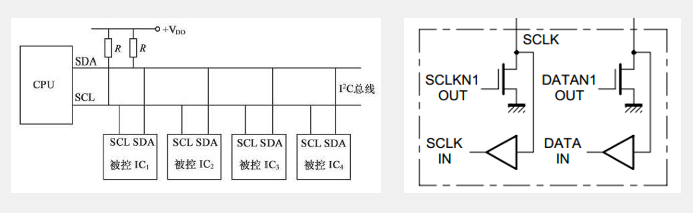

#### 2.11.2 I2C时序

##### 2.11.2.1 起始/终止时序

* 起始条件：SCL高电平期间，SDA从高电平切换到低电平
* 终止条件：SCL高电平期间，SDA从低电平切换到高电平

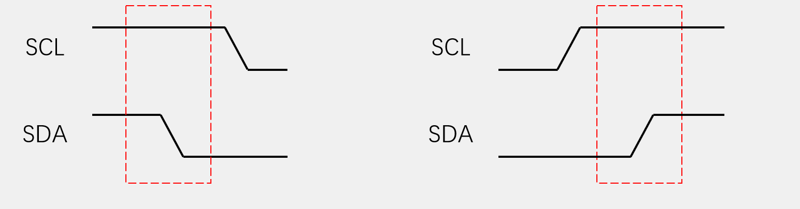

##### 2.11.2.2 发送/接收一个字节

发送一个字节：SCL低电平期间，主机将数据位依次放到SDA线上（高位先行），然后释放SCL，从机将在SCL高电平期间读取数据位，所以SCL高电平期间SDA不允许有数据变化，依次循环上述过程8次，即可发送一个字节

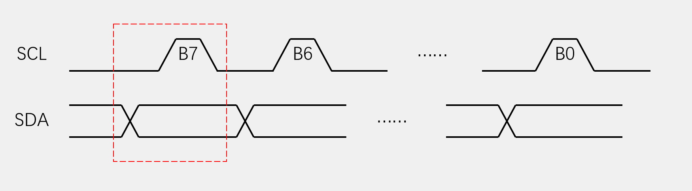

接收一个字节：SCL低电平期间，从机将数据位依次放到SDA线上（高位先行），然后释放SCL，主机将在SCL高电平期间读取数据位，所以SCL高电平期间SDA不允许有数据变化，依次循环上述过程8次，即可接收一个字节（主机在接收之前，需要释放SDA）

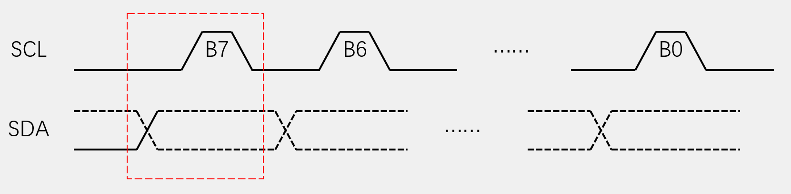

>即要发送的在SCL低电平时写入数据，后释放SCL（置1），要接收的SCL高电平期间时读取数据，读完后拉低SCL


##### 2.11.2.3 数据应答

* 发送应答：主机在接收完一个字节之后，在下一个时钟发送一位数据，数据0表示应答，数据1表示非应答
* 接收应答：主机在发送完一个字节之后，在下一个时钟接收一位数据，判断从机是否应答，数据0表示应答，数据1表示非应答（主机在接收之前，需要释放SDA）

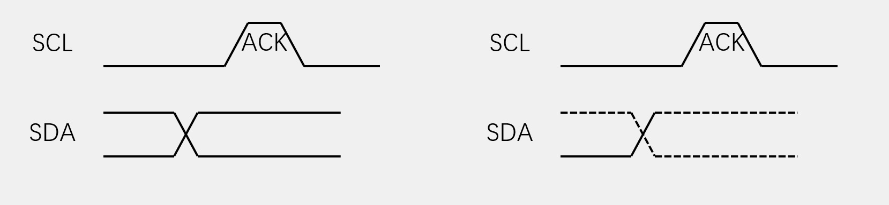

##### 2.11.2.4 指定地址写

起始->发送地址（左移1位）+写位（0）->应答->发送对应寄存器地址->应答->发送数据->应答->终止

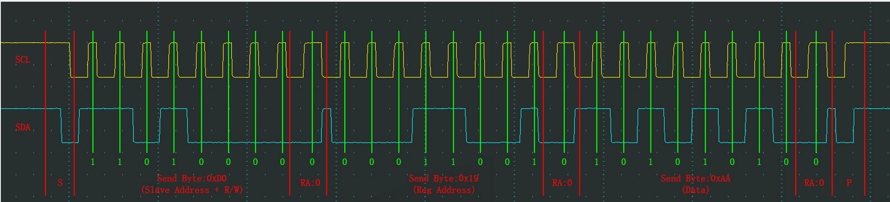

##### 2.11.2.5 指定地址读

起始->发送地址（左移1位）+写位（0）->应答->发送对应寄存器地址->应答->起始->发送地址（左移1位）+读位（1）->应答->接收数据->非应答->终止

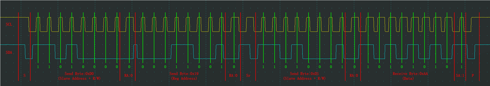

>**注意：在I2C通信中，数据的传输是先高位后低位，即高位先行，USART通信中是低位先行**

>12C总线上可能在某一时刻有两个主控设备要同时向总线发送数据，这种情况叫做总线竞争。12C总线具有多主控能力，可以对发生在SDA线上的总线竞争进行仲裁，其仲裁原则是这样的: 
假设主控器1要发送“1010...”:主控器2要发送的数据DATA2为“1001…”总线被启动后两个主控器在每发送一个数据位时都要对自己的输出电平进行检测，只要检测的电平与自己发出的电平一致，他们就会继续占用总线。在这种情况下总线还是得不到仲裁。当主控器1发送第3位数据“1”时(主控器2发送“0”)，由于“线与”的结果SDA上的电平为“0”，这样当主控器1检测自己的输出电平时，就会测到一个与自身不相符的“0”电平。这时主控器1只好放弃对总线的控制权;因此主控器2就成为总线的唯一主宰者。(即在不同的电平时谁0谁赢)

#### 2.11.3 MPU6050


* MPU6050是一个6轴姿态传感器，可以测量芯片自身X、Y、Z轴的加速度、角速度参数，通过数据融合，可进一步得到姿态角，常应用于平衡车、飞行器等需要检测自身姿态的场景
* 3轴加速度计（Accelerometer）：测量X、Y、Z轴的加速度
* 3轴陀螺仪传感器（Gyroscope）：测量X、Y、Z轴的角速度

>关键参数：
16位ADC采集传感器的模拟信号，量化范围：-32768~32767
加速度计满量程选择：±2、±4、±8、±16（g）
陀螺仪满量程选择： ±250、±500、±1000、±2000（°/sec）
可配置的数字低通滤波器
可配置的时钟源
可配置的采样分频
I2C从机地址：1101000（AD0=0）1101001（AD0=1）


#### 2.11.4 I2C外设

##### 2.11.4.1 简介

* STM32内部集成了硬件I2C收发电路，可以由硬件自动执行时钟生成、起始终止条件生成、应答位收发、数据收发等功能，减轻CPU的负担
* 支持多主机模型
* 支持7位/10位地址模式
* 支持不同的通讯速度，标准速度(高达100 kHz)，快速(高达400 kHz)
* 支持DMA
* 兼容SMBus协议

* STM32F103C8T6 硬件I2C资源：I2C1、I2C2

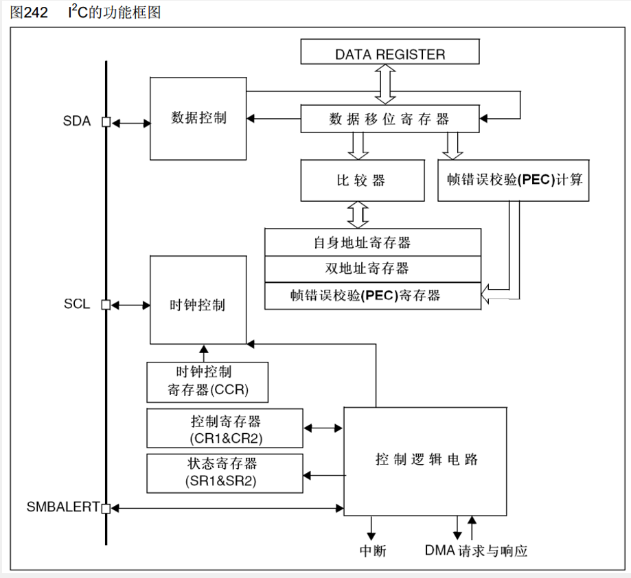

当数据从寄存器移动到为位移寄存器时，会置TXE为1。

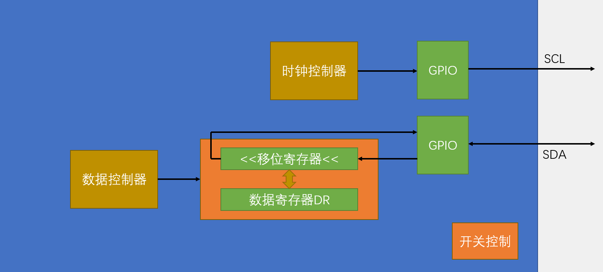


##### 2.11.4.2 I2C外设时序图

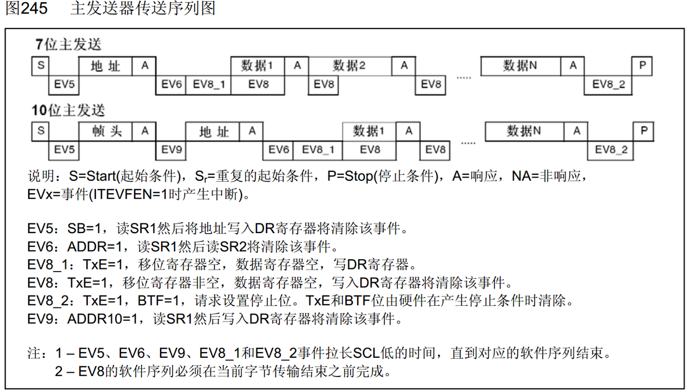

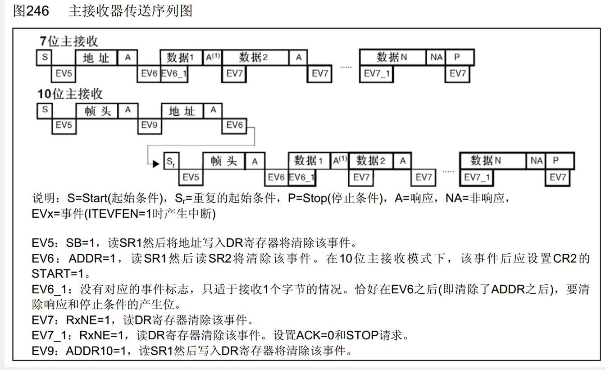


#### 2.11.5 I2C代码

##### 2.11.5.1 软件模拟电平翻转
要实现手动的电平翻转，可以使用任何的GPIO口（开漏输出），通过对引脚电平的操作实现I2C通信

MyI2C.c:

```c
#include "stm32f10x.h"                  // Device header
#include "Delay.h"

/*引脚配置层*/

/**
  * 函    数：I2C写SCL引脚电平
  * 参    数：BitValue 协议层传入的当前需要写入SCL的电平，范围0~1
  * 返 回 值：无
  * 注意事项：此函数需要用户实现内容，当BitValue为0时，需要置SCL为低电平，当BitValue为1时，需要置SCL为高电平
  */
void MyI2C_W_SCL(uint8_t BitValue)
{
	GPIO_WriteBit(GPIOB, GPIO_Pin_10, (BitAction)BitValue);		//根据BitValue（非0就高电平），设置SCL引脚的电平
	Delay_us(10);												//延时10us，防止时序频率超过要求(不能超过400kHZ)
}

/**
  * 函    数：I2C写SDA引脚电平
  * 参    数：BitValue 协议层传入的当前需要写入SDA的电平，范围0~0xFF
  * 返 回 值：无
  * 注意事项：此函数需要用户实现内容，当BitValue为0时，需要置SDA为低电平，当BitValue非0时，需要置SDA为高电平
  */
void MyI2C_W_SDA(uint8_t BitValue)
{
	GPIO_WriteBit(GPIOB, GPIO_Pin_11, (BitAction)BitValue);		//根据BitValue，设置SDA引脚的电平，BitValue要实现非0即1的特性
	Delay_us(10);												//延时10us，防止时序频率超过要求
}

/**
  * 函    数：I2C读SDA引脚电平
  * 参    数：无
  * 返 回 值：协议层需要得到的当前SDA的电平，范围0~1
  * 注意事项：此函数需要用户实现内容，当前SDA为低电平时，返回0，当前SDA为高电平时，返回1
  */
uint8_t MyI2C_R_SDA(void)
{
	uint8_t BitValue;
	BitValue = GPIO_ReadInputDataBit(GPIOB, GPIO_Pin_11);		//读取SDA电平
	Delay_us(10);												//延时10us，防止时序频率超过要求
	return BitValue;											//返回SDA电平
}

/**
  * 函    数：I2C初始化
  * 参    数：无
  * 返 回 值：无
  * 注意事项：此函数需要用户实现内容，实现SCL和SDA引脚的初始化
  */
void MyI2C_Init(void)
{
	/*开启时钟*/
	RCC_APB2PeriphClockCmd(RCC_APB2Periph_GPIOB, ENABLE);	//开启GPIOB的时钟
	
	/*GPIO初始化*/
	GPIO_InitTypeDef GPIO_InitStructure;
	GPIO_InitStructure.GPIO_Mode = GPIO_Mode_Out_OD;
	GPIO_InitStructure.GPIO_Pin = GPIO_Pin_10 | GPIO_Pin_11;
	GPIO_InitStructure.GPIO_Speed = GPIO_Speed_50MHz;
	GPIO_Init(GPIOB, &GPIO_InitStructure);					//将PB10和PB11引脚初始化为开漏输出
	
	/*设置默认电平*/
	GPIO_SetBits(GPIOB, GPIO_Pin_10 | GPIO_Pin_11);			//设置PB10和PB11引脚初始化后默认为高电平（释放总线状态）
}

/*协议层*/

/**
  * 函    数：I2C起始
  * 参    数：无
  * 返 回 值：无
  */
void MyI2C_Start(void)
{
	MyI2C_W_SDA(1);							//释放SDA，确保SDA为高电平
	MyI2C_W_SCL(1);							//释放SCL，确保SCL为高电平
	MyI2C_W_SDA(0);							//在SCL高电平期间，拉低SDA，产生起始信号
	MyI2C_W_SCL(0);							//起始后把SCL也拉低，即为了占用总线，也为了方便总线时序的拼接（因为发送接收前SCL要为低电平）
}

/**
  * 函    数：I2C终止
  * 参    数：无
  * 返 回 值：无
  */
void MyI2C_Stop(void)
{
	MyI2C_W_SDA(0);							//拉低SDA，确保SDA为低电平
	MyI2C_W_SCL(1);							//释放SCL，使SCL呈现高电平
	MyI2C_W_SDA(1);							//在SCL高电平期间，释放SDA，产生终止信号
}

/**
  * 函    数：I2C发送一个字节
  * 参    数：Byte 要发送的一个字节数据，范围：0x00~0xFF
  * 返 回 值：无
  */
void MyI2C_SendByte(uint8_t Byte)
{
	uint8_t i;
	for (i = 0; i < 8; i ++)				//循环8次，主机依次发送数据的每一位
	{
		MyI2C_W_SDA(Byte & (0x80 >> i));	//使用掩码的方式取出Byte的指定一位数据并写入到SDA线，在SCL释放前
		MyI2C_W_SCL(1);						//释放SCL，从机在SCL高电平期间读取SDA
		MyI2C_W_SCL(0);						//拉低SCL，主机开始发送下一位数据
	}
}

/**
  * 函    数：I2C接收一个字节
  * 参    数：无
  * 返 回 值：接收到的一个字节数据，范围：0x00~0xFF
  */
uint8_t MyI2C_ReceiveByte(void)
{
	uint8_t i, Byte = 0x00;					//定义接收的数据，并赋初值0x00，此处必须赋初值0x00，后面会用到
	MyI2C_W_SDA(1);							//接收前，主机先确保释放SDA，避免干扰从机的数据发送
	for (i = 0; i < 8; i ++)				//循环8次，主机依次接收数据的每一位
	{
		MyI2C_W_SCL(1);						//释放SCL，主机机在SCL高电平期间读取SDA
		if (MyI2C_R_SDA() == 1){Byte |= (0x80 >> i);}	//读取SDA数据，并存储到Byte变量
														//当SDA为1时，置变量指定位为1，当SDA为0时，不做处理，指定位为默认的初值0
		MyI2C_W_SCL(0);						//拉低SCL，从机在SCL低电平期间写入SDA
	}
	return Byte;							//返回接收到的一个字节数据
}

/**
  * 函    数：I2C发送应答位
  * 参    数：Byte 要发送的应答位，范围：0~1，0表示应答，1表示非应答
  * 返 回 值：无
  */
void MyI2C_SendAck(uint8_t AckBit)
{
	MyI2C_W_SDA(AckBit);					//主机在SCL释放前把应答位数据放到SDA线
	MyI2C_W_SCL(1);							//释放SCL，从机在SCL高电平期间，读取应答位
	MyI2C_W_SCL(0);							//拉低SCL，开始下一个时序模块
}

/**
  * 函    数：I2C接收应答位
  * 参    数：无
  * 返 回 值：接收到的应答位，范围：0~1，0表示应答，1表示非应答
  */
uint8_t MyI2C_ReceiveAck(void)
{
	uint8_t AckBit;							//定义应答位变量
	MyI2C_W_SDA(1);							//接收前，主机先确保释放SDA，避免干扰从机的数据发送
	MyI2C_W_SCL(1);							//释放SCL，主机机在SCL高电平期间读取SDA
	AckBit = MyI2C_R_SDA();					//将应答位存储到变量里
	MyI2C_W_SCL(0);							//拉低SCL，开始下一个时序模块
	return AckBit;							//返回定义应答位变量
}

```

>注意事项：
1. SCL高位时SDA变化就是开始停止条件，SCL高位时SDA不变化就是数据或应答传输。确保SDA能变化首先就得把SDA先置为相反的电平，再释放SCL
2. 在接收数据或就收应答时先要释放SDA，避免干扰从机的数据发送
3. 因为是一主多从模式，要发送和接收数据或应答时都需要STM32将SCL释放，再自己读取/对面读取数据。之后再拉低SCL，开始下一个时序模块

MPU6050.c:

**在读取MPU6050的寄存器时，需要先写入寄存器地址使寄存器指针偏移到对应地址，再读取对应寄存器的数据**

```c
#include "stm32f10x.h"                  // Device header
#include "MyI2C.h"
#include "MPU6050_Reg.h"

#define MPU6050_ADDRESS		0xD0		//MPU6050的I2C从机地址0x65(因为地址只有7位，得左移一位)

/**
  * 函    数：MPU6050写寄存器
  * 参    数：RegAddress 寄存器地址，范围：参考MPU6050手册的寄存器描述
  * 参    数：Data 要写入寄存器的数据，范围：0x00~0xFF
  * 返 回 值：无
  */
void MPU6050_WriteReg(uint8_t RegAddress, uint8_t Data)
{
	MyI2C_Start();						//I2C起始
	MyI2C_SendByte(MPU6050_ADDRESS);	//发送从机地址，读写位为0，表示即将写入
	MyI2C_ReceiveAck();					//接收应答
	MyI2C_SendByte(RegAddress);			//发送寄存器地址
	MyI2C_ReceiveAck();					//接收应答
	MyI2C_SendByte(Data);				//发送要写入寄存器的数据
	MyI2C_ReceiveAck();					//接收应答
	MyI2C_Stop();						//I2C终止
}

/**
  * 函    数：MPU6050读寄存器
  * 参    数：RegAddress 寄存器地址，范围：参考MPU6050手册的寄存器描述
  * 返 回 值：读取寄存器的数据，范围：0x00~0xFF
  */
uint8_t MPU6050_ReadReg(uint8_t RegAddress)
{
	uint8_t Data;
	
	MyI2C_Start();						//I2C起始
	MyI2C_SendByte(MPU6050_ADDRESS);	//发送从机地址，读写位为0，表示即将写入
	MyI2C_ReceiveAck();					//接收应答
	MyI2C_SendByte(RegAddress);			//发送寄存器地址
	MyI2C_ReceiveAck();					//接收应答
	
	MyI2C_Start();						//I2C重复起始
	MyI2C_SendByte(MPU6050_ADDRESS | 0x01);	//发送从机地址，读写位为1，表示即将读取
	MyI2C_ReceiveAck();					//接收应答
	Data = MyI2C_ReceiveByte();			//接收指定寄存器的数据
	MyI2C_SendAck(1);					//发送应答，给从机非应答，终止从机的数据输出
	MyI2C_Stop();						//I2C终止
	
	return Data;
}

/**
  * 函    数：MPU6050初始化
  * 参    数：无
  * 返 回 值：无
  */
void MPU6050_Init(void)
{
	MyI2C_Init();									//先初始化底层的I2C
	
	/*MPU6050寄存器初始化，需要对照MPU6050手册的寄存器描述配置，此处仅配置了部分重要的寄存器*/
	MPU6050_WriteReg(MPU6050_PWR_MGMT_1, 0x01);		//电源管理寄存器1，取消睡眠模式，选择时钟源为X轴陀螺仪
	MPU6050_WriteReg(MPU6050_PWR_MGMT_2, 0x00);		//电源管理寄存器2，保持默认值0，所有轴均不待机
	MPU6050_WriteReg(MPU6050_SMPLRT_DIV, 0x09);		//采样率分频寄存器，配置采样率（数据输出的快慢）
	MPU6050_WriteReg(MPU6050_CONFIG, 0x06);			//配置寄存器，配置DLPF（低通滤波器）
	MPU6050_WriteReg(MPU6050_GYRO_CONFIG, 0x18);	//陀螺仪配置寄存器，选择满量程为±2000°/s
	MPU6050_WriteReg(MPU6050_ACCEL_CONFIG, 0x18);	//加速度计配置寄存器，选择满量程为±16g
}

/**
  * 函    数：MPU6050获取ID号
  * 参    数：无
  * 返 回 值：MPU6050的ID号
  */
uint8_t MPU6050_GetID(void)
{
	return MPU6050_ReadReg(MPU6050_WHO_AM_I);		//返回WHO_AM_I寄存器的值
}

/**
  * 函    数：MPU6050获取数据
  * 参    数：AccX AccY AccZ 加速度计X、Y、Z轴的数据，使用输出参数的形式返回，范围：-32768~32767
  * 参    数：GyroX GyroY GyroZ 陀螺仪X、Y、Z轴的数据，使用输出参数的形式返回，范围：-32768~32767
  * 返 回 值：无
  */
void MPU6050_GetData(int16_t *AccX, int16_t *AccY, int16_t *AccZ, 
						int16_t *GyroX, int16_t *GyroY, int16_t *GyroZ)
{
	uint8_t DataH, DataL;								//定义数据高8位和低8位的变量
	
	DataH = MPU6050_ReadReg(MPU6050_ACCEL_XOUT_H);		//读取加速度计X轴的高8位数据
	DataL = MPU6050_ReadReg(MPU6050_ACCEL_XOUT_L);		//读取加速度计X轴的低8位数据
	*AccX = (DataH << 8) | DataL;						//数据拼接，通过输出参数返回
	
	DataH = MPU6050_ReadReg(MPU6050_ACCEL_YOUT_H);		//读取加速度计Y轴的高8位数据
	DataL = MPU6050_ReadReg(MPU6050_ACCEL_YOUT_L);		//读取加速度计Y轴的低8位数据
	*AccY = (DataH << 8) | DataL;						//数据拼接，通过输出参数返回
	
	DataH = MPU6050_ReadReg(MPU6050_ACCEL_ZOUT_H);		//读取加速度计Z轴的高8位数据
	DataL = MPU6050_ReadReg(MPU6050_ACCEL_ZOUT_L);		//读取加速度计Z轴的低8位数据
	*AccZ = (DataH << 8) | DataL;						//数据拼接，通过输出参数返回
	
	DataH = MPU6050_ReadReg(MPU6050_GYRO_XOUT_H);		//读取陀螺仪X轴的高8位数据
	DataL = MPU6050_ReadReg(MPU6050_GYRO_XOUT_L);		//读取陀螺仪X轴的低8位数据
	*GyroX = (DataH << 8) | DataL;						//数据拼接，通过输出参数返回
	
	DataH = MPU6050_ReadReg(MPU6050_GYRO_YOUT_H);		//读取陀螺仪Y轴的高8位数据
	DataL = MPU6050_ReadReg(MPU6050_GYRO_YOUT_L);		//读取陀螺仪Y轴的低8位数据
	*GyroY = (DataH << 8) | DataL;						//数据拼接，通过输出参数返回
	
	DataH = MPU6050_ReadReg(MPU6050_GYRO_ZOUT_H);		//读取陀螺仪Z轴的高8位数据
	DataL = MPU6050_ReadReg(MPU6050_GYRO_ZOUT_L);		//读取陀螺仪Z轴的低8位数据
	*GyroZ = (DataH << 8) | DataL;						//数据拼接，通过输出参数返回
}
```

MPU6050_Reg.h:

```c
#ifndef __MPU6050_REG_H
#define __MPU6050_REG_H

#define	MPU6050_SMPLRT_DIV		0x19
#define	MPU6050_CONFIG			0x1A
#define	MPU6050_GYRO_CONFIG		0x1B
#define	MPU6050_ACCEL_CONFIG	0x1C

#define	MPU6050_ACCEL_XOUT_H	0x3B
#define	MPU6050_ACCEL_XOUT_L	0x3C
#define	MPU6050_ACCEL_YOUT_H	0x3D
#define	MPU6050_ACCEL_YOUT_L	0x3E
#define	MPU6050_ACCEL_ZOUT_H	0x3F
#define	MPU6050_ACCEL_ZOUT_L	0x40
#define	MPU6050_TEMP_OUT_H		0x41
#define	MPU6050_TEMP_OUT_L		0x42
#define	MPU6050_GYRO_XOUT_H		0x43
#define	MPU6050_GYRO_XOUT_L		0x44
#define	MPU6050_GYRO_YOUT_H		0x45
#define	MPU6050_GYRO_YOUT_L		0x46
#define	MPU6050_GYRO_ZOUT_H		0x47
#define	MPU6050_GYRO_ZOUT_L		0x48

#define	MPU6050_PWR_MGMT_1		0x6B
#define	MPU6050_PWR_MGMT_2		0x6C
#define	MPU6050_WHO_AM_I		0x75

#endif
```

##### 2.11.5.2 通过I2C外设实现I2C

通过之前的外设时序图，在使用相应函数后进行对事件的检查（即等待对应标志位组合变化），来实现I2C通信。

MPU6050.c:

```c
#include "stm32f10x.h"                  // Device header
#include "MPU6050_Reg.h"

#define MPU6050_ADDRESS		0xD0		//MPU6050的I2C从机地址

/**
  * 函    数：MPU6050等待事件
  * 参    数：同I2C_CheckEvent
  * 返 回 值：无
  */
void MPU6050_WaitEvent(I2C_TypeDef* I2Cx, uint32_t I2C_EVENT)
{
	uint32_t Timeout;
	Timeout = 10000;									//给定超时计数时间
	while (I2C_CheckEvent(I2Cx, I2C_EVENT) != SUCCESS)	//循环等待指定事件
	{
		Timeout --;										//等待时，计数值自减
		if (Timeout == 0)								//自减到0后，等待超时
		{
			/*超时的错误处理代码，可以添加到此处*/
			break;										//跳出等待，不等了
		}
	}
}

/**
  * 函    数：MPU6050写寄存器
  * 参    数：RegAddress 寄存器地址，范围：参考MPU6050手册的寄存器描述
  * 参    数：Data 要写入寄存器的数据，范围：0x00~0xFF
  * 返 回 值：无
  */
void MPU6050_WriteReg(uint8_t RegAddress, uint8_t Data)
{
	I2C_GenerateSTART(I2C2, ENABLE);										//硬件I2C生成起始条件
	MPU6050_WaitEvent(I2C2, I2C_EVENT_MASTER_MODE_SELECT);					//等待EV5
	
	I2C_Send7bitAddress(I2C2, MPU6050_ADDRESS, I2C_Direction_Transmitter);	//硬件I2C发送从机地址，方向为发送
	MPU6050_WaitEvent(I2C2, I2C_EVENT_MASTER_TRANSMITTER_MODE_SELECTED);	//等待EV6
	
	I2C_SendData(I2C2, RegAddress);											//硬件I2C发送寄存器地址
	MPU6050_WaitEvent(I2C2, I2C_EVENT_MASTER_BYTE_TRANSMITTING);			//等待EV8
	
	I2C_SendData(I2C2, Data);												//硬件I2C发送数据
	MPU6050_WaitEvent(I2C2, I2C_EVENT_MASTER_BYTE_TRANSMITTED);				//等待EV8_2
	
	I2C_GenerateSTOP(I2C2, ENABLE);											//硬件I2C生成终止条件
}

/**
  * 函    数：MPU6050读寄存器
  * 参    数：RegAddress 寄存器地址，范围：参考MPU6050手册的寄存器描述
  * 返 回 值：读取寄存器的数据，范围：0x00~0xFF
  */
uint8_t MPU6050_ReadReg(uint8_t RegAddress)
{
	uint8_t Data;
	
	I2C_GenerateSTART(I2C2, ENABLE);										//硬件I2C生成起始条件
	MPU6050_WaitEvent(I2C2, I2C_EVENT_MASTER_MODE_SELECT);					//等待EV5
	
	I2C_Send7bitAddress(I2C2, MPU6050_ADDRESS, I2C_Direction_Transmitter);	//硬件I2C发送从机地址，方向为发送
	MPU6050_WaitEvent(I2C2, I2C_EVENT_MASTER_TRANSMITTER_MODE_SELECTED);	//等待EV6
	
	I2C_SendData(I2C2, RegAddress);											//硬件I2C发送寄存器地址
	MPU6050_WaitEvent(I2C2, I2C_EVENT_MASTER_BYTE_TRANSMITTED);				//等待EV8_2
	
	I2C_GenerateSTART(I2C2, ENABLE);										//硬件I2C生成重复起始条件
	MPU6050_WaitEvent(I2C2, I2C_EVENT_MASTER_MODE_SELECT);					//等待EV5
	
	I2C_Send7bitAddress(I2C2, MPU6050_ADDRESS, I2C_Direction_Receiver);		//硬件I2C发送从机地址，方向为接收
	MPU6050_WaitEvent(I2C2, I2C_EVENT_MASTER_RECEIVER_MODE_SELECTED);		//等待EV6
	
	I2C_AcknowledgeConfig(I2C2, DISABLE);									//在接收最后一个字节之前提前将应答失能
	I2C_GenerateSTOP(I2C2, ENABLE);											//在接收最后一个字节之前提前申请停止条件
	
	MPU6050_WaitEvent(I2C2, I2C_EVENT_MASTER_BYTE_RECEIVED);				//等待EV7
	Data = I2C_ReceiveData(I2C2);											//接收数据寄存器
	
	I2C_AcknowledgeConfig(I2C2, ENABLE);									//将应答恢复为使能，为了不影响后续可能产生的读取多字节操作
	
	return Data;
}

/**
  * 函    数：MPU6050初始化
  * 参    数：无
  * 返 回 值：无
  */
void MPU6050_Init(void)
{
	/*开启时钟*/
	RCC_APB1PeriphClockCmd(RCC_APB1Periph_I2C2, ENABLE);		//开启I2C2的时钟
	RCC_APB2PeriphClockCmd(RCC_APB2Periph_GPIOB, ENABLE);		//开启GPIOB的时钟
	
	/*GPIO初始化*/
	GPIO_InitTypeDef GPIO_InitStructure;
	GPIO_InitStructure.GPIO_Mode = GPIO_Mode_AF_OD;
	GPIO_InitStructure.GPIO_Pin = GPIO_Pin_10 | GPIO_Pin_11;
	GPIO_InitStructure.GPIO_Speed = GPIO_Speed_50MHz;
	GPIO_Init(GPIOB, &GPIO_InitStructure);					//将PB10和PB11引脚初始化为复用开漏输出
	
	/*I2C初始化*/
	I2C_InitTypeDef I2C_InitStructure;						//定义结构体变量
	I2C_InitStructure.I2C_Mode = I2C_Mode_I2C;				//模式，选择为I2C模式
	I2C_InitStructure.I2C_ClockSpeed = 50000;				//时钟速度，选择为50KHz
	I2C_InitStructure.I2C_DutyCycle = I2C_DutyCycle_2;		//时钟占空比，选择Tlow/Thigh = 2
	I2C_InitStructure.I2C_Ack = I2C_Ack_Enable;				//应答，选择使能
	I2C_InitStructure.I2C_AcknowledgedAddress = I2C_AcknowledgedAddress_7bit;	//应答地址，选择7位，从机模式下才有效
	I2C_InitStructure.I2C_OwnAddress1 = 0x00;				//自身地址，从机模式下才有效
	I2C_Init(I2C2, &I2C_InitStructure);						//将结构体变量交给I2C_Init，配置I2C2
	
	/*I2C使能*/
	I2C_Cmd(I2C2, ENABLE);									//使能I2C2，开始运行
	
	/*MPU6050寄存器初始化，需要对照MPU6050手册的寄存器描述配置，此处仅配置了部分重要的寄存器*/
	MPU6050_WriteReg(MPU6050_PWR_MGMT_1, 0x01);				//电源管理寄存器1，取消睡眠模式，选择时钟源为X轴陀螺仪
	MPU6050_WriteReg(MPU6050_PWR_MGMT_2, 0x00);				//电源管理寄存器2，保持默认值0，所有轴均不待机
	MPU6050_WriteReg(MPU6050_SMPLRT_DIV, 0x09);				//采样率分频寄存器，配置采样率
	MPU6050_WriteReg(MPU6050_CONFIG, 0x06);					//配置寄存器，配置DLPF
	MPU6050_WriteReg(MPU6050_GYRO_CONFIG, 0x18);			//陀螺仪配置寄存器，选择满量程为±2000°/s
	MPU6050_WriteReg(MPU6050_ACCEL_CONFIG, 0x18);			//加速度计配置寄存器，选择满量程为±16g
}


/**
  * 函    数：MPU6050获取ID号
  * 参    数：无
  * 返 回 值：MPU6050的ID号
  */
uint8_t MPU6050_GetID(void)
{
	return MPU6050_ReadReg(MPU6050_WHO_AM_I);		//返回WHO_AM_I寄存器的值
}

/**
  * 函    数：MPU6050获取数据
  * 参    数：AccX AccY AccZ 加速度计X、Y、Z轴的数据，使用输出参数的形式返回，范围：-32768~32767
  * 参    数：GyroX GyroY GyroZ 陀螺仪X、Y、Z轴的数据，使用输出参数的形式返回，范围：-32768~32767
  * 返 回 值：无
  */
void MPU6050_GetData(int16_t *AccX, int16_t *AccY, int16_t *AccZ, 
						int16_t *GyroX, int16_t *GyroY, int16_t *GyroZ)
{
	uint8_t DataH, DataL;								//定义数据高8位和低8位的变量
	
	DataH = MPU6050_ReadReg(MPU6050_ACCEL_XOUT_H);		//读取加速度计X轴的高8位数据
	DataL = MPU6050_ReadReg(MPU6050_ACCEL_XOUT_L);		//读取加速度计X轴的低8位数据
	*AccX = (DataH << 8) | DataL;						//数据拼接，通过输出参数返回
	
	DataH = MPU6050_ReadReg(MPU6050_ACCEL_YOUT_H);		//读取加速度计Y轴的高8位数据
	DataL = MPU6050_ReadReg(MPU6050_ACCEL_YOUT_L);		//读取加速度计Y轴的低8位数据
	*AccY = (DataH << 8) | DataL;						//数据拼接，通过输出参数返回
	
	DataH = MPU6050_ReadReg(MPU6050_ACCEL_ZOUT_H);		//读取加速度计Z轴的高8位数据
	DataL = MPU6050_ReadReg(MPU6050_ACCEL_ZOUT_L);		//读取加速度计Z轴的低8位数据
	*AccZ = (DataH << 8) | DataL;						//数据拼接，通过输出参数返回
	
	DataH = MPU6050_ReadReg(MPU6050_GYRO_XOUT_H);		//读取陀螺仪X轴的高8位数据
	DataL = MPU6050_ReadReg(MPU6050_GYRO_XOUT_L);		//读取陀螺仪X轴的低8位数据
	*GyroX = (DataH << 8) | DataL;						//数据拼接，通过输出参数返回
	
	DataH = MPU6050_ReadReg(MPU6050_GYRO_YOUT_H);		//读取陀螺仪Y轴的高8位数据
	DataL = MPU6050_ReadReg(MPU6050_GYRO_YOUT_L);		//读取陀螺仪Y轴的低8位数据
	*GyroY = (DataH << 8) | DataL;						//数据拼接，通过输出参数返回
	
	DataH = MPU6050_ReadReg(MPU6050_GYRO_ZOUT_H);		//读取陀螺仪Z轴的高8位数据
	DataL = MPU6050_ReadReg(MPU6050_GYRO_ZOUT_L);		//读取陀螺仪Z轴的低8位数据
	*GyroZ = (DataH << 8) | DataL;						//数据拼接，通过输出参数返回
}

```

<br>
<br>

---

### 2.12 SPI

四种模式和片选时序见通信协议那篇。这里只写 STM32 的 SPI 外设。

#### 2.12.1 SPI简介

* SPI（Serial Peripheral Interface）是由Motorola公司开发的一种通用数据总线
* 四根通信线：SCK（Serial Clock）、MOSI（Master Output Slave Input）、MISO（Master Input Slave Output）、SS（Slave Select）
* 同步，全双工
* 支持总线挂载多设备（一主多从）
* 默认高位先行

#### 2.12.2 SPI电路

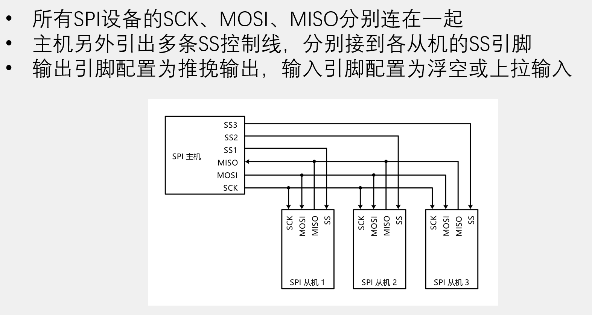

>MOSI,SCK推挽输出/复用推挽输出（SPI外设），MISO上拉输入，SS推挽输出（软件模拟）

#### 2.12.3 SPI数据传输

SPI的数据传输是通过数据寄存器进行的，数据寄存器是一个8位的寄存器，是一个循环（即发送8位也会接收到8位），主机和从机会通过时序的上升沿和下降沿，将寄存器的最高位放在数据线上，再将寄存器的数据左移一位，再将数据线上的数据放入寄存器的最低位，如此循环，直到8位数据传输完毕。就完成了一次数据传输，也是一次数据的交换。

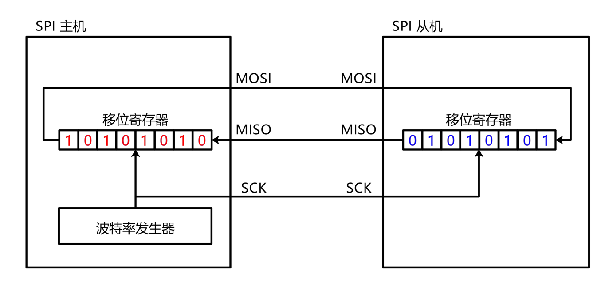

#### 2.12.4 SPI时序

##### 2.12.4.1 起始/终止条件

* 起始条件：SS从高电平切换到低电平
* 终止条件：SS从低电平切换到高电平

##### 2.12.4.2 交换一个字节

交换字节一共有四种模式，但模式2，模式3只是模式0，模式1的上升沿/下降沿进行了一次翻转

1. 模式0：

CPOL=0：空闲状态时，SCK为低电平
CPHA=0：SCK第一个边沿移入数据，第二个边沿移出数据

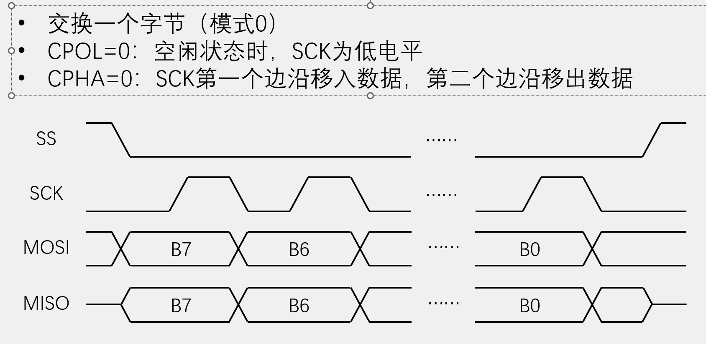

>注：在第一个上升沿之前，即SS从高电平切换到低电平之后，就要进行第一次移除数据。
2. 模式1：

CPOL=0：空闲状态时，SCK为低电平
CPHA=1：SCK第一个边沿移出数据，第二个边沿移入数据

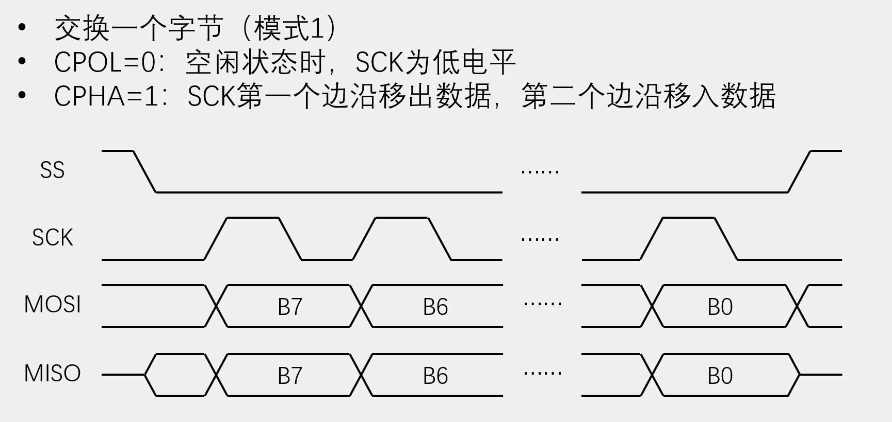


模式2，模式3只是模式0，模式1的SCK进行了一次翻转

##### 2.12.4.3 指定地址写

向SS指定的设备，发送写指令（0x02），随后在指定地址（Address[23:0]）下，写入指定数据（Data）

即：SS从高电平切换到低电平->发送0x02->发送Address高8位->发送Address中8位->发送Address低8位->发送Data->SS从低电平切换到高电平


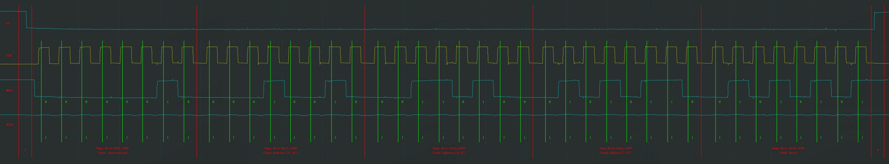

##### 2.12.4.4 指定地址读

向SS指定的设备，发送读指令（0x03），随后在指定地址（Address[23:0]）下，读取指定数据（Data）

即：SS从高电平切换到低电平->发送0x03->发送Address高8位->发送Address中8位->发送Address低8位->接收Data->SS从低电平切换到高电平

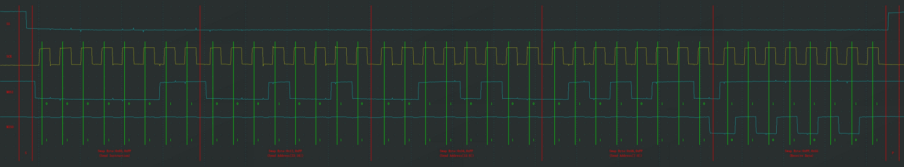

#### 2.12.5 W25Q64简介

* W25Qxx系列是一种低成本、小型化、使用简单的非易失性存储器，常应用于数据存储、字库存储、固件程序存储等场景
* 存储介质：Nor Flash（闪存）
* 时钟频率：80MHz / 160MHz (Dual SPI) / 320MHz (Quad SPI)

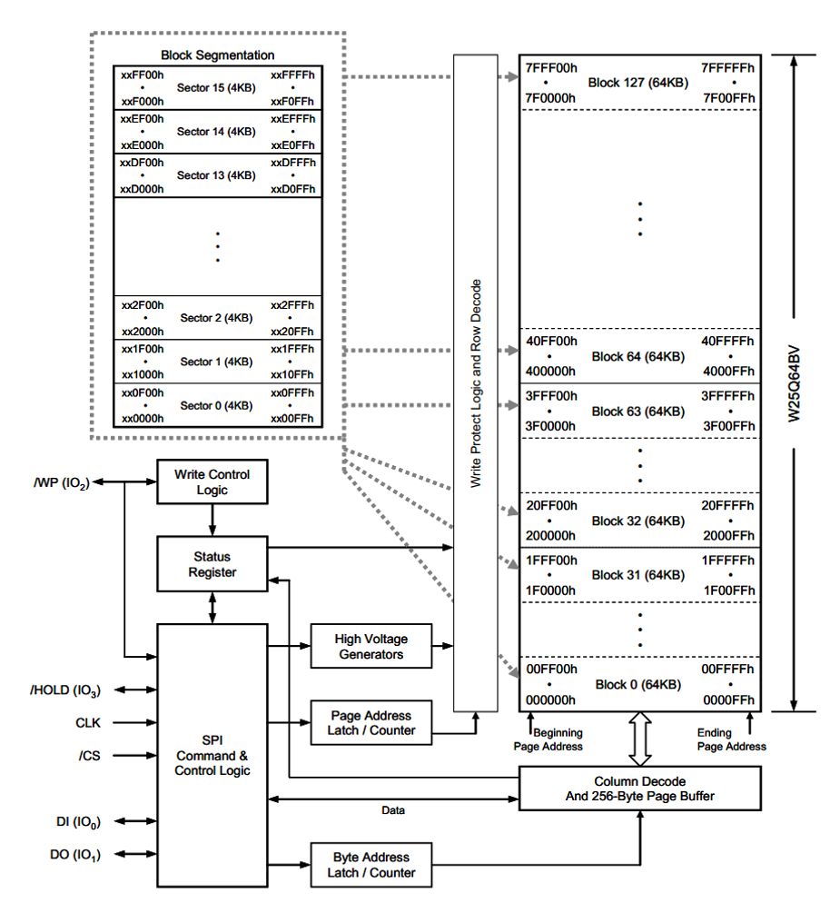

W25Q64中的存储空间主要分为了三部分：块（64KB），扇区（4KB），页（256B）

其中扇区是最小的擦除单位，块是扇区的集合，页是最小的写入单位

>注：
>* 因为写入单位是页，所以每次写入数据的大小都不能超过256B（一般会用标志位BUSY判断，为1则说明有值在存，待会在写入）
>* 写入的地址如果超过了页的范围，会从此页的头开始写入
>* 扇区是最小的擦除单位，只能整扇区擦除（置1）

#### 2.12.6 FLASH

FLASH是STM32的内部存储器，用于存储程序代码，数据等

1. 写入操作时：
* 写入操作前，必须先进行写使能
* **每个数据位只能由1改写为0，不能由0改写为1**
* 写入数据前必须先擦除，擦除后，所有数据位变为1
* 擦除必须按最小擦除单元进行
* **连续写入多字节时，最多写入一页的数据，超过页尾位置的数据，会回到页首覆盖写入**
* 写入操作结束后，芯片进入忙状态，不响应新的读写操作
2. 读取操作时：
* 直接调用读取时序，无需使能，无需额外操作，没有页的限制，读取操作结束后不会进入忙状态，但不能在忙状态时读取

#### 2.12.7 SPI外设

##### 2.12.7.1 SPI外设简介

* STM32内部集成了硬件SPI收发电路，可以由硬件自动执行时钟生成、数据收发等功能，减轻CPU的负担
* 可配置8位/16位数据帧、高位先行/低位先行
* 时钟频率： fPCLK / (2, 4, 8, 16, 32, 64, 128, 256)
* 支持多主机模型、主或从操作
* 可精简为半双工/单工通信
* 支持DMA
* 兼容I2S协议

* STM32F103C8T6 硬件SPI资源：SPI1、SPI2

##### 2.12.7.2 SPI框图

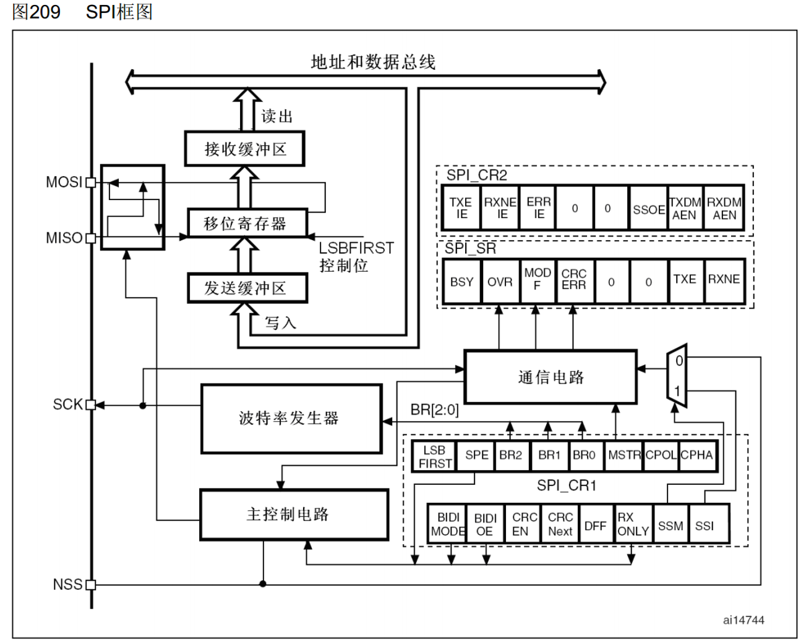

>注：可以注意一下USART，I2C，SPI之间缓冲区和寄存器的数量和关系的区别

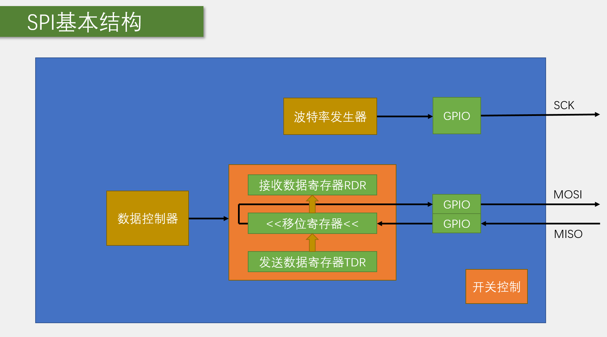

##### 2.12.7.2 SPI时序

SPI外设的传输主要分为连续传输和非连续传输。连续传输速度块，但传送和接收数据错位，代码较为复杂。非连续传输速度慢，但传送和接收数据不错位，代码较为简单。在时钟频率低的情况下，可以使用非连续传输，提高代码的可读性。

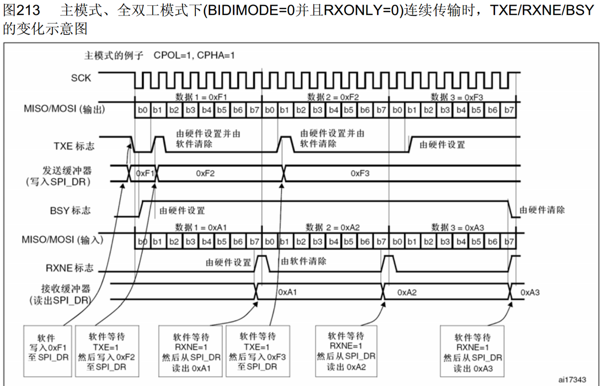


非连续传输即发送数据后接收数据，当接收数据的标志位置1后再去

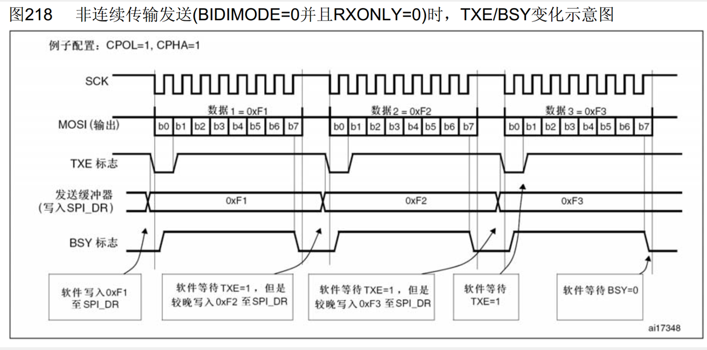

#### 2.12.8 SPI代码

##### 2.12.8.1 软件模拟SPI

MySPI.c:

```c
#include "stm32f10x.h"                  // Device header

/*引脚配置层*/

/**
  * 函    数：SPI写SS引脚电平
  * 参    数：BitValue 协议层传入的当前需要写入SS的电平，范围0~1
  * 返 回 值：无
  * 注意事项：此函数需要用户实现内容，当BitValue为0时，需要置SS为低电平，当BitValue为1时，需要置SS为高电平
  */
void MySPI_W_SS(uint8_t BitValue)
{
	GPIO_WriteBit(GPIOA, GPIO_Pin_4, (BitAction)BitValue);		//根据BitValue，设置SS引脚的电平
}

/**
  * 函    数：SPI写SCK引脚电平
  * 参    数：BitValue 协议层传入的当前需要写入SCK的电平，范围0~1
  * 返 回 值：无
  * 注意事项：此函数需要用户实现内容，当BitValue为0时，需要置SCK为低电平，当BitValue为1时，需要置SCK为高电平
  */
void MySPI_W_SCK(uint8_t BitValue)
{
	GPIO_WriteBit(GPIOA, GPIO_Pin_5, (BitAction)BitValue);		//根据BitValue，设置SCK引脚的电平
}

/**
  * 函    数：SPI写MOSI引脚电平
  * 参    数：BitValue 协议层传入的当前需要写入MOSI的电平，范围0~0xFF
  * 返 回 值：无
  * 注意事项：此函数需要用户实现内容，当BitValue为0时，需要置MOSI为低电平，当BitValue非0时，需要置MOSI为高电平
  */
void MySPI_W_MOSI(uint8_t BitValue)
{
	GPIO_WriteBit(GPIOA, GPIO_Pin_7, (BitAction)BitValue);		//根据BitValue，设置MOSI引脚的电平，BitValue要实现非0即1的特性
}

/**
  * 函    数：I2C读MISO引脚电平
  * 参    数：无
  * 返 回 值：协议层需要得到的当前MISO的电平，范围0~1
  * 注意事项：此函数需要用户实现内容，当前MISO为低电平时，返回0，当前MISO为高电平时，返回1
  */
uint8_t MySPI_R_MISO(void)
{
	return GPIO_ReadInputDataBit(GPIOA, GPIO_Pin_6);			//读取MISO电平并返回
}

/**
  * 函    数：SPI初始化
  * 参    数：无
  * 返 回 值：无
  * 注意事项：此函数需要用户实现内容，实现SS、SCK、MOSI和MISO引脚的初始化
  */
void MySPI_Init(void)
{
	/*开启时钟*/
	RCC_APB2PeriphClockCmd(RCC_APB2Periph_GPIOA, ENABLE);	//开启GPIOA的时钟
	
	/*GPIO初始化*/
	GPIO_InitTypeDef GPIO_InitStructure;
	GPIO_InitStructure.GPIO_Mode = GPIO_Mode_Out_PP;
	GPIO_InitStructure.GPIO_Pin = GPIO_Pin_4 | GPIO_Pin_5 | GPIO_Pin_7;
	GPIO_InitStructure.GPIO_Speed = GPIO_Speed_50MHz;
	GPIO_Init(GPIOA, &GPIO_InitStructure);					//将PA4、PA5和PA7引脚初始化为推挽输出
	
	GPIO_InitStructure.GPIO_Mode = GPIO_Mode_IPU;
	GPIO_InitStructure.GPIO_Pin = GPIO_Pin_6;
	GPIO_InitStructure.GPIO_Speed = GPIO_Speed_50MHz;
	GPIO_Init(GPIOA, &GPIO_InitStructure);					//将PA6引脚初始化为上拉输入
	
	/*设置默认电平*/
	MySPI_W_SS(1);											//SS默认高电平
	MySPI_W_SCK(0);											//SCK默认低电平
}

/*协议层*/

/**
  * 函    数：SPI起始
  * 参    数：无
  * 返 回 值：无
  */
void MySPI_Start(void)
{
	MySPI_W_SS(0);				//拉低SS，开始时序
}

/**
  * 函    数：SPI终止
  * 参    数：无
  * 返 回 值：无
  */
void MySPI_Stop(void)
{
	MySPI_W_SS(1);				//拉高SS，终止时序
}

/**
  * 函    数：SPI交换传输一个字节，使用SPI模式0
  * 参    数：ByteSend 要发送的一个字节
  * 返 回 值：接收的一个字节
  */
uint8_t MySPI_SwapByte(uint8_t ByteSend)
{
	uint8_t i, ByteReceive = 0x00;					//定义接收的数据，并赋初值0x00，此处必须赋初值0x00，后面会用到
	
	for (i = 0; i < 8; i ++)						//循环8次，依次交换每一位数据
	{
		MySPI_W_MOSI(ByteSend & (0x80 >> i));		//使用掩码的方式取出ByteSend的指定一位数据并写入到MOSI线
		MySPI_W_SCK(1);								//拉高SCK，上升沿移出数据
		if (MySPI_R_MISO() == 1){ByteReceive |= (0x80 >> i);}	//读取MISO数据，并存储到Byte变量
																//当MISO为1时，置变量指定位为1，当MISO为0时，不做处理，指定位为默认的初值0
		MySPI_W_SCK(0);								//拉低SCK，下降沿移入数据
	}
	
	return ByteReceive;								//返回接收到的一个字节数据
}

```

W25Q64.c:

```c
#include "stm32f10x.h"                  // Device header
#include "MySPI.h"
#include "W25Q64_Ins.h"

/**
  * 函    数：W25Q64初始化
  * 参    数：无
  * 返 回 值：无
  */
void W25Q64_Init(void)
{
	MySPI_Init();					//先初始化底层的SPI
}

/**
  * 函    数：MPU6050读取ID号
  * 参    数：MID 工厂ID，使用输出参数的形式返回
  * 参    数：DID 设备ID，使用输出参数的形式返回
  * 返 回 值：无
  */
void W25Q64_ReadID(uint8_t *MID, uint16_t *DID)
{
	MySPI_Start();								//SPI起始
	MySPI_SwapByte(W25Q64_JEDEC_ID);			//交换发送读取ID的指令
	*MID = MySPI_SwapByte(W25Q64_DUMMY_BYTE);	//交换接收MID，通过输出参数返回
	*DID = MySPI_SwapByte(W25Q64_DUMMY_BYTE);	//交换接收DID高8位
	*DID <<= 8;									//高8位移到高位
	*DID |= MySPI_SwapByte(W25Q64_DUMMY_BYTE);	//或上交换接收DID的低8位，通过输出参数返回
	MySPI_Stop();								//SPI终止
}

/**
  * 函    数：W25Q64写使能
  * 参    数：无
  * 返 回 值：无
  */
void W25Q64_WriteEnable(void)
{
	MySPI_Start();								//SPI起始
	MySPI_SwapByte(W25Q64_WRITE_ENABLE);		//交换发送写使能的指令
	MySPI_Stop();								//SPI终止
}

/**
  * 函    数：W25Q64等待忙
  * 参    数：无
  * 返 回 值：无
  */
void W25Q64_WaitBusy(void)
{
	uint32_t Timeout;
	MySPI_Start();								//SPI起始
	MySPI_SwapByte(W25Q64_READ_STATUS_REGISTER_1);				//交换发送读状态寄存器1的指令
	Timeout = 100000;							//给定超时计数时间
	while ((MySPI_SwapByte(W25Q64_DUMMY_BYTE) & 0x01) == 0x01)	//循环等待忙标志位
	{
		Timeout --;								//等待时，计数值自减
		if (Timeout == 0)						//自减到0后，等待超时
		{
			/*超时的错误处理代码，可以添加到此处*/
			break;								//跳出等待，不等了
		}
	}
	MySPI_Stop();								//SPI终止
}

/**
  * 函    数：W25Q64页编程
  * 参    数：Address 页编程的起始地址，范围：0x000000~0x7FFFFF
  * 参    数：DataArray	用于写入数据的数组
  * 参    数：Count 要写入数据的数量，范围：0~256
  * 返 回 值：无
  * 注意事项：写入的地址范围不能跨页
  */
void W25Q64_PageProgram(uint32_t Address, uint8_t *DataArray, uint16_t Count)
{
	uint16_t i;
	
	W25Q64_WriteEnable();						//写使能
	
	MySPI_Start();								//SPI起始
	MySPI_SwapByte(W25Q64_PAGE_PROGRAM);		//交换发送页编程的指令
	MySPI_SwapByte(Address >> 16);				//交换发送地址23~16位
	MySPI_SwapByte(Address >> 8);				//交换发送地址15~8位
	MySPI_SwapByte(Address);					//交换发送地址7~0位
	for (i = 0; i < Count; i ++)				//循环Count次
	{
		MySPI_SwapByte(DataArray[i]);			//依次在起始地址后写入数据
	}
	MySPI_Stop();								//SPI终止
	
	W25Q64_WaitBusy();							//等待忙,可以保证数据写入完成且寄存器空闲
}

/**
  * 函    数：W25Q64扇区擦除（4KB）
  * 参    数：Address 指定扇区的地址，范围：0x000000~0x7FFFFF
  * 返 回 值：无
  */
void W25Q64_SectorErase(uint32_t Address)
{
	W25Q64_WriteEnable();						//写使能
	
	MySPI_Start();								//SPI起始
	MySPI_SwapByte(W25Q64_SECTOR_ERASE_4KB);	//交换发送扇区擦除的指令
	MySPI_SwapByte(Address >> 16);				//交换发送地址23~16位
	MySPI_SwapByte(Address >> 8);				//交换发送地址15~8位
	MySPI_SwapByte(Address);					//交换发送地址7~0位
	MySPI_Stop();								//SPI终止
	
	W25Q64_WaitBusy();							//等待忙
}

/**
  * 函    数：W25Q64读取数据
  * 参    数：Address 读取数据的起始地址，范围：0x000000~0x7FFFFF
  * 参    数：DataArray 用于接收读取数据的数组，通过输出参数返回
  * 参    数：Count 要读取数据的数量，范围：0~0x800000
  * 返 回 值：无
  */
void W25Q64_ReadData(uint32_t Address, uint8_t *DataArray, uint32_t Count)
{
	uint32_t i;
	MySPI_Start();								//SPI起始
	MySPI_SwapByte(W25Q64_READ_DATA);			//交换发送读取数据的指令
	MySPI_SwapByte(Address >> 16);				//交换发送地址23~16位
	MySPI_SwapByte(Address >> 8);				//交换发送地址15~8位
	MySPI_SwapByte(Address);					//交换发送地址7~0位
	for (i = 0; i < Count; i ++)				//循环Count次
	{
		DataArray[i] = MySPI_SwapByte(W25Q64_DUMMY_BYTE);	//依次在起始地址后读取数据
	}
	MySPI_Stop();								//SPI终止
}

```

W25Q64_Ins.h:

```c
#ifndef __W25Q64_INS_H
#define __W25Q64_INS_H

#define W25Q64_WRITE_ENABLE							0x06
#define W25Q64_WRITE_DISABLE						0x04
#define W25Q64_READ_STATUS_REGISTER_1				0x05
#define W25Q64_READ_STATUS_REGISTER_2				0x35
#define W25Q64_WRITE_STATUS_REGISTER				0x01
#define W25Q64_PAGE_PROGRAM							0x02
#define W25Q64_QUAD_PAGE_PROGRAM					0x32
#define W25Q64_BLOCK_ERASE_64KB						0xD8
#define W25Q64_BLOCK_ERASE_32KB						0x52
#define W25Q64_SECTOR_ERASE_4KB						0x20
#define W25Q64_CHIP_ERASE							0xC7
#define W25Q64_ERASE_SUSPEND						0x75
#define W25Q64_ERASE_RESUME							0x7A
#define W25Q64_POWER_DOWN							0xB9
#define W25Q64_HIGH_PERFORMANCE_MODE				0xA3
#define W25Q64_CONTINUOUS_READ_MODE_RESET			0xFF
#define W25Q64_RELEASE_POWER_DOWN_HPM_DEVICE_ID		0xAB
#define W25Q64_MANUFACTURER_DEVICE_ID				0x90
#define W25Q64_READ_UNIQUE_ID						0x4B
#define W25Q64_JEDEC_ID								0x9F
#define W25Q64_READ_DATA							0x03
#define W25Q64_FAST_READ							0x0B
#define W25Q64_FAST_READ_DUAL_OUTPUT				0x3B
#define W25Q64_FAST_READ_DUAL_IO					0xBB
#define W25Q64_FAST_READ_QUAD_OUTPUT				0x6B
#define W25Q64_FAST_READ_QUAD_IO					0xEB
#define W25Q64_OCTAL_WORD_READ_QUAD_IO				0xE3

#define W25Q64_DUMMY_BYTE							0xFF

#endif

```

##### 2.12.8.2 硬件SPI

MySPI.c:

```c
#include "stm32f10x.h"                  // Device header

/**
  * 函    数：SPI写SS引脚电平，SS仍由软件模拟
  * 参    数：BitValue 协议层传入的当前需要写入SS的电平，范围0~1
  * 返 回 值：无
  * 注意事项：此函数需要用户实现内容，当BitValue为0时，需要置SS为低电平，当BitValue为1时，需要置SS为高电平
  */
void MySPI_W_SS(uint8_t BitValue)
{
	GPIO_WriteBit(GPIOA, GPIO_Pin_4, (BitAction)BitValue);		//根据BitValue，设置SS引脚的电平
}

/**
  * 函    数：SPI初始化
  * 参    数：无
  * 返 回 值：无
  */
void MySPI_Init(void)
{
	/*开启时钟*/
	RCC_APB2PeriphClockCmd(RCC_APB2Periph_GPIOA, ENABLE);	//开启GPIOA的时钟
	RCC_APB2PeriphClockCmd(RCC_APB2Periph_SPI1, ENABLE);	//开启SPI1的时钟
	
	/*GPIO初始化*/
	GPIO_InitTypeDef GPIO_InitStructure;
	GPIO_InitStructure.GPIO_Mode = GPIO_Mode_Out_PP;
	GPIO_InitStructure.GPIO_Pin = GPIO_Pin_4;
	GPIO_InitStructure.GPIO_Speed = GPIO_Speed_50MHz;
	GPIO_Init(GPIOA, &GPIO_InitStructure);					//将PA4引脚初始化为推挽输出
	
	GPIO_InitStructure.GPIO_Mode = GPIO_Mode_AF_PP;
	GPIO_InitStructure.GPIO_Pin = GPIO_Pin_5 | GPIO_Pin_7;
	GPIO_InitStructure.GPIO_Speed = GPIO_Speed_50MHz;
	GPIO_Init(GPIOA, &GPIO_InitStructure);					//将PA5和PA7引脚初始化为复用推挽输出
	
	GPIO_InitStructure.GPIO_Mode = GPIO_Mode_IPU;
	GPIO_InitStructure.GPIO_Pin = GPIO_Pin_6;
	GPIO_InitStructure.GPIO_Speed = GPIO_Speed_50MHz;
	GPIO_Init(GPIOA, &GPIO_InitStructure);					//将PA6引脚初始化为上拉输入
	
	/*SPI初始化*/
	SPI_InitTypeDef SPI_InitStructure;						//定义结构体变量
	SPI_InitStructure.SPI_Mode = SPI_Mode_Master;			//模式，选择为SPI主模式
	SPI_InitStructure.SPI_Direction = SPI_Direction_2Lines_FullDuplex;	//方向，选择2线全双工
	SPI_InitStructure.SPI_DataSize = SPI_DataSize_8b;		//数据宽度，选择为8位
	SPI_InitStructure.SPI_FirstBit = SPI_FirstBit_MSB;		//先行位，选择高位先行
	SPI_InitStructure.SPI_BaudRatePrescaler = SPI_BaudRatePrescaler_128;	//波特率分频，选择128分频
	SPI_InitStructure.SPI_CPOL = SPI_CPOL_Low;				//SPI极性，选择低极性
	SPI_InitStructure.SPI_CPHA = SPI_CPHA_1Edge;			//SPI相位，选择第一个时钟边沿采样，极性和相位决定选择SPI模式0
	SPI_InitStructure.SPI_NSS = SPI_NSS_Soft;				//NSS，选择由软件控制
	SPI_InitStructure.SPI_CRCPolynomial = 7;				//CRC多项式，暂时用不到，给默认值7
	SPI_Init(SPI1, &SPI_InitStructure);						//将结构体变量交给SPI_Init，配置SPI1
	
	/*SPI使能*/
	SPI_Cmd(SPI1, ENABLE);									//使能SPI1，开始运行
	
	/*设置默认电平*/
	MySPI_W_SS(1);											//SS默认高电平
}

/**
  * 函    数：SPI起始
  * 参    数：无
  * 返 回 值：无
  */
void MySPI_Start(void)
{
	MySPI_W_SS(0);				//拉低SS，开始时序
}

/**
  * 函    数：SPI终止
  * 参    数：无
  * 返 回 值：无
  */
void MySPI_Stop(void)
{
	MySPI_W_SS(1);				//拉高SS，终止时序
}

/**
  * 函    数：SPI交换传输一个字节，使用SPI模式0
  * 参    数：ByteSend 要发送的一个字节
  * 返 回 值：接收的一个字节
  */
uint8_t MySPI_SwapByte(uint8_t ByteSend)
{
	while (SPI_I2S_GetFlagStatus(SPI1, SPI_I2S_FLAG_TXE) != SET);	//等待发送数据寄存器空
	
	SPI_I2S_SendData(SPI1, ByteSend);								//写入数据到发送数据寄存器，开始产生时序
	
	while (SPI_I2S_GetFlagStatus(SPI1, SPI_I2S_FLAG_RXNE) != SET);	//等待接收数据寄存器非空
	
	return SPI_I2S_ReceiveData(SPI1);								//读取接收到的数据并返回
}
```

### 2.13 PWR电源控制

#### 2.13.1 PWR简介

* PWR（Power Control）电源控制
* PWR负责管理STM32内部的电源供电部分，可以实现可编程电压监测器和低功耗模式的功能
* 可编程电压监测器（PVD）可以监控VDD电源电压，当VDD下降到PVD阀值以下或上升到PVD阀值之上时，PVD会触发中断，用于执行紧急关闭任务
* 低功耗模式包括睡眠模式（Sleep）、停机模式（Stop）和待机模式（Standby），可在系统空闲时，降低STM32的功耗，延长设备使用时间

#### 2.13.2 PWR电源控制

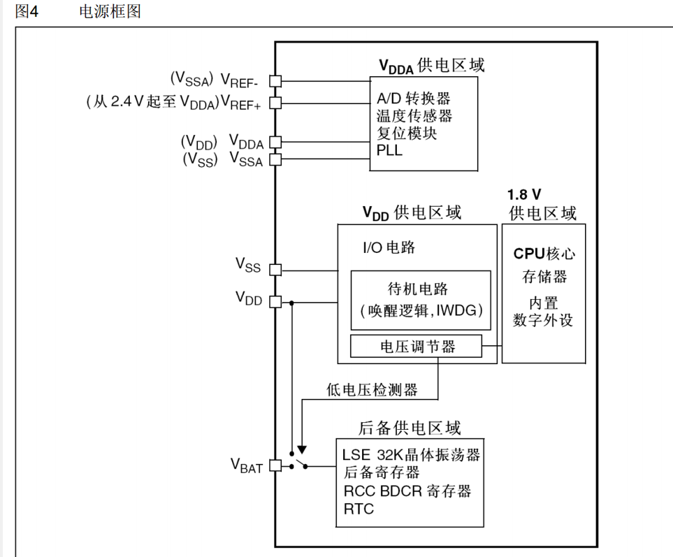

#### 2.13.3 低功耗模式

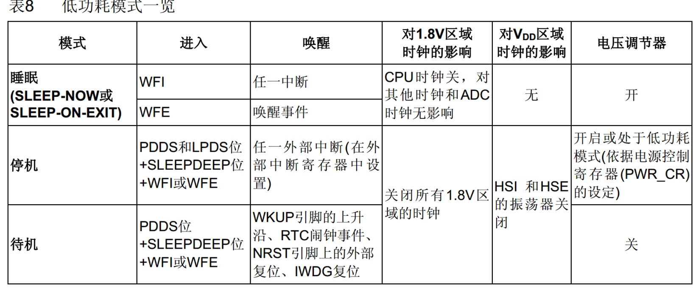

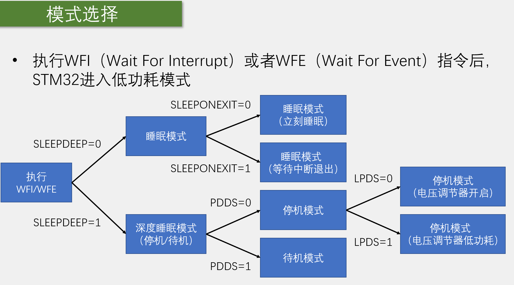

##### 2.13.3.1 睡眠模式

* 执行完WFI/WFE指令后，STM32进入睡眠模式，程序暂停运行，唤醒后程序从暂停的地方继续运行
* SLEEPONEXIT位决定STM32执行完WFI或WFE后，是立刻进入睡眠，还是等STM32从最低优先级的中断处理程序中退出时进入睡眠
* 在睡眠模式下，所有的I/O引脚都保持它们在运行模式时的状态
* WFI指令进入睡眠模式，可被任意一个NVIC响应的中断唤醒
* WFE指令进入睡眠模式，可被唤醒事件唤醒

##### 2.13.3.2 停止模式

* 执行完WFI/WFE指令后，STM32进入停止模式，程序暂停运行，唤醒后程序从暂停的地方继续运行
* 1.8V供电区域的所有时钟都被停止，PLL、HSI和HSE被禁止，SRAM和寄存器内容被保留下来
* 在停止模式下，所有的I/O引脚都保持它们在运行模式时的状态
* 当一个中断或唤醒事件导致退出停止模式时，HSI被选为系统时钟
* 当电压调节器处于低功耗模式下，系统从停止模式退出时，会有一段额外的启动延时
* WFI指令进入停止模式，可被任意一个EXTI中断唤醒
* WFE指令进入停止模式，可被任意一个EXTI事件唤醒


##### 2.13.3.3 待机模式
* 执行完WFI/WFE指令后，STM32进入待机模式，唤醒后程序从头开始运行
* 整个1.8V供电区域被断电，PLL、HSI和HSE也被断电，SRAM和寄存器内容丢失，只有备份的寄存器和待机电路维持供电
* 在待机模式下，所有的I/O引脚变为高阻态（浮空输入）
* WKUP引脚的上升沿、RTC闹钟事件的上升沿、NRST引脚上外部复位、IWDG复位退出待机模式


#### 2.13.4 低功耗代码

* 睡眠等待串口数据接收
main.c(串口部分不变)：
```c
#include "stm32f10x.h"                  // Device header
#include "Delay.h"
#include "OLED.h"
#include "Serial.h"

uint8_t RxData;			//定义用于接收串口数据的变量

int main(void)
{
	OLED_Init();		//OLED初始化
	OLED_ShowString(1, 1, "RxData:");	//显示静态字符串
	
	Serial_Init();		//串口初始化
	
	while (1)
	{
		if (Serial_GetRxFlag() == 1)			//检查串口接收数据的标志位
		{
			RxData = Serial_GetRxData();		//获取串口接收的数据
			Serial_SendByte(RxData);			//串口将收到的数据回传回去，用于测试
			OLED_ShowHexNum(1, 8, RxData, 2);	//显示串口接收的数据
		}
		
		OLED_ShowString(2, 1, "Running");		//OLED闪烁Running，指示当前主循环正在运行
		Delay_ms(100);
		OLED_ShowString(2, 1, "       ");
		Delay_ms(100);
		
		__WFI();								//执行WFI指令，CPU睡眠，并等待中断唤醒
	}
}

```
* 停止等待外部中断（红外传感）唤醒：
main.c：
```c
#include "stm32f10x.h"                  // Device header
#include "Delay.h"
#include "OLED.h"
#include "CountSensor.h"

int main(void)
{
	/*模块初始化*/
	OLED_Init();			//OLED初始化
	CountSensor_Init();		//计数传感器初始化
	
	/*开启时钟*/
	RCC_APB1PeriphClockCmd(RCC_APB1Periph_PWR, ENABLE);		//开启PWR的时钟
															//停止模式和待机模式一定要记得开启
	
	/*显示静态字符串*/
	OLED_ShowString(1, 1, "Count:");
	
	while (1)
	{
		OLED_ShowNum(1, 7, CountSensor_Get(), 5);			//OLED不断刷新显示CountSensor_Get的返回值
		
		OLED_ShowString(2, 1, "Running");					//OLED闪烁Running，指示当前主循环正在运行
		Delay_ms(100);
		OLED_ShowString(2, 1, "       ");
		Delay_ms(100);
		
		PWR_EnterSTOPMode(PWR_Regulator_ON, PWR_STOPEntry_WFI);	//STM32进入停止模式，并等待中断唤醒
		SystemInit();								//唤醒后，要重新配置时钟
	}
}

```

>**注：在停止模式下，STM32的时钟会被关闭，所以在唤醒后会默认成8MHZ，需要重新配置时钟**

<br>
<br>

---

### 2.14 WDG看门狗

#### 2.14.1 WDG简介

* WDG（Watchdog）看门狗
* 看门狗可以监控程序的运行状态，当程序因为设计漏洞、硬件故障、电磁干扰等原因，出现卡死或跑飞现象时，看门狗能及时复位程序，避免程序陷入长时间的罢工状态，保证系统的可靠性和安全性
* 看门狗本质上是一个定时器，当指定时间范围内，程序没有执行喂狗（重置计数器）操作时，看门狗硬件电路就自动产生复位信号
* STM32内置两个看门狗
独立看门狗（IWDG）：独立工作，对时间精度要求较低
窗口看门狗（WWDG）：要求看门狗在精确计时窗口起作用

#### 2.14.2 IWDG独立看门狗


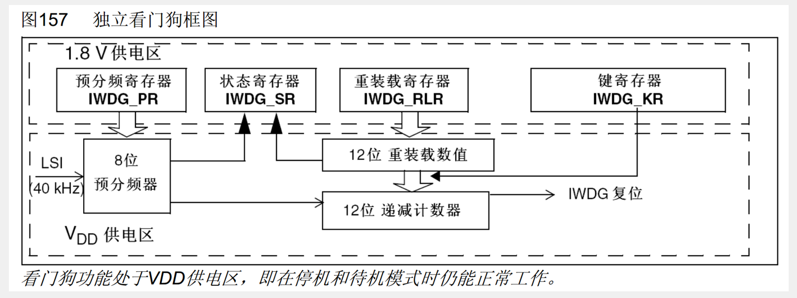

为了实现看门狗的稳定，设置了键寄存器，即需要输入特定的值，才能对看门狗进行操作，有效防止误操作或干扰（就像密码一样）
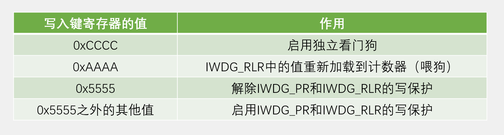

>超时时间：TIWDG = TLSI × PR预分频系数 × (RL + 1)
其中：TLSI = 1 / FLSI(40MHZ)

#### 2.14.3 WWGD窗口看门狗
窗口看门狗除了有IWDG的功能外，还有一个窗口功能，即在一个时间窗口内，看门狗必须喂狗，太早或太晚都不行，否则会产生复位信号

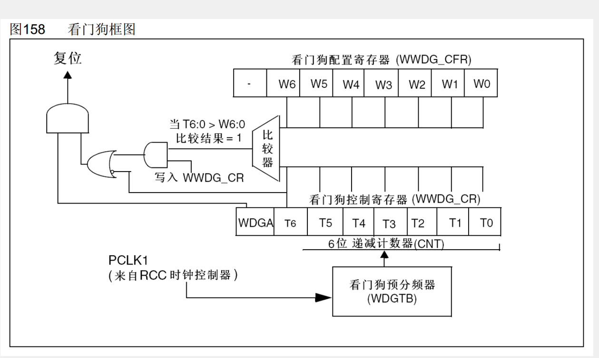

>WWDG是把最高位当成了标志位，所以实际计数只有T[5:0]，当T0-T5为0后会产生一个中断信号，之后再减1，就会使T6变为0，产生复位信号
当写入的值大于窗口值（即过早），也会产生复位信号


* 超时时间：
	TWWDG = TPCLK1(72MHZ) × 4096 × WDGTB预分频系数 × (T[5:0] + 1)
* 窗口时间：
	TWIN = TPCLK1 × 4096 × WDGTB预分频系数 × (T[5:0] - W[5:0])
其中：TPCLK1 = 1 / FPCLK1

#### 2.14.4 IWDG和WWDG比较

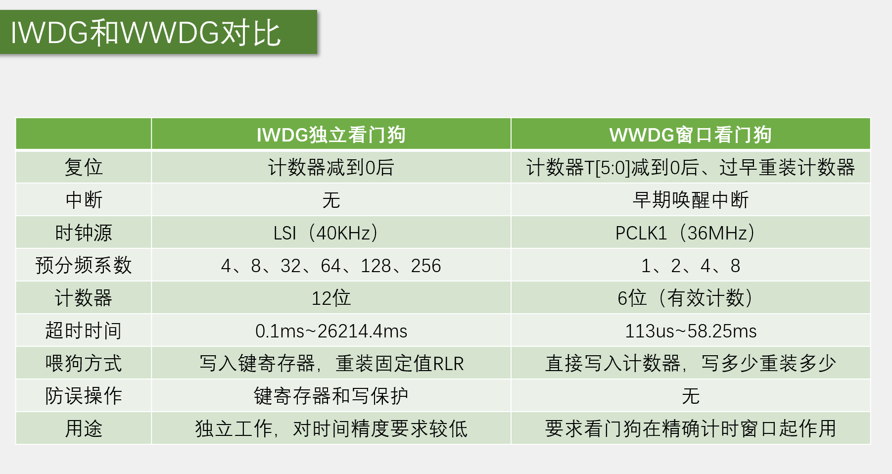

#### 2.14.5 WDG代码

IWDG:
```c
#include "stm32f10x.h"                  // Device header
#include "Delay.h"
#include "OLED.h"
#include "Key.h"

int main(void)
{
	/*模块初始化*/
	OLED_Init();						//OLED初始化
	Key_Init();							//按键初始化
	
	/*显示静态字符串*/
	OLED_ShowString(1, 1, "IWDG TEST");
	
	/*判断复位信号来源*/
	if (RCC_GetFlagStatus(RCC_FLAG_IWDGRST) == SET)	//如果是独立看门狗复位
	{
		OLED_ShowString(2, 1, "IWDGRST");			//OLED闪烁IWDGRST字符串
		Delay_ms(500);
		OLED_ShowString(2, 1, "       ");
		Delay_ms(100);
		
		RCC_ClearFlag();							//清除标志位
	}
	else											//否则，即为其他复位
	{
		OLED_ShowString(3, 1, "RST");				//OLED闪烁RST字符串
		Delay_ms(500);
		OLED_ShowString(3, 1, "   ");
		Delay_ms(100);
	}
	
	/*IWDG初始化*/
	IWDG_WriteAccessCmd(IWDG_WriteAccess_Enable);	//独立看门狗写使能
	IWDG_SetPrescaler(IWDG_Prescaler_16);			//设置预分频为16
	IWDG_SetReload(2499);							//设置重装值为2499，独立看门狗的超时时间为1000ms
	IWDG_ReloadCounter();							//重装计数器，喂狗
	IWDG_Enable();									//独立看门狗使能
	
	while (1)
	{
		Key_GetNum();								//调用阻塞式的按键扫描函数，模拟主循环卡死
		
		IWDG_ReloadCounter();						//重装计数器，喂狗
		
		OLED_ShowString(4, 1, "FEED");				//OLED闪烁FEED字符串
		Delay_ms(200);								//喂狗间隔为200+600=800ms
		OLED_ShowString(4, 1, "    ");
		Delay_ms(600);
	}
}

```

WWDG:

```c
#include "stm32f10x.h"                  // Device header
#include "Delay.h"
#include "OLED.h"
#include "Key.h"

int main(void)
{
	/*模块初始化*/
	OLED_Init();						//OLED初始化
	Key_Init();							//按键初始化
	
	/*显示静态字符串*/
	OLED_ShowString(1, 1, "WWDG TEST");
	
	/*判断复位信号来源*/
	if (RCC_GetFlagStatus(RCC_FLAG_WWDGRST) == SET)	//如果是窗口看门狗复位
	{
		OLED_ShowString(2, 1, "WWDGRST");			//OLED闪烁WWDGRST字符串
		Delay_ms(500);
		OLED_ShowString(2, 1, "       ");
		Delay_ms(100);
		
		RCC_ClearFlag();							//清除标志位
	}
	else											//否则，即为其他复位
	{
		OLED_ShowString(3, 1, "RST");				//OLED闪烁RST字符串
		Delay_ms(500);
		OLED_ShowString(3, 1, "   ");
		Delay_ms(100);
	}
	
	/*开启时钟*/
	RCC_APB1PeriphClockCmd(RCC_APB1Periph_WWDG, ENABLE);	//开启WWDG的时钟
	
	/*WWDG初始化*/
	WWDG_SetPrescaler(WWDG_Prescaler_8);			//设置预分频为8
	WWDG_SetWindowValue(0x40 | 21);					//设置窗口值，窗口时间为30ms,或上0x40是让第六位置1
	WWDG_Enable(0x40 | 54);							//使能并第一次喂狗，超时时间为50ms，或上0x40是让第六位置1
	
	while (1)
	{
		Key_GetNum();								//调用阻塞式的按键扫描函数，模拟主循环卡死
		
		OLED_ShowString(4, 1, "FEED");				//OLED闪烁FEED字符串
		Delay_ms(20);								//喂狗间隔为20+20=40ms
		OLED_ShowString(4, 1, "    ");
		Delay_ms(20);
		
		WWDG_SetCounter(0x40 | 54);					//重装计数器，喂狗
	}
}
```

<br>
<br>

---

### 2.15 CAN通信

#### 2.15.1 CAN简介

* CAN是控制器局域网络(Controller Area Network)的简称，CAN总线协议已经成为汽车计算机控制系统和嵌入式工业控制局域网的标准总线。
* CAN是国际标准化的 串行通信协议 ，采用数据块编码的方式，数据块根据帧的类型，能够让挂载在总线上的不
* 同节点接收到相同的数据，再根据每个节点的配置对信息进行选择性处理(接收or丢弃)。

>我个人认为有三层（这个和真实的标准有出入，但对新手以及不开发硬件的嵌入式开发者来说，理解足够）：物理信号层，链路传输层，应用数据层
物理信号层，规定了硬件电路的设计规则、用户使用的接线方式、线路上传输信号与电平格式对应关系、波特率比特率、数据同步异步传输、收发模式等内容
链路传输层，规定了地址（CAN ID）、冲突检测与避免（仲裁）、误码校验、滤波器与掩码、该层的帧格式
应用数据层是被传输的数据主体；链路层把应用层的数据拿来，加上相关的地址、校验等信息封装；物理层把链路层的数据拿来，编码成物理信号传输出去

#### 2.15.2 CAN硬件链接

接线方式：总线接法
* 每个设备引出两根线，一根是CAN_H，一根是CAN_L（当然也有单线CAN但速度低我们不考虑使用）； 不同设备的CAN_H接到一起， CAN_L接到一起
* CAN_H与CAN_L通过120Ohm电阻连接在一起，防止总线上传输的高频信号存在反射振铃效应导致信号不稳定、寄生电容导致信号响应速度变慢等情况


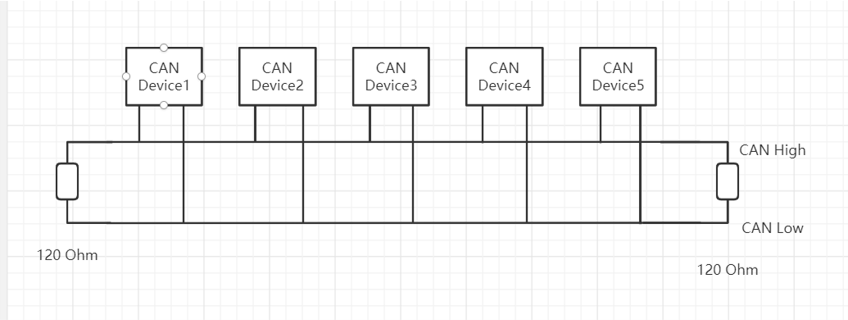

线路传输的电平的形式：差分信号传输

* 差分信号传输，在长距离传输时可保证信号质量（展示为双绞线，当有干扰时，两根线的干扰是一样的，所以差分信号传输时，干扰信号会被消除）
* 码元1被编码成CAN_H与CAN_L电平相同，称为隐性电平，一般两根线电平均为2.5V
* 码元0被编码成CAN_H与CAN_L电平不同，称为显性电平，一般CAN_H为3.5V，CAN_L为1.5V
* 后续为表述方便，仍以传统的低电平为0高电平为1表示信号,**但CAN的逻辑0仍然是显性信号！**

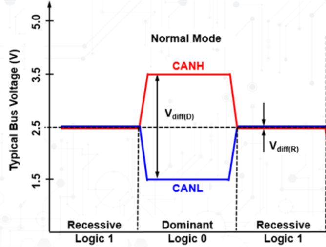

#### 2.15.3 CAN采样形式

CAN采用的是异步通信，所以需要配置波特率，在每一个波特率单位中，CAN划分了不同的时间段来保证采样的准确性：

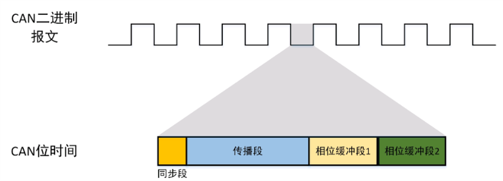

* 同步段对整条总线各个设备进行同步
* 传播段是时间占用片，因为有些CAN总线可能比较长，要考虑物理信号在总线的传播时间以及CAN驱动器的处理时间。传播速度一般是光速的2/3，也就是2*10^8m/s；传播段时间一般是信号在总线上传播时间的两倍
* 相位缓冲段有两个，**其中夹住的时间点就是采样时间点**，硬件设备在这个时间点上对电平采样获取当前比特的状态是0还是1

#### 2.15.4 CAN收发模式
1. 常规模式
* 向总线发送
* 从总线接收

2. 回环模式
* 向总线和本机发送
* 不从总线接收仅从本机接收

3. 静默模式
* 不向总线发送仅向本机发送
* 从总线和本机接收

4. 回环静默模式
* 不向总线发送
* 不从总线接收
* 自收自发

#### 2.15.5 CAN帧格式

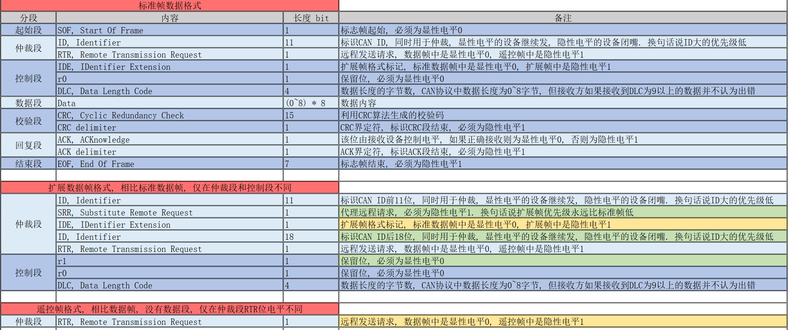

1. 地址（CAN ID）

* 由于是广播性质的总线协议，因此用地址来说并不是十分标准的
* CAN ID承担了类似于地址的功能，是一帧的标识符，一般指明是“谁发的”
* 在计算机网络中的大多数协议里，地址与一个设备或一个终端完全绑定且一定范畴内一一对应；但CAN设备不存在一个固定的地址，而是以ID加以区分不同的帧的来源或目标(即每个帧都能有不同的ID)
* 比如，IP地址可以在一个网络内唯一指定一个网络设备（不考虑伪造等非法的网络攻击或IP冲突等错误情况）；但CAN ID不可以，它只对它发送的报文负责，我的设备可以发ID为0x201的报文，也可以发ID为0x202的报文，每个报文也可以指定不同的信息


2. 冲突检测与避免（仲裁）
* 众所周知，一根物理意义的导线上不可能同时是高电平和低电平，一条传统通信方式的链路上也不可能同时传输0和1，因此需要一定的冲突处理机制
* 冲突的处理机制主要有两种，一种是冲突检测，一种是冲突避免，CAN采用的是冲突检测

冲突检测： 
* 出现可能的冲突，然后解决冲突
* 显性电平是0，即当CAN总线上同时出现0和1时，1会被隐藏，线路显示为0
* 所以，当链路上存在设备想发送0的同时又有设备发送1的时候，链路中表现为0，因为0是显性电平
* 此时，想发送1的设备发现，链路怎么变成0了？原来是有人也要发消息，那我闭嘴


3. 误码校验
* 采用的是CRC算法

4. 滤波器

列表模式：
* 即存放需要的ID，如果帧中的ID与其相等则接收，但列表能存放的ID数量有限制（STM32中scale为32时能写2个ID，16时能写4个ID）

掩码模式：
* 用于配置接收设备，注意，是过滤通过，而非过滤排除机制。即符合条件的报文会接收（即每个节点都有滤波器，用来检测该帧的ID是否是自己需要）
* 滤波器用于过滤出想要接收的信息，掩码Mask用于匹配想要接收的信息ID
* 如何过滤与匹配？以CAN ID作为匹配规则。标准格式中的CAN ID长度为11b，也就是CAN ID最大为0x7ff。滤波器中掩码和ID相与。得到的值如果与ID_filter（配置好的，需要接收的值或范围）一样则接收。

5. 仲裁方法

 * 开始发送后其它节点不会发送
 * 如有同时发送的，节点会对线路进行匹配，线路上同时接收到0和1时会显示为0。如果节点发现线路为0而自己发送的是1，则退出。如果线路是0而自己发送的是0，则继续发送。
 * 具有相同ID的数据帧和遥控帧在总线上竞争时，仲裁段的最后一位(RTR)为显性位的数据帧具有优先权可继续发送。

6. 邮箱

STM32F103中有2个接受邮箱（每个邮箱3层，能存3个帧），和3个发送邮箱（每个邮箱只有1层）。每一个接收邮箱都有自己的过滤器（一般是中断接收），当CPU需要时才会从接收邮箱中读取数据（先进先出）。发送邮箱具有优先级，优先级高的先发送。

### 2.16 CAN配置

1. 配置CAN基础模式，其中上部分时间片对应CAN的采样点（即一个电平的采取），下部分是基本的工作模式

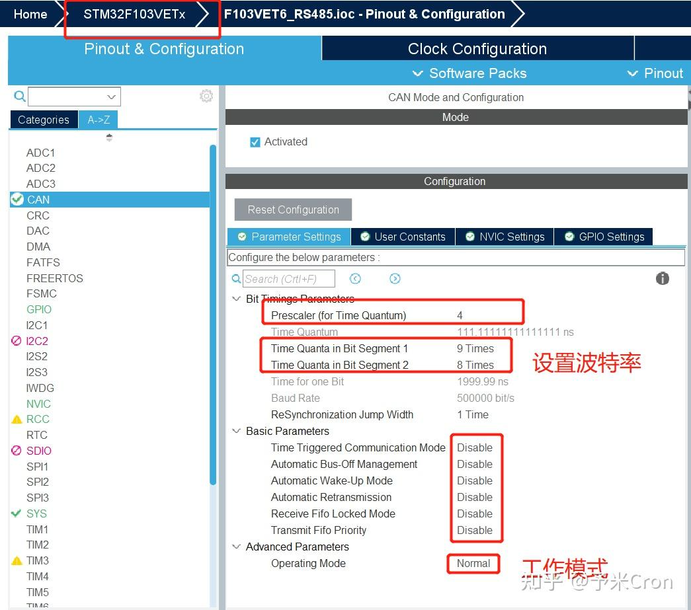

2. 转到NVIC配置，开启CAN_RX相关中断
3. 生成代码
4. 自己写过滤器的初始化函数，以及发送和接收函数

### 2.17 CAN代码

Can.c:
```c
/**
  ******************************************************************************
  * File Name          : CAN.c
  * Description        : This file provides code for the configuration
  *                      of the CAN instances.
  ******************************************************************************
  * @attention
  *
  * <h2><center>&copy; Copyright (c) 2024 STMicroelectronics.
  * All rights reserved.</center></h2>
  *
  * This software component is licensed by ST under BSD 3-Clause license,
  * the "License"; You may not use this file except in compliance with the
  * License. You may obtain a copy of the License at:
  *                        opensource.org/licenses/BSD-3-Clause
  *
  ******************************************************************************
  */

/* Includes ------------------------------------------------------------------*/
#include "can.h"

/* USER CODE BEGIN 0 */
#include "OLED.h"
CAN_TxHeaderTypeDef TXHeader;
CAN_RxHeaderTypeDef RXHeader;

uint8_t TXmessage[8] = {0x00,0x11,0x22,0x33,0x44,0x55,0x66,0x77};
uint8_t RXmessage[8];
uint32_t pTxMailbox = 0;
/* USER CODE END 0 */

CAN_HandleTypeDef hcan;

/* CAN init function */
void MX_CAN_Init(void)
{

  hcan.Instance = CAN1;
  hcan.Init.Prescaler = 9;
  hcan.Init.Mode = CAN_MODE_NORMAL;
  hcan.Init.SyncJumpWidth = CAN_SJW_1TQ;
  hcan.Init.TimeSeg1 = CAN_BS1_4TQ;
  hcan.Init.TimeSeg2 = CAN_BS2_3TQ;
  hcan.Init.TimeTriggeredMode = DISABLE;
  hcan.Init.AutoBusOff = DISABLE;
  hcan.Init.AutoWakeUp = DISABLE;
  hcan.Init.AutoRetransmission = DISABLE;
  hcan.Init.ReceiveFifoLocked = DISABLE;
  hcan.Init.TransmitFifoPriority = DISABLE;
  if (HAL_CAN_Init(&hcan) != HAL_OK)
  {
    Error_Handler();
  }

}

void HAL_CAN_MspInit(CAN_HandleTypeDef* canHandle)
{

  GPIO_InitTypeDef GPIO_InitStruct = {0};
  if(canHandle->Instance==CAN1)
  {
  /* USER CODE BEGIN CAN1_MspInit 0 */

  /* USER CODE END CAN1_MspInit 0 */
    /* CAN1 clock enable */
    __HAL_RCC_CAN1_CLK_ENABLE();

    __HAL_RCC_GPIOA_CLK_ENABLE();
    /**CAN GPIO Configuration
    PA11     ------> CAN_RX
    PA12     ------> CAN_TX
    */
    GPIO_InitStruct.Pin = GPIO_PIN_11;
    GPIO_InitStruct.Mode = GPIO_MODE_INPUT;
    GPIO_InitStruct.Pull = GPIO_NOPULL;
    HAL_GPIO_Init(GPIOA, &GPIO_InitStruct);

    GPIO_InitStruct.Pin = GPIO_PIN_12;
    GPIO_InitStruct.Mode = GPIO_MODE_AF_PP;
    GPIO_InitStruct.Speed = GPIO_SPEED_FREQ_HIGH;
    HAL_GPIO_Init(GPIOA, &GPIO_InitStruct);

    /* CAN1 interrupt Init */
    HAL_NVIC_SetPriority(USB_LP_CAN1_RX0_IRQn, 0, 0);
    HAL_NVIC_EnableIRQ(USB_LP_CAN1_RX0_IRQn);
    HAL_NVIC_SetPriority(CAN1_RX1_IRQn, 0, 0);
    HAL_NVIC_EnableIRQ(CAN1_RX1_IRQn);
  /* USER CODE BEGIN CAN1_MspInit 1 */

  /* USER CODE END CAN1_MspInit 1 */
  }
}

void HAL_CAN_MspDeInit(CAN_HandleTypeDef* canHandle)
{

  if(canHandle->Instance==CAN1)
  {
  /* USER CODE BEGIN CAN1_MspDeInit 0 */

  /* USER CODE END CAN1_MspDeInit 0 */
    /* Peripheral clock disable */
    __HAL_RCC_CAN1_CLK_DISABLE();

    /**CAN GPIO Configuration
    PA11     ------> CAN_RX
    PA12     ------> CAN_TX
    */
    HAL_GPIO_DeInit(GPIOA, GPIO_PIN_11|GPIO_PIN_12);

    /* CAN1 interrupt Deinit */
    HAL_NVIC_DisableIRQ(USB_LP_CAN1_RX0_IRQn);
    HAL_NVIC_DisableIRQ(CAN1_RX1_IRQn);
  /* USER CODE BEGIN CAN1_MspDeInit 1 */

  /* USER CODE END CAN1_MspDeInit 1 */
  }
}

/* USER CODE BEGIN 1 */
void MX_CAN1_Init(void)
{

  hcan.Instance = CAN1;
  hcan.Init.Prescaler = 9;
  hcan.Init.Mode = CAN_MODE_NORMAL;
  hcan.Init.SyncJumpWidth = CAN_SJW_1TQ;
  hcan.Init.TimeSeg1 = CAN_BS1_4TQ;
  hcan.Init.TimeSeg2 = CAN_BS2_3TQ;
  hcan.Init.TimeTriggeredMode = DISABLE;
  hcan.Init.AutoBusOff = DISABLE;
  hcan.Init.AutoWakeUp = DISABLE;
  hcan.Init.AutoRetransmission = DISABLE;
  hcan.Init.ReceiveFifoLocked = DISABLE;
  hcan.Init.TransmitFifoPriority = DISABLE;
  if (HAL_CAN_Init(&hcan) != HAL_OK)
  {
    Error_Handler();
  }
	CAN_FilterTypeDef sFilterConfig;
 
 sFilterConfig.FilterActivation = CAN_FILTER_ENABLE;
 sFilterConfig.FilterBank = 0;
 sFilterConfig.FilterMode = CAN_FILTERMODE_IDMASK;
 sFilterConfig.FilterScale = CAN_FILTERSCALE_32BIT;
 sFilterConfig.FilterFIFOAssignment = CAN_FILTER_FIFO0;
 
 sFilterConfig.FilterIdHigh =	(0x17fc0084 >> 13) & 0xFFFF;
 sFilterConfig.FilterIdLow = ((0x17fc0084 << 3) | CAN_ID_EXT | CAN_RTR_DATA) & 0xFFFF;
 sFilterConfig.FilterMaskIdHigh = (0x17fc0084 >> 13) & 0xFFFF;
 sFilterConfig.FilterIdLow = ((0x17fc0084 << 3) | CAN_ID_EXT | CAN_RTR_DATA) & 0xFFFF;
 if(HAL_CAN_ConfigFilter(&hcan,&sFilterConfig) != HAL_OK)
 {
  Error_Handler();
 }
 if(HAL_CAN_Start(&hcan) != HAL_OK)
 {
  Error_Handler();
 }
 if(HAL_CAN_ActivateNotification(&hcan,CAN_IT_RX_FIFO0_MSG_PENDING) != HAL_OK)
 {
  Error_Handler();
 }

}


void HAL_CAN_RxFifo0MsgPendingCallback(CAN_HandleTypeDef *hcan)
{
	if(hcan->Instance==CAN1)
	{
		HAL_CAN_GetRxMessage(hcan,CAN_FILTER_FIFO0,&RXHeader,RXmessage);
    }
		OLED_ShowSignedNum(2,1,RXmessage[0],3);
}


void CAN_senddata(CAN_HandleTypeDef *hcan)
{
   TXHeader.StdId=0x00000000;
	 TXHeader.ExtId=0x00000000;
	 TXHeader.DLC=8;
	 TXHeader.IDE=CAN_ID_EXT;
	 TXHeader.RTR=CAN_RTR_DATA;
	 TXHeader.TransmitGlobalTime = DISABLE;
	 HAL_CAN_AddTxMessage(hcan,&TXHeader,TXmessage,&pTxMailbox);
}

/* USER CODE END 1 */

/************************ (C) COPYRIGHT STMicroelectronics *****END OF FILE****/
```

main.c:
```c
extern uint8_t RXmessage[8],TXmessage[8];


void main(){
	MX_CAN1_Init();
	CAN_senddata(&hcan);
}