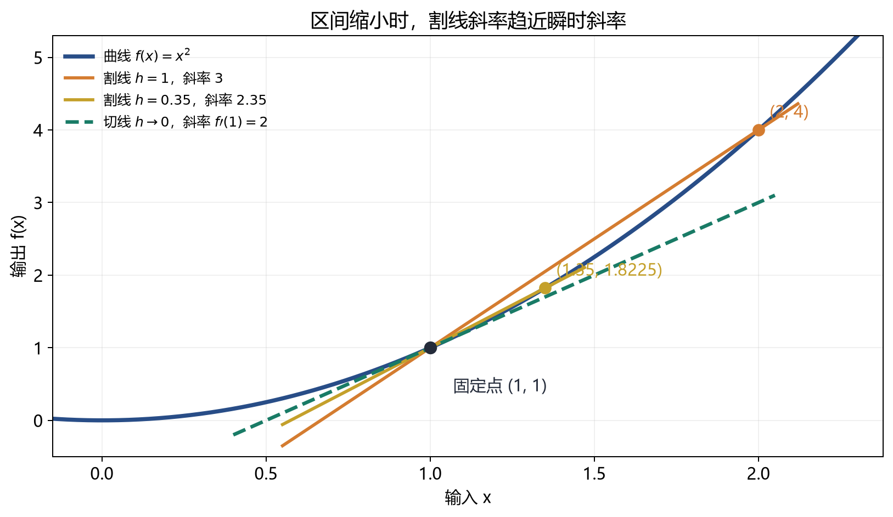
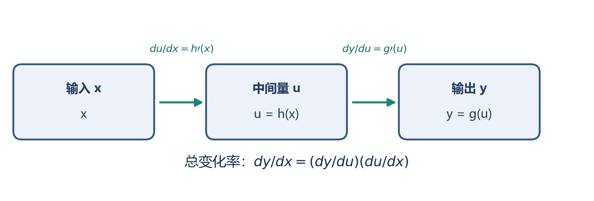
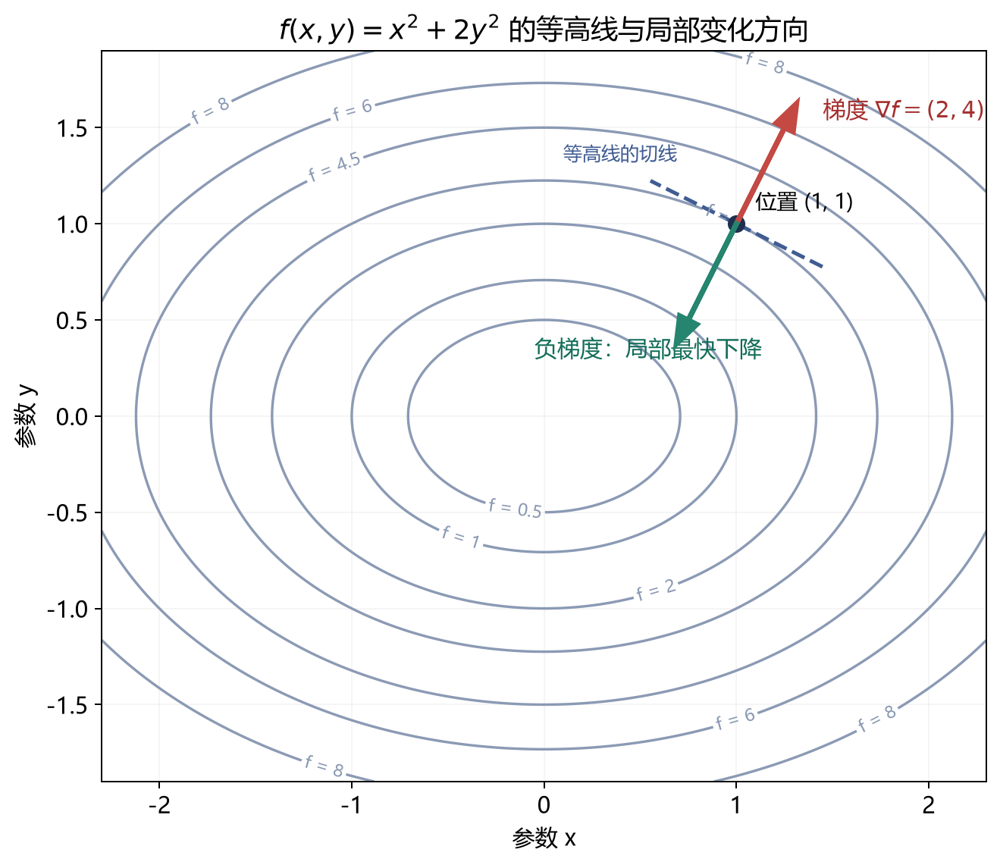

# [AI入门-微积分]1.导数、偏导数与链式法则

训练模型时，我们先用参数产生预测，再用损失函数衡量预测误差。若想知道某个参数改变一点会使损失怎样变化，就需要求导。本篇从一元函数的变化率出发，按原课程的顺序建立求导规则，再推广到多个参数；链式法则最后把各步局部变化连接起来，为之后的梯度下降和反向传播提供基础。

## 1 从平均变化率到导数与切线

设 $y=f(x)$。当输入从 $a$ 增加到 $a+h$ 时，输出改变量是 $f(a+h)-f(a)$；两者相除，得到这段区间内的**平均变化率**：

$$
\frac{f(a+h)-f(a)}{h},\qquad h\ne0.
$$

例如物体的位置是 $s(t)$，上式就是从时刻 $t$ 到 $t+h$ 的平均速度。要问“时刻 $t$ 的速度”，就让区间逐渐缩小。如果差商从左右两侧趋向同一个有限值，定义该值为点 $a$ 处的**导数**：

$$
f'(a)=\lim_{h\to0}\frac{f(a+h)-f(a)}{h}.
$$

导数的几何含义是曲线在 $(a,f(a))$ 处的切线斜率。下图中，两点之间的割线随着第二个点向 $a$ 靠近而趋向切线：

以 $f(x)=x^2$ 为例，在 $a=1$ 时

$$
\frac{f(1+h)-f(1)}{h}
=\frac{(1+h)^2-1}{h}=2+h.
$$

令 $h\to0$ 得到 $f'(1)=2$。同一个函数在不同点有不同斜率：把 $a$ 保留为变量，按相同方式可得 $f'(a)=2a$。因此导数本身通常也是一个函数。

当 $h$ 足够小时，导数还能给出函数的**局部线性近似**：

$$
f(a+h)\approx f(a)+f'(a)h.
$$

也就是从已知的 $f(a)$ 出发，用“斜率 $\times$ 输入改变量”估计新函数值。对应的切线方程为 $y=f(a)+f'(a)(x-a)$。例如在 $a=1$ 附近，若 $h=0.1$，切线估计 $f(1.1)\approx1+2(0.1)=1.2$；实际值为 $1.1^2=1.21$，差的 $0.01$ 正是 $h^2$。当 $h$ 很小时，遗漏项比一阶改变量小得多；离开该点很远则不能保证近似准确。后续优化算法正是用这种局部估计决定下一步怎么走。

同一个导数也写作 $\frac{dy}{dx}$ 或 $\frac{d}{dx}f(x)$。$\frac{d}{dx}$ 表示“对 $x$ 求导”的操作；后文的 $\frac{dy}{dx}$ 记号有助于读出变量依赖，但求导等式仍须依据极限和求导规则，不能把它当作任意可约分的普通分数。

## 2 用导数判断增减、极值与不可导点

导数在某个点为正，表示从该点向右作足够小的移动时，函数值倾向于增加；导数为负则倾向于下降。如果一个区间内处处有 $f'(x)>0$，函数就在该区间严格递增；若处处有 $f'(x)<0$，则严格递减。用损失 $L(w)$ 看，$L'(w)>0$ 说明在当前位置略微增大参数 $w$ 会使损失上升，向相反方向小幅移动才可能使损失下降。

在定义域**内部**，若 $f$ 在局部极值点 $a$ 可导，就必须有 $f'(a)=0$。这种零导数点叫**驻点**，它只是候选位置。$f(x)=x^2$ 在零点的导数由负变正，所以零点是极小值；$f(x)=x^3$ 的导数 $3x^2$ 在零点也为零，但函数穿过零点继续上升，并无极值。判断时要看驻点两侧的变化；后文还会介绍二阶信息。若优化范围是闭区间，端点也可能取得最大或最小值。

应用求导公式之前，还须确认目标点的导数存在。可导一定连续，连续却未必可导：$f(x)=|x|$ 在 $x=0$ 连续，但右侧差商趋向 $1$，左侧趋向 $-1$，所以这里没有导数。跳跃点因为不连续也不可导；$f(x)=\sqrt[3]{x}$ 在零点的差商趋于无穷，仍没有**有限**导数。这三种原因在几何上分别表现为尖角、断裂和竖直切线。分段函数的拼接点要分别检查函数值、左右连续性和左右导数，不能直接套某一段的公式。

在机器学习中，某些分段激活函数也存在不可导点。经典导数在该点不存在这一事实不会改变；实现可为该点规定求梯度时采用的值。讨论具体实现时，应看所用框架和运算的规则，不把规定值误称为经典导数。

## 3 常见函数、自然对数与反函数的导数

复杂的损失函数通常由少量基本函数组合而成。先掌握这些基本函数的导数，下一节才能把它们按运算关系组合起来。下表中的 $c,a,b$ 是与 $x$ 无关的常数；三角函数的标准求导公式使用**弧度**作为角度单位。

| 函数 $f(x)$ | 导数 $f'(x)$ | 适用条件或含义 |
|---|---|---|
| $c$ | $0$ | 常数不随输入改变 |
| $ax+b$ | $a$ | 直线的斜率处处相同 |
| $x^n$ | $nx^{n-1}$ | 整数 $n$；负指数避开 $x=0$ |
| $\sin x$ | $\cos x$ | $x$ 用弧度 |
| $\cos x$ | $-\sin x$ | $x$ 用弧度 |
| $e^x$ | $e^x$ | 瞬时增长率等于当前值 |
| $\ln x$ | $1/x$ | $x>0$ |

幂函数公式还能推广到许多非整数指数，但首先要检查实数定义域。例如 $\sqrt{x}=x^{1/2}$ 在 $x>0$ 的导数为 $1/(2\sqrt{x})$，在 $x=0$ 不能直接把该公式代入。

指数函数适合描述“当前量越大，后续增长也越快”的关系；对数则把很大的乘积改写成较容易处理的和，例如 $\ln(2\cdot3)=\ln2+\ln3$。它们在增长模型和概率模型的损失函数中都会出现。常数 $e$ 可由极限 $e=\lim_{n\to\infty}(1+1/n)^n$ 给出。以它为底的指数函数满足 $(e^x)'=e^x$；其反函数是**自然对数** $\ln x$，因而 $e^{\ln x}=x$（$x>0$）、$\ln(e^x)=x$。在损失函数中常见的 $\log x$ 通常指自然对数，但阅读具体库或文献时仍应确认底数。若底数换成 $a>0$ 且 $a\ne1$，则 $(a^x)'=a^x\ln a$，$(\log_a x)'=1/(x\ln a)$，后一公式仍要求 $x>0$。

反函数把“输入 $x$ 得到输出 $y$”反过来，回答“已知 $y$，原来的 $x$ 是多少”。如果原函数在某处让输入增加 1、输出大约增加 2，那么反向读取时，输出增加 1 对应原输入大约增加 $1/2$。这种斜率互为倒数的关系需要原函数在所考察的邻域可逆，而且 $f'(x)\ne0$：

$$
(f^{-1})'(y)=\frac{1}{f'(x)}
=\frac{1}{f'(f^{-1}(y))}.
$$

这里 $f^{-1}$ 表示**反函数**，并非 $1/f$。先用简单数字检验：$f(x)=2x+1$ 把 $x=3$ 变成 $y=7$；反函数 $f^{-1}(y)=(y-1)/2$ 把 7 变回 3。前者斜率是 2，后者是 $1/2$。对 $y=e^x$，有 $x=\ln y$ 和 $f'(x)=e^x=y$，所以 $(\ln y)'=1/y$。这也说明 $\ln y$ 在 $y$ 很小时变化快，在 $y$ 很大时对同样大小的输入变化反应较弱。又如 $x^2$ 必须先限制在 $x\ge0$ 才有反函数 $\sqrt{x}$；在原点斜率为零，倒数规则不能给出有限的反函数导数。这些条件比背公式更重要。

## 4 把基本导数组合起来：线性与乘积规则

对于可导的 $f(x)$、$g(x)$ 和常数 $c$，函数相加或整体乘一个常数时，各部分的变化率直接相加或缩放：

$$
(f+g)'=f'+g',\qquad (cf)'=cf'.
$$

例如 $f(x)=3x^2+2\sin x$，分别求导再相加，可得 $f'(x)=6x+2\cos x$。如果函数是由多个损失项相加构成，总损失对同一参数的导数也要把各项贡献相加；这里的前提是每一项都对该参数可导。

两个函数**相乘**时，两边都会变化。把 $f(x+h)g(x+h)-f(x)g(x)$ 展开，并以 $f(x+h)-f(x)$ 和 $g(x+h)-g(x)$ 分组，除以 $h$ 后取极限，得到

$$
(fg)'=f'g+fg'.
$$

公式里的两项各对应一个因子的变化，不能写成 $f'g'$。例如 $x^2e^x$ 的导数是 $2xe^x+x^2e^x$。这一规则以后也会用于推导多变量目标函数，但当前只需把握“有几条独立的一阶变化贡献，就把它们相加”。

## 5 链式法则：沿依赖路径连接变化率

上述规则处理同一层的相加和相乘。如果 $x$ 先变成中间量 $u=h(x)$，中间量再变成输出 $y=g(u)$，那么 $x$ 对 $y$ 的影响要经过两步。**链式法则**把每一步的局部变化率沿路径相乘：

$$
\frac{dy}{dx}
=\frac{dy}{du}\frac{du}{dx}
=g'(h(x))h'(x).
$$

这个式子的关键是：外层导数 $g'(u)$ 要在当前中间值 $u=h(x)$ 处求值。下图把前向计算的数值路径和求导时使用的局部斜率放在同一张图中：

例如 $y=(3x^2+1)^4$。先设 $u=3x^2+1$，则 $y=u^4$；分别得到 $dy/du=4u^3$ 和 $du/dx=6x$，所以

$$
\frac{dy}{dx}=4u^3\cdot6x
=24x(3x^2+1)^3.
$$

只写 $4(3x^2+1)^3$ 会漏掉内层变化率。把 $x=1$ 代入，可以看到两步怎样接起来：此时 $u=4$、$y=4^4=256$；$u$ 增加一点时，$y$ 的局部变化率是 $dy/du=4u^3=256$，而 $x$ 增加一点时，$u$ 的局部变化率是 $du/dx=6$。所以 $dy/dx=256\times6=1536$：$x$ 在 1 附近增加 $0.001$，$y$ 约增加 $1.536$。这个估计只用于很小的改变量，不等于精确差值。检查一个复合函数时，可先从外层识别函数、保留内层表达式，再向内逐层求导。例如 $y=e^{\sin x}$ 的导数为 $e^{\sin x}\cos x$。若有三层 $u=h(x)$、$v=g(u)$、$y=q(v)$，就在同一路径上继续乘：$dy/dx=(dy/dv)(dv/du)(du/dx)$。

单位也能帮助核对乘法方向。如果高度 $h$ 以“米/秒”变化，而温度 $T$ 随高度以“摄氏度/米”变化，那么 $dT/dt=(dT/dh)(dh/dt)$ 的单位就是“摄氏度/秒”。这说明公式最终确实描述温度对时间的变化率；把 Leibniz 记号中的 $dh$ 看作“约掉”只是一种记忆辅助。

## 6 偏导数与切平面：一次改变一个输入

损失函数一般同时依赖多个参数。对二元函数 $z=f(x,y)$，要单独看 $x$ 的影响，就让 $y$ 固定在 $b$，只把 $x$ 从 $a$ 变为 $a+h$。得到的极限叫在 $(a,b)$ 处对 $x$ 的**偏导数**：

$$
\frac{\partial f}{\partial x}(a,b)
=\lim_{h\to0}\frac{f(a+h,b)-f(a,b)}{h}.
$$

对 $y$ 的偏导 $\partial f/\partial y$ 则固定 $x=a$，让 $y$ 改变。求导时“把其他变量视为常数”并不意味着删去它们。例如 $f(x,y)=x^2y$ 有 $f_x(x,y)=2xy$、$f_y(x,y)=x^2$；对 $x$ 求导后，$y$ 仍作为常数因子保留。

一元函数的切线把点附近的曲线近似成直线。若二元函数在 $(a,b)$ **可微**，它在附近的变化可同时由两个偏导数组成：

$$
f(a+\Delta x,b+\Delta y)
\approx f(a,b)+f_x(a,b)\Delta x+f_y(a,b)\Delta y.
$$

右边是该点的**切平面**。式中的 $f_x(a,b)$、$f_y(a,b)$ 是两个坐标方向的斜率；$\Delta x$、$\Delta y$ 是本次移动的两个分量。近似式回答的是“两项输入一起略变时，输出大约变多少”。它比只算一个偏导数更接近模型参数同时变化的情形。要注意，某点两个偏导数都存在，单凭这一点还不足以保证整个函数在该点可微；在常见光滑函数的内部区域，这个条件通常容易满足。

以 $f(x,y)=x^2+y^2$ 为例，$f_x=2x$、$f_y=2y$。在 $(2,3)$ 处两个斜率分别为 $4$、$6$。若 $\Delta x=0.01$、$\Delta y=-0.02$，切平面估计

$$
\Delta f\approx 4(0.01)+6(-0.02)=-0.08.
$$

这里的负号表示两项变化合在一起使函数值下降。实际函数值还含有 $(\Delta x)^2+(\Delta y)^2$ 这样更小的二阶项；这与第一节的一元切线近似相同。

## 7 梯度与方向导数：把所有偏导数放到一起

当参数有 $n$ 个时，逐个写偏导数不便于描述整体移动。对标量函数 $f:\mathbb R^n\to\mathbb R$，把每个坐标方向的偏导数按输入顺序排成一个**梯度向量**：

$$
\nabla f(\boldsymbol\theta)
=\begin{bmatrix}
\frac{\partial f}{\partial\theta_1}\\
\vdots\\
\frac{\partial f}{\partial\theta_n}
\end{bmatrix}
\in\mathbb R^n,
\qquad
\boldsymbol\theta\in\mathbb R^n.
$$

梯度与参数形状一致；第 $i$ 个分量回答“只改变参数 $\theta_i$ 时，输出如何局部变化”。对上一节的函数，$\nabla f(x,y)=(2x,2y)^{\mathsf T}$，在 $(2,3)$ 处就是 $(4,6)^{\mathsf T}$。切平面近似因此可以更紧凑地写为

$$
f(\boldsymbol\theta+\Delta\boldsymbol\theta)
\approx f(\boldsymbol\theta)
+\nabla f(\boldsymbol\theta)^{\mathsf T}\Delta\boldsymbol\theta.
$$

两向量点积把所有参数的“一阶变化贡献”加成一个标量：$\nabla f(\boldsymbol\theta)^{\mathsf T}\Delta\boldsymbol\theta=\sum_i(\partial f/\partial\theta_i)\Delta\theta_i$。例如某个偏导为正而对应参数减少，该项就让函数值下降；多个参数同时变化时，要把各项相加才能估计总变化。这里点积一侧是各参数的局部变化率，另一侧是这次实际移动的量。

若沿长度为 1 的方向 $\mathbf u$ 移动极小距离 $t$，令 $\Delta\boldsymbol\theta=t\mathbf u$，每单位距离上的局部变化率是**方向导数**：

$$
D_{\mathbf u}f(\boldsymbol\theta)
=\nabla f(\boldsymbol\theta)^{\mathsf T}\mathbf u
=\lVert\nabla f\rVert_2\cos\phi,
$$

其中 $\phi$ 是 $\mathbf u$ 与梯度的夹角。当梯度非零时，同向取值最大，反向取值最小；所以**梯度指向单位距离内最快上升的局部方向，负梯度指向最快下降的局部方向**。例如 $f(x,y)=x^2+y^2$ 在 $(2,3)$ 处的梯度是 $(4,6)^{\mathsf T}$：沿“只增加 $x$”的单位方向 $(1,0)$，每走 1 单位，函数局部约增加 4；沿“只增加 $y$”的 $(0,1)$，约增加 6。若允许斜着走，沿梯度单位方向 $(4,6)/\sqrt{52}$ 的局部变化率为 $\sqrt{52}\approx7.21$，比单独沿任一坐标方向更大；反着走则约为 $-7.21$。这些是**每单位距离的局部斜率**，不是无论走多远都准确的函数值改变量。图中的等高线连接函数值相同的点，梯度与所处等高线的切线垂直：

这里说的是在同一位置、比较**单位方向**的瞬时变化率。实际更新走多远还要选择步长；步长过大时，局部近似不再可靠。具体的更新规则与学习率分析放在下一篇《梯度下降、曲率与数值优化》。

内部可微的局部极值若存在，必要条件是 $\nabla f=\mathbf0$。例如 $f(x,y)=x^2+y^2$ 的唯一驻点 $(0,0)$ 是全局最小值；$f(x,y)=x^2-y^2$ 在原点的梯度也为零，但沿 $x$ 方向上升、沿 $y$ 方向下降，是**鞍点**。因此零梯度只产生候选点，不能单独判定最优。边界上的最优点还须另外检查。

## 8 多输入链式法则与计算图中的梯度

一条依赖路径上的局部导数相乘；如果某个变量经过几条路径影响同一输出，各路径的贡献还要相加。对中间变量 $u=u(x)$、$v=v(x)$ 和输出 $L=L(u,v)$，有

$$
\frac{dL}{dx}
=\frac{\partial L}{\partial u}\frac{du}{dx}
+\frac{\partial L}{\partial v}\frac{dv}{dx}.
$$

两个乘积分别对应经 $u$ 和经 $v$ 的影响。若 $u=x^2$，$L=u^2+u$，同一中间量通过平方项和一次项两条路径影响 $L$，于是 $dL/du=2u+1$，再乘 $du/dx=2x$，得到 $dL/dx=(2u+1)2x$。在 $x=2$ 时，$u=4$；平方项对 $u$ 的局部变化率为 8，一次项为 1，两条影响先相加得 9，再乘内层的 $du/dx=4$，所以 $dL/dx=36$。漏掉任一分支都会把更新参数所需的梯度算错。

拿最简单的预测与损失作例子。给定输入 $x$、参数 $w,b$ 和目标 $y$，先计算 $z=wx+b$，再令 $L=\tfrac12(z-y)^2$。前向计算得到数值 $z$ 和标量损失 $L$；反向按链式法则先求 $\partial L/\partial z=z-y$，再乘 $\partial z/\partial w=x$、$\partial z/\partial b=1$，所以

$$
\frac{\partial L}{\partial w}=(z-y)x,
\qquad
\frac{\partial L}{\partial b}=z-y.
$$

代入一组数会更清楚：取输入 $x=2$、权重 $w=3$、偏置 $b=1$、目标 $y=5$。前向得到 $z=3\cdot2+1=7$，预测高出目标 2，损失为 $L=\tfrac12(7-5)^2=2$。反向时 $\partial L/\partial z=2$；因为权重 $w$ 增加 1 会使 $z$ 增加 $x=2$，故 $\partial L/\partial w=2\cdot2=4$；偏置增加 1 只让 $z$ 增加 1，故 $\partial L/\partial b=2$。两个梯度均为正，说明在当前点稍微减小 $w$ 或 $b$ 都有局部降损倾向。这里各量都是单样本标量；多特征和批量样本需要把同一规则扩展到向量、矩阵，并对样本损失求和或平均。

把这些运算与依赖关系记录下来就得到**计算图**：前向阶段按依赖顺序计算中间值，反向阶段从损失出发，把输出对当前节点的敏感度乘以该节点的局部导数，遇到多条路径便累加。**反向传播**是这样求梯度的组织方法；梯度下降或其他优化器随后才使用梯度更新参数，两者做的事不同。[PyTorch 官方自动求导教程](https://docs.pytorch.org/tutorials/beginner/blitz/autograd_tutorial.html)（核查于 2026-09-23）说明，`torch.autograd` 会记录运算形成计算图，并在反向阶段运用链式法则累积梯度。它因此仍建立在本篇的数学规则上；数值差分则通过函数值变化近似导数，主要用于检查梯度，相关数值问题在下一篇说明。
