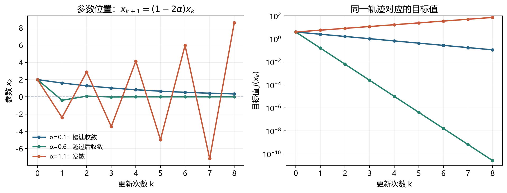
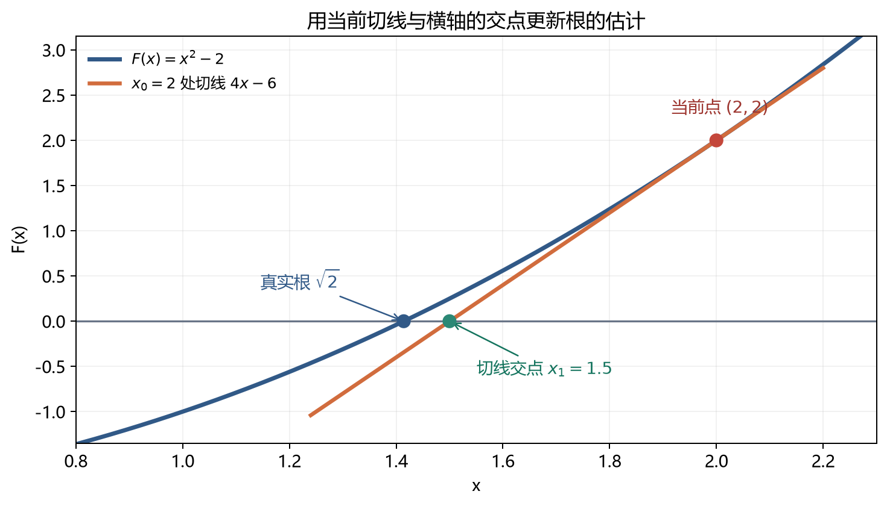
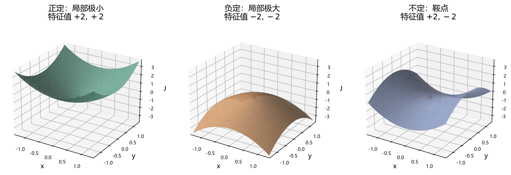

# [AI入门-微积分]2.梯度下降、曲率与数值优化

导数和梯度告诉我们，在当前参数附近，目标函数朝各个方向会怎样变化。有了可以计算的损失函数，下一步是寻找使它较小的参数。原课程先比较直接求驻点和逐步移动，再用最小二乘把两条路径放在同一个问题上，最后引入二阶导数、Hessian 与牛顿法。本文也沿这个顺序展开。

## 1 从损失函数到驻点：解析求解能做什么

设可调参数为 $\boldsymbol\theta\in\mathbb R^n$，目标函数 $J(\boldsymbol\theta)\in\mathbb R$ 把一组参数映射成一个损失值。优化的输入是函数与允许的参数范围，输出是损失较小的参数；如果能够证明它比范围内所有其他参数都好，才称得上**全局最小解**。在无约束、可微且最优点位于定义域内部的情形，局部极小点必须满足

$$
\nabla J(\boldsymbol\theta^*)=\mathbf0.
$$

梯度 $\nabla J=(\partial J/\partial\theta_1,\ldots,\partial J/\partial\theta_n)^{\mathsf T}$ 汇集了各参数的局部变化率。沿长度为 1 的方向向量 $u$ 小幅移动正距离 $t$ 时，目标值的一阶变化约为 $t\nabla J^{\mathsf T}u$；若梯度非零，取 $u=-\nabla J/\|\nabla J\|$，即用梯度的长度 $\|\nabla J\|$ 将负梯度归一化，便得到一阶变化 $-t\|\nabla J\|<0$。因此负梯度是局部下降方向。现在要寻找的驻点满足所有偏导同时为零，此时一阶变化无法再区分上升和下降，还要判定候选点类型。

例如 $J(x,y)=(x-1)^2+2(y+2)^2$，梯度为 $(2(x-1),4(y+2))^{\mathsf T}$。联立两项为零，得到 $(x,y)=(1,-2)$；由于两项平方都非负，这一点的函数值为零，故它确实是全局最小点。对于一般目标，$\nabla J=0$ 只能找到**驻点候选**：局部最大点、鞍点也能满足它。若参数被限制在某个区间或区域，边界上的最小点还可能不满足零梯度条件。

解析法的困难在于，即使每个偏导都容易算，联立的非线性方程组也可能没有方便的封闭形式，或者有许多解需要继续分类。课程中 $J(x)=e^x-\ln x$（$x>0$）的驻点方程为 $e^x-1/x=0$；它可以写成 $xe^x=1$，但求数值解更直接。参数变成成千上万维时，先求出全部驻点再逐个比较也通常不现实。于是我们改为从一个初始点出发，每次只利用当前位置的信息前进一步。

## 2 梯度下降：用局部斜率逐步调整参数

**梯度下降**每轮先在当前位置计算梯度，再朝其反方向更新。对一元函数 $J(x)$，更新式是

$$
x_{k+1}=x_k-\alpha J'(x_k),\qquad \alpha>0.
$$

$x_k$ 是第 $k$ 轮参数，$J'(x_k)$ 是当前斜率；$\alpha$ 称为**学习率**，决定“斜率为 1 时走多远”。斜率为正则向左，斜率为负则向右。这个动作只有**局部下降倾向**：由于导数只描述当前位置附近，步子很大时下一点仍可能比当前点更差。

对 $n$ 维参数，同一规则变为

$$
\boldsymbol\theta_{k+1}
=\boldsymbol\theta_k-\alpha\nabla J(\boldsymbol\theta_k),
\qquad
\boldsymbol\theta_k,\nabla J\in\mathbb R^n.
$$

所有新分量都从**同一组旧参数**计算。以 $\boldsymbol\theta=(x,y)^{\mathsf T}$ 为例，先在 $(x_k,y_k)$ 同时求 $J_x,J_y$，得到 $x_{k+1}=x_k-\alpha J_x(x_k,y_k)$、$y_{k+1}=y_k-\alpha J_y(x_k,y_k)$。如果先覆盖 $x$，再用新 $x$ 求 $y$ 的梯度，算法就变成另一种顺序更新，不能与原式混为一谈。

用课程中的二元函数做两步手算：

$$
J(x,y)=x^2+2y^2,
\qquad
\nabla J(x,y)=\begin{bmatrix}2x\\4y\end{bmatrix}.
$$

从 $(x_0,y_0)=(2,1)$ 开始，取 $\alpha=0.1$，有 $\nabla J(2,1)=(4,4)^{\mathsf T}$，于是

$$
\begin{bmatrix}x_1\\y_1\end{bmatrix}
=\begin{bmatrix}2\\1\end{bmatrix}
-0.1\begin{bmatrix}4\\4\end{bmatrix}
=\begin{bmatrix}1.6\\0.6\end{bmatrix}.
$$

第二轮在新位置重新求梯度 $(3.2,2.4)^{\mathsf T}$，得到 $(x_2,y_2)=(1.28,0.36)$。对应损失依次为 $6$、$3.28$、$1.8976$。注意这里变化的是**参数空间**里的 $(x,y)$；若 $x,y$ 是模型参数，训练样本本身并没有随着箭头移动。

## 3 学习率、曲面形状与停止条件

学习率太小会让每步进展很慢；太大可能反复越过低点，甚至发散。用最简单的 $J(x)=x^2$ 可以把“太大”算成精确条件。由于 $J'(x)=2x$，更新为

$$
x_{k+1}=(1-2\alpha)x_k,
\qquad
x_k=(1-2\alpha)^k x_0.
$$

只要初值 $x_0\ne0$，迭代收敛到零的条件就是 $|1-2\alpha|<1$，即 $0<\alpha<1$。例如从 $x_0=2$ 出发，$\alpha=0.1$ 每轮乘 $0.8$，下降稳定但较慢；$\alpha=0.6$ 每轮乘 $-0.2$，会越过零点却很快贴近；$\alpha=1.1$ 每轮乘 $-1.2$，来回跳动且幅度越来越大。下图把三种参数路径与相应的函数值放在一起：

这个 $0<\alpha<1$ **只适用于这里的 $J(x)=x^2$**。目标曲率变大，能稳定使用的固定步长也会变小。例如 $J(x,y)=x^2+2y^2$ 的两个坐标分别乘 $1-2\alpha$ 和 $1-4\alpha$；若希望两方向都收敛，需 $0<\alpha<0.5$。较陡方向迫使学习率变小，较平方向因此前进缓慢，这也是狭长等高线附近常出现来回摆动的原因。后文的 Hessian 会用矩阵系统描述这种方向差异。

下降到何时结束，也不能只凭“这一步变化不明显”。常用停止信号包括梯度范数 $\|\nabla J(\boldsymbol\theta_k)\|_2$ 低于容差、参数步长 $\|\boldsymbol\theta_{k+1}-\boldsymbol\theta_k\|_2$ 很小、损失改变量很小，或达到迭代/计算预算。学习率极小也会让参数步长很小，尽管仍远离最优点；因此最好把停止原因与当前损失、梯度、约束是否满足结合起来看。对非凸目标，满足停止条件并不构成全局最优证明。

上述轨迹是**全量梯度**的确定性例子。如果每次只用部分训练样本估计梯度，连续两次用到的数据不同，单步损失可以上下波动，不能要求每次更新后都严格下降。小批量如何选择、动量和自适应学习率如何处理这些波动，将在第 17 篇集中讲解。

## 4 最小二乘：同一目标可以直接求解或迭代求解

课程接着用**最小二乘法**把“目标函数是什么”和“怎样求它的最小值”分开。假设观测值为 $y_i$，模型预测为 $\hat y_i$；两者的差 $r_i=\hat y_i-y_i$ 称为**残差**。平方后求和得到一个可比较的标量：

$$
E=\sum_{i=1}^{N}r_i^2.
$$

正负残差经平方不会抵消，大残差的影响也被放大；这既使目标容易求导，也意味着离群点可能左右拟合结果。这里先用它作为优化例子；拟合直线、处理多特征和异常值的完整问题放在第 10 篇。

只拟合一个参数时，机制更容易看清。设两条观测要求模型参数 $w$ 分别接近 1 和 3，预测都直接取 $\hat y=w$，则

$$
E(w)=(w-1)^2+(w-3)^2
=2(w-2)^2+2.
$$

解析地令 $E'(w)=4(w-2)=0$，可得唯一最小点 $w^*=2$、最小损失 $E(2)=2$。同一个目标也能从 $w_0=0$ 开始用梯度下降求：取 $\alpha=0.1$，更新 $w_{k+1}=w_k-0.4(w_k-2)$，先得到 $w_1=0.8$，再得到 $w_2=1.28$，之后逐渐逼近 2。两种路径得到的是同一个目标的解，差别只在求解方式；迭代法还须决定容差和计算预算。

刚才是一个参数、两条观测；样本和参数增多后，仍是“逐条预测、逐条相减、平方后相加”。把 $N$ 条样本排成行矩阵 $X\in\mathbb R^{N\times p}$，每行有 $p$ 个特征；参数为 $\mathbf w\in\mathbb R^p$，观测向量为 $\mathbf y\in\mathbb R^N$，则

$$
E(\mathbf w)=\|X\mathbf w-\mathbf y\|_2^2,
\qquad
\nabla E(\mathbf w)=2X^{\mathsf T}(X\mathbf w-\mathbf y).
$$

$X\mathbf w-\mathbf y\in\mathbb R^N$ 汇集全部残差；$X^{\mathsf T}$ 再把每条残差按各特征的数值汇总，得到与参数相同的 $p$ 维梯度。单条样本的残差或特征数值越大，它对相应参数梯度的贡献通常越大；不同样本的正负贡献还可能抵消。把刚才的单参数例子写成矩阵，就有

$$
X=\begin{bmatrix}1\\1\end{bmatrix},\quad
\mathbf y=\begin{bmatrix}1\\3\end{bmatrix},\quad
Xw-\mathbf y=\begin{bmatrix}w-1\\w-3\end{bmatrix}.
$$

在 $w=0$ 时，残差是 $(-1,-3)^{\mathsf T}$，因此 $\nabla E=2\begin{bmatrix}1&1\end{bmatrix}\begin{bmatrix}-1\\-3\end{bmatrix}=-8$；取学习率 $0.1$，更新为 $w_1=0-0.1(-8)=0.8$，正好得到上面的第一步。这样，矩阵式并没有引入另一套规则，只是把逐条计算合在一起。

令梯度为零会得到**正规方程** $X^{\mathsf T}X\mathbf w=X^{\mathsf T}\mathbf y$；若 $X$ 满列秩，解唯一。但数值实现通常不显式计算 $(X^{\mathsf T}X)^{-1}$：形成 $X^{\mathsf T}X$ 还会放大条件数问题，可优先使用 QR、SVD 或专门的最小二乘求解器。[NumPy 的 `lstsq` 文档](https://numpy.org/doc/stable/reference/generated/numpy.linalg.lstsq.html)（核查于 2026-09-23）给出了直接求解 $Ax\approx b$ 的接口和返回值。大规模数据或更复杂的目标则可能更适合迭代优化；不能把“训练模型”机械等同于“必须使用梯度下降”。

## 5 二阶导数：斜率如何随位置改变

沿山坡往前走时，只看脚下坡度还不够：前方地面可能迅速变陡，也可能逐渐变平。**二阶导数**记录的就是斜率变化得多快。一阶导数给出当前位置的斜率；再求一次导数得到 $J''(x)$。在 $x_k$ 附近，若函数足够光滑，二阶局部模型为

$$
J(x_k+p)\approx J(x_k)+J'(x_k)p+\frac12J''(x_k)p^2,
$$

其中 $p$ 是打算移动的有符号距离：负数表示向左走。一次项 $J'(x_k)p$ 预测当前斜率造成的变化，二次项 $\tfrac12J''(x_k)p^2$ 修正“走的过程中斜率也在变”的影响。以 $J(x)=x^2$、当前位置 $x_k=1$、向左走 $p=-0.1$ 为例，一阶估计为 $1+2(-0.1)=0.8$；加上二阶项 $\tfrac12(2)(0.1)^2=0.01$ 后得到 $0.81$，恰好等于实际的 $J(0.9)=0.81$。二次函数的模型在这里完全准确，其他光滑函数通常只在附近近似准确。若 $J''>0$，斜率随 $x$ 增大而增大，曲线局部向上弯；若 $J''<0$ 则向下弯。注意 $J''>0$ 本身**不表示当前位置是最小点**：这个例子的 $x=1$ 仍可向左下降。

只有先确定 $x^*$ 是驻点，即 $J'(x^*)=0$，二阶导数符号才可直接分类：$J''(x^*)>0$ 表示严格局部极小，$J''(x^*)<0$ 表示严格局部极大；若 $J''(x^*)=0$，此检验没有结论。$x^4$ 在零点是最小点，$x^3$ 在零点却穿过驻点继续增加，两者的二阶导数在零点都为零。学习二阶信息，正是为了解释一阶条件为何不足，以及不同方向的下降步长为何受曲率影响。

## 6 一元牛顿法：先求根，再寻找极值

**牛顿法**最初解决方程 $F(x)=0$。在当前猜测 $x_k$ 处，把 $F$ 用切线 $F(x_k)+F'(x_k)(x-x_k)$ 近似；让切线的高度等于零，交点就是下一次猜测：

$$
x_{k+1}=x_k-\frac{F(x_k)}{F'(x_k)},
\qquad F'(x_k)\ne0.
$$

图中以 $F(x)=x^2-2$ 为例，从 $x_0=2$ 画切线。该点有 $F(2)=2$、$F'(2)=4$，切线与横轴交于 $x_1=2-2/4=1.5$，比原点更接近根 $\sqrt2$：

若目标是最小化 $J(x)$，要找的是“斜率为零的位置”。因此把导函数 $J'(x)$ 当作上面要求根的 $F(x)$，再使用同一求根步骤：

$$
x_{k+1}=x_k-\frac{J'(x_k)}{J''(x_k)}.
$$

这相当于求上一节局部二次模型的驻点。分子 $J'$ 告诉我们当前还有多大的斜率，分母 $J''$ 告诉我们斜率随位置改变得多快；两者相除估计“到斜率为零处还要移动多远”。对 $J(x)=e^x-\ln x$（$x>0$），有 $J'=e^x-1/x$、$J''=e^x+1/x^2>0$，所以函数在该域严格凸，找到的驻点就是唯一全局最小点。从 $x_0=0.5$ 出发，$J'(0.5)=e^{0.5}-2\approx-0.3513$，$J''(0.5)=e^{0.5}+4\approx5.6487$，下一点为 $x_1\approx0.5-(-0.3513)/5.6487\approx0.5622$，已经接近最终解 $0.567143$。负斜率在这里让牛顿步向右；分母若很小，步子则可能异常大。每一步还必须保持 $x_k>0$，否则 $\ln x$ 无定义。

牛顿步并非总是下降步。若 $J''(x_k)<0$，其局部二次模型向下开口，模型驻点是局部最大点；若 $J''$ 接近零，计算出的步长可能异常大。初值离解太远时切线或二次近似也可能失效。实际求解器常对步长做**阻尼**或用**线搜索**选择沿方向走多远，也会在给定邻域内求更可靠的**信赖域**步。它们分别限制步幅或检验模型在多大范围可信，避免盲目接受原始牛顿步。[SciPy 的 `minimize` 文档](https://docs.scipy.org/doc/scipy/reference/generated/scipy.optimize.minimize.html)（核查于 2026-09-23）列出了线搜索、信赖域和拟牛顿等多种局部优化路径；选择应看目标结构与成本，而非只按算法名称的新旧。

## 7 Hessian：多变量目标的曲率矩阵与驻点分类

两个参数一起变化时，曲面不仅会沿第一个、第二个坐标方向弯曲，两种变化还可能互相影响。只给出一个“曲率数值”就不够了。对于 $J:\mathbb R^n\to\mathbb R$，把梯度中每个分量再对每个参数求偏导，得到 **Hessian 矩阵** $H_J=\nabla^2J\in\mathbb R^{n\times n}$：

$$
(H_J)_{ij}
=\frac{\partial^2J}{\partial\theta_i\partial\theta_j}.
$$

对于两个参数 $x,y$，它具体长这样：

$$
H_J=
\begin{bmatrix}
J_{xx}&J_{xy}\\
J_{yx}&J_{yy}
\end{bmatrix}.
$$

$J_{xx}$、$J_{yy}$ 分别看只沿 $x$、只沿 $y$ 移动时斜率怎样变化；$J_{xy}$、$J_{yx}$ 看一个参数的变化怎样改变另一个方向的斜率。当相关混合二阶偏导在邻域内连续，两处混合项相等，矩阵就关于对角线对称。以 $J(x,y)=2x^2+3y^2-xy$ 为例，先求梯度 $(4x-y,6y-x)^{\mathsf T}$，再逐项求导得到 $J_{xx}=4$、$J_{xy}=-1$、$J_{yx}=-1$、$J_{yy}=6$。沿 $x$ 轴的局部曲率是 4，沿 $y$ 轴是 6；交叉项 $-1$ 来自 $-xy$，说明固定 $y>0$ 时，增大 $x$ 会使对 $y$ 的斜率降低。

沿任意单位方向 $\mathbf v$ 移动很小距离 $t$，二阶修正项为 $\tfrac12t^2\mathbf v^{\mathsf T}H_J\mathbf v$。若选的是 Hessian 的单位特征向量，满足 $H_J\mathbf v=\lambda\mathbf v$，则这一方向的曲率就是 $\lambda$；正值表示向上弯，负值表示向下弯。**特征值把斜着走的方向也算进来**，因此只看两个对角元素是否为正，不足以判断整个曲面是否向上弯。

若 $\boldsymbol\theta^*$ 已满足 $\nabla J(\boldsymbol\theta^*)=\mathbf0$，二阶检验按**该点 Hessian 的所有特征值**分类：

| 特征值情况 | 能确定什么 |
|---|---|
| 全部严格为正 | 严格局部极小 |
| 全部严格为负 | 严格局部极大 |
| 同时有正有负 | 鞍点，沿不同方向一升一降 |
| 含零值且没有异号 | 二阶检验通常无法判定，需看更高阶或直接分析函数 |

例如 $J(x,y)=x^2-y^2$ 在原点梯度为零，Hessian 是 $\operatorname{diag}(2,-2)$，可以**确定**是鞍点。原总结曾有把“正负特征值并存”说成“无法判断”的模糊表述，应按上表改正。再看前面的 $J(x,y)=2x^2+3y^2-xy$，它的 Hessian 为

$$
H_J=\begin{bmatrix}4&-1\\-1&6\end{bmatrix},
$$

两个特征值为 $5-\sqrt2$ 和 $5+\sqrt2$，均为正。配图把向上弯、向下弯、鞍形三种曲面并排展示；图只帮助读出方向，严格分类仍由驻点条件和 Hessian 符号给出：

二阶检验给的是**局部**结论。即使某一点是严格局部最小，其他区域仍可能有更低的值；在有边界或不可微的目标上，还要另行处理约束和不可导点。

## 8 多变量牛顿步与数值求解方法的边界

一元牛顿步用“当前斜率 ÷ 曲率”估计到驻点的移动量。多个参数时，不同方向的曲率会互相影响，因此要把斜率排成梯度向量、把曲率排成 Hessian 矩阵。当前位置为 $\boldsymbol\theta_k\in\mathbb R^n$，拟移动量为 $\mathbf p\in\mathbb R^n$，则

$$
J(\boldsymbol\theta_k+\mathbf p)
\approx J(\boldsymbol\theta_k)
+\nabla J(\boldsymbol\theta_k)^{\mathsf T}\mathbf p
+\frac12\mathbf p^{\mathsf T}H_J(\boldsymbol\theta_k)\mathbf p.
$$

对右侧局部二次模型求驻点，得到需要解的线性系统：

$$
H_J(\boldsymbol\theta_k)\mathbf p_k
=-\nabla J(\boldsymbol\theta_k),
\qquad
\boldsymbol\theta_{k+1}=\boldsymbol\theta_k+\mathbf p_k.
$$

$H_J$ 是 $n\times n$，梯度与 $\mathbf p_k$ 都是 $n$ 维。原字幕中的“$m\times n$ Hessian”不适用于这里的**标量目标**：参数有 $n$ 个，它的 Hessian 就是 $n\times n$。若 Hessian 可逆，形式上可写 $\mathbf p_k=-H_J^{-1}\nabla J$；实际数值计算应解线性系统，避免显式形成逆矩阵。$H_J$ 不正定时，这个驻点还可能是局部二次模型的最大点或鞍点，原始牛顿方向未必降低目标。

对上一节的二次函数 $J(x,y)=2x^2+3y^2-xy$，从 $(4,4)$ 出发，梯度为 $(12,20)^{\mathsf T}$，解

$$
\begin{bmatrix}4&-1\\-1&6\end{bmatrix}
\mathbf p=-\begin{bmatrix}12\\20\end{bmatrix}
$$

也就是同时解 $4p_x-p_y=-12$ 和 $-p_x+6p_y=-20$，得到 $\mathbf p=(-4,-4)^{\mathsf T}$。这两个分量分别告诉我们本轮要让 $x$、$y$ 各减少 4，于是从 $(4,4)$ 一步到达最小点 $(0,0)$。不能分别拿梯度的两个分量除以 Hessian 对角线的 4 和 6：非零的交叉项 $-1$ 表示两种参数变化相互影响，必须一起解方程。这里能一步到达，是因为原目标本身就是二次函数，局部二次模型在整个空间都精确；普通非线性目标没有这个保证。

要比较求解方法，需同时看**每步成本与需要的步数**。梯度下降只用一阶梯度，单步相对容易，适合参数多、损失可微的迭代训练；完整牛顿法要获取、保存或处理 $n\times n$ 的 Hessian，并解相应方程，大型模型常承担不起。介于两者之间，**拟牛顿方法**利用历次梯度和位移近似曲率，**Hessian–向量积**则允许某些方法利用二阶信息而不显式存完整矩阵。它们仍有目标光滑性、内存和单步成本的条件，并非统一替代梯度下降。[SciPy 当前优化接口](https://docs.scipy.org/doc/scipy/reference/generated/scipy.optimize.minimize.html)同时提供梯度、Hessian、Hessian–向量积和拟牛顿方法；深度网络中按小批量更新的优化器会在第 17 篇另讲。

最后，**有限差分**可以用函数值近似导数，例如中心差分

$$
J'(x)\approx\frac{J(x+\varepsilon)-J(x-\varepsilon)}{2\varepsilon}.
$$

$\varepsilon>0$ 是小扰动。比如要核对 $J(x)=x^2$ 在 $x=2$ 处的导数，取 $\varepsilon=0.1$，函数在左右两点的值分别是 $J(2.1)=4.41$ 和 $J(1.9)=3.61$；差商 $(4.41-3.61)/0.2=4$，与解析导数 $J'(2)=4$ 一致。它通过额外计算两次函数值来估斜率，不需要知道函数内部怎样求导；对每个参数都扰动则会增加大量函数计算。$\varepsilon$ 太大有截断误差，太小又受浮点舍入影响，因此有限差分更适合检查梯度或给特定求解器提供近似。链式法则驱动的自动微分按记录的运算传播导数，计算途径与有限差分不同。[SciPy `minimize` 文档](https://docs.scipy.org/doc/scipy/reference/generated/scipy.optimize.minimize.html)列出了可提供梯度函数或选择有限差分估计的接口选项；无论调用哪种求解器，都应检查它报告的终止原因、最终目标值和约束满足情况。程序停止只说明触发了某项终止条件，尚不能证明已找到全局最优。
