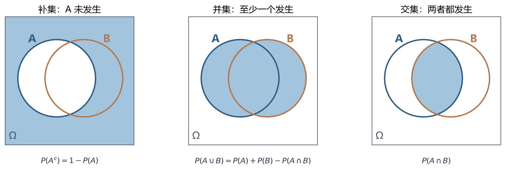
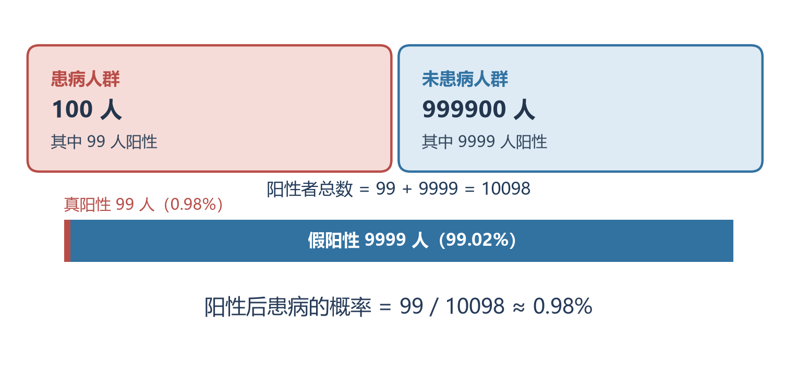
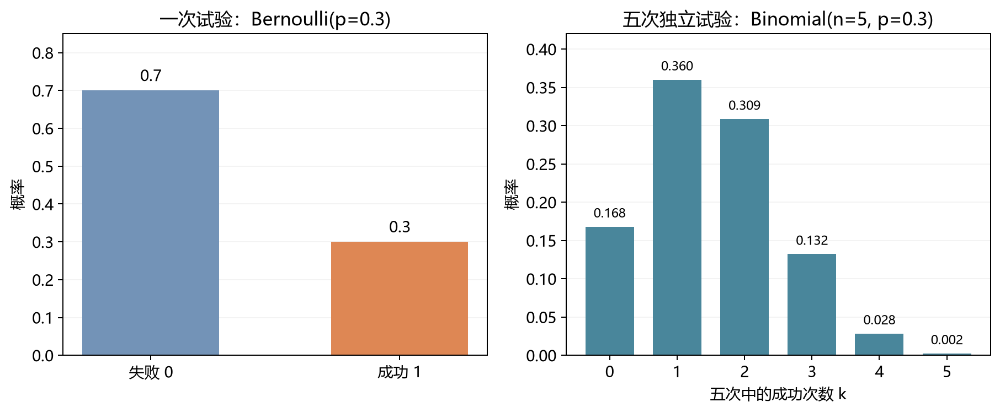
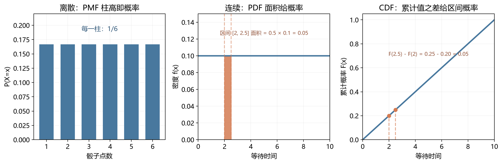
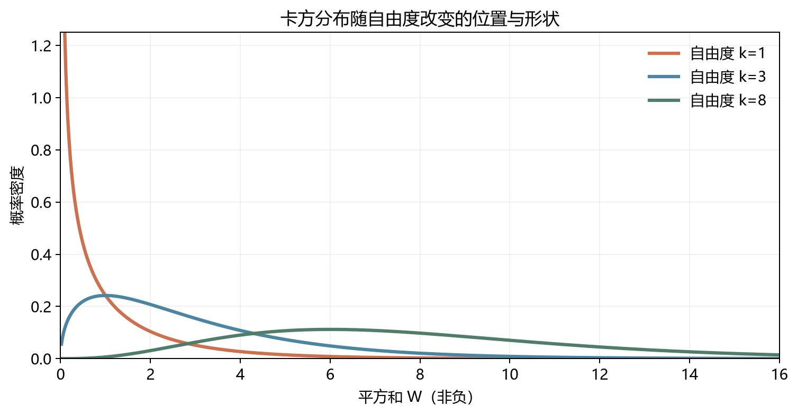

# [AI入门-概率统计]1.概率、条件概率与常用分布

概率用于描述一个结果出现前的不确定性。学习时可以沿两条相连的线索走：先把结果整理成事件，计算“发生”“同时发生”和“得知新信息后发生”的概率；再把结果映射成数字，用分布描述这些数字的整体规律。模型输出的类别概率、采样数据以及后续的统计推断，都在使用这两套语言。

## 1 随机试验、事件与概率的适用条件

一次**随机试验**有确定的操作和可能结果，但开始前无法确定本次得到哪一个。例如掷一枚六面骰子，可能结果构成**样本空间** $\Omega=\{1,2,3,4,5,6\}$；“出现偶数”是其中一个**事件** $A=\{2,4,6\}$。结果是一次试验实际落到的单个点，事件则是一组我们关心的结果。事件概率 $P(A)$ 处在 $0$ 与 $1$ 之间，整个样本空间的概率为 $1$。

如果样本空间有限，且每个基本结果确实**等可能**，可以数有利结果的比例：

$$
P(A)=\frac{|A|}{|\Omega|}.
$$

公平骰子出现偶数的概率是 $3/6=1/2$。如果骰子各面出现概率不同，这个计数公式就不能直接使用；应把事件包含的各结果概率相加。有限等可能模型只是计算概率的一种情形，后面的条件概率与分布不依赖“数个数”的前提。

理论概率还可与重复试验中的**相对频率**连接：独立地重复同一种稳定试验，事件发生次数占总次数的比例会随次数增加而趋近其概率。掷十次公平硬币仍可能只出现三次正面，所以有限次频率不能当作精确概率。这也提醒我们：模拟结果可以检验直觉，不能代替检查模型假设。

在连续模型里，单个具体值可以有 $P(X=x)=0$，但仍可能被观测到。因此概率零不总等于逻辑上绝无可能；这一点在第 8 节解释概率密度时会变得清楚。

## 2 事件的补集、并集、交集与独立性

把事件看成集合，便能把自然语言翻译成稳定的运算。$A^c$ 表示 $A$ 没发生；$A\cup B$ 表示 $A$ 或 $B$ 至少一个发生，包含两者同时发生；$A\cap B$ 表示两者都发生。它们的基本关系为

$$
P(A^c)=1-P(A),
\qquad
P(A\cup B)=P(A)+P(B)-P(A\cap B).
$$

求“至少一次”常先算“全部不发生”。独立抛三次公平硬币，全部反面的概率为 $(1/2)^3$，所以至少一次正面是 $1-(1/2)^3=7/8$。求“足球或篮球”则必须扣掉被加两次的共同成员：若 $P(A)=0.6$、$P(B)=0.5$、$P(A\cap B)=0.3$，那么 $P(A\cup B)=0.8$。下图把补、并、交放在同一个样本空间里，强调并集的重叠部分只算一次：

**互斥**表示两事件不能同时发生，即 $A\cap B=\varnothing$；同一次掷骰子的“结果为 2”和“结果为 3”就是例子。**独立**表示得知一个事件发生不会改变另一个的概率，等价于 $P(A\cap B)=P(A)P(B)$。独立抛两次公平硬币，两次都正面的概率为 $1/4$。若两个事件各有正概率且互斥，知道 $A$ 发生后 $B$ 必不发生，它们便不独立。“能否同时出现”和“新信息是否改变概率”回答的是两个不同问题。

生日问题也用到补集和独立的假设。若把一年视为 365 天，假定各人的生日彼此独立且每天等可能，则 $n$ 个人的生日**全不同**的概率是

$$
P(\text{全不同})
=\prod_{j=0}^{n-1}\frac{365-j}{365},
\qquad 0\le n\le365.
$$

第一个人可落在任意日，第二个人要避开前一日，依次类推。因此 $P(\text{至少两人同生日})=1-P(\text{全不同})$，$n=23$ 时约为 $50.7\%$。这里比较的是所有 $\binom{23}{2}=253$ 对人；真实生日频率并非严格均匀，这个数值来自简化模型。

## 3 条件概率：把范围缩到已知事件里

得知事件 $B$ 已发生后，原样本空间里不属于 $B$ 的结果都被排除。分母为什么要换？假设 100 人中有 40 人参加训练（事件 $B$），其中 30 人通过测试（事件 $A$）。若问“随机抽一人，既训练又通过”的概率，分母是全体 100 人，结果是 $30/100$；若**已经知道这人参加训练**，候选人只剩 40 人，通过的概率就变成 $30/40$。一般写为

$$
P(A\mid B)=\frac{P(A\cap B)}{P(B)},
\qquad P(B)>0.
$$

竖线读作“在已知 $B$ 的条件下”。上例中 $P(A\cap B)=0.30$、$P(B)=0.40$，相除仍得到 $0.75$。再看独立抛两次硬币：原本“两次都正面”的概率是 $1/4$；已知第一次为正面后，剩余可能为 $HH$ 与 $HT$，因此 $P(HH\mid\text{第一次正面})=1/2$。这并不与两次投掷独立矛盾：第一次投掷的信息缩小了“完整序列”的候选范围，而第二次单独为正面的概率仍为 $1/2$。

把定义式移项，得到对任意事件适用的**乘法公式**：

$$
P(A\cap B)=P(A)P(B\mid A).
$$

“足球并且穿跑鞋”的概率需要先知道足球占比，再知道足球人群中穿跑鞋的比例。若二者为 $0.4$ 与 $0.8$，联合概率是 $0.4\times0.8=0.32$。只有在 $A,B$ 独立时，$P(B\mid A)=P(B)$，乘法才简化为 $P(A)P(B)$。对连续多个条件也可沿路径逐项相乘，后面序列模型的概率链式法则正使用这一规则；本篇先掌握两事件的分母含义。

条件的顺序不可交换。$P(A\mid B)$ 的分母是 $P(B)$，$P(B\mid A)$ 的分母是 $P(A)$。这一点在“检测阳性时患病概率”和“患病时检测阳性概率”之间尤为关键。

## 4 全概率与贝叶斯：先汇总证据，再更新判断

有时同一证据 $B$ 可由几种互斥原因产生。若 $A_1,\ldots,A_K$ 两两互斥并覆盖全部可能结果，就可以把证据概率拆成各条路径之和，称为**全概率公式**：

$$
P(B)=\sum_{i=1}^{K}P(A_i)P(B\mid A_i).
$$

每条路径先用乘法算“原因 $A_i$ 且证据 $B$”，再把互斥路径相加。只有患病 $D$ 与未患病 $D^c$ 两种原因时，$P(+)=P(D)P(+\mid D)+P(D^c)P(+\mid D^c)$，这里 $+$ 表示检测阳性。

**贝叶斯公式**接着把“原因给定时看到证据的概率”转换成“看到证据后原因成立的概率”：

$$
P(A_i\mid B)
=\frac{P(A_i)P(B\mid A_i)}
{\sum_{j=1}^{K}P(A_j)P(B\mid A_j)},
\qquad P(B)>0.
$$

$P(A_i)$ 是看到本次证据前的**先验**，$P(B\mid A_i)$ 是原因成立时证据出现的**似然**，分母是证据在所有路径上的总概率；结果 $P(A_i\mid B)$ 称为**后验**。每一步都依赖既定的概率模型，新增证据可能有帮助，若先验或似然设错，计算结果同样会偏离现实。

用原课程的罕见病数字看分母为何重要。设 $P(D)=1/10000$、患病者阳性率 $P(+\mid D)=0.99$、未患病者假阳性率 $P(+\mid D^c)=0.01$。想象 100 万人按这些比例构成：预期有 100 人患病，其中 99 人阳性；另外 999900 人未患病，其中 9999 人阳性。在所有阳性者中，患病者只占

$$
P(D\mid+)=\frac{99}{99+9999}
\approx0.009804=0.9804\%.
$$

图中上方的“患病人群阳性率 99%”与右侧的“阳性后患病概率约 0.98%”使用了不同分母：

这组数字只是说明**低基率如何改变解释**的数学例子；真实检测还要根据人群、检测流程和误差定义重新估计各概率。

## 5 朴素贝叶斯：用条件独立拆开高维似然

贝叶斯分类要比较每个候选类别的后验。以垃圾邮件 $S$ 和正常邮件 $H$ 为例，若一封邮件包含词语 $L$，需要比较 $P(S\mid L)$ 与 $P(H\mid L)$。假设训练集中 100 封邮件有 20 封垃圾邮件，其中 14 封包含 “lottery”；80 封正常邮件有 10 封包含这个词，则

$$
P(S)=0.2,\quad P(L\mid S)=14/20=0.7,
\qquad
P(H)=0.8,\quad P(L\mid H)=10/80=0.125.
$$

先验乘似然分别为 $0.2\times0.7=0.14$ 与 $0.8\times0.125=0.10$。归一化后，$P(S\mid L)=0.14/(0.14+0.10)=14/24\approx58.3\%$。直接从人数看也一样：包含该词的邮件共 24 封，其中 14 封是垃圾邮件。$P(L\mid S)$ 的分母是**垃圾邮件总数 20**，$P(S\mid L)$ 的分母则是**含该词的邮件总数 24**。

多个词一起出现时，直接估计联合似然 $P(x_1,\ldots,x_d\mid C=c)$ 需要大量特征组合；$d$ 个二元特征就有 $2^d$ 种组合。**朴素贝叶斯**作出可计算的近似：给定类别 $C=c$ 后，各特征条件独立，于是

$$
P(x_1,\ldots,x_d\mid C=c)
\approx\prod_{j=1}^{d}P(x_j\mid C=c),
$$

$$
P(C=c\mid\mathbf x)
\approx\frac{P(C=c)\prod_jP(x_j\mid C=c)}
{\sum_{c'}P(C=c')\prod_jP(x_j\mid C=c')}.
$$

这里 $\mathbf x=(x_1,\ldots,x_d)$ 是一封邮件的特征，$c'$ 遍历全部候选类别。条件独立只是在**类别已知后**把联合概率拆开；现实中词语常有关联，因此这通常是一项近似。它减少了需要估计的概率数量，也可能把高度相关的证据重复计入。

原课程第二个词 “winning” 的条件概率为 $P(W\mid S)=0.75$、$P(W\mid H)=0.1$。在上述近似下，同含 “lottery” 与 “winning” 的邮件，两个类别的未归一化分数为

$$
s_S=0.2\times0.7\times0.75=0.105,
\qquad
s_H=0.8\times0.125\times0.1=0.010.
$$

因此 $P(S\mid L,W)\approx0.105/(0.105+0.010)=0.913$。$0.105$ 本身尚非后验概率；只需选类别时，分母对所有类别相同，比较分数就够了。训练阶段主要估计类别比例和各类别内的特征分布，预测阶段逐类计算分数并在需要概率时归一化。

实际计数会遇到两种数值问题。其一，某特征在训练集某类别里从未出现，直接估计为零就会把整类分数乘成零；但“目前没见到”不等于“未来绝不出现”。对有 $V$ 种取值的单个**类别特征**，可用加性平滑

$$
\widehat P(X_j=v\mid C=c)
=\frac{N_{jvc}+\alpha}{N_c+\alpha V},
\qquad \alpha>0,
$$

其中 $N_{jvc}$ 是类别 $c$ 中第 $j$ 个特征取值为 $v$ 的样本数，$N_c$ 是该类样本数，$\alpha>0$ 是给各取值补的计数。比如某类有 10 封邮件，二元特征“含 lottery”从未出现；直接估计是 $0/10=0$。取 $V=2,\alpha=1$ 后，该特征为真的估计变成 $(0+1)/(10+2)=1/12$，为假的估计变成 $(10+1)/(10+2)=11/12$；两种取值仍加起来为 1。$\alpha=1$ 常称拉普拉斯平滑。词频计数版的总计数和分母定义不同，不能把上式直接照搬。其二，许多小概率连乘易在浮点计算中**下溢**，可比较对数分数 $\log P(C=c)+\sum_j\log P(x_j\mid C=c)$，乘法就变成加法，排序不变。

当前 [scikit-learn 的朴素贝叶斯文档](https://scikit-learn.org/stable/modules/naive_bayes.html)（核查于 2026-09-23）仍列出二元特征用的 BernoulliNB、计数特征用的 MultinomialNB、连续特征采用类内正态假设的 GaussianNB 等变体。它们仍可作为特征匹配时的快速分类基线；输出后验的数值校准需要另外验证，不能仅凭归一化公式认定“91.3%”在真实数据上就有同等频率解释。连续特征的 $P(x_j\mid C=c)$ 在这类公式里应读作**类条件密度**，其数值无需小于 1。

## 6 随机变量、分布与离散概率质量

事件可以是“这封邮件属于垃圾类”，也可以是“连续三次抛硬币恰好两次正面”。后一问题用数字更方便：令 $X(\omega)$ 记录试验结果 $\omega\in\Omega$ 中的正面次数。$X$ 称为**随机变量**，它是一条固定的映射 $X:\Omega\to\mathbb R$；随机性来自输入的试验结果，例如 $X(HHT)=2$、$X(TTT)=0$。

**概率分布**说明 $X$ 可能取哪些值，以及概率如何分配。离散变量的取值能逐个列出，可以是有限个，也可以是 $0,1,2,\ldots$ 这样可数无限个。它的**概率质量函数**（probability mass function，PMF）为

$$
p_X(x)=P(X=x),\qquad p_X(x)\ge0,
\qquad\sum_x p_X(x)=1.
$$

三次独立抛公平硬币的正面数只有 $0,1,2,3$ 四种取值，PMF 依次是 $1/8,3/8,3/8,1/8$。例如 $X=2$ 对应 $HHT,HTH,THH$ 三个具体序列，故概率为 $3/8$；这里的 $3$ 是排列方式数量，并非任何一个序列更可能。后续的期望与方差要在这个完整分布上计算，不能只看一次观测值。

概率模型在机器学习中的位置也由此清晰起来：分类模型可能尝试估计给定输入特征后的 $P(Y\mid X)$，生成模型可能描述输入本身的 $P(X)$；并非每个模型的输出分数都已经是校准良好的概率。这个区别会在相应模型篇与评估篇继续使用。

## 7 伯努利与二项分布：一次结果和多次计数

**伯努利分布**描述一次只有两种结果的试验。把所关心的结果编码为 $1$，另一结果编码为 $0$，若结果 $1$ 的概率为 $p\in[0,1]$，则

$$
X\sim\operatorname{Bernoulli}(p),
\qquad
P(X=x)=p^x(1-p)^{1-x},\quad x\in\{0,1\}.
$$

“成功”只是被计数的名称，患病、出现缺陷也都可以编码为 $1$。二分类中的真实标签常有这种形式；模型若对每条样本给出一个条件概率 $p_i=P(Y_i=1\mid\mathbf x_i)$，就是对标签采用了条件伯努利描述。逻辑回归如何学习这些 $p_i$ 放在第 11 篇。

把**固定 $n$ 次**相互独立、且每次成功概率都为同一个 $p$ 的伯努利试验相加，成功总数 $K$ 服从**二项分布**：

$$
K\sim\operatorname{Binomial}(n,p),
\qquad
P(K=k)=\binom nk p^k(1-p)^{n-k},
\quad k=0,1,\ldots,n.
$$

对某个指定顺序，$k$ 次成功与 $n-k$ 次失败的概率是 $p^k(1-p)^{n-k}$；成功可以占据 $\binom nk=n!/[k!(n-k)!]$ 组不同位置，所以还需乘组合数。这里 $n!=n(n-1)\cdots1$，且约定 $0!=1$。例如独立掷骰子 5 次，若每次出现“1”的概率始终为 $1/6$，恰好 3 次出现“1”：指定顺序“1、1、1、非1、非1”的概率是 $(1/6)^3(5/6)^2$；三个“1”还可放在 $\binom53=10$ 组位置，因此总概率为 $10(1/6)^3(5/6)^2\approx0.0322$。这个 3.22% 是“恰好三次”的概率，不是“至少三次”。

固定次数、二元结果、相同成功概率和试验独立是这条公式的四个条件。若每次成功概率不同，或抽样方式使前一次结果改变后一次概率，仍可研究成功次数，但上述二项 PMF 不再直接适用。伯努利可视为 $n=1$ 的二项分布。图中柱子的高度就是每个整数 $k$ 的**概率**，所有柱高相加为 1：

## 8 连续变量、密度与累积分布函数

等待时间和测量值常被建模为**连续随机变量**：关心的是它落在某个区间的概率。若它有**概率密度函数**（probability density function，PDF）$f_X(x)$，则密度非负、整条曲线下总面积为 1，区间概率由面积给出：

$$
f_X(x)\ge0,\qquad
\int_{-\infty}^{\infty}f_X(x)\,dx=1,
\qquad
P(a\le X\le b)=\int_a^b f_X(x)\,dx.
$$

单个点没有区间宽度，所以对这种连续分布 $P(X=x)=0$；它仍可能产出某个具体数值。测量仪器显示“恰好 3.0 秒”，实际上是按有限精度把一小段时间都显示成 3.0；可问的是落在这段范围内的概率。PDF 在一点的**高度是密度，不是该点概率**，数值甚至可以大于 1：若 $X$ 在长度为 $0.5$ 的区间内均匀分布，密度高度为 2，总面积仍是 $2\times0.5=1$；其中宽度为 $0.1$ 的小段概率是 $2\times0.1=0.2$。离散 PMF 柱高则直接就是概率。

离散和连续变量都可使用**累积分布函数**（cumulative distribution function，CDF）

$$
F_X(x)=P(X\le x).
$$

它回答“从左侧一直累计到 $x$，得到多少概率”。CDF 非递减，取值在 $[0,1]$，当 $x$ 向负无穷或正无穷移动时分别趋向 0 或 1。对任意分布，$P(a<X\le b)=F_X(b)-F_X(a)$；对有密度的连续分布，$F_X(x)=\int_{-\infty}^{x}f_X(t)\,dt$，在可微处 $F_X'(x)=f_X(x)$。离散 CDF 在每个有概率质量的点向上跳，跳跃高度为 $P(X=x)$。

下图用“掷骰子的点数”和“均匀等待时间”分别展示 PMF 柱高、PDF 区间面积与 CDF 累计值。图中的密度区域宽度为 0.5、高度为 1/10，因此概率为 0.05；同一数值也等于两端 CDF 的差：

## 9 均匀分布与正态分布：范围、中心和尺度

**连续均匀分布** $X\sim U(a,b)$（$a<b$）把区间内等长度的小段分配相同概率，密度为

$$
f_X(x)=\begin{cases}
1/(b-a),&a\le x\le b,\\
0,&\text{其他}.
\end{cases}
$$

因此区间内累计概率为 $F_X(x)=(x-a)/(b-a)$，在左侧为 0、右侧为 1。若一辆公交车严格每 10 分钟到一次，而乘客到站时刻相对于班次均匀随机，则等待时间可近似为 $U(0,10)$；若乘客集中在某些时刻，或公交间隔不固定，这个均匀假设就不再成立。

**正态分布** $X\sim N(\mu,\sigma^2)$ 的密度为

$$
f_X(x)=\frac{1}{\sigma\sqrt{2\pi}}
\exp\!\left(-\frac{(x-\mu)^2}{2\sigma^2}\right),
\qquad \sigma>0.
$$

$\mu$ 决定曲线中心；$\sigma$ 是标准差，决定宽窄；记号第二个参数 $\sigma^2$ 是**方差**。例如两组测量都以 100 为中心，一组标准差为 5，另一组为 20：后者的数值更分散，曲线更宽、更矮；把 $\mu$ 从 100 改到 110 则只把整条曲线向右平移，不改变宽度。正态分布在中心附近密度较高，向两侧逐渐降低，但这不表示真实测量数据天然都服从正态。判断是否适用，需要看数据生成机制及实际分布形状。

若 $X\sim N(\mu,\sigma^2)$，把它**标准化**为 $Z=(X-\mu)/\sigma$，可得到 $Z\sim N(0,1)$。$Z=2$ 表示比均值高两个标准差。标准化只移动和缩放坐标；对非正态原分布做同样操作，并不会把它变成正态。正态的 CDF 有明确的积分定义，但通常通过数值函数计算，不靠初等函数的闭合原函数。

当 $n$ 足够大，且 $p$ 不很接近 0 或 1，二项成功次数常能用均值为 $np$、方差为 $np(1-p)$ 的正态分布近似。常见经验检查是 $np$ 与 $n(1-p)$ 都足够大；二项是离散的，若要近似某个整数区间的概率，还可能做连续性修正。这个近似是有条件的工具，不会改变二项分布本身的四项假设。

## 10 卡方分布：独立标准正态量的平方和

若 $Z_1,\ldots,Z_k$ **彼此独立**且都服从标准正态 $N(0,1)$，把它们分别平方再相加，所得随机量

$$
W=\sum_{i=1}^{k}Z_i^2\sim\chi^2(k)
$$

服从**卡方分布**；$k$ 是这里的**自由度**，即独立标准正态量的个数。每项平方非负，所以 $W\ge0$；正负偏离都变成偏离强度。例如标准化噪声值 $-2$ 贡献 $4$，值 $1$ 贡献 $1$，两项总强度为 $5$。若通信的 $k$ 次标准化噪声可近似为独立标准正态量，总平方噪声就可用 $\chi^2(k)$ 描述。原字幕中出现的“齐次方分布”应更正为“卡方分布”。

自由度为 1 时分布明显右偏；自由度增大，独立非负项更多，总量通常向右移动。其均值为 $k$、方差为 $2k$；这两个量会在下一篇讨论期望与方差的计算。下图展示三个自由度的密度曲线，所有曲线的横轴都从 0 开始：

它在统计推断中的作用也来自“平方和”。从**正态总体**独立抽取 $n$ 个样本，若 $S^2$ 是用 $n-1$ 作分母的样本方差，真实总体方差为 $\sigma^2$，则

$$
\frac{(n-1)S^2}{\sigma^2}\sim\chi^2(n-1).
$$

减去的一个自由度用于估计样本均值：知道 $n$ 个观测的平均数后，前 $n-1$ 个观测与平均数已经决定最后一个观测，离差不能再各自自由变化。这个精确关系依赖正态总体假设，后续构造方差区间时会用到。另一类用途是 Pearson 频数统计量 $\sum_i(O_i-E_i)^2/E_i$，其中 $O_i$ 与 $E_i$ 分别是观察和期望频数；每一格先算“实际比基准多或少多少”，平方后按该格的预期量缩放，再汇总全部格。在合适的抽样及大样本条件下，其零假设分布可用相应自由度的卡方分布近似，从而做拟合优度或列联表独立性检验。具体条件与决策规则留给第 8 篇。**卡方分布**是参照曲线，**卡方统计量**是从本次数据算出的数，**卡方检验**则把该数与参照分布比较，三者不宜混称。

## 11 从已知分布采样：把概率规则变成随机结果

分布给出“哪些结果有多可能”；**从分布采样**则按这些权重产生具体结果。这里指从已经给定的数学模型生成随机值；从真实人群抽取调查对象是另一种抽样语境，将在下一篇进入参数估计时讨论。

对离散类别，可以先在 $[0,1)$ 均匀产生一个数 $U$，再按累计概率分段。若绿色、蓝色、橙色概率分别是 $0.3,0.5,0.2$，就把 $[0,0.3)$ 映为绿、$[0.3,0.8)$ 映为蓝、$[0.8,1)$ 映为橙。取到 $U=0.72$ 就得到蓝色；各段长度正好等于目标概率。连续情形在 CDF $F$ 严格递增且可逆时可用**逆变换采样**：

$$
U\sim U(0,1),\qquad X=F^{-1}(U).
$$

因为 $F^{-1}$ 保持顺序，$P(X\le x)=P(U\le F(x))=F(x)$，所以新变量的 CDF 就是目标 $F$。当 CDF 不严格递增时仍可用广义逆定义相应构造；具体随机数库也可能采用别的更高效算法，并非每次都数值求逆。

采样得到 $x_1,\ldots,x_N$ 后，可以用 $N^{-1}\sum_i g(x_i)$ 近似 $\mathbb E[g(X)]$，即用许多随机运行的平均来估计难以直接积分的量，称为**蒙特卡洛估计**。若 $g(x)=\mathbf1\{x>1.96\}$，样本平均就是“有多少样本超过 1.96”的比例。除了估计概率，也可重复输入随机等待时间、噪声或故障时间，观察系统输出的风险范围；已知真分布时，还能生成数据检查估计程序是否正确。

当前 [NumPy `Generator.choice`](https://numpy.org/doc/stable/reference/random/generated/numpy.random.Generator.choice.html) 和 [`Generator.normal`](https://numpy.org/doc/stable/reference/random/generated/numpy.random.Generator.normal.html) 文档（核查于 2026-09-23）分别提供按离散权重选择和生成正态样本的接口。设置随机种子有助于复现实验中的伪随机序列，但固定一个种子不会保证估计正确；应检查结果是否只依赖一次幸运抽样。若分布是从有限真实数据拟合的，按它再生成许多**合成数据**也只会重复模型已学到的规律。模拟次数增加可减小蒙特卡洛误差，却不能自动修复原始数据的偏差或错误的分布假设。
