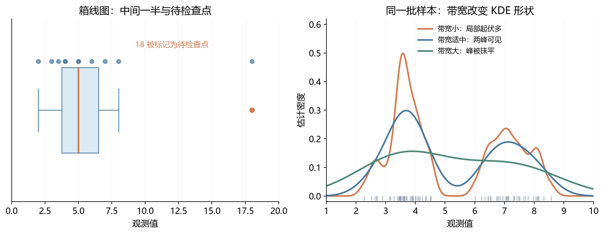
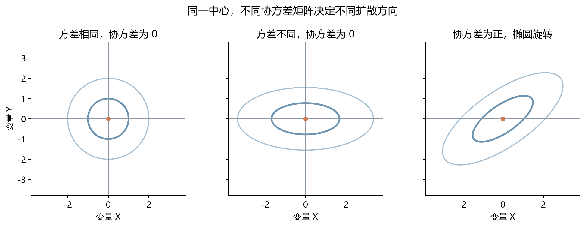
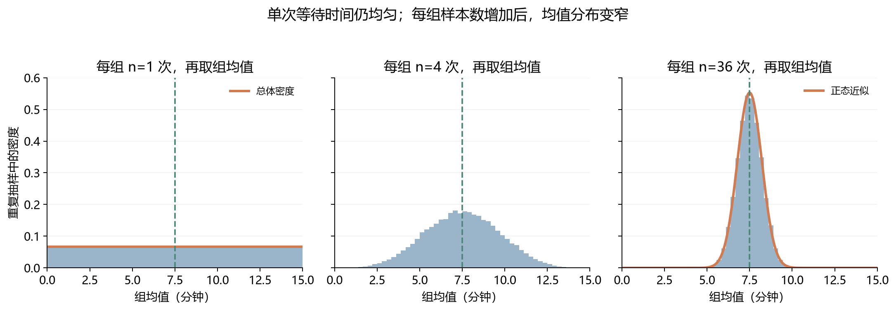
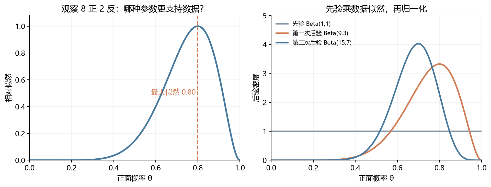

# [AI入门-概率统计]2.期望、方差、抽样与参数估计

事件概率、概率质量函数和密度描述“哪些结果可能出现”。接下来从分布中提取中心、波动和变量间的关系，再讨论只观察到一部分数据时，如何估计未知的总体参数。前半篇处理**分布本身**，后半篇处理**样本带来的不确定性**；这两个层次要分清。

## 1 期望：对所有可能结果按概率加权

公平骰子的六个点数各有 $1/6$ 的概率，其长期平均点数为 $(1+2+3+4+5+6)/6=3.5$。若骰子不公平，直接做六个点数的算术平均就会忽略出现频率。**期望**把每个可能结果乘上它的概率，再相加：

$$
\mathbb E[X]=\sum_x x\,p_X(x)
\quad\text{（离散）},\qquad
\mathbb E[X]=\int_{-\infty}^{\infty}x f_X(x)\,dx
\quad\text{（有密度的连续分布）}.
$$

$X$ 是随机变量，$x$ 遍历它的可能取值；$p_X(x)=P(X=x)$ 是单点概率，$f_X(x)$ 是概率密度。积分中的小段 $f_X(x)\,dx$ 对应近似概率，所有小段对结果 $x$ 的贡献合起来就是期望。两种写法都要求加权和或积分存在。

期望可以理解为分布的平衡位置，但它未必是可能观察到的数。独立抛三枚公平硬币，正面数只能为 $0,1,2,3$，期望却是 $1.5$。若游戏有 $90\%$ 概率得到 0 元、$10\%$ 概率得到 100 元，每局期望收益为 10 元，绝大多数局仍得 0 元。

如果关心奖金或损失 $g(X)$，只需把每个结果先变换再按原概率加权：

$$
\mathbb E[g(X)]=\sum_x g(x)p_X(x)
\quad\text{或}\quad
\mathbb E[g(X)]=\int g(x)f_X(x)\,dx.
$$

例如骰子点数平方作为奖金时，$\mathbb E[X^2]=(1^2+\cdots+6^2)/6=91/6$；先求点数期望再平方则是 $(3.5)^2=12.25$。两者不同，这个差值稍后与方差有关。

期望的**线性性质**让多项结果的平均容易计算：

$$
\mathbb E[aX+b]=a\mathbb E[X]+b,
\qquad
\mathbb E\!\left[\sum_{i=1}^nX_i\right]=\sum_{i=1}^n\mathbb E[X_i].
$$

$a,b$ 是常数；第二式**不要求**各 $X_i$ 独立。以随机把 $n$ 个名字分给 $n$ 个人为例，令 $I_i$ 在第 $i$ 人拿到自己名字时为 1，否则为 0。总匹配数 $M=\sum_i I_i$，每人匹配概率都是 $1/n$，故 $\mathbb E[M]=n(1/n)=1$。各人的匹配事件相互牵连，但期望仍能逐项相加。指示变量还会在后文把“样本比例”写成均值。

## 2 均值、中位数与众数：三个不同的中心

期望是**给定分布的总体均值**；如果只拿到 $n$ 个观测 $x_1,\ldots,x_n$，它们的**样本均值**是 $\bar x=n^{-1}\sum_i x_i$，用于描述这批数据，也常用于估计未知的总体均值。均值保留每个数的大小，但容易受极端值影响。例如收入为 $4,5,5,6,30$ 万元时，均值是 10 万元，明显高于多数人的收入。

把数据排序后取中间位置，得到**中位数**；偶数个观测时通常取中间两个数的平均。上例中位数为 5 万元。最右侧的 30 万元若变成 300 万元，中位数仍是 5 万元，因此描述收入、房价等右偏数据时，它往往比均值更接近“典型个体”。中位数不记录极端值究竟有多远，若目标是总收入或总成本，均值仍不可替代。

**众数**是出现次数最多的值；连续模型中也常把密度最高处称为众数。上例众数为 5 万元。它可用于“最常见的颜色”这类无数值大小的类别变量；数据可能有多个峰，也可能没有唯一众数。均值衡量数值平衡位置，中位数按排序平分数据，众数定位频率峰值。对对称单峰的正态分布，三者重合；遇到偏斜或多峰分布，它们会分开。

## 3 方差与标准差：描述结果围绕中心的波动

两个游戏都可能有 0 元期望：游戏 A 各有一半概率赢或输 1 元，游戏 B 各有一半概率赢或输 100 元。均值不能表达两者风险差异。若 $\mu=\mathbb E[X]$，直接平均偏差会得到 $\mathbb E[X-\mu]=0$，正负偏差互相抵消。**方差**先平方偏差，再取期望：

$$
\operatorname{Var}(X)
=\mathbb E[(X-\mu)^2]
=\mathbb E[X^2]-\mu^2.
$$

第二式由展开 $(X-\mu)^2=X^2-2\mu X+\mu^2$ 得到。游戏 A 的方差是 $1$ 平方元，游戏 B 是 $10000$ 平方元。方差不会为负，且更远的偏离会产生更大的平方贡献。手算时 $\mathbb E[X^2]-\mu^2$ 很方便；若两个大数接近，计算机直接相减可能丢失精度，实际实现常采用更稳定的累计算法。

**标准差** $\sigma=\sqrt{\operatorname{Var}(X)}$ 把单位还原为原变量的单位：上述两个游戏的标准差分别是 1 元和 100 元。若 $Y=aX+b$，则

$$
\mathbb E[Y]=a\mu+b,
\qquad
\operatorname{Var}(Y)=a^2\operatorname{Var}(X),
\qquad
\operatorname{SD}(Y)=|a|\sigma.
$$

平移 $b$ 不改变离中心的距离；缩放 $a$ 则把标准差乘以 $|a|$。因此把身高从米改成厘米，均值和标准差都乘 100，而方差乘 $10000$。

这里的 $\operatorname{Var}(X)$ 指**总体分布**的方差。若手中数据就是全部 $N$ 个研究对象，用总体均值 $\mu=N^{-1}\sum_i x_i$ 描述该总体，其方差是 $N^{-1}\sum_i(x_i-\mu)^2$。如果 $n$ 个观测只是从更大总体抽来的样本，估计未知总体方差常用 $s^2=(n-1)^{-1}\sum_i(x_i-\bar x)^2$。例如看到 $2,4,6$，均值是 4，离差平方和是 $(-2)^2+0^2+2^2=8$：若这三个数就是要研究的全部对象，方差为 $8/3$；若它们是用来估计更大总体波动的一份独立样本，采用 $8/(3-1)=4$。分母不同，回答的问题也不同；第 11 节会说明估计时为什么减去 1。

正态分布还有一条有前提的读数法：若 $X\sim N(\mu,\sigma^2)$，约 $68\%$、$95\%$、$99.7\%$ 的概率分别落在 $\mu\pm\sigma$、$\mu\pm2\sigma$、$\mu\pm3\sigma$ 内。偏斜、重尾或多峰数据不能仅凭均值和标准差套用这个比例。

## 4 标准化与独立高斯变量相加

不同单位的变量不能直接比较数值偏离。例如身高多出 8 厘米和考试分数多出 8 分，分别算不算异常要看各自标准差。**标准化**把位置与尺度都改为统一单位：

$$
Z=\frac{X-\mu}{\sigma},\qquad \sigma>0.
$$

$Z$ 表示“高于或低于均值多少个标准差”，满足 $\mathbb E[Z]=0$、$\operatorname{Var}(Z)=1$。例如某次测量为 110，所在总体均值为 100、标准差为 5，则 $Z=(110-100)/5=2$，表示高两个标准差；另一种量即使数值同为 110，若标准差是 20，$Z$ 只有 0.5，偏离并不算同样大。标准化只做平移与缩放；若原分布偏斜，结果仍偏斜。对正态 $X$，标准化后才进一步得到标准正态 $N(0,1)$。机器学习中用训练数据估计每列的均值、标准差，再对验证和测试数据应用**同一组**参数；重新用测试集拟合缩放量会改变评估过程。

若 $X\sim N(\mu_X,\sigma_X^2)$、$Y\sim N(\mu_Y,\sigma_Y^2)$ 且相互独立，那么 $aX+bY$ 仍服从正态，均值和方差分别为

$$
aX+bY\sim N\!\left(a\mu_X+b\mu_Y,\;a^2\sigma_X^2+b^2\sigma_Y^2\right).
$$

独立时相加的是**方差**，所以两个独立噪声的总标准差为 $\sqrt{\sigma_X^2+\sigma_Y^2}$。若它们相关，均值仍可线性相加，但 $\operatorname{Var}(X+Y)=\operatorname{Var}(X)+\operatorname{Var}(Y)+2\operatorname{Cov}(X,Y)$；$\operatorname{Cov}(X,Y)$ 是两者相对各自均值的偏离乘积的平均，第 8 节会完整解释。这里“独立正态之和仍为正态”是精确结论，后面中心极限定理讲的是非正态变量大量相加时的**近似极限**。

## 5 矩、偏度与峰度：均值和方差之外的形状

只知道“中心在哪里、通常波动多大”，还不能判断少数特别大的值出现在左边还是右边、尾部有多重。**矩**就是继续用“按概率求平均”的办法提取这些形状信息。$k$ 阶原点矩是 $\mathbb E[X^k]$，$k$ 阶中心矩是 $\mathbb E[(X-\mu)^k]$；一阶原点矩是均值，二阶中心矩是方差。高阶幂会特别放大远离中心的观测，所以更高阶矩可区分具有相同均值和方差、但尾部形状不同的分布。计算前要确认期望存在，重尾分布可能没有某些高阶矩。

**偏度**使用标准化后的三次方：

$$
\gamma_1=\mathbb E\!\left[\left(\frac{X-\mu}{\sigma}\right)^3\right].
$$

三次方保留左右方向：标准化偏离为 $+2$ 的观测贡献 $+8$，偏离为 $-2$ 的观测贡献 $-8$。若少数特别大的正偏离没有被左侧抵消，$\gamma_1>0$，通常表现为较长或较重的右尾；$\gamma_1<0$ 则偏向左尾。极端值被三次方放大，所以偏度可能对异常值敏感；偏度为零也只表示三阶方向性抵消，不能保证整条分布对称。

**峰度**使用四次方，常把正态分布的峰度 3 扣去，得到**超额峰度**：

$$
\gamma_2=\mathbb E\!\left[\left(\frac{X-\mu}{\sigma}\right)^4\right],
\qquad \text{超额峰度}=\gamma_2-3.
$$

四次方不再保留左右符号：标准化偏离 $+2$ 和 $-2$ 都贡献 16，偏离 $+4$ 则贡献 256，远处观测的权重增加得很快。较高峰度常意味着极端观测对四阶矩贡献很大；把它简单解释成“曲线峰顶尖不尖”会漏掉尾部效应。有限样本估计偏度与峰度时，不同软件对偏差校正和“是否减 3”可能采用不同约定；比较数字时应先核对定义。

## 6 分位数与分布图：先看数据形状再选摘要

把所有观测从小到大排好，分位数回答“走到前百分之多少的位置时，数值大约是多少”。它适合描述工资、等待时间等偏斜数据，因为少数极大值不会像均值那样把所有位置拉高。**$p$ 分位数**标记累计概率达到 $p$ 的位置。对可能有跳跃的累积分布函数 $F_X$，统一定义是

$$
q_p=\inf\{x:F_X(x)\ge p\},\qquad 0<p<1.
$$

$q_{0.5}$ 是中位数，$Q_1=q_{0.25}$ 和 $Q_3=q_{0.75}$ 分别是第一、第三四分位数，**四分位距** $\mathrm{IQR}=Q_3-Q_1$ 描述中间一半数据的跨度。例如排序后的数据 $1,2,3,4,5,6,7$，中位数为 4，按一种常用分半约定 $Q_1=2,Q_3=6$，IQR 为 4。有限样本分位数有多种插值规则，软件结果偶尔差一点，应先查使用的约定。

数值摘要最好与图形一起看，尤其在极端值、多峰或分布假设会影响后续计算时：

- **箱线图**把 $Q_1$、中位数和 $Q_3$ 放进箱体。经典 Tukey 画法把“须”延伸到落在 $Q_1-1.5\mathrm{IQR}$ 与 $Q_3+1.5\mathrm{IQR}$ 围栏内的最远实际观测，围栏外的点标为待检查点。这些点不自动等于测量错误。
- **核密度估计**（kernel density estimation，KDE）在每个样本值附近放置一个平滑的“小山”，再平均成一条密度曲线：$\hat f_h(x)=(nh)^{-1}\sum_i K((x-x_i)/h)$。$K$ 是积分为 1 的核函数，$h>0$ 是带宽。带宽太小会把抽样噪声画成许多峰，太大则会抹掉真实的多峰结构；KDE 是估计曲线，不是已知真密度。[SciPy 的 gaussian_kde 文档](https://docs.scipy.org/doc/scipy/reference/generated/scipy.stats.gaussian_kde.html)（核查于 2026-09-23）也把带宽选择列为影响估计的关键因素。
- **小提琴图**把一条 KDE 曲线左右镜像，并可叠加中位数或四分位数。它便于比较群组的偏斜和多峰，但小样本形状会受带宽选择影响。
- **Q-Q 图**把样本分位数对上理论分布的分位数；若近似落在一条直线上，两者形状较相容，系统弯曲可提示偏斜或尾部差异。它能比较正态以外的理论分布，[Statsmodels 的 qqplot 文档](https://www.statsmodels.org/stable/generated/statsmodels.graphics.gofplots.qqplot.html)（核查于 2026-09-23）允许指定参考分布。图形提供诊断线索，不能“证明数据正态”。

“建逻辑回归前必须先把每列特征变成正态”是一个需要纠正的推断。逻辑回归本身不要求输入特征服从正态；线性回归最小二乘估计的存在也不要求特征正态。若要使用某些小样本检验，其误差假设另当别论。Gaussian Naive Bayes 的正态假设则针对**给定类别后的连续特征分布**。检查分布要围绕正在使用的模型假设进行。

## 7 联合、边际与条件分布：从两个变量读出不同问题

一个变量的分布只能回答它自身如何变化。若同时关心 $X$ 和 $Y$，**联合分布**为每种组合分配概率：离散时 $p_{X,Y}(x,y)=P(X=x,Y=y)$，所有格子的概率和为 1；连续时使用联合密度 $f_{X,Y}(x,y)$，二维区域下方的体积才是该区域的概率。

以某班级的“是否参加训练 $X$”和“是否通过测试 $Y$”为例，设四种组合概率如下：

|  | 通过 $Y=1$ | 未通过 $Y=0$ | 行和：$P(X)$ |
|---|---:|---:|---:|
| 参加 $X=1$ | 0.30 | 0.20 | 0.50 |
| 未参加 $X=0$ | 0.10 | 0.40 | 0.50 |
| 列和：$P(Y)$ | 0.40 | 0.60 | 1 |

只问“总体通过率”时，沿 $X$ 汇总得到 $P(Y=1)=0.30+0.10=0.40$；这叫**边际分布**。如果已知某人参加训练，重新只看该行并除以行和，得到 $P(Y=1\mid X=1)=0.30/0.50=0.60$；这叫**条件分布**。未参加者的通过率为 $0.10/0.50=0.20$。这两个数字反映观察到的关联，不能单凭它们认定训练造成通过率差异，因为参加者原先的能力可能不同。

一般地，离散时对另一变量求和，连续时对它积分；条件分布则用对应的边际值重新归一化：

$$
p_X(x)=\sum_y p_{X,Y}(x,y),\qquad
p_{Y\mid X}(y\mid x)=\frac{p_{X,Y}(x,y)}{p_X(x)}\quad(p_X(x)>0),
$$

$$
f_X(x)=\int_{-\infty}^{\infty}f_{X,Y}(x,y)\,dy,\qquad
f_{Y\mid X}(y\mid x)=\frac{f_{X,Y}(x,y)}{f_X(x)}\quad(f_X(x)>0).
$$

连续情形的 $X=x$ 单点概率虽为 0，条件密度可按密度的比值来定义，并满足相应的严格概率论定义。对独立变量，联合分布分解为边际分布之积，知道 $X$ 后 $Y$ 的条件分布不变；任意两个变量不可默认相乘。

## 8 协方差与相关系数：衡量线性共同变化

联合分布保留了所有组合信息，但有时只需一个数概括两个变量是否倾向同向变化。令 $\mu_X=\mathbb E[X]$、$\mu_Y=\mathbb E[Y]$，**协方差**定义为

$$
\operatorname{Cov}(X,Y)
=\mathbb E[(X-\mu_X)(Y-\mu_Y)]
=\mathbb E[XY]-\mu_X\mu_Y.
$$

若两变量同时高于各自均值，或同时低于各自均值，偏差乘积为正；一高一低则为负。平均这些乘积后，正协方差提示线性同向变化，负协方差提示线性反向变化，接近零提示缺少明显的**线性**共同变化。拿三对观测 $(1,2),(2,4),(3,6)$ 来算：$X$ 的均值是 2，$Y$ 的均值是 4，三对偏差为 $(-1,-2),(0,0),(1,2)$。偏差乘积依次为 $2,0,2$；若把三对数据看作独立样本，样本协方差为 $(2+0+2)/(3-1)=2$。数值为正，说明这组数据里的两列同向变化；并不单凭这个数证明一个变量造成另一个变化。协方差带两个变量单位的乘积，例如“年·厘米”；把身高由厘米改为米会把协方差缩小 100 倍。

**Pearson 相关系数**消去单位：

$$
\rho_{X,Y}
=\frac{\operatorname{Cov}(X,Y)}{\sigma_X\sigma_Y},
\qquad \sigma_X,\sigma_Y>0,
\qquad -1\le\rho_{X,Y}\le1.
$$

分母是两者标准差的乘积，故 $\rho$ 可以比较不同量纲下的**线性关联**。上面三对样本的标准差分别为 1 和 2，样本相关系数是 $2/(1\cdot2)=1$：三个点恰好落在同一条向右上的直线上。若某一变量恒定，标准差为零，相关系数便未定义。$\rho=0$ 不保证独立：例如 $X$ 等概率取 $-1,0,1$，令 $Y=X^2$，得到三对 $(-1,1),(0,0),(1,1)$；左右两侧的线性趋势互相抵消，协方差为零，但知道 $X$ 就完全知道 $Y$。独立在期望存在时可推出协方差为零；只有额外满足**联合高斯**等条件时，零协方差才足以推出独立。相关也不能单独证明因果关系。

实际样本使用 $s_{XY}=(n-1)^{-1}\sum_i(x_i-\bar x)(y_i-\bar y)$ 和 $r=s_{XY}/(s_Xs_Y)$。极端观测可明显改变 $r$；在报告相关数值前先看散点图，才能发现弯曲、分组和异常点。单调但非线性的关系可补看秩相关，具体方法不必挤进本篇的 Pearson 定义。

## 9 协方差矩阵：把多个变量的波动放到一起

对 $d$ 个变量组成的**随机向量** $\mathbf X=(X_1,\ldots,X_d)^{\mathsf T}\in\mathbb R^d$，其均值向量为 $\boldsymbol\mu=\mathbb E[\mathbf X]\in\mathbb R^d$。各变量之间的协方差排成 $d\times d$ 矩阵：

$$
\boldsymbol\Sigma
=\mathbb E[(\mathbf X-\boldsymbol\mu)(\mathbf X-\boldsymbol\mu)^{\mathsf T}],
\qquad
\Sigma_{ij}=\operatorname{Cov}(X_i,X_j).
$$

抽象式子里的每个格子都要有可读的意思。若只有 $X,Y$ 两个变量，总体协方差矩阵就是

$$
\boldsymbol\Sigma=
\begin{bmatrix}
\operatorname{Var}(X)&\operatorname{Cov}(X,Y)\\
\operatorname{Cov}(Y,X)&\operatorname{Var}(Y)
\end{bmatrix}.
$$

左上和右下分别是两个变量自己的波动；右上和左下记录它们一起变化的程度，两格相等。拿上节的三对观测作**样本**计算，$X$ 的样本方差为 1，$Y$ 的样本方差为 4，样本协方差为 2，于是

$$
S=\begin{bmatrix}1&2\\2&4\end{bmatrix}.
$$

$Y$ 在这组数据里始终等于 $2X$，因此第二列的变化没有提供独立于第一列的新方向，$S$ 的行列式为 $1\cdot4-2\cdot2=0$。这个具体 $S$ 是从三对样本算出的**估计**，不是直接知道的总体 $\boldsymbol\Sigma$。因为 $\operatorname{Cov}(X_i,X_j)=\operatorname{Cov}(X_j,X_i)$，两种矩阵都对称。任取一组权重 $\mathbf a\in\mathbb R^d$，线性组合 $\mathbf a^{\mathsf T}\mathbf X$ 的方差为

$$
\operatorname{Var}(\mathbf a^{\mathsf T}\mathbf X)
=\mathbf a^{\mathsf T}\boldsymbol\Sigma\mathbf a\ge0.
$$

因此协方差矩阵是**半正定**的：任何方向上的真实方差都不可能为负。若沿单位方向 $\mathbf a$ 投影，投影后的波动就是 $\mathbf a^{\mathsf T}\boldsymbol\Sigma\mathbf a$；PCA 寻找使它尽量大的方向，从而保留数据变化最明显的信息。这里的 $\boldsymbol\Sigma$ 来自随机向量的总体分布，手头只有样本时需要估计它。

若有 $n$ 条样本、每条 $d$ 个特征，按本系列“样本放第一维”的约定，数据矩阵 $X\in\mathbb R^{n\times d}$，中心化后 $X_c\in\mathbb R^{n\times d}$，样本协方差矩阵为 $S=(n-1)^{-1}X_c^{\mathsf T}X_c\in\mathbb R^{d\times d}$。其中第 $j,k$ 项是第 $j$、第 $k$ 个特征在样本中的协方差，可作为总体协方差 $\Sigma_{jk}$ 的估计。当 $n$ 相对于 $d$ 很小时，样本协方差可估得不稳；$d\ge n$ 时，它还必定奇异，不能直接求逆。当前 [scikit-learn 的 LedoitWolf 文档](https://scikit-learn.org/stable/modules/generated/sklearn.covariance.LedoitWolf.html)（核查于 2026-09-23）提供收缩协方差估计，用一部分更稳定的结构替代噪声较大的经验协方差。

## 10 多元高斯：协方差决定椭圆的方向和宽度

一维高斯用均值和方差确定中心与宽度。多元高斯把中心扩展为 $d$ 维均值向量，把宽度及变量联动扩展为协方差矩阵，记作 $\mathbf X\sim N(\boldsymbol\mu,\boldsymbol\Sigma)$。若 $\boldsymbol\Sigma$ **正定**，有通常的 $d$ 维密度：

$$
f(\mathbf x)
=\frac{1}{(2\pi)^{d/2}|\boldsymbol\Sigma|^{1/2}}
\exp\!\left[-\frac12(\mathbf x-\boldsymbol\mu)^{\mathsf T}
\boldsymbol\Sigma^{-1}(\mathbf x-\boldsymbol\mu)\right].
$$

$\mathbf x\in\mathbb R^d$ 是要评估密度的位置；行列式 $|\boldsymbol\Sigma|$ 参与归一化，逆矩阵 $\boldsymbol\Sigma^{-1}$ 对不同方向的偏离加权。指数里的二次型是**马氏距离的平方**：偏离要先和该方向通常有多大波动相比。若 $\boldsymbol\mu=(0,0)^{\mathsf T}$、$\boldsymbol\Sigma=\operatorname{diag}(1,4)$，第一个方向的标准差为 1，第二个为 2。点 $(1,0)$ 沿第一方向偏离 1 个标准差，点 $(0,2)$ 沿第二方向也偏离 1 个标准差；两点的马氏距离平方都为 1，尽管普通直线距离分别为 1 和 2。数值越大，点相对这套分布的中心越不寻常；它本身不是该点发生的概率。若协方差矩阵仅半正定而奇异，分布可能集中在低维子空间上，上面依赖普通逆矩阵的密度式不适用。

二维等密度线把这个机制显示得很清楚：两个方差相同、协方差为零时是圆；方差不同、协方差为零时是轴对齐椭圆；协方差非零时椭圆旋转。若**联合分布本身是高斯**，零协方差等价于相应分量独立；一般分布仍需检查完整联合结构。

## 11 从总体抽样：参数、估计量与三个基础统计量

上面假定已知道分布及其均值、方差。现实中可能无法测量全体居民、全部未来订单或生产线上每个零件，只能取得样本。**总体**是希望推断的完整对象；总体均值 $\mu$、方差 $\sigma^2$、比例 $p$ 是对这个总体而言固定、通常未知的**参数**。从总体抽出的 $n$ 个观测写为 $X_1,\ldots,X_n$；只由样本计算的量叫**统计量**。同一个公式在抽样前是会变化的**估计量**，抽到具体数据后才得到一个确定的**估计值**，例如本次 $\bar x=171.2$ 厘米。

抽样设计决定能否把样本外推到目标总体。若要估计全校平均身高，却只抽篮球队，即使记录人数很大，估计仍会偏高；增加这种样本通常只能减小随机波动，不能修复选择偏差。教材常假设 $X_i$ **独立同分布**（independent and identically distributed，i.i.d.）：每个观测遵循同一总体分布，且一个结果不改变另一个的概率。时间序列、同一人的重复记录、同一家人的数据常有关联；有限总体不放回抽样也不严格独立。后文公式在使用前需要核对这些条件。

第一种基础统计量是**样本均值** $\bar X=n^{-1}\sum_iX_i$。若各观测具有相同均值 $\mu$，期望的线性性质给出 $\mathbb E[\bar X]=\mu$；这称为估计量**无偏**，意思是重复按同一规则抽样时，平均估计不会系统地高于或低于真实均值。单次估计仍会出错。若样本独立且各自方差为 $\sigma^2$，则

$$
\operatorname{Var}(\bar X)=\frac{\sigma^2}{n},
\qquad
\operatorname{SE}(\bar X)=\frac{\sigma}{\sqrt n}.
$$

这里 $\operatorname{SE}$ 是**标准误**，即估计量 $\bar X$ 在重复抽样中的标准差；它与描述单个个体波动的 $\sigma$ 相差 $\sqrt n$ 倍。举例说，总体中个人身高的标准差若为 20 厘米，独立抽 100 人后，**每个人的身高**仍可上下波动约 20 厘米；但**100 人平均身高**在重新抽 100 人时的标准差只有 $20/\sqrt{100}=2$ 厘米。把标准误从 2 厘米减到 1 厘米，需要把独立样本量从 100 提到 400。若 $\sigma$ 未知，可用样本标准差 $S$ 形成估计标准误 $S/\sqrt n$；用于置信区间时如何处理额外不确定性，留给下一篇。

第二种是**样本比例**。令 $I_i$ 在第 $i$ 人具有目标特征时为 1，否则为 0，则 $\hat p=n^{-1}\sum_i I_i$ 正是 0-1 数据的样本均值。独立同分布的伯努利样本满足 $\mathbb E[\hat p]=p$、$\operatorname{Var}(\hat p)=p(1-p)/n$。这是均值理论在比例问题上的直接应用。

第三种是估计总体波动的**样本方差**。用 $\bar X$ 代替未知 $\mu$ 后，离差平方和会变小，因为 $\bar X$ 正是使本批数据离差平方和最小的中心。对 i.i.d. 且有限方差的样本，恒等式

$$
\sum_{i=1}^n(X_i-\bar X)^2
=\sum_{i=1}^n(X_i-\mu)^2-n(\bar X-\mu)^2
$$

两边取期望，右侧分别给出 $n\sigma^2$ 和 $n(\sigma^2/n)=\sigma^2$，所以左侧期望是 $(n-1)\sigma^2$。因此 $n\ge2$ 时用

$$
S^2=\frac{1}{n-1}\sum_{i=1}^n(X_i-\bar X)^2
$$

可得到 $\mathbb E[S^2]=\sigma^2$。更直观地看，算出三个观测 $2,4,6$ 的平均数 4 后，前两个离差为 $-2,0$，第三个离差就只能是 $2$，因为三个离差加起来必须为零；三者中只有两个可以自由选。这就是“减去一个自由度”的意思。$n-1$ 是**估计总体方差的这项无偏修正**，不是所有方差公式通用的分母；稍后高斯最大似然方差估计就除以 $n$。

## 12 抽样分布与大数定律：估计量会怎样变化

假设每次从同一总体重新抽 $n$ 个观测，计算一个 $\bar X$，再把整个实验重复很多次。得到的一批均值有自己的概率分布，叫**样本均值的抽样分布**。用公平硬币把这个过程缩到最小：每轮独立抛两次，记正面为 1、反面为 0，算两次的平均。四种序列 $TT,TH,HT,HH$ 的平均数依次是 $0,0.5,0.5,1$，所以重复许多轮后，均值 $0,0.5,1$ 分别约占 $1/4,1/2,1/4$。这三个概率描述的是“**两次平均值**会怎样变”，不是单次硬币结果的分布。

必须同时区分：单个个体 $X$ 的总体分布、一次拿到的 $n$ 个样本形成的经验分布、反复抽样后统计量 $\bar X$ 的抽样分布。一份样本只有一个 $\bar x$，看不到完整抽样分布，但可在假设成立时用理论推导或重抽样估计它。后面的标准误、置信区间和检验，都以**统计量会因重新抽样而变化**为出发点。

**大数定律**说明，i.i.d. 且具有有限期望 $\mu$ 的样本逐渐增多时，累计均值会靠近 $\mu$。弱大数定律可写为

$$
P(|\bar X_n-\mu|>\varepsilon)\longrightarrow0
\quad(n\to\infty),\qquad \varepsilon>0.
$$

也就是说，对于事先定下的容许误差 $\varepsilon$，样本均值超出它的概率会趋近 0。这不保证每多抽一个观测，累计均值就单调接近真实值。公平四面骰子的总体均值是 2.5；第一次掷出 4 后，后续结果不会“补偿”这次偏高，而是大量独立波动在平均中逐渐淡化。选择偏差或没有有限均值时，不能把“大样本”当作自动修复条件。

## 13 中心极限定理：样本均值的正态近似及其边界

大数定律回答“平均值最终靠近哪里”，但没有给出偏离的形状。**中心极限定理**（central limit theorem，CLT）讨论的是：对每个固定的 $n$，重复抽样所得的**和或均值的分布**；随着 $n$ 增大，适当中心化、标准化后，它怎样变化。单个原始观测不会因为抽了更多样本而变成正态。

先看抛公平硬币：一次只有 0 或 1；两次的总数 0、1、2 分别有 1、2、1 条结果路径；十次中恰好 5 次正面有 $\binom{10}{5}=252$ 条路径，极端的 0 次或 10 次各只有 1 条。独立变量求和时，各条能组成同一总和的路径概率要加起来；离散情形 $P(X+Y=s)=\sum_xP(X=x)P(Y=s-x)$，连续情形用积分。这叫**卷积**。它解释了中间结果为何常有更多组成路径，严格的正态极限还需要下面的条件与标准化。

设 $X_1,\ldots,X_n$ i.i.d.，均值 $\mu$ 有限、方差 $0<\sigma^2<\infty$，令 $S_n=\sum_iX_i$。因为 $\mathbb E[S_n]=n\mu$、$\operatorname{Var}(S_n)=n\sigma^2$，要比较不同 $n$ 下的形状，必须减去各自中心，再除以各自标准差：

$$
\frac{S_n-n\mu}{\sigma\sqrt n}
=\frac{\bar X_n-\mu}{\sigma/\sqrt n}
\xrightarrow{d}N(0,1).
$$

$\xrightarrow{d}$ 表示标准化随机量的**分布收敛**到标准正态。对应的实用近似是 $S_n\approx N(n\mu,n\sigma^2)$、$\bar X_n\approx N(\mu,\sigma^2/n)$；括号中的第二个参数始终是**方差**。所以总和的方差随 $n$ 增大，均值的方差随 $n$ 缩小。原字幕把“均值方差增大”说反了，应以 $\sigma^2/n$ 为准。

例如单次等待时间 $X\sim U(0,15)$ 分钟，原始分布是矩形，其均值 $\mu=7.5$ 分钟、方差 $\sigma^2=15^2/12=18.75$ 平方分钟。独立记录 36 次，平均等待时间近似服从 $N(7.5,18.75/36)$，标准误约 $\sqrt{18.75/36}=0.722$ 分钟。平均值超过 9 分钟的标准化位置约为 $(9-7.5)/0.722=2.08$，用标准正态近似可得概率约 $0.019$。单次等待时间依然均匀分布；正态近似针对 36 次的**平均值在重复抽样中的变化**。

这条经典定理的条件不能简化成“样本量超过 30”。标准柯西分布没有有限均值和方差，独立柯西样本的平均仍为同一种柯西分布；某些重尾分布虽有均值却无有限方差，普通 $\sigma\sqrt n$ 标准化无法使用。若 100 条记录实际上都是同一人的同一次值，$X_1=\cdots=X_{100}=Y$，它们的均值仍是 $Y$，不会因为写了 100 行就缩小波动。相关样本的一般均值方差还要包含 $2\sum_{i<j}\operatorname{Cov}(X_i,X_j)/n^2$。某些非同分布或弱相关情形有更一般的极限定理，但需要各自的条件。

即使满足经典极限条件，**有限样本的近似速度**也取决于原分布。二项事件若 $n=1000,p=0.0001$，预期成功数仅 $np=0.1$，多数实验得到零次，正态近似很差。若近似离散的二项区间，常需检查 $np$、$n(1-p)$ 是否都足够大，必要时使用连续性修正；极稀有事件可考虑其他离散近似。大数定律谈均值是否稳定，中心极限定理谈标准化误差的分布；下一篇的区间估计与检验才会把这种抽样分布用于决策。

## 14 点估计与最大似然：选择能解释观测数据的参数

**点估计**用一个数代表未知参数，例如用 $\bar x$ 估计 $\mu$、$\hat p$ 估计 $p$。它便于比较和计算，但本身不能说明这次估计有多不确定。第 11 节的无偏性是一种评价准则；另一种常见构造准则是**最大似然估计**（maximum likelihood estimation，MLE）。

设模型参数为 $\theta$，观察到固定数据 $x=(x_1,\ldots,x_n)$。模型的联合概率质量或密度 $p(x\mid\theta)$，在把 $x$ 固定并视为 $\theta$ 的函数后，称作**似然** $L(\theta;x)$。MLE 选择让已观测数据的模型似然最大的参数：

$$
\hat\theta_{\mathrm{MLE}}=\arg\max_\theta L(\theta;x).
$$

“这批数据在参数 $\theta$ 下多容易出现”和“参数 $\theta$ 本身有多大概率”是不同问题。假设硬币连续两次正面已经发生：若候选正面率为 0.5，这段数据的似然为 $0.5^2=0.25$；若候选正面率为 0.8，似然为 $0.8^2=0.64$。数据比较支持后一个候选值，但 $0.64$ **不是**“参数恰好为 0.8 的概率”，两次数据也远不足以确定真实正面率。似然作为 $\theta$ 的函数无需积分为 1；若要对参数赋予概率分布，还需引入先验和后验。对于条件独立观测，$L(\theta;x)=\prod_i p(x_i\mid\theta)$；取对数后

$$
\ell(\theta)=\log L(\theta;x)=\sum_i\log p(x_i\mid\theta).
$$

对数严格递增，所以最优参数不变；连乘改为求和，便于求导，也避免许多小数相乘时的浮点下溢。机器学习训练时常最小化负对数似然 $-\ell(\theta)$。这里 $p$ 可是离散概率质量，也可是连续密度，后一种情形不要把密度数值误读成点事件概率。

## 15 伯努利、高斯与线性回归的最大似然估计

令 $X_i\in\{0,1\}$ 是独立同分布的伯努利观测，成功概率为 $p$，在 $n$ 次中观察到 $k=\sum_i x_i$ 次成功。已观察到的具体 0-1 序列的似然和对数似然为

$$
L(p)=p^k(1-p)^{n-k},
\qquad
\ell(p)=k\log p+(n-k)\log(1-p).
$$

对 $0<k<n$，求导 $\ell'(p)=k/p-(n-k)/(1-p)=0$，得到 $\hat p_{\mathrm{MLE}}=k/n$；全失败或全成功时最大值分别在边界 $p=0$ 或 $p=1$，结果仍是 $k/n$。观察 8 正 2 反得到 $\hat p=0.8$。若把“只观察成功次数 $k$”作为数据，二项似然会多一个组合数 $\binom nk$；它不依赖 $p$，因此同样得到 $k/n$。

下图左侧显示当前数据支持各个 $p$ 值的相对程度；右侧是再加入先验和下一批数据后的参数分布，将在第 17 节解释：

再看 $X_i\overset{\mathrm{i.i.d.}}{\sim}N(\mu,\sigma^2)$。展开联合对数似然，除去常数后为 $-\tfrac n2\log\sigma^2-\tfrac1{2\sigma^2}\sum_i(x_i-\mu)^2$。给定正方差，最大化它对 $\mu$ 等价于最小化离差平方和，所以 $\hat\mu_{\mathrm{MLE}}=\bar x$；再对 $\sigma^2$ 求最优值，得到

$$
\hat\sigma^2_{\mathrm{MLE}}=\frac1n\sum_i(x_i-\bar x)^2.
$$

这个 $n$ 分母与第 11 节无偏方差估计的 $n-1$ 不同：MLE 优化的是当前样本的似然，无偏性则比较无限次重复抽样的平均估计。高斯方差 MLE 对有限样本通常有偏，样本增多时偏差会缩小。若所有样本完全相同，方差最优值在零边界，普通正方差密度模型需单独处理这一退化情况。

线性回归中的平方损失也有类似概率解释。设每条样本输入 $\mathbf x_i$、输出 $y_i$，模型预测 $f_\theta(\mathbf x_i)$；若残差 $\varepsilon_i=y_i-f_\theta(\mathbf x_i)$ 在给定输入后独立、均值为 0，且都服从方差相同的正态 $N(0,\sigma^2)$，则

$$
-\ell(\theta)
=\frac n2\log(2\pi\sigma^2)
+\frac1{2\sigma^2}\sum_{i=1}^n
\bigl(y_i-f_\theta(\mathbf x_i)\bigr)^2.
$$

固定 $\sigma^2$ 时，最大似然的 $\theta$ 恰是最小二乘解。第 10 篇会完整讲线性回归拟合；这里要记住统计解释的**条件**：若噪声不是同方差高斯，平方损失仍可作为计算目标，但它不再自动等于该噪声模型的负对数似然。采用拉普拉斯残差模型会得到绝对误差一类目标，方差随输入变化则要显式处理不同观测的权重。

## 16 正则化：让拟合目标考虑模型复杂度

最大似然只要求当前样本在模型下尽可能“合理”。若模型有太多自由度，它可能连样本噪声都拟合进去，新数据表现反而较差。**正则化**在数据损失外加参数约束，例如

$$
J(\theta)=\mathcal L_{\mathrm{data}}(\theta)
+\lambda\sum_{j=1}^d\theta_j^2,\qquad\lambda\ge0.
$$

$\theta_j$ 是被约束的第 $j$ 个系数；$\lambda$ 越大，同样的数据损失改善需要付出越多系数代价。截距是否惩罚由模型与实现约定决定。约束太弱可能过拟合，过强则可能压掉真正的信号；具体强度应在训练流程中用验证数据选择。这是后面“泛化、正则化与模型改进”一篇的主要内容，本节只把它放在参数估计主线上。

字幕把 regularization 译作“规范化”会与特征标准化混淆：前者改变拟合目标对参数的偏好，后者改变输入变量的中心和尺度。两者可以配合使用，但操作对象不同。下一节还会看到，某些正则项可由参数的概率先验导出。

## 17 频率与贝叶斯估计：从后验分布到 MAP

面对未知参数，**频率学派**把参数 $\theta$ 当作固定但未知的量，研究估计程序在重复抽样中的表现；**贝叶斯方法**用参数分布表达看数据前后的不确定性。两者都需要说明数据来源和模型假设；频率方法也可以报告区间与检验，贝叶斯方法也不能随意选先验。这里将未知量从“患病与否”等离散事件换成连续参数 $\theta$，用贝叶斯公式更新：

$$
p(\theta\mid x)
=\frac{p(x\mid\theta)p(\theta)}{p(x)},
\qquad
p(x)=\int p(x\mid\theta)p(\theta)\,d\theta.
$$

$p(\theta)$ 是参数的先验密度，$p(x\mid\theta)$ 是观测数据的似然，分母 $p(x)$ 是对所有可能参数汇总后得到的**证据**，负责让后验密度积分为 1。比较参数的相对后验高低时可暂时写 $p(\theta\mid x)\propto p(x\mid\theta)p(\theta)$；计算概率或期望时必须恢复归一化。离散参数时积分改为求和。

以硬币正面概率 $\theta$ 为例，选择先验 $\theta\sim\operatorname{Beta}(\alpha,\beta)$，其密度在 $0<\theta<1$ 上正比于 $\theta^{\alpha-1}(1-\theta)^{\beta-1}$，其中 $\alpha,\beta>0$ 决定先验形状。观察 $h$ 次正面和 $t$ 次反面，似然正比于 $\theta^h(1-\theta)^t$；相乘后得到

$$
\theta\mid x\sim\operatorname{Beta}(\alpha+h,\beta+t).
$$

更新前后仍是 Beta 分布，这种匹配称为**共轭**。从均匀的 $\operatorname{Beta}(1,1)$ 出发，观察 8 正 2 反后为 $\operatorname{Beta}(9,3)$，后验均值 $9/(9+3)=0.75$；它与只看样本比例的 MLE $0.8$ 有别，因为先验也参与了平均。这里 9 和 3 是**分布形状参数**，并不表示实际观测了 9 正 3 反；真正观测的仍是 8 正 2 反。再观察 6 正 4 反，后验变为 $\operatorname{Beta}(15,7)$，均值 $15/22\approx0.682$。第二批更接近平衡，因而更新后的均值下降；两批数据按顺序更新或一起更新结果相同，前一轮后验直接作为下一轮先验。第 15 节配图的右侧曲线展示了这一步步变化。

有时需要把后验浓缩为一个点。**最大后验估计**（maximum a posteriori，MAP）选取后验密度最高的参数：

$$
\hat\theta_{\mathrm{MAP}}
=\arg\max_\theta p(\theta\mid x)
=\arg\min_\theta\{-\log p(x\mid\theta)-\log p(\theta)\}.
$$

这与 MLE 的差别是额外加入 $-\log p(\theta)$。Beta 后验 $\operatorname{Beta}(a,b)$ 在 $a,b>1$ 时，内部众数为 $(a-1)/(a+b-2)$。因此均匀 Beta 先验且观察到 $h,t>0$ 时，MAP 为 $h/(h+t)$，与 MLE 相同；若成功或失败次数为零，众数在边界，要单独看条件。MAP 输出一个点，并不会保留后验分布所包含的全部不确定性。

若回归参数 $\mathbf w\in\mathbb R^d$ 有零均值、协方差 $\tau^2I$ 的高斯先验，同时样本残差为独立同方差 $N(0,\sigma^2)$，后验负对数在忽略与 $\mathbf w$ 无关的加法常数后等于

$$
\frac{1}{2\sigma^2}\|\mathbf y-X\mathbf w\|_2^2
+\frac{1}{2\tau^2}\|\mathbf w\|_2^2.
$$

这里 $X\in\mathbb R^{n\times d}$、$\mathbf y\in\mathbb R^n$，$X\mathbf w\in\mathbb R^n$ 是预测向量；乘以 $2\sigma^2$ 后得到平方误差加 $\lambda\|\mathbf w\|_2^2$，其中在**这套损失缩放约定下** $\lambda=\sigma^2/\tau^2$。先验越集中在零附近，$\tau^2$ 越小，对大系数的约束越强。拉普拉斯先验类似地导出 $L_1$ 惩罚；这解释了正则化的概率来源，但不要求使用正则化时必须采用贝叶斯推断。区间估计如何表达频率学派或贝叶斯学派的不确定性，将在下一篇讨论。
