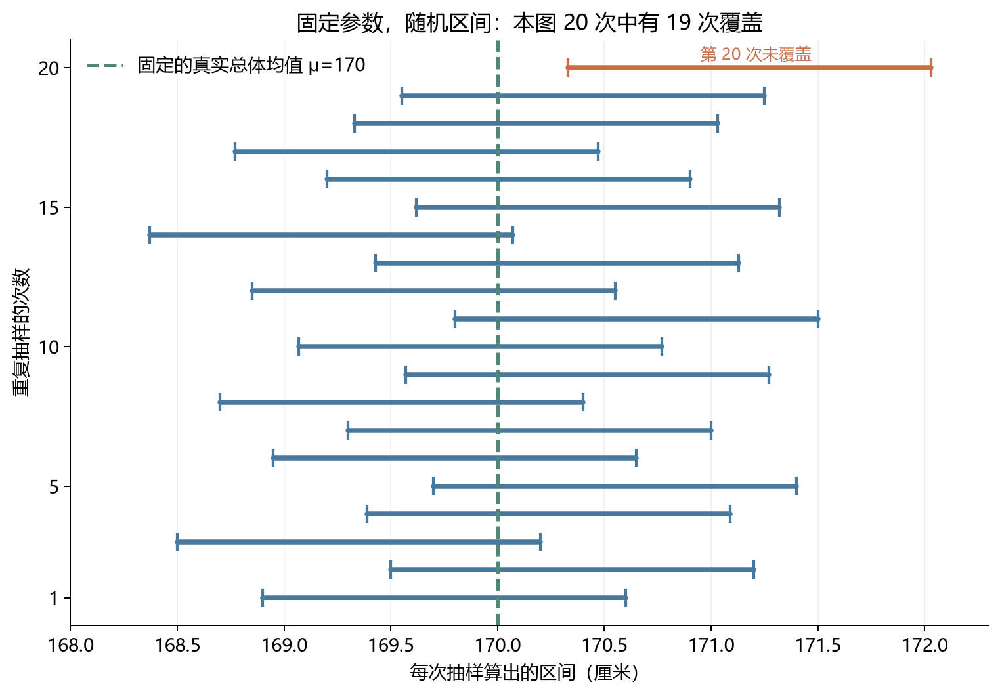
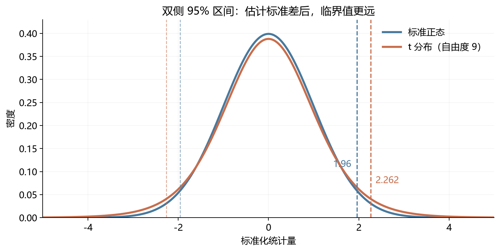
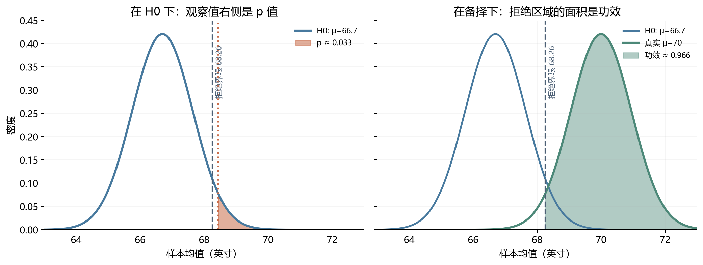
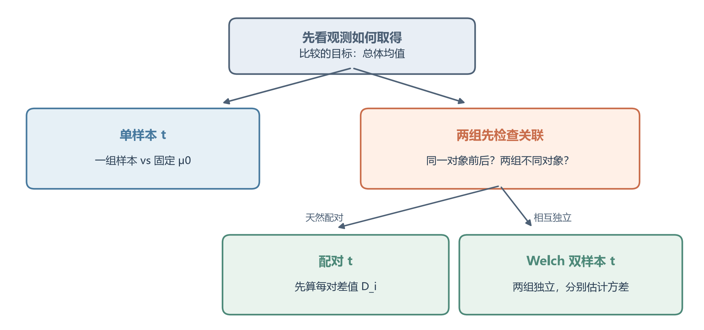
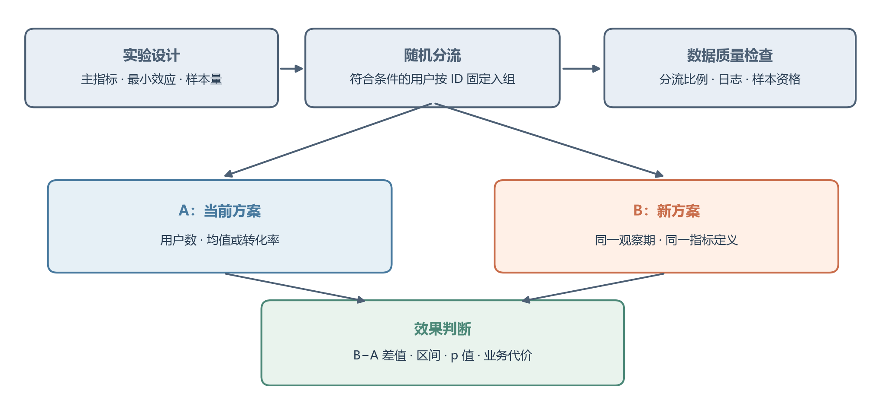

# [AI入门-概率统计]3.置信区间、假设检验与AB测试

从样本算出一个均值或比例，只得到一次抽样的结果。统计推断还要回答两个问题：这个结果可能离真实总体参数多远；如果它与某个基准不同，差异是否足以支持改变判断。本篇按课程原有顺序，先用置信区间描述估计的不确定性，再用假设检验判断证据，最后把两者放入 A/B 测试的实验流程。

## 1 点估计、置信区间与 95% 覆盖率

假设想知道全体用户的平均等待时间，却不可能逐个测量全体。手里只有抽到的一批用户，真实总体均值 $\mu$ 不知道，总体方差也不知道。统计推断的做法是：先用这批人的**样本均值**估计中心，再用样本之间有多分散来估计这次均值可能有多不稳定；最后把“中心 ± 不确定性”写成区间。这个区间不是凭一条记录主观猜出来的，它依赖抽样方式、样本量和统计模型。

例如从一个总体抽到 $n$ 人，身高样本均值为 $\bar x=170$ 厘米。这是总体均值 $\mu$ 的**点估计**：用已观察到的 $n$ 个身高的平均值，给未知总体平均身高一个具体数值。再抽一批人，均值一般会变；如果样本只有 3 人，它通常比 30000 人的均值更不稳定。点估计因此需要附上抽样误差的尺度。$\bar X$ 是每次重新抽样都会变化的统计量，而固定总体的 $\mu$ 在频率学派模型中是固定但未知的参数。

**置信区间**（confidence interval，CI）用随机样本计算一个下界和上界，尝试覆盖固定的总体参数。常见的对称形式是“点估计 $\pm$ 误差界”，但有些参数的区间并不对称。**95% 置信度**描述的是构造方法：想象按同一方式抽 100 批人，每批都各算出一个区间；在方法的假设成立时，长期平均约 95 个区间会盖住真实的总体均值，约 5 个会漏掉。真实 $\mu$ 始终是同一个数，变化的是每批样本和据此画出的区间。某次样本一旦确定，端点也确定；这次区间是否覆盖固定的 $\mu$ 已经是一个确定事实。日常说“对这段范围有 95% 把握”是在表达对**方法长期覆盖能力**的信任，不是说“已算出的区间内，参数仍有 95% 的随机概率”。如果给参数建立先验与后验，贝叶斯**可信区间**可以讨论条件于数据的参数概率，但那是另一种模型解释。

“数据有多分散”和“估计有多不稳定”还需区分。总体标准差 $\sigma$ 描述单个身高的波动；**标准误**（standard error，SE）描述样本均值在重复抽样中的波动。若 $X_1,\ldots,X_n$ 独立同分布、方差为 $\sigma^2$，则 $\operatorname{Var}(\bar X)=\sigma^2/n$，所以 $\operatorname{SE}(\bar X)=\sigma/\sqrt n$。计算区间时，**误差界**（margin of error，MOE）等于“临界值 $\times$ 标准误”；临界值由置信度和所用参考分布决定。

这些公式量化的是既定抽样模型下的**随机波动**。如果只调查篮球队就推断全校身高，区间可以因为人数多而很窄，却仍系统性偏高；选择偏差不会被误差界自动修复。

## 2 已知标准差时的均值 z 区间、宽度与样本量

先看一个便于推导的情形：总体标准差 $\sigma$ 已知，样本独立；总体正态时样本均值精确正态，非正态但满足适当大样本条件时可用中心极限定理近似正态。把样本均值减去待估计的 $\mu$，再除以标准误，得到

$$
Z=\frac{\bar X-\mu}{\sigma/\sqrt n}\approx N(0,1).
$$

设 $\alpha$ 为区间方法不覆盖的目标比例，置信度是 $1-\alpha$。$z_{1-\alpha/2}$ 是标准正态分布的 $1-\alpha/2$ 分位数；双侧 95% 时 $\alpha=0.05$，中央面积为 0.95，两端各为 0.025，$z_{0.975}\approx1.96$。于是

$$
P\!\left(-z_{1-\alpha/2}\le
\frac{\bar X-\mu}{\sigma/\sqrt n}
\le z_{1-\alpha/2}\right)\approx1-\alpha.
$$

把不等式对 $\mu$ 整理，得到均值的双侧 z 区间

$$
\boxed{\bar X\pm z_{1-\alpha/2}\frac{\sigma}{\sqrt n}},
\qquad
\operatorname{MOE}=z_{1-\alpha/2}\frac{\sigma}{\sqrt n}.
$$

例如随机抽 $n=49$ 人，$\bar x=170$ 厘米，已知总体标准差 $\sigma=25$ 厘米。标准误为 $25/\sqrt{49}=25/7\approx3.571$ 厘米，95% 误差界为 $1.96\times3.571\approx7.00$ 厘米，区间为 $[163,177]$ 厘米。它估计的是**全体平均身高**，并不表示 95% 的个体身高落在 163 到 177 厘米之间。$\sigma$ 已知在真实调查中较少见，但这个例子能先把“估计量—标准误—区间”的因果关系讲清。

区间总宽度是 $2z_{1-\alpha/2}\sigma/\sqrt n$。样本量 $n$ 变为四倍，标准误和宽度变为一半；总体波动 $\sigma$ 变大，区间同比变宽；提高置信度使临界值增大，区间也变宽。这些变化都以抽样条件不变为前提。若要在设计前要求误差界不超过 $E>0$，由 $z_{1-\alpha/2}\sigma/\sqrt n\le E$ 得

$$
\boxed{n\ge\left(\frac{z_{1-\alpha/2}\sigma}{E}\right)^2}.
$$

沿用身高例子，把目标误差界收紧为 3 厘米，需要 $n\ge(1.96\times25/3)^2\approx266.78$，向上取整为至少 267 人。这个计算需要事先合理估计 $\sigma$，可来自历史数据或先导调查；若有限总体不放回抽样的比例很大，还需考虑有限总体修正。267 人只满足本公式所述的随机误差目标，不能保证样本具有代表性。

## 3 总体标准差未知时的 Student t 区间

现实中往往不知道总体标准差 $\sigma$。这时至少要有一批观测，用它们的偏离程度估计波动；只有**一个**观测且没有外部波动信息，连样本标准差都算不出来，不能凭这个数给未知总体均值套出可靠的常规 t 区间。有 $n\ge2$ 个观测时，计算样本标准差 $S=\sqrt{(n-1)^{-1}\sum_i(X_i-\bar X)^2}$。$S$ 也随样本变化，在小样本时它可能偏大或偏小，所以直接把 z 公式里的 $\sigma$ 换成 $S$，却仍使用 1.96，会漏掉这层不确定性。

若样本来自**正态总体**且独立，统计量

$$
T=\frac{\bar X-\mu}{S/\sqrt n}\sim t_{n-1}
$$

精确服从自由度 $n-1$ 的 **Student t 分布**。自由度与估计样本均值后只剩 $n-1$ 个独立离差有关。对正态样本，$(n-1)S^2/\sigma^2$ 服从自由度 $n-1$ 的卡方分布，且与 $\bar X$ 独立；将随机的 $S$ 放进均值差的分母，会比已知 $\sigma$ 时多一层波动，于是得到尾部更厚的 t 分布。自由度增加时，t 分布逐渐接近标准正态。

令 $t_{1-\alpha/2,n-1}$ 为自由度 $n-1$ 的 t 分位数，均值的双侧区间变成

$$
\boxed{\bar X\pm t_{1-\alpha/2,n-1}\frac{S}{\sqrt n}}.
$$

先用一组能从头算完的数据：独立抽到 5 个等待时间，依次为 $8,9,10,11,12$ 分钟。样本均值是 $\bar x=10$；相对均值的偏差为 $-2,-1,0,1,2$，平方和为 $4+1+0+1+4=10$，因此样本方差 $s^2=10/(5-1)=2.5$、样本标准差 $s\approx1.581$ 分钟。这里的 $s$ 描述**个人等待时间**的波动；估计总体平均等待时间时，要用标准误 $s/\sqrt5\approx0.707$ 分钟。自由度为 4 的双侧 95% t 临界值约为 2.776，误差界为 $2.776\times0.707\approx1.963$。因此，总体平均等待时间的 95% t 区间（单位：分钟）是

$$
[10-1.963,10+1.963]\approx[8.04,11.96].
$$

这不是“下一位用户有 95% 概率等 8.04 到 11.96 分钟”，而是用这 5 个观测估计**全体平均等待时间**。因为只有 5 人，t 方法要依赖总体近似正态等条件；数字可以算得很精确，覆盖解释却仍取决于这些条件是否合理。

课程另有一组身高数据：$n=10$、$\bar x=68.442$ 英寸、$s=3.113$ 英寸，估计标准误为 $3.113/\sqrt{10}\approx0.984$ 英寸。自由度 9 的双侧 95% 临界值约为 2.262，所以区间约为 $68.442\pm2.227=[66.215,70.669]$ 英寸。若按已知 $\sigma=3$ 的 z 区间计算，宽度会不同；两者的**信息条件**不同，不能只挑较窄的结果。

正态总体下的小样本 t 推断是精确的。样本较大时，适度偏离正态常能接受近似；极端重尾、强偏斜或明显离群值仍需检查。“$n\ge30$”不是通行证，抽样独立性与数据形状仍重要。

## 4 总体比例区间：Wald 近似与 Wilson 修正

对于“有车/没车”这类二元结果，令 $X_i\in\{0,1\}$、总体成功概率为 $p$。$n$ 人中有 $k$ 人成功时，样本比例为 $\hat p=k/n$。独立同分布的伯努利样本满足 $\operatorname{Var}(\hat p)=p(1-p)/n$；用 $\hat p$ 代替未知 $p$ 后，估计标准误为 $\sqrt{\hat p(1-\hat p)/n}$。课程先给出的双侧**Wald 区间**是

$$
\hat p\pm z_{1-\alpha/2}\sqrt{\frac{\hat p(1-\hat p)}n}.
$$

例如 30 人中 24 人有车，$\hat p=0.8$，估计标准误为 $\sqrt{0.8\times0.2/30}\approx0.0730$；95% 区间是 $0.8\pm1.96(0.0730)\approx[0.657,0.943]$。它仍是对总体**拥有率**的区间估计，不是对下一位具体调查对象的保证。

Wald 公式计算简单，但成功或失败个数少、比例靠近 0 或 1 时，覆盖率可能偏离标称值，端点甚至可能超出 $[0,1]$。极端例子是观察 10 次、一次成功也没有：$\hat p=0$ 使 Wald 标准误变成 0，区间退化成 $[0,0]$，仿佛真实成功概率必定为零；其实“10 次没见到”仍容许一个不太大的非零概率。因此要保留 Wald 作为正态近似的学习入口，也要知道实用的 **Wilson 区间**。若 $z=z_{1-\alpha/2}$，Wilson 的中心和半宽分别是

$$
\frac{\hat p+z^2/(2n)}{1+z^2/n},
\qquad
\frac{z}{1+z^2/n}
\sqrt{\frac{\hat p(1-\hat p)}n+\frac{z^2}{4n^2}}.
$$

取“中心 $\pm$ 半宽”，上述 24/30 的 Wilson 95% 区间约为 $[0.627,0.905]$。对刚才“0/10”的例子，同一公式给出约 $[0,0.278]$：数据仍支持“比例可能非零”，只是没有观察到成功，区间上端还较高。这与 Wald 区间并不相同，因为两种构造方式有不同的覆盖性质。小样本或边界比例还可用精确二项区间；[NIST 对 Wilson 区间的说明](https://www.itl.nist.gov/div898/handbook/prc/section2/prc241.htm)和 [SciPy 二项检验的区间接口](https://docs.scipy.org/doc/scipy/reference/generated/scipy.stats._result_classes.BinomTestResult.proportion_ci.html)（核查于 2026-09-23）都保留了这些方法。选择方法后须连同置信度一起报告，不能只写一组端点。

## 5 假设检验：基准假设、错误类型与检验方向

置信区间给出参数可能处于怎样的范围；**假设检验**从一个明确的基准出发，判断观察结果在该基准下是否足够罕见。先写**原假设** $H_0$ 和**备择假设** $H_1$，再选择在 $H_0$ 成立时分布已知或可近似的**检验统计量**。例如想知道人群平均身高是否高于历史值 66.7 英寸，可写

$$
H_0:\mu=66.7,\qquad H_1:\mu>66.7.
$$

假设描述的是总体参数 $\mu$，不能写成 $H_0:\bar x=66.7$；$\bar x$ 是观察后的样本结果。若数据与 $H_0$ 的预测明显不相容，就**拒绝 $H_0$**；证据不足时**不拒绝 $H_0$**。后者没有证明 $H_0$ 为真，可能只是样本少、波动大，或当前设计对小效应不敏感。

决策可能出两类错。$H_0$ 本来成立却被拒绝，是**第一类错误**，类似把正常变化误报为“确有提升”；真实存在备择效应却未被检出，是**第二类错误**，类似真实有提升却因数据不够清楚而错过。预先选定的**显著性水平** $\alpha$ 控制第一类错误概率的上限，常见教学例子用 0.05：在基准确实成立、检验条件满足且重复做同一种检验时，长期最多约 5% 会误报。它不是“这次结论有 95% 概率正确”，也不是放之四海皆准的决策代价。第二类错误概率记为 $\beta(\theta)$，依赖具体真实参数或效应大小；**功效**（power）为 $1-\beta(\theta)$。样本量固定时，把 $\alpha$ 调小通常会让拒绝门槛更严格，也更容易漏掉真实的小效应。

“增加”“减少”或“有变化”分别对应右尾 $H_1:\mu>\mu_0$、左尾 $H_1:\mu<\mu_0$、双尾 $H_1:\mu\ne\mu_0$。以中心在零的检验统计量为例，右尾在高值侧寻找异常，左尾在低值侧，双尾两边都看。方向必须在观察结果前根据研究问题决定；看到正方向结果才把双尾改成右尾，会改变实际第一类错误率。只有反方向结果确实不构成同类研究结论时，单尾设计才合适。

## 6 p 值与临界值：同一个拒绝规则的两种读法

**p 值**以 $H_0$ 成立为前提，计算得到当前检验统计量或沿备择方向**更极端**结果的概率。它回答“若基准是真的，这样极端的数据有多不寻常”，不回答“基准为真的概率有多大”。[美国统计学会的 p 值声明](https://www.amstat.org/asa/files/pdfs/p-valuestatement.pdf)（核查于 2026-09-23）也明确区分 p 值、假设为真的概率、效应大小和决策重要性。

沿用单侧身高问题，假设总体标准差已知为 $\sigma=3$ 英寸，$n=10$、样本均值 $\bar x=68.442$ 英寸。若 $H_0:\mu=66.7$，检验统计量为

$$
z_{\mathrm{obs}}=
\frac{68.442-66.7}{3/\sqrt{10}}\approx1.836.
$$

右尾备择下，$p=P(Z\ge1.836\mid H_0)\approx0.0332$。可以把它想成：**假如**真实均值就是 66.7 英寸，按同样条件重复做 10000 次调查，约有 332 次会因随机波动出现“不低于本次这样高”的统计量。它不表示“真实均值为 66.7 的概率是 3.32%”；这里先假定 $H_0$ 成立，才去计算数据有多罕见。预先选 $\alpha=0.05$ 时，$0.0332<0.05$，拒绝 $H_0$；若预先选 0.01，就不拒绝。原字幕把右尾面积转写为 0.332，却又据此说小于 0.05，两句互相矛盾；与统计量一致的数值约为 **0.0332**。若问题原本是“双向是否变化”，对称正态下双尾 p 值约 $2(0.0332)=0.0664$，在 0.05 水平不拒绝 $H_0$。这再次说明方向需要事先确定。

**临界值法**先把 $\alpha$ 分配到拒绝区域。右尾标准正态、$\alpha=0.05$ 的界限为 $z_{0.95}\approx1.645$；观察值 1.836 超过界限，所以拒绝。p 值法把观察值右侧面积与 0.05 比较，得到同样结论。图中同时画出 $H_0$ 下的拒绝边界与本次观察值；面积和横坐标是同一判断的两种表示。

p 值既不是 $P(H_0\mid\text{数据})$，也不是“差异由纯随机造成的概率”；它不衡量效果有多大、业务是否值得做，或结果能否重复。大样本可让很小的无实际意义差异获得小 p 值。报告时应同时给出效应估计、区间、样本量、预设 $\alpha$ 和问题背景，而不只写“显著”二字。

## 7 检验功效与事先设计：不显著可能意味着检不出来

功效要针对**某个具体真实效应**计算。仍用右尾身高检验，若 $\sigma=3$、$n=10$，预设 $\alpha=0.05$，按 $H_0:\mu=66.7$ 设拒绝边界：当

$$
\bar X>66.7+1.645\frac3{\sqrt{10}}\approx68.26
$$

时拒绝。现在假设真实均值为 70 英寸，且独立正态样本的 $\bar X\sim N(70,3^2/10)$。第二类错误恰是“均值真的升到 70，却仍落在不拒绝区域”：

$$
\beta(70)=P(\bar X\le68.26\mid\mu=70)
=P\!\left(Z\le\frac{68.26-70}{3/\sqrt{10}}\right)
\approx0.034.
$$

所以对“真实均值为 70”的功效约为 0.966：如果真实世界确实提升到了 70，按这个设计反复重新抽样，约 96.6% 的实验会成功检出。若真实均值仅比 66.7 高一点，同一检验的功效会明显下降；一次“不显著”就更不能说明没有提升。第 6 节图的第二部分用两个真实中心展示：**临界点由 $H_0$ 分布确定，功效面积则要在备择分布下计算**。功效受效应大小、样本量、数据方差、预设 $\alpha$ 和尾部方向共同影响。

一次检验的合理顺序是：先确定目标总体与参数、最小有意义效应和错误代价；据此写 $H_0/H_1$、选择单尾或双尾、设 $\alpha$ 与目标功效并规划样本量；再检查抽样及测量条件、收集数据、计算统计量与 p 值；最后同时报告效应量、区间与判断。先看结果再改假设或停止规则，会使原先设计的错误率失去保证。0.05 与 80% 功效只是常见教学设定，真实实验应按错误的实际代价与可用样本量选取。

## 8 单样本 t 检验：一个均值与固定基准比较

若只有一组独立观测、总体标准差未知，问题是总体均值 $\mu$ 是否等于给定基准 $\mu_0$，就把第 3 节的 t 统计量中的 $\mu$ 换成原假设值：

$$
H_0:\mu=\mu_0,\qquad
T=\frac{\bar X-\mu_0}{S/\sqrt n}\sim t_{n-1}
\quad(H_0\text{ 成立且总体正态时}).
$$

同一身高资料给出 $n=10$、$\bar x=68.442$、$s=3.113$ 英寸，以 $\mu_0=66.7$ 作基准，观察统计量为

$$
t_{\mathrm{obs}}=\frac{68.442-66.7}{3.113/\sqrt{10}}\approx1.770,
$$

自由度为 9，右尾 p 值约 0.055。它大于预设的 0.05，因此**不拒绝**“总体均值等于 66.7”的基准。第 6 节用相似数据但假定真实 $\sigma=3$ 已知，z 检验得到 p 约 0.033；现在用样本 $S$ 估计波动并采用尾部更厚的 t 分布，证据不足。这两个结果对应不同已知条件，不能因为一个能拒绝就挑它报告。原总结把同一组近似数写为 $t\approx1.771$、$p\approx0.0552$；按表中显示的三位小数重新计算，$t\approx1.770$，尾部概率仍约 0.055，结论不变。

小样本下，单样本 t 检验的精确性依赖正态总体。明显离群值或强偏斜会让均值与标准差都受影响；此时应先检查数据和抽样设计，再考虑更合适的分析，而不机械套一个检验名称。

## 9 独立双样本 Welch t 检验：两组均值之差

两组数据来自**不同且相互独立的对象**时，参数是总体均值之差 $\Delta=\mu_X-\mu_Y$。若要检验给定差值 $\Delta_0$（常取 0），且不事先假定两组方差相等，可使用 **Welch t 检验**：

$$
H_0:\mu_X-\mu_Y=\Delta_0,\qquad
T=\frac{(\bar X-\bar Y)-\Delta_0}
{\sqrt{S_X^2/n_X+S_Y^2/n_Y}}.
$$

$n_X,n_Y$ 是两组样本量，$S_X,S_Y$ 是各自的样本标准差。分母是**两组均值差的估计标准误**：独立时，两组均值的方差相加。Welch 方法无需强行令 $S_X=S_Y$；它的参考 t 分布使用近似自由度

$$
\nu\approx
\frac{(S_X^2/n_X+S_Y^2/n_Y)^2}
{(S_X^2/n_X)^2/(n_X-1)+(S_Y^2/n_Y)^2/(n_Y-1)}.
$$

自由度可以是小数。[SciPy 的独立双样本 t 检验文档](https://docs.scipy.org/doc/scipy/reference/generated/scipy.stats.ttest_ind.html)（核查于 2026-09-23）说明，使用 Welch 路径时不要求两总体方差相等；库默认路径是否为 Welch 要按当前接口参数检查，不能凭“t 检验”三个字判断。

课程例子中，$X$ 组 $n_X=10,\bar x=68.442,s_X=3.113$；$Y$ 组 $n_Y=9,\bar y=65.949,s_Y=3.106$，单位均为英寸。观察差值为 $2.493$，标准误为

$$
\sqrt{3.113^2/10+3.106^2/9}\approx1.429,
\qquad t_{\mathrm{obs}}\approx2.493/1.429=1.745.
$$

近似自由度为 16.8。若预先研究“$X$ 组是否更高”，右尾 p 值约 0.0496，在 0.05 水平刚好拒绝；若研究“是否不同”，双尾 p 值约 0.099，不拒绝。结果紧贴阈值，应报告差值和区间，并检查样本来源与测量质量。原字幕曾把 $Y$ 组公式分母误说成 10，正确是该组自己的 $n_Y=9$；如果改成 10，标准误及 p 值都会变。

## 10 配对 t 检验与三类均值检验的选择

若同一人训练前后各测一次体重，两个观测天然成对；每个人原本体重不同，直接把前后两列当成两群陌生人，会把这种个体差异也算进误差。比如两人训练前后分别是 $70\to68$ 和 $60\to59$ 千克，按“前减后”得到差值 2 和 1 千克；我们真正要比较的是这些**每人自己的变化量**是否平均大于零。一般先定义每对差值 $D_i=X_i-Y_i$，再对差值的均值做**单样本 t 检验**：

$$
H_0:\mu_D=\mu_{D,0},\qquad
T=\frac{\bar D-\mu_{D,0}}{S_D/\sqrt n}\sim t_{n-1}
\quad(H_0\text{ 下、差值近似正态时}).
$$

若 $D_i=$“训练前减训练后”，$\mu_D>0$ 对应平均减重。课程数据有 $n=10$ 对、$\bar d=1.09$、$s_D=1.485$，所以 $t_{\mathrm{obs}}=1.09/(1.485/\sqrt{10})\approx2.321$，自由度 9，右尾 p 约 0.0227。在预设 0.05 水平下拒绝“平均变化为零”。配对分析消除了同一人身上稳定的个体差异，但只有真实的一一对应才能这样计算；任意把两组陌生人按行号配起来不会创造有效配对。

选择检验时先看数据的**采集结构**，再看公式：一组观测与固定基准比较，用单样本 t；两个独立群体比较，用独立双样本检验（方差不必相等时可用 Welch）；同一对象前后或真实匹配对，先算每对差值，再用配对 t。图把“观测之间是否有关联”放在方法选择的分叉处：

t 检验处理的是均值证据，不能修复非代表性抽样、系统测量错误或两组原先的混杂差异。样本量较大时可有近似稳健性，小样本时正态条件尤其应结合数据形状检查。

## 11 置信区间与双侧检验的对应关系

对同一个参数、同一统计模型、同一标准误估计和同一显著性水平，双侧检验 $H_0:\theta=\theta_0$ 在水平 $\alpha$ 下拒绝 $H_0$，当且仅当对应的 $100(1-\alpha)\%$ 双侧置信区间**不包含** $\theta_0$。两者是把同一条抽样分布关系从不同方向读出来。

例如对差值 $\Delta=\mu_B-\mu_A$ 建立 95% 双侧区间，若结果是 $[1,5]$，零不在范围内，对应的双侧 5% 等值检验就会拒绝 $\Delta=0$；若结果是 $[-2,6]$，零仍与数据相容，双侧检验不拒绝。前一个区间不仅说“有差异”，还说合理的差异大小大约在 1 到 5 之间。单尾检验与双侧区间不能机械地照此互换；区间方法或标准误如果不同，也可能出现看似不一致的结果。区间通常比单独 p 值多告诉我们：差异可能有多大、方向是否稳定、哪些效果仍与数据相容。

## 12 A/B 测试：随机分流、两类指标与实验质量

**A/B 测试**是把合格用户随机分配到当前方案 A 与新方案 B，按预先约定的指标比较两种方案。统计检验只处理最后的比较；前面的用户定义、随机分流、指标记录和样本量设计决定结果是否可信。先明确希望改善的**主指标**（如每位用户购买金额或用户转化率）、能产生业务价值的最小提升、观察周期、$\alpha$ 与目标功效，再按用户或其他合适的单位随机分流。两组应尽量同时经历相同的节假日、价格和流量变化。一个用户若有多条记录，不能把每条点击都当成独立用户来虚增样本量。

先看**平均购买金额**。课程给出 A 组 $n_A=80,\bar x_A=50,s_A=10$，B 组 $n_B=20,\bar x_B=55,s_B=15$。按 $B-A$ 定义差值，观察提升是 5 个金额单位；两组独立且方差未知，Welch 标准误为

$$
\sqrt{\frac{15^2}{20}+\frac{10^2}{80}}
=\sqrt{12.5}\approx3.536.
$$

若事前规定只检验“B 的总体均值更高”，观察 t 值约 $5/3.536=1.414$，单侧 p 约 0.085，超过 0.05。结论是当前数据**未提供足够证据**确认 B 的总体平均购买金额更高；观察差值 5 也没有被抹掉，只是误差较大。用对应的 Welch 方法估计，$B-A$ 的双侧 95% 区间大约是 $[-2.3,12.3]$ 个金额单位：真实平均差可能略为负，也可能明显为正，数据还无法把这两种情况分开。B 组人数少且波动更大，是标准误仍然明显的直接原因。

再看**转化率**。A 组 80 人中有 20 人购买，$\hat p_A=0.25$；B 组 20 人中有 8 人购买，$\hat p_B=0.40$，观察绝对差为 **15 个百分点**；相对于 A 的 25%，观察到的相对提升是 $0.15/0.25=60\%$。这两个数字描述同一批数据，但都还不是已证实的总体效果。检验 $H_0:p_B=p_A$ 时，两组在原假设下共享一个比例，合并估计为 $\hat p=(20+8)/(80+20)=0.28$。按 $B-A$ 定义的两比例 z 统计量是

$$
Z=
\frac{\hat p_B-\hat p_A}
{\sqrt{\hat p(1-\hat p)(1/n_A+1/n_B)}}
=\frac{0.40-0.25}
{\sqrt{0.28\times0.72(1/80+1/20)}}
\approx1.336.
$$

单侧 p 约 0.091，大于 0.05，仍不拒绝“总体转化率相等”。原字幕在这里出现“p 更大，所以拒绝原假设”的反向判断；正确规则始终是**事先定好 $\alpha$，再在 $p<\alpha$ 时拒绝**。检验时的合并比例来自 $H_0$；报告转化率差的区间时，应使用与区间方法相应的方差估计，不能直接把这个原假设标准误当作效果区间的标准误。B 组只有 20 人，二项正态近似也应谨慎，可用适当的比例区间或精确方法复核。

检验之前还要检查实验本身。若计划 50/50 分流，却发现两组用户数的偏差远超随机波动，应先排查分流、资格筛选、日志丢失及跨设备归属，这叫**样本比例不匹配**（sample ratio mismatch，SRM）；[Microsoft Research 的实验论文](https://www.microsoft.com/en-us/research/publication/diagnosing-sample-ratio-mismatch-in-online-controlled-experiments-a-taxonomy-and-rules-of-thumb-for-practitioners/)（核查于 2026-09-23）把它作为实验数据质量的重要诊断信号。还要预先处理以下常见问题：

- **反复查看并在首次显著时停止**：普通固定样本量检验的错误率不再按原设定工作。若需要提前决策，应采用事先设计的序贯方法；[Microsoft Research 的实验实践说明](https://www.microsoft.com/en-us/research/articles/patterns-of-trustworthy-experimentation-during-experiment-stage/)也明确要求对提前查看和重复检验作调整。
- **同时试很多版本、指标或人群切片**：至少出现一个偶然“显著”的机会增加。先固定主指标与主要比较，其余探索性结果要标明，并用适合的多重比较控制。
- **新奇效应、周期和干扰**：短期增长未必代表长期留存；一个用户的处理可能影响另一个用户，破坏独立性。实验时长和随机化单位要匹配问题。
- **只看 p 值**：同时报告绝对提升、相对提升、置信区间、样本量和副作用指标，再结合成本作决策。统计显著不等于业务收益足够大；不显著也不等于 A 与 B 完全一样。

最终应先确认实验数据可信，再评价效果。A/B 测试不绑定某一种统计公式：购买金额、二元转化、计数和长期留存的结果结构不同，检验与区间构造也应随之改变。
