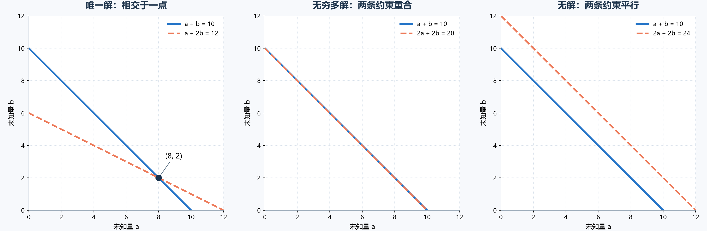
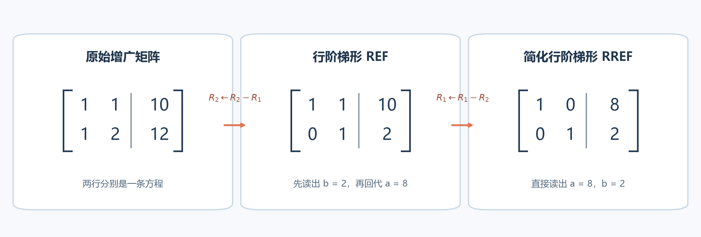

# [AI入门-线性代数]1.线性方程组、消元与秩

线性方程组描述多个未知量必须同时满足的约束。给定约束之后，需要回答两个问题：**是否存在满足全部约束的值？如果存在，能否唯一确定？** 消元法负责把方程整理成容易读取的形式；秩进一步说明方程组实际包含多少独立信息。

本文沿课程的学习顺序，先从方程及其几何意义建立直觉，再进入增广矩阵、行化简和秩。二元例子用普通字母 $a,b$ 表示未知量；一般方程组写成 $Ax=\mathbf b$ 时，粗体 $\mathbf b$ 表示右端的常数向量，与例子中的标量 $b$ 区分。

## 1 线性约束与方程组的解

### 1.1 什么样的关系是线性的

先看一笔采购：两种商品的单价分别是未知的 $a$、$b$，总价由“单价乘已知件数，再相加”得到。只要未知量都以这样的方式出现，我们就能把关系写成线性方程。对 $n$ 个未知量 $x_1,x_2,\ldots,x_n$，通式是

$$
a_1x_1+a_2x_2+\cdots+a_nx_n=c,
$$

其中 $a_i$ 是已知系数，表示 $x_i$ 增加 1 个单位时，等式左侧增加多少；$c$ 是左侧必须达到的已知总量。若 $a_i=0$，这条约束不涉及 $x_i$；若系数为负，增加 $x_i$ 反而会使左侧减少。每个未知量只与一个系数相乘，然后与其他项相加。出现 $x_1x_2$、$x_1^2$ 或 $\sin x_1$ 后，方程就不再具有这种线性形式。

例如，把两种商品的未知单价记为 $a$、$b$，两种商品各买一件花费 10 元，一件第一种商品和两件第二种商品花费 12 元，就得到

$$
\begin{cases}
a+b=10,\\
a+2b=12.
\end{cases}
$$

这两条方程必须同时成立。第一条独自只规定了 $a$ 与 $b$ 的一种关系；第二条加入后，才能进一步确定它们的数值。后面的消元和秩都围绕“新方程提供了多少额外约束”展开。

机器学习中的线性模型也使用加权求和。例如，多元线性回归把一个样本的若干特征分别乘以权重，再相加得到预测值。不过，训练回归模型通常是让预测**尽量接近**观测值，未必要求每条样本方程严格成立；损失函数和最小二乘法会在回归篇完整讲解。

### 1.2 独立、重复和冲突的约束

继续使用 $a+b=10$，只改变第二条约束，就能得到三种结果。

| 方程组 | 第二条约束提供了什么 | 结果 |
|---|---|---|
| $a+b=10$，$a+2b=12$ | 新的独立信息 | 唯一解 $a=8,b=2$ |
| $a+b=10$，$2a+2b=20$ | 第一条方程的两倍 | 无穷多解 |
| $a+b=10$，$2a+2b=24$ | 左侧重复，右端发生冲突 | 无解 |

第一组中，用第二条减去第一条得到 $b=2$，代回后得到 $a=8$。第二组只能确定 $a+b=10$；令 $b=t$，则 $a=10-t$，任意实数 $t$ 都给出一个解。第三组将第一条乘以 2 会得到 $2a+2b=20$，与第二条要求的 $2a+2b=24$ 无法同时成立。

**方程的条数不等于独立约束的数量。** 一个重复方程增加了书写量，却没有进一步限制未知量。另一方面，右端常数与已有约束不相容时，即使未知量很多，也可能根本没有解。先认识这三种情况，后面才能理解为什么求解时要同时检查系数和右端。

## 2 矩阵形式 $Ax=\mathbf b$ 与几何交集

### 2.1 把全部系数放进矩阵

方程少时逐条写很清楚；方程和未知量一多，就需要一种不会漏掉系数和右端的统一记法。把每条方程写成表格的一行、每个未知量写成一列，表格就是系数矩阵。有 $m$ 条方程、$n$ 个未知量时，这个矩阵记为 $A\in\mathbb{R}^{m\times n}$；未知量排成列向量 $x\in\mathbb{R}^{n}$；各方程右端排成 $\mathbf b\in\mathbb{R}^{m}$。整个方程组便写成

$$
Ax=\mathbf b.
$$

这里 $\mathbb{R}^{m\times n}$ 表示含 $m$ 行、$n$ 列实数的矩阵。矩阵乘向量的结果有 $m$ 个分量，恰好对应 $m$ 条方程：

$$
(Ax)_i=\sum_{j=1}^{n}A_{ij}x_j=b_i,
\qquad i=1,\ldots,m.
$$

$A_{ij}$ 是第 $i$ 条方程中第 $j$ 个未知量的系数；$b_i$ 是第 $i$ 条方程必须达到的数。改变 $A_{ij}$ 会改变这条约束对 $x_j$ 的要求；改变 $b_i$ 则是在不动系数的情况下改变目标总量。前面的商品例子写成

$$
\underbrace{\begin{bmatrix}1&1\\1&2\end{bmatrix}}_{A\in\mathbb{R}^{2\times2}}
\underbrace{\begin{bmatrix}a\\b\end{bmatrix}}_{x\in\mathbb{R}^{2}}
=
\underbrace{\begin{bmatrix}10\\12\end{bmatrix}}_{\mathbf b\in\mathbb{R}^{2}}.
$$

第一行与 $x$ 相乘给出 $a+b=10$，第二行给出 $a+2b=12$。此处只需要知道“**一行对应一条方程**”；矩阵乘法作为向量运算和线性变换的完整机制，将在下一篇说明。

### 2.2 解是所有约束的公共部分

在坐标平面上，一个含 $a,b$ 的非退化线性方程画出一条直线。方程组的解是同时落在各条直线上的点。前面三组方程分别对应相交、重合和平行：

左图两条直线交于 $(8,2)$，所以解唯一；中图两条方程对应同一条直线，这条线上的每一点都是解；右图两条直线平行且不重合，所以没有公共点。

在三个未知量的空间中，一条非退化线性方程通常对应一个平面；更高维时对应超平面。维度升高后，直接画出全部约束会变得困难，但“**解是全部约束的公共部分**”仍然成立。矩阵方法让我们不用作图，也能判断公共部分是否存在、包含几个自由方向。

## 3 齐次方程组、线性相关与奇异矩阵

### 3.1 用 $Ax=0$ 单独观察系数矩阵

判断“这组系数会不会让不同输入得到同一个结果”时，可以暂时不看具体的右端数值，只问：是否有一组不全为零的输入，让各方程左侧都抵消为零？把右端统一设为零，得到**齐次方程组**

$$
Ax=0.
$$

零向量 $x=0$ 一定满足它，因此齐次方程组至少有一个解。真正需要检查的是：**是否还有非零向量也被 $A$ 映射为零？**

例如

$$
A=\begin{bmatrix}1&1\\2&2\end{bmatrix},
\qquad
h=\begin{bmatrix}1\\-1\end{bmatrix}.
$$

计算得

$$
Ah=
\begin{bmatrix}1-1\\2-2\end{bmatrix}
=\begin{bmatrix}0\\0\end{bmatrix}.
$$

这表示沿着 $h$ 所指的方向改变输入，输出仍保持为零。如果某个 $x_0$ 已经满足非齐次方程 $Ax_0=\mathbf b$，则对任意实数 $t$，

$$
A(x_0+th)=Ax_0+tAh=\mathbf b.
$$

因此，一个**已经有解**的方程组只要存在这样的非零 $h$，就会有无穷多个解。这里“已经有解”是必要条件：若右端 $\mathbf b$ 与系数矩阵不相容，仍然会无解。

### 3.2 线性相关说明方向没有增加

“第二列有没有提供新信息”可以通过抵消来判断：如果某一列能用其他列拼出来，改变它对应的输入，同时反向调整其他输入，输出可能不变。设 $v_1,\ldots,v_k$ 是同一空间中的向量。如果存在一组不全为零的系数 $\alpha_1,\ldots,\alpha_k$，使

$$
\alpha_1v_1+\cdots+\alpha_kv_k=0,
$$

就称这些向量**线性相关**。这意味着至少有一个向量可由其他向量组合出来，它没有提供新的独立方向。

上一个矩阵的第二行是第一行的两倍；第二列也与第一列相同。因此它的行和列都包含重复方向。从列的角度看，$Ah=0$ 正是把矩阵各列按 $h$ 的分量组合后得到零：

$$
Ah=h_1A_{:,1}+h_2A_{:,2}=0.
$$

$A_{:,j}$ 表示 $A$ 的第 $j$ 列。存在非零 $h$ 就说明这些列线性相关。行、列相关和主元数量的关系将在第 6 节用秩表达。

对**方阵** $A\in\mathbb{R}^{n\times n}$，如果 $Ax=0$ 还有非零解，就称 $A$ 为奇异矩阵。此时它不能为每个右端 $\mathbf b$ 都提供唯一解。具体的 $Ax=\mathbf b$ 可能无解，也可能有无穷多解，取决于 $\mathbf b$ 是否落在矩阵能产生的输出范围内。对非方阵，本文会用秩和解的数量描述其结构，避免直接套用“奇异/非奇异”的说法。

方阵是否奇异还可以用行列式判别；行列式怎样计算、为什么与空间体积有关，将在第三篇集中讲解。

## 4 初等行变换、增广矩阵与矛盾行

### 4.1 消元为什么不改变解

直接观察大方程组难以看出哪条约束是重复的。消元法通过**可逆的方程替换**，逐步去掉某些未知量，使每条剩余方程更容易读取。

以

$$
\begin{cases}
a+b=10,\\
a+2b=12
\end{cases}
$$

为例，用第二条方程减去第一条，第二条变为 $b=2$。新方程组是

$$
\begin{cases}
a+b=10,\\
b=2.
\end{cases}
$$

知道新方程组的两条式子，就能用第一条与第二条相加恢复原来的第二条，因此替换前后具有完全相同的解。

允许的三类操作称为**初等行变换**：

1. 交换两行：$R_i\leftrightarrow R_j$；
2. 用非零常数缩放一行：$R_i\leftarrow \lambda R_i$，其中 $\lambda\ne0$；
3. 给一行加上另一行的若干倍：$R_i\leftarrow R_i+\lambda R_j$，其中 $i\ne j$。

$R_i$ 表示第 $i$ 行。每种操作都能撤销：交换可以再做一次，非零倍缩放可以乘以 $1/\lambda$，加上另一行的 $\lambda$ 倍可以再减去同样的量。用零缩放一行会抹掉原约束，因此不属于保持解集的初等行变换。

### 4.2 增广矩阵必须保留右端

把系数矩阵 $A$ 和右端 $\mathbf b$ 并排写在一起，得到增广矩阵

$$
[A\mid\mathbf b]
=
\left[\begin{array}{cc|c}
1&1&10\\
1&2&12
\end{array}\right].
$$

竖线只是帮助阅读，左边是未知量的系数，右边是常数。执行 $R_2\leftarrow R_2-R_1$ 后：

$$
\left[\begin{array}{cc|c}
1&1&10\\
1&2&12
\end{array}\right]
\longrightarrow
\left[\begin{array}{cc|c}
1&1&10\\
0&1&2
\end{array}\right].
$$

第二行的右端也必须计算 $12-10=2$。若只改变左侧系数、不更新右端，所得矩阵就不再表示原方程组。

### 4.3 零系数行怎样区分重复与冲突

回到第 1 节的另两组方程。如果第二条是 $2a+2b=20$，用 $R_2\leftarrow R_2-2R_1$ 得到

$$
\left[\begin{array}{cc|c}
1&1&10\\
0&0&0
\end{array}\right].
$$

第二行表示 $0=0$，它没有新增约束。此例有两个未知量，却只剩一条独立约束，所以有一个自由变量，解无穷多。

如果第二条改成 $2a+2b=24$，同样操作得到

$$
\left[\begin{array}{cc|c}
1&1&10\\
0&0&4
\end{array}\right].
$$

第二行表示 $0=4$，这是矛盾式，因此整个方程组无解。

**出现 $[0\ \cdots\ 0\mid0]$ 时，不能立刻断定有无穷多解。** 例如

$$
\begin{cases}
x=1,\\
2x=2
\end{cases}
\quad\longrightarrow\quad
\left[\begin{array}{c|c}
1&1\\
0&0
\end{array}\right].
$$

第二条只是重复，但唯一的未知量 $x$ 已被第一条确定，仍然只有一个解。判断解的数量还要检查**未知量列中有没有未被约束的自由变量**。

## 5 行阶梯形、简化行阶梯形与主元

### 5.1 行阶梯形支持从下向上回代

消元后若非零行排在零行之上，每个非零行的第一个非零元素比上一行更靠右，且它下方的元素都为零，矩阵就成为**行阶梯形**（row echelon form，REF）。每个非零行的第一个非零元素称为**主元**（pivot）。

前面的例子经过一次行变换已得到

$$
\left[\begin{array}{cc|c}
1&1&10\\
0&1&2
\end{array}\right].
$$

第二行先给出 $b=2$，第一行再给出 $a=10-b=8$。这种从最后一条有效方程向上求值的过程称为**回代**。REF 的主元不要求一定为 1；例如第二行写成 $[0\ 3\mid6]$ 也同样可回代。

### 5.2 简化行阶梯形能直接读取结果

如果把每个主元变为 1，并把主元所在列的其他元素全部消为零，就得到**简化行阶梯形**（reduced row echelon form，RREF）。继续做 $R_1\leftarrow R_1-R_2$：

$$
\left[\begin{array}{cc|c}
1&1&10\\
0&1&2
\end{array}\right]
\longrightarrow
\left[\begin{array}{cc|c}
1&0&8\\
0&1&2
\end{array}\right].
$$

此时第一行就是 $a=8$，第二行就是 $b=2$，无需再回代。

一个矩阵可以通过不同操作得到不同的 REF，但其 RREF 是唯一的。两种形式暴露的主元数量相同；区别在于 REF 适合回代，RREF 适合直接读取变量之间的完整关系。高斯消元通常止于 REF 并回代，继续向上清除主元列则通往 Gauss–Jordan 消元。

在增广矩阵中，若最右侧常数列出现主元，而它左边的系数部分在该行全为零，就意味着出现 $0=d$ 且 $d\ne0$，其中 $d$ 是行变换后该行右端的数值；此时方程组无解。讨论“哪个未知量是主元变量”时，应只看系数矩阵对应的列。

## 6 秩、零空间与解的数量

### 6.1 秩记录多少个独立方向

把方程消元后，可以直接数出还剩多少条真正独立的限制。这个数量就是矩阵的**秩**（rank）：它等于行化简后的主元数量，记作 $\operatorname{rank}(A)$。商品例子中，两条不同的有效方程留下两个主元；若第二条只是第一条的两倍，消元后它变成零行，只留下一个主元。秩也等于最大线性无关行组的向量数，并且等于最大线性无关列组的向量数。后一条等价关系是线性代数的定理；这里先用主元数作为可操作的定义。

若 $A\in\mathbb{R}^{m\times n}$，最多只有 $\min(m,n)$ 个主元，所以

$$
0\le\operatorname{rank}(A)\le\min(m,n).
$$

前面的三类二元例子中，唯一解那组的系数矩阵有两个主元，秩为 2；两组系数行重复的方程组都只有一个主元，系数矩阵的秩都为 1。后两组虽然一个有无穷多解、一个无解，却有相同的系数矩阵。这再次说明：**系数矩阵的秩只描述左侧包含多少独立信息；右端还要单独检查。**

三种初等行变换都保持秩不变，所以用它们把矩阵变成 REF 后读取主元数是有效的。对于 $n\times n$ 方阵，秩等于 $n$ 称为满秩；这样的方阵对任意右端都有唯一解。

矩形矩阵要分清两种“满”：若 $\operatorname{rank}(A)=m$，全部 $m$ 行都提供独立约束，称为**满行秩**，此时 $m\le n$，任意 $\mathbf b\in\mathbb R^m$ 都至少有一个解；若 $\operatorname{rank}(A)=n$，全部 $n$ 列都独立，称为**满列秩**，此时 $n\le m$，一个相容方程组至多有一个解。满列秩只保证解若存在便唯一，右端 $\mathbf b$ 仍可能使方程组无解。

### 6.2 零空间说明还可以自由改变什么

当方程已经有一个解时，还可能沿某些方向改变未知量，却不改变每条方程的左侧结果。第 3 节的 $h=(1,-1)^{\mathsf T}$ 就是这样的方向：第一个输入加 1、第二个减 1，两行计算结果都不变。把所有这些“不会改变输出”的向量收集起来，就是矩阵 $A\in\mathbb{R}^{m\times n}$ 的**零空间**（null space）：

$$
\mathcal N(A)=\{h\in\mathbb{R}^{n}:Ah=0\}.
$$

零向量总在其中，因为不改输入当然不改输出。若还包含非零向量，便能沿它得到另一组输入。设 $A$ 有 $r$ 个主元，则 $n-r$ 个未知量可以作为自由变量：每少一个主元，就多一个可自行选择的输入量。秩—零化度定理把两部分写为

$$
\operatorname{rank}(A)+\dim\mathcal N(A)=n,
$$

其中 $\dim\mathcal N(A)$ 称为零化度，也就是零空间中独立自由方向的数量。右端的 $n$ **是未知量数，即 $A$ 的列数**；即使方程条数 $m$ 不等于 $n$，也仍用列数。

例如

$$
\begin{cases}
x_1+x_2=3,\\
x_2+x_3=4.
\end{cases}
$$

系数矩阵有两行、三列，且两行独立，因此秩为 2。令自由变量 $x_2=t$，可得

$$
x_1=3-t,\qquad x_2=t,\qquad x_3=4-t.
$$

也可以把整组解写成

$$
x=
\underbrace{\begin{bmatrix}3\\0\\4\end{bmatrix}}_{\text{一个特解}}
+t\underbrace{\begin{bmatrix}-1\\1\\-1\end{bmatrix}}_{\text{零空间方向}},
\qquad t\in\mathbb{R}.
$$

第二个向量乘以系数矩阵后得到零，所以无论 $t$ 取什么值，右端仍是 $[3,4]^{\mathsf T}$。这个例子显示 $\operatorname{rank}(A)=2$、$n=3$，因而零空间有 $3-2=1$ 个自由方向。

一般地，若方程组已经有一个特解 $x_p$，其全部解都可以写成

$$
x=x_p+h,\qquad h\in\mathcal N(A).
$$

因此，在确认**有解**之后，零空间只有零向量就表示唯一解；零空间还有非零方向就表示无穷多解。

### 6.3 同时比较系数矩阵和增广矩阵的秩

现在把“约束够不够”和“约束会不会冲突”放在一起判断。令 $r=\operatorname{rank}(A)$ 表示系数提供多少独立信息，$r_{\mathrm{aug}}=\operatorname{rank}([A\mid\mathbf b])$ 表示把右端也算进去后有多少独立信息。增广矩阵比 $A$ 多出一列 $\mathbf b$。若这列能由 $A$ 的列按未知量 $x$ 的数值组合出来，就存在 $Ax=\mathbf b$ 的解；若右端让秩增加，说明它要求一个系数列无法组成的结果，方程组无解。于是：

| 秩的关系 | 判断 | 原因 |
|---|---|---|
| $r<r_{\mathrm{aug}}$ | 无解 | 右端不能由系数矩阵的列组合出来。 |
| $r=r_{\mathrm{aug}}=n$ | 唯一解 | 方程组相容，且每个未知量列都有主元。 |
| $r=r_{\mathrm{aug}}<n$ | 无穷多解 | 方程组相容，并有 $n-r$ 个自由变量。 |

这里 $n$ 是未知量数；这些结论同样适用于 $m\ne n$ 的矩形系数矩阵。

再看贯穿本文的三组二元方程。相交时 $r=r_{\mathrm{aug}}=2=n$；两条直线重合时 $r=r_{\mathrm{aug}}=1<n$；两条直线平行时 $r=1$，常数列使增广矩阵的秩升为 $r_{\mathrm{aug}}=2$。三种几何图像、消元结果和秩判据由此对应起来。

多元线性回归中，特征矩阵的列若重复或由其他列组合得到，参数可能不唯一；不同参数组合仍可能给出相同预测。这里借用了“秩不足意味着自由方向”的结论。回归通常求最小误差，并不要求每个样本严格满足 $Xw=y$；其完整目标函数和求解方法归入后续回归文章。

## 7 高斯消元、Gauss–Jordan 消元与实际求解

前面已经看到每一种行变换的作用。将其组织成固定顺序，就得到**高斯消元**（Gaussian elimination）：

1. 从方程组构造增广矩阵 $[A\mid\mathbf b]$。
2. 从左向右寻找尚未处理的主元列；主元位置为零时，先与下方具有非零候选元素的行交换。
3. 用主元行清除其下方对应列的元素，逐步得到 REF。
4. 检查是否出现 $[0\ \cdots\ 0\mid d]$ 且 $d\ne0$ 的矛盾行。
5. 若相容，从下向上回代。没有主元的未知量列对应自由变量，需要先赋予参数。

这个算法对前面的唯一解、无穷多解和无解例子使用同一套操作。区别体现在消元后的主元与右端，不必为三种情况发明三种求解方法。

如果在 REF 的基础上把每个主元归一化，并继续清除主元**上方**的元素，直到得到 RREF，这一完整过程通常称为 **Gauss–Jordan 消元**。课程把“化到 RREF”的全过程笼统称为高斯消元；两种叫法指向的计算步骤有交集，但严格区分时，高斯消元通常配合回代，Gauss–Jordan 消元继续向上清除。

**浮点数计算还有主元选择问题。** 如果候选主元为零，必须换行后才能继续相除；如果它非常接近零，用它作除数可能放大舍入误差。实际数值算法会根据候选元素选择主元，并在判断矩阵是否数值满秩时使用与精度和数据尺度有关的容差。数值上“被判为秩不足”与精确数学中“秩不足”有区别；[NumPy 的 `matrix_rank` 文档](https://numpy.org/doc/stable/reference/generated/numpy.linalg.matrix_rank.html)说明了默认阈值的作用。

对满秩方阵的 $Ax=\mathbf b$，数值库可直接求解线性系统；[NumPy 的 `linalg.solve` 文档](https://numpy.org/doc/stable/reference/generated/numpy.linalg.solve.html)给出了这类输入的要求。若数据方程没有精确解，或需要求最小误差解，[`linalg.lstsq`](https://numpy.org/doc/stable/reference/generated/numpy.linalg.lstsq.html)处理的是另一个目标：使 $\lVert Ax-\mathbf b\rVert_2^2$ 尽可能小。此处只区分两种问题；最小二乘的推导与使用条件将在回归篇展开。

对可逆方阵，数学上可以写 $x=A^{-1}\mathbf b$，但求一个具体右端的解时无需先显式构造整个逆矩阵。这里的逆矩阵说明“解可以唯一恢复”的条件；算法仍按线性系统求解。行变换对行列式数值的影响，以及用行列式判别方阵可逆性，将在第三篇继续说明。
