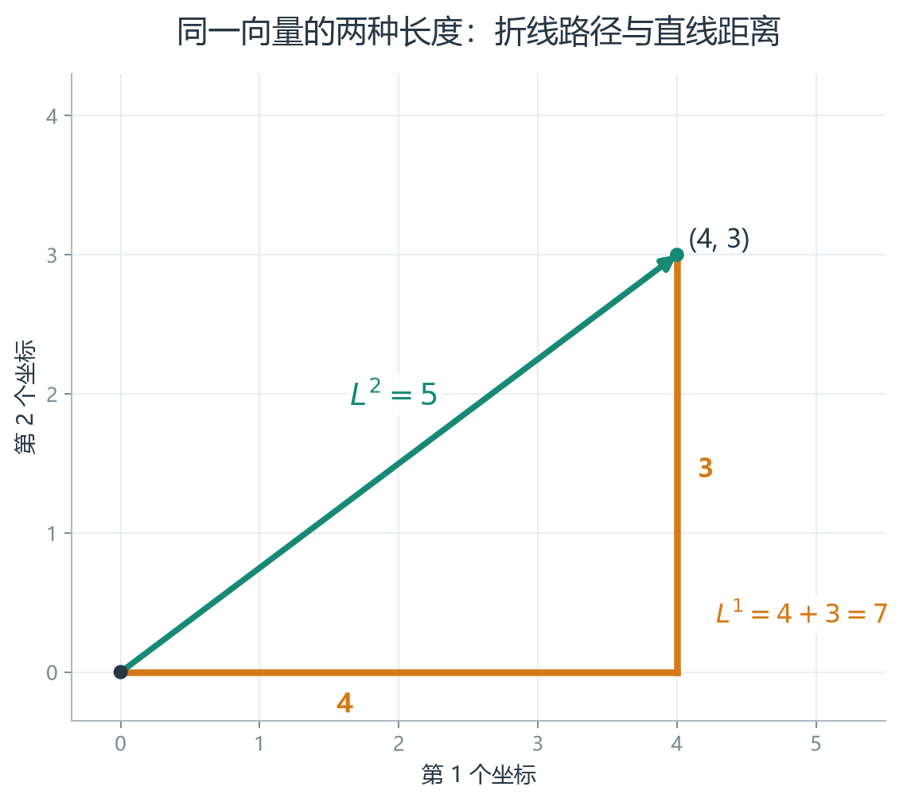
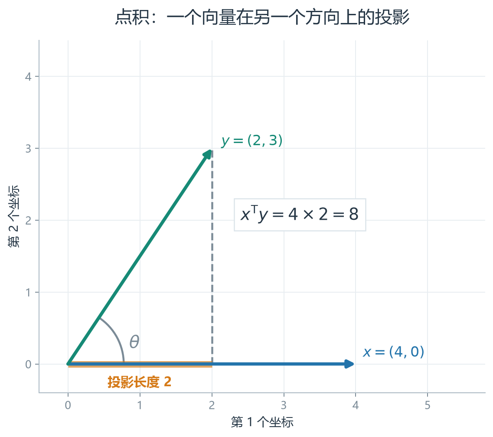
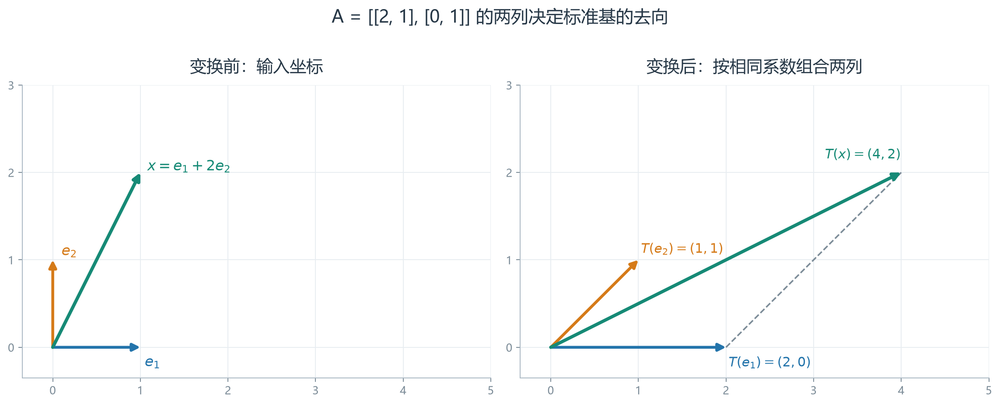
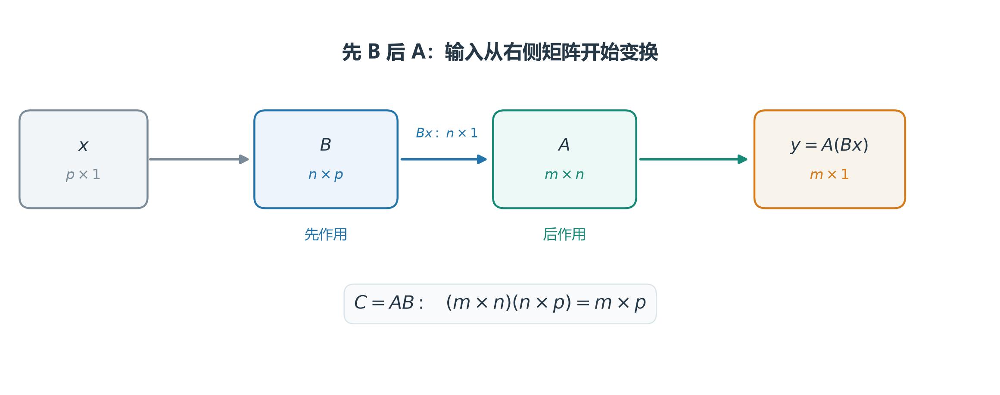

# [AI入门-线性代数]2.向量、矩阵与线性变换

一条样本可以有多个特征，一个空间位置可以有多个坐标。向量把这些有顺序的数放在同一个对象里；矩阵则能把向量变成另一个向量。理解这两种对象怎样运算，才能看清线性模型的预测、神经网络层的计算，以及“一个变换接着一个变换”为什么写成矩阵乘法。

本文沿线性代数第三周的原顺序，从向量的长度和距离讲到点积、矩阵与向量相乘、线性变换、变换复合及逆变换，最后把它们放进一层模型计算中。默认单个向量写成列向量；批量数据到第 7 节再按“每行一个样本”组织。

## 1 向量：表示数据、位移和方向

### 1.1 一个向量中的数属于同一个对象

假设一条商品数据记录了价格、重量和体积。把三个值写成 $x=(x_1,x_2,x_3)^{\mathsf T}$，就明确了它们属于同一条记录，并固定了各分量的含义与顺序。几何问题也使用同样的形式：$x=(4,3)^{\mathsf T}$ 可以表示平面上的点，也可以表示从原点向右 4、向上 3 的位移。哪一种解释成立，取决于正在描述的对象；运算规则相同。

本文把 $n$ 个实数按列排列，记为

$$
x=
\begin{bmatrix}
x_1\\x_2\\\vdots\\x_n
\end{bmatrix}
\in\mathbb R^n.
$$

$n$ 是向量的维度，也就是分量数。模型的特征向量和权重向量必须遵守相同的特征顺序，才可以逐项对应地计算。零向量的每个分量都是 0；它有长度，但长度为 0，因而没有确定的方向。

### 1.2 范数衡量长度，相减给出两点之间的位移

如果两条位移分别向右和向上走，我们会先问“总共走了多远”；如果比较两个样本，也会问“它们相差多大”。范数把一组分量合成一个非负数，回答这类大小问题。常见的两种计算方式是：

$$
\lVert x\rVert_1=\sum_{i=1}^{n}|x_i|,
\qquad
\lVert x\rVert_2=\sqrt{\sum_{i=1}^{n}x_i^2}.
$$

$L^1$ 范数把各坐标的绝对变化量相加；$L^2$ 范数是欧氏空间中的直线长度。以 $x=(4,3)^{\mathsf T}$ 为例，沿坐标轴先走 4 再走 3，共走 7，所以 $\lVert x\rVert_1=7$；原点到 $(4,3)$ 的直线长度由勾股定理得到 $\lVert x\rVert_2=5$。坐标数值变大，长度通常也随之变大；把向量反向，长度却不变。下图把两条路径画在相同坐标系中：

同维向量才能逐分量相加或相减。对 $x,y\in\mathbb R^n$ 和实数 $\lambda$，

$$
(x+y)_i=x_i+y_i,\qquad
(x-y)_i=x_i-y_i,\qquad
(\lambda x)_i=\lambda x_i.
$$

加法可理解为依次走完两段位移；$x-y$ 是从点 $y$ 指向点 $x$ 的位移；$\lambda x$ 缩放位移，$\lambda<0$ 时还会反转方向。两点距离先由相减得到位移，再求范数：

$$
d_1(x,y)=\lVert x-y\rVert_1,\qquad
d_2(x,y)=\lVert x-y\rVert_2.
$$

例如 $x=(4,3)^{\mathsf T}$、$y=(1,1)^{\mathsf T}$，两点的差为 $(3,2)^{\mathsf T}$，所以 $L^1$ 距离是 5，欧氏距离是 $\sqrt{13}$。距离用于最近邻、聚类和误差度量时，应先看各坐标的单位和尺度：把“米”改为“毫米”就会改变数值；直接使用未经处理的距离，可能让某个数值范围很大的特征主导结果。

## 2 点积、夹角与投影

### 2.1 点积把一组对应分量合成一个数

范数描述单个向量的大小。若要知道两个向量朝向是否接近，或把一组特征按权重汇总，就需要同时使用两个向量。对 $x,y\in\mathbb R^n$，点积定义为

$$
x^{\mathsf T}y=x\cdot y
=\sum_{i=1}^{n}x_i y_i
\in\mathbb R.
$$

$x^{\mathsf T}$ 是把 $n\times1$ 列向量转为 $1\times n$ 行向量；它和 $y$ 相乘后只有一个数。若 $x=(2,1)^{\mathsf T}$、$y=(3,4)^{\mathsf T}$，则 $x^{\mathsf T}y=2\cdot3+1\cdot4=10$。将 $x$ 当作特征、$y$ 当作权重时，10 就是各特征贡献相加后的分数。

矩阵也能转置。若 $A\in\mathbb R^{m\times n}$，则 $A^{\mathsf T}\in\mathbb R^{n\times m}$，原矩阵的第 $i$ 行成为转置后的第 $i$ 列，满足 $(A^{\mathsf T})_{ij}=A_{ji}$。转置改变排列和形状，并不改变分量的值。

### 2.2 点积怎样反映夹角和投影

点积为正、为零或为负，可以帮助判断两支箭头大致是同向、成直角还是背向。它为什么能这样判断？对非零向量 $x,y$，点积可以写成长度与夹角的关系：

$$
x^{\mathsf T}y=\lVert x\rVert_2\lVert y\rVert_2\cos\theta,
$$

其中 $\theta$ 是两向量的夹角。把 $y$ 沿 $x$ 的方向量一量，得到带符号的长度 $\lVert y\rVert_2\cos\theta$；再乘以 $x$ 的长度，就是点积。例如 $x=(1,0)^{\mathsf T}$ 指向右方，$y=(3,4)^{\mathsf T}$ 的“向右分量”为 3，所以点积是 3；若 $y=(0,4)^{\mathsf T}$ 只向上，向右分量为 0，点积也为 0。夹角小于 $90^\circ$ 时点积为正，等于 $90^\circ$ 时为零，大于 $90^\circ$ 时为负。夹角为直角的两个非零向量称为**正交**，这里可以先把它理解成“互相垂直”。

若只想比较方向，不希望向量长度影响结果，可以把点积除以两者的欧氏长度：

$$
\cos\theta
=\frac{x^{\mathsf T}y}{\lVert x\rVert_2\lVert y\rVert_2}.
$$

这就是余弦相似度。两个非零向量同向时为 1，正交时为 0，反向时为 $-1$。零向量不能代入，因为分母会变为零。若事先把两个向量都除以自身的 $L^2$ 范数，它们的长度均为 1，此时点积就等于余弦相似度。后面的推荐系统和视觉表征会再次使用这个性质，但其训练目标和相似度阈值由各自任务决定。

## 3 矩阵与向量相乘：一次得到多个线性组合

### 3.1 按行看，每个输出分量是一次点积

假设希望对同一输入 $x$ 同时计算 $m$ 个加权结果。把每组权重写成矩阵的一行，得到 $A\in\mathbb R^{m\times n}$。当 $x\in\mathbb R^n$ 时，

$$
y=Ax\in\mathbb R^m,\qquad
y_i=\sum_{j=1}^{n}A_{ij}x_j.
$$

下标 $i$ 指第 $i$ 个输出或第 $i$ 行，$j$ 指参与计算的输入分量。矩阵的列数必须等于输入向量的分量数；否则每一行都无法与 $x$ 完成点积。在方程组 $Ax=\mathbf b$ 中，第 $i$ 行与 $x$ 的点积必须等于右端的 $b_i$，这就是“一行对应一条方程”：给定 $A$ 与 $\mathbf b$ 时，任务是寻找同一个 $x$，使**每一行**的点积都等于对应的 $b_i$。在本节中，输入 $x$ 已给定，任务改为计算所有输出 $y_i$；乘法形状相同，已知量和要找的量不同。

例如

$$
A=
\begin{bmatrix}
2&1\\
1&-1\\
0&3
\end{bmatrix}
\in\mathbb R^{3\times2},
\qquad
x=
\begin{bmatrix}
2\\1
\end{bmatrix}
\in\mathbb R^2.
$$

矩阵的三行分别与 $x$ 做点积，依次得到 $2\cdot2+1\cdot1=5$、$1\cdot2-1\cdot1=1$ 和 $0\cdot2+3\cdot1=3$，所以 $Ax=(5,1,3)^{\mathsf T}$。两维输入由此变成了三维输出。

### 3.2 按列看，输入分量决定怎样组合输出方向

把上例的两列记为 $a_1=(2,1,0)^{\mathsf T}$、$a_2=(1,-1,3)^{\mathsf T}$，同一个输出也可写成

$$
Ax=x_1a_1+x_2a_2
=2
\begin{bmatrix}2\\1\\0\end{bmatrix}
+
\begin{bmatrix}1\\-1\\3\end{bmatrix}
=
\begin{bmatrix}5\\1\\3\end{bmatrix}.
$$

按行看适合计算某个输出分量；按列看说明所有可能的输出都由矩阵的列组合而成。输入只有两个独立系数时，即使输出写成三维，也不能因此生成整个三维空间的每个点。哪些输出能够得到，与矩阵列形成的空间有关；这在下一节的变换视角中会变得直观。

## 4 线性变换与标准基

### 4.1 矩阵给空间中的每个输入规定一个输出

固定矩阵 $A\in\mathbb R^{m\times n}$ 后，计算 $T(x)=Ax$，就是一条从 $\mathbb R^n$ 到 $\mathbb R^m$ 的映射规则。输入不同，输出也可能不同；但矩阵 $A$ 本身保持不变。若输入和输出都在平面中，可以把这条规则想成同时移动平面上每一支从原点出发的箭头：有的方向被拉长，有的被转向，某些变换还可能把整个平面压成一条线。

称映射 $T$ 为**线性变换**，需要对任意同维输入 $u,v$ 和实数 $\lambda$ 满足

$$
T(u+v)=T(u)+T(v),\qquad
T(\lambda u)=\lambda T(u).
$$

第一条要求“先相加再变换”和“先分别变换再相加”结果相同；第二条要求缩放能够穿过变换。矩阵乘法满足这两条，因为 $A(u+v)=Au+Av$、$A(\lambda u)=\lambda Au$。取 $\lambda=0$ 还可得 $T(0)=0$：线性变换必须把零向量映到零向量。若额外加上非零常量 $b$，$T(x)=Ax+b$ 就不再满足这一条件，它称为**仿射变换**；第 7 节会用到它。

### 4.2 矩阵的列就是标准基向量的去向

二维空间中，$e_1=(1,0)^{\mathsf T}$、$e_2=(0,1)^{\mathsf T}$ 是**标准基向量**。任意 $x=(x_1,x_2)^{\mathsf T}$ 都能写成 $x_1e_1+x_2e_2$。线性性于是给出

$$
T(x)=x_1T(e_1)+x_2T(e_2).
$$

因此，只要知道两支标准基箭头变到了哪里，就知道平面上任意向量变到了哪里。在 $\mathbb R^n$ 中也一样，矩阵第 $j$ 列正是 $T(e_j)$：

$$
A=
\begin{bmatrix}
T(e_1)&T(e_2)&\cdots&T(e_n)
\end{bmatrix}.
$$

例如取

$$
A=
\begin{bmatrix}
2&1\\
0&1
\end{bmatrix}.
$$

它把 $e_1$ 变为 $(2,0)^{\mathsf T}$，把 $e_2$ 变为 $(1,1)^{\mathsf T}$。因此 $x=e_1+2e_2=(1,2)^{\mathsf T}$ 的像是 $T(x)=T(e_1)+2T(e_2)=(4,2)^{\mathsf T}$。图中同时画出原来的两个基方向、变换后的两列以及这个向量的结果：

这里的“基”是一组用来表示向量的独立方向；一般基、换基和维数会在下一篇结合分解展开。本节先抓住标准基与矩阵列的对应关系。若两个不同输入 $x_1,x_2$ 得到相同输出，就有 $A(x_1-x_2)=0$，而差向量 $x_1-x_2\ne0$；这个非零方向被变换压成了零，原输入因而无法唯一恢复。这样的方向属于矩阵的**零空间**。例如两列相同的 $A=[\,a\ a\,]$ 满足 $A(1,-1)^\mathsf T=0$：沿第一坐标增加、第二坐标等量减少，输出不变。它也说明两列只提供一个独立方向，秩不足，无法从输出分清原来的两个坐标。

## 5 矩阵乘法与变换复合

### 5.1 先做哪个变换，由靠近输入的矩阵决定

假设输入 $x\in\mathbb R^p$ 先经过 $B\in\mathbb R^{n\times p}$，得到 $Bx\in\mathbb R^n$；再经过 $A\in\mathbb R^{m\times n}$，得到 $A(Bx)\in\mathbb R^m$。希望用一个矩阵直接表示这两个连续步骤，就定义复合矩阵 $C=AB$，使

$$
Cx=(AB)x=A(Bx).
$$

图中从输入向右读，是“$x$、$B$、$A$”；写成乘积则是 $AB$，靠近 $x$ 的 $B$ 先作用：

这个顺序有实际意义。先旋转再沿固定坐标轴拉伸，与先拉伸再旋转，通常把同一个点送到不同位置。因此矩阵乘法一般不能交换次序。

### 5.2 行乘列的公式来自逐列执行复合变换

$B$ 的第 $j$ 列是输入标准基 $e_j$ 经过 $B$ 的结果；再由 $A$ 作用后，便得到复合矩阵 $AB$ 的第 $j$ 列。若 $A$ 的第 $i$ 行再取这个结果的第 $i$ 个分量，就得到

$$
(AB)_{ij}
=\sum_{k=1}^{n}A_{ik}B_{kj}.
$$

也就是说，输出矩阵第 $i$ 行、第 $j$ 列的数，是 $A$ 的第 $i$ 行与 $B$ 的第 $j$ 列的点积。$A$ 的列数和 $B$ 的行数都为 $n$，所以每次点积都有 $n$ 对分量；结果形状为

$$
(m\times n)(n\times p)=(m\times p).
$$

例如

$$
A=\begin{bmatrix}1&1\\0&1\end{bmatrix},
\qquad
B=\begin{bmatrix}2&0\\0&1\end{bmatrix}.
$$

$B$ 先把横坐标乘以 2，$A$ 再把纵坐标加到横坐标上，得到

$$
AB=\begin{bmatrix}2&1\\0&1\end{bmatrix}.
$$

对 $x=(1,1)^{\mathsf T}$，先后计算为 $Bx=(2,1)^{\mathsf T}$、$A(Bx)=(3,1)^{\mathsf T}$。若反过来做，$BA=\begin{bmatrix}2&2\\0&1\end{bmatrix}$，同一个 $x$ 会得到 $(4,1)^{\mathsf T}$。这里 $AB$ 与 $BA$ 都有定义，结果仍不相同；在矩形矩阵的情形，反向乘积甚至可能因维度不匹配而没有定义。

三次变换连续作用时，$(AB)C=A(BC)$，称为**结合律**。它允许在维度合法时调整先计算哪一对矩阵，但不会改变变换的先后次序。矩阵乘法也不是把两个矩阵对应位置的数字逐个相乘；逐元素相乘不会产生上述复合变换。

## 6 单位矩阵、逆矩阵与可恢复性

### 6.1 单位矩阵表示保持原样

要讨论“撤销”某个变换，先要确定撤销后的状态。$n\times n$ 的**单位矩阵** $I_n$ 在主对角线上为 1，其余位置为 0。它让每个标准基向量保持原样，所以对任意 $x\in\mathbb R^n$ 都有 $I_nx=x$。若 $A\in\mathbb R^{m\times n}$，矩阵乘法还满足

$$
I_mA=A=AI_n.
$$

左乘 $I_m$ 保持输出空间的 $m$ 个坐标，右乘 $I_n$ 保持输入空间的 $n$ 个坐标；两边的单位矩阵未必同样大。

### 6.2 逆变换把输出恢复为原输入

假设一个变换把原来的 $(1,2)^{\mathsf T}$ 变成 $(4,2)^{\mathsf T}$。现在只拿到输出，想恢复原输入，就需要一个能撤销这次变换的规则。对方阵 $A\in\mathbb R^{n\times n}$，若有矩阵 $A^{-1}$ 满足

$$
A^{-1}A=AA^{-1}=I_n,
$$

就称 $A$ **可逆**。先用 $A$ 把 $x$ 变成 $y=Ax$，再用 $A^{-1}$ 处理 $y$，便得到 $A^{-1}y=x$。逆矩阵恢复的是输入；它要求变换既不把不同输入压到同一个输出，也能覆盖整个目标空间。对 $n\times n$ 方阵，$\operatorname{rank}(A)=n$ 表示 $n$ 列都独立，这时任意右端 $y$ 都有且只有一个原像 $x$，也就能够使用逆变换。若秩不足，至少有一个非零 $h$ 满足 $Ah=0$；只要 $x$ 是某个输出的原像，$x+h$ 也是同一输出的原像，所以不可能唯一恢复。其余不在像空间中的右端则无解。

对二阶方阵

$$
M=
\begin{bmatrix}
a&b\\c&d
\end{bmatrix},
$$

当 $ad-bc\ne0$ 时，逆矩阵可写为

$$
M^{-1}
=\frac{1}{ad-bc}
\begin{bmatrix}
d&-b\\-c&a
\end{bmatrix}.
$$

式中的 $a,b,c,d$ 分别是矩阵左上、右上、左下和右下位置的元素。以第 4 节的 $A=\begin{bmatrix}2&1\\0&1\end{bmatrix}$ 为例，$ad-bc=2$，所以

$$
A^{-1}=
\begin{bmatrix}
\tfrac12&-\tfrac12\\
0&1
\end{bmatrix}.
$$

$A$ 把 $(1,2)^{\mathsf T}$ 变成 $(4,2)^{\mathsf T}$；$A^{-1}$ 再把 $(4,2)^{\mathsf T}$ 变回 $(1,2)^{\mathsf T}$。若 $ad-bc=0$，分母为零，二阶方阵不能按此式求逆；这个表达式与行列式、面积缩放的关系在下一篇解释。

在数学推导中，$Ax=y$ 可以写成 $x=A^{-1}y$ 来表示可唯一恢复。给定一个具体的右端 $y$ 时，可以对增广矩阵 $[A\mid y]$ 消元：用行变换把左边化为上三角或阶梯形，再回代求各分量。这直接针对当前这一组方程；先计算整个 $A^{-1}$ 则是在求处理所有可能右端所需的信息，解这一个系统并不需要它。

## 7 仿射计算、批量样本与神经网络层

### 7.1 从一个点积到一个分类分数

有了点积，就能把一条含 $n$ 个特征的样本 $x\in\mathbb R^n$ 变成一个分数。给每个特征设置权重 $w\in\mathbb R^n$，再加入实数偏置 $b$：

$$
z=w^{\mathsf T}x+b.
$$

$w^{\mathsf T}x$ 把各特征的加权贡献相加；$b$ 决定零分边界的位置。$b=0$ 时这是线性映射；一般情况下它是仿射映射，因为输入为零时仍可能输出 $b$。若把 $z>0$ 判为一类，$z\le0$ 判为另一类，就得到一条线性决策边界。

例如布尔 AND 的两个输入 $x_1,x_2\in\{0,1\}$ 可用 $w=(1,1)^{\mathsf T}$、$b=-1.5$ 分开：只有 $(1,1)$ 的分数为正，其他三个输入的分数都为负。这是经典感知机的直观例子。XOR 要让 $(1,0)$、$(0,1)$ 同属一类，同时让 $(0,0)$、$(1,1)$ 属于另一类；单条直线无法做到，单层阈值分类器便不能直接表示它。经典感知机仍是可用的线性分类器；截至 2026-09-23，[scikit-learn 文档](https://scikit-learn.org/stable/modules/generated/sklearn.linear_model.Perceptron.html)仍提供该模型。这里借它说明线性边界的能力范围，历史参数更新规则与本章的矩阵计算无关，因而不展开。

### 7.2 一批样本共享权重，多个输出共享一次矩阵运算

一条样本只产生一个分数；若要同时处理整批样本，最自然的办法是把同一组权重分别用于每条记录。一条样本用列向量表示；收集 $N$ 条样本时，把每条样本转成一行，组成

$$
X=
\begin{bmatrix}
(x^{(1)})^{\mathsf T}\\
\vdots\\
(x^{(N)})^{\mathsf T}
\end{bmatrix}
\in\mathbb R^{N\times n}.
$$

这里 $N$ 是样本数，$n$ 是每条样本的特征数。对全部样本使用同一个 $w$ 和 $b$，得到

$$
z=Xw+b\mathbf 1_N\in\mathbb R^N,
$$

其中 $\mathbf 1_N$ 是长度为 $N$、每个分量都为 1 的向量；第 $i$ 个结果仍是 $(x^{(i)})^{\mathsf T}w+b$。批量计算没有让不同样本互相混合，只是把同一种点积对每一行执行一次。

若一层需要 $q$ 个输出，把第 $j$ 个输出的权重列向量 $w_j\in\mathbb R^n$ 排为权重矩阵 $W$ 的第 $j$ 行，使 $W\in\mathbb R^{q\times n}$；把 $q$ 个偏置写成 $\beta\in\mathbb R^q$。单样本与批量的形状分别为

$$
z_{\mathrm{single}}=Wx+\beta\in\mathbb R^q,
$$

$$
Z=XW^{\mathsf T}+\mathbf 1_N\beta^{\mathsf T}
\in\mathbb R^{N\times q}.
$$

$Z$ 的第 $i$ 行是第 $i$ 条样本的 $q$ 个输出；第 $j$ 列是第 $j$ 个输出单元对全部 $N$ 条样本的计算结果。具体到一个元素，$Z_{ij}=w_j^{\mathsf T}x^{(i)}+\beta_j$。由此可以逐项核查维度：$(N\times n)(n\times q)$ 得到 $N\times q$，偏置项也必须能加到这个形状上。

例如两条样本各有两个特征，令 $X=\begin{bmatrix}1&0\\0&1\end{bmatrix}$、$W=\begin{bmatrix}2&1\\-1&3\end{bmatrix}$、$\beta=(1,0)^{\mathsf T}$。第一条样本 $(1,0)$ 得到两个分数 $2\cdot1+1=3$、$-1\cdot1=-1$；第二条样本 $(0,1)$ 得到 $1\cdot1+1=2$、$3\cdot1=3$。一次矩阵运算把结果排成 $Z=\begin{bmatrix}3&-1\\2&3\end{bmatrix}$：两行对应两条样本，两列对应两个输出。调整 $W$ 的第一行权重会改变第一列输出，但每条样本仍各占 $Z$ 的一行，不会被合并。

原课程有时把 $N$ 个列向量样本**并排**放成 $X_{\mathrm{col}}\in\mathbb R^{n\times N}$，此时单层公式写成 $WX_{\mathrm{col}}+\beta\mathbf 1_N^{\mathsf T}\in\mathbb R^{q\times N}$。它与上式计算的是同一组数，只是整个结果转置了。本文统一使用 $X=X_{\mathrm{col}}^{\mathsf T}$，让样本处在第一维；遇到框架接口时，要从实际形状推断转置位置，不能只背一个公式。截至 2026-09-23，[PyTorch 的线性函数文档](https://docs.pytorch.org/docs/stable/generated/torch.nn.functional.linear.html)采用与本节相同的批量输入约定，计算形式为 $y=xA^{\mathsf T}+b$。

### 7.3 非线性激活让层的组合超出单个仿射变换

前面的 $Z$ 只是按权重加总的分数。神经网络层通常再对每个分数施加一个**激活函数** $\phi$，得到 $h=\phi(Wx+\beta)$；批量时得到 $H=\phi(Z)\in\mathbb R^{N\times q}$，并交给下一层。比如 ReLU 把负数变成 0、正数保持原值，上例第一行的 $(3,-1)$ 就变为 $(3,0)$。这一步不会改变“第几行是哪条样本”，改变的是每个输出怎样响应输入。不同激活函数如何选择、怎样训练权重，会在神经网络文章中展开；本节先说明为何需要它。

如果连续两层都只做仿射计算，则

$$
W_2(W_1x+\beta_1)+\beta_2
=(W_2W_1)x+(W_2\beta_1+\beta_2).
$$

右端仍是一个仿射变换。由此可见，只堆叠矩阵乘法和偏置，最终仍能合并成单层；在层与层之间加入非线性激活，才可能表达单个仿射变换无法表示的输入与输出关系。阈值函数也能产生非线性，但它不适合作为常规梯度训练网络的默认激活；神经网络中可使用[PyTorch 文档列出的 ReLU](https://docs.pytorch.org/docs/stable/generated/torch.nn.ReLU.html)等适合梯度优化的激活函数。这个“仿射计算—激活—交给下一层”的顺序，是后续学习前向传播的基础。
