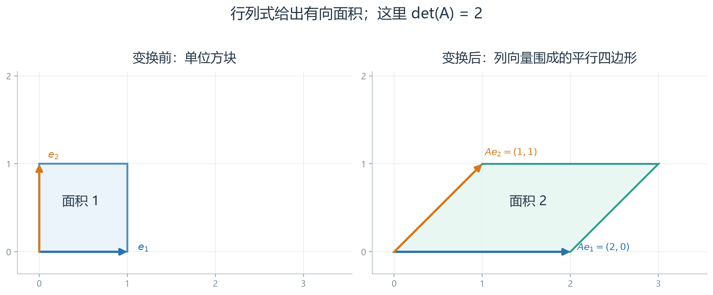
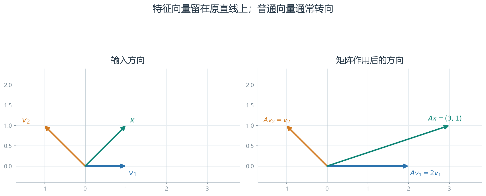
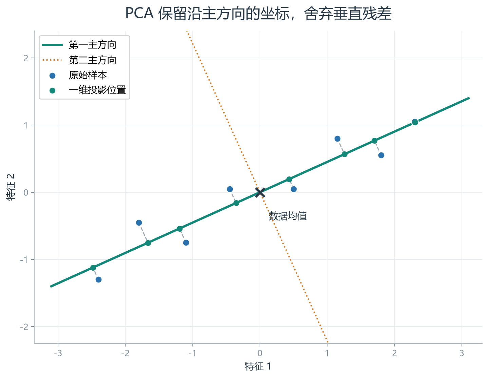
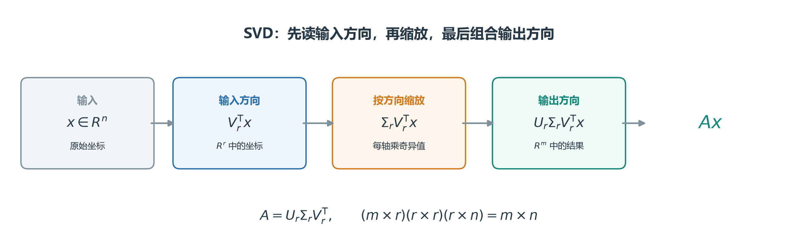

# [AI入门-线性代数]3.行列式、特征分解与奇异值分解

矩阵能够把一个向量映射到另一个向量。接下来要问的是：变换保留了多少方向？哪些方向只会被拉伸或反向？如果矩阵不是方阵，还能怎样分解？行列式、特征分解与奇异值分解分别从这些角度描述矩阵的结构。原课程最后把这些工具接到主成分分析和离散动力系统，本文也按这个顺序说明它们的关系。

## 1 像、秩与奇异性：变换保留多少方向

看一个矩阵能否把所有可能的输出都造出来，比只看它“有几行几列”更有用。例如一个二维到二维的变换若把整个平面压到横轴上，输出的纵坐标永远为零，原输入中的一部分信息便丢失了。对 $A\in\mathbb R^{m\times n}$，矩阵与向量相乘得到 $y=Ax\in\mathbb R^m$。当 $x$ 取遍所有输入时，能得到的全部输出构成矩阵的**像**（image），也叫**列空间**：

$$
\operatorname{Im}(A)=\{Ax:x\in\mathbb R^n\}
=\operatorname{span}\{a_1,\ldots,a_n\},
$$

其中 $a_j$ 是 $A$ 的第 $j$ 列，$\operatorname{span}$ 表示所有线性组合的集合。等号成立是因为 $Ax=x_1a_1+\cdots+x_na_n$：输入坐标 $x_j$ 决定第 $j$ 列贡献多少，所有贡献相加得到输出。因此，像空间就是这些列能够合成的全部输出。

**秩就是像空间中独立方向的数量**：$\operatorname{rank}(A)=\dim\operatorname{Im}(A)$。例如

$$
A=\begin{bmatrix}1&1\\0&0\end{bmatrix},
\qquad
Ax=\begin{bmatrix}x_1+x_2\\0\end{bmatrix}.
$$

输入覆盖整个平面，输出却只能落在横轴上，所以像是一条直线、秩为 1。取 $h=(1,-1)^{\mathsf T}$ 有 $Ah=0$；沿这个方向改动输入，输出保持不变。这是方阵**奇异**时无法唯一恢复输入的具体表现。若 $n\times n$ 方阵秩为 $n$，它的像覆盖整个 $\mathbb R^n$，且没有非零输入被压成零，因而可逆。反过来，若有非零 $h$ 使 $Ah=0$，那么 $Ax=A(x+h)$，同一输出至少对应两个输入。

这里讨论的是 $x\mapsto Ax$ 作用于向量的结果。将同一个向量改用另一组基来写坐标属于“换基”；两者都用矩阵，但问题不同。下面的行列式先研究**方阵变换**如何改变空间的面积或体积。

## 2 行列式：面积、体积与可逆性的数值

### 2.1 二阶行列式计算有向面积

如果地图中的一个单位小方格经过变换后变成面积为两倍的平行四边形，变换就在局部把面积放大了两倍。**行列式**记录这种面积缩放，同时用正负号记录方向是否翻转。二阶矩阵 $A=\begin{bmatrix}a&b\\c&d\end{bmatrix}$ 的两列，是平面中两个标准基向量变换后的去向。它们围成的平行四边形面积为 $|ad-bc|$，因此定义

$$
\det(A)=ad-bc.
$$

$|\det(A)|$ 是面积的缩放倍数，符号记录两个列向量的取向是否反转。若 $\det(A)=0$，两列落在同一直线上，原本有面积的单位方块被压成线段或点；矩阵便丢失一个方向、不可逆。对于 $A=\begin{bmatrix}a&b\\c&d\end{bmatrix}$，逆矩阵要以 $ad-bc=\det(A)$ 为分母；行列式为零时，该公式无法把输出唯一还原为输入。

例如 $A=\begin{bmatrix}2&1\\0&1\end{bmatrix}$ 把单位方块变成以 $(2,0)^{\mathsf T}$、$(1,1)^{\mathsf T}$ 为边的平行四边形，面积为 $\det(A)=2$。图中把变换前后放在同一坐标尺度下：

如果把一个基方向反过来，如 $A=\operatorname{diag}(-1,1)$，方块面积仍为 1，但 $\det(A)=-1$，表示取向翻转。对于 $n\times n$ 方阵，$|\det(A)|$ 相应地表示 $n$ 维体积的缩放倍数；行列式只对方阵定义，矩形矩阵保留多少维则继续看秩。

### 2.2 复合变换与行变换怎样改变行列式

先做 $B$、后做 $A$ 的复合矩阵是 $AB$。空间体积先按 $|\det(B)|$ 缩放，再按 $|\det(A)|$ 缩放，取向也相应相乘，因此

$$
\det(AB)=\det(A)\det(B).
$$

单位矩阵保持原样，$\det(I_n)=1$。若 $A$ 可逆，$AA^{-1}=I_n$ 给出

$$
\det(A^{-1})=\frac{1}{\det(A)}.
$$

可逆性因此等价于 $\det(A)\ne0$。这是**精确数学中的判别**；在浮点计算中，单凭行列式数值小就断言“接近奇异”并不可靠。比如 $\operatorname{diag}(10^{-8},10^{-8})$ 的行列式为 $10^{-16}$，它只是整体缩小了平面，两个方向缩放相同；衡量不同方向缩放差异还需要看条件数或奇异值。

解方程组时可以交换两行、用非零数缩放一行，或给一行加上另一行的倍数，把矩阵化成容易回代的阶梯形。这些行变换都保留秩，因此不会改变独立约束的数量；但对行列式的数值影响不同：

| 行变换 | 行列式如何变化 |
|---|---|
| 交换两行 | 变号 |
| 一行乘以非零常数 $\lambda$ | 乘以 $\lambda$ |
| 一行加上另一行的若干倍 | 不变 |

所以可通过消元把方阵化为三角形矩阵，同时记录交换与缩放；三角形矩阵的行列式就是主对角线元素的乘积。三阶行列式的“画对角线”口诀只适用于 $3\times3$，不适合作为一般算法。数值计算中若行列式的绝对值可能极大或极小，可用 [NumPy 的 slogdet](https://numpy.org/doc/stable/reference/generated/numpy.linalg.slogdet.html) 分别取得符号和绝对值的对数；这仍不能替代对数值稳定性的判断。

## 3 张成、线性无关、基与维数

前一节用矩阵的列向量描述面积，接下来需要明确：哪些列真正提供了新的方向？两支不平行的二维箭头可以伸缩、相加，抵达平面上的任意点；若两支箭头完全平行，无论怎样相加，都只能留在一条线上。给定一组向量 $v_1,\ldots,v_k$，它们的**张成空间**是所有形如 $c_1v_1+\cdots+c_kv_k$ 的向量，其中 $c_i$ 可取任意实数。张成回答“这组向量能生成哪些结果”。

若 $c_1v_1+\cdots+c_kv_k=0$ 只有 $c_1=\cdots=c_k=0$ 一种做法，这组向量就**线性无关**；存在非零系数组合得到零时，其中至少一个方向是冗余的。把 $v_i$ 排成矩阵 $A$ 的列，系数排成 $c$，便得到齐次方程 $Ac=0$；它存在非零解，就说明有一列可由其他列的组合抵消。

一组向量要成为空间 $V$ 的**基**，必须同时张成整个 $V$，且自身线性无关。二维平面中的 $(1,0)^{\mathsf T}$、$(0,1)^{\mathsf T}$ 是标准基；$(1,1)^{\mathsf T}$、$(1,-1)^{\mathsf T}$ 也是一组基。后一组不是标准基，却一样能让每个平面向量获得唯一的两个坐标。再加入第三个向量，虽然仍能张成平面，却产生冗余，三者便不再是一组基。

有限维空间的任意两组基包含相同数量的向量，这个数量称为**维数**。一条过原点的直线维数为 1，平面维数为 2。矩阵的秩为 $r$，也就意味着它的像空间需要 $r$ 个基向量来描述。标准基向量 $e_j$ 只有第 $j$ 个分量为 1、其余为 0，因此矩阵乘法 $Ae_j$ 恰好选出 $A$ 的第 $j$ 列；知道变换怎样作用于每个标准基，就能确定整个矩阵。下文的特征分解则寻找另一组基，让矩阵在这些方向上的作用变成简单的缩放。

## 4 特征值与特征向量：不偏离原直线的方向

如果同一个变换要对数据反复执行，逐次计算整个矩阵很难看出长期趋势。找出那些经变换后仍留在原来直线上的方向，就可以把它们的变化简化成“每次乘一个数”。一般向量经过 $A$ 后可能改变方向。但某些非零向量 $v$ 会满足

$$
Av=\lambda v,
\qquad v\ne0.
$$

$v$ 称为**特征向量**，$\lambda$ 称为对应的**特征值**。在这条特殊方向上，矩阵只把向量乘上一个数：$\lambda=2$ 时长度加倍，$0<\lambda<1$ 时缩短，$\lambda<0$ 时还反向；$\lambda=0$ 则把该方向压成零，矩阵必定奇异。零向量不能作为特征向量，因为它对任意 $\lambda$ 都满足等式，无法指出特殊方向。

用前面的方阵

$$
A=\begin{bmatrix}2&1\\0&1\end{bmatrix}
$$

观察：$v_1=(1,0)^{\mathsf T}$ 满足 $Av_1=2v_1$；$v_2=(-1,1)^{\mathsf T}$ 满足 $Av_2=v_2$。而普通向量 $x=(1,1)^{\mathsf T}$ 被送到 $(3,1)^{\mathsf T}$，不再落在原方向上。图中把两种情况并列：

对固定的 $\lambda$，所有满足 $(A-\lambda I)v=0$ 的向量构成**特征空间** $E_\lambda=\ker(A-\lambda I)$；其中的非零向量才是特征向量。同一特征空间里的无穷多个非零倍数只描述有限个独立方向，因此研究它的维数比数“有几个特征向量”更有用。

## 5 特征方程与特征空间的求法

要找出未知的 $\lambda$，先把 $Av=\lambda v$ 改写为

$$
(A-\lambda I)v=0.
$$

右端为零的方程组始终有零解；我们还需要非零解，才能得到特征方向。对方阵，这要求 $A-\lambda I$ 奇异，即

$$
\det(A-\lambda I)=0.
$$

左端是关于 $\lambda$ 的**特征多项式**。因此，“求特征值”是在寻找哪些 $\lambda$ 会让 $A-\lambda I$ 丢失方向；找到特征值后，还必须求相应的零空间，才能知道这些方向具体是什么。完整步骤是：

1. 由 $\det(A-\lambda I)=0$ 找到候选特征值；
2. 对每个候选值，将其代入 $(A-\lambda I)v=0$；
3. 解出零空间的一组基，取其中的非零向量作为特征方向。

例如上节的 $A$ 满足

$$
\det(A-\lambda I)
=\det\begin{bmatrix}2-\lambda&1\\0&1-\lambda\end{bmatrix}
=(2-\lambda)(1-\lambda).
$$

根为 $\lambda_1=2$ 和 $\lambda_2=1$。代入 $\lambda_1=2$ 时，方程 $v_2=0$，所以特征空间由 $(1,0)^{\mathsf T}$ 张成；代入 $\lambda_2=1$ 时，方程 $v_1+v_2=0$，特征空间由 $(-1,1)^{\mathsf T}$ 张成。这也核对了图中的两个方向。

手算二阶矩阵时，特征多项式很方便；大矩阵的浮点计算通常调用针对矩阵结构设计的数值例程，不靠手工展开多项式。实矩阵的特征值也可能是复数：平面旋转 $90^\circ$ 的矩阵在实数平面里没有任何不变的直线，所以没有实特征向量。对协方差矩阵这类**实对称矩阵**，特征值必为实数；[NumPy 的 eigh 文档](https://numpy.org/doc/stable/reference/generated/numpy.linalg.eigh.html)提供相应的专用求解接口。

## 6 特征基、重数与对角化

### 6.1 一组完整的特征方向让重复变换变简单

若 $n\times n$ 矩阵 $A$ 有 $n$ 个线性无关的特征向量 $v_1,\ldots,v_n$，任意输入都能拆成这些特殊方向的组合。每个方向单独被放大或缩小，反复作用也只需把对应倍率连乘。这组方向构成**特征基**。把这些向量作为列组成 $P\in\mathbb R^{n\times n}$，把对应特征值放入对角矩阵 $D$，则

$$
P=\begin{bmatrix}v_1&\cdots&v_n\end{bmatrix},
\qquad
D=\operatorname{diag}(\lambda_1,\ldots,\lambda_n).
$$

按列计算 $AP$，第 $i$ 列是 $Av_i=\lambda_i v_i$；$PD$ 的第 $i$ 列也是它。因此 $AP=PD$。由于 $P$ 的列独立，$P$ 可逆，于是

$$
A=PDP^{-1}.
$$

这个表示称为**对角化**。它不是把原空间真的“改造成另一空间”：$P^{-1}x$ 先把同一个向量写成特征基下的坐标，$D$ 在各坐标上分别缩放，$P$ 再把结果写回原坐标。连续作用 $t$ 次时，相邻的 $P^{-1}P$ 抵消，所以对非负整数 $t$，

$$
A^t=PD^tP^{-1},
\qquad
D^t=\operatorname{diag}(\lambda_1^t,\ldots,\lambda_n^t).
$$

上节的 $A=\begin{bmatrix}2&1\\0&1\end{bmatrix}$ 有特征方向 $v_1=(1,0)^{\mathsf T}$、$v_2=(-1,1)^{\mathsf T}$，其倍率分别为 2 和 1。输入 $x=(1,1)^{\mathsf T}=2v_1+v_2$，作用两次后变成 $A^2x=2\cdot2^2v_1+1^2v_2=(7,1)^{\mathsf T}$。这说明无需对原矩阵连乘两次，也能直接看出沿第一特征方向的部分增长得快、沿第二方向的部分保持不变；长期状态分析正是利用这一点。

### 6.2 重复特征值未必给出足够多的方向

一个特征值作为特征多项式的根重复几次，称为它的**代数重数**；其特征空间的维数称为**几何重数**。几何重数不超过代数重数。若所有特征空间维数之和不足 $n$，便找不齐一组特征基，矩阵不能按上式对角化。

例如

$$
J=\begin{bmatrix}1&1\\0&1\end{bmatrix}
$$

的特征多项式为 $(1-\lambda)^2$，特征值 1 的代数重数为 2；但 $(J-I)v=0$ 只要求 $v_2=0$，特征空间只有由 $(1,0)^{\mathsf T}$ 张成的一维，故 $J$ 无法对角化。相比之下，单位矩阵 $I_2$ 的特征值 1 也重复两次，却有整个二维空间作为特征空间；“根重复”本身并不能判定是否可对角化。

**实对称矩阵**有更强的保证：总能选择两两正交、长度为 1 的特征向量组成矩阵 $Q$，从而写成

$$
A=Q\Lambda Q^{\mathsf T},
\qquad Q^{\mathsf T}Q=I.
$$

$Q^{\mathsf T}=Q^{-1}$，因此求不同方向的坐标只需转置。协方差矩阵正好是实对称矩阵，这让 PCA 能得到彼此正交的主成分。普通实方阵可能没有实特征值，也可能因独立特征方向不足而不能对角化；后面的奇异值分解则适用于任意实矩阵。

## 7 正交投影：在少数方向上保留坐标

假设一条二维轨迹的点大多沿一条斜线分布，存储每个点仍要两个坐标。如果只保留它在斜线上的位置，就能用一个数近似记录这个点。**投影**要解决的正是“选定一条方向后，怎样从原坐标取得沿该方向的坐标”。这里先假定方向已经选好；后面的 PCA 再解决“方向该怎么选”。

把原点到点的向量记为 $x$，把斜线方向记为长度为 1 的向量 $v$。$x$ 沿 $v$ 的带符号距离是

$$
z=v^{\mathsf T}x.
$$

把这个坐标重新画回原空间，得到**正交投影向量**

$$
\hat x=zv=vv^{\mathsf T}x.
$$

$v^{\mathsf T}x$ 是点积；因为 $v$ 长度为 1，$z$ 才直接表示沿这条线走了多远。$z>0$ 表示顺着 $v$，$z<0$ 表示反向。把 $z$ 乘回 $v$ 得到线上的点 $\hat x$。压缩时保存一个数 $z$；需要近似还原原坐标时，使用有 $n$ 个分量的 $\hat x$。

走一遍斜线上的投影：取 $x=(3,1)^{\mathsf T}$，方向 $v=(1/\sqrt2,1/\sqrt2)^{\mathsf T}$，即向右上方 $45^\circ$，长度为 1。那么

$$
z=v^{\mathsf T}x=\frac{3+1}{\sqrt2}=2\sqrt2,
\qquad
\hat x=zv=(2,2)^{\mathsf T},
\qquad
x-\hat x=(1,-1)^{\mathsf T}.
$$

点 $(3,1)$ 不在对角线上，$(2,2)$ 是线上离它最近的点。丢掉的 $(1,-1)$ 与斜线垂直，因为 $(1,-1)\cdot v=0$；**正交**就是夹角为 $90^\circ$。这条垂直残差的长度是 $\sqrt2$，表示只存沿线坐标造成的重建误差有多大。若 $v$ 没有归一化，直接算 $v^{\mathsf T}x$ 就不能把它当成沿线距离；必须除以 $v^{\mathsf T}v$ 才能得到沿 $v$ 的系数。

若需要保留 $k$ 个方向，把它们排列成 $V=[v_1,\ldots,v_k]\in\mathbb R^{n\times k}$，要求 $V^{\mathsf T}V=I_k$，即每列长为 1 且不同列彼此正交。于是

$$
z=V^{\mathsf T}x\in\mathbb R^k,
\qquad
\hat x=Vz=VV^{\mathsf T}x\in\mathbb R^n.
$$

$z$ 的每个数记录原向量沿一个保留方向的位置，$VV^{\mathsf T}$ 把这些位置组合成离 $x$ 最近的保留空间内的向量。残差 $x-\hat x$ 与每个保留方向都垂直。条件 $V^{\mathsf T}V=I_k$ 很关键：只把各列分别归一化，但让它们互相倾斜时，上式不能直接用；方向间的重复会导致坐标被重复计算。PCA 使用数据的方差选择这些保留方向。

## 8 协方差矩阵：记录数据沿各方向的变化

上一节处理一个点；现在要从一批点里找出值得保留的方向。直观上，如果散点图沿右上方伸展，那么两个坐标往往一起增大，右上方向就比垂直于它的方向更能代表这批数据。**协方差矩阵**把“每个特征变化多大、两种特征是否一起变化”记录下来，供下一节选择方向。

假设数据矩阵 $X\in\mathbb R^{N\times n}$ 有 $N\ge2$ 条样本、每条样本有 $n$ 个特征，并且**每行是一条样本**。先对每列求均值 $\mu\in\mathbb R^n$，再从每条样本中减去它，得到中心化数据

$$
X_c=X-\mathbf 1_N\mu^{\mathsf T}
\in\mathbb R^{N\times n}.
$$

$\mathbf 1_N$ 是长度为 $N$ 的全 1 列向量；$X_c$ 每列的平均数为 0。中心化让后面的投影描述“相对于数据中心的变化”，而不把数据整体位置误当作主要变化方向。

对第 $i$ 个和第 $j$ 个特征，把每条样本相对均值的两个偏差相乘，再对样本汇总，得到**样本协方差**。全部 $n^2$ 个结果组成

$$
C=\frac{1}{N-1}X_c^{\mathsf T}X_c
\in\mathbb R^{n\times n},
\qquad
C_{ij}=\frac{1}{N-1}
\sum_{s=1}^{N}(x_{s i}-\mu_i)(x_{s j}-\mu_j).
$$

$x_{s i}$ 是第 $s$ 条样本的第 $i$ 个特征，$\mu_i$ 是该特征的样本均值；$N-1$ 是样本协方差采用的分母。换用 $N$ 会整体缩放 $C$，不会改变它的特征方向。对于两个特征，矩阵要明确写成

$$
C=
\begin{bmatrix}
\operatorname{Var}(x_1)&\operatorname{Cov}(x_1,x_2)\\
\operatorname{Cov}(x_2,x_1)&\operatorname{Var}(x_2)
\end{bmatrix}.
$$

左上和右下是各特征自身的变化程度；其余两格是它们共同变化的程度。两格相等，所以 $C$ 关于主对角线对称。协方差为正，通常表示一个特征高于均值时另一个也高于均值；为负则常常一高一低；接近零只说明线性共同变化弱，不能断言二者毫无关系。

例如三条二维样本依次是 $(0,0)$、$(1,2)$、$(2,1)$。两列均值都是 1，逐行减去均值得到

$$
X=
\begin{bmatrix}0&0\\1&2\\2&1\end{bmatrix},
\quad
\mu=(1,1)^{\mathsf T},
\quad
X_c=
\begin{bmatrix}-1&-1\\0&1\\1&0\end{bmatrix}.
$$

第一列偏差的平方和是 $(-1)^2+0^2+1^2=2$，第二列也为 2；两列偏差的乘积和是 $(-1)(-1)+0(1)+1(0)=1$。除以 $N-1=2$ 后，

$$
C=\frac12
\begin{bmatrix}2&1\\1&2\end{bmatrix}
=\begin{bmatrix}1&0.5\\0.5&1\end{bmatrix}.
$$

这串数字表示两个特征各有样本方差 1，且呈正向共同变化，协方差为 0.5；下一节就用这个矩阵找主要变化方向。协方差与相关系数更完整的统计含义留到概率统计篇；这里先把它当成“数据在哪些方向上展开”的记录。

更关键的是，任取单位方向 $v\in\mathbb R^n$，每条中心化样本在该方向上的坐标排成 $X_cv\in\mathbb R^N$，这些坐标的样本方差为

$$
\operatorname{Var}(X_cv)
=\frac{1}{N-1}\lVert X_cv\rVert_2^2
=v^{\mathsf T}Cv\ge0.
$$

因此 $C$ 是**半正定**的：任何方向上的方差都不会是负数；它的特征值也都非负。协方差还受特征单位和尺度影响，例如把某列由米改成毫米会改变该方向的方差。在选择主方向前，是否标准化特征应取决于这些单位差异是否具有实际意义。

## 9 PCA：保留最大方差的正交方向

### 9.1 从一个最佳方向推广到多个主成分

**主成分分析**（PCA）要解决的是：一条样本有很多特征时，能否换成较少的新坐标，并尽量保住样本间的主要差异。例如二维点云沿斜线铺开，保留“沿斜线走了多远”通常比只保留原来的横坐标更有效。PCA 选的是数据变化最大的方向；保留多个方向时，它们还须彼此正交，避免重复记录同一部分变化。

把它当作一次可操作的降维，按下面顺序做：

1. 将 $N$ 条样本排成 $X\in\mathbb R^{N\times n}$，每行一条，求每列均值 $\mu$，并得到中心化矩阵 $X_c$。均值要保存，因为重建时还要加回去。
2. 由 $C=X_c^{\mathsf T}X_c/(N-1)$ 算协方差矩阵，找出特征之间的共同变化。
3. 求 $C$ 的特征值和单位特征向量，按特征值**从大到小**排列。大的特征值表示相应方向上样本分布得更开。
4. 选择前 $k$ 个方向拼成 $V_k$。把 $X_c$ 投到这些方向，得到每条样本的新坐标 $Z=X_cV_k$；若要近似恢复原特征，再算 $\hat X=ZV_k^{\mathsf T}+\mathbf1_N\mu^{\mathsf T}$。

为什么第三步能找到“最分散的方向”？对单个单位方向 $v$，投影后的样本方差是 $v^{\mathsf T}Cv$。单位长度约束 $v^{\mathsf T}v=1$ 排除了靠随意放大 $v$ 来增大方差；这个量的最大值恰好是 $C$ 的最大特征值，达到最大值的 $v$ 是对应的特征向量。后续方向还要与已选方向垂直，因此依次选择较小的特征值对应方向。

这一选择可以直接从对称特征分解看出。令 $C=Q\Lambda Q^{\mathsf T}$，其中 $Q$ 的列是正交单位特征向量，$\Lambda$ 的对角线是相应特征值。把单位向量写成 $v=Qc$，$c$ 就是 $v$ 在这组特征基下的坐标；它满足 $\sum_i c_i^2=1$，并且

$$
v^{\mathsf T}Cv=\sum_{i=1}^{n}\lambda_i c_i^2.
$$

右端是用非负权重 $c_i^2$ 对各特征值求加权平均，最大不会超过最大的 $\lambda_i$；把全部权重放在最大特征值对应方向就达到上界。对每条中心化样本，正交投影还满足“原长度平方＝投影长度平方＋残差长度平方”。原数据的总长度平方固定，所以保留更多投影方差，也就是减少这一投影造成的平方重建误差。

下图中二维点云沿一条倾斜方向伸展。把点垂直投到这条主轴，保留下来的是沿主轴的坐标，灰色连线所表示的垂直残差被丢弃：

若 $C$ 的特征值从大到小为 $\lambda_1\ge\cdots\ge\lambda_n\ge0$，取前 $k$ 个对应的单位特征向量组成 $V_k\in\mathbb R^{n\times k}$，则低维数据与重建数据分别为

$$
Z=X_cV_k\in\mathbb R^{N\times k},
$$

$$
\hat X=ZV_k^{\mathsf T}+\mathbf 1_N\mu^{\mathsf T}
\in\mathbb R^{N\times n}.
$$

$Z$ 的一行是某条样本的 $k$ 个新坐标；重建时先把它放回原特征空间，再加回此前减掉的列均值。若所有特征的总方差 $\sum_i\lambda_i>0$，前 $k$ 个方向的**解释方差比**为

$$
\frac{\lambda_1+\cdots+\lambda_k}
{\lambda_1+\cdots+\lambda_n}.
$$

用上一节的三条样本实际走一次二维降到一维。它们的协方差矩阵为 $C=\begin{bmatrix}1&0.5\\0.5&1\end{bmatrix}$。$C$ 的两个单位特征方向分别是右上方的 $v_1=(1,1)^{\mathsf T}/\sqrt2$ 和右下方的 $v_2=(1,-1)^{\mathsf T}/\sqrt2$，对应特征值为 $1.5$ 和 $0.5$。因此选 $k=1$，保留变化较大的右上方向；它解释的方差比例为 $1.5/(1.5+0.5)=75\%$。

三条中心化样本投到 $v_1$ 后，原来的两列坐标变成一列：

$$
Z=X_cv_1=
\begin{bmatrix}
-\sqrt2\\1/\sqrt2\\1/\sqrt2
\end{bmatrix}
\in\mathbb R^{3\times1}.
$$

例如第二条原样本 $(1,2)$ 减去均值 $(1,1)$ 后是 $(0,1)$，新坐标为 $1/\sqrt2$。只用这个数重建，先得到中心化坐标 $(0.5,0.5)$，再加回均值，得到 $(1.5,1.5)$。它与原样本 $(1,2)$ 不完全重合：一维表示省掉了一个数字，同时舍弃了垂直于主方向的细节。第三条样本 $(2,1)$ 也被压成同一个新坐标 $1/\sqrt2$，说明投影不是可逆操作；两个原来不同的点可能在保留方向上具有相同坐标。

原课程字幕的一处公式总结写成“从小到大排序并保留前两个”，这与“保留最大方差”的目标相反。应当从**大到小**排序。还要注意：[NumPy 的 eigh](https://numpy.org/doc/stable/reference/generated/numpy.linalg.eigh.html)把实对称矩阵的特征值按**升序**返回；手动实现 PCA 时，需要在选前 $k$ 个方向之前改变顺序。

### 9.2 最大方差准则的数学边界

PCA 的数学目标只包含 $X$，不包含类别标签或预测目标。它保证所选线性子空间尽量保留样本方差、尽量减小正交投影的平方重建误差，却不保证这个子空间对另一个任务最有用。某个方差很小的方向仍可能恰好区分两个类别。因此“解释方差比高”是关于数据几何形状的结论，不是关于分类或回归效果的结论。

到这里，PCA 在本篇中的任务已经完成：用二维降到一维的例子说明投影、协方差和特征分解怎样连接起来。高维图像怎样变成低维编码、怎样选择成分数并验证实际效果，归入机器学习应用部分。下面继续解释实际 PCA 求解中常用的另一项线性代数工具——奇异值分解。

## 10 奇异值分解：为矩形矩阵寻找输入与输出方向

### 10.1 任意矩阵都能分成三个有明确作用的部分

图片可以从二维像素阵列压缩为少量方向，矩形数据表也可以从许多列变成少量有效特征。这里需要一种能描述“输入的哪个方向起作用、作用有多强、输出落到哪里”的分解。特征分解要求矩阵是方阵；一般矩阵还可能缺少足够的特征向量。**奇异值分解**（SVD）直接适用于任意实矩阵 $A\in\mathbb R^{m\times n}$。设其秩为 $r$，则可写成紧致形式

$$
A=U_r\Sigma_rV_r^{\mathsf T}.
$$

$U_r\in\mathbb R^{m\times r}$ 的列是输出空间中的正交单位方向，$V_r\in\mathbb R^{n\times r}$ 的列是输入空间中的正交单位方向；$\Sigma_r\in\mathbb R^{r\times r}$ 是对角矩阵，对角线上有 $r$ 个正数 $\sigma_1\ge\cdots\ge\sigma_r>0$，称为**奇异值**。两组方向各自满足 $U_r^{\mathsf T}U_r=I_r$、$V_r^{\mathsf T}V_r=I_r$。

对输入 $x$ 计算 $Ax$，可以按式子从右向左理解为三个动作：

1. $V_r^{\mathsf T}x\in\mathbb R^r$ 取出输入在各个重要方向上的坐标；
2. $\Sigma_r$ 把第 $i$ 个坐标乘以 $\sigma_i$；
3. $U_r$ 用输出空间中的方向组合出最终 $m$ 维向量。

例如 $A=\begin{bmatrix}3&0&0\\0&1&0\end{bmatrix}\in\mathbb R^{2\times3}$ 把三维输入变为二维输出。输入 $x=(2,4,5)^{\mathsf T}$ 时，输出 $Ax=(6,4)^{\mathsf T}$：第一个数放大 3 倍，第二个保留，第三个数 5 在输出里完全找不到。这里输入与输出的坐标轴恰好就是奇异方向，两个正奇异值为 3 和 1，秩为 2。若奇异值很小，某个输入方向的变化在输出中就很难辨认；逆向恢复输入时，输出的一点误差可能变成该方向的大误差。这解释了第 2 节为什么不能只凭行列式大小判断数值稳定性。

### 10.2 特征值、低秩近似与 PCA 的连接

从 SVD 计算

$$
A^{\mathsf T}A
=V_r\Sigma_r^2V_r^{\mathsf T}.
$$

所以 $V_r$ 的列是 $A^{\mathsf T}A$ 对应非零特征值的特征向量，特征值是 $\sigma_i^2$；$U_r$ 的列相应是 $AA^{\mathsf T}$ 的特征向量。SVD 也能逐项写成

$$
A=\sum_{i=1}^{r}\sigma_i u_i v_i^{\mathsf T}.
$$

每一项都是一个秩为 1 的矩阵，可以理解为“一条输入方向通过 $A$ 影响一条输出方向”。只保留前 $k<r$ 项，便得到一个秩不超过 $k$ 的近似矩阵。例如 $\operatorname{diag}(3,1)$ 有两项，若只留最大的那一项，就得到 $\operatorname{diag}(3,0)$：沿第一轴的作用保留，沿第二轴的作用被舍弃。它用更少的方向近似原矩阵，代价是丢失较弱方向上的细节；具体保留几个方向取决于可接受的误差。

把 $A$ 换为上一节的中心化数据 $X_c$，其协方差矩阵满足

$$
C=\frac{1}{N-1}X_c^{\mathsf T}X_c
=V_r\frac{\Sigma_r^2}{N-1}V_r^{\mathsf T}.
$$

因此 PCA 的主方向就是 $X_c$ 的**右奇异向量**；对应方差是 $\sigma_i^2/(N-1)$。理论上可以先构造 $C$ 再做对称特征分解，也可以直接分解 $X_c$。直接 SVD 避免显式形成 $X_c^{\mathsf T}X_c$；当特征数较少、样本很多时，先构造较小的协方差矩阵也可能高效。[scikit-learn 当前的求解器说明](https://scikit-learn.org/stable/modules/generated/sklearn.decomposition.PCA.html)同时列出了这些路径及其适用条件，不能概括为“现代 PCA 都直接用 SVD”。

[NumPy 的 svd 文档](https://numpy.org/doc/stable/reference/generated/numpy.linalg.svd.html)把二维矩阵的分解结果表示为 $U$、奇异值数组 $s$ 和 $V^{\mathsf T}$；当参数设为 `full_matrices=False` 时，它返回的是维度为 $\min(m,n)$ 的缩减形式，可能包含零奇异值。本节的 $r$ 则只计数**正奇异值**，所以矩阵秩不足时两种写法的列数会不同。

## 11 离散动力系统与稳态

特征方向还有一个用途：看一个系统按固定规则反复更新后会怎样变化。“离散”表示只观察第 $0,1,2,\ldots$ 步，例如每天结束时统计一次状态；它不要求时间或数值本身只能取整数。给定初态 $x_0$ 和固定方阵 $P$，每一步按

$$
x_{t+1}=Px_t,\qquad x_t=P^t x_0
$$

更新。$x_t$ 是第 $t$ 步的状态，$P$ 是每一步都使用的更新规则，$P^t$ 表示重复作用 $t$ 次。如果 $P$ 可对角化，初态可分解到不同特征方向上；第 $i$ 个方向经过 $t$ 步会乘上 $\lambda_i^t$。$|\lambda_i|<1$ 的分量逐渐衰减，$|\lambda_i|>1$ 的分量增长；负特征值还会使符号交替。实际极限是否存在，仍取决于矩阵结构和初态，并不能只看有没有一个特征值等于 1。

一种常见的特殊情形是**马尔可夫链**：系统可以处于若干状态，下一步处于哪个状态的概率只取决于**当前状态**，而不再单独取决于更早的经历。例如把设备粗分为“正常”和“故障”，用当前状态预测明天的状态。这个“只看当前”的假设要由具体问题判断；若设备已连续高温运行的天数也会影响故障率，只用“正常/故障”两个状态就可能丢掉重要信息。

用**列向量** $p_t$ 记录各状态在第 $t$ 步的概率：第 $j$ 个分量 $p_{t,j}$ 是当前处于状态 $j$ 的概率，各分量非负且和为 1。这里采用的**马尔可夫矩阵**（状态转移矩阵）$P$ 满足

$$
P_{ij}=\Pr(\text{下一步为状态 }i\mid\text{当前为状态 }j),
\qquad
P_{ij}\ge0,\quad \sum_iP_{ij}=1.
$$

因此，**第 $j$ 列写的是“当前在状态 $j$ 时，下一步到各状态的概率”**；一列之和为 1。更新公式 $p_{t+1}=Pp_t$ 是把“从每个当前状态出发、分别到达目标状态的概率”加起来。如果资料把概率排成**行向量**，转移矩阵通常改成**每行**和为 1，写法是 $p_{t+1}^{\mathsf T}=p_t^{\mathsf T}P^{\mathsf T}$；两种记法描述同一件事，不能把它们的乘法方向混用。

仍以两个状态为例，考虑

$$
P=\begin{bmatrix}0.9&0.2\\0.1&0.8\end{bmatrix}.
$$

把状态 1 看成“正常”、状态 2 看成“故障”。第一列 $(0.9,0.1)^{\mathsf T}$ 表示今天正常时，明天仍正常的概率是 0.9、变为故障的概率是 0.1；第二列 $(0.2,0.8)^{\mathsf T}$ 表示今天故障时，明天恢复正常的概率是 0.2、仍故障的概率是 0.8。若历史记录中有 100 次“今天正常”的观察，其中 90 次明天仍正常、10 次明天故障，就可以把第一列暂时估计为 $(0.9,0.1)^{\mathsf T}$；第二列要单独从“今天故障”的记录估计。矩阵两列分别和为 1，因此更新后仍得到合法的概率分布。

若起初确定设备正常，$p_0=(1,0)^{\mathsf T}$，明天的分布是 $p_1=Pp_0=(0.9,0.1)^{\mathsf T}$。后天正常的概率要把两条路径相加：今天正常、明天仍正常、后天正常贡献 $0.9\times0.9=0.81$；明天故障、后天恢复贡献 $0.1\times0.2=0.02$，总计 $0.83$。所以 $p_2=Pp_1=(0.83,0.17)^{\mathsf T}$。$p_2$ 给的是**两步后的预测概率**，并不是说单台设备有“0.83 台”正常；对许多条件相同的设备，它也可解释为预期约有 83% 处于正常状态。

如果某个概率分布更新后完全不变，就称为**稳态分布** $\pi$。它满足 $P\pi=\pi$、各分量非负且总和为 1。对上面的矩阵，第一行给出 $0.9\pi_1+0.2\pi_2=\pi_1$，即 $0.1\pi_1=0.2\pi_2$；再结合 $\pi_1+\pi_2=1$，得到

$$
\pi=\begin{bmatrix}2/3\\1/3\end{bmatrix}.
$$

意思是：若状态比例已达到约 2/3 正常、1/3 故障，下一次仍是这个比例。它不是说某台设备会固定为正常或故障。$P\pi=\pi$ 也正是“$\pi$ 是特征值 1 的特征向量”；概率和为 1 给它选定了可解释的大小。这里另一个特征值为 0.7，所以从其他初态出发时，偏离稳态的部分每步变为原来的 0.7 倍：它控制**靠近稳态的速度**，而特征值 1 控制**稳态本身**。

实际使用时，先用观察数据估计转移概率，再根据当前状态分布计算 $Pp_t$ 或 $P^kp_t$，预测下一步或 $k$ 步后的状态占比。设备维护可以据此估计未来故障占比；用户活跃/流失状态、天气状态或网页间的随机跳转也能用同样的状态转移思路建模。要把稳态用于长期资源规划，还应检查转移概率在研究时段内是否足够稳定，以及所选状态是否保留了影响下一步的重要信息。

最后，**有稳态不等于一定会收敛到稳态**。例如 $P=\begin{bmatrix}0&1\\1&0\end{bmatrix}$ 有稳态 $(1/2,1/2)^{\mathsf T}$，但从 $(1,0)^{\mathsf T}$ 出发会在两个状态间反复交替。对有限状态马尔可夫链，如果各状态之间最终都能相互到达（**不可约**），且转移不会被固定周期困住（**非周期**），那么从任意初始概率分布都会收敛到唯一稳态。上面的设备例子各项转移概率都大于零，满足这些条件；交替矩阵则卡在两步一循环中。这也是为什么做长期预测时，不能只求出 $P\pi=\pi$ 就停下，还要看系统是否真的会靠近它。
