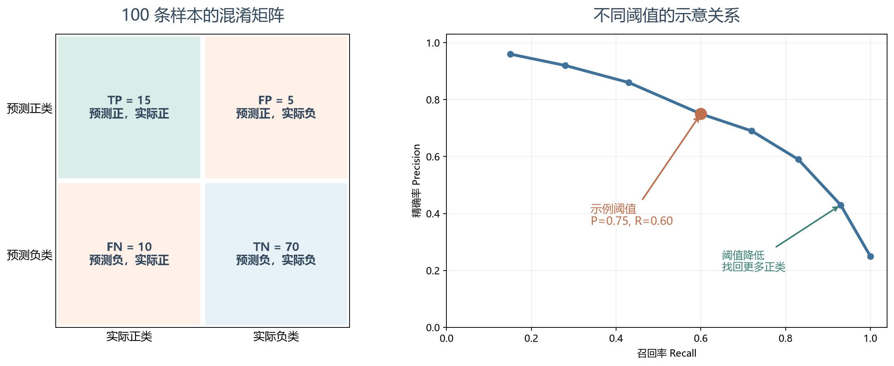
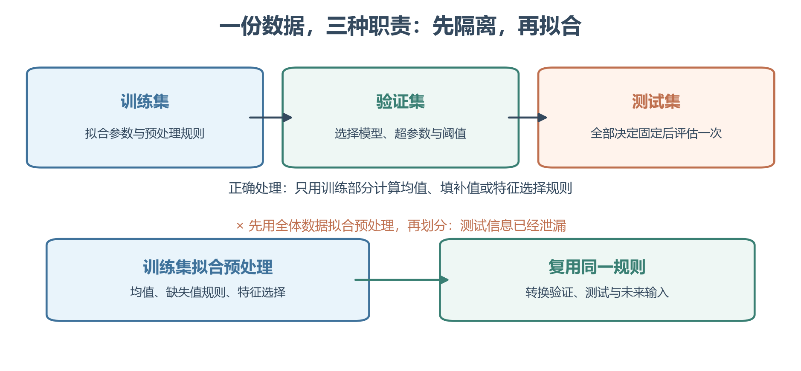
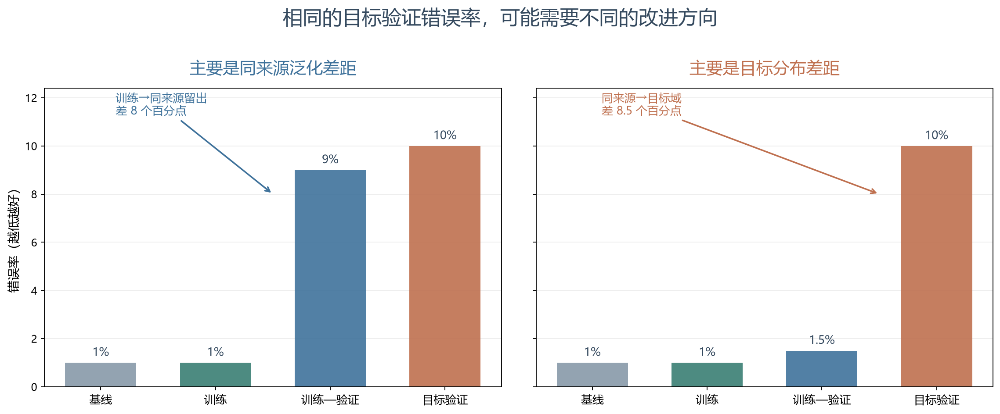
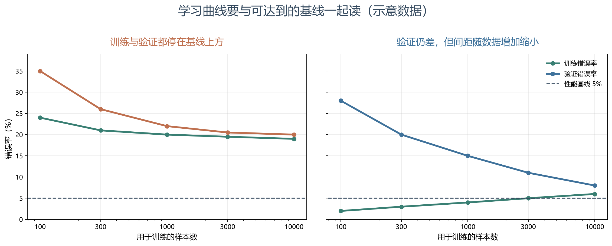

# [AI基础-机器学习]1.数据划分、模型评估与项目诊断

拿到一批数据之后，先选模型结构并不能保证解决问题。我们得先说清：模型接收什么输入、输出用于什么决定、哪些数据代表未来会遇到的情况，以及“好”要用什么指标衡量。然后才能判断一次训练结果究竟是模型没学会、只记住了训练样本，还是评价目标本身设错了。本篇依照课程从任务、评价到项目诊断的顺序，把几组课程中重复的训练集划分、偏差—方差和错误分析合并讲清。

## 1 从任务与样本开始：模型到底要学什么

**机器学习**让系统利用数据中的经验改善一个明确任务的表现。经验并非单纯指样本数量：标签是否可靠、样本是否覆盖部署场景、最终能否处理未见输入，都决定这种学习有没有价值。

在**监督学习**中，一条样本是输入与目标输出的配对 $(x^{(i)},y^{(i)})$。若有 $m$ 条样本，可记为

$$
\mathcal D=\{(x^{(i)},y^{(i)})\}_{i=1}^{m},
\qquad
\hat y^{(i)}=f_\theta(x^{(i)}).
$$

$x^{(i)}$ 是第 $i$ 条输入，$y^{(i)}$ 是希望预测的标签，$\theta$ 是模型从训练数据中学到的参数，$\hat y^{(i)}$ 是预测。若每条输入有 $d$ 个数值特征，批量存放通常写成 $X\in\mathbb R^{m\times d}$：**第一维是样本，第二维是特征**。以一个线性预测层为例，权重 $w\in\mathbb R^{d\times1}$，则 $Xw$ 的形状为 $(m\times d)(d\times1)=m\times1$；第 $i$ 个输出只由 $X$ 的第 $i$ 行与同一组权重相乘得到。比如两套房的特征分别是“面积、卧室数”，可排成 $X=\begin{bmatrix}50&2\\80&3\end{bmatrix}$；若示意权重为 $w=(1,10)^{\mathsf T}$，两条预测分别为 $50+2\cdot10=70$ 和 $80+3\cdot10=110$，所以 $Xw=(70,110)^{\mathsf T}$。权重第一项变大，会按各房面积改变预测；第二项变大，会按各房卧室数改变预测。矩阵乘法一次算出 $m$ 个样本的预测，既不会把不同样本相加，也不会输出 $d$ 个预测。课程中的一些神经网络推导把样本排成列，得到 $X_{\mathrm{course}}\in\mathbb R^{d\times m}$；这时相同运算写成 $w^\mathsf T X_{\mathrm{course}}\in\mathbb R^{1\times m}$，其转置对应这里的 $Xw$。两种写法只是样本摆放方向不同，不能在一个公式里暗中混用。

房屋面积预测价格属于**回归**：输出是有数值意义的连续量。邮件判为垃圾或正常属于**分类**：输出是有限类别。类别即使用 0、1 编码，也不会因为它们是数字就变成回归；判断任务类型要看输出的实际含义。分类模型还可能先给出分数或概率，再用决策阈值转换成类别，后文会说明这两步为什么要分开评价。

**无监督学习**的训练样本只有输入 $\{x^{(i)}\}_{i=1}^{m}$，没有逐条给定的目标 $y^{(i)}$。聚类寻找相似样本的分组，异常检测关注少见或偏离常态的输入，降维寻找较紧凑的表示。它们会在后续专题展开；这里需要先知道，任务、标签和最终用途决定了评估方式，不能拿“分类准确率”衡量一个尚未定义类别的聚类结果。

## 2 正交化与评价目标：先决定要朝哪里改进

项目里通常同时有四个问题：模型能否拟合训练数据；能否推广到新的目标样本；我们是否在反复试验中把验证数据也“用熟了”；离线分数提高后，产品是否真的受益。课程把尽量分清这些目标的做法称为**正交化**：一次改动要针对一个明确瓶颈，再用对照结果确认它是否奏效。它不是说每个操作只影响一个指标，而是避免同时更换数据、模型和评价规则后无法解释结果。

因此，**评价指标**和**评价数据**要一起确定。做垃圾邮件过滤时，漏掉垃圾邮件与误拦正常邮件代价不同；做医疗筛查时，漏诊可能更严重。一个总准确率无法自动表达这些差异。若有多个目标，可以指定一个主要优化指标，再设置必须满足的约束。例如“在延迟不超过 100 毫秒、严重漏检率低于指定上限时，尽量提高整体识别能力”。优化指标用于候选模型排序，约束则划出不可接受的方案。

评价规则应该在比较模型前确定。如果模型 A 的平均得分较好，但人工检查发现它在关键场景中大量失败，可能是当前指标给关键错误的权重太低，也可能是验证集里这些场景太少。可用按真实代价定义的加权错误率

$$
E_w=
\frac{\sum_{i=1}^{m}w_i\,\mathbf 1(\hat y^{(i)}\ne y^{(i)})}
{\sum_{i=1}^{m}w_i}.
$$

这里 $w_i\ge0$ 是第 $i$ 条样本所代表的预先定义的风险或价值，$\mathbf 1(\cdot)$ 在预测错误时为 1，否则为 0。若 100 条验证记录中有 99 条普通记录各取权重 1，另有 1 条高风险记录取权重 10；模型错了 9 条普通记录和这条高风险记录，普通错误率是 $10/100=10\%$，加权错误率则是 $(9+10)/(99+10)=19/109\approx17.4\%$。这个数提醒我们高风险错报不能在“大多数样本都对了”里被冲淡；但权重 10 必须反映事先明确的代价，不能为了让已喜欢的模型胜出而事后修改。还应在新数据上检验这种评价规则是否符合实际目标。

### 分类：先看混淆矩阵，再选阈值和汇总分数

二分类先约定哪一类是**正类**。以“垃圾邮件”为正类，把预测与真实标签交叉计数，得到一张**混淆矩阵**；先看清四格分别是谁，后面的指标就只是从表中取不同分母：

| 实际类别 / 预测类别 | 判为垃圾 | 判为正常 |
|---|---:|---:|
| 实际垃圾 | $TP=15$：找对 | $FN=10$：漏掉 |
| 实际正常 | $FP=5$：误拦 | $TN=70$：放行正确 |

这 100 封邮件中实际有 25 封垃圾邮件，模型说“垃圾”的有 20 封。真正例 $TP$ 是预测正、实际正；假正例 $FP$ 是预测正、实际负；假负例 $FN$ 是预测负、实际正；真负例 $TN$ 是预测负、实际负。于是

$$
\operatorname{Accuracy}=\frac{TP+TN}{TP+FP+FN+TN}=0.85,
$$

$$
\operatorname{Precision}=\frac{TP}{TP+FP}=0.75,\qquad
\operatorname{Recall}=\frac{TP}{TP+FN}=0.60.
$$

**精确率**回答“预测为正的有多少真是正类”，**召回率**回答“真实正类有多少被找出来”。两者的调和平均是

$$
F_1=\frac{2PR}{P+R}
=\frac{2TP}{2TP+FP+FN}
\approx0.667,
$$

其中 $P$、$R$ 分别为精确率和召回率。$F_1$ 会被较小的一项拉低，但它不使用 $TN$，也不表达不同错误的业务代价。若希望在同一类汇总指标里更强调召回，可用 $F_\beta=(1+\beta^2)PR/(\beta^2P+R)$，其中 $\beta>1$ 更重视召回；$\beta<1$ 更重视精确率。若正类只占 $0.5\%$，始终预测负类也有 $99.5\%$ 准确率，却完全找不到正类；这时应至少同时看混淆矩阵、召回与精确率。若从未预测正类，精确率分母为零，数学上未定义，软件可能按约定返回零。

若模型输出正类分数 $s(x)$，以阈值 $\tau$ 决策：$s(x)\ge\tau$ 判为正类。某封邮件的分数若为 0.6，阈值 0.5 会拦截它，阈值 0.7 则会放行；模型本身的分数没有变，变的是**如何用分数作决定**。如果它实际是垃圾邮件，提高阈值会多一个漏报；如果实际是正常邮件，提高阈值会少一个误拦。降低阈值通常找到更多正类，同时可能引入更多假正例；提高阈值通常更谨慎。扫描阈值得到**精确率—召回率曲线**（PR 曲线）；在有限样本上，精确率不必随阈值逐点单调变化。可事先规定“召回至少 95% 时尽量提高精确率”，或按误报、漏报的实际代价选阈值。阈值属于模型选择的一部分，应该在验证集或交叉验证预测上确定，不能在最终测试集上反复调。[scikit-learn 的阈值调优说明](https://scikit-learn.org/stable/modules/classification_threshold.html)（核查于 2026-09-23）也采用验证过程选择决策阈值。

把各阈值下的精确率与召回率连起来，就是 PR 曲线；其下面积称 **PR-AUC**（area under curve，曲线下面积）。另一条 **ROC 曲线**把召回率放在纵轴，把“实际负类中有多少被误判为正”即假正例率 $FP/(FP+TN)$ 放在横轴；上面邮件例子的一个工作点为召回率 $15/25=60\%$、假正例率 $5/75\approx6.7\%$。ROC-AUC 是扫描阈值后这条曲线下的面积。这些面积可比较分数对样本的整体排序能力，却不会自动给出部署时应采用的阈值。类别严重不平衡时尤其要关注任务所关心的正类行为；是否以 PR-AUC、ROC-AUC、$F_1$、校准程度或成本为主指标，仍取决于错误代价与使用场景。

回归任务的误差是数值差，可先看平均绝对误差 $\mathrm{MAE}=m^{-1}\sum_i|\hat y_i-y_i|$，或更强调大误差的均方根误差 $\mathrm{RMSE}=\sqrt{m^{-1}\sum_i(\hat y_i-y_i)^2}$。若三套房的预测误差是 $1,-2,3$ 万元，则 MAE 为 $(1+2+3)/3=2$ 万元，RMSE 为 $\sqrt{(1+4+9)/3}\approx2.16$ 万元；后者因平方而更在意 3 万元这笔较大的误差。两种指标的单位都与目标 $y$ 一样。

## 3 训练集、验证集与测试集：分别回答三个问题

**训练集**用于拟合模型参数 $\theta$；**验证集**（开发集，dev set）用于选择特征、模型结构、超参数、训练轮数与分类阈值；**测试集**用于所有选择结束后，估计这套已固定方案对未见样本的表现。想象有 1000 条独立且同来源的记录，暂分 800 条训练、100 条验证、100 条测试：先在 800 条上分别训练候选模型，在同一批 100 条验证记录上选模型和阈值，选定后才用最后 100 条报告一次最终表现。这个 800/100/100 只是说明职责的例子，实际比例要看样本量和少见类别。若看了测试分数又改阈值，最后 100 条也参与了“选哪个模型”；它给出的最终分数往往偏乐观。

划分比例不是定律。大数据集的验证和测试即使只占各 1%，也可能有足够多样本；少见但重要的故障、特定人群或高成本错误则可能需要更大的绝对样本量。验证集要足以区分候选方案，测试集要足以支持最终报告。验证集与测试集应代表**同一个目标分布**，例如真正上线后会遇到的用户、设备、时间和地区。训练集可以利用其他来源的数据，但不能让这种便利替代对目标域的评估。

有限测试集上的错误率仍是目标总体错误率的**估计**。若 $n$ 条独立测试样本中有 $k$ 条预测错，报告的是 $\hat p=k/n$；换一批测试样本，$k$ 和 $\hat p$ 可能改变。对二元“错或对”的结果，在适当抽样条件下，其标准误大约是 $\sqrt{\hat p(1-\hat p)/n}$。例如 100 条测试记录错了 10 条，错误率为 10%，估计标准误约为 $\sqrt{0.1\cdot0.9/100}=3$ 个百分点；这提示一次只差 1 个百分点的模型排序可能受抽样波动影响。两模型若在**同一批样本**上比较，还应看它们错的是不是同一批记录，不能简单把两个独立比例的误差相加。应结合样本量、区间和成对比较判断。置信区间的置信度描述构造方法在重复抽样中的覆盖率，并非固定区间内参数仍有某个随机概率。再窄的区间也无法补救测试数据与部署用户不一致，因此先保证目标分布的代表性。

划分单位要跟部署时的独立单位一致。同一患者的多张片子若同时出现在训练与测试中，模型可能识别患者或设备而非疾病；同一用户多条交易也有类似风险。未来预测任务通常要按时间留出后段数据，而不能把未来信息随机打散到训练集。[scikit-learn 交叉验证文档](https://scikit-learn.org/stable/modules/cross_validation.html)（核查于 2026-09-23）提供按组和按时间划分的方案，并指出普通随机折不适合有时间相关性的评估。

设目标是“根据过去交易预测用户下个月是否流失”。一条记录可以包含用户过去一个月的行为，标签来自再往后的一个月。若同一个用户在不同月份的记录跨越训练和测试，模型可能借助用户身份或高度相似的行为获得虚高分数；若把标签形成之后才知道的“最终取消日期”当作输入，更是直接泄漏答案。合理划分要先确定**做出预测的时刻**，再保证每条特征在那个时刻可用，并用按用户或按时间的留出方式检验未来场景。是否同时按用户和时间限制，取决于产品将面对的是老用户的新月份，还是从未见过的新用户。

**数据泄漏**是训练阶段使用了预测时本不应知道的信息。常见例子是先在全部数据上计算标准化均值、选择特征或填补缺失值，再切分训练与测试；此时测试数据已经影响这些处理步骤。应先划分，再只在训练部分拟合预处理规则，并把同一规则应用到验证、测试和未来输入。交叉验证时，每一折都要重新只在该折训练部分拟合预处理。[scikit-learn 的数据泄漏说明](https://scikit-learn.org/stable/common_pitfalls.html)（核查于 2026-09-23）明确建议先切分并用管道把训练折内的预处理与模型拟合绑定。

课程有时把一份留出的验证集叫作“cross-validation set”。这是旧课程中的命名习惯；严格地说，**交叉验证**通常指把可用于模型开发的数据分成 $K$ 折，轮流拿一折验证并汇总指标，单份固定验证集则是留出验证。样本很少时交叉验证有助于更充分利用数据，但整个交叉验证仍用于选模型，最终仍要独立测试。若样本无法代表部署分布，折数再多也不能修复评价方向。

训练时最小化的**目标函数**也不一定等于评价误差。例如加了正则化的训练目标可以是“平均预测损失＋参数惩罚”，而在训练、验证、测试上比较预测质量时，应使用相同的业务损失或指标，不把惩罚项当作一次真实预测错误。这一区别会在后续正则化文章细讲。

## 4 性能基线、Bayes 误差与可避免偏差

看到训练错误率为 8%，不能单凭“8% 很高”就说模型没学会。如果输入本身模糊、标签有歧义，或目标缺少决定性信息，最好的预测器也可能犯错。假如对某种完全相同的可见输入，真实标签仍有 70% 是正类、30% 是负类，那么只凭这些输入信息，最合理的固定类别判断是“正类”，但仍会错约 30%；把模型做得更复杂也无法从**没有提供的信息**中辨出剩余情况。给定可用输入信息时理论上最低的预期错误率称为 **Bayes 误差** $E_{\mathrm{Bayes}}$；它对不同输入的最低错误率按出现频率汇总，一般无法直接计算，需要合理的性能基线作近似参照。

对人类擅长、标签定义一致的图像或语音任务，可让合格专家按同一评价协议做题，估计人类水平。若想把它用作 Bayes 误差的代理，应尽量选可靠的高水平人类表现；若想判断产品是否胜过现有人工流程，则应比较实际流程中的人员和资源，两者目的不同。在广告点击、复杂风险预测等任务，人类可能没有有效直觉，现有系统或领域可信基线更适合用来诊断。模型超过已知人类表现后，不能再把该人类错误率当作严密的理论下界。

当指标是**越低越好的同一错误率**时，记训练错误率为 $E_{\mathrm{train}}$，合理基线错误率为 $E_{\mathrm{base}}$。差值

$$
E_{\mathrm{train}}-E_{\mathrm{base}}
$$

可当作**可避免偏差**的工程估计：模型在训练数据上距离可达到的表现还有多少。它不是无条件成立的数学恒等式；基线质量、标签噪声和有限样本都会影响判断。模型若记住有限训练样本，训练错误率甚至可能低于目标分布上的 Bayes 误差估计，不能据此推断自己突破了理论下限。若基线为 1%、训练误差 8%，有约 7 个百分点的训练拟合空间；若基线为 7.5%，同样的 8% 训练误差就不能再据此声称“高偏差”。

## 5 用误差差距区分拟合、泛化和分布不匹配

同一指标下，再记目标验证集错误率为 $E_{\mathrm{dev}}$。若训练与验证来自同一分布，$E_{\mathrm{dev}}-E_{\mathrm{train}}$ 可近似反映**泛化差距**：训练样本上表现好，新样本上明显变差，常称高方差或过拟合。训练误差远高于合理基线则常称高偏差或欠拟合。课程里这些名称是项目诊断用语，不等同于统计学中对预测量做严格的偏差—方差分解。

例如基线 1%、训练 8%、验证 10%，训练拟合缺口为 7 个百分点，泛化差距为 2 个百分点，优先考虑模型是否有足够信息与表达能力。若基线 1%、训练 1%、验证 10%，则先调查泛化差距、数据量、模型选择和验证数据质量。两种问题也可以同时存在；不要仅凭一个验证分数决定加模型还是加数据。

如果训练样本主要是清晰网页图片，而目标验证集是夜间手机拍摄图片，训练与验证的差距混合了“没参与训练”和“数据来源变了”两种因素。课程提出额外留出**训练—验证集**（training-dev set）：它与训练集同来源，但不参与模型拟合。此时可以依次比较：

| 要判断什么 | 比较哪些错误率 | 差距大通常提示什么 |
|---|---|---|
| 训练拟合缺口 | $E_{\mathrm{train}}-E_{\mathrm{base}}$ | 模型连训练数据都没有达到合理基线 |
| 同来源泛化差距 | $E_{\mathrm{train-dev}}-E_{\mathrm{train}}$ | 未参与拟合的同来源样本变难 |
| 目标分布差距 | $E_{\mathrm{dev}}-E_{\mathrm{train-dev}}$ | 目标场景和训练来源可能不同 |

例如训练错误率 1%、训练—验证 1.5%、目标验证 10%，更应先检查目标图像的光照、设备、标签规范等差异。若训练—验证已到 9%、目标验证 10%，即使两种图像有差别，同来源泛化也是主要瓶颈。图中的高度是用来提出下一步调查方向的**误差阶梯**，各段不必都是非负数；有限样本波动、任务难度与标注差异可能使简单相减失真。

“分布不匹配”不只指输入外观变化；目标人群、类别比例、标签定义和采集过程都可能改变。诊断时要先核对这些差异究竟来自真实部署条件，还是数据处理故障。

## 6 学习曲线与下一步行动

**学习曲线**把训练样本数放在横轴，观察相应的训练与验证误差。若数据增加后两条曲线接近，却都远高于合理基线，继续加同类数据通常难以解决训练拟合缺口。若训练误差很低、验证误差高，而且两者差距随样本增多而缩小，补充有代表性的训练数据可能有价值。图中的数字只是为了展示两种形状，真正的实验需要从同一训练来源取不同规模的子集，在固定目标验证集上比较；子集若恰好少了难样本，也会误导曲线。大模型可以先选少数规模点做粗略判断。

针对**训练拟合缺口**，可依次检查特征是否包含预测信息、优化是否真正收敛、模型表达能力是否足够、正则化是否过强。针对**同来源泛化差距**，可尝试更多代表性数据、合理的数据增强、正则化或降低不必要的模型自由度。针对**目标分布差距**，优先查目标域的采集与标签规则，定向收集或加权相关样本，并始终在目标域验证。这些是候选实验，不是只看差距就能保证奏效的处方。

若训练和验证都好、最终测试却明显变差，还应检查是否多次适配验证集、测试样本是否来自同一目标分布，以及差距是否只是有限样本波动。若离线测试也好、上线体验却差，优先检查指标是否代表真实价值、线上输入与测试数据是否一致。这两种情形不能继续简单归为“训练偏差”或“训练方差”。

经典教学图常把“模型越复杂，训练误差下降、验证误差先降后升”画成 U 形。这能帮助理解某些模型的过拟合，但不能当作所有现代网络的性能定律。过参数化模型在特定设置中还可能出现**双下降**：容量继续增大，测试误差在某段先升后降。[双下降原始论文](https://arxiv.org/abs/1812.11118)（核查于 2026-09-23）给出了这一现象。实际选模型仍以目标验证表现、成本与风险为准；不能仅凭参数数目断定结果。

## 7 人工错误分析与标签质量

一个模型在验证集上错了 10%，接下来该改哪些样本？**错误分析**从失败样本出发，记录真实标签、模型预测、必要时的分数，以及可解释的失败类别。做垃圾邮件分类，可以标出钓鱼邮件、图片文字、故意拼写错误或特定语言；一封邮件可以同时属于多个类别。最好从验证错误中抽取有代表性的样本，分析时允许新增分类，而不只挑最显眼的案例。

若某类错误占全部错误的比例为 $q$，现有错误率为 $E_{\mathrm{dev}}$，即使完全消除该类且不引入新错，错误率最多降低 $qE_{\mathrm{dev}}$。例如错误率 10%、某类只占错误的 5%，全部修好也只能降到 9.5%；若占 50%，理论上可降至 5%。这是**改进上限的粗估**，不是保证可达到的收益。低频但危害重大的故障还需按伤害程度优先处理。

假设人工检查 100 个错误，记录了下表。类别允许重叠，因此三行数量不要求加起来等于 100：

| 失败类型 | 在 100 个错误中的次数 | 若全部修好，对总错误率 10% 的最大直接改善 |
|---|---:|---:|
| 图片形式的垃圾邮件 | 35 | 3.5 个百分点 |
| 故意拼写变形 | 20 | 2.0 个百分点 |
| 某种罕见路由格式 | 4 | 0.4 个百分点 |

这张表说明为什么“见到一个有趣错误就为它重做模型”通常效率低。但如果最后一类与严重安全事故相关，即使只占 4 个错误，也可能值得优先处理；排序还要乘上错误代价，并考虑修复成本与副作用。修复第一类之后，原本重叠的第二类计数也可能变化，不能把各行改善机械相加。

人工分析要区分**模型预测错**与**数据标签错**：$\hat y\ne y$ 只说明预测与记录的标签不一致，不能证明标签正确。少量随机训练标签噪声和集中在某一群体的系统性错标，影响不同。验证与测试标签尤其重要，因为几个错标就可能翻转候选模型排序。清理时应先固定标签规范，对验证与测试采用一致的复查规则，记录原标签和修改原因；只复查当前模型预测错的样本，可能让评价集逐渐偏向这个模型。对人难以逐例判断的任务，可以结合分组指标、残差分布、校准或反事实检查。

## 8 建立基线、改进数据并记录迭代

有了目标分布、指标和数据切分，就可以先训练一个可重复的**基线系统**。它未必复杂，主要作用是暴露真实失败样本和建立比较基准。每轮只提出一个主要假设，例如“夜间照片的漏检来自训练中夜间样本太少”；记录数据版本、模型与特征版本、随机种子、总体与关键子群指标，再做能检验这一假设的改动。验证结果不支持假设时，应停止在该方向上盲目投入。

数据策略也应对应错误来源。若目标域少了夜间图像，就定向采集真正夜间图像；若缺的是少量可预测的拍摄角度，可用**数据增强**，即对输入作尽量保持标签不变的变换 $T(x)$，得到 $(T(x),y)$。旋转、裁剪、噪声是否有效取决于部署中会不会出现类似变化，且变换后标签是否仍成立。医学影像左右方向、字符形状等任务尤其不能随意镜像。

**合成数据**来自模拟器、渲染器或生成模型，可覆盖难采集的场景；但重复生成很多相似样本不会自动增加真实世界的多样性。合成器与目标域差异、错误标签、隐私和偏见都需检查，最终仍应保留独立的真实目标域数据评价。若目标域样本有少量但质量高，可考虑重采样、加权或域适应；这些方法是否有效，必须让目标验证集回答。数据质量改进与模型改进通常相互配合，并没有一个永远优先的路线。

## 9 迁移学习、多任务学习与端到端方案的取舍

当目标任务数据很少，先利用相关任务的大量数据学习表示，再把表示带到目标任务，称为**迁移学习**。冻结预训练部分只训练新输出层，计算较省但适应能力有限；微调更多层可改变表示，也需要更谨慎地控制过拟合与计算成本。关键条件是表示确有可复用性，并通过目标域验证检查是否出现**负迁移**。本篇关注为什么它是数据不足时的项目选项，视觉网络中的具体迁移步骤在后续卷积网络文章展开。

**多任务学习**让相关任务共享一部分表示，同时保留各自输出。例如同一张道路图像可分别预测行人、车辆和交通标志；三种输出共享前面的视觉特征，但各任务的预测目标不同。若第 $i$ 张图像对第 $j$ 项任务有标签 $y_{ij}\in\{0,1\}$，预测概率为 $\hat y_{ij}$，记 $\Omega$ 为**实际有标签**的样本—任务索引集合，可写平均二元交叉熵

$$
\mathcal L=
-\frac1{|\Omega|}
\sum_{(i,j)\in\Omega}
\left[y_{ij}\log \hat y_{ij}+(1-y_{ij})\log(1-\hat y_{ij})\right].
$$

这里 $|\Omega|$ 是有标签位置的总数。比如第一张图像标了“行人、车辆”，第二张只标了“行人”，那么 $\Omega$ 只有三个位置；第二张的“车辆”是**未知**，不能当作“没有车辆”参与损失。公式对这三个已标注位置分别计算预测与标签的差，再平均；若其中一项任务的样本特别多或业务代价特别高，实际训练还要考虑任务权重，不能只靠这个简单平均式自动平衡。数据较多的相关任务可能帮助数据较少的任务学习共同表示；任务若不相关、标签标准冲突、损失量级失衡或共享容量不足，也可能互相拖累。应分别检查每项任务在目标验证集上的收益。

**端到端学习**直接从原始输入 $X$ 预测最终输出 $Y$；**模块化方案**把任务拆为 $X\rightarrow Z_1\rightarrow Z_2\rightarrow Y$，分别验证中间结果。以语音转文字为例，端到端系统可直接用音频和转录文本成对训练；模块化系统也可以先识别声学单元，再结合词典或语言规则生成文字。若有足够多、覆盖目标口音和噪声环境的高质量 $(X,Y)$ 配对数据，端到端模型可能减少人工设计中间规则；如果中间监督更容易获得、约束必须明确执行或故障必须定位，模块化也有优势。比较两种设计时，应看**各阶段能得到多少可靠数据、出错时能否定位以及系统必须满足什么约束**，并以目标数据评估，而不是按“新架构”或“旧架构”分类。

## 10 从离线分数到上线后的持续评价

离线测试回答的是固定数据分布下的表现，产品运行后还会遇到用户变化、输入漂移、采集故障和反馈循环。项目流程因此需要把**范围界定—数据与标签—训练诊断—上线前验证—监控与更新**连接起来。例如垃圾邮件过滤器上线后，若某个月突然出现大量图片文字邮件，原来的离线测试集可能几乎没有这类输入；即使旧测试分数没变，真实漏检仍可能上升。上线前除主指标外，还应看重要子群、极端条件、延迟与成本；上线后监控输入和预测分布，并在得到真实标签时复查错误与校准。若发现图片邮件占比上升，就抽取这类邮件复核标签和漏检率，再决定是补数据、改特征还是调整模型，而不是仅因整体输入分布变了就直接重训。发现退化再回到数据或模型环节，保留版本与回滚依据。

高风险任务不能只用总体准确率掩盖小群体的严重误报或漏报。公平性也不存在一项能适用于所有语境的万能指标：要根据受影响人群、具体伤害和决策流程，明确哪些差异需要测量和处置。[NIST AI 风险管理框架](https://www.nist.gov/publications/artificial-intelligence-risk-management-framework-ai-rmf-10)以治理、情境识别、测量和处置组织持续风险管理；其 1.0 版截至 2026-09-23 正在修订，因此这里引用的是框架方法，而非把某个版本视为永不改变的检查清单。
