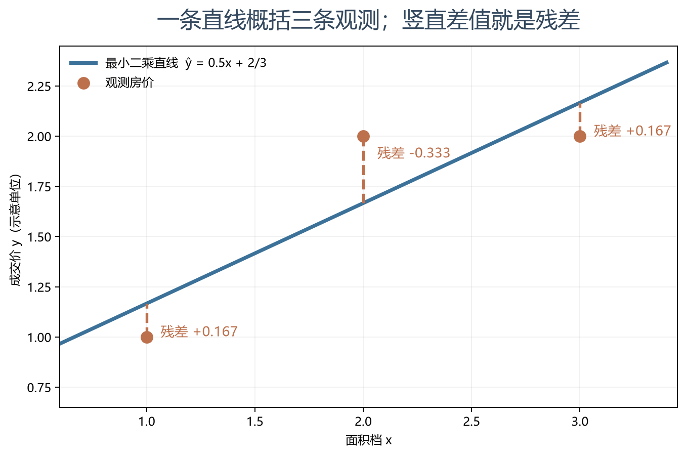
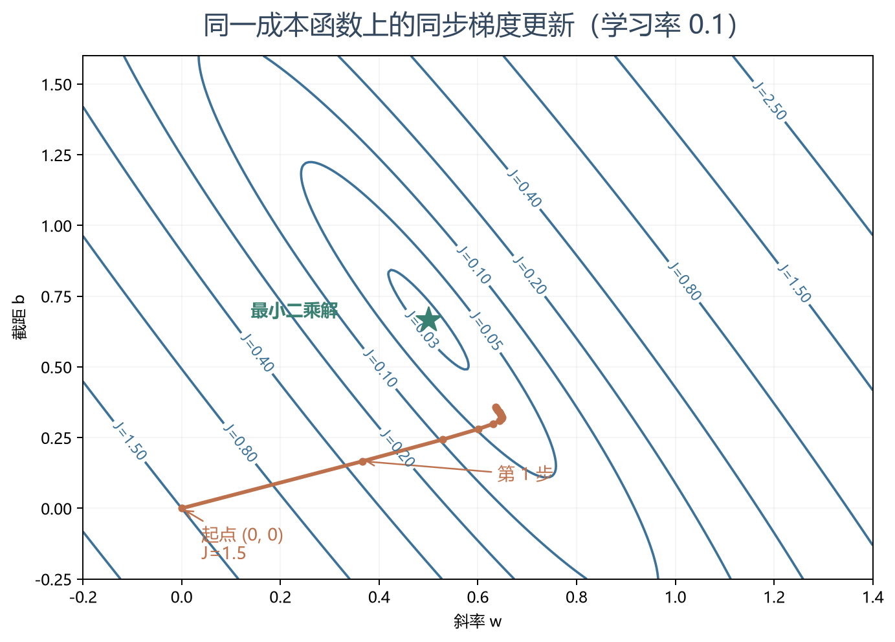
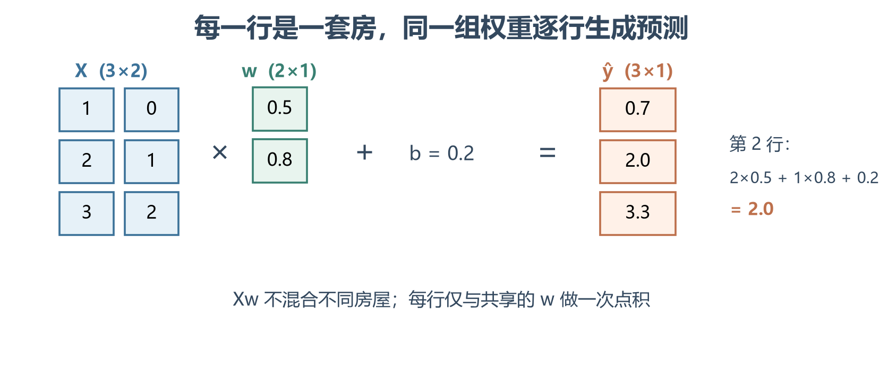
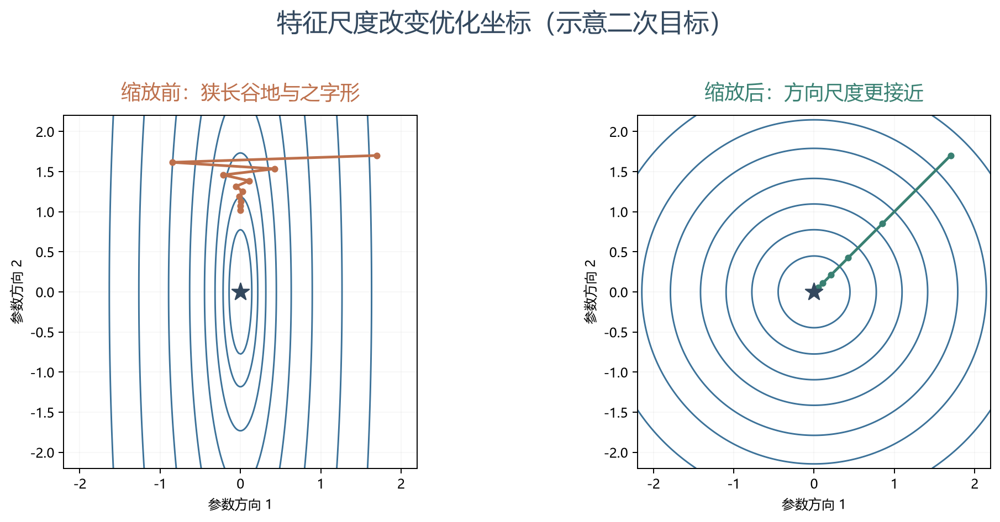
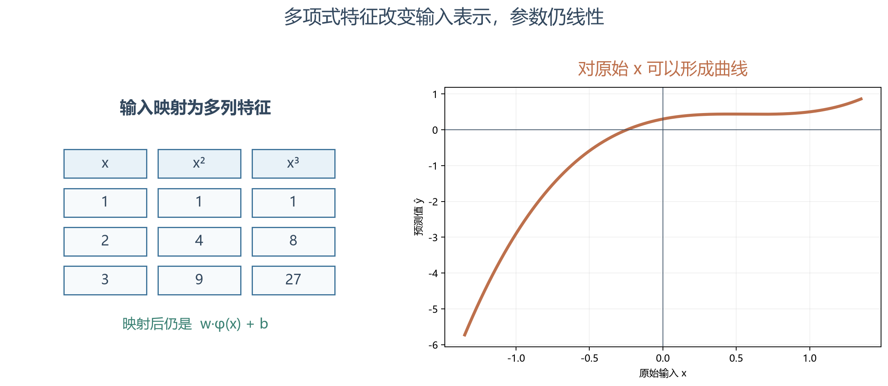

# [AI基础-机器学习]2.线性回归、最小二乘与特征工程

房屋面积、房龄和位置会影响价格，但手里只有已经成交的房屋记录；我们需要一条能对新房屋给出数值预测的规则。线性回归先用最简单的“特征加权求和”建立预测，再用历史成交价确定权重。课程从一维直线开始，逐步扩展到多特征、求解方法和特征工程。本篇沿这个顺序，始终区分三个问题：**模型怎样算预测、用什么目标衡量误差、如何求出参数**。

## 1 单变量线性回归：用一条直线预测连续数值

先只使用房屋面积 $x$ 预测价格 $y$。一条带标签的训练样本是 $(x^{(i)},y^{(i)})$；模型对新面积的预测为

$$
\hat y=f_{w,b}(x)=wx+b.
$$

$w$ 是**斜率或权重**，表示面积增加一个单位时，预测价格改变多少；$b$ 是**截距或偏置**，表示 $x=0$ 时直线的预测值。$b$ 不一定有独立的现实含义：若训练数据只有 50～150 平方米的房屋，“零平方米价格”只是数学上的延长。$\hat y$ 是模型输出，$y$ 是观测到的成交价，二者并不要求每套房都完全相同。

例如把面积单位定为某个固定面积档，观察三套房：$(x,y)=(1,1),(2,2),(3,2)$，价格也采用固定单位。增加面积与价格整体上升有关，但三个点并不落在同一条直线上；我们要找的是在这批数据上总体偏差较小、对新房屋也有希望适用的直线。下文会反复用这一组数字查看“误差—梯度—解”的关系。

这是一项**监督回归任务**：输入 $x$ 是新房屋的面积，训练标签 $y$ 是已成交房屋的实际价格，模型输出 $\hat y=f_{w,b}(x)$ 是对新房屋价格的预测。训练时利用成对的 $(x^{(i)},y^{(i)})$ 调整 $w,b$；预测时只有新房屋的 $x$，并不知道它未来的真实成交价 $y$。回归预测连续数值，分类则预测有限类别。图中的竖线是每套房从观测价到预测价的差，后文将把这些差合成一个训练目标。

## 2 平方误差：把一条直线的好坏变成一个数

第 $i$ 套房的**残差**定义为“预测减观测”：

$$
r_i=f_{w,b}(x^{(i)})-y^{(i)}.
$$

残差正，表示预测偏高；残差负，表示预测偏低。若直接求和，正负误差可能抵消，不能反映整体拟合质量。课程采用**最小二乘**目标，把残差逐个平方后求平均：

$$
\boxed{J(w,b)=\frac1{2m}\sum_{i=1}^{m}
\bigl(wx^{(i)}+b-y^{(i)}\bigr)^2},
$$

其中 $m$ 是训练样本数，$J$ 是对整批训练样本的一个非负标量。前面的 $1/2$ 只方便求导时消去平方项带来的 2，不改变使 $J$ 最小的参数；$1/m$ 让不同样本数的平均尺度可比较。**训练目标**是寻找使 $J(w,b)$ 尽量小的 $w,b$，而不是声称实际房价必由一条精确直线决定。

平方让大的残差受到更重惩罚，例如误差从 1 增到 2，平方代价从 1 增到 4。这有利于关注大误差，也让离群房屋有更强影响。评价房价预测时，常见的**平均绝对误差** $\mathrm{MAE}=m^{-1}\sum_i|r_i|$ 表示平均偏离了多少价格单位；**均方根误差** $\mathrm{RMSE}=\sqrt{m^{-1}\sum_i r_i^2}$ 单位同样是价格，但更突出少数大误差。若业务更怕特别离谱的估价，可优先观察 RMSE 和大误差案例；若更关心普遍房屋平均偏离多少，可关注 MAE，也可同时报告两者。这里的 $m$ 是当前评价集样本数，$r_i$ 仍是预测减真实价格。训练使用平方误差、最终用这些指标评价可以并存，但选择主指标要服从实际决策目标，不能只挑让模型看起来更好的数字。

把三套房带入，若一开始取 $w=0,b=0$，模型全预测为 0，残差分别是 $-1,-2,-2$，因此

$$
J(0,0)=\frac{1^2+2^2+2^2}{2\cdot3}=1.5.
$$

对每一组 $(w,b)$ 都能算一个 $J$。在以 $w,b$ 为坐标的**参数平面**里，等成本的参数形成等高线；往低处走就是在改进拟合。平方误差线性回归的目标是凸二次函数。若包含截距的设计矩阵各列线性独立，即**满列秩**，每个参数方向都能从数据中区分，最小二乘参数唯一。若两列特征完全相同，只要两列权重的和不变，预测就不变；这时最优权重可以有多组，即使最优预测相同。这个例子说明了秩为何影响参数唯一性。

最小二乘还有条件明确的概率解释。设观测价格为 $y^{(i)}=f_{w,b}(x^{(i)})+\varepsilon_i$；如果给定输入后，各 $\varepsilon_i$ 独立、均值为零，且都服从方差相同的正态分布 $N(0,\sigma^2)$，则某个价格的条件密度包含

$$
p\bigl(y^{(i)}\mid x^{(i)},w,b\bigr)
\propto
\exp\!\left[-\frac{\bigl(y^{(i)}-f_{w,b}(x^{(i)})\bigr)^2}{2\sigma^2}\right].
$$

各样本密度相乘后再取对数，最大化**似然**就等价于最小化残差平方和：越大的残差，在这一噪声模型下越不可能。这里 $\sigma$ 是假定的共同误差标准差；比例号省去了与 $w,b$ 无关的系数。**计算最小二乘解本身并不要求特征或残差服从正态**；正态等假设用于这一概率解释及某些推断。

## 3 梯度下降与学习率：沿参数空间逐步降低成本

已经有 $J(w,b)$，但还不知道选哪组参数。**梯度**给出当前参数附近成本增加最快的方向；因此用旧参数减去一小段梯度，通常可以在足够小的步长下使成本下降。对两个参数，一轮**同步更新**是

$$
\begin{aligned}
w_{\mathrm{new}}&=w_{\mathrm{old}}
-\alpha\left.\frac{\partial J}{\partial w}\right|_{w_{\mathrm{old}},b_{\mathrm{old}}},\\
b_{\mathrm{new}}&=b_{\mathrm{old}}
-\alpha\left.\frac{\partial J}{\partial b}\right|_{w_{\mathrm{old}},b_{\mathrm{old}}},
\end{aligned}
$$

$\alpha>0$ 是**学习率**。两个偏导必须先在同一组旧参数上计算，再同时更新；若先改写 $w$，随后拿新 $w$ 求 $b$ 的偏导，就执行了另一套算法。对当前房价预测 $\hat y=wx+b$，更新 $w$ 会按房屋面积 $x$ 改变各房屋的预测，更新 $b$ 则给所有预测加上同一个改变量；偏导告诉我们该往哪个方向调，下一节会用各房屋的残差算出它们。

学习率过小会慢，过大可能跨过低谷、振荡或发散。若靠近光滑最小点，梯度常逐渐变小，固定 $\alpha$ 下的实际更新量也会缩小；但“梯度小”不自动意味着预测泛化好。对线性回归的凸目标，没有比全局最小值更差的局部极小值；仍要选能稳定下降的学习率，并检查数据尺度。参数曲面的形状在下一周引出特征缩放。

## 4 单变量回归的梯度：每个样本怎样推动斜率与截距

把 $wx^{(i)}+b$ 代入 $J$，对 $w,b$ 分别求偏导，可得

$$
\boxed{
\frac{\partial J}{\partial w}
=\frac1m\sum_{i=1}^{m}r_i x^{(i)},\qquad
\frac{\partial J}{\partial b}
=\frac1m\sum_{i=1}^{m}r_i
}.
$$

第二式是**平均残差**：如果当前整体预测偏高，它为正，下降更新会降低截距。第一式在残差外还乘了输入 $x^{(i)}$：改变斜率 $w$ 对大输入位置的预测影响更强。这个乘积来自链式法则，单个平方项对 $w$ 的偏导是 $2r_i\,\partial r_i/\partial w=2r_i x^{(i)}$，再与 $1/(2m)$ 相乘。

仍从 $w=b=0$ 开始，三个残差是 $(-1,-2,-2)$，于是

$$
\frac{\partial J}{\partial w}
=\frac{(-1)\cdot1+(-2)\cdot2+(-2)\cdot3}{3}
=-\frac{11}{3},
\qquad
\frac{\partial J}{\partial b}
=-\frac53.
$$

若取 $\alpha=0.1$，一轮后 $w=11/30\approx0.367$、$b=1/6\approx0.167$。新直线分别预测约 $0.533,0.900,1.267$，代回同一目标得 $J\approx0.328$，低于原来的 1.5。一次下降不等于已经找到最佳直线；接着用新参数重新计算残差和梯度。

上式每更新一次都遍历全部 $m$ 条样本，称为**全批量梯度下降**。若每次只用一条样本估计梯度，是随机梯度下降；用一小组样本，则是小批量梯度下降。它们可以优化同一个平均损失，差别在单次计算量和梯度噪声。本篇的计算例子用全批量形式，方便把公式与每条残差一一对应；更大模型的优化器留给后续专题。

## 5 多元线性回归：把一套房的多个特征放到同一行

只有面积会丢失房龄、卧室数等信息。设每套房有 $d$ 个数值特征，单个输入向量 $x^{(i)}\in\mathbb R^d$，对应权重 $w\in\mathbb R^d$。多元线性回归按特征逐项加权求和：

$$
\hat y^{(i)}
=w^\mathsf T x^{(i)}+b
=\sum_{j=1}^{d}w_j x_j^{(i)}+b.
$$

$x_j^{(i)}$ 是第 $i$ 套房的第 $j$ 个特征；**在其他输入特征固定时**，$w_j$ 给出该特征增加一个单位对应的模型预测变化。若面积与卧室数高度相关，系数单独的解释可能不稳定；它表达的是模型内部的条件关联，不能自动解释成“增加一间卧室会因果性地提高房价”。

将 $m$ 套房逐行排列，得到**设计矩阵** $X\in\mathbb R^{m\times d}$；每一行是一套房，每一列是同一种特征。令 $y\in\mathbb R^m$ 为实际价格向量、$\mathbf1_m\in\mathbb R^m$ 为全 1 向量，则整批预测为

$$
\boxed{\hat y=Xw+b\mathbf1_m\in\mathbb R^m}.
$$

先看两套房、两个特征的缩小例子。假设两列依次是“面积档数、卧室数”，每档和每间的示意权重都取 1，暂不加偏置：

$$
X=\begin{bmatrix}1&2\\2&1\end{bmatrix},\qquad
w=\begin{bmatrix}1\\1\end{bmatrix},\qquad
Xw=\begin{bmatrix}3\\3\end{bmatrix}.
$$

第一行给第一套房预测 $1\cdot1+2\cdot1=3$，第二行给第二套房预测 $2\cdot1+1\cdot1=3$；两个 3 分属两套不同房屋，不是把两套房的数据混合。一般维度是 $(m\times d)(d\times1)+(m\times1)=(m\times1)$。课程某些神经网络笔记把样本放在列上，矩阵形状会转置；此篇和当前常见数据接口统一使用**样本为第一维**。

把这项运算交给数值库称为**向量化**。它使公式与数据结构一致，也可利用底层优化运算；并不表示所有乘法在一个时钟周期完成，或对很小的数据必然快。避免为了“向量化”反复生成很大的临时数组。这里不需把 Python 循环和数值库调用写成完整 Demo，只要记住输入是 $m\times d$，输出是一列 $m$ 个预测即可。

## 6 多特征的最小二乘梯度与直接求解

令残差向量 $r=Xw+b\mathbf1_m-y\in\mathbb R^m$。它的第 $i$ 项就是第 $i$ 套房的残差；与单变量同样地，

$$
J(w,b)=\frac1{2m}r^\mathsf T r.
$$

对每一列特征求导，再把 $d$ 个结果堆起来，可得到

$$
\nabla_wJ=\frac1m X^\mathsf T r\in\mathbb R^d,
\qquad
\frac{\partial J}{\partial b}
=\frac1m\mathbf1_m^\mathsf T r\in\mathbb R.
$$

$X^\mathsf T$ 的形状为 $d\times m$，乘 $m$ 维残差得到 $d$ 维权重梯度；偏置梯度是残差求和后的一个标量。继续用上一节两套房，若实际价格均为 4，当前预测均为 3，残差是 $r=(-1,-1)^{\mathsf T}$。两列特征对梯度的贡献分别为

$$
\nabla_wJ
=\frac12
\begin{bmatrix}1&2\\2&1\end{bmatrix}
\begin{bmatrix}-1\\-1\end{bmatrix}
=\begin{bmatrix}-1.5\\-1.5\end{bmatrix},
\qquad
\frac{\partial J}{\partial b}=\frac{-1-1}{2}=-1.
$$

两个负权重梯度表示：在当前位置略微**增大**任一权重，都有降低训练成本的倾向；偏置梯度为负表示所有预测整体偏低。取学习率 $\alpha=0.1$ 并同步更新，得到 $w=(1.15,1.15)^{\mathsf T}$、$b=0.1$，两套房都改预测为 $3.55$。原成本为 $[(-1)^2+(-1)^2]/4=0.5$，新成本为 $[(-0.45)^2+(-0.45)^2]/4=0.10125$。这是一轮局部改进，不意味着以后每一步都必然下降；步长太大仍可能越过低谷。

不过，**线性最小二乘不一定需要梯度下降**。把截距并进设计矩阵：$\widetilde X=[\,X\ \mathbf1_m\,]\in\mathbb R^{m\times(d+1)}$，参数 $\theta=(w_1,\ldots,w_d,b)^\mathsf T$，目标成为 $\|\widetilde X\theta-y\|_2^2$。令梯度为零得到**正规方程**

$$
\widetilde X^\mathsf T\widetilde X\,\theta
=\widetilde X^\mathsf T y.
$$

正规方程的左边来自两次操作：先计算每条房屋的预测残差，再让残差分别与设计矩阵的每一列相乘并求和；在最优点，这些和为零。直观地说，已经不能再沿任何一个现有特征方向调整参数，使平方残差总和继续变小。刚才只有两套房，却有两个权重加一个偏置共三个未知参数；例如 $w=(1,1)^{\mathsf T},b=1$ 能对两套房都预测 4，$w=(0,0)^{\mathsf T},b=4$ 也能做到。**预测都正确，不表示每个参数都能从这两条数据里单独确定。** 若 $\widetilde X$ 满列秩，最小二乘参数唯一；否则可能有多组参数给出同样的最小残差。

课堂常写 $\theta=(\widetilde X^\mathsf T\widetilde X)^{-1}\widetilde X^\mathsf T y$，它只在可逆时成立，而且**实际计算不宜显式形成逆矩阵**。形成 $\widetilde X^\mathsf T\widetilde X$ 还可能放大病态问题，尤其当两列特征近乎重复时。QR、SVD 或专门的最小二乘求解器通常更稳健。[NumPy 当前的最小二乘接口](https://numpy.org/doc/stable/reference/generated/numpy.linalg.lstsq.html)（核查于 2026-09-23）能处理超定、欠定和秩不足的情况；有多个最优解时，它返回范数最小的解。

对于只有一个特征的三套房，还能把解写得更具体。先算 $\bar x=2,\bar y=5/3$；由“残差和为零、残差与输入的乘积和为零”解出

$$
w=
\frac{\sum_i(x^{(i)}-\bar x)(y^{(i)}-\bar y)}
{\sum_i(x^{(i)}-\bar x)^2}
=\frac12,\qquad
b=\bar y-w\bar x=\frac23.
$$

分子表示面积偏离平均值与价格偏离平均值的同向程度，分母表示面积自身变化的尺度；当所有房屋面积都相同，分母为零，就无法单靠这些数据确定唯一斜率。当前数据的最佳直线分别预测约 $1.167,1.667,2.167$，残差为 $(1/6,-1/3,1/6)$，因此 $J=1/36\approx0.0278$。第 4 节的一轮梯度下降只是向这个最优值前进了一步。

线性回归作为普通最小二乘模型今天仍有实际用途；[scikit-learn 的 LinearRegression 文档](https://scikit-learn.org/stable/modules/generated/sklearn.linear_model.LinearRegression.html)（核查于 2026-09-23）仍将它作为标准预测器。它也常是理解特征、损失与误差诊断的基线。对于大规模、稀疏或更复杂的模型，是否用直接解或迭代解要看数据形状、求解器和计算资源。

## 7 特征缩放：让不同单位的参数更容易一起优化

房屋面积可能是数百或数千，卧室数可能只在 0～5 之间。在未缩放的输入上，同样改变一点权重，对两列的预测影响差异很大；平方误差成本曲面可能形成狭长谷地，梯度更新反复横穿谷地，导致一个统一学习率难以同时适应所有方向。

**特征缩放**对每一列做确定的变换，让尺度更可比。常用的标准化是

$$
x_{ij}'=\frac{x_{ij}-\mu_j}{s_j},
$$

$x_{ij}$ 是第 $i$ 条样本的第 $j$ 个特征，$\mu_j$、$s_j$ 是**只从训练集该列估计**的均值与标准差。例如训练房屋的面积均值为 100 平方米、标准差为 20 平方米，一套 140 平方米房屋的标准化面积就是 $(140-100)/20=2$；训练房屋卧室数均值为 2、标准差为 1，三卧室的标准化值为 $(3-2)/1=1$。模型此时接收的两个数是 2 和 1，表示分别高于训练均值两个、一个标准差，而非 140 与 3 的原始数值。缩放后训练列通常均值约 0、标准差约 1，但并不因此服从正态，也不一定落在 $[-1,1]$。系数单位也随之改变：标准化后一个单位对应原特征约一个标准差，不能再直接把新 $w_j$ 解释为“增加一平方米”的价格变化。

课程还给出两种简单缩放。若 $a_j=\max_i|x_{ij}|>0$，可用 $x_{ij}'=x_{ij}/a_j$，把训练集中该列的绝对值压到不超过 1；若 $R_j=x_{j,\max}-x_{j,\min}>0$，可用 $x_{ij}'=(x_{ij}-\mu_j)/R_j$，让数值围绕训练均值重新定位。它们与标准化一样都改变优化坐标，但“按均值除范围”并不保证结果落在 $[0,1]$；要得到该区间应改为减去最小值后除范围。所有方法的分母为零时都不能直接相除，这样的常量列也没有区分训练样本的能力。

范围缩放与均值、标准差缩放对强离群值都可能敏感，可根据数据分布考虑更稳健的尺度。[scikit-learn StandardScaler 文档](https://scikit-learn.org/stable/modules/generated/sklearn.preprocessing.StandardScaler.html)（核查于 2026-09-23）也说明了离群值敏感性。缩放参数绝不能从验证或测试集重新估计；预测未来房屋时要使用训练时保存的同一组参数，否则会造成数据泄漏或输入含义漂移。

对于没有正则化的普通最小二乘，线性缩放在合适处理截距的条件下通常主要改变参数坐标与数值求解状况，未必改变在原输入上的最优预测；但对梯度下降速度、正则化惩罚以及许多其他模型，它可以明显改变训练结果。因此不能把“缩放后结果更好”笼统解释为数据凭空多了信息。

## 8 训练成本曲线：检查收敛与调整学习率

使用梯度下降时，可以记录第 $t$ 次更新后的训练成本 $J^{(t)}$。若它稳定下降并逐渐变平，说明当前优化过程趋于稳定；若下降极慢，学习率可能太小，也可能是特征尺度很差；若明显振荡、持续上升或变成非有限值，应检查学习率、梯度公式、广播形状与输入异常。**成本曲线**以迭代次数为横轴，记录训练目标怎样变化；**学习曲线**以训练样本数为横轴，比较训练集与验证集表现，帮助判断是否需要更多数据。两者回答的问题不同。

选学习率时，先确认特征尺度和计算无误，再按数量级尝试少量候选值，比较前若干轮成本下降的速度与稳定性。不能只凭“某次最后成本最低”选一个会在更长训练后发散的步长。停止条件也不宜只用一个绝对阈值 $|J^{(t)}-J^{(t-1)}|<\varepsilon$：价格单位改变会使 $J$ 的尺度改变。可结合相对改善、梯度范数、最大迭代数与验证表现。

训练成本小表示这条直线贴近**已经用来拟合参数的房屋**，不能保证预测新房屋也准确。判断是否只记住训练样本，要在未参与拟合的验证集上使用相同的预测误差指标：如果训练误差低、验证误差明显高，存在泛化差距，应检查样本代表性、异常房屋和模型复杂度；如果两边都高，先检查特征、模型形式或优化是否到位。改变学习率主要针对“优化没做好”，无法单凭它修复数据缺口。

## 9 特征工程：把已知的业务关系表达成输入

线性模型只会对给定列加权求和。若影响地价的是地块**宽度乘深度**，而原始特征只有宽度 $x_1$ 和深度 $x_2$，模型 $w_1x_1+w_2x_2+b$ 无法直接表示这个乘积关系。**特征工程**根据领域知识新增一列

$$
x_3=x_1x_2,\qquad
\hat y=w_1x_1+w_2x_2+w_3x_1x_2+b.
$$

若地块宽 20 米、深 30 米，新增的面积特征就是 $x_3=20\cdot30=600$ 平方米。假设只保留面积项，取 $w_1=w_2=b=0,w_3=10$，模型预测为 6000 个价格单位；宽度增加 1 米且深度仍为 30 米，面积增加 30 平方米，预测便增加 $10\cdot30=300$。一般地，此时宽度的模型内边际影响为 $w_1+w_3x_2$，随深度改变；交互项让“一个特征的作用取决于另一个特征”进入线性加权模型。新增的三列仍可排成设计矩阵，用同一最小二乘目标训练。**对参数线性**与**对原始输入只有直线关系**是两回事。

还有比组合特征更基础的检查：面积是平方米还是平方英尺、房龄是在成交时还是现在计算、缺失值是否代表某种特殊情形、特征是否在实际预测时已知。这些输入定义如果错了，模型再复杂也会学到错误关系。构造候选特征后，应只在训练部分确定所需统计量，并用验证数据比较它对未见样本是否有帮助；只看训练误差下降，会把噪声拟合也误当改进。

## 10 多项式回归：参数仍线性，预测可随输入弯曲

如果单一面积与价格的关系有弯曲趋势，可先把输入映射为多个幂次特征：

$$
\phi(x)=\begin{bmatrix}x\\x^2\\x^3\end{bmatrix},
\qquad
\hat y=w^\mathsf T\phi(x)+b
=w_1x+w_2x^2+w_3x^3+b.
$$

$\phi(x)$ 是从一个原始输入生成的三列特征。例如 $x=2$ 会变成 $(2,4,8)^{\mathsf T}$；若 $w=(1,0.5,0)^{\mathsf T},b=1$，预测为 $1\cdot2+0.5\cdot4+1=5$。$x$ 从 2 变到 3 时，平方列从 4 变到 9，增长速度不再固定，预测曲线便可能弯曲。但 $w_1,w_2,w_3,b$ 仍只以一次幂、加法方式出现，所以它依旧是**对参数线性的最小二乘问题**。把每条样本的 $\phi(x^{(i)})^\mathsf T$ 排成新设计矩阵，即可使用第 6 节的目标和求解思路。

次数升高会增加表示能力，也会快速增加特征数、放大输入量级并使外推不稳定。特别是训练范围之外，高次项可能迅速主导预测。因此要在训练流程内生成并缩放多项式特征，用验证集选择次数，同时检查真实任务是否支持这种形状。[scikit-learn 的 PolynomialFeatures 文档](https://scikit-learn.org/stable/modules/generated/sklearn.preprocessing.PolynomialFeatures.html)（核查于 2026-09-23）列出了多项式与交互项的生成方式，也提醒高次扩展可能过拟合。后续正则化文章再详细讨论怎样约束这种灵活性；这里最核心的判断是：**特征映射改变了模型能表示的关系，不能只看训练集拟合得更贴近。**
