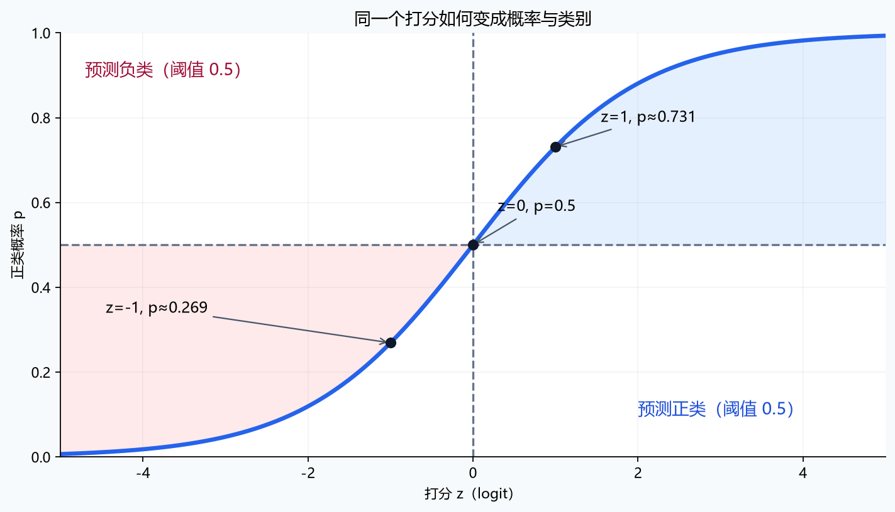

# [AI基础-机器学习]3.逻辑回归、Softmax与交叉熵

上一章预测的是房价这样的连续数值。本章换一个任务：给一封邮件判断“垃圾邮件”或“正常邮件”。训练数据仍是成对的输入和答案，只是答案变成了类别。我们希望模型既能给出类别，也能给出支持这个判断的概率：一封邮件被判为垃圾邮件的概率是 0.51，和概率是 0.99，对后续人工复核意味着不同的事。

课程先从两个类别的逻辑回归讲起，依次解决“怎样得到概率、怎样划分两类、怎样惩罚错误、怎样更新参数”；再把同一思路扩展到多个互斥类别。文中的概率是**模型在给定特征和已学参数下的估计**，不能因为输出落在 0～1，就认定它已经准确反映真实发生频率。

## 1 二元分类：为什么要改变线性回归的输出

设一封邮件的特征向量为 $x=(x_1,\ldots,x_d)$，其中某个特征可以表示特定词语是否出现，也可以表示链接数。$d$ 是特征数。历史邮件的标签 $y\in\{0,1\}$：$1$ 表示垃圾邮件（正类），$0$ 表示正常邮件（负类）。“正类”只是我们指定要检测的类别，没有褒贬含义。训练时用带标签的邮件学习参数；处理新邮件时只给模型 $x$，真实 $y$ 尚不可知。

如果直接沿用线性回归 $z=w^\mathsf{T}x+b$，输出 $z$ 可以是 $-2$ 或 $3$，不能直接解释为概率。把它与 0.5 比较仍然可以做分类，因此“线性回归完全不能分类”并不准确；但平方误差对应的连续数值建模方式，也不能自然表达“正确类别有多大概率”。逻辑回归保留特征加权求和这一步，再把打分转换成 0～1 之间的量，并配上适合二值标签的损失。

## 2 从线性打分到垃圾邮件概率

先算每个特征对判断的综合影响：

$$
z=w^\mathsf{T}x+b=\sum_{j=1}^{d}w_jx_j+b,\qquad p=\sigma(z)=\frac{1}{1+e^{-z}}.
$$

$w_j$ 是第 $j$ 个特征的权重，$b$ 是所有邮件共享的偏置，$z$ 是**未经概率转换的打分**，通常称为 logit。$z$ 变大，$p$ 就变大；$z=0$ 时 $p=0.5$；有限的 $z$ 只会得到严格处于 0 和 1 之间的值。这里 $p$ 表示模型估计的 $P(y=1\mid x)$，所以正常邮件的估计概率是 $1-p$。Sigmoid 指的就是上面的 S 形转换函数。

例如只看“出现可疑短语”这一项，令 $x_1\in\{0,1\}$、$w_1=2$、$b=-1$。没有出现该短语时 $z=-1$，$p=1/(1+e^1)\approx0.269$；出现时 $z=1$，$p=1/(1+e^{-1})\approx0.731$。两封邮件的估计概率相差约 0.462，但这**并不表示**每增加一个特征单位，概率总增加 0.462：Sigmoid 两端较平，中间较陡，同样增加 2 分，起点不同就会有不同的概率变化。权重为负的特征则会压低垃圾邮件的估计概率；$b$ 越大，在特征相同时所有邮件的打分都会提高。

“逻辑回归”名字里的回归，可以从**几率**来理解。概率 $p$ 对应的几率是 $p/(1-p)$：例如 $p=0.75$ 时，几率为 $3$，即模型认为正类相对负类约为 $3:1$。将 Sigmoid 公式整理得到

$$
\log\frac{p}{1-p}=z=\sum_{j=1}^{d}w_jx_j+b.
$$

左边是**对数几率**。在其他特征不变时，若第 $j$ 个特征 $x_j$ 增加 1，对数几率增加 $w_j$，几率乘以 $e^{w_j}$。上例的 $w_1=2$，所以“可疑短语”从无到有时，几率会乘约 $e^2=7.39$：从 $0.269/0.731\approx0.368$ 变成 $0.731/0.269\approx2.718$。这里变化的是**特征 $x_j$**；不能把这句话误写成“权重 $w_j$ 增加一个单位，对数几率增加 $w_j$”。这个解释也只是模型内的条件关系，不自动证明该词语导致邮件变成垃圾邮件。

## 3 阈值与决策边界：概率怎样变成类别

概率需要一个执行规则。给定阈值 $\tau$，若 $p\ge\tau$ 就预测正类，否则预测负类。课程先取 $\tau=0.5$；由于 Sigmoid 单调递增，这等价于 $z\ge0$ 判为正类。**决策边界**是刚好发生类别切换的输入位置：

$$
w^\mathsf{T}x+b=0\qquad(\tau=0.5).
$$

例如两个特征分别是可疑词数 $x_1$ 与外链数 $x_2$，模型打分为 $z=x_1+x_2-3$。一封邮件有 2 个可疑词、2 条外链，则 $z=1$、$p\approx0.731$，会被判为垃圾邮件；另一封有 1 个可疑词、1 条外链，则 $z=-1$、$p\approx0.269$，判为正常。两者中间的 $x_1+x_2=3$ 是一条直线。它不是从概率图上“画出来”的：它由打分公式 $z(x)=0$ 决定，Sigmoid 只是把边界两侧的打分变成概率。

若实际分界更像一个环，可以先把平方项作为新特征送入同一个模型。例如 $z=x_1^2+x_2^2-1$，0.5 阈值的边界就是 $x_1^2+x_2^2=1$，在原来的二维坐标中是一条圆。对**扩展后的特征**，模型仍是加权求和；在**原始输入空间**，边界已经弯曲。增加这类特征有助于表达复杂形状，也会增加拟合噪声的机会，需要用未参与训练的数据检验。

0.5 只是一种决策设置。若把 $\tau$ 提高到 0.8，只有更有把握的邮件才进入“垃圾邮件”类，通常会减少误报，同时可能漏掉更多真正的垃圾邮件。对应的边界由 $z=\log(\tau/(1-\tau))$ 给出；$\tau=0.8$ 时是 $z=\log4\approx1.386$。这改变的是**判定规则**，不会重新训练 $w,b$。选阈值要根据误报和漏报的代价，在验证集上评估。训练损失和最终的类别决策是两个相连但不同的环节。

## 4 二元交叉熵：错误概率为什么要付出代价

要训练模型，我们得把“这封邮件预测得好不好”变成一个数。若真实标签 $y=1$，模型给正类的概率 $p$ 越低，惩罚应越大；若 $y=0$，则应关注模型给负类的概率 $1-p$。用负对数把这两种情况合在一起：

$$
L(p,y)=-\bigl[y\log p+(1-y)\log(1-p)\bigr].
$$

$L$ 是一封邮件的**二元交叉熵**（也叫对数损失），$\log$ 是自然对数。$y=1$ 时第二项消失，只剩 $-\log p$；$y=0$ 时第一项消失，只剩 $-\log(1-p)$。计算时先挑出模型分给**真实类别**的概率 $q$，再算 $-\log q$，更容易理解：

| 真实标签 | 模型给正类的 $p$ | 模型给真实类别的 $q$ | 损失 $-\log q$ | 发生了什么 |
|---|---:|---:|---:|---|
| $1$ | $0.8$ | $0.8$ | $0.223$ | 判断正确且比较有把握 |
| $1$ | $0.01$ | $0.01$ | $4.605$ | 极有把握地判断错 |
| $0$ | $0.8$ | $0.2$ | $1.609$ | 误报为正类 |

因此，即使 $p=0.49$ 和 $p=0.01$ 对真实正类都被 0.5 阈值判错，它们的损失也不同：前者约 $0.713$，后者约 $4.605$。交叉熵会更强地惩罚过度自信的错误，保留了单看准确率时丢掉的概率信息。$p$ 只是预测；损失必须同时知道真实 $y$，因此只能在有标签的训练或评估数据上计算。

对 $m$ 封邮件，把单样本损失取平均，得到训练目标：

$$
J(w,b)=\frac1m\sum_{i=1}^{m}L\bigl(p^{(i)},y^{(i)}\bigr),\qquad p^{(i)}=\sigma\bigl(w^\mathsf{T}x^{(i)}+b\bigr).
$$

平均使损失尺度不随邮件数量直接增长。它还有一个概率来源：若给定各邮件特征后，标签按各自的伯努利概率生成，则单封邮件实际标签的模型概率是 $p^y(1-p)^{1-y}$。把所有训练标签的概率相乘，再取负对数并平均，恰好得到上面的 $J$。所以最小化交叉熵，也是在让已观察到的标签在模型下尽可能合理。对于线性打分的逻辑回归，未加入额外复杂结构时，这个目标对参数是凸的；但数据完全可分等情形仍可能使无约束参数持续增大，不能仅凭“凸”就断言总有有限且唯一的最优参数。

## 5 梯度下降：每封邮件怎样推动参数

损失告诉我们预测有多差，梯度告诉我们该怎样改 $w$ 和 $b$。Sigmoid 与二元交叉熵连用时，损失对打分 $z$ 的导数会简化为

$$
\frac{\partial L}{\partial z}=p-y.
$$

它可以直接作为**纠错信号**来读：真实为 1 而只预测 0.2 时，$p-y=-0.8$，梯度下降会推动该样本的打分上升；真实为 0 却预测 0.8 时，$p-y=0.8$，会推动打分下降。这个结果来自 $\mathrm{d}p/\mathrm{d}z=p(1-p)$ 与交叉熵求导后的链式法则，两个中间因子相消。它与线性回归里“预测减真实”的外形相似，但这里的预测是 Sigmoid 后的概率，损失是交叉熵。

在第 $i$ 封邮件上，第 $j$ 个权重的梯度贡献是 $(p^{(i)}-y^{(i)})x_j^{(i)}$，偏置的贡献是 $p^{(i)}-y^{(i)}$。所以一个特征值越大，这封邮件对相应权重的推动越强；特征值为 0 时，它不会通过该特征更新相应权重。不同特征的尺度若差很多，优化的步幅也会受影响。

用一组只有一个特征的小数据走一轮。令 $x=-1$ 的邮件标签为 $0$，$x=1$ 的邮件标签为 $1$；初始 $w=0,b=0$，两封邮件都预测 $p=0.5$。此时纠错信号分别是 $0.5$ 和 $-0.5$。两封邮件对权重梯度的贡献分别是 $0.5\times(-1)=-0.5$ 与 $-0.5\times1=-0.5$，取平均得 $\partial J/\partial w=-0.5$；偏置梯度取平均是 $(0.5-0.5)/2=0$。若学习率 $\alpha=1$，同步更新为 $w=0.5,b=0$。新概率分别约为 $\sigma(-0.5)=0.378$ 与 $\sigma(0.5)=0.622$：负类被推向 0，正类被推向 1；平均交叉熵从 $0.693$ 降到约 $0.474$。这些数字说明权重的增加是在拉开两类的打分，而不只是一个抽象的“沿梯度方向走”。

实际数据有 $m$ 封邮件、每封 $d$ 个特征。默认把**样本放在第一维**：$X\in\mathbb R^{m\times d}$ 的第 $i$ 行是第 $i$ 封邮件，$w\in\mathbb R^d$，标签向量 $y\in\mathbb R^m$。一批数据的计算可以写成

$$
z=Xw+b\mathbf1_m,\qquad p=\sigma(z),\qquad r=p-y,
$$

$$
\nabla_wJ=\frac1mX^\mathsf{T}r,\qquad \frac{\partial J}{\partial b}=\frac1m\mathbf1_m^\mathsf{T}r,
$$

$$
w\leftarrow w-\alpha\nabla_wJ,\qquad b\leftarrow b-\alpha\frac{\partial J}{\partial b}.
$$

$\mathbf1_m$ 是长度为 $m$、元素全为 1 的向量，$r$ 收集每封邮件的纠错信号。$X^\mathsf{T}r$ 的形状是 $(d\times m)(m\times1)=d\times1$，刚好与 $w$ 对齐；偏置梯度是一个数。原课程有时把样本放在**列**，写成 $X_{\mathrm{col}}\in\mathbb R^{d\times m}$，相当于这里的 $X^\mathsf{T}$；公式外观会改变，但“每个特征汇总全批样本的纠错信号”这件事不变。

## 6 Softmax：当类别多于两个且互斥

现在让模型判断一张图片是“猫、狗、鸟”中的哪**一个**。输出一个正类概率已经不够；我们需要三个类别各自的概率，而且总和应为 1。为每个类别算一个打分 $z_c$，再让它们共享同一个归一化分母：

$$
z_c=w_c^\mathsf{T}x+b_c,\qquad
p_c=\frac{e^{z_c}}{\sum_{k=1}^{C}e^{z_k}},\qquad
\sum_{c=1}^{C}p_c=1.
$$

$C$ 是互斥类别数，$c$ 是正在计算的类别，$w_c,b_c$ 是该类别的参数，$p_c$ 是模型给它的概率。这一转换称为 **Softmax**。每个 $p_c$ 都受所有打分影响：猫的打分不变，但狗的打分提高，猫分到的概率也会下降。因此 Softmax 表示“从几个互斥选项中分配概率份额”。

给猫、狗、鸟的 logits 取 $(2,1,0)$。指数分别约为 $(7.389,2.718,1)$，总和约 $11.107$，所以概率约为 $(0.665,0.245,0.090)$。模型会选猫；若实际答案是狗，模型分给正确类别的概率只有 $0.245$。注意 $2,1,0$ 是模型打分，没有“2 倍可能”这样的直接含义；经过指数与归一化后才得到可比较的概率。

图片或语言模型输出层常会使用这类转换，但 Softmax 本身只负责把当前特征对应的打分变成概率，不负责提取图像纹理或理解句子。若前面只有线性特征打分，类别间的成对分界来自两个线性打分相等；要描述复杂边界，需要合适的特征或非线性模型。

对一批 $m$ 个样本，把各类别的权重排成 $W\in\mathbb R^{C\times d}$，偏置为 $b\in\mathbb R^C$，则 $Z=XW^\mathsf{T}+\mathbf1_m b^\mathsf{T}$ 的形状是 $m\times C$。第 $i$ 行是第 $i$ 个样本对全部 $C$ 类的打分。Softmax **逐行**计算，得到同形状的概率矩阵；每行的概率和为 1，不是跨样本归一化。

## 7 多分类交叉熵：只看正确类别拿到多少概率

沿用猫、狗、鸟的例子，真实答案是狗。多分类交叉熵直接取正确类别概率的负对数：

$$
L=-\log p_{y}.
$$

这里 $y$ 是真实类别的索引；若类别顺序为猫、狗、鸟，狗的索引就是 1（从 0 开始编号），所以 $L=-\log0.245\approx1.407$。假如模型给狗的概率从 $0.245$ 提高到 $0.8$，损失会降到约 $0.223$。概率越集中在正确类别上，损失越低；若错误地把几乎全部概率放在猫上，损失就很大。这是二元交叉熵思路在互斥多类任务中的延续。

也可以把狗写成目标向量 $(0,1,0)$，称为 **one-hot（独热）表示**：正确类为 1，其余类为 0。于是 $L=-\sum_{c=1}^{C}y_c\log p_c$，因为只有狗那一项留下来。这里的 $y_c$ 是目标向量第 $c$ 项，和上式的类别索引 $y$ 是两种写法，不能把一个整数索引直接代进求和式。

Softmax 与交叉熵组合后，对各类别打分的梯度是 $p_c-y_c$。在刚才的例子中，约为 $(0.665,-0.755,0.090)$：梯度下降倾向于降低猫和鸟的相对打分、提高狗的打分。实际更新各类参数时，还要乘入当前样本的特征；一批样本则将贡献汇总。这个“预测概率减目标向量”的形式，与二分类的纠错信号一致，但类别之间通过 Softmax 分母相互影响。

直接计算很大的 $e^{z_c}$ 可能数值溢出。Softmax 对所有打分同时减去同一个数后，概率不变；实践中常减去最大打分。上例 $(2,1,0)$ 变为 $(0,-1,-2)$，指数为 $(1,0.368,0.135)$，仍得到约 $(0.665,0.245,0.090)$。训练时也不必先手算概率再取对数：截至 2026 年 9 月核查的 [PyTorch CrossEntropyLoss 官方文档](https://docs.pytorch.org/docs/stable/generated/torch.nn.CrossEntropyLoss.html) 指明，其输入是未经归一化的 logits；普通单标签任务的目标可用 $0$ 到 $C-1$ 的类别索引。这样可以由损失函数完成数值稳定的计算。二分类对应的 [BCEWithLogitsLoss 官方文档](https://docs.pytorch.org/docs/stable/generated/torch.nn.BCEWithLogitsLoss.html) 也把 Sigmoid 与二元交叉熵合在一起，输入同样是原始 logits。需要向人展示概率或按阈值做决策时，再对打分做 Sigmoid 或 Softmax。

## 8 多分类与多标签：先确认答案能否同时成立

一张图片若必须在“猫、狗、鸟”中选一个，这是**单标签多分类**：三个类别互斥，用 Softmax，输出三个和为 1 的概率。若任务改成“画面里是否有猫、是否有狗、是否有鸟”，同一张图可能同时有猫和狗，这是**多标签分类**。此时对每个标签分别做一次二分类：

$$
p_c=\sigma(z_c),\qquad
L_c=-\bigl[y_c\log p_c+(1-y_c)\log(1-p_c)\bigr].
$$

例如三个独立概率为 $(0.8,0.7,0.1)$，可以同时表达“有猫”和“有狗”，概率和为 1.6 并无问题；它们回答的是三个不同的是否问题。标签 $(1,1,0)$ 表示猫和狗都存在。每个 $L_c$ 衡量对应标签预测的好坏，再对标签和样本求平均或按任务约定汇总。若误用 Softmax，猫概率升高就会挤压狗概率，模型无法自然表达两者同时出现。工程实现中，二元任务或多标签任务的 logits 和目标要有相同的标签维度；互斥多类任务的 logits 则有 $C$ 个类别维，目标通常是每个样本一个类别索引。先弄清标签的含义，再选输出和损失。
