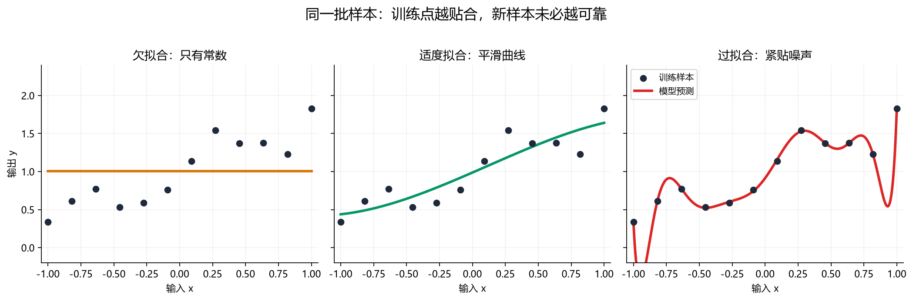
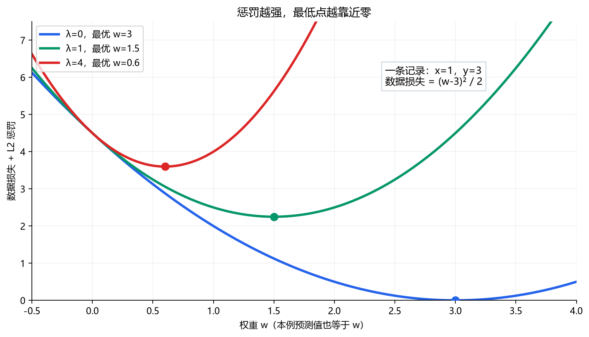

# [AI基础-机器学习]4.泛化、正则化与模型改进

给房价模型加入面积的平方、立方后，它也许能把已有成交价拟合得很贴近；但新房屋的价格仍可能预测得很离谱。给垃圾邮件模型加入大量词语组合也一样：训练邮件几乎全对，新的邮件却频繁误判。我们想要的是**在未参与训练的样本上仍然可靠的预测**，这称为泛化。本篇沿课程第三周后半段的顺序，先辨认模型哪里出了问题，再讨论增加数据、调整特征和正则化，最后把正则化真正放进线性回归与逻辑回归的训练过程。

## 1 欠拟合与过拟合：为什么训练分数不能代表新样本

想用房屋面积预测价格，只有一条水平线的模型会给大房子和小房子差不多的估价。如果训练房屋的价格本来随面积上升，它连现有样本中的主要规律都没学到，这叫**欠拟合**。在项目诊断中，若训练误差相对合理的可达基线仍很高，常称为**高偏差**。这里的“偏差”是模型拟合能力的术语，与公平性问题中的群体偏见不同。

反过来，设 20 套房屋里有一套因装修异常昂贵。若用很高次的多项式强行让曲线穿过每个训练点，曲线可能在相邻面积之间大幅摆动。训练误差变小了，但新房屋恰好落在摆动区域时，预测会变差。模型学进了训练样本的偶然细节，这叫**过拟合**；在同来源数据上，训练误差远低于验证误差时，常说存在较大的泛化差距或高方差。

例如同用房价预测的平均绝对误差（MAE，单位为万元）评价三个候选模型，得到下面这组示意结果。MAE 是每套房预测价与成交价之差的绝对值，再对房屋求平均；越低越好。

| 候选模型 | 训练 MAE | 验证 MAE | 读到的信号 |
|---|---:|---:|---|
| 只预测固定价格 | 30 | 31 | 两边都差，先检查特征与模型表达能力 |
| 适度弯曲的模型 | 8 | 10 | 训练与新样本都相对较好 |
| 极高次多项式 | 1 | 24 | 训练很贴合，新样本明显变差 |

这三个数字组合并不规定真实项目必然如此。比如房价记录本身噪声很大，训练 MAE 为 8 万元未必就算“差”；需要和可信基线及业务目标比较。验证样本也必须来自目标房屋市场，且预处理规则不能从验证集偷看。**训练与验证要比较同一种不含参数惩罚的预测误差**，否则差距本身失去含义。训练误差与验证误差之差，是决定要不要约束模型自由度的一项依据。

图示把“模型形状贴近训练点”和“新位置预测稳定”分开观察。弯曲程度由特征或模型结构提供，是否该采用则由验证结果判断。

## 2 过拟合时的三条改进路径

面对上表中训练 MAE 为 1、验证 MAE 为 24 的模型，课程给出三类办法。它们处理的是不同来源的自由度或数据缺口，应先判断哪一种与当前问题相符。

**增加有代表性的训练数据。** 如果只看过 20 套房，一套异常装修房就可能把高次曲线明显拉歪；再加入同一目标市场中更多不同面积、装修水平的房屋，偶然样本对整体拟合的支配力通常会下降。重复复制原来的 20 条记录不会提供同等新信息；如果新增房屋都来自另一个城市，也可能让预测目标偏离原市场。数据需要来自部署时会遇到的分布，标签也要可靠。

**选择更合适的特征。** 删除预测时不可能获得的“成交后评估价”，可以消除信息泄漏；删除由少数异常样本支撑的高次项，可能减少曲线无意义的摆动。但删特征也可能丢掉真正有用的信号。哪些特征要留，应在训练流程内确定，再用验证数据检验。这里的“特征选择”与上一章构造面积、交互项的思路相接：特征工程增加可表达的关系，特征筛选则检查哪些关系在新数据中站得住。

**保留候选特征，同时限制参数。** 正则化让模型仍能使用这些列，但在训练目标里对过大的权重收取代价。比如高次项只在极少数房屋上有用，要让它取得很大的系数就得额外付出代价，模型便会更偏向由多条数据共同支持的、较温和的曲线。这是本篇的主角。三条路径可以组合使用；正则化无法凭空补出缺失特征，也不能修正错误标签或数据泄漏。

## 3 L2 正则化：给大权重增加一项代价

先保留我们已经认识的训练目标：用模型预测每套房价格，计算平均平方误差；或者预测邮件为垃圾邮件的概率，计算平均二元交叉熵。这部分叫**数据损失**，记为 $J_{\mathrm{data}}(w,b)$。其中 $w=(w_1,\ldots,w_d)$ 是各特征权重，$b$ 是偏置，$m$ 是训练样本数。L2 正则化在它后面加上权重平方和：

$$
J_{\mathrm{reg}}(w,b)
=J_{\mathrm{data}}(w,b)
+\frac{\lambda}{2m}\sum_{j=1}^{d}w_j^2.
$$

$\lambda\ge0$ 是**正则化强度**。$\lambda=0$ 时只看训练拟合；$\lambda$ 增大，同样大的权重需要付出更高代价。平方会让较大的权重代价增长更快：权重从 1 变 2，平方从 1 变 4。$1/(2m)$ 是本课程的归一化约定，方便和平均数据损失及梯度配合；别的资料可能把它并入 $\lambda$，所以不能跨不同目标函数直接比较系数的数值。此处按课程约定不惩罚偏置 $b$；具体库或模型也可能有不同处理。

看一个只有一个权重的微型计算，专门观察这项惩罚如何改变答案。固定 $b=0$、一条训练记录 $x=1,y=3$，用上一章的平方损失 $J_{\mathrm{data}}(w)=\tfrac12(w-3)^2$。加上 L2 后，由于 $m=1$，目标变为

$$
J_{\mathrm{reg}}(w)=\frac12(w-3)^2+\frac{\lambda}{2}w^2.
$$

不加正则化时，$w=3$ 能把这条记录准确预测为 3；若 $\lambda=1$，让两项合起来最小的权重是 $w=1.5$，模型对同一个 $x=1$ 只预测 1.5。它**主动接受了一些训练误差**，以换取更小的权重。若 $\lambda=4$，最优权重进一步降到 0.6，预测也只剩 0.6。可以用导数核对：$\mathrm dJ_{\mathrm{reg}}/\mathrm dw=(w-3)+\lambda w=0$，于是 $w=3/(1+\lambda)$。这组只有一条记录的数字只说明“参数会怎样收缩”，不能证明验证误差一定改善；验证收益必须另测。

把这个结果放回多项式房价模型会更直观：预测式 $\hat y=w_1x+w_2x^2+w_3x^3+b$ 中，高次项若需要很大的 $w_3$ 才能贴住几套异常房屋，L2 会抑制这种做法。不过“更小权重必然带来更平滑预测”需要结合**特征尺度**理解；若 $x^3$ 的数值特别大，即使 $w_3$ 很小，它也可能产生很大的预测贡献。第 6 节会处理这个问题。

## 4 正则化线性回归：数据要求拟合，惩罚要求收缩

对第 $i$ 套房，特征是 $x^{(i)}\in\mathbb R^d$，实际成交价是 $y^{(i)}$，预测价为 $\hat y^{(i)}=w^\mathsf Tx^{(i)}+b$。定义残差 $r_i=\hat y^{(i)}-y^{(i)}$：正值表示估高，负值表示估低。保留本课程平方损失的 $1/2$ 约定，训练目标为

$$
J_{\mathrm{reg}}(w,b)
=\frac1{2m}\sum_{i=1}^{m}r_i^2
+\frac{\lambda}{2m}\sum_{j=1}^{d}w_j^2.
$$

对第 $j$ 个权重求梯度，会得到两个来源：房屋记录的残差要求改变预测，L2 惩罚要求压小权重。

$$
\frac{\partial J_{\mathrm{reg}}}{\partial w_j}
=\frac1m\sum_{i=1}^{m}r_i x_j^{(i)}
+\frac{\lambda}{m}w_j,
\qquad
\frac{\partial J_{\mathrm{reg}}}{\partial b}=\frac1m\sum_{i=1}^{m}r_i.
$$

$x_j^{(i)}$ 是第 $i$ 套房的第 $j$ 项特征。若某列特征很大，误差就能更强地推动对应权重；若 $w_j$ 为正，正则项也为正，梯度下降会把它往小处推；若 $w_j$ 为负，正则项为负，会把它往零处推。偏置没有惩罚项，只需根据整体高估或低估调整。把权重更新式改写为

$$
w_j\leftarrow
\left(1-\frac{\alpha\lambda}{m}\right)w_j
-\alpha\left(\frac1m\sum_{i=1}^{m}r_i x_j^{(i)}\right),
$$

$\alpha>0$ 是学习率。普通梯度下降在 $0<\alpha\lambda/m<1$ 时，可把第一项看成旧权重先缩小一点，第二项再按房价误差校正；两项最终是**同一次同步更新**，不是先训练一个模型再手动改系数。若学习率使这一因子越过合理范围，这种“轻微收缩”的直觉也不再适用。

例如两套房在某个已缩放特征上的值都是 1，当前 $w=2,b=0$，实际价格分别是 1 和 3 个单位。模型都预测 2，因此残差为 $(1,-1)$，数据梯度 $(1-1)/2=0$，但此时不能说参数无需更新：取 $m=2,\lambda=1$，惩罚梯度是 $(1/2)\cdot2=1$。学习率取 0.1，权重更新为 $2-0.1\cdot1=1.9$。两套房的平均数据损失从 $(1^2+(-1)^2)/4=0.5$ 变成 $(0.9^2+(-1.1)^2)/4=0.505$，略微变差；惩罚项却从 $2^2/4=1$ 降到 $1.9^2/4=0.9025$，**总目标**从 1.5 降到 1.4075。这个例子说明训练成本下降与训练预测误差下降是不同的事。

一批样本用矩阵写也不复杂。$X\in\mathbb R^{m\times d}$ 的每一行是一套房，$r=Xw+b\mathbf1_m-y\in\mathbb R^m$，所以

$$
\nabla_wJ_{\mathrm{reg}}=\frac1mX^\mathsf Tr+\frac{\lambda}{m}w,
\qquad
\frac{\partial J_{\mathrm{reg}}}{\partial b}=\frac1m\mathbf1_m^\mathsf Tr.
$$

$X^\mathsf Tr$ 的形状是 $d\times1$，与 $w$ 对齐；$\mathbf1_m^\mathsf Tr$ 是一个数。数据部分仍是把每列特征与所有房屋的残差相乘后求平均，只是每个权重多承担自己的收缩项。原课程若把样本排成列，数据矩阵写成 $d\times m$，相当于此处 $X^\mathsf T$，不要把两种记法的转置混在一起。

## 5 正则化逻辑回归：分类损失换了，权重约束不变

垃圾邮件分类中的标签为 $y^{(i)}\in\{0,1\}$；第 $i$ 封邮件的特征为 $x^{(i)}$，模型先算 $z^{(i)}=w^\mathsf Tx^{(i)}+b$，再算正类概率 $p^{(i)}=1/(1+e^{-z^{(i)}})$。$p^{(i)}$ 越大，模型越倾向判为垃圾邮件。训练数据部分使用**二元交叉熵**，即真实为 1 时付出 $-\log p^{(i)}$ 的代价，真实为 0 时付出 $-\log(1-p^{(i)})$ 的代价。加入同一项 L2 惩罚后：

$$
J_{\mathrm{reg}}(w,b)
=-\frac1m\sum_{i=1}^{m}
\bigl[y^{(i)}\log p^{(i)}+(1-y^{(i)})\log(1-p^{(i)})\bigr]
+\frac{\lambda}{2m}\sum_{j=1}^{d}w_j^2.
$$

训练输入矩阵 $X$ 仍是 $m\times d$；$p,y\in\mathbb R^m$ 分别收集每封邮件的正类概率和真实标签。数据部分的纠错信号是 $p-y$，因此

$$
\nabla_wJ_{\mathrm{reg}}
=\frac1mX^\mathsf T(p-y)+\frac{\lambda}{m}w,
\qquad
\frac{\partial J_{\mathrm{reg}}}{\partial b}
=\frac1m\mathbf1_m^\mathsf T(p-y).
$$

如果一封真正的垃圾邮件只被赋予 $p=0.2$，它的 $p-y=-0.8$，会通过该邮件出现的特征推动正类打分上升；与此同时，若某个权重已经很大，正则项会反向拉住它。线性回归和逻辑回归在此处有相同的“数据梯度＋惩罚梯度”结构，但**预测方式与数据损失各自不同**，不能把房价残差 $\hat y-y$ 误代进分类的概率公式。

对单个权重看一眼数值：设某封真实垃圾邮件的某特征 $x=1$，当前 $w=2,b=0$，所以 $p=\sigma(2)\approx0.881$。假设只训练这一封邮件，$m=1$，正则化强度 $\lambda=0.2$，则数据梯度为 $(0.881-1)\cdot1=-0.119$，惩罚梯度为 $0.2\cdot2=0.4$，合计约 $0.281$。学习率 $\alpha=0.1$ 的一步使 $w$ 降为约 1.972。虽然此样本希望把概率继续推高，权重惩罚目前更强；训练会在更多邮件和验证反馈下寻找平衡。只有一封邮件的例子用来读懂每项梯度，不代表这个 $\lambda$ 适合真实分类任务。

## 6 特征尺度与正则化强度：让惩罚有可比意义

L2 惩罚比较的是**系数数值**，而系数会随特征单位改变。同一面积变量若以平方米表示，一套房是 $100$；若以“每 100 平方米”为单位表示，同一套房就是 $1$。要产生同样的预测贡献 $2$，前一种写法的权重是 $0.02$，后一种是 $2$。预测都等于 2，权重平方却分别是 $0.0004$ 和 $4$。因此，未经适当缩放就给各列同样的 L2 惩罚，实际约束可能严重不均衡；多项式的 $x,x^2,x^3$ 尤其容易有不同量级。

常用做法是在**训练集**估计各数值特征的中心和尺度，再用同一变换处理验证、测试和未来输入。若第 $j$ 列的训练均值为 $\mu_j$、标准差为 $s_j>0$，一条样本的该列可变为 $(x_j-\mu_j)/s_j$。这使“权重增加 1”更接近“特征增加一个训练标准差”的影响，惩罚也更可比。若标准差为 0，该列在训练数据中没有变化，需要另行处理。缩放本身不增加预测信息；它主要改变参数坐标、优化过程和正则化实际作用。必须先切分数据、仅在训练部分拟合缩放规则；交叉验证的每一折也要只用该折训练部分拟合。这样的流程与 [scikit-learn 关于数据泄漏和 Pipeline 的官方说明](https://scikit-learn.org/stable/common_pitfalls.html)一致（核查于 2026-09-24）。

怎样选 $\lambda$？对候选强度分别在训练集拟合参数，用**同一种、不含惩罚项的预测指标**在验证集比较。下面假设任务是垃圾邮件识别，三行均用分类错误率；数字只演示读表方法。

| $\lambda$ | 训练错误率 | 验证错误率 | 解释 |
|---:|---:|---:|---|
| $0$ | $2\%$ | $12\%$ | 训练很好，泛化差距大 |
| $0.2$ | $3\%$ | $6\%$ | 训练稍差，验证明显改善 |
| $20$ | $15\%$ | $17\%$ | 约束可能过强，连训练也难拟合 |

这个实验会优先考虑 $\lambda=0.2$，然后按任务代价核对误报、漏报、校准等必要指标；不能只因为 $\lambda=0$ 训练错误率最低就选它。验证集被用于挑强度，最终测试集应等决策定下后才使用。若训练来源和未来邮件分布不同，还应先检查分布不匹配；调正则化不一定能解决它。

不同库使用不同目标函数和参数名。例如截至 2026 年 9 月核查的 [scikit-learn LogisticRegression 文档](https://scikit-learn.org/stable/modules/generated/sklearn.linear_model.LogisticRegression.html)说明该实现默认施加正则化，参数 `C` 与正则化强度方向相反：`C` 越小，约束越强。它并不等于本篇公式中的 $\lambda$，具体数值受损失归一化和实现定义影响。回归中的 L2 模型通常称为**岭回归**，其当前 [Ridge 文档](https://scikit-learn.org/stable/modules/generated/sklearn.linear_model.Ridge.html)仍提供相应实现。课程公式和这些工具都是当前有用的方法；使用接口时先查清它优化的目标与参数约定。

## 7 L1 与 L2：当目标是压小系数，或希望部分系数归零

L2 的平方惩罚通常把系数往零拉，但一般不会仅凭这项惩罚让所有不重要的系数恰好等于零。另一种常用约束是 **L1 正则化**，把平方和换成绝对值和：

$$
J_{\mathrm{L1}}(w,b)=J_{\mathrm{data}}(w,b)+\lambda_1\sum_{j=1}^{d}|w_j|.
$$

$\lambda_1$ 控制这项惩罚的强弱，截距仍按本节约定不参与。L1 可以把部分权重推到**精确的零**，因此当有很多候选特征、希望得到稀疏模型时有用。可以用一个权重感受差别：数据单独偏好 $w=0.4$，令 $J_{\mathrm{data}}=\tfrac12(w-0.4)^2$。加上 $0.5|w|$ 后，数据为把 $w$ 从零推到正值带来的初始好处，抵不过 L1 每增加一个单位就要付出的 0.5，最优 $w=0$；若改为 $0.25w^2$，对应 L2 最优值是 $w=0.4/1.5\approx0.267$，变小但未归零。这个例子只解释惩罚形状，实际是否该筛掉某特征仍需验证。

**Elastic Net** 把 L1 与 L2 结合：希望部分系数为零，同时让强相关特征的估计不要过于不稳定时，可以把它作为候选方法。没有一种正则项能自动判断哪些特征在因果上真正重要；高度相关的列可能互相替代，L1 留下其中一列也不等于另一列无用。不要把“正则化”与“标准化”混为一谈：前者改变训练目标的参数约束，后者改变输入的表示尺度。

正则化还可从概率角度理解：若在拟合数据前就认为大权重较不常见，对权重施加以零为中心的高斯先验，最大后验估计会出现 L2 形式；拉普拉斯先验会出现 L1 形式。这里的先验是对参数范围的建模假设，不是说每个真实问题的最佳权重都必然接近零。若假设与任务不符，验证数据可能显示约束反而有害。

## 8 把正则化放回模型改进流程

当训练误差低、同来源验证误差高，增加有代表性数据、降低无用特征的自由度和调整正则化强度都值得尝试。若训练误差已经很高，应先排查特征是否不足、模型是否表达不了关系、优化是否尚未收敛，或者正则化是否**太强**；此时继续加大 $\lambda$ 通常会使拟合更困难。若只在目标验证集变差而同来源新样本仍好，优先查数据采集、标签规则和目标分布，而不是机械地继续收缩权重。

还要分清观察的两个量：**训练总目标**是数据损失加正则项，用于更新参数；**训练和验证的预测误差**只衡量真实预测，比较时通常不加正则项。例如第 4 节的一步更新让训练数据损失从 0.5 升到 0.505，却让训练总目标从 1.5 降到 1.4075，这并不矛盾。调参时若把不同 $\lambda$ 的总目标直接横向比大小，惩罚规则本身在变，无法公平判断哪个模型预测新数据更好。

最后，普通梯度下降中的 L2 更新可以写出“旧权重轻微缩小”的形式，常被称为权重衰减直觉；在自适应优化器里，**将 L2 加进梯度**与**解耦权重衰减**不一定是同一种操作。[PyTorch AdamW 官方文档](https://docs.pytorch.org/docs/stable/generated/torch.optim.AdamW.html)（核查于 2026-09-24）明确说明其权重衰减不会累积进动量和方差。本文的梯度式只针对前面写明的 L2 目标；后续学习优化器时应按具体实现区分。正则化、数据质量、模型容量与任务指标一起决定最终表现，任何一个旋钮都不能单独保证泛化。
