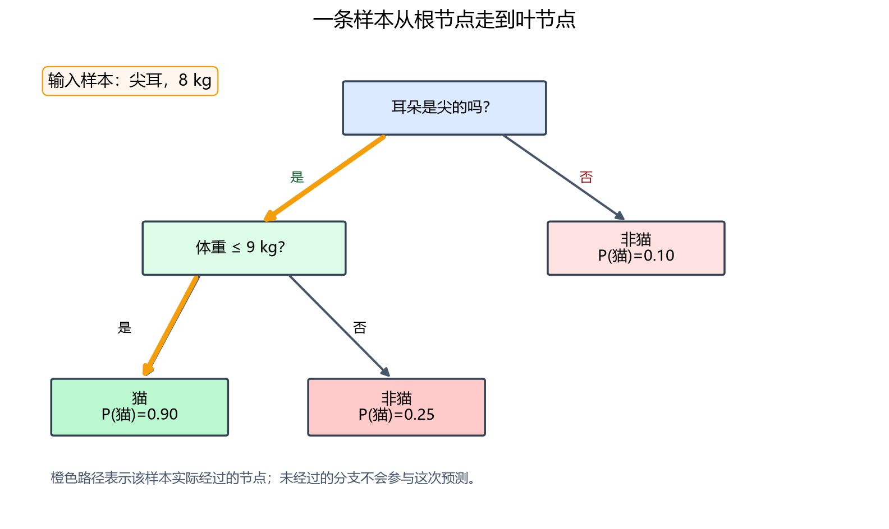
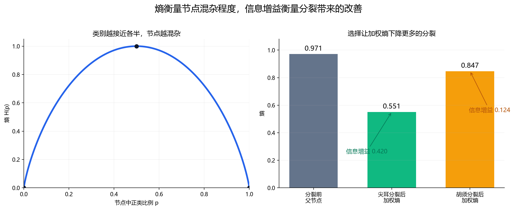
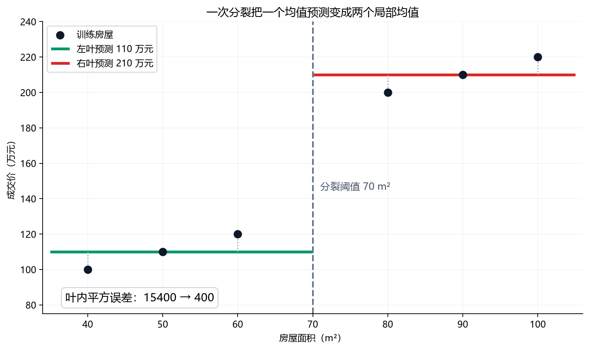
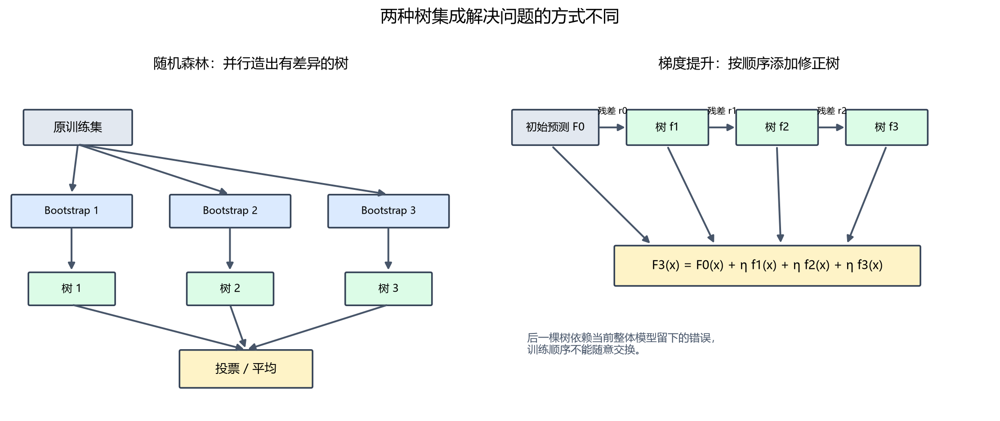

# [AI基础-机器学习]5.决策树、随机森林与梯度提升

前几篇里的线性回归和逻辑回归，都会把一条样本的所有特征代入同一个加权公式。决策树换了一种思路：先问一个问题，根据答案进入一个分支，再继续问下一个问题，最后在叶节点给出预测。这种模型很适合房屋属性、客户记录、设备状态等表格数据，因为“面积是否超过 90”“是否有逾期记录”这类局部规则可以直接成为分裂条件。

一棵树很容易理解，却也容易随训练数据的小变化而大幅改变。课程因此从单棵树逐步走向两条集成路线：随机森林让许多具有差异的树分别判断，再投票或平均；梯度提升让后面的树依次修正前面模型留下的错误。本篇按这个顺序展开，并用小数据走完分裂、回归树、Bootstrap 和逐轮纠错的关键计算。

## 1 决策树：让一条样本沿规则走到叶节点

假设要判断一只动物是不是猫，输入特征包括耳朵形状、脸形和体重。决策树由三类位置组成：最上方的第一个判断叫**根节点**，中间继续检查特征的位置叫**决策节点**，不再分裂并输出结果的位置叫**叶节点**。连接节点的线表示某个判断结果对应的分支。

例如下面这棵小树先看耳朵是否尖，再看体重是否不超过 9 千克。输入“尖耳、8 千克”的动物会先走左边，再走体重条件的左边，最后得到“猫”；输入“非尖耳”的动物在第一步就到达“非猫”叶节点。

树的输出来自叶节点。分类树的叶节点可以输出多数类别，也可以输出落入该叶的训练样本类别比例。例如一个叶节点中有 8 只猫、2 只非猫，简单的正类概率估计是 $8/(8+2)=0.8$，再按任务阈值转换成类别。回归树的叶节点则通常输出连续数值，后文会看到它为什么取叶内目标均值。

一条样本只会经过树中的一条路径，因此树自动产生了特征交互：同一个“体重不超过 9”条件，只有先满足“尖耳”时才会被使用。这与在线性模型里手动加入“耳朵特征乘体重特征”不同。树的局部规则也带来一个限制：轴对齐的阈值会把特征空间切成矩形区域，要逼近斜线或平滑曲线可能需要很多次分裂。

预测过程很直观，训练时真正困难的问题是：每个节点应该问什么，以及什么时候停止继续问。

## 2 熵与信息增益：从候选问题中选出更好的分裂

在当前节点中，如果猫和非猫混在一起，我们希望某次分裂后，左右子节点各自更接近单一类别。算法需要一个数字来衡量“混杂程度”。课程使用**熵**（entropy）：一个节点中两类各占一半时最混杂，只有一个类别时最纯。

设当前节点的正类比例为 $p$，负类比例为 $1-p$。二分类熵定义为

$$
H(p)=-p\log_2p-(1-p)\log_2(1-p).
$$

$p$ 是该节点中正类样本数除以节点总样本数，没有物理单位；对数以 2 为底，所以二分类熵最大值是 1。按连续极限约定 $0\log_2 0=0$。当 $p=0$ 或 $p=1$ 时，节点里只有一种类别，$H=0$；当 $p=0.5$ 时，$H=1$。如果 $p=0.8$，熵约为

$$
H(0.8)=-0.8\log_2 0.8-0.2\log_2 0.2\approx0.722.
$$

这个 0.722 表示节点仍有混杂，但比 50% 对 50% 的节点更接近单一类别。熵不直接告诉我们模型对新样本会不会正确，它只评价当前训练子集里的类别组成。

现在用 10 只动物比较两个候选问题。父节点有 6 只猫、4 只非猫，因此

$$
H_{\mathrm{parent}}=H(0.6)\approx0.971.
$$

若按“是否尖耳”分裂，左边 4 只全是猫，熵为 0；右边 6 只中有 2 只猫、4 只非猫，熵为 $H(2/6)\approx0.918$。分裂后熵必须按子节点样本数加权，因为含 6 个样本的节点应比含 4 个样本的节点影响更大：

$$
H_{\mathrm{after}}
=\frac4{10}\times0+\frac6{10}\times0.918
\approx0.551.
$$

**信息增益**（information gain）就是分裂前的熵减去分裂后的加权熵：

$$
IG=H_{\mathrm{parent}}-H_{\mathrm{after}}
=0.971-0.551=0.420.
$$

若按“是否有胡须”分裂，左边 5 只有 4 只猫，右边 5 只有 2 只猫，则分裂后加权熵约为

$$
\frac5{10}H(0.8)+\frac5{10}H(0.4)
=0.5\times0.722+0.5\times0.971
\approx0.847,
$$

所以信息增益约为 $0.971-0.847=0.124$。在这两个候选中，“是否尖耳”的 0.420 更大，它让子节点纯度提升得更多，应优先成为当前节点的分裂。

这里的“最大信息增益”只是在当前节点进行的**贪心选择**：每一步选眼前最好的分裂，并不穷举整棵树的所有可能结构，因此不能保证得到全局最优树。不同算法还会使用基尼不纯度（Gini impurity）等准则。二分类基尼不纯度为 $G(p)=1-p^2-(1-p)^2$，同样在纯节点取 0、在两类各半时最大。它和熵的数值尺度不同，却经常给出相近的分裂排序；应通过验证结果和具体实现选择，不能把某一个准则当作所有数据上的固定赢家。

## 3 递归建树与停止条件：每个子节点重新做一次选择

根节点只完成第一刀。分裂后，左子节点只接收走到左边的训练样本，右子节点只接收走到右边的样本；每个子节点再独立计算候选分裂的纯度改善。这个“在子集上重复同一过程”的结构就是递归建树。

对一个分类节点，训练过程可以按下面的顺序理解：

1. 收到当前节点的训练样本集合 $S$。
2. 检查是否已经满足停止条件；若满足，就建立叶节点。
3. 对仍可使用的每个特征及候选切分方式，计算不纯度下降。
4. 选择下降最多的分裂，把 $S$ 分成子集。
5. 分别对每个子集重复以上步骤。

如果节点全是猫，继续分裂不会再降低熵，应直接成为叶节点。现实数据很少能如此整齐，因此还需要人为限制树的生长。常见控制项包括最大深度、节点分裂所需的最小样本数、叶节点允许的最小样本数，以及分裂必须达到的最小不纯度下降。它们都在限制模型继续切出很小、证据不足的区域。

例如某个节点只有 3 条记录，其中 2 个正类、1 个负类。只要继续切分，往往能找到一个规则把单个负类单独隔开，使训练熵降到 0；但“一条记录形成一条规则”很可能只是在记忆样本。若设置叶节点至少包含 5 条训练记录，这次分裂就不允许发生。限制越严格，树越简单，训练误差通常会上升，验证表现可能先改善、再因约束过强而变差。选择这些参数时，应使用训练集拟合、验证集比较，测试集留到所有选择完成后。

停止条件属于树模型自己的正则化方式。上一篇的 L2 正则化通过惩罚大权重控制线性模型；树没有同样的一组线性系数，所以主要通过深度、叶数、叶内样本数和剪枝限制结构复杂度。二者目标相似，作用对象不同。

## 4 类别特征与连续特征：分裂条件从哪里来

课程先从只有两个取值的特征讲起，例如“尖耳/非尖耳”。如果一个类别特征有“尖耳、垂耳、圆耳”三个取值，可以把它转换为三列独热特征：

| 耳朵类型 | $x_{\mathrm{尖}}$ | $x_{\mathrm{垂}}$ | $x_{\mathrm{圆}}$ |
|---|---:|---:|---:|
| 尖耳 | 1 | 0 | 0 |
| 垂耳 | 0 | 1 | 0 |
| 圆耳 | 0 | 0 | 1 |

这样树可以提出“$x_{\mathrm{尖}}=1$ 吗”这类二元问题。独热编码仍是通用方案，但它不是现代树模型处理类别特征的唯一方式。一些实现能直接搜索类别集合的切分，CatBoost 还会构造基于类别统计的数值特征；是否预先独热编码要看具体算法和接口。截至 2026 年 9 月，[scikit-learn 的直方图梯度提升文档](https://scikit-learn.org/stable/modules/ensemble.html#categorical-features-support)说明其支持原生类别特征，[CatBoost 官方文档](https://catboost.ai/docs/en/features/categorical-features)甚至明确不建议在输入前统一手工独热编码。课程的独热编码方法应理解为容易掌握的通用入口，而非所有树库的固定前置步骤。

连续特征则使用阈值。假设 6 只动物的体重按从小到大排列为 $4,5,7,8,10,12$ 千克，对应标签是“猫、猫、猫、猫、非猫、非猫”。候选阈值可以取相邻不同数值的中点：4.5、6、7.5、9、11。试 $t=9$ 时，规则是

$$
x\le9
\qquad\mathrm{vs.}\qquad
x>9.
$$

左边 4 只全是猫，右边 2 只全是非猫。父节点正类比例是 $4/6$，熵约为 0.918；两个子节点的熵都是 0，所以信息增益也是 0.918。算法会用同样方法评价其他阈值和其他特征，再选择当前节点最好的一个。实际实现会利用排序、直方图或其他数据结构加速搜索，不会机械地为每个节点从头做所有重复计算。

树的阈值分裂通常不要求先把所有数值列标准化到相同量级。因为“面积不超过 100 平方米”改写为“不超过 1076 平方英尺”，只要阈值同步换单位，左右样本划分不变。但缺失值、异常值、类别编码和单位定义仍需正确处理；“不需要标准化”不等于“不需要数据质量检查”。

## 5 回归树：选择能让叶内数值更接近的分裂

分类树关心节点里的类别是否混杂；房价是连续值，无法用“猫占多少”来计算熵。回归树改为检查：分裂之后，每个叶节点内的成交价是否更集中。一个叶节点用同一个数值预测所有落入其中的房屋，在平方误差下，使叶内误差最小的预测就是该叶训练目标的平均值。

若叶节点 $R$ 包含 $m_R$ 套房，叶节点输出为

$$
\hat y_R=\frac1{m_R}\sum_{i:x^{(i)}\in R}y^{(i)}.
$$

例如面积为 $40,50,60,80,90,100$ 平方米的 6 套房，价格依次是 $100,110,120,200,210,220$ 万元。尚未分裂时，全部房屋共用均值 160 万元；总平方误差为

$$
(100-160)^2+(110-160)^2+(120-160)^2
+(200-160)^2+(210-160)^2+(220-160)^2
=15400.
$$

若在面积 70 平方米处分裂，左叶的价格均值是 110，右叶的均值是 210。两个叶内平方误差分别为

$$
(100-110)^2+(110-110)^2+(120-110)^2=200,
$$

$$
(200-210)^2+(210-210)^2+(220-210)^2=200.
$$

总平方误差从 15400 降到 400，减少了 15000。这个阈值把两个明显不同的价格区间分开，因此非常有效。训练时会比较各候选特征与阈值带来的误差减少；预测一套 85 平方米的新房时，它走到右叶，输出 210 万元。

若用方差来写，同一过程是“父节点方差减去子节点加权方差”。在所有节点都采用同一种方差定义时，它与叶内平方误差减少只差一个与样本数有关的比例。回归树得到的是分段常数函数：同一叶内的房屋预测完全相同，跨过阈值时预测会跳变。更深的树可以产生更细的台阶，也更容易把少量异常房屋单独切出来。

## 6 单棵树为什么不稳定

决策树每一步都用当前数据选最优分裂。如果“耳朵”和“胡须”的信息增益分别是 0.420 和 0.410，只改动或移除一条训练记录，就可能让后者超过前者。根节点一旦从耳朵变成胡须，流入左右子树的数据都随之改变，后续整棵结构可能完全不同。

这就是单棵深树常见的高方差：它有能力形成复杂规则，也容易把有限训练集中的偶然差异写进结构。限制深度和叶节点规模能缓解问题，却也可能失去有用的局部规律。另一条思路是保留多棵复杂但有差异的树，再合并它们的预测；如果各棵树没有在同一批样本上犯同样的错，平均或投票可以抵消一部分波动。

需要注意，“树结构容易变化”不等于每次预测必然完全不同。两棵结构不同的树仍可能对大量样本给出相同结果。稳定性应通过不同训练抽样、交叉验证或验证集指标测量，不能只看树的外观。

## 7 Bagging 与随机森林：制造差异，再通过平均降低波动

**Bagging** 是 Bootstrap Aggregating 的缩写，可以理解为“对重采样训练出的模型做聚合”。先从原训练集做多次有放回抽样，每次训练一棵树；分类时聚合类别判断或概率，回归时平均数值预测。

假设原训练集只有编号 1～5 的五条记录，一次抽 5 次并且每次抽完放回，可能得到

$$
[2,5,2,1,5].
$$

编号 2 和 5 重复出现，编号 3 和 4 没被抽到。这不是错误，正是 Bootstrap 让每棵树看到不同数据的方式。对训练集大小为 $m$ 的一般情况，某条记录一次都未被抽中的概率是 $(1-1/m)^m$，当 $m$ 较大时约为 $e^{-1}\approx0.368$；因此一个 Bootstrap 样本平均只包含约 63.2% 的不同原记录，其余是重复项。

没有进入某棵树训练样本的记录称为该树的**袋外样本**（out-of-bag，OOB）。编号 3、4 就是上面这棵树的袋外样本。让每条记录只由没有见过它的树来预测，可以形成袋外误差，作为额外的泛化估计。不过它不自动替代按时间、用户或目标分布设计的验证方案；数据存在分组、时序或分布变化时，普通 Bootstrap 仍可能给出不合适的估计。

随机森林在 Bagging 的“随机抽样本”之外，再加入“随机抽特征”。每个节点准备分裂时，只从随机选出的部分特征中寻找最佳条件。假如某个特别强的特征在所有节点都能参与竞争，许多树可能长得很像，错误也高度相关；限制候选特征会让其他特征有机会形成不同规则，从而增加树之间的差异。

设 5 棵分类树对同一客户的判断为 $[1,0,1,1,0]$，按课程的多数投票视角，最终类别是 1，因为有 3 棵支持正类。实际库也可能平均各树的类别概率后再决定类别，应查看具体接口语义。回归任务若三棵树给出的房价为 190、205、210 万元，森林预测为

$$
\hat y=\frac{190+205+210}{3}\approx201.7.
$$

这里的预测单位沿用三棵树的输入，仍是万元。

平均能降低波动的前提是各棵树的误差不完全同步。若数据中缺失了决定性特征，所有树都只能基于同样不足的信息，增加树数也无法解决系统性偏差。树数增加后，随机森林的结果通常会逐渐稳定，但训练时间、模型体积和预测开销继续增加；收益不会无限线性增长。最大深度、叶节点最小样本数、每次考虑的特征比例和树数，都应按验证表现及延迟、内存限制选择。

## 8 梯度提升：后一棵树拟合前面模型尚未解决的部分

随机森林中的树可以独立训练，最后做平均；**Boosting（提升）**按顺序训练模型，每一棵新树都根据当前整体模型的错误来决定修正什么。为看清这个过程，先用平方误差回归做一轮小计算。

有三个样本，输入 $x=(1,2,3)$，真实目标 $y=(2,4,8)$。初始模型先给所有样本预测目标均值：

$$
F_0(x)=\frac{2+4+8}{3}=4.667.
$$

当前残差“真实值减预测值”为

$$
r=y-F_0(x)=(-2.667,-0.667,3.333).
$$

第一棵小回归树不直接重新预测 $y$，而是拟合这组残差。假设它在 $x\le2$ 处分裂：左叶残差均值为 $(-2.667-0.667)/2=-1.667$，右叶为 3.333。记这棵修正树为 $f_1(x)$，学习率取 $\eta=0.5$，新模型是

$$
F_1(x)=F_0(x)+\eta f_1(x).
$$

三个新预测约为 $(3.833,3.833,6.333)$。平方误差和从初始的

$$
(2-4.667)^2+(4-4.667)^2+(8-4.667)^2\approx18.667
$$

降到

$$
(2-3.833)^2+(4-3.833)^2+(8-6.333)^2\approx6.167.
$$

这就是“逐轮纠错”的具体含义：新树给前面预测偏高的区域加负修正，给预测偏低的区域加正修正。学习率 $\eta$ 控制每棵树的修正只采纳多少；更小的学习率通常需要更多树，可能让学习过程更平缓，但也增加训练和推理成本。后续树继续拟合新的残差。

对平方误差，负梯度恰好与残差成比例；换成分类交叉熵或其他可微损失后，新树拟合的是损失对当前预测的**负梯度**，所以这种方法称为梯度提升树。一般加法模型写成

$$
F_T(x)=F_0(x)+\sum_{t=1}^{T}\eta f_t(x),
$$

$T$ 是提升轮数，$f_t$ 是第 $t$ 轮新树。树的深度决定每轮修正能表达多复杂的局部关系，$\eta$ 决定每轮迈多大一步，子采样、列采样、叶数和早停也用于控制泛化。

XGBoost（Extreme Gradient Boosting）是梯度提升树的一种高效且带正则化的实现。它并不等于“随机森林的升级版”：XGBoost 的树前后依赖，目标是逐轮降低指定损失；随机森林的树相对独立，重点是用随机性和平均降低方差。XGBoost 在每轮对损失做二阶近似，利用一阶梯度与二阶信息评估分裂和叶值，并在目标中加入树复杂度约束。其抽象目标可以写成

$$
\mathcal L^{(t)}
=\sum_{i=1}^{m}\ell\bigl(y_i,F_{t-1}(x_i)+f_t(x_i)\bigr)
+\Omega(f_t).
$$

$\ell$ 是当前任务的训练损失，$F_{t-1}$ 是前 $t-1$ 轮的总模型，$f_t$ 是本轮新增的树，$\Omega(f_t)$ 惩罚叶节点数或叶值大小等复杂度。课程用“关注之前分错的样本”建立直觉是有用的，但对现代梯度提升更准确的说法是：新树拟合当前损失要求的修正方向。XGBoost 的[官方提升树说明](https://xgboost.readthedocs.io/en/stable/tutorials/model.html)也将目标写成训练损失与正则项两部分（核查于 2026 年 9 月）。

## 9 随机森林、梯度提升与神经网络的使用边界

随机森林和梯度提升都由很多树组成，但调试思路不同：

| 对比项 | 随机森林 | 梯度提升树 / XGBoost |
|---|---|---|
| 树之间的关系 | 主要独立训练 | 按顺序依赖前一轮预测 |
| 合并方式 | 投票或平均 | 把每轮修正相加 |
| 核心作用 | 通过多样性降低单树波动 | 沿损失方向逐步提高整体拟合 |
| 常用控制项 | 树数、深度、叶样本数、候选特征数 | 学习率、轮数、树深、子采样、正则项、早停 |
| 工程特点 | 较稳健，树之间易并行 | 常需更细调参，轮次之间不能完全并行 |

截至 2026 年 9 月，决策树并没有因年代较早而失去价值。单棵树仍适合解释局部规则、建立小型基线或满足特定部署约束；随机森林仍是稳健的表格数据基线；梯度提升树仍广泛用于分类、回归和排序等结构化数据任务。[scikit-learn 当前集成学习文档](https://scikit-learn.org/stable/modules/ensemble.html)仍把随机森林与梯度提升列为代表性集成方法，并指出直方图梯度提升适合较大的表格数据，还能在相应实现中处理缺失值和类别特征。XGBoost、LightGBM、CatBoost 与不同框架的直方图提升各有数据格式、速度、类别处理和约束支持方面的差异，应按任务验证。

图像、语音、长文本等输入包含强烈的空间或序列结构，通常需要从原始信号自动学习表示，神经网络更自然。树模型更擅长已经整理成列的数值、类别和统计特征。两者也可以组合，例如先用神经网络提取图像或文本表示，再把固定表示与表格特征送入树模型；是否有收益仍由目标验证集决定。

“树模型可解释”也需要限定。浅层单树可以逐路径阅读；几百棵深树组成的集成无法靠肉眼逐棵理解。内置的不纯度特征重要性还可能偏向取值多或可切分点多的特征。置换重要性、部分依赖、SHAP 等工具可以提供不同角度的解释，但它们依赖数据分布与解释假设，不能自动证明因果关系。模型选择最终要同时考虑验证指标、数据形态、训练和推理成本、校准、稳定性以及解释要求。
