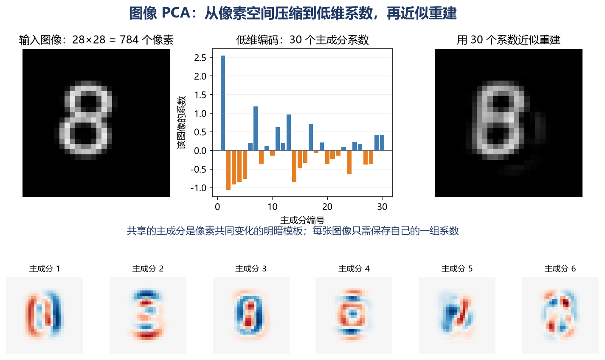
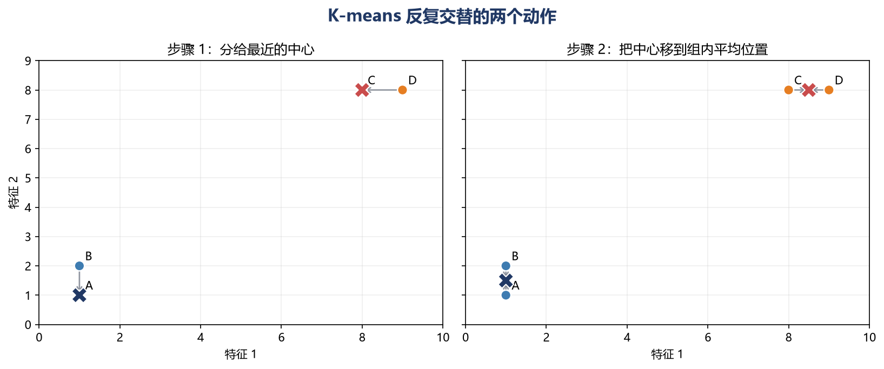
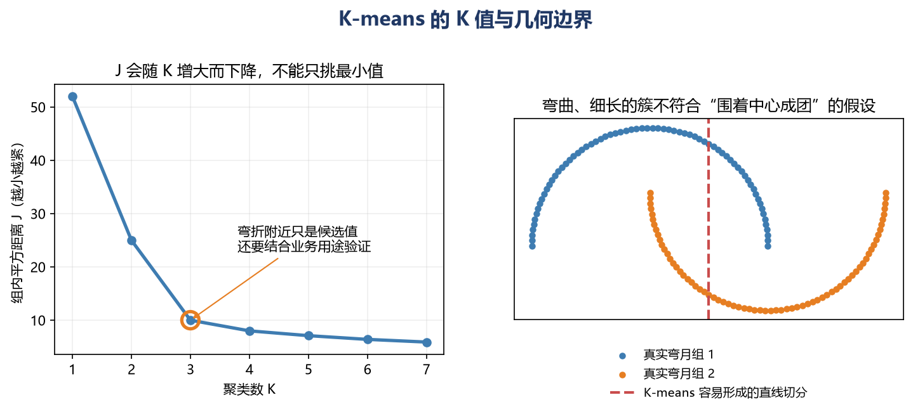
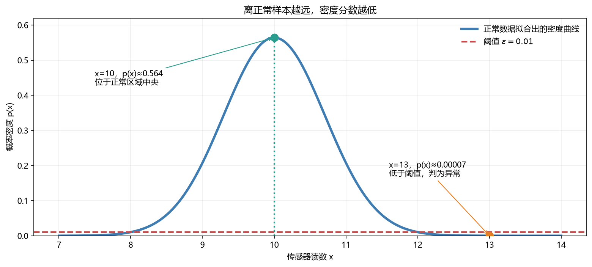
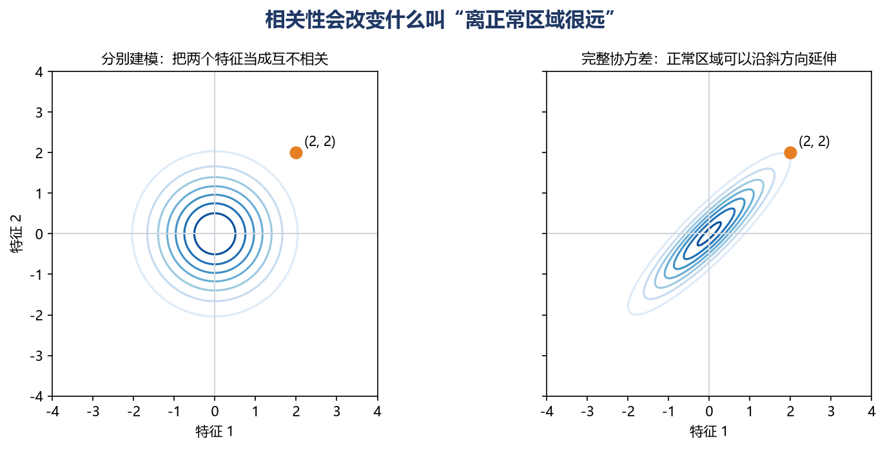

# [AI基础-机器学习]6.主成分分析、聚类与异常检测

监督学习拿到的是“输入和正确答案”，例如用房屋特征预测价格；本篇讨论的三种方法主要从没有标签的输入中寻找结构。它们解决的并不是同一个问题：**主成分分析**把许多相关特征压缩成较少的新特征，**聚类**把相似样本分成若干组，**异常检测**判断一个样本是否远离正常数据的分布。

可以把三者放进同一条工程流程，但不能把它们混为一谈。例如一台设备每分钟产生 100 个传感器特征，可以先用主成分分析压缩到 10 维，再对历史运行状态聚类，或者建立正常状态模型以检测故障。主成分分析是否有助于后两步必须通过验证；降维也可能删掉对小众故障最关键的方向。

## 1 无标签数据里可以寻找三种不同结果

设数据矩阵为 $X\in\mathbb R^{m\times n}$：一共有 $m$ 条样本，每条样本有 $n$ 个特征。第 $i$ 行 $x^{(i)}$ 是第 $i$ 条样本，第 $j$ 列是所有样本的第 $j$ 个特征。本篇统一把样本放在第一维。

面对同一个 $X$，三个任务会给出不同输出：

| 方法 | 提出的问题 | 主要输出 | 常见用途 |
|---|---|---|---|
| PCA | 能否用更少的方向保留数据的主要变化？ | 低维数据 $Z\in\mathbb R^{m\times k}$，其中 $k<n$ | 压缩、去除线性冗余、可视化、加速后续计算 |
| K-means | 哪些样本彼此更接近？ | 每条样本的组号，以及 $K$ 个聚类中心 | 客群粗分、图像颜色压缩、数据探索 |
| 异常检测 | 新样本与正常样本相比有多罕见？ | 异常分数，以及是否越过阈值 | 设备预警、欺诈筛查、质量检测 |

无监督不等于“完全不需要人工判断”。PCA 要决定保留多少维；K-means 要决定距离、聚类数和结果是否有业务含义；异常检测要用少量已知异常或实际成本确定报警阈值。没有标签只是改变了模型训练时能够使用的信息，并没有消除验证环节。

## 2 PCA 的图像应用：把像素变成少量成分系数

在线性代数中，PCA 的数学问题是“为什么最大方差方向来自协方差矩阵的特征向量”。到了机器学习任务里，重点换成另一件事：一张由大量像素组成的图像，怎样转换成更短的特征向量，并且还能近似恢复原图。

假设输入是一批 $28\times28$ 的灰度图像。每个像素先缩放到 0 到 1，再按固定顺序排成一行，一张图像就从二维网格变成长度为

$$
28\times28=784
$$

的向量。若有 $m$ 张图像，数据矩阵形状是

$$
X\in\mathbb R^{m\times784}.
$$

这里的一行仍是一张图像，只是二维位置被排成了 784 列。这个“展平”操作本身没有压缩信息；它只是把图像转换成 PCA 能处理的数据表。每一列固定对应某个像素位置，例如第 1 列始终是左上角像素。

### 2.1 从 784 个像素压缩成 30 个系数

先划分训练、验证和测试数据，再只用训练图像求平均图像 $\mu\in\mathbb R^{1\times784}$，并学习前 30 个主成分。把这些主成分按列放入

$$
V_{30}\in\mathbb R^{784\times30}.
$$

$V_{30}$ 是整批图像共享的投影矩阵。每一列都能重新排成一张 $28\times28$ 的图，它不是某个真实数字，而是一种像素共同变化的明暗模板。例如某个成分可能描述“上半部分变亮、下半部分变暗”，另一个成分可能描述笔画向左或向右偏移。

对一张展平后的图像 $x\in\mathbb R^{1\times784}$，低维编码为

$$
z=(x-\mu)V_{30}
\in\mathbb R^{1\times30}.
$$

这一步的输入是 784 个像素，输出是 30 个系数。$z_j$ 表示这张图像沿第 $j$ 个共享成分取了多少：绝对值越大，该成分描述的明暗变化越明显；正负号表示沿模板的两个相反方向变化，不代表好坏。整批图像一次转换得到

$$
Z=(X-\mathbf1_m\mu)V_{30}
\in\mathbb R^{m\times30}.
$$

现在每张图像可以用 30 个数交给分类器、聚类算法或可视化流程，而不必继续携带 784 个原始像素。单看每张图像的表示，数值个数减少了

$$
1-\frac{30}{784}\approx96.2\%.
$$

要近似还原图像，把低维系数乘回主成分矩阵并加回平均图像：

$$
\hat x=zV_{30}^{\mathsf T}+\mu
\in\mathbb R^{1\times784}.
$$

最后再把 784 个数排回 $28\times28$ 网格。重建图像 $\hat x$ 往往保留主要轮廓，却丢掉细小笔画和局部噪声，因为没有保留的 754 个方向无法再从 30 个系数中恢复。

下图使用一批带有位置、粗细和旋转变化的数字图像拟合 PCA。上方展示一张数字 8 从 784 个像素变成 30 个系数，再由这 30 个系数近似重建；下方展示前六个共享成分。红色和蓝色区域分别表示该成分中相反方向的像素变化。

图中这张数字 8 的前六个系数约为

$$
(2.553,\ -1.061,\ -0.908,\ -0.840,\ -0.762,\ 0.200).
$$

第一个成分贡献最强，但不能把它直接解释成“数字 8 成分”。PCA 学到的是整批训练图像的线性变化方向，单个成分通常混合了位置、形状、笔画和亮度变化。主成分整体变号时，相应系数也会变号，最终重建结果不受影响。

还要计算共享参数的成本。$V_{30}$ 本身包含 $784\times30=23520$ 个数，平均图像还包含 784 个数。如果只压缩一张图，保存共享矩阵反而不划算；当大量图像共用同一套成分时，这部分成本才能被摊薄。PCA 也不一定比 PNG 或 JPEG 更适合文件存储，它更常用于得到可供后续模型处理的低维数值表示。

### 2.2 成分数由应用结果决定

保留的成分数 $k$ 越大，低维表示越长，重建通常越清楚；$k$ 越小，压缩更强，信息损失也更大。在上面的数字图像示例中，像素值已缩放到 0 到 1，不同 $k$ 得到的结果如下：

| 成分数 $k$ | 累计解释方差 | 全部图像的平均像素平方误差 |
|---:|---:|---:|
| 10 | 52.7% | 0.0130 |
| 20 | 69.8% | 0.0083 |
| 30 | 79.6% | 0.0056 |
| 50 | 89.8% | 0.0028 |

解释方差表示这些成分保留了训练图像总变化的多少，像素平方误差衡量重建图与原图之间的数值差异。表中 $k$ 增大时两项都在改善，但计算量和存储量也随之增加。不能看到“95%”就把它当作所有任务的固定标准：

- 如果目标是近似重建图像，应同时观察重建图、像素误差以及真正关心的结构是否仍然清楚；
- 如果 $Z$ 要交给数字分类器，应在验证集比较不同 $k$ 对分类指标和推理成本的影响；
- 如果 $Z$ 要交给 K-means，应检查聚类稳定性和结果是否具有实际含义；
- 如果用于异常检测，还要确认小方差方向里是否包含关键缺陷，避免 PCA 恰好删掉异常信号。

平均图像和 $V_k$ 都只能用训练集拟合。验证、测试和线上图像必须使用同一组训练均值与主成分做转换，否则测试信息会提前进入表示学习过程。图像像素通常具有相同单位，把 0 到 255 统一缩放到 0 到 1 后进行中心化往往较自然；若再把每个像素位置分别标准化到单位方差，背景中极小的波动也可能被放大，因此不应机械套用表格数据的缩放习惯。

PCA 仍然是线性方法，而且把展平后的像素当成普通特征，不直接利用相邻像素的空间结构。复杂图像可能更适合卷积网络、自编码器或预训练视觉模型产生的表示。不过 PCA 计算清楚、结果可重建、成分数容易控制，至今仍适合做图像数据的降维基线。当前 `scikit-learn` 的 `PCA` 会中心化输入但不会自动逐列缩放；[官方 PCA 文档](https://scikit-learn.org/stable/modules/generated/sklearn.decomposition.PCA.html)说明了这一接口行为（核查于 2026 年 9 月）。

## 3 K-means：在没有类别名时把相近样本分组

PCA 的目标是换坐标并减少维数，不会自动产生群组。K-means 聚类则假设我们希望得到 $K$ 组，并用每组的**中心**代表这一组。它反复做两个动作：先把每条样本分给最近的中心，再把中心移动到该组样本的平均位置。

假设有四个二维样本：

$$
A=(1,1),\quad B=(1,2),\quad C=(8,8),\quad D=(9,8),
$$

指定 $K=2$，初始中心取 $\mu_1=(1,1)$、$\mu_2=(8,8)$。

**分配步骤。** 对每个点计算到两个中心的平方距离。点 $B=(1,2)$ 到第一个中心的平方距离是

$$
(1-1)^2+(2-1)^2=1,
$$

到第二个中心的平方距离是

$$
(1-8)^2+(2-8)^2=85.
$$

所以 $B$ 分到第 1 组。相同计算会让 $A,B$ 进入第 1 组，$C,D$ 进入第 2 组。这里用平方距离是因为它与直接比较欧氏距离得到同样的最近中心，同时省去开平方。

**更新步骤。** 对每组样本逐列求均值：

$$
\mu_1=\frac{(1,1)+(1,2)}2=(1,1.5),
$$

$$
\mu_2=\frac{(8,8)+(9,8)}2=(8.5,8).
$$

中心不一定是某条真实样本，它只是该组在特征空间里的平均位置。再次进行分配时，四个点的组别都不变，算法便收敛。

批量实现时，输入 $X$ 的形状是 $(m,n)$，中心矩阵 $M$ 的形状是 $(K,n)$，输出标签向量 $c$ 的长度是 $m$。$c^{(i)}=2$ 表示第 $i$ 条样本当前分给第 2 个中心，它并不表示第 2 组比第 1 组更大或更好；组号本身可以交换。

## 4 聚类目标、初始化与局部最优

K-means 的两个动作都在降低同一个目标：每条样本到所属中心的平方距离总和。写成平均形式是

$$
J=\frac1m\sum_{i=1}^{m}
\left\|x^{(i)}-\mu_{c^{(i)}}\right\|_2^2.
$$

$x^{(i)}$ 是第 $i$ 条样本，$c^{(i)}$ 是它的组号，$\mu_{c^{(i)}}$ 是该组中心。距离越大，平方后的惩罚增长越快，所以离群点会明显拉动中心。

在刚才的最终分组中，四个点到所属中心的平方距离都等于 $0.25$，因此

$$
J=\frac{0.25+0.25+0.25+0.25}{4}=0.25.
$$

分配步骤在中心固定时选择最近者，不会让 $J$ 变大；更新步骤在组别固定时用均值作为新的中心，也不会让组内平方距离变大。于是 $J$ 会逐轮下降或保持不变。不过它可能停在**局部最优**：当前的小调整已无法改善，并不代表所有可能分组中最好。

这也是初始化重要的原因。若几个初始中心挤在同一片区域，可能得到较差结果，甚至暂时出现没有样本的空组。现代常用的 `k-means++` 会倾向于把新中心放到离已有中心较远的位置，再用不同随机种子运行多次，保留组内平方距离最小的一次。`scikit-learn` 当前 `KMeans` 默认使用 `k-means++`，`n_init` 控制用多少组中心种子重复运行；稀疏高维数据仍可能需要显式增加重复次数。[官方接口文档](https://scikit-learn.org/stable/modules/generated/sklearn.cluster.KMeans.html)列出了当前默认值与形状约定（核查于 2026 年 9 月）。

样本很多时，MiniBatch K-means 每次只用一小批数据近似更新中心，速度和内存占用更有优势，但结果与完整批量算法可能略有差别。无论使用哪个实现，都应固定随机种子以便复现实验，同时用多个种子检查结果是否稳定。

## 5 选择 K，并判断数据是否适合 K-means

如果只比较目标 $J$，$K$ 越大，$J$ 几乎总会越小：当每条样本单独成为一组时，组内距离甚至可以降到 0。因此不能简单挑使 $J$ 最小的 $K$。

**肘部法**会画出不同 $K$ 对应的 $J$。如果曲线先快速下降，随后趋于平缓，弯折处可以作为候选值。这不是自动判定公式；有些数据根本没有清晰弯折。**轮廓系数**还会比较“样本与本组有多近”和“与最近的其他组有多远”，范围通常在 $-1$ 到 $1$：越接近 1 表示组内紧、组间远，接近 0 表示位于边界附近，负值提示它可能被分错。[scikit-learn 的轮廓分析说明](https://scikit-learn.org/stable/auto_examples/cluster/plot_kmeans_silhouette_analysis.html)给出了这一解释。

最终的 $K$ 更应服务于任务。例如要制作 5 种库存规格，$K=5$ 有明确约束；要压缩图片颜色，可以比较不同 $K$ 的视觉质量和文件大小；要给运营团队划分客户，则要检查每组能否形成可执行策略，而不是只看数学分数。

K-means 的距离目标偏好“围绕一个中心、各方向尺度相近”的簇。它常在以下情况表现不理想：

- 簇是弯月、环形或细长带状，无法用最近中心自然切开；
- 各簇大小、密度或方差差异很大，大簇可能吞掉小簇；
- 存在强离群点，均值中心被拉走；
- 高维空间里的欧氏距离缺少区分度，或特征尺度没有合理处理；
- 使用类别编码却直接计算欧氏距离，数值差并不代表类别相似程度。

这些情况应根据数据形状考虑密度聚类、层次聚类、高斯混合模型或适合领域的距离，而不是不断调 $K$。PCA 有时能消除冗余和噪声、加快 K-means，但它也可能扭曲非线性结构；当前 [scikit-learn 聚类说明](https://scikit-learn.org/stable/modules/clustering.html#k-means)仍将 K-means 作为快速常用方法，同时明确指出其组内平方距离假设不适合细长或不规则簇。

## 6 异常检测：先描述“正常”，再寻找低密度样本

聚类问“样本属于哪一组”，异常检测问“这条样本在正常世界里有多罕见”。课程采用的基本方法是概率密度估计：用大量正常样本估计分布 $p(x)$，若新样本的密度低于阈值 $\epsilon$，就报警：

$$
p(x)<\epsilon \quad\Longrightarrow\quad \text{判为异常}.
$$

这里的 $p(x)$ 是连续分布的**概率密度**，用于比较相对常见程度，不是“样本恰好等于 $x$ 的概率”。连续变量在单个精确点上的概率为 0；只有区间下面积才是概率。

### 6.1 一维高斯模型的完整计算

假设正常设备的四次传感器读数是

$$
9,\quad10,\quad10,\quad11.
$$

用最大似然估计高斯分布的均值和方差：

$$
\mu=\frac{9+10+10+11}{4}=10,
$$

$$
\sigma^2=\frac{(9-10)^2+(10-10)^2+(10-10)^2+(11-10)^2}{4}=0.5.
$$

异常检测这里使用的是除以 $m$ 的最大似然方差估计；做无偏样本方差估计时常除以 $m-1$，两者回答的问题不同。由 $\sigma^2=0.5$ 可知标准差 $\sigma\approx0.707$。高斯密度为

$$
p(x)=\frac{1}{\sqrt{2\pi}\sigma}
\exp\left(-\frac{(x-\mu)^2}{2\sigma^2}\right).
$$

$\mu$ 决定正常区域中心；$\sigma$ 越大，表示正常读数本来就波动得更宽，同样的偏差就没那么可疑；指数中的平方距离表示偏离均值越远，密度下降越快。

对读数 $x=10$：

$$
p(10)=\frac{1}{\sqrt{2\pi}\times0.707}\approx0.564.
$$

对读数 $x=13$：

$$
p(13)=0.564\times
\exp\left(-\frac{(13-10)^2}{2\times0.5}\right)
=0.564e^{-9}
\approx0.00007.
$$

若开发集确定的阈值是 $\epsilon=0.01$，那么 10 高于阈值，视为正常；13 远低于阈值，视为异常。这个结论不是因为“13 看上去大”，而是因为它相对于正常均值和正常波动范围过远。

## 7 多特征异常分数：相乘、取对数与相关性

一台设备通常有多个特征。课程中的简单模型为每列分别拟合一个高斯分布，再把密度相乘：

$$
p(x)=\prod_{j=1}^{n}p(x_j;\mu_j,\sigma_j^2).
$$

$x_j$ 是新样本的第 $j$ 个特征，$\mu_j$、$\sigma_j^2$ 来自正常训练数据的第 $j$ 列。假设只有温度和振动两个特征，某样本的单列密度分别为 0.2 和 0.05，那么联合分数是

$$
p(x)=0.2\times0.05=0.01.
$$

只要其中一个特征在正常数据中极少见，乘积就会明显降低。特征变多后，许多小数相乘容易小到超出浮点数可表示范围，因此实际计算更常使用对数：

$$
\log p(x)=\sum_{j=1}^{n}\log p(x_j).
$$

乘法变成加法，排序结果不变。此时也把阈值换成 $\log\epsilon$；分数越负，样本越异常。

逐列相乘隐含了一个简化：给定模型后，各特征按独立方式组合。即使两列在正常设备中总是一起升高，这个模型也只看它们各自离均值多远。完整的多元高斯分布会用协方差矩阵 $\Sigma$ 描述倾斜、拉长的正常区域：

$$
p(x)=\frac{1}{(2\pi)^{n/2}|\Sigma|^{1/2}}
\exp\left(-\frac12(x-\mu)^T\Sigma^{-1}(x-\mu)\right).
$$

二次型 $(x-\mu)^T\Sigma^{-1}(x-\mu)$ 会根据正常数据的相关方向调整距离。如果两个特征通常同步升高，$(2,2)$ 虽然在每个坐标上都偏离均值，却可能仍沿着正常的斜向变化；把两列当成独立时，它更容易被误判为异常。

完整协方差需要估计约 $n^2$ 个关系，还要稳定地求逆。当特征很多、样本相对较少或列之间近似线性相关时，$\Sigma$ 可能不稳定甚至不可逆。逐列模型虽然粗糙，却更容易估计。可以先设计更有信息的特征，或使用正则化协方差，再决定是否需要完整模型。

## 8 用开发集选择阈值，而不是凭感觉报警

异常检测模型可以主要用正常样本训练，但阈值 $\epsilon$ 最好由带有少量已知异常的开发集确定。一个清晰的数据安排是：

1. 训练集放大量正常样本，用于估计 $\mu$、$\sigma^2$ 或其他正常模型；
2. 开发集放正常样本和少量已知异常，用于选择特征、模型和阈值；
3. 测试集保留另一批正常与异常样本，只用于最终估计系统表现。

假设开发集有 1000 条正常记录和 10 条异常记录。一个模型把所有样本都判为正常，准确率仍有 $1000/1010\approx99.0\%$，却漏掉了全部异常。因此不能靠准确率选阈值。更有用的量包括：

- **召回率**：已知异常中，有多少被报警；漏报代价很高时重点关注；
- **精确率**：所有报警中，有多少真是异常；人工复核能力有限时重点关注；
- **F1**：精确率与召回率的折中，但它仍未体现不同错误的真实成本；
- **PR 曲线**：观察阈值变化时精确率与召回率的整体权衡。

$\epsilon$ 增大时，更多样本满足 $p(x)<\epsilon$，报警会变多：召回率通常上升，误报也可能增加。实际项目还应把一次漏报造成的停机损失和一次误报造成的复核成本写进决策。阈值属于整个数据处理管线：如果单位、标准化方式、传感器版本或模型发生变化，旧阈值不能默认继续有效。

还要区分两个接近的场景。**新奇检测**假定训练集基本都是干净的正常样本，目标是判断之后到来的新样本；**离群点检测**允许训练数据本身混有异常，需要一边找正常主体，一边抵抗污染。二者对算法接口和评估方式可能不同。当前 [scikit-learn 异常检测说明](https://scikit-learn.org/stable/modules/outlier_detection.html)也把 novelty detection 与 outlier detection 分开定义（核查于 2026 年 9 月）。

## 9 特征设计往往比更复杂的异常模型先见效

高斯异常检测能否工作，很大程度取决于特征是否能把异常从正常区域拉开。遇到右偏严重的正值特征，可以尝试

$$
x_{\mathrm{new}}=\log(x+c),
$$

其中小常数 $c>0$ 用于处理 0。变换后若分布更接近单峰对称，高斯模型会更合适。变换函数必须由训练阶段确定，并对后续数据保持一致。

组合特征可以表达“单看都正常，放在一起不合理”。例如 CPU 负载与网络流量分别落在常见范围内，但高 CPU 配上近乎为零的网络流量可能意味着进程卡死。可以构造

$$
x_{\mathrm{ratio}}=\frac{x_{\mathrm{CPU}}}{x_{\mathrm{network}}+c}.
$$

当分母很小时，$c$ 防止比值爆炸。若新特征在异常样本上明显偏离正常范围，它会直接降低联合密度。设计后仍须检查单位、极端值和开发集结果，不能只因公式看起来合理就上线。

课程中的独立高斯模型仍适合作为低维、正常数据较干净且需要清晰解释的基线，但它不是今天唯一的异常检测方法。Isolation Forest 通过样本被随机切分隔离的难易度评分，LOF 比较局部邻域密度，One-Class SVM 学习包围正常数据的边界，稳健协方差适合近似椭圆分布；图像、声音和复杂时序还可能使用表示学习、预测残差或自编码器重建误差。高维且缺少分布假设时，异常检测本身仍很困难，没有一种算法在所有数据上都最好。

最后要判断这个问题是否真的适合异常检测。若异常样本很少、未来故障形态可能不断变化，学习“正常是什么”通常合理；若某种欺诈或缺陷会反复出现，并且已有足够正负标签，监督分类往往能直接学习它的特征。工程系统也常把二者结合：异常模型发现未知模式，人工确认后把稳定的新类别加入监督模型。
