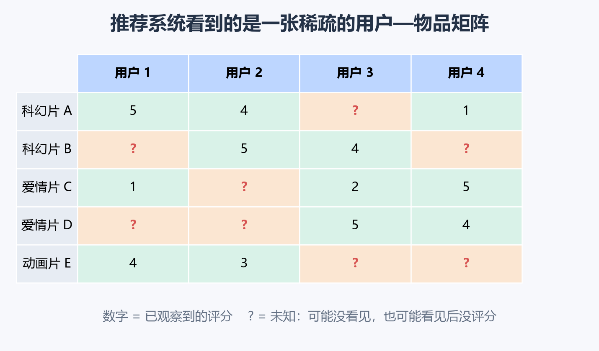
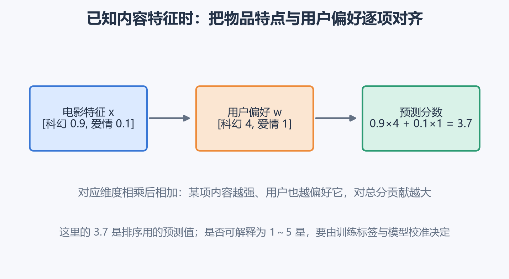
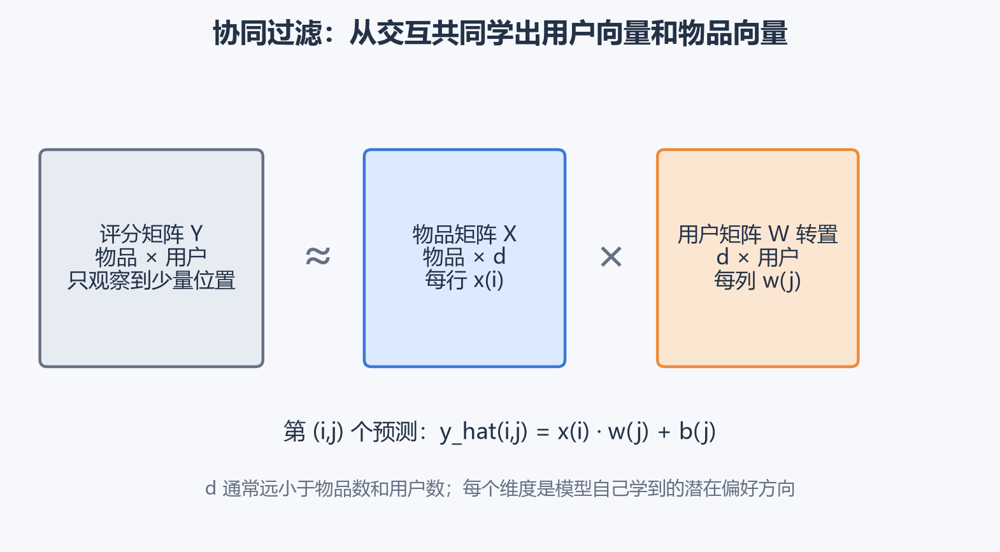
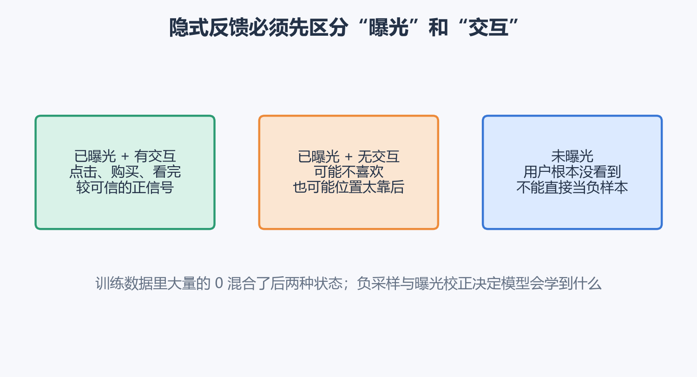
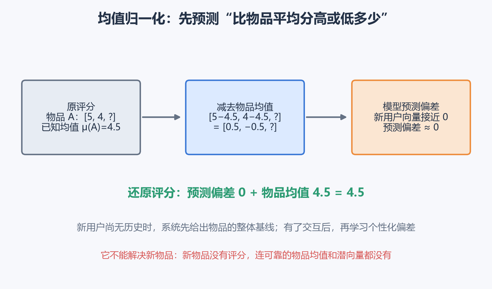
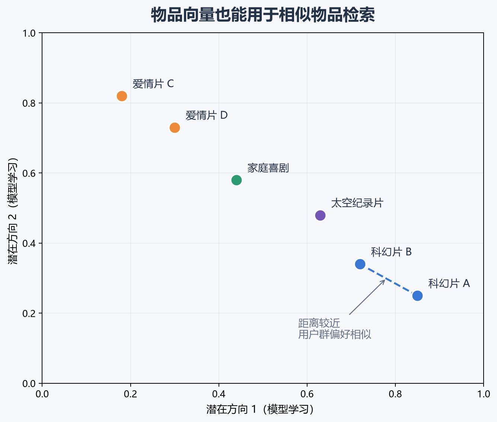
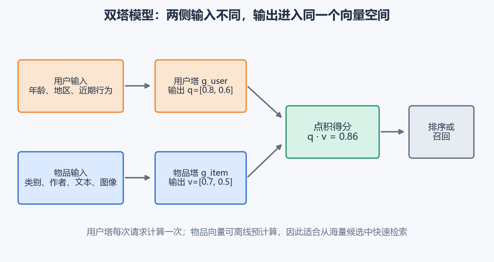
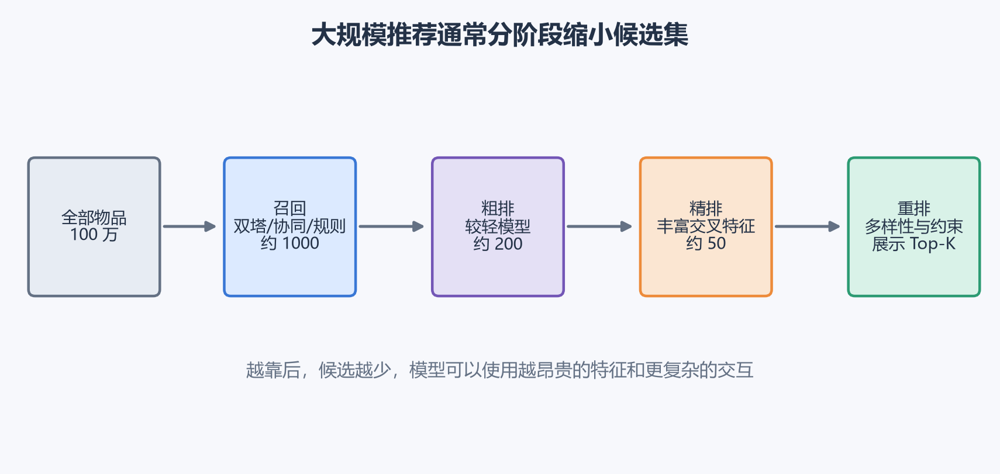
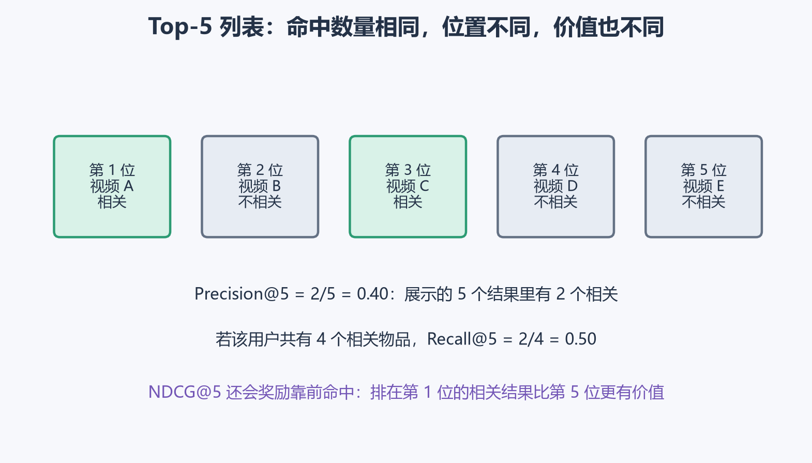
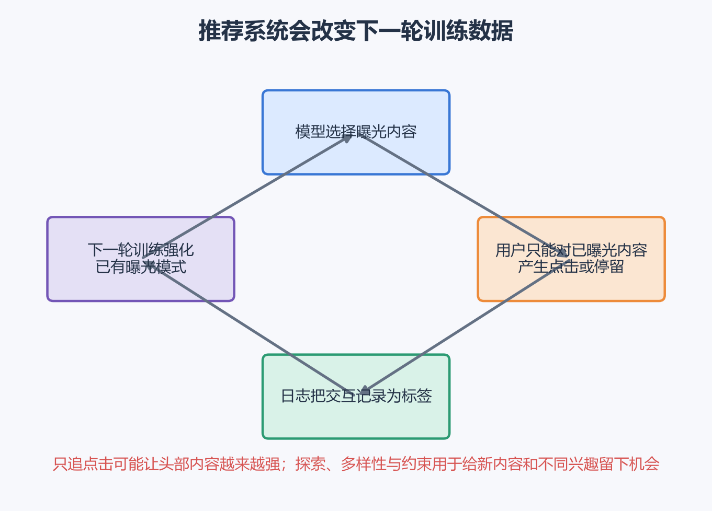

# [AI应用-推荐系统]1.协同过滤、内容推荐与双塔模型

推荐系统面对的问题可以先说得很具体：平台有很多用户和物品，也积累了一部分评分、点击、购买或观看记录，现在要估计“某个用户接下来更可能喜欢哪些物品”。电影、商品、音乐和短视频的业务对象不同，背后的数据结构却很接近。

这类系统最容易产生一个误解：没有交互记录的物品看起来像是“用户不喜欢”。实际上，它还可能从未出现在用户眼前。推荐模型既要从稀疏记录中学习偏好，也要处理曝光、冷启动、实时计算和反馈循环带来的问题。

## 一、推荐任务从一张稀疏的用户—物品表开始

假设平台有 $n_m$ 个物品和 $n_u$ 个用户，用矩阵 $Y$ 记录评分：

$$
Y\in\mathbb R^{n_m\times n_u}.
$$

第 $i$ 行代表物品 $i$，第 $j$ 列代表用户 $j$，位置 $(i,j)$ 的值写作 $y^{(i,j)}$。例如 $y^{(2,3)}=4$ 表示用户 3 给物品 2 打了 4 分。

真实数据的大部分位置都没有值，因此还需要一个观察掩码：

$$
r(i,j)=
\begin{cases}
1, & \text{观察到了用户 }j\text{ 对物品 }i\text{ 的反馈},\\
0, & \text{该位置未知}.
\end{cases}
$$

问号与数值 0 的含义必须分开：

- 问号表示未知。用户可能没有看见，也可能看见后没有留下评分；
- 0 只有在业务明确规定时才是一种已观察标签，例如“已曝光但未点击”；
- 训练显式评分模型时，通常只在 $r(i,j)=1$ 的位置计算误差。

推荐系统要补全的也不是整张表中每个空格的绝对真值。它更关心用户当前可用候选中的相对顺序：把真正可能感兴趣的内容排到前面。

## 二、物品特征已知时，可以为每位用户学习偏好

先看一个信息比较充足的情况。假设每部电影都有人工或模型提供的内容特征：

$$
x^{(i)}=
\begin{bmatrix}
x_{\text{科幻}}^{(i)}\\
x_{\text{爱情}}^{(i)}
\end{bmatrix}.
$$

$x^{(i)}\in\mathbb R^2$ 是电影 $i$ 的特征向量。第一项越大，科幻元素越强；第二项越大，爱情元素越强。再给用户 $j$ 一个偏好向量：

$$
w^{(j)}=
\begin{bmatrix}
w_{\text{科幻}}^{(j)}\\
w_{\text{爱情}}^{(j)}
\end{bmatrix},
$$

其中每一项反映相应内容特征对该用户预测分数的影响。预测公式为：

$$
\hat y^{(i,j)}={w^{(j)}}^T x^{(i)}+b^{(j)}.
$$

$b^{(j)}$ 是用户基线。有些用户习惯打高分，有些用户很少给满分，偏置可以吸收这种整体差异。

假设一部电影的特征为：

$$
x^{(i)}=[0.9,\ 0.1]^T,
$$

表示它的科幻元素很强、爱情元素很弱。某用户的偏好为 $w^{(j)}=[4,\ 1]^T$，并暂时令 $b^{(j)}=0$，则：

$$
\hat y^{(i,j)}
=4\times0.9+1\times0.1
=3.7.
$$

这次点积可以逐项理解：科幻部分贡献 $3.6$，爱情部分贡献 $0.1$，总分为 $3.7$。物品在某个方向上的特征越强，同时用户对该方向越偏好，这一项对总分的贡献就越大。

对用户 $j$，只使用已经观察到的评分学习参数：

$$
J_j(w^{(j)},b^{(j)})
=\frac12\sum_{i:r(i,j)=1}
\left(\hat y^{(i,j)}-y^{(i,j)}\right)^2
+\frac{\lambda}{2}\|w^{(j)}\|_2^2.
$$

误差项让预测接近用户真实评分；正则化系数 $\lambda$ 控制偏好向量的幅度。$lambda$ 过小，用户交互很少时容易学出极端偏好；$lambda$ 过大，所有用户向量都会被压得很小，个性差异也随之减弱。

这种方法依赖可靠的物品特征。若电影只有标题和编号，没有“科幻程度”之类的标注，就需要让模型从大量用户的共同选择中反推出潜在特征。

## 三、协同过滤同时学习物品向量与用户向量

协同过滤利用的直觉是：喜欢相似物品的用户可能具有相似偏好，被相似用户共同喜欢的物品也可能彼此接近。这里的“协同”来自许多用户的行为相互提供信息。

给每个物品一个待学习向量 $x^{(i)}\in\mathbb R^d$，给每个用户一个待学习向量 $w^{(j)}\in\mathbb R^d$。预测仍然使用：

$$
\hat y^{(i,j)}={x^{(i)}}^T w^{(j)}+b^{(j)}.
$$

变化在于 $x^{(i)}$ 不再由人工填写，它和用户向量一起从交互数据中学出来。$d$ 是潜在维数，通常远小于用户数和物品数。

把所有物品向量按行组成：

$$
X=
\begin{bmatrix}
{x^{(1)}}^T\\
{x^{(2)}}^T\\
\vdots\\
{x^{(n_m)}}^T
\end{bmatrix}
\in\mathbb R^{n_m\times d},
$$

把所有用户向量按行组成 $W\in\mathbb R^{n_u\times d}$，那么整张预测矩阵可以写成：

$$
\hat Y=XW^T+\mathbf 1b^T.
$$

$XW^T$ 的形状是 $(n_m,d)(d,n_u)=(n_m,n_u)$，正好对应物品行、用户列。$mathbf 1b^T$ 把每位用户的偏置加到该用户所在的整列。

### 用两个潜在方向算一次预测

假设模型学到：

$$
x^{(A)}=[0.9,\ 0.2]^T,
\qquad
w^{(1)}=[4.0,\ -1.0]^T,
\qquad
b^{(1)}=0.3.
$$

则用户 1 对物品 A 的预测为：

$$
\hat y^{(A,1)}
=0.9\times4.0+0.2\times(-1.0)+0.3
=3.7.
$$

第一维贡献很强的正分，第二维略微扣分，用户基线再补 $0.3$。这些潜在维度可能与“科幻”“爱情”等人类概念相关，也可能混合了题材、年代、节奏和受众等多种因素。模型只需要它们能解释共同的交互模式，并不保证每一维都能单独命名。

### 只在已观察位置上拟合

联合训练的目标可以写为：

$$
\begin{aligned}
J(X,W,b)=
&\frac12\sum_{(i,j):r(i,j)=1}
\left({x^{(i)}}^Tw^{(j)}+b^{(j)}-y^{(i,j)}\right)^2\\
&+\frac{\lambda_x}{2}\sum_i\|x^{(i)}\|_2^2
+\frac{\lambda_w}{2}\sum_j\|w^{(j)}\|_2^2.
\end{aligned}
$$

一次训练更新会同时调整物品向量和用户向量。某部电影被很多偏好相近的用户打高分时，它会逐渐靠近这些用户向量指向的方向；用户又会根据自己喜欢和不喜欢的物品更新位置。两侧互相提供学习信号。

正则化需要同时约束两侧，因为点积存在缩放自由度：把物品向量放大 10 倍、用户向量缩小 10 倍，点积仍然不变。若完全不约束，向量尺度可能失去控制。

经典矩阵分解直到今天仍是重要基线，也是理解嵌入推荐的基础。Google 当前的推荐系统课程仍把它作为协同过滤的核心形式，同时指出观测目标的选择会影响模型倾向热门物品还是长尾物品。[Google：协同过滤与矩阵分解](https://developers.google.com/machine-learning/recommendation/collaborative/matrix)

## 四、评分、点击和购买提供的监督信号并不相同

1～5 星评分属于**显式反馈**：用户主动表达了偏好强度。实际产品中更常见的是**隐式反馈**，例如曝光、点击、播放时长、收藏、加购和购买。

对“是否点击”建模时，可以用 sigmoid 把模型分数 $s^{(i,j)}$ 转成概率：

$$
p^{(i,j)}=\sigma(s^{(i,j)})
=\frac{1}{1+e^{-s^{(i,j)}}}.
$$

$s$ 增大时，预测点击概率增大。若样本标签 $y\in\{0,1\}$，单个样本的二元交叉熵为：

$$
\mathcal L
=-y\log p-(1-y)\log(1-p).
$$

点击样本 $y=1$ 会推动 $p$ 上升，明确曝光后未点击的样本 $y=0$ 会推动 $p$ 下降。不过真实日志中需要先区分三种状态。

假设用户点击了视频 A，没有点击排在首屏的 B，也没有滑到第十屏的 C：

- A 可以作为正样本；
- B 可以提供负信号，但还会受到标题、位置和当时意图影响；
- C 没有获得有效曝光，直接标成“不喜欢”会制造错误标签。

即使都叫正反馈，点击和购买的强度也不同。点击可能由好奇心驱动，购买通常更接近商业转化，长时间观看又更接近内容消费。工程上常用加权损失、多任务学习或分阶段模型，让不同信号承担不同角色。

未交互候选数量极大，训练时不可能把它们全部拿来计算。常见做法是从未点击集合中抽取一部分负样本。采样分布会改变训练难度：只随机抽冷门物品，负样本太容易；只抽最热门物品，又可能过度惩罚曝光不足的内容。针对隐式反馈，BPR 通过“用户更偏好正物品而非未观察物品”的成对排序目标训练模型，是经典且仍有价值的思路。[BPR 原始论文](https://arxiv.org/abs/1205.2618)

## 五、均值归一化把评分基线与个性偏差分开

评分矩阵常带有明显基线差异。有的电影几乎人人高分，有的电影整体评分偏低；不同用户也有宽松或严格的打分习惯。原课程使用按物品均值归一化，让模型先预测“比这部物品的平均分高或低多少”。

对物品 $i$，只在已有评分上计算均值：

$$
\mu_i=
\frac{\sum_{j:r(i,j)=1}y^{(i,j)}}
{\sum_{j:r(i,j)=1}1}.
$$

然后对已观察评分做中心化：

$$
\tilde y^{(i,j)}=y^{(i,j)}-\mu_i.
$$

模型拟合的是偏差 $\tilde y$，预测原始评分时再把均值加回来：

$$
\hat y^{(i,j)}={x^{(i)}}^Tw^{(j)}+b^{(j)}+\mu_i.
$$

例如物品 A 只有两个评分 5 和 4，物品均值是 $4.5$。中心化后的标签是 $0.5$ 和 $-0.5$。一个刚注册的新用户还没有交互，其用户向量与偏置可以初始化为接近 0，于是个性化偏差也接近 0，最终预测约为：

$$
0+4.5=4.5.
$$

这让新用户先看到整体口碑较好的物品，随后再用他的行为修正个性化偏差。

它只能缓解“新用户没有历史”的一部分问题。新物品没有任何评分时，可靠的物品均值和协同向量都无法从交互中得到。此时必须依靠内容特征、编辑规则、探索流量或其他先验。

## 六、学到的物品向量还能寻找相似物品

协同过滤训练完成后，每个物品都有向量 $x^{(i)}$。要为当前物品 $i$ 找相似物品，可以计算欧氏距离：

$$
d(i,k)=\|x^{(i)}-x^{(k)}\|_2,
$$

或在向量归一化后计算余弦相似度：

$$
\operatorname{sim}(i,k)
=\frac{{x^{(i)}}^Tx^{(k)}}{\|x^{(i)}\|_2\|x^{(k)}\|_2}.
$$

欧氏距离越小越相似，余弦值越大越相似。这里的相似反映用户群体的共同选择，因此两件内容主题不同，也可能因为受众高度重合而靠近。

假设归一化后的两部电影向量为：

$$
x_A=[0.8,\ 0.6]^T,
\qquad
x_B=[0.6,\ 0.8]^T.
$$

它们的余弦相似度就是点积：

$$
\operatorname{sim}(A,B)
=0.8\times0.6+0.6\times0.8
=0.96.
$$

0.96 接近 1，说明两者在当前嵌入空间中的方向很接近。系统可据此生成“看过 A 的人还可能喜欢 B”的候选。若用户和物品向量没有归一化，还要判断向量长度是否携带了流行度、活跃度等信号，再决定使用点积、余弦或距离。

## 七、内容推荐用物品本身的信息应对冷启动

协同过滤主要依靠交互。当用户或物品完全没有历史时，就出现**冷启动**：

- 新用户冷启动：不知道他的兴趣；
- 新物品冷启动：不知道哪些用户会喜欢它；
- 新平台冷启动：整体交互都很少。

基于内容的推荐会显式使用双方可获得的信息。用户特征可以包括年龄区间、地区、设备、已关注主题和近期行为摘要；物品特征可以包括类别、作者、价格、标题文本、图像以及发布时间。

将原始用户信息记为 $u^{(j)}$，原始物品信息记为 $v^{(i)}$。模型分别把它们编码成同维度向量：

$$
q^{(j)}=g_u(u^{(j)})\in\mathbb R^d,
\qquad
z^{(i)}=g_i(v^{(i)})\in\mathbb R^d.
$$

随后用点积得到匹配分数：

$$
s(i,j)={q^{(j)}}^Tz^{(i)}.
$$

内容特征让新物品刚发布时就能得到一个向量。例如一部新电影没有观看记录，但它的题材、导演、演员和简介已经存在，物品编码器可以先把它放进嵌入空间。模型仍需用交互数据训练；内容信息提供了跨物品共享的特征，减少对每个物品单独积累大量反馈的依赖。

内容方法也有边界。特征缺失或质量差时，新物品向量同样不可靠；过度依赖用户已有兴趣又会不断推荐相似内容，降低探索和多样性。现代系统通常组合协同信号与内容信号。

## 八、双塔模型把用户与物品编码到同一空间

双塔（Two-tower）模型是内容推荐和大规模召回中的常见结构。用户塔接收用户侧特征，物品塔接收物品侧特征。两座塔的输入维度与网络结构可以不同，但输出必须具有相同维数 $d$，这样才能计算点积或余弦相似度。

例如用户塔输出：

$$
q=[0.8,\ 0.6]^T,
$$

某物品塔输出：

$$
z=[0.7,\ 0.5]^T.
$$

匹配分数为：

$$
s=q^Tz
=0.8\times0.7+0.6\times0.5
=0.86.
$$

对另一件物品 $z'=[-0.2,0.9]^T$，分数为：

$$
s'=0.8\times(-0.2)+0.6\times0.9=0.38.
$$

在其他条件相同时，第一件物品会排在第二件前面。0.86 本身不是点击概率，它是匹配强度；只有经过特定概率模型和校准后，分数才能解释成概率。

双塔适合召回，关键原因是两侧在打分前没有逐候选交叉：

1. 物品塔可以离线计算全部物品向量并建立近似最近邻索引；
2. 请求到来时只计算一次用户向量；
3. 使用向量检索，从百万级物品中快速找出高点积候选。

代价是用户和物品只能通过低维向量交互，很多细粒度关系会被压缩。例如“用户在雨天通过手机搜索附近且仍营业的餐厅”包含大量上下文交叉，单个点积未必足以表达。因此召回之后通常还会接一个能读取双方交叉特征的排序模型。

TensorFlow Recommenders 当前教程仍把双塔表述为检索模型的标准形式：查询塔生成 query embedding，候选塔生成 candidate embedding，再通过得分和候选采样损失训练。[TensorFlow Recommenders：双塔检索](https://www.tensorflow.org/recommenders/examples/basic_retrieval)

## 九、双塔训练要让正样本超过合理的负样本

一次用户—物品正交互 $(u,i^+)$ 给出了“用户选择了物品 $i^+$”。为了学会排序，还要拿它与若干候选 $i^-$ 比较。

一种直观的成对目标是：

$$
\mathcal L_{	ext{pair}}
=-\log\sigma\left(s(u,i^+)-s(u,i^-)\right).
$$

如果正物品得分为 $2.1$，负物品得分为 $0.7$，两者差值是 $1.4$：

$$
\sigma(1.4)\approx0.80,
\qquad
\mathcal L\approx-\log0.80=0.22.
$$

如果顺序反了，正物品得分 $0.7$、负物品得分 $2.1$，差值为 $-1.4$：

$$
\sigma(-1.4)\approx0.20,
\qquad
\mathcal L\approx-\log0.20=1.61.
$$

错误排序产生更大的损失，梯度会提高正物品得分并降低负物品得分。

也可以把一个正物品与一批候选一起做 Softmax。若候选分数为 $[2.0,1.0,0.0]$，其中第一项是正物品，则正物品概率为：

$$
p_+=\frac{e^2}{e^2+e^1+e^0}\approx0.665.
$$

损失是 $-\log0.665\approx0.408$。训练会让正样本分数相对于同批负样本继续提高。

这里最重要的工程问题往往是“负样本从哪里来”。批内其他物品计算便宜，但其中可能藏着用户其实喜欢、只是本次没有点击的假负样本；只按全局频率采样又可能让热门物品出现过多。采样分布、曝光位置、时间窗口和去重策略都属于训练定义的一部分。

## 十、大规模系统把推荐拆成召回、排序与重排

若平台有 100 万件物品，复杂排序模型逐件计算会太慢。现代推荐系统通常逐层缩小候选集。

### 1. 召回：先保证可能喜欢的内容进场

召回阶段从全库找出几百到几千个候选，重点是速度和覆盖。来源可以并行组合：

- 双塔向量召回；
- 协同过滤与相似物品召回；
- 热门、关注、地理位置和新内容召回；
- 业务规则或编辑候选。

不同召回通道让系统不必把所有希望压在一个嵌入空间里。召回阶段漏掉的物品，后面的排序模型再强也无法找回来，所以常关注 Recall@K 和候选覆盖率。

### 2. 排序：使用更丰富的交叉信息估计目标

候选缩小后，排序模型可以读取更多特征：用户最近序列、物品统计、请求时间、上下文、用户与物品的交叉特征等。它可以预测点击率、观看时长、转化率或多个目标。

例如系统预计两个视频的点击概率分别为 $0.30$ 和 $0.20$，但预期观看时长分别为 20 秒和 100 秒。如果业务目标更关心有效观看，只按点击率排序就可能选错。最终分数可以组合多个经过校准的目标和约束，具体权重应通过实验验证。

### 3. 重排：处理列表整体质量

逐项得分很高的结果放在一起，不一定形成好列表。若前十条都是同一主题、同一作者或近似重复内容，用户很快会疲劳。重排会考虑：

- 多样性与去重；
- 新鲜度和时效性；
- 内容安全与合规约束；
- 库存、地域、频控等业务限制；
- 为新物品与新兴趣保留探索机会。

YouTube 的经典工业论文将系统明确拆成候选生成和排序两级；当前 Google 推荐系统资料也继续采用候选生成、打分和重排的多阶段框架。[YouTube 推荐系统论文](https://research.google/pubs/deep-neural-networks-for-youtube-recommendations/)；[Google：候选生成概览](https://developers.google.com/machine-learning/recommendation/overview/candidate-generation)；[Google：重排](https://developers.google.com/machine-learning/recommendation/dnn/re-ranking)

## 十一、离线评估要围绕 Top-K 列表进行

推荐结果通常是一张有顺序的列表，均方误差很难完整描述列表质量。常用离线指标包括 Precision@K、Recall@K 和 NDCG@K。

假设系统展示前 5 个物品，其中第 1 和第 3 个是相关物品：

$$
\operatorname{Precision@5}
=\frac{\text{前 5 个中的相关物品数}}{5}
=\frac25=0.40.
$$

它回答“展示出来的结果有多大比例相关”。如果该用户在评估集合里一共有 4 个相关物品，则：

$$
\operatorname{Recall@5}
=\frac{\text{前 5 个中找回的相关物品数}}{\text{全部相关物品数}}
=\frac24=0.50.
$$

它回答“应该找到的物品找回了多少”。增大 $K$ 往往会提高 Recall，同时可能降低 Precision。

NDCG@K 进一步考虑位置。二值相关性下，第 $k$ 位的折损累计增益可写为：

$$
\operatorname{DCG@K}
=\sum_{k=1}^{K}\frac{rel_k}{\log_2(k+1)}.
$$

$rel_k=1$ 表示第 $k$ 位相关，$rel_k=0$ 表示不相关。分母随位置增大，所以靠前命中贡献更高。再除以理想排序的 DCG，就得到 $0$ 到 $1$ 附近的 NDCG。

离线切分还要尊重时间。用未来交互训练、再预测过去，会把未来信息泄漏进模型。更合理的方式是以前一段时间训练，用之后一段时间验证；同一用户的连续行为也要避免随机打散造成不真实的提示。

离线指标改善只是上线依据之一。最终还需 A/B 测试观察点击、时长、转化、留存、投诉和长期满意度等产品结果。离线相关标签本身来自旧系统的曝光，天然带有选择偏差。

## 十二、推荐目标会通过反馈循环改变数据

推荐系统参与决定用户能看到什么，因此模型的输出会影响下一轮训练数据。

如果模型长期优先展示热门内容，热门内容会获得更多交互，新日志又会让它显得更受欢迎。新物品与小众兴趣获得的曝光越来越少，即使质量很好也缺少证明自己的机会。

单独最大化点击率也可能产生偏差：夸张标题容易得到点击，却未必带来满意观看；无限追求停留时长也可能挤压用户的长期体验。目标函数必须与真正想改善的结果保持一致，并加入必要约束。

实际系统通常还需要：

- **探索**：给不确定的新内容少量受控曝光，收集信息；
- **多样性**：避免列表被单一主题或群体占满；
- **覆盖率**：关注多少用户和物品真正得到服务；
- **安全与公平评估**：检查不同群体、内容类别和创作者的曝光与错误差异；
- **人工控制**：为高风险内容、申诉和异常流量保留审查与回滚机制。

这些工作不是排序分数算完后的装饰，它们共同决定推荐系统实际优化了什么。

## 十三、今天怎样理解这些方法的分工

课程中的协同过滤没有因为深度模型出现而失去价值。它用很少的结构捕捉用户与物品的共同偏好，训练和解释成本低，适合作为基线、相似物品来源或混合系统的一路召回。

内容模型与双塔补充了侧信息和冷启动能力，也便于预计算物品向量，适合大规模检索。它们的低维点积难以表达全部细粒度交互，因此常与更复杂的排序模型组合。

可以按数据条件理解选择：

| 数据与约束 | 更适合的起点 | 主要原因 |
|---|---|---|
| 有较多用户—物品交互，内容特征较弱 | 矩阵分解或协同过滤 | 直接从群体行为学习潜在偏好 |
| 新物品频繁出现，内容特征丰富 | 内容模型或双塔 | 新物品可在没有交互时生成向量 |
| 物品库很大、请求延迟严格 | 双塔召回 + 向量索引 | 物品向量可预计算，在线只编码用户 |
| 候选已缩小，需要利用复杂上下文 | 交叉特征排序模型 | 可以表达用户、物品与场景的细粒度关系 |
| 列表容易重复或头部集中 | 重排、探索和多样性约束 | 改善整个列表及长期数据分布 |

一个完整推荐系统可以概括为：先把用户、物品和反馈定义清楚；再选择协同信号与内容信号形成候选；用排序模型估计当前目标；最后通过重排、实验和长期指标约束系统行为。模型结构只是其中一部分，曝光日志的含义、负样本构造和目标定义往往同样决定最终结果。
