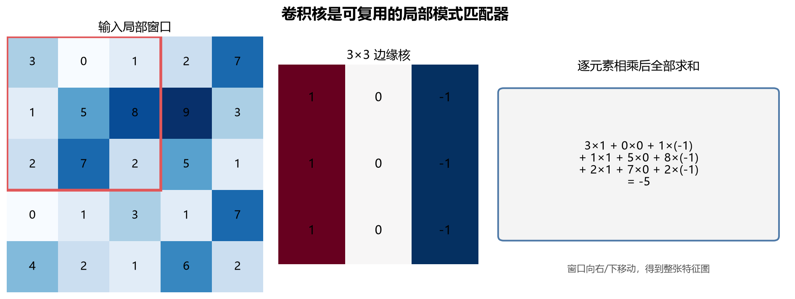
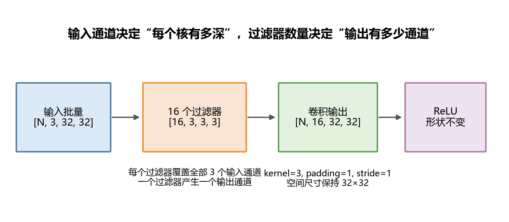
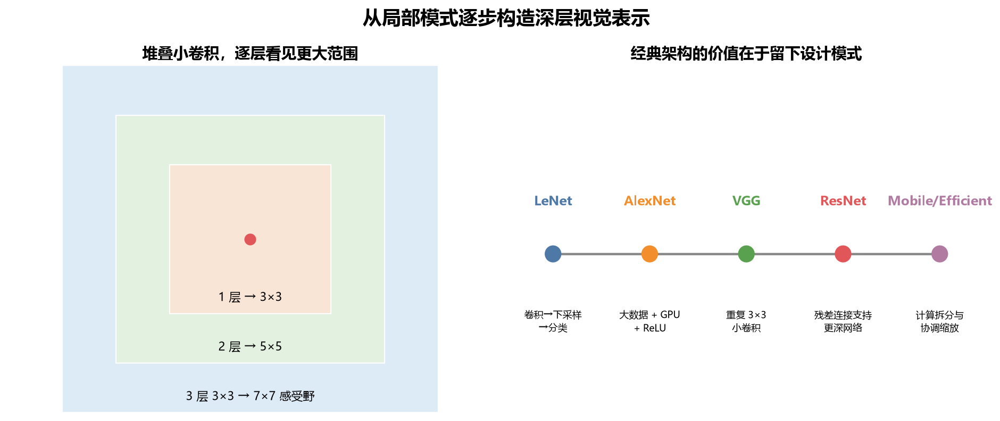
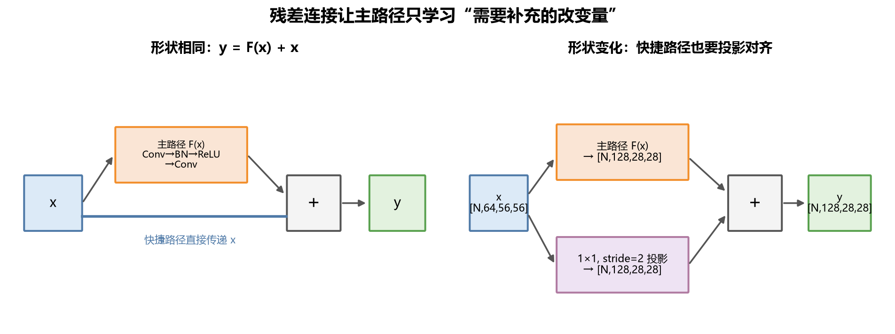
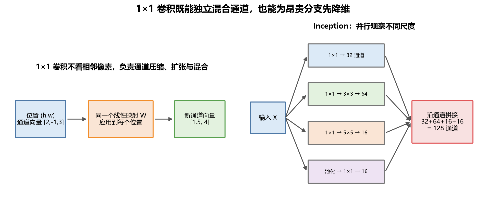
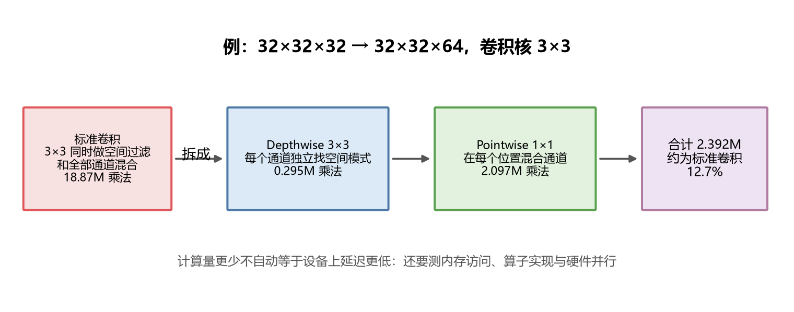
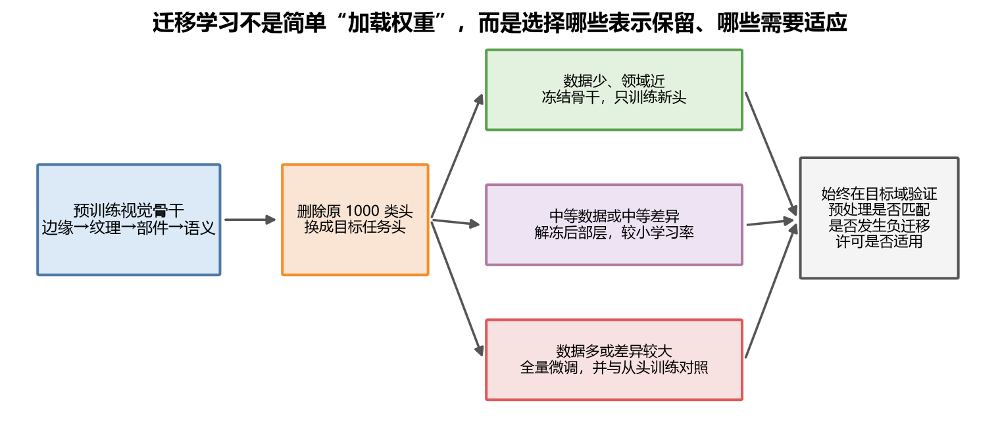
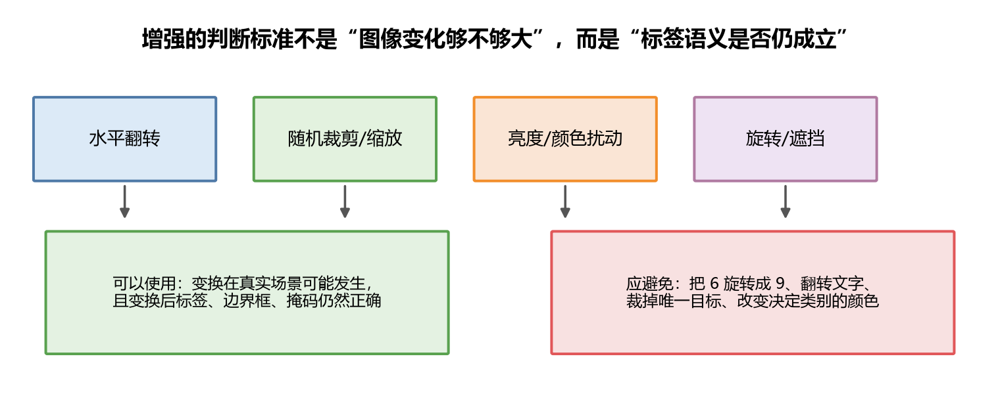

# [AI应用-计算机视觉]1.卷积网络、经典架构与迁移学习

一张图像不只是许多个互不相关的数字。相邻像素共同形成边缘，边缘组合成纹理和轮廓，轮廓再组合成物体部件。卷积网络的核心做法，就是让模型先观察小范围局部模式，再通过多层堆叠逐渐扩大观察范围。

本篇先从一次卷积到底算了什么开始，逐步说明填充、步幅、多通道、池化和感受野，然后沿 LeNet、AlexNet、VGG、ResNet、Inception、MobileNet 和 EfficientNet 梳理架构思想，最后把预训练骨干迁移到一个新视觉任务。

## 一、图像为什么不适合直接交给巨大全连接层

在 PyTorch 常用的通道优先格式中，一个图像批量写成

$$
X\in\mathbb{R}^{N\times C\times H\times W}.
$$

其中 $N$ 是图片数量，$C$ 是通道数，$H,W$ 是高度和宽度。RGB 图像的 $C=3$，三个通道分别保存红、绿、蓝的强度。

如果把一张 $224\times224\times3$ 图像直接展平，会得到

$$
224\times224\times3=150{,}528
$$

个输入特征。第一隐藏层若有 1000 个神经元，仅权重就有

$$
150{,}528\times1000=150{,}528{,}000
$$

个。更关键的问题是，全连接层不会在结构上表达“左上角的一条边缘和右下角的一条边缘可以由同一个检测器识别”。它会为不同位置分别学习连接。

卷积加入了两个符合图像特点的假设：

- **局部连接**：一个输出位置只读取附近的一小块像素；
- **参数共享**：同一个卷积核在整张图上重复使用。

局部连接让模型先学习边缘、角点和纹理；参数共享让同一种模式无论出现在图像哪个位置，都能触发同一个过滤器。卷积因此既减少参数，也把图像的空间结构写进了网络。

## 二、一次卷积到底计算了什么

可以把卷积核理解为一个小型的局部模式匹配器。先看一个垂直边缘核：

$$
K=
\begin{bmatrix}
1&0&-1\\
1&0&-1\\
1&0&-1
\end{bmatrix}.
$$

它会比较局部窗口左侧和右侧的亮度。左亮右暗时结果较大且为正，左暗右亮时为负，两侧接近时结果靠近 0。

假设输入左上角的 $3\times3$ 窗口是

$$
\begin{bmatrix}
3&0&1\\
1&5&8\\
2&7&2
\end{bmatrix}.
$$

将窗口与卷积核对应位置相乘，再把九项相加：

$$
\begin{aligned}
z_{0,0}
&=3(1)+0(0)+1(-1)\\
&\quad+1(1)+5(0)+8(-1)\\
&\quad+2(1)+7(0)+2(-1)\\
&=-5.
\end{aligned}
$$

这个 (-5) 是输出特征图左上角的一个数。卷积核继续向右、向下移动，每到一个合法位置都重复“取局部窗口、逐元素相乘、全部求和”，最终得到整张特征图。

若暂时忽略通道、填充和步幅，可写成

$$
Z_{i,j}
=\sum_{u=0}^{f_H-1}\sum_{v=0}^{f_W-1}
X_{i+u,j+v}K_{u,v}.
$$

$i,j$ 是输出位置，$u,v$ 是卷积核内部位置，$f_H,f_W$ 是核的高和宽。

严格的数学卷积会把卷积核翻转后再滑动，深度学习框架通常直接执行不翻转的**交叉相关**。由于核参数本来就要从数据中学习，网络可以直接学到所需方向，所以工程中仍习惯把这个操作叫卷积。PyTorch 的 `Conv2d` 文档也用交叉相关描述实际计算，并规定输入输出为 `[N,C,H,W]`，见 [PyTorch Conv2d 文档](https://docs.pytorch.org/docs/main/generated/torch.nn.Conv2d.html)。

## 三、填充与步幅：决定卷积核在哪里落脚

卷积核必须完整落在输入或填充区域内，才能产生一个输出。输入高度为 $H$，核高度为 $K_H$，上下各填充 $P_H$，垂直步幅为 $S_H$ 时，输出高度为

$$
H_{\text{out}}
=\left\lfloor
\frac{H+2P_H-K_H}{S_H}
\right\rfloor+1.
$$

宽度同理：

$$
W_{\text{out}}
=\left\lfloor
\frac{W+2P_W-K_W}{S_W}
\right\rfloor+1.
$$

取下整不是数学装饰，而是表示最后剩下的像素若放不下完整卷积核，就不会再生成一个位置。

例如输入为 $7\times7$，卷积核为 $3\times3$，填充 $P=1$，步幅 $S=2$：

$$
H_{\text{out}}
=\left\lfloor\frac{7+2-3}{2}\right\rfloor+1
=4.
$$

所以输出是 $4\times4$。核依次从填充后输入的第 0、2、4、6 个位置附近取样，而不是逐像素扫描。

**Valid** 通常表示不填充，即 $P=0$。**Same** 表示安排填充，使输出空间尺寸按该框架规则保持不变或接近期望大小。当步幅为 1、核为奇数正方形时，常用

$$
P=\frac{K-1}{2}.
$$

例如 $3\times3$ 核使用 $P=1$，$5\times5$ 核使用 $P=2$。但偶数核、非对称填充、膨胀卷积和大于 1 的步幅需要按完整规则计算，不能机械套用这个简式。

步幅增大能降低特征图尺寸和后续计算量，但它不是“免费的压缩”。过早使用大步幅会让小物体、细边缘和精确位置更容易消失；检测和分割任务通常比单纯分类更在意空间分辨率。

## 四、多通道卷积：一个过滤器必须同时看完所有输入通道

RGB 输入不是让同一个二维核分别扫三遍以后随意保留三张结果。普通卷积中的一个过滤器会覆盖全部输入通道，再将空间和通道上的乘积全部相加。

假设输入批量为

$$
X\in\mathbb{R}^{N\times3\times32\times32}.
$$

使用 16 个 $3\times3$ 过滤器、步幅 1、填充 1。权重形状是

$$
W\in\mathbb{R}^{16\times3\times3\times3}.
$$

第一个 16 表示有 16 个过滤器；第二个 3 表示每个过滤器都覆盖 RGB 三个输入通道；最后两个 3 是空间核尺寸。输出为

$$
Z\in\mathbb{R}^{N\times16\times32\times32}.
$$

这里最重要的对应关系是：

- 输入通道数 $C_{\text{in}}$ 决定每个过滤器有多深；
- 过滤器数量 $C_{\text{out}}$ 决定输出有多少通道；
- 一个普通过滤器读取全部输入通道，只产生一个输出通道。

带偏置时，这一层参数量为

$$
\#\text{params}
=$K_HK_WC_{\text{in}}+1$C_{\text{out}}.
$$

代入当前数值：

$$
$3\times3\times3+1$\times16=448.
$$

如果卷积后紧接 BatchNorm，线性偏置常被关闭，此时参数量是

$$
3\times3\times3\times16=432.
$$

卷积参数少不代表计算一定少。当前 432 个权重会在 $32\times32$ 个空间位置反复使用。粗略乘法次数为

$$
32\times32\times16\times3\times3\times3
=442{,}368.
$$

参数量决定模型要保存多少可学习数值，计算量还要乘上每个核被复用的空间位置数，两者不能混为一谈。

## 五、池化、感受野与位置变化

### 1. 池化是在每个通道内部做空间汇聚

最大池化在局部窗口中保留最大值。例如一个 $2\times2$ 区域

$$
\begin{bmatrix}
1&5\\
2&3
\end{bmatrix}
$$

经过最大池化得到 5，平均池化则得到

$$
\frac{1+5+2+3}{4}=2.75.
$$

普通池化不混合通道。输入 `[N,C,H,W]` 经过池化后仍有 $C$ 个通道，只改变 $H,W$。池化没有可训练权重，但窗口、步幅和填充仍是会影响信息保留的超参数。

经典网络常在每组卷积后使用 $2\times2$、步幅 2 的最大池化。现代网络也常用步幅卷积下采样，并在分类头前用全局平均池化代替大型全连接层。因此，池化是一种空间汇聚工具，并不是每个 CNN 模块都必须出现的固定步骤。

### 2. 感受野说明深层特征看到了多大区域

某个特征位置能够受到原图多大范围影响，这个范围叫**感受野**。一个 $3\times3$ 卷积直接观察 $3\times3$ 区域；连续两个步幅 1 的 $3\times3$ 卷积，第二层一个位置会间接看到 $5\times5$ 原图区域；三个则达到 $7\times7$。

这解释了深层表示怎样形成：浅层响应边缘和颜色变化，中层将它们组合成纹理、角点和部件，更深层再形成与任务相关的语义模式。不能把每个通道机械命名为某个具体物体部件，但“局部模式逐层组合、有效观察范围逐层扩大”是可靠的结构直觉。

### 3. 卷积主要提供平移等变性

同一个过滤器在不同位置复用，所以物体向右移动时，对应特征响应通常也向右移动。这叫**平移等变**：输入位置改变，特征位置跟着改变。

分类任务希望猫移动几个像素以后仍然预测为猫，这更接近**平移不变**。它不是单个卷积自动保证的，而是卷积、池化或全局汇聚、数据增强和分类头共同带来的近似稳定性。边界填充、步幅采样和裁剪都会破坏严格等变性，因此实际 CNN 只能在具体结构和变换范围内讨论这种性质。

## 六、LeNet、AlexNet 与 VGG 留下了什么

经典架构值得学习的不是逐层背诵，而是它们分别解决了当时的什么问题。

### 1. LeNet：形成卷积网络的基本骨架

LeNet 展示了

$$
\text{卷积}\rightarrow\text{下采样}\rightarrow
\text{卷积}\rightarrow\text{下采样}\rightarrow\text{分类头}
$$

这一完整流程。以课程中的现代化简化版本为例：

$$
32\times32\times1
\rightarrow28\times28\times6
\rightarrow14\times14\times6
\rightarrow10\times10\times16
\rightarrow5\times5\times16.
$$

随后展平为 $5\times5\times16=400$ 个数并进入全连接分类器。它清楚体现了经典趋势：空间尺寸逐步下降，通道数逐步增加。原始 LeNet 使用的激活、可训练下采样和部分连接与现代教学版本并不完全相同；今天它主要用于理解 CNN 骨架和小型实验。

### 2. AlexNet：证明大数据、GPU 和深层 CNN 可以结合

AlexNet 的影响不只是比 LeNet 更深。它在大规模视觉数据上使用 GPU 训练、ReLU、数据增强和 Dropout，使深层卷积网络成为大规模图像识别的重要路线。

其中一些细节带有明显时代背景：首层 $11\times11$ 大核和较大步幅会较早损失空间细节；为两块 GPU 设计的分组连接不应被当作通用规则；局部响应归一化 LRN 也很少作为现代 CNN 的默认归一化方法。AlexNet 本身通常不是新项目首选骨干，但它代表了视觉深度学习规模化的历史转折。

### 3. VGG：用重复的小卷积建立规则结构

VGG 大量使用步幅 1、填充 1 的 $3\times3$ 卷积，并在阶段之间降低空间尺寸、增加通道数。两个连续 $3\times3$ 卷积具有 $5\times5$ 理论感受野。

若输入输出通道都为 $C$，一个 $5\times5$ 卷积有

$$
25C^2
$$

个权重，两个 $3\times3$ 卷积有

$$
2\times9C^2=18C^2
$$

个权重，而且中间还能多加入一次非线性。这个例子说明，小核堆叠不只是形式统一，也能用较少参数获得相近感受野和更多非线性层。

VGG-16 的大型全连接层使总参数量很高，部署成本大。它仍适合教学、部分特征抽取和感知损失等场景，但很少是资源受限系统的效率首选。

## 七、ResNet：让新增层学习“需要补充的部分”

普通网络加深后，有时连训练误差都会变差。这不是“训练集很好、验证集变差”的过拟合，而是更深的复合映射变得难以优化。理论上新增层可以学习恒等映射来保留原网络能力，实际的非线性层却不容易精确学成复制输入。

ResNet 将目标映射写成

$$
H(x)=F(x)+x.
$$

主路径只需学习

$$
F(x)=H(x)-x,
$$

也就是相对于输入还需要补充什么。若当前最好的做法就是保留输入，主路径只需让 $F(x)\approx0$。

例如

$$
x=[2,-1,0.5],qquad
F(x)=[0.1,0.2,-0.1],
$$

则输出为

$$
y=F(x)+x=[2.1,-0.8,0.4].
$$

主路径不必重新构造完整的 `[2.1,-0.8,0.4]`，只负责学习小修正 `[0.1,0.2,-0.1]`。

若不考虑相加后的额外激活，梯度满足

$$
\frac{\partial y}{\partial x}
=\frac{\partial F(x)}{\partial x}+I.
$$

恒等项 $I$ 提供了更直接的信息和梯度通路。它不能保证任何深度下梯度都完美稳定，但显著改善了深层网络的优化条件。ResNet 的原始工作正是为了解决更深网络难训练的问题，见 [Deep Residual Learning for Image Recognition](https://arxiv.org/abs/1512.03385)。

逐元素相加要求两条路径形状一致。如果主路径把 `[N,64,56,56]` 变成 `[N,128,28,28]`，快捷路径也要使用步幅 2 的 $1\times1$ 卷积投影到 `[N,128,28,28]`，才能相加。通道不同或空间尺寸不同却直接相加，是残差网络最常见的形状错误之一。

较浅 ResNet 常用两个 $3\times3$ 卷积组成 Basic Block；更深版本常用

$$
1\times1\rightarrow3\times3\rightarrow1\times1
$$

的 Bottleneck Block，先压缩通道，在较窄空间做昂贵卷积，再扩张通道。残差连接如今也广泛存在于 Transformer、生成模型和多模态网络中；持久价值是“保留一条直接路径，让变换分支学习修正量”，而不是某一份固定层数表。

## 八、1×1 卷积与 Inception：先整理通道，再并行观察尺度

### 1. 1×1 卷积是每个位置共享的通道线性层

对多通道特征图，$1\times1$ 卷积并不是只乘一个数。在每个空间位置 $h,w$，输入是通道向量

$$
x_{h,w}\in\mathbb{R}^{C_{\text{in}}},
$$

卷积执行

$$
y_{h,w}=Wx_{h,w}+b,qquad
W\in\mathbb{R}^{C_{\text{out}}\times C_{\text{in}}}.
$$

同一个 $W$ 在每个空间位置复用。它不查看相邻像素，却可以压缩、扩张和混合通道。

例如某个位置的三个通道为

$$
x=[2,-1,3].
$$

用两个输出通道的权重

$$
W=
\begin{bmatrix}
1&0.5&0\\
0&-1&1
\end{bmatrix},qquad b=0,
$$

会得到

$$
y=Wx=[1.5,4].
$$

空间位置没变，通道从 3 个变成 2 个，并且每个新通道都是旧通道的可学习组合。

### 2. Inception 让多个尺度并行竞争

Inception 模块不预先断定只使用 $1\times1$、$3\times3$、$5\times5$ 或池化，而是建立多条并行分支，让它们分别处理输入，再沿通道维拼接。

若四条分支分别输出 32、64、16、16 个通道，并且 $H,W$ 相同，则拼接结果有

$$
32+64+16+16=128
$$

个通道。这里是通道拼接，不是 ResNet 的逐元素相加。拼接会增加通道数；相加要求形状完全相同且不会增加通道数。

Inception 还使用 $1\times1$ 瓶颈降低大核卷积的输入通道。输入为 $28\times28\times192$，直接使用 32 个 $5\times5$ 核，大约需要

$$
28\times28\times32\times5\times5\times192
=120{,}422{,}400
$$

次乘法。若先用 $1\times1$ 将 192 通道压到 16，再做 $5\times5$ 卷积，总成本约为

$$
28\times28\times16\times192
+28\times28\times32\times5\times5\times16
=12{,}443{,}648.
$$

它约是直接计算的 10.3%。压缩并非没有风险，瓶颈过窄会丢失有用表示；正确含义是先学习一个通道投影，把昂贵空间计算放到更小的通道维上。

原始 GoogLeNet 今天主要有历史和教学价值，但多尺度分支、通道拼接和先降维再做昂贵操作的思想仍被许多现代模块继承。

## 九、深度可分离卷积与轻量网络

标准卷积在一次操作中同时完成两件事：在空间上寻找局部模式，并在通道间混合信息。深度可分离卷积把它拆成两步。

1. **Depthwise 卷积**：每个输入通道使用自己的空间卷积核，不充分混合通道。
2. **Pointwise 卷积**：使用 $1\times1$ 卷积，在每个位置混合通道并产生所需输出通道。

标准 $K\times K$ 卷积的乘法次数近似为

$$
H'W'K^2C_{\text{in}}C_{\text{out}}.
$$

深度可分离卷积为

$$
H'W'K^2C_{\text{in}}
+H'W'C_{\text{in}}C_{\text{out}}.
$$

两者比例为

$$
\frac{1}{C_{\text{out}}}+\frac{1}{K^2}.
$$

例如将 $32\times32\times32$ 变成 $32\times32\times64$，核为 $3\times3$。标准卷积需要约 18.87M 次乘法；Depthwise 约 0.295M，Pointwise 约 2.097M，合计 2.392M，只是标准卷积的约 12.7%。

在 PyTorch 中，Depthwise 卷积可以通过让 `groups=in_channels` 表达；这表示每个输入通道只连接自己的过滤器组。具体约束见 [Conv2d 的 groups 说明](https://docs.pytorch.org/docs/main/generated/torch.nn.Conv2d.html)。

### 1. MobileNet v1：把空间处理与通道混合拆开

MobileNet v1 大量使用

$$
\text{Depthwise }3\times3
\rightarrow
\text{Pointwise }1\times1
$$

代替标准卷积。宽度乘子减少通道数，分辨率乘子降低图像和特征图尺寸，从而在精度、模型大小和计算量之间选择不同档位。

### 2. MobileNet v2：窄输入、宽中间、窄输出

MobileNet v2 的块通常执行

$$
\text{1×1 扩张}
\rightarrow
\text{Depthwise 3×3}
\rightarrow
\text{线性 1×1 投影}.
$$

假设输入通道为 24、扩张倍率 $t=6$，中间通道会变成

$$
24\times6=144.
$$

空间卷积在较宽的 144 通道上独立进行，最后再投影到较窄输出。低维投影后不立即使用 ReLU，避免在窄表示中把负值大量截断，因此叫**线性瓶颈**。当步幅为 1 且输入输出形状一致时，窄瓶颈之间还可以使用残差连接。这一设计来自 [MobileNetV2 论文](https://arxiv.org/abs/1801.04381)。

### 3. EfficientNet：深度、宽度和分辨率一起调整

扩大 CNN 可以增加层数、通道数或输入分辨率。只放大一个方向，其他部分可能无法利用新增资源。EfficientNet 使用复合系数同时调整

$$
d=\alpha^\phi,qquad
w=\beta^\phi,qquad
r=\gamma^\phi,
$$

其中 $d,w,r$ 分别代表深度、宽度和分辨率，$\phi$ 表示整体资源档位。由于卷积计算大致随

$$
d\,w^2r^2
$$

增长，原工作通过约束倍率，让三者协调扩大。它解决的是“有更多资源时怎样扩展整个网络”，而 MobileNet 更侧重“一个卷积块怎样更便宜”。复合缩放思想见 [EfficientNet 论文](https://proceedings.mlr.press/v97/tan19a.html)。

FLOPs 或乘法次数少，并不保证真实设备上一定更快。Depthwise 算子的内存访问、硬件并行、张量布局、批量大小和编译器实现都会影响延迟。嵌入式或移动端选型必须在目标设备测量端到端延迟、峰值内存、功耗和精度，而不能只比较论文表格中的 FLOPs。

## 十、迁移学习：复用表示，再决定解冻多少层

迁移学习的出发点是：训练好的视觉骨干已经学到边缘、纹理、形状和语义组合，新任务不必从随机权重重新发现全部规律。

假设预训练模型输出 2048 维特征，原分类头将其映射到 1000 个类别：

$$
W_{\text{old}}\in\mathbb{R}^{1000\times2048}.
$$

现在要识别 5 种工业零件，原来的 1000 类头不再适用，应替换为

$$
W_{\text{new}}\in\mathbb{R}^{5\times2048}.
$$

新头随机初始化，骨干从预训练权重开始。接下来不是机械选择“全部冻结”或“全部训练”，而要根据数据量和领域差异决定。

### 1. 数据少、领域接近：先固定特征提取器

冻结骨干参数，只训练新分类头。模型实际执行

$$
z=f_{\theta_{\text{pre}}}$x$,qquad
\hat y=g_\phi(z),
$$

其中固定 $\theta_{\text{pre}}$，只优化 $\phi$。这样要学习的参数少、训练快，也较不容易用少量数据破坏原表示。

冻结参数指将其设为不需要梯度，例如 `requires_grad=False`；这与调用 `eval()` 不是同一件事。`eval()` 改变 BatchNorm 和 Dropout 等层的运行行为，冻结则决定参数是否接收梯度。若骨干冻结但仍处于训练模式，BatchNorm 的运行统计量仍可能变化，因此两项需要分别决定。

### 2. 数据中等或语义有差异：逐步解冻后部层

先把新头训练到能工作，再解冻靠后的一个或几个阶段，并给预训练层使用比新头更小的学习率。靠前层通常更接近通用边缘和纹理，靠后层更接近源任务语义，因此后部层往往先适应。

例如新头学习率为 $10^{-3}$，解冻骨干后部可以先尝试 $10^{-4}$ 或更小，再根据验证曲线调整。这个数值只是说明分组学习率的关系，不是任何任务的固定答案。

### 3. 数据多或领域差异较大：全量微调并保留对照

自然图像预训练迁移到宠物分类通常领域较近；迁移到多光谱遥感、灰度医学影像或微小工业缺陷时，输入统计和判别线索可能明显不同。此时需要解冻更多层，选择更匹配的预训练来源，甚至将从头训练作为对照。预训练也可能带入不合适的偏好，目标域验证表现下降就是负迁移的实际信号。

迁移时还必须使用与该权重匹配的输入尺寸、插值、像素范围和归一化参数。TorchVision 当前将不同权重版本及其预处理绑定在 weights 枚举中，可通过相应 `weights.transforms()` 获取；旧式 `pretrained=True` 已被 weights API 取代。不同权重的预处理与许可也可能不同，见 [TorchVision 模型与预训练权重文档](https://docs.pytorch.org/vision/main/models)和[官方迁移学习教程](https://docs.pytorch.org/tutorials/beginner/transfer_learning_tutorial)。

课程以 ImageNet 监督预训练为主线，这一思路仍有效，但现代来源还包括自监督视觉预训练、图文对比预训练和领域专用模型。选择时应比较输入模态、目标领域、预训练数据、许可、模型大小和部署条件，而不是只看模型名称是否更新。

## 十一、数据增强：只生成标签仍然成立的变化

数据增强将训练图像随机变换为

$$
\tilde x=T(x),
$$

并假设目标关系仍然正确。分类中常写成 $\tilde y=y$，但检测、分割和关键点任务还必须同步变换边界框、掩码和坐标。

常见增强各自表达不同假设：

- 水平翻转假设左右方向不改变类别，适合许多普通物体，却未必适合文字、左右器官或方向标志；
- 随机裁剪和缩放让模型降低对固定位置和大小的依赖，但不能把唯一目标裁掉后仍沿用原标签；
- 颜色扰动模拟光照和相机变化，但颜色决定类别时不能任意改变；
- 旋转适合真实场景中方向可变的物体，却可能把数字 6 变成 9；
- 随机遮挡可减少模型只依赖一个局部线索，但遮挡过大等于删除标签证据。

因此，增强的标准不是“变化越大越好”，而是变换是否可能出现在真实目标环境中，以及变换后的监督信息是否仍然正确。训练集可以每轮随机增强；验证集和测试集通常使用固定、可复现的必要预处理，以免评价结果被随机变换扰动。

Mixup 将两张图及标签按比例混合，CutMix 将一张图的区域替换成另一张并按面积调整标签。这些方法在某些分类任务中有效，但不是检测、分割、医学或细粒度任务的无条件默认选项，应通过目标指标和消融实验验证。

## 十二、今天应怎样理解和选择视觉骨干

卷积网络没有因为视觉 Transformer 出现而失去作用。CNN 把局部连接和参数共享作为强先验，在数据有限、设备受限、需要低延迟或任务以局部纹理为主时仍很有价值；视觉 Transformer 和混合架构则提供另一种全局交互与规模化预训练路线。ViT 的原始工作也强调了大规模预训练后迁移的作用，见 [An Image Is Worth 16×16 Words](https://arxiv.org/abs/2010.11929)。

经典模型的现代定位可以这样理解：

| 架构 | 今天主要保留的价值 | 不应机械照搬的部分 |
|---|---|---|
| LeNet | 卷积、下采样、分类头的基本骨架 | 原始激活和旧式连接细节 |
| AlexNet | 大规模数据、GPU、ReLU 与增强的历史转折 | 双 GPU 分组、LRN、大核大步幅默认化 |
| VGG | 重复小卷积和阶段式增宽 | 巨大全连接头与高部署成本 |
| ResNet | 残差学习、直接信息与梯度通路 | 把某个固定深度当作所有任务答案 |
| Inception | 多尺度分支、拼接与 $1\times1$ 瓶颈 | 原始模块配置清单 |
| MobileNet | 深度可分离卷积和轻量块 | 只凭 FLOPs 判断设备速度 |
| EfficientNet | 协调缩放深度、宽度和分辨率 | 认为同一倍率适合所有硬件和任务 |

新项目通常应先明确输出任务、目标设备、延迟与内存预算，再选择有可靠预训练权重的骨干。TorchVision 当前同时提供 ResNet、MobileNet、EfficientNet、ConvNeXt、Vision Transformer 等模型系列，并为权重提供配套预处理信息；可用范围见 [TorchVision 模型目录](https://docs.pytorch.org/vision/main/models)。最终选择需要在自己的目标域上比较精度、鲁棒性、吞吐、延迟、内存和许可条件。

无论骨干名称怎样变化，本篇几条主线仍然适用：卷积用共享局部核提取空间模式，深层堆叠扩大感受野，残差连接让深层变换更容易优化，通道瓶颈和深度可分离卷积控制计算，而迁移学习复用已经学到的视觉表示。
