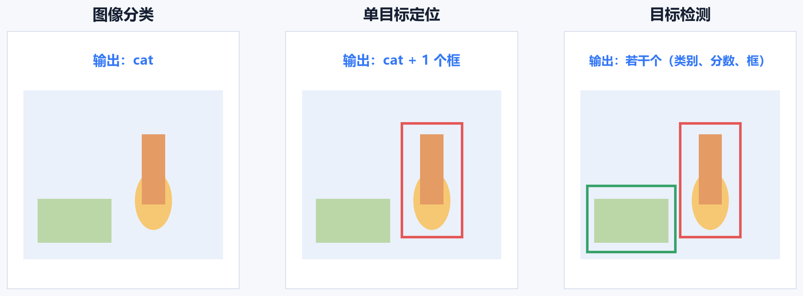
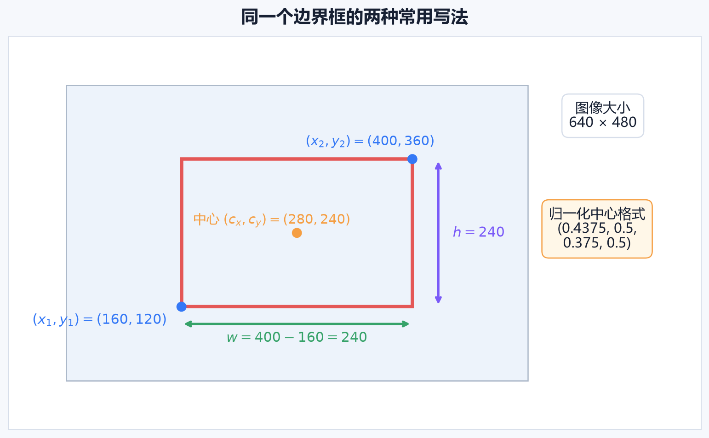
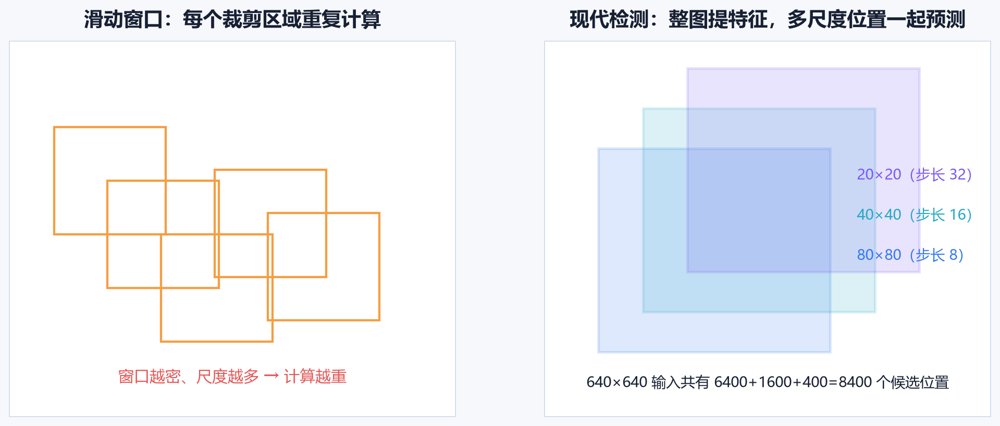
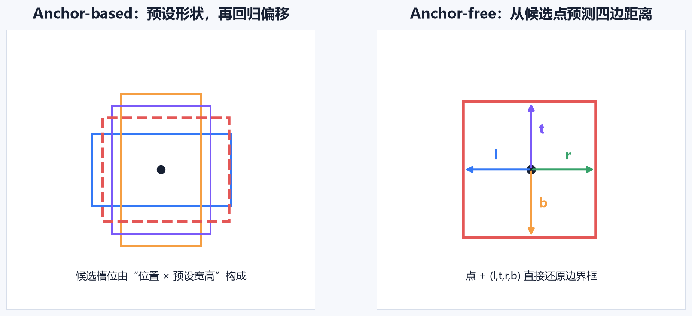
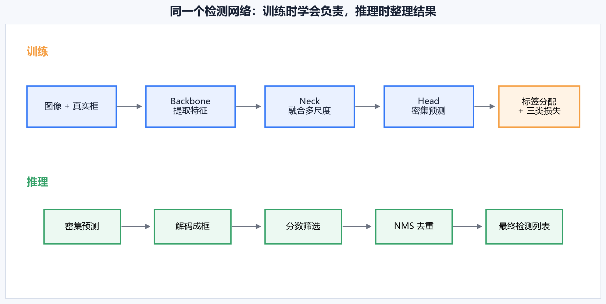
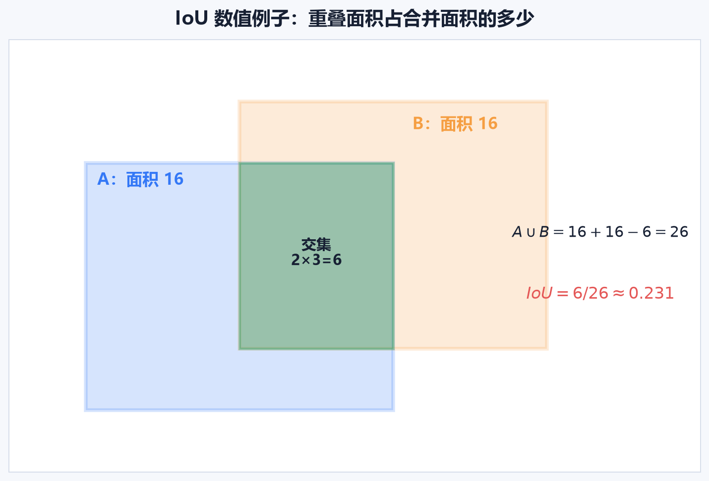
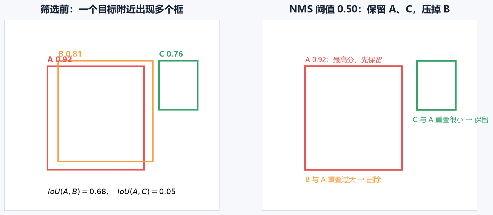
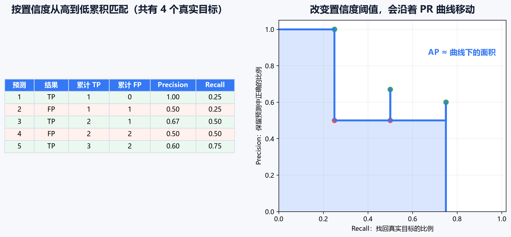
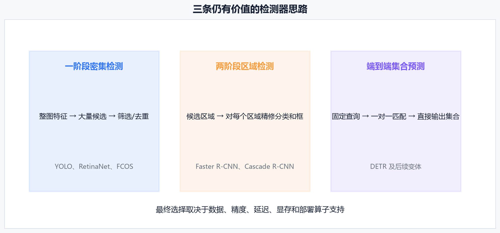

# [AI应用-计算机视觉]2.目标检测、检测器与评估指标

图像分类只需要回答“这张图里主要是什么”。真实视觉系统通常还要知道物体在哪里、共有几个，以及每个判断有多可信。目标检测（Object Detection）解决的正是这组问题：输入一张图像，输出数量不固定的检测结果；每条结果至少包含类别、置信度和边界框。

这篇文章沿着一条完整流程展开：先确定模型究竟要输出什么，再看训练时怎样把真实目标分给候选位置，随后把密集预测整理成最终框，最后用 IoU、Precision、Recall、AP 和 mAP 判断系统是否真的可用。

## 一、分类、定位与检测的输出有何不同

先看三个容易混在一起的任务：

- **图像分类**：整张图只输出一个类别，例如“猫”。
- **分类与定位**：假定图中有一个主要物体，输出“猫”和一个包住猫的框。
- **目标检测**：图中可能没有物体，也可能有很多个物体，因此输出若干条“类别、分数、边界框”。

假设一张道路图里有 2 辆车和 1 名行人，检测器的最终结果可以写成：

$$
\mathcal D=
\left\{
(\text{car},0.96,b_1),
(\text{car},0.83,b_2),
(\text{person},0.91,b_3)
\right\}.
$$

$0.96$ 是模型对第一辆车的置信分数，$b_1$ 是它的位置。集合 $\mathcal D$ 的长度随图像改变，这给神经网络带来一个直接问题：张量形状通常要固定，物体数量却不固定。

现代检测器先输出**固定数量的候选预测**。例如模型可以在多张特征图的每个位置各产生一个或多个候选框，然后通过分数筛选和去重，把几千个候选整理成最终的几条结果。模型内部保持规则张量，应用端仍能得到变长列表。

“定位”也常表示检测器中的一个子任务：模型既要判断类别，也要让预测框贴近真实框。后文说“定位损失”时，指的是这一子任务，不等同于“整张图只有一个目标”的定位任务。

## 二、边界框：先统一坐标，后面的计算才有意义

边界框（Bounding Box）用一个矩形近似表示物体的位置。轴对齐矩形常见三种写法：

$$
(x_1,y_1,x_2,y_2),\qquad
(x_1,y_1,w,h),\qquad
(c_x,c_y,w,h).
$$

- $(x_1,y_1)$ 是左上角，$(x_2,y_2)$ 是右下角。
- $(c_x,c_y)$ 是中心点。
- $w$、$h$ 分别是框的宽和高。

对于连续坐标，三种表示可按下面的关系转换：

$$
w=x_2-x_1,\qquad h=y_2-y_1,
$$

$$
c_x=\frac{x_1+x_2}{2},\qquad
c_y=\frac{y_1+y_2}{2}.
$$

反向转换为：

$$
x_1=c_x-\frac{w}{2},\quad
y_1=c_y-\frac{h}{2},\quad
x_2=c_x+\frac{w}{2},\quad
y_2=c_y+\frac{h}{2}.
$$

图中的原图大小为 $640\times480$ 像素，框为

$$
(x_1,y_1,x_2,y_2)=(160,120,400,360).
$$

所以中心和宽高为：

$$
(c_x,c_y,w,h)=(280,240,240,240).
$$

如果训练标签需要归一化到 $[0,1]$，横坐标和宽度除以图像宽 $640$，纵坐标和高度除以图像高 $480$：

$$
\left(
\frac{280}{640},
\frac{240}{480},
\frac{240}{640},
\frac{240}{480}
\right)
=(0.4375,0.5,0.375,0.5).
$$

这四个数字的直观含义是：框中心在图像宽度的 $43.75\%$、高度的 $50\%$ 处；框覆盖图像宽度的 $37.5\%$ 和高度的 $50\%$。

### 坐标约定必须随数据一起保存

同一个四元组可能表示左上角加右下角，也可能表示中心加宽高。像素坐标还涉及端点是否计入面积、图像缩放前后坐标属于哪个尺寸等约定。只要其中一处理解不同，框就会整体偏移或尺寸错误。

工程中至少要明确：

1. 格式是 **xyxy**、**xywh** 还是 **cxcywh**；
2. 坐标是像素值还是 $[0,1]$ 归一化值；
3. 坐标属于原图、缩放图还是补边后的网络输入；
4. 推理后怎样撤销缩放与补边，映射回原图。

TorchVision 的 **box_convert** 可以在常用格式间转换；**box_iou** 接受两组形状分别为 $[N,4]$ 和 $[M,4]$ 的框，并返回 $[N,M]$ 的两两 IoU 矩阵。调用时仍需显式保证坐标格式一致。[TorchVision 检测算子文档](https://docs.pytorch.org/vision/main/ops)

## 三、训练标签：没有物体的位置不应学习一个虚构框

检测头通常同时预测三类信息：

1. **类别分数**：这个候选位置属于车、行人还是其他类别；
2. **边界框参数**：框的中心、四边距离或相对偏移；
3. **目标存在程度**：某些架构还单独预测 objectness，表示此处有目标的可信程度。

不同检测器会合并或拆分类别分数与 objectness，所以不能把某一种输出格式当成所有模型的固定标准。它们共同面对的核心问题是：一张图的大多数候选位置都对应背景，只有少量位置负责真实目标。

设第 $i$ 个候选是否被分为正样本用 $m_i\in\{0,1\}$ 表示。一个便于理解的总损失可写成：

$$
L=
\lambda_{\text{cls}}L_{\text{cls}}
+\lambda_{\text{obj}}L_{\text{obj}}
+\lambda_{\text{box}}\sum_i m_i L_{\text{box}}^{(i)}.
$$

- $L_{\text{cls}}$ 让类别判断更准确。
- $L_{\text{obj}}$ 让模型区分前景候选和背景候选；没有独立 objectness 的模型会把这部分并入分类。
- $L_{\text{box}}^{(i)}$ 衡量第 $i$ 个预测框与其匹配真实框的差异。
- 掩码 $m_i$ 保证只有正样本才回归真实框。背景位置没有“正确宽高”，强迫它学习框会给出没有意义的监督。
- 三个 $\lambda$ 调整各部分对总梯度的影响。某个权重过大时，模型可能过度追求那一项而牺牲其他目标。

早期课程常用坐标平方误差帮助理解多任务损失。当前检测器更常把分类交叉熵或 Focal Loss 与 IoU 系列定位损失组合。密集检测中背景候选远多于前景，Focal Loss 会降低大量“很容易判断为背景”的样本权重，把训练注意力放到难例上；它最初就是为一阶段密集检测中的前景—背景失衡提出的。[Focal Loss 原始论文](https://arxiv.org/abs/1708.02002)

损失函数只告诉模型“怎样改参数”，还没有回答“哪个候选负责哪个真实框”。这个标签分配问题会在第六节完整说明。

## 四、从滑动窗口到整图密集预测

最直接的检测思路是滑动窗口：从图像左上角开始裁出一个小窗口，交给分类器判断；再移动窗口，换尺寸，重复判断。

这条思路能工作，但存在两个难以同时解决的问题：

- 步长大时，窗口可能错过目标的合适位置；
- 步长小、尺度多时，相邻窗口高度重叠，卷积计算被反复执行。

全卷积检测把共享计算提前完成：整张图只经过一次骨干网络，得到特征图，然后检测头在特征图的各个位置产生预测。相邻候选共享大部分图像特征，避免每个窗口从原像素重新计算。

YOLO 的名称来自 “You Only Look Once”。原始 YOLO 将整张图一次送入网络，直接预测框和类别概率，确立了统一的一阶段检测思路。[YOLO 原始论文](https://arxiv.org/abs/1506.02640)

今天常见的检测器还会同时使用多种分辨率的特征图。假设输入为 $640\times640$，三张输出特征图的步长分别为 $8$、$16$、$32$，空间大小就是：

$$
80\times80,\qquad40\times40,\qquad20\times20.
$$

若每个位置产生一个候选，共有：

$$
80^2+40^2+20^2=6400+1600+400=8400
$$

个候选位置。高分辨率的 $80\times80$ 特征图保留更多位置细节，更适合小目标；低分辨率特征图的每个位置能综合更大范围的图像信息，更适合大目标。特征金字塔网络（FPN）通过自顶向下路径和横向连接，让不同尺度都获得较强的语义信息，这一原则仍广泛用于检测。[FPN 原始论文](https://arxiv.org/abs/1612.03144)

## 五、Backbone、Neck 与 Head 各自负责什么

现代检测器常拆成三个功能部分。

### 1. Backbone：把像素变成视觉特征

Backbone（骨干网络）接收批量图像：

$$
X\in\mathbb R^{B\times3\times H\times W},
$$

其中 $B$ 是批量大小，$3$ 是 RGB 通道数。骨干网络用卷积与残差块逐层提取边缘、纹理、局部形状和更高层语义，并产生多张具有不同空间分辨率与通道数的特征图。检测器接下来直接使用这些特征图判断类别和位置。

### 2. Neck：让不同尺度交换信息

Neck（特征融合部分）把深层的强语义信息传给高分辨率特征，也可把浅层的位置细节传向低分辨率特征。这样，小目标分支既保留密集位置，又能理解当前位置像车灯、行人还是背景。

它解决的实际矛盾是：浅层图“看得细但理解较弱”，深层图“理解更强但位置较粗”。FPN、PAN 等结构都是围绕多尺度融合设计的具体方案。

### 3. Head：把每个候选位置变成检测预测

Head（检测头）在融合后的特征上输出类别和框。若某一层为 $80\times80$，每个位置输出 $C$ 个类别分数和 4 个框参数，这一层的原始预测形状可理解为：

$$
B\times80\times80\times(C+4).
$$

如果架构还单独预测 objectness，则最后一维会再加 1；如果每个位置放置 $A$ 个 Anchor，则会再多一个候选槽位维度。实现可能把维度展平或调换，但每个数字最终都要能还原到“哪张图、哪个位置、哪个候选、哪个类别或框参数”。

## 六、标签分配：训练时决定谁来负责真实目标

一张图里只有少量真实框，检测头却会给出几千个候选。标签分配（Label Assignment）负责建立两者的对应关系：

$$
\text{真实框}\longrightarrow\text{一个或多个正样本候选}.
$$

这是训练中的步骤。推理时没有真实框，因此也没有标签分配。

早期 YOLO 的规则很直观：真实目标的中心落在哪个网格单元，就由该单元负责。这个规则适合建立基本概念，但会让同一单元内的多个目标竞争有限槽位，对密集小目标也不友好。

Anchor-based 检测通常先计算真实框与候选 Anchor 的形状或 IoU 匹配，再把满足规则的候选设为正样本。现代动态分配还会综合当前模型的分类分数、定位质量和候选位置，从多个可能位置中选出代价较小的一组正样本。于是一个真实目标可能监督多个候选，正样本数量也会随目标和训练状态变化。

用一个简化例子看“负责”的含义。某真实车框附近有 4 个候选，其匹配代价分别为：

$$
[0.21,\ 0.35,\ 0.82,\ 1.10].
$$

代价越小，候选当前越适合负责这个目标。如果规则选择最小的两个，前两个候选成为正样本：它们学习“car”并回归该真实框；后两个在这个目标上不承担定位监督。实际算法还会处理一个候选同时匹配多个目标的冲突。

标签分配影响的不只是训练标签数量。分配太严格会导致正样本少、召回率难提高；分配太宽松会引入质量差的正样本，模型可能学到模糊框。排查训练问题时，正样本数量、不同尺度承担的目标尺寸、匹配 IoU 或代价分布都值得记录。

## 七、Anchor-based 与 Anchor-free 的差别

Anchor（锚框）是在候选位置预先放置的参考矩形。Anchor-based 检测器从参考框开始预测偏移。

例如候选位置有一个宽 $80$、高 $40$ 像素的 Anchor，真实框宽 $100$、高 $50$。一种简化的宽高回归目标是：

$$
t_w=\log\frac{100}{80}\approx0.223,\qquad
t_h=\log\frac{50}{40}\approx0.223.
$$

正值表示真实框比 Anchor 更大，负值表示更小。中心偏移则描述真实中心相对 Anchor 中心移动多少。Anchor 给模型提供了框形状的起点，但也带来数量、尺寸、长宽比和匹配阈值等超参数。

Anchor-free 检测器去掉预设宽高，常从某个候选点直接预测到四条边的距离：

$$
(l,t,r,b).
$$

若候选点为 $(x,y)$，解码后的框是：

$$
(x_1,y_1,x_2,y_2)=(x-l,\ y-t,\ x+r,\ y+b).
$$

例如候选点为 $(300,220)$，预测距离为 $(40,60,80,100)$，得到：

$$
(x_1,y_1,x_2,y_2)=(260,160,380,320).
$$

这里 $l$ 变大，框向左扩；$b$ 变大，框向下扩。四个量与图像位置一一对应，便于检查预测方向是否写反。

FCOS 展示了不使用预设 Anchor、按位置进行密集预测的完整一阶段检测方案。[FCOS 原始论文](https://arxiv.org/abs/1904.01355) Anchor-free 简化了形状先验，却仍然需要多尺度特征、正样本区域定义和标签分配。Anchor-based 与 Anchor-free 都有成熟模型，选择时应比较具体实现及目标数据，不应只凭这一标签判断优劣。

## 八、从密集预测到最终检测列表

训练结束后，模型仍会产生大量原始预测。一次典型推理按以下顺序进行：

1. 输入图像按模型要求缩放、补边和归一化；
2. Backbone 与 Neck 生成多尺度特征；
3. Head 输出类别分数和框参数；
4. 将框参数解码成输入图坐标；
5. 删除置信分数过低的候选；
6. 把坐标映射回原图；
7. 对剩余重复框执行 NMS 等去重操作；
8. 输出数量不固定的检测列表。

这条流程中有三个阈值容易混淆：

- **置信度阈值**决定低于多少分的候选直接丢弃；
- **NMS 的 IoU 阈值**决定两个同类框重叠多大时视为重复；
- **评估 IoU 阈值**决定预测框与真实框重叠多大才算检测正确。

三者作用不同。调高置信度阈值通常会减少误报，也可能漏掉低分真目标；调低阈值会保留更多候选，提高潜在召回，同时给后处理带来更多误报和计算。

## 九、IoU：两个框到底重叠了多少

交并比（Intersection over Union，IoU）比较两个框的重叠程度：

$$
\operatorname{IoU}(A,B)
=\frac{|A\cap B|}{|A\cup B|}
=\frac{|A\cap B|}{|A|+|B|-|A\cap B|}.
$$

结果在 $0$ 到 $1$ 之间。$0$ 表示完全不相交，$1$ 表示两个框完全相同。

考虑两个框：

$$
A=(1,1,5,5),\qquad B=(3,2,7,6).
$$

它们的面积都是：

$$
|A|=(5-1)(5-1)=16,\qquad
|B|=(7-3)(6-2)=16.
$$

交集左上角取较大的坐标，右下角取较小的坐标：

$$
x_{\text{left}}=\max(1,3)=3,\quad
y_{\text{top}}=\max(1,2)=2,
$$

$$
x_{\text{right}}=\min(5,7)=5,\quad
y_{\text{bottom}}=\min(5,6)=5.
$$

交集宽高分别为 $2$ 和 $3$，面积为 $6$。并集面积为 $16+16-6=26$，所以：

$$
\operatorname{IoU}(A,B)=\frac{6}{26}\approx0.231.
$$

实现交集宽高时必须截断负数：

$$
w_{\cap}=\max(0,x_{\text{right}}-x_{\text{left}}),\qquad
h_{\cap}=\max(0,y_{\text{bottom}}-y_{\text{top}}).
$$

两个框不相交时，右边界可能小于左边界；若不取 $\max(0,\cdot)$，程序会算出负宽度和错误面积。

IoU 在检测中至少有三种用途：训练时匹配候选与真实框、定位损失衡量框质量、推理时判断重复框。评估里常见的 $0.5$ 只是某个判定标准。要求框更贴合时会使用 $0.75$ 或更高阈值。

## 十、NMS：从同一目标周围的重复框中留下代表

一个物体附近的多个候选位置可能都给出高分框。非极大值抑制（Non-Maximum Suppression，NMS）按分数保留代表框：

1. 将同一类别的框按置信分数从高到低排序；
2. 保留当前最高分框；
3. 计算它与其余框的 IoU；
4. 删除 IoU 超过阈值的低分框；
5. 对尚未删除的框重复以上过程。

假设三个“car”框的分数是：

$$
s_A=0.92,\qquad s_B=0.81,\qquad s_C=0.76,
$$

并且：

$$
\operatorname{IoU}(A,B)=0.68,\qquad
\operatorname{IoU}(A,C)=0.05.
$$

NMS 阈值设为 $0.50$。先保留最高分的 $A$；$B$ 与 $A$ 的 IoU 为 $0.68>0.50$，作为重复框删除；$C$ 与 $A$ 重叠很小，因此保留。最终得到 $A$ 和 $C$。

TorchVision 的 **nms(boxes, scores, iou_threshold)** 接收 $[N,4]$ 的 xyxy 框和 $[N]$ 分数，返回保留框的索引。多类别检测通常需要按类别分别抑制，**batched_nms** 会用类别索引隔开不同类别。[TorchVision NMS 文档](https://docs.pytorch.org/vision/main/ops)

NMS 也有明确局限。拥挤场景中的两个同类物体可能确实高度重叠，阈值过低会把其中一个真目标压掉；阈值过高又可能留下重复框。Soft-NMS 会衰减重叠框分数，而非立即删除。还有一类端到端集合预测检测器在训练中用一对一匹配约束重复结果，从设计上减少对 NMS 的依赖。

## 十一、Precision、Recall、AP 与 mAP 怎样评价检测器

分类任务中的 Precision 和 Recall 只要比较类别即可。检测任务还要先完成**预测框与真实框的匹配**。对于某个类别和某个评估 IoU 阈值：

1. 按置信分数从高到低排列预测框；
2. 如果预测框与某个尚未匹配的同类真实框达到 IoU 阈值，记为 TP；
3. 类别错误、定位不足或没有可匹配真实框的预测记为 FP；
4. 一个真实框只能匹配一次，后来的重复预测也记为 FP；
5. 最终仍未被任何预测匹配的真实框构成 FN。

然后计算：

$$
\text{Precision}=\frac{TP}{TP+FP},
\qquad
\text{Recall}=\frac{TP}{TP+FN}.
$$

Precision 回答“已经报出的结果里有多少是真的”；Recall 回答“所有真实目标中找回了多少”。

### 一组数字怎样形成 PR 曲线

假设数据里共有 4 个真实目标，按置信度从高到低的 5 个预测依次是：

$$
TP,\ FP,\ TP,\ FP,\ TP.
$$

逐条接纳预测后：

| 接纳到第几个预测 | 累计 TP | 累计 FP | Precision | Recall |
|---:|---:|---:|---:|---:|
| 1 | 1 | 0 | $1/1=1.00$ | $1/4=0.25$ |
| 2 | 1 | 1 | $1/2=0.50$ | $1/4=0.25$ |
| 3 | 2 | 1 | $2/3\approx0.67$ | $2/4=0.50$ |
| 4 | 2 | 2 | $2/4=0.50$ | $2/4=0.50$ |
| 5 | 3 | 2 | $3/5=0.60$ | $3/4=0.75$ |

置信度阈值从高到低移动，相当于逐渐接纳更多预测，于是得到一串 Precision–Recall 点。平均精度（Average Precision，AP）概括的是这条 PR 曲线下的面积，具体插值和采样方式由评估协议规定。

AP 必须连同条件一起理解：

- **AP50**：匹配阈值为 $\operatorname{IoU}\ge0.50$；
- **AP75**：匹配阈值为 $\operatorname{IoU}\ge0.75$，对定位更严格；
- **每类 AP**：只评价一个类别；
- **mAP**：对多个类别的 AP 求平均；某些协议还会再对多个 IoU 阈值平均。

COCO 风格的主要 AP 会在 IoU $0.50$ 到 $0.95$ 间以 $0.05$ 为步长取多个阈值再平均，同时常报告 AP50、AP75 以及小、中、大物体的 AP。[COCO 检测评估说明](https://presentations.cocodataset.org/COCO17-Detect-Overview.pdf)

因此，“mAP 为 0.45”信息不完整。还需要知道数据集、类别范围、IoU 阈值集合、最大检测数和评估实现。不同协议下的数字不能直接横向比较。

### 指标怎样指导诊断

- Precision 低：误报多。检查背景难例、标注类别边界、分数阈值和重复框。
- Recall 低：漏检多。检查小目标分辨率、正样本分配、遮挡样本、输入尺寸和阈值。
- AP50 尚可、AP75 明显低：大体能找到目标，但框贴合不够。检查框标注质量、定位损失和特征分辨率。
- 大目标 AP 高、小目标 AP 低：先确认小物体在缩放后还剩多少像素，再检查高分辨率特征层和多尺度训练。

一个 8 像素宽的目标经过下采样后可能只剩一个特征位置。此时调整 Anchor 无法恢复已经丢失的图像信息。更高输入分辨率、保留高分辨率特征、改进多尺度融合或切片推理，往往更直接。

## 十二、一阶段、两阶段与端到端集合预测

检测器名称很多，但可以从“候选怎样产生、怎样精修、怎样去重”理解三条路线。

### 1. 一阶段密集检测器

一阶段检测器直接在规则特征图位置产生大量类别和框预测，再筛选与去重。YOLO、RetinaNet、FCOS 属于这条路线。它的计算路径紧凑，常用于实时和端侧场景。

“一阶段”不代表结构一定简单。多尺度 Neck、复杂标签分配、分布式框回归和不同后处理仍会显著影响精度与速度。

### 2. 两阶段区域检测器

R-CNN 的早期版本先用外部算法提出候选区域，再对每个区域重复运行卷积网络，速度和存储成本很高，今天主要用于理解技术演进。

Fast R-CNN 先对整图共享提取特征，再从共享特征中裁出候选区域；Faster R-CNN 又引入区域建议网络（Region Proposal Network，RPN），让候选区域也由网络预测，并与后续检测头共享卷积特征。[Faster R-CNN 原始论文](https://arxiv.org/abs/1506.01497)

两阶段流程可概括为：

$$
\text{整图特征}
\rightarrow\text{候选区域}
\rightarrow\text{区域特征}
\rightarrow\text{分类与框精修}.
$$

第二阶段集中处理数量较少的候选区域，适合需要更细致区域判断的设计。实际速度和精度仍取决于骨干、输入尺寸、候选数量、实现与硬件，不能只根据“一阶段/两阶段”名称下结论。

### 3. 端到端集合预测

DETR 把检测写成集合预测：模型输出固定数量的候选槽位，训练时用二分图匹配让预测与真实目标建立一对一关系。唯一匹配约束会抑制多个槽位争抢同一真实目标，从而省去传统 Anchor 生成和 NMS 等部件。[DETR 原始论文](https://arxiv.org/abs/2005.12872)

这条路线没有消除检测中的“匹配”问题，它把匹配放进训练目标，并让全局关系建模参与预测。后续变体又针对收敛速度、小目标和多尺度特征作了大量改进。

## 十三、选择和诊断检测器时看完整系统

模型排行榜只能提供起点。一个检测器能否落地，还取决于你的数据和设备。

选择时可以按下面的顺序收集证据：

1. **明确错误代价**：漏检更严重，还是误报更严重？这决定阈值和主要指标。
2. **按场景拆分验证集**：分别统计小目标、遮挡、夜间、密集目标和不同相机的数据。
3. **同时记录精度与资源**：测量目标设备上的端到端延迟、显存或内存峰值、功耗和吞吐。
4. **检查预处理与后处理**：缩放、补边、坐标恢复和 NMS 常造成“模型正确、系统框错位”的问题。
5. **查看错误样本**：把 FP、FN、类别错和定位不足分开，指标下降才有可执行的原因。
6. **再调整结构**：小目标先看输入像素和高分辨率特征，拥挤场景再看标签分配与去重策略，类别失衡再看采样和损失。

置信度阈值也应在目标验证集上选择。安全告警可能更重视 Recall，允许人工复核一部分误报；自动分拣执行器可能更重视 Precision，避免错误动作。一个固定的“通用最佳阈值”无法同时满足这些代价。

目标检测的完整闭环可以浓缩为：

$$
\text{图像}
\rightarrow\text{多尺度特征}
\rightarrow\text{密集候选或查询}
\rightarrow\text{框与类别}
\rightarrow\text{筛选去重}
\rightarrow\text{按匹配协议评估}.
$$

只要能逐步说清每个箭头的输入、输出和判断规则，就能把 YOLO、Faster R-CNN、FCOS 或 DETR 放回同一张地图中理解，也能在指标异常时定位问题发生在哪一段。
