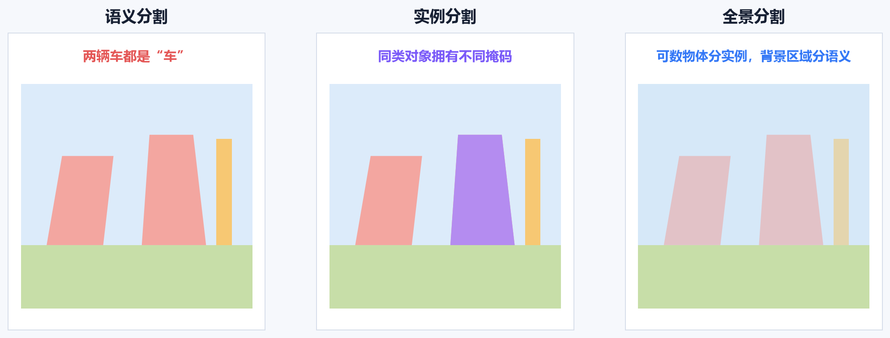
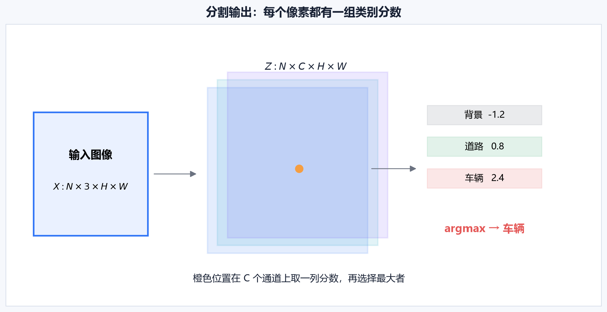
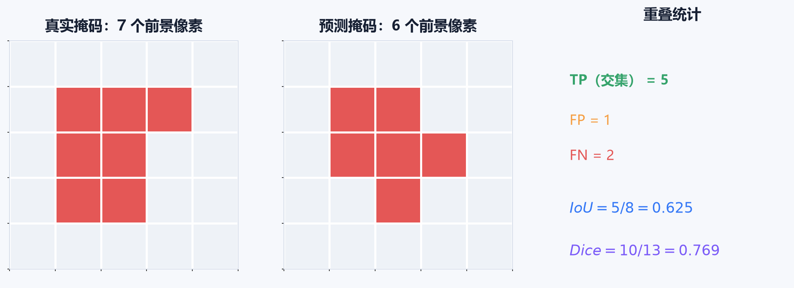
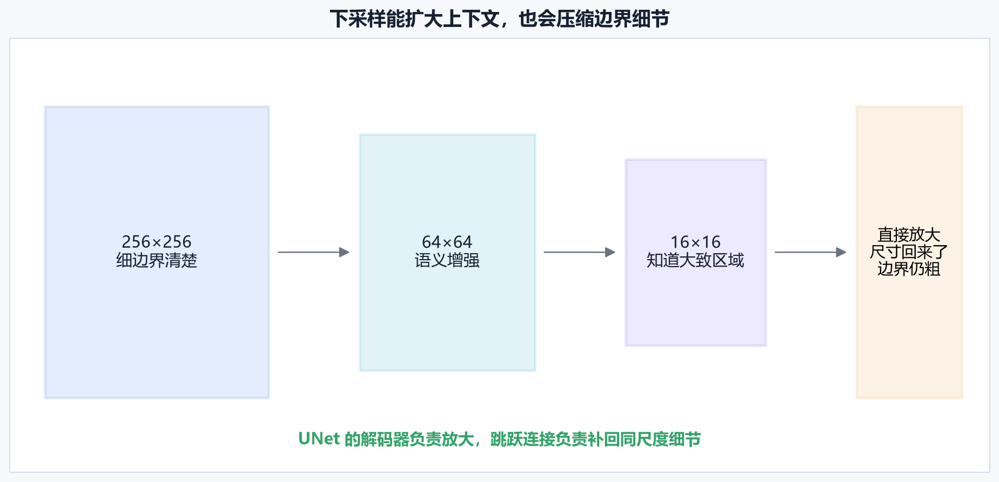
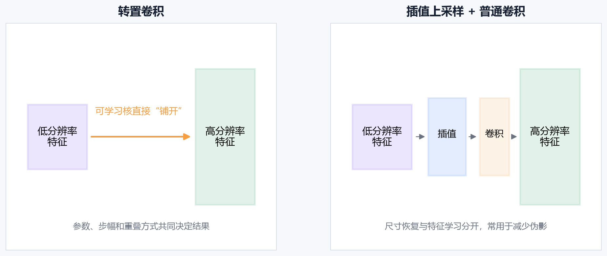
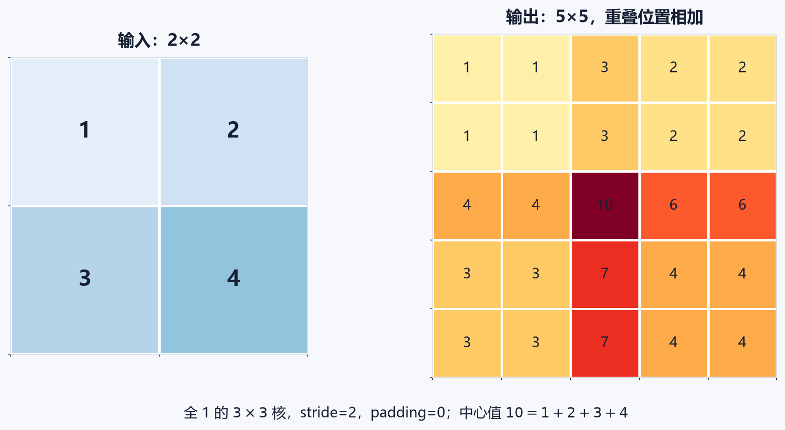
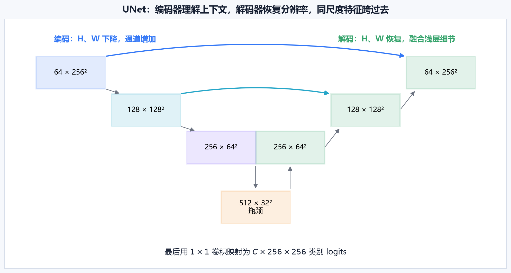
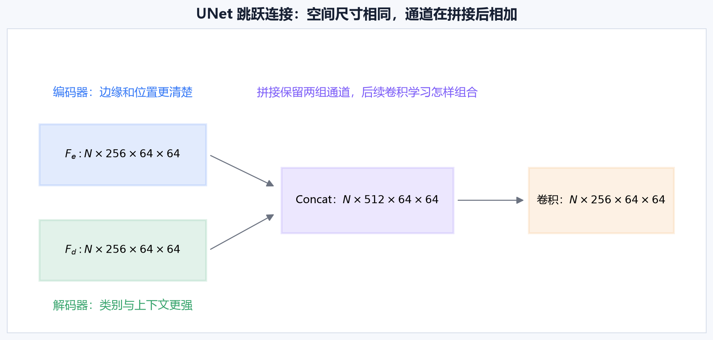

# [AI应用-计算机视觉]3.图像分割、上采样与UNet

目标检测用矩形框告诉我们“物体大致在哪里”，图像分割进一步回答“每一个像素属于什么”。道路自动驾驶要区分路面、人行道和车辆，医学影像要描出病灶边界，工业检测要找出缺陷覆盖的精确区域，这些任务都需要像素级结果。

分割的困难同时来自两端：模型既要看足够大的范围，认出某片区域是什么；又要保留足够细的位置，沿着真实边缘把区域切开。UNet 的核心价值就在这里——编码器负责理解上下文，解码器恢复空间尺寸，跳跃连接把早期的精细位置重新交给解码器。

## 一、语义分割输出的是一张类别图

语义分割（Semantic Segmentation）把每个像素分配给一个语义类别。输入若是一张 $H\times W$ 的道路图像，输出仍有 $H\times W$ 个位置，只是每个位置存放“道路、车辆、行人、背景”等类别。

它与相邻任务的区别可以这样理解：

- **语义分割**：同类像素使用同一个类别，两辆车都标成“车辆”。
- **实例分割**：除类别外，还要区分“车辆 1”和“车辆 2”。
- **全景分割**：对整张图的每个像素给出语义，并对可数物体区分实例。

语义分割适合回答“哪些像素属于道路”。如果任务需要分别计算每个零件、每颗细胞或每名行人的数量，就需要实例级结果。一个像素只能得到类别名称，并不足以把相互接触的两个同类对象拆开。

全卷积网络（Fully Convolutional Network，FCN）把分类网络改造成保持空间输出的网络，使模型可以端到端地从像素预测像素，并把深层粗语义与浅层细外观结合起来。这奠定了后续编码器—解码器分割网络的基本思路。[FCN 原始论文](https://arxiv.org/abs/1411.4038)

## 二、输入、标签和输出张量分别装什么

采用批量样本在第一维的记法，一批 RGB 图像为：

$$
X\in\mathbb R^{N\times3\times H\times W}.
$$

$N$ 是批量大小，$3$ 是 RGB 通道，$H$、$W$ 是输入高和宽。多分类语义分割的标签通常写成：

$$
Y\in\{0,1,\ldots,C-1\}^{N\times H\times W},
$$

其中 $C$ 是类别数，$Y_{n,h,w}$ 是第 $n$ 张图在位置 $(h,w)$ 的类别编号。标签没有额外的类别通道；每个位置直接存一个整数。

网络输出 logits：

$$
Z\in\mathbb R^{N\times C\times H\times W}.
$$

logit 是进入 Softmax 前的原始分数。固定一个像素 $(n,h,w)$，沿类别维取出 $C$ 个数，再选最大者：

$$
\hat Y_{n,h,w}=\arg\max_c Z_{n,c,h,w}.
$$

图中某像素的三个 logits 为 $[-1.2,0.8,2.4]$，最大值 $2.4$ 对应“车辆”，所以该像素预测为车辆。logit 本身不要求位于 $0$ 到 $1$；Softmax 会把同一像素的 $C$ 个 logits 转成和为 1 的类别概率。

### 二分类分割的两种输出方式

只有“前景/背景”两个类别时，有两种常见实现：

1. 输出 $N\times2\times H\times W$，配合 Softmax 和多分类交叉熵；
2. 输出 $N\times1\times H\times W$，配合 Sigmoid 和二元交叉熵。

两种方式都能工作，但标签形状、损失函数和阈值处理必须成套一致。第二种方式推理时常把 Sigmoid 概率大于某个阈值的像素判为前景。

## 三、像素交叉熵：把每个有效像素当作一次分类

设 $\Omega$ 是参与监督的有效像素集合。多分类像素交叉熵为：

$$
\mathcal L_{\text{CE}}
=-\frac{1}{|\Omega|}
\sum_{(n,h,w)\in\Omega}
\log p_{n,Y_{n,h,w},h,w}.
$$

$p_{n,Y_{n,h,w},h,w}$ 表示模型在该像素上分给真实类别的概率。真实类别概率越接近 1，负对数越接近 0；模型若给真实类别很低的概率，损失就会明显增大。

假设一个像素真实类别是“缺陷”，模型给三个类别的概率为：

$$
[p_{\text{背景}},p_{\text{正常表面}},p_{\text{缺陷}}]
=[0.10,0.20,0.70].
$$

这个像素贡献的损失是：

$$
-\log 0.70\approx0.357.
$$

若模型只给缺陷类别 $0.05$，损失变为：

$$
-\log0.05\approx2.996.
$$

后一种错误会产生更大的梯度信号，推动模型提高真实类别分数。

### 忽略没有可靠标签的像素

真实数据常有无法确认的边界、未标注区域或传感器无效区。把这些位置强行标成背景会教给模型错误答案。可以给它们一个特殊类别编号，并通过 **ignore_index** 从损失平均中排除。

PyTorch 的 **CrossEntropyLoss** 支持形状为 $N\times C\times H\times W$ 的输入，也提供 **weight** 和 **ignore_index** 参数，分别用于类别加权与忽略指定标签。[PyTorch CrossEntropyLoss 文档](https://docs.pytorch.org/docs/stable/generated/torch.nn.CrossEntropyLoss.html)

忽略像素不会自动消失于所有指标。计算 IoU、Dice 或可视化错误时，也要使用同一有效区域掩码，否则训练与评估会采用两套像素范围。

## 四、类别不平衡：99% 的背景会淹没 1% 的目标

考虑一张 $100\times100$ 的缺陷图，共有 10000 个像素，其中只有 100 个缺陷像素。一个模型把所有位置都预测成背景，就有：

$$
\text{像素准确率}=\frac{9900}{10000}=99\%.
$$

这个模型一个缺陷也找不到，99% 的准确率却看起来很高。因此分割很少只看像素准确率。

常见处理方法各自解决不同问题：

- **类别加权交叉熵**：给少数类别更大权重，让错过缺陷像素的代价更高。
- **Focal Loss**：降低大量容易背景像素的影响，把训练集中到难分像素。
- **Dice Loss 或 IoU Loss**：直接关注预测区域与真实区域的重叠。
- **裁剪与采样**：提高包含小目标或边界的训练样本比例。
- **区域加边界损失**：区域整体正确的同时，单独约束轮廓。

类别权重也不能无限放大。少数类标注若含有噪声，过高权重会让模型追着错误像素学习。应同时观察少数类召回、误报区域和边界质量。

## 五、IoU、Dice 和 mIoU 怎样从掩码算出来

对某个类别，可以把每个像素都当成一次二分类判断：

- $TP$：真实是该类，预测也是该类；
- $FP$：真实不是该类，预测却是该类；
- $FN$：真实是该类，预测没有选该类。

该类别的交并比为：

$$
\operatorname{IoU}
=\frac{TP}{TP+FP+FN}.
$$

Dice 系数为：

$$
\operatorname{Dice}
=\frac{2TP}{2TP+FP+FN}.
$$

两者都在 $0$ 到 $1$ 之间，越大表示重叠越好。Dice 对交集乘了 2，因此同一组预测下数值通常高于 IoU；二者不能当作相同指标直接比较。

图中的真实前景有 7 个像素，预测前景有 6 个像素，其中 5 个重叠：

$$
TP=5,\qquad FP=1,\qquad FN=2.
$$

并集像素数为 $5+1+2=8$，所以：

$$
\operatorname{IoU}=\frac{5}{8}=0.625.
$$

Dice 为：

$$
\operatorname{Dice}
=\frac{2\times5}{2\times5+1+2}
=\frac{10}{13}
\approx0.769.
$$

多分类任务会分别计算每类 IoU，再取平均：

$$
\operatorname{mIoU}
=\frac{1}{C}\sum_{c=1}^{C}\operatorname{IoU}_c.
$$

报告 mIoU 时要说明背景是否参与平均、不存在于某张图的类别怎样处理，以及统计是逐图平均还是在整个数据集累计混淆矩阵。小类别在逐图平均与全局累计下可能呈现明显不同的结果。

检测文章里的框 IoU 与这里的掩码 IoU 使用同一“交集除以并集”思想，但集合对象不同：检测比较两个矩形覆盖区域，分割直接比较像素集合。这里不需要边界框匹配或 NMS。

## 六、分类 CNN 为什么不能直接给出精细掩码

分类网络不断使用步幅卷积或池化，把空间尺寸逐步压小：

$$
H\times W
\rightarrow\frac H2\times\frac W2
\rightarrow\frac H4\times\frac W4
\rightarrow\cdots.
$$

这样做有两项收益：计算量下降，每个深层位置能综合更大范围的上下文。看到大片区域后，模型更容易判断“这是道路”或“这是器官”。

代价是精确位置被压缩。一个 $256\times256$ 的特征经过三次减半后只剩 $32\times32$。原图中相邻的多个像素可能汇入同一个深层位置，细边缘、小孔洞和窄目标的信息已经变弱。

把 $32\times32$ 特征直接放大到 $256\times256$，只恢复了数组尺寸。每个粗位置被扩成更大的区域，丢失的边界不会凭空回来。因此分割网络需要同时解决两件事：

1. **上采样**：让空间尺寸逐步回到输出分辨率；
2. **细节融合**：从较浅层特征取回边缘和位置线索。

前者由解码器完成，后者是 UNet 跳跃连接存在的主要原因。

## 七、上采样的几种路线

上采样把低分辨率特征变成更高分辨率特征。常见路线包括：

- 最近邻或双线性插值，再接普通卷积；
- 转置卷积；
- Pixel Shuffle 等通道重排方法；
- 结合多尺度特征的可学习解码器。

插值先按固定规则增加 $H$、$W$，后续卷积再学习怎样整理特征。转置卷积把尺寸扩展和特征变换放进一个可学习算子。两条路线都可用于 UNet，具体选择要看精度、伪影、算子支持、内存和目标设备速度。

双线性插值适合连续特征图；离散类别标签必须用最近邻插值。若把类别编号 0 和 2 用双线性插值混合，边界处会生成 1 之类的新编号，这个编号可能代表完全无关的类别。

## 八、转置卷积怎样把一个输入值“铺”到输出上

转置卷积（Transposed Convolution）是卷积线性算子的转置操作。若普通卷积的线性部分写成：

$$
y=Kx,
$$

转置卷积对应：

$$
z=K^\top y.
$$

$K^\top$ 表示连接关系的转置。它不保证恢复原输入，一般也没有：

$$
K^\top Kx=x.
$$

“反卷积”是常见俗称，容易让人误以为它能撤销普通卷积。更准确的理解是：每个输入值乘以一整个可学习卷积核，再按步幅把这块结果放到更大的输出画布上；多个小块覆盖同一位置时，把数值相加。

### 用一组数字走完重叠相加

输入为：

$$
X=
\begin{bmatrix}
1&2\\
3&4
\end{bmatrix},
$$

卷积核是全 1 的 $3\times3$ 矩阵，步幅 $s=2$，填充 $p=0$。输入左上角的 1 在输出左上角铺一个全 1 的 $3\times3$ 小块；右上角的 2 向右移动 2 格铺一个全 2 小块；下方两个数同理向下移动 2 格。

重叠相加后得到：

$$
\begin{bmatrix}
1&1&3&2&2\\
1&1&3&2&2\\
4&4&10&6&6\\
3&3&7&4&4\\
3&3&7&4&4
\end{bmatrix}.
$$

中心值 $10$ 来自四个小块重叠：

$$
10=1+2+3+4.
$$

真实网络的卷积核不是全 1，输入也有很多通道，但“每个输入位置贡献一个小块，重叠处求和”的机械过程保持不变。

### 输出尺寸由五个参数共同决定

一维方向的输出尺寸为：

$$
n_{\text{out}}
=(n_{\text{in}}-1)s
-2p
+d(k-1)
+o
+1.
$$

- $n_{\text{in}}$：输入长度；
- $s$：stride，输入位置在输出画布上的移动间隔；
- $p$：padding 对有效输出边界的裁剪作用；
- $d$：dilation，核元素之间的间隔；
- $k$：kernel size，卷积核尺寸；
- $o$：output padding，用来选择可能的输出尺寸。

刚才的例子里 $n_{\text{in}}=2$、$s=2$、$p=0$、$d=1$、$k=3$、$o=0$：

$$
n_{\text{out}}
=(2-1)\times2-0+1\times(3-1)+0+1
=5.
$$

因此步幅为 2 不自动等于“尺寸严格翻倍”。例如输入长度 32、核 3、步幅 2、填充 1、output padding 1 时：

$$
(32-1)\times2-2+3+1=64.
$$

这里多个参数共同得到 64。PyTorch 的 **ConvTranspose2d** 使用同一输出尺寸关系；**output_padding** 只消除步幅大于 1 时的尺寸歧义，不会给输出边缘实际补入一圈数值。[PyTorch ConvTranspose2d 文档](https://docs.pytorch.org/docs/stable/generated/torch.nn.modules.conv.ConvTranspose2d.html)

## 九、棋盘格伪影来自不均匀覆盖

当卷积核大小与步幅组合使不同输出位置被覆盖的次数不同，转置卷积容易形成周期性明暗格子。二维情况下，横向与纵向的不均匀覆盖会叠加，伪影更明显。

排查时可以先看三件事：

1. 卷积核大小能否被步幅整除；
2. 随机初始化、尚未训练的网络是否已经出现周期纹理；
3. 改成“插值上采样 + 普通卷积”后伪影是否减弱。

使用能与步幅均匀配合的核通常会改善覆盖，但训练仍可能学出高频格纹。插值加卷积把尺寸恢复和特征学习拆开，常用于降低这种结构偏好。关于不均匀重叠怎样形成棋盘格，可参考 Distill 的可视化分析。[Deconvolution and Checkerboard Artifacts](https://distill.pub/2016/deconv-checkerboard/)

转置卷积依然是有效的可学习上采样工具。选择它或插值卷积，应依据目标任务的边界质量与设备实测结果。

## 十、UNet 怎样把编码和解码连接成一条 U 形路径

UNet 最初用于生物医学图像分割。它由四部分组成：

1. **编码器**逐层下采样，提取越来越强的上下文语义；
2. **瓶颈**在最低分辨率整合较大范围的信息；
3. **解码器**逐层上采样，恢复空间分辨率；
4. **同尺度跳跃连接**把编码器的高分辨率特征送到解码器。

原论文将收缩路径与对称扩张路径结合，并依靠数据增强在较少标注图像下训练，确立了今天仍常见的 U 形结构。[UNet 原始论文](https://arxiv.org/abs/1505.04597)

编码器向下走时，$H$、$W$ 逐级减小，通道数通常增加。减少空间位置降低计算量，增加通道让网络保存更多不同类型的特征。解码器向上走时，$H$、$W$ 逐级恢复，并通过卷积把融合后的通道重新整理。

最后使用 $1\times1$ 卷积把特征通道映射成 $C$ 个类别 logits：

$$
N\times C_f\times H\times W
\longrightarrow
N\times C\times H\times W.
$$

$C_f$ 是最后一层解码特征的通道数，$C$ 是任务类别数。这个 $1\times1$ 卷积在每个空间位置共享参数，相当于对每个像素的 $C_f$ 维特征做同一个线性分类。

## 十一、跳跃连接为什么能让边界重新清楚

瓶颈特征能判断图中大致有什么，却难以单独恢复精确轮廓。编码器浅层特征的位置密、边缘清楚，但对“这条边属于器官还是噪声”的理解较弱。UNet 在同一空间尺度融合两者：

$$
F_{\text{fusion}}
=\operatorname{Concat}(F_e,F_d).
$$

设编码器特征与解码器特征分别为：

$$
F_e\in\mathbb R^{N\times C_e\times H\times W},
\qquad
F_d\in\mathbb R^{N\times C_d\times H\times W}.
$$

沿通道维拼接后：

$$
F_{\text{fusion}}
\in\mathbb R^{N\times(C_e+C_d)\times H\times W}.
$$

图中的两组特征都是 $N\times256\times64\times64$，拼接后空间尺寸仍是 $64\times64$，通道数变成 512：

$$
N\times512\times64\times64.
$$

后续卷积再把它整理为 $N\times256\times64\times64$。卷积会学习哪些浅层边缘有用、哪些深层语义应与它们组合。

这与 ResNet 的残差相加承担不同作用。残差块常计算：

$$
Y=F(X)+X,
$$

逐元素相加要求形状一致，主要帮助信息和梯度传播。原始 UNet 通常沿通道拼接，目的是完整保留编码端与解码端两组特征，再交给卷积融合。

## 十二、沿着一组形状走完 UNet

假设输入为：

$$
X\in\mathbb R^{N\times3\times256\times256},
$$

卷积采用保持空间大小的填充，每次下采样把高宽减半。一个简化 UNet 的形状变化如下：

| 阶段 | 输出形状 | 这一步在做什么 |
|---|---|---|
| 编码块 1 | $N\times64\times256\times256$ | 保留精细边缘 |
| 下采样 1 | $N\times64\times128\times128$ | 扩大每个位置看到的范围 |
| 编码块 2 | $N\times128\times128\times128$ | 提取中层结构 |
| 下采样 2 | $N\times128\times64\times64$ | 继续压缩空间 |
| 编码块 3 | $N\times256\times64\times64$ | 形成较强语义 |
| 下采样 3 | $N\times256\times32\times32$ | 进入最低尺度 |
| 瓶颈 | $N\times512\times32\times32$ | 汇总大范围上下文 |
| 上采样 | $N\times256\times64\times64$ | 恢复到第三层尺度 |
| 与编码块 3 拼接 | $N\times512\times64\times64$ | 加入同尺度位置细节 |
| 解码卷积 | $N\times256\times64\times64$ | 融合并压缩通道 |
| 上采样并拼接 | $N\times256\times128\times128$ | 与编码块 2 融合 |
| 解码卷积 | $N\times128\times128\times128$ | 整理第二级特征 |
| 上采样并拼接 | $N\times128\times256\times256$ | 与编码块 1 融合 |
| 解码卷积 | $N\times64\times256\times256$ | 形成全分辨率特征 |
| $1\times1$ 分类卷积 | $N\times C\times256\times256$ | 给每个像素输出 $C$ 个 logits |

拼接前必须保证两张特征图的 $H$、$W$ 一致。原始 UNet 使用不填充卷积，对应编码特征需要裁剪。现代实现常用保持尺寸的填充，但输入尺寸若不能被总下采样倍数整除，仍可能差 1 个或几个像素。

解决方式可以是输入前补边、拼接前裁剪或把解码特征插值到明确目标尺寸。不要只写“放大 2 倍”并假定一定对齐；应在每一级打印或记录实际张量形状。

## 十三、分割训练中图像和标签必须同步变化

训练分割模型时，随机裁剪、翻转、旋转和缩放必须同时作用于图像与掩码，并使用同一组几何参数。图像向右翻转而标签不翻转，相当于把每个像素的答案移到错误位置。

处理图像与掩码时还要区分数据性质：

- 图像是连续颜色，可用双线性插值；
- 类别掩码是离散编号，只能用最近邻插值；
- 归一化只作用于图像，不应改动类别编号；
- 随机颜色变化只作用于图像，不应改变掩码；
- ignore index 在裁剪、补边和指标计算中要保持一致。

完整训练流程是：

$$
\text{图像与掩码同步增强}
\rightarrow\text{编码器}
\rightarrow\text{解码器与跳跃融合}
\rightarrow\text{像素 logits}
\rightarrow\text{有效像素损失}
\rightarrow\text{反向传播}.
$$

推理时从 logits 取每像素类别，再撤销输入缩放和补边，把掩码映射回原图。输出若用于测量面积，还要结合像素对应的真实空间尺寸；像素数本身不是平方毫米或平方米。

## 十四、今天怎样使用 UNet 和其他分割模型

UNet 的具体卷积层配置来自 2015 年，但它的核心结构没有过时：编码器—解码器、多尺度表示、同尺度跳跃融合和全分辨率输出仍广泛使用。实际项目常替换为预训练编码器，或加入残差块、注意力、三维卷积、多尺度监督与边界损失。

模型选择可按任务需求划分：

- 医学、遥感、工业缺陷和小数据任务：UNet 及其变体常是清晰、可靠的起点；
- 通用语义分割：DeepLab、SegFormer 等结构提供不同的上下文建模和效率选择；
- 同时处理语义、实例与全景分割：Mask2Former 用掩码分类统一多种分割任务。[Mask2Former 原始论文](https://arxiv.org/abs/2112.01527)
- 交互式标注或提示驱动分割：Segment Anything 一类模型可根据点、框或掩码提示生成候选区域。[Segment Anything 原始论文](https://arxiv.org/abs/2304.02643)

通用预训练模型并不会自动满足每个工业或医疗任务的边界精度、类别定义和可靠性要求。仍要用目标域数据评估，检查小区域、薄结构、相邻同类目标与模糊边界。

选择模型时至少同时比较：

1. 每类 IoU、Dice 与边界质量；
2. 小目标和少数类的召回；
3. 原图尺寸下的显存、延迟和吞吐；
4. 上采样与动态尺寸算子在目标设备上的支持；
5. 掩码后处理是否会抹掉真实的小区域。

分割网络最终要完成的因果链很清楚：

$$
\text{大范围上下文帮助判断类别}
\quad+\quad
\text{高分辨率特征帮助确定边界}
\quad\longrightarrow\quad
\text{可靠的逐像素掩码}.
$$

上采样只负责恢复尺寸，跳跃连接补充空间细节，损失函数决定模型重视哪些错误，IoU 与 Dice 再从区域重叠角度检查结果。把这四部分分开理解，就能判断问题究竟来自网络结构、标签处理、类别失衡还是评估协议。
