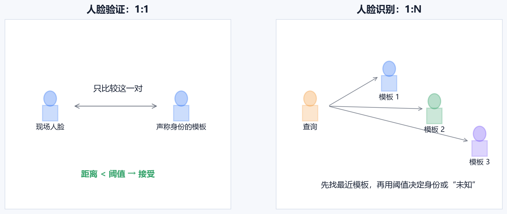
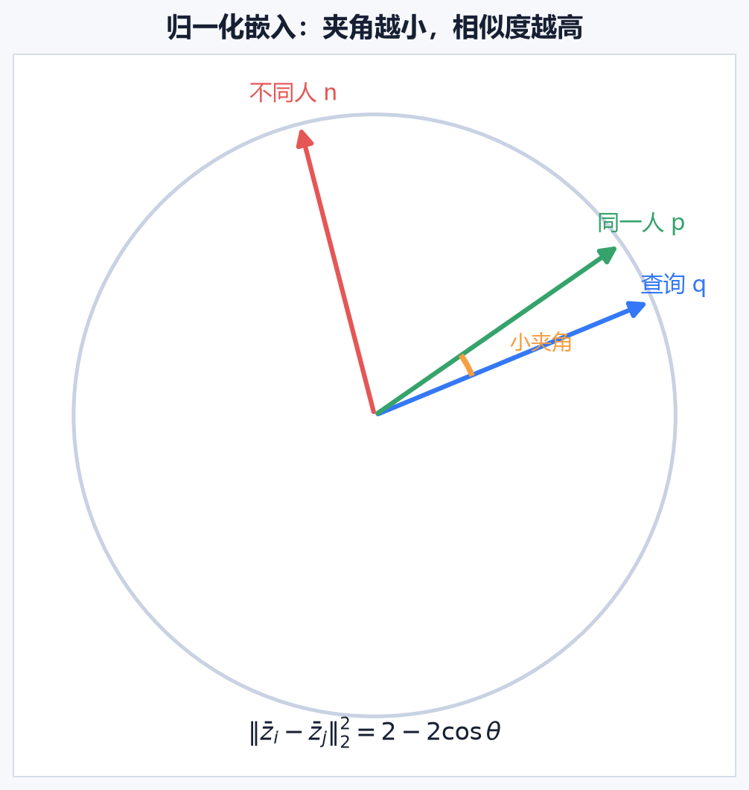
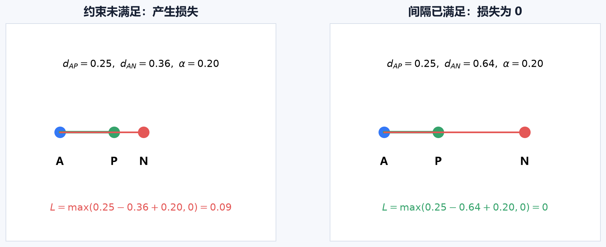
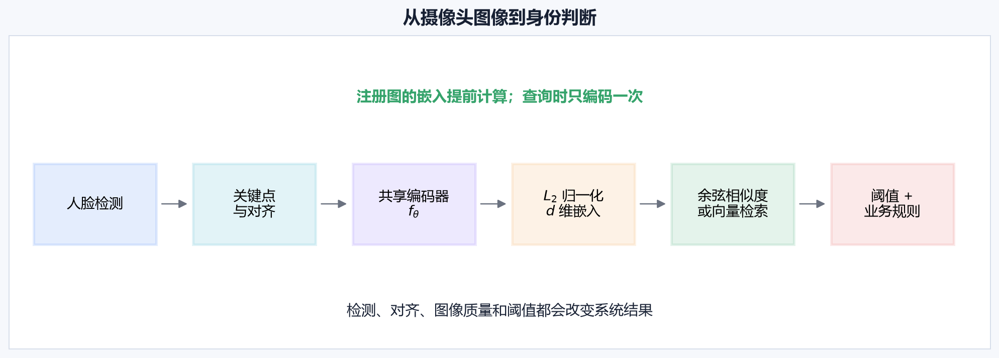
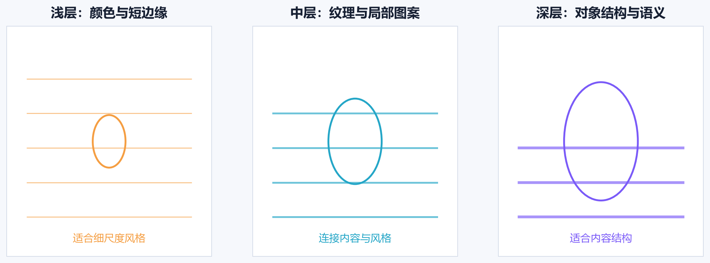
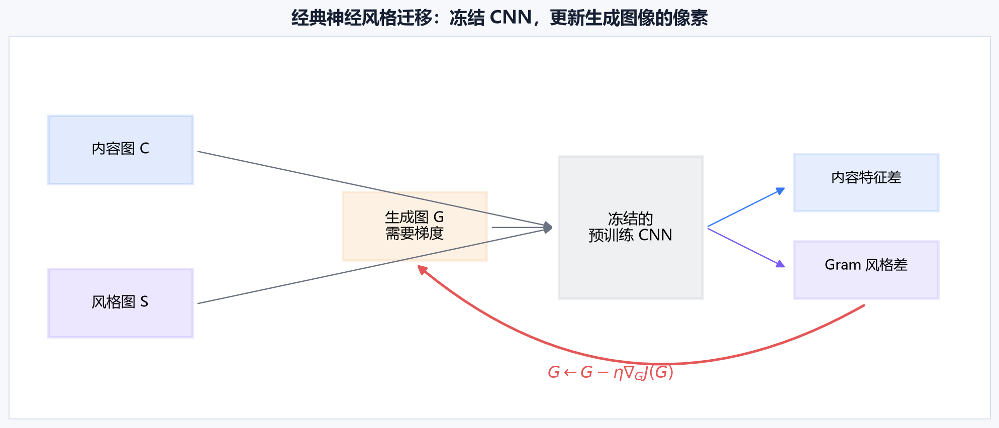
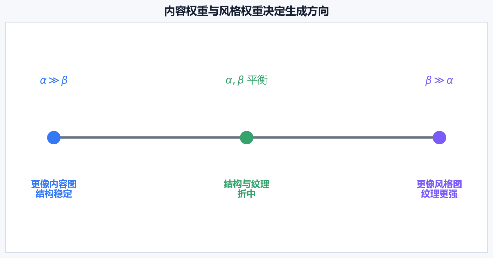
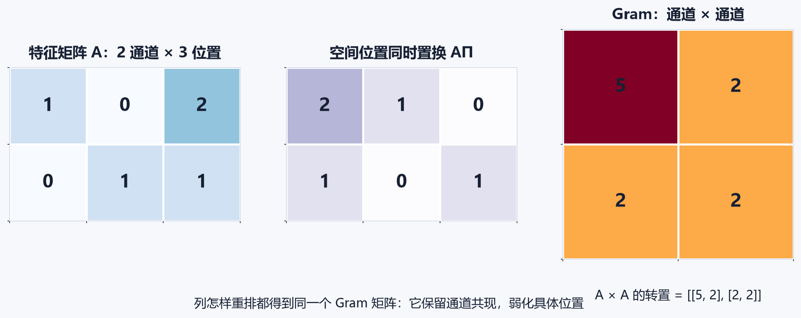
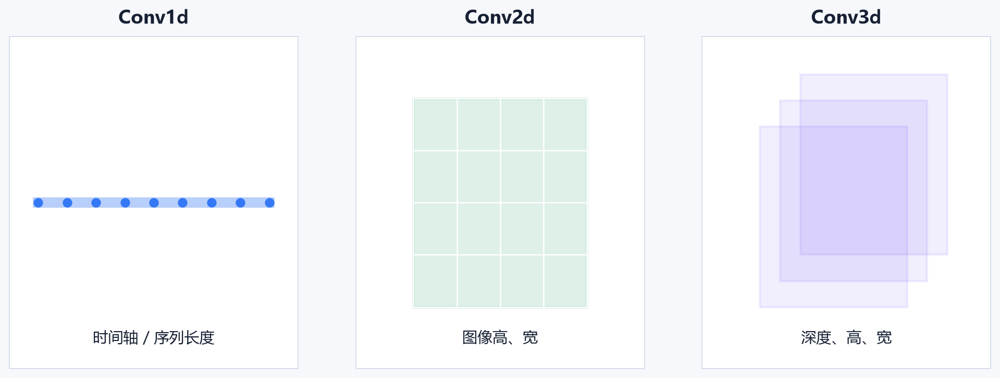

# [AI应用-计算机视觉]4.人脸表征、度量学习与神经风格迁移

这一篇包含两个看起来差异很大的任务。人脸识别要把图像压缩成可以比较身份的向量；神经风格迁移要借助卷积网络的中间特征，重新生成一张图像。它们共享一个关键思想：卷积网络的中间表示比原始像素更适合描述视觉概念。

两条主线的目标必须分清。人脸系统通过训练塑造一个“同一身份靠近、不同身份分开”的嵌入空间；经典风格迁移固定已经训练好的特征网络，用内容特征和风格统计反向调整生成图像的像素。

## 一、人脸验证与人脸识别解决的问题不同

**人脸验证（Face Verification）**是 $1:1$ 比较。输入是一张现场人脸、一个声称的身份，以及该身份的注册模板。系统只回答：“现场人脸是否与这份模板属于同一个人？”

手机解锁、门禁核验和证件照比对都属于这类任务。

**人脸识别（Face Identification）**是 $1:N$ 搜索。输入一张身份未知的人脸，系统要在 $N$ 个注册身份中找出最相似者；如果没有任何候选足够相似，还要输出“未知”。

设查询人脸的嵌入为 $q$，数据库中的模板为 $\{z_1,z_2,\ldots,z_N\}$，使用距离衡量差异：

$$
k^*=\arg\min_k d(q,z_k).
$$

$k^*$ 只是数据库中最近的候选，还不能直接当作最终身份。开集识别还需要阈值 $\tau$：

$$
\hat y=
\begin{cases}
k^*, & d(q,z_{k^*})<\tau,\\
\text{unknown}, & d(q,z_{k^*})\ge\tau.
\end{cases}
$$

距离越小代表越相似。$\tau$ 越大，系统越容易接受候选，错误接受可能增加；$\tau$ 越小，系统更严格，真实用户也更可能被拒绝。

$1:N$ 通常比 $1:1$ 更难，因为一次查询会与很多模板比较。数据库越大，遇到一个偶然高相似错误候选的机会越多。不能把“单对比较准确率 99%”直接当成大规模识别系统的性能。

## 二、单样本注册不等于只用一张图训练模型

单样本学习（One-shot Learning）在这里描述部署条件：一个新身份可能只有一张注册照，系统仍要完成验证或识别。

如果把公司里的每名员工直接当成 Softmax 类别，会遇到三个问题：

1. 每个新员工只有少量照片，很难单独学出稳定分类边界；
2. 输出层大小与当前员工数量绑定；
3. 新员工加入就需要修改类别并重新训练。

更实用的目标是先学习一个通用人脸编码器：

$$
f_\theta(x)=z,
$$

其中输入 $x$ 是对齐后的人脸图像，输出 $z\in\mathbb R^d$ 是 $d$ 维嵌入向量。新身份登记时只需计算并存储向量，不必修改网络输出层。

单张注册是部署方式。训练可靠编码器仍然需要大量身份，以及每个训练身份在姿态、表情、年龄、光照、遮挡和设备条件下的多张图像。模型从这些训练身份中学会哪些变化可以忽略，再把这种能力迁移到从未见过的新身份。

## 三、共享编码器把所有人脸放进同一个坐标系

孪生网络（Siamese Network）让两张图经过同一个编码器：

$$
z_i=f_\theta(x_i),\qquad z_j=f_\theta(x_j).
$$

这里两条计算路径共享参数 $\theta$。共享权重意味着所有图像使用同一套测量标准，并被映射到同一个向量坐标系。若两条分支使用两套独立参数，两个输出向量可能表示完全不同的特征，直接计算距离就缺少稳定含义。

现代人脸嵌入通常做 $L_2$ 归一化：

$$
\bar z=\frac{z}{\|z\|_2}.
$$

归一化后的向量长度都是 1，比较重点落在方向上。余弦相似度为：

$$
s(\bar z_i,\bar z_j)
=\bar z_i^\top\bar z_j
=\cos\theta_{ij}.
$$

夹角越小，余弦相似度越接近 1。归一化欧氏距离与余弦相似度满足：

$$
\|\bar z_i-\bar z_j\|_2^2
=2-2\bar z_i^\top\bar z_j.
$$

因此，在归一化向量上，按欧氏距离排序和按余弦相似度排序具有对应关系。

理想空间中，同一人的不同照片形成紧凑簇，不同身份之间留有明显空隙。姿态和光照会改变输入像素，但不应让身份向量跨到另一个人的簇里。

FaceNet 系统直接学习紧凑的欧氏嵌入，使验证、识别和聚类都能在同一向量空间中完成，并使用在线三元组挖掘构造有效训练样本。[FaceNet 原始论文](https://arxiv.org/abs/1503.03832)

## 四、三元组损失同时规定“拉近谁、推远谁”

一个三元组包含：

- $A$：Anchor，锚点人脸；
- $P$：Positive，与 $A$ 同一身份；
- $N$：Negative，与 $A$ 不同身份。

训练目标是让正样本比负样本至少近一个间隔 $\alpha$：

$$
d(A,P)+\alpha\le d(A,N).
$$

使用平方欧氏距离时，单个三元组损失为：

$$
\mathcal L(A,P,N)
=\max\left(
\|f(A)-f(P)\|_2^2
-\|f(A)-f(N)\|_2^2
+\alpha,
0
\right).
$$

$\alpha>0$ 是 margin（间隔）。它要求不同身份不只排在更远的位置，还要远出一段安全距离。

假设：

$$
d(A,P)=0.25,\qquad d(A,N)=0.36,\qquad \alpha=0.20.
$$

损失为：

$$
\mathcal L
=\max(0.25-0.36+0.20,0)
=0.09.
$$

当前正负距离只差 $0.11$，小于要求的 $0.20$。反向传播会推动 $A$ 与 $P$ 靠近，并让 $A$ 与 $N$ 远离。

训练后若负样本距离增大到 $0.64$：

$$
\mathcal L
=\max(0.25-0.64+0.20,0)
=0.
$$

这个三元组已经满足间隔，不再继续贡献梯度。hinge 形式的 $\max(\cdot,0)$ 避免模型无限制地把已经足够远的负样本继续推开。

间隔也能排除所有输入映射到同一个向量的坍缩解。若 $f(x)=0$，正负距离都是 0，而约束要求 $0+\alpha\le0$，显然无法成立。

## 五、三元组是否有用取决于负样本怎样选择

随机选择不同身份作为 $N$ 时，大多数负样本可能已经很远：

$$
d(A,N)\ge d(A,P)+\alpha.
$$

它们的损失为 0，计算了一次前向传播却没有产生有效训练信号。

负样本可分为：

- **容易负样本**：已经满足间隔，损失为 0；
- **半困难负样本**：比正样本远，但还没有达到 margin；
- **困难负样本**：比正样本还近，当前排序已经错误。

半困难样本通常能提供稳定而有效的信号。全局最困难样本有时是错标身份、错误裁剪、极端遮挡或重复数据，始终追逐它们可能让训练不稳定。

批内挖掘会在一次前向传播后利用距离矩阵选样本。若一个批次包含 $P$ 个身份，每个身份 $K$ 张图，则：

$$
B=PK.
$$

对一个 Anchor，可从同身份的 $K-1$ 张图中选最远正样本，再从其他 $(P-1)K$ 张图中选最近的合理负样本。这样既提高计算利用率，也让批次采样方式成为训练算法的一部分。

## 六、ArcFace 用角度间隔塑造大规模身份空间

三元组损失非常适合解释度量学习，但大规模人脸训练经常使用分类式间隔损失。训练时把每个训练身份当成一个类别；部署时丢弃分类头，只保留编码器输出的嵌入。

对嵌入 $z_i$ 和每个类别的分类权重 $W_j$ 做归一化后，第 $j$ 类分数取决于夹角：

$$
\ell_j=s\cos\theta_j.
$$

$s$ 是尺度因子，用于调整 logits 的数值范围；$\theta_j$ 是样本向量与第 $j$ 类方向之间的夹角。

ArcFace 对真实类别 $y_i$ 加入角度间隔 $m$：

$$
\ell_{y_i}=s\cos(\theta_{y_i}+m),
$$

其他类别仍为：

$$
\ell_j=s\cos\theta_j,\qquad j\ne y_i.
$$

加上 $m$ 后，样本必须与真实类别方向更加接近，才能取得原来相同的分类分数。这会让同一身份的角度分布更紧凑，并在不同身份之间形成更清晰的角度边界。[ArcFace 原始论文](https://arxiv.org/abs/1801.07698)

分类式间隔损失能让每个样本同时与许多训练类别比较，减少显式枚举三元组和挖掘策略的负担。Triplet Loss、ArcFace、对比损失等方法的共同目标仍然是建立可迁移的度量空间。

## 七、一套人脸系统不只有编码器

真实推理流程通常是：

$$
\text{人脸检测}
\rightarrow\text{关键点定位与对齐}
\rightarrow\text{编码器}
\rightarrow L_2\text{ 归一化}
\rightarrow\text{相似度或向量检索}
\rightarrow\text{阈值与业务规则}.
$$

注册人脸的嵌入可在登记时预先计算并存储。查询时只需编码现场图一次，再与模板比较。数据库很大时，可以使用近似最近邻索引加速检索。

系统误差也可能来自编码器之外：

- 人脸检测漏掉或裁错；
- 关键点错误导致眼睛、鼻子没有对齐；
- 图像模糊、过暗或姿态过大；
- 注册模板质量差；
- 向量索引召回不足；
- 阈值没有针对实际相机和人群校准。

所以排查“识别错误”时，要保留各阶段中间结果，不能只看最终相似度。

## 八、阈值、活体检测和人群差异属于系统边界

验证系统常用错误匹配率 FMR（把不同人错误判为同一人）和错误不匹配率 FNMR（把同一人错误判为不同人）。阈值降低会更容易匹配，FMR 往往上升、FNMR 往往下降；阈值提高则相反。

高安全门禁可能要求极低 FMR，普通相册聚类可能更重视召回。$1:1$ 与 $1:N$、不同数据库规模、相机、光照和人群都需要独立验证。NIST 的持续评估也分别设置人脸验证和一对多识别轨道，并报告图像质量与人口群体对错误率的影响。[NIST FRTE 人脸项目](https://www.nist.gov/programs-projects/face-projects)

身份相似度不能自然解决呈现攻击。一张高质量打印照片可能与注册照非常相似，因此人脸身份匹配还要与活体或呈现攻击检测分开：

- 身份模块回答“与注册人是否相似”；
- 活体模块回答“输入是否来自现场真实人体”。

高风险系统还需要考虑数据授权、模板加密与撤销、保存周期、访问日志、不同人群的错误率差异，以及误识别后的人工复核。模型在某个基准上分数高，只能说明特定评估协议下的表现。

## 九、人脸表征与风格表示的共同点和边界

到这里，人脸部分使用卷积网络完成了：

$$
\text{图像}\longrightarrow\text{身份嵌入}.
$$

接下来的风格迁移也会读取卷积网络中间特征，但用途变为：

$$
\text{中间特征}\longrightarrow
\text{定义生成图像应保留什么、改变什么}.
$$

人脸编码器要丢掉大部分光照、背景和姿态变化，保留身份；风格迁移要把高层结构当作内容，把多层纹理统计当作风格。两者都利用表示空间，却在解决不同问题，损失函数也不能互换。

## 十、卷积网络不同深度记录不同视觉信息

卷积网络的表征具有层级性：

- 浅层更容易响应颜色、方向边缘和细小纹理；
- 中层组合角点、重复图案和局部形状；
- 深层拥有更大感受野，更接近对象部件与抽象语义。

风格迁移利用这种差异：

- 内容表示常取一个中深层，以保留对象布局和场景结构；
- 风格表示常取多个层，同时捕捉颜色、细笔触和更大尺度纹理。

“浅层只含风格、深层只含内容”是过度简化。每一层都混有多种信息，选择层本质上是在调节保留的空间细节、感受野和语义抽象程度。

## 十一、经典神经风格迁移优化的是生成图像

给定：

- 内容图像 $C$；
- 风格图像 $S$；
- 待生成图像 $G$；
- 预训练并冻结的特征网络 $\phi$。

经典 Gatys 方法寻找：

$$
G^*=\arg\min_G J(G).
$$

网络参数保持不变，需要梯度的是生成图像 $G$ 的像素。[经典神经风格迁移原始论文](https://arxiv.org/abs/1508.06576)

总目标通常由三部分组成：

$$
J(G)
=\alpha J_{\text{content}}(C,G)
+\beta J_{\text{style}}(S,G)
+\gamma J_{\text{TV}}(G).
$$

- $\alpha$ 控制内容结构的重要程度；
- $\beta$ 控制风格纹理的重要程度；
- $\gamma$ 控制总变差平滑，抑制孤立高频噪点。

$\alpha$ 大时，生成图更忠于内容布局；$\beta$ 大时，颜色和纹理更接近风格图。不同层、归一化方法和图像尺寸会改变损失量级，因此权重不能脱离实现直接照搬。

## 十二、内容损失在特征空间比较结构

选择特征网络的某一层 $l$，其激活写成：

$$
A^{[l]}(X)=\phi^{[l]}(X)
\in\mathbb R^{C_l\times H_l\times W_l}.
$$

内容损失可以定义为：

$$
J_{\text{content}}^{[l]}(C,G)
=
\frac{1}{2C_lH_lW_l}
\left\|
A^{[l]}(C)-A^{[l]}(G)
\right\|_F^2.
$$

$\|\cdot\|_F^2$ 表示把所有对应位置的差平方后求和。假设为了演示，只取三个激活值：

$$
A(C)=[1,2,0],\qquad A(G)=[1.5,1.5,0].
$$

平方差为：

$$
(1-1.5)^2+(2-1.5)^2+(0-0)^2
=0.25+0.25
=0.5.
$$

优化 $G$ 会让生成图在这一层产生更接近内容图的激活。

如果直接比较原始像素 $\|C-G\|_2^2$，颜色和局部纹理也会被强行拉回内容图，风格改变空间很小。中深层特征对轻微像素变化更稳定，同时仍记录对象布局，所以允许场景结构保持、绘画纹理改变。

内容层太浅时，会保留过多局部像素细节；层太深时，空间布局可能变粗。实际选择是在结构精度与风格自由度之间取舍。

## 十三、Gram 矩阵把空间特征压缩成通道共现

设第 $l$ 层有 $C_l$ 个通道和 $M_l=H_lW_l$ 个空间位置。把高、宽展平：

$$
A^{[l]}(X)\in\mathbb R^{C_l\times M_l}.
$$

每一行是一个通道在所有位置的响应。Gram 矩阵定义为：

$$
\mathcal G^{[l]}(X)
=A^{[l]}(X)A^{[l]}(X)^\top
\in\mathbb R^{C_l\times C_l}.
$$

其中元素：

$$
\mathcal G_{ij}^{[l]}
=\sum_{p=1}^{M_l}A_{ip}^{[l]}A_{jp}^{[l]}.
$$

它衡量通道 $i$ 与通道 $j$ 在各空间位置上的共同激活强度。

### 用一个 $2\times3$ 特征矩阵实际计算

设两个通道、三个空间位置的激活为：

$$
A=
\begin{bmatrix}
1&0&2\\
0&1&1
\end{bmatrix}.
$$

那么：

$$
AA^\top
=
\begin{bmatrix}
1^2+0^2+2^2 & 1\cdot0+0\cdot1+2\cdot1\\
0\cdot1+1\cdot0+1\cdot2 & 0^2+1^2+1^2
\end{bmatrix}
=
\begin{bmatrix}
5&2\\
2&2
\end{bmatrix}.
$$

对角线 $5$ 和 $2$ 表示各通道总体激活能量，非对角线 $2$ 表示两个通道的共现强度。

Gram 矩阵没有减均值，也没有除以标准差，所以它不是 Pearson 相关系数。更准确的说法是：它记录通道之间的未中心化二阶统计。

### 为什么打乱位置后 Gram 不变

用置换矩阵 $\Pi$ 同时重排所有通道的空间位置：

$$
A'=A\Pi.
$$

则：

$$
A'A'^\top
=A\Pi\Pi^\top A^\top
=AA^\top,
$$

因为 $\Pi\Pi^\top=I$。因此纹理从左上角移动到右下角，只要通道共现统计保持，Gram 矩阵就不变。

这正适合表示“哪些颜色、边缘和纹理经常共同出现”，却无法精确保留这些纹理位于哪个坐标。内容损失负责空间结构，Gram 风格损失负责弱化位置后的纹理统计。

## 十四、多层风格损失捕捉不同大小的纹理

第 $l$ 层的风格损失可以写成：

$$
J_{\text{style}}^{[l]}(S,G)
=
\frac{1}{4C_l^2M_l^2}
\left\|
\mathcal G^{[l]}(S)-\mathcal G^{[l]}(G)
\right\|_F^2.
$$

分母用于减弱通道数和空间位置数对损失尺度的影响。多层风格损失为：

$$
J_{\text{style}}(S,G)
=\sum_{l\in\mathcal L_s}
\lambda_l J_{\text{style}}^{[l]}(S,G).
$$

$\lambda_l$ 控制第 $l$ 层的权重。浅层 Gram 更重视颜色、短边缘和细笔触；中层开始描述重复纹理与局部图案；更深层的感受野更大，会影响更大尺度的风格组织。

只使用一个层容易只匹配一种尺度。多层组合让小笔触、颜色关系和较大纹理同时参与优化。

## 十五、生成图像怎样一步步被优化

生成图 $G$ 可以从内容图、内容图加噪声或随机噪声开始。内容图初始化通常收敛更快，也更容易保持结构；随机噪声给风格更大自由度，但需要更多迭代。

每次迭代执行：

1. 内容图 $C$ 和风格图 $S$ 的目标特征提前计算并保存；
2. 当前生成图 $G$ 通过冻结的 CNN；
3. 计算内容损失、各层 Gram 风格损失和 TV 损失；
4. 对生成图像求梯度：

$$
\nabla_GJ(G);
$$

5. 更新像素：

$$
G\leftarrow G-\eta\nabla_GJ(G);
$$

6. 约束像素或标准化后的有效范围，再进入下一次迭代。

学习率 $\eta$ 太大时，图像可能震荡或出现强噪声；太小时，变化很慢。CNN 参数 $\theta$ 始终冻结：

$$
\theta\leftarrow\theta.
$$

因此经典风格迁移是一项“用神经网络定义损失，然后优化输入图像”的任务。保存网络梯度没有意义，真正需要优化器管理的是生成图 $G$。

## 十六、经典风格迁移今天处在什么位置

逐图优化方法原理清楚、控制直接，仍适合教学、研究感知损失和高可控离线生成。它的主要代价是每张图都需要多轮前向与反向传播，高分辨率下速度和显存压力明显。

后续方法沿不同方向解决速度与风格数量问题：

- **快速前馈风格迁移**：提前训练生成网络，部署时一次前向传播即可出图。它适合固定风格和批量低延迟处理。[Perceptual Losses 原始论文](https://arxiv.org/abs/1603.08155)
- **任意风格迁移**：一个模型接收新的风格图，例如 AdaIN 用风格特征的通道均值和标准差调整内容特征。[AdaIN 原始论文](https://arxiv.org/abs/1703.06868)
- **现代生成式编辑**：扩散模型可结合文本、参考图、区域掩码和结构条件处理更复杂的语义控制。

经典方法仍然值得学习，因为它直接展示了四个长期有效的观念：中间特征可以构成感知空间，生成目标可以由特征损失定义，二阶统计能描述纹理，梯度也可以优化输入本身。

## 十七、补充：一维、二维与三维卷积的“维”指滑动轴

原课程最后补充了不同维度卷积。这里的“维”描述卷积核沿几个空间或序列轴滑动，输入通道不计入这个数字。

- **Conv1d** 沿一个轴滑动，常用于波形、传感器序列和一维特征序列。输入常写为 $N\times C\times L$。
- **Conv2d** 沿高、宽两个轴滑动，处理普通图像和二维特征图。输入为 $N\times C\times H\times W$。
- **Conv3d** 沿深度、高、宽三个轴滑动，适合体数据或局部视频时空块。输入为 $N\times C\times D\times H\times W$。

RGB 图像有三个颜色通道，但卷积核只沿图像的高和宽滑动，所以它使用二维卷积。三维卷积中的第三个滑动轴通常是体数据深度或时间，不是 RGB 通道。

三维卷积能直接建模相邻切片或视频帧之间的局部关系，同时会显著增加计算量和显存。选择卷积维度要看数据中哪些轴具有局部邻接结构，并结合目标硬件评估成本。
