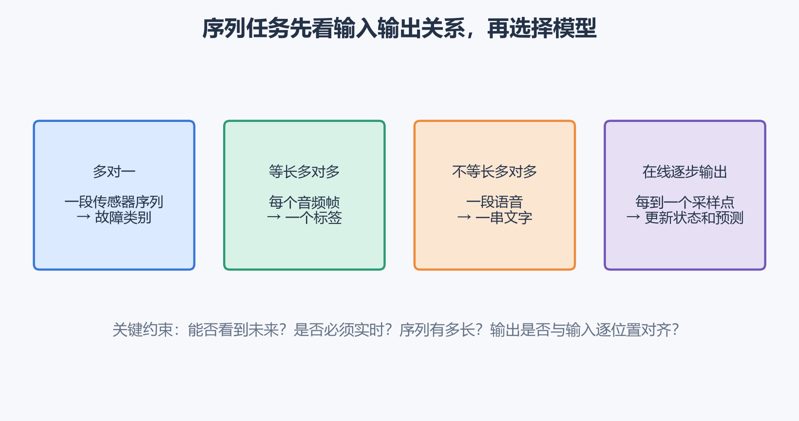
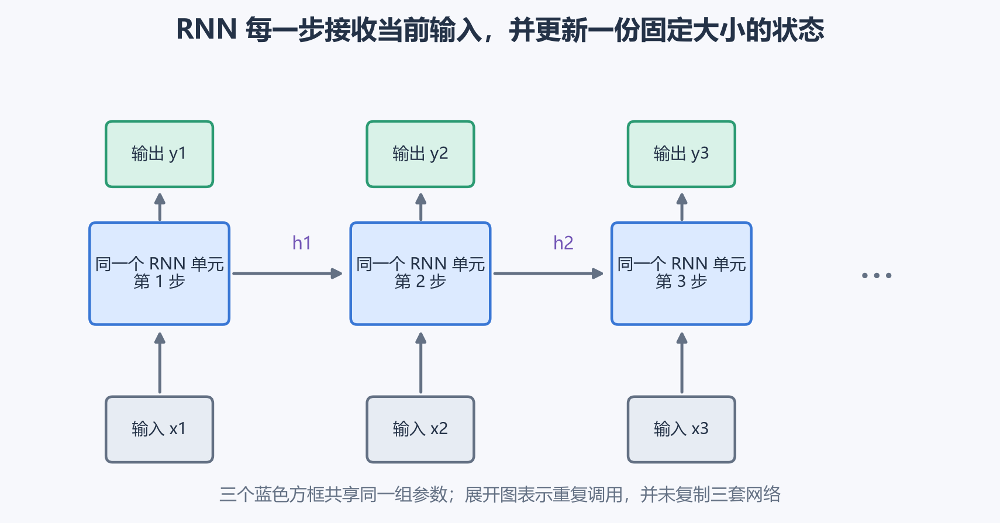
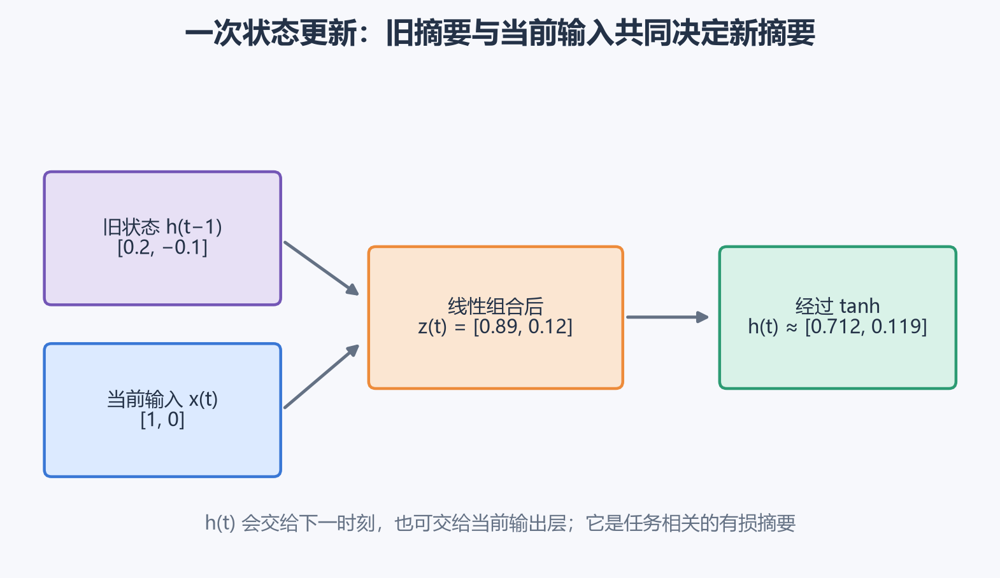
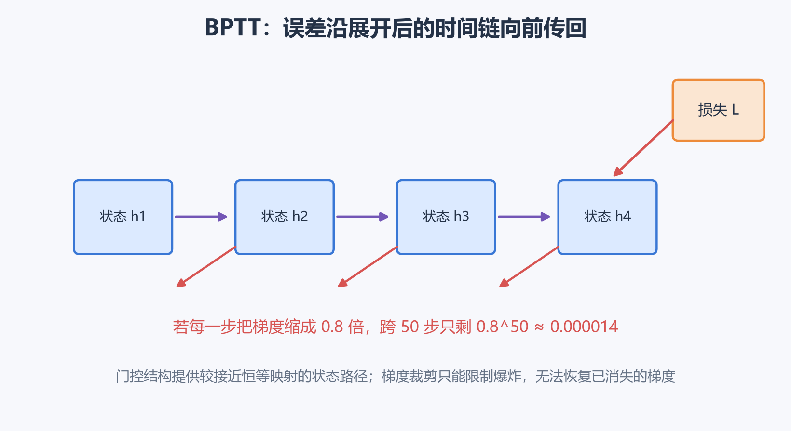
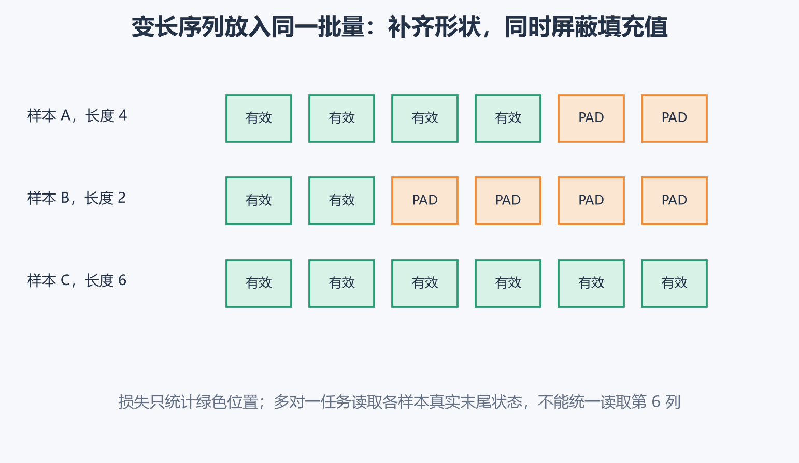
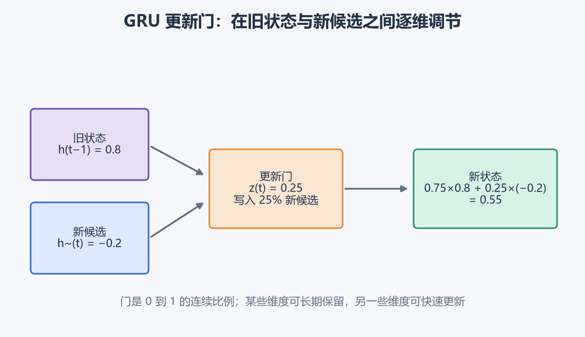
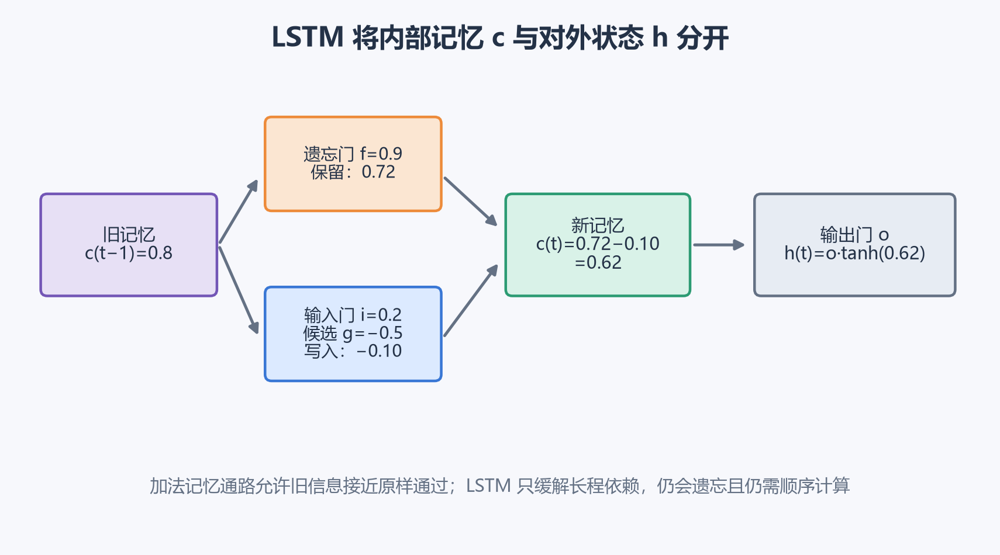
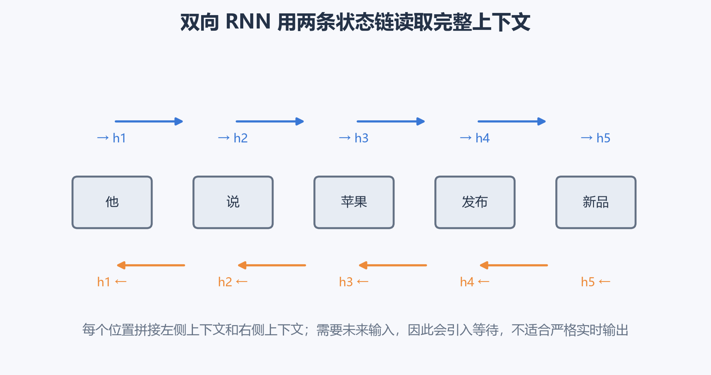
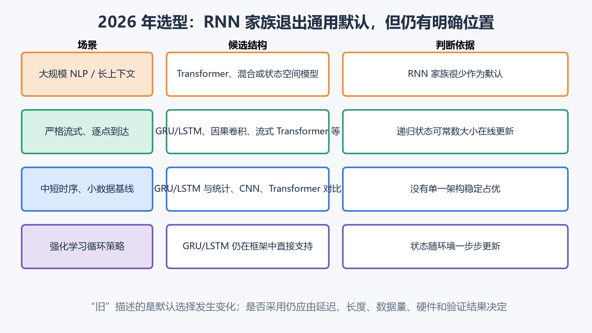

# [AI进阶-序列模型]1.循环神经网络、GRU与LSTM

序列数据与普通表格数据的差别，首先来自**顺序**。把“机器理解人”和“人理解机器”的词序交换，单词集合几乎相同，含义却已经改变。传感器、语音、视频和交易记录也有类似特点：一个时刻的数值经常要结合前后变化才能解释。

循环神经网络（Recurrent Neural Network，RNN）的核心办法很直接：按顺序接收输入，同时维护一份固定大小的内部状态。每读入一个新位置，就用“旧状态 + 当前输入”更新这份状态。GRU 和 LSTM 在这条递归状态链上加入门控，让模型可以选择保留、写入或清除信息。

从今天的工程位置看，基础 RNN 已经很少作为大规模文本、翻译和长上下文任务的默认架构，GRU/LSTM 在这些领域的使用也明显减少。不过递归结构仍用于流式处理、循环策略、部分语音系统、中短时序和资源受限模型。本篇会讲清仍有迁移价值的状态、门控和训练机制，并压缩已经退出主流的旧式语言模型与固定向量翻译细节。

## 一、先判断任务中的“序列”究竟在哪里

一条输入序列可以写成：

$$
X=(x^{\langle1\rangle},x^{\langle2\rangle},\ldots,x^{\langle T_x\rangle}).
$$

$x^{\langle t\rangle}$ 表示第 $t$ 个位置的输入，$T_x$ 是该样本的输入长度。尖括号 $\langle t\rangle$ 表示序列位置，不表示幂。对传感器而言，$t$ 是采样时刻；对文本而言，$t$ 是 token 的位置。

序列任务常见四种输入输出关系。

- **多对一**：读取一段心电信号，输出一个异常类别；
- **等长多对多**：每个音频帧都输出一个声音事件标签；
- **不等长多对多**：一段语音转换成长度不同的文字；
- **在线逐步输出**：传感器每到一个采样点，立即更新告警概率。

面对新任务时，先问四个问题：

1. 一个位置的判断是否依赖其他位置？
2. 推理时能否看到完整序列，还是数据会逐点到达？
3. 输出是整条序列一个结果，还是每个位置都有结果？
4. 输入和输出长度是否对应？

这些约束会直接决定能否使用双向模型、是否需要流式状态，以及训练时怎样组织标签。

为了区分“第几个样本”和“第几个位置”，批量中的第 $i$ 个序列写作：

$$
X^{(i)}=
\left(x^{(i)\langle1\rangle},\ldots,
x^{(i)\langle T_i\rangle}\right).
$$

这里 $(i)$ 是样本编号，$\langle t\rangle$ 是样本内部的位置。文本 token 会先转换成向量，传感器数值也可能先经过特征投影；具体的词表、Embedding 和词向量训练放在下一篇展开。本篇把每个位置已经得到的向量统一记为 $x^{\langle t\rangle}\in\mathbb R^{n_x}$。

## 二、基础 RNN 用隐藏状态压缩已经读过的历史

普通全连接网络可以把固定长度输入一次送入模型，但序列长度经常变化。如果把 100 个位置强行拼成一个大向量，不同位置还会拥有不同的权重，模型在第 3 个位置学到的模式无法自然复用于第 30 个位置。

RNN 在每个位置重复使用同一个状态更新函数：

$$
h^{\langle t\rangle}
=\tanh\left(
W_{hh}h^{\langle t-1\rangle}
+W_{xh}x^{\langle t\rangle}
+b_h
\right).
$$

其中：

- $x^{\langle t\rangle}\in\mathbb R^{n_x}$：当前位置输入；
- $h^{\langle t-1\rangle}\in\mathbb R^{n_h}$：读到上一个位置后的状态；
- $h^{\langle t\rangle}\in\mathbb R^{n_h}$：融合当前输入后的新状态；
- $W_{xh}\in\mathbb R^{n_h\times n_x}$：把当前输入投影到状态空间；
- $W_{hh}\in\mathbb R^{n_h\times n_h}$：控制旧状态怎样影响新状态；
- $b_h\in\mathbb R^{n_h}$：偏置。

图上画出多个单元，是为了显示时间关系。所有位置共享同一组 $W_{xh}$、$W_{hh}$ 和 $b_h$。序列从 10 步增加到 100 步时，计算次数和中间状态随之增加，模型参数数量保持不变。

$h^{\langle t\rangle}$ 可以理解为“截至当前位置、对当前任务有用的历史摘要”。这个说法包含三个限制：

- 它的维度固定，无论已经读过 5 步还是 500 步；
- 它是有损压缩，无法保证保存所有细节；
- 它由训练目标塑造，故障检测与情感分类会保留不同信息。

输出层根据任务读取隐藏状态：

$$
o^{\langle t\rangle}=W_{hy}h^{\langle t\rangle}+b_y,
\qquad
\hat y^{\langle t\rangle}=g_y(o^{\langle t\rangle}).
$$

$g_y$ 可以是二分类的 sigmoid、多分类的 Softmax，也可以在回归任务中直接输出连续值。多对一分类通常读取最终有效状态，逐位置标注则在每个位置产生输出。

## 三、用一组数字走完一次 RNN 状态更新

设输入维度和隐藏维度都是 2：

$$
x^{\langle t\rangle}
=\begin{bmatrix}1\\0\end{bmatrix},
\qquad
h^{\langle t-1\rangle}
=\begin{bmatrix}0.2\\-0.1\end{bmatrix}.
$$

当前位置输入 $[1,0]^T$ 可以代表某个特征出现；旧状态 $[0.2,-0.1]^T$ 是模型从此前位置保留下来的两维摘要。设：

$$
W_{hh}=
\begin{bmatrix}
0.5&0.1\\
-0.2&0.4
\end{bmatrix},
\qquad
W_{xh}=
\begin{bmatrix}
0.8&-0.3\\
0.2&0.7
\end{bmatrix},
\qquad b_h=0.
$$

先计算旧状态带来的部分：

$$
W_{hh}h^{\langle t-1\rangle}
=
\begin{bmatrix}
0.09\\-0.08
\end{bmatrix}.
$$

再计算当前输入带来的部分：

$$
W_{xh}x^{\langle t\rangle}
=
\begin{bmatrix}
0.8\\0.2
\end{bmatrix}.
$$

两部分相加：

$$
z^{\langle t\rangle}
=
\begin{bmatrix}
0.89\\0.12
\end{bmatrix}.
$$

最后逐元素经过 $\tanh$：

$$
h^{\langle t\rangle}
=\tanh(z^{\langle t\rangle})
\approx
\begin{bmatrix}
0.712\\0.119
\end{bmatrix}.
$$

新状态的第一维从 $0.2$ 变成约 $0.712$，说明当前输入对这一维产生了较强正向影响；第二维从 $-0.1$ 变成约 $0.119$，历史的负值被当前输入扭转。模型实际训练时会自己决定每一维怎样编码任务信息，人不会预先规定“第一维必须表示主题”之类的含义。

批量计算时，本系列统一采用样本在第一维的记法：

$$
X\in\mathbb R^{B\times T\times n_x},
\qquad
H\in\mathbb R^{B\times T\times n_h}.
$$

$B$ 是批量大小，$T$ 是补齐后的序列长度。框架也可能使用 $(T,B,n_x)$ 排列，矩阵内容相同，但轴顺序必须与接口约定一致。

## 四、BPTT 让后面的错误修改前面的状态更新

假设第 4 步预测错误，这个错误可能来自第 4 步输入，也可能因为模型在第 1 步就丢掉了重要信息。训练需要让后面的损失沿状态链传回较早位置。

通过时间反向传播（Backpropagation Through Time，BPTT）执行三件事：

1. 把循环调用按时间展开成计算图；
2. 从总损失沿展开图做普通反向传播；
3. 把共享参数在所有时间步产生的梯度相加。

若逐位置任务的单步损失为 $\mathcal L^{\langle t\rangle}$，一条序列的有效损失可以写成：

$$
\mathcal L=\sum_{t=1}^{T}\mathcal L^{\langle t\rangle}.
$$

同一 $W_{hh}$ 在每步都被调用，因此总梯度包含各次使用的贡献：

$$
\frac{\partial\mathcal L}{\partial W_{hh}}
=\sum_t
\left.
\frac{\partial\mathcal L}{\partial W_{hh}}
\right|_{\text{第 }t\text{ 步调用}}.
$$

BPTT 属于反向传播在时间展开图上的直接应用：先展开时间递归，再沿这张计算图使用链式法则。

### 长序列为什么难训练

从较晚状态向较早状态回传时，梯度会反复乘上局部 Jacobian。基础 tanh RNN 中可概括为：

$$
\frac{\partial h^{\langle T\rangle}}
{\partial h^{\langle t\rangle}}
=\prod_{k=t+1}^{T}
D^{\langle k\rangle}W_{hh},
$$

$D^{\langle k\rangle}$ 来自 $\tanh$ 的导数。若每步整体把梯度缩小到原来的 $0.8$，跨 50 步后只剩：

$$
0.8^{50}\approx1.43\times10^{-5}.
$$

后期损失几乎无法告诉早期状态“当时应该保留什么”，这就是 RNN 中的长程梯度消失。若每步放大到 $1.2$，则：

$$
1.2^{50}\approx9100,
$$

梯度可能剧烈爆炸，造成参数跳动、损失异常甚至 `NaN`。

梯度裁剪可以把过大梯度限制到阈值 $c$：

$$
\tilde g=
\begin{cases}
g,&\|g\|_2\le c,\\
c\dfrac{g}{\|g\|_2},&\|g\|_2>c.
\end{cases}
$$

它保留梯度方向并压缩长度，主要防止爆炸。已经接近零的梯度不会被裁剪恢复。梯度消失与爆炸在深层网络中已经讲过；这里的新条件是：**同一循环参数沿时间被连续使用，序列长度直接形成计算图深度**。

超长连续数据还可使用截断 BPTT：把序列切成长度 $K$ 的片段，状态数值传入下一片段，同时在边界切断梯度。它降低显存和计算量，但超过 $K$ 步的直接训练信号也被截断。

## 五、变长序列需要 Padding、Mask 和真实长度

同一批量中的序列可能分别有 4、2、6 个位置。张量需要规则形状，所以把短序列补到批内最大长度：

$$
X\in\mathbb R^{B\times T_{\max}\times n_x}.
$$

补入的 PAD 只用于对齐形状，不属于真实数据。用掩码 $M$ 区分有效位置：

$$
M_{i,t}=
\begin{cases}
1,&t\le T_i,\\
0,&t>T_i.
\end{cases}
$$

逐位置损失应只对有效位置求平均：

$$
\mathcal L=
\frac{\sum_{i,t}M_{i,t}\mathcal L_{i,t}}
{\sum_{i,t}M_{i,t}}.
$$

若把 PAD 也算进损失，模型会浪费能力预测填充值，长短样本的权重也会失真。

多对一任务还要读取每个样本的真实末尾状态：

$$
h_i^{\langle T_i\rangle},
$$

不能统一取 $h_i^{\langle T_{\max}\rangle}$。对图中长度为 2 的样本 B，第 6 列已经经过四次填充值，那里不代表真实序列结尾。框架的 packed sequence、长度数组或显式 mask 都是在解决这一问题。

## 六、GRU 用门决定旧状态保留多少

基础 RNN 每一步都会让整个旧状态重新通过线性变换和 $\tanh$。即使当前输入无关，旧信息也会被再次改写。GRU（Gated Recurrent Unit，门控循环单元）加入两组软门：

- **更新门** $z_t$：最终状态写入多少新候选；
- **重置门** $r_t$：生成候选时，让多少旧状态参与计算。

采用“$z_t$ 表示新内容写入比例”的记法，公式为：

$$
z_t=\sigma(W_zx_t+U_zh_{t-1}+b_z),
$$

$$
r_t=\sigma(W_rx_t+U_rh_{t-1}+b_r),
$$

$$
\tilde h_t=
\tanh\left(W_hx_t+U_h(r_t\odot h_{t-1})+b_h\right),
$$

$$
h_t=(1-z_t)\odot h_{t-1}+z_t\odot\tilde h_t.
$$

$\sigma$ 是 sigmoid，输出在 0 到 1 之间；$\odot$ 表示相同位置逐元素相乘。每个状态维度都有自己的门值，所以同一步可以保留某些信息，同时改写另一些信息。

只看某一维，假设旧状态为 $0.8$，候选状态为 $-0.2$，更新门为 $0.25$：

$$
h_t=(1-0.25)\times0.8+0.25\times(-0.2)=0.55.
$$

这个门让新候选只写入 25%，旧信息仍占 75%。若 $z_t$ 接近 0，则 $h_t\approx h_{t-1}$，状态和梯度可以沿较接近恒等映射的路径继续传递；若 $z_t$ 接近 1，模型会快速采用新候选。

$r_t$ 控制另一件事。若它在某一维接近 0，旧状态的该维几乎不参与候选计算，适合上下文切换或新片段开始。它不直接决定最终保留比例。

不同论文与框架可能把更新门的含义反过来，写成 $h_t=z_t\odot h_{t-1}+(1-z_t)\odot\tilde h_t$。两种约定表达同一类插值结构，阅读实现时应先核对公式，不能只按字母 $z$ 猜语义。GRU 最初在 RNN Encoder–Decoder 中提出，原论文也展示了门控循环编码序列的方式。[GRU / RNN Encoder–Decoder 原始论文](https://arxiv.org/abs/1406.1078)

## 七、LSTM 把内部记忆与对外状态分开

LSTM（Long Short-Term Memory）显式维护两份状态：

- $c_t$：内部记忆通道；
- $h_t$：当前暴露给下一层和输出层的隐藏状态。

它使用三扇门和一份候选记忆：

$$
f_t=\sigma(W_fx_t+U_fh_{t-1}+b_f),
$$

$$
i_t=\sigma(W_ix_t+U_ih_{t-1}+b_i),
$$

$$
o_t=\sigma(W_ox_t+U_oh_{t-1}+b_o),
$$

$$
g_t=\tanh(W_gx_t+U_gh_{t-1}+b_g).
$$

四个量分别表示：

- 遗忘门 $f_t$：旧记忆保留多少；
- 输入门 $i_t$：候选记忆写入多少；
- 输出门 $o_t$：当前记忆向外暴露多少；
- 候选 $g_t$：本步准备写入的内容。

记忆和隐藏状态按下面方式更新：

$$
c_t=f_t\odot c_{t-1}+i_t\odot g_t,
$$

$$
h_t=o_t\odot\tanh(c_t).
$$

仍只看一维。假设旧记忆 $c_{t-1}=0.8$，遗忘门 $f_t=0.9$，输入门 $i_t=0.2$，候选 $g_t=-0.5$：

$$
\begin{aligned}
c_t
&=0.9\times0.8+0.2\times(-0.5)\\
&=0.72-0.10\\
&=0.62.
\end{aligned}
$$

算出的 $0.62$ 表示：旧记忆的大部分被保留，同时写入了一小部分方向相反的新信息。若输出门 $o_t=0.5$，当前对外状态为：

$$
h_t=0.5\times\tanh(0.62)\approx0.276.
$$

内部保存了 $0.62$，本步只向外暴露约 $0.276$。这种分离使 LSTM 对“保存什么”和“当前使用什么”拥有更细的控制。

LSTM 缓解长程依赖的关键在加法记忆路径。当 $f_t\approx1$ 且写入项很小时：

$$
c_t\approx c_{t-1}.
$$

信息与梯度可以较少改动地向后传递。不过 LSTM 仍有有限状态容量，门也可能学错，长序列仍需逐步计算。它提高了保留长期信息的可能性，没有给出“任意远信息都能记住”的保证。当前 PyTorch 文档仍提供完整的多层、双向和投影 LSTM 接口，其状态更新与上面公式一致。[PyTorch LSTM 文档](https://docs.pytorch.org/docs/stable/generated/torch.nn.LSTM.html)

## 八、GRU 与 LSTM 的差别主要在状态控制粒度

设输入维度为 $n_x$，隐藏维度为 $n_h$。忽略输出层时，三种循环单元的大致参数量为：

$$
\text{RNN}:\quad n_h(n_x+n_h)+n_h,
$$

$$
\text{GRU}:\quad 3[n_h(n_x+n_h)+n_h],
$$

$$
\text{LSTM}:\quad 4[n_h(n_x+n_h)+n_h].
$$

相同输入与隐藏宽度下，LSTM 单步计算和参数通常最多，GRU 更轻。结构差别可以这样看：

| 结构 | 主要状态 | 控制方式 | 常见定位 |
|---|---|---|---|
| 基础 RNN | $h_t$ | 每步整体重写 | 教学、很小的基线 |
| GRU | $h_t$ | 更新门与重置门 | 希望保留门控能力并减少参数 |
| LSTM | $h_t,c_t$ | 遗忘、输入、输出三类控制 | 需要更细的记忆与暴露控制 |

没有普遍成立的“LSTM 一定比 GRU 准确”。小数据、隐藏宽度、序列长度、正则化、硬件内核和延迟预算都会影响结果。若任务确实适合循环模型，可以先用 GRU 建立较轻基线，再让 LSTM 在相同数据划分和预算下比较。

## 九、双向和堆叠结构增加上下文，也增加约束

单向 RNN 的第 $t$ 个状态只能看到：

$$
x^{\langle1\rangle},\ldots,x^{\langle t\rangle}.
$$

离线文本标注时，右侧内容也可能帮助判断当前位置。双向 RNN 同时计算前向状态和后向状态：

$$
\overrightarrow h_t=f_{\rightarrow}(\overrightarrow h_{t-1},x_t),
$$

$$
\overleftarrow h_t=f_{\leftarrow}(\overleftarrow h_{t+1},x_t),
$$

并把两者拼接：

$$
h_t^{\text{bi}}=[\overrightarrow h_t;\overleftarrow h_t].
$$

后向分支的“从右向左读取”属于模型前向计算，和训练时的反向传播是两件事。双向结构必须获得未来位置，因此通常要等完整序列到齐。严格实时的语音、传感器告警和在线控制不能直接使用无限右上下文，可以改用单向状态、有限前瞻或分块结构，在准确率和等待时间之间取舍。

循环层也可以纵向堆叠：第 1 层提取局部变化，第 2 层再读取第 1 层的状态序列。第 $l$ 层写作：

$$
h_t^{[l]}=
f^{[l]}(h_{t-1}^{[l]},h_t^{[l-1]}).
$$

同一层跨时间共享参数，不同层通常使用不同参数。循环网络沿时间已经很深，盲目增加很多层会加重优化和延迟负担；实际结构常配合 dropout、层归一化和残差连接，并以验证结果决定深度。

## 十、RNN 家族确实在退潮，但没有走到“即将完全消失”

你的判断有一半非常准确：在**大规模通用序列建模，特别是 NLP** 中，RNN、GRU 和 LSTM 的使用量相较于 2010 年代已经大幅下降。主要原因来自它的递归依赖：

$$
h_t\leftarrow h_{t-1}.
$$

第 $t$ 步必须等待第 $t-1$ 步完成，一条训练样本内部很难沿时间充分并行；远距离信息还要穿过许多连续状态。Transformer 让各位置通过注意力直接交互，训练并行性和大规模预训练能力更强。Transformer 原始论文就把减少循环结构的顺序计算作为主要动机之一。[Attention Is All You Need](https://arxiv.org/abs/1706.03762)

下面的结论需要加上任务范围：

- **基础 tanh RNN**：主要保留为教学工具和小型基线，在长文本、翻译、复杂生成中很少作为首选；
- **GRU/LSTM**：在大型语言模型与主流 NLP 主干中已经退居次要位置，在流式、小型和状态持续更新的任务中仍有实际用途；
- **递归思想**：仍在发展。状态空间模型、混合架构和 xLSTM 等工作继续探索线性时间、固定状态推理和可并行训练之间的组合。

### 仍然可能优先考虑循环结构的情况

**1. 数据逐点到达，需要常数大小状态。** 设备每 10 毫秒收到一个新传感器值时，GRU/LSTM 可以用旧状态和新输入立即更新，无需反复处理完整历史窗口。

**2. 强化学习中的部分可观测状态。** 智能体每一步只看到局部观察，循环状态可以概括过去轨迹。当前 TorchRL 仍提供 GRU/LSTM 模块，并明确区分环境交互时的单步模式与训练时的序列模式。[TorchRL 循环模块](https://docs.pytorch.org/rl/main/reference/modules_rnn.html)

**3. 流式语音转写。** 现代语音编码器经常采用 Conformer 等结构，但 Transducer 路线仍在持续使用，NVIDIA NeMo 当前文档仍提供面向缓存流式语音识别的 RNN-T 配置。这里的系统已经是混合的现代架构，不能简单等同于“纯 LSTM 统治语音”。[NVIDIA NeMo 流式 RNN-T 配置](https://docs.nvidia.com/nemo/speech/nightly/asr/configs.html)

**4. 中短时序、小数据和已有部署。** 在某些传感器、预测与控制任务中，GRU/LSTM 体积小、状态接口清楚、部署管线成熟。它们应与统计模型、Temporal CNN、Transformer 或状态空间模型在同一验证协议下比较，不应仅凭架构年代决定。

### 为什么无法判断“几年后完全没人用”

框架仍维护并优化 RNN、GRU、LSTM，说明它们目前仍有真实需求。更关键的是，递归计算具有固定大小在线状态和逐步更新的优势，这类约束不会随 Transformer 普及而消失。另一方面，经典 LSTM 也在被重新设计：xLSTM 通过新的门控和记忆结构探索大规模语言建模；Mamba 等状态空间模型则以输入相关的状态更新处理长序列。这些研究不表示经典 LSTM 会重新成为默认，却说明“递归状态”是一类持续演化的计算方式。[xLSTM 论文](https://arxiv.org/abs/2405.04517)；[Mamba 论文](https://arxiv.org/abs/2312.00752)

因此，这一章最合理的学习目标是：会读懂状态递推和门控公式，理解 BPTT 与长程梯度，能判断流式、延迟和未来上下文约束；不需要把旧式 RNN 文本生成或固定向量翻译架构当作现代项目的默认方案。下一篇将把输入 token 怎样形成嵌入向量讲清，后面的生成、注意力和 Transformer 文章再分别处理现代序列建模的其余部分。
