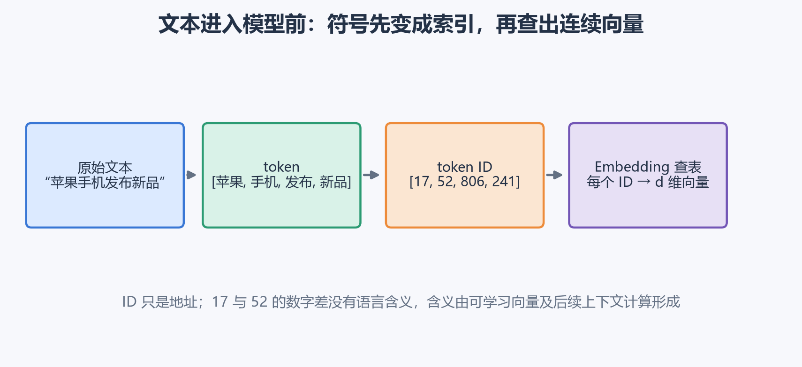
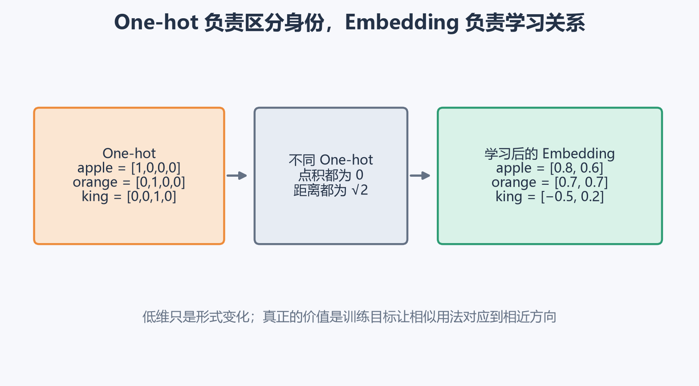
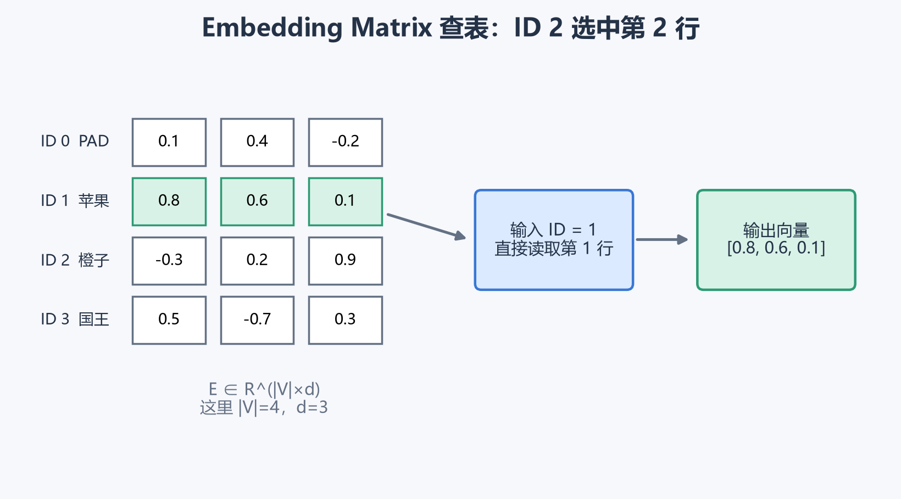
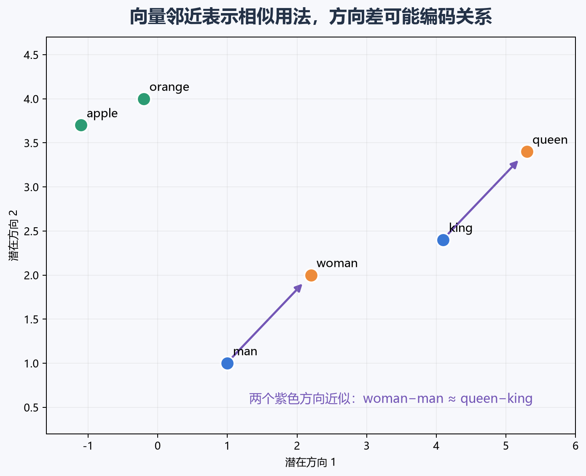
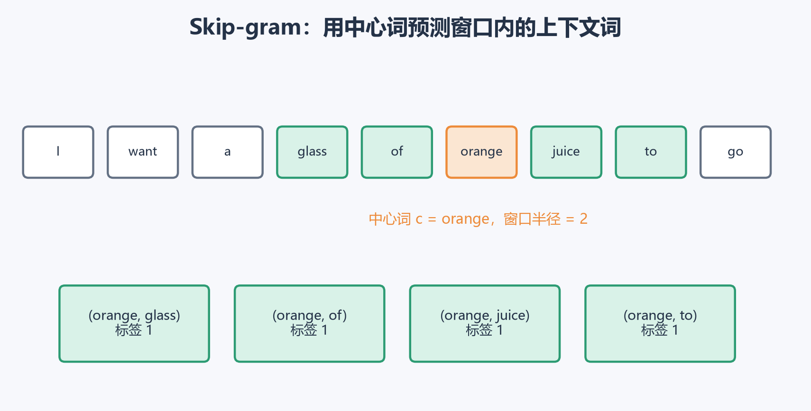
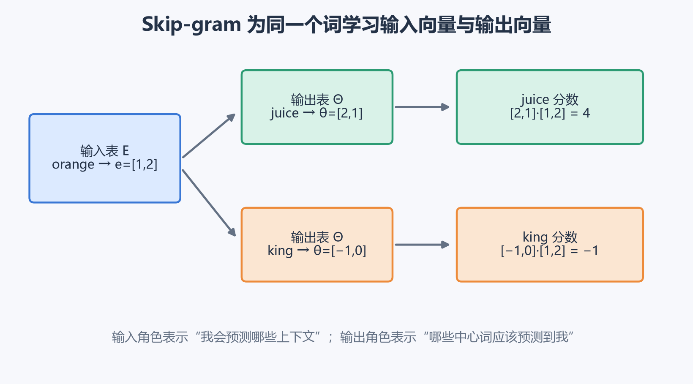
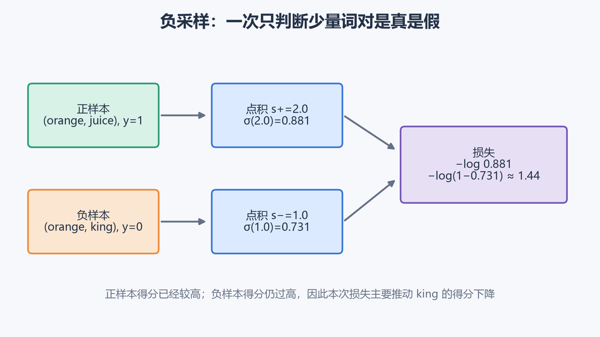
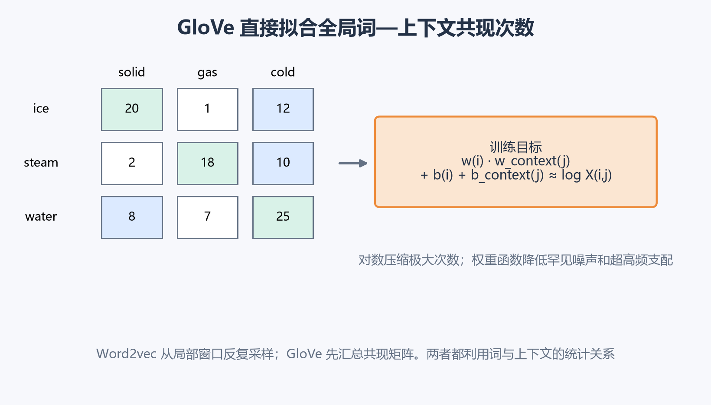
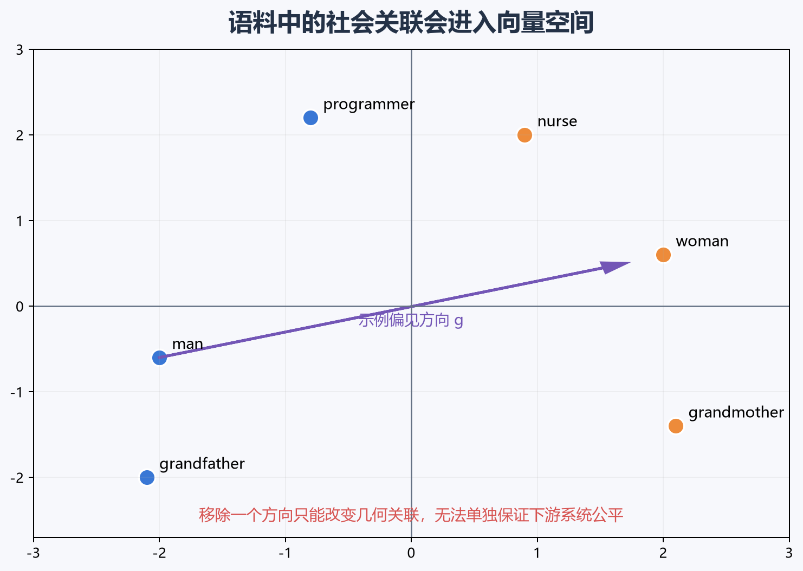
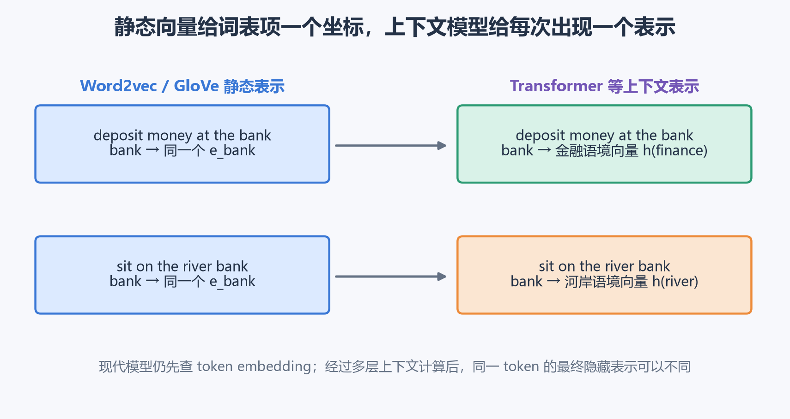

# [AI进阶-序列模型]2.文本表示、词嵌入与词向量训练

神经网络只能接收数值，文本却由字、词和标点组成。最直接的处理方式是给每个符号分配整数编号，例如“苹果”对应 17、“手机”对应 52。然而这些编号只是词表地址，52 不表示“手机”的含义比“苹果”大 35。

文本表示真正要解决的是：怎样把离散符号转换成可以参与矩阵运算的向量，同时让相似用法、上下文关系和任务信息进入向量空间。本篇从 token、One-hot 和 Embedding Matrix 开始，再依次说明 Word2vec、负采样与 GloVe 怎样从普通文本中学习静态词向量，以及这些方法在现代上下文模型中的位置。

## 一、token ID 是地址，词向量才是模型使用的特征

原始文本通常先经过三个步骤：

$$
\text{文本}\rightarrow\text{token 切分}
\rightarrow\text{token ID}\rightarrow\text{向量}.
$$

token 是模型处理文本的基本单位，可以是完整词、子词、字符或字节片段。以简化的中文分词为例：

```text
苹果手机发布新品
→ [苹果, 手机, 发布, 新品]
→ [17, 52, 806, 241]
```



ID 的作用是指出“去参数表的哪一行取数据”。它不应直接当作连续特征。若模型直接使用 17 和 52，就会错误地引入大小和间距关系。

课程早期以完整单词为 token，因此会遇到词表外单词（Out-of-Vocabulary，OOV）：训练时没见过的词只能映射到同一个 `<UNK>`。现代文本模型通常使用子词切分，例如把罕见词拆成多个常见片段。这样可以控制词表大小，也能组合出训练语料中未完整出现的词。fastText 进一步把词表示为字符 n-gram 向量之和，使未见词也能由内部片段得到表示。[fastText 子词词向量论文](https://arxiv.org/abs/1607.04606)

无论 token 粒度怎样变化，后续机制仍相同：离散 ID 进入 Embedding Matrix，查出一个可学习的连续向量。

## 二、One-hot 能标识词，却无法表达词之间的关系

设词表大小为 $|V|$。词 $w$ 的 One-hot 向量为：

$$
o_w\in\mathbb R^{|V|},
$$

其中第 $w$ 个位置为 1，其余位置为 0。它解决了整数编号带来的虚假大小关系，因为每个词都拥有独立位置。

问题在于，任意两个不同 One-hot 向量的点积都是 0：

$$
o_i^To_j=0,\qquad i\ne j.
$$

它们的欧氏距离也都相同：

$$
\|o_i-o_j\|_2=\sqrt2.
$$

因此在 One-hot 空间中：

$$
d(\text{apple},\text{orange})
=d(\text{apple},\text{king})
=\sqrt2.
$$



“苹果”和“橙子”都是水果，但 One-hot 只知道它们是两个不同词。若训练集出现了“橙汁”，却没有出现“苹果汁”，模型无法从 One-hot 表示本身迁移“水果常与汁搭配”这一统计规律。

词嵌入（word embedding）为每个 token 学习一个 $d$ 维稠密向量：

$$
e_w\in\mathbb R^d,
\qquad d\ll|V|.
$$

“稠密”表示向量多数位置都可能是非零连续值。降维可以减少输入尺寸，更重要的变化是：训练目标能够调整这些连续坐标，使具有相似上下文作用的词靠近。

向量的单个维度通常没有固定的人类命名。模型可以对整个空间旋转，同时大体保留点积和距离关系。因此应关注向量之间的相对方向、邻域和距离，不要硬把“第 7 维”解释成某个确定语义。

## 三、Embedding Matrix 是一张通过训练更新的向量表

本篇采用常见框架中的行式存储：

$$
E\in\mathbb R^{|V|\times d}.
$$

第 $w$ 行就是 token $w$ 的向量：

$$
e_w=E_{w,:}.
$$



图中词表有 4 项，向量维度为 3。输入 ID 1 时，直接读取矩阵第 1 行：

$$
e_{\text{苹果}}=[0.8,\ 0.6,\ 0.1].
$$

课程公式常把词向量存为列，写成：

$$
E_{\text{course}}\in\mathbb R^{d\times|V|},
\qquad
e_w=E_{\text{course}}o_w.
$$

由于 One-hot 只有第 $w$ 项为 1：

$$
E_{\text{course}}o_w
=\sum_{j=1}^{|V|}E_{:,j}(o_w)_j
=E_{:,w}.
$$

所以“矩阵乘 One-hot”在数学上就是选择一列。实际程序会直接按 ID 查表，避免创建一个可能长达几十万维的稀疏 One-hot。两种矩阵方向只差一次转置。

Embedding Matrix 在训练开始时通常是随机参数。某个批量访问 token $w$ 后，损失对 $e_w$ 产生梯度：

$$
e_w\leftarrow e_w-eta
\frac{\partial\mathcal L}{\partial e_w}.
$$

$\eta$ 是学习率。一次批量通常只访问词表中的少量行，因此框架可以只更新这些行。词向量并非人工填写的语义字典；它表达什么，由语料、训练目标、采样方式和下游损失共同决定。

## 四、相似度与向量类比描述的是空间关系

比较词向量时常用余弦相似度：

$$
\operatorname{sim}(u,v)
=\frac{u^Tv}{\|u\|_2\|v\|_2}.
$$

它把向量长度归一化，主要比较方向。假设：

$$
e_{\text{apple}}=[0.8,0.6]^T,
\qquad
e_{\text{orange}}=[0.7,0.7]^T.
$$

第一条向量长度为 1，第二条长度约为 $0.99$，点积为 $0.98$，所以：

$$
\cos(e_{\text{apple}},e_{\text{orange}})
\approx\frac{0.98}{1\times0.99}\approx0.99.
$$

两个方向非常接近，表示它们在训练目标下具有相似用法。相似并不等于同义：“医生”和“医院”经常相关，却不能在句子中互相替换；窗口大小也会让模型更偏向句法相似或主题相关。

经典词向量还会出现近似线性类比：

$$
e_{\text{woman}}-e_{\text{man}}
\approx
e_{\text{queen}}-e_{\text{king}}.
$$

于是可以搜索最接近下面目标向量的词：

$$
e_{\text{king}}-e_{\text{man}}+e_{\text{woman}}.
$$



这种现象说明语料统计在空间中形成了较稳定的方向，不能据此断言模型已经获得完整的人类式推理。类比结果会受到语料、词频、分词、维度和检索规则影响。

t-SNE 等二维可视化也只能帮助观察局部聚类。非线性降维不会严格保留高维夹角、全局距离和平行方向，因此不能用二维图是否形成平行四边形来验证高维类比。

## 五、词向量通过“预测上下文”间接学到用法

训练语料不会直接提供“apple 的正确向量”。词向量训练需要构造一个能从文本自动得到标签的代理任务。例如：

- 用周围词预测中心词；
- 用中心词预测周围词；
- 判断两个词是否来自真实上下文；
- 拟合词与上下文的共现次数。

考虑三句话：

```text
drink a glass of orange juice
drink a glass of apple juice
drink a glass of grape juice
```

orange、apple 和 grape 出现在相似位置，并与相似上下文共现。若两个中心词的上下文分布接近：

$$
P(t\mid c_1)\approx P(t\mid c_2),
$$

让它们的向量靠近通常有利于共享输出参数并产生相似预测。模型因此从“词怎样被使用”间接学习表示。这一思想常称为分布式假设。

Word2vec 是一组高效学习静态词向量的方法，包含两个主要方向：

- **CBOW**：用周围词预测中心词；
- **Skip-gram**：用中心词预测周围词。

原始 Word2vec 工作的重点就是在大规模文本上以较低成本学习连续词表示。[Word2vec 原始论文](https://arxiv.org/abs/1301.3781)

## 六、Skip-gram 从滑动窗口自动构造训练词对

句子为：

```text
I want a glass of orange juice to go
```

选择 orange 为中心词，窗口半径为 2，周围词是 glass、of、juice、to，于是得到四个正词对：

```text
(orange, glass)
(orange, of)
(orange, juice)
(orange, to)
```



窗口决定模型观察什么关系。小窗口更容易捕捉局部搭配和句法功能，大窗口更容易捕捉主题相关性。窗口扩大并不保证表示更好，它改变了“相似”的训练定义。

对于中心词 $c$，Skip-gram 从输入表查到：

$$
e_c\in\mathbb R^d.
$$

然后给每个候选目标词 $j$ 一条输出向量：

$$
\theta_j\in\mathbb R^d,
$$

并用点积计算分数：

$$
s_j=\theta_j^Te_c.
$$

经过完整 Softmax 得到目标词概率：

$$
P(t=j\mid c)
=\frac{\exp(\theta_j^Te_c)}
{\sum_{k=1}^{|V|}\exp(\theta_k^Te_c)}.
$$

若真实目标是 $t$，损失为：

$$
\mathcal L=-\log P(t\mid c).
$$

### 为什么同一个词有两套向量

Skip-gram 通常维护：

$$
E\in\mathbb R^{|V|\times d}
$$

作为输入表，以及：

$$
\Theta\in\mathbb R^{|V|\times d}
$$

作为输出表。同一个词在两张表中的向量承担不同角色：

- $e_w$ 表示“以 $w$ 为中心时，哪些词可能出现在周围”；
- $\theta_w$ 表示“什么样的中心词应该把 $w$ 预测为上下文”。



假设：

$$
e_{\text{orange}}=[1,2]^T,
\quad
\theta_{\text{juice}}=[2,1]^T,
\quad
\theta_{\text{king}}=[-1,0]^T.
$$

两个候选分数为：

$$
s_{\text{juice}}=2\times1+1\times2=4,
$$

$$
s_{\text{king}}=(-1)\times1+0\times2=-1.
$$

若还有第三个候选词得分为 1，则 juice 的 Softmax 概率约为：

$$
P(\text{juice}\mid\text{orange})
=\frac{e^4}{e^4+e^{-1}+e^1}
\approx0.947.
$$

它的单样本损失约为：

$$
-\log0.947\approx0.055.
$$

模型已经明显偏向真实目标，因此损失较小。训练会同时更新输入表和输出表。训练结束后可以使用输入向量，也可以把两套向量相加或平均，具体选择应按实现和下游评估确定。

## 七、完整 Softmax 的成本来自整个词表

当词表有 100 万项时，每个词对都要计算 100 万个输出分数，再对全部指数求和。单次成本大约随 $|V|d$ 增长：

$$
\Theta e_c:
(|V|\times d)(d\times1)
\rightarrow |V|\times1.
$$

大多数计算花在本次无关的候选词上。层次 Softmax 可以把词表组织成树，把一次大分类改成大约 $O(\log|V|)$ 次二分类。课程重点介绍的另一种办法是负采样。

高频词还会制造另一种浪费。the、of、a 等功能词在窗口中出现极多，若完全按原始语料训练，大量更新会被它们占据。Word2vec 常对极高频词做降采样，以一定概率丢弃这些位置，让训练信号更加均衡。

## 八、负采样把大规模多分类改成少量真假判断

负采样对一个真实词对 $(c,t)$ 标记 $y=1$，再从噪声分布抽取 $K$ 个词 $n_1,\ldots,n_K$，分别构造 $y=0$ 的词对。

例如：

```text
(orange, juice, 1)
(orange, king, 0)
(orange, book, 0)
```

对任意词对，用 sigmoid 预测它来自真实上下文的概率：

$$
P(D=1\mid c,t)=\sigma(\theta_t^Te_c).
$$

一个正样本和 $K$ 个负样本的损失为：

$$
\mathcal L_{\text{NS}}
=-\log\sigma(\theta_t^Te_c)
-\sum_{k=1}^{K}
\log\sigma(-\theta_{n_k}^Te_c).
$$



假设正样本分数为 2：

$$
\sigma(2)\approx0.881,
\qquad
-\log0.881\approx0.127.
$$

负样本的分数却是 1：

$$
\sigma(1)\approx0.731.
$$

负样本的正确标签是 0，因此这一项损失为：

$$
-\log(1-0.731)\approx1.313.
$$

总损失约为 $1.44$。当前正词对已经得到较高概率，主要错误来自 king 也被判得很像真实上下文。梯度会重点降低 $\theta_{\text{king}}^Te_{\text{orange}}$。

若词表有 10 万项且 $K=5$，一次训练只访问 1 个正目标和 5 个负目标。它的速度优势很大，但概念上要说准确：负采样把训练改成了若干 sigmoid 二分类，它没有计算“只含 6 类的 Softmax”，得到的单个 sigmoid 值也不是对整个词表严格归一化的 $P(t\mid c)$。

负词通常按下面的分布采样：

$$
P_n(w)=
\frac{f(w)^{3/4}}
{\sum_jf(j)^{3/4}},
$$

$f(w)$ 是词频。$3/4$ 次幂会把原始词频分布压平：高频词仍然更常被抽到，中低频词比按原频率采样获得更多机会。负样本无需保证在现实中绝对不会共现，算法依靠大量样本形成整体统计。

负采样思想今天仍广泛存在于向量检索、推荐和对比学习中，但“未观察”在不同任务里的含义不同。文本窗口中的噪声词由人为抽样；推荐系统里的未交互物品还混合了未曝光和未点击，不能机械地沿用同一负标签解释。

## 九、GloVe 从全局共现矩阵学习词向量

Word2vec 从滑动窗口持续抽取局部词对。GloVe（Global Vectors）先汇总一个词—上下文共现矩阵：

$$
X_{ij}=\text{词 }j\text{ 出现在词 }i\text{ 上下文中的加权次数}.
$$

若窗口只看一个方向，$X_{ij}$ 与 $X_{ji}$ 可以不同；若左右窗口完全对称，它们可能相等或接近。



图中的 $X_{\text{ice,solid}}=20$ 表示 solid 在 ice 周围累计出现了 20 次；$X_{\text{ice,gas}}=1$ 表示这组共现很少。矩阵整行描述一个词通常处在什么上下文中。

GloVe 常用目标为：

$$
J=\sum_{i,j}f(X_{ij})
\left(
w_i^T\tilde w_j+b_i+\tilde b_j-\log X_{ij}
\right)^2.
$$

各项含义如下：

- $w_i$：词 $i$ 作为中心词时的向量；
- $\tilde w_j$：词 $j$ 作为上下文时的向量；
- $b_i,\tilde b_j$：吸收词频基线的偏置；
- $\log X_{ij}$：经过对数压缩的共现强度；
- $f(X_{ij})$：控制该词对在损失中的权重。

如果 $X_{ij}=20$，则：

$$
\log20\approx2.996.
$$

假设当前模型算出的 $w_i^T\tilde w_j+b_i+\tilde b_j=2.7$，未乘权重前的平方误差为：

$$
(2.7-2.996)^2\approx0.088.
$$

训练会调整两侧向量与偏置，让预测的共现强度靠近 2.996。使用对数是因为真实共现次数可能从 1 跨到上百万，直接拟合原始次数会让高频词对完全支配损失。

权重函数常采用：

$$
f(x)=
\begin{cases}
(x/x_{\max})^\alpha,&x<x_{\max},\\
1,&x\ge x_{\max},
\end{cases}
$$

其中常见 $\alpha=3/4$。极低频共现可能只是噪声，权重会较小；次数增长后权重增大；超过阈值后不再继续放大。$X_{ij}=0$ 的位置不直接计算 $\log0$。

GloVe 与 Word2vec 都为中心和上下文角色维护两套向量。GloVe 训练后常使用 $w_i+\tilde w_i$ 或两者平均。两种方法的共同基础都是上下文统计，主要差别在于 Word2vec通过局部样本和预测目标隐式积累统计，GloVe 显式拟合全局共现矩阵。[GloVe 原始论文](https://aclanthology.org/D14-1162/)

## 十、预训练词向量可以迁移，但平均向量会丢失词序

大规模未标注文本容易获得，任务标签却很昂贵。可以先在通用语料上学习 $E_{\text{pretrained}}$，再把它复制到情感分类、实体识别等小数据任务中。

下游训练有三种常见处理：

- 数据很少且领域接近时，先冻结词向量；
- 领域差异较大时，用较小学习率微调；
- 标注数据充足时，与下游模型联合训练。

最简单的句子表示是平均词向量：

$$
\bar e=\frac1T\sum_{t=1}^{T}e_{w_t}.
$$

它参数少、速度快，在小数据或资源受限任务中仍是有价值的基线。预训练语料若已经让 exquisite 靠近 excellent，即使下游标注集很少出现 exquisite，分类器也可能迁移已有信息。

平均操作满足交换律，所以：

```text
dog bites man
man bites dog
```

会得到相同平均向量。“good”与“not good”也可能因为共享强烈的 good 特征而难以区分。若任务依赖词序、否定和组合关系，就需要让序列模型、卷积或 Transformer 在 token 向量之上继续计算上下文。

上一章的循环模型在这里接收：

$$
e_{w_1},e_{w_2},\ldots,e_{w_T},
$$

并递推 $h_t=f(h_{t-1},e_{w_t})$。本篇只需要这条输入关系，RNN、GRU 与 LSTM 的状态机制不再重复展开。

## 十一、词向量会连同语料偏见一起学习

真实文本包含历史分工、社会刻板印象、群体不平衡和采集偏差。词向量忠实压缩共现统计时，有用语言规律与不希望延续的关联可能同时进入空间。



课程用性别方向举例：

$$
g\approx e_{\text{woman}}-e_{\text{man}}.
$$

更稳健的做法会用多组定义性词对的差向量，再估计一个偏见方向或子空间。对于定义本身应与性别无关的词，可以移除它在方向 $g$ 上的投影：

$$
e_{\parallel}
=\frac{e^Tg}{g^Tg}g,
\qquad
e_{\text{neutral}}=e-e_{\parallel}.
$$

这一步称为 Neutralize。grandmother、grandfather 等定义本身带有差异的词不能直接中性化，课程中的 Equalize 会调整成对向量，使它们相对中性子空间保持对称。

几何修正的作用有限。偏见可能散布在多个方向和局部邻域中，后续非线性模型也可能恢复相关信息，下游数据与业务目标还会重新引入差异。删除一个向量方向只修改了一部分表示关系，系统公平仍需要数据审计、分群指标、反事实测试和部署后的持续检查。

## 十二、静态词向量已经退出主流终点，但没有失去基础价值

Word2vec 和 GloVe 为每个词表项保存固定向量：

$$
w\mapsto e_w.
$$

bank 在下面两句话中会查到同一向量：

```text
deposit money at the bank
sit on the river bank
```

第一个 bank 表示金融机构，第二个表示河岸。静态向量只能把多个词义压入同一个坐标。

现代上下文模型会让第 $t$ 个位置的最终表示依赖整段输入：

$$
h_t=f(w_1,w_2,\ldots,w_T,t).
$$

于是：

$$
h_{\text{bank}}^{\text{finance}}
\ne
h_{\text{bank}}^{\text{river}}.
$$



BERT 展示了在大规模无标注文本上预训练深层双向上下文表示，再用较少任务结构进行微调的路线，这类方法取代静态词向量成为复杂 NLP 的主要表示方式。[BERT 原始论文](https://arxiv.org/abs/1810.04805)

需要准确区分两层：Transformer 仍然先对 token ID 查 Embedding Matrix：

$$
z_t^{(0)}=e_{w_t}+p_t,
$$

$p_t$ 是位置信息。经过多层注意力与前馈网络后才得到上下文化表示：

$$
z_t^{(L)}.
$$

因此，Embedding 查表、分布式表示、预训练、负样本和相似度没有过时。变化发生在表示的最终形态：复杂 NLP 已经很少停在“每个完整单词一个固定向量”。

可以按用途判断经典方法的位置：

| 用途 | 2026 年更合理的定位 |
|---|---|
| 复杂文本理解、问答、生成 | 上下文预训练模型通常是主要路线 |
| 小型分类、传统机器学习基线 | 平均静态词向量仍可快速验证任务可行性 |
| 词级相似度、词典扩展、离线分析 | Word2vec、GloVe、fastText 仍直观且成本低 |
| 形态丰富语言或 OOV 较多 | 子词与字符信息通常比纯整词表更稳健 |
| 现代 Transformer 输入 | 仍使用可学习 token embedding，后续再上下文化 |
| 检索、推荐和对比学习 | 负采样、余弦相似度与嵌入空间思想继续广泛使用 |

学习这一章的重点不在于把 Word2vec 当成现代 NLP 的默认模型，而在于理解一个普遍机制：模型通过代理任务把离散对象和数据统计压缩进连续向量；训练目标决定哪些对象靠近，采样方式决定模型看见哪些对比，语料也会把自身偏差带进表示空间。后续的注意力、Transformer、文本检索和多模态表示都会继续使用这套思想。
