# [AI进阶-序列模型]3.序列生成、注意力与语音识别

分类模型只需从固定类别中选一个结果，序列生成却要连续做很多次选择。机器翻译要先决定第一个词，再依据已经生成的前缀决定第二个词，直到输出结束标记；语音识别还要面对另一个问题：几百个音频帧与几十个文字 token 之间没有现成的一一对应关系。

这一篇围绕三个问题展开：模型怎样给完整输出序列打分，推理时怎样从大量候选中搜索，以及没有人工对齐标签时怎样从输入序列得到输出文字。经典 RNN Encoder–Decoder 主要用于把机制讲清，搜索、动态对齐和 CTC 仍直接影响现代 Transformer 与语音系统。

## 一、序列生成学习的是给定输入后的完整输出概率

以机器翻译为例，输入序列为：

$$
x=(x_1,x_2,\ldots,x_{T_x}),
$$

输出序列为：

$$
y=(y_1,y_2,\ldots,y_{T_y}).
$$

源句和目标句的 token 数通常不同，所以无法像逐像素分类那样要求第 $t$ 个输入直接对应第 $t$ 个输出。模型需要学习条件概率：

$$
P(y\mid x).
$$

根据概率链式法则，它可以精确分解为：

$$
P(y\mid x)
=\prod_{t=1}^{T_y}
P(y_t\mid y_{<t},x),
$$

其中 $y_{<t}=(y_1,\ldots,y_{t-1})$ 是已经生成的目标前缀。每一步预测下一个 token，所有条件概率相乘就得到完整序列的概率。

早期 Seq2Seq 使用一个编码器读取输入，再由解码器逐步生成输出。最早的 LSTM 方案把完整输入压入固定维度向量，再用另一组 LSTM 解码。[早期 Seq2Seq 论文](https://arxiv.org/abs/1409.3215)

### 训练与生成使用的前缀不同

训练数据提供了完整正确答案。第 $t$ 步通常输入真实的前一个 token $y^*_{t-1}$，预测 $y^*_t$：

$$
\mathcal L
=-\sum_{t=1}^{T_y}
\log P(y_t^*\mid y_{<t}^*,x).
$$

这种方式叫 Teacher Forcing。它让每一步都在正确前缀上学习，训练比较稳定。

推理时没有未来答案，只能把模型自己选出的 $\hat y_{t-1}$ 送入下一步：

$$
P(y_t\mid \hat y_{<t},x).
$$

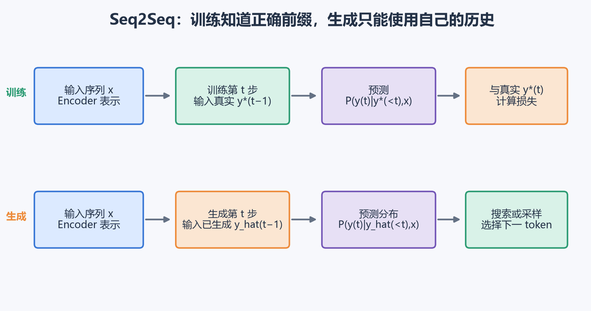

第一步生成错误后，第二步看到的前缀就可能偏离训练分布，后续错误还会继续累积。这种训练和推理条件不一致常称为 exposure bias。它也存在于使用 Teacher Forcing 训练的自回归 Transformer 中，问题并非 RNN 独有。

生成阶段真正想求的是：

$$
\hat y=\arg\max_y P(y\mid x).
$$

若词表大小为 $|V|$、输出长度为 $T$，粗略候选数量达到 $|V|^T$，无法逐条枚举，因此还需要搜索或采样策略。

## 二、贪心搜索快，但每一步最好不保证整句最好

贪心搜索（Greedy Search）在每一步选择当前概率最大的 token：

$$
\hat y_t=arg\max_wP(w\mid\hat y_{<t},x).
$$

它只维护一个前缀，计算和内存开销都很小。问题是，第一步稍低的候选可能拥有更好的后续。

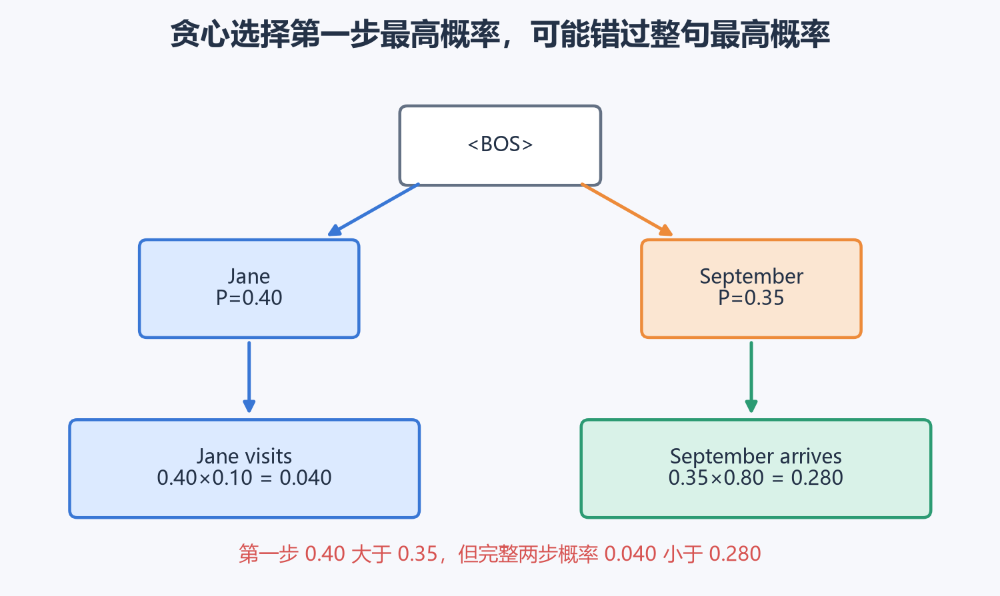

假设第一步：

$$
P(\text{Jane}\mid x)=0.40,
\qquad
P(\text{September}\mid x)=0.35.
$$

贪心会保留 Jane。第二步若有：

$$
P(\text{visits}\mid\text{Jane},x)=0.10,
$$

$$
P(\text{arrives}\mid\text{September},x)=0.80,
$$

则两条序列的联合概率分别是：

$$
0.40\times0.10=0.040,
$$

$$
0.35\times0.80=0.280.
$$

Jane 在第一步领先，完整两步结果却只有另一条路径概率的七分之一。贪心在选择 Jane 后永久丢掉了 September，无法回头。

对格式固定、输出短或延迟极严的任务，贪心仍可能够用。开放式文本若希望多样性，通常从调整后的概率分布采样；翻译、语音识别和其他输入约束较强的任务则经常使用 Beam Search 或带约束的搜索。

## 三、Beam Search 同时保留多个可能前缀

Beam Search 维护累计得分最高的 $B$ 个前缀，$B$ 称为 beam width。流程如下：

1. 从 `<BOS>` 开始计算第一个 token 的分布；
2. 保留得分最高的 $B$ 个前缀；
3. 每个前缀分别扩展词表中的下一 token；
4. 在最多 $B|V|$ 个新前缀中再次保留 Top-$B$；
5. 遇到 `<EOS>` 的序列进入完成集合；
6. 达到停止条件后，从完成序列中选最终得分最高者。

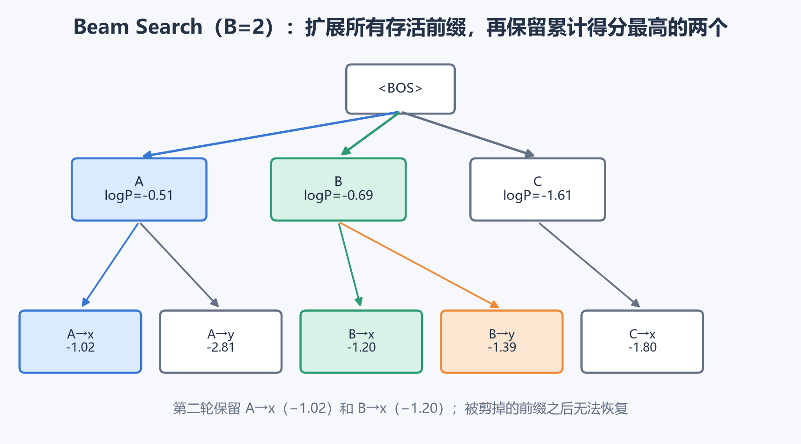

图中 $B=2$。第一轮保留 A 和 B，C 被剪掉。第二轮把 A、B 各自扩展，再按累计对数概率保留 A→x 与 B→x。

实现时只需维护 $B$ 组解码状态。若每组状态输出 $|V|$ 个候选分数，候选张量形状可以理解为：

$$
[B,|V|].
$$

展平后取 Top-$B$，再根据候选来自哪一条旧前缀重排状态。网络参数始终只有一份，并未创建 $B|V|$ 个模型。

Beam Search 仍是近似搜索。某个前缀一旦跌出 Top-$B$ 就无法恢复，因此 $B$ 增大通常能减少搜索遗漏，却不能保证得到全局最优。当前生成工具仍把 Beam Search 作为常用策略，并指出它更适合翻译、图像描述、语音识别等输入约束较强的任务；开放式文本常用多项式采样、top-k 或 top-p 以获得多样性。[Transformers 生成策略文档](https://huggingface.co/docs/transformers/main/en/generation_strategies)

## 四、对数概率和长度归一化共同决定最终排序

序列概率是许多小数相乘：

$$
P(y\mid x)=\prod_tP(y_t\mid y_{<t},x).
$$

长序列的乘积很容易接近浮点数下限。搜索时改用对数：

$$
\log P(y\mid x)
=\sum_t\log P(y_t\mid y_{<t},x).
$$

$\log$ 单调递增，所以按概率与按对数概率排序相同，乘法也转成了更稳定的加法。

每一项对数概率通常不大于 0，token 越多，累加的负数越多。原始总分因此偏爱很早输出 `<EOS>` 的短序列。常用长度归一化为：

$$
S_\alpha(y)=
\frac{1}{T_y^\alpha}
\sum_{t=1}^{T_y}
\log P(y_t\mid y_{<t},x).
$$

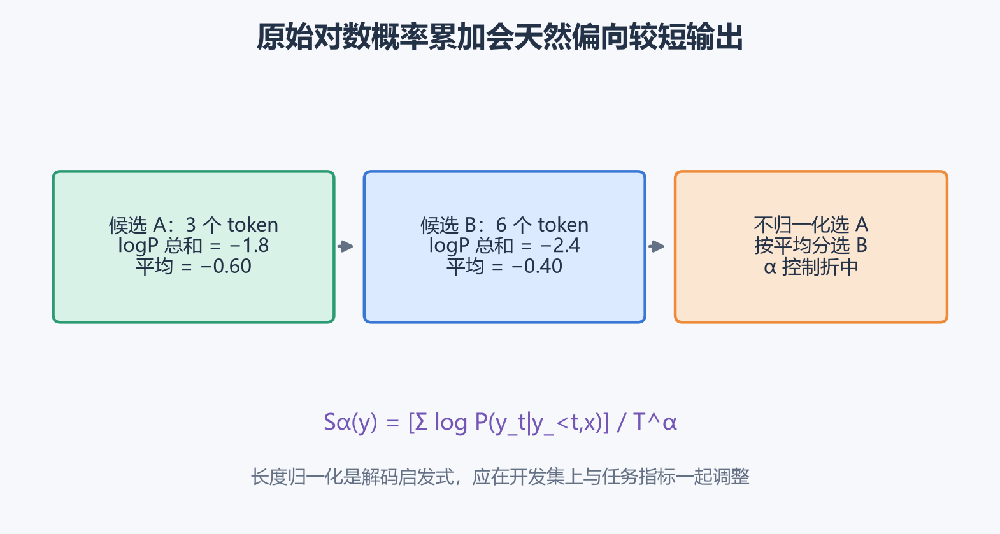

例如候选 A 有 3 个 token，总对数概率为 $-1.8$；候选 B 有 6 个 token，总和为 $-2.4$：

- $\alpha=0$ 时比较总和，$-1.8>-2.4$，选择 A；
- $\alpha=1$ 时比较平均值，A 为 $-0.60$，B 为 $-0.40$，选择 B；
- $0<\alpha<1$ 时在短序列偏好和平均质量之间折中。

长度归一化属于解码启发式，不是条件概率定理。不同任务对漏词、重复和长度的代价不同，应在开发集上连同 beam width、重复惩罚和停止规则一起调整。

### 分清模型错误与搜索错误

生成系统包含两个组件：模型给候选打分，搜索尝试找到高分候选。若人工参考 $y^*$ 明显优于系统输出 $\hat y$，可用实际解码评分比较：

$$
S(y^*\mid x)
\quad\text{和}\quad
S(\hat y\mid x).
$$

- 若 $S(y^*\mid x)>S(\hat y\mid x)$，模型更喜欢参考答案，搜索却没找到，优先检查 beam、剪枝和约束；
- 若 $S(y^*\mid x)\le S(\hat y\mid x)$，模型自己更偏好较差输出，应优先改数据、训练目标或模型。

比较时必须使用同一套长度归一化与约束。盲目增大 beam 只能改善搜索覆盖，无法修复错误的模型偏好。

## 五、BLEU 用 n-gram 重合比较多种合理翻译

翻译通常存在多个正确表达：

```text
The cat is on the mat.
There is a cat on the mat.
```

整句完全匹配会把合理改写判错。BLEU 使用候选与一个或多个参考答案的 n-gram 重合程度进行语料级比较。

### 截断计数防止重复词刷高分

候选为：

```text
the the the the
```

参考为：

```text
the cat is here
```

候选中的 the 出现 4 次，参考最多只允许匹配 1 次。截断 n-gram 精确率为：

$$
p_n=
\frac{
\sum_g\min(\operatorname{count}_{cand}(g),
\max_r\operatorname{count}_{ref_r}(g))
}{
\sum_g\operatorname{count}_{cand}(g)
}.
$$

因此本例的 $p_1=1/4=0.25$。

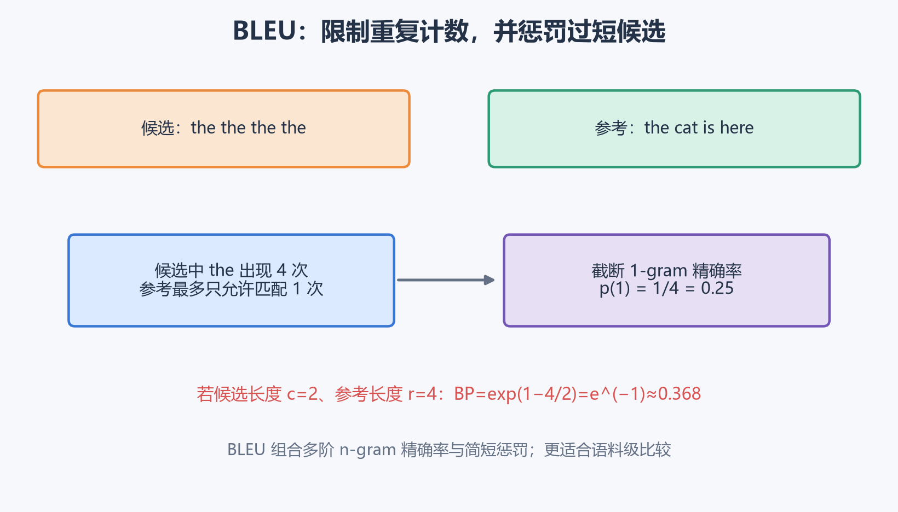

1-gram 主要检查词是否出现，2-gram 开始检查局部顺序，3-gram 和 4-gram 检查更长短语。BLEU 对多个阶数取加权几何平均：

$$
\exp\left(\sum_{n=1}^{N}w_n\log p_n\right).
$$

### 简短惩罚防止只输出少量高置信词

设候选长度为 $c$，参考长度为 $r$：

$$
BP=
\begin{cases}
1,&c>r,\\
\exp(1-r/c),&c\le r.
\end{cases}
$$

如果候选只有 2 个词、参考有 4 个词：

$$
BP=\exp(1-4/2)=e^{-1}\approx0.368.
$$

最终：

$$
BLEU=BP\cdot
\exp\left(\sum_nw_n\log p_n\right).
$$

BLEU 从设计之初就面向自动比较机器翻译输出，并使用修正后的 n-gram 精确率与简短惩罚。[BLEU 原始论文](https://aclanthology.org/P02-1040/)

它仍适合固定测试集上的语料级回归比较，但不能单独判断单句是否正确，也无法充分评价同义改写、事实一致性、否定、语气和可用性。现代生成评估通常结合任务指标、语义指标和人工评审；不同分词、大小写与平滑设置还会让 BLEU 数值变化，报告结果时需要固定计算协议。

## 六、固定上下文向量为什么会成为信息瓶颈

早期 Seq2Seq 把完整输入压缩为一个固定向量：

$$
c=\operatorname{Encoder}(x_{1:T_x}).
$$

解码每个输出词都依赖同一份 $c$。输入很长时，开头、结尾、实体、语法和细节都要竞争有限容量；解码器生成不同词时也无法重新选择最相关的源片段。

Attention 的思路是保留每个输入位置的编码器表示：

$$
a_1,a_2,\ldots,a_{T_x},
$$

并在生成每个目标 token 前，动态计算一份上下文 $c_t$。

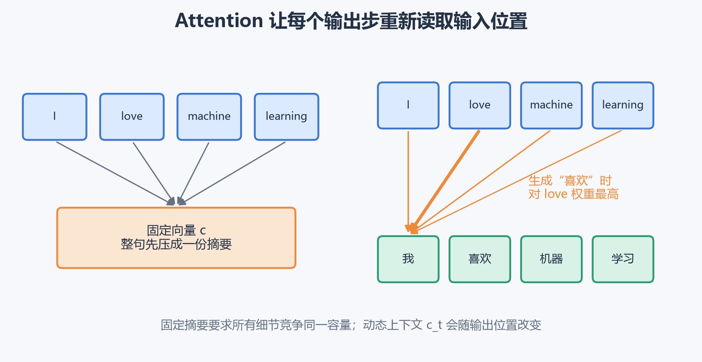

生成“喜欢”时，模型可以把主要权重放到 love；生成“机器”时，再把读取重点移到 machine。每个输出位置都获得适合当前需求的输入摘要。

Bahdanau 等人的加性 Attention 正是为缓解固定长度向量瓶颈提出的：解码器在每一步软搜索当前最相关的源位置，并与翻译模型一起训练。[加性 Attention 原始论文](https://arxiv.org/abs/1409.0473)

## 七、加性 Attention 要完成打分、归一化和加权求和

解码第 $t$ 个目标词前，已经知道上一时刻解码状态 $s_{t-1}$。对每个输入位置 $t'$，计算匹配分数：

$$
e_{t,t'}
=v^T\tanh(W_ss_{t-1}+W_aa_{t'}+b).
$$

各符号含义如下：

- $a_{t'}\in\mathbb R^{d_a}$：输入位置 $t'$ 的编码器表示；
- $s_{t-1}\in\mathbb R^{d_s}$：已经生成前缀的解码状态；
- $W_a,W_s$：把两侧投影到共同匹配空间；
- $v$：把匹配特征压成一个标量；
- $e_{t,t'}$：尚未归一化的相关性分数。

当前状态 $s_t$ 还依赖即将得到的上下文，所以打分时使用已经存在的 $s_{t-1}$。

对固定输出步 $t$，沿所有输入位置做 Softmax：

$$
\alpha_{t,t'}
=\frac{\exp(e_{t,t'})}
{\sum_{k=1}^{T_x}\exp(e_{t,k})}.
$$

权重均不小于 0，并满足：

$$
\sum_{t'=1}^{T_x}\alpha_{t,t'}=1.
$$

最后做加权求和：

$$
c_t=\sum_{t'=1}^{T_x}\alpha_{t,t'}a_{t'}.
$$

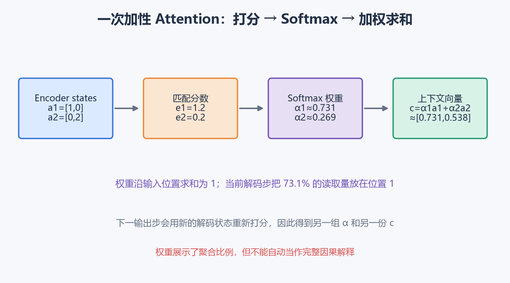

假设只有两个编码器位置：

$$
a_1=[1,0]^T,
\qquad
a_2=[0,2]^T,
$$

当前打分网络给出：

$$
e_{t,1}=1.2,
\qquad
e_{t,2}=0.2.
$$

Softmax 权重为：

$$
\alpha_{t,1}
=\frac{e^{1.2}}{e^{1.2}+e^{0.2}}
\approx0.731,
$$

$$
\alpha_{t,2}\approx0.269.
$$

上下文向量为：

$$
\begin{aligned}
c_t
&=0.731[1,0]^T+0.269[0,2]^T\\
&=[0.731,0.538]^T.
\end{aligned}
$$

第一个位置获得 73.1% 的读取权重，第二个位置仍贡献了 26.9%。下一输出步会使用新的解码状态重新打分，得到新的权重和上下文。

训练不需要人工给出词对齐。翻译损失会沿 $\hat y_t\rightarrow s_t\rightarrow c_t\rightarrow\alpha_{t,t'}\rightarrow e_{t,t'}$ 回传；关注某个位置若有助于预测正确词，对应打分就会得到强化。

Attention 权重展示信息聚合比例，不能自动当作完整因果解释。后续层还会混合表示，不同权重分布也可能产生相似输出。它适合观察模型行为，重要结论还需通过遮挡、反事实或梯度等方法验证。

这套 RNN 加性 Attention 已经很少作为大规模翻译的默认主干，但“查询多个位置、归一化匹配分数、加权读取表示”的机制直接通向 Transformer。下一篇会用 Query、Key、Value 和缩放点积重新构造这套计算。

## 八、语音识别首先面对输入帧远多于输出文字

原始音频是一维采样波形。系统通常把短时间窗口转换成频谱、Mel 滤波器组或其他声学特征：

$$
X\in\mathbb R^{T_x\times d_{audio}}.
$$

$T_x$ 是音频帧数，$d_{audio}$ 是每帧特征维度。假设每秒产生 100 帧，10 秒音频约有 1000 帧，而转写文本可能只有几十个字符或子词。

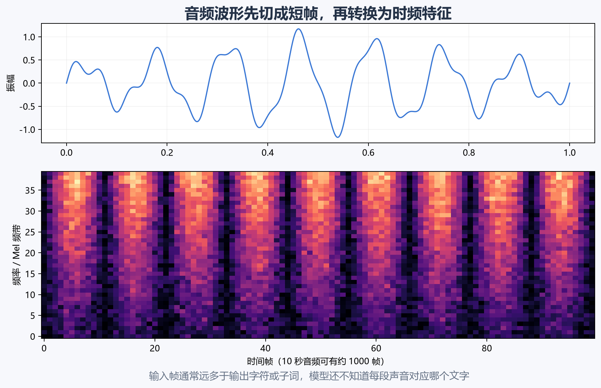

训练数据通常只有整段音频和完整文本，没有“第 137～162 帧对应某个字”的逐帧标注。说话速度、停顿、连读、噪声和重复字符还会让对齐更加复杂。

端到端语音识别直接学习：

$$
\text{音频特征}\rightarrow\text{文字序列}.
$$

课程介绍 Attention Encoder–Decoder 和 CTC 两条路线。现代声学编码器经常使用 Conformer，把卷积的局部建模和 Transformer 的全局交互结合起来。[Conformer 原始论文](https://arxiv.org/abs/2005.08100) 编码器更新了，输入输出长度不同与未知对齐的问题依然存在。

## 九、CTC 用 blank 表示“这一帧暂时不输出字符”

Connectionist Temporal Classification（CTC）适合输入时间步很多、输出较短、对齐保持单调顺序的任务。它在输出字母表中增加特殊 blank，记作 $\varnothing$ 或 `_`。

模型为每个输入帧输出类别分布：

$$
P(\pi_t\mid x),
\qquad
\pi_t\in\mathcal V\cup\{\varnothing\}.
$$

$\pi=(\pi_1,\ldots,\pi_{T_x})$ 是一条帧级路径。CTC 折叠函数 $B$ 执行两步：

1. 合并连续重复标签；
2. 删除 blank。

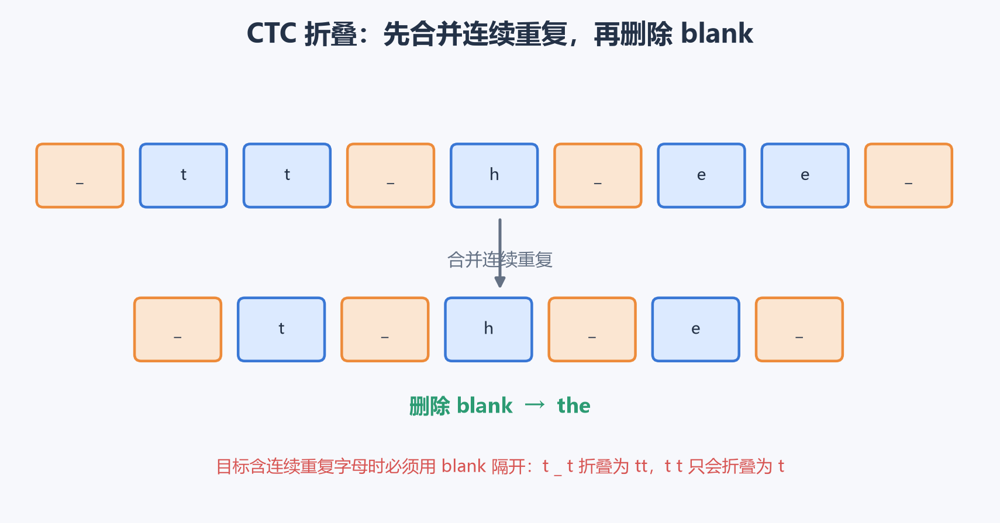

例如：

```text
_ t t _ h _ e e _
```

连续的 `t t` 和 `e e` 先各合并为一个，再删除 `_`，最终得到 `the`。

重复字符需要特别处理。路径 `t t` 会先合并成 `t`，所以目标 `tt` 必须由 blank 隔开，例如：

```text
t _ t
```

这说明 blank 既表示没有输出，也承担分隔连续相同标签的作用。

## 十、CTC 损失对所有合法对齐路径求和

目标文本 $y$ 可以对应许多帧级路径。CTC 定义：

$$
P(y\mid x)
=\sum_{\pi:B(\pi)=y}P(\pi\mid x).
$$

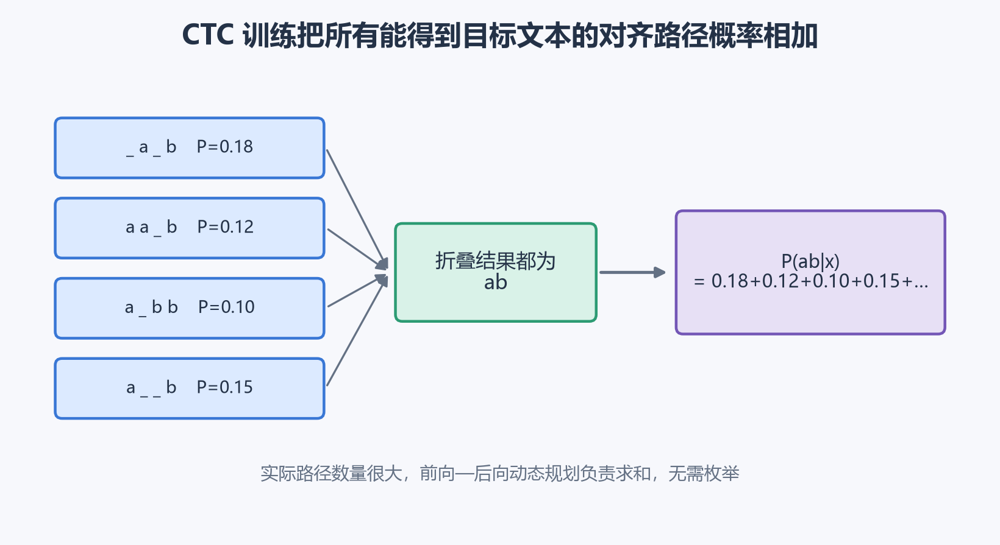

假设目标是 `ab`，下面路径都能折叠成同一文本：

```text
_ a _ b
a a _ b
a _ b b
a _ _ b
```

若它们的概率分别为 $0.18,0.12,0.10,0.15$，仅这四条就贡献：

$$
0.18+0.12+0.10+0.15=0.55.
$$

完整概率还要加入其余所有合法路径。路径数随帧数快速增长，实际使用前向—后向动态规划求和，无需逐条枚举。训练损失为：

$$
\mathcal L_{CTC}=-\log P(y\mid x).
$$

这里训练的目标不是找出唯一“正确帧对齐”。多条合理路径共同得到概率，模型可以在不知道字符边界的情况下学习。

经典 CTC 在给定编码器表示后，对各帧输出采用较强的条件独立假设，语言建模能力有限。解码时可以使用贪心折叠，也可以用 Beam Search 融合语言模型、词典和业务约束。

CTC 远未过时。当前 PyTorch 的 `CTCLoss` 仍直接接收形状为 $(T,N,C)$ 的对数概率，其中 $T$ 是输入长度、$N$ 是批量、$C$ 包含 blank 类，并显式要求输入与目标真实长度。[PyTorch CTCLoss 文档](https://docs.pytorch.org/docs/stable/generated/torch.nn.CTCLoss.html) NeMo 当前 ASR 模型也继续组合 FastConformer 编码器与 CTC、RNN-T 或 TDT 解码器，说明 CTC 的对齐目标仍服务于现代声学架构。[NVIDIA NeMo ASR 模型](https://docs.nvidia.com/nemo/speech/nightly/asr/featured_models.html)

CTC 的边界同样明确：输出顺序需要与输入保持单调，无法自然表示任意重排；帧间独立假设也限制了语言依赖。机器翻译这类可能重排语序的任务通常使用 Attention 或 Transformer Encoder–Decoder；严格流式语音还常采用 Transducer 或缓存式模型。

## 十一、触发词检测要围绕事件而非逐帧准确率设计

触发词系统持续接收音频，并在检测到 “Hey Siri”“Alexa” 等短语后唤醒后续服务。第 $t$ 帧可以输出：

$$
\hat y_t
=P(\text{触发词刚在 }t\text{ 附近结束}\mid x_{1:t}).
$$

训练标签最简单的构造方式是：触发词结束前标 0，在结束位置后的若干帧标 1。

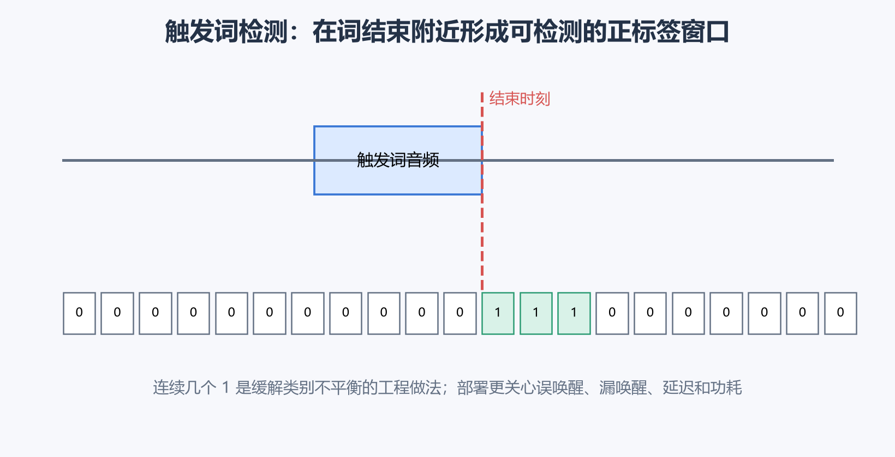

把连续若干帧标为 1 是工程启发式。它扩大极少数正样本的时间窗口，也允许检测时间存在轻微偏移，但会改变“正事件”的定义，窗口宽度需要结合帧率和容许延迟确定。

一小时音频中绝大多数帧都不是触发时刻。若模型全部预测 0，逐帧准确率仍可能非常高，因此更有意义的指标是：

- **误唤醒（false accept）**：无人说触发词却启动系统；
- **漏唤醒（false reject）**：用户说了触发词却没有响应；
- **检测延迟**：触发词结束后多久给出结果；
- **每小时误唤醒次数**：持续运行设备的直接体验指标；
- **分场景表现**：噪声、距离、口音、说话人和播放音频攻击；
- **功耗与算力**：常驻模型必须满足设备预算。

训练可以使用正类加权、Focal Loss 或正负采样；推理还常加入概率平滑、阈值、连续帧确认与冷却时间。阈值降低会减少漏唤醒，同时增加误唤醒，最终选择必须由产品场景和测试集决定。

## 十二、今天怎样理解生成、Attention 与语音对齐

这一周的知识横跨历史架构与仍在使用的算法，适合按“机制是否仍存在”来判断：

| 内容 | 当前定位 | 仍需要掌握的部分 |
|---|---|---|
| 固定向量 RNN Seq2Seq | 大规模翻译中主要用于教学 | 条件序列概率、Encoder–Decoder、训练与推理差异 |
| Greedy / Beam Search | 输入约束生成与 ASR 中仍常用 | 累计得分、剪枝、长度偏差、模型与搜索归因 |
| 开放式文本生成 | 通常更多使用采样与约束 | 温度、top-k、top-p 等属于同一“怎样选下一 token”问题 |
| BLEU | 仍可做翻译语料级回归指标 | 截断 n-gram、简短惩罚、协议一致性及指标边界 |
| RNN 加性 Attention | 通用主干地位已被 Transformer 取代 | 动态匹配、Softmax 权重、加权读取和软对齐 |
| CTC | ASR、OCR、手写识别等单调对齐任务仍活跃 | blank、路径折叠、路径概率求和与条件独立限制 |
| 现代语音系统 | 常用 Conformer、CTC、Transducer、AED 或混合结构 | 流式延迟、声学编码、对齐目标与解码约束 |

搜索算法、模型概率和评价指标需要分开：交叉熵或 CTC 负责训练参数，Beam Search 在模型分数下寻找输出，BLEU 或语音错误率衡量最终结果。任何一个环节改善，都不保证另外两个环节自动改善。

Attention 与 CTC 也解决不同问题。Attention 为每个输出步主动读取输入位置，允许较灵活的软对齐；CTC 对所有单调帧级路径求和，结构更受约束，也更适合输入时间顺序与输出顺序基本一致的任务。下一篇 Transformer 会继续使用“匹配—归一化—加权求和”的注意力主线，同时改变匹配公式、并行方式和整体网络结构。
