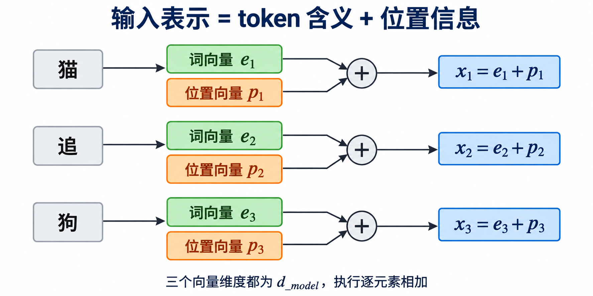
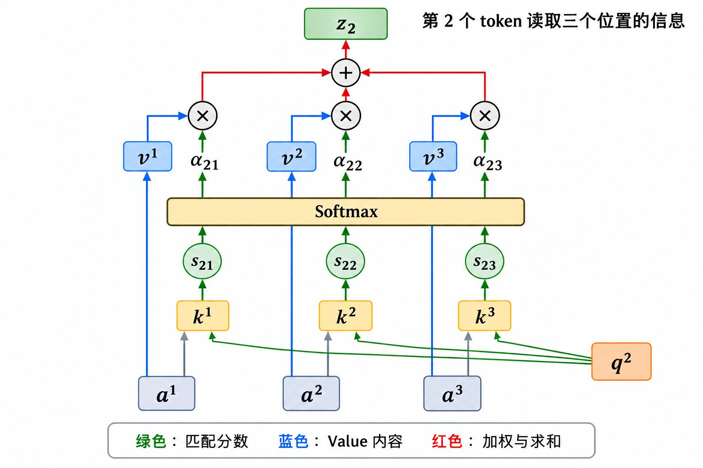
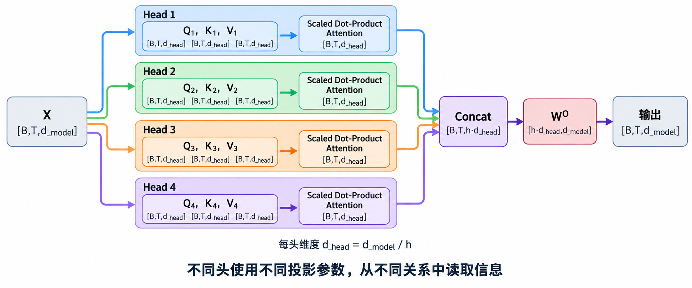
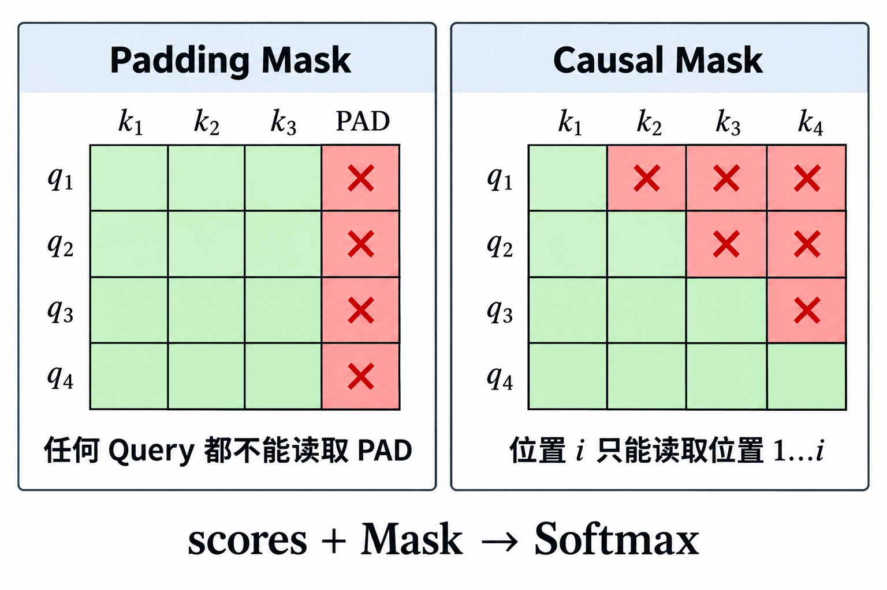
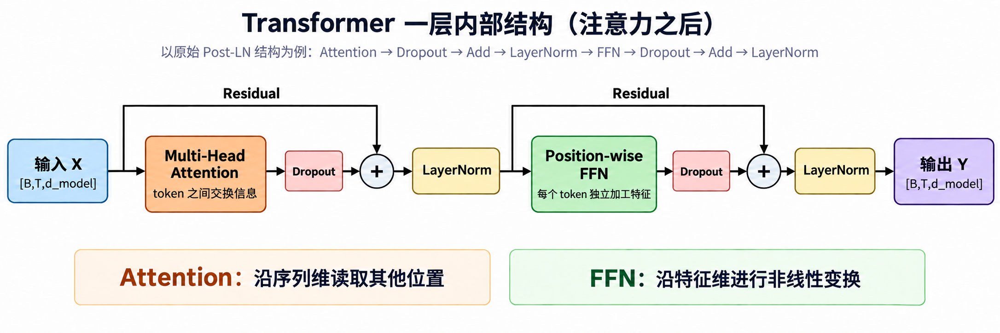
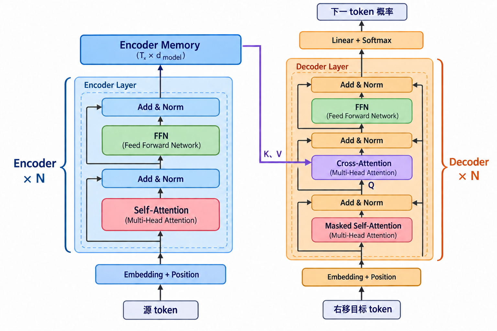
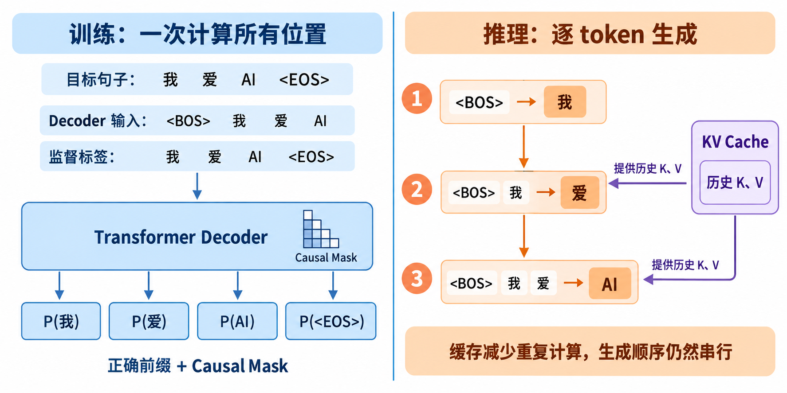

# [AI进阶-序列模型]4.Transformer结构、训练与推理

RNN 需要沿时间步逐个传递隐藏状态。句子越长，同一层中的依赖链越长，GPU 也很难一次处理完所有位置。Transformer 改变了层内的信息传递方式：先让每个 token 直接判断自己应该读取哪些位置，再把相关位置提供的内容汇总回来。这篇文章会从一段输入真正怎样流过模型开始讲解。每遇到一个模块，先说明它要解决什么问题、输入里有哪些数据、输出交给谁，再进入公式和张量形状。文章保留原总结里专门补充的易混淆点，包括 Q/K/V 的真实来源、Softmax 的维度、两种 Mask、FFN 的位置、Encoder Memory、目标右移、训练与推理的区别，以及 KV Cache、GQA 等现代实现。

## 第一章：为什么需要 Transformer？


在进入公式之前，先把 Transformer 想要解决的麻烦说清楚。序列模型要处理的不只是若干互不相关的词，它还要让一个位置利用前后文。RNN 通过隐藏状态逐步传递上下文，Transformer 则让每个位置在一层内直接读取其他位置。两种方案的差别，首先体现在信息怎样流动。

**RNN 的信息流是串行的**

RNN 按时间递推：

$$
h_t=f(h_{t-1},x_t)
$$

要计算 $h_t$，必须先得到 $h_{t-1}$。因此同一层内部存在长度为 $T$ 的依赖链：

$$
h_1\rightarrow h_2\rightarrow\cdots\rightarrow h_T
$$

这会带来：

- 时间步难以完全并行；
- 长距离信息需要经过许多递推；
- 训练吞吐受到序列长度影响；
- 梯度路径较长。

**Transformer 的核心改变**

Transformer 不通过隐藏状态逐步传递信息。它让每个位置直接计算自己与所有其他位置的关系：

$$
\text{position }i
\longleftrightarrow
\text{all positions }j
$$

在一个 Self-Attention 层内，任意两个位置之间只需一次注意力连接。所有位置的 Query、Key、Value 和注意力矩阵都可以用大矩阵运算并行计算。

**并行不等于计算量更低**

Self-Attention 的注意力矩阵形状为：

$$
T\times T
$$

其时间和显存成本通常包含：

$$
O(T^2)
$$

项。所以 Transformer 的优势主要是：

- 并行友好；
- 路径短；
- 易扩展；
- 矩阵运算适合现代硬件；

这不代表它在所有序列长度下都更省计算。

## 第二章：输入表示


注意力无法直接接收原始文字。文字要先经过分词和查表变成向量，同时补上位置信息；否则模型只能知道句子里出现了哪些 token，却不知道它们的先后关系。下面沿着“token → 词向量 → 位置向量 → 层输入”这条路线来看。

**Token Embedding**

词表大小为 $|V|$（token 种类数），模型维度为 $d_{\text{model}}$（每个 token 的向量长度）。Token 是 Tokenizer 切出的文本单位，可以是单词、子词、汉字或标点。例如 `unbelievable` 在不同模型中可能被切成 `["un","believable"]` 或 `["un","believ","able"]`。切分规则由模型配套的 Tokenizer（如 BPE、WordPiece）和固定词表决定，因此不同模型可能不同；同一模型在普通推理时，对相同文本的切分通常不变。每个 token 都会被转换为一个 token id。这个 id 只是它在词表中的编号，用于从 Embedding Matrix 中查找向量：

$$E\in\mathbb R^{|V|\times d_{\text{model}}},\qquad e_w=E[\operatorname{id}(w)]$$

因此“查表”就是根据 token id 从 $E$ 中取出对应的向量 $e_w$。整个过程是：文本 $\rightarrow$ token $\rightarrow$ token id $\rightarrow$ Token Embedding。长度为 $T$ 的序列组成 $X_{\text{token}}\in\mathbb R^{T\times d_{\text{model}}}$；加入 batch 后为 $X_{\text{token}}\in\mathbb R^{B\times T\times d_{\text{model}}}$，其中 $B$ 是一次并行处理的样本数。

**为什么必须加入位置？**

如果没有位置信息，Self-Attention 只看到一组向量。对输入位置做同样置换，输出也会发生对应置换。这称为 permutation equivariance。模型无法仅凭内容区分：

```text
dog bites man
man bites dog
```

所以需要把顺序信息注入输入。

**正弦位置编码**

原始 Transformer 同时使用正弦和余弦：偶数维使用正弦，奇数维使用余弦：

$$PE(pos,2i)=\sin\left(\frac{pos}{10000^{2i/d_{\text{model}}}}\right),\qquad
PE(pos,2i+1)=\cos\left(\frac{pos}{10000^{2i/d_{\text{model}}}}\right)$$

不同维度使用不同波长：高频维度对相邻位置敏感，低频维度负责区分较远位置，组合后能在模型使用的长度范围内得到可区分的位置向量。选择正弦和余弦不只是为了“每个位置不同”，还因为 $PE(pos+k)$ 能由 $PE(pos)$ 通过只与相对距离 $k$ 有关的线性关系表示，这有利于模型学习相对位置。位置 One-hot 也能区分位置，但维度会随最大序列长度增长，而且任意两个位置都同样远，不能直接表达“位置 1 比位置 100 更接近位置 2”。正弦—余弦编码维度固定、可直接计算任意位置，并保留连续的距离结构。最后把含义向量与同维度的位置向量逐元素相加：$x_t^{(0)}=e_{w_t}+PE(t)$，即前者表示“这个 token 是什么”，后者表示“它位于哪里”。整个序列写为 $X^{(0)}=X_{\text{token}}+PE$，这才是送入第一个 Transformer Layer 的输入矩阵。



**其他位置编码方案**

正弦位置编码不是唯一方案。现代模型还使用：

- 可学习绝对位置嵌入；
- 相对位置偏置；
- RoPE；
- ALiBi；
- 其他长上下文位置方案。

选择取决于架构与上下文长度需求。

## 第三章：Multi-Head Self-Attention 总览


输入矩阵准备好以后，真正的信息交换发生在注意力模块中。先看完整流程，可以把它理解成三步：每个 token 生成自己的查询与资料索引，查询和所有索引计算匹配程度，再按匹配结果读取内容。多头注意力只是同时运行多组这样的读取过程。

**先看整体：Self-Attention 是多头注意力中的一个单元**

Transformer 层实际使用的是 **Multi-Head Attention（多头注意力）**。它内部包含 $h$ 个并行的注意力头，每个头都独立执行一次 Scaled Dot-Product Self-Attention：

$$
head_r
=
\operatorname{softmax}
\left(
\frac{Q_rK_r^\top}{\sqrt{d_k}}
\right)V_r
$$

然后把所有头的结果拼接并融合：

$$
\operatorname{MHA}(X)
=
\operatorname{Concat}(head_1,\ldots,head_h)W^O
$$

因此，下面先拆开一个头，解释它的输入、$Q/K/V$、注意力权重和输出，再回到多个头如何组合。

**完整计算流程**

一次 Multi-Head Self-Attention 的完整过程如下：

```text
输入 X
→ 每个头分别生成 Qr、Kr、Vr
→ QrKrᵀ 计算 token 两两匹配分数
→ 缩放、Mask、Softmax 得到注意力权重
→ 用权重对 Vr 加权求和，得到 headr
→ 拼接所有 head
→ 经过 WO 融合，得到多头注意力输出
```

其中，Self-Attention 的“Self”表示 $Q_r,K_r,V_r$ 都来自同一个输入 $X$。

**输入 $X$ 从哪里来？**

忽略 batch。在第一个 Transformer Layer 中：

$$
X=X_{\text{token}}+PE
\in\mathbb R^{T\times d_{\text{model}}}
$$

$X$ 的每一行 $x_i$ 对应一个 token，同时包含“它是什么”和“它位于哪里”。在后续层中，$X$ 是上一层的输出，其中已经传递了位置信息，不需要再次加入 $PE$。

## 第四章：拆解一个 Self-Attention 头


接下来只保留一个头，并跟踪一个 token 怎样读取整段序列。这样可以先把 Query、Key、Value 的职责和矩阵形状看清，再回到多个头的组合。

**一个头怎样生成 $Q、K、V$？**

以第 $r$ 个头为例：

$$
Q_r=XW_r^Q,\qquad
K_r=XW_r^K,\qquad
V_r=XW_r^V
$$

真正通过训练更新的是参数矩阵 $W_r^Q,W_r^K,W_r^V$，而 $Q_r,K_r,V_r$ 是根据当前输入临时计算出的结果。对于第 $i$ 个 token：

$$
q_i^{(r)}=x_iW_r^Q,\qquad
k_i^{(r)}=x_iW_r^K,\qquad
v_i^{(r)}=x_iW_r^V
$$

每个 token 生成三个向量；所有 token 的向量按行堆叠后，才形成矩阵 $Q_r,K_r,V_r$。

**为什么称为 Query、Key、Value？**

这些名称来自它们在计算中的职责，并不代表预先规定的固定语义：

- Query：当前 token 用什么特征去寻找相关信息；
- Key：每个 token 用什么特征接受匹配；
- Value：匹配后真正提供什么内容。

$Q$ 与 $K$ 决定“关注谁”，$V$ 决定“读取什么”。三个投影矩阵从随机值开始，通过最终任务损失逐渐学会适合各自职责的表示。

**一个 token 怎样读取其他 token？**

在某个头中，第 $i$ 个 token 的 Query 与第 $j$ 个 token 的 Key 计算：

$$
s_{ij}
=
\frac{q_i^\top k_j}{\sqrt{d_k}}
$$

对固定的 $i$，它会与所有 $k_j$ 匹配，再沿所有 Key 位置做 Softmax：

$$
\alpha_{ij}
=
\frac{\exp(s_{ij})}
{\sum_{m=1}^{T}\exp(s_{im})}
$$

最后读取所有 Value：

$$
z_i=\sum_{j=1}^{T}\alpha_{ij}v_j
$$

所以完整对应关系是：

```text
qi 与 kj 匹配 → 得到关注权重 αij → 用 αij 读取 vj
```



**矩阵公式中每一部分在做什么？**

把所有 token 同时计算，得到：

$$
\operatorname{Attention}(Q,K,V)
=
\underbrace{
\operatorname{softmax}
\left(
\frac{QK^\top}{\sqrt{d_k}}
\right)
}_{A：注意力权重}
V
$$

$QK^\top$ 让每个 Query 与所有 Key 两两匹配：

$$
QK^\top\in\mathbb R^{T\times T}
$$

其中 $A_{ij}$ 表示第 $i$ 个 token 从第 $j$ 个 token 读取信息的权重，每一行之和为 1。公式最后乘 $V$，是因为前半部分只回答“应该关注谁、关注多少”；接下来需要汇总各 token 提供的实际内容。若乘 $Q$ 或 $K$，汇总到的会是其他 token 的查询特征或匹配特征，无法得到它们准备传递的内容。形状变化为：

$$
(T\times d_k)(d_k\times T)
\rightarrow T\times T
$$

$$
(T\times T)(T\times d_v)
\rightarrow T\times d_v
$$

**$d_k$ 和缩放项是什么？**

$d_k$ 是一个头中每个 Query 和 Key 向量的维度：

$$
q_i,k_j\in\mathbb R^{d_k}
$$

维度越大，点积 $q_i^\top k_j$ 的数值幅度通常越大，容易使 Softmax 过早接近 0 或 1，造成梯度过小。因此除以 $\sqrt{d_k}$，把分数缩放到较稳定的范围。

**一个头最终得到什么？**

一个头输出：

$$
head_r\in\mathbb R^{T\times d_v}
$$

其中每一行都是一个 token 从其他 token 的 Value 中加权汇总得到的新表示。这个表示会随上下文改变，例如 `river bank` 与 `financial bank` 中的 `bank` 会读取不同的信息。

#### 用两个位置把“打分—归一化—读取”完整算一遍

先只计算第一个 token 的输出，并令一个头的维度为 $d_k=2$：

$$
q_1=[1,1],\quad k_1=[1,0],\quad k_2=[0,2].
$$

当前 Query 分别与两个 Key 做点积：

$$
q_1^\top k_1=1,\qquad q_1^\top k_2=2.
$$

第二个分数更大，说明当前投影空间认为第 2 个位置与第 1 个 token 的查询更匹配。除以 $\sqrt{d_k}=\sqrt2$ 后：

$$
[s_{11},s_{12}]
=
\left[\frac1{\sqrt2},\frac2{\sqrt2}\right]
\approx[0.71,1.41].
$$

Softmax 把它变成总和为 1 的读取比例：

$$
[\alpha_{11},\alpha_{12}]\approx[0.33,0.67].
$$

假设两个位置真正提供的 Value 为：

$$
v_1=[10,0],\qquad v_2=[0,6],
$$

则第一个 token 得到的新表示为：

$$
z_1=0.33v_1+0.67v_2=[3.3,4.02].
$$

这个结果按 $33\%$ 和 $67\%$ 混合两处内容，并没有只选择其中一个 token。真实模型会同时为所有 token、所有头执行相同过程。所以单头 Self-Attention 完成的是：

$$
\text{每个 token 的当前表示}
\rightarrow
\text{结合整段上下文后的表示}
$$


## 第五章：多个头如何组合


一个头只能使用一套投影规则观察输入。多头结构让模型同时使用多套规则，再把得到的上下文表示合并回原来的模型维度。这里需要关注的重点是各头是否并行、每头维度怎样确定，以及拼接后的信息怎样融合。

**多个头怎样并行计算？**

每个头接收相同的 $X$，但使用不同的参数：

$$
W_r^Q,\quad W_r^K,\quad W_r^V
$$

因此，同一对 token 在不同头中的 $Q/K/V$ 和注意力分数可以不同。多个头相当于让模型在不同投影空间中同时寻找局部搭配、指代、语法或远距离依赖等关系。这些头彼此并行，不是依次执行，也不是多个完整的 Transformer 模型。



**为什么每个头的维度通常要除以头数？**

若模型维度为 $d_{\text{model}}$，共有 $h$ 个头，通常设置：

$$
d_k=d_v=\frac{d_{\text{model}}}{h}
$$

这里会在设计每个头时直接确定向量维度，无需在注意力公式运行时再除一次。例如 $d_{\text{model}}=512,h=8$，则每个头通常使用 64 维。每个头输出 $T\times d_v$，拼接后：

$$
H=\operatorname{Concat}(head_1,\ldots,head_h)
\in\mathbb R^{T\times(hd_v)}
=
\mathbb R^{T\times d_{\text{model}}}
$$

这样既能使用多个头，又不会让总输出维度和计算量随头数直接成倍增长。该维度分配属于常用设计，注意力公式本身没有强制要求。

**$W^O$ 做什么，最终输出是什么？**

各个头的输出只是拼接在一起，还没有充分混合，因此再经过可训练的输出投影：

$$
O=HW^O,\qquad
W^O\in\mathbb R^{d_{\text{model}}\times d_{\text{model}}}
$$

$W^O$ 负责融合不同头的信息，得到：

$$
O\in\mathbb R^{T\times d_{\text{model}}}
$$

这就是 Multi-Head Self-Attention 的最终输出。随后它会进入残差连接、归一化和 FFN。不同头可能形成不同关注模式，但不能预先把某个头固定指定为“语法头”或“指代头”，部分功能也可能分散或重复。

**Mask 位于完整算法的哪里？**

加入 Mask 后，一个头的完整公式为：

$$
head_r
=
\operatorname{softmax}
\left(
\frac{Q_rK_r^\top}{\sqrt{d_k}}+M
\right)V_r
$$

Mask 只改变哪些位置可以被关注，不负责生成 $Q/K/V$。需要两种 Mask，是因为它们解决的问题不同：Padding Mask 排除为对齐长度而补出的无效位置，Causal Mask 则保证自回归生成时不能读取尚未生成的未来答案。

**Padding Mask**

batch 中序列长度不同，通常按该 batch 内 token 数最多的句子补齐。例如一次输入 10 句话时，较短的句子会用 `<PAD>` 补到其中最长句的 token 数。Padding Mask 根据 `token_id == pad_token_id` 生成，把这些无效 Key 位置的分数设为 $-\infty$，Softmax 后权重为 0。更准确地说，输入预处理时先根据 `<PAD>` 生成 `[1,1,\ldots,0]` 形式的有效位置 Mask，Attention 计算时再将其广播并转换成由 $0$ 和 $-\infty$ 组成的 $M_{\text{padding}}$，加入注意力分数。

训练和部署时，只要 batch 中存在 `<PAD>`，就需要 Padding Mask。单句或变长推理没有实际填充时可以省略；Packed Sequence、变长 FlashAttention 等实现也可能不构造完整 Mask，而是通过序列长度隐式跳过填充位置。

**Causal Mask**

Causal Mask 不是所有 Attention 都要使用，它主要用于 **Decoder 的自回归 Self-Attention**。三种 Attention 的区别是：

| Attention 位置 | 是否使用 Causal Mask | 原因 |
|---|---|---|
| Encoder Self-Attention | 通常不使用 | 完整源输入本来就是已知条件，可以同时查看前后文 |
| Decoder Self-Attention | 使用 | 正在生成目标序列，不能提前查看未来正确答案 |
| Decoder Cross-Attention | 不使用目标侧 Causal Mask | Decoder 可以读取完整 Encoder Memory；源序列不是未来答案 |

因此，“不能看到后面的词”特指不能看到**未来目标 token**，不是说模型不能查看完整的输入源句。Encoder 因为可以查看源序列两侧位置，所以通常称为双向；Decoder Self-Attention 因为只能查看当前位置和过去目标词，所以是单向的。Decoder 训练时为了并行计算，会一次输入整段右移后的目标序列。如果没有 Causal Mask，前面的位置就能直接读取后面的正确 token，形成答案泄漏。因此由序列长度和“只能看当前位置及过去”的任务规则生成上三角 Mask：

$$
M_{ij}
=
\begin{cases}
0,&j\le i\\
-\infty,&j>i
\end{cases}
$$

部署时，自回归模型仍必须遵守相同的因果约束。逐 token 生成配合 KV Cache 时，未来 token 尚不存在，约束会自然满足，因此可能不显式创建完整三角矩阵；若一次并行处理多个位置、分块生成或使用统一注意力实现，则仍会显式使用 Causal Mask。



**Mask 必须在 Softmax 之前加入**

正确顺序是：计算 $QK^\top/\sqrt{d_k}$，加入 Mask，再执行 Softmax。若 Softmax 后才清零，剩余权重之和不再为 1。Decoder 中 Padding Mask 与 Causal Mask 可以同时存在：

$$
M=M_{\text{padding}}+M_{\text{causal}}
$$

两种 Mask 的使用条件整理如下：

| Mask | 来源 | 训练时 | 部署时 |
|---|---|---|---|
| Padding Mask | 输入中哪些位置是 `<PAD>` | 有 PAD 就使用 | 有 PAD 就使用，也可能由变长计算隐式实现 |
| Causal Mask | “不能读取未来目标 token”的生成规则 | 必须防止答案泄漏 | 必须保持因果约束，可显式使用，也可由逐 token + KV Cache 隐式满足 |


## 第六章：Position-wise FFN


Attention 已经让 token 之间交换了信息，但一次加权求和还不足以完成复杂变换。每个 token 收集完上下文后，还要进入同一套前馈网络，对自己的特征做非线性加工。

**Attention 输出先经过残差与归一化**

以原论文的 Post-Norm 结构为例，Multi-Head Attention 输出后先经过：

$$
H=\operatorname{LayerNorm}
\left(
X+\operatorname{Dropout}(\operatorname{MHA}(X))
\right)
$$

也就是先做 Dropout，再与 Attention 的输入 $X$ 进行残差相加，最后做 LayerNorm，得到 $H$ 后才送入 FFN。后面的层内数据流会继续解释这三种操作各自解决的问题。

**FFN 解决什么问题？**

Attention 主要沿序列维聚合信息。它解决的是“每个 token 应该从其他 token 读取什么”，但其核心仍是对 Value 的加权求和。FFN 接着对每个 token 已经收集到的上下文特征进行非线性加工和重新组合：

$$
\boxed{\text{Attention：token 之间交换信息}
\quad\rightarrow\quad
\text{FFN：每个 token 独立加工信息}}
$$

**FFN 的架构**

原论文 FFN：

$$
\operatorname{FFN}(x)
=
W_2\operatorname{ReLU}(W_1x+b_1)+b_2
$$

经典 FFN 包含两个线性层和一个中间激活函数：

$$
d_{\text{model}}
\xrightarrow{W_1}
d_{\text{ff}}
\xrightarrow{\operatorname{ReLU}}
d_{\text{ff}}
\xrightarrow{W_2}
d_{\text{model}}
$$

$d_{\text{ff}}$ 是 FFN 中间隐藏层的宽度，也可以理解为该隐藏层的神经元数量。原论文使用：

$$
d_{\text{model}}=512,\qquad d_{\text{ff}}=2048
$$

即 $512\rightarrow2048\rightarrow512$。扩展到更宽的空间可以形成更多中间特征，激活函数提供非线性，第二层再把有用特征组合回模型维度。现代模型也常使用 GELU、SiLU 或 SwiGLU 等变体。“Position-wise”表示所有 token 共享同一套 FFN 参数，但彼此独立计算：

$$
f_i=\operatorname{FFN}(h_i)
$$

FFN 内部不会再次让不同 token 互相交换信息。

#### FFN 得到什么，之后去哪里？

FFN 为每个 token 输出一个新的 $d_{\text{model}}$ 维表示。整个序列的形状保持为：

$$
F\in\mathbb R^{T\times d_{\text{model}}}
$$

它不会直接作为本层最终输出，还要经过第二组 Dropout、残差连接和 LayerNorm：

$$
Y=\operatorname{LayerNorm}
\left(
H+\operatorname{Dropout}(\operatorname{FFN}(H))
\right)
$$

得到的 $Y$ 才是当前 Transformer Layer 的输出：



$$
Y
\rightarrow
\begin{cases}
\text{下一层 Transformer Layer},&\text{当前不是最后一层}\\
\text{后续输出模块},&\text{当前是最后一层}
\end{cases}
$$

因此，一个完整层内的数据流是：

$$
\text{Attention}
\rightarrow
\text{Add \& Norm}
\rightarrow
\text{FFN}
\rightarrow
\text{Add \& Norm}
\rightarrow
\text{当前 Transformer Layer 输出 }Y
$$


## 第七章：Dropout、Residual 与 LayerNorm


Attention 和 FFN 负责学习内容，残差连接、Dropout 与 LayerNorm 则负责让这些模块能够稳定堆叠和训练。三者总是围绕子层一起出现，因此要放在同一条数据流中理解。

原始 Transformer 的一个子层按照下面的顺序处理：

$$
\text{子层输出}
\rightarrow
\text{Dropout}
\rightarrow
\text{Residual Add}
\rightarrow
\text{LayerNorm}
$$

架构图中的 **Add & Norm** 是这一组操作的简称：Add 指残差相加，Norm 指 LayerNorm，Dropout 通常发生在 Add 之前。

**Dropout：随机丢弃部分特征**

Dropout 用于减少过拟合。训练时，它随机把部分数值置零，避免模型长期依赖少数固定特征：

$$
\operatorname{Dropout}(x)
=
\frac{m\odot x}{1-p},
\qquad
m_i\sim\operatorname{Bernoulli}(1-p)
$$

其中 $p$ 是丢弃概率，除以 $1-p$ 是为了保持输出的期望值不变。例如 $x=[2,4,6,8]$、$p=0.5$，某次随机得到 $m=[1,0,1,0]$，则：

$$
\operatorname{Dropout}(x)
=
\frac{[2,0,6,0]}{0.5}
=
[4,0,12,0]
$$

训练时每次前向传播都会重新随机丢弃；部署推理时不再丢弃，直接输出 $x$。Dropout 的随机 Mask 与屏蔽 PAD、未来位置的 Attention Mask 不是同一种东西。在 Transformer 中，Dropout 可用于 Attention 权重、Attention/FFN 输出、FFN 中间激活以及 Embedding 与位置编码之和。

**Residual：保留原输入并执行 Add**

Residual 是残差连接的整体结构，Add 是其中的逐元素相加操作：

$$
y=x+F(x)
$$

其中 $x$ 通过旁路直接保留，$F(x)$ 是 Attention 或 FFN 的输出。两者必须形状相同。例如：

$$
x=[1,2,3],\qquad F(x)=[0.2,-0.5,1.0]
$$

则：

$$
y=[1.2,1.5,4.0]
$$

残差连接使子层只需学习“应在原表示上增加什么修正”，同时为反向传播提供直接路径：

$$
\frac{\partial y}{\partial x}
=
I+\frac{\partial F(x)}{\partial x}
$$

因此它能保留输入信息并减轻深层网络中的梯度消失。残差传递的是整个 token 表示，不只是位置编码。

**LayerNorm：稳定每个 token 的特征分布**

对于一个 token 的向量：

$$
x=[x_1,\ldots,x_{d_{\text{model}}}]
$$

LayerNorm 在该 token 的 $d_{\text{model}}$ 个特征上计算均值和方差：

$$
\mu=\frac{1}{d_{\text{model}}}\sum_jx_j,
\qquad
\sigma^2=\frac{1}{d_{\text{model}}}\sum_j(x_j-\mu)^2
$$

然后进行标准化，并用可训练参数 $\gamma,\beta$ 恢复表达能力：

$$
\operatorname{LN}(x)
=
\gamma\odot
\frac{x-\mu}{\sqrt{\sigma^2+\epsilon}}
+\beta
$$

例如 $x=[1,2,3]$ 时，$\mu=2$、$\sigma^2=2/3$。暂时忽略 $\epsilon$ 并令 $\gamma=1,\beta=0$，归一化结果约为：

$$
[-1.225,\ 0,\ 1.225]
$$

LayerNorm 可以抑制经过 Attention、FFN 和残差相加后数值分布的剧烈变化，使深层模型训练更稳定。若输入为：

$$
X\in\mathbb R^{B\times T\times D}
$$

其中 $B$ 是 batch 中的句子或序列数，$T$ 是补齐后每句话的 token 数，$D=d_{\text{model}}$ 是每个 token 的特征数。LayerNorm 会固定 $(b,t)$，只在该 token 的 $D$ 个特征上统计：

$$
\mu_{b,t}^{LN}
=
\frac1D\sum_{d=1}^{D}X_{b,t,d}
$$

BatchNorm 的公式外形相同，但统计方向不同。它固定特征 $d$，在 batch 中的样本和 token 上统计：

$$
\mu_d^{BN}
=
\frac1{BT}
\sum_{b=1}^{B}\sum_{t=1}^{T}X_{b,t,d}
$$

简化成二维矩阵时，可以记为：

```text
BatchNorm：按列归一化，同一特征跨多个样本统计
LayerNorm：按行归一化，单个 token 跨全部特征统计
```

因此 BatchNorm 受 batch 内容和大小影响，部署时通常使用训练期间保存的运行均值与方差；LayerNorm 不依赖其他样本，训练和部署时都直接使用当前 token 的特征计算，更适合变长文本序列。

**三者如何组成 Add & Norm？**

设子层为 $F$，原始 Transformer 使用 Post-LN：

$$
y=
\operatorname{LayerNorm}
\left(
x+\operatorname{Dropout}(F(x))
\right)
$$

对应顺序为：

```text
x → 子层 F(x) → Dropout ─┐
x ────────────────────── Add → LayerNorm → y
```

所以：

- Dropout：随机丢弃部分子层输出，用于正则化；
- Residual：保留原输入旁路；
- Add：把旁路输入和子层输出逐元素相加；
- LayerNorm：归一化相加后的每个 token 表示。

**Post-LN 与 Pre-LN**

Post-LN 与 Pre-LN 使用同一种归一化算法，名称表示 LayerNorm 位于 Attention/FFN 子层之后或之前。原始 Transformer 使用 Post-LN：

$$
y=\operatorname{LayerNorm}
\left(
x+\operatorname{Dropout}(F(x))
\right)
$$

它先执行子层和残差相加，最后归一化输出。现代深层模型也常采用 Pre-LN：

$$
y=x+\operatorname{Dropout}(F(\operatorname{LayerNorm}(x)))
$$

Pre-LN 先归一化输入，再送入 Attention 或 FFN；它使残差旁路保持为更直接的 $y=x+\cdots$，梯度更容易穿过很多层，因此通常更容易训练深层 Transformer。两者的目的都是稳定数值和训练过程，区别只是 LayerNorm 的位置：

| 结构 | LayerNorm 位置 | 特点 |
|---|---|---|
| Post-LN | Attention/FFN 之后 | 原始 Transformer 使用 |
| Pre-LN | Attention/FFN 之前 | 残差梯度路径更直接，深层模型通常更易训练 |


## 第八章：Encoder Block


前面的部件到这里第一次组装成完整的 Encoder Layer。每一层先让源序列内部交换信息，再逐位置加工特征；多层堆叠后，输出仍保留每个源位置，只是每个位置已经带上上下文。

**结构**

原始 Encoder Layer 包含：

1. Multi-Head Self-Attention；
2. Dropout + Residual Add + LayerNorm；
3. Position-wise FFN；
4. Dropout + Residual Add + LayerNorm。

原论文采用 Post-LN。设本层输入为 $X$：

$$
H=\operatorname{LayerNorm}
\left(
X+\operatorname{Dropout}(\operatorname{MHA}(X))
\right)
$$

$$
Y=\operatorname{LayerNorm}
\left(
H+\operatorname{Dropout}(\operatorname{FFN}(H))
\right)
$$

现代深层 Encoder 常采用 Pre-LN，把 LayerNorm 移到 Attention 和 FFN 之前：

$$
H=X+\operatorname{Dropout}
\left(
\operatorname{MHA}(\operatorname{LayerNorm}(X))
\right)
$$

$$
Y=H+\operatorname{Dropout}
\left(
\operatorname{FFN}(\operatorname{LayerNorm}(H))
\right)
$$

两者包含相同的 Attention、FFN、残差连接和归一化，只是 LayerNorm 的位置不同。Pre-LN 的残差主路径更直接，通常更容易训练较深的 Encoder。堆叠 $N$ 层：

$$
H^{(l)}
=
\operatorname{EncoderLayer}^{(l)}
(H^{(l-1)})
$$

**Encoder Self-Attention 是否有 Causal Mask？**

标准双向 Encoder 没有 Causal Mask。每个位置可以关注：

- 左侧；
- 自己；
- 右侧。

但仍需要 Padding Mask。

**Encoder 输出是什么？**

最终：

$$
H^{(N)}
\in
\mathbb R^{T_x\times d_{\text{model}}}
$$

每一行是一个源位置的上下文化表示。它会保留整段 Memory，不会把整句压成一个固定向量。

## 第九章：Decoder Block


Decoder 面临两个信息来源：已经生成的目标前缀，以及 Encoder 提供的完整源序列。它先用带因果约束的 Self-Attention 整理目标前缀，再用 Cross-Attention 查询源序列，所以比 Encoder 多一个注意力子层。

**三个子层**

每个 Decoder Layer 包含：

1. Masked Multi-Head Self-Attention；
2. Cross-Attention；
3. Position-wise FFN；

每个子层后面都有 Dropout、Residual/Add 和 LayerNorm。也就是说，每一层 Decoder Layer 内部都有自己的 Masked Self-Attention、Cross-Attention 和 FFN，并非所有 Attention 共用一个 FFN。如果 Decoder 堆叠 $N$ 层，就有 $N$ 个 Masked Self-Attention、$N$ 个 Cross-Attention 和 $N$ 个 FFN。

**Masked Self-Attention**

Decoder 的第一个子层接收的是目标前缀，也就是目标句中“当前已经允许看到的前半部分”。例如目标句是：

```text
我 爱 你 <EOS>
```

训练时右移后形成的 Decoder 输入可以理解为一组“前缀 → 下一个 token”的任务：

```text
<BOS>          → 预测 我
<BOS> 我       → 预测 爱
<BOS> 我 爱    → 预测 你
<BOS> 我 爱 你 → 预测 <EOS>
```

因此位置 $t$ 的目标前缀是：

$$
y_0,y_1,\ldots,y_{t-1}
$$

位置 $t$ 不能访问：

$$
y_{t+1},y_{t+2},\ldots
$$

否则训练泄漏未来答案。这个子层内部仍然是 Multi-Head Self-Attention：目标前缀的每个 token 生成自己的 $Q,K,V$，每个头都执行缩放点积注意力。它和 Encoder Self-Attention 的主要区别是：这里必须加入 Causal Mask，只允许当前位置看自己和左侧目标 token；Encoder Self-Attention 通常不加 Causal Mask，因为源句已经完整给出，可以双向读取。

**Cross-Attention**

Cross-Attention 是 Decoder 的第二个注意力子层。它让 Decoder 当前状态读取 Encoder Memory；目标前缀内部的读取已经由前一个 Masked Self-Attention 完成。核心区别是 $Q,K,V$ 的来源不同：

$$
Q=G W^Q
$$

其中 $G$ 来自 Decoder 当前表示；

$$
K=H_{\text{enc}}W^K
$$

$$
V=H_{\text{enc}}W^V
$$

其中 $H_{\text{enc}}$ 来自 Encoder。因此它表示：

> Decoder 根据当前生成需求，查询源序列 Memory。

直觉上，$Q$ 表示“我当前要生成下一个 token，需要源句哪些信息”，$K$ 表示“源句每个位置可被匹配的索引”，$V$ 表示“源句每个位置真正可读取的内容”。所以 Cross-Attention 的公式仍然是：

$$
\operatorname{Attention}(Q,K,V)
=
\operatorname{softmax}
\left(
\frac{QK^\top}{\sqrt{d_k}}
\right)V
$$

但来源变成：

```text
Self-Attention：Q、K、V 都来自同一个序列
Cross-Attention：Q 来自 Decoder，K/V 来自 Encoder
```

Cross-Attention 通常不使用目标侧 Causal Mask，因为它读取的是完整源序列，不是未来目标答案；但如果源序列有 `<PAD>`，仍要对 Encoder Memory 使用源侧 Padding Mask。

**三种 Attention 对比**

| 类型 | Q 来源 | K/V 来源 | Causal Mask |
|---|---|---|---|
| Encoder Self-Attention | Encoder | Encoder | 否 |
| Decoder Self-Attention | Decoder | Decoder | 是 |
| Cross-Attention | Decoder | Encoder | 通常否 |

Self-Attention 的 Q/K/V 来自同一序列。Cross-Attention 的 Q 与 K/V 来自不同序列。

## 第十章：完整 Encoder–Decoder Transformer


现在可以把零件重新放回整机。下面不再孤立地介绍模块，而是从源 token 开始，沿着 Encoder Memory、右移目标、Decoder 和词表输出，完整走一遍训练时的数据流。

从整体上看，Transformer 可以分成三段：源序列先经过 Embedding、位置表示和多层 Encoder，形成包含每个源位置的 Encoder Memory；右移后的目标序列进入多层 Decoder，每层 Decoder 都会通过 Cross-Attention 读取这份 Memory；最后一个线性层把 Decoder 的隐藏向量映射到词表，再由 Softmax 给出各 token 的概率。

通用的注意力公式在整机中会出现三次：Encoder Self-Attention 的 $Q/K/V$ 都来自源序列；Decoder Masked Self-Attention 的 $Q/K/V$ 都来自目标前缀，并加入 Causal Mask；Cross-Attention 的 $Q$ 来自 Decoder，$K/V$ 来自 Encoder Memory。Attention、FFN、残差连接和 LayerNorm 会在每一层中重复出现，并非整套网络只使用一次。



**按编号阅读完整总图**

| 编号 | 总图模块 | 输入 | 输出 |
|---|---|---|---|
| ① | 源 token | token ids | 离散源序列 |
| ② | 源 Embedding + Position | 源 token 和位置 | $H^{(0)}$ |
| ③ | Encoder × $N$ | $H^{(0)}$ | Encoder Memory $H^{(N)}$ |
| ④ | 右移目标 token | `<BOS>,y_1,\ldots,y_{T-1}` | Decoder 离散输入 |
| ⑤ | 目标 Embedding + Position | 右移目标和位置 | $G^{(0)}$ |
| ⑥ | Decoder × $N$ | $G^{(0)}$、Encoder Memory | $G^{(N)}$ |
| ⑦ | Linear + Softmax | $g_t^{(N)}$ | 词表概率 |

#### 40.1 ① → ②：源 token 变成连续表示

$$
H^{(0)}
=
\operatorname{Embed}_{src}(x)+P_{src}
$$

输出形状：

$$
H^{(0)}
\in
\mathbb R^{T_x\times d_{\text{model}}}
$$

#### 40.2 ② → ③：进入 Encoder Stack

`Encoder × N` 表示顺序堆叠 $N$ 个 Encoder Layer：

$$
H^{(l)}
=
\operatorname{EncoderLayer}^{(l)}
(H^{(l-1)})
$$

直到：

$$
H^{(N)}
=
\operatorname{EncoderStack}(H^{(0)})
$$

每个 Layer 内部都再次包含：

- Multi-Head Self-Attention；
- Residual + LayerNorm；
- FFN；
- Residual + LayerNorm。

如果 Encoder 有 $N$ 层，就有 $N$ 个 Self-Attention 和 $N$ 个 FFN。多层堆叠的意义类似 CNN：浅层更多处理局部或直接关系，中高层逐步组合成更抽象的句法、指代和语义信息。最终 $H^{(N)}$ 称为 Encoder Memory，会保留每个源位置的表示，形状为：

$$
H^{(N)}
\in
\mathbb R^{T_x\times d_{\text{model}}}
$$

即源序列每个位置都有一个最终表示。

#### 40.3 ④ → ⑤：右移目标变成 Decoder 输入

训练输入：

$$
\tilde y=
[\text{BOS},y_1,\ldots,y_{T-1}]
$$

经过：

$$
G^{(0)}
=
\operatorname{Embed}_{tgt}(\tilde y)+P_{tgt}
$$

得到 Decoder 最底层的连续表示。

#### 40.4 ⑤ → ⑥：进入 Decoder Stack

`Decoder × N` 表示顺序堆叠 $N$ 个 Decoder Layer：

$$
G^{(N)}
=
\operatorname{DecoderStack}
(G^{(0)},H^{(N)})
$$

每个 Decoder Layer 都执行：

1. Masked Self-Attention：读取当前目标前缀；
2. Cross-Attention：使用 Decoder 表示作为 Q，查询 Encoder Memory 的 K/V；
3. FFN：逐位置执行非线性变换；
4. 每个子层都配 Residual 和 LayerNorm。

如果 Decoder 有 $N$ 层，就有 $N$ 个 Masked Self-Attention、$N$ 个 Cross-Attention 和 $N$ 个 FFN。每一层都先整理目标前缀内部关系，再读取源句信息，最后用 FFN 对每个位置做非线性加工；不是多个 Attention 共用最后一个 FFN。特别注意：

> Encoder Memory 不只进入第一个 Decoder Layer，而会作为 K/V 提供给每一个 Decoder Layer 的 Cross-Attention。

#### 40.5 ⑥ → ⑦：从隐藏表示得到词表概率

Decoder 最后一层在位置 $t$ 的表示为：

$$
g_t^{(N)}
\in
\mathbb R^{d_{\text{model}}}
$$

词表线性层：

$$
\operatorname{logits}_t
=
W_{\text{vocab}}g_t^{(N)}+b
$$

其中：

$$
W_{\text{vocab}}
\in
\mathbb R^{|V|\times d_{\text{model}}}
$$

所以：

$$
\operatorname{logits}_t
\in
\mathbb R^{|V|}
$$

最后：

$$
P(y_t\mid y_{<t},x)
=
\operatorname{softmax}
(\operatorname{logits}_t)
$$

所以 Decoder Block 和 FFN 的输出仍是隐藏向量，还没有转换成“词”。只有经过词表线性层和 Softmax 后，才得到“词表中每个 token 的概率”。训练时通常每个目标位置都预测自己的下一个 token；推理时通常只取最后一个位置的概率来生成下一个 token。

**每层怎样接入整机**

每个 Encoder Layer 都接收上一层的源序列表示，依次执行 Self-Attention、残差与归一化、FFN、第二次残差与归一化，再把相同形状的序列交给下一层。Decoder Layer 也逐层传递目标序列表示，只是在 Self-Attention 与 FFN 之间增加 Cross-Attention。无论 Decoder 有多少层，Encoder Memory 都会作为 $K/V$ 提供给每一层的 Cross-Attention。

**为什么目标序列要右移？**

假设目标：

```text
Jane visits Africa <EOS>
```

Decoder 输入：

```text
<BOS> Jane visits Africa
```

监督标签：

```text
Jane visits Africa <EOS>
```

也就是：

| 输入位置 | 预测目标 |
|---|---|
| `<BOS>` | Jane |
| Jane | visits |
| visits | Africa |
| Africa | `<EOS>` |

这就是 Teacher Forcing：训练时把正确答案前缀喂给 Decoder，不会把模型自己刚生成的 token 喂回去。它让训练更稳定，也使所有位置可以并行计算；缺点是推理时模型只能看到自己生成的前缀，前面一旦生成错，后面可能继续受影响，这叫 exposure bias。

**训练为什么能并行？**

完整正确目标已知。通过右移目标和 Causal Mask，可同时计算所有位置：

$$
P(y_1\mid\text{BOS},x)
$$

$$
P(y_2\mid\text{BOS},y_1,x)
$$

$$
\cdots
$$

Mask 保证每个位置只看到合法前缀。训练损失通常是对每个位置的词表概率做交叉熵。普通 one-hot 标签会把正确 token 设为 1、其他 token 设为 0；Label Smoothing 则把正确 token 降到 $1-\varepsilon$，把少量概率 $\varepsilon$ 分给其他 token，避免模型对单一答案过度自信。它改的是“监督标签分布”，不是 Decoder 输入。

**推理为什么仍然串行？**

推理时未来 token 未知：

1. 输入 `<BOS>`；
2. 预测 $y_1$；
3. 把 $y_1$ 加入前缀；
4. 预测 $y_2$；
5. 直到 `<EOS>`。

所以：

- 网络内部各位置计算可并行；
- 自回归生成跨输出步仍存在依赖。

使用 KV Cache 可以避免重复计算已有前缀的 Key/Value，但不能消除 token 间生成依赖。




## 第十一章：训练目标


模型已经能够为每个目标位置给出词表概率，训练接下来要做的事情就是比较这些概率与正确 token。交叉熵、Teacher Forcing 和 Label Smoothing 分别决定怎样计分、训练时给 Decoder 看什么，以及监督分布是否保留少量不确定性。

**交叉熵**

目标序列为 $y^*$：

$$
\mathcal L
=
-\sum_{t=1}^{T_y}
\log
P(y_t^*\mid y_{<t}^*,x)
$$

Padding 位置不应进入损失。

**Teacher Forcing**

训练时条件是正确前缀：

$$
y_{<t}^*
$$

推理时条件是模型生成前缀：

$$
\hat y_{<t}
$$

二者不同可能产生 exposure bias。

**Label Smoothing**

原论文使用 Label Smoothing。它不把真实类别目标设为严格 1，而留少量概率给其他类别。作用包括：

- 减少过度自信；
- 改善泛化；
- 改变概率校准。

但具体是否使用及强度需结合任务。

## 第十二章：一个小型张量例子


公式里的 $B$、$T$、$h$ 和 $d_k$ 很容易混在一起。这里固定一组小尺寸，只跟踪投影、拆头、注意力分数和重新拼接时的形状，看看残差相加为什么能够成立。

**设定**

假设：

$$
B=2,\quad T=5,\quad d_{\text{model}}=8,\quad h=2
$$

则每头：

$$
d_k=d_v=4
$$

输入：

$$
X\in\mathbb R^{2\times5\times8}
$$

**投影和拆头**

线性投影后可先得到：

$$
Q\in\mathbb R^{2\times5\times8}
$$

reshape：

$$
Q\in\mathbb R^{2\times2\times5\times4}
$$

维度依次是：

$$
[B,h,T,d_k]
$$

同理得到 $K,V$。

**注意力分数**

$$
QK^\top
\in
\mathbb R^{2\times2\times5\times5}
$$

即每个 batch、每个头都有一个 $5\times5$ 注意力矩阵。

**输出合并**

每头输出：

$$
[B,h,T,d_v]
$$

转置并拼接：

$$
[B,T,h d_v]
=[2,5,8]
$$

再经过 $W^O$，形状仍为：

$$
[2,5,8]
$$

因此可以与输入执行残差相加。

## 第十三章：常见错误


理解 Transformer 时，许多问题并非公式不会算，而是数据来源或维度方向弄反。下面把这些错误放回实际数据流中检查。

**把 Q、K、V 当作固定语义**

“Query 是问题、Key 是索引、Value 是答案”只是直觉。真正定义是三组可训练线性投影。

**Softmax 维度写错**

对每个 Query，应在所有 Key 上归一化。通常对应 logits 最后一维。

**忘记缩放**

省略：

$$
\sqrt{d_k}
$$

可能使大维度点积导致 Softmax 饱和。

**混淆 Padding Mask 和 Causal Mask**

- Padding Mask：屏蔽无效补齐；
- Causal Mask：屏蔽未来；
- Encoder 通常只需 Padding Mask；
- Decoder Self-Attention 通常两者都需。

**Cross-Attention 的 Q/K/V 来源写反**

标准 Decoder Cross-Attention：

- Q：Decoder；
- K/V：Encoder。

**认为位置编码在每层重新加入**

经典架构通常在底部输入处加入位置表示。后续层通过整个表示继续传播位置信息。

**认为 LayerNorm 等同 BatchNorm**

两者归一化轴、batch 依赖和推理行为不同。

**忽略 FFN**

只有 Attention 会导致架构缺少强逐位置非线性变换。Transformer Block 是 Attention 与 FFN 的交替，并非只有 Attention。

**认为训练和推理都完全并行**

Encoder 和训练中的 Decoder 位置可并行。自回归推理仍逐 token。

## 第十四章：Transformer 家族


原论文使用完整的 Encoder–Decoder，后来的模型会根据任务保留其中一部分。判断一个模型属于哪一类，关键是看它允许怎样读取上下文，以及是否需要独立的源序列 Memory。

**Encoder-only**

例如 BERT 类架构：

- 双向 Self-Attention；
- 无自回归 Decoder；
- 适合理解、分类、抽取和编码任务。

**Decoder-only**

例如 GPT 类架构：

- Causal Self-Attention；
- 无独立 Encoder 和 Cross-Attention；
- 适合自回归语言建模与生成。

**Encoder–Decoder**

例如原始 Transformer、T5 类架构：

- Encoder 双向读取输入；
- Decoder 自回归生成；
- Cross-Attention 连接两者；
- 适合翻译、摘要、条件生成。


## 第十五章：复杂度与现代优化


原始公式仍是现代 Transformer 的基础，工程实现却已经发生很多变化。FlashAttention 改进计算过程中的数据搬运，KV Cache 避免自回归生成时重复计算历史状态，MQA 与 GQA 则减少需要缓存的 K/V 头。

**标准 Self-Attention**

注意力矩阵：

$$
T\times T
$$

时间和显存通常随：

$$
O(T^2)
$$

增长。

**FlashAttention**

FlashAttention 不改变 Attention 的数学定义。它通过分块和 IO-aware 计算减少高带宽内存读写，避免显式存储完整中间注意力矩阵，从而提高速度并降低显存。它是精确 Attention 的高效实现，并非近似注意力。

**KV Cache**

自回归推理时，历史 token 的 Key/Value 不需要每步重新计算。缓存：

$$
K_{1:t-1},V_{1:t-1}
$$

新一步只计算新 token 的 Query、Key、Value。代价是缓存显存随序列长度和层数增加。

**MQA 与 GQA**

Multi-Query Attention 让多个 Query 头共享一组 K/V。Grouped-Query Attention 让若干 Query 头共享一组 K/V。目的主要是减少 KV Cache 和推理带宽。它们是现代 Decoder-only 模型常见工程变体。

## 第十六章：现代性审查


最后把课程中的原始设计放到今天的模型中重新定位。判断重点包括三项：它是否仍是通用原理、是否只适合特定场景，以及现代模型是否通常采用更稳定或更高效的变体。

以下按“越需要现代替代或限定，越靠前”的顺序排列。

| 内容 | 2026 年定位 | 现在是否还用 | 通常替代或扩展 |
|---|---|---|---|
| 原论文 Post-LN 深层堆叠 | 主要用于理解原始结构 | 浅层或复现实验可用 | Pre-LN、Sandwich-LN、RMSNorm、DeepNorm 等稳定训练变体 |
| 正弦绝对位置编码 | 重要基础，现代模型常用其他方案 | 教学、部分复现和小模型仍可用 | RoPE、ALiBi、相对位置偏置、可学习位置、长上下文插值/缩放 |
| ReLU FFN | 基础结构，不是现代统一默认 | 简单模型仍可用 | GELU、SiLU/Swish、GEGLU、SwiGLU、MoE FFN |
| 原始 Encoder-Decoder Transformer | 条件生成核心架构之一 | 翻译、摘要、ASR、多模态仍可用 | T5/BART 类预训练、Decoder-only LLM、Encoder-only + Decoder 组合 |
| 标准全量 Self-Attention | 基础且仍重要 | 中短上下文和许多训练场景仍用 | FlashAttention、滑窗/稀疏注意力、线性注意力、状态空间/混合模型 |
| Scaled Dot-Product Attention | 基础且仍重要 | 现代注意力核心公式 | 多查询/分组查询注意力、高效 kernel、注意力变体 |
| Multi-Head Attention | 当前广泛使用 | Transformer 主干组件 | MQA、GQA、Multi-Query/Grouped-Query、注意力头剪枝 |
| Causal Mask | 自回归模型基础且仍重要 | GPT/Decoder-only/生成模型必需 | Prefix-LM mask、block mask、滑窗因果 mask |
| FlashAttention | 当前广泛使用的高效精确实现 | 长序列训练和推理常用 | 框架内置 SDPA、高效 attention kernel、块稀疏 attention |
| KV Cache / GQA | 大模型自回归推理的重要工程机制 | LLM 推理核心 | 分页 KV cache、量化 KV cache、投机解码、连续批处理 |

类似功能的现代架构选择：文本理解常用 Encoder-only 或 embedding 模型；开放式生成常用 Decoder-only LLM；翻译、摘要和语音到文本仍常见 Encoder-Decoder；超长序列可考虑高效 attention、状态空间模型、RNN/Transformer 混合或检索增强。

## 参考资料

#### Transformer

- Vaswani et al. *Attention Is All You Need*, 2017. https://arxiv.org/abs/1706.03762 （访问日期：2026-06-25）

#### Layer Normalization

- Ba, Kiros, Hinton. *Layer Normalization*, 2016. https://arxiv.org/abs/1607.06450 （访问日期：2026-06-25）

#### BERT

- Devlin et al. *BERT: Pre-training of Deep Bidirectional Transformers for Language Understanding*, 2018. https://arxiv.org/abs/1810.04805 （访问日期：2026-06-25）

#### 高效 Attention

- Dao et al. *FlashAttention: Fast and Memory-Efficient Exact Attention with IO-Awareness*, 2022. https://arxiv.org/abs/2205.14135 （访问日期：2026-06-25）

#### 写作结构参考

- [Transformer 模型详解（图解最完整版）](https://michealxie94.github.io/post/nlp009.html)，用于参考“先走完整流程，再拆解局部模块”的讲解顺序。原文知识内容、现代性修订和配图仍以本篇自己的课程材料与核查结果为准。


