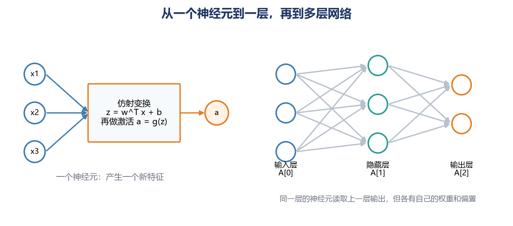
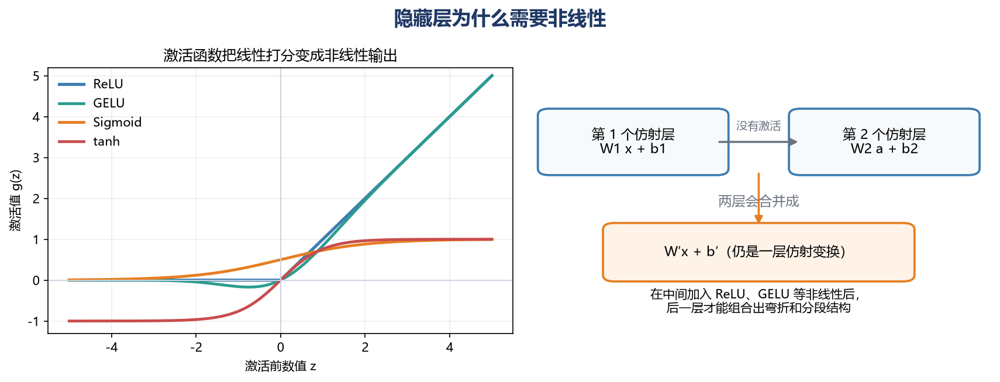
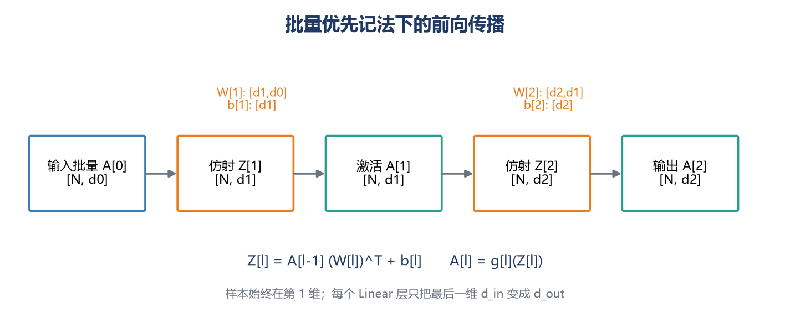
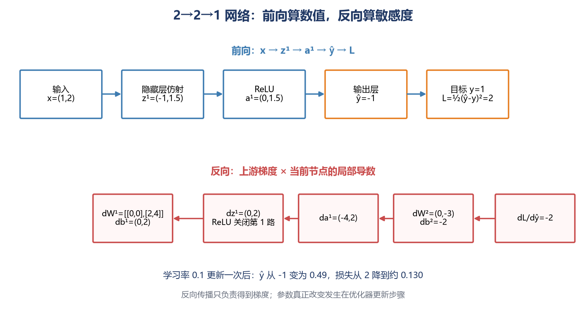
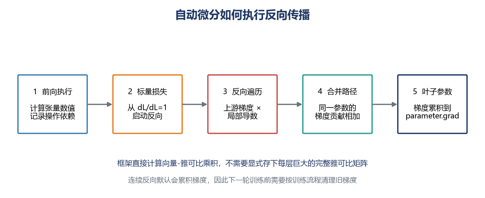

# [AI进阶-深度学习]1.神经网络、前向传播与反向传播

线性回归和逻辑回归都只学习一次加权组合。它们适合描述一条直线或一个超平面，却很难直接表达“只有温度高并且振动异常时才危险”这类分段、组合关系。神经网络的做法是：先让一组神经元把原始输入转换成中间特征，再让后面的层继续组合这些特征，直到得到任务需要的输出。

训练一个神经网络时有四项不同工作：前向传播根据当前参数计算预测，损失函数把预测误差变成一个标量，反向传播计算这个标量对每个参数的梯度，优化器再根据梯度修改参数。本篇重点讲清前向和反向两条计算链。参数怎样初始化、怎样归一化，以及 SGD、Adam 等优化器怎样决定更新幅度，分别留给后续文章。

## 1 从一个神经元到多层网络

人工神经元最早受到生物神经元启发，但今天更适合把它理解成一个数学计算单元，而不是脑细胞的精确模型。对输入向量 $x\in\mathbb R^d$，一个神经元先计算

$$
z=w^{\mathsf T}x+b,
$$

再经过激活函数得到

$$
a=g(z).
$$

$w\in\mathbb R^d$ 是权重：每个 $w_j$ 控制输入特征 $x_j$ 对这个神经元的影响方向和强度；$b$ 是偏置，让整个响应位置能够平移；$z$ 是激活前的线性打分；$a$ 是可供下一层使用的输出。

一层含有多个神经元时，每个神经元读取相同的上一层输入，却拥有不同的权重和偏置。把这一层全部神经元的参数排成矩阵，单样本计算为

$$
z^{[l]}=W^{[l]}a^{[l-1]}+b^{[l]},
\qquad
a^{[l]}=g^{[l]}(z^{[l]}).
$$

方括号 $[l]$ 表示层编号。若上一层有 $d_{l-1}$ 个输出、当前层有 $d_l$ 个神经元，则

$$
W^{[l]}\in\mathbb R^{d_l\times d_{l-1}},
\qquad
b^{[l]}\in\mathbb R^{d_l}.
$$

$W^{[l]}$ 的一行就是当前层一个神经元的全部权重。这个层共有 $d_ld_{l-1}+d_l$ 个可训练参数：前一项来自权重矩阵，后一项来自每个神经元各自的偏置。

神经网络中的位置通常分成三类：

- **输入层**保存原始特征，记为 $a^{[0]}=x$，本身没有可学习参数；
- **隐藏层**产生训练数据没有直接给出答案的中间表示；
- **输出层**给出回归值、分类 logits 或其他任务输出。

输入层通常不计入网络深度。一个隐藏层加一个输出层常称为“两层网络”。完全连接网络中，当前层每个神经元都读取上一层的全部输出，因此也称为多层感知机（MLP）。这里的“完全连接”只描述连接方式，不表示训练后每条连接都同样重要。

## 2 非线性激活让多层网络不再等于一个线性模型

如果隐藏层不使用激活函数，两层计算为

$$
a^{[1]}=W^{[1]}x+b^{[1]},
$$

$$
a^{[2]}=W^{[2]}a^{[1]}+b^{[2]}.
$$

把第一式代入第二式：

$$
a^{[2]}
=W^{[2]}W^{[1]}x+W^{[2]}b^{[1]}+b^{[2]}
=W'x+b'.
$$

不管中间堆多少个纯仿射层，最后仍能合并成一个仿射层。网络看起来更深，能够表示的函数类型却没有增加。激活函数的核心作用是打断这种合并，让后一层能够组合出弯折、分段或平滑的非线性关系。

常见选择各有明确用途：

| 激活函数 | 输出和梯度特点 | 常见位置 |
|---|---|---|
| ReLU：$\max(0,z)$ | 正区间斜率为 1，负区间输出和梯度为 0 | MLP、卷积网络隐藏层的基础选择 |
| Sigmoid：$1/(1+e^{-z})$ | 输出在 $(0,1)$；$|z|$ 很大时梯度接近 0 | 二分类概率、门控单元 |
| tanh | 输出在 $(-1,1)$ 且以 0 为中心；两端会饱和 | 传统循环网络及部分小型网络 |
| GELU、SiLU | 在零点附近平滑，不像 ReLU 那样硬截断 | Transformer 和许多现代深层网络 |

ReLU 在 $z<0$ 时像一道关闭的门，当前样本的梯度不会从这条支路继续向前传；在 $z>0$ 时局部导数为 1，梯度可以原样通过。若某个单元对大量样本长期落在负区间，它可能很难重新激活，这就是“死亡 ReLU”。Leaky ReLU 会在负区间保留一个小斜率。

隐藏层学到的是分布式表示。图像网络的前部可能对边缘和纹理敏感，后部再组合出部件和类别相关模式；但不能因此断言每个神经元都对应一个能被人准确命名的概念。中间表示由许多单元共同承担，并随数据、架构和训练目标改变。

## 3 前向传播：按层把输入变成预测

前向传播只回答一个问题：**给定当前参数，这批输入会产生什么输出？** 它从输入层开始，依次执行每层的仿射变换和激活函数：

$$
A^{[0]}=X
\rightarrow Z^{[1]}\rightarrow A^{[1]}
\rightarrow\cdots\rightarrow Z^{[L]}\rightarrow A^{[L]}.
$$

本系列使用样本位于第一维的批量优先记法。若批量中有 $N$ 条样本，上一层宽度为 $d_{l-1}$，则

$$
A^{[l-1]}\in\mathbb R^{N\times d_{l-1}},
$$

$$
Z^{[l]}
=A^{[l-1]}(W^{[l]})^{\mathsf T}+b^{[l]}
\in\mathbb R^{N\times d_l},
$$

$$
A^{[l]}=g^{[l]}(Z^{[l]})
\in\mathbb R^{N\times d_l}.
$$

$W^{[l]}$ 在 PyTorch 的存储形状是 $(d_l,d_{l-1})$，所以右乘时使用转置。偏置 $b^{[l]}\in\mathbb R^{d_l}$ 会广播到批量的每一行。课程原始推导常把样本放在列上，写成 $Z=WA+b$；两种记法完成相同点积，不能把其中一个公式的形状直接套进另一套记法。

`nn.Linear(d_in, d_out)` 的实际效果是保持输入张量前面的维度，只把最后一维从 `d_in` 变成 `d_out`。因此除了普通的二维批量，它也能处理形如 `[batch, time, d_in]` 的序列张量，输出形状变为 `[batch, time, d_out]`。理解这一规则比死记某个转置位置更可靠。

输出层要与任务匹配，但相应损失已经在逻辑回归与交叉熵文章中完整讲过。本篇只保留当前网络需要的接口关系：回归可输出实数并配平方误差等损失；二分类通常输出一个 logit 并配融合的二元交叉熵；单标签 $K$ 分类输出 $K$ 个 logits 并配交叉熵。训练时把 logits 直接交给融合损失，展示概率时再使用 Sigmoid 或 Softmax。

## 4 用一个 2→2→1 网络走完前向计算

下面使用一个两输入、两个隐藏单元、一个回归输出的网络。箭头 `2→2→1` 表示各层宽度，不包含批量维。取单条样本

$$
x=
\begin{bmatrix}1\\2\end{bmatrix},
\qquad y=1.
$$

隐藏层参数为

$$
W^{[1]}=
\begin{bmatrix}
1&-1\\
0.5&1
\end{bmatrix},
\qquad
b^{[1]}=
\begin{bmatrix}0\\-1\end{bmatrix}.
$$

第一行权重属于第一个隐藏单元，第二行属于第二个隐藏单元。先做仿射变换：

$$
z^{[1]}=W^{[1]}x+b^{[1]}
=
\begin{bmatrix}
1\times1+(-1)\times2+0\\
0.5\times1+1\times2-1
\end{bmatrix}
=
\begin{bmatrix}-1\\1.5\end{bmatrix}.
$$

隐藏层使用 ReLU：

$$
a^{[1]}=\operatorname{ReLU}(z^{[1]})
=\begin{bmatrix}0\\1.5\end{bmatrix}.
$$

第一个隐藏单元因为 $z_1^{[1]}=-1$ 被截成 0；第二个单元保留 1.5。输出层使用线性输出，参数为

$$
W^{[2]}=\begin{bmatrix}2&-1\end{bmatrix},
\qquad b^{[2]}=0.5.
$$

预测结果是

$$
\hat y=W^{[2]}a^{[1]}+b^{[2]}
=2\times0+(-1)\times1.5+0.5=-1.
$$

使用半平方损失：

$$
L=\frac12(\hat y-y)^2
=\frac12(-1-1)^2=2.
$$

这个网络共有 9 个参数：隐藏层有 $2\times2+2=6$ 个，输出层有 $1\times2+1=3$ 个。前向传播已经得到了每个中间数值和最终损失，但还没有回答哪一个参数应该怎样改变。

## 5 反向传播：把损失的影响逐节点传回参数

反向传播不是“把输入倒着算回来”，而是从损失开始，计算损失对每个中间量和参数的敏感度。对一个节点

$$
v=f(u),
$$

若它收到上游梯度 $\partial L/\partial v$，就乘上自己的局部导数 $\partial v/\partial u$：

$$
\frac{\partial L}{\partial u}
=\underbrace{\frac{\partial L}{\partial v}}_{\text{后续计算传回的影响}}
\underbrace{\frac{\partial v}{\partial u}}_{\text{当前操作的局部变化率}}.
$$

这就是链式法则在计算图上的执行方式。一条路径上的导数相乘；同一变量若通过多条路径影响损失，各路径贡献相加。

继续上一节的数值。半平方损失对预测的导数为

$$
\delta^{[2]}
=\frac{\partial L}{\partial\hat y}
=\hat y-y=-1-1=-2.
$$

这个 $-2$ 的实际含义是：在当前位置把预测 $\hat y$ 增大一点，损失会下降，所以模型当前预测得太低。

输出层有 $\hat y=W^{[2]}a^{[1]}+b^{[2]}$。权重乘着哪个隐藏激活，它的梯度就带上哪个激活：

$$
\frac{\partial L}{\partial W^{[2]}}
=\delta^{[2]}(a^{[1]})^{\mathsf T}
=-2\begin{bmatrix}0&1.5\end{bmatrix}
=\begin{bmatrix}0&-3\end{bmatrix},
$$

$$
\frac{\partial L}{\partial b^{[2]}}=-2.
$$

第一个输出权重的梯度为 0，是因为对应隐藏激活为 0；当前样本没有通过这条连接向输出贡献数值。把误差信号继续传回隐藏激活：

$$
\frac{\partial L}{\partial a^{[1]}}
=(W^{[2]})^{\mathsf T}\delta^{[2]}
=
\begin{bmatrix}2\\-1\end{bmatrix}(-2)
=
\begin{bmatrix}-4\\2\end{bmatrix}.
$$

ReLU 的局部导数由前向保存的 $z^{[1]}=(-1,1.5)^T$ 决定：第一个位置为 0，第二个位置为 1。因此

$$
\delta^{[1]}
=\frac{\partial L}{\partial z^{[1]}}
=\frac{\partial L}{\partial a^{[1]}}
\odot\operatorname{ReLU}'(z^{[1]})
=
\begin{bmatrix}-4\\2\end{bmatrix}
\odot
\begin{bmatrix}0\\1\end{bmatrix}
=
\begin{bmatrix}0\\2\end{bmatrix}.
$$

$\odot$ 表示逐元素相乘。第一条支路被 ReLU 关掉，所以第一个隐藏单元的权重在这个样本上都得不到梯度。隐藏层参数梯度为

$$
\frac{\partial L}{\partial W^{[1]}}
=\delta^{[1]}x^{\mathsf T}
=
\begin{bmatrix}0\\2\end{bmatrix}
\begin{bmatrix}1&2\end{bmatrix}
=
\begin{bmatrix}
0&0\\
2&4
\end{bmatrix},
$$

$$
\frac{\partial L}{\partial b^{[1]}}
=\begin{bmatrix}0\\2\end{bmatrix}.
$$

反向传播到此只得到了梯度，参数仍未改变。为了看清职责差异，假设优化器只是学习率 $\alpha=0.1$ 的普通梯度下降，执行

$$
W\leftarrow W-0.1\frac{\partial L}{\partial W},
\qquad
b\leftarrow b-0.1\frac{\partial L}{\partial b}.
$$

更新后的主要参数为

$$
W^{[1]}_{\text{new}}=
\begin{bmatrix}1&-1\\0.3&0.6\end{bmatrix},
\quad
b^{[1]}_{\text{new}}=
\begin{bmatrix}0\\-1.2\end{bmatrix},
$$

$$
W^{[2]}_{\text{new}}=
\begin{bmatrix}2&-0.7\end{bmatrix},
\quad b^{[2]}_{\text{new}}=0.7.
$$

重新前向计算，隐藏激活变为 $(0,0.3)^T$，预测变为 $0.49$，损失约为

$$
\frac12(0.49-1)^2\approx0.130.
$$

这一步中损失从 2 降到约 0.130，说明梯度方向对当前样本有效；它不表示任意学习率、任意批量的每次更新都必然让损失下降。优化器怎样处理小批量噪声和不同参数的梯度尺度，是后续优化器文章的主题。

## 6 批量反向传播中的矩阵形状

真实训练会一次处理 $N$ 条样本。为了让公式与批量优先的前向传播一致，定义

$$
D^{[l]}\in\mathbb R^{N\times d_l}
$$

为每条样本损失对第 $l$ 层激活前数值 $Z^{[l]}$ 的导数；第 $i$ 行属于第 $i$ 条样本。若训练目标是平均损失

$$
J=\frac1N\sum_{i=1}^{N}\ell_i,
$$

则第 $l$ 层梯度可以写成

$$
\frac{\partial J}{\partial W^{[l]}}
=\frac1N(D^{[l]})^{\mathsf T}A^{[l-1]}
\in\mathbb R^{d_l\times d_{l-1}},
$$

$$
\frac{\partial J}{\partial b^{[l]}}
=\frac1N\sum_{i=1}^{N}D^{[l]}_{i,:}
\in\mathbb R^{d_l}.
$$

形状可以直接检查：$(D^{[l]})^T$ 是 $(d_l,N)$，乘 $(N,d_{l-1})$ 后正好得到与 $W^{[l]}$ 相同的 $(d_l,d_{l-1})$。偏置在前向时被所有样本共享，所以反向时要把所有样本对它的贡献相加或取平均。

向前一层传递时，先经过当前权重：

$$
\frac{\partial \ell}{\partial A^{[l-1]}}
=D^{[l]}W^{[l]}
\in\mathbb R^{N\times d_{l-1}},
$$

再乘前一层激活函数的局部导数：

$$
D^{[l-1]}
=\left(D^{[l]}W^{[l]}\right)
\odot g'^{[l-1]}(Z^{[l-1]}).
$$

反向传播没有为每个参数分别从损失重新求导，而是把已经算出的上游梯度复用于整层矩阵运算。正因为神经网络通常有大量参数，却最终压缩成一个标量损失，反向模式自动微分能够在一次反向遍历中高效得到全部参数梯度。

如果一个参数被多条路径重复使用，梯度必须相加。例如共享权重同时作用在多个序列时间步时，每个时间步都会给它一份贡献；残差连接把同一激活送入两条支路时，两条支路返回的梯度也要在分叉点相加。覆盖其中一条都会漏掉损失对参数的一部分影响。

## 7 自动微分怎样替我们执行反向传播

现代框架不要求开发者手写上面每层的梯度，但它们执行的仍然是同一套链式法则。前向运行时，自动微分系统除了计算张量数值，还会记录：结果由哪个操作产生、输入来自哪些父节点，以及该操作反向时需要哪些前向信息。

以 PyTorch 为例，一轮典型过程是：

1. 模型参数是需要梯度的叶子张量；
2. 前向张量操作建立本轮实际执行的计算图；
3. 标量损失调用 `backward()`，以 $\partial L/\partial L=1$ 为起点反向遍历；
4. 每个操作读取上游梯度，执行自己的局部反向规则；
5. 多条路径的贡献相加，最终累积到参数的 `.grad`；
6. 优化器读取 `.grad` 并更新参数；下一轮前按训练流程清理旧梯度。

框架通常直接计算向量—雅可比乘积，而不会显式构造每一层巨大的完整雅可比矩阵。设中间函数为 $y=f(x)$，反向节点收到 $\bar y=\partial L/\partial y$，真正需要的是

$$
\bar x
=\left(\frac{\partial y}{\partial x}\right)^{\mathsf T}\bar y,
$$

而不是单独存下 $\partial y/\partial x$ 的每一个元素。这是反向传播能够扩展到大型网络的重要原因。

自动微分与数值微分不同。数值微分通过轻微扰动参数、重复计算损失来近似梯度，适合抽查实现；自动微分把程序拆成已知局部导数的操作，在当前浮点精度下机械执行链式法则。它也不会判断目标是否正确：损失写错、标签错位或广播语义错误时，框架仍会忠实地计算“错误程序的正确梯度”。

截至 2026 年 9 月，[PyTorch 自动微分教程](https://docs.pytorch.org/tutorials/beginner/basics/autogradqs_tutorial.html)仍以计算图、`requires_grad`、`backward()` 和叶子参数的 `.grad` 解释这一过程，并明确展示梯度从损失回到权重与偏置。连续反向默认会累积梯度，因此清理旧梯度是训练循环的一部分。

## 8 神经网络训练中各部分的边界

一次参数更新可以概括为：

1. **前向传播**：输入与当前参数得到 logits 或预测值；
2. **损失计算**：预测与目标得到标量损失；
3. **反向传播**：标量损失得到每个参数的梯度；
4. **参数更新**：优化器根据梯度和自身状态修改参数。

一个 epoch 表示训练集中的样本大体被完整使用一次，不等于一次前向传播，也不等于一次参数更新。使用小批量时，一个 epoch 通常包含许多次上述四步循环。

本篇没有把初始化、归一化和优化器混进反向传播。初始化决定训练开始时激活和梯度的尺度；归一化及残差结构会改变信号传播条件；SGD、Momentum、Adam 和学习率计划决定拿到梯度后走多远。这些机制会影响训练是否稳定，却不改变“反向传播负责求梯度”这一职责。

课程中把高分辨率图像完全展平后送入巨大 MLP，今天主要适合说明张量形状和参数量。图像具有空间结构，现代视觉任务通常使用卷积网络、视觉 Transformer 或预训练视觉编码器。MLP 本身仍很常见：它可以处理已经整理好的向量特征，也广泛存在于分类头、推荐系统塔网络和 Transformer 的前馈子层中。

隐藏层全部使用 Sigmoid 也主要是教学或历史做法。Sigmoid 仍适合二分类概率和门控机制；深层隐藏层更常见 ReLU、GELU、SiLU 等选择。无论激活函数和网络结构怎样变化，前向记录中间依赖、反向沿计算图应用链式法则，仍是现代深度学习训练的基础。
