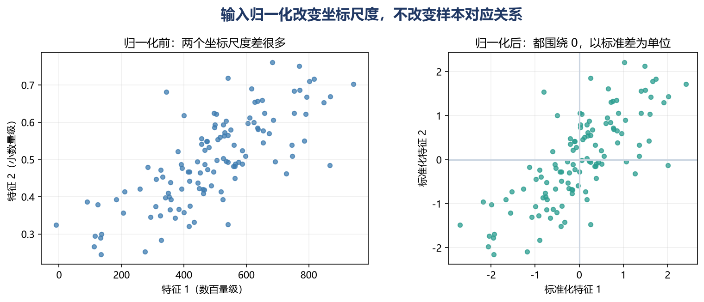
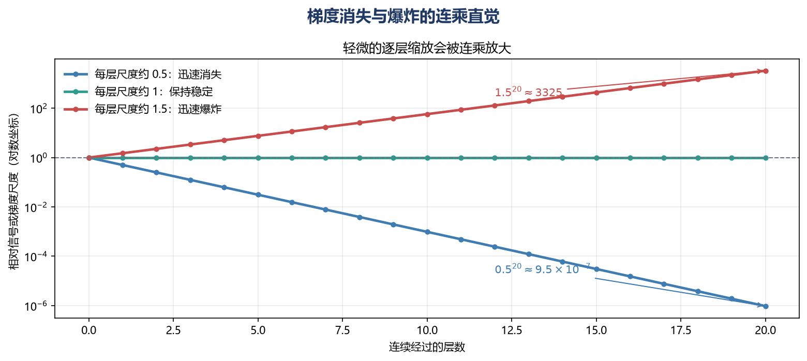
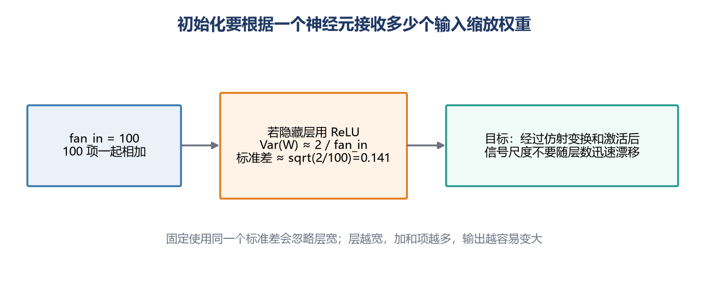
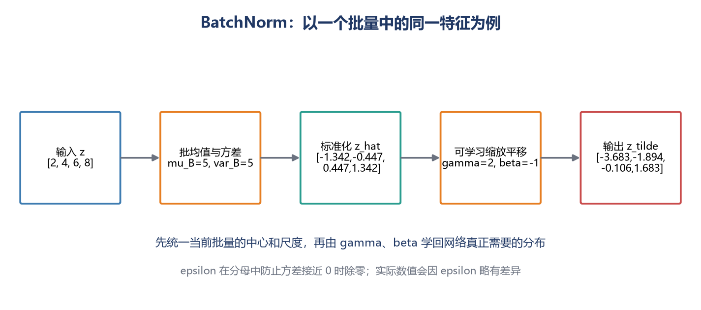
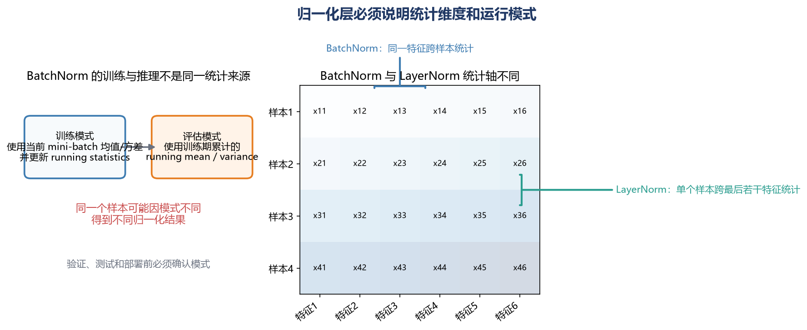
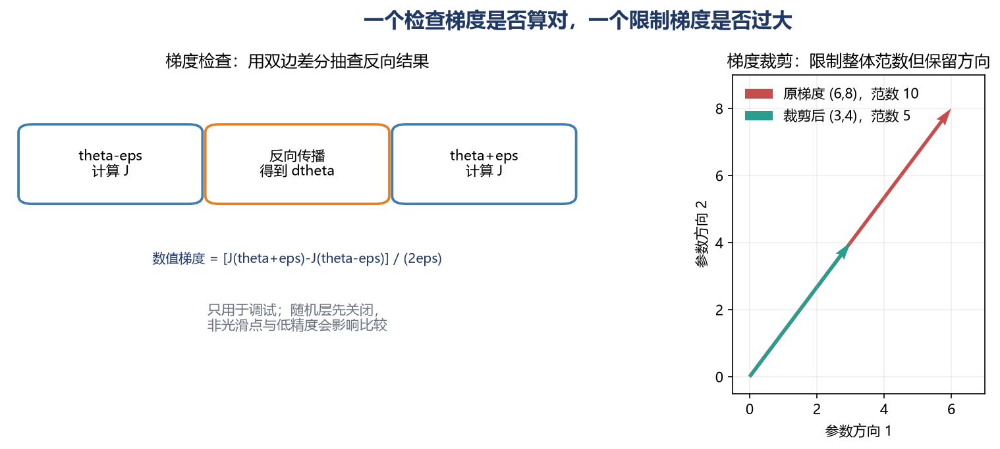

# [AI进阶-深度学习]2.参数初始化、归一化与训练稳定性

一套神经网络即使结构和损失函数都没有写错，也可能出现这些现象：损失几乎不下降、训练到一半突然变成 `NaN`、前几层几乎收不到梯度，或者训练集表现正常但切换到推理模式后准确率明显下降。

这些问题常被笼统地称为“训练不稳定”，但它们发生在不同位置：

- 输入特征的尺度相差太大，使优化器很难选择合适的更新步幅；
- 信号经过很多层以后不断缩小或放大，使激活值与梯度失去可用尺度；
- Batch Normalization 等层在训练和推理时采用了不同的统计方式，却没有正确切换模式；
- 梯度已经异常增大，却仍被优化器直接用于更新参数；
- 自己实现的反向传播公式有误，计算出的梯度从一开始就是错的。

因此，本篇讨论的几种方法并不是互相替代的“调参技巧”。输入归一化负责整理数据的坐标尺度，参数初始化决定网络从什么状态出发，网络内部的归一化层持续调节中间信号，梯度裁剪限制一次更新的危险程度，而梯度检查用来验证反向传播是否正确。

## 一、训练稳定性究竟在稳定什么

训练神经网络时，可以沿着一次完整计算观察三类数值。

第一类是**输入值**。假设一个房价模型同时接收“面积”和“房龄”：面积可能是几百，房龄可能只有几十。如果两个特征直接进入模型，相同大小的权重变化会在面积特征上造成更大的输出变化。优化器于是不得不在不同方向上使用很不协调的更新尺度。

第二类是每一层的**激活值和梯度**。前向传播时，激活值不能经过几层便全部趋近于零或变成极大的数；反向传播时，梯度也必须能够从输出层传回较早的层。梯度接近零，前面的层便几乎学不到东西；梯度过大，一次参数更新就可能把网络推到数值溢出的区域。

第三类是**训练与推理的一致性**。Dropout、BatchNorm 等层在训练时和推理时行为不同。训练正常只能说明训练路径可以工作，并不自动保证推理路径也正确。

实际排查时，可以先观察以下信号：

- 损失是否出现 `NaN`、`Inf`，或者突然扩大很多个数量级；
- 各层激活值是否几乎全为零，或者绝对值不断扩大；
- 各层梯度范数是否长期接近零，或者偶尔出现非常大的尖峰；
- 同一批数据在 `train` 和 `eval` 模式下的结果是否出现无法解释的巨大差异。

后面的每种方法，都是在处理这些信号中的一个具体环节。

## 二、输入归一化：先统一进入网络的坐标尺度

设一个批量有 (m) 个样本，每个样本有 (d) 个特征，输入矩阵写成

$$
X\in\mathbb{R}^{m\times d}.
$$

这里第 (i) 行是第 (i) 个样本，第 (j) 列是第 (j) 个特征。对第 (j) 个特征做标准化时，先只使用训练集计算

$$
\mu_j=\frac{1}{m}\sum_{i=1}^{m}x_{ij},
$$

$$
\sigma_j^2=\frac{1}{m}\sum_{i=1}^{m}(x_{ij}-\mu_j)^2,
$$

再把每个值变成

$$
x'_{ij}=\frac{x_{ij}-\mu_j}{\sqrt{\sigma_j^2+\varepsilon}}.
$$

这个公式做了两件很直观的事：减去 (mu_j) 是把该特征的中心移到 0 附近，除以标准差是把它的典型波动范围调整到 1 附近。很小的 (arepsilon) 用来避免某一列完全不变时除以 0。

用三条传感器记录举例。温度是

$$
[10,20,30],
$$

它的均值为 20，方差约为 66.67，标准差约为 8.165，因此标准化后为

$$
[-1.225,0,1.225].
$$

同三条记录的气压是

$$
[1000,1005,1010],
$$

均值为 1005，方差约为 16.67，标准差约为 4.082，标准化后同样为

$$
[-1.225,0,1.225].
$$

这不代表温度和气压变成了同一种物理量，而是告诉模型：两个特征相对各自常见范围的偏离程度现在处在相近尺度上。原来“温度增加 10”和“气压增加 5”无法直接比较；标准化以后，两者都表示从均值移动了大约 1.225 个标准差。

尺度统一以后，损失曲面通常不会在某个方向极窄、另一个方向极宽，优化器更容易使用同一个学习率取得稳定进展。

这里最容易犯的错误是分别使用训练集、验证集和测试集计算各自的均值与方差。正确做法是：**只在训练集上估计 (mu_j) 和 (sigma_j)，然后把同一组数用于验证、测试和在线推理。**否则验证和测试数据的信息会进入预处理过程，而且模型在部署时也得不到与训练时相同的坐标系。

输入归一化不是机械地对所有数据逐列套公式。图像常用统一的像素缩放或按通道标准化；类别编号不能因为写成数字就被当作连续数值标准化；明显偏斜的正数特征有时需要先取对数。关键问题始终是：这个变换是否保留了特征原本的含义，并让训练和推理采用同一套处理方式。

## 三、深层连乘怎样造成梯度消失和梯度爆炸

反向传播会从损失出发，把局部导数逐层相乘。这里不再重新推导完整的链式法则，只看它对数值尺度造成的后果。

假设每经过一层，反向信号的典型尺度都会乘以 (s)。经过 (L) 层以后，尺度大约变成

$$
s^L.
$$

如果 (s=0.5)，经过 20 层后

$$
0.5^{20}\approx9.54\times10^{-7}.
$$

这意味着输出层传回来的一个单位信号，到前面可能只剩百万分之一。前面各层的参数即使方向算对了，每一步也几乎没有变化，这就是**梯度消失**。

如果 (s=1.5)，经过 20 层后

$$
1.5^{20}\approx3325.
$$

一个普通大小的误差被放大到几千倍，一次更新就可能越过合理区域，使损失剧烈振荡甚至出现 `NaN`，这就是**梯度爆炸**。

真实网络不会每层都恰好乘以同一个数。局部缩放同时来自权重矩阵和激活函数的导数。例如 Sigmoid 在输入绝对值很大时趋近饱和，其导数接近 0；很多个接近 0 的导数相乘，会进一步削弱梯度。ReLU 在正区间的导数为 1，能减轻一部分问题，但权重尺度不合适、负区间长期关闭或网络过深时，仍可能产生不稳定。

初始化、归一化层和残差连接之所以重要，正是因为它们分别从起点尺度、中间尺度和信息通路上减少这种连乘失控。

## 四、参数初始化：让网络从可训练的尺度出发

### 1. 为什么隐藏层权重不能全部设为零

假设同一隐藏层有两个神经元。如果它们的权重完全相同，那么它们会接收相同输入、得到相同输出，也会在反向传播中收到相同梯度。更新以后，两组权重依然相同。无论训练多久，这两个神经元都在学习同一个特征，相当于浪费了其中一个神经元。

因此，隐藏层权重需要随机初始化来打破对称性。偏置可以初始化为零，因为不同神经元的随机权重已经打破了对称性。

但是“随机”不等于随便选择一个很大的范围。随机数过小，信号逐层衰减；随机数过大，信号逐层放大。初始化真正要控制的是权重的方差。

### 2. fan-in 为什么决定权重尺度

一个神经元的线性输入是

$$
z=\sum_{i=1}^{n}w_i x_i+b.
$$

这里 (n) 是这个神经元接收的输入数量，也叫 **fan-in**。先忽略偏置，并近似认为不同输入和权重彼此独立且均值为 0，可以得到

$$
\operatorname{Var}(z)\approx n\operatorname{Var}(w)\operatorname{Var}(x).
$$

这个式子的实际含义是：一个神经元收到的输入越多，求和时累积的波动就越大。若仍给每条连接使用相同的大方差，拥有 1000 个输入的神经元会比只有 10 个输入的神经元产生大得多的输出。为了抵消输入数量 (n) 的影响，权重方差通常要与 (1/n) 同量级。

对于 ReLU，负值部分会被截为 0。He/Kaiming 初始化常取

$$
\operatorname{Var}(w)\approx\frac{2}{\text{fan\_in}}.
$$

如果一层有 100 个输入，那么

$$
\operatorname{Std}(w)=\sqrt{\frac{2}{100}}\approx0.141.
$$

这表示权重不是都等于 0.141，而是从均值为 0、标准差约为 0.141 的分布中采样。输入数量增加时，单条连接会相应变小，从而让求和后的激活值仍处在可训练范围。

对于线性层或 tanh 一类需要兼顾输入端和输出端尺度的情形，Xavier/Glorot 正态初始化常使用

$$
\operatorname{Std}(w)
=\text{gain}\sqrt{\frac{2}{\text{fan\_in}+\text{fan\_out}}}.
$$

假设一层有 100 个输入、50 个输出，并取 (	ext{gain}=1)，则标准差约为

$$
\sqrt{\frac{2}{100+50}}\approx0.115.
$$

`fan_out` 表示这一层输出神经元的数量。Xavier 同时参考输入和输出宽度，He 初始化则针对 ReLU 的截断特点重点保持前向信号尺度。这些公式不是保证训练成功的定理，而是在常见独立性假设下给网络一个更合理的起点。激活函数、残差结构、归一化层和自定义张量乘法方向都会影响最终选择。

在 PyTorch 中，`kaiming_normal_`、`xavier_normal_` 等初始化函数已经处理了这些尺度关系。需要特别注意，`Linear` 的权重形状是 `[fan_out, fan_in]`，通常以 (xW^T) 的方式使用；若自定义代码直接以 (xW) 使用权重，fan-in 与 fan-out 的判断也要随实际乘法方向调整。具体定义可参考 [PyTorch 初始化函数文档](https://docs.pytorch.org/docs/2.14/nn.init.html)。

## 五、BatchNorm：在网络内部按批量校准特征

输入标准化只处理进入网络之前的数据。网络开始训练以后，每一层参数都在变化，中间激活值的尺度也会随之变化。Batch Normalization，简称 **BatchNorm**，在网络内部根据当前小批量的统计量校准特征，然后再让网络学习合适的缩放和平移。

以全连接层的某一个输出特征为例，一个批量得到

$$
z=[2,4,6,8].
$$

第一步，计算批量均值：

$$
\mu_B=\frac{2+4+6+8}{4}=5.
$$

第二步，计算批量方差：

$$
\sigma_B^2
=\frac{(2-5)^2+(4-5)^2+(6-5)^2+(8-5)^2}{4}
=5.
$$

第三步，先忽略很小的 (arepsilon)，将每个值标准化：

$$
\hat z=\frac{z-5}{\sqrt{5}}
\approx[-1.342,-0.447,0.447,1.342].
$$

这一步把该特征在当前批量中的中心调整到 0 附近、波动调整到 1 附近。但如果网络只能永远使用零均值、单位方差，表达能力反而会受限。因此 BatchNorm 还会学习两个参数：缩放系数 (gamma) 和平移量 (eta)：

$$
y=\gamma\hat z+\beta.
$$

例如 (gamma=2, eta=-1)，输出变成

$$
y\approx[-3.683,-1.894,-0.106,1.683].
$$

(gamma) 变大，表示模型希望放大这个特征的相对差异；(eta) 增大，表示模型希望整体抬高这个特征。两者都由反向传播学习，所以 BatchNorm 不是把信息强行固定为标准正态分布，而是先提供一个稳定参考尺度，再把最终尺度的选择权交还给模型。

全连接网络常按

$$
\text{Linear}\rightarrow\text{BatchNorm}\rightarrow\text{激活函数}
$$

排列。因为 BatchNorm 自己带有可学习的 (eta)，其前面的线性层偏置往往可以关闭。对于形状为 `[N, C]` 的全连接输出，`BatchNorm1d` 会对每个特征 (C) 跨样本维 (N) 统计；对于 `[N, C, H, W]` 的卷积特征，`BatchNorm2d` 通常对每个通道跨 (N,H,W) 统计。

早期课程常把 BatchNorm 的作用解释为减少“内部协变量偏移”，也就是让后层看到的输入分布不再随着前层更新而剧烈漂移。这个说法可以帮助建立初步直觉，但不应被当作唯一且已经确定的机制。后续研究发现，仅靠内部协变量偏移并不能充分解释 BatchNorm 的效果；使优化曲面和梯度变化更平滑，是更有证据支持的解释之一。可参考 Santurkar 等人的 [NeurIPS 2018 论文](https://proceedings.neurips.cc/paper/2018/hash/905056c1ac1dad141560467e0a99e1cf-Abstract.html)。

BatchNorm 使用批量统计量会带来一些随机波动，但不应该把它当作 Dropout 或权重衰减的替代品。它的主要职责仍是改善网络内部的数值尺度和优化行为。

## 六、训练模式与推理模式为什么不能混用

BatchNorm 在训练和推理时采用不同的数据来源：

- **训练模式**使用当前小批量的均值和方差完成本次计算，同时更新运行均值和运行方差；
- **推理模式**不再依赖当前批量，而是使用训练期间累计的运行统计量。

假设推理时某个特征值为 8，训练累计得到的运行均值为 4.8、运行方差为 4。在 (gamma=1,eta=0) 时，输出约为

$$
\frac{8-4.8}{\sqrt{4}}=1.6.
$$

如果推理时错误地保留训练模式，并且一次只输入这一个样本，那么当前批量均值就是 8、方差接近 0，标准化结果会接近 0。模型明明接收了同一个值，却因为批量组成不同得到完全不同的内部表示。这就是推理前必须调用 `model.eval()` 的原因之一。

PyTorch 的 `BatchNorm1d` 默认在训练时维护运行统计量，并在评估时使用它们；关闭 `track_running_stats` 后，评估阶段也会依赖当前批量。具体行为见 [PyTorch BatchNorm1d 文档](https://docs.pytorch.org/docs/2.14/generated/torch.nn.BatchNorm1d.html)。`model.eval()` 负责切换 BatchNorm、Dropout 等模块的行为，而 `torch.inference_mode()` 负责关闭自动求导相关开销，两者解决的问题不同，正式推理时通常需要同时考虑。

BatchNorm 的效果也依赖批量是否足够代表数据分布。批量很小时，均值和方差会因少数样本而大幅波动。此时可以根据任务考虑：

- 增大批量或在多设备间同步 BatchNorm 统计量；
- 在卷积网络中使用不依赖批量大小的 GroupNorm；
- 在序列模型和 Transformer 中使用 LayerNorm 或 RMSNorm。

LayerNorm 与 BatchNorm 的主要区别不在于公式长得多复杂，而在于“沿哪个维度统计”。BatchNorm 通常比较一个批量中不同样本的同一个特征；LayerNorm 通常在每个样本内部，对最后若干特征维统计。因此 LayerNorm 在训练和推理时都可以直接使用当前样本的统计量，不需要维护运行均值与运行方差。PyTorch 的具体维度规则见 [LayerNorm 文档](https://docs.pytorch.org/docs/2.14/generated/torch.nn.LayerNorm.html)。

## 七、梯度裁剪：在参数更新前加一道护栏

初始化和归一化是在减少梯度异常的发生概率，但循环网络、很深的网络或偶发异常批量仍可能产生梯度尖峰。梯度裁剪会在反向传播完成之后、优化器更新之前限制梯度大小。

最常见的是按全局范数裁剪。把所有参数的梯度看成一个长向量 (g)，给定上限 (c)：

$$
g_{\text{clip}}
=g\cdot\min\left(1,\frac{c}{\lVert g\rVert_2}\right).
$$

若梯度范数没有超过 (c)，乘数就是 1，梯度保持不变；若超过上限，就按同一比例缩小所有分量。

例如梯度向量是

$$
g=[6,8],
$$

其二范数为

$$
\lVert g\rVert_2=\sqrt{6^2+8^2}=10.
$$

若最大范数 (c=5)，缩放比例就是 (5/10=0.5)，裁剪后

$$
g_{\text{clip}}=[3,4].
$$

新范数正好为 5，而且方向没有改变。实际意义是：模型仍然沿原本计算出的下降方向更新，只是不允许这一步迈得过远。

PyTorch 的 `clip_grad_norm_` 会把各参数梯度的范数合并成一个总体范数并原地裁剪，调用位置应在 `loss.backward()` 之后、`optimizer.step()` 之前。详见 [`clip_grad_norm_` 文档](https://docs.pytorch.org/docs/2.14/generated/torch.nn.utils.clip_grad_norm_.html)。

梯度裁剪只能限制一次危险更新，不能解释梯度为什么爆炸。如果每一步都触发严重裁剪，仍应检查学习率是否过高、初始化是否合适、输入或标签中是否有异常值，以及损失公式是否存在数值问题。

## 八、梯度检查：确认反向传播计算是否正确

梯度裁剪处理的是“梯度太大”，梯度检查处理的是另一个问题：**这个梯度到底算得对不对。**它主要用于调试自己实现的算子或反向传播，不用于日常训练的每一步。

对参数 (	heta)，中心差分用损失函数在参数两侧的变化近似导数：

$$
g_{\text{num}}
=\frac{J(\theta+\varepsilon)-J(\theta-\varepsilon)}{2\varepsilon}.
$$

假设

$$
J(\theta)=\theta^2,
$$

在 (	heta=3)、(arepsilon=0.01) 时，数值梯度为

$$
g_{\text{num}}
=\frac{3.01^2-2.99^2}{0.02}
=\frac{9.0601-8.9401}{0.02}
=6.
$$

解析导数是 (2\theta=6)，两者一致，说明这个简单例子的梯度计算正确。

参数很多时，可以用相对误差比较自动求导结果 (g) 与数值梯度：

$$
\text{relative error}
=\frac{\lVert g-g_{\text{num}}\rVert_2}
{\lVert g\rVert_2+\lVert g_{\text{num}}\rVert_2+\varepsilon}.
$$

分子表示两种梯度相差多远，分母把误差换算成相对于梯度本身大小的比例。相对误差越接近 0，两者越一致；可接受阈值取决于浮点精度、函数是否光滑以及模型规模，不能脱离场景机械使用一个固定数字。

梯度检查时需要注意：

- 尽量使用 `float64`，因为有限差分对舍入误差比较敏感；
- 固定随机性，并暂时关闭 Dropout；
- BatchNorm 要固定训练/推理行为，避免两次函数计算使用不同批量统计过程；
- 将正则化项也计入损失，否则检查的不是同一个目标函数；
- 避开 ReLU 恰好位于 0 等不可导点；
- 只抽取小模型和少量参数检查，因为每个参数都要额外计算多次损失。

PyTorch 的 `gradcheck` 也是比较数值梯度和解析梯度，默认容差是按双精度设计的；函数位于不可导点或输入张量存在重叠内存时也可能检查失败。具体限制见 [PyTorch `gradcheck` 文档](https://docs.pytorch.org/docs/2.14/generated/torch.autograd.gradcheck.gradcheck.html)。

## 九、遇到不稳定训练时怎样逐步排查

训练不稳定时，同时更换初始化、归一化层、优化器和学习率，会让问题更难定位。可以沿数据流按下面的顺序检查。

1. **先检查输入与标签。**确认没有 `NaN`、`Inf`、极端离群值和错误的标签范围，并确认训练、验证、推理使用同一套预处理统计量。
2. **再检查前向数值。**记录损失、logits 和各层激活值的均值、标准差、最小值与最大值。若从某一层开始突然归零或放大，问题通常出在该层之前。
3. **检查损失函数的数值写法。**分类任务尽量直接把 logits 交给稳定实现的交叉熵函数，避免先手动计算极大指数或对接近 0 的概率取对数。
4. **检查梯度。**在反向传播后记录各层梯度范数。前层长期接近 0 提示梯度消失；偶发巨大尖峰提示梯度爆炸、异常批量或过高学习率。
5. **核对初始化与激活函数。**ReLU 网络优先检查 He/Kaiming 类初始化；若使用自定义矩阵方向，重新确认 fan-in 和 fan-out。
6. **核对归一化层的维度和模式。**确认 BatchNorm 统计的是预期通道，训练时使用 `train()`，验证和推理时使用 `eval()`；小批量下要特别留意统计量噪声。
7. **必要时加入梯度裁剪。**把它作为防止偶发危险更新的护栏，同时继续查找反复触发裁剪的原因。
8. **自定义反向传播时做梯度检查。**先用极小、确定性的输入验证数学实现，再恢复完整训练。
9. **最后结合学习率观察。**即使所有尺度都合理，学习率过大仍会越过最优区域，过小则表现为几乎不学习。学习率调度和优化器将在下一篇单独展开。

混合精度训练还可能出现浮点范围不足造成的上溢或下溢，此时需要检查自动混合精度的梯度缩放与非有限值处理。残差连接也能为深层网络提供更直接的信息和梯度通路。它们都属于现代训练稳定性的重要组成部分，但仍建立在输入正确、损失稳定、初始化合理和训练模式正确这些基础之上。
