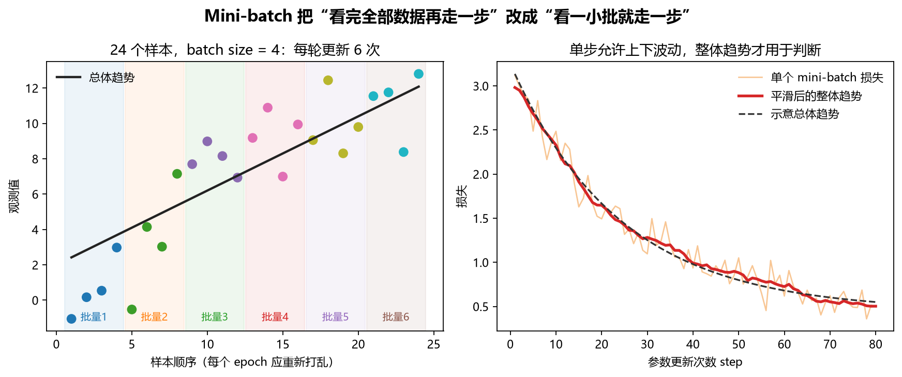
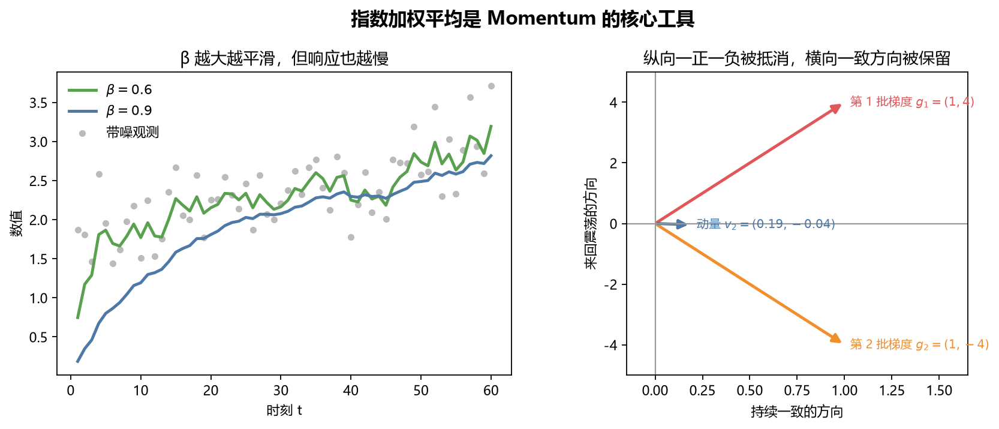
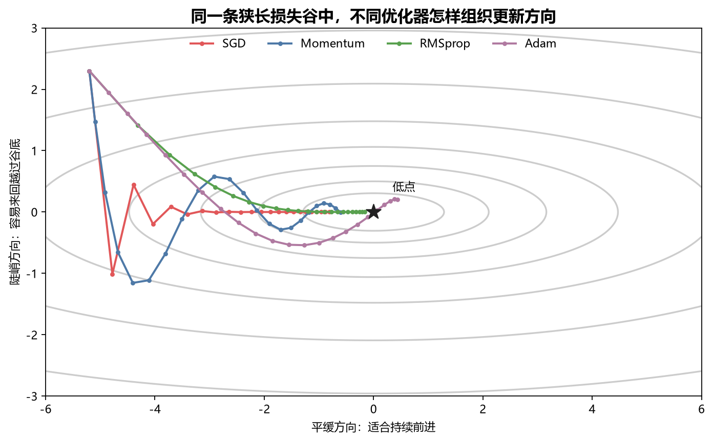
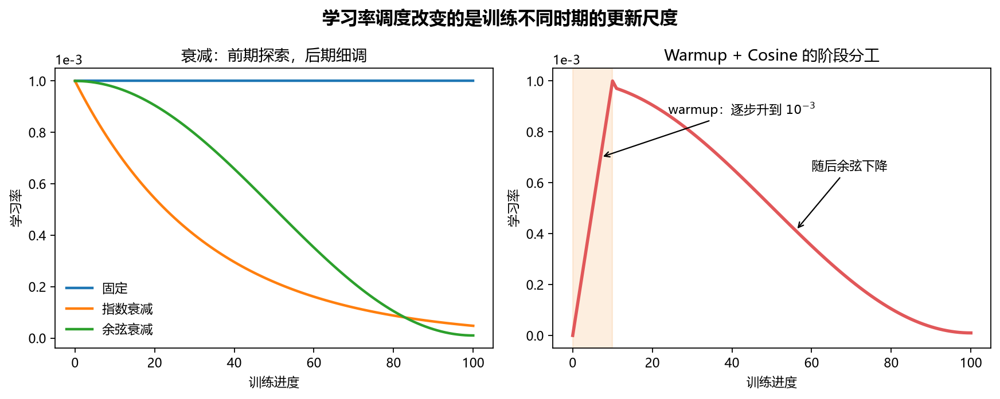
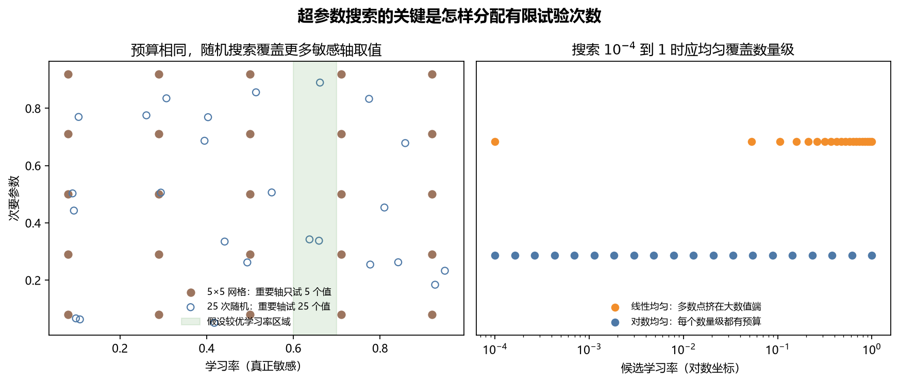
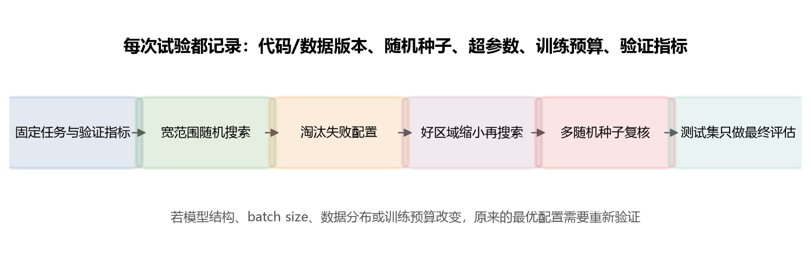

# [AI进阶-深度学习]3.优化器、学习率与超参数调优

反向传播解决的是“每个参数应该朝哪个方向变化”，优化器解决的是“怎样利用当前梯度和历史梯度，决定这一轮实际走多远”。这两件事不能混在一起：同一组梯度交给 SGD、Momentum 或 Adam，参数会走出不同路径；同一个优化器换了学习率、batch size 或权重衰减，训练结果也可能完全不同。

本篇沿一次真实训练过程展开：先把训练集切成 mini-batch，再从每批梯度中提取更稳定的方向，随后用优化器更新参数，并通过学习率调度控制训练前、中、后期的步幅，最后用验证集组织超参数实验。

## 一、Mini-batch：看一小批样本就更新一次

假设训练集有 (m) 个样本，每个样本有 (d) 个特征。按照本系列统一的“样本在第一维”记法，完整输入为

$$
X\in\mathbb{R}^{m\times d},qquad
y\in\mathbb{R}^{m}.
$$

如果每次必须让全部 (m) 个样本完成前向传播和反向传播，才能更新一次参数，这叫**全量梯度下降**。它得到的梯度比较稳定，但数据很多时，每走一步都要等待很久。

Mini-batch 的做法是把训练集打乱，再切成大小为 (B) 的小批量：

$$
X^{\{t\}}\in\mathbb{R}^{B\times d},qquad
y^{\{t\}}\in\mathbb{R}^{B}.
$$

第 (t) 批产生梯度 (g_t)，优化器立即更新一次参数。完整看过一遍训练集叫一个 **epoch**；处理一个 mini-batch 并更新一次参数叫一个 **step**。

例如训练集有 10 000 个样本，batch size 为 128：

$$
\left\lceil\frac{10000}{128}\right\rceil=79.
$$

所以一个 epoch 通常有 79 个 step：前 78 批各有 128 个样本，最后一批有 16 个。若数据加载器设置 `drop_last=True`，不足 128 个样本的最后一批会被丢弃，于是每个 epoch 只有 78 次更新。

不同小批量包含的样本不同，算出的梯度只是完整训练集梯度的一个带噪估计。因此相邻两个 step 的损失可以上下波动：某一批样本更难，损失突然升高，并不自动表示训练已经发散。应同时观察一段窗口内的平滑趋势、完整验证集指标和梯度是否出现异常。

每个 epoch 通常要重新打乱训练样本。否则某些类别或时间段总以固定顺序出现，连续梯度会被数据排列方式影响。PyTorch 的 `DataLoader` 用 `batch_size` 控制批量大小，用 `shuffle` 控制样本顺序，用 `drop_last` 决定是否丢弃最后的小批量；官方说明见 [PyTorch 数据加载文档](https://docs.pytorch.org/docs/main/data.html)。

## 二、Batch size 不是越大越好

Batch size 决定了“每个梯度参考多少样本”，同时牵动四件事：

- **梯度噪声**：批量大时梯度通常更稳定；批量小时，相邻更新差异更大。
- **更新频率**：相同 epoch 内，批量小会更新更多次，批量大则更新更少次。
- **硬件效率**：适当批量能充分利用矩阵并行，但超出显存就无法训练；批量太小也可能让 GPU 等待数据或频繁启动算子。
- **训练行为**：改变 batch size 会改变梯度噪声、BatchNorm 统计量和一个 epoch 内的更新次数，学习率与调度往往需要重新验证。

两个极端可以帮助理解。若 (B=m)，每一步使用全部训练数据，梯度稳定但一步很贵；若 (B=1)，每看一个样本便更新一次，这在严格术语中是随机梯度下降，噪声很大，也很难发挥矩阵并行优势。工程中常把使用小批量的训练也宽泛地叫作 SGD，需要根据上下文判断。

课程给出的 64、128、256、512 等经验值可以作为起点，却不是通用答案。图像尺寸、序列长度、模型大小、显存、分布式策略和归一化层都会改变合适范围。更可靠的选择方式是：先找到能稳定放进设备且吞吐较好的批量，再在相同训练预算下比较验证指标，并重新确认学习率。

显存不足时可以使用**梯度累积**。例如连续处理 4 个大小为 32 的 micro-batch，只累积梯度而暂不更新，最后统一执行一次优化器更新，其有效批量近似为 128。但它不一定与直接使用 128 个样本完全相同：BatchNorm 仍会分别统计每个 32 样本小批量，随机层每次使用的随机掩码不同，而且优化器和学习率调度器看到的 step 数也可能不同。

## 三、指数加权平均：从嘈杂观测中保留近期趋势

Mini-batch 梯度有波动。如果优化器只相信当前这一批，就容易跟着偶然噪声左右摇摆。**指数加权平均**把当前观测和历史估计合并：

$$
v_t=\beta v_{t-1}+(1-\beta)\theta_t.
$$

(	heta_t) 是当前观测，(v_t) 是平滑后的结果，(eta\in[0,1)) 决定保留多少历史。将公式展开可以看到

$$
v_t=(1-\beta)\theta_t
+(1-\beta)\beta\theta_{t-1}
+(1-\beta)\beta^2\theta_{t-2}+\cdots.
$$

越近的观测权重越大，越久远的观测按 (eta) 的幂次衰减。常用的直觉近似是

$$
\text{有效记忆长度}\approx\frac{1}{1-\beta}.
$$

因此 (eta=0.9) 大致平滑最近 10 个观测，(eta=0.99) 大致平滑最近 100 个观测。后者曲线更平滑，却也更慢响应真正发生的新变化。

如果从 (v_0=0) 开始，训练早期的平均值会被 0 拉低。例如第一条观测是 (	heta_1=20)，取 (eta=0.9)，则

$$
v_1=0.9\times0+0.1\times20=2.
$$

这显然还不能代表 20。使用偏差校正

$$
\hat v_t=\frac{v_t}{1-\beta^t}
$$

后，第一步得到

$$
\hat v_1=\frac{2}{1-0.9}=20.
$$

随着 (t) 增大，(eta^t) 趋近 0，校正影响会逐渐消失。Adam 会对一阶矩和二阶矩都进行这种早期偏差校正。

## 四、Momentum：抵消来回摆动，积累一致方向

普通小批量梯度下降直接更新

$$
\theta_t=\theta_{t-1}-\alpha g_t,
$$

其中 (g_t) 是当前批量梯度，(alpha) 是学习率。Momentum 不直接使用 (g_t)，而是先按课程中的记法计算

$$
v_t=\beta v_{t-1}+(1-\beta)g_t,
$$

再更新

$$
\theta_t=\theta_{t-1}-\alpha v_t.
$$

假设二维损失谷在水平方向较平缓、竖直方向很陡。连续两个 mini-batch 给出

$$
g_1=(1,4),qquad g_2=(1,-4).
$$

水平方向两次都是 1，说明它是持续一致的下降方向；竖直方向一会儿为 4、一会儿为 (-4)，说明参数正在谷底两侧来回摆动。取 (eta=0.9, v_0=(0,0))：

$$
v_1=0.1(1,4)=(0.1,0.4),
$$

$$
v_2=0.9(0.1,0.4)+0.1(1,-4)=(0.19,-0.04).
$$

第二步的竖直分量从当前梯度的 (-4) 缩到 (-0.04)，因为相反方向相互抵消；水平分量从 0.1 累积到 0.19，因为两批都同意向右。若 (alpha=0.1)，第二次实际参数变化为

$$
-\alpha v_2=(-0.019,0.004).
$$

它主要沿持续一致的水平方向前进，而不会跟着当前批量在竖直方向猛跳。

需要注意，不同教材和框架对动量缓冲区的缩放约定不同。PyTorch `SGD` 默认采用类似

$$
b_t=\mu b_{t-1}+g_t
$$

的缓冲区定义，第一步还会直接把 (b_1) 设为 (g_1)，没有课程公式中的 (1-\beta) 系数。因此同一个 `momentum=0.9` 不能脱离学习率，直接与上面的手算数值逐项比较；核心机制仍是保留一致方向、平滑相反方向。当前接口和更新规则可查阅 [PyTorch SGD 文档](https://docs.pytorch.org/docs/main/generated/torch.optim.sgd.SGD_class.html)。

## 五、RMSprop：让每个参数拥有自己的尺度调节

Momentum 关心“梯度方向最近是否一致”。RMSprop 处理的是另一个问题：不同参数方向的梯度尺度可能相差很大，同一个学习率在某个方向太大，在另一个方向又太小。

RMSprop 维护梯度平方的指数平均：

$$
s_t=\beta_2s_{t-1}+(1-\beta_2)g_t^2,
$$

再按元素更新：

$$
\theta_t
=\theta_{t-1}
-\alpha\frac{g_t}{\sqrt{s_t}+\varepsilon}.
$$

(g_t^2)、开方和除法都逐元素进行。某个参数的梯度长期较大，它对应的 (s_t) 也会较大，更新时便被更大的分母缩小；梯度长期较小的参数则不会被同样程度压缩。很小的 (arepsilon) 防止分母为 0。

用稳定梯度 (g=(1,4)) 看长期效果。若历史足够长，平方平均会接近

$$
s=(1^2,4^2)=(1,16).
$$

忽略 (arepsilon)，归一化梯度约为

$$
\frac{g}{\sqrt{s}}
=\left(\frac{1}{1},\frac{4}{4}\right)
=(1,1).
$$

原本第二个方向的梯度是第一个方向的 4 倍，按各自历史尺度归一化后，两者更新到相近量级。这就是“自适应学习率”的含义：全局仍有一个 (alpha)，但每个参数还会被自己的历史平方梯度再次缩放。

## 六、Adam 与 AdamW：同时利用方向和尺度

Adam 将 Momentum 的一阶平均和 RMSprop 的平方平均组合起来。对当前梯度 (g_t)：

$$
v_t=\beta_1v_{t-1}+(1-\beta_1)g_t,
$$

$$
s_t=\beta_2s_{t-1}+(1-\beta_2)g_t^2.
$$

一阶矩 (v_t) 保留近期方向，二阶矩 (s_t) 估计各参数梯度的典型平方尺度。进行偏差校正后

$$
\hat v_t=\frac{v_t}{1-\beta_1^t},qquad
\hat s_t=\frac{s_t}{1-\beta_2^t},
$$

参数更新为

$$
\theta_t
=\theta_{t-1}
-\alpha\frac{\hat v_t}{\sqrt{\hat s_t}+\varepsilon}.
$$

用两维梯度具体走两步。取

$$
\beta_1=0.9,qquad\beta_2=0.999,qquad\alpha=0.1,
$$

第一批梯度为 (g_1=(4,0.5))。从全零状态开始：

$$
v_1=(0.4,0.05),qquad
s_1=(0.016,0.00025).
$$

偏差校正得到

$$
\hat v_1=(4,0.5),qquad
\hat s_1=(16,0.25).
$$

忽略极小的 (arepsilon)，归一化方向为

$$
\frac{\hat v_1}{\sqrt{\hat s_1}}=(1,1),
$$

所以两维第一步都更新约 0.1。这里不是说两个参数永远应该走一样远，而是第一步中 Adam 先把“梯度单位”按各维自身尺度统一了。

第二批若有 (g_2=(2,0.5))，计算后约有

$$
\hat v_2=(2.947,0.5),qquad
\sqrt{\hat s_2}\approx(3.162,0.5),
$$

于是归一化更新方向约为

$$
(0.932,1).
$$

第一维当前梯度从 4 降到 2，但历史方向仍被保留；第二维连续两步保持 0.5，因此归一化更新仍稳定。完整算法来自 Kingma 与 Ba 的 [Adam 论文](https://arxiv.org/abs/1412.6980)。

图中的曲线使用人为设定的二维目标和超参数，只用于观察“震荡抵消”和“按坐标缩放”，不能据此判断哪个优化器在所有真实任务上最好。优化器会和模型结构、数据、batch size、学习率调度、正则化及训练预算共同作用。

当训练还需要权重衰减时，应区分 Adam 与 **AdamW**。在自适应优化器中，把 (L_2) 项直接加进梯度，会让这部分也进入一阶和二阶矩；AdamW 则把权重收缩从自适应梯度中分开。其直观更新可写成两部分：

$$
\theta\leftarrow(1-\alpha\lambda)\theta
$$

以及正常的 Adam 梯度更新。若当前权重为 2，(alpha=0.01,lambda=0.1)，仅权重衰减这一步会将其变成

$$
(1-0.01\times0.1)\times2=1.998.
$$

这部分收缩不被混入 Adam 的动量和平方梯度。它对应前文正则化文章中已经解释过的权重约束，但这里关心的是它怎样进入优化器步骤。AdamW 的来源及两种做法为何在自适应优化器下不等价，可参考 [Decoupled Weight Decay Regularization](https://openreview.net/pdf?id=Bkg6RiCqY7) 与 [PyTorch AdamW 文档](https://docs.pytorch.org/docs/main/generated/torch.optim.AdamW.html)。

## 七、学习率：优化器仍然需要一个总步幅

自适应优化器不等于“不用调学习率”。Momentum 改变了方向的历史平滑，RMSprop 和 Adam 改变了各参数的相对尺度，但全局学习率 (alpha) 仍决定整个更新的基本量级。

判断初始学习率可以先做数量级搜索，例如依次试验

$$
10^{-5}, 3\times10^{-5}, 10^{-4}, 3\times10^{-4}, 10^{-3}.
$$

若训练一开始损失便剧烈增大或出现非有限值，通常要优先减小学习率并检查数据与数值稳定性；若损失稳定却几乎不下降，可以在确认梯度、初始化和数据无误后尝试增大学习率。比较时应使用相同模型、数据顺序、训练预算和验证指标，不能拿训练 5 个 epoch 的一个设置与训练 50 个 epoch 的另一个设置直接下结论。

固定学习率在训练前期可能合适，接近较优区域后却可能让参数持续在附近游走。因此可以随训练进度调节学习率。

### 1. 衰减：训练后期缩小步幅

指数衰减的一种写法是

$$
\alpha_t=\alpha_0\gamma^t,qquad 0<\gamma<1.
$$

余弦衰减的一种常见写法是

$$
\alpha_t
=\alpha_{\min}
+\frac{1}{2}(\alpha_{\max}-\alpha_{\min})
\left(1+\cos\frac{\pi t}{T}\right).
$$

(t) 是当前调度进度，(T) 是总调度长度。若 (alpha_{\max}=10^{-3})、(alpha_{\min}=10^{-5})、(T=100)，在 (t=50) 时余弦项为 0，学习率是

$$
10^{-5}+\frac{10^{-3}-10^{-5}}{2}=5.05\times10^{-4}.
$$

它已经从初始值下降约一半，使训练进入更细的调整阶段。PyTorch 的 `CosineAnnealingLR` 实现和调用时机可参考 [官方文档](https://docs.pytorch.org/docs/main/generated/torch.optim.lr_scheduler.CosineAnnealingLR.html)。

### 2. Warmup：训练初期逐步放大学习率

大批量、深层网络或 Transformer 训练初期，参数状态与优化器统计量尚未稳定，直接使用峰值学习率可能造成突然的大更新。Warmup 会从较小值逐步升到目标学习率。例如在 10 个 warmup step 内线性升至 (10^{-3})，第 3 步学习率是

$$
\frac{3}{10}\times10^{-3}=3\times10^{-4}.
$$

Warmup 结束后再接余弦或其他衰减。它的作用是控制起步阶段，不代表学习率必须永远增大。

调度器按 epoch 还是按 step 更新必须与设计一致。若本来计划 100 个 epoch 调一次，却误在每个 mini-batch 后调用，学习率会过早降到很小。PyTorch 当前提供 Step、Exponential、Cosine、OneCycle、ReduceLROnPlateau 等多种调度器，列表与调用顺序见 [PyTorch 优化器文档](https://docs.pytorch.org/docs/main/optim.html)。选择调度策略之前，应先确认初始学习率处在可训练范围。

## 八、鞍点和平台：优化器为什么仍可能走得很慢

神经网络的高维损失曲面并不只是许多个“碗”。梯度为零的位置可能是局部极小值，也可能是鞍点：某些方向向上弯，另一些方向向下弯。还有一种常见情况是**平台区**，大片区域的梯度都很小，参数长时间移动缓慢。

Momentum 能依靠之前积累的方向继续前进一段距离，自适应方法能重新缩放不同坐标，因此有时更容易通过狭长谷和部分平台。但它们不能保证逃离所有鞍点，也不能修复错误标签、错误损失、饱和激活或不合适的模型。看到训练缓慢时，应结合激活值、梯度范数、学习率和验证表现判断，而不是立即把优化器换成最新名称。

实践中可以把 AdamW 作为许多深度学习任务的强起点，也可以在经过验证的视觉训练方案中使用 SGD+Momentum；RMSprop 仍可用于适合它的任务。这里没有一个脱离任务的冠军。公平比较至少要分别调学习率，并给每种优化器合理的训练预算与调度。

## 九、超参数搜索：把有限试验次数放在有信息的地方

模型参数 (W,b) 由训练数据和优化器学习；**超参数**由实验者设定，用来控制模型与训练过程，例如学习率、batch size、权重衰减、层数、隐藏维度以及调度策略。

超参数很多时，不应一开始同时精调所有旋钮。通常先保证数据、损失与训练流程正确，再优先处理对结果最敏感的参数：初始学习率往往优先级很高，随后结合任务考虑 batch size、权重衰减、模型容量和调度；Adam 的 (eta_1,eta_2,arepsilon) 可以先从框架默认值起步，出现明确问题后再扩大搜索。

### 1. 随机搜索为什么常比规则网格有效

假设学习率非常重要，另一个参数影响很小。一个 (5\times5) 网格虽然训练 25 个模型，却只试了 5 个不同学习率；随机生成 25 组配置，通常能得到 25 个不同学习率，更充分地探索真正敏感的轴。

这并不表示随机搜索永远优于所有现代调参算法，而是说明它是比随意手调或高维规则网格更可靠的基线。Bergstra 与 Bengio 的 [随机搜索研究](https://jmlr.org/beta/papers/v13/bergstra12a.html)指出，不同数据集往往只有少数超参数真正重要，而重要维度并不总是相同。

### 2. 学习率要按数量级采样

若搜索范围为 (10^{-4}) 到 (1)，在线性区间均匀取点会把绝大多数预算放在 0.1 到 1 之间，而 (10^{-4}) 到 (10^{-3}) 几乎没有候选。更合理的方式是先采样

$$
r\sim\operatorname{Uniform}(-4,0),
$$

再令

$$
\alpha=10^r.
$$

这样 (10^{-4}sim10^{-3})、(10^{-3}sim10^{-2})、(10^{-2}sim10^{-1}) 和 (10^{-1}sim1) 都得到相近试验预算。权重衰减等跨多个数量级的正数参数也适合采用这种方法。

若要搜索动量系数 (eta) 接近 1 的区域，应对 (1-eta) 按对数尺度采样。因为有效记忆长度约为 (1/(1-eta))：

$$
\beta=0.9\Rightarrow10,qquad
\beta=0.99\Rightarrow100,qquad
\beta=0.999\Rightarrow1000.
$$

表面上只是小数点后多一个 9，实际记忆长度却扩大 10 倍。

### 3. 先粗后细，但不要偷看测试集

先在宽范围随机搜索，用较短但足以暴露发散和明显差异的预算淘汰失败配置；再围绕表现较好的区域缩小范围，投入完整训练。所有选择都应基于验证集和预先确定的评价指标，测试集只在方案固定后用于最终评估。

若连续多轮搜索都盯着同一验证集，验证结果也会逐渐被“调熟”。重要实验应保留独立最终测试，记录搜索次数，并对少数候选使用多个随机种子复核。一次偶然的好结果不能证明配置稳定。

## 十、把调参组织成可以复现的实验

课程用“panda”与“caviar”比喻两种资源条件：算力少时，专注训练少数模型，认真观察曲线并逐步修改；算力充足时，并行训练许多候选，再按验证指标筛选。两种方式的共同要求是每次实验都能解释、比较和复现。

一轮可靠的调参可以按下面执行：

1. **固定任务和评价协议。**确定训练集、验证集、主要指标、训练预算和停止规则，避免搜索期间改变判分标准。
2. **先建立可运行基线。**使用合理初始化、稳定损失、一个常见优化器和保守学习率，确认损失确实下降。
3. **优先搜索高影响参数。**先搜索初始学习率，再处理 batch size、权重衰减和模型容量；不要一开始组合几十个无依据的范围。
4. **使用合适的采样尺度。**跨数量级的正数参数用对数尺度，层数等小范围整数用离散采样，类别型选择直接枚举。
5. **记录完整上下文。**至少保存代码与数据版本、随机种子、优化器、调度器、batch size、每轮指标、训练时间和最佳检查点。
6. **粗搜后缩小区域。**失败试验可以提前终止，把更多预算留给有希望的配置，但不同候选的比较必须说明实际训练了多久。
7. **复核而不是只取最大值。**对最终少量候选增加训练预算并更换随机种子，比较均值、波动和资源消耗。
8. **最后才使用测试集。**一旦根据测试结果继续改超参数，测试集就参与了模型选择，原分数会偏乐观。

模型结构、数据分布、batch size 或训练时长改变后，原来的“最佳学习率”不再有自动继承的保证。调参的目标也不是找到一个永远有效的神奇数字，而是在明确预算和评价标准下，找到一套对当前任务稳定、可复现且资源可接受的训练方案。
