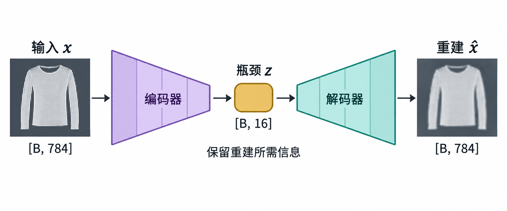
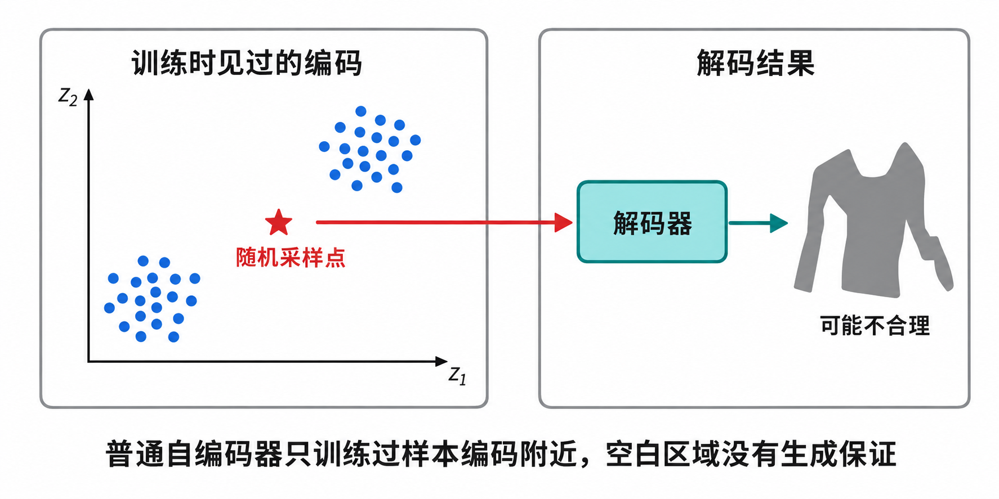

# [AI进阶-生成模型]1.自编码器、表示学习与异常检测

如果把一张图片输入神经网络，再要求网络输出同一张图片，这个任务乍看没有意义：答案已经放在输入里，模型为什么还要学习？真正决定任务价值的，不是“输入和目标相同”，而是中间能否原样传递全部信息。

假设原图有 784 个像素，模型必须先把它压成 16 个数，再由这 16 个数恢复 784 个像素。编码器不可能随意保留每个细节，只能优先记录那些对重建多数样本都有帮助的结构，例如笔画位置、整体轮廓或明暗分布。这个中间表示可以拿去降维、检索、分类、压缩和异常检测，也能成为后续生成模型的基础。

这就是**自编码器（autoencoder）**的核心：用“重建输入”作为训练任务，迫使模型在内部学习一种表示。它能否真的学到有用内容，取决于瓶颈、噪声、离散化、网络容量和损失函数等约束；仅仅把模型命名为 Autoencoder，并不能自动避免复制输入。

## 一、编码器、潜在表示和解码器分别做什么

一个普通自编码器由两部分组成：

```text
输入 x
  ↓ Encoder：从原始数据提取并压缩信息
潜在表示 z
  ↓ Decoder：根据 z 重建输入
重建结果 x_hat
```

写成公式：

$$
z=E_{\phi}(x),
$$

$$
\hat x=D_{\theta}(z),
$$

$$
\mathcal L_{\text{rec}}=d(x,\hat x).
$$

其中：

- $x$ 是原始输入，例如图片、语音片段或一行表格数据；
- $E_{\phi}$ 是参数为 $\phi$ 的编码器；
- $z$ 是潜在表示（latent representation），也常叫编码、code 或 embedding；
- $D_{\theta}$ 是参数为 $\theta$ 的解码器；
- $\hat x$ 是重建结果，读作“x hat”；
- $d(x,\hat x)$ 衡量输入和重建结果之间的差异。

训练时，梯度从重建损失经过解码器传到 $z$，再经过编码器传回所有参数。因此编码器和解码器不是分别训练的两台机器，而是围绕同一个重建目标共同调整。

### 1.1 一个具体的图片形状

一张 Fashion-MNIST 灰度图的形状是 `[1,28,28]`，展平后有：

$$
1\times28\times28=784
$$

个像素。一个全连接自编码器可以采用：

```text
[B, 784]
   ↓ Encoder
[B, 128]
   ↓
[B, 32]
   ↓ bottleneck
[B, 16]
   ↓ Decoder
[B, 32]
   ↓
[B, 128]
   ↓
[B, 784]
```

$B$ 是一次处理的图片数量。每张图片最终只用 16 个连续数表示，压缩阶段因此是：

$$
E_{\phi}:\mathbb R^{784}\rightarrow\mathbb R^{16}.
$$

解码阶段则是：

$$
D_{\theta}:\mathbb R^{16}\rightarrow\mathbb R^{784}.
$$



这张图把“压缩”具体化为张量形状变化：编码器把每个样本的 784 个输入值压到 16 个潜在值，解码器再把它恢复成 784 个输出值。瓶颈保留的是对训练重建目标有帮助的信息，不等于已经自动得到可解释语义。

如果输入采用卷积网络，就不一定把图片立即展平。编码器可能把 `[B,1,28,28]` 逐步变成 `[B,64,7,7]`，再压成更小的空间特征图。潜在表示不必是一维向量，它也可以保留通道和空间布局。

## 二、重建损失决定模型认为“像”是什么意思

自编码器只知道怎样减小损失。选用不同的 $d(x,\hat x)$，相当于用不同规则告诉模型哪些错误严重、哪些错误可以接受。

### 2.1 均方误差

对连续数值，常用均方误差：

$$
\mathcal L_{\text{MSE}}
=\frac{1}{n}\sum_{j=1}^{n}(x_j-\hat x_j)^2.
$$

$n$ 是每个样本的元素数量，$x_j$ 是第 $j$ 个真实值，$\hat x_j$ 是对应重建值。误差被平方后，大偏差会受到更重惩罚。

假设输入和重建结果分别为：

$$
x=[1.0,\ 0.8,\ 0.2,\ 0.0],
$$

$$
\hat x=[0.9,\ 0.6,\ 0.3,\ 0.2].
$$

四个位置的平方误差为：

$$
0.1^2+0.2^2+(-0.1)^2+(-0.2)^2
=0.10.
$$

所以：

$$
\mathcal L_{\text{MSE}}=0.10/4=0.025.
$$

0.025 的含义是每个元素平方误差的平均值，不是“准确率为 97.5%”。损失的合理大小与归一化范围、维度和任务有关，不能脱离数据尺度判断。

### 2.2 L1、二元交叉熵和特征损失

L1 损失使用绝对值：

$$
\mathcal L_{\text{L1}}
=\frac{1}{n}\sum_{j=1}^{n}|x_j-\hat x_j|.
$$

它不会像平方那样特别放大少数大误差，面对离群值时通常更稳健。若每个输出被明确建模为 0/1 事件概率，可以使用二元交叉熵；若数据只是缩放到 `[0,1]` 的普通连续像素，不能仅凭范围相同就断言 Bernoulli 模型最合适。

逐像素误差还有一个问题：它只比较相同位置的数值。图片整体平移一个像素，人可能认为内容几乎不变，逐像素 MSE 却会明显上升。某些任务因此会增加感知损失，在预训练网络的特征空间比较 $x$ 和 $\hat x$。这改变了“相似”的定义，也会引入特征网络自身的偏好。[使用学习特征作为重建度量的 VAE-GAN 工作](https://arxiv.org/abs/1512.09300)展示了这种思路。

## 三、瓶颈为什么可能迫使模型学习结构

如果输入有 784 维，中间只有 16 维，编码器就无法通过一条独立通道原样传递每个像素。为了在许多图片上都取得较小重建误差，它需要寻找重复出现的规律。

例如手写数字图片虽然位于 $\mathbb R^{784}$，但真实样本不是 784 个像素任意组合。大量随机像素矩阵只会呈现噪声；真正的数字由少量笔画、位置、粗细、倾斜和书写风格共同产生。数据占据的有效区域远小于整个像素空间。

常用的直觉是：高维数据可能靠近一个低维**流形（manifold）**。这里的流形可以先理解为“真实数据实际活动的低维区域”，不要求先掌握严格的微分几何定义。编码器学习从高维坐标找到这个区域上的低维位置，解码器再把低维位置映射回原空间。

### 3.1 低维并不自动代表有用

瓶颈只限制信息容量，没有指定应保留什么。若训练目标是像素重建，模型可能优先保存背景、亮度或纹理，而不是分类最需要的类别信息。

例如猫狗图片中，背景占据多数像素，耳朵形状只占很小区域。一个重建损失很低的表示可能精确保存草地和墙面，却没有形成容易区分猫狗的方向。因此：

```text
重建效果好
≠ 潜在表示一定适合分类
≠ 表示一定容易解释
≠ 表示一定适合随机采样生成
```

表示质量要根据实际用途检查。分类可在冻结编码器后训练线性分类器，检索可测试相似样本是否靠近，聚类可检查分组稳定性，压缩则要同时比较码率和重建质量。

### 3.2 过完备自编码器也可以有意义

如果 $z$ 的维度不小于输入维度，称为过完备（overcomplete）表示。此时模型更容易学成恒等映射，但不表示一定无用。还可以通过其他限制阻止直接复制，例如：

- 给输入加入噪声，要求恢复干净版本；
- 对隐藏激活加入稀疏约束，使大部分单元保持不活跃；
- 对参数或编码的敏感度加正则化；
- 限制网络结构或感受野；
- 把连续表示量化为有限码本索引。

所以真正关键的是**信息约束**，低维瓶颈只是最直观的一种。

## 四、自编码器与 PCA 都在降维，但解决方式不同

PCA 选择一组线性正交方向，把样本投影到保留方差最大的子空间。自编码器通过神经网络学习编码与解码函数，可以包含非线性激活，因此有机会拟合弯曲的数据结构。

两者可以这样比较：

| 比较项 | PCA | 自编码器 |
|---|---|---|
| 映射 | 线性投影 | 可线性，也可非线性 |
| 训练目标 | 保留最大方差、最小化正交重建误差 | 最小化指定重建损失及其他约束 |
| 求解 | 特征分解或 SVD 等数值方法 | 梯度下降训练网络 |
| 结果稳定性 | 给定预处理和求解设置后较明确 | 受结构、初始化和训练过程影响 |
| 新样本映射 | 矩阵乘法 | 编码器前向传播 |
| 适用角色 | 可解释线性基线 | 复杂非线性表示与任务定制 |

在线性、低维瓶颈、平方重建误差等条件下，自编码器学习到的子空间与 PCA 主子空间有密切关系。不过自编码器内部坐标可以在同一子空间内旋转，不一定逐维等于 PCA 排序后的主成分。

PCA 的投影、协方差和二维降到一维的完整过程已经在吴恩达系列中讲过。这里需要使用的核心只有一点：PCA 用一个线性子空间重建输入，自编码器把这个“编码—重建”思路推广到可学习的非线性函数。

t-SNE 等方法主要用于构造二维或三维可视化邻域，不以训练一个可逆解码器为核心。把所有降维方法放在同一张“维度变少”标签下，会忽略它们对新样本映射、全局距离和可重建性的不同保证。

## 五、早期逐层预训练为什么现在不再是默认做法

早期深层网络较难直接优化，一种经典路线是先使用受限玻尔兹曼机或堆叠自编码器逐层学习，再用监督数据微调整个网络。Hinton 与 Salakhutdinov 2006 年的工作展示了深层自编码器用于低维编码的效果，在深度学习发展史上很重要。[原论文与摘要](https://pubmed.ncbi.nlm.nih.gov/16873662/)

今天，大多数常规网络可以依靠更好的初始化、归一化、残差连接、优化器和硬件直接端到端训练。大规模预训练仍然重要，但常见目标已经扩展为遮罩建模、对比学习、下一 token 预测和多模态对齐，不再默认采用“逐层训练普通自编码器”这一套流程。

这部分适合保留为历史定位：它解释了无标签预训练为什么重要，却不应写成现代深度网络训练的必经步骤。

## 六、去噪自编码器：输入被破坏，目标仍然干净

普通自编码器同时输入和输出 $x$，网络可能寻找过于直接的复制路径。**去噪自编码器（denoising autoencoder）**先破坏输入，再要求模型恢复原始干净数据：

$$
\tilde x=C(x),
$$

$$
z=E_{\phi}(\tilde x),
$$

$$
\hat x=D_{\theta}(z),
$$

$$
\mathcal L_{\text{denoise}}=d(x,\hat x).
$$

$C$ 是破坏过程，可以加入高斯噪声、随机遮住一部分元素、删除片段或使用符合业务场景的退化方式。需要特别注意：模型输入是 $\tilde x$，损失目标仍是干净的 $x$。如果目标也换成 $\tilde x$，模型学到的是重建噪声，而不是去噪。

### 6.1 用四个数走一遍

假设干净输入为：

$$
x=[1,1,0,0].
$$

随机遮掉第二个位置，得到：

$$
\tilde x=[1,0,0,0].
$$

模型根据训练数据中常见模式输出：

$$
\hat x=[0.9,0.8,0.1,0.2].
$$

仍然和干净目标 $x$ 比较：

$$
\mathcal L
=\frac{(1-0.9)^2+(1-0.8)^2+(0-0.1)^2+(0-0.2)^2}{4}
=0.025.
$$

模型要恢复被遮掉的第二个 1，就不能只逐位置复制输入，必须从其他位置与训练样本规律中推测缺失内容。破坏强度太低时，任务可能太容易；太高时，输入中又没有足够信息恢复原样。噪声类型和强度因此属于训练目标的一部分。

去噪自编码器的经典工作把“从损坏输入恢复干净输入”用于学习更稳健的特征。[Vincent et al. 2008 原论文](https://www.cs.toronto.edu/~larocheh/publications/icml-2008-denoising-autoencoders.pdf)

### 6.2 它和 BERT 有什么关系

BERT 的遮罩语言模型也会破坏输入，并预测原始 token，所以可以从训练思想上理解为文字去噪：

```text
完整句子 x
  ↓ 遮罩、随机替换等破坏
损坏序列 x_tilde
  ↓ 双向 Transformer
预测原 token
```

这只是目标形式上的联系。BERT 没有传统自编码器中一个明确压成固定短向量的瓶颈，也不要求从单个 $z$ 重建整段输入；它对被选位置进行词表分类。第一篇已经完整解释 BERT 的 15% 选取和 MLM 损失，本篇只保留去噪目标的共同结构。

## 七、表示解耦：把“说什么”和“谁在说”分开

一段语音同时包含多种变化因素：文字内容、说话者身份、音色、语速、情绪和录音环境。普通编码器只需让解码器重建成功，没有理由自动把这些因素放进互不干扰的向量区间。

**表示解耦（disentangled representation）**希望不同潜在变量分别描述不同生成因素。例如：

$$
z=(z_{\text{content}},z_{\text{speaker}},z_{\text{style}}).
$$

- $z_{\text{content}}$ 记录说了什么；
- $z_{\text{speaker}}$ 记录谁在说；
- $z_{\text{style}}$ 记录语气、速度等表达方式。

语音转换可以把 A 的内容编码与 B 的说话者编码组合：

```text
A 的语音 → 内容编码 z_content
B 的语音 → 说话者编码 z_speaker
两者组合 → Decoder → 用 B 的音色说出 A 的内容
```

如果内容和身份真的分开，训练数据不必严格包含 A、B 说同一句话的所有配对。但“希望分开”不会让网络自动分开。常见约束包括提供部分身份标签、交换潜变量后要求保持内容、使用对抗分类器删除身份信息、限制各部分容量，或对生成结果增加一致性损失。

这意味着解耦不是观察几维潜变量后凭感觉命名。需要用干预来验证：只改变 $z_{\text{speaker}}$ 时，内容是否保持不变；只改变 $z_{\text{content}}$ 时，说话者特征是否稳定。研究中也反复表明，完全无监督地得到唯一、符合人类语义的解耦通常需要额外假设；少量监督或结构先验常能改善可解释性。[半监督解耦表示工作](https://arxiv.org/abs/1706.00400)

## 八、连续表示与离散表示解决不同问题

普通潜在向量中的每一维可以连续变化。例如 $z_1$ 从 0.2 变到 0.21，只发生很小改动。这适合描述角度、音高、亮度等平滑变化。

有些数据更像由有限个单位组成，例如音素、离散视觉部件或词表 token。此时可以让模型从有限集合中选择表示：

- 二元编码：每一位只能是 0 或 1；
- 独热编码：多个位置中选一个；
- 码本表示：从 $K$ 个可学习向量中选择最接近的一项。

离散表示便于形成有限符号、存储索引或训练后续序列模型，却会带来不可导的选择操作。连续表示容易用梯度训练和插值，但不一定自然形成可解释的离散单位。两者没有绝对优劣，取决于数据结构和后续用途。

## 九、VQ-VAE：把连续编码映射到有限码本

向量量化变分自编码器（Vector-Quantized Variational Autoencoder，VQ-VAE）让编码器先输出连续向量，再用码本中最接近的向量替换它。虽然名字中有 VAE，它的离散量化机制与下一篇标准高斯 VAE 的重参数化和 KL 项不同，因此先在这里讲清。

设编码器输出：

$$
z_e(x)\in\mathbb R^D,
$$

码本包含 $K$ 个可学习向量：

$$
\mathcal E=\{e_1,e_2,\ldots,e_K\},
\qquad e_k\in\mathbb R^D.
$$

选择欧氏距离最近的码本项：

$$
k^*=\arg\min_k\|z_e(x)-e_k\|_2^2,
$$

并把量化后的表示交给解码器：

$$
z_q(x)=e_{k^*},
\qquad
\hat x=D_{\theta}(z_q(x)).
$$

真正离散的是编号 $k^*$。码本向量仍然是连续参数，但每个输入只能选有限的 $K$ 个编号之一。

### 9.1 用二维码本选择一次

假设编码器输出：

$$
z_e=[1.2,0.1],
$$

码本有三项：

$$
e_1=[0,0],\qquad
e_2=[1,0],\qquad
e_3=[0,1].
$$

计算平方距离：

$$
\|z_e-e_1\|^2=1.2^2+0.1^2=1.45,
$$

$$
\|z_e-e_2\|^2=0.2^2+0.1^2=0.05,
$$

$$
\|z_e-e_3\|^2=1.2^2+(-0.9)^2=2.25.
$$

距离最小的是 $e_2$，所以：

$$
k^*=2,
\qquad
z_q=e_2=[1,0].
$$

编码器原本提出 `[1.2,0.1]`，最后必须用标准码本项 `[1,0]` 表示。保存这个位置时，可以记录编号 2，而不是原始二维浮点向量。

### 9.2 最近邻选择不可导，参数怎样训练

`argmin` 的输出编号不会随输入发生平滑变化，不能像普通层一样直接传梯度。VQ-VAE 常使用直通估计（straight-through estimator）：前向传播使用量化向量 $z_q$，反向传播时把解码器对 $z_q$ 的梯度近似复制给编码器输出 $z_e$。

经典目标通常包含三部分：

$$
\mathcal L
=\mathcal L_{\text{rec}}
+\|\operatorname{sg}[z_e]-e_{k^*}\|_2^2
+\beta\|z_e-\operatorname{sg}[e_{k^*}]\|_2^2.
$$

`sg` 表示停止梯度（stop gradient）：前向数值不变，反向时不把梯度传入括号内对象。

- $\mathcal L_{\text{rec}}$ 训练编码器和解码器完成重建；
- 第二项把选中的码本向量拉向编码器输出，但停止 $z_e$ 的梯度；
- 第三项是 commitment loss，让编码器不要不断改变输出、随意跨越码本项，但停止码本一侧梯度；
- $\beta$ 控制编码器服从码本的强度。

原始 VQ-VAE 还会在离散编号序列上训练一个先验模型，用它生成新的编号，再交给解码器生成数据。只有学会“哪些码本编号组合常见”，才不需要从码本中盲目随机挑选。[VQ-VAE 原始论文](https://arxiv.org/abs/1711.00937)

### 9.3 与注意力的类比到哪里为止

可以把编码器输出想成查询，把码本向量想成候选，并选择最接近的一项。这个类比有助于理解“查找”，但 VQ-VAE 的硬量化通常只选一个最近向量；标准注意力则通过 Softmax 对多个 Value 做加权和。二者的梯度处理和输出形式不同，不能因为都有“相似度查找”就视为同一个算法。

## 十、潜在表示不一定是一条浮点向量

潜在表示的形式应当由任务需要决定。图像编码器可以输出 `[C,H',W']` 的特征图，保留物体的大致位置；语音编码器可以输出一串随时间变化的离散编号；文档编码器甚至可以尝试生成一句短文本。

设想让编码器把长文章变成一句话，再让解码器根据这句话恢复原文。这句中间文本看起来像摘要，但重建目标只要求解码器能读懂。编码器完全可能发明人类看不懂的暗号，把大量细节藏在奇怪的标点和词序中。

要得到人类可读摘要，还需要语言流畅性、事实一致性、长度、内容覆盖等约束，或直接使用真实摘要监督。这个例子说明：中间表示具备某种形式，不代表它自动拥有我们希望的语义。

## 十一、普通自编码器的解码器为什么不能直接当作可靠生成模型

解码器确实实现：

$$
z\longrightarrow\hat x.
$$

但训练时它只看过编码器对训练样本产生的那些 $z$。潜在空间中其他位置可能没有对应的合理数据。

假设训练编码只集中在潜在空间的两小块区域：



从两块之间随机取一个点，解码器可能收到训练时从未见过的组合。它的输出可能平滑插值，也可能完全异常，普通重建目标没有给出保证。

因此普通自编码器适合“给定输入再重建”，不天然适合“先规定一个简单分布，再随机采样生成”。下一篇 VAE 会让编码器输出分布，并通过 KL 散度让潜在区域靠近统一先验，从而建立明确的采样方式。这里先保留这个问题，不提前展开 VAE 的概率推导。

## 十二、自编码器怎样用于有损压缩

从功能上看，编码器负责压缩，解码器负责解压：

```text
原始数据 x → Encoder → code → Decoder → 重建数据 x_hat
```

由于 $\hat x$ 通常不能逐位等于 $x$，这属于有损压缩。模型学习把有限容量优先用于训练分布中常见、对损失影响较大的结构。

### 12.1 维度变小还不等于文件一定变小

假设原图有 784 个 8 位像素，原始数据量是：

$$
784\times8=6272\text{ bit}.
$$

若编码器输出 16 个 FP32 数：

$$
16\times32=512\text{ bit}.
$$

只看潜在数据，确实从 6272 bit 降到 512 bit。但实际压缩系统还要考虑：

- code 使用多少位精度；
- 是否还要保存形状、范围等元数据；
- 编码器和解码器参数存在哪里；
- 一次压一张图，还是许多图片共享同一模型；
- code 是否经过量化与熵编码；
- 在目标码率下重建质量怎样。

如果为了压一张小图附带一个庞大解码器，整体文件反而可能更大。学习式压缩通常假设发送端和接收端已经共享模型，真正传输的是量化潜在码及相关比特流。

### 12.2 连续 code 还需要变成离散比特

计算机最终存储的是有限比特。连续潜在向量若直接用 FP32 保存，压缩率受 32 位精度限制。实际系统通常把潜在值量化成有限符号，再根据符号概率使用熵编码，让常见符号使用较短编码。

因此评估压缩不能只报告重建 MSE，还要看率失真关系：

$$
\mathcal L=R+\lambda D.
$$

$R$ 是码率，表示需要多少 bit；$D$ 是失真，例如像素误差或感知差异；$\lambda$ 控制更偏向小文件还是高质量。普通低维自编码器展示了压缩思想，但完整编解码系统还需要量化、概率模型和比特流设计。

## 十三、只用正常样本训练，再用重建误差寻找异常

许多场景中，正常数据容易收集，异常数据很少且种类无法穷举。例如设备大多数时间正常运行，未来故障却可能以从未见过的方式出现。自编码器提供一种经典的一类异常检测思路：只学习正常模式，再把“重建得有多差”当作异常分数。

### 13.1 训练阶段

只使用正常训练样本：

$$
z=E_{\phi}(x_{\text{normal}}),
$$

$$
\hat x_{\text{normal}}=D_{\theta}(z),
$$

并最小化正常样本的重建损失。模型因此会反复看到正常结构，例如设备温度、压力和振动之间的常见关系。

### 13.2 测试阶段

对新样本 $x$ 计算异常分数：

$$
s(x)=d(x,D_{\theta}(E_{\phi}(x))).
$$

再与阈值 $\tau$ 比较：

$$
s(x)>\tau
\quad\Longrightarrow\quad
\text{标记为异常候选}.
$$

这里应写成“异常候选”，因为模型给出的是分数和阈值判断，不是业务事实证明。

### 13.3 用三维传感器数据算一次

假设三个特征都已按训练集尺度标准化。一个正常验证样本和重建结果为：

$$
x_n=[0.20,-0.10,0.30],
$$

$$
\hat x_n=[0.18,-0.05,0.25].
$$

其均方重建误差是：

$$
s(x_n)
=\frac{0.02^2+(-0.05)^2+0.05^2}{3}
=0.0018.
$$

另一个新样本为：

$$
x_a=[0.20,2.00,0.30],
$$

模型仍把它重建成接近正常关系的：

$$
\hat x_a=[0.22,0.15,0.28].
$$

异常分数为：

$$
s(x_a)
=\frac{(-0.02)^2+1.85^2+0.02^2}{3}
\approx1.141.
$$

若根据正常验证集选择阈值 $\tau=0.02$，第一个样本低于阈值，第二个样本远高于阈值，因而第二个会被标记。

这个例子中第二个特征主导了误差。如果原始三个特征的单位分别是摄氏度、帕和毫米，未标准化时数值尺度最大的列可能支配 MSE。训练、验证和线上推理必须使用同一套预处理参数。

### 13.4 阈值不是由训练损失自动给出的

可以在只含正常样本的验证集上观察分数分布，例如把 99% 正常样本覆盖范围的上界作为初始阈值；也可以在有少量异常标注时，根据漏报成本和误报成本选择阈值。阈值越低，通常越容易发现异常，也越容易误报。

时间序列还要决定分数对应单个时间点、一个窗口还是整个事件，并处理持续时间、相邻告警合并和数据漂移。自编码器只提供异常信号，完整告警规则仍需要结合业务。

### 13.5 为什么异常有时也能被重建得很好

“只见过正常样本，所以一定不会重建异常”只是启发式直觉，不是数学保证。以下情况都会破坏它：

- 网络容量太大，学到接近恒等映射的函数；
- 异常只改变语义，却与正常样本有相似低层像素；
- 训练数据混入异常，模型把它们也当作正常规律；
- 正常分布覆盖很广，异常恰好落入模型能平滑重建的区域；
- 损失平均所有维度，局部异常被大量正常位置稀释。

近年的重建式异常检测工作仍把“模型也可能很好地重建异常”列为标准自编码器的重要失败模式，并尝试增加已知异常对比、规范化能量、记忆限制或判别目标。[重建误差异常检测及其异常重建问题](https://arxiv.org/abs/2305.10464)

所以实际项目需要在独立数据上比较正常与异常分数是否真的分开，同时和 Isolation Forest、One-Class SVM、预测残差、预训练特征距离或监督分类等基线比较。自编码器是可用方法之一，不是看到“异常检测”四个字就自动选择的答案。

## 十四、自编码器与 CycleGAN 的共同点和边界

普通自编码器要求：

$$
x\xrightarrow{E}z\xrightarrow{D}\hat x,
\qquad
\hat x\approx x.
$$

CycleGAN 的循环一致性要求：

$$
x_A\xrightarrow{G_{A\rightarrow B}}\hat x_B
\xrightarrow{G_{B\rightarrow A}}\tilde x_A,
\qquad
\tilde x_A\approx x_A.
$$

共同点是通过“转换之后还能回来”限制映射不要完全忽略输入。区别在于，自编码器通常把同一数据空间压成潜在表示再重建；CycleGAN 在两个可观察领域之间转换，还要用判别器保证转换结果像目标领域的数据。

后面的 GAN 文章会完整讲生成器、判别器和循环一致性。本篇只需要知道：重建约束能保留信息，却不能单独保证中间表示符合人类想要的语义，也不能保证跨领域输出真实。

## 十五、怎样判断自编码器是否适合当前任务

自编码器今天仍适合几类问题：希望得到可重建的低维表示、学习特定噪声的恢复、构造离散 token、实现学习式有损压缩，或在正常数据充足而异常标签不足时建立重建基线。它也常作为更复杂生成模型、语音编码器和视觉 tokenizer 的组成部分。

使用前应依次回答：

1. **最终用途是什么？** 若只需要分类准确率，直接监督训练或预训练特征可能更合适；若需要重建与编码，Autoencoder 才与目标一致。
2. **限制信息的机制是什么？** 低维瓶颈、去噪、稀疏、量化和结构约束解决的是不同问题。
3. **损失真正奖励什么？** 像素 MSE、频谱误差和感知特征会保留不同信息。
4. **表示怎样评估？** 不应只看重建图，要用分类、检索、压缩码率或异常检测指标验证用途。
5. **模型会不会走捷径？** 跳跃连接、过强解码器或过大容量可能绕过想要的瓶颈。
6. **推理数据是否和训练数据同分布？** 领域变化可能同时提高正常样本误差和降低阈值可靠性。

这些问题把“会搭一个编码器和解码器”推进到“知道为什么要用、模型会保存什么，以及结果怎样被验证”。普通自编码器解决的是表示与重建的关系；下一篇 VAE 将在此基础上增加概率分布，专门处理潜在空间如何采样和生成的问题。

## 参考资料

- Hinton, Salakhutdinov. [Reducing the Dimensionality of Data with Neural Networks](https://pubmed.ncbi.nlm.nih.gov/16873662/), 2006。
- Vincent et al. [Extracting and Composing Robust Features with Denoising Autoencoders](https://www.cs.toronto.edu/~larocheh/publications/icml-2008-denoising-autoencoders.pdf), 2008。
- van den Oord, Vinyals, Kavukcuoglu. [Neural Discrete Representation Learning](https://arxiv.org/abs/1711.00937), 2017。
- Siddharth et al. [Learning Disentangled Representations with Semi-Supervised Deep Generative Models](https://arxiv.org/abs/1706.00400), 2017。
- Angiulli, Fassetti, Ferragina. [Reconstruction Error-based Anomaly Detection with Few Outlying Examples](https://arxiv.org/abs/2305.10464), 2023。
