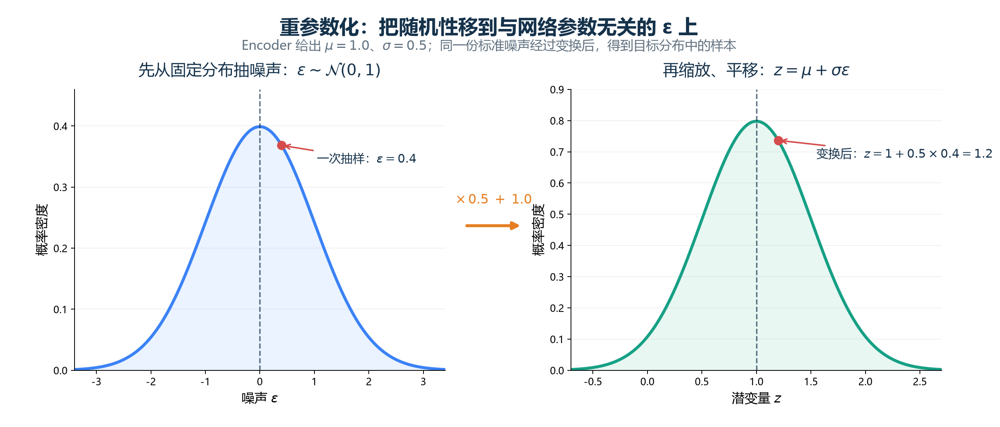
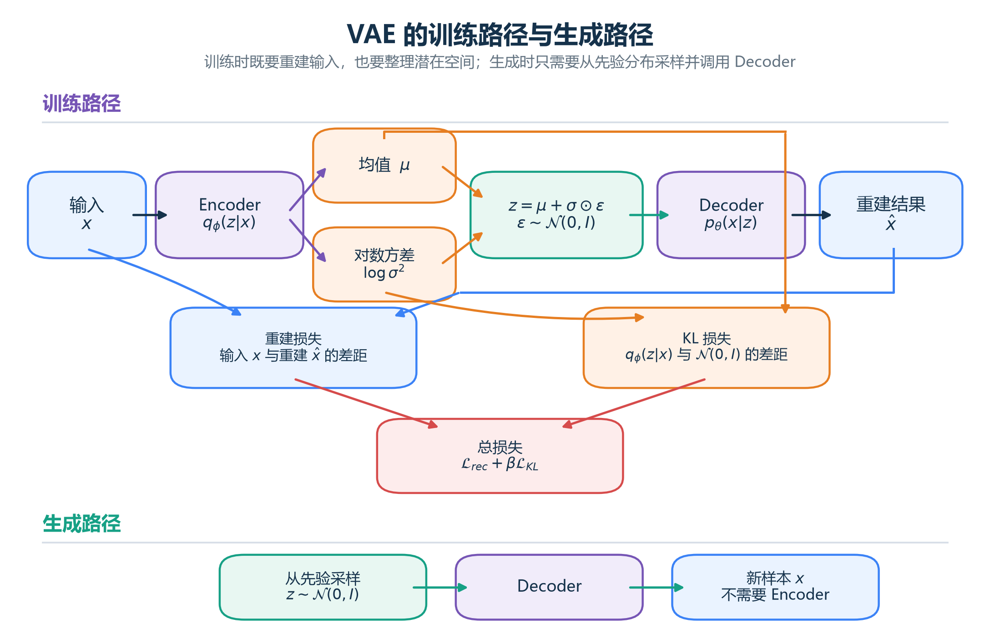

# [AI进阶-生成模型]2.变分自编码器与概率生成

普通自编码器能把输入压成潜在表示，再从潜在表示重建输入，却没有规定“哪些潜在位置是合理的”。训练图片可能被编码到几块互相分离的区域，区域之间的空白点从未交给解码器训练。此时随便从潜在空间取一个 $z$，得到的结果可能合理，也可能完全异常。

变分自编码器（Variational Autoencoder，VAE）要解决的核心问题，就是让潜在变量具备明确的概率模型。训练完成后，我们不再需要先找一张真实图片才能得到 $z$，而是可以从一个已知的先验分布采样，再让解码器生成数据。

“变分”不是“方差”的另一种叫法。它来自**变分推断（variational inference）**：真实后验分布难以直接计算时，用一个可训练、可计算的分布去近似它。理解 VAE 不能只记住“编码器输出均值和方差”，还要弄清三件事：为什么需要后验近似、随机采样怎样参与反向传播，以及重建项和 KL 项为什么会同时出现。

## 一、普通自编码器缺少一条可靠的采样规则

普通自编码器学习两个确定性函数：

$$
z=E(x),
\qquad
\hat x=D(z).
$$

给定同一个输入 $x$，编码器通常产生同一个 $z$。训练只要求 $D(E(x))$ 接近 $x$，没有要求全部潜在空间都连续、密集，也没有要求编码总体服从某个方便采样的分布。

这会带来两个不同需求：

1. **重建**：已有一张图片，怎样把它编码再还原？普通自编码器可以完成。
2. **生成**：没有输入图片，怎样主动得到一个合理的 $z$，再生成新图片？普通自编码器没有统一答案。

上一篇用潜在空间空白区域说明了这个问题。VAE 的做法不是简单地给普通 code 加一点噪声，而是从一开始就建立一个含潜在随机变量的生成模型，并让训练阶段使用的潜在分布尽量靠近生成阶段准备采样的先验分布。

## 二、VAE 先定义“数据是怎样生成的”

VAE 的生成故事可以分成两步：

1. 从先验分布抽潜在变量 $z$；
2. 根据 $z$ 产生数据 $x$。

最常见的先验是标准多元正态分布：

$$
p(z)=\mathcal N(0,I).
$$

随后由参数为 $\theta$ 的解码器定义：

$$
p_{\theta}(x\mid z).
$$

联合分布因此是：

$$
p_{\theta}(x,z)=p(z)p_{\theta}(x\mid z).
$$

这些符号的含义是：

- $z\in\mathbb R^D$ 是 $D$ 维潜在变量；
- $p(z)$ 是生成前使用的先验，通常不依赖具体输入；
- $p_{\theta}(x\mid z)$ 是给定潜在变量后，数据 $x$ 的条件分布；
- $\theta$ 是解码器参数；
- $p_{\theta}(x,z)$ 描述“先抽 $z$，再生成 $x$”的完整概率。

### 2.1 解码器输出的严格含义

在普通自编码器里，我们常说 Decoder 直接输出重建图片。概率模型中更准确的说法是：解码器输出 $p_{\theta}(x\mid z)$ 的参数。

若把连续数据建模为固定方差高斯分布，可以写成：

$$
p_{\theta}(x\mid z)
=\mathcal N\bigl(x;f_{\theta}(z),\sigma_x^2I\bigr).
$$

$f_{\theta}(z)$ 是解码器给出的均值图像，$\sigma_x^2$ 表示围绕均值允许的输出噪声。实际展示重建时，常直接把均值 $f_{\theta}(z)$ 当作输出。

若每个维度被建模为 Bernoulli 事件，解码器会输出对应概率参数。选择不同的输出分布，就会得到不同的重建负对数似然；MSE 和二元交叉熵并不是凭习惯随便替换的按钮，它们隐含了不同的数据假设。

## 三、生成方向容易，反过来推断 $z$ 很难

如果已经有 $z$，解码器可以计算 $p_{\theta}(x\mid z)$。但训练数据只给了 $x$，我们还需要回答：

> 看到这张图片以后，它可能由哪些 $z$ 生成？

真正想要的是后验分布：

$$
p_{\theta}(z\mid x)
=\frac{p_{\theta}(x\mid z)p(z)}{p_{\theta}(x)}.
$$

分母是边缘似然：

$$
p_{\theta}(x)
=\int p_{\theta}(x\mid z)p(z)\,dz.
$$

这项积分需要考虑连续潜在空间中所有可能的 $z$。解码器是复杂神经网络时，通常无法对它得到方便的解析解，逐点穷举也不现实。

VAE 因此增加一个参数为 $\phi$ 的编码器，定义容易采样和计算的近似后验：

$$
q_{\phi}(z\mid x)
\approx
p_{\theta}(z\mid x).
$$

这里的 $q$ 不是随便选的噪声分布。它是编码器根据当前输入预测出来的分布，用来近似“生成模型认为哪些潜在变量可能产生这条数据”。同一个输入通过同一组编码器参数，就能迅速得到后验近似，这称为**摊销推断（amortized inference）**：不再为每个样本单独运行一套迭代优化，而是让一个网络学会统一推断。

## 四、编码器不输出一个点，而是输出一组分布参数

标准高斯 VAE 常假设近似后验是对角高斯：

$$
q_{\phi}(z\mid x)
=\mathcal N\bigl(z;\mu_{\phi}(x),
\operatorname{diag}(\sigma_{\phi}^2(x))\bigr).
$$

编码器对每个输入输出两个 $D$ 维向量：

$$
\mu=\mu_{\phi}(x)\in\mathbb R^D,
$$

$$
\sigma=\sigma_{\phi}(x)\in\mathbb R_{>0}^D.
$$

$\mu$ 决定这条数据在潜在空间中的中心，$\sigma$ 决定每一维允许多大范围的不确定性。对角协方差表示在这个近似分布中，各潜在维度在给定 $x$ 后被假定条件独立；它计算方便，却不表示真实后验一定没有维度相关性。

### 4.1 为什么实现常输出 `logvar`

标准差必须为正，直接让神经网络自由输出 $\sigma$ 可能得到负值。实现中常输出：

$$
\text{logvar}=\log\sigma^2.
$$

再计算：

$$
\sigma=\exp\left(\frac{1}{2}\text{logvar}\right).
$$

指数函数保证 $\sigma>0$，而 `logvar` 可以在整个实数范围内变化。它还会让高斯 KL 的公式更方便计算。`logvar` 不是方差本身，也不是标准差；三者之间必须通过上式转换。

## 五、从分布中取样：$\epsilon$ 到底是什么

编码器给出 $\mu$ 和 $\sigma$ 后，需要从 $q_{\phi}(z\mid x)$ 取得一个具体 $z$ 交给解码器。VAE 使用：

$$
\epsilon\sim\mathcal N(0,I),
$$

$$
z=\mu+\sigma\odot\epsilon.
$$

$\odot$ 是逐元素乘法。$\epsilon$ 不是编码器输出，不是模型参数，也不是某张训练图片固定拥有的编号；每次前向传播都可以重新从标准正态分布采样。

这个式子的操作顺序是：

1. $\epsilon$ 提供标准随机偏移；
2. 乘 $\sigma$ 调整每一维偏移尺度；
3. 加 $\mu$ 把分布中心移动到当前样本的位置。

因此，若：

$$
\epsilon\sim\mathcal N(0,1),
$$

则：

$$
\mu+\sigma\epsilon
\sim\mathcal N(\mu,\sigma^2).
$$

图中先从与网络参数无关的标准正态分布抽 $\epsilon$，再由编码器输出的 $\sigma$ 和 $\mu$ 完成缩放、平移。随机性仍然存在，但参数只出现在可微的乘法和加法中。

### 5.1 用一个数计算重参数化

假设编码器对一张图片的某个潜在维度输出：

$$
\mu=1.0,
\qquad
\sigma=0.5.
$$

本次从标准正态分布抽到：

$$
\epsilon=0.4.
$$

那么：

$$
z=1.0+0.5\times0.4=1.2.
$$

若下一次抽到 $\epsilon=-1.0$，同一输入会得到：

$$
z=1.0+0.5\times(-1.0)=0.5.
$$

两个结果都围绕中心 1.0 变化，$\sigma=0.5$ 控制波动尺度。若 $\sigma$ 变大，采样区域更宽；若接近 0，$z$ 几乎固定为 $\mu$，模型趋向普通确定性自编码器。

## 六、为什么不直接写 $z\sim\mathcal N(\mu,\sigma^2)$

从数学分布看，直接采样和重参数化得到的 $z$ 分布相同。区别出现在反向传播。

若把采样写成一个依赖参数的黑盒：

$$
z\sim q_{\phi}(z\mid x),
$$

随机抽样操作挡在编码器与重建损失之间，难以直接用普通路径导数说明“稍微改变 $\mu$ 或 $\sigma$，这次输出会怎样变化”。

重参数化把随机源移到独立变量 $\epsilon$：

$$
z=g_{\phi}(x,\epsilon)
=\mu_{\phi}(x)+\sigma_{\phi}(x)\odot\epsilon.
$$

给定本次抽到的 $\epsilon$ 后，$z$ 对 $\mu$ 和 $\sigma$ 都是普通可微函数：

$$
\frac{\partial z}{\partial\mu}=1,
\qquad
\frac{\partial z}{\partial\sigma}=\epsilon.
$$

解码器的重建梯度便能通过 $z$ 传给 $\mu$、$\sigma$，再传回编码器参数 $\phi$。这就是重参数化技巧的真正作用：它没有删除随机性，而是把随机性与需要学习的参数分开，使随机样本上的损失可以用反向传播优化。

## 七、只加入采样噪声，模型会选择最容易的退路

假设训练目标只有重建误差。对每个输入，编码器希望解码器收到尽量稳定、准确的 code。最简单的做法就是让：

$$
\sigma(x)\rightarrow0.
$$

此时：

$$
z=\mu(x)+0\cdot\epsilon=\mu(x),
$$

随机性消失，VAE 退回近似普通自编码器。不同样本的 $\mu(x)$ 也可能被随意推到潜在空间各处，生成阶段从标准正态分布抽出的 $z$ 仍可能落在解码器没见过的位置。

所以 VAE 还需要第二个目标：让每个样本的近似后验 $q_{\phi}(z\mid x)$ 不要离统一先验 $p(z)=\mathcal N(0,I)$ 太远。这个目标使用 KL 散度。

## 八、KL 散度衡量“用错分布会付出多少代价”

离散分布的 KL 散度定义为：

$$
D_{\mathrm{KL}}(Q\|P)
=\sum_z Q(z)\log\frac{Q(z)}{P(z)}.
$$

它用 $Q$ 下事件出现的概率加权，衡量用 $P$ 代替 $Q$ 时的差异。它满足：

$$
D_{\mathrm{KL}}(Q\|P)\ge0,
$$

只有两个分布在相关位置一致时才为 0。KL 通常不对称：

$$
D_{\mathrm{KL}}(Q\|P)
\neq
D_{\mathrm{KL}}(P\|Q).
$$

### 8.1 用两个事件算一次

设近似后验对两个潜在状态的概率是：

$$
Q=[0.5,0.5],
$$

先验认为它们的概率是：

$$
P=[0.9,0.1].
$$

则：

$$
D_{\mathrm{KL}}(Q\|P)
=0.5\log\frac{0.5}{0.9}
+0.5\log\frac{0.5}{0.1}
\approx0.511.
$$

差异来自第二个状态：$Q$ 认为它有一半概率，$P$ 却只给 0.1。KL 把这种“近似后验经常使用、先验却认为很少发生”的区域惩罚得较重。

在 VAE 中使用：

$$
D_{\mathrm{KL}}
\left(q_{\phi}(z\mid x)\|p(z)\right).
$$

它鼓励训练时编码器使用的潜在区域与生成时采样的先验相容。它确实具有正则化效果，但主要职责不是泛泛地“防止过拟合”，而是连接推断分布与生成先验。

## 九、对角高斯 KL 为什么能直接计算

当：

$$
q_{\phi}(z\mid x)
=\mathcal N(\mu,\operatorname{diag}(\sigma^2)),
$$

$$
p(z)=\mathcal N(0,I),
$$

KL 有闭式表达：

$$
D_{\mathrm{KL}}(q\|p)
=\frac12\sum_{j=1}^{D}
\left(
\mu_j^2+sigma_j^2-1-\log\sigma_j^2
\right).
$$

若网络输出 $\text{logvar}_j=\log\sigma_j^2$，则常写成：

$$
D_{\mathrm{KL}}(q\|p)
=\frac12\sum_{j=1}^{D}
\left(
\mu_j^2+exp(\text{logvar}_j)-1-\text{logvar}_j
\right).
$$

逐项理解：

- $\mu_j^2$ 惩罚分布中心远离 0；
- $\sigma_j^2-1-\log\sigma_j^2$ 惩罚方差远离 1；
- 当 $\mu_j=0$、$\sigma_j=1$ 时，该维 KL 为 0；
- 对所有潜在维相加，得到当前样本的分布代价。

### 9.1 把前面的数字代入 KL

继续使用：

$$
\mu=1.0,
\qquad
\sigma=0.5,
\qquad
\sigma^2=0.25.
$$

这一维的 KL 为：

$$
\begin{aligned}
D_{\mathrm{KL}}
&=\frac12
\left(1.0^2+0.5^2-1-\log0.5^2\right)\\
&=\frac12(1+0.25-1-\log0.25)\\
&\approx\frac12(1.636)\\
&\approx0.818.
\end{aligned}
$$

如果只把 $\sigma$ 压向 0，$-\log\sigma^2$ 会迅速变大；如果把 $\mu$ 推得很远，$\mu^2$ 会变大。因此 KL 同时阻止“方差完全消失”和“均值任意散开”。

要注意，优化 KL 是软约束。训练后所有编码分布不一定完美等于标准正态，潜在空间质量还受解码器、数据、损失权重和优化过程影响。

## 十、VAE 的损失不是凭经验拼出的两项

课程直觉常把 VAE 损失写成：

$$
\text{重建误差}+\text{KL 散度}.
$$

这个记法便于入门，但两项来自一个统一目标：最大化数据的对数边缘似然 $\log p_{\theta}(x)$。由于其中包含难算积分，VAE 改为最大化它的证据下界（Evidence Lower Bound，ELBO）：

$$
\mathcal L_{\text{ELBO}}(x)
=\mathbb E_{q_{\phi}(z\mid x)}
\left[\log p_{\theta}(x\mid z)\right]
-D_{\mathrm{KL}}
\left(q_{\phi}(z\mid x)\|p(z)\right).
$$

它之所以叫下界，是因为：

$$
\log p_{\theta}(x)
=\mathcal L_{\text{ELBO}}(x)
+D_{\mathrm{KL}}
\left(q_{\phi}(z\mid x)\|p_{\theta}(z\mid x)\right).
$$

右侧第二项非负，所以：

$$
\mathcal L_{\text{ELBO}}(x)
\le
\log p_{\theta}(x).
$$

最大化 ELBO 同时做两件事：提高模型对数据的解释能力，并让近似后验接近先验。若 $q_{\phi}(z\mid x)$ 也接近真实后验 $p_{\theta}(z\mid x)$，下界与真实对数似然之间的间隙会缩小。

### 10.1 训练代码为什么写成最小化“负 ELBO”

优化器通常最小化损失，因此把 ELBO 取负：

$$
\mathcal J(x)
=-\mathbb E_{q_{\phi}(z\mid x)}
[\log p_{\theta}(x\mid z)]
+D_{\mathrm{KL}}(q_{\phi}(z\mid x)\|p(z)).
$$

第一项是重建负对数似然，第二项是潜在分布约束。若使用固定方差高斯输出，第一项在忽略常数和固定缩放后与平方误差对应；因此代码里常看到 MSE 加 KL。它不是说所有 VAE 都必须使用 MSE，而是当前似然假设得到这种形式。

### 10.2 为什么重建与 KL 会互相拉扯

重建项希望每个输入拥有足够独特的 $z$，让解码器知道怎样还原细节。KL 项则希望各个 $q(z\mid x)$ 不要离共同先验太远。如果 KL 太弱，潜在空间可能重新出现分离和空洞；如果 KL 太强，编码器可能丢掉大量输入信息，重建结果变差。

这个矛盾不是训练失败，而是 VAE 的率失真权衡：潜在变量传递越多关于 $x$ 的信息，越容易重建；分布约束越强，越容易从统一先验采样，却可能牺牲细节。

## 十一、训练、重建和生成使用的路径不同

### 11.1 训练

训练一个 batch 时依次执行：

1. 输入 $x$；
2. Encoder 输出 $\mu$ 和 `logvar`；
3. 采样 $\epsilon\sim\mathcal N(0,I)$；
4. 计算 $z=\mu+\sigma\odot\epsilon$；
5. Decoder 根据 $z$ 输出 $p_{\theta}(x\mid z)$ 的参数；
6. 计算重建负对数似然和 KL；
7. 对两项之和反向传播，同时更新 Encoder 与 Decoder。

图中的两条损失路径解决不同问题：重建项比较输入与解码输出，KL 项直接读取编码器的 $\mu$ 和 `logvar`。GMM 不在这条训练数据流中。

### 11.2 重建已知输入

要重建某条已知数据，仍需要 Encoder：

$$
x\rightarrow q_{\phi}(z\mid x)\rightarrow z
\rightarrow p_{\theta}(x\mid z).
$$

可以随机采一个 $z$，观察后验不确定性；也可以使用 $z=\mu(x)$ 得到较稳定的代表性重建。使用均值会减少随机波动，但它是推理选择，不改变训练目标。

### 11.3 生成新数据

生成时不需要输入 $x$，也不需要 Encoder：

$$
z\sim p(z)=\mathcal N(0,I),
$$

$$
x\sim p_{\theta}(x\mid z).
$$

若解码器输出高斯均值，可以直接展示均值图像，也可以再从输出分布采样。潜在采样与输出采样是两个不同随机层次：前者决定生成内容的大体潜在状态，后者表示给定 $z$ 后的数据噪声模型。

### 11.4 潜在插值

对两条数据得到潜在中心 $z_A$、$z_B$ 后，可以计算：

$$
z(\alpha)=(1-\alpha)z_A+\alpha z_B,
\qquad \alpha\in[0,1].
$$

逐步改变 $\alpha$，再把每个 $z(\alpha)$ 交给 Decoder，可观察生成结果如何从 A 过渡到 B。VAE 的分布约束通常让这种插值比普通自编码器更有机会经过合理区域，但不保证每条直线都具有清晰语义。

## 十二、VAE 和高斯混合模型是什么关系

课程使用高斯混合模型（Gaussian Mixture Model，GMM）帮助理解“可观察数据背后存在隐藏变量”。这个类比有价值，但标准 VAE 内部并没有一个必须先训练好的 GMM。

### 12.1 GMM 使用离散隐藏来源

GMM 可以写成：

$$
p(x)=\sum_{k=1}^{K}\pi_k
\mathcal N(x;\mu_k,\Sigma_k).
$$

生成过程是：先按 $\pi_k$ 选择第 $k$ 个高斯，再从该高斯产生 $x$。隐藏变量 $k$ 是离散编号，模型显式学习有限个成分的权重、均值和协方差。

例如一维数据集中在 1 和 5 附近，$K=2$ 的 GMM 可能学到两个均值：

$$
\mu_1\approx1,
\qquad
\mu_2\approx5.
$$

EM 算法会在“估计每个样本属于哪个成分”和“更新成分参数”之间迭代。这属于 GMM 自己的训练问题。

### 12.2 VAE 使用连续隐藏变量

VAE 的边缘分布是：

$$
p_{\theta}(x)
=\int p(z)p_{\theta}(x\mid z)\,dz.
$$

$z$ 通常是连续向量，Decoder 根据不同 $z$ 动态产生条件分布参数。可以把两者对照为：

| GMM | 标准 VAE |
|---|---|
| 离散隐藏变量 $k$ | 连续隐藏变量 $z$ |
| 有限个显式高斯成分 | 连续多个由 Decoder 定义的条件分布 |
| $p(x\mid k)$ 有简单解析形式 | $p_{\theta}(x\mid z)$ 由神经网络参数化 |
| 常用 EM 推断与训练 | 使用近似后验、ELBO 和梯度下降 |

因此学习标准 VAE 不要求先学会用 EM 训练 GMM。真正需要掌握的是先验、近似后验、重参数化、Decoder likelihood 和 ELBO。

也存在使用高斯混合先验的 VAE 变体，但那是额外设计，不能反过来说所有 VAE 都包含 GMM。

## 十三、$\beta$-VAE 怎样改变两项之间的力量

标准负 ELBO 中 KL 的系数为 1。$\beta$-VAE 使用：

$$
\mathcal J_{\beta}
=\mathcal L_{\text{rec}}
+\beta D_{\mathrm{KL}}(q_{\phi}(z\mid x)\|p(z)).
$$

- $\beta>1$ 加强潜在分布约束，限制 $z$ 携带的信息容量，有时能促使潜在维形成更独立的变化因素；
- $\beta<1$ 更重视重建，潜在空间可能保存更多输入细节，却更偏离先验；
- $\beta=1$ 对应标准 ELBO 的相对形式，但实际代码中还要注意重建项按像素求和还是平均，否则两项数值尺度会改变。

$\beta$ 不是越大越好。若 KL 权重太强，Encoder 为了接近先验会让不同输入产生相似分布，Decoder 得不到足够信息，重建质量下降。原始 $\beta$-VAE 工作把它用于控制表示容量和探索解耦，但后续使用仍需用任务指标验证，不能仅凭潜在遍历图判断表示已经获得人类语义。[β-VAE 原论文](https://www.matthey.me/publication/beta_vae/)

## 十四、后验坍塌：Decoder 完全不使用 $z$

VAE 的一个典型失败是**后验坍塌（posterior collapse）**：

$$
q_{\phi}(z\mid x)\approx p(z).
$$

此时不同输入的近似后验都接近同一个先验，KL 几乎为 0，$z$ 携带的输入信息很少。若 Decoder 很强，例如它本身是自回归语言模型，就可能仅凭已经生成的局部内容预测下一步，不必读取 $z$。

表面上看，KL 很小似乎说明正则化做得很好；实际上，如果目标是让 $z$ 表示全局内容，这意味着编码通道被忽略。判断时要同时检查：

- KL 是否长期接近 0；
- 改变 $z$ 是否会影响输出；
- Decoder 能否在随机打乱或移除 $z$ 后仍得到相似结果；
- 潜在表示在下游任务中是否包含信息。

常见缓解思路包括逐步增加 KL 权重、为每一维设置一定的 free bits、削弱 Decoder 的捷径、改变训练日程或使用更有表达力的后验。不过这些方法没有统一保证，需要结合数据和结构验证。强 Decoder 导致潜变量被忽略，是 VAE 序列模型中反复研究的问题。[后验坍塌问题的现代研究示例](https://doi.org/10.1016/j.neucom.2023.127103)

## 十五、VAE 为什么可能生成得比较模糊

基础图像 VAE 经常使用像素级独立高斯或 Bernoulli likelihood。当多个细节都合理时，逐像素均值可能把它们平均在一起。例如边缘可能位于左一像素或右一像素，均值图像会把两个位置都画淡，看起来就像模糊。

这不是“加入 KL 必然模糊”的唯一原因，也不是所有 VAE 都会模糊。输出分布假设、Decoder 结构、潜在容量、重建损失和数据复杂度都会影响结果。可以使用更合适的 likelihood、层级潜变量、自回归 Decoder、感知特征损失或与其他生成目标结合改善视觉质量。

若目标只比较主观图像锐度，现代扩散模型、GAN 或自回归生成模型在许多高保真图像任务中更常见。但 VAE 仍有独特价值：它提供显式的推断网络和结构化潜变量，便于表示学习、插值、条件生成、缺失数据建模、科学数据分析和其他潜变量模型扩展。

## 十六、VAE 中最容易混淆的五组对象

| 容易混淆的对象 | 正确区别 |
|---|---|
| $p(z)$ 与 $q(z\mid x)$ | 前者是生成时使用的先验；后者是 Encoder 根据输入得到的近似后验 |
| $p(z\mid x)$ 与 $q(z\mid x)$ | 前者是真实模型后验，通常难算；后者是用网络近似的可计算分布 |
| $\epsilon$ 与 $z$ | $\epsilon$ 是标准噪声；$z$ 是经过 $\mu$、$\sigma$ 变换后送入 Decoder 的潜变量 |
| $\sigma$ 与 `logvar` | $\sigma$ 是标准差；`logvar` 是 $\log\sigma^2$ |
| 重建误差与 KL | 前者要求保留输入信息；后者让近似后验与生成先验相容 |

还要再强调一次：标准 VAE 没有显式维护一组 GMM 高斯成分，$\epsilon$ 也不是模型学出的参数。训练阶段需要 Encoder 推断 $q(z\mid x)$，纯生成阶段只从 $p(z)$ 采样并使用 Decoder。

## 十七、VAE 今天应当怎样定位

VAE 的基础机制没有过时。重参数化梯度、摊销变分推断和 ELBO 已经成为现代概率深度学习的重要工具，原始论文解决的也不只是“生成一张手写数字”，而是怎样用神经网络高效训练连续潜变量模型。[Auto-Encoding Variational Bayes 原论文](https://arxiv.org/abs/1312.6114)

具体到生成应用，基础单层高斯 VAE 已经不是所有任务的默认最佳模型。它的简单先验、对角后验和像素 likelihood 都可能限制表达能力；高保真图像生成通常采用更强的生成模型或把 VAE 作为其中的潜在编码组件。判断是否使用 VAE，可以看任务是否真正需要：

- 为每个输入得到一个可计算的潜在分布；
- 在潜在空间插值、编辑或表达不确定性；
- 建立含隐变量的概率生成过程；
- 对缺失数据、多模态数据或科学数据进行概率推断；
- 把高维输入压到适合后续生成模型处理的连续潜在空间。

如果只需要一个确定性低维特征，普通自编码器或其他表示模型可能更直接；如果只追求开放域图像的最高视觉质量，基础 VAE 往往不够。VAE 最值得保留的认知，是它把 Encoder 从“压缩函数”提升为近似推断网络，把 Decoder 从“还原函数”提升为生成分布，并用 ELBO 把二者放进同一个概率目标中训练。

## 参考资料

- Kingma, Welling. [Auto-Encoding Variational Bayes](https://arxiv.org/abs/1312.6114), 2013/2014。
- Kingma, Welling. [An Introduction to Variational Autoencoders](https://arxiv.org/abs/1906.02691), 2019。
- Higgins et al. [β-VAE: Learning Basic Visual Concepts with a Constrained Variational Framework](https://www.matthey.me/publication/beta_vae/), 2017。
- Yang. [Training Latent Variable Models with Auto-encoding Variational Bayes: A Tutorial](https://arxiv.org/abs/2208.07818), 2022。
