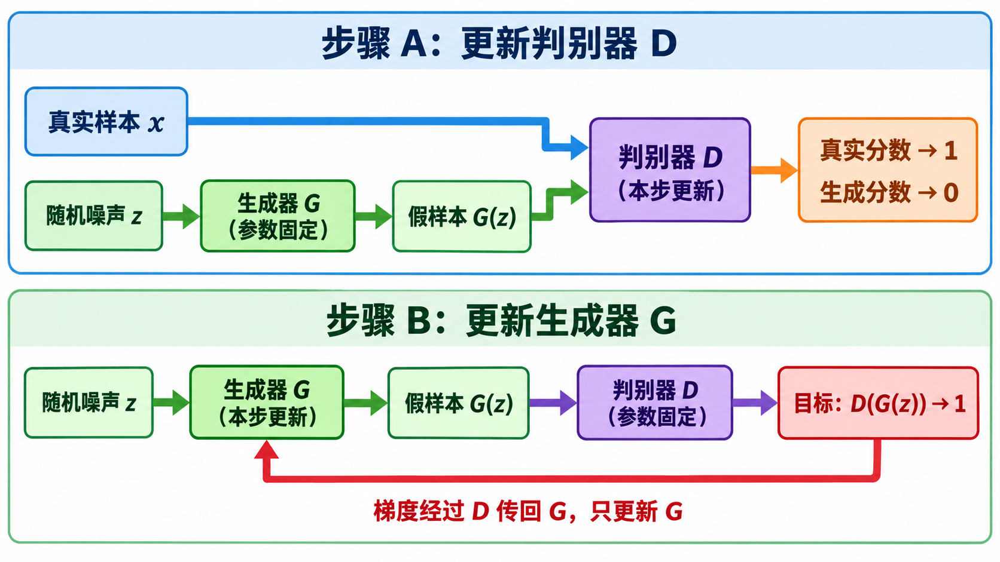
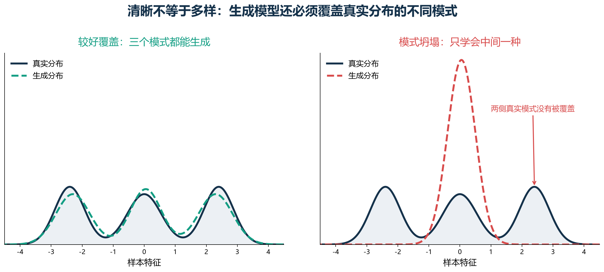
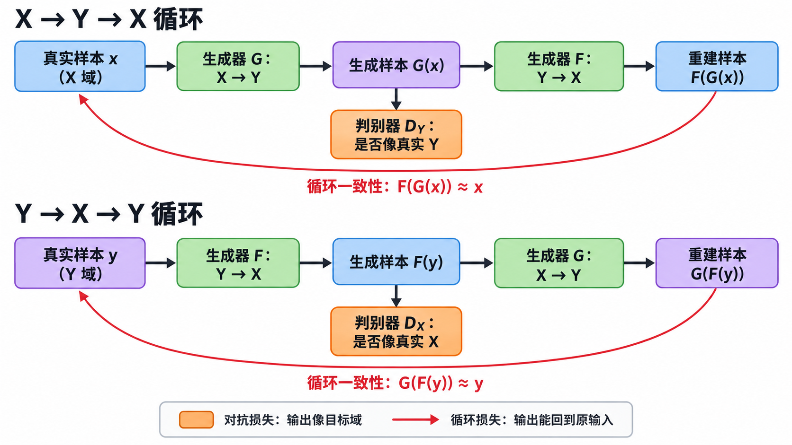

# [AI进阶-生成模型]3.生成对抗网络、条件生成与 CycleGAN

普通监督学习有明确答案：输入一张猫图，目标就是“猫”；输入一段语音，目标就是对应文字。图像生成却很难准备这样的答案。给定一串随机数，并不存在唯一一张“它应该生成的图片”。如果强行用逐像素误差要求生成结果接近某张训练图，模型容易学到平均结果，却没有真正学会什么样的图片看起来真实。

生成对抗网络（Generative Adversarial Network，GAN）换了一种训练方式：生成器负责造样本，判别器负责检查样本像不像真实数据。生成器不再直接面对一张标准答案，而是从判别器那里得到“哪里还不像真的”这一训练信号。这个想法使 GAN 能生成锐利图像，也带来了两个目标同时变化、训练容易失衡的问题。

这一篇先把经典 GAN 的数据流、损失和交替训练讲清，再讨论 WGAN、谱归一化和生成评价，最后进入可控生成、Pix2Pix 与 CycleGAN。VAE 如何建立可采样的潜变量分布已经在前一篇展开；这里关注的是另一条路线：**用一个正在学习的判别器定义生成质量。**

## 一、GAN 解决的是“没有唯一标准答案”的生成问题

假设训练集中有许多人脸。我们希望输入随机向量 $z$，让网络生成一张新的人脸：

$$
z\sim p_z(z),
\qquad
\hat x=G_\theta(z).
$$

$z$ 是从简单分布中抽出的随机噪声，常见形状是 `[B,d_z]`；$B$ 是批量大小，$d_z$ 是噪声维数。$G_\theta$ 是参数为 $\theta$ 的生成器，输出 $\hat x$。若生成彩色图片，输出形状可以是 `[B,3,H,W]`。

同一个 $z$ 总会经过确定的网络得到同一个结果，但每次抽到的 $z$ 不同，所以生成器能产生不同样本。所有噪声经过 $G$ 后形成生成分布 $p_g$。训练的目标不是让某一张 $G(z)$ 对准某一张训练图，而是让整批生成样本的分布接近真实数据分布 $p_{\text{data}}$。

这和自编码器、VAE 的输入输出关系不同：

| 模型 | 输入 | 主要训练信号 | 生成时怎样得到样本 |
|---|---|---|---|
| 自编码器 | 真实样本 $x$ | 重建 $x$ | 普通自编码器通常没有可靠的随机采样规则 |
| VAE | 真实样本 $x$ | 重建项与 KL 项 | 从先验 $p(z)$ 采样，再送入 Decoder |
| GAN | 噪声 $z$，或条件与噪声 | 判别器给出的真假信号 | 从 $p_z$ 采样，再送入 Generator |

GAN 没有 Encoder，也不要求显式计算 $p_g(x)$ 的概率密度。它只要求生成器能够把简单噪声映射成样本，并让判别器逐渐难以区分这些样本和真实数据。

## 二、生成器和判别器分别在做什么

经典 GAN 有两个网络：

- **生成器 $G$**：接收噪声 $z$，输出假样本 $G(z)$。
- **判别器 $D$**：接收真实或生成样本，输出“来自真实数据”的概率。

若判别器最后使用 Sigmoid，则：

$$
D(x)\in(0,1).
$$

$D(x)$ 越接近 1，表示判别器越相信 $x$ 是真实样本；越接近 0，表示它越相信 $x$ 是生成样本。训练时有两条数据路径：

$$
x\sim p_{\text{data}}
\longrightarrow D(x),
$$

$$
z\sim p_z
\longrightarrow G(z)
\longrightarrow D(G(z)).
$$

判别器希望把第一条路径判为真、第二条判为假；生成器则希望第二条路径最终也被判为真。这里的“对抗”不是两个网络互相传递相反梯度，而是它们对同一个生成样本有相反目标。

训练必须分成两步。更新判别器时，生成器只负责提供假样本，其参数不更新；更新生成器时，判别器参与前向传播和梯度计算，但判别器参数保持不变。若两个优化器在同一次反向传播里随意更新，两个目标会混在一起，训练含义也会改变。

## 三、先用一小批分数看懂判别器损失

把判别器看成二分类器，它面对真实样本时的标签为 1，面对生成样本时的标签为 0。经典目标要求判别器最大化：

$$
\mathbb E_{x\sim p_{\text{data}}}[\log D(x)]
+
\mathbb E_{z\sim p_z}[\log(1-D(G(z)))].
$$

深度学习框架通常最小化损失，所以实现时常写成相反数：

$$
\mathcal L_D
=
-\mathbb E_x[\log D(x)]
-\mathbb E_z[\log(1-D(G(z)))].
$$

第一项处罚“把真的说成假”，第二项处罚“把假的说成真”。考虑一个只有两张真实图和两张假图的小批量：

$$
D(x_1)=0.9,\qquad D(x_2)=0.8,
$$

$$
D(G(z_1))=0.3,\qquad D(G(z_2))=0.2.
$$

此时真实部分为：

$$
\mathcal L_{D,\text{real}}
=-\frac{\log0.9+\log0.8}{2}
\approx0.164.
$$

生成部分为：

$$
\mathcal L_{D,\text{fake}}
=-\frac{\log(1-0.3)+\log(1-0.2)}{2}
\approx0.290.
$$

总和约为 $0.454$。数值较小，是因为判别器对这四个样本都判断得比较正确。若它把某张假图判断为 $0.95$，对应处罚会变成 $-\log(0.05)\approx2.996$，这一张错误样本就会产生很大的损失。

这些数值只说明当前批次上判别器是否完成分类任务。判别器损失很低不等于整个 GAN 很好：它也可能说明判别器远强于生成器，生成器已经拿不到合适的学习信号。

## 四、生成器怎样通过判别器收到梯度

生成器希望 $D(G(z))$ 接近 1。经典论文的极小极大写法让生成器最小化：

$$
\mathcal L_G^{\text{minimax}}
=
\mathbb E_z[\log(1-D(G(z)))].
$$

但在训练早期，生成图往往很差，判别器很容易给出接近 0 的分数。此时上式经过 Sigmoid 后可能提供很弱的梯度。实际训练更常使用**非饱和生成器损失**：

$$
\mathcal L_G
=
-\mathbb E_z[\log D(G(z))].
$$

它直接把生成样本的目标标签设为 1。仍看两张假图，若判别器给出 $0.3$ 和 $0.2$：

$$
\mathcal L_G
=-\frac{\log0.3+\log0.2}{2}
\approx1.407.
$$

这个损失较大，表示生成器距离“骗过判别器”还很远。若训练后分数变为 $0.8$ 和 $0.7$：

$$
\mathcal L_G
=-\frac{\log0.8+\log0.7}{2}
\approx0.290.
$$

生成器获得的梯度路径是：

$$
\mathcal L_G
\rightarrow D(G(z))
\rightarrow G(z)
\rightarrow \theta_G.
$$

判别器在这一步相当于一个可微的质量检查器。它的参数不更新，但梯度必须穿过它的运算传回生成器。若把 $D(G(z))$ 从计算图中截断，生成器就不知道应该怎样改变输出。

## 五、极小极大目标描述了一个不断变化的双人博弈

把两边写在一起，就得到经典 GAN 目标：

$$
\min_G\max_D V(D,G),
$$

$$
V(D,G)
=
\mathbb E_{x\sim p_{\text{data}}}[\log D(x)]
+
\mathbb E_{z\sim p_z}[\log(1-D(G(z)))].
$$

固定生成器后，判别器在每个位置的理论最优解是：

$$
D^*(x)
=
\frac{p_{\text{data}}(x)}
{p_{\text{data}}(x)+p_g(x)}.
$$

这个式子可以直接读：若某个区域只出现真实样本，分子与分母几乎相同，$D^*(x)$ 接近 1；若只出现生成样本，分子接近 0；若两个分布在该处密度相同，$D^*(x)=0.5$。

把最优判别器代回目标后，生成器优化与 Jensen–Shannon（JS）散度相关。理想状态是：

$$
p_g=p_{\text{data}},
\qquad
D^*(x)=\frac12.
$$

判别器输出一半并不自动证明训练成功。还需要排除另一种情况：判别器结构太弱或根本没有学会分类。实际检查时要同时观察生成样本、多样性、独立评价指标和训练动态，不能只看到 $D(x)\approx0.5$ 就宣布收敛。

## 六、一次完整训练迭代究竟更新了谁

设一批真实图片形状为 `[B,3,H,W]`，噪声为 `[B,d_z]`。一次典型迭代包含以下步骤。

### 6.1 更新判别器

先计算真实分数：

$$
s_{\text{real}}=D(x).
$$

再生成假图，并在判别器步骤中把它当成固定数据：

$$
\hat x=G(z),
\qquad
s_{\text{fake}}=D(\hat x).
$$

判别器损失同时要求 $s_{\text{real}}$ 高、$s_{\text{fake}}$ 低。反向传播后只执行判别器优化器，生成器不更新。

### 6.2 更新生成器

重新取噪声或继续使用合适的噪声，再计算：

$$
\hat x=G(z),
\qquad
s=D(\hat x),
\qquad
\mathcal L_G=-\frac1B\sum_{i=1}^{B}\log s_i.
$$

这一次把标签理解成“希望判别器说真”，反向传播后只更新生成器。判别器需要参与求导路径，却不执行参数更新。

判别器更新次数、两边学习率、网络容量和正则化都会改变博弈节奏。这里没有一个固定标签函数永远站在终点等生成器；生成器每进步一步，判别器看到的负样本分布也会变化。这正是 GAN 比普通分类器更难调试的根本原因。

## 七、模式坍塌：生成器找到一种骗分办法后不愿再探索

真实数据通常有多个模式。例如数字数据包含 0 到 9，人脸数据包含不同姿态、发型和光照。如果生成器只会输出其中少数几类，即使单张图片很清晰，也没有学到完整分布。这叫**模式坍塌（mode collapse）**。

假设真实数据有三个聚集区域，生成器发现中间那一类暂时最容易骗过判别器。许多不同噪声便可能被映射到相似输出：

$$
z_1,z_2,z_3,z_4
\longrightarrow
G(z_1)\approx G(z_2)\approx G(z_3)\approx G(z_4).
$$

这不是网络真的“忘记了随机数”，而是当前损失只奖励骗过判别器，并没有直接要求每个 $z$ 对应不同语义。判别器稍后可能识破这种重复，生成器又转向另一个模式，于是训练会振荡。

检查模式坍塌不能只挑几张最好看的样本。应固定一批噪声观察随训练的变化，大量随机采样检查类别和属性覆盖，还可以比较样本间特征距离、类别直方图或召回类指标。一个模型能生成一张惊艳图片，不代表它能覆盖真实数据的变化范围。

## 八、为什么经典 GAN 会出现梯度不稳定

训练早期，真实样本和生成样本可能位于两个几乎不重叠的区域。判别器很快就能画出清晰边界，并对真实样本给出接近 1、对假样本给出接近 0 的结果。分类准确率很高，生成器却未必得到“应该朝哪个方向移动”的平滑信号。

除此之外，还有几种常见失衡：

- 判别器过强，生成器梯度很弱或剧烈变化；
- 判别器过弱，给出的质量方向不可靠；
- 两边更新速度不同，一个网络一直追不上另一个；
- 小批量统计噪声使对抗目标不断摆动；
- 生成器只覆盖少量模式，判别器随后反制，形成循环振荡。

所以 GAN 损失曲线不像普通回归那样适合用“持续下降”判断成功。生成器变好后，判别器任务也会变难；判别器变好后，生成器损失又可能上升。需要联合观察样本质量、覆盖范围、评价指标以及梯度和分数是否异常。

## 九、WGAN 用“搬运距离”改善远距离分布的训练信号

Wasserstein GAN（WGAN）把“真假概率分类器”换成输出实数分数的 **critic**。它关心的 Wasserstein-1 距离可以用搬土来理解：真实分布是一堆土的目标位置，生成分布是土的当前位置，距离表示把土搬成目标形状所需的最小平均代价。

考虑最简单的一维例子。真实样本集中在 $x=4$，生成样本集中在 $x=0$，每份质量都为 1。把生成分布搬到真实分布，最少要移动 4 个单位，因此 Wasserstein 距离是 4。若生成器把位置从 0 移到 1，距离会连续降为 3。即使两个分布仍完全不重叠，生成器也能知道“向右移动是进步”。

WGAN 的 critic 目标常写成：

$$
\max_D
\mathbb E_{x\sim p_{\text{data}}}[D(x)]
-
\mathbb E_{z\sim p_z}[D(G(z))].
$$

生成器则尽量提高假样本分数：

$$
\mathcal L_G^{\text{WGAN}}
=
-\mathbb E_z[D(G(z))].
$$

这里 $D(x)$ 不再是 0 到 1 的概率，不需要用 0.5 解释结果。它只是一把比较真实与生成样本的尺子。为使这把尺子对应 Wasserstein 距离，critic 必须满足 Lipschitz 约束，直觉是输入稍微变化时输出不能突然暴涨。

原始 WGAN 使用权重裁剪，做法简单但可能限制网络表达。WGAN-GP 改为惩罚输入梯度范数偏离 1，通常比直接裁剪更自然：

$$
\mathcal L_{\text{GP}}
=
\lambda
\mathbb E_{\hat x}
\left(\|\nabla_{\hat x}D(\hat x)\|_2-1\right)^2.
$$

$\hat x$ 常取真实样本与生成样本之间的插值点。若梯度范数为 1.4，$\lambda=10$，这一点的处罚就是 $10(1.4-1)^2=1.6$；若梯度范数回到 1，处罚变为 0。

WGAN 改善了许多训练问题，但不是“换一个损失就永不坍塌”。网络结构、数据量、优化设置和正则化仍然重要。

## 十、谱归一化限制每层把变化放大的程度

谱归一化（spectral normalization）从权重矩阵入手。对线性层：

$$
y=Wx,
$$

矩阵最大的奇异值 $\sigma_{\max}(W)$ 描述这一层最多能把输入距离放大多少倍。谱归一化使用：

$$
\bar W=\frac{W}{\sigma_{\max}(W)}.
$$

如果某层的最大奇异值是 5，那么两个很接近的输入在最坏方向上可能被放大约 5 倍。除以 5 后，该层在这个意义下最多放大约 1 倍。判别器对输入的变化更平滑，给生成器的梯度也更容易控制。

它和批归一化解决的问题不同。批归一化主要规范一批激活值的统计量；谱归一化直接约束权重算子的放大能力。两者不能因为名字里都有“归一化”就互相替代。

谱归一化最初就是为稳定 GAN 判别器提出的，计算成本相对低，后来也被用于需要控制网络 Lipschitz 性质的其他任务。它是一种有用工具，不意味着任何 GAN 只加这一层处理就会稳定。

## 十一、生成模型要同时评价质量、多样性和是否复制训练集

生成器可能产生高清但重复的图片，也可能覆盖很多类别但每张都模糊。单一的“真假准确率”无法区分这些情况，因此生成评价至少包含三件事：

1. **单张质量**：样本是否清晰、结构是否合理。
2. **分布覆盖**：不同类别、姿态和属性是否都能生成。
3. **新颖性**：是否只是复制训练图片。

Inception Score（IS）根据预训练分类器的类别分布评价单张确定性与总体类别多样性。它不直接读取真实数据分布，对领域和分类器较敏感。若生成的不是 ImageNet 风格自然图，分类器特征未必代表真正需要的质量。

Fréchet Inception Distance（FID）先把真实图与生成图映射到 Inception 特征空间，再用均值和协方差近似两个特征分布。公式为：

$$
\operatorname{FID}
=
\|\mu_r-\mu_g\|_2^2
+
\operatorname{Tr}
\left(
\Sigma_r+\Sigma_g
-2(\Sigma_r\Sigma_g)^{1/2}
\right).
$$

$\mu_r,\Sigma_r$ 是真实图特征的均值与协方差，$\mu_g,\Sigma_g$ 是生成图对应统计量。均值项衡量整体中心是否接近，协方差项衡量变化方向和范围是否接近；FID 越低通常越好。

以一维近似为例，真实特征均值为 5、标准差为 2，生成特征均值为 6、标准差为 1。在一维时：

$$
\operatorname{FID}
=(5-6)^2+(2-1)^2=2.
$$

其中 1 来自中心偏移，另一个 1 来自变化范围不足。这个小例子说明 FID 不只看平均图像，还会处罚分布过窄。

FID 仍不是万能裁判。它受样本数、预处理、特征网络和实现细节影响，也不直接证明模型没有记住训练集。严谨比较需要统一图像尺寸、归一化、样本数量和实现，并辅以最近邻检查、精确率/召回率、人类评价及任务指标。

## 十二、条件 GAN 让生成结果遵守输入要求

无条件 GAN 只输入噪声：

$$
\hat y=G(z).
$$

如果希望指定类别、文字、草图或另一张图，就把条件 $c$ 一起交给生成器：

$$
\hat y=G(z,c).
$$

仅让生成器看到条件还不够。假设条件是“红眼睛”，生成器输出一张逼真的蓝眼睛人物。如果判别器只看图片，它仍可能给高分。于是生成器会发现忽略条件也能通过检查。

条件判别器应接收样本和条件：

$$
D(y,c).
$$

它既判断图片本身是否真实，也判断图片是否与条件匹配。训练时可包含三类组合：

| 输入判别器的组合 | 目标 | 教会判别器什么 |
|---|---:|---|
| 真实图片 + 正确条件 | 真 | 真实且匹配的组合应得高分 |
| 生成图片 + 使用的条件 | 假 | 找出生成痕迹或不合理关系 |
| 真实图片 + 错误条件 | 假 | 不能只看图片，必须检查条件 |

“错配负例”很关键。没有它时，判别器可能完全忽略条件，只学会图片真假。条件可以拼接到输入、映射成嵌入后与特征融合，或通过投影判别器等结构参与评分；无论结构怎样变化，核心问题都相同：评分函数必须对“是否匹配”敏感。

## 十三、Pix2Pix 用成对样本学习图像到图像转换

Pix2Pix 处理的是有成对监督的图像转换。训练集中每个输入 $x$ 都有对应目标 $y$，例如：

- 建筑标签图与同一场景的街景照片；
- 物体边缘图与同一物体的照片；
- 灰度图与同一张图的彩色版本。

生成器学习：

$$
\hat y=G(x,z),
$$

判别器检查成对输入：

$$
D(x,y)
\quad\text{或}\quad
D(x,G(x,z)).
$$

Pix2Pix 把条件对抗损失与 L1 重建损失结合：

$$
\mathcal L_G
=
\mathcal L_{\text{cGAN}}(G,D)
+
\lambda\mathbb E_{x,y,z}
[\|y-G(x,z)\|_1].
$$

L1 项回答“输出内容是否与这张输入的标准答案对应”，对抗项回答“局部纹理和整体观感是否像真实目标域”。只使用 L1 时，多种合理细节容易被平均，结果可能平滑；只使用对抗项时，图片可以很像目标域，却可能改变本应保留的结构。

举一个像素级简化例子。目标局部为 $y=[0.2,0.8,0.9]$，生成结果为 $[0.3,0.6,0.9]$，平均 L1 误差为：

$$
\frac{|0.2-0.3|+|0.8-0.6|+|0.9-0.9|}{3}=0.1.
$$

它能告诉模型哪几个位置偏离目标，却不能判断这三个数是否组成自然纹理；判别器补上的是学习到的“像不像真实图”的标准。

经典 Pix2Pix 使用 U-Net 生成器以保留输入空间结构，并使用 PatchGAN 判别器对图像局部块给分。PatchGAN 更关注局部高频纹理，但最终感受野、生成器结构和任务数据会共同决定结果，不能把它理解成只会看孤立小块。

## 十四、没有成对数据时，仅靠目标域判别器会忽略输入

现在把任务改成真人照片 $X$ 到二次元图像 $Y$。手中只有一批真人照片和另一批二次元图片，没有“同一个人的两种版本”。因此不能计算 $G(x)$ 与标准答案 $y$ 的逐像素 L1，因为这个 $y$ 根本不存在。

最直接的想法是训练：

$$
G:X\rightarrow Y,
$$

并让 $D_Y$ 判断 $G(x)$ 是否像真实的 $Y$。问题是，$D_Y$ 只负责检查输出属于目标域，并不知道输入是谁。$G$ 完全可以无视输入，反复输出几张容易骗过 $D_Y$ 的二次元图。

需要增加一个约束：输出不仅要像 $Y$，还必须保留足够信息，使它能回到原来的 $x$。CycleGAN 正是从这里引入反向映射和循环一致性。

## 十五、CycleGAN 用两个方向构成闭环

CycleGAN 同时训练两个生成器：

$$
G:X\rightarrow Y,
\qquad
F:Y\rightarrow X.
$$

还需要两个判别器：

$$
D_Y:\text{判断样本是否像真实 }Y,
$$

$$
D_X:\text{判断样本是否像真实 }X.
$$

从 $X$ 出发的路径是：

$$
x\xrightarrow{G}\hat y=G(x)
\xrightarrow{F}\tilde x=F(G(x)).
$$

$D_Y$ 要求中间结果 $\hat y$ 像目标域 $Y$，循环损失要求最终结果 $\tilde x$ 接近原输入 $x$。从 $Y$ 出发还有对称路径：

$$
y\xrightarrow{F}\hat x=F(y)
\xrightarrow{G}\tilde y=G(F(y)).
$$

两条循环损失合在一起：

$$
\mathcal L_{\text{cyc}}(G,F)
=
\mathbb E_{x\sim p_X}
[\|F(G(x))-x\|_1]
+
\mathbb E_{y\sim p_Y}
[\|G(F(y))-y\|_1].
$$

若输入 $x$ 的三个简化特征是 `[发色=0.2, 眼镜=1, 姿态=0.7]`，经过两个生成器回来得到 `[0.3,0.9,0.7]`，L1 循环误差是：

$$
|0.3-0.2|+|0.9-1|+|0.7-0.7|=0.2.
$$

它推动两个映射保留能重建这些特征的信息。这里不要求 $G(x)$ 对准某一张指定的二次元图片，只要求它像二次元域，并且没有把原输入的信息丢到无法恢复。

## 十六、CycleGAN 的总目标中，每一项负责不同问题

CycleGAN 的核心目标可以写成：

$$
\mathcal L(G,F,D_X,D_Y)
=
\mathcal L_{\text{GAN}}(G,D_Y,X,Y)
+
\mathcal L_{\text{GAN}}(F,D_X,Y,X)
+
\lambda_{\text{cyc}}\mathcal L_{\text{cyc}}(G,F).
$$

三部分不能互相代替：

| 目标 | 约束对象 | 缺少时可能发生什么 |
|---|---|---|
| $X\rightarrow Y$ 对抗损失 | $G(x)$ 要像真实 $Y$ | 输出保留输入，却不像目标域 |
| $Y\rightarrow X$ 对抗损失 | $F(y)$ 要像真实 $X$ | 反向结果不像源域，闭环质量差 |
| 循环一致性 | 转过去再回来要还原 | 生成器忽略输入，只输出容易骗分的目标域样本 |

一些实现还使用身份损失（identity loss）。把本来就在 $Y$ 域的样本送入 $G$，希望它不要做无意义修改：

$$
\mathcal L_{\text{id}}
=
\mathbb E_{y\sim p_Y}[\|G(y)-y\|_1]
+
\mathbb E_{x\sim p_X}[\|F(x)-x\|_1].
$$

它在颜色保持等任务中可能有帮助，但不是所有 CycleGAN 任务都必须使用。权重太强也会让生成器不愿进行必要转换。

## 十七、循环一致性不能严格保证语义正确

循环一致性只要求信息能够恢复，没有规定信息必须用人类看得懂的方式保留。理论上，$G$ 可能在输出中藏入细小纹理，$F$ 再从这些纹理恢复原图。这样循环误差很低，表面转换却未必保持正确语义。

它也无法解决目标域之间的结构歧义。若从马变成斑马，主要变化是纹理，CycleGAN 比较适合；若从室内布局转换成完全不同的城市街景，输入和输出的几何关系不明确，循环约束可能迫使模型保留不该保留的结构，或学出任意对应关系。

因此 CycleGAN 更适合以下情况：

- 两个域共享大致空间结构，差异主要是纹理、颜色或外观；
- 没有逐样本配对，但两个域都有足够覆盖的数据；
- 任务允许一对多关系被简化为较确定的映射；
- 可以通过人工检查或任务指标验证内容是否真的保留。

对医疗影像、遥感和其他高风险场景，输出“看起来像目标域”远远不够。对抗模型可能添加、删除或伪造细节，必须使用结构约束、配对验证或下游任务评价来确认信息没有被篡改。

## 十八、Pix2Pix、CycleGAN 与经典神经风格迁移的边界

三者都能改变图像外观，但训练条件和目标不同：

| 方法 | 是否需要成对数据 | 被优化的对象 | 主要约束 |
|---|---:|---|---|
| 经典神经风格迁移 | 一张内容图与一张风格图即可 | 当前生成图像的像素 | 内容特征与 Gram 风格统计 |
| Pix2Pix | 需要输入—目标配对 | 一个可复用生成器 | 条件对抗损失 + 配对重建损失 |
| CycleGAN | 不需要逐样本配对 | 两个方向的生成器 | 双向对抗损失 + 循环一致性 |

经典神经风格迁移的内容特征、Gram 矩阵和逐图优化已经在 `[AI应用-计算机视觉]4.人脸表征、度量学习与神经风格迁移.md` 中展开。这里使用那部分知识时只需抓住差别：经典方法用固定特征网络定义“内容与风格”，CycleGAN 则从两个数据域中学习转换规则，并用判别器判断输出是否属于目标域。

## 十九、为什么 GAN 不再是文本生成的主流路线

图像像素是连续值，判别器对生成图的梯度能沿像素传回生成器。文本生成通常需要从词表分布中选择离散 token：

$$
t=\arg\max_i p_i
\quad\text{或}\quad
t\sim\operatorname{Categorical}(p).
$$

选择结果对概率的小变化并不连续。例如最高概率从 0.51 变成 0.52，输出 token 仍相同；判别器看到的句子没有变化，普通反向传播无法穿过这次离散选择。历史上曾使用策略梯度、Gumbel-Softmax 或连续近似绕过问题，但训练方差和稳定性都很棘手。

今天的大规模文本生成主要采用自回归最大似然预训练：给定前文预测下一个 token。它为每个位置提供直接监督信号，训练规模化程度远高于经典文本 GAN。对抗训练仍会出现在偏好优化、风格约束或分布匹配研究中，但“用一个句子判别器从零训练文本生成 GAN”已经不是通用语言模型的默认方案。

所以课程里的文字 GAN 应保留为一个重要概念：它清楚展示了连续输出与离散采样对梯度传播的影响；不应把它当成当前训练大型语言模型的标准流程。

## 二十、GAN 今天仍然适合什么，不适合什么

在开放域文生图和大范围多模态生成中，扩散模型已经成为常见主线，因为训练通常更稳定，条件控制和规模扩展也更成熟。基础 GAN 因此不再是所有生成任务的默认首选。但“GAN 已经过时”同样不准确。

GAN 仍具有几项实际优势：一次前向传播即可生成结果、延迟低、输出锐利，而且对抗损失可以作为一种学习式质量约束。它仍常见于超分辨率、图像修复、特定领域合成、图像到图像转换、轻量实时生成，以及与重建、感知或扩散目标组合的系统。StyleGAN 一类工作也说明，精心设计的 GAN 在人脸等受控领域仍能提供很强的质量和潜变量编辑能力。

选择模型时可以按问题判断：

- 需要极低推理延迟，并且任务域较固定，可以认真评估 GAN；
- 有成对图像转换数据，可把 Pix2Pix 类对抗损失与监督损失作为候选；
- 只有两个非配对域且结构相近，可把 CycleGAN 当作经典基线，但要检查语义篡改；
- 需要开放域文本生成，不应默认从经典 GAN 开始；
- 需要高覆盖、高稳定性的大规模开放域图像生成，应同时比较扩散或自回归路线；
- 数据少而判别器很容易记住训练集时，要特别防范过拟合与虚假训练信号。

真正长期有效的知识并不是“哪种模型永远最好”，而是三条判断：生成器怎样获得质量信号，训练目标是否覆盖任务真正关心的约束，以及评价是否同时检查质量、多样性和数据记忆。

## 二十一、把整套机制串起来

经典 GAN 从噪声开始，生成器把噪声变成样本，判别器用真实数据学出一个可微的真假标准。训练时先让判别器分清真假，再固定判别器，用它的梯度改进生成器。这个动态博弈可能造成梯度不稳和模式坍塌，WGAN、梯度惩罚和谱归一化分别从距离与平滑约束角度改善信号。

需要控制结果时，把条件同时交给生成器和判别器。拥有成对输入输出时，Pix2Pix 用配对重建损失守住内容，用条件对抗损失提高真实感；没有成对数据时，CycleGAN 再引入反向生成器，通过“转过去还能回来”限制模型不要完全忽略输入。循环一致性能够提供约束，却不能证明语义绝对正确，因此最后仍要回到数据和任务评价。

## 参考资料

- Goodfellow et al. [Generative Adversarial Networks](https://arxiv.org/abs/1406.2661), 2014。
- Mirza, Osindero. [Conditional Generative Adversarial Nets](https://arxiv.org/abs/1411.1784), 2014。
- Arjovsky, Chintala, Bottou. [Wasserstein GAN](https://arxiv.org/abs/1701.07875), 2017。
- Gulrajani et al. [Improved Training of Wasserstein GANs](https://arxiv.org/abs/1704.00028), 2017。
- Miyato et al. [Spectral Normalization for Generative Adversarial Networks](https://arxiv.org/abs/1802.05957), 2018。
- Heusel et al. [GANs Trained by a Two Time-Scale Update Rule Converge to a Local Nash Equilibrium](https://arxiv.org/abs/1706.08500), 2017。该论文提出 FID。
- Isola et al. [Image-to-Image Translation with Conditional Adversarial Networks](https://arxiv.org/abs/1611.07004), 2017。
- Zhu et al. [Unpaired Image-to-Image Translation using Cycle-Consistent Adversarial Networks](https://arxiv.org/abs/1703.10593), 2017。
- Karras et al. [Alias-Free Generative Adversarial Networks](https://arxiv.org/abs/2106.12423), 2021。
- Rombach et al. [High-Resolution Image Synthesis with Latent Diffusion Models](https://arxiv.org/abs/2112.10752), 2022。
