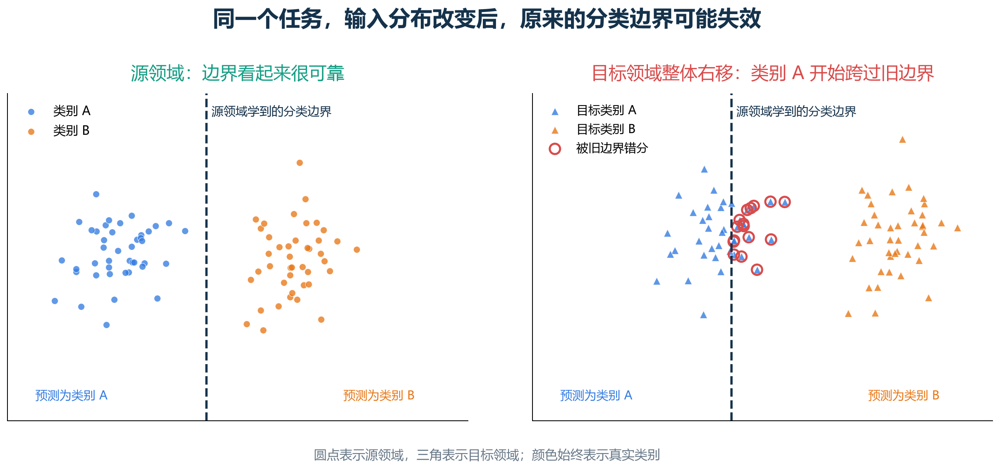
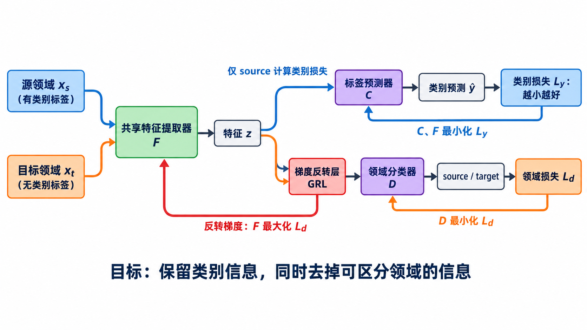
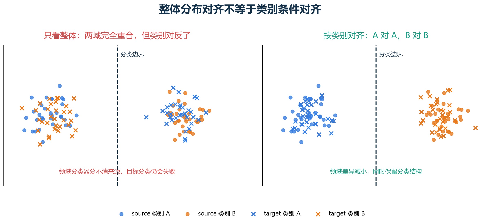

# [AI进阶-迁移学习]1.领域偏移、领域适应与 DANN

一个模型在验证集上达到 95% 准确率，部署到另一台相机后却只剩 70%，不一定是网络突然失效。更常见的原因是：训练集和真实使用环境已经不是同一种数据。训练图片来自摄影棚，部署图片来自室外；训练语音来自安静麦克风，实际语音混有街道噪声；训练病历来自一家医院，测试病历来自另一套设备和人群。标签任务可能没有改变，输入的统计规律却变了。

这种训练环境与使用环境之间的差异叫**领域偏移（domain shift）**。如果训练阶段能拿到目标环境的一批数据，即使它们没有标签，也可以尝试让模型适应该环境，这类方法称为**领域适应（domain adaptation）**。

这一篇先把“什么发生了变化”分清，再重点解释经典的领域对抗神经网络 DANN。DANN 的价值在于，它把“保留类别信息、去掉领域信息”变成一套可以反向传播的结构；它的限制也很典型：两个领域整体混在一起，不代表相同类别真的对齐。后半篇会继续讨论条件对齐、熵最小化、伪标签、一致性正则化、测试时适应和领域泛化。

## 一、先用相机变化理解 source domain 和 target domain

假设要识别流水线上的零件类型。现有训练集由旧相机拍摄，图片清晰、光照稳定，并且每张图都有类别标签。新工厂换了一台相机，色温、镜头畸变和背景都不同，但暂时没有人力重新标注。

此时：

- **源领域（source domain）**是旧相机数据，记为 $\mathcal D_s=\{(x_i^s,y_i^s)\}$；
- **目标领域（target domain）**是新相机数据，记为 $\mathcal D_t=\{x_j^t\}$；
- $x$ 是输入图像，$y$ 是零件类别；
- 上标 $s$ 和 $t$ 分别表示 source 与 target，并不是指数。

源领域提供“怎样区分类别”的监督信息，目标领域虽然没有标签，却能展示新环境中的亮度、颜色、纹理和噪声分布。无监督领域适应（unsupervised domain adaptation，UDA）的典型设定就是：

$$
\mathcal D_s=\{(x_i^s,y_i^s)\}_{i=1}^{n_s},
\qquad
\mathcal D_t=\{x_j^t\}_{j=1}^{n_t}.
$$

这里的“无监督”只表示目标域没有标签，源领域仍有监督标签。它和完全没有任何标签的无监督学习不是同一个概念。

若目标域已有足量标签，最直接的做法通常是用这些数据训练或微调；若只有很少标签，则属于半监督领域适应或少样本微调。DANN 最经典的使用情形，是目标域样本不少但没有目标标签。

## 二、领域偏移不只是“图片颜色变了”

训练和测试联合分布不同时，可以写成：

$$
p_s(x,y)\neq p_t(x,y).
$$

这个总表达式还不够，因为变化发生在哪里，会决定哪些方法可能有效。

### 2.1 输入分布或协变量发生变化

最常讨论的情况是：

$$
p_s(x)\neq p_t(x),
\qquad
p_s(y\mid x)\approx p_t(y\mid x).
$$

输入外观发生变化，但从输入判断类别的真实规律大致不变。例如同一种零件被不同相机拍摄，或同一个数字由黑白背景变成彩色背景。领域适应通常希望去掉相机和风格差异，保留形状等任务信息。

### 2.2 标签比例发生变化

标签偏移（label shift）关注：

$$
p_s(y)\neq p_t(y).
$$

例如训练集中三种故障各占三分之一，部署时 90% 都是正常零件。即便每一类的外观规律相似，类别先验改变也会影响决策阈值。单纯让两个域的全部特征混合，可能把真实的类别比例差异误认为需要消除的领域差异。

### 2.3 输入与标签的关系发生变化

更困难的是概念或条件关系变化：

$$
p_s(y\mid x)\neq p_t(y\mid x).
$$

例如源领域用“温度超过 80℃”定义过热，目标工厂因材料不同改成 70℃。这时旧分类规则本身已经不再正确。没有目标标签时，仅凭目标输入通常无法知道标签规则怎样改变，普通 UDA 也无法凭空解决。

这些分类是帮助分析的理想化假设，现实项目往往同时发生多种变化。使用领域适应前，首先要问的是：两个领域是否仍共享同一个任务和标签含义。若答案是否定的，强行对齐可能比不适应更糟。

## 三、领域偏移为什么会让一个高分模型失效

神经网络会利用训练数据中最容易降低损失的规律，不会自动区分“真正因果特征”和“环境巧合”。假设源数据中类别 A 总在蓝色背景、类别 B 总在黄色背景。模型可能主要看背景颜色，而不是物体形状。

源领域验证集若沿用同样背景关系，准确率仍会很高。目标域换成灰色背景后，这条捷径消失，原分类边界便可能失败。这解释了为什么普通随机划分有时会高估部署效果：训练集和验证集都来自同一个采集流程，它们没有模拟真正的环境变化。

领域适应也不能代替正确的数据划分。项目开始时仍应按照时间、设备、地点或用户来源建立独立测试集，并把目标域评价与源域评价分开。否则模型可能只是更好地拟合已知目标数据，却无法证明它能应对新的偏移。

## 四、领域适应与普通迁移学习有什么不同

普通迁移学习通常从一个预训练模型开始，再使用**有标签的新任务数据**训练分类头或微调整个网络。它回答的是：已有表示怎样帮助新的有标签任务。

领域适应更强调：源域和目标域做的是相同或高度相关的任务，但目标域标签稀缺。它要利用目标域的无标签输入，减少环境差异对模型的影响。

| 场景 | 已有信息 | 常见起点 |
|---|---|---|
| 目标域标签充足 | $x_t,y_t$ 都有 | 直接训练或完整微调 |
| 目标域只有少量标签 | 少量 $(x_t,y_t)$ | 预训练模型 + 小学习率微调、正则化 |
| 目标域无标签但有许多输入 | 只有 $x_t$ | UDA：对齐、自训练、一致性等 |
| 训练时完全看不到目标域 | 没有 $x_t$ | 领域泛化 |
| 模型部署后才看到连续目标样本 | 在线或批量 $x_t$ | 测试时适应 |

预训练和领域适应并不冲突。现代项目经常先选一个强预训练骨干，再判断目标域是否仍有明显性能缺口，最后才加入适应方法。DANN 可以接在预训练特征提取器上，不要求所有参数从随机值开始。

## 五、没有目标标签，模型还能从目标数据学到什么

目标域没有 $y_t$，所以不能直接计算目标分类交叉熵。但目标输入仍能回答一个问题：**目标域的特征分布长什么样？**

把分类网络拆成两部分：

$$
z=F(x),
\qquad
\hat y=C(z).
$$

$F$ 是特征提取器，$z$ 是特征向量，$C$ 是标签预测器。批量图片 `[B,3,H,W]` 经过 $F$ 后可能得到 `[B,d]` 的特征，再由 $C$ 输出 `[B,K]` 的类别 logits，其中 $K$ 是类别数。

源域标签训练 $C(F(x_s))$ 正确分类。目标域无标签不能直接训练类别，但可以观察 $F(x_t)$ 是否和 $F(x_s)$ 有明显区别。如果仅凭特征就能轻易判断一张图来自旧相机还是新相机，说明特征仍携带强烈的领域信息。

DANN 的做法是增加一个“领域检查员”，迫使 $F$ 隐藏这些领域线索。

## 六、DANN 的三个模块各自承担什么任务

DANN 是 Domain-Adversarial Neural Network，即领域对抗神经网络。它由三个模块组成：

1. **特征提取器 $F$**：把源域和目标域输入变成特征 $z$；
2. **标签预测器 $C$**：根据源域特征预测任务类别；
3. **领域分类器 $D$**：判断特征来自源域还是目标域。

源域样本同时走两条分支：标签分支利用真实类别计算任务损失，领域分支利用“source”标记计算领域损失。目标域样本没有类别标签，只走领域分支，并用“target”作为领域标记。

这三个模块的目标并不一致：

- $C$ 希望源域类别预测正确；
- $D$ 希望准确区分 source 与 target；
- $F$ 既要帮助 $C$ 分类，又要让 $D$ 无法区分两个领域。

如果最终特征保留了“零件形状”，却减少了“由哪台相机拍摄”的线索，那么源域学到的分类器更有机会用于目标域。

## 七、标签损失只使用有标签的源领域

设源域一个批量为 $(x_s,y_s)$，先计算：

$$
z_s=F(x_s),
\qquad
\hat y_s=C(z_s).
$$

若任务是 $K$ 类分类，标签损失为：

$$
\mathcal L_y
=
-\frac1{B_s}
\sum_{i=1}^{B_s}
\log p(y_i^s\mid x_i^s).
$$

这一项就是分类交叉熵。假设两张源域图片的正确类别概率分别为 0.8 和 0.5：

$$
\mathcal L_y
=-\frac{\log0.8+\log0.5}{2}
\approx0.458.
$$

它的梯度同时更新标签预测器 $C$ 和特征提取器 $F$。目标域没有真实类别，因此不能把模型自己的预测偷偷当成真实标签直接放进这一项；若后面使用伪标签，必须明确筛选置信度并处理错误传播风险。

## 八、领域损失把 source 和 target 当成二分类问题

给每个特征增加领域标签。例如规定 source 为 0，target 为 1：

$$
d_i=
\begin{cases}
0,&x_i\text{ 来自 source},\\
1,&x_i\text{ 来自 target}.
\end{cases}
$$

将两域特征送入领域分类器：

$$
\hat d_s=D(F(x_s)),
\qquad
\hat d_t=D(F(x_t)).
$$

领域交叉熵可以写成：

$$
\mathcal L_d
=
-\frac1{B_s+B_t}
\left[
\sum_{i=1}^{B_s}\log(1-\hat d_i^s)
+
\sum_{j=1}^{B_t}\log \hat d_j^t
\right].
$$

假设一张 source 的 target 概率为 0.2，一张 target 的 target 概率为 0.7，则：

$$
\mathcal L_d
=-\frac{\log(1-0.2)+\log0.7}{2}
\approx0.290.
$$

对领域分类器 $D$ 而言，这个损失越小越好，因为它说明领域判断正确。对特征提取器 $F$ 而言，方向恰好相反：若 $D$ 总能轻易分清领域，$F$ 就还没有去掉领域信息。

## 九、梯度反转层怎样让同一个损失产生相反目标

DANN 使用梯度反转层（Gradient Reversal Layer，GRL）连接特征提取器和领域分类器。前向传播时它什么也不改：

$$
R_\lambda(z)=z.
$$

反向传播时，它把领域分支传来的梯度乘以负数：

$$
\frac{\partial R_\lambda}{\partial z}
=-\lambda I.
$$

$\lambda\ge0$ 控制领域对抗强度，$I$ 表示不改变各维对应关系。这样，领域分类器仍沿着减小 $\mathcal L_d$ 的方向训练；同一份梯度传到特征提取器前却翻转方向，促使 $F$ 增大领域分类难度。

用一个二维梯度看得更清楚。假设分类分支传给特征提取器的梯度为：

$$
g_y=[0.4,-0.1],
$$

领域分支原本传来的梯度为：

$$
g_d=[0.3,0.2],
$$

并设 $\lambda=0.5$。经过 GRL 后，特征提取器收到：

$$
g_F
=g_y-\lambda g_d
=[0.4,-0.1]-0.5[0.3,0.2]
=[0.25,-0.2].
$$

第一维中，领域分支抵消了一部分分类梯度；第二维中，它让更新方向更偏向负方向。实际特征有许多维，含义不会这么直观，但计算规则相同。

从鞍点优化角度，DANN 可以写成：

$$
\min_{F,C}\max_D
\left(
\mathcal L_y(F,C)-\lambda\mathcal L_d(F,D)
\right).
$$

对 $F,C$ 最小化时，$F$ 希望标签损失小、领域损失大；对 $D$ 最大化括号内目标，等价于让 $D$ 自己的领域损失变小。GRL 让这套相反方向可以放在普通反向传播流程中实现。

## 十、为什么特征提取器不能把所有输入都变成同一个向量

如果只要求领域分类器分不清 source 和 target，最容易的办法确实是：

$$
F(x)=\mathbf 0
\quad\text{对所有 }x.
$$

此时 $D$ 只能猜测领域，但标签预测器也无法区分类别。源域标签损失 $\mathcal L_y$ 会明显增大，阻止这种完全坍塌。

DANN 要找的是一种折中表示：

$$
\text{保留与 }y\text{ 有关的信息，减少与领域 }d\text{ 有关的信息。}
$$

这也说明 $\lambda$ 不能只追求越大越好。若领域对抗远强于分类目标，$F$ 可能连任务信息一起删除；若 $\lambda$ 太小，特征仍带有明显领域痕迹。常见做法是在训练早期使用较小权重，随后逐渐增加，但具体日程需要通过独立验证和稳定性观察决定。

## 十一、DANN 与 GAN 相似，但训练对象并不相同

前一篇 GAN 中，生成器产生假样本，判别器区分真实与生成数据。DANN 借用了“一个模块试图骗过另一个分类器”的结构：

| GAN | DANN |
|---|---|
| 生成器 $G$ | 特征提取器 $F$ |
| 真假判别器 | 领域分类器 $D$ |
| 真实图与生成图 | source 特征与 target 特征 |
| 让生成样本像真实数据 | 让两域特征难以区分 |

DANN 不生成目标图像，也没有要求把旧相机照片翻译成新相机照片。它改变的是特征空间。标签预测器仍是必要组成，因为最终任务是分类，而不是让两个领域的外观看起来一样。

GAN 的判别器太强会影响生成器梯度；DANN 也有类似平衡问题。若领域分类器几乎随机，可能是特征已经对齐，也可能是它根本没有学会；若领域准确率接近 100%，说明领域信息明显，但盲目加强对抗也可能损伤类别特征。领域准确率只能和任务准确率、特征可视化及目标验证共同解读。

## 十二、整体分布对齐为什么可能把不同类别拉到一起

基础 DANN 主要希望边缘特征分布接近：

$$
p_s(z)\approx p_t(z),
\qquad z=F(x).
$$

分类真正关心的却是类条件分布：

$$
p_s(z\mid y=c)
\approx
p_t(z\mid y=c).
$$

设 source 中红类位于左侧、蓝类位于右侧，target 中两类位置发生旋转。只要求 target 整体云团覆盖 source 整体云团时，target 红类可能被拉到 source 蓝类附近。领域分类器会很难判断来源，领域目标看似成功，目标分类却变差。这种现象常称为负迁移（negative transfer）。

因此“source 和 target 在二维图上混在一起”不是充分证据。还要检查每类是否对齐、目标样本是否远离决策边界，以及不同类别比例和标签集合是否一致。

## 十三、条件对齐把类别预测也交给领域判别器

Conditional Domain Adversarial Network（CDAN）不只让领域分类器看特征 $z$，还让它结合类别预测 $p=C(z)$：

$$
D\bigl(z,p\bigr).
$$

直觉上，基础 DANN 只问“这条特征来自哪个领域”；条件对齐进一步问“在模型认为它属于某一类的前提下，这条特征来自哪个领域”。这样可以减少不同类别被粗暴混在一起的风险。

一种表达类别与特征交互的方法是外积：

$$
z\otimes p.
$$

若 $z=[2,1]$，类别概率 $p=[0.8,0.2]$，外积为：

$$
z\otimes p
=
\begin{bmatrix}
1.6&0.4\\
0.8&0.2
\end{bmatrix}.
$$

它把“特征的每一维”和“当前类别倾向”组合起来，使领域判别器能感知多模态类别结构。目标域预测若很不可靠，条件信息也可能误导对齐，因此 CDAN 还会结合预测不确定性调整样本权重。条件对齐改善的是 DANN 的一个具体弱点，不代表它在所有数据上自动有效。

## 十四、熵最小化让目标样本远离分类边界

对目标样本，模型输出类别概率 $p_1,\ldots,p_K$。预测熵为：

$$
H(p)=-\sum_{c=1}^{K}p_c\log p_c.
$$

若二分类预测为 `[0.5,0.5]`：

$$
H=-0.5\log0.5-0.5\log0.5\approx0.693.
$$

若预测为 `[0.95,0.05]`：

$$
H\approx
-0.95\log0.95-0.05\log0.05
\approx0.199.
$$

后者熵更低，表示模型更确定。熵最小化鼓励目标样本落到某一类别的高置信区域，而不是停在决策边界附近。DIRT-T 等工作把这种**低密度分隔假设**带入领域适应：合理的边界应穿过样本稀少区域，不应切开目标数据的密集簇。

但低熵不等于正确。模型可以非常自信地预测错误类别。如果初始模型在目标域偏差很大，直接最小化熵可能放大错误。它通常需要和较好的预训练、对齐、教师模型或其他稳定约束结合。

## 十五、伪标签和自训练开始利用目标域的类别结构

伪标签（pseudo-label）把模型对目标样本的高置信预测临时当作标签。例如三分类输出：

$$
p(y\mid x_t)=[0.03,0.92,0.05].
$$

若阈值设为 0.9，这个样本会得到伪标签 1，并参与分类训练。另一个输出 `[0.40,0.35,0.25]` 的样本低于阈值，暂时不使用。

基本循环是：

1. 用当前模型预测目标域；
2. 选出高置信样本并生成伪标签；
3. 同时使用源域真标签和目标域伪标签训练；
4. 随模型改善，重新更新伪标签。

它比纯整体对齐更直接地利用类别结构，但会遇到确认偏差：早期错误伪标签被当成真值后，模型可能越来越相信自己的错误。工程中常配合置信阈值、类别平衡、教师—学生模型、软标签和逐步扩充样本。

还要观察各类别伪标签数量。若 90% 的目标样本都被预测成同一类，仅看平均置信度会掩盖类别坍塌。

## 十六、一致性正则化利用“合理增强不应改变类别”

对同一目标样本制作两种保持语义的增强：

$$
x_t^{(w)}=a_w(x_t),
\qquad
x_t^{(s)}=a_s(x_t),
$$

其中 $a_w$ 是弱增强，$a_s$ 是强增强。模型在弱增强上得到可靠预测后，要求强增强也给出相近结果：

$$
\mathcal L_{\text{cons}}
=d\bigl(p(y\mid x_t^{(w)}),p(y\mid x_t^{(s)})\bigr).
$$

$d$ 可以是 KL 散度、均方误差或伪标签交叉熵。它告诉模型：裁剪、亮度扰动或轻微噪声不应改变零件类别。

增强必须符合任务。数字 6 旋转 180°可能变成 9，医学图像翻转也可能改变解剖含义；把会改变标签的变换当成“一致性”约束，会制造错误监督。领域适应方法无法替代对数据语义的理解。

## 十七、类别集合不相同时，强行整体对齐尤其危险

基础 DANN 通常默认 source 和 target 共享同一组类别。现实情况可能不同：

- **partial domain adaptation**：目标类别是源类别的子集；
- **open-set domain adaptation**：目标域包含源域从未见过的类别；
- **universal domain adaptation**：两边类别集合只有部分重合，关系事先未知。

假设源域有猫、狗、老虎，目标域只有狗。若让目标整体分布对齐整个源域，目标狗可能被拉向猫或老虎特征。若目标域还有“狐狸”这种源域未知类，普通分类头只能把它硬分进已知类别。

这时需要估计哪些类别可迁移、降低源域独有类别的权重，或增加未知类拒绝机制。发现标签集合不一致后，不应继续把标准 DANN 当成默认工具。

## 十八、source-free 领域适应解决源数据不能再次访问的问题

经典 UDA 训练适应模型时同时读取源数据和目标数据。但在医疗、隐私或商业系统中，部署团队可能只有训练好的源模型，无法取得原始源数据。

Source Hypothesis Transfer（SHOT）等 source-free domain adaptation 方法从源模型出发，只使用无标签目标数据进行适应。常见思路包括固定或谨慎更新已有分类头，用信息最大化、伪标签和目标特征聚类调整特征提取器。

source-free 不代表风险消失。没有源数据后更难监控源性能退化，也无法重新检查源域类别统计；伪标签错误和目标域过拟合仍可能发生。它解决的是数据访问约束，不是自动提高所有目标域表现。

## 十九、测试时训练与测试时适应解决的是更晚发生的变化

有时训练阶段并不知道具体目标域，直到部署后才看到新批次。这类问题通常放在测试时适应（test-time adaptation，TTA）下讨论。

Tent 是一个经典例子：测试时使用无标签目标数据最小化预测熵，并主要更新归一化相关参数。它不需要重新访问源数据，但依赖批次、归一化统计和更新策略。若测试样本高度相关、类别极不平衡或分布持续变化，盲目在线更新可能使模型漂移。

“测试时训练（test-time training）”有时特指训练阶段预先设计一个自监督辅助任务，测试时利用这个任务更新模型；“测试时适应”则是更宽的总称。不同论文用词并不总是完全统一，阅读时应看它是否需要源数据、是否修改模型参数、按单样本还是按批次更新，以及测试后是否重置参数。

生产系统还要考虑状态管理：若模型连续适应每一批数据，后续预测依赖之前看过什么；回滚、并发和异常批次都会变得更复杂。TTA 是一种部署策略，不只是多加一个损失函数。

## 二十、领域泛化在训练时完全看不到目标领域

领域泛化（domain generalization，DG）与领域适应的关键差别是：训练时是否能看到目标域输入。

$$
\text{DA：训练时可见无标签 }x_t,
$$

$$
\text{DG：训练时连 }x_t\text{ 也不可见。}
$$

DG 常利用多个源领域、强数据增强、风格随机化、鲁棒优化或不变表示，希望模型面对未知领域仍能工作。因为没有具体目标分布可对齐，它比针对某一目标域的 DA 更困难。

DomainBed 的系统比较提醒了一个重要工程事实：领域泛化算法若没有公平的模型选择和调参协议，容易把普通经验风险最小化基线低估。复杂方法必须与强预训练、合理增强和源域验证基线在同一设置下比较。

## 二十一、强预训练模型改变了领域适应的起点

DANN 诞生时，从有限源数据训练特征提取器很常见。如今视觉项目通常可以从 ImageNet 监督权重、CLIP、DINOv2 等大规模预训练表示开始。这些模型见过更丰富的数据与增强，往往已经具备一定跨域稳健性。

这不代表领域适应没有价值。专业影像、工业设备、遥感传感器和合成到真实等场景仍可能存在明显差距。变化在于实践顺序：

1. 先建立强预训练模型的 source-only 基线；
2. 用独立目标测试集确认差距是否真实存在；
3. 若有少量目标标签，先尝试受控微调；
4. 无标签目标数据充足时，再比较自训练、一致性、条件对齐或 DANN；
5. 部署后才遇到变化时，再评估 TTA 的状态与风险。

因此 DANN 今天更适合作为理解领域不变表示和对抗对齐的经典基线，而不是不经比较就采用的通用最优架构。预训练、自训练和测试时适应各自使用的信息不同，不能只按论文新旧决定选择。

## 二十二、实际项目中怎样判断适应是否真的有效

一个可靠的领域适应实验至少应保留四组结果：

| 结果 | 回答的问题 |
|---|---|
| source-only 在 source 测试集 | 原任务能力是否正常 |
| source-only 在 target 测试集 | 未适应时领域差距有多大 |
| 适应模型在 target 测试集 | 目标域是否真正改善 |
| 适应模型在 source 测试集 | 是否用目标收益换来严重源域遗忘 |

还应逐类别查看目标结果。整体准确率提高可能只是目标域多数类占比高；宏平均 F1、混淆矩阵和置信度校准能揭示哪些类别受益、哪些类别被错误对齐。

无监督适应最棘手的问题是不能用大量目标标签反复选超参数，否则实验实际上偷用了目标监督。可以使用少量独立目标验证标签、反向验证、无监督风险估计或预先固定协议，但每种方法都有局限。报告结果时必须说清目标标签是否参与模型选择。

最后要检查适应失败时是否会被发现：领域分类器准确率、伪标签类别分布、预测熵、特征漂移和输入质量都可以作为监控信号，却不能替代带标签的业务抽检。对高风险任务，定期标注少量目标数据通常比完全依赖无监督指标更可靠。

## 二十三、把整条思路连起来

领域偏移意味着训练与部署数据的联合分布不同。若目标标签充足，直接训练或微调通常更简单；若目标无标签但输入可见，模型仍能利用目标分布进行适应。

DANN 把分类网络拆成特征提取器和标签预测器，再加入领域分类器。源域标签损失要求特征保留类别信息，领域损失配合梯度反转要求特征减少领域信息。它清楚展示了领域不变表示怎样通过对抗目标学习，也暴露了整体对齐的局限。

条件对齐尝试保留类别结构，熵最小化和一致性正则化推动目标样本远离边界，伪标签与自训练直接利用目标类别猜测，source-free 和测试时适应则处理数据访问与部署阶段限制。真正的选择依据，是手中有哪些源数据、目标输入和目标标签，以及两个领域是否仍共享类别与标签规则。

## 参考资料

- Ganin et al. [Domain-Adversarial Training of Neural Networks](https://arxiv.org/abs/1505.07818), JMLR 2016。
- Long et al. [Conditional Adversarial Domain Adaptation](https://arxiv.org/abs/1705.10667), NeurIPS 2018。
- Shu et al. [A DIRT-T Approach to Unsupervised Domain Adaptation](https://arxiv.org/abs/1802.08735), ICLR 2018。
- Liang, Hu, Feng. [Do We Really Need to Access the Source Data? Source Hypothesis Transfer for Unsupervised Domain Adaptation](https://arxiv.org/abs/2002.08546), ICML 2020。
- Wang et al. [Tent: Fully Test-Time Adaptation by Entropy Minimization](https://arxiv.org/abs/2006.10726), ICLR 2021。
- Gulrajani, Lopez-Paz. [In Search of Lost Domain Generalization](https://arxiv.org/abs/2007.01434), ICLR 2021。
- Radford et al. [Learning Transferable Visual Models From Natural Language Supervision](https://arxiv.org/abs/2103.00020), 2021。
- Oquab et al. [DINOv2: Learning Robust Visual Features without Supervision](https://arxiv.org/abs/2304.07193), 2023。
