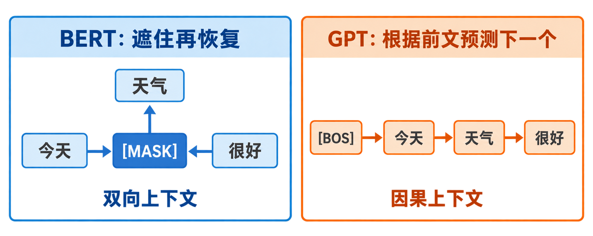
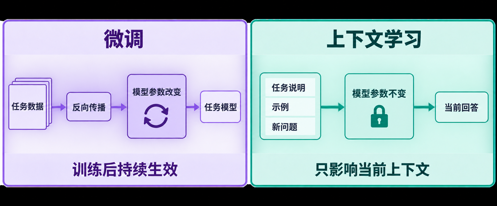

# [AI进阶-预训练模型]1.自监督学习、BERT与GPT

假设我们要训练一个情感分类模型，最直接的做法是收集大量句子，再请人逐条标成“正面”或“负面”。问题在于，互联网上容易获得的是没有标签的文字，真正昂贵的是人工标注。更麻烦的是，即使为情感分类标完一批数据，这些标签也不能直接拿去训练问答、命名实体识别或文本生成模型。

自监督学习改变了训练目标的来源。它不等待人工给每段文字配答案，而是从文字本身制造答案：遮住一个 token，让模型把它还原；或者给出前面的 token，让模型预测后面的 token。原始文本既是输入，也是监督信号的来源。模型先在大量通用文本上完成这种**预训练**，再把学到的参数用于具体的**下游任务**。

BERT 和 GPT 代表了两条经典路线。BERT 读取一个位置左右两边的上下文，擅长把文字编码成适合分类、抽取和匹配的表示；GPT 只根据已经出现的内容预测下一个 token，因此可以把预测结果接回输入，继续向后生成。这篇文章不重新推导 Transformer 的 Q、K、V，而是集中解释：两种预训练任务到底怎样产生训练数据、模型学到了什么、预训练结果怎样被使用，以及这些早期设计今天应当怎样理解。

## 一、没有人工标签，为什么仍然可以训练

监督学习真正需要的不是“人类亲手写的标签”，而是可以比较预测与正确答案的一组目标。文本本身包含大量可以自动构造的对应关系。

以句子为例：

```text
小猫坐在窗边晒太阳
```

可以从中构造至少两种任务。

第一种是遮住中间内容：

```text
小猫坐在[MASK]边晒太阳
目标：窗
```

模型若想填对“窗”，就必须同时利用左侧的“坐在”和右侧的“边晒太阳”。这是 BERT 最有代表性的遮罩语言模型任务。

第二种是把序列错开一位：

```text
输入：小 猫 坐 在 窗 边 晒 太
目标：猫 坐 在 窗 边 晒 太 阳
```

每个位置都根据已经看到的前文预测下一个 token。这是 GPT 使用的因果语言模型任务。

它们都没有额外人工标签，因为“窗”和“下一个 token”原本就在句子里。训练程序只需按照规则破坏、截断或错开文本，就能批量生成输入与目标。这就是**自监督学习（self-supervised learning）**：监督信号来自数据内部，而不是外部人工标注。



图中左侧的 `[MASK]` 可以同时利用“今天”和“很好”，所以它学习的是双向上下文中的缺失内容；右侧每条箭头只指向下一个 token，表示 GPT 的每个位置只能根据已经出现的前文产生预测。两边都从原句自动得到答案，但可见信息和预测位置不同。

自监督学习和无监督学习关系很近，却不能简单理解为“没有目标”。它有明确的预测目标和损失函数，只是目标由数据自动产生。预训练完成以后，模型通常还要通过微调、提示或其他适配方式，才能完成用户真正关心的任务。

### 1.1 预训练与下游任务的分工

整个过程可以分成两段：

```text
大量无标注文本
    ↓ 自动构造遮罩或下一词目标
通用预训练
    ↓ 得到一组已经学过语言规律的参数
分类、问答、检索、生成等下游任务
```

预训练阶段学的是可以跨任务复用的语言表示和序列规律；下游阶段再告诉模型当前究竟要判断情绪、抽取答案，还是继续写作。这样做并不保证少量数据就能解决任何任务，但通常比从随机参数开始训练更省标注数据，也更容易得到可用结果。

## 二、同一个 Transformer，为什么会形成 BERT 和 GPT

BERT 与 GPT 都建立在 Transformer 上，但它们允许每个位置读取的范围不同。这个“能看哪里”的规则，直接决定了训练目标和模型用途。

### 2.1 BERT：一个位置可以同时看左边和右边

BERT 主要采用 Transformer Encoder。输入长度为 $T$，隐藏维度为 $D$ 时，输入和输出都可以写成：

$$
X\in\mathbb{R}^{B\times T\times D}
\longrightarrow
H\in\mathbb{R}^{B\times T\times D}.
$$

$B$ 是批量大小，$T$ 是 token 数量，$D$ 是每个 token 的向量长度。输出 $H[:,i,:]$ 是第 $i$ 个位置的上下文化表示。除去用于补齐的 Padding 位置，一个 token 通常可以读取序列中左右两侧的信息。

这使 BERT 很适合回答“读完整段以后，这个位置是什么意思”或“整段文字属于什么类别”。代价是它不能直接把双向读取规则用于标准的逐 token 生成，因为预测位置如果看见了右侧真实答案，就等于考试时偷看答案。

### 2.2 GPT：每个位置只能读取自己和左侧

GPT 主要采用 Transformer Decoder 中的因果自注意力，但没有原始翻译 Transformer 那样独立的 Encoder 和 Cross-Attention。第 $t$ 个位置只能读取：

$$
x_1,x_2,\ldots,x_t,
$$

不能读取 $x_{t+1}$ 及更远的未来 token。这个限制由**因果遮罩（causal mask）**实现。

因此，第 $t$ 个位置产生的隐藏状态 $h_t$ 可以安全地用于预测 $x_{t+1}$。模型在训练时没有看到答案，在生成时也只需要已经生成的前文，训练规则和使用规则能够对齐。

### 2.3 结构名称不是最重要的判断依据

初学时常把区别记成“BERT 是 Encoder，GPT 是 Decoder”。这句话有帮助，却没有解释真正的原因。更可靠的判断方式是问：

- 当前 token 能否读取右侧上下文？
- 训练目标是还原被破坏的位置，还是预测下一个位置？
- 输出要作为整段表示、逐位置标签，还是要继续自回归生成？

Transformer 的完整结构、Padding Mask、Causal Mask 和训练/推理区别已经在[《[AI进阶-序列模型]4.Transformer结构、训练与推理.md》](<../../吴恩达/精简整合博客/[AI进阶-序列模型]4.Transformer结构、训练与推理.md>)中主讲。这里每次使用 Mask 时，只说明它对当前预训练任务产生的作用。

## 三、BERT 怎样通过“填空”学习上下文

BERT 的全名是双向 Transformer 编码表示（Bidirectional Encoder Representations from Transformers）。它不是把每个词保存成一个永远不变的词向量，而是根据整段上下文，为每个位置计算新的表示。

### 3.1 遮罩语言模型怎样制造训练样本

遮罩语言模型（Masked Language Modeling，MLM）的核心步骤是：

1. 把文本切成 token，并转换为 token id；
2. 从中选择一部分位置作为预测目标；
3. 破坏这些位置的输入；
4. 把整段被破坏的序列交给 BERT；
5. 只在被选中的位置预测原始 token。

例如原句是：

```text
今天 天气 很 好
```

选中“天气”后，输入可能变成：

```text
今天 [MASK] 很 好
```

目标仍然是“天气”。假设词表大小为 $V$，BERT 在被遮住位置输出隐藏向量：

$$
h_i\in\mathbb{R}^{D}.
$$

再通过一个词表分类头：

$$
z_i=Wh_i+b,
\qquad
p_i=\operatorname{softmax}(z_i),
$$

其中：

- $W\in\mathbb{R}^{V\times D}$ 把 $D$ 维隐藏向量映射成 $V$ 个词表分数；
- $b\in\mathbb{R}^{V}$ 是每个词表项的偏置；
- $z_i\in\mathbb{R}^{V}$ 是还未归一化的 logits；
- $p_i\in\mathbb{R}^{V}$ 是该位置对整个词表的概率分布。

如果正确 token“天气”的预测概率为 0.60，这个位置的负对数似然损失是：

$$
\mathcal L_i=-\log 0.60\approx0.511.
$$

若概率只有 0.05，损失变成：

$$
-\log0.05\approx2.996.
$$

模型越不相信正确答案，受到的惩罚越大。一个 batch 选中了多个位置时，对这些位置的损失求和或平均：

$$
\mathcal L_{\text{MLM}}
=-\frac{1}{|M|}
\sum_{i\in M}\log p_i(x_i),
$$

$M$ 是被选中的位置集合，$|M|$ 是选中位置的数量，$x_i$ 是位置 $i$ 原来的正确 token。没有被选中的普通位置为上下文提供信息，却通常不直接进入这项 MLM 损失。

### 3.2 原始 BERT 不会把所有目标都替换成 `[MASK]`

原始 BERT 从输入中选择约 15% 的 token 作为预测目标。在这些被选中的位置里：

- 80% 替换为 `[MASK]`；
- 10% 替换为随机 token；
- 10% 保持原 token 不变；
- 无论输入怎样处理，目标始终是原 token。

例如选中了“天气”，三种可能输入是：

```text
今天 [MASK] 很 好
今天 苹果 很 好
今天 天气 很 好
```

三种情况下都要求模型预测“天气”。这样设计是为了减轻预训练与使用阶段的不一致：下游文本通常没有 `[MASK]`，如果模型只学会处理这个特殊符号，它可能过度依赖预训练时才存在的提示。

这里容易产生一个误解：15% 是被选为目标的位置比例，不表示其中 15% 全部换成 `[MASK]`。原始论文的 80%/10%/10% 规则只作用于已经被选中的那部分位置。[BERT 原始论文](https://arxiv.org/abs/1810.04805)

### 3.3 为什么左右上下文能学到一词多义

静态词向量通常给同一个词表项一行固定向量。例如“苹果”无论出现在哪里，都先查到同一行初始 Embedding。BERT 的输出不是这行初始向量本身，而是经过多层双向注意力后的上下文化向量。

比较两句话：

```text
我把苹果切成小块。
苹果发布了新的处理器。
```

第一句话中，“苹果”可以读取“切成”“小块”等位置；第二句话中，它可以读取“发布”“处理器”。所以两处 token id 虽然相同，最终隐藏向量通常不同：

$$
h_{\text{苹果}}^{(\text{水果语境})}
\neq
h_{\text{苹果}}^{(\text{公司语境})}.
$$

“上下文化”表示的就是这种性质：一个位置的向量不仅取决于它自己，还取决于周围出现了什么。模型做填空题时若要区分两种“苹果”，就必须把上下文线索写进隐藏表示。

这不等于模型获得了与人类完全相同的语言理解。更准确的说法是，预训练目标迫使它编码对预测 token 有帮助的统计、语法和语义规律。哪些能力会稳定出现，还取决于模型容量、训练语料、优化过程和评测任务。

## 四、BERT 的输入不只有普通 token

原始 BERT 的一个输入位置由三类向量相加：

$$
e_i=e_i^{\text{token}}
+e_i^{\text{position}}
+e_i^{\text{segment}}.
$$

- token embedding 表示当前位置是哪一个 token；
- position embedding 表示它处于序列中的哪个位置；
- segment embedding 表示它属于句子 A 还是句子 B。

句对任务常组织成：

```text
[CLS] 句子 A [SEP] 句子 B [SEP]
```

`[CLS]` 放在开头，常用其最终隐藏向量承载整段或整对句子的汇总表示；`[SEP]` 用来分隔句子。它们不是天然具有语义的符号，而是在预训练与微调过程中学会承担特定角色。

### 4.1 下一句预测的原始目的

原始 BERT 除 MLM 外还使用下一句预测（Next Sentence Prediction，NSP）：给两段文本，判断 B 是否真的是 A 的下一段。它希望模型学习句子间关系，为自然语言推论和问答等句对任务提供帮助。

后来研究发现，BERT 的效果对训练数据、训练步数、batch size 和遮罩策略十分敏感。RoBERTa 移除 NSP，并通过更多数据、更长训练、较大 batch 和动态遮罩等设置取得更强结果。这说明“预训练有效”并不等于原始设计中的每个附加任务都不可替代。[RoBERTa 原始论文](https://arxiv.org/abs/1907.11692)

ALBERT 则使用句子顺序预测（Sentence Order Prediction，SOP）：两段内容来自同一文档，模型判断它们是否被交换顺序。与从其他文档随机取负例相比，这样更难仅凭话题不同完成任务，更集中地检查语篇顺序。[ALBERT 原始论文](https://arxiv.org/abs/1909.11942)

学习 BERT 时应把 MLM 看成核心机制，把 NSP 看成原始 BERT 的一项具体训练选择，不要把 NSP 当作所有编码器预训练的固定组成。

## 五、预训练后的 BERT 怎样完成具体任务

预训练模型给每个位置产生隐藏向量，具体任务再决定读取哪个位置、增加什么输出头，以及损失计算在哪里发生。**微调（fine-tuning）**表示用任务数据继续更新预训练参数；若冻结 BERT，只取隐藏向量训练外部模型，则更接近特征提取。

### 5.1 整句分类

情感分类或主题分类通常读取 `[CLS]` 的最终表示：

$$
h_{\text{CLS}}\in\mathbb{R}^{D}.
$$

增加一个 $K$ 分类线性层：

$$
z=Wh_{\text{CLS}}+b,
\qquad
W\in\mathbb{R}^{K\times D}.
$$

一个 batch 中，BERT 输出 `[B,T,D]`，取 `[B,D]` 的 `[CLS]` 表示，再得到 `[B,K]` 的类别 logits。标签为 `[B]` 的整数类别索引，使用交叉熵训练。

这里的关键不是 `[CLS]` 会自动“理解整句”，而是它能够读取其他位置，并在预训练和微调中被优化成适合汇总任务信息的位置。

### 5.2 每个 token 都要分类

命名实体识别要判断每个 token 是人名、地点、组织还是普通文字。此时不只读取 `[CLS]`，而是让每个位置的隐藏向量进入同一个分类头：

$$
H\in\mathbb{R}^{B\times T\times D}
\longrightarrow
Z\in\mathbb{R}^{B\times T\times K}.
$$

每个 token 都得到 $K$ 个标签分数。Padding 位置不是真实文字，所以损失函数要通过 Mask 忽略它们。若一个汉字或单词被分成多个子词，还要事先规定标签对齐方式，例如只监督第一个子词，或让所有子词共享标签。

### 5.3 抽取式问答

抽取式问答假设答案是文章中的一段连续文本。输入通常组成：

```text
[CLS] 问题 [SEP] 文章 [SEP]
```

BERT 为每个位置输出 $h_i$。模型用两个可训练向量分别计算“这里是答案开头”和“这里是答案结尾”的分数：

$$
s_i=w_s^Th_i,
\qquad
e_i=w_e^Th_i.
$$

$s_i$ 是位置 $i$ 的起点 logit，$e_i$ 是终点 logit。若序列长度为 $T$，两组分数都是长度 $T$ 的向量。Softmax 后得到起点和终点分布，训练时分别与真实起点、终点计算交叉熵。

例如文章部分有 8 个 token，答案“成都”对应第 4、5 个 token：

$$
y_{\text{start}}=4,
\qquad
y_{\text{end}}=5.
$$

模型并不直接生成“成都”两个字，而是输出两个位置。推理时还要选择满足起点不晚于终点、跨度长度合理的一对位置。这样就把问答问题转成了两个位置分类问题。

抽取式问答只能返回输入中已有的片段。如果任务需要综合多处信息、改写答案或回答文章中没有直接出现的内容，就需要生成式问答或其他系统设计，不能只靠起止位置完成。

### 5.4 句子匹配与自然语言推论

两个句子可以通过 `[SEP]` 放进同一序列，让双向注意力直接建立跨句联系，再用 `[CLS]` 做匹配或推论分类。也可以分别编码两段文字，得到两个固定维度向量，再计算相似度；后一种双塔式结构适合大规模检索，因为文档向量可以提前计算。

同为“使用 BERT”，联合编码和分别编码的工程目标不同：联合编码允许更细的 token 交互，通常计算更贵；分别编码适合先从海量候选中快速召回，再由联合模型精排。

## 六、BERT 的长度、多语言与使用边界

### 6.1 为什么常见 BERT 有长度上限

原始 BERT 常见最大长度是 512 token。这不是自然语言只能有 512 个 token，而是模型配置、位置表示和计算成本共同形成的限制。标准自注意力需要处理 $T\times T$ 的关系，序列从 512 增长到 1024 时，注意力位置对数量大约增加到四倍。

长文档常见处理方法包括分块、滑动窗口、先检索相关片段、使用长上下文编码器，或者按任务构建层级表示。直接截掉第 512 个 token 后的内容最简单，却可能恰好丢失答案，因此切分策略属于任务设计的一部分。

### 6.2 多语言模型为什么可能跨语言迁移

多语言 BERT 使用多种语言共同预训练。同一个模型参数要服务多种语言，如果不同语言表达相似概念时会触发相近的内部规律，它就可能形成部分共享的表示空间。

例如只用英文命名实体数据微调后，模型有机会把能力迁移到中文。但这种迁移不是必然成功：词表覆盖、语言之间的差异、预训练数据比例、文字系统和目标领域都会影响效果。不能把“共享一个模型”直接等同于“不同语言表示已经完全对齐”。

### 6.3 BERT 今天是否过时

原始 BERT 不再代表所有现代语言模型的最高能力，但编码器式预训练并没有失去用途。文本分类、实体抽取、相关性排序、句子表示、搜索召回和需要低延迟的专用任务，仍可能使用 BERT、RoBERTa、DeBERTa 或更小的编码模型。开放式对话和长文本生成则更多采用 Decoder-only 大语言模型。

所以“GPT 类模型更受关注”不能推出“BERT 已经没有用途”。更准确的选择依据是输出形式和成本：若任务只需要一个类别、一个向量或逐 token 标签，专用 Encoder 往往比通用生成模型直接；若任务需要自由生成、遵循文本指令或在统一接口中完成多种任务，生成式模型更自然。

## 七、GPT 怎样把整段文字变成下一词训练数据

GPT 的全名是生成式预训练 Transformer（Generative Pre-trained Transformer）。它的预训练目标可以写成：

$$
p(x_1,x_2,\ldots,x_T)
=\prod_{t=1}^{T}p(x_t\mid x_1,\ldots,x_{t-1}).
$$

这个式子表示：整段文字出现的概率，可以拆成“第一个 token 的概率 × 看见前文后第二个 token 的概率 × 看见更长前文后第三个 token 的概率……”模型因此只需反复学习同一个问题：给定已经出现的内容，下一个 token 是什么。

### 7.1 输入与标签只错开一个位置

假设 token 序列为：

```text
[BOS] 我 喜欢 学习 AI [EOS]
```

训练时可组织为：

| 位置 | 模型看到的当前 token | 要预测的下一个 token |
|---:|---|---|
| 1 | `[BOS]` | 我 |
| 2 | 我 | 喜欢 |
| 3 | 喜欢 | 学习 |
| 4 | 学习 | AI |
| 5 | AI | `[EOS]` |

程序中经常表现为：

```text
input_ids = tokens[:-1]
labels    = tokens[1:]
```

一个 batch 的 `input_ids` 和 `labels` 形状都可以是 `[B,T]`。模型输出为 `[B,T,V]`，其中 $V$ 是词表大小。第 $t$ 个位置的 $V$ 个 logits 与 `labels[:,t]` 的正确 token id 计算交叉熵。

### 7.2 因果遮罩防止训练时偷看答案

虽然一次把整段输入送进 GPU，位置 $t$ 仍然不能读取右侧位置。长度为 4 的允许关系可以写成：

$$
\begin{bmatrix}
1&0&0&0\\
1&1&0&0\\
1&1&1&0\\
1&1&1&1
\end{bmatrix}.
$$

第 1 行只能看第 1 个位置，第 2 行可以看前两个位置，最后一行可以看全部已出现位置。实现中，被禁止的注意力 logits 会在 Softmax 前加入极小值，使对应权重接近 0。

这里要区分两件事：训练时所有位置可以并行计算，但每个位置的可见范围受 Mask 限制；推理时下一个 token 尚不存在，所以生成过程仍然要一步一步向后进行。“使用因果关系”不等于“训练只能串行”。

### 7.3 因果语言模型损失怎样计算

第 $t$ 个位置输出词表概率 $p_t$，正确的下一个 token 是 $x_{t+1}$，损失为：

$$
\mathcal L_t=-\log p_t(x_{t+1}).
$$

对有效 token 求平均：

$$
\mathcal L_{\text{CLM}}
=-\frac{1}{N}
\sum_{t\in\text{有效位置}}
\log p_t(x_{t+1}).
$$

$N$ 是参与损失的 token 数量。Padding 和不希望监督的提示部分可以通过标签 Mask 排除。

假设三个位置对正确 token 给出的概率分别是 0.50、0.80 和 0.25，则平均损失为：

$$
\mathcal L
=-\frac{\log0.50+\log0.80+\log0.25}{3}
\approx0.767.
$$

第二个位置的 0.80 贡献较小损失，第三个位置的 0.25 贡献较大损失。训练就是让正确下一个 token 的概率整体上升。

语言模型还常报告困惑度（perplexity）：

$$
\operatorname{PPL}=e^{\mathcal L}.
$$

上例得到 $e^{0.767}\approx2.15$。它可以粗略理解为模型在每个位置面临的有效候选不确定性；在同一词表和相同数据处理下，困惑度越低通常表示下一词预测越好。不同 tokenizer、数据集或计算口径的困惑度不能简单横向比较。

## 八、从“预测下一个 token”到生成一段文字

训练完成后，给 GPT 一段提示：

```text
成都的夏天
```

模型输出下一个 token 的概率分布。程序从中选择一个 token，例如“很”，把它接回原序列：

```text
成都的夏天很
```

然后再次运行模型，预测下一项。这个循环持续到产生结束 token、达到长度限制或满足其他停止条件。

### 8.1 生成不是每一步都取最大概率

如果永远选择概率最大的 token，称为贪心解码。它稳定、可复现，却容易让长文本变得重复或过于单一。生成任务常从概率分布采样，并用温度、Top-k 或 Top-p 控制候选范围。

温度作用在 logits 上：

$$
p_i(T)
=\frac{\exp(z_i/T)}{\sum_j\exp(z_j/T)}.
$$

$z_i$ 是第 $i$ 个 token 的 logit。$T<1$ 会放大高分 token 的优势，使输出更确定；$T>1$ 会让分布更平，增加多样性，也增加选到不合适 token 的风险。温度不能创造模型没有学到的知识，只是在已有概率之间重新调整尖锐程度。

Top-k 只保留概率最高的 $k$ 个候选；Top-p 则保留累计概率达到阈值 $p$ 的最小候选集合。它们解决的是生成时怎样选 token，不会改变预训练目标本身。

### 8.2 流畅不等于事实正确

下一词训练奖励的是“在当前文本分布下，这个续写是否像合理后续”。它没有自动连接一个实时事实数据库，也没有保证每个生成步骤都经过逻辑证明。因此模型可以生成语法流畅、语气肯定但事实错误的内容。

这不是说语言模型完全不能推理或使用知识，而是说概率较高与事实为真属于不同条件。实际系统可能结合指令微调、偏好优化、工具调用、检索增强、验证器或结构化约束提高可靠性；这些属于预训练之后的系统能力，不能全部归因于“预测下一个 token”这一个目标。

## 九、上下文学习并没有更新模型参数

GPT 系列受到广泛关注的一项能力是**上下文学习（in-context learning）**：把任务说明和示例直接写进输入，模型在不执行梯度下降的情况下，按照上下文中的模式产生答案。

例如提示为：

```text
把中文翻译成英文：
猫 -> cat
书 -> book
雨伞 ->
```

模型可能继续生成 `umbrella`。这次请求中，示例只是输入 token 的一部分。它们影响当前前向传播产生的隐藏状态，却没有永久修改权重。

### 9.1 零样本、单样本和少样本

- 零样本（zero-shot）：只给任务说明，不给示例；
- 单样本（one-shot）：给一个示例；
- 少样本（few-shot）：给少量示例。

这里的“样本”位于提示上下文中。传统少样本学习可能真的用少量标注数据更新模型，而上下文少样本不更新参数，二者不能只因为都叫 few-shot 就混为一谈。

### 9.2 微调与上下文学习的实际区别

| 比较项 | 微调 | 上下文学习 |
|---|---|---|
| 任务信息放在哪里 | 训练数据及损失 | 当前提示文本 |
| 是否反向传播 | 是 | 否 |
| 是否修改参数 | 是 | 否 |
| 任务效果持续多久 | 保存新参数后可持续 | 通常只在当前上下文内起作用 |
| 主要成本 | 训练计算、数据与参数管理 | 上下文长度和每次推理计算 |



左侧的反向传播会把任务规律写进参数，因此保存微调后的权重便能继续使用；右侧只是让固定参数的模型读取“任务说明、示例、新问题”，这些 token 会影响当前计算得到的回答，却没有产生一份被永久更新的新模型。

上下文学习灵活，适合快速切换任务，但示例会占用上下文窗口，效果也会受示例顺序、格式和表述影响。微调需要训练过程，却能把任务规律写入参数，并可为固定任务优化延迟和输出格式。

GPT-3 论文系统展示了模型规模增加时零样本和少样本提示能力的提升，同时也报告了部分任务上的明显困难。它所说的 few-shot 条件是在推理输入中放示例，不执行梯度更新。[GPT-3 原始论文](https://arxiv.org/abs/2005.14165)

## 十、BERT 与 GPT 不是“理解模型”和“生成模型”的绝对二分

下面的表格概括经典用法：

| 比较项 | BERT 类 Encoder | GPT 类 Decoder-only |
|---|---|---|
| 主要预训练目标 | 还原被遮罩或替换的内容 | 预测下一个 token |
| 每个位置可读取范围 | 通常左右双向 | 当前及左侧历史 |
| 输出特点 | 每个输入位置得到上下文化表示 | 每个位置给下一 token 分布 |
| 典型任务 | 分类、抽取、匹配、编码 | 续写、对话、开放式生成、提示任务 |
| 常见适配方式 | 增加任务头并微调 | 提示、微调或指令适配 |
| 生成方式 | 通常不直接逐词生成 | 自回归逐 token 生成 |

这张表描述的是结构和目标带来的倾向，不是能力边界。BERT 的表示可以参与生成系统，GPT 也能通过生成标签完成分类、抽取和问答。真正的差别在于任务被怎样表示：BERT 常把任务变成隐藏向量上的分类或位置预测；GPT 常把输入和输出统一写成一段 token 序列。

例如情感分类可以有两种接口：

```text
BERT：句子 -> [CLS] 向量 -> 正面/负面 logits
GPT：提示“判断情感：句子” -> 生成“正面”或“负面”
```

前者的输出空间固定，易于控制和批量评测；后者接口统一，能利用文字说明，却还要处理输出格式、生成成本和不确定文本。工程选型要看任务规模、延迟、可控性、标注数据和是否需要自由生成，不能只看模型名称的新旧。

## 十一、BERT 与 GPT 之后的几条预训练路线

课程中提到的 RoBERTa、ALBERT、ELECTRA、T5 和 ERNIE 并不是一条简单的“旧模型被新模型依次淘汰”的直线。它们分别修改训练策略、参数共享方式、监督信号或任务接口。

### 11.1 RoBERTa：重新检查训练方法

RoBERTa 保留 BERT 式双向编码和 MLM，主要变化包括移除 NSP、采用动态遮罩、使用更多数据和更充分的训练设置。它的重要启示是：比较预训练方法时，数据规模、训练时长和超参数会严重影响结论，不能把所有提升都归因于一个新结构。

动态遮罩表示同一段文字在不同训练轮次可能遮住不同位置。这样模型能从同一文本得到更多预测组合，而不是反复看到完全相同的破坏版本。

### 11.2 ALBERT：减少参数并调整句间任务

ALBERT 通过分解词表 Embedding 参数、跨层共享参数等方式降低参数量，并以 SOP 关注句子顺序。参数量减少不自动等于计算量同比减少：即使多层共享同一组权重，前向传播仍要重复执行这些层。它主要说明“参数存储”和“实际运算次数”是两个不同指标。

### 11.3 ELECTRA：判断哪些 token 被替换

MLM 只在少量被选中位置产生词表预测损失。ELECTRA 先由一个较小的生成器替换部分 token，再训练判别式编码器判断每个位置是原始 token 还是替换 token。

例如原句：

```text
小猫坐在窗边
```

被生成器改成：

```text
小猫跑在窗边
```

判别器对每个位置输出“原始/替换”标签，因而多数位置都能提供训练信号。ELECTRA 论文把这种方法称为 replaced token detection，并报告它比只预测少量 Mask 位置具有更高的样本效率。[ELECTRA 原始论文](https://arxiv.org/abs/2003.10555)

ELECTRA 虽然使用生成器和判别器两个名称，却不是下一篇要讲的标准 GAN。替换 token 是离散采样，生成器主要为判别器制造较难的负样本；训练目标和经典生成对抗博弈不同。

### 11.4 T5：把所有任务统一成文本到文本

T5 使用 Encoder–Decoder Transformer，并把分类、翻译、摘要和问答统一写成文字输入到文字输出。例如：

```text
输入：sentiment: 这部电影很精彩
输出：positive
```

分类不再必须接固定类别头，也可以生成标签文本。T5 的价值不仅是某一个预训练目标，而是建立统一的 text-to-text 接口，系统比较数据、模型、目标和迁移设置。[T5 原始论文](https://www.jmlr.org/papers/volume21/20-074/20-074.pdf)

### 11.5 ERNIE：名称相同不一定指同一个模型

课程把 ERNIE 概括为向预训练中加入实体、短语或知识信息的路线，这个方向本身成立。但“ERNIE”曾被不同团队用于不同模型系列，具体遮罩策略、知识图谱用法和架构并不完全相同。阅读论文或使用模型时，应确认作者、版本和训练目标，不能只凭缩写判断实现。

## 十二、自监督学习不只存在于文本

自监督学习的核心是从数据自身构造目标，因此可以迁移到不同模态：

- 图像可以遮住 Patch，再预测像素、离散视觉 token 或潜在表示；
- 语音可以遮住一段时间区间，预测被遮住的声学表示；
- 视频可以预测缺失片段、时间顺序或不同视角之间的关系；
- 多模态模型可以让图像和文字互相提供对齐信号。

这些任务与 BERT 的共同点不是“都必须使用 `[MASK]`”，而是让模型从未人工逐条标注的数据中构造可训练目标。目标设计决定模型被迫保留什么信息：预测像素可能强调局部细节，预测离散语义 token 可能更强调高层结构，对比学习则要求同一对象的不同视图保持接近。

因此，自监督学习不是某一个模型的专利，也不是一种固定损失。BERT 和 GPT 的重要性，在于它们分别展示了两种非常可扩展的文本目标：从双向上下文恢复缺失内容，以及根据历史预测未来内容。

## 十三、学习这些早期模型时应保留哪些结论

BERT、GPT、RoBERTa、ALBERT、ELECTRA 和 T5 的具体训练配方已经出现许多后续变化，但下面几条仍然直接影响今天的模型设计与使用。

第一，**预训练目标决定可见信息和输出接口**。双向遮罩适合学习编码表示，因果预测天然支持自回归生成，Encoder–Decoder 适合条件生成。模型规模变大以后，这个基本约束仍然存在。

第二，**预训练、微调和上下文学习是三个不同阶段或机制**。预训练从海量通用数据学参数；微调用任务损失继续改参数；上下文学习只在当前输入中提供说明和示例。把三者混在一起，会看不懂模型能力究竟来自哪里。

第三，**模型输出的是条件概率或隐藏表示，不是可靠性的证明**。BERT 的高分类分数可能受数据偏差影响，GPT 的流畅文本也可能包含错误事实。部署系统仍需要与任务对应的验证集、错误分析和约束。

第四，**早期附加任务不是永远固定的标准答案**。NSP 可以被移除或替换，Mask 策略可以变化，下一词模型也可以在预训练后继续进行指令微调和偏好对齐。应当保留任务设计背后的问题意识，而不是死记某套配方。

第五，**BERT 与 GPT 今天仍代表两种有用的建模方向**。Encoder 模型适合高效编码、匹配和结构化预测；Decoder-only 模型适合统一的生成式接口和上下文学习。它们之间还有 Encoder–Decoder、双塔、检索增强及多模态组合，实际系统常按成本与任务需要组合使用。

## 参考资料

- Devlin et al. [BERT: Pre-training of Deep Bidirectional Transformers for Language Understanding](https://arxiv.org/abs/1810.04805), 2018。
- Radford et al. [Improving Language Understanding by Generative Pre-Training](https://cdn.openai.com/research-covers/language-unsupervised/language_understanding_paper.pdf), 2018。
- Liu et al. [RoBERTa: A Robustly Optimized BERT Pretraining Approach](https://arxiv.org/abs/1907.11692), 2019。
- Lan et al. [ALBERT: A Lite BERT for Self-supervised Learning of Language Representations](https://arxiv.org/abs/1909.11942), 2019。
- Brown et al. [Language Models are Few-Shot Learners](https://arxiv.org/abs/2005.14165), 2020。
- Clark et al. [ELECTRA: Pre-training Text Encoders as Discriminators Rather Than Generators](https://arxiv.org/abs/2003.10555), 2020。
- Raffel et al. [Exploring the Limits of Transfer Learning with a Unified Text-to-Text Transformer](https://www.jmlr.org/papers/volume21/20-074/20-074.pdf), 2020。
