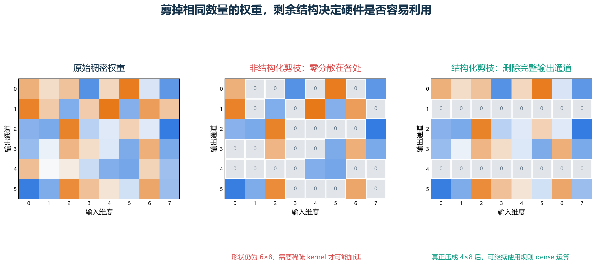
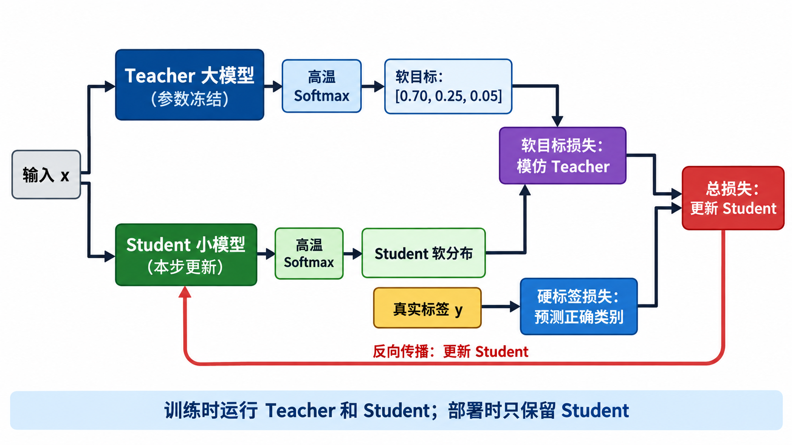
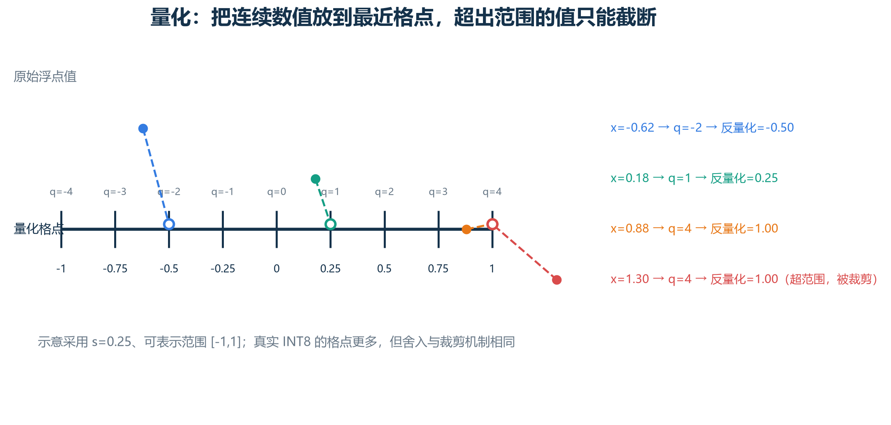
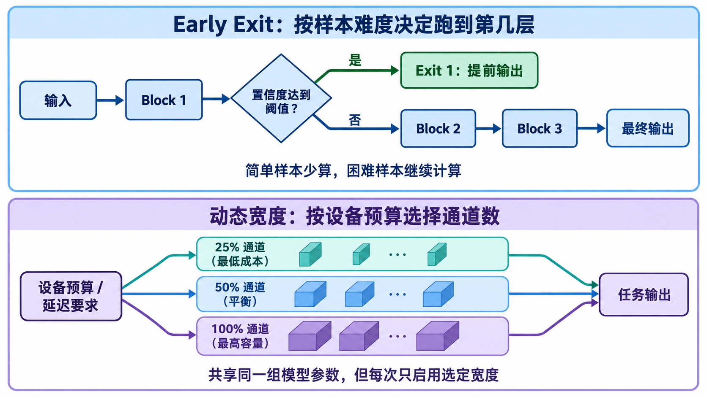

# [AI部署-模型优化]1.剪枝、蒸馏、量化与动态计算

训练阶段最常问“准确率还能不能更高”，部署阶段则会立刻遇到另一组问题：模型文件能不能装进设备，运行时显存是否够用，一次推理需要多久，每秒能处理多少请求，功耗是否超出预算。如果只说“这个模型参数少了 50%”，这些问题仍然没有得到回答。

模型压缩不是把一个模型机械地缩小，而是在任务质量和部署成本之间重新分配资源。剪枝删除权重或结构，蒸馏把大模型行为教给小模型，量化用更少比特表示数值，高效架构从设计阶段减少昂贵运算，动态计算则让不同输入使用不同计算量。它们经常组合使用，但每一种方法影响的成本并不相同。

这一篇从部署指标开始，再依次解释五类方法。重点不只是公式“省了多少”，还要说明什么条件下能真的加速、怎样验证精度损失，以及当前 PyTorch 量化工作流已经怎样变化。

## 一、模型更小、更快、更省内存是三个不同目标

一个模型的部署成本至少包含以下指标：

| 指标 | 实际含义 | 常见单位 |
|---|---|---|
| 参数量 | 模型中需要保存的可训练数值个数 | M、B parameters |
| 模型文件大小 | 权重、元数据和打包格式占用的磁盘空间 | MB、GB |
| 峰值运行内存 | 权重、激活、缓存和运行时工作区的总峰值 | MB、GB |
| 计算量 | 理论乘加或浮点运算数量 | MACs、FLOPs |
| 延迟 | 单个请求从输入到输出所需时间 | ms |
| 吞吐 | 单位时间处理的样本或 token 数 | samples/s、tokens/s |
| 能耗 | 完成一次任务或一段时间运行的功耗 | J、W |

假设模型有 1 亿个参数。只计算权重本身：

$$
\text{FP32 权重大小}
=10^8\times4\text{ bytes}
\approx400\text{ MB},
$$

$$
\text{INT8 权重大小}
=10^8\times1\text{ byte}
\approx100\text{ MB}.
$$

权重文件理论上缩小到四分之一，但峰值内存未必也缩小四倍。推理还可能保存浮点激活、KV cache、量化 scale、临时工作区和框架元数据。延迟更不会自动缩小四倍，因为量化与反量化、内存传输、算子启动和不受支持的算子都要花时间。

所以压缩前必须先写清目标。例如“模型文件不超过 50 MB”“批量 1 时 P95 延迟低于 20 ms”“准确率下降不超过 0.5 个百分点”。没有硬件、输入形状、批量大小和评价数据，所谓“加速两倍”没有完整意义。

## 二、参数少和 FLOPs 低为什么不保证实际更快

理论计算量只统计某些算术操作，真实时间还受到以下因素影响：

- 运算是否有目标硬件上的高效 kernel；
- 数据是否需要频繁从内存搬到计算单元；
- 张量形状能否充分利用向量单元或 GPU；
- 稀疏索引、分支判断和量化转换是否引入额外开销；
- 批量大小是否足够摊薄启动成本；
- 编译器能否融合相邻算子；
- 动态路径是否破坏批处理和缓存局部性。

一个 50% 稀疏的矩阵若仍以 dense 格式存储并调用普通矩阵乘法，硬件照样读取和计算那些零。即便使用稀疏格式，也要保存非零值的位置，并执行间接索引。稀疏度不够高或结构不规则时，索引成本可能抵消少算的乘法。

部署优化因此需要两类证据：离线任务指标证明模型质量仍可接受，目标设备基准证明文件、内存、延迟或吞吐确实改善。只报告参数量属于中间结果。

## 三、剪枝先判断“哪些部分可以拿掉”

剪枝（pruning）认为训练后的网络存在冗余，可以删除重要性较低的权重或结构。经典流程是：

1. 训练一个基线模型；
2. 计算权重、通道或模块的重要性；
3. 删除一部分；
4. 微调恢复性能；
5. 按目标稀疏率重复以上过程。

最简单的重要性标准是权重绝对值。若一个线性层权重为：

$$
W=
\begin{bmatrix}
0.82&0.03&-0.61&0.01\\
0.04&-0.77&0.06&0.55\\
0.48&0.02&-0.05&-0.69
\end{bmatrix},
$$

把绝对值小于 0.1 的权重设为 0，会得到不规则稀疏矩阵。这个规则容易计算，却只看单个参数大小，没有考虑多个权重之间的补偿、激活大小和任务敏感性。因此实际方法也会使用梯度、Hessian 近似、激活统计或训练出的门控分数。



## 四、非结构化剪枝和结构化剪枝的部署差别

**非结构化剪枝（unstructured pruning）**删除单个权重。它能在参数精度损失较小时达到很高的零值比例，但剩余位置不规则。要获得真实收益，需要稀疏存储格式、合适的稀疏 kernel，并达到硬件值得处理的稀疏模式和比例。

**结构化剪枝（structured pruning）**删除完整通道、神经元、卷积核、注意力头、FFN 单元甚至整层。剪完后可以把张量真正改成更小的 dense 形状，更容易使用成熟矩阵乘法和卷积实现。

假设一个线性层：

$$
W\in\mathbb R^{1024\times1024}.
$$

随机把 50% 元素置零后，逻辑上只有一半非零权重，矩阵形状仍是 $1024\times1024$。若删除一半输出神经元，则新矩阵可以直接变为：

$$
W'\in\mathbb R^{512\times1024}.
$$

后者更容易让普通 dense kernel减少计算和输出激活内存，但它对网络结构的破坏也更大，通常需要谨慎选择通道并微调。

介于两者之间还有半结构化稀疏，例如每连续 4 个权重保留 2 个的 2:4 模式。它限制了剪枝自由度，却能匹配特定硬件的稀疏单元。是否加速仍取决于具体 GPU、数据类型、矩阵形状和推理栈。

## 五、剪枝比例怎样一步一步提高

一次删除 80% 权重会突然改变网络输出，模型可能无法恢复。迭代剪枝会分多轮逐步提高稀疏度。例如每一轮删除当前剩余权重的 20%，连续三轮后保留比例为：

$$
0.8^3=0.512.
$$

最终剪掉的不是 60%，而是：

$$
1-0.512=48.8\%.
$$

每轮剪枝后都要重新训练剩余参数，使它们补偿被删除部分。评价时不仅记录最终准确率，还要记录微调成本；如果为了得到一个小模型额外消耗了数倍训练资源，这个代价也应进入项目决策。

剪枝阈值还可能按层设置。最前面的输入层、最后的输出层或窄瓶颈层通常比宽冗余层更敏感。全模型使用同一个稀疏率，容易把关键小层剪坏。

## 六、为什么先训练大模型再剪，有时比直接训练小模型容易

大模型提供了更宽的优化空间。训练过程中，许多参数可以共同寻找有用表示；收敛后再删除冗余连接，相当于从已经形成的解附近寻找更小结构。直接训练同等大小的小模型，则需要它从一开始就在更受限制的空间中找到好解。

彩票假设（Lottery Ticket Hypothesis）提出，随机初始化的大网络中可能包含一些具有合适初始权重的稀疏子网络，它们单独训练也能达到接近原网络的表现。这个结果解释了为什么“找出子网络”与“随便造一个同样大小的网络”可能不同。

但它不是“大模型剪枝永远最好”的定律。更好的小模型结构、训练更久、数据增强、学习率调整和蒸馏都可能让从头训练的小模型追上或超过剪枝模型。公平比较应让小模型获得合理的训练预算，而不是只和一个未经调优的弱基线比较。

## 七、知识蒸馏让小模型学习老师的判断细节

知识蒸馏（knowledge distillation）先准备能力较强的 teacher，再训练较小的 student。两者接收同一个输入，student 除了学习真实标签，还模仿 teacher 的输出分布或中间表示。



硬标签只说“正确类别是 1”。Teacher 的概率分布还可能说“它最像 1，也有一点像 7，几乎不像 0”。这种类别间关系常被称为暗知识（dark knowledge）。它能为 student 提供比单个 one-hot 标签更平滑的学习信号。

Teacher 通常已经训练完成并冻结参数。训练 student 时，不需要把梯度更新到 teacher；teacher 只负责产生目标。部署时通常只保留 student，所以蒸馏降低的是最终推理成本，训练阶段反而需要额外运行 teacher。

## 八、温度怎样把过于尖锐的概率摊开

普通 Softmax 为：

$$
p_i=\frac{\exp(z_i)}{\sum_j\exp(z_j)}.
$$

蒸馏加入温度 $T$：

$$
p_i^{(T)}
=
\frac{\exp(z_i/T)}
{\sum_j\exp(z_j/T)}.
$$

$z_i$ 是第 $i$ 类 logit，$T>1$ 会缩小 logit 差距，使非最高类别获得可见概率。以 logits `[4,2,0]` 为例：

$$
\operatorname{softmax}([4,2,0])
\approx[0.867,0.117,0.016].
$$

把温度设为 2，相当于先变成 `[2,1,0]`：

$$
\operatorname{softmax}([2,1,0])
\approx[0.665,0.245,0.090].
$$

第二类和第三类不再被压到接近零，student 更容易学到 teacher 认为它们分别有多相似。$T$ 过高时分布又会太平，类别关系被冲淡，因此它是需要验证的超参数。

## 九、蒸馏损失怎样组合真实标签与教师输出

经典 logits 蒸馏常使用：

$$
\mathcal L
=
\alpha\mathcal L_{\text{hard}}
+
(1-\alpha)T^2\mathcal L_{\text{soft}}.
$$

其中：

$$
\mathcal L_{\text{hard}}
=\operatorname{CE}(y,p_s^{(1)}),
$$

$$
\mathcal L_{\text{soft}}
=\operatorname{KL}(p_t^{(T)}\|p_s^{(T)}).
$$

$p_t^{(T)}$ 和 $p_s^{(T)}$ 是 teacher 与 student 在相同温度下的分布。$\alpha$ 大时更相信真实标签，小则更强调模仿 teacher。乘上 $T^2$ 是为了补偿高温使 Softmax 梯度缩小的量级，让软目标项不会仅因改变温度就变得过弱。

若 $\mathcal L_{\text{hard}}=0.6$、$\mathcal L_{\text{soft}}=0.08$、$T=2$、$\alpha=0.7$：

$$
\mathcal L
=0.7\times0.6
+0.3\times2^2\times0.08
=0.516.
$$

这串数字表示当前更新主要由真实标签损失贡献，teacher 软分布也提供约 0.096 的约束。两项的绝对尺度随实现和归约方式变化，不能只抄一个 $\alpha$ 用于所有任务。

## 十、蒸馏不只模仿最后一层概率

常见蒸馏目标还包括：

- **特征蒸馏**：让 student 中间表示接近 teacher；
- **注意力蒸馏**：匹配注意力图、关系矩阵或 token 交互；
- **多教师蒸馏**：模仿多个模型或集成输出；
- **数据蒸馏**：使用 teacher 生成或重标注训练样本；
- **序列蒸馏**：在语音、翻译或语言模型中模仿 token 分布和生成序列。

中间层形状不同时，需要投影层或选择可对应的层。盲目要求每层逐元素相等，可能限制 student 学到适合自身结构的表示。蒸馏的目标应围绕最终能力，而不是让两个不同架构在所有内部细节上完全一致。

Teacher 也不是永远正确。其系统性偏差、错误置信度和训练数据问题会传给 student。真实标签、独立测试集和公平基线仍然必要。

## 十一、量化把连续数值映射到有限格点

量化（quantization）用较少比特保存或计算权重和激活。FP32 每个数占 32 bit，BF16/FP16 占 16 bit，INT8 占 8 bit，4-bit 权重只占约 4 bit。低精度可减少存储和内存带宽，并在有对应硬件 kernel 时提高吞吐。

浮点数到整数不是删掉小数位，而是定义一把刻度尺。仿射量化常写成：

$$
q
=
\operatorname{clamp}
\left(
\operatorname{round}\left(\frac{x}{s}\right)+z,
q_{\min},q_{\max}
\right),
$$

$$
\hat x=s(q-z).
$$

$x$ 是原浮点值，$q$ 是保存的整数，$s$ 是相邻格点代表的浮点间隔，$z$ 是使实数 0 对应到整数格点的 zero-point，$\hat x$ 是反量化后的近似值。`clamp` 把超范围整数截到可表示的上下界。



## 十二、用一组数字完整走过对称 INT8 量化

假设权重主要位于 $[-1,1]$，使用 signed INT8 的对称范围 $[-127,127]$，令 $z=0$。比例尺为：

$$
s=\frac{1}{127}\approx0.007874.
$$

对 $x=0.25$：

$$
q=\operatorname{round}(0.25/0.007874)=32,
$$

$$
\hat x=32\times0.007874\approx0.25197.
$$

量化误差约为：

$$
\hat x-x\approx0.00197.
$$

对 $x=0.003$：

$$
q=\operatorname{round}(0.003/0.007874)=0,
\qquad
\hat x=0.
$$

小数值落在零点附近，被舍入为 0。若实际出现 $x=1.4$，计算出的整数超过 127，会被截到 127，反量化后只能得到约 1.0，这叫饱和或裁剪误差。

刻度越细，范围内舍入误差越小；范围越宽，越不容易裁掉离群值。有限 bit 下二者不能同时无限改善。

## 十三、对称、非对称和量化粒度解决不同问题

**对称量化**让表示范围围绕 0 对称，通常取 $z=0$。权重常大致以 0 为中心，这种形式计算简单。

**非对称量化**用非零 zero-point 表示偏向一侧的范围。例如 ReLU 激活主要为非负数，若仍把一半整数范围留给负数就可能浪费刻度。

量化粒度说明多少数值共用一套 scale：

- per-tensor：整个张量共用一个 scale；
- per-channel：每个输出通道有自己的 scale；
- per-group：每组连续权重共用 scale；
- per-token：每个 token 或样本动态计算激活 scale。

假设两行权重的范围分别是 $[-0.1,0.1]$ 和 $[-5,5]$。per-tensor 必须覆盖 $[-5,5]$：

$$
s\approx5/127\approx0.0394.
$$

第一行的许多数值比一个刻度还小，容易变成 0。若每行单独量化，第一行使用：

$$
s_1\approx0.1/127\approx0.000787,
$$

便能保留更多细节。代价是需要保存更多 scale，并且 kernel 必须支持该粒度。

## 十四、PTQ、动态量化、静态量化和权重量化怎样区分

**训练后量化（Post-Training Quantization，PTQ）**是在已有浮点模型上完成量化，不再进行完整任务训练。它是一个总类别，其中可以包含不同方案。

**权重仅量化（weight-only quantization）**只压低权重精度，激活和主要计算可能仍使用 FP16/BF16。常见记法 `W4A16` 表示 4-bit 权重、16-bit 激活。它能明显减少大模型权重带宽和显存，但是否加速取决于解包、反量化和矩阵 kernel。

**动态激活量化**在运行时根据当前输入计算激活范围。它能适应不同批次，却增加计算 scale 的开销。

**静态量化**在部署前用校准数据确定固定激活范围。推理时开销较小，但若真实输入分布与校准集不同，固定范围可能频繁裁剪或浪费精度。

`W8A8` 通常表示权重与激活都为 8 bit，但具体是整数还是浮点、采用何种粒度、累加精度是多少，仍要看实现。只写“INT8 模型”不足以复现实验。

## 十五、校准数据决定激活刻度是否代表真实使用场景

静态 PTQ 会插入 observer，运行一批代表性数据并记录激活统计，再据此求 scale 和 zero-point。常见统计包括 min/max、移动平均或直方图。

校准集不需要像完整训练集一样大，但必须覆盖真实输入。例如语音模型只用安静录音校准，部署到街道噪声时激活范围可能明显扩大；目标检测只用白天图片校准，夜间特征也可能落入不同范围。

直接用绝对最大值覆盖所有离群点，会让大部分刻度过粗；裁掉极少数离群值可改善主体分辨率，却会让被裁值饱和。校准算法实际上在比较“舍入误差”和“裁剪误差”。最终选择应以量化后任务指标为准，而不是只看数值重建误差。

当前 torchao 的静态量化文档仍把校准描述为：observer 记录代表性输入的分布，再计算最终 scale 与 zero-point。这个原理没有因接口变化而改变。[torchao 静态量化文档](https://docs.pytorch.org/ao/stable/eager_tutorials/static_quantization.html)

## 十六、量化感知训练让模型提前适应格点误差

若 PTQ 精度下降不可接受，可以使用量化感知训练（Quantization-Aware Training，QAT）。训练前向传播中插入 fake quantization：先按目标精度量化再反量化，让网络看到舍入与裁剪误差；参数更新通常仍保留较高精度 master weights。

量化中的 `round` 几乎处处梯度为 0，直接求导会阻断学习。QAT 常用直通估计器（Straight-Through Estimator，STE），在反向传播时近似把一定范围内的梯度直接传过去。这不是 `round` 的真实导数，而是一种可训练近似。

QAT 的成本高于 PTQ，因为需要训练数据、训练流程和超参数；它通常在低 bit、激活离群明显或精度要求严格时更有价值。合理顺序是先尝试简单 PTQ，确认误差来源后再决定是否承担 QAT 成本。

还要区分**量化感知训练**与**低精度训练**。QAT 主要为了得到低精度推理模型；FP8/BF16 混合精度训练则是在训练本身使用较低精度矩阵运算提高吞吐，梯度、归一化和优化器状态可能仍保留更高精度策略。二者目标和数值方案不同。

## 十七、离群值为什么在大模型量化中特别麻烦

若一个激活通道大多数值位于 $[-1,1]$，但偶尔出现 20，per-tensor INT8 为覆盖它需要：

$$
s\approx20/127\approx0.1575.
$$

此时 $0.05$ 会量化为 0，许多普通激活失去细节。若直接把范围裁到 $[-1,1]$，主体刻度变细，但 20 会饱和到 1。

SmoothQuant 的思路是通过等价缩放，把难量化的激活幅度部分迁移到权重，使权重与激活都更适合 8-bit 计算。AWQ 则利用激活统计识别重要权重通道，并保护对输出影响较大的权重。它们都说明“大多数权重看起来很小”不足以决定量化误差，还要看权重和实际激活怎样共同参与矩阵乘法。

方法名称很多，不能脱离运行时选择。某种 4-bit 格式若没有目标设备的高效 kernel，文件可能更小，延迟却不一定改善。

## 十八、当前 PyTorch 量化接口应怎样理解

截至 2026 年 9 月，PyTorch 生态把低精度和稀疏优化重点放在独立的 **torchao** 库。当前主要入口之一是 `torchao.quantization.quantize_`，它根据配置原地转换模型中的适用权重或模块；配置包括 INT8 动态激活与 INT8 权重、INT8 weight-only、INT4 weight-only 和 float8 等路线。[torchao 量化 API](https://docs.pytorch.org/ao/stable/api_reference/api_ref_quantization.html)

概念性的核心调用可以写成：

```python
from torchao.quantization import (
    Int8DynamicActivationInt8WeightConfig,
    quantize_,
)

model.eval()
quantize_(model, Int8DynamicActivationInt8WeightConfig())
```

这段代码只说明当前入口形式，不代表任何模型和硬件都会加速。官方入门示例也展示了小型测试模型可能几乎没有速度收益，并强调结果随模型和硬件显著变化。[torchao 首个量化示例](https://docs.pytorch.org/ao/stable/eager_tutorials/first_quantization_example.html)

需要完整图模式静态量化时，PT2E 工作流通过 `torch.export` 捕获图、插入量化/反量化节点，并交给 Inductor 或 ExecuTorch 等后端降低为真实量化算子。[PT2E 量化文档](https://docs.pytorch.org/ao/stable/pt2e_quantization/index.html)

框架接口会继续变化，部署项目应以所用 torch、torchao、后端和设备版本的兼容表为准。比记住旧 API 更重要的是理解：选择数值格式、确定量化粒度、校准或训练、转换模型、在目标硬件验证。

## 十九、高效架构从一开始就避免昂贵运算

剪枝、蒸馏和 PTQ 常从已有模型出发，高效架构则在设计阶段控制成本。视觉网络中的深度可分离卷积把空间卷积和通道混合拆开。若输入通道为 $I$、输出通道为 $O$、卷积核为 $K\times K$，标准卷积每个空间位置的乘法量与参数量核心项为：

$$
K^2IO.
$$

深度卷积加逐点卷积为：

$$
K^2I+IO.
$$

令 $K=3$、$I=32$、$O=64$：

$$
\text{标准卷积}=3^2\times32\times64=18432,
$$

$$
\text{深度可分离}=3^2\times32+32\times64=2336.
$$

理论上只剩约 $12.7\%$。空间卷积与通道混合的完整数据流、MobileNet 和线性瓶颈已在 `[AI应用-计算机视觉]1.卷积网络、经典架构与迁移学习.md` 中展开；本篇需要补充的部署判断是：深度卷积的算术强度和内存访问模式不同，某些设备对它优化很好，另一些设备未必按 FLOPs 比例加速。

高效架构还包括分组卷积、瓶颈、低秩分解、轻量注意力和面向硬件的网络搜索。选择时应优先考虑目标运行时已有的高效算子，而不是只在纸面上比较参数公式。

## 二十、动态计算让简单输入少走几层

静态模型让每个输入执行相同路径。动态计算根据输入难度、设备预算或当前状态决定使用多少层、多少通道或哪些专家。

Early exit 会在中间层增加分类头。若浅层置信度足够高就提前输出，困难样本继续进入深层。假设 70% 样本在成本为 2 单位的出口结束，30% 跑到成本为 8 的最终出口，平均成本为：

$$
0.7\times2+0.3\times8=3.8.
$$

相比所有样本都花 8 单位，平均计算减少 52.5%。但最慢的 30% 仍需要完整成本，P99 延迟未必改善；中间分类头也会增加参数和训练约束。



Slimmable Network 让同一组权重支持多个宽度，例如 25%、50%、75% 和 100% 通道。部署时可根据设备预算选择宽度。不同宽度共享参数会互相影响，归一化统计和训练采样也需要专门设计。

Mixture of Experts（MoE）只激活部分专家，也属于条件计算，但它通常减少每个 token 的活动计算，并不一定减少模型总参数或存储。动态计算的“省”必须说明是平均 FLOPs、单请求延迟、总权重还是设备内存。

## 二十一、投机解码也是“用便宜计算减少昂贵计算”

自回归大模型每次生成 token 都要运行昂贵主模型。投机解码（speculative decoding）先让较小 draft model 提出多个候选 token，再由大模型并行验证；被接受的候选可以一次推进多个位置，被拒绝时再按主模型修正。

它不一定改变主模型参数，也不是传统意义上的模型压缩，却应用了相同的系统思想：让便宜模型处理容易预测的部分，把昂贵计算留给需要确认的位置。严格算法可以保持目标模型的输出分布，而实际加速取决于候选接受率、draft 成本、批量和实现。

因此动态计算今天仍然活跃，但它更多表现为早退、稀疏专家、投机执行和自适应推理，而不是所有项目都使用同一种“动态网络”。

## 二十二、五类方法可以组合，但顺序会影响结果

一个移动端视觉模型可能采用：高效骨干 → teacher 蒸馏 → 结构化通道剪枝 → INT8 QAT。一个语言模型部署可能采用：选择较小预训练模型 → 任务蒸馏 → 4-bit weight-only 量化 → 投机解码。

组合并非简单相加。剪枝改变通道形状后，旧量化 scale 失效；量化前后进行蒸馏，student 看到的误差不同；结构化剪枝可能破坏预先优化的 kernel 尺寸；动态分支会影响批处理效率。

更稳妥的流程是每一步都保留可比较检查点：

1. 建立未优化基线；
2. 只应用一种方法，测质量和部署指标；
3. 再加入下一种方法，确认增量收益；
4. 最终在目标硬件、真实输入分布和目标并发下测试；
5. 若组合失败，可以定位是哪一步引入损失。

没有这种消融，最终模型变快或变差时，很难知道究竟是哪项技术起作用。

## 二十三、不同任务的常见优先级

### 23.1 手机与嵌入式视觉

通常先选择已有硬件支持的轻量架构，再尝试 INT8 PTQ；若精度下降明显，考虑 QAT 或蒸馏。结构化通道剪枝可作为进一步选择。评价应包含预处理、后处理和数据搬运，不能只计网络前向。

### 23.2 BERT 类任务模型

蒸馏较适合把固定任务能力迁移到较少层数或较窄 student，INT8 量化也常见。删除完整层或注意力头属于结构化剪枝，但必须与直接训练同规模模型比较。

### 23.3 大语言模型推理

权重仅 8-bit/4-bit 量化、KV cache 优化、连续批处理和高效注意力 kernel 常优先于无硬件支持的非结构化剪枝。任务专用小模型可以通过数据和 logits 蒸馏获得能力；想把通用大模型的全部能力完整压进很小 student，则需要广泛数据和细致评价。

### 23.4 云端高吞吐服务

批处理、编译、算子融合和请求调度可能比模型参数量更直接影响成本。低精度格式只有在硬件和 kernel 支持时才产生吞吐收益。动态路由若让一个批次中的请求走不同路径，调度复杂度也会提高。

## 二十四、部署验收应怎样测

固定以下条件后再比较：模型版本、输入尺寸或序列长度、batch size、并发数、数据类型、设备、运行时、线程数、预热轮数和功耗模式。

延迟至少区分平均值与 P50、P95、P99。GPU 测量前后需要正确同步，否则只测到异步 kernel 提交时间。吞吐测试要说明是否包含数据加载、tokenization、后处理和网络传输。

模型质量也不能只报总体准确率。量化和剪枝可能特别伤害少数类别、长序列或极端输入；蒸馏可能继承 teacher 偏差；早退可能对困难样本过早自信。应按类别、输入难度和关键业务子集分析。

最终可以维护一张 Pareto 表：任何方案若在质量、延迟、内存和成本上都被另一个方案全面超过，就没有保留价值。最好的部署模型通常不是压缩率最高的那个，而是在约束内提供最合适平衡的那个。

## 二十五、把整套方法连起来

剪枝回答“哪些连接或结构可以删除”，其中结构化或硬件支持的稀疏模式更容易兑现速度收益；蒸馏回答“怎样让小模型学习大模型的判断细节”，部署时只保留 student；量化回答“能否用更少 bit 表示权重和激活”，核心是 scale、zero-point、粒度、校准与硬件 kernel；高效架构从设计阶段减少昂贵运算；动态计算根据输入与资源改变实际路径。

这些方法都没有绕过同一个原则：理论压缩指标只是候选依据，真实收益必须在目标设备上测量。先确定瓶颈，再选择技术，逐步组合并保留消融结果，才能把“模型更小”变成真正可用的部署改进。

## 参考资料

- Han et al. [Learning both Weights and Connections for Efficient Neural Networks](https://arxiv.org/abs/1506.02626), NeurIPS 2015。
- Frankle, Carbin. [The Lottery Ticket Hypothesis: Finding Sparse, Trainable Neural Networks](https://arxiv.org/abs/1803.03635), ICLR 2019。
- Hinton, Vinyals, Dean. [Distilling the Knowledge in a Neural Network](https://arxiv.org/abs/1503.02531), 2015。
- Jacob et al. [Quantization and Training of Neural Networks for Efficient Integer-Arithmetic-Only Inference](https://arxiv.org/abs/1712.05877), CVPR 2018。
- Xiao et al. [SmoothQuant: Accurate and Efficient Post-Training Quantization for Large Language Models](https://arxiv.org/abs/2211.10438), ICML 2023。
- Lin et al. [AWQ: Activation-aware Weight Quantization for LLM Compression and Acceleration](https://arxiv.org/abs/2306.00978), MLSys 2024。
- Sandler et al. [MobileNetV2: Inverted Residuals and Linear Bottlenecks](https://arxiv.org/abs/1801.04381), CVPR 2018。
- Yu et al. [Slimmable Neural Networks](https://arxiv.org/abs/1812.08928), ICLR 2019。
- Leviathan, Kalman, Matias. [Fast Inference from Transformers via Speculative Decoding](https://arxiv.org/abs/2211.17192), ICML 2023。
- Chen et al. [Accelerating Large Language Model Decoding with Speculative Sampling](https://arxiv.org/abs/2302.01318), 2023。
- [torchao 官方文档](https://docs.pytorch.org/ao/)，接口核查于 2026 年 9 月。
