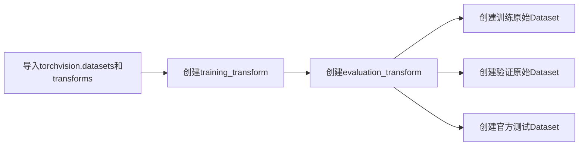
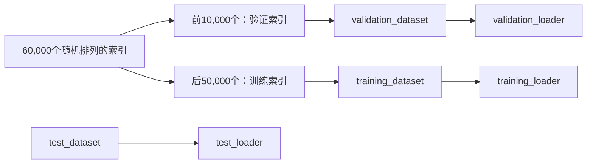
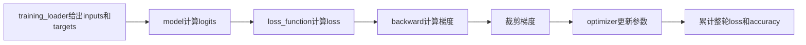
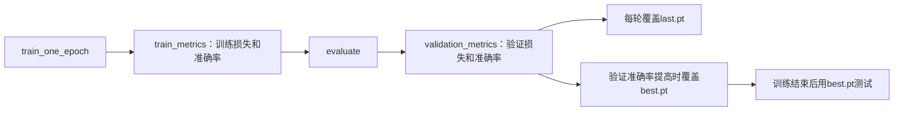

# 阶段3-3 PyTorch从数据集、网络建立到训练评估和推理的通用流程

这篇文章用FashionMNIST服饰分类任务串起一套完整PyTorch流程。代码按照文章出现顺序编写：一个变量只有在前面的代码已经创建并解释后，后面的代码才会使用它。

全文主线如下：


## 1 数据获取：创建数据变换和Dataset

这一部分先创建图像处理方法，再把它交给Dataset。这样第一次看到`training_transform`时，就已经知道它从哪里来、里面做了什么。



### 1.1 导入模块并定义任务输入输出

`datasets`来自`torchvision.datasets`模块，用于创建公开数据集对象；`transforms`来自`torchvision.transforms`模块，用于创建图像处理步骤。

```python
from pathlib import Path  # 用对象形式拼接和管理data、outputs等文件路径

import torch  # PyTorch主体：Tensor、设备、保存加载和训练工具
from torch import nn  # 神经网络层、损失函数和Module基类
from torch.utils.data import DataLoader, Subset  # 数据组批和索引子集
from torchvision import datasets, transforms  # 公开视觉数据集与图像变换

# 数据下载目录。Path("data")表示当前工程下的data文件夹。
DATA_DIRECTORY = Path("data")

# 模型输出第0～9列分别对应下面十个类别。
CLASS_NAMES = (
    "T-shirt/top",
    "Trouser",
    "Pullover",
    "Dress",
    "Coat",
    "Sandal",
    "Shirt",
    "Sneaker",
    "Bag",
    "Ankle boot",
)
NUM_CLASSES = len(CLASS_NAMES)
```

本任务的数据关系是：

| 对象 | shape | 含义 |
|---|---|---|
| 单张图像 | `(1,28,28)` | 1个灰度通道，图像高宽为28×28 |
| 一批图像 | `(N,1,28,28)` | `N`表示这一批实际有多少张图 |
| 标签 | `(N)` | 每张图对应一个0～9整数类别 |
| 模型输出 | `(N,10)` | 每张图得到10个原始类别分数 |

### 1.2 创建训练和评估使用的图像变换

`training_transform`用于训练数据，包含随机变化；`evaluation_transform`用于验证、测试和推理，只包含固定处理。

```python
# Compose表示按照列表顺序依次执行里面的处理。
training_transform = transforms.Compose(
    [
        # 每次读取训练图像时随机旋转和平移，增加训练样本变化。
        transforms.RandomAffine(
            degrees=8,                # 随机旋转范围为-8°～+8°
            translate=(0.08, 0.08),   # 水平和垂直最多平移图像尺寸的8%
        ),
        # 把PIL图像转换成shape为(1,28,28)的float32 Tensor，值域变为[0,1]。
        transforms.ToTensor(),
        # 对灰度通道计算(x-0.5)/0.5，处理后数值大致位于[-1,1]。
        transforms.Normalize(mean=(0.5,), std=(0.5,)),
    ]
)

# 验证、测试和推理需要稳定结果，因此不加入随机变化。
evaluation_transform = transforms.Compose(
    [
        transforms.ToTensor(),
        transforms.Normalize(mean=(0.5,), std=(0.5,)),
    ]
)
```

其他常见变换还有`Resize`、`RandomHorizontalFlip`和`ColorJitter`。选择时要符合数据含义，例如数字识别随意水平翻转会改变内容。验证和推理必须使用相同的尺寸、通道顺序和归一化参数。

### 1.3 使用图像变换创建Dataset

Dataset负责“根据一个索引返回一个样本”。`datasets.FashionMNIST(...)`会创建FashionMNIST Dataset对象。

```python
# train=True读取官方60,000张训练图。
# 这个对象使用training_transform，因此取样时会执行随机增强。
full_training_dataset = datasets.FashionMNIST(
    root=DATA_DIRECTORY,            # 数据文件下载和读取目录
    train=True,                     # 读取官方训练部分
    transform=training_transform,   # 每次取样时执行训练变换
    download=True,                  # 本地缺少数据时自动下载
)

# 这个对象读取同一份官方训练图，但使用固定的evaluation_transform。
# 后面会从它里面取出验证集。
full_validation_dataset = datasets.FashionMNIST(
    root=DATA_DIRECTORY,              # 与训练Dataset读取同一目录
    train=True,                       # 仍然读取官方训练部分
    transform=evaluation_transform,   # 使用固定变换，保证验证可重复
    download=True,                    # 已下载时直接读取，不会重复下载
)

# train=False读取官方10,000张测试图。测试集只在训练结束后使用。
test_dataset = datasets.FashionMNIST(
    root=DATA_DIRECTORY,              # 数据目录
    train=False,                      # 读取官方测试部分
    transform=evaluation_transform,   # 使用与验证相同的固定变换
    download=True,                    # 本地缺少测试文件时自动下载
)

# Dataset一次索引返回一张处理后的图像和一个整数标签。
sample_image, sample_target = full_training_dataset[0]
print(sample_image.shape)  # torch.Size([1, 28, 28])
print(sample_target)       # 0～9中的一个整数
```

这里创建两个读取官方训练部分的Dataset，是为了让训练数据使用随机变换、验证数据使用固定变换。两个对象暂时都能访问全部60,000张训练图，下一部分再用索引把它们分开。

## 2 数据整理：划分数据并创建DataLoader

这一部分把原始Dataset划分为训练、验证和测试三部分，再用DataLoader把多个单样本组成一批数据。



### 2.1 使用固定索引划分训练集和验证集

`Subset`保存“原Dataset对象和允许访问的索引”。它不会复制图像。

```python
VALIDATION_SIZE = 10_000
RANDOM_SEED = 2026

# 单独创建的Generator只控制这次划分。
# 相同RANDOM_SEED会生成相同索引顺序。
split_generator = torch.Generator().manual_seed(RANDOM_SEED)

# all_indices包含0～59999的随机排列。
all_indices = torch.randperm(
    len(full_training_dataset),  # 要排列的索引总数：60,000
    generator=split_generator,   # 使用上面固定种子的随机数生成器
).tolist()

# 两个切片没有重叠，所以同一张图不会同时参加训练和验证。
validation_indices = all_indices[:VALIDATION_SIZE]
training_indices = all_indices[VALIDATION_SIZE:]

# 训练索引交给带随机变换的Dataset。
training_dataset = Subset(
    full_training_dataset,  # 原Dataset：取样时执行training_transform
    training_indices,       # 只允许访问后50,000个随机索引
)

# 验证索引交给使用固定变换的Dataset。
validation_dataset = Subset(
    full_validation_dataset,  # 原Dataset：取样时执行evaluation_transform
    validation_indices,       # 只允许访问前10,000个随机索引
)

print(len(training_dataset))    # 50000
print(len(validation_dataset))  # 10000
print(len(test_dataset))        # 10000
```

视频数据不能直接随机拆帧，因为相邻帧内容非常接近。此时应按完整视频、拍摄序列或人员划分，防止近似画面同时进入训练集和验证集。

### 2.2 创建训练、验证和测试DataLoader

DataLoader负责从Dataset连续取样，并把多个样本组成batch。训练集需要打乱顺序，验证集和测试集保持固定顺序。

```python
BATCH_SIZE = 128
NUM_WORKERS = 0  # 初学和Windows调试先使用0，表示由主进程读取数据。

# CUDA训练时开启固定页内存，可配合non_blocking=True传输数据。
use_pin_memory = torch.cuda.is_available()

training_loader = DataLoader(
    training_dataset,              # 数据来源：前面划分出的50,000个训练样本
    batch_size=BATCH_SIZE,         # 每次最多返回128个样本
    shuffle=True,                  # 每个epoch开始时重新排列训练索引
    num_workers=NUM_WORKERS,       # 读取数据的子进程数，0表示使用主进程
    pin_memory=use_pin_memory,     # CUDA时把batch放入CPU固定页内存
    drop_last=False,  # 保留最后不足128个样本的一批。
)

validation_loader = DataLoader(
    validation_dataset,            # 数据来源：前面划分出的10,000个验证样本
    batch_size=BATCH_SIZE,         # 每次最多检查128个样本
    shuffle=False,                 # 保持固定顺序，便于复查具体样本
    num_workers=NUM_WORKERS,       # 与训练loader使用相同读取进程数
    pin_memory=use_pin_memory,     # CUDA时启用固定页内存
    drop_last=False,               # 验证必须保留最后一个小batch
)

test_loader = DataLoader(
    test_dataset,                  # 数据来源：官方10,000个测试样本
    batch_size=BATCH_SIZE,         # 每次最多检查128个样本
    shuffle=False,                 # 测试不需要打乱顺序
    num_workers=NUM_WORKERS,       # 数据读取子进程数
    pin_memory=use_pin_memory,     # CUDA时启用固定页内存
    drop_last=False,               # 测试必须统计全部样本
)
```

`shuffle=True`表示每轮训练重新排列训练样本。类别数量差距很大时，可以使用`WeightedRandomSampler`改变各类被抽到的机会；提供`sampler`后不再同时设置`shuffle=True`。

### 2.3 从DataLoader取得第一个真实batch

下面的两个变量是后续网络检查使用的数据。它们在这里第一次创建。

```python
# iter创建DataLoader迭代器，next只取第一批。
batch_inputs, batch_targets = next(iter(training_loader))

# batch_inputs由最多128张(1,28,28)图像沿第0维组成。
print(batch_inputs.shape)   # torch.Size([128, 1, 28, 28])

# batch_targets保存这一批每张图的整数类别。
print(batch_targets.shape)  # torch.Size([128])
print(batch_targets.dtype)  # torch.int64，也就是torch.long
```

最后一批可能不足128个样本，所以训练时要用`batch_targets.shape[0]`读取真实数量。

## 3 网络创建：定义模型并检查输入输出

这一部分先定义网络结构，再选择运行设备，最后把第2.3节已经创建的真实batch送入网络检查shape。


### 3.1 定义轻量卷积分类网络

下面的类接收一批`(N,1,28,28)`灰度图，先用两层卷积提取特征，再输出`(N,10)`类别分数。`__init__()`创建并保存网络层，`forward()`规定数据依次经过哪些层。

```python
class TinyFashionClassifier(nn.Module):
    """把(N,1,28,28)图像转换为(N,10)类别分数。"""

    def __init__(self, num_classes: int) -> None:
        super().__init__()

        # features负责从图像中提取32个通道的特征。
        self.features = nn.Sequential(
            # (N,1,28,28) -> (N,16,28,28)
            nn.Conv2d(
                in_channels=1,    # 输入是1通道灰度图
                out_channels=16,  # 使用16个卷积核，输出16通道
                kernel_size=3,    # 每个卷积核大小为3×3
                padding=1,        # 四周补1圈，使高宽保持28×28
                bias=False,       # 后面紧跟BatchNorm，因此省略卷积偏置
            ),
            nn.BatchNorm2d(16),   # 分别归一化16个输出通道
            nn.ReLU(),
            # (N,16,28,28) -> (N,16,14,14)
            nn.MaxPool2d(kernel_size=2),  # 每个2×2区域取最大值，高宽减半
            # (N,16,14,14) -> (N,32,14,14)
            nn.Conv2d(
                in_channels=16,   # 接收上一层的16通道特征
                out_channels=32,  # 输出32通道特征
                kernel_size=3,    # 卷积核大小3×3
                padding=1,        # 保持14×14空间尺寸
                bias=False,       # 后面紧跟BatchNorm
            ),
            nn.BatchNorm2d(32),   # 分别归一化32个输出通道
            nn.ReLU(),
            # 每个通道压缩成一个数：(N,32,14,14) -> (N,32,1,1)
            nn.AdaptiveAvgPool2d((1, 1)),
        )

        # classifier把每张图的32个特征转换成10个类别分数。
        self.classifier = nn.Sequential(
            nn.Flatten(start_dim=1),  # (N,32,1,1) -> (N,32)
            nn.Dropout(p=0.2),         # 训练时随机将20%的特征置0
            nn.Linear(
                in_features=32,       # 每张图输入32个特征
                out_features=num_classes,  # 输出10个类别分数
            ),
        )

    def forward(self, inputs: torch.Tensor) -> torch.Tensor:
        """inputs是NCHW图像batch，返回值是(N,num_classes)的logits。"""
        features = self.features(inputs)
        logits = self.classifier(features)
        return logits
```

`logits`是模型给每个类别的原始分数。训练时直接交给`CrossEntropyLoss`，不提前调用Softmax。

### 3.2 创建模型并用真实batch检查shape

下面先选择CPU或CUDA，再创建`model`。输入使用第2.3节已经取得的`batch_inputs`，输出`check_logits`只用于检查shape，不参与训练。

```python
# device表示模型和数据运行的位置。
device = torch.device("cuda" if torch.cuda.is_available() else "cpu")

# model是网络实例；to(device)把参数和BatchNorm状态迁移到目标设备。
model = TinyFashionClassifier(num_classes=NUM_CLASSES).to(device)

# 检查阶段不需要梯度，也不希望Dropout产生随机影响。
model.eval()
with torch.inference_mode():
    check_logits = model(batch_inputs.to(device))

expected_shape = (batch_inputs.shape[0], NUM_CLASSES)
if tuple(check_logits.shape) != expected_shape:
    raise RuntimeError(
        f"模型输出应为{expected_shape}，当前为{tuple(check_logits.shape)}"
    )

print(check_logits.shape)  # torch.Size([128, 10])
```

这个检查同时验证了Dataset、DataLoader和网络能够连接。若通道数写错，错误会在正式训练前出现。

### 3.3 创建损失函数、优化器、调度器和AMP状态

如果使用普通float32训练，你之前学过的参数更新流程完全正确：

```python
# 普通float32训练：loss直接反向传播，optimizer直接更新参数。
optimizer.zero_grad(set_to_none=True)  # 清除上一个batch留下的梯度
logits = model(inputs)                 # 前向传播，得到模型预测分数
loss = loss_function(logits, targets)  # 计算当前batch损失
loss.backward()                        # 计算梯度并写入每个参数的.grad
optimizer.step()                       # optimizer读取.grad并更新模型参数
```

`GradScaler`只在本Demo启用CUDA float16自动混合精度时发挥作用。float16能够表示的很小数值范围有限，使用float16算子的反向计算可能让很小的梯度下溢为0，模型就失去了这部分更新信息。GradScaler在反向传播前把损失乘一个较大的缩放倍数$S$：

\[
L_{scaled}=S L,
\qquad
\frac{\partial L_{scaled}}{\partial w}
=S\frac{\partial L}{\partial w}.
\]

例如真实梯度为$10^{-8}$，缩放倍数为$65536$时，反向传播暂时处理的梯度约为$6.55\times10^{-4}$，更容易保留下来。更新参数前，`unscale_()`再把梯度除以$S$，恢复真实梯度。

GradScaler不会取代损失函数或优化器。它负责四个辅助步骤：

| 调用 | 作用 |
|---|---|
| `scaler.scale(loss).backward()` | 放大loss后执行反向传播，从而得到放大的梯度 |
| `scaler.unscale_(optimizer)` | 把optimizer管理的梯度恢复到真实大小，之后才能检查或裁剪 |
| `scaler.step(optimizer)` | 梯度正常时调用`optimizer.step()`；发现Inf或NaN时跳过本次更新 |
| `scaler.update()` | 根据本批是否溢出调整下一批使用的缩放倍数 |

`unscale_(optimizer)`在一次`step()`之前只能调用一次，而且要在该优化器的全部梯度已经计算完成后调用。本Demo需要裁剪梯度，所以显式调用它；若不检查或修改梯度，`scaler.step(optimizer)`可以自行完成反缩放和溢出检查。[PyTorch AMP文档](https://docs.pytorch.org/docs/stable/amp.html)和[官方梯度裁剪示例](https://docs.pytorch.org/docs/stable/notes/amp_examples.html)给出了相同顺序。

当`enabled=False`时，这些调用会退化成普通训练路径：`scale(loss)`相当于直接使用loss，`step(optimizer)`相当于调用`optimizer.step()`。因此同一个训练函数能够同时支持CPU普通训练和CUDA AMP训练。

了解这层关系后，再创建本Demo需要的训练对象：

```python
# 比较(N,10) logits与(N)整数标签，返回当前batch平均损失。
loss_function = nn.CrossEntropyLoss()

# optimizer保存并更新model的可训练参数。
optimizer = torch.optim.AdamW(
    model.parameters(),  # 需要更新的参数，来自前面创建的model
    lr=1e-3,             # 初始学习率，每次参数更新的基础步长
    weight_decay=1e-2,   # 权重衰减系数，用于限制权重持续增大
)

# 每完成2个epoch，把学习率乘0.5。
scheduler = torch.optim.lr_scheduler.StepLR(
    optimizer,   # 要修改学习率的优化器
    step_size=2, # 每经过2个epoch调整一次
    gamma=0.5,   # 新学习率 = 旧学习率 × 0.5
)

# use_amp是布尔值：CUDA为True，CPU为False。
use_amp = device.type == "cuda"

# 第一个参数"cuda"表示管理CUDA float16训练的缩放状态。
# enabled=use_amp表示CPU运行时保留同一套调用形式，但关闭实际缩放。
scaler = torch.amp.GradScaler(
    "cuda",
    enabled=use_amp,
)
```

SGD是常见替代优化器；`CosineAnnealingLR`和`ReduceLROnPlateau`是常见学习率调整方法。`step()`调用位置由调度器类型决定，使用时必须查看对应接口说明。

## 4 训练：计算每个batch的损失并更新模型参数

这一部分定义单轮训练函数。函数接收前面已经创建的模型、训练DataLoader、损失函数、优化器和AMP状态，返回整轮训练结果。



### 4.1 定义一轮训练结果保存什么

下面的`EpochMetrics`是一个简单结果容器。训练函数或评估函数完成一个epoch后创建它，调用者通过三个字段读取整轮平均损失、准确率和样本数。

```python
from dataclasses import dataclass


@dataclass
class EpochMetrics:
    """保存模型遍历一次完整数据集后得到的结果。

    train_one_epoch()或evaluate()负责创建并返回该对象；调用者通过
    metrics.loss、metrics.accuracy和metrics.samples读取三个字段。
    """

    loss: float       # 整个数据集的平均损失
    accuracy: float   # 整个数据集的准确率
    samples: int      # 实际处理的样本总数
```

`EpochMetrics`只保存统计结果。模型参数保存在`model`中，优化器状态保存在`optimizer`中。

### 4.2 定义train_one_epoch训练函数

下面的函数输入是前面已经创建的训练对象，输出是一个`EpochMetrics`。函数内部每次循环处理一个batch，一个完整调用会遍历整个`training_loader`并更新模型参数。

```python
def train_one_epoch(
    model: nn.Module,                    # 前面创建的分类模型，本函数会更新其参数
    data_loader: DataLoader,             # training_loader，提供一个epoch的训练batch
    loss_function: nn.Module,            # CrossEntropyLoss，比较logits和targets
    optimizer: torch.optim.Optimizer,    # AdamW，读取梯度并更新model参数
    scaler: torch.amp.GradScaler,        # AMP损失缩放器；关闭AMP时退化为普通路径
    device: torch.device,                # model所在设备：CPU或CUDA
    use_amp: bool,                       # 是否启用CUDA float16自动混合精度
) -> EpochMetrics:
    """遍历一次完整训练集，更新模型参数并返回整轮训练结果。"""

    # 开启BatchNorm和Dropout的训练行为。
    model.train()

    # 这些变量从0开始累计当前整个epoch的结果。
    total_loss = 0.0
    total_correct = 0
    total_samples = 0

    for inputs, targets in data_loader:
        # inputs是(N,1,28,28)，targets是(N)；N以当前真实batch为准。
        current_batch_size = targets.shape[0]
        inputs = inputs.to(device, non_blocking=True)
        targets = targets.to(device, non_blocking=True)

        # PyTorch默认累加grad，每个batch开始前先清除旧梯度。
        optimizer.zero_grad(set_to_none=True)

        # autocast只包围前向传播和损失计算。
        with torch.autocast(
            device_type=device.type,  # 根据当前device选择CUDA或CPU上下文
            dtype=torch.float16,      # 启用时优先使用float16执行适合的算子
            enabled=use_amp,          # False时上下文不改变计算精度
        ):
            logits = model(inputs)
            loss = loss_function(logits, targets)

        if not torch.isfinite(loss):
            raise FloatingPointError(f"训练损失出现异常值：{loss.item()}")

        # 第一步：把loss乘当前缩放倍数，再执行backward生成放大的梯度。
        scaled_loss = scaler.scale(loss)
        scaled_loss.backward()

        # 第二步：把optimizer管理的梯度除以缩放倍数，恢复真实大小。
        # 梯度裁剪必须放在unscale_之后，否则裁剪的是放大后的错误数值。
        scaler.unscale_(optimizer)
        torch.nn.utils.clip_grad_norm_(
            model.parameters(),  # 要检查和裁剪的全部模型参数
            max_norm=1.0,        # 允许的最大梯度总范数
        )

        # 第三步：梯度正常时内部调用optimizer.step()更新model参数。
        # 如果梯度出现Inf或NaN，scaler会跳过当前batch的参数更新。
        scaler.step(optimizer)

        # 第四步：调整下一batch的缩放倍数。
        # 连续正常时可以逐渐增大，发生溢出时会减小。
        scaler.update()

        predictions = logits.argmax(dim=1)
        # loss是batch平均值，乘真实样本数后得到该批损失总和。
        total_loss += loss.detach().item() * current_batch_size
        total_correct += (predictions == targets).sum().item()
        total_samples += current_batch_size

    return EpochMetrics(
        loss=total_loss / total_samples,
        accuracy=total_correct / total_samples,
        samples=total_samples,
    )
```

`train_one_epoch()`每调用一次就遍历一次完整训练集。它返回的`train_metrics`将在第5节训练主循环中第一次创建。

梯度累积是扩展方法：连续处理多个小batch后再调用一次`step()`。使用它时，`zero_grad()`和`step()`的位置都要移动，损失也要除以累积次数。

## 5 效果评估：计算验证指标并保存last和best模型

这一部分先定义评估函数，随后才调用训练函数和评估函数，生成`train_metrics`与`validation_metrics`。



### 5.1 定义evaluate评估函数

下面的函数可以接收`validation_loader`或`test_loader`。它只执行前向计算和结果累计，返回整个数据集的`EpochMetrics`，不会修改模型参数。

```python
def evaluate(
    model: nn.Module,                  # 已经训练的模型；本函数只读取，不更新参数
    data_loader: DataLoader,           # validation_loader或test_loader
    loss_function: nn.Module,          # 用于计算验证或测试损失
    device: torch.device,              # model所在设备
    use_amp: bool,                     # 是否沿用训练时的CUDA AMP前向计算
) -> EpochMetrics:
    """遍历完整验证集或测试集，不更新模型参数，返回整体结果。"""

    # 固定BatchNorm状态并关闭Dropout随机屏蔽。
    model.eval()
    # 三个累计量只属于本次evaluate调用，函数结束后封装进EpochMetrics返回。
    total_loss = 0.0
    total_correct = 0
    total_samples = 0

    # inference_mode关闭自动求导记录，减少评估开销。
    with torch.inference_mode():
        for inputs, targets in data_loader:
            # 最后一个batch可能不足BATCH_SIZE，因此读取当前真实样本数。
            current_batch_size = targets.shape[0]
            # 把CPU batch迁移到model所在设备。
            inputs = inputs.to(device, non_blocking=True)
            targets = targets.to(device, non_blocking=True)

            # 评估只有前向传播，不使用GradScaler，因为没有backward产生梯度。
            with torch.autocast(
                device_type=device.type,  # CPU或CUDA
                dtype=torch.float16,      # AMP启用时的低精度类型
                enabled=use_amp,          # CPU时为False
            ):
                logits = model(inputs)
                loss = loss_function(logits, targets)

            # dim=1沿10个类别分数取最大值，得到shape为(N)的预测类别。
            predictions = logits.argmax(dim=1)
            # loss是batch平均损失，乘真实样本数后恢复本批损失总和。
            total_loss += loss.item() * current_batch_size
            total_correct += (predictions == targets).sum().item()
            total_samples += current_batch_size

    return EpochMetrics(
        loss=total_loss / total_samples,
        accuracy=total_correct / total_samples,
        samples=total_samples,
    )
```

`evaluate()`没有接收`optimizer`，也没有调用`backward()`和`step()`，所以模型参数不会被验证数据修改。

### 5.2 训练主循环以及train_metrics和validation_metrics

现在需要的变量和函数都已经在前面出现，可以开始完整训练。

```python
from pathlib import Path

OUTPUT_DIRECTORY = Path("outputs")
OUTPUT_DIRECTORY.mkdir(parents=True, exist_ok=True)
LAST_CHECKPOINT = OUTPUT_DIRECTORY / "last.pt"
BEST_CHECKPOINT = OUTPUT_DIRECTORY / "best.pt"

EPOCHS = 5
best_validation_accuracy = -1.0

for epoch in range(EPOCHS):
    # 返回当前完整训练集的平均损失、准确率和样本数。
    # train_one_epoch内部会更新模型参数。
    train_metrics = train_one_epoch(
        model=model,                      # 要训练的模型
        data_loader=training_loader,      # 提供完整训练集batch
        loss_function=loss_function,      # 交叉熵损失函数
        optimizer=optimizer,              # 更新模型参数的AdamW
        scaler=scaler,                    # AMP缩放器；CPU时关闭实际缩放
        device=device,                    # CPU或CUDA运行设备
        use_amp=use_amp,                  # 是否启用CUDA float16 AMP
    )

    # 使用刚训练完的模型检查完整验证集。
    # evaluate只统计结果，不更新模型参数。
    validation_metrics = evaluate(
        model=model,                      # 刚完成本轮训练的模型
        data_loader=validation_loader,    # 提供完整验证集batch
        loss_function=loss_function,      # 计算验证损失
        device=device,                    # 与model相同的设备
        use_amp=use_amp,                  # 与训练使用相同的前向精度开关
    )

    # 当前StepLR按epoch变化，因此每轮训练和验证结束后推进一次。
    scheduler.step()

    print(
        f"epoch={epoch + 1}/{EPOCHS} "
        f"train_loss={train_metrics.loss:.4f} "
        f"train_acc={train_metrics.accuracy:.4f} "
        f"val_loss={validation_metrics.loss:.4f} "
        f"val_acc={validation_metrics.accuracy:.4f}"
    )

    # 先判断当前模型是否刷新了历史最高验证准确率。
    is_best = validation_metrics.accuracy > best_validation_accuracy
    if is_best:
        best_validation_accuracy = validation_metrics.accuracy

    # checkpoint是一个Python字典，把一次训练需要保存的多种状态放在一起。
    # torch.save会把整个字典写入last.pt或best.pt。
    checkpoint = {
        # 当前刚完成的epoch编号。这里从0开始，恢复时从epoch + 1继续。
        "epoch": epoch,

        # 模型的参数和缓冲区，包括卷积权重、Linear权重以及BatchNorm状态。
        # 独立推理主要读取这个字段。
        "model": model.state_dict(),

        # AdamW优化器的内部状态，例如动量相关的历史值和更新次数。
        # 继续训练时需要恢复；只做推理时不需要读取。
        "optimizer": optimizer.state_dict(),

        # StepLR当前进行到哪一轮。恢复它可以继续原来的学习率变化过程。
        "scheduler": scheduler.state_dict(),

        # 自动混合精度的动态缩放状态。恢复CUDA AMP训练时需要读取。
        "scaler": scaler.state_dict(),

        # 截至当前epoch出现过的最高验证准确率，用于后续继续判断best模型。
        "best_validation_accuracy": best_validation_accuracy,

        # 模型输出下标到类别名称的对应表。推理时用它把数字类别转成名称。
        "class_names": list(CLASS_NAMES),

        # 训练时使用的归一化参数。推理时核对这两个字段，避免预处理不一致。
        "normalize_mean": [0.5],
        "normalize_std": [0.5],
    }

    # last.pt每轮覆盖，用于从最近一轮继续训练。
    torch.save(checkpoint, LAST_CHECKPOINT)

    # best.pt只在is_best为True时覆盖，用于最终测试和推理。
    if is_best:
        torch.save(checkpoint, BEST_CHECKPOINT)
```

`train_metrics`记录模型完成一个epoch训练后的整体结果；`validation_metrics`记录同一轮训练结束后，模型在完整验证集上的整体结果。它们都属于`EpochMetrics`对象。

`checkpoint`本身是一个Python字典。字典中的键是字段名称，右侧的值是这一轮结束时实际保存的状态：

| 字段 | 保存的内容 | 后续用途 |
|---|---|---|
| `epoch` | 刚完成的epoch编号 | 恢复训练时用`epoch + 1`确定下一轮从哪里开始 |
| `model` | 模型参数和BatchNorm等缓冲区 | 恢复模型；独立推理必须读取 |
| `optimizer` | AdamW的历史计算状态和更新次数 | 继续训练时保持优化过程连续 |
| `scheduler` | StepLR当前执行位置 | 继续按照原计划调整学习率 |
| `scaler` | AMP动态损失缩放状态 | 继续CUDA混合精度训练 |
| `best_validation_accuracy` | 截至当前轮的最高验证准确率 | 恢复后继续判断新模型是否应覆盖`best.pt` |
| `class_names` | 类别编号到类别名称的对应表 | 推理时把数字预测结果转换为服饰名称 |
| `normalize_mean` | 训练使用的归一化均值 | 推理时检查预处理是否与训练一致 |
| `normalize_std` | 训练使用的归一化标准差 | 推理时检查预处理是否与训练一致 |

`last.pt`和`best.pt`保存的字典结构相同，区别只在保存条件：`last.pt`每个epoch都会覆盖；`best.pt`只在`is_best`为`True`时覆盖。

### 5.3 加载best模型并检查测试集效果

下面先从`best.pt`取出验证准确率最高时的模型参数，再用`test_loader`检查一次最终效果。返回的`test_metrics`表示完整测试集的平均结果。

```python
# 训练完成后读取验证效果最好的模型。
best_checkpoint = torch.load(
    BEST_CHECKPOINT,      # 要读取的文件路径：outputs/best.pt
    map_location="cpu",  # 文件先加载到CPU，随后再把model迁移到device
    weights_only=True,    # 限制为Tensor和基本容器等权重检查点内容
)
# strict=True要求当前模型与检查点的参数名完全一致。
model.load_state_dict(best_checkpoint["model"], strict=True)
# 把加载完权重的模型迁移到前面选择的运行设备。
model.to(device)

# test_metrics记录最终模型在完整官方测试集上的结果。
test_metrics = evaluate(
    model=model,                  # 已加载best权重的模型
    data_loader=test_loader,      # 官方测试集DataLoader
    loss_function=loss_function,  # 计算测试平均损失
    device=device,                # 模型和batch所在设备
    use_amp=use_amp,              # CUDA时使用AMP前向计算
)

print(
    f"test_loss={test_metrics.loss:.4f} "
    f"test_accuracy={test_metrics.accuracy:.4f}"
)
```

分类任务还常用precision、recall、F1和混淆矩阵。检测任务常用precision、recall和mAP；分割任务常用IoU和Dice。选择best模型时要使用验证集指标，测试集只负责最后报告结果。

恢复训练时，需要先按第3节创建相同模型、优化器、调度器和GradScaler，再分别加载检查点字段。下一轮编号是`checkpoint["epoch"] + 1`。

## 6 推理：加载best模型并预测一个新样本

推理程序应模拟新进程：重新定义并创建模型，加载`best.pt`，执行与验证集相同的预处理，然后把模型分数转换为类别和概率。


### 6.1 重新创建模型并加载best检查点

下面代码放在单独的`infer.py`中时，需要把第1.1节的导入、类别表，第1.2节的`evaluation_transform`以及第3.1节的模型类一并放入该文件，或从公共模块导入它们。

```python
import time

# 推理设备可以和训练设备不同，map_location="cpu"先把文件读取到CPU。
inference_device = torch.device(
    "cuda" if torch.cuda.is_available() else "cpu"
)
loaded_checkpoint = torch.load(
    Path("outputs/best.pt"),  # 训练阶段保存的最佳验证模型
    map_location="cpu",      # 先加载到CPU，避免依赖训练时使用的GPU编号
    weights_only=True,        # 使用受限制的权重加载方式
)

# 类别顺序或归一化参数改变时，模型输出含义也会改变，因此先核对元数据。
if loaded_checkpoint["class_names"] != list(CLASS_NAMES):
    raise RuntimeError("检查点类别顺序与当前代码不一致")
if loaded_checkpoint["normalize_mean"] != [0.5]:
    raise RuntimeError("检查点归一化均值与当前代码不一致")
if loaded_checkpoint["normalize_std"] != [0.5]:
    raise RuntimeError("检查点归一化标准差与当前代码不一致")

inference_model = TinyFashionClassifier(NUM_CLASSES).to(inference_device)
# 把检查点中的模型参数和BatchNorm状态写入新模型。
inference_model.load_state_dict(loaded_checkpoint["model"], strict=True)
# 切换到推理行为：关闭Dropout并使用BatchNorm保存的运行统计量。
inference_model.eval()
```

### 6.2 预处理、模型计算和后处理

下面把一个固定测试样本当作新输入。代码依次记录预处理结果`inference_batch`、模型输出`inference_logits`和最终概率`inference_probabilities`，并分别统计三个阶段的毫秒耗时。

```python
# 使用与验证阶段相同的evaluation_transform创建推理输入来源。
inference_dataset = datasets.FashionMNIST(
    root=DATA_DIRECTORY,              # 与训练阶段相同的数据目录
    train=False,                      # 使用官方测试部分模拟新输入
    transform=evaluation_transform,   # 必须复用验证和推理的固定预处理
    download=True,                    # 本地缺少数据时下载
)

sample_index = 0

# 预处理阶段：Dataset返回(1,28,28)，unsqueeze增加batch维得到(1,1,28,28)。
preprocess_start = time.perf_counter()
inference_image, true_target = inference_dataset[sample_index]
inference_batch = inference_image.unsqueeze(0).to(inference_device)
preprocess_ms = (time.perf_counter() - preprocess_start) * 1000

# 模型阶段：输出shape为(1,10)的logits。
if inference_device.type == "cuda":
    torch.cuda.synchronize(inference_device)
forward_start = time.perf_counter()
with torch.inference_mode():
    inference_logits = inference_model(inference_batch)
if inference_device.type == "cuda":
    torch.cuda.synchronize(inference_device)
forward_ms = (time.perf_counter() - forward_start) * 1000

# 后处理阶段：Softmax转换为概率，argmax找到概率最大的类别下标。
postprocess_start = time.perf_counter()
inference_probabilities = torch.softmax(inference_logits, dim=1)[0].cpu()
predicted_index = int(inference_probabilities.argmax().item())
predicted_probability = float(inference_probabilities[predicted_index].item())
postprocess_ms = (time.perf_counter() - postprocess_start) * 1000

print(f"真实类别：{CLASS_NAMES[true_target]}")
print(
    f"预测类别：{CLASS_NAMES[predicted_index]}，"
    f"概率：{predicted_probability:.4f}"
)
print(
    f"预处理={preprocess_ms:.3f}ms，"
    f"模型计算={forward_ms:.3f}ms，"
    f"后处理={postprocess_ms:.3f}ms"
)
```

多标签分类使用Sigmoid后分别判断每个类别；检测模型还要解码检测框并执行非极大值抑制；分割模型常沿类别维使用`argmax`得到每个像素的类别。

### 6.3 train、eval和inference_mode分别控制什么

`model.train()`与`model.eval()`控制BatchNorm和Dropout的行为。`torch.inference_mode()`关闭自动求导记录。推理时两者都要使用。

```python
# 使用同一输入连续运行两次，观察不同模式下的输出差异。
fixed_input = torch.randn(8, 1, 28, 28).to(inference_device)

inference_model.train()
# train模式会启用Dropout随机屏蔽，并让BatchNorm使用当前batch统计量。
with torch.inference_mode():
    # 两次输入完全相同，输出差异主要来自Dropout随机性。
    train_output_1 = inference_model(fixed_input)
    train_output_2 = inference_model(fixed_input)

# eval模式关闭Dropout随机屏蔽，并让BatchNorm使用保存的运行统计量。
inference_model.eval()
with torch.inference_mode():
    # 模型状态和输入都不变，所以两次输出应一致。
    eval_output_1 = inference_model(fixed_input)
    eval_output_2 = inference_model(fixed_input)

# 分别计算两种模式下，两次输出之间最大的绝对差值。
train_difference = (train_output_1 - train_output_2).abs().max().item()
eval_difference = (eval_output_1 - eval_output_2).abs().max().item()

print(f"train模式两次输出最大差值：{train_difference:.8f}")
print(f"eval模式两次输出最大差值：{eval_difference:.8f}")
```

训练模式下Dropout会随机屏蔽部分值，两次输出会出现差异；评估模式下Dropout关闭，固定输入的两次输出应一致。只使用`inference_mode()`无法改变Dropout和BatchNorm的运行方式。

安装与运行所需依赖：

```bash
python -m pip install torch torchvision
python train.py
python infer.py
```
