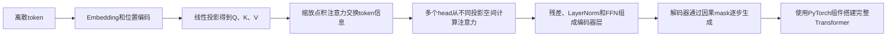
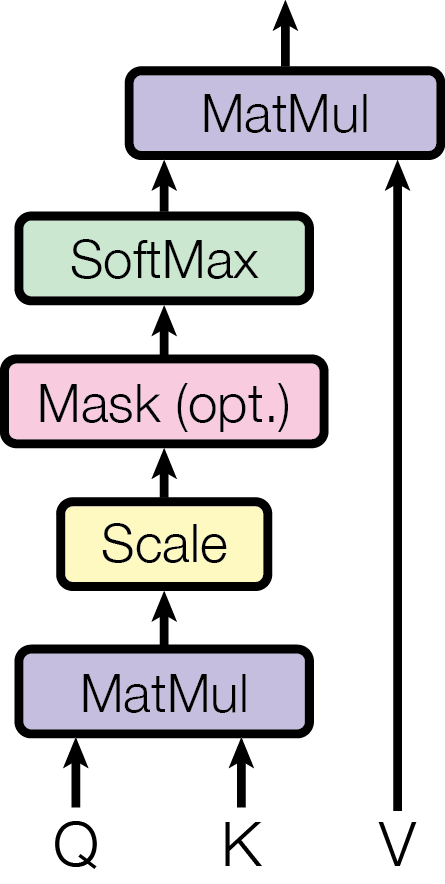
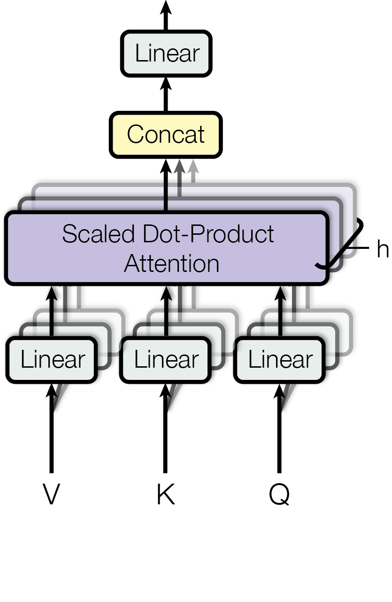
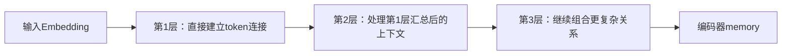

# 阶段3-4 Transformer的基本结构与PyTorch实现

Transformer是一种处理序列的神经网络结构。它接收一串token向量，通过注意力机制让序列中的不同位置交换信息，再由编码器或解码器完成理解、分类、序列转换和逐步生成等任务。

这篇文章只讲Transformer本身，重点回答下面这条因果链：



全文使用以下shape约定：

| 符号 | 含义 |
|---|---|
| $N$ | batch size，一批样本的数量 |
| $L$ | Query序列的token数量 |
| $S$ | Key和Value序列的token数量 |
| $D$ | 每个token的特征数，也写作$d_{model}$ |
| $H$ | 注意力头数 |
| $D_h$ | 每个注意力头的特征数，常取$D_h=D/H$ |

## 1 Transformer解决的问题与整体结构

Transformer处理的基本对象是一串token。token可以是字、子词、数字、音频片段或其他离散单元；模型内部使用固定长度的向量表示每个token。

### 1.1 Transformer如何处理序列

序列任务的难点来自上下文。同一个token在不同位置或不同句子中可能表达不同含义，当前位置的输出也可能依赖很远的位置。

Transformer的处理顺序为：

1. 将每个离散token转换为$D$维向量。
2. 给向量加入位置信息，让模型区分token顺序。
3. 使用Self-Attention，让每个位置读取同一序列中的其他位置。
4. 使用前馈网络继续变换每个token内部的特征。
5. 堆叠多层，使信息经过多轮交换和变换。

假设输入shape为`(N,L,D)=(2,5,128)`，它表示一批有2个样本，每个样本有5个token，每个token使用128个特征表示。一个标准编码器层处理后仍输出`(2,5,128)`，因为残差连接要求输入和输出shape一致。

### 1.2 编码器和解码器的职责

原始Transformer由编码器（Encoder）和解码器（Decoder）组成：

- 编码器读取完整输入序列，输出每个输入token的上下文表示。
- 解码器读取已经生成的目标token，同时查询编码器输出，然后预测下一个token。

以机器翻译为例：编码器一次读取完整源语言句子；解码器从起始token开始，每次生成一个目标语言token，直到输出结束token。


下图来自原始Transformer论文。左侧是编码器，右侧是解码器。图中的`N×`表示同类网络层重复堆叠。


图源：[Attention Is All You Need，Figure 1](https://arxiv.org/html/1706.03762#S3.F1)。

原图从下向上阅读：

- 左侧输入经过Embedding和位置编码，然后进入多层编码器。
- 右侧目标序列右移一位后进入解码器，使当前位置的输入只包含此前的目标token。
- 解码器第一层注意力使用mask屏蔽未来位置。
- 解码器第二层注意力使用编码器输出作为Key和Value。
- 最后的Linear和Softmax将解码器特征转换成词表概率。

### 1.3 编码器、解码器和只用其中一部分的模型

完整编码器—解码器结构适合“输入一个序列，输出另一个序列”的任务，例如翻译、摘要和格式转换。

有些任务只使用编码器。例如句子分类需要读取完整句子，然后输出一个类别，不需要逐步生成目标序列。

有些生成模型只使用解码器。它们通过因果mask读取当前位置以前的token，重复预测下一个token。无论采用哪种组合，QKV注意力、残差连接、LayerNorm和前馈网络仍然是核心组件。

## 2 token向量、Embedding与位置编码

注意力层不能直接处理“猫”“dog”或整数编号等离散符号。进入注意力前，每个token必须先变成$D$维浮点向量，并加入代表顺序的位置向量。

### 2.1 token编号如何变成Embedding向量

`nn.Embedding(vocabulary_size, embedding_dimension)`保存一张可训练向量表。词表中的每个token占一行，输入整数编号后，模块取出对应行。

假设词表中有10000个token，每个token使用128维向量：

$$
E\in\mathbb{R}^{10000\times128}
$$

输入编号shape为`(N,L)=(2,4)`，查表后的输出shape为`(N,L,D)=(2,4,128)`。

```python
import torch
from torch import nn

vocabulary_size = 10_000      # 合法token编号范围为0～9999
embedding_dimension = 128     # 每个token输出128个特征

token_embedding = nn.Embedding(
    num_embeddings=vocabulary_size,     # Embedding表的行数，也就是词表大小
    embedding_dim=embedding_dimension,  # 每一行向量的特征数，也就是输出维度D
)

# 一批有2个序列，每个序列有4个token编号。
token_ids = torch.tensor(
    [
        [18, 205, 73, 9],
        [51, 6, 810, 2],
    ],
    dtype=torch.long,
)

# 每个整数编号从Embedding权重表中取出一行128维向量。
token_vectors = token_embedding(token_ids)

print(token_ids.shape)      # torch.Size([2,4])
print(token_vectors.shape)  # torch.Size([2,4,128])
```

这里的`vocabulary_size`限制输入编号范围，`embedding_dimension`规定输出特征数。batch大小与序列长度由实际输入决定。

### 2.2 为什么必须提供位置信息

Self-Attention根据token内容计算相关性。若两个输入只交换token顺序，并且没有加入任何位置表示，注意力无法区分“猫追狗”和“狗追猫”中的先后关系。

位置编码为第$pos$个token提供一个$D$维位置向量：

$$
X_{input}=X_{embedding}+X_{position}
$$

两个张量的shape都必须为`(N,L,D)`，或者位置张量使用`(1,L,D)`并沿batch维广播。相加后，每个token向量同时包含内容信息和位置信息。

工程中常见的位置表示包括可学习绝对位置Embedding和旋转位置编码（Rotary Position Embedding，RoPE）。固定正弦余弦位置编码主要用于理解或复现原始Transformer结构。

### 2.3 工程中位置表示的选择和使用

工程选择可以按下面的顺序判断：

1. 使用预训练模型时，直接沿用该模型内部的位置表示。位置参数参与了预训练，随意替换会让已有权重不再匹配原来的计算过程。
2. 使用`nn.Transformer`从头搭建普通定长任务时，可学习位置Embedding实现最直接，只需再创建一个`nn.Embedding(maximum_length,D)`。
3. 构建现代大语言模型时经常使用RoPE。实际项目通常调用已经实现RoPE的模型库或模型代码，避免在业务工程中重新实现旋转、缓存和长上下文缩放细节。

本文最终Demo属于第二种情况，因此使用可学习位置Embedding。它的执行顺序为：

```text
token编号
→ nn.Embedding得到内容向量
→ 乘以sqrt(D)调整数值尺度
→ 加入位置编码
→ Dropout
→ Transformer第一层
```

位置编号`[0,1,...,L-1]`经过位置Embedding后得到`(1,L,D)`，再沿batch维与`(N,L,D)`的token向量相加。若输入长度超过`maximum_length`，位置编号会超出Embedding表范围，所以模型必须限制输入长度或扩大位置表并重新训练相关参数。

```python
maximum_length = 128
embedding_dimension = 64

# 每个序列位置保存一行可训练的64维向量。
position_embedding = nn.Embedding(
    num_embeddings=maximum_length,     # 可表示的位置总数，合法编号为0～127
    embedding_dim=embedding_dimension, # 每个位置向量的特征数，必须与token向量相同
)

# 当前序列长度为5，位置编号为0～4。
position_ids = torch.arange(5).unsqueeze(0)  # (5,)增加batch维后变为(1,5)
position_vectors = position_embedding(position_ids)  # 查表后得到(1,5,64)

print(position_vectors.shape)  # torch.Size([1,5,64])
```

PyTorch的`nn.Transformer`只实现Transformer主体，位置表示由调用者或更高层模型提供。[PyTorch nn.Transformer官方文档](https://docs.pytorch.org/docs/stable/generated/torch.nn.Transformer.html)。现代模型库会把RoPE等方案封装进具体模型配置，例如Llama模型通过`rope_parameters`保存RoPE类型和缩放参数。[Hugging Face RoPE文档](https://huggingface.co/docs/transformers/internal/rope_utils)

## 3 Query、Key、Value与缩放点积注意力

注意力的作用是让一个token根据当前内容，从其他token中选择并汇总信息。Query、Key和Value分别承担“提出查询”“参与匹配”和“提供内容”三个职责。

### 3.1 Q、K、V为什么需要三组不同投影

设输入序列为：

$$
X\in\mathbb{R}^{N\times L\times D}
$$

模型使用三组独立的可训练参数：

$$
Q=XW^Q,\qquad K=XW^K,\qquad V=XW^V
$$

其中：

- $Q$描述当前位置寻找信息时使用的查询特征。
- $K$描述每个候选位置用于接受查询匹配的特征。
- $V$保存匹配完成后真正参与汇总的内容特征。

三者由同一个$X$产生时称为Self-Attention。它们的输入来源相同，投影参数互相独立，因此会学习不同表示。

将K和V分开具有明确作用。K只参与计算“应该读取多少”，V只参与计算“实际取回什么”。如果匹配分数直接使用V计算，负责寻找位置的特征和负责传递内容的特征会被绑定在同一表示中，模型的学习空间会受到限制。

### 3.2 从QK转置到加权V的完整过程

缩放点积注意力公式为：

$$
\operatorname{Attention}(Q,K,V)
=\operatorname{softmax}\left(\frac{QK^T}{\sqrt{d_k}}\right)V
$$

它包含五个连续步骤。

第一步，转置K的最后两维：

$$
Q:(N,L,d_k),\qquad K^T:(N,d_k,S)
$$

第二步，Q与$K^T$相乘：

$$
QK^T:(N,L,S)
$$

矩阵中第$i$行第$j$列表示第$i$个Query与第$j$个Key的匹配分数。每个Query都有一整行分数，用来比较全部$S$个候选位置。

第三步，除以$\sqrt{d_k}$。如果Q和K的各维近似独立、均值为0、方差为1，它们点积的方差为$d_k$。除以$\sqrt{d_k}$后，分数方差回到约1，Softmax更少进入梯度接近0的饱和区域。

第四步，在最后一维执行Softmax：

$$
A=\operatorname{softmax}\left(\frac{QK^T}{\sqrt{d_k}}\right)
$$

$A$的shape为`(N,L,S)`。每一行元素都大于0且总和为1，表示一个Query向$S$个Value分配的读取比例。

第五步，权重矩阵乘V：

$$
A:(N,L,S),\qquad V:(N,S,d_v)
$$

$$
AV:(N,L,d_v)
$$

输出中的每个Query位置都是全部Value的加权和。注意力完成的信息交换发生在这一步。

下图将公式按执行顺序画成了计算结构：



图源：[Attention Is All You Need，Figure 2左图](https://arxiv.org/html/1706.03762#S3.F2)。

### 3.3 注意力分数为0时为什么Softmax权重仍大于0

考虑一个Query、两个Key和两个Value：

$$
Q=\begin{bmatrix}1&0\end{bmatrix},\quad
K=\begin{bmatrix}1&0\\0&1\end{bmatrix},\quad
V=\begin{bmatrix}10&0\\0&20\end{bmatrix}
$$

缩放后的两个匹配分数为：

$$
\frac{QK^T}{\sqrt{2}}
=\begin{bmatrix}0.707&0\end{bmatrix}
$$

Softmax先对每个分数取指数，再除以指数之和：

$$
e^{0.707}\approx2.028,\qquad e^0=1
$$

$$
\operatorname{softmax}([0.707,0])
=\left[
\frac{2.028}{2.028+1},
\frac{1}{2.028+1}
\right]
\approx[0.670,0.330]
$$

原始分数0表示该Key没有获得正分或负分，它仍是有效候选位置。由于$e^0=1$，Softmax会为它分配正权重。只有将分数屏蔽为$-\infty$时，对应权重才严格等于0：

$$
\operatorname{softmax}([0.707,-\infty])=[1,0]
$$

最后的`0.330`乘的是第二个Value，不会返回去乘原始分数0：

$$
[0.670,0.330]
\begin{bmatrix}10&0\\0&20\end{bmatrix}
=0.670[10,0]+0.330[0,20]
=[6.70,6.60]
$$

这也说明注意力分数、注意力权重和Value是三个不同对象：分数用于比较，Softmax把分数转换为比例，比例再用于汇总Value。

### 3.4 注意力权重能说明什么

一个Query对应的一行注意力权重表示该位置在本次前向传播中，从各个Value位置读取信息的比例。权重会随输入内容和模型参数改变，同一位置面对不同输入可以形成不同分布。

较高权重说明该Value对当前注意力输出的直接贡献比例较高。它仍然不能单独证明某个token对最终预测具有因果决定作用，因为Value投影、后续输出投影、残差、FFN和更多网络层还会继续改变特征。

## 4 单头注意力与多头注意力的区别

单头注意力只产生一套Q、K、V和一个注意力权重矩阵。多头注意力使用多组独立投影，在多个较小特征空间中并行产生多套注意力权重，再把结果拼接起来。

### 4.1 单头注意力只有一种匹配空间

设模型维度为$D=8$。单头注意力可以把输入投影成8维Q、K、V，然后计算一个`(L,S)`注意力矩阵：

$$
A=\operatorname{softmax}\left(\frac{QK^T}{\sqrt{8}}\right)
$$

对于某个Query，单头只得到一行权重。例如序列中有4个token：

$$
A_{query}=[0.60,0.25,0.10,0.05]
$$

这行权重同时控制8维Value的汇总。单头可以学习复杂关系，但它只能通过一套投影参数和一套权重分布完成本层的信息选择。

如果某个token需要同时保留两类连接，例如一类连接偏向相邻位置，另一类连接偏向远距离位置，单头会把这些需求压进同一套权重分布和同一个加权结果中。

### 4.2 多头注意力如何产生多套权重

设$D=8$、头数$H=2$，每个head的维度为：

$$
D_h=\frac{D}{H}=\frac{8}{2}=4
$$

每个head都有自己的投影参数：

$$
Q_i=XW_i^Q,\qquad K_i=XW_i^K,\qquad V_i=XW_i^V
$$

$$
head_i=\operatorname{Attention}(Q_i,K_i,V_i)
$$

因此两个head会得到两个不同的注意力矩阵：

$$
A_1=\operatorname{softmax}\left(\frac{Q_1K_1^T}{\sqrt{4}}\right)
$$

$$
A_2=\operatorname{softmax}\left(\frac{Q_2K_2^T}{\sqrt{4}}\right)
$$

假设同一个Query在两个head中得到：

$$
A_{1,query}=[0.70,0.20,0.08,0.02]
$$

$$
A_{2,query}=[0.05,0.10,0.25,0.60]
$$

第一个head主要读取前两个位置，第二个head主要读取最后两个位置。两套分布可以同时保留，随后分别对$V_1$和$V_2$加权。

需要注意的是，每个head关注什么由训练决定。代码只为head提供独立投影参数，没有预先规定“第一个head看邻近位置”“第二个head看远处位置”。

### 4.3 多头结果为什么要拼接并再次投影

每个head输出shape为`(N,L,D_h)`。将$H$个head沿特征维拼接：

$$
\operatorname{Concat}(head_1,\ldots,head_H)
\in\mathbb{R}^{N\times L\times(H\cdot D_h)}
$$

当$D_h=D/H$时，拼接结果恢复为`(N,L,D)`。随后再乘输出矩阵$W^O$：

$$
\operatorname{MultiHead}(Q,K,V)
=\operatorname{Concat}(head_1,\ldots,head_H)W^O
$$

拼接只是把各head特征并排放置，$W^O$负责重新组合不同head提供的信息，并输出残差连接要求的$D$维特征。

可以把`D=100、H=5`的情况总结为：每个token始终是一个token，五个head都会读取这个token完整的100维输入特征；每个head再使用自己独立的Q、K、V投影，把100维输入映射成20维Q、K、V，并对全部token独立计算一套注意力。注意力计算完成后，每个head为每个token输出20维特征，五组20维结果沿特征维拼接成100维，最后再经过$W^O$混合。这里的20维来自完整100维特征的线性组合，模型不会预先把原始特征的第0～19维固定交给第一个head、第20～39维固定交给第二个head。

下图左下方表示Q、K、V的多组线性投影，中间表示$H$个并行注意力，顶部表示Concat和最终Linear。



图源：[Attention Is All You Need，Figure 2右图](https://arxiv.org/html/1706.03762#S3.F2)。

### 4.4 单头和多头的计算与表达差异

| 对比项 | 单头注意力 | 多头注意力 |
|---|---|---|
| 投影参数 | 一组Q、K、V投影 | 每个head拥有独立投影 |
| 注意力矩阵数量 | 1个 | $H$个 |
| 每个head维度 | 常使用完整$D$维 | 常使用$D/H$维 |
| 同一Query的权重分布 | 1套 | $H$套，可以同时保留不同连接方式 |
| 输出处理 | 得到一个加权结果 | 拼接各head后通过$W^O$混合 |

固定总模型维度$D$时，多头QK矩阵乘法的主要乘加次数为：

$$
H\cdot L\cdot S\cdot D_h
=H\cdot L\cdot S\cdot\frac{D}{H}
=L\cdot S\cdot D
$$

它与一个D维单头的主要QK乘加次数相同。多头仍需保存$H$个注意力矩阵，并包含拆分、拼接与投影开销。头数增加也会让每个head维度减小；例如$D=128$时，`num_heads=8`得到$D_h=16$，`num_heads=64`只得到$D_h=2$。因此头数需要结合模型维度设置。

PyTorch可以返回每个head各自的权重，直观看到多头与平均权重的差别：

```python
import torch
from torch import nn

embedding_dimension = 8
head_count = 2

attention = nn.MultiheadAttention(
    embed_dim=embedding_dimension, # 输入、输出中每个token的总特征数D=8
    num_heads=head_count,          # 拆成2个head，所以每个head内部维度Dh=8/2=4
    batch_first=True,              # 约定Tensor排列为(N,L,D)，batch维放在最前面
)

# 一批1个样本，包含4个token，每个token有8个特征。
tokens = torch.randn(1, 4, embedding_dimension)

output, weights_per_head = attention(
    query=tokens,              # 要查询信息的token，shape为(N,L,D)
    key=tokens,                # 用于和Query计算匹配分数；同源表示Self-Attention
    value=tokens,              # 按注意力权重汇总的内容；同样来自tokens
    need_weights=True,         # 除输出向量外，还返回注意力权重，便于观察
    average_attn_weights=False,  # 保留每个head，禁止在head维求平均
)

print(output.shape)            # (N,L,D)=(1,4,8)
print(weights_per_head.shape)  # (N,H,L,S)=(1,2,4,4)
print(weights_per_head[0, 0])  # 第1个head的4×4注意力矩阵
print(weights_per_head[0, 1])  # 第2个head的4×4注意力矩阵
```

模型刚创建时权重是随机的，两张矩阵没有稳定语义。经过针对具体任务的训练后，不同head才可能形成有规律的连接。

## 5 Self-Attention、Cross-Attention与mask

Self-Attention和Cross-Attention使用同一个注意力公式。区别来自Q、K、V的数据来源。mask则在Softmax之前修改匹配分数，控制哪些位置可以建立连接。

### 5.1 Self-Attention与Cross-Attention的数据来源

Self-Attention中：

$$
Q=XW^Q,\quad K=XW^K,\quad V=XW^V
$$

Q、K、V都读取同一序列$X$。编码器用它让每个输入token读取其他输入token；解码器用带因果mask的Self-Attention读取已经出现的目标token。

Cross-Attention中：

$$
Q=YW^Q,\quad K=XW^K,\quad V=XW^V
$$

$Y$是解码器当前状态，$X$是编码器输出。解码器中的每个Query通过K寻找输入序列中的相关位置，再从对应V取回编码信息。

如果目标序列长度为$L=6$、源序列长度为$S=10$，Cross-Attention权重shape为`(N,H,6,10)`。输出token数量跟随Q，所以输出shape为`(N,6,D)`。

### 5.2 padding mask如何屏蔽补齐位置

同一个batch中的序列长度经常不同。为了组成矩形Tensor，较短序列会在末尾补PAD token：

```text
样本1：[A, B, C, PAD, PAD]
样本2：[D, E, F, G,   H  ]
```

PAD只负责占位，不包含有效内容。padding mask在注意力分数进入Softmax前，把PAD对应Key的分数改为$-\infty$。因此其他token不会从这些位置读取Value。

对上面两个样本，布尔mask可以表示为：

```text
样本1：[False, False, False, True, True]
样本2：[False, False, False, False, False]
```

在`nn.MultiheadAttention`和`nn.Transformer`的`key_padding_mask`中，`True`表示该Key位置被屏蔽。

### 5.3 causal mask如何阻止读取未来token

解码器训练时会一次并行处理整段目标序列。若没有因果mask，第1个位置可以直接读取第4个位置的正确答案，训练过程会泄漏未来信息。

长度为4的因果mask对应以下连接关系：

$$
M=
\begin{bmatrix}
0&-\infty&-\infty&-\infty\\
0&0&-\infty&-\infty\\
0&0&0&-\infty\\
0&0&0&0
\end{bmatrix}
$$

第$i$行是第$i$个Query，只允许读取本位置及其左侧位置。mask加到注意力分数后再执行Softmax，被填为$-\infty$的位置得到0权重。

### 5.4 mask改变的是连接权限

padding mask和causal mask解决的问题不同：

| mask | 屏蔽对象 | 典型shape | 使用位置 |
|---|---|---|---|
| padding mask | 每个样本中补出的PAD Key | `(N,S)` | 编码器Self-Attention、解码器Self-Attention、Cross-Attention |
| causal mask | 当前Query右侧的未来Key | `(L,L)` | 解码器Self-Attention |

两种mask可以同时使用。causal mask保证时间方向，padding mask保证补齐位置不参与读取。mask只修改注意力连接，不会自动删除PAD位置的输出，所以损失函数还要通过`ignore_index`忽略目标中的PAD标签。

## 6 Transformer编码器层的完整工作机制

一个编码器层由多头Self-Attention和逐位置前馈网络（Position-wise Feed-Forward Network，FFN）组成。两个子层周围都有残差连接、Dropout和LayerNorm。

### 6.1 Self-Attention负责token之间的信息交换

编码器输入为$X\in\mathbb{R}^{N\times L\times D}$。Self-Attention让每个位置生成自己的Query，并与全部位置的Key比较，再读取Value。

这一过程改变的是每个token包含的上下文。例如某个token原先只包含自身Embedding，经过Self-Attention后，它的输出会混入其他位置的Value信息。输出shape保持`(N,L,D)`，token数量没有改变。

对于不含因果限制的编码器，第$i$个token可以读取第1到第$L$个全部token。PAD位置需要通过padding mask排除。

### 6.2 残差连接和LayerNorm如何稳定信息传递

残差连接把子层输入直接加到子层输出：

$$
Y=X+F(X)
$$

$F(X)$表示注意力或FFN的计算结果。即使当前子层学习效果有限，$X$仍可沿加法路径传到下一层；反向传播的梯度也有一条直接经过加法的路径。

LayerNorm对每个token的$D$个特征独立归一化。输入shape为`(N,L,D)`且使用`nn.LayerNorm(D)`时，会执行$N\times L$次归一化，不会把不同样本或不同token混合统计。

原始Transformer采用post-norm：

$$
Y=\operatorname{LayerNorm}(X+F(X))
$$

许多后续模型使用pre-norm：

$$
Y=X+F(\operatorname{LayerNorm}(X))
$$

pre-norm把归一化放在子层之前，残差主路径从$X$到$Y$不经过LayerNorm。它在堆叠较深网络时常用于改善梯度传播。PyTorch通过`norm_first=True`选择pre-norm。

### 6.3 FFN负责每个token内部的特征变换

注意力沿token维混合信息，FFN沿特征维变换信息。FFN对每个token分别执行相同的两层全连接网络：

$$
\operatorname{FFN}(x)=W_2\,\sigma(W_1x+b_1)+b_2
$$

常见维度变化为：

$$
D\rightarrow D_{ff}\rightarrow D
$$

例如$D=128$、$D_{ff}=512$：第一层Linear把每个token从128维扩展到512维，激活函数产生非线性，第二层再降回128维，以便与残差输入相加。

FFN不会让第$i$个token读取第$j$个token，因为Linear只作用于最后一维。跨token信息已经由前面的Self-Attention完成交换；FFN负责继续组合和筛选当前token已有的特征。

### 6.4 堆叠编码器层会发生什么

一层编码器完成一次“跨token交换信息”和一次“token内部特征变换”。堆叠多层后，上层处理的是下层已经包含上下文的token。



每层拥有独立参数。`num_layers=6`表示六层结构相同、参数互不共享的编码器层按顺序执行。层数增加会提高模型容量和计算量，也会增加训练稳定性与数据规模要求。

## 7 Transformer解码器与自回归生成

解码器在编码器层的基础上增加Cross-Attention，并在Self-Attention中加入因果mask。它的输出用于预测目标序列下一个token。

### 7.1 一个解码器层包含三个子层

一个标准解码器层依次包含：

1. 带因果mask的多头Self-Attention，读取已经出现的目标token。
2. 多头Cross-Attention，使用解码器状态作为Q，编码器memory作为K和V。
3. FFN，分别变换每个目标token的内部特征。

三个子层都配有残差、Dropout和LayerNorm。若目标输入shape为`(N,L,D)`，编码器memory为`(N,S,D)`，解码器输出仍为`(N,L,D)`。

Cross-Attention中的权重矩阵为`(N,H,L,S)`：每个目标位置拥有$H$套分布，每套分布都在$S$个源token之间分配读取比例。

### 7.2 训练时为什么把目标序列右移一位

假设正确目标序列为：

```text
[我, 喜欢, 猫, EOS]
```

训练时构造：

```text
解码器输入：[BOS, 我, 喜欢, 猫]
监督标签：  [我, 喜欢, 猫, EOS]
```

BOS表示序列开始，EOS表示序列结束。两个序列错开一位，因此每个位置都在学习“根据此前token预测下一个token”。

训练可以并行处理全部位置，但必须加入因果mask。第2个位置只能读取`[BOS, 我]`，不能读取后面的`喜欢`和`猫`。这种使用真实历史目标token作为解码器输入的训练方式称为教师强制（Teacher Forcing）。

### 7.3 推理时为什么必须逐步生成

推理开始时只有BOS，没有后续正确答案。模型需要重复执行：

```text
[BOS] → 预测“我”
[BOS, 我] → 预测“喜欢”
[BOS, 我, 喜欢] → 预测“猫”
[BOS, 我, 喜欢, 猫] → 预测EOS并停止
```

每一步都会把当前全部已生成token重新交给解码器，取最后一个位置的logits选择下一个token。贪心解码直接选择概率最高的token；束搜索、采样、温度等方法会采用不同选择策略。

训练阶段拥有完整目标，可以一次并行计算所有位置；推理阶段的下一个输入依赖上一步输出，所以自回归生成沿序列长度逐步执行。

### 7.4 Linear和Softmax如何得到下一个token

解码器输出的每个位置是D维向量。最后一层Linear将D维映射到词表大小$V$：

$$
Z=HW_{vocab}+b
$$

若$H$的shape为`(N,L,D)`，$W_{vocab}$对应`D→V`，则logits的shape为`(N,L,V)`。训练时`CrossEntropyLoss`直接接收logits，不需要先手动Softmax；该损失内部会以数值稳定方式完成LogSoftmax和负对数似然计算。

推理时可以对最后一个位置执行Softmax得到概率：

$$
P(y_{next})=\operatorname{softmax}(Z[:,-1,:])
$$

然后选择下一个token，并将它追加到解码器输入。

## 8 PyTorch提供的Transformer封装

PyTorch从注意力计算到完整编码器—解码器都提供了官方组件。选择哪个层级取决于你希望自己控制多少结构。

### 8.1 从注意力函数到完整Transformer的封装层级

| API | 已经封装的内容 | 仍需自己提供的内容 |
|---|---|---|
| `F.scaled_dot_product_attention` | 缩放、mask、Softmax、Dropout、加权V | QKV投影、多头拆分、输出投影 |
| `nn.MultiheadAttention` | QKV投影、多头注意力、拼接、输出投影 | 残差、LayerNorm、FFN |
| `nn.TransformerEncoderLayer` | 编码器的一层完整结构 | 多层堆叠、Embedding、位置编码、任务头 |
| `nn.TransformerEncoder` | 多层编码器 | Embedding、位置编码、任务头 |
| `nn.TransformerDecoderLayer` | 解码器的一层完整结构 | 多层堆叠、Embedding、位置编码、任务头 |
| `nn.Transformer` | 完整编码器和解码器 | token Embedding、位置编码、输出Linear、训练与生成流程 |

这些组件提供网络主体，不包含分词器和具体任务的数据处理。`nn.Transformer`收到的`src`和`tgt`已经应是`(N,L,D)`浮点向量。

### 8.2 nn.MultiheadAttention的主要参数和输入

```python
import torch
from torch import nn

multihead_attention = nn.MultiheadAttention(
    embed_dim=256,      # 输入和输出token的特征数D
    num_heads=8,        # 8个head，每个head维度为256/8=32
    dropout=0.1,        # 训练时作用于注意力权重的Dropout概率
    batch_first=True,   # 输入输出使用(N,L,D)
)

query_tokens = torch.randn(2, 6, 256)  # 6个Query
memory_tokens = torch.randn(2, 10, 256) # 编码器输出的10个token，作为Key和Value

# Q与K、V来源不同，因此这是Cross-Attention调用。
attention_output, attention_weights = multihead_attention(
    query=query_tokens,             # (N,L,D)=(2,6,256)，决定输出有6个位置
    key=memory_tokens,              # (N,S,D)=(2,10,256)，提供10个可匹配位置
    value=memory_tokens,            # (N,S,D)，提供最终要加权汇总的内容
    need_weights=True,              # 同时返回注意力权重，调试时使用
    average_attn_weights=False,     # 不把8个head求平均，保留head维
)

print(attention_output.shape)   # (2,6,256)，token数量跟随Query
print(attention_weights.shape)  # (2,8,6,10)，保留8个head
```

`embed_dim`必须能被`num_heads`整除。`need_weights=False`可以省去返回权重，在训练和部署中不需要观察权重时更合适。[PyTorch MultiheadAttention官方文档](https://docs.pytorch.org/docs/stable/generated/torch.nn.MultiheadAttention.html)

### 8.3 TransformerEncoderLayer和TransformerDecoderLayer

下面创建一层编码器和一层解码器。两个对象都使用`batch_first=True`，所以输入统一采用`(N,L,D)`：

```python
from torch import nn

encoder_layer = nn.TransformerEncoderLayer(
    d_model=256,          # 模型维度D
    nhead=8,              # 多头注意力头数H
    dim_feedforward=1024, # FFN中间维度Dff
    dropout=0.1,          # Attention和FFN等位置使用的Dropout概率
    activation="gelu",   # FFN中两层Linear之间的非线性激活函数
    batch_first=True,     # 编码器输入输出统一使用(N,S,D)
    norm_first=True,      # 使用pre-norm
)

decoder_layer = nn.TransformerDecoderLayer(
    d_model=256,          # 解码器每个token的特征数D
    nhead=8,              # Masked Self-Attention和Cross-Attention都使用8个head
    dim_feedforward=1024, # 解码器FFN的中间特征数
    dropout=0.1,          # 训练时随机丢弃部分中间结果
    activation="gelu",   # 解码器FFN使用GELU
    batch_first=True,     # tgt和memory均把batch维放在最前面
    norm_first=True,      # 各子层先做LayerNorm，即pre-norm
)
```

`TransformerEncoderLayer`内部包含Self-Attention和FFN。`TransformerDecoderLayer`内部多出Cross-Attention，并要求前向传播时同时提供目标序列和编码器memory。

### 8.4 nn.Transformer已经封装什么

`nn.Transformer`直接组合多层编码器和多层解码器：

```python
from torch import nn

transformer = nn.Transformer(
    d_model=256,             # src和tgt中每个token都必须有256个特征
    nhead=8,                 # 每层注意力使用8个head，每个head维度为256/8=32
    num_encoder_layers=4,    # 串联4个编码器层处理源序列
    num_decoder_layers=4,    # 串联4个解码器层生成目标序列
    dim_feedforward=1024,    # 每层FFN先把256维扩展到1024维
    dropout=0.1,             # 训练时各子层使用的Dropout概率
    activation="gelu",      # FFN中使用GELU激活函数
    batch_first=True,        # src和tgt使用(N,L,D)，无需在前向前交换维度
    norm_first=True,         # 使用pre-norm：先归一化，再进入Attention或FFN
)
```

它内部已经完成：

```text
多层Encoder
＋多层Decoder
＋编码器Self-Attention
＋解码器Masked Self-Attention
＋解码器Cross-Attention
＋每层FFN、残差、Dropout和LayerNorm
```

为了构成可训练模型，外部还要添加：

```text
源token Embedding
＋目标token Embedding
＋位置编码
＋词表输出Linear
＋padding mask和causal mask
＋损失函数
＋训练循环
＋自回归生成循环
```

下一节会把这些部分与`nn.Transformer`组合成一个完整模型。[PyTorch nn.Transformer官方文档](https://docs.pytorch.org/docs/stable/generated/torch.nn.Transformer.html)

## 9 使用PyTorch构建自己的完整Transformer

这个Demo使用`nn.Transformer`搭建一个完整编码器—解码器模型。任务是将输入数字序列倒序输出：

```text
输入：[3, 8, 1, 5]
输出：[5, 1, 8, 3]
```

倒序任务规模小，能够直接观察模型是否学会序列关系，同时完整保留真实序列转换任务需要的结构。把数字token替换为文本分词器输出，并换成真实输入—目标数据后，模型的数据流仍是同一套编码器—解码器流程。

本节代码按出现顺序组成一个`custom_transformer.py`文件。

### 9.1 特殊token、训练样本与教师强制输入

模型词表包含13个token：

| token | 编号 | 作用 |
|---|---:|---|
| PAD | 0 | 把不同长度序列补成相同长度 |
| BOS | 1 | 告诉解码器从这里开始生成 |
| EOS | 2 | 表示目标序列生成结束 |
| 数字0～9 | 3～12 | 实际需要转换的序列内容 |

数字$d$对应的模型token编号为$d+3$。偏移3可以避免数字0与PAD共用编号。

例如原始输入`[3,8,1]`经过编号映射后为`[6,11,4]`，完整目标为：

```text
[BOS, 1, 8, 3, EOS]
→ [1, 4, 11, 6, 2]
```

训练时再将完整目标错开一位：

```text
解码器输入：[BOS, 1, 8, 3]
监督标签：  [1,   8, 3, EOS]
```

先创建数据集与组批函数：

```python
import math
from pathlib import Path
from typing import Optional

import torch
from torch import nn
from torch.nn.utils.rnn import pad_sequence
from torch.utils.data import DataLoader, Dataset


# 三个特殊token使用独立编号。
PAD_TOKEN_ID = 0
BOS_TOKEN_ID = 1
EOS_TOKEN_ID = 2

# 数字0映射为3，数字9映射为12，所以词表大小为13。
DIGIT_TOKEN_OFFSET = 3
VOCABULARY_SIZE = 13


class ReverseSequenceDataset(Dataset):
    """
    生成固定数量的倒序任务样本，并把样本保存在self.samples中。

    参数：
        sample_count：要生成多少个样本。
        minimum_length：单个数字序列允许的最短长度。
        maximum_length：单个数字序列允许的最长长度。
        random_seed：该数据集专用的随机种子，用于复现实验。

    每个样本是(source_tokens, target_tokens)：
        source_tokens的shape为(S)，只包含数字token；
        target_tokens的shape为(S+2)，额外包含开头BOS和结尾EOS。
    """

    def __init__(
        self,
        sample_count: int,
        minimum_length: int,
        maximum_length: int,
        random_seed: int,
    ) -> None:
        super().__init__()

        # 独立Generator让训练集和验证集可复现，且不会互相改变随机状态。
        generator = torch.Generator().manual_seed(random_seed)
        # 列表中每一项对应一个完整样本，后续由__getitem__按下标取出。
        self.samples: list[tuple[torch.Tensor, torch.Tensor]] = []

        for _ in range(sample_count):
            # 为当前样本随机决定序列长度；high不包含端点，所以要加1。
            sequence_length = int(
                torch.randint(
                    low=minimum_length,
                    high=maximum_length + 1,
                    size=(1,),
                    generator=generator,
                ).item()
            )

            # raw_digits保存用户能读懂的0～9数字。
            raw_digits = torch.randint(
                low=0,
                high=10,
                size=(sequence_length,),
                generator=generator,
                dtype=torch.long,
            )

            # 加3后得到模型使用的token编号，避免与PAD、BOS、EOS冲突。
            source_tokens = raw_digits + DIGIT_TOKEN_OFFSET

            # 目标把源序列翻转，并在两端加入BOS和EOS。
            target_tokens = torch.cat(
                [
                    torch.tensor([BOS_TOKEN_ID], dtype=torch.long),
                    source_tokens.flip(dims=(0,)),
                    torch.tensor([EOS_TOKEN_ID], dtype=torch.long),
                ]
            )

            self.samples.append((source_tokens, target_tokens))

    def __len__(self) -> int:
        """返回数据集包含的固定样本数量。"""

        return len(self.samples)

    def __getitem__(self, index: int) -> tuple[torch.Tensor, torch.Tensor]:
        """根据DataLoader给出的index，返回一个源序列和完整目标序列。"""

        return self.samples[index]


def collate_batch(
    samples: list[tuple[torch.Tensor, torch.Tensor]],
) -> tuple[torch.Tensor, torch.Tensor]:
    """
    把DataLoader收集到的一批变长样本整理成两个矩形Tensor。

    参数：
        samples：长度为batch_size的样本列表，每项来自Dataset.__getitem__。

    返回：
        padded_sources：(N,S_max)，本批补齐后的源token编号；
        padded_targets：(N,L_max)，本批补齐后的完整目标token编号。
    """

    # 分别收集源序列与目标序列，才能对两者独立补齐。
    source_sequences = [source for source, _ in samples]
    target_sequences = [target for _, target in samples]

    # batch_first=True得到(N,L)，每个batch按本批最长序列补齐。
    padded_sources = pad_sequence(
        source_sequences,
        batch_first=True,
        padding_value=PAD_TOKEN_ID,
    )
    padded_targets = pad_sequence(
        target_sequences,
        batch_first=True,
        padding_value=PAD_TOKEN_ID,
    )

    # DataLoader会把这两个Tensor作为一次循环中的输入交给训练函数。
    return padded_sources, padded_targets
```

### 9.2 可学习位置Embedding与完整模型类

`nn.Transformer`要求输入已经是D维向量，所以模型类需要在外部补上源token Embedding、目标token Embedding、源位置Embedding、目标位置Embedding和词表输出Linear。

位置Embedding直接使用PyTorch现有的`nn.Embedding`。源序列和目标序列各自拥有一张`(maximum_length,D)`位置表，位置编号经过查表得到位置向量，再与token向量相加。这种实现短、容易训练，也方便随模型检查点一起保存。

```python
class SequenceToSequenceTransformer(nn.Module):
    """
    使用PyTorch nn.Transformer构建完整的编码器—解码器模型。

    参数：
        vocabulary_size：源、目标共用的词表大小，也是输出类别数V。
        embedding_dimension：每个token的模型特征数D。
        head_count：每层多头注意力的head数量H。
        encoder_layer_count：编码器层数。
        decoder_layer_count：解码器层数。
        feedforward_dimension：每层FFN的中间特征数Dff。
        maximum_length：位置Embedding能够表示的最大序列长度。
        dropout_probability：训练时Embedding、Attention和FFN使用的Dropout概率。
    """

    def __init__(
        self,
        vocabulary_size: int,
        embedding_dimension: int,
        head_count: int,
        encoder_layer_count: int,
        decoder_layer_count: int,
        feedforward_dimension: int,
        maximum_length: int,
        dropout_probability: float,
    ) -> None:
        super().__init__()

        # PyTorch会把D平均拆成H份，所以D/H必须是整数。
        if embedding_dimension % head_count != 0:
            raise ValueError("embedding_dimension必须能被head_count整除")

        # forward()还要用这两个值做Embedding缩放和长度检查。
        self.embedding_dimension = embedding_dimension
        self.maximum_length = maximum_length

        # 源序列和目标序列使用两张独立Embedding表。
        self.source_embedding = nn.Embedding(
            num_embeddings=vocabulary_size,    # 输入token编号范围为0～V-1
            embedding_dim=embedding_dimension, # 每个源token映射为D维向量
            padding_idx=PAD_TOKEN_ID,           # PAD行固定为零且不更新梯度
        )
        self.target_embedding = nn.Embedding(
            num_embeddings=vocabulary_size,    # 目标序列使用同样大小的词表
            embedding_dim=embedding_dimension, # 每个目标token也映射为D维
            padding_idx=PAD_TOKEN_ID,           # 目标PAD向量同样不参与学习
        )

        # 源序列和目标序列分别学习自己的绝对位置向量。
        self.source_position_embedding = nn.Embedding(
            num_embeddings=maximum_length,     # 保存位置0～maximum_length-1
            embedding_dim=embedding_dimension, # 位置向量维度必须与token向量相同
        )
        self.target_position_embedding = nn.Embedding(
            num_embeddings=maximum_length,     # 目标序列拥有独立的位置参数
            embedding_dim=embedding_dimension, # 输出shape最后一维仍为D
        )
        # 相加后的token+位置向量在送入Transformer前做一次Dropout。
        self.embedding_dropout = nn.Dropout(dropout_probability)

        # 该对象已经包含多层Encoder和多层Decoder。
        self.transformer = nn.Transformer(
            d_model=embedding_dimension,             # 输入输出token特征数D
            nhead=head_count,                        # 每层注意力使用H个head
            num_encoder_layers=encoder_layer_count,  # 源序列经过多少层Encoder
            num_decoder_layers=decoder_layer_count,  # 目标序列经过多少层Decoder
            dim_feedforward=feedforward_dimension,   # 每层FFN的中间宽度Dff
            dropout=dropout_probability,             # Transformer内部Dropout概率
            activation="gelu",                      # 每层FFN的激活函数
            batch_first=True,                        # 输入统一使用(N,L,D)
            norm_first=True,                         # 使用pre-norm结构
        )

        # 将解码器每个位置的D维特征映射为13个词表logit。
        self.output_projection = nn.Linear(
            in_features=embedding_dimension, # 输入是解码器产生的D维特征
            out_features=vocabulary_size,    # 输出V个分数，每个token类别一个logit
        )

    @staticmethod
    def create_causal_mask(
        sequence_length: int,
        device: torch.device,
    ) -> torch.Tensor:
        """
        创建shape为(L,L)的布尔因果mask。

        第i行表示第i个Query，True位置表示不允许它读取对应Key；
        主对角线上方设为True，因此当前位置只能读取自己和之前的位置。
        """

        # diagonal=1表示从主对角线上方开始保留True。
        return torch.triu(
            torch.ones(
                sequence_length,
                sequence_length,
                dtype=torch.bool,
                device=device,
            ),
            diagonal=1,
        )

    def forward(
        self,
        source_tokens: torch.Tensor,
        target_input_tokens: torch.Tensor,
    ) -> torch.Tensor:
        """
        参数：
            source_tokens：(N,S)，编码器输入的源token编号。
            target_input_tokens：(N,L)，右移后的解码器输入token编号。

        返回：
            logits：(N,L,V)，每个目标位置对V个词表token的未归一化分数。
        """

        # padding mask的True位置会作为Key被屏蔽。
        source_padding_mask = source_tokens.eq(PAD_TOKEN_ID)
        target_padding_mask = target_input_tokens.eq(PAD_TOKEN_ID)

        # (L,L)因果mask让目标位置i看不到i之后的目标token。
        target_causal_mask = self.create_causal_mask(
            sequence_length=target_input_tokens.shape[1],
            device=target_input_tokens.device,
        )

        source_length = source_tokens.shape[1]       # S：当前源序列长度
        target_length = target_input_tokens.shape[1] # L：当前目标输入长度

        # 超长输入没有对应的位置向量；在这里主动报错比等待Embedding越界更易理解。
        if source_length > self.maximum_length:
            raise ValueError("源序列长度超过位置Embedding的最大长度")
        if target_length > self.maximum_length:
            raise ValueError("目标序列长度超过位置Embedding的最大长度")

        # arange生成0～L-1位置编号，unsqueeze(0)增加batch维。
        source_position_ids = torch.arange(
            source_length,
            device=source_tokens.device,
        ).unsqueeze(0)
        target_position_ids = torch.arange(
            target_length,
            device=target_input_tokens.device,
        ).unsqueeze(0)

        # token向量为(N,L,D)，位置向量为(1,L,D)，相加时沿batch维广播。
        source_vectors = (
            self.source_embedding(source_tokens)
            * math.sqrt(self.embedding_dimension)
            + self.source_position_embedding(source_position_ids)
        )
        target_vectors = (
            self.target_embedding(target_input_tokens)
            * math.sqrt(self.embedding_dimension)
            + self.target_position_embedding(target_position_ids)
        )

        source_vectors = self.embedding_dropout(source_vectors)
        target_vectors = self.embedding_dropout(target_vectors)

        decoder_output = self.transformer(
            src=source_vectors,                         # (N,S,D)，送入Encoder
            tgt=target_vectors,                         # (N,L,D)，送入Decoder
            tgt_mask=target_causal_mask,                # 禁止Decoder Self-Attention读取未来
            src_key_padding_mask=source_padding_mask,   # Encoder不读取源序列PAD
            tgt_key_padding_mask=target_padding_mask,   # Decoder Self-Attention不读取目标PAD
            memory_key_padding_mask=source_padding_mask,# Decoder Cross-Attention不读取源PAD
        )

        # decoder_output为(N,L,D)，Linear映射后得到(N,L,V)。
        return self.output_projection(decoder_output)
```

一次`forward()`中的数据顺序为：

```text
源token → 源Embedding＋位置编码 → Encoder → memory
目标历史token → 目标Embedding＋位置编码 → Masked Self-Attention
目标状态作为Q，memory作为K和V → Cross-Attention
Decoder输出 → Linear → 每个位置的词表logits
```

### 9.3 训练与验证如何计算损失和准确率

完整目标包含`[BOS,...,EOS]`。进入模型前通过切片构造教师强制输入和标签：

具体切片为`target_input_tokens = full_targets[:, :-1]`和`target_labels = full_targets[:, 1:]`。这两行会出现在下面的`run_one_epoch()`内部，此时`full_targets`已经由DataLoader提供。

`CrossEntropyLoss(ignore_index=PAD_TOKEN_ID)`忽略标签中的PAD位置。模型内部的padding mask负责阻止注意力读取PAD，两者职责不同。

```python
def run_one_epoch(
    model: nn.Module,
    data_loader: DataLoader,
    loss_function: nn.Module,
    device: torch.device,
    optimizer: Optional[torch.optim.Optimizer],
) -> tuple[float, float]:
    """
    完整遍历一次DataLoader，根据optimizer是否存在执行训练或验证。

    参数：
        model：要训练或评估的Transformer模型。
        data_loader：提供(source_tokens, full_targets)批次的数据加载器。
        loss_function：逐token分类损失，本例会忽略PAD标签。
        device：模型和Tensor所在设备，例如CPU或CUDA GPU。
        optimizer：训练时传AdamW；验证时传None，表示不更新参数。

    返回：
        average_loss：这一轮所有非PAD目标token的平均损失；
        token_accuracy：这一轮所有非PAD目标token的分类正确率。
    """

    # optimizer存在时更新参数，传入None时只做验证。
    is_training = optimizer is not None
    model.train(mode=is_training)

    # 这三个变量跨batch累计，循环结束后用于计算整轮指标。
    total_loss = 0.0           # 所有有效token的损失总和
    total_correct_tokens = 0   # 预测正确的有效token数量
    total_valid_tokens = 0     # 标签不是PAD的token总数

    for source_tokens, full_targets in data_loader:
        # DataLoader先在CPU组批，再把本批Tensor移动到模型所在设备。
        source_tokens = source_tokens.to(device)
        full_targets = full_targets.to(device)

        # 解码器输入去掉最后一个token，监督标签去掉第一个BOS。
        target_input_tokens = full_targets[:, :-1]
        target_labels = full_targets[:, 1:]

        if is_training:
            # 清除上一个batch留下的梯度；set_to_none=True通常更节省内存写入。
            optimizer.zero_grad(set_to_none=True)

        # 训练时记录计算图以便反向传播；验证时关闭梯度以减少开销。
        with torch.set_grad_enabled(is_training):
            logits = model(source_tokens, target_input_tokens)  # (N,L,V)

            # logits从(N,L,V)展平为(N×L,V)，标签展平为(N×L)。
            loss = loss_function(
                logits.reshape(-1, VOCABULARY_SIZE),
                target_labels.reshape(-1),
            )

            if is_training:
                loss.backward()  # 根据当前损失计算每个可训练参数的梯度

                # 限制整体梯度范数，降低训练初期梯度过大的影响。
                nn.utils.clip_grad_norm_(model.parameters(), max_norm=1.0)
                optimizer.step() # 使用裁剪后的梯度更新模型参数

        # PAD只为对齐长度，不应被计入正确率。
        valid_positions = target_labels.ne(PAD_TOKEN_ID)
        predictions = logits.argmax(dim=-1)  # 在V个logit中取最大者，得到(N,L)
        correct_tokens = predictions.eq(target_labels) & valid_positions
        valid_token_count = valid_positions.sum().item()

        # loss是有效token平均值，乘有效数量后再跨batch求平均。
        total_loss += loss.item() * valid_token_count
        total_correct_tokens += correct_tokens.sum().item()
        total_valid_tokens += valid_token_count

    average_loss = total_loss / total_valid_tokens           # 每个有效token的平均损失
    token_accuracy = total_correct_tokens / total_valid_tokens # 有效token预测正确比例
    return average_loss, token_accuracy
```

这里的token准确率在教师强制条件下计算，每个位置都看到了此前的正确目标token。它适合观察训练趋势。最终还要把模型每一步的预测结果追加到现有输出中，再作为下一步输入，检查模型能否依靠自己的预测生成完整正确序列。

### 9.4 把每一步预测结果作为下一步输入，并选择概率最高的token

这一部分做的事情可以直接概括为：把每一步推理得到的token追加到已有输出中，作为下一步推理的输入；每一步都选择当前概率最高的token。

资料中把“把上一步输出作为下一步输入、一个token接一个token生成”称为自回归推理，把“每一步都选当前最高概率token”称为贪心选择。两者组合起来就是“贪心自回归推理”。记住前面的具体操作，就能看懂这个名称。

下面的推理函数接收普通数字列表，先映射为模型token。解码器最初只有BOS，每一步取最后位置logits最大的token并追加，遇到EOS或达到最大步数时停止。

```python
def generate_by_highest_probability(
    model: nn.Module,
    raw_digits: list[int],
    device: torch.device,
) -> list[int]:
    """
    把每一步预测结果追加为下一步输入，并始终选择最高概率token。

    参数：
        model：已经训练并加载好参数的Transformer模型。
        raw_digits：用户输入的普通数字列表，每项必须处于0～9。
        device：模型所在设备，新建Tensor也必须放到同一设备。

    返回：
        去掉BOS、EOS并从词表编号还原后的普通数字列表。
    """

    if not raw_digits:
        raise ValueError("输入数字序列不能为空")
    if any(digit < 0 or digit > 9 for digit in raw_digits):
        raise ValueError("每个输入元素必须是0～9的整数")

    # 将普通数字0～9转换为模型词表编号3～12，并增加batch维。
    source_tokens = torch.tensor(
        [[digit + DIGIT_TOKEN_OFFSET for digit in raw_digits]],
        dtype=torch.long,
        device=device,
    )

    # 解码器从单独一个BOS开始。
    generated_tokens = torch.tensor(
        [[BOS_TOKEN_ID]],
        dtype=torch.long,
        device=device,
    )

    # eval()关闭Dropout；inference_mode()关闭梯度记录，推理更省内存。
    model.eval()
    with torch.inference_mode():
        # 正确结果包含输入长度个数字和一个EOS，因此最多生成length+1步。
        maximum_generation_steps = len(raw_digits) + 1

        for _ in range(maximum_generation_steps):
            # generated_tokens每轮都会变长，因此本轮输出也比上一轮多一个位置。
            logits = model(source_tokens, generated_tokens)  # (1,当前长度,V)

            # 只读取当前最后位置，它负责预测下一个token。
            # [:,-1,:]只取最后位置的V个分数；argmax选分数最高的token编号。
            next_token = logits[:, -1, :].argmax(dim=-1, keepdim=True)
            # 把刚预测的token接到末尾，下轮模型就能把它当作已有输入读取。
            generated_tokens = torch.cat(
                [generated_tokens, next_token],
                dim=1,
            )

            # EOS表示模型认为序列已经生成完成，可以提前退出循环。
            if next_token.item() == EOS_TOKEN_ID:
                break

    # 去掉开头BOS、结尾EOS，并把编号3～12还原为数字0～9。
    decoded_digits: list[int] = []
    for token_id in generated_tokens[0, 1:].tolist():
        if token_id == EOS_TOKEN_ID:
            break
        if DIGIT_TOKEN_OFFSET <= token_id < VOCABULARY_SIZE:
            decoded_digits.append(token_id - DIGIT_TOKEN_OFFSET)

    return decoded_digits
```

### 9.5 创建模型、训练、保存最佳参数并测试生成

最后创建训练集、验证集、DataLoader和模型。模型使用两层编码器、两层解码器、4个注意力头和64维token，规模足够验证完整流程，同时便于在CPU上练习。

```python
def main() -> None:
    """创建数据和模型，完成训练、最佳参数保存及逐步生成测试。"""

    torch.manual_seed(42)  # 固定模型初始化和DataLoader打乱顺序，便于复现实验
    device = torch.device("cuda" if torch.cuda.is_available() else "cpu")

    # 两个数据集使用不同随机种子，因此样本互不重复；验证集不参与参数更新。
    train_dataset = ReverseSequenceDataset(
        sample_count=6_000, # 生成6000个训练样本
        minimum_length=3,   # 每个源序列最少3个数字
        maximum_length=8,   # 每个源序列最多8个数字
        random_seed=1,      # 训练集专用随机种子
    )
    validation_dataset = ReverseSequenceDataset(
        sample_count=1_000, # 生成1000个独立验证样本
        minimum_length=3,   # 长度范围与训练集保持一致
        maximum_length=8,
        random_seed=2,      # 与训练集不同，防止生成完全相同的数据
    )

    # DataLoader负责抽取样本、组成batch，并调用collate_batch补齐变长序列。
    train_loader = DataLoader(
        train_dataset,              # 数据来源是上面创建的训练集
        batch_size=64,              # 每次参数更新最多处理64个样本
        shuffle=True,               # 每轮重新打乱训练样本顺序
        num_workers=0,              # 主进程加载数据，Windows练习代码更稳妥
        collate_fn=collate_batch,   # 使用自定义函数给变长序列补PAD
    )
    validation_loader = DataLoader(
        validation_dataset,         # 数据来源是独立验证集
        batch_size=64,              # 验证也按64个样本一批计算
        shuffle=False,              # 验证不需要打乱，便于复现结果
        num_workers=0,              # 仍在主进程中加载
        collate_fn=collate_batch,   # 与训练阶段使用相同的补齐规则
    )

    model = SequenceToSequenceTransformer(
        vocabulary_size=VOCABULARY_SIZE, # 13个token，也是输出分类数V
        embedding_dimension=64,          # 每个token表示为64维特征D
        head_count=4,               # 每个head维度为64/4=16
        encoder_layer_count=2,      # 源序列连续经过2个Encoder层
        decoder_layer_count=2,      # 目标序列连续经过2个Decoder层
        feedforward_dimension=256,  # 每层FFN把64维临时扩展到256维
        maximum_length=32,          # 位置Embedding最多支持32个位置
        dropout_probability=0.1,    # 训练时使用10%的Dropout
    ).to(device)

    # ignore_index让目标中的PAD不贡献损失。
    loss_function = nn.CrossEntropyLoss(ignore_index=PAD_TOKEN_ID)
    optimizer = torch.optim.AdamW(
        model.parameters(), # 把模型全部可训练参数交给优化器
        lr=3e-4,            # 每次参数更新的基础学习率
        weight_decay=1e-4,  # 权重衰减，用于抑制参数过度增大
    )

    checkpoint_path = Path("best_transformer.pt") # 最佳参数保存在当前运行目录
    best_validation_accuracy = -1.0                # 记录到目前为止的最高验证准确率
    epoch_count = 20                               # 完整遍历训练集20次

    for epoch in range(epoch_count):
        train_loss, train_accuracy = run_one_epoch(
            model=model,                   # 当前待训练模型
            data_loader=train_loader,      # 提供训练批次
            loss_function=loss_function,   # 计算逐token交叉熵
            device=device,                 # 把批次移动到相同设备
            optimizer=optimizer,           # 非None，因此执行反向传播和参数更新
        )
        validation_loss, validation_accuracy = run_one_epoch(
            model=model,                       # 评估刚完成本轮训练的模型
            data_loader=validation_loader,     # 提供模型没训练过的验证样本
            loss_function=loss_function,       # 损失计算规则与训练保持一致
            device=device,
            optimizer=None,                    # None表示只评估，不反向传播或更新
        )

        # 验证token准确率创新高时覆盖最佳检查点。
        if validation_accuracy > best_validation_accuracy:
            best_validation_accuracy = validation_accuracy
            torch.save(
                {
                    "model": model.state_dict(), # 保存模型各层参数，不保存整个Python对象
                    "best_validation_accuracy": best_validation_accuracy, # 保存最佳指标便于核对
                },
                checkpoint_path,               # 条件成立时覆盖旧的最佳检查点
            )

        print(
            f"epoch={epoch + 1:02d} "
            f"train_loss={train_loss:.4f} "
            f"train_acc={train_accuracy:.4f} "
            f"val_loss={validation_loss:.4f} "
            f"val_acc={validation_accuracy:.4f}"
        )

    # 加载验证集表现最好的模型，再执行逐token生成。
    checkpoint = torch.load(
        checkpoint_path,    # 读取训练期间保存的最佳检查点
        map_location=device,# 无论保存设备是什么，都加载到当前device
        weights_only=False, # 文件中除权重外还包含最佳准确率这个普通数值
    )
    model.load_state_dict(checkpoint["model"]) # 用最佳参数替换最后一轮参数

    test_sequences = [
        [3, 8, 1, 5],
        [9, 0, 4],
        [2, 7, 2, 6, 1],
    ]

    for source_digits in test_sequences:
        generated_digits = generate_by_highest_probability(
            model=model,                 # 已加载最佳验证参数的模型
            raw_digits=source_digits,    # 当前要倒序的普通数字列表
            device=device,               # 推理Tensor与模型必须在同一设备
        )
        print(
            f"输入={source_digits} "
            f"期望={list(reversed(source_digits))} "
            f"生成={generated_digits}"
        )


if __name__ == "__main__":
    main()  # 直接运行custom_transformer.py时，从这里启动完整流程
```

运行：

```bash
python custom_transformer.py
```

训练初期的生成可能不完整或包含错误数字。随着验证准确率上升，输出应逐渐接近期望倒序。训练数据、模型初始值和硬件会影响达到稳定结果所需的epoch数量；代码中实际打印的验证指标是判断依据。

这个模型已经包含完整Transformer执行路径。将任务扩展到文本时，需要替换数据集和token编号规则，并保留Embedding、位置编码、mask、教师强制、词表输出与“把本次预测结果作为下一步输入”的逐步生成关系。
