# 阶段3-5 YOLO目标检测核心思路和主要版本演进

YOLO（You Only Look Once）是一类单阶段目标检测方法。它用一次网络前向计算产生边界框和类别预测，再经过解码、阈值筛选和后处理得到最终检测结果。

本文先固定Ultralytics YOLO11检测模型，按照图像实际经过网络的顺序介绍整体架构和内部模块；掌握这条主线后，再比较主要版本的结构变化，最后使用自有三类别数据集完成训练、验证和推理。YOLO11的结构以[官方模型配置](https://github.com/ultralytics/ultralytics/blob/main/ultralytics/cfg/models/11/yolo11.yaml)和[官方架构说明](https://docs.ultralytics.com/guides/yolo-architecture)为准。

## 1 YOLO11的整体架构与目标检测流程

### 1.1 输入图像、Backbone、Head、Detect与后处理的执行顺序

目标检测需要同时回答两个问题：图像中有什么类别，以及每个目标位于什么位置。下面先用完整结构图确定YOLO11中各部分的位置。图中的箭头就是特征数据实际流动的方向：输入图像先沿左侧从下向上经过骨干网络，随后进入右侧的多尺度特征融合路径，最后送入三个`Detect`模块。

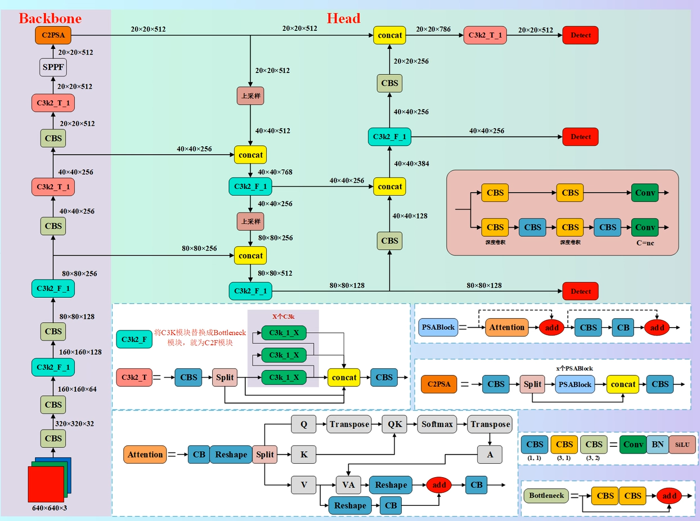

这张图采用`Backbone + Head`两大区域的标注方式，与Ultralytics的`yolo11.yaml`一致。各部分在图中的准确位置如下：

| 功能名称 | 图中的位置 | 主要作用 |
|---|---|---|
| `Backbone`（骨干网络） | 左侧淡紫色区域，从`640×640×3`输入到最上方`C2PSA` | 逐步缩小特征图，提取由局部纹理到整体语义的特征 |
| `Head`中的多尺度特征融合部分 | 右侧绿色区域中，从`C2PSA`后的第一次“上采样”开始，包含后续的`concat`、`C3k2`和`CBS`上下行融合路径，到三个红色`Detect`之前结束 | 让不同分辨率的特征互相补充，形成`80×80`、`40×40`、`20×20`三种融合结果 |
| `Detect`（检测模块） | 右侧三个红色`Detect`模块 | 接收三个尺度的融合特征，分别产生边界框和类别预测 |

其他YOLO论文或教程可能把上采样、拼接和上下行融合这部分统称为`Neck`。它是一个功能性统称，在`yolo11.yaml`中没有同名字段或模块。本文按照YOLO11实际配置称其为“`Head`中的多尺度特征融合部分”。

图中`Head`的多尺度特征融合数据流可以分成两段理解：

1. **自顶向下融合（FPN路径）**：最深层的`20×20`特征先上采样到`40×40`，与Backbone送来的`40×40`特征进行`concat`；融合后再上采样到`80×80`，与Backbone送来的`80×80`特征进行`concat`。这条路径把深层特征中较强的类别信息传给高分辨率特征。
2. **自底向上融合（PAN路径）**：融合后的`80×80`特征通过`CBS`下采样到`40×40`，再与前面的`40×40`融合结果进行`concat`；之后继续下采样到`20×20`并再次拼接。这条路径把高分辨率特征中较细的位置和边缘信息传回低分辨率特征。

最终，`Head`得到`80×80`、`40×40`和`20×20`三份融合特征，图中的三个红色`Detect`分别读取其中一份。网络输出之后，Ultralytics预测程序还会执行边界框解码、置信度筛选和非极大值抑制（Non-Maximum Suppression，NMS）；这些属于后处理，所以没有画在这张网络结构图中。

一次前向计算会产生大量候选预测。`Results.boxes`是Ultralytics预测器完成解码和后处理后提供的结果对象，不能把它等同于`Detect`模块刚输出的原始Tensor。

### 1.2 P3/8、P4/16与P5/32多尺度检测输出

`P3/8`中的`/8`表示该特征图相对输入图像下采样了8倍。输入为`640×640`时，三个检测尺度的空间尺寸为：

| 特征层 | 相对输入步长 | 特征图尺寸 | 每行和每列的候选位置数 |
|---|---:|---:|---:|
| P3/8 | 8 | `80×80` | 6400 |
| P4/16 | 16 | `40×40` | 1600 |
| P5/32 | 32 | `20×20` | 400 |

三层一共提供：

$$
80\times80+40\times40+20\times20=8400
$$

个空间位置。YOLO11是Anchor-free检测器，每个位置作为一个候选点参与预测。P3保留更多空间细节，适合较小目标；P5经过更多层处理，单个位置覆盖的输入区域更大，适合较大目标；P4处于两者之间。

特征层适合的目标大小没有固定像素分界线。训练时的标签分配器会结合位置、类别得分和框质量选择正样本，实际分配结果由当前模型输出和真实框共同决定。

### 1.3 yolo11.yaml中backbone与head字段的范围

第1.1节结构图中的分区与Ultralytics官方`yolo11.yaml`的组织方式一致：配置文件使用`backbone:`和`head:`两个顶层列表：

```text
backbone字段：Backbone
head字段：上采样、拼接、下采样和融合模块 + 最后的Detect模块
```

因此，`nn.Upsample`、`Concat`、`C3k2`和最后的`Detect`都写在`head:`列表中。讨论配置字段或图中的绿色区域时，`Head`表示这一整段；讨论如何输出类别和边界框时，直接使用具体模块名`Detect`。

## 2 yolo11.yaml网络配置与模型缩放规则

### 2.1 from、repeats、module与args字段

YOLO11通过YAML按顺序声明网络层。每一项都采用：

```yaml
# [from, repeats, module, args]
- [-1, 1, Conv, [64, 3, 2]]
```

四个字段分别表示：

| 字段 | 含义 | 上例中的结果 |
|---|---|---|
| `from` | 当前层读取哪一层的输出 | `-1`读取上一层 |
| `repeats` | 模块重复次数 | 创建1次 |
| `module` | 要创建的模块类型 | `Conv` |
| `args` | 传给模块的主要构造参数 | 输出通道64、卷积核3、步幅2 |

存在多路输入时，`from`是列表：

```yaml
# 读取上一层和第6层的输出，然后沿通道维拼接。
- [[-1, 6], 1, Concat, [1]]
```

`Concat`的参数`1`表示沿NCHW中的通道维拼接。两个输入的batch大小、高度和宽度必须相同。例如`(N,256,40,40)`与`(N,256,40,40)`拼接后得到`(N,512,40,40)`。

模型建立时，`ultralytics/nn/tasks.py`中的解析逻辑读取这些条目，找到对应的PyTorch模块类，结合前一层通道数补全构造参数，再把模块加入顺序网络。`from`还会决定哪些中间结果必须保留，供后面的跨层连接读取。

### 2.2 nc与自定义检测类别数量

`nc`是类别数量（number of classes）。官方COCO模型使用80类：

```yaml
nc: 80
```

使用自有数据集时，数据集YAML中的`names`决定类别编号与名称。Ultralytics构建训练模型时会让检测头适配当前数据集的类别数。假设有三类：

```yaml
names:
  0: person
  1: helmet
  2: vest
```

此时`nc=3`，类别分支在每个候选位置输出3个类别分数。标签文件中的`class_id`必须属于`0、1、2`；出现`3`会超出类别范围。

### 2.3 depth、width与max_channels模型缩放参数

同一份`yolo11.yaml`使用`scales`生成n、s、m、l、x五种规模。每项包含：

```text
[depth_multiple, width_multiple, max_channels]
```

- `depth_multiple`缩放模块内部的重复次数。
- `width_multiple`缩放卷积输出通道数。
- `max_channels`限制缩放后的最大通道数。

如果基础配置写`repeats=4`，某个规格的`depth_multiple=0.5`，解析器会按照仓库规则把重复次数缩放到约2次并保证至少执行一次。如果基础输出通道为256，`width_multiple=0.25`时目标通道为64；解析器还会结合硬件友好的通道整除规则和`max_channels`得到最终值。

所以YAML中的基础通道不能直接当成YOLO11n的运行通道。查看实际网络时应使用`model.info()`或打印已经解析完成的`model.model`。

### 2.4 YOLO11n、YOLO11s、YOLO11m、YOLO11l与YOLO11x

五种规格共享模块类型和数据流，主要差别是深度与宽度：

| 规格 | 相对特点 | 常见用途 |
|---|---|---|
| `n` | 最小、计算量最低 | 入门实验、边缘设备候选、快速验证数据流程 |
| `s` | 小型 | 对精度要求高于n且资源仍有限 |
| `m` | 中型 | GPU服务器或性能较强的边缘设备 |
| `l` | 大型 | 更重视精度且允许较高计算成本 |
| `x` | 最大 | 研究、上限实验或高算力环境 |

规格字母只表示同一架构族的缩放大小。工程选型还要同时测量目标硬件延迟、显存、导出兼容性和任务精度，不能仅根据参数量决定。

## 3 YOLO11基础模块与组合关系

### 3.1 Conv模块中的Conv2d、BatchNorm2d与SiLU

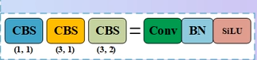

上图是从第1.1节整体框架图右下角裁出的CBS图例。图中的`CBS`表示依次执行`Conv + BN + SiLU`；CBS框下方的`(1,1)`、`(3,1)`和`(3,2)`分别表示卷积核大小与步幅，例如`(3,2)`表示`3×3`卷积核、`stride=2`。

YOLO中的`Conv`是一个组合模块，主要执行：

```text
输入Tensor
→ Conv2d提取局部特征或改变尺寸
→ BatchNorm2d归一化各输出通道
→ SiLU加入非线性
→ 输出Tensor
```

输入shape为`(N,C_in,H,W)`，卷积输出通道由`C_out`决定。空间尺寸遵循阶段3-1第7节介绍的卷积公式。YOLO11常用`kernel_size=3、stride=2`完成下采样，也使用`kernel_size=1、stride=1`调整通道数。

推理部署时，卷积权重和BatchNorm的运行均值、方差可以融合进一个卷积层。`model.fuse()`执行的就是这类融合，因此融合前后打印的层数会不同，输出数值应在允许误差内保持一致。

### 3.2 Bottleneck模块与残差连接

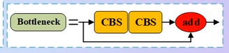

上图是整体框架图右下角的`Bottleneck`局部。主分支依次经过两个CBS模块，旁路直接保留输入，红色`add`表示两路Tensor逐元素相加。

`Bottleneck`是后续CSP组合模块内部反复使用的基础单元。它先做特征变换，再在输入输出shape一致且启用`shortcut`时执行残差相加：

$$
Y=F(X)+X
$$

其中$X$是输入，$F(X)$是卷积分支结果。若输入通道和输出通道不同，两个Tensor无法直接逐元素相加，该模块会关闭这条捷径。残差连接的梯度关系已在阶段3-1第9节介绍，本节关注它在YOLO组合块中的位置。

### 3.3 C3与C3k模块的双分支结构

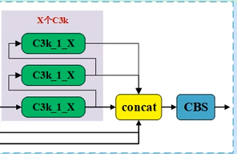

上图裁出了整体框架图中标有“`X个C3k`”的区域。绿色`C3k_1_X`表示一个C3k单元，多项输出与保留分支在黄色`concat`处沿通道维拼接，最后由CBS融合。总图重点展示C3k在C3k2内部的位置，没有继续展开单个C3k内部的两条分支，因此下面用数据流说明其内部结构。

`C3`属于跨阶段局部网络（Cross Stage Partial，CSP）结构。它把输入送入两条路径：

```text
输入X
├─ 较长分支：1×1 Conv → 多个Bottleneck ─┐
└─ 较短分支：1×1 Conv ─────────────────┤
                                           ↓
                               Concat → 1×1 Conv融合
```

较长路径负责多次特征变换，较短路径保留一部分直接信息。两路结果沿通道维拼接，再通过`1×1 Conv`融合。

`C3k`继承C3的双分支组织方式，并允许配置内部卷积核大小。它是YOLO11中`C3k2`可选的内部单元。YOLO11顶层YAML没有直接列出`C3`，学习它是为了看懂`C3k`和`C3k2`的内部关系。

### 3.4 C2f与C3k2模块的特征拆分、重复和拼接

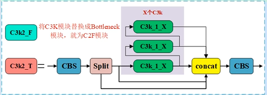

上图是整体框架图中的完整`C3k2`局部。`C3k2_T`先经过CBS并在`Split`处分成两部分，其中一部分依次通过多个内部单元；各阶段结果与保留分支共同送入`concat`，最后由CBS生成输出。图中还标出了将内部C3k换成Bottleneck后得到`C3k2_F`，其数据组织方式与`C2f`相同。

`C2f`先用一个卷积生成`2c`个通道，再把结果分成两个`c`通道Tensor。后半部分依次经过$n$个内部模块，并把每一级结果都保留下来：

```text
cv1(x)
→ 分成a和b
→ b1 = block1(b)
→ b2 = block2(b1)
→ 拼接[a, b, b1, b2, ...]
→ cv2融合为目标通道数
```

当内部模块数量为$n$时，融合卷积读取$n+2$份特征。C3只把两条路径的最终结果送入融合层；C2f额外复用各内部阶段的输出。

`C3k2`继承`C2f`的数据流，并根据`c3k`选择内部单元：

- `c3k=False`：内部使用`Bottleneck`；
- `c3k=True`：内部使用`C3k`。

例如：

```yaml
# 输出通道512，c3k=True，因此C3k2内部建立C3k单元。
- [-1, 2, C3k2, [512, True]]
```

这里的YAML `repeats=2`经过模型规格的深度系数缩放后，通常作为CSP模块内部的重复次数传入，并不等价于在顺序网络中简单摆放两个完全独立的顶层`C3k2`。

### 3.5 SPPF模块的连续池化与特征融合

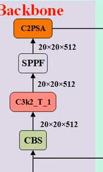

上图从整体框架的Backbone末端裁出。数据沿箭头由下向上流动：`C3k2_T_1 → SPPF → C2PSA`，三者处理的特征图都是`20×20×512`。这张局部图用于说明SPPF的位置和前后模块；SPPF内部的连续池化过程由下面的数据流展开。

快速空间金字塔池化（Spatial Pyramid Pooling - Fast，SPPF）位于Backbone深层。YOLO11使用一次`5×5、stride=1、padding=2`最大池化连续处理三次：

```text
x0 = 输入
x1 = MaxPool5×5(x0)
x2 = MaxPool5×5(x1)
x3 = MaxPool5×5(x2)
输出 = Conv(Concat[x0,x1,x2,x3])
```

因为stride为1且padding为2，四个Tensor的高度和宽度相同，可以沿通道维拼接。连续池化让输出同时包含原始范围以及更大范围的响应，随后由`1×1 Conv`混合通道。

### 3.6 Attention、PSABlock与C2PSA模块的组合关系

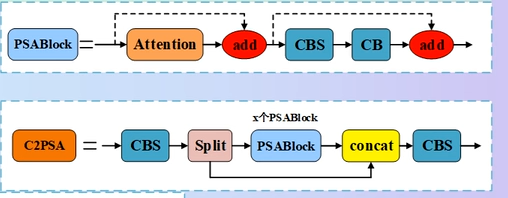

上图是整体框架图右下方的`PSABlock`和`C2PSA`局部。上半部分表示一个PSABlock先执行Attention并残差相加，再经过CBS、CB组成的前馈分支并再次残差相加；下半部分表示C2PSA先拆分特征，只让其中一部分通过多个PSABlock，随后拼接并融合。

YOLO11在SPPF之后加入`C2PSA`。这里的PSA表示位置敏感注意力（Position-Sensitive Attention）。它复用了阶段3-4介绍的多头注意力思想，但输入来自二维特征图。

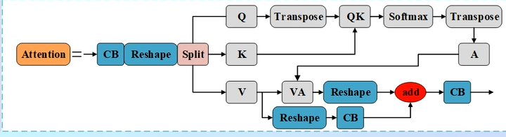

`Attention`模块先把`(N,C,H,W)`特征映射成Q、K、V，再把空间位置展开为$H\times W$个位置完成注意力计算，最后恢复二维布局。`PSABlock`在注意力前后加入残差，并继续执行由`1×1 Conv`组成的前馈网络：

```text
x
→ Attention → 残差相加
→ 两层1×1 Conv前馈网络 → 残差相加
→ 输出
```

`C2PSA`使用CSP式双分支限制注意力计算范围。一部分通道直接保留，另一部分进入PSABlock。这样可以在深层特征中建立较远空间位置之间的联系，同时控制注意力计算量。

## 4 YOLO11 Backbone的逐层特征提取过程

### 4.1 stride为2的Conv与P1至P5下采样过程

Backbone从输入开始连续执行五次2倍下采样。以`(N,3,640,640)`为例：

| 阶段 | 主要操作 | 输出空间尺寸 | 相对输入步长 |
|---|---|---:|---:|
| P1 | stride=2 Conv | `320×320` | 2 |
| P2 | stride=2 Conv | `160×160` | 4 |
| P3 | stride=2 Conv前后的C3k2 | `80×80` | 8 |
| P4 | stride=2 Conv前后的C3k2 | `40×40` | 16 |
| P5 | stride=2 Conv前后的C3k2 | `20×20` | 32 |

每次下采样把高度和宽度各减半，空间位置数变为原来的四分之一；模型通常同时增加通道数，用更多特征描述更大的输入区域。

### 4.2 C3k2在不同Backbone阶段的参数和作用

YOLO11在每个主要下采样阶段后使用`C3k2`继续处理当前分辨率的特征。浅层配置常使用`c3k=False`，内部单元较直接；较深层配置使用`c3k=True`，让内部采用`C3k`进一步组织特征。

不同n、s、m、l、x规格会缩放内部重复次数和通道数。阅读模型时应同时查看YAML条目和解析后的模块摘要，避免根据基础YAML猜测实际网络宽度。

### 4.3 SPPF与C2PSA在Backbone末端的处理

P5深层特征先经过SPPF融合多个感受范围，再经过C2PSA建立空间位置之间的关系。执行顺序为：

```text
P5的C3k2输出
→ SPPF
→ C2PSA
→ 送入Head的第一条上采样路径
```

这两个模块都保持P5的空间尺寸，因此输入为`20×20`时输出仍为`20×20`。它们主要改变通道内部的信息内容。

### 4.4 Backbone向Head提供的P3、P4与P5特征

Head中的特征融合层需要读取三个阶段：

- P3：较高分辨率，保留小目标位置细节；
- P4：中间尺度；
- P5：分辨率最低，经过SPPF和C2PSA后包含更强的深层信息。

这些输出并非同时从Backbone末尾产生。模型执行时会把指定中间层结果保存在列表中，后续`Concat`根据YAML的`from`索引取回对应Tensor。

## 5 YOLO11 Head中的FPN与PAN多尺度特征融合

### 5.1 Upsample、Concat与C3k2组成的FPN自顶向下路径

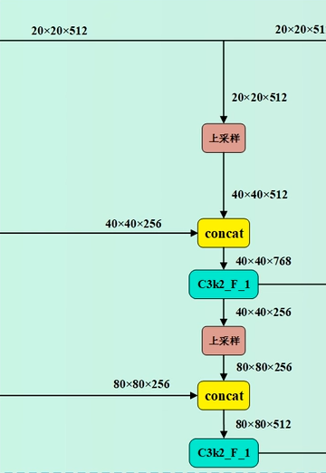

上图是从第1.1节整体框架图中裁出的FPN路径。阅读顺序为从上向下：`20×20`深层特征先上采样到`40×40`，与Backbone送来的`40×40`特征拼接并经过`C3k2_F_1`；随后再次上采样到`80×80`，与Backbone送来的`80×80`特征拼接并融合。

特征金字塔网络（Feature Pyramid Network，FPN）把深层信息逐步送向高分辨率层。

`Upsample`只扩大高度和宽度，不负责创造新的类别信息。它让P5与P4、P4与P3拥有相同空间尺寸，随后`Concat`沿通道维拼接，`C3k2`再混合两路特征。

### 5.2 stride为2的Conv、Concat与C3k2组成的PAN自底向上路径

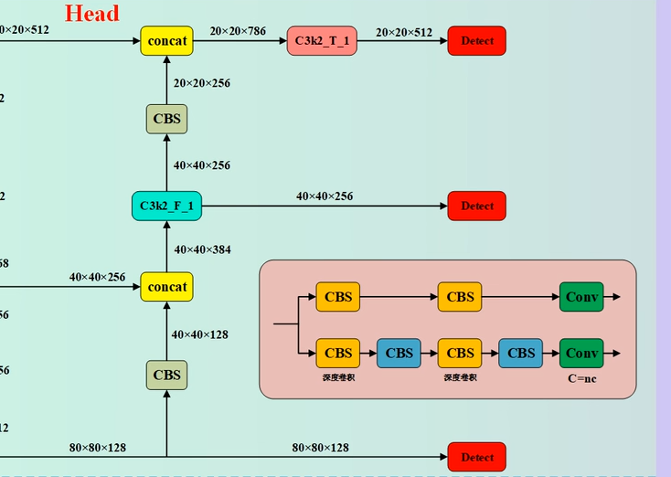

上图是整体框架图右侧的PAN路径。阅读顺序为从下向上：`80×80×128`融合特征先经过CBS下采样，与FPN保留下来的`40×40×256`特征在`concat`处拼接；`C3k2_F_1`融合后再经过CBS下采样到`20×20`，与Backbone末端的深层特征拼接，最后由`C3k2_T_1`生成`20×20×512`特征。

路径聚合网络（Path Aggregation Network，PAN）从刚得到的P3融合结果开始，把高分辨率信息重新向低分辨率方向传递。

FPN负责把深层语义传向高分辨率层，PAN负责把融合后的位置细节传回低分辨率层。最终得到P3、P4、P5三路融合特征，并一起送给`Detect`。

### 5.3 P3、P4与P5融合特征的目标大小分工

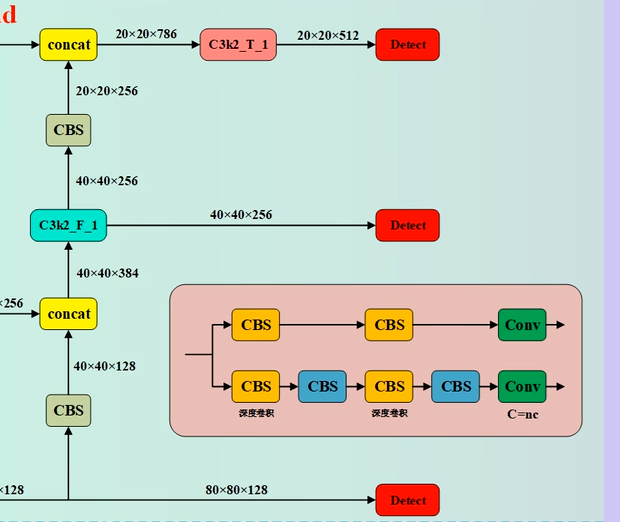

上图裁出了Head右侧的三条输出路径。最下方`80×80×128`、中间`40×40×256`和最上方`20×20×512`分别送入一个红色`Detect`模块。图中的粉色框是`Detect`内部分类分支和边界框分支的展开示意，第6节继续解释这部分。

三路特征都同时包含Backbone特征和Head融合层传递的信息。它们的主要差异仍是空间分辨率与步长：

- P3有6400个候选位置，位置描述更细；
- P4有1600个候选位置，在位置细节和深层信息之间折中；
- P5有400个候选位置，每个位置对应更大的输入区域。

Head中的多尺度融合使P3能够读取P5传来的深层信息，也使最终P5包含P3方向返回的位置细节。多尺度检测由此形成一套共同训练的预测系统。

## 6 YOLO11 Detect检测头、标签分配与损失计算

### 6.1 Detect接收P3、P4与P5三路特征

`Detect`是YOLO11检测任务的最后一个网络模块。YAML中的声明为：

```yaml
# 第16、19、22层分别是Head融合路径产生的P3、P4、P5特征。
- [[16, 19, 22], 1, Detect, [nc]]
```

模型解析器还会把三路输入通道数传给`Detect`构造函数。检测头内部为每个尺度建立对应的框回归分支和类别分支。三路特征的通道数可以不同，但类别输出数量都由同一个`nc`控制。

以`640×640`输入为例，三路候选点数量仍是8400。批量大小为$N$、类别数为$nc$时，检测头会分别处理三个尺度，再把空间位置展平并沿候选点维拼接。

### 6.2 cv2边界框分支与cv3类别分支

YOLO11使用解耦检测头。每个尺度的输入特征进入两条独立分支：

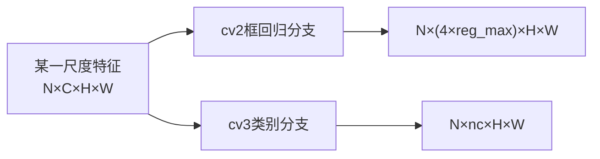

`cv2`经过卷积后输出`4×reg_max`个通道。四组分别描述候选点到边界框左、上、右、下四条边的距离分布。

`cv3`输出`nc`个通道。YOLO11的类别分支使用深度可分离卷积组合：先用depthwise卷积分别处理各通道的空间信息，再用`1×1`卷积混合通道。它比YOLOv8旧式类别分支的普通`3×3`卷积更轻。当前实现可在官方[`head.py`](https://github.com/ultralytics/ultralytics/blob/main/ultralytics/nn/modules/head.py)中查看。

YOLO11的`Detect`输出通道计算为：

$$
no=nc+4\times reg\_max
$$

默认`reg_max=16`、自定义任务`nc=3`时，每个候选位置的原始输出数为：

$$
3+4\times16=67
$$

其中没有单独的Objectness通道。工程代码需要按照当前模型实现读取输出，不能套用旧版YOLOv5的`5+nc`通道格式。

### 6.3 Anchor-free位置点与DFL四边距离预测

Anchor-free检测以特征图位置为参考点。整数$(g_x,g_y)$表示网格编号，候选点位于网格中心，所以它在模型输入图中的坐标为$(x_a,y_a)=((g_x+0.5)s,(g_y+0.5)s)$。其中$s$是网络步长，P3、P4、P5分别为`8、16、32`；加`0.5`就是把网格编号移动到网格中心。检测头把四个方向的预测距离乘$s$，得到模型输入图中的像素距离$l,t,r,b$，边界框为：

$$
x_1=x_a-l,\qquad y_1=y_a-t
$$

$$
x_2=x_a+r,\qquad y_2=y_a+b
$$

YOLO11使用分布焦点损失（Distribution Focal Loss，DFL）形式表示每条边。`reg_max=16`时，一条边产生16个logit。Softmax把它们变成概率$p_0,\ldots,p_{15}$，预测距离为各离散位置的期望：

$$
d=\sum_{i=0}^{15}i\cdot p_i
$$

例如某条边的概率主要集中在位置4和5，$p_4=0.7,p_5=0.3$，加权结果为：

$$
d=4\times0.7+5\times0.3=4.3
$$

如果该输出来自P3，模型输入图中的距离就是$4.3\times8=34.4$像素。若输入使用了LetterBox，最后还要对边界框坐标减去填充量并除以缩放比例，才能恢复为原图坐标。DFL的损失用途已在阶段3-1第4.5节介绍。

### 6.4 Task-Aligned Assigner的正样本分配

训练数据只给出真实框和类别，尚未指定8400个候选点中哪些位置负责该目标。任务对齐分配器（Task-Aligned Assigner）负责建立这种对应关系。

它在训练过程中读取当前模型的类别得分、预测框和真实框，综合类别匹配程度与框重叠质量计算对齐分数，再从位于真实框内的候选点中选择正样本。被选中的位置获得目标类别和目标边界框，其余位置作为背景参与分类监督。

这一步发生在每个训练batch的前向计算之后、损失求和之前：

```text
模型产生三尺度原始预测
→ 解码出用于匹配的预测框
→ 标签分配器选择正样本
→ 为正样本建立目标类别和目标框
→ 计算分类、框回归和DFL损失
```

正样本分配依赖当前预测，因此同一真实框在训练早期和训练后期可能选中不同候选位置。Anchor-free省去了预设框宽高，标签分配仍然是训练中的必要步骤。

### 6.5 box_loss、cls_loss与dfl_loss

YOLO11检测训练日志中的三项核心损失分别承担：

- `box_loss`：比较预测框和真实框的几何关系，推动框的位置和形状接近目标；
- `cls_loss`：监督候选点的类别分数；
- `dfl_loss`：监督四条边的离散距离分布。

训练器按照配置权重组合损失，再执行阶段3-3介绍的反向传播和优化器更新：

$$
L=\lambda_{box}L_{box}+\lambda_{cls}L_{cls}+\lambda_{dfl}L_{dfl}
$$

$\lambda_{box}$、$\lambda_{cls}$和$\lambda_{dfl}$来自当前训练配置。观察训练时要同时看验证集mAP；单个训练loss持续下降只能说明模型在训练数据上的目标函数变小。

### 6.6 训练输出、推理解码、置信度筛选与NMS

`Detect`在不同状态下服务于不同消费者：

- 训练状态保留各尺度的框分布、类别logit和特征信息，损失函数继续使用这些数据；
- 推理状态把四边分布解码为框，并把类别logit转换为分数；
- Ultralytics预测器继续执行候选筛选和非极大值抑制（Non-Maximum Suppression，NMS），最后构造`Results`对象。

NMS的输入是一组候选框和分数。它先保留最高分框，再删除与该框IoU超过阈值的同类候选，重复执行直到候选耗尽或达到`max_det`。`conf`控制单个候选是否进入后处理，`iou`控制两个框重叠到什么程度时删除较低分框。二者职责不同。

## 7 YOLO主要版本的结构变化与项目分支

### 7.1 YOLOv1至YOLOv3的网格检测、Anchor与多尺度预测

YOLOv1把目标检测组织为一次网络计算，在固定网格上直接回归框和类别，建立了单阶段实时检测的基本方向。

YOLOv2引入Anchor参考框、BatchNorm、多尺度训练等改进。模型在每个网格位置基于若干预设宽高预测偏移量，使候选框形状拥有先验参考。

YOLOv3使用Darknet-53骨干和三尺度预测，并通过类似FPN的自顶向下路径融合深浅特征。原始YOLOv3检测头使用Anchor-based耦合输出。

### 7.2 YOLOv4至YOLOv7的CSP、PAN、工程框架与重参数化

YOLOv4系统组合CSP骨干、SPP、PAN以及多种数据增强和训练策略，使网络结构与训练方法共同优化。

YOLOv5由Ultralytics维护，使用PyTorch工程体系、C3、SPPF和PAN式特征融合，并提供完整的数据、训练、验证、推理和导出工具。它的独立历史仓库原始检测头采用Anchor-based设计。

YOLOv6面向工业部署持续优化网络效率，一些版本使用Anchor-free解耦头和重参数化模块。YOLOv7通过E-ELAN、模型缩放和训练阶段的可重参数化方法改进速度与精度平衡。

这些版本来自不同团队与仓库。比较时需要写明仓库、提交或发布版本、模型规格、输入尺寸和运行后端。

### 7.3 YOLOv8至YOLO11的C2f、Anchor-free、DFL、C3k2与C2PSA

Ultralytics YOLOv8用`C2f`替代YOLOv5的`C3`作为主要CSP模块，并采用Anchor-free解耦`Detect`与DFL框回归。

YOLOv9引入GELAN架构和可编程梯度信息（Programmable Gradient Information，PGI），重点处理网络结构和训练信息传递。

YOLOv10通过一致双重分配训练一对多和一对一分支，让推理阶段使用一对一输出实现端到端NMS-free检测。

Ultralytics YOLO11延续YOLOv8的Anchor-free、解耦头和DFL接口，主要结构变化是：

- 用`C3k2`替换主要`C2f`模块；
- 在SPPF后加入`C2PSA`；
- 使用更轻的深度可分离类别分支。

### 7.4 YOLO12的注意力结构与YOLO26的端到端检测

YOLO12在2025年提出以注意力为中心的实时检测架构，引入Area Attention和R-ELAN等结构。Ultralytics官方页面将其标为社区模型，并提示训练稳定性、内存消耗和CPU吞吐需要结合任务评估；当前主要提供检测预训练权重。[YOLO12官方说明](https://docs.ultralytics.com/models/yolo12)

YOLO26是Ultralytics当前的新一代模型族。它保留`C3k2`和`C2PSA`主线，同时默认使用端到端一对一检测头，移除传统NMS路径中的依赖，并把`reg_max`设为1，取消DFL积分模块。[YOLO26官方说明](https://docs.ultralytics.com/models/yolo26)

YOLO11仍适合学习和现有项目维护。它拥有成熟的多任务预训练权重与较稳定的训练、验证、预测和导出接口；本文的完整Demo继续使用YOLO11n。

### 7.5 YOLO版本号、开发团队、代码仓库与模型名称

YOLO版本号不能单独表示一条严格连续的官方产品线。常见分支包括原作者论文、AlexeyAB YOLOv4、Ultralytics YOLOv5/YOLOv8/YOLO11/YOLO26、Meituan YOLOv6、YOLOv7、YOLOv9、YOLOv10和社区YOLO12等。

还要区分历史模型与Ultralytics主包中的兼容变体。例如原始YOLOv3和YOLOv5是Anchor-based；当前Ultralytics主包还提供带现代Anchor-free检测头的`u`变体。遇到“YOLOv5是否Anchor-free”这类问题时，仓库和模型文件名决定答案。

## 8 YOLO版本中变化较大的检测结构

### 8.1 Anchor-based参考框与Anchor-free位置点

Anchor-based为每个网格位置预设若干宽高模板。网络预测中心偏移、宽高变换、Objectness和类别。Anchor的数量与形状会影响检测头通道和候选数量，训练前还要配置或聚类Anchor。

Anchor-free直接以特征图位置为参考，预测四条边距离或中心、宽高。YOLO11使用前者，并通过标签分配器选择负责目标的位置。两种方法都需要确定正负样本；变化集中在候选框表示与检测头输出格式。

### 8.2 耦合检测头与分类回归解耦检测头

耦合检测头让一套共享卷积特征同时输出框、目标存在性和类别。解耦检测头在末端使用独立分支：一条学习边界框，一条学习类别。

框定位关注边缘和几何关系，类别判断关注物体语义。解耦分支允许两种目标拥有各自的参数路径。YOLO11的`cv2`和`cv3`就是这两条路径。

### 8.3 Objectness与类别分数输出字段的变化

传统Anchor-based YOLO常为每个Anchor输出：

```text
框参数 + Objectness + 各类别条件概率
```

这类实现常用`Objectness × 类别概率`得到最终类别置信度。

YOLO11当前`Detect`的原始通道是`4×reg_max + nc`，不包含独立Objectness。类别分数和标签分配、框质量共同参与训练，预测器直接依据当前模型的类别输出和后处理规则构造结果。解析导出Tensor时应读取该版本的输出契约，旧版固定下标会造成类别错位。

### 8.4 C3、C2f与C3k2主干模块的演进

三者的完整数据流已经在第3节定义。版本映射为：

| 模型 | 主要重复模块 | 新增差异 |
|---|---|---|
| YOLOv5 | `C3` | 两条路径最终拼接 |
| YOLOv8 | `C2f` | 复用每个内部Bottleneck输出 |
| YOLO11 | `C3k2` | 在C2f框架内选择Bottleneck或C3k |

改模块时要同步检查输入输出通道、重复次数、残差条件和YAML参数。只替换类名而忽略解析器参数会直接造成构造失败或Concat通道不匹配。

### 8.5 SPP、SPPF、C2PSA与注意力结构的引入

SPP并行使用不同大小的池化核；SPPF连续执行三次`5×5`池化获得对应的多范围效果，计算结构更简单。YOLOv5、YOLOv8和YOLO11均使用SPPF。

YOLO11在SPPF后加入C2PSA，让一部分深层通道经过PSABlock。YOLO12进一步把注意力提升为整体架构的重要组成。二者的范围不同：C2PSA是YOLO11深层的一处模块，YOLO12在更多结构设计中围绕注意力分配计算。

### 8.6 DFL框回归与DFL-free直接框回归

YOLOv8和YOLO11默认使用`reg_max=16`。每条边先输出16个分数，经Softmax和期望计算得到连续距离。训练中还要计算`dfl_loss`。

YOLO26把`reg_max`设为1，`DFL`层变成`Identity`，检测头直接回归距离。导出ONNX或TensorRT后不再包含DFL的reshape、Softmax和积分操作，检测头图更简单。两者的权重和输出格式不能互换。

### 8.7 NMS后处理与端到端NMS-free检测

YOLO11的常用推理链为：候选解码、置信度筛选、NMS、限制最大框数。NMS是网络外的重复框删除策略，部署端必须实现与训练框架一致的类别处理和阈值语义。

端到端NMS-free检测使用一对一分配训练推理分支，让一个真实目标对应一个主要输出，直接返回有限数量的最终候选。YOLOv10探索了这条路线，YOLO26把它作为默认检测路径。更换到端到端模型后，部署代码也要同步删除旧NMS或按照导出模型契约处理输出。

## 9 YOLO模型的工程选择依据

### 9.1 YOLO11、YOLO12与YOLO26的适用范围

YOLO11拥有完整的检测、分割、分类、姿态和旋转框预训练模型，训练与部署资料成熟，适合维护现有项目、学习Anchor-free与DFL流程，以及对接已经验证过的部署工具链。

YOLO12适合研究注意力型YOLO结构或在GPU上比较精度上限。官方文档提醒其训练稳定性、内存和CPU吞吐存在额外取舍，生产项目前应先做目标硬件基准。

YOLO26适合新项目评估端到端、NMS-free和DFL-free路线，尤其需要简化后处理或优化边缘部署时。目标NPU转换器、量化工具和业务后处理代码仍需通过实际导出测试确认支持情况。

### 9.2 n、s、m、l与x模型规模

先从`n`打通数据、训练、验证、导出和推理，再在相同数据划分和输入尺寸下比较更大规格。若`n`已经受到数据质量或标签错误限制，扩大模型通常只会增加训练成本。

选择时至少记录：

- mAP50-95和各类别AP；
- 原始图像上的漏检、误检类型；
- 目标设备单张延迟和吞吐；
- 峰值内存或显存；
- 导出模型大小；
- 预处理、模型和后处理各自耗时。

### 9.3 Detect、Segment、Pose、OBB与Classify任务模型

模型文件名中的后缀决定任务头和输出：

| 文件示例 | 任务 | 主要输出 |
|---|---|---|
| `yolo11n.pt` | Detect目标检测 | 水平框、类别、置信度 |
| `yolo11n-seg.pt` | Segment实例分割 | 检测框和实例掩码 |
| `yolo11n-pose.pt` | Pose姿态估计 | 检测框和关键点 |
| `yolo11n-obb.pt` | OBB旋转目标检测 | 带角度的旋转框 |
| `yolo11n-cls.pt` | Classify图像分类 | 整张图像的类别 |

本文Demo是三类别水平框检测，因此加载`yolo11n.pt`。任务后缀选错会导致数据格式、损失函数和结果字段全部改变。

### 9.4 精度、延迟、参数量、FLOPs与显存占用

参数量决定权重存储和一部分内存访问；FLOPs估算浮点运算量；真实延迟还受到算子实现、内存带宽、输入尺寸、batch、精度模式和后处理影响。

比较模型时必须固定测试条件。例如同一设备、同一输入`640×640`、同一batch、同一FP16或INT8模式，并分别预热和多次计时。官方表格适合初筛，最终选择以目标板卡实测为准。

### 9.5 ONNX、TensorRT、NPU算子支持与许可证

嵌入式部署前应先导出最小模型并检查：

- ONNX图中的算子和动态shape能否被目标转换器读取；
- Resize、Concat、DFL、NMS或Attention是否有对应实现；
- INT8量化后各类别精度是否下降；
- 后处理是在模型图内、CPU代码中还是NPU运行时中完成；
- Ultralytics及所用权重、数据集的许可证是否符合项目分发方式。

YOLO11与YOLO26的检测头和后处理路径不同。即使两者都能导出ONNX，部署端的Tensor含义也需要分别核对。

## 10 使用自有数据集训练和使用YOLO11的完整Demo

本Demo训练一个三类别安全装备检测模型：

```text
0：person
1：helmet
2：vest
```

工程目录统一为：

```text
yolo11_safety_project/
├── datasets/
│   └── safety_dataset/
│       ├── images/
│       ├── labels/
│       └── data.yaml
├── demo_inputs/
├── runs/
├── check_labels.py
├── train_yolo11.py
├── evaluate_yolo11.py
└── predict_yolo11.py
```

这些脚本不需要全部运行：

- `train_yolo11.py`：主流程，负责训练模型；
- `predict_yolo11.py`：主流程，负责使用`best.pt`检测实际图片或视频；
- `check_labels.py`：可选，只在标签经过转换、脚本生成或训练报告标签错误时运行；
- `evaluate_yolo11.py`：可选，只在需要重新验证`best.pt`或评估独立测试集时运行。

### 10.1 Ultralytics官方训练框架的pip安装与源码下载

Ultralytics当前把训练、验证、预测、导出等能力统一放在`ultralytics` Python包中。普通项目安装包即可训练；需要阅读或修改模块源码时再克隆仓库。本文脚本使用Python 3.10或更高版本。

先创建独立Python环境。Linux命令如下：

```bash
python3 -m venv .venv
source .venv/bin/activate
python -m pip install --upgrade pip
```

Windows PowerShell对应命令为：

```powershell
python -m venv .venv
.\.venv\Scripts\Activate.ps1
python -m pip install --upgrade pip
```

如果要使用NVIDIA GPU，应先按照[PyTorch官方安装选择器](https://pytorch.org/get-started/locally/)安装与驱动环境匹配的PyTorch。随后安装Ultralytics和本Demo读取图片需要的Pillow：

```bash
python -m pip install ultralytics pillow
yolo checks
```

`yolo checks`会打印Python、PyTorch、CUDA和相关依赖状态。下面命令可以进一步确认GPU是否被PyTorch识别：

```bash
python -c "import torch; print(torch.__version__); print(torch.cuda.is_available()); print(torch.cuda.get_device_name(0) if torch.cuda.is_available() else 'CPU')"
```

若只训练和调用模型，这条pip路径已经足够。`YOLO("yolo11n.pt")`第一次运行时会自动下载官方预训练权重。

需要查看`C3k2`、`C2PSA`、`Detect`或修改训练器时，克隆[Ultralytics官方仓库](https://github.com/ultralytics/ultralytics)，并使用可编辑安装：

```bash
git clone https://github.com/ultralytics/ultralytics.git
cd ultralytics
python -m pip install -e .
```

`-e`表示editable install。Python导入的`ultralytics`会指向当前源码目录，修改源码后不需要反复复制包文件。为了让实验可复现，项目中还应记录仓库提交号或安装包版本：

```bash
python -c "import ultralytics; print(ultralytics.__version__)"
git rev-parse HEAD
```

[Ultralytics官方安装文档](https://docs.ultralytics.com/quickstart)同时提供pip安装与源码可编辑安装方法。

### 10.2 Ultralytics源码主要目录和文件职责

当前统一仓库没有要求用户直接运行根目录`train.py`。常用入口是Python中的`YOLO(...).train()`，或者命令行中的`yolo train ...`。内部代码再把请求交给检测任务Trainer。

| 文件或目录 | 主要职责 | 什么时候需要看 |
|---|---|---|
| `pyproject.toml` | Python包信息、依赖和构建配置 | 安装失败、增加开发依赖或制作自定义分支 |
| `ultralytics/cfg/default.yaml` | train、val、predict、export的默认参数 | 查询参数默认值和可用配置 |
| `ultralytics/cfg/models/11/yolo11.yaml` | YOLO11网络层、连接关系和模型缩放规格 | 理解或修改模型结构 |
| `ultralytics/cfg/datasets/` | 官方数据集YAML示例 | 编写自己的`data.yaml` |
| `ultralytics/nn/modules/conv.py` | `Conv`、`DWConv`等卷积模块 | 修改基础卷积结构 |
| `ultralytics/nn/modules/block.py` | `Bottleneck`、`C3`、`C2f`、`C3k2`、`SPPF`、`C2PSA` | 阅读YOLO11主要组合模块 |
| `ultralytics/nn/modules/head.py` | `Detect`及其他任务头 | 查看分类、框回归、DFL和推理解码 |
| `ultralytics/nn/tasks.py` | 读取模型YAML、解析层并建立PyTorch模型 | 查YAML参数如何变成模块对象 |
| `ultralytics/models/yolo/detect/` | 检测任务的训练、验证和预测实现 | 追踪检测任务特有流程 |
| `ultralytics/engine/` | 通用Trainer、Validator、Predictor、Exporter和Results | 理解框架如何组织不同模式 |
| `ultralytics/data/` | 数据集检查、读取、增强和组批 | 排查标签、缓存或增强问题 |
| `tests/` | 官方自动测试 | 修改源码后检查兼容性 |
| `docs/` | 官方文档源文件 | 查接口示例和版本说明 |

用户代码调用：

```python
from ultralytics import YOLO

model = YOLO("yolo11n.pt")
model.train(data="data.yaml", epochs=100)
```

内部的大致调度关系为：

```text
YOLO.train()
→ 根据模型任务选择检测Trainer
→ Trainer读取data.yaml和训练配置
→ data模块建立Dataset与DataLoader
→ nn/tasks.py建立或加载模型
→ 每个batch执行前向、分配、损失、反向和更新
→ Validator计算验证指标
→ Trainer保存日志和检查点
```

### 10.3 自有数据集的images与labels目录结构

Ultralytics YOLO检测数据集常使用图片目录和同层级标签目录：

```text
safety_dataset/
├── images/
│   ├── train/
│   │   ├── frame_0001.jpg
│   │   └── frame_0002.jpg
│   ├── val/
│   └── test/
├── labels/
│   ├── train/
│   │   ├── frame_0001.txt
│   │   └── frame_0002.txt
│   ├── val/
│   └── test/
└── data.yaml
```

图片和标签通过“相同相对目录、相同文件主名”对应：

```text
images/train/frame_0001.jpg
labels/train/frame_0001.txt
```

一张图片包含多个目标时，同一个标签文件写多行。确认没有目标的负样本图片可以不提供标签文件；训练器会把它当作无目标图片。若图片本来含有目标但漏掉标签，模型会收到错误的背景监督，因此数据检查脚本仍要报告缺失标签，交给数据制作者确认。

训练集用于更新参数，验证集用于每轮评估和选择最佳权重，测试集用于训练完成后的独立评估。来自同一视频的相邻帧应按视频或拍摄场景划分，避免几乎相同的画面同时出现在训练集和验证集。

### 10.4 YOLO标签txt文件的类别和归一化坐标格式

水平框检测的每一行包含5个值：

```text
class_id x_center y_center width height
```

`class_id`从0开始。其余四项使用0～1的归一化坐标。已知像素框左上角$(x_1,y_1)$、右下角$(x_2,y_2)$，图片宽高为$W,H$，转换公式为：

$$
x_{center}=\frac{x_1+x_2}{2W},\qquad
y_{center}=\frac{y_1+y_2}{2H}
$$

$$
width=\frac{x_2-x_1}{W},\qquad
height=\frac{y_2-y_1}{H}
$$

假设图片为`1000×500`，person框的像素坐标为`(100,50,500,350)`：

$$
x_{center}=0.3,\quad y_{center}=0.4,\quad width=0.4,\quad height=0.6
$$

标签行为：

```text
0 0.3 0.4 0.4 0.6
```

常见错误包括把`x1 y1 x2 y2`直接写入txt、坐标仍使用像素、类别从1开始、宽高为负数以及图片与标签主名不同。[Ultralytics官方检测数据格式](https://docs.ultralytics.com/datasets/detect)规定每张图片对应一个txt，每行一个目标，坐标采用归一化`xywh`。

### 10.5 data.yaml中的数据路径与类别配置

为减少运行目录引起的路径歧义，首次练习建议把`path`写成数据集绝对路径。Windows路径可以使用正斜杠：

```yaml
# data.yaml

# 数据集根目录。请修改为本机真实绝对路径。
path: D:/AI_data/yolo11_safety_project/datasets/safety_dataset

# 以下路径都相对于上面的path。
train: images/train
val: images/val
test: images/test

# 标签文件中的class_id必须对应这里的0、1、2。
names:
  0: person
  1: helmet
  2: vest
```

Linux示例可以写：

```yaml
path: /home/user/yolo11_safety_project/datasets/safety_dataset
```

`train`、`val`和`test`也可以指向文本文件，此时文本文件每行保存一张图片路径。这里的图片列表txt与每张图片对应的标签txt承担不同职责：前者决定数据划分，后者保存目标类别和框。

训练前应核对：

- `path/train`和`path/val`目录存在；
- `names`键从0连续编号；
- 标签中的最大`class_id`小于类别数3；
- `test`为空时，后续评估脚本改用`split="val"`。

### 10.6 可选的数据集格式检查

这一节是可选的辅助检查。使用LabelImg、Label Studio、CVAT等标注软件直接导出YOLO格式，并且已经在标注软件中抽查过框的位置时，可以跳过这段代码，直接训练。

下面几种情况才需要运行检查：

- 标签由VOC、COCO或自定义格式转换而来；
- 数据由多个来源合并，类别编号可能不一致；
- 自己编写脚本生成或修改过txt；
- 训练时出现`corrupt label`、类别越界、框超出图片等提示。

此时只检查最容易出错的三项：每行是否为5列、类别编号是否有效、归一化坐标是否位于`0～1`。

```python
# check_labels.py
from pathlib import Path


# 修改为需要检查的标签目录；通常先检查train，再把train改为val。
LABEL_ROOT = Path("datasets/safety_dataset/labels/train")
CLASS_COUNT = 3  # 数据集共有person、helmet、vest三类

if not LABEL_ROOT.is_dir():
    raise FileNotFoundError(f"找不到标签目录：{LABEL_ROOT}")


for label_path in LABEL_ROOT.rglob("*.txt"):
    for line_number, line in enumerate(
        label_path.read_text(encoding="utf-8").splitlines(),
        start=1,
    ):
        if not line.strip():
            continue

        fields = line.split()
        if len(fields) != 5:
            raise ValueError(f"{label_path}:{line_number} 必须有5列")

        class_id = int(fields[0])
        x_center, y_center, width, height = map(float, fields[1:])

        if not 0 <= class_id < CLASS_COUNT:
            raise ValueError(f"{label_path}:{line_number} 类别编号越界")
        if not all(0.0 <= value <= 1.0 for value in (x_center, y_center, width, height)):
            raise ValueError(f"{label_path}:{line_number} 坐标没有归一化")
        if width == 0.0 or height == 0.0:
            raise ValueError(f"{label_path}:{line_number} 框的宽高不能为0")

print("标签基本格式检查完成")
```

运行：

```bash
python check_labels.py
```

数值检查无法发现“类别标错”和“框画偏”等问题。正常训练会在结果目录生成`train_batch*.jpg`，第一次训练时打开其中几张确认即可；发现框整体偏移或类别不对时，再回到标注软件修正数据。


### 10.7 train_yolo11.py训练脚本与参数说明

训练只需要完成三件事：加载预训练模型、指定`data.yaml`、调用`model.train()`。下面保留日常开发最常用的参数，其余参数先使用Ultralytics默认值。

```python
# train_yolo11.py
from pathlib import Path

from ultralytics import YOLO


PROJECT_ROOT = Path(__file__).resolve().parent
DATASET_YAML = PROJECT_ROOT / "datasets" / "safety_dataset" / "data.yaml"


def main() -> None:
    """使用COCO预训练的YOLO11n，在自有三类别数据集上进行训练。"""

    # 加载.pt表示从预训练参数开始微调；首次使用时框架会自动下载权重。
    model = YOLO("yolo11n.pt")

    model.train(
        data=str(DATASET_YAML),        # 数据集划分和类别名称配置
        epochs=100,                    # 最多训练100轮
        imgsz=640,                     # 输入图像缩放到640尺度
        batch=16,                      # 显存不足时改为8或4
        project=str(PROJECT_ROOT / "runs"),
        name="safety_yolo11n",       # 本次实验的结果目录名
        plots=True,                    # 保存损失曲线、PR曲线和混淆矩阵
    )

    # 框架可能因目录重名创建safety_yolo11n2，因此打印实际保存位置。
    print("训练结果目录：", model.trainer.save_dir)


if __name__ == "__main__":
    # Windows运行训练脚本时保留入口保护。
    main()
```

运行：

```bash
python train_yolo11.py
```

对应的CLI写法为：

```bash
yolo detect train model=yolo11n.pt data=datasets/safety_dataset/data.yaml epochs=100 imgsz=640 batch=16 project=runs name=safety_yolo11n
```

`device`、`workers`、`optimizer`和自动混合精度先使用框架默认值。只有需要固定某张GPU、解决数据读取速度问题或进行训练参数对比时，再显式设置这些参数。使用`YOLO("yolo11n.yaml")`会从随机参数开始训练；自有小数据集通常使用`yolo11n.pt`预训练权重。


### 10.8 best.pt、last.pt、results.csv与训练图表

训练输出目录的核心内容为：

```text
runs/safety_yolo11n/
├── weights/
│   ├── best.pt
│   └── last.pt
├── args.yaml
├── results.csv
├── results.png
├── confusion_matrix.png
├── BoxP_curve.png
├── BoxR_curve.png
├── BoxPR_curve.png
├── BoxF1_curve.png
├── train_batch*.jpg
└── val_batch*_pred.jpg
```

各文件的职责如下：

- `best.pt`：训练过程中验证适应度最高时保存的模型；最终验证和推理通常从它开始。
- `last.pt`：最后一个已完成epoch的检查点；需要`resume=True`继续中断训练时使用。
- `args.yaml`：本次训练实际使用的参数，复现实验时应与代码一起保存。
- `results.csv`：每个epoch的训练损失、验证指标和学习率。
- `results.png`：把CSV中的主要曲线画在一张图中。
- `confusion_matrix.png`：显示真实类别和预测类别的对应关系。
- `BoxP/R/PR/F1_curve.png`：观察阈值变化对Precision、Recall和F1的影响。
- `train_batch*.jpg`：检查训练增强和训练标签。
- `val_batch*_pred.jpg`：查看验证图片的预测框。

若训练结束后没有找到预期目录，先读取终端最后打印的`model.trainer.save_dir`。`exist_ok=False`会保护旧实验，并在目录重名时自动选择新的名称。

### 10.9 可选的独立验证与检测指标

`model.train()`每个epoch都会在验证集上计算指标，并据此保存`best.pt`，所以普通训练结束后可以先查看`results.csv`、`results.png`和混淆矩阵。

以下情况才需要单独调用`model.val()`：

- 训练结束后重新确认`best.pt`的指标；
- `data.yaml`中配置了独立测试集，需要在最终测试集上评估；
- 修改了`imgsz`等验证条件，需要重新比较结果；
- 模型文件复制到另一台机器后，需要确认环境和结果一致。

最小验证脚本如下：

```python
# evaluate_yolo11.py
from pathlib import Path

from ultralytics import YOLO


PROJECT_ROOT = Path(__file__).resolve().parent
BEST_MODEL = PROJECT_ROOT / "runs/safety_yolo11n/weights/best.pt"
DATASET_YAML = PROJECT_ROOT / "datasets/safety_dataset/data.yaml"

# best.pt保存了训练得到的参数和类别名称。
model = YOLO(str(BEST_MODEL))

# 默认验证val；存在独立test时，把split改为"test"。
metrics = model.val(
    data=str(DATASET_YAML),
    split="val",
    imgsz=640,
    plots=True,  # 保存混淆矩阵和PR曲线
)

print(f"Precision={metrics.box.mp:.4f}")
print(f"Recall={metrics.box.mr:.4f}")
print(f"mAP50={metrics.box.map50:.4f}")
print(f"mAP50-95={metrics.box.map:.4f}")
```

运行：

```bash
python evaluate_yolo11.py
```

Precision表示预测框中有多少是正确目标，Recall表示真实目标中有多少被检出。`mAP50`使用IoU阈值0.50，`mAP50-95`综合0.50到0.95的十个阈值，后者对定位准确度要求更高。


### 10.10 predict_yolo11.py图片与视频推理

推理是训练完成后的必需步骤。最常用的形式是加载`best.pt`，对一张图片或一个图片目录执行`model.predict()`，并保存画框结果。

```python
# predict_yolo11.py
from pathlib import Path

from ultralytics import YOLO


PROJECT_ROOT = Path(__file__).resolve().parent
BEST_MODEL = PROJECT_ROOT / "runs/safety_yolo11n/weights/best.pt"

# 可以换成单张图片、图片目录或视频文件。
INPUT_SOURCE = PROJECT_ROOT / "demo_inputs"

model = YOLO(str(BEST_MODEL))

results = model.predict(
    source=str(INPUT_SOURCE),
    conf=0.25,                         # 只保留置信度不低于0.25的结果
    save=True,                         # 保存带类别和边界框的图片或视频
    project=str(PROJECT_ROOT / "runs"),
    name="safety_yolo11n_predictions",
)

for result in results:
    # result对应一张图片；xyxy已经恢复为原图像素坐标。
    for box in result.boxes:
        class_id = int(box.cls.item())
        confidence = float(box.conf.item())
        x1, y1, x2, y2 = box.xyxy[0].tolist()
        print(
            model.names[class_id],
            f"conf={confidence:.3f}",
            f"xyxy=({x1:.1f}, {y1:.1f}, {x2:.1f}, {y2:.1f})",
        )
```

运行：

```bash
python predict_yolo11.py
```

处理长视频、摄像头或大量图片时，再给`model.predict()`添加`stream=True`，并直接迭代返回结果，避免一次性把全部`Results`保存在内存中。`iou`和`max_det`等参数只在需要调整重复框抑制或单帧最大检测数量时设置。


### 10.11 Results、Boxes、xyxy、conf与cls输出字段

`model.predict()`为每张输入返回一个`Results`对象，常用字段为：

| 字段 | 含义 |
|---|---|
| `result.path` | 当前输入文件路径 |
| `result.orig_img` | 原始图像NumPy数组 |
| `result.orig_shape` | 原始图像的`(height,width)` |
| `result.names` | `class_id → class_name`映射 |
| `result.boxes` | 当前图片最终保留的水平框集合 |
| `result.speed` | 预处理、推理和后处理的分段耗时信息 |

`Boxes`中的常用字段为：

| 字段 | shape | 单位和含义 |
|---|---|---|
| `boxes.xyxy` | `(M,4)` | 原始图像像素坐标`x1,y1,x2,y2` |
| `boxes.xywh` | `(M,4)` | 原始图像像素坐标`x_center,y_center,width,height` |
| `boxes.xyxyn` | `(M,4)` | 相对原图归一化的xyxy |
| `boxes.xywhn` | `(M,4)` | 相对原图归一化的xywh |
| `boxes.conf` | `(M)` | 后处理保留框的类别置信度 |
| `boxes.cls` | `(M)` | 类别编号，以浮点Tensor保存，使用时转为整数 |

$M$是当前图片最终保留的目标数量，每张图片可以不同。这里的`xyxy`已经由Ultralytics缩放回原始图片坐标，可以直接用于绘制、裁剪和业务区域判断。训练标签txt中的`xywh`使用0～1归一化值，两者坐标格式和使用阶段都不同。

`boxes.conf`是YOLO11当前输出契约下的最终类别置信度，没有独立`boxes.objectness`字段。业务代码应使用`boxes.conf`和`boxes.cls`，避免按旧YOLOv5原始Tensor的固定下标重新解析。
