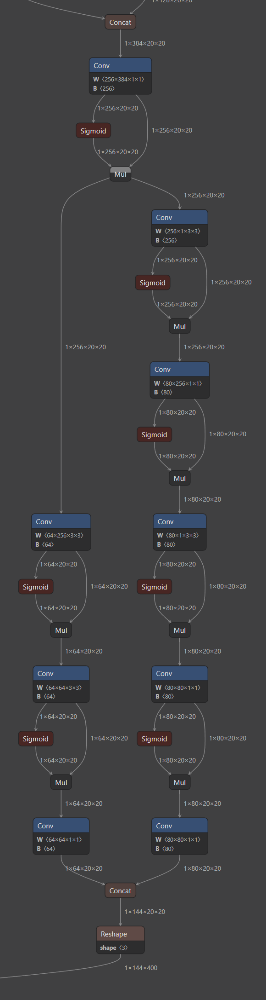
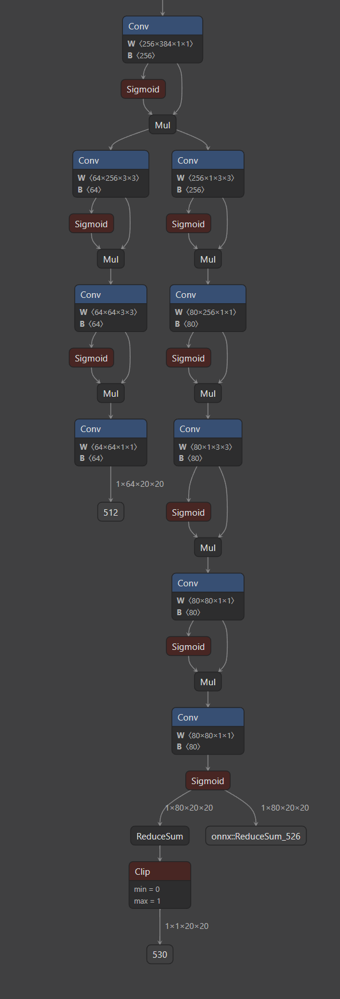

# 阶段3-7 裁剪、替换和删除开源模型模块的方法

> 当前掌握度：L0～L1　建议时间：5小时

修改开源模型包含两类工作：第一类会改变训练模型本身，例如增加卷积层、替换模块、删除分支和改变通道；第二类只改变部署时的计算边界，例如把模型末端的解码移到CPU。两类修改对旧权重和重新训练的要求不同。

本文先介绍适用于PyTorch模型的通用修改与权重迁移方法，再以YOLO11n适配Rockchip RKNN为例，说明怎样把P5的20×20检测分支改成RKNN Model Zoo使用的输出形式。最后使用原版`yolo11n.pt`初始化修改后的模型，并在自有类别数据集上重新训练。

主要流程如下：

```text
确定修改目的和修改层级
    ↓
写清修改前后的Tensor接口
    ↓
建立新模型并执行一次固定输入forward
    ↓
按参数名称、shape和语义迁移旧权重
    ↓
训练新增加或不兼容的参数
    ↓
导出ONNX并验证修改前后的中间Tensor
    ↓
转换RKNN并验证CPU后处理
```

---

## 1 通用模型模块修改的目标、层级与实施顺序

### 1.1 添加、替换和删除PyTorch模块的适用场景

修改之前先写清目标。不同目标改变的对象不同，也决定是否需要重新训练。

| 修改目标 | 实际改变的对象 | 一般是否需要训练 |
|---|---|---|
| 增加带参数的模块 | 新增卷积、Linear、注意力或任务分支 | 需要，新增参数没有旧权重 |
| 替换带参数的模块 | 模块类型、通道、卷积核或连接方式 | 通常需要，部分旧参数可能复用 |
| 删除训练分支 | 模块和`forward()`中的数据路径 | 保留分支被删除后需微调验证 |
| 改变类别数量 | 任务头最终输出通道 | 需要训练新的类别输出层 |
| 改变输入尺寸 | 运行时Tensor尺寸 | 卷积模型不一定需要训练，但精度必须复测 |
| 移出解码或筛选 | 部署模型的输出边界 | 数学计算保持一致时不需要重新训练 |
| 替换不支持算子 | 计算表达式和导出图 | 数学等价时可不训练，必须验证数值误差 |

添加一个`nn.Module`属性不会自动参与计算。只有`forward()`实际调用该模块，它才会接收Tensor并影响输出。例如新建了`self.adapter`，还要在`forward()`中执行`x = self.adapter(x)`。

替换模块时需要同时检查两侧接口：新模块接收的shape必须与上游输出一致，新模块产生的shape必须符合下游要求。删除模块也要删除或改写`forward()`中对它的调用。若下游仍引用已经删除的输出，模型会在第一次forward时直接失败。

### 1.2 源码、模型配置、forward、导出包装与ONNX图修改的选择

工程中优先修改能够重新构建模型的源头。修改层级从前到后如下：

| 修改层级 | 适用情况 | 主要优点 | 主要风险 |
|---|---|---|---|
| 模型配置或YAML | 模块连接、重复次数、通道和类别数由配置描述 | 结构清楚，能够重新训练和导出 | 配置解析器必须认识新模块 |
| PyTorch模块源码 | 需要增加新的计算模块或改变forward | 能参与训练，调试信息完整 | 要同步处理初始化、损失和导出 |
| 导出包装Module | 训练结构不变，只改变导出输出 | 不干扰训练代码 | 包装层必须准确复现目标边界 |
| ONNX计算图 | 没有PyTorch源码，或必须修改固定模型 | 可直接处理部署文件 | 节点引用、shape和常量容易出错 |

以YOLO11为例，改变C3k2、通道或Detect输入属于训练结构修改，应从模型YAML和PyTorch源码入手。把DFL和坐标解码移出导出模型属于部署边界修改，可以放在`export=True`分支或专门的导出包装Module中。

ONNX图级修改放在最后选择。修改`graph.output`虽然可以让中间Tensor成为模型输出，但原有下游节点可能仍留在图中；后续还需要清理无引用节点和initializer，并重新执行ONNX checker与shape inference。

### 1.3 模块修改后的上下游Tensor接口检查

每次结构修改都要先写一张接口变化表：

| 检查对象 | 修改前 | 修改后 | 谁需要跟着修改 |
|---|---|---|---|
| 输入Tensor | 名称、dtype、shape与数值语义 | 新约定 | 预处理和模型调用代码 |
| 被修改模块的输入 | 通道、空间尺寸或序列长度 | 新shape | 模块构造参数 |
| 被修改模块的输出 | 旧shape | 新shape | 所有下游消费者 |
| 模型输出 | 旧字段和处理阶段 | 新字段和处理阶段 | 后处理与部署代码 |

例如把一个卷积的输出通道从128改成96，当前卷积的`out_channels`变为96，下一层卷积的`in_channels`也必须变为96。若该输出同时进入残差加法，另一条支路也必须输出96通道；若进入Concat，Concat后的总通道数和后续卷积输入也会改变。

完成修改后，先执行以下检查，再开始长时间训练：

1. 打印新模型结构，确认新模块确实位于预期路径。
2. 使用与真实输入同shape、同dtype的固定Tensor执行一次forward。
3. 只在修改点前后注册forward hook，记录输入输出shape。
4. 检查损失函数能否接收新模型的训练输出。
5. 导出前再检查推理输出，因为部分模型的训练与推理forward不同。

forward hook和固定Tensor检查方法已经在阶段3-6第4节与第5节介绍，本节只把观察点放在结构变化的两侧。

### 1.4 裁剪后1×64×N×N回归输出的含义与四边距离计算

RKNN适配版把DFL和坐标解码移到模型外以后，每个检测尺度会直接输出`[1,64,N,N]`回归Tensor。第一个`1`是batch大小，`N×N`是该尺度的特征图大小；`64`来自：

$$
64=4\times reg\_max=4\times16
$$

其中4对应左、上、右、下四条边，`reg_max=16`表示每条边有16个输出值。因此要先把`[1,64,N,N]`整理成`[1,4,16,N,N]`。对于某个候选点的某一条边，16个值仍是logits，先使用Softmax将它们变成总和为1的概率：

$$
p_i=\frac{e^{z_i}}{\sum_{j=0}^{15}e^{z_j}},
\qquad
\sum_{i=0}^{15}p_i=1
$$

再用离散位置`0～15`进行加权求和：

$$
d=\sum_{i=0}^{15}p_i\cdot i
$$

这样会为每个候选点得到左、上、右、下四个距离。`d`可以是小数，例如概率主要集中在位置3和4时，加权结果可能是3.6，所以这一过程也常被直观地称为在离散位置之间进行“插值”。该距离的单位是一个网络步长；后续还要结合当前尺度的候选点中心和stride，才能换算成输入图上的真实像素坐标。P3、P4、P5在640×640输入下的stride分别为8、16、32，第5.3节用P5的20×20输出演示完整计算。

---

## 2 迁移学习与旧模型权重的复用条件

迁移学习是让新模型继承旧模型已经学到的参数，再用新数据继续训练。结构修改后的权重迁移不能只看“层的位置差不多”，需要同时检查参数名称、Tensor shape和参数语义。

### 2.1 state_dict参数名称、shape与参数语义

PyTorch模型的`state_dict()`是一个字典：键是参数或持久buffer的完整路径，值是对应Tensor。例如：

```text
backbone.stage2.conv.weight
backbone.stage2.bn.running_mean
classifier.weight
classifier.bias
```

一个旧参数可以直接复制到新模型时，需要满足三项条件：

1. **名称能够对应**：新模型中存在相同键，或代码明确建立了旧键到新键的映射。
2. **shape完全相同**：复制操作要求两个Tensor每个维度一致。
3. **语义仍然一致**：即使名称和shape相同，也要确认它们表示同一种特征或类别。

常见参数shape如下：

$$
\text{Conv2d.weight.shape}
=
[C_{out},\ C_{in}/groups,\ K_H,\ K_W]
$$

$$
\text{Linear.weight.shape}
=
[F_{out},\ F_{in}]
$$

$$
\text{BatchNorm.weight.shape}
=
[C]
$$

因此，改变卷积的输入通道、输出通道、groups或卷积核都会改变权重shape。改变BatchNorm对应的通道数也会使其`weight`、`bias`、`running_mean`和`running_var`全部不兼容。

PyTorch的`load_state_dict(strict=False)`允许缺少键和多出键，但同名参数shape冲突仍要在加载前过滤。官方文档把部分模型加载称为warmstart，并说明`strict=False`用于接收不完全相同的键集合。[PyTorch warmstart说明](https://docs.pytorch.org/tutorials/recipes/recipes/warmstarting_model_using_parameters_from_a_different_model.html)、[`load_state_dict()`官方文档](https://docs.pytorch.org/docs/stable/generated/torch.nn.Module.html#torch.nn.Module.load_state_dict)

### 2.2 添加、删除、重命名和改变通道对权重加载的影响

| 结构修改 | 旧权重会发生什么 | 新模型需要做什么 |
|---|---|---|
| 增加新模块 | 新模块的键在旧权重中不存在 | 使用默认初始化并训练 |
| 删除模块 | 旧权重出现新模型不需要的键 | 忽略这些旧键 |
| 重命名模块 | shape相同也无法按原键自动匹配 | 显式重命名state_dict键 |
| 在Sequential中插入层 | 后续`0、1、2...`路径可能整体移动 | 检查每个数字路径的真实语义 |
| 改变输出通道 | 当前层权重和下游输入权重都可能不兼容 | 重新初始化受影响层 |
| 改变类别数量 | 分类输出层的权重和bias发生shape变化 | 重新训练类别输出层 |
| 改变stride或padding | 当前卷积权重shape可能保持不变 | 权重能加载，空间尺寸和精度仍需验证 |
| 更换无参数激活函数 | state_dict中没有该激活的参数 | 权重加载不受影响，forward语义已经变化 |

还要注意一种更隐蔽的情况：参数技术上能够加载，语义却已经改变。例如旧模型的类别顺序是`[person, car, dog]`，新数据写成`[dog, person, car]`。分类层shape仍然是3，但每一行权重对应的类别已经错位。这时应排除分类层旧权重，或按类别映射重新排列后再训练。

同样地，把输入的三个通道从RGB改成三个不同传感器特征时，第一层卷积shape仍可能是`[Cout, 3, K, K]`，旧权重的通道语义已经不再成立。

### 2.3 按名称和shape过滤并加载兼容权重

下面的代码用于普通PyTorch `state_dict`文件。它假设旧文件是通过`torch.save(old_model.state_dict(), path)`保存的纯参数字典。Ultralytics的`.pt`包含额外训练信息，后文使用其`model.load()`接口。

```python
from pathlib import Path

import torch
import torch.nn as nn


def load_compatible_weights(
    new_model: nn.Module,
    old_state_path: str,
):
    """
    把旧state_dict中名称和shape都兼容的参数加载到new_model。

    new_model：结构已经修改完成的新模型。
    old_state_path：纯state_dict文件路径。
    返回：兼容参数、shape冲突参数和旧模型多余参数的名称列表。
    """
    weight_path = Path(old_state_path)
    if not weight_path.is_file():
        raise FileNotFoundError(f"找不到旧权重：{weight_path}")

    # 先加载到CPU，避免检查权重时占用GPU显存。
    old_state = torch.load(
        weight_path,
        map_location="cpu",
        weights_only=True,
    )
    new_state = new_model.state_dict()

    compatible_state = {}
    shape_mismatch = []
    unexpected_in_old = []

    for parameter_name, old_tensor in old_state.items():
        if parameter_name not in new_state:
            # 旧模型中存在，新模型已删除或重命名。
            unexpected_in_old.append(parameter_name)
            continue

        new_tensor = new_state[parameter_name]
        if old_tensor.shape != new_tensor.shape:
            # 同名但shape不同，load_state_dict无法直接复制。
            shape_mismatch.append(
                (parameter_name, tuple(old_tensor.shape), tuple(new_tensor.shape))
            )
            continue

        compatible_state[parameter_name] = old_tensor

    # strict=False允许新模型保留没有旧权重的参数。
    load_result = new_model.load_state_dict(
        compatible_state,
        strict=False,
    )

    return {
        "loaded_names": sorted(compatible_state),
        "shape_mismatch": shape_mismatch,
        "unexpected_in_old": sorted(unexpected_in_old),
        "missing_in_old": sorted(load_result.missing_keys),
    }
```

执行顺序是：先建立新模型，再读取旧权重，随后只复制兼容Tensor。没有被复制的参数仍保持新模型构造时的初始化值。优化器应在权重加载完成后创建，这样优化器直接管理新模型最终使用的参数对象。

### 2.4 已加载参数、新初始化参数与跳过参数的检查

加载完成后不要只打印“success”。至少要记录以下四类结果：

- `loaded_names`：真正继承旧模型参数的键。
- `shape_mismatch`：名称相同但shape冲突的键，以及新旧shape。
- `unexpected_in_old`：旧模型存在、新模型已经删除或重命名的键。
- `missing_in_old`：新模型需要、旧模型没有提供的键。

新增加的模块和修改后的任务头通常出现在`missing_in_old`中。它们需要参与训练，不能因大部分Backbone权重成功加载就被冻结。

若希望排除“shape相同但语义改变”的层，可以在加入`compatible_state`之前增加前缀过滤。例如类别定义发生变化时，主动跳过`classifier.`或检测头分类分支对应的键。参数复用报告应保存到实验目录，后面出现收敛异常时才能确认哪些层实际继承了旧权重。

---

## 3 原版YOLO11 Detect检测头的训练输出与推理解码路径

YOLO11 Detect检测头已经在阶段3-5第6节介绍。本节只关注与RKNN改造直接相关的末端数据流：三个尺度怎样产生边界框分布和分类输出，以及原版导出图怎样继续完成统一解码。

### 3.1 P3、P4与P5的边界框分支和分类分支

官方YOLO11检测配置把第16、19、22层产生的P3、P4、P5特征送入Detect。640×640输入下，三个尺度的空间大小分别是80×80、40×40和20×20，网络步长分别为8、16和32。[Ultralytics官方`yolo11.yaml`](https://github.com/ultralytics/ultralytics/blob/main/ultralytics/cfg/models/11/yolo11.yaml)

每个尺度都进入两条分支：

- 边界框分支输出`4 × reg_max`个通道。YOLO11的`reg_max=16`，因此是64通道。
- 分类分支输出`nc`个通道。使用COCO的80个类别时是80通道。

用户提供的图二是原版YOLO11n中P5的20×20分支：



沿图从上往下读：

1. 来自Head的`1×384×20×20`特征先通过`1×1`卷积变成`1×256×20×20`。
2. 左侧边界框分支最终产生`1×64×20×20`。
3. 右侧分类分支最终产生`1×80×20×20`。
4. Concat沿通道维拼接两路结果，得到`1×144×20×20`，其中`144=64+80`。
5. Reshape把20×20的400个位置展平，得到`1×144×400`。

图中的多个`Sigmoid → Mul`要结合前面的卷积一起看。它们实现的是SiLU激活：

$$
\operatorname{SiLU}(x)=x\cdot\sigma(x)
$$

因此，中间出现的Sigmoid并不代表模型已经计算了最终类别概率。图二最下面的分类卷积输出`1×80×20×20`后直接进入Concat，这一处仍是分类logits；原版Detect会在后续统一推理路径中执行类别Sigmoid。

图二只截取了P5局部分支，`1×144×400`仍是计算图中的中间Tensor；原版ONNX最终输出还要经过后续推理解码。P3和P4也会产生相同字段结构，只是位置数量分别为6400和1600。

### 3.2 DFL投影、网格坐标、网络步长与三尺度结果合并

原版Detect后续把三个尺度展平并拼接：

$$
80\times80+40\times40+20\times20
=6400+1600+400
=8400
$$

拼接后，边界框部分仍保留每条边16个分布值。推理路径继续执行：

```text
三个尺度的64通道边界框分布
    ↓
按左、上、右、下四条边拆成4组，每组16个值
    ↓
DFL Softmax与分布期望
    ↓
结合候选点中心和各尺度stride换算坐标
    ↓
三个尺度坐标合并

三个尺度的分类logits
    ↓
Sigmoid得到类别概率
    ↓
与边界框结果组成最终原始预测
```

对于80类检测，常规`nms=False`导出最终通常得到`[1,84,8400]`，84由4个已解码框值和80个类别概率组成。原版模型是否继续把NMS放入图中由具体导出参数决定，不能只根据文件名判断。

Detect是anchor-free解耦检测头，边界框和分类使用不同分支。官方源码中的推理路径会拆分回归与分类结果、解码边界框并对分类结果执行Sigmoid。[Ultralytics Detect源码与架构说明](https://github.com/ultralytics/ultralytics/blob/main/ultralytics/nn/modules/head.py)

---

## 4 Rockchip RKNN适配版YOLO11的导出结构变化

Rockchip维护的YOLO11分支针对RKNPU导出修改了检测头的推理输出。其说明明确指出：修改只在导出阶段生效，训练流程仍按原模型进行。[Rockchip YOLO11导出优化说明](https://github.com/airockchip/ultralytics_yolo11/blob/main/RKOPT_README.zh-CN.md)

### 4.1 RKNN适配修改与模型通道剪枝的区别

这里所说的“裁剪”是缩短导出计算图的末端路径，把部分推理解码移出NPU模型。YOLO11n的Backbone、Head、C3k2、SPPF和C2PSA等训练模块仍然保留。

它与通道剪枝的差别如下：

| 操作 | 是否改变训练参数shape | 是否通常需要重训 | 本例是否执行 |
|---|---|---|---|
| 删除Backbone卷积通道 | 会改变当前层和下游权重shape | 需要 | 没有 |
| 删除C3k2等训练模块 | 会改变网络路径和参数键 | 需要 | 没有 |
| 把DFL和坐标解码移到CPU | 不改变检测分支卷积权重 | 数学保持一致时不需要 | 执行 |
| 增加无参数的score_sum计算 | 不增加可训练参数 | 不需要 | 执行 |

因此，自有数据训练仍可以使用普通YOLO11训练流程。训练得到`best.pt`后，再通过Rockchip适配分支导出新的ONNX输出结构。

### 4.2 移出模型的DFL、坐标解码、阈值筛选与NMS

Rockchip说明列出的主要变化包括：

- 修改输出结构并移除末端后处理结构。
- 将NPU执行性能不理想的DFL移到CPU后处理。
- 增加类别置信度总和，用于后处理阶段更快地进行阈值筛选。

结合RKNN Model Zoo的YOLO11代码，CPU端接管以下步骤：

```text
64通道回归分布
→ DFL Softmax和期望
→ 候选点与stride坐标换算
→ 三个尺度展平并合并
→ 置信度阈值筛选
→ 分类别NMS
→ 映射回原图
```

Rockchip示例的`dfl()`、`box_process()`和`post_process()`分别执行这些操作。[RKNN Model Zoo YOLO11 Python后处理](https://github.com/airockchip/rknn_model_zoo/blob/main/examples/yolo11/python/yolo11.py)

需要注意：原版Ultralytics在`nms=False`时通常已经把DFL和坐标解码放在导出图内，但NMS仍位于模型外。RKNN适配版进一步把DFL和坐标解码也移出图，所以CPU后处理不能直接照搬原版`[1,84,8400]`输出的解释方式。

### 4.3 图内保留的分类Sigmoid与新增的score_sum输出

用户提供的图一是RKNN适配后的P5分支：



左侧边界框分支在最后一个卷积后直接输出`1×64×20×20`，图中的节点编号是`512`。编号由导出器自动产生，只用于定位当前文件。

右侧分类分支的关键变化发生在最后：

1. 最后一个分类卷积产生`1×80×20×20`分类logits。
2. 新增的最终Sigmoid把logits转换为`1×80×20×20`类别概率。
3. 类别概率直接成为一个模型输出，图中显示为`onnx::ReduceSum_526`。
4. ReduceSum沿80个类别通道求和，得到`1×1×20×20`。
5. Clip把求和结果限制在0到1，形成`score_sum`输出，图中编号为`530`。

其关系可以写成：

$$
p_{b,c,y,x}=\sigma(z_{b,c,y,x})
$$

$$
s_{b,1,y,x}
=
\operatorname{clip}
\left(
\sum_{c=0}^{nc-1}p_{b,c,y,x},
0,
1
\right)
$$

`ReduceSum`只压缩类别通道，不改变空间位置。以`1×80×20×20`为例，同一个`(y,x)`位置的80个类别概率会相加成1个数，因此输出从80个通道变为`1×1×20×20`，20×20共400个位置仍逐一保留。随后的Clip把每个和限制到0～1，得到`score_sum`。

`score_sum`表示“这个位置的所有类别概率合起来有多大”，它不能给出具体类别，也不等同于最大类别概率或YOLO旧版本中的objectness。支持该输出的后处理可以先检查`score_sum`：低于粗筛阈值的位置直接跳过，高于阈值的位置再读取该处全部类别概率、选择类别并继续解码和NMS。这样能减少CPU对大量低分位置的后续计算。

图一中分类分支内部也存在多个`Sigmoid → Mul`，这些仍是SiLU。判断最终类别Sigmoid的方法是看它是否紧跟最后一个`nc`通道卷积，以及其输出是否直接进入模型输出或ReduceSum。

RKNN Model Zoo当前Python示例按每个尺度三个输出计算`pair_per_branch`，使用前两个输出完成框解码和分类，并在注释中说明Python路径忽略`score_sum`。这说明`score_sum`属于可选的筛选加速输出；无论调用方是否使用，输出数量和顺序都必须与后处理代码匹配。

### 4.4 80×80、40×40与20×20三组RKNN输出

COCO 80类、batch为1时，三个尺度的输出约定为：

| 尺度 | stride | 回归分布 | 类别概率 | score_sum |
|---|---:|---|---|---|
| P3 | 8 | `[1,64,80,80]` | `[1,80,80,80]` | `[1,1,80,80]` |
| P4 | 16 | `[1,64,40,40]` | `[1,80,40,40]` | `[1,1,40,40]` |
| P5 | 32 | `[1,64,20,20]` | `[1,80,20,20]` | `[1,1,20,20]` |

因此检测模型通常产生9个输出Tensor，即三个尺度各三个输出。实际输出名称和排列顺序必须从所选ONNX/RKNN文件以及配套后处理读取。不同导出分支可能采用不同顺序。

自有数据有`K`个类别时，回归分布仍是64通道，类别概率改为`[1,K,H,W]`，`score_sum`仍是`[1,1,H,W]`。CPU端类别名称数组、循环上限和结果解释也要同步改为`K`类。

Rockchip FAQ还说明，Model Zoo的YOLO后处理要求类别置信度输出已经经过Sigmoid。若导出图漏掉图一末端的类别Sigmoid，CPU可能读到大于1或小于0的logits，阈值筛选会直接失效。[RKNN Model Zoo FAQ](https://github.com/airockchip/rknn_model_zoo/blob/main/FAQ_CN.md)

---

## 5 将YOLO11单个20×20检测分支改成RKNN风格输出

这一节只修改P5分支的输出形式，用最少代码说明图一的三个输出怎样产生。完整YOLO11仍需要对P3、P4、P5重复相同处理，并按照配套后处理规定的顺序返回。

### 5.1 64通道边界框分布、分类置信度与score_sum

输入是原版检测分支最后两个卷积产生的Tensor：

- `box_logits`：shape为`[B,64,20,20]`，64包含四条边各16个未执行Softmax的分布值。
- `class_logits`：shape为`[B,K,20,20]`，K是数据集类别数，数值仍是logits。

RKNN风格输出执行两项无参数操作：

```text
box_logits ───────────────────────────────→ 原样输出

class_logits → Sigmoid → class_probability ─→ 类别概率输出
                              └→ ReduceSum → Clip → score_sum输出
```

这里没有新增可训练权重，因此单纯改变导出输出不需要重新训练。若把类别Sigmoid直接加入训练forward，原损失函数收到的数据会改变；正确位置是推理导出分支或单独的导出包装Module。

### 5.2 导出包装模块的简单代码实现

下面的`RKNNStyleP5Output`只负责20×20分支的输出整理。它不包含YOLO11前面的卷积层，也不执行DFL和NMS。

```python
import torch
import torch.nn as nn


class RKNNStyleP5Output(nn.Module):
    """
    把YOLO11 P5分支的回归logits和分类logits整理成RKNN风格输出。

    输入：
    - box_logits：[B, 64, 20, 20]
    - class_logits：[B, K, 20, 20]，K为类别数量

    输出：
    - 原始边界框分布：[B, 64, 20, 20]
    - 类别概率：[B, K, 20, 20]
    - 类别概率总和：[B, 1, 20, 20]
    """

    def forward(
        self,
        box_logits: torch.Tensor,
        class_logits: torch.Tensor,
    ):
        # 图二中原版YOLO11的局部形式如下：回归与分类logits先按通道拼接，
        # 再把20×20展平成400个候选点，得到[B, 64+K, 400]。
        # 完整原版模型随后会在统一推理路径中执行DFL、坐标解码和分类Sigmoid。
        # original_output = torch.cat((box_logits, class_logits), dim=1)
        # original_output = original_output.reshape(
        #     box_logits.shape[0],
        #     64 + class_logits.shape[1],
        #     20 * 20,
        # )
        # return original_output

        # RKNN替换形式从这里开始：最终分类logits在图内先变成0～1概率。
        class_probability = torch.sigmoid(class_logits)

        # ReduceSum沿类别维求和：每个位置的K个类别概率变成1个和值。
        # keepdim=True保留通道维，所以shape从[B,K,20,20]变为[B,1,20,20]。
        # clamp对应图一中的Clip(min=0,max=1)，供CPU先跳过低分位置。
        score_sum = torch.clamp(
            class_probability.sum(dim=1, keepdim=True),
            min=0.0,
            max=1.0,
        )

        # RKNN形式不再返回原版拼接结果，而是分别暴露三个输出：
        # 回归分布留给CPU执行DFL，类别概率用于确定类别，score_sum用于粗筛。
        return box_logits, class_probability, score_sum

```


实际修改YOLO11 Detect源码时，要在分类分支最后一个卷积之后取得`class_logits`，在回归分支最后一个卷积之后取得`box_logits`。训练模式继续返回原训练损失需要的原始输出；只有导出模式返回上述三项。Rockchip维护分支已经实现这类版本相关修改，实际项目优先使用并固定其仓库提交。

### 5.3 CPU侧使用stride 32完成DFL与边界框解码

P5空间大小是20×20，输入大小是640×640，因此每个网格位置对应原输入的32个像素：

$$
stride=\frac{640}{20}=32
$$

Softmax接收一组任意实数logits，并把它们转换为总和等于1的概率。对一条边的16个logits $z_0,\ldots,z_{15}$，第$i$个概率为：

$$
p_i=
\frac{e^{z_i-z_{\max}}}
{\sum_{j=0}^{15}e^{z_j-z_{\max}}}
$$

其中$z_{\max}$是16个logits中的最大值。所有logits同时减去它不会改变Softmax结果，并能降低直接计算指数时溢出的风险。Softmax得到的$p_i$全部大于0且总和为1，因此可作为位置`0～15`的权重。按照第1.4节的DFL计算，每条边的距离为：

$$
d=\sum_{i=0}^{15}
\operatorname{softmax}(z)_i\cdot i
$$

其中`z`是一条边的16个预测值，`d`是以网格步长为单位的预测距离。候选点位于网格单元中心，所以第`x、y`个位置的中心是`(x+0.5,y+0.5)`。

下面代码只解码`[B,64,20,20]`回归输出，不执行类别筛选和NMS：

```python
import torch


def decode_p5_dfl(
    box_logits: torch.Tensor,
    input_size: int = 640,
    reg_max: int = 16,
) -> torch.Tensor:
    """
    把P5的DFL回归分布解码成输入图坐标系中的xyxy边界框。

    box_logits：[B, 4*reg_max, 20, 20]
    input_size：正方形模型输入边长，单位为像素
    reg_max：每条边的离散位置数量
    返回：[B, 4, 20, 20]，四个通道依次为x1、y1、x2、y2
    """
    if box_logits.ndim != 4:
        raise ValueError("box_logits必须是[B,C,H,W]")

    batch_size, channel_count, grid_height, grid_width = box_logits.shape

    if channel_count != 4 * reg_max:
        raise ValueError(
            f"通道应为4*reg_max={4 * reg_max}，当前为{channel_count}"
        )

    if (grid_height, grid_width) != (20, 20):
        raise ValueError("本示例固定解码P5的20×20输出")

    # [B,64,20,20]变成[B,4,16,20,20]。
    # 第2维的4代表左、上、右、下，第3维的16代表离散距离。
    distribution = box_logits.reshape(
        batch_size,
        4,
        reg_max,
        grid_height,
        grid_width,
    )

    probability = torch.softmax(distribution, dim=2)

    # bins保存0～15，并把shape整理为[1,1,16,1,1]以便广播。
    bins = torch.arange(
        reg_max,
        dtype=box_logits.dtype,
        device=box_logits.device,
    ).reshape(1, 1, reg_max, 1, 1)

    # 对16个离散位置求期望，得到[B,4,20,20]四边距离。
    distance = (probability * bins).sum(dim=2)

    # 建立20×20网格。grid_x、grid_y的单位都是网格单元。
    grid_y, grid_x = torch.meshgrid(
        torch.arange(grid_height, device=box_logits.device),
        torch.arange(grid_width, device=box_logits.device),
        indexing="ij",
    )
    grid_x = grid_x.to(box_logits.dtype).reshape(1, 1, grid_height, grid_width)
    grid_y = grid_y.to(box_logits.dtype).reshape(1, 1, grid_height, grid_width)

    center_x = grid_x + 0.5
    center_y = grid_y + 0.5
    stride = input_size / grid_width  # 640/20=32像素

    left = distance[:, 0:1]
    top = distance[:, 1:2]
    right = distance[:, 2:3]
    bottom = distance[:, 3:4]

    # 距离先与网格中心加减，再乘stride换算成输入图像素坐标。
    x1 = (center_x - left) * stride
    y1 = (center_y - top) * stride
    x2 = (center_x + right) * stride
    y2 = (center_y + bottom) * stride

    return torch.cat((x1, y1, x2, y2), dim=1)
```

CPU后处理随后把400个位置展平，从`class_probability`取得每个位置的最高类别与分数，按阈值筛选，再与P3、P4结果合并并执行分类别NMS。完整NMS原理见阶段3-5第6.6节，这里不重复实现。

下面给出同一段P5解码的C++17版本。输入`box_logits`按NCHW连续存储，shape固定为`[1,64,20,20]`；返回值同样按NCHW连续存储，shape为`[1,4,20,20]`，四个通道依次保存`x1、y1、x2、y2`像素坐标。

```cpp
#include <algorithm>
#include <cmath>
#include <cstddef>
#include <stdexcept>
#include <vector>

// 将P5的[1,64,20,20]回归logits解码为[1,4,20,20]的xyxy坐标。
// box_logits：NCHW连续内存；64个通道按[4条边, 每边16个位置]排列。
// input_size：模型输入边长，单位为像素；本例默认640，因此stride=32。
// 返回：输入图坐标系中的边界框，通道顺序为x1、y1、x2、y2。
std::vector<float> decodeP5Dfl(
    const std::vector<float>& box_logits,
    int input_size = 640) {
    constexpr int kGridHeight = 20;
    constexpr int kGridWidth = 20;
    constexpr int kEdgeCount = 4;
    constexpr int kRegMax = 16;
    constexpr int kSpatialSize = kGridHeight * kGridWidth;
    constexpr int kInputChannels = kEdgeCount * kRegMax;

    const std::size_t expected_values =
        static_cast<std::size_t>(kInputChannels) * kSpatialSize;
    if (box_logits.size() != expected_values) {
        throw std::invalid_argument("box_logits必须包含1*64*20*20个float");
    }
    if (input_size <= 0) {
        throw std::invalid_argument("input_size必须大于0");
    }

    // distance的四个通道保存左、上、右、下距离，单位为网格步长。
    std::vector<float> distance(kEdgeCount * kSpatialSize, 0.0F);

    for (int edge = 0; edge < kEdgeCount; ++edge) {
        for (int position = 0; position < kSpatialSize; ++position) {
            // 先找本条边16个logits中的最大值；减去它可提高exp计算稳定性。
            float maximum_logit = box_logits[
                (edge * kRegMax) * kSpatialSize + position];
            for (int bin = 1; bin < kRegMax; ++bin) {
                const int channel = edge * kRegMax + bin;
                maximum_logit = std::max(
                    maximum_logit,
                    box_logits[channel * kSpatialSize + position]);
            }

            // softmax_denominator是16个exp之和；weighted_sum同时乘以位置0～15。
            // 两者相除等价于先得到总和为1的概率，再对位置做加权求和。
            float softmax_denominator = 0.0F;
            float weighted_sum = 0.0F;
            for (int bin = 0; bin < kRegMax; ++bin) {
                const int channel = edge * kRegMax + bin;
                const float exponential = std::exp(
                    box_logits[channel * kSpatialSize + position]
                    - maximum_logit);
                softmax_denominator += exponential;
                weighted_sum += exponential * static_cast<float>(bin);
            }
            distance[edge * kSpatialSize + position] =
                weighted_sum / softmax_denominator;
        }
    }

    const float stride =
        static_cast<float>(input_size) / static_cast<float>(kGridWidth);
    std::vector<float> decoded_box(kEdgeCount * kSpatialSize, 0.0F);

    for (int y = 0; y < kGridHeight; ++y) {
        for (int x = 0; x < kGridWidth; ++x) {
            const int position = y * kGridWidth + x;
            const float center_x = static_cast<float>(x) + 0.5F;
            const float center_y = static_cast<float>(y) + 0.5F;

            const float left = distance[0 * kSpatialSize + position];
            const float top = distance[1 * kSpatialSize + position];
            const float right = distance[2 * kSpatialSize + position];
            const float bottom = distance[3 * kSpatialSize + position];

            // 先在网格坐标中用中心点加减四边距离，再乘stride得到像素坐标。
            decoded_box[0 * kSpatialSize + position] =
                (center_x - left) * stride;
            decoded_box[1 * kSpatialSize + position] =
                (center_y - top) * stride;
            decoded_box[2 * kSpatialSize + position] =
                (center_x + right) * stride;
            decoded_box[3 * kSpatialSize + position] =
                (center_y + bottom) * stride;
        }
    }

    return decoded_box;
}
```

C++代码中的`weighted_sum / softmax_denominator`直接合并了“Softmax归一化”和“按0～15加权”两步。每个候选点会重复计算四次，得到四条边的距离；最后再用20×20网格中心和stride 32换算为640×640输入图上的像素坐标。

---

## 6 原版YOLO11n权重迁移与自有类别数据重训Demo

这一节区分两条训练路径：模型训练结构保持原版时直接从`yolo11n.pt`训练；修改了YAML或带参数模块时，先建立新结构，再加载兼容权重。

### 6.1 结构不变且类别变化时直接使用yolo11n.pt训练

只有数据集类别变化时，最常用的方式是直接加载COCO预训练的`yolo11n.pt`：

```python
from ultralytics import YOLO


# 加载原版YOLO11n结构和COCO预训练权重。
model = YOLO("yolo11n.pt")

# data.yaml中的names决定当前数据集类别数量和类别顺序。
training_result = model.train(
    data="data.yaml",
    epochs=100,
    imgsz=640,
)
```

训练器读取`data.yaml`后，会按照自有类别数建立训练使用的检测头并迁移兼容参数。分类输出相关参数在shape不兼容时需要重新初始化，Backbone等兼容参数继续使用预训练值。Ultralytics官方推荐从预训练`.pt`开始自定义数据训练。[Ultralytics YOLO11使用说明](https://github.com/ultralytics/ultralytics/blob/main/docs/en/models/yolo11.md)

这条路径适用于：

- Backbone、Head和Detect结构没有改动。
- 只更换训练图片、标注和类别。
- 训练完成后再做RKNN专用导出。

RKNN导出分支的DFL移出和`score_sum`没有可训练参数，所以不需要把这些导出节点加入训练模型。

### 6.2 修改模型YAML后加载yolo11n.pt中的兼容权重

如果增加了模块、改变了通道或替换了C3k2，需要先根据修改后的YAML建立新模型，再加载原版权重：

`model.load("yolo11n.pt")`可以加载原版YOLO11n权重：新结构中能够对应上的参数使用原版权重，对应不上的参数保留新模型的初始化值并在后续训练中学习。

```python
from ultralytics import YOLO


# 第一步：modified_yolo11n.yaml描述修改后的网络结构。
model = YOLO(
    "modified_yolo11n.yaml",
    task="detect",
)

# 第二步：只把名称和shape兼容的yolo11n.pt参数迁移到新结构。
model.load("yolo11n.pt")

# 第三步：新模块和不兼容层会在训练过程中学习参数。
training_result = model.train(
    data="data.yaml",
    epochs=100,
    imgsz=640,
)
```

Ultralytics模型YAML的每一层使用`[from, repeats, module, args]`描述。加入自定义模块时，需要在源码中定义模块、导出模块名称、让`tasks.py`能够导入，并在必要时让`parse_model()`计算正确的输入输出通道。[Ultralytics模型YAML配置指南](https://docs.ultralytics.com/guides/model-yaml-config)

`model.load()`会按照名称和shape迁移匹配参数。修改某一层输出通道后，该层和直接消费它的下游卷积可能同时无法复用；插入层导致模块编号变化时，后续键名也可能移动。应保存Ultralytics打印的`Transferred ... items`信息，并结合第2节的通用方法核对具体参数。

如果修改只发生在Rockchip导出路径，训练结构仍使用原版YOLO11，直接执行第6.1节即可。不要为了得到RKNN风格输出去改变训练损失接收的数据。

### 6.3 data.yaml、自有类别数量与检测头参数变化

数据集目录、YOLO标签格式和归一化坐标已经在阶段3-5第10.3至10.6节说明。本节只列出与权重迁移直接相关的`data.yaml`：

```yaml
# 数据集根目录；train和val相对于该目录。
path: D:/datasets/helmet
train: images/train
val: images/val

# 类别编号必须与每个标签txt第一列一致。
names:
  0: person
  1: helmet
  2: no_helmet
```

这里有3个类别，因此新的分类输出通道是3。原COCO模型有80类，最终分类卷积的权重shape不能直接复制。

类别变化影响的范围要以当前Ultralytics版本的模型打印和迁移报告为准。某些版本会根据`nc`和输入通道计算分类分支的内部宽度，所以除了最终卷积，分类分支前面的部分卷积也可能改变shape。边界框分支保持`reg_max=16`且输入通道未改变时，可以继续复用兼容权重。

类别顺序同样属于模型接口。训练后`best.pt`会保存类别名称；RKNN Python或C++后处理中的类别名称表必须使用相同顺序。

### 6.4 训练脚本、权重迁移信息与best.pt

下面给出修改结构后的完整训练入口。若结构没有变化，把前两行替换成`model = YOLO("yolo11n.pt")`即可。

```python
from pathlib import Path

from ultralytics import YOLO


MODEL_YAML = "modified_yolo11n.yaml"
PRETRAINED_WEIGHTS = "yolo11n.pt"
DATA_YAML = "data.yaml"

# 1. 按修改后的YAML建立网络。
model = YOLO(MODEL_YAML, task="detect")

# 2. 加载原版YOLO11n中名称和shape兼容的参数。
# 控制台会打印成功迁移的参数数量，运行时应保存这段日志。
model.load(PRETRAINED_WEIGHTS)

# 3. 使用自有数据训练。
metrics = model.train(
    data=DATA_YAML,       # 数据集路径、类别名称与类别顺序
    epochs=100,           # 完整遍历训练集100次
    imgsz=640,            # 训练输入尺寸，与后续RKNN示例保持一致
    batch=16,             # 每批图片数；显存不足时调小
    device=0,             # 第一张CUDA显卡；没有GPU时改为"cpu"
    workers=4,            # 数据加载进程数；Windows异常时可先改为0
    project="runs/modify_yolo11",
    name="transfer_from_yolo11n",
)

# 4. Ultralytics通常把最优权重放在当前实验的weights/best.pt。
save_dir = Path(metrics.save_dir)
best_path = save_dir / "weights" / "best.pt"

if not best_path.is_file():
    raise FileNotFoundError(f"训练结束但没有找到best.pt：{best_path}")

print("训练结果目录：", save_dir)
print("最优权重：", best_path)
```

`best.pt`保存验证指标最优轮次的模型参数，`last.pt`保存最后一轮状态。后续部署从`best.pt`开始导出；继续中断训练才使用`last.pt`和`resume=True`。

若新模块很多或数据量很小，可以先冻结部分未修改Backbone，再全部解冻微调。冻结层数不能只凭固定编号照抄，先通过模型打印确认编号对应的真实模块，避免把新增加的层一起冻结。

### 6.5 将自有数据训练结果导出为RKNN适配模型

若目标是配套使用RKNN Model Zoo的YOLO11后处理，应使用与该后处理匹配的Rockchip YOLO11导出分支。官方说明指出，该分支基于指定Ultralytics提交修改，并要求把导出模型路径指向待导出的`.pt`。[Rockchip YOLO11适配仓库](https://github.com/airockchip/ultralytics_yolo11)

基本顺序如下：

```text
自有数据训练得到best.pt
    ↓
使用Rockchip YOLO11适配分支导出ONNX
    ↓
Netron确认每个尺度有回归、分类概率和score_sum三个输出
    ↓
使用RKNN Model Zoo的convert.py转换
    ↓
更新Python/C++后处理中的类别名称和数量
    ↓
在RK3588上运行固定图片并比较结果
```

Rockchip适配仓库的导出方式以其当前README为准。该仓库说明的入口是调整`ultralytics/cfg/default.yaml`中的模型路径，然后运行导出器：

```bash
# 在Rockchip ultralytics_yolo11仓库根目录执行。
export PYTHONPATH=./

# 先按仓库README把默认model路径改为训练得到的best.pt。
python ./ultralytics/engine/exporter.py
```

随后在RKNN Model Zoo的YOLO11示例中转换：

```bash
cd rknn_model_zoo/examples/yolo11/python

# 第一个参数是RKNN适配ONNX，第二个参数指定RK3588。
# i8表示执行INT8量化；输出保存为自定义名称。
python convert.py ../model/best.onnx rk3588 i8 ../model/best.rknn
```

INT8转换使用的校准图片要覆盖真实部署场景。转换脚本中的数据集列表路径需要指向这些代表性图片。量化配置、工具链版本和板端运行库匹配属于阶段4内容，本节只保证模型输出与后处理接口一致。

当前Ultralytics也提供原生RKNN导出功能，但其导出目录、运行包装和输出约定可能与RKNN Model Zoo示例不同。选择Model Zoo的Python/C++后处理时，应使用其指定的Rockchip导出模型；不要把两条导出路线的模型与后处理交叉组合。

自有类别训练后还要同步修改：

- Python示例中的`CLASSES`。
- C/C++示例使用的标签文件或类别数组。
- 后处理读取的类别通道数。
- 评估代码中的类别编号映射。

回归通道仍是64，类别通道从80变为K，`score_sum`仍是1通道。
