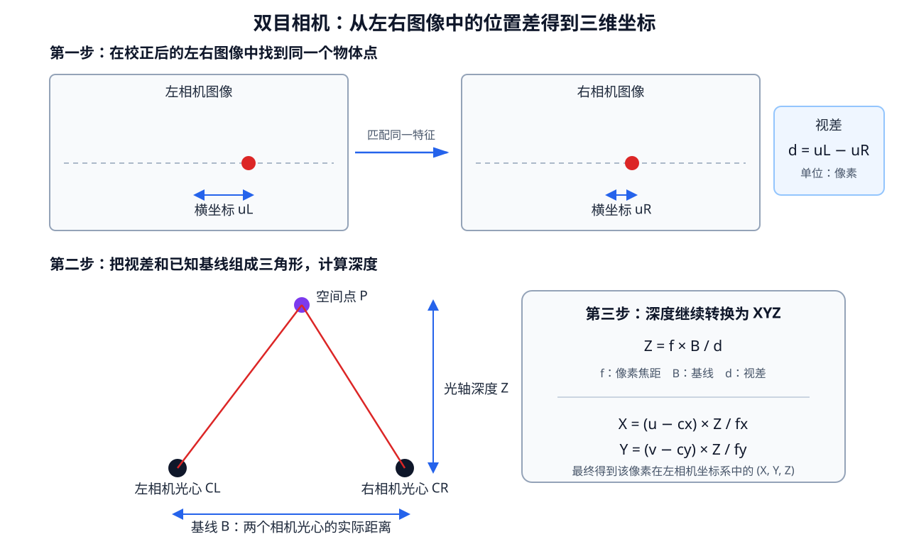

# [3D快速入门] 第五阶段 物体三维位置的表示与获取

三维视觉中的“获得物体三维坐标”，最终通常要得到下面两类结果之一：

1. 物体上某个点在相机坐标系中的位置 $(X,Y,Z)$；
2. 物体整体相对相机的位置和朝向，也就是位姿 $R、t$。

不同设备和算法得到的中间信息并不相同：PnP 直接求物体位姿；双目、RGB-D 和激光雷达先提供深度或距离；AI 单目深度先预测每个像素的远近。只有继续结合像素位置、相机参数和坐标变换，这些中间信息才会变成最终需要的三维坐标。

本篇围绕一条主线展开：

$$
\text{相机或算法实际获得的信息}
\longrightarrow
\text{深度或物体位姿}
\longrightarrow
\text{相机坐标系中的三维位置}
\longrightarrow
\text{验证结果是否可信}.
$$

相机内参、畸变、投影和反投影的完整解释见[《第四阶段 相机成像》](<[3D快速入门] 第四阶段-相机成像.md>)。本篇只在新的三维数据来源中使用这些关系，不再重复标定过程。

## 1 物体的“三维位置”可以表示成什么

### 1.1 一个空间点的三维坐标

最基础的结果是一个三维点：

$$
P_C=
\begin{bmatrix}
X_C\\Y_C\\Z_C
\end{bmatrix}.
$$

下标 $C$ 表示这个点写在相机坐标系中。采用 OpenCV 常见的相机坐标约定时：

- $X_C$ 向图像右侧；
- $Y_C$ 向图像下方；
- $Z_C$ 从相机指向前方。

例如 $(0.2,-0.1,2.0)\ \text{m}$ 表示这个点位于相机右侧 $0.2\ \text{m}$、上方 $0.1\ \text{m}$、前方 $2.0\ \text{m}$。

坐标值必须和坐标系一起说明。同一个物体可以同时拥有相机坐标、机器人坐标和世界坐标；三组数值可能完全不同，但描述的是同一个现实位置。

### 1.2 物体位姿：三维位置加朝向

一个三维坐标只能说明“物体原点在哪里”。刚性物体还可能发生旋转，所以完整状态通常写成：

$$
P_C=R_{CO}P_O+t_{CO}.
$$

其中：

- $P_O$ 是点在物体坐标系，也叫模型空间中的坐标；
- $R_{CO}$ 描述物体坐标轴相对相机坐标轴的朝向；
- $t_{CO}$ 是物体原点在相机坐标系中的三维坐标；
- $P_C$ 是这个物体点变换到相机坐标系后的三维坐标。

$R、t$ 合在一起称为物体相对相机的**位姿**。机器人抓取、标记板定位和增强现实通常需要位姿；只做目标距离提示时，可能只关心 $t$ 或其中的 $Z$。

### 1.3 深度图、点云和三维包围框

物体位置还可能用一组数据表示：

- **深度图（Depth Map）**：每个有效像素存一个深度值，回答该像素看到的表面有多远；
- **点云（Point Cloud）**：许多 $(X,Y,Z)$ 点组成的集合，描述相机实际看到的物体表面；
- **三维包围框（3D Bounding Box）**：用中心、长宽高和朝向描述物体占据的大致空间范围；
- **已知模型的位姿**：模型本身的形状已经存在，只需求它整体放在什么位置、朝向哪里。

深度图仍然按二维像素排列；点云已经进入三维坐标；三维包围框和位姿进一步把大量点概括成一个目标级结果。

### 1.4 光轴深度、直线距离、视差和基线

这四个量经常一起出现，但含义不同。

**光轴深度 $Z$** 是三维点的 $Z_C$ 坐标。它表示沿相机正前方方向量出的距离。点位于画面边缘时，它到相机光心的直线距离会大于 $Z$。

**直线距离 $r$** 是相机光心到空间点的实际线段长度：

$$
r=\sqrt{X_C^2+Y_C^2+Z_C^2}.
$$

例如一个点的坐标为 $(3,0,4)\ \text{m}$，它的光轴深度是 $4\ \text{m}$，直线距离是 $5\ \text{m}$。

**视差 $d$** 是同一个空间点在左右图像中的横向像素位置差。它的单位是像素，用于双目计算深度。

**基线 $B$** 是左右相机光心之间的真实距离，例如 $0.10\ \text{m}$。基线是双目系统的结构参数，用于把像素视差换成公制深度；它不负责表示某个物体的位置。

## 2 工程中常见的三维位置获取路线

不同方法的核心区别是：系统最先获得了什么信息。

| 方法 | 最先获得的信息 | 还需要什么 | 最终能得到什么 |
|---|---|---|---|
| 已知尺寸的相似三角形 | 物体在图像中的像素跨度 | 真实尺寸、像素焦距 | 粗略深度 |
| PnP | 已知模型点与图像点的对应关系 | $K、D$ 和模型真实尺度 | 物体位姿 $R、t$ |
| 双目相机 | 左右图像中同一点的位置差 | 双目标定、基线、像素焦距 | 深度图和 XYZ |
| 结构光相机 | 投射图案在画面中的偏移 | 相机与投射器的标定关系 | 深度图和 XYZ |
| ToF 相机 | 光往返产生的时间或相位变化 | 设备标定和深度定义 | 距离图或深度图，再转 XYZ |
| 激光雷达 | 每束激光的方向和测得距离 | 雷达标定；融合图像时还需外参 | 直接生成三维点云 |
| 单目 AI 深度 | 网络预测的逐像素深度或相对远近 | 模型尺度定义、相机内参 | 深度图；满足公制条件时可转 XYZ |
| SfM、MVS、SLAM | 多帧或多视角之间的特征对应 | 相机模型和足够视角变化 | 相机轨迹与场景三维结构 |

已知物体真实长度时，可以按照第四阶段第 4.1 节的相似三角形关系估计深度：

$$
Z=\frac{f_yL}{h_{px}}.
$$

这种方法适合规则物体和粗略测距。物体发生明显倾斜时，画面中的像素长度还会受到朝向影响；需要完整位置和朝向时，PnP 更合适。

## 3 PnP：根据已知物体模型直接求位姿

### 3.1 PnP 实际使用哪些已知信息

透视 n 点定位（Perspective-n-Point，PnP）使用四类数据：

1. 物体上多个点在物体坐标系中的三维坐标 `objectPoints`；
2. 这些点在当前图像中的对应像素 `imagePoints`；
3. 相机内参 $K$；
4. 镜头畸变参数 $D$。

以边长 $0.20\ \text{m}$ 的正方形标记板为例，把板中心设为物体原点，四个角在模型空间中的坐标可以写成：

$$
(-0.1,0.1,0),\quad
(0.1,0.1,0),\quad
(0.1,-0.1,0),\quad
(-0.1,-0.1,0).
$$

这些三维坐标只说明标记板自身的形状和尺寸。程序再检测四个角在当前图像中的像素位置，并按相同顺序组成四组 3D–2D 对应关系。

### 3.2 PnP 怎样把对应点变成三维位置

PnP 寻找一组 $R_{CO}、t_{CO}$，使模型点经过：

$$
P_O
\xrightarrow{R_{CO},t_{CO}}
P_C
\xrightarrow{K,D}
\hat p
$$

以后，预测像素 $\hat p$ 尽量接近实际检测像素 $p$。最终输出的平移向量：

$$
t_{CO}=
\begin{bmatrix}
X\\Y\\Z
\end{bmatrix}
$$

就是物体原点在相机坐标系中的三维位置；旋转矩阵 $R_{CO}$ 表示物体朝向。物体上其他模型点可以继续通过 $P_C=R_{CO}P_O+t_{CO}$ 得到相机坐标。

OpenCV 的 `solvePnP()` 接收 `objectPoints、imagePoints、cameraMatrix、distCoeffs`，输出 `rvec、tvec`。其中 `rvec、tvec` 把物体坐标系中的点变换到相机坐标系，参见 [OpenCV solvePnP 官方文档](https://docs.opencv.org/4.x/d5/d1f/calib3d_solvePnP.html)。

```cpp
cv::Mat rvec, tvec;
bool solved = cv::solvePnP(
    objectPoints,
    imagePoints,
    cameraMatrix,
    distCoeffs,
    rvec,
    tvec
);
```

这段调用只展示参数映射。首轮无需自己实现 PnP 求解器。

### 3.3 PnP 结果怎样使用和验证

求得 $R、t$ 后，可以：

- 读取 $t$，得到标记板或已知物体原点的三维坐标；
- 将模型上的抓取点转换到相机坐标；
- 绘制三维坐标轴或虚拟模型；
- 已知标记板在世界中的位置时，反求相机位姿。

验证时，将模型点用求得的 $R、t、K、D$ 再次投影回图像，比较预测像素和检测像素。这称为**重投影检查**。OpenCV 中可使用 `projectPoints()`。

低重投影误差只能说明当前参数较好地解释了二维对应点。模型尺寸写大两倍时，PnP 可能同时把距离估大两倍，投影仍然接近。因此还要检查模型单位、正深度、实际距离范围和连续帧稳定性。

普通目标检测框的四个角通常不对应物体表面固定的四个模型点，直接拿来做 PnP 容易产生错误位姿。PnP 更适合标记板、已知刚性零件或具有稳定关键点的目标。

## 4 双目相机：从左右图像的视差得到 XYZ

### 4.1 视差是怎样产生的

双目相机由左右两个相机组成。两个相机光心之间相隔一段固定距离 $B$，也就是基线。由于观察位置不同，同一个空间点会落在左右图像的不同横向位置。

双目标定和校正会把两幅图调整到便于匹配的状态：同一个空间点应落在左右图像近似相同的行。此时只需沿同一行搜索对应点。

假设空间点在左图横坐标为 $u_L$，在右图横坐标为 $u_R$，视差定义为：

$$
d=u_L-u_R.
$$

程序需要通过局部纹理、亮度模式或学习模型判断左右图中的哪些像素来自同一个现实点。对大量像素完成这种对应搜索后，便得到一张**视差图**，其中每个有效像素保存自己的视差 $d$。



### 4.2 视差怎样转换成深度

对经过正确校正的水平双目相机，深度满足：

$$
Z=\frac{fB}{d}.
$$

其中：

- $f$ 是校正后相机的像素焦距，单位为像素；
- $B$ 是基线，单位为米或毫米；
- $d$ 是视差，单位为像素；
- $Z$ 与 $B$ 使用相同长度单位。

例如 $f=800$ 像素、$B=0.10\ \text{m}$、某点视差 $d=40$ 像素，则：

$$
Z=\frac{800\times0.10}{40}=2.0\ \text{m}.
$$

同一个物体越靠近相机，左右观察方向差得越明显，视差通常越大；物体越远，视差越小。因为 $Z$ 与 $1/d$ 相关，远处只有几像素视差时，哪怕匹配偏差不到一个像素，也可能造成明显的深度误差。

### 4.3 从一张视差图得到三维点

视差图中的每个有效像素都可以先计算深度 $Z$，再使用左相机校正后的内参反投影：

$$
X=\frac{(u-c_x)Z}{f_x},\qquad
Y=\frac{(v-c_y)Z}{f_y}.
$$

于是一个像素 $(u,v)$ 加上视差 $d$，最终变成左相机校正坐标系中的 $(X,Y,Z)$。全图计算以后，就得到与视差图对应的三维点集。

OpenCV 中常见的处理关系是：

```text
双目标定结果
→ stereoRectify() 得到校正参数和 Q
→ StereoBM 或 StereoSGBM 计算视差图
→ reprojectImageTo3D() 使用视差图和 Q 生成 XYZ
```

OpenCV 官方文档说明，`reprojectImageTo3D()` 会把单通道视差图转换成同尺寸的三通道三维坐标图；若使用 `stereoRectify()` 产生的 $Q$，输出点位于第一台相机的校正坐标系中。部分 OpenCV 匹配器返回的 16 位视差带有固定缩放，使用前必须按接口约定恢复真实像素视差，参见 [OpenCV 标定与三维重建接口](https://docs.opencv.org/4.x/d9/d0c/group__calib3d.html)。

### 4.4 双目方法为什么会失败

双目首先要找到同一个现实点在左右图中的对应位置。下面几类区域很难稳定匹配：

- 大面积纯色墙面缺少可区分纹理；
- 栏杆等重复纹理可能匹配到错误周期；
- 物体边缘存在一侧能看见、另一侧被遮挡的区域；
- 反光和透明物体在两个视角下外观变化明显；
- 左右相机不同步时，运动目标的位置已经变化。

匹配失败的像素应标记为无效，不能把无效视差直接带入 $Z=fB/d$。

## 5 主动深度相机和激光雷达怎样生成三维信息

### 5.1 结构光：用投射器制造可匹配的图案

结构光系统通常包含相机和红外投射器。投射器向场景发出已知图案，相机观察图案落在物体表面后的像素位置。

处理链可以理解为：

```text
投射器发出已知图案
→ 相机识别图案在画面中的位置
→ 根据相机与投射器之间的固定几何关系进行三角测量
→ 得到每个有效像素的深度
→ 结合内参反投影为 XYZ
```

投射器在几何作用上类似第二个观察位置，所以结构光与双目都可使用三角测量。区别在于普通双目依赖场景自身纹理，结构光主动在物体表面制造纹理。

强环境光可能淹没投射图案；透明、镜面和吸收红外光的材料也可能产生空洞或错误深度。

### 5.2 ToF：测量光传播产生的时间或相位变化

飞行时间（Time of Flight，ToF）相机会主动发射调制光，并测量光从设备到物体再返回所造成的时间或相位变化。传播时间越长，物体通常越远。

处理链是：

```text
发射调制光
→ 每个接收像素测量返回信号的时间或相位
→ 设备标定和算法把测量值转换成距离
→ 输出距离图或光轴深度图
→ 按数据定义转换为 XYZ
```

如果设备输出的是光轴深度 $Z$，可直接使用针孔反投影公式。如果设备输出的是沿像素射线的直线距离 $r$，需要先求该像素对应的单位方向：

$$
\mathbf{q}=
\begin{bmatrix}
(u-c_x)/f_x\\
(v-c_y)/f_y\\
1
\end{bmatrix},
\qquad
P_C=r\frac{\mathbf{q}}{\lVert\mathbf{q}\rVert}.
$$

因此，读取设备数据时必须确认 `depth` 字段究竟表示 $Z$ 还是 $r$。字段名称本身不能确定其几何含义，应以设备 SDK 和标定文件为准。

ToF 还可能受到多径反射、强环境光、低反射率材料和不同相机之间光信号干扰的影响。

### 5.3 激光雷达：用方向和距离直接生成点云

激光雷达发出许多方向已知的激光束，并测量每束光返回的距离。假设某束激光的水平角为 $\theta$、俯仰角为 $\phi$、直线距离为 $r$，可以按雷达坐标约定转换成三维点，例如：

$$
X=r\cos\phi\cos\theta,
$$

$$
Y=r\cos\phi\sin\theta,
$$

$$
Z=r\sin\phi.
$$

大量激光束便形成雷达坐标系中的点云。不同雷达的坐标轴定义可能不同，实际工程应以设备文档为准。

如果要把雷达点显示到相机图像上，还需要雷达到相机的外参：

$$
P_C=R_{CL}P_L+t_{CL}.
$$

先将雷达点从雷达坐标系变到相机坐标系，再通过内参投影到像素。这样才能知道图像中的某个目标对应哪些雷达三维点。

## 6 单目 AI 深度和多视图方法怎样恢复三维信息

### 6.1 单目 AI 深度：从图像外观预测远近

单目深度网络根据训练数据学习透视、遮挡、纹理大小和物体类别等线索，为一张普通图像预测逐像素深度。

网络可能输出两类结果：

- **相对深度**：数值只表达像素之间谁更近、谁更远；
- **公制深度**：模型经过特定尺度训练，输出尝试对应米或其他真实单位。

相对深度可以生成有层次的三维形状，但整体尺度未知，不能直接声称某点距离相机两米。若模型输出经过验证的公制光轴深度，便可使用 $X=(u-c_x)Z/f_x$、$Y=(v-c_y)Z/f_y$ 转成三维点。

AI 深度从图像规律中估计距离，没有在当前画面中直接测量光的传播或双目几何。训练场景与实际镜头、物体和环境差异较大时，绝对尺度和局部边缘都可能出现偏差。

### 6.2 SfM、MVS 和 SLAM：从多视角对应关系三角化

运动恢复结构（Structure from Motion，SfM）会在多张照片中寻找同一场景特征，先估计相机之间的相对位置，再由多条观察射线的交会位置三角化出三维点。

多视图立体（Multi-View Stereo，MVS）继续利用更多像素对应关系，把稀疏三维点扩展成更密集的表面。同步定位与建图（Simultaneous Localization and Mapping，SLAM）则在相机连续运动时持续估计相机位姿并维护地图。

单目多视图通常只能确定相对尺度：整套场景和相机轨迹同时放大两倍，投影到图像仍可能相同。加入已知尺寸、已知相机移动距离、双目基线、IMU 或其他尺度来源后，才能恢复公制尺度。

这些方法主要服务于场景重建和相机定位。本篇只说明它们如何产生三维信息，具体特征匹配、三角化和 SLAM 系统留到后续阶段。

## 7 从深度图得到目标物体的三维坐标

### 7.1 使用深度前先确认单位和无效值

深度图中的一个数值必须连同数据定义一起读取：

- 数值单位是米、毫米，还是需要乘比例因子的整数；
- 数值表示光轴深度 $Z$，还是射线直线距离 $r$；
- 0、负数、NaN、无穷大或某个最大整数是否表示无效；
- 当前图像是否只是为了显示而归一化、着色后的伪彩图。

例如原始值为 `1500`，当比例为 $0.001\ \text{m}$ 时表示 $1.5\ \text{m}$；当比例为 $0.1\ \text{mm}$ 时只表示 $0.15\ \text{m}$。比例必须来自文件格式、设备 SDK 或数据集说明。

伪彩色深度图的颜色只用于观察，人眼看到的红色或蓝色无法直接代入三维公式。三维计算应使用原始深度数组和有效值掩码。

### 7.2 像素加光轴深度怎样得到 XYZ

对已经去畸变或符合当前相机模型的像素 $(u,v)$，若深度值表示光轴深度 $Z$，则：

$$
X=\frac{(u-c_x)Z}{f_x},\qquad
Y=\frac{(v-c_y)Z}{f_y},\qquad
Z=\text{depth}(u,v).
$$

这一步称为**反投影**：像素和内参先确定一条空间射线，深度再确定射线上的具体位置。完整推导已经在第四阶段第 6 节说明。

对全张深度图重复计算，便得到一组 $(X,Y,Z)$，也就是点云。对目标区域计算，则得到物体可见表面对应的三维点。

### 7.3 RGB 和深度为什么需要对齐

RGB-D 设备经常使用一台彩色相机和一台深度相机。两台相机的安装位置和内参不同，所以彩色图像中的像素 $(u,v)$ 与深度图中的同坐标像素不一定观察同一个空间点。分辨率相同也无法消除这种视角差异。

正确的空间对齐流程是：

$$
\text{深度像素和深度}
\xrightarrow{K_D^{-1}}
P_D
\xrightarrow{R_{CD},t_{CD}}
P_C
\xrightarrow{K_C}
\text{彩色图像像素}.
$$

也就是先把深度像素恢复成深度相机坐标，再通过外参变到彩色相机坐标，最后投影到彩色图像。简单 `resize` 只能改变图像大小，无法补偿两个光心的位置差。

运动物体还要求彩色帧和深度帧时间接近。两帧拍摄时刻不同，目标已经移动，即使空间标定完全正确，也会出现检测框与深度区域错位。

### 7.4 一个检测框怎样变成物体三维位置

假设目标检测给出一个二维框，深度图已经与彩色图像对齐，可以按下面的流程得到目标位置：

```text
二维检测框
→ 取出框内对应的原始深度
→ 删除 0、NaN、超范围和明显背景值
→ 把剩余像素反投影成三维点
→ 根据任务选择一个代表位置
```

常见的代表位置包括：

- **中心像素三维点**：计算简单，但中心像素可能落在空洞或背景上；
- **区域深度中位数对应的位置**：对少量异常深度更稳定，但仍需先分离背景；
- **目标点云质心**：概括可见表面的平均位置，不一定等于完整物体的真实几何中心；
- **底面中心**：移动机器人常用，通常需要地面和目标三维范围；
- **PnP 模型原点**：适合已知刚性模型，原点的物理含义由建模时决定；
- **三维包围框中心**：需要三维检测或点云几何估计。

所以“物体的三维坐标”必须同时说明代表的是哪个点。只写 $(X,Y,Z)$，却没有定义它是表面点、质心、底面中心还是模型原点，后续控制模块就无法正确使用。

## 8 怎样选择方法并验证结果

### 8.1 按任务条件选择获取方式

| 任务条件 | 优先考虑 | 主要输出 | 需要特别确认 |
|---|---|---|---|
| 已知刚性物体或标记板 | PnP | 物体位姿 $R、t$ | 模型尺寸、点对应、平面歧义 |
| 室内近距离稠密深度 | 结构光或 ToF RGB-D | 深度图、点云 | 工作距离、反光和环境光 |
| 有左右相机且场景纹理充足 | 双目 | 视差图、深度图、点云 | 标定校正、同步、无效视差 |
| 较远距离空间测量 | 激光雷达 | 稀疏或较密点云 | 扫描结构、外参和遮挡 |
| 只有单张普通图像 | 已知尺寸测距或 AI 深度 | 粗略深度或预测深度 | 真实尺度和域差异 |
| 多张照片重建场景 | SfM、MVS | 相机位姿和场景结构 | 纹理、视角覆盖和尺度来源 |
| 连续定位并维护地图 | SLAM | 相机轨迹和地图 | 传感器同步、退化和累计误差 |

同一个系统也可以融合多种方法。例如相机负责识别物体类别和像素区域，激光雷达负责提供公制三维点；PnP 负责已知标记板的精确位姿；AI 深度可用于没有深度硬件时提供近似结构。

### 8.2 不同方法分别怎样验证

三维结果至少要回到原始观测中检查：

- **PnP**：把模型点重新投影到图像，检查重投影位置、正深度和模型真实尺寸；
- **双目**：检查左右匹配是否落在同一现实特征上，并用已知距离物体验证 $Z=fB/d$ 的尺度；
- **RGB-D**：检查单位、无效值、工作范围，以及深度边缘能否与彩色图像边缘对齐；
- **激光雷达与相机融合**：把雷达点投影到图像，检查点是否落在对应物体上；
- **AI 深度**：分别检查远近排序和公制误差，不能用相对深度图的视觉效果代替距离验证；
- **连续视频**：观察静止物体的三维坐标是否稳定，运动物体是否因时间不同步出现位置拖尾或跳变。

工程中真正可用的三维坐标，需要同时满足坐标系明确、单位正确、数据有效、时间和空间对应正确，并通过已知场景或重新投影得到验证。
