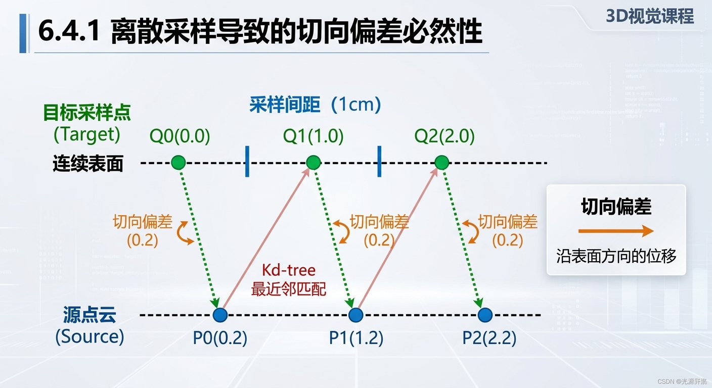
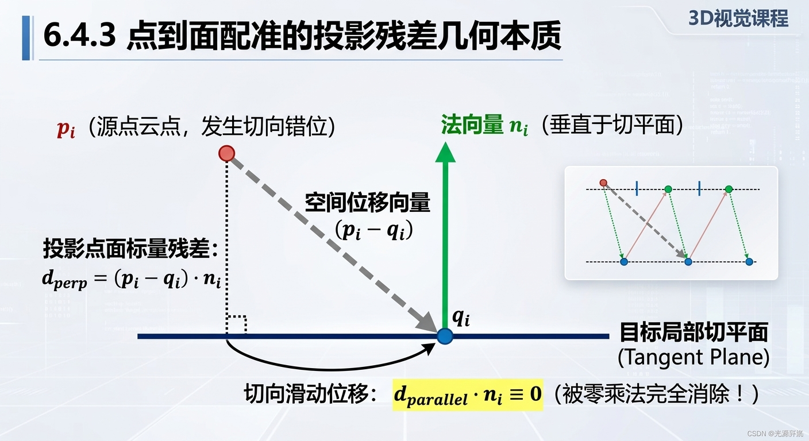

# [3D快速入门] 第六阶段 点云


# 一、Windows + VS 2022 下 PCL 环境搭建

## 1.1 PCL 架构与依赖体系

### 1.1.1 核心依赖库职责

PCL（Point Cloud Library）自身专注于点云数据结构与处理算法，底层计算与系统功能由以下第三方库支撑：

* **Eigen**：纯头文件的高性能 C++ 线性代数库。负责底层矩阵运算、向量操作、四元数计算、坐标空间变换矩阵运算以及协方差矩阵对角化求解。
* **FLANN (Fast Library for Approximate Nearest Neighbors)**：高维近似近邻搜索库。点云数据在空间中呈现离散、无序的特征，FLANN 提供高效构建空间索引树（如 Kd-tree）的算法实现，用于快速执行近邻检索。
* **VTK (Visualization Toolkit)**：三维计算机图形学与渲染工具包。PCL 的 `visualization` 模块底层封装了 VTK，负责三维坐标系建立、点云渲染、视角交互与窗口事件循环。
* **Boost**：跨平台 C++ 基础库。提供底层共享内存管理、多线程同步机制以及文件系统操作支持。

### 1.1.2 PCL 核心子模块划分

PCL 采用细粒度模块化设计，以降低编译开销并避免依赖膨胀：

* **common**：基础核心模块，定义了 `pcl::PointCloud<T>` 容器模板、常见点类型（如 `pcl::PointXYZ`）及基础数学工具。
* **io**：输入输出模块，负责 `.pcd`、`.ply` 等点云文件格式的解析、读取与写入。
* **visualization**：点云可视化模块，封装交互式 3D 渲染视窗。
* **filters**：点云滤波与预处理模块，包含直通滤波、体素下采样及统计滤波等算法。
* **kdtree / search**：空间索引模块，提供基于 Kd-tree 的 K 近邻（KNN）与半径搜索接口。
* **features**：空间几何特征估计模块，包含表面法向量、曲率及特征描述子计算。
* **segmentation**：点云分割模块，包含基于 RANSAC 的几何图元拟合与欧氏聚类算法。
* **registration**：点云位姿配准模块，提供 ICP（迭代最近点）及其衍生算法实现。

---

## 1.2 CMake 构建机制与语法规则

### 1.2.1 Config 模式寻径原理

PCL 依赖 CMake 的配置模式（Config Mode）导出构建规则：

* **配置文件定位**：构建系统通过寻找安装目录下的 `PCLConfig.cmake` 获取编译选项、宏定义、头文件目录和链接库路径。
* **路径引导**：当 PCL 未注入系统全局环境变量时，通过向 `CMAKE_PREFIX_PATH` 列表中追加 PCL 及其三方依赖根路径，引导 CMake 执行递归搜索。
* **内部驱动变量**：`PCL_DIR` 是 CMake 寻找 PCL 配置的内置查找路径变量。设置该变量时无需通过 `${PCL_DIR}` 显式传递，`find_package` 在调用时会自动读取该变量作为优先搜索路径。

### 1.2.2 `find_package` 指令参数定义

以构建指令为例：

```cmake
find_package(PCL 1.14 REQUIRED COMPONENTS common io visualization filters kdtree search features segmentation registration)

```

各参数定义如下：

* **PCL**：目标包名称，触发 CMake 检索 `PCLConfig.cmake`。
* **1.14**：版本约束，要求系统中找到的 PCL 版本不低于 1.14。
* **REQUIRED**：强约束修饰符。若未找到满足条件的库，配置阶段立即终止并输出错误日志，避免将符号缺失推迟到编译或链接阶段。
* **COMPONENTS**：组件选择声明。指定工程实际调用的子模块集合，避免加载无关模块导致依赖链过长或产生不必要的依赖冲突。

---

## 1.3 工程配置与最小代码实现

### 1.3.1 全阶段构建配置 (`CMakeLists.txt`)

该配置适配 C++17 标准，一次性引入后续全部核心算法组件：

```cmake
cmake_minimum_required(VERSION 3.20)

# 定义工程名称与 C++ 标准
project(PCL_Learning_Project CXX)
set(CMAKE_CXX_STANDARD 17)
set(CMAKE_CXX_STANDARD_REQUIRED ON)

# 显式声明依赖项查找路径（根据实际安装路径调整）
list(APPEND CMAKE_PREFIX_PATH "D:/PCL 1.14.0")

# 导入 PCL 及其算法组件
find_package(PCL 1.14 REQUIRED COMPONENTS
    common
    io
    visualization
    filters
    kdtree
    search
    features
    segmentation
    registration
)

message(STATUS "PCL modules resolved successfully.")

# 配置包含目录、库目录与编译宏
include_directories(${PCL_INCLUDE_DIRS})
link_directories(${PCL_LIBRARY_DIRS})
add_definitions(${PCL_DEFINITIONS})

# 生成可执行文件并链接目标库
add_executable(pcl_starter main.cpp)
target_link_libraries(pcl_starter PRIVATE ${PCL_LIBRARIES})

```

### 1.3.2 最小验证代码 (`main.cpp`)

用于验证数据结构实例化、内存分配与控制台输出流程：

```cpp
#include <iostream>
#include <pcl/point_types.h>
#include <pcl/point_cloud.h>

int main()
{
    // 实例化三维点云容器
    pcl::PointCloud<pcl::PointXYZ> cloud;

    // 设置基础几何属性：height 为 1 表示无序点云
    cloud.width    = 5;
    cloud.height   = 1;
    cloud.is_dense = true;
    cloud.resize(cloud.width * cloud.height);

    // 填充测试坐标数据
    for (size_t i = 0; i < cloud.size(); ++i)
    {
        cloud[i].x = 1024.0f * rand() / (RAND_MAX + 1.0f);
        cloud[i].y = 1024.0f * rand() / (RAND_MAX + 1.0f);
        cloud[i].z = 1024.0f * rand() / (RAND_MAX + 1.0f);
    }

    std::cout << "[INFO] Generated points count: " << cloud.size() << std::endl;
    for (const auto& pt : cloud)
    {
        std::cout << "  X: " << pt.x << " | Y: " << pt.y << " | Z: " << pt.z << std::endl;
    }

    return 0;
}

```

### 1.3.3 运行期动态链接库机制

CMake 仅负责在编译期解析头文件以及链接期解析 `.lib` 导入库符号。在 Windows 操作系统下启动可执行程序时，动态链接器必须在可寻址路径中定位对应的 `.dll` 文件。

若未配置全局环境变量，应在 VS 2022 的 `CMakePresets.json` 或 `CMakeSettings.json` 中的 `PATH` 配置项添加以下二进制文件目录：

* `PCL 安装根目录/bin`
* `PCL 安装根目录/3rdParty/VTK/bin`
* `PCL 安装根目录/3rdParty/FLANN/bin`

---

# 二、点云认知、格式与底层表达

## 2.1 点云空间几何特性

### 2.1.1 离散坐标与无序性

三维点云是欧氏空间中采样离散点集合的数学抽象。与二维图像依赖规则网格阵列不同，点云具有两个基本空间特性：

* **无序性（Unordered）**：点云中点的排列顺序不改变几何表达。对于包含 $N$ 个点的集合，对数组元素下标进行任意置换，其所表征的三维空间几何形貌恒定。
* **稀疏性（Sparse）**：点云仅在三维实体的表面或传感器光束反射截面处存在采样值。由于不存在二维网格中相邻像素的固定隐式索引拓扑，点云空间中相邻点的邻域判定必须基于三维几何距离计算。

### 2.1.2 空间近邻检索的复杂度瓶颈

在缺乏空间几何拓扑结构的前提下，若直接使用欧几里得距离检索某点的半径邻域或 $K$ 近邻：

* **暴力遍历开销**：单点检索需遍历全局所有点，单次查询时间复杂度为 $O(N)$。
* **全图检索开销**：若对包含 $N$ 个点的点云构建全量近邻关系，复杂度将激增至 $O(N^2)$。因此在后续工程中必须引入空间分区数据结构（如 Kd-tree 或 Octree）将单点检索复杂度优化至 $O(\log N)$。

---

## 2.2 点云文件存储规范

### 2.2.1 PCD 格式规范与头文件解析

PCD（Point Cloud Data）文件由头信息（Header）和数据块（Data）组成，文件头以 ASCII 纯文本形式描述数据的存储维度、排布规则与数据类型。

```text
# .PCD v0.7 - Point Cloud Data file format
VERSION 0.7
FIELDS x y z
SIZE 4 4 4
TYPE F F F
COUNT 1 1 1
WIDTH 640
HEIGHT 480
VIEWPOINT 0 0 0 1 0 0 0
POINTS 307200
DATA ascii
is_dense false

```

核心字段功能定义如下：

* **FIELDS / SIZE / TYPE / COUNT**：定义每个维度的语义名称、单元素字节跨度（4 字节）、底层类型（`F` 表示 Float、`U` 表示 Unsigned、`I` 表示 Signed）及通道标量/向量维度（1 为标量）。
* **WIDTH 与 HEIGHT（组织结构语义）**：
* **有序点云（Organized）**：由 RGB-D 相机或结构光传感器阵列直接采集生成，数据点与传感器的行、列网格严格对应。`WIDTH` 为列数，`HEIGHT` 为行数。可通过行列号 $(u, v)$ 在 $O(1)$ 时间内确定上下左右空间临近点。
* **无序点云（Unorganized）**：数据经由多角度拼接、滤波或裁剪处理后失去行列拓扑。PCL 规范要求将 `HEIGHT` 强制置为 `1`，`WIDTH` 记录点云中点集的总数（即 $\text{WIDTH} = \text{POINTS}$）。


* **is_dense 语义与盲区 NaN 点处理**：
* 若采集视场中存在强吸光材料、超出量程或遮挡区域，传感器无法测量距离时会将其赋为 `NaN`（IEEE 754 非数），以避免引入具有实际物理含义的零值或负值扰乱几何计算。
* **`is_dense = false`**：点云中包含 `NaN` 或 `Inf` 等无效浮点数。若保持有序点云形态（保留行列结构），盲区点保留为 `NaN`，此时必须标记为 `false`。
* **`is_dense = true`**：点云中全量数据合法，不包含任何 `NaN` 或 `Inf`。若将包含 `NaN` 的有序点云执行物理清理过滤，因各行点数不再规整一致，点云会退化为无序点云（`HEIGHT = 1`），清洗完毕后此属性翻转为 `true`。


* **DATA 存储模式**：
* **`ascii`**：纯文本存储，便于可读性与快速排查，但占用体积大且反序列化存在严重的字符串转换性能消耗。
* **`binary`**：内存字节镜像序列化存储，占用体积小且加载时直接进行内存内存拷贝，为工业量产场景标准。


### 2.2.2 PLY 格式与现代 3DGS 扩展

PLY（Polygon File Format）主要包含两类设计特性：

* **网格拓扑支持**：不仅定义顶点数组（`element vertex`），还原生支持面片定义（`element face`），记录多边形拓扑顶点索引。
* **3D Gaussian Splatting (3DGS) 属性扩展**：现代神经渲染管线沿用了 PLY 的属性定义能力，在 `element vertex` 内部拓展了协方差尺寸参数（`scale_0, scale_1, scale_2`）、旋转四元数（`rot_0 ~ rot_3`）、不透明度（`opacity`）以及球谐函数系数（`f_dc`, `f_rest`），将空间基元从纯粹的欧氏位置点拓展为高斯椭球几何体。

---

## 2.3 PCL 底层内存布局与容器实现

### 2.3.1 `pcl::PointXYZ` 内存对齐与 SIMD 优化

在 64 位体系结构下，`pcl::PointXYZ` 结构体在内存中占用 **16 字节**，而非几何意义上的 12 字节（3 个 4 字节单精度浮点数）：

```cpp
// PCL 内部内存布局抽象示意
struct PointXYZ
{
    float x;
    float y;
    float z;
    float data[4]; // 通过 union 与 x, y, z 共用空间，尾部包含 4 字节填充（Padding）
};

```

* **硬件对齐原因**：现代 x86/x64 CPU 具备 128 位宽度的 SIMD 向量寄存器（如 SSE / AVX 指令集）。数据按 16 字节严格对齐时，可直接通过单周期专用指令（如 `_mm_load_ps`）并行读写 4 个单精度浮点数，执行点云仿射变换时可同时计算四个分量。
* **缓存命中保障**：16 字节对齐可避免跨越 CPU 缓存行（Cache Line）边界加载数据，消除非对齐内存访问带来的延迟惩罚。

### 2.3.2 `pcl::PointCloud<T>` 容器实现与内存管理策略

PCL 的点云容器采用模板机制实现，内部管理主要依赖标准库与自定义对齐分配器：

* **容器底层**：核心数据缓冲区采用 `std::vector<PointT, Eigen::aligned_allocator<PointT>>`，确保堆空间在动态分配时保持 16 字节边界对齐。
* **工程内存管理**：
* 严禁在循环体中频繁调用 `push_back()` 向未声明容量的容器填充海量点，否则会触发动态连续重排扩容与多余内存拷贝。
* **`reserve(N)`**：预开辟堆空间容量（修改 `capacity`），避免动态重分配，后续配合 `emplace_back()` 或 `push_back()` 插入元素。
* **`resize(N)`**：直接在堆上实例化 $N$ 个连续内存对象（修改 `size` 与 `capacity`），配合下标索引直接进行并行或就地数据写入。

# 三、点云生成与数据获取（反投影）

## 3.1 针孔相机成像与几何反投影原理

### 3.1.1 针孔成像与相机内参模型

空间中任意三维点在相机坐标系下的物理坐标表示为 $P = [X, Y, Z]^T$。其中 $Z$ 为该点沿相机光轴的纵深距离（物理深度），$X$ 与 $Y$ 分别表示横向与垂直方向的物理位移。

光线穿过光学中心投射至成像传感器，依据几何相似三角形推导，物理感光平面上的连续坐标 $(x', y')$ 满足：


$$x' = f \cdot \frac{X}{Z}, \quad y' = f \cdot \frac{Y}{Z}$$

将连续物理量离散化为感光芯片的像素坐标 $(u, v)$：


$$u = \frac{x'}{dx} + c_x = \frac{f}{dx} \cdot \frac{X}{Z} + c_x$$

$$v = \frac{y'}{dy} + c_y = \frac{f}{dy} \cdot \frac{Y}{Z} + c_y$$

工程上将物理焦距与像素单元物理尺寸合并为等效像素焦距，定义相机内参矩阵 $K$：


$$\begin{bmatrix} u \\ v \\ 1 \end{bmatrix} \cdot Z = \begin{bmatrix} f_x & 0 & c_x \\ 0 & f_y & c_y \\ 0 & 0 & 1 \end{bmatrix} \begin{bmatrix} X \\ Y \\ Z \end{bmatrix}$$

* $f_x, f_y$：水平与垂直方向以像素为单位的焦距。
* $c_x, c_y$：相机光心在图像平面投影的主点像素坐标。

### 3.1.2 几何反投影推导与空间共线特性

反投影（Back-Projection）为正投影的逆向求解过程。已知某有效像素坐标 $(u, v)$ 及该点对应的物理深度 $Z$，反解其三维空间坐标：


$$X = \frac{(u - c_x) \cdot Z}{f_x}$$

$$Y = \frac{(v - c_y) \cdot Z}{f_y}$$

* **空间共线约束**：对于相同像素坐标 $(u, v)$，若存在不同的深度值 $Z_A$ 与 $Z_B$（$Z_B > Z_A$），对应的空间点 $A(X_A, Y_A, Z_A)$ 与 $B(X_B, Y_B, Z_B)$ 在空间中与相机光心 $O(0, 0, 0)$ 严格共线，均落在同一直线视线光束上。深度越大，空间横向与纵向物理跨度 $(X, Y)$ 成正比放大。
* **单值深度图特性**：标准单通道 2D 深度图上，每个像素网格 $(u, v)$ 仅能存储唯一的最近反射表面深度。沿光束后方被遮挡的物体表面信息在传感器成像阶段即被截断丢失。

---

## 3.2 深度图数据特征与工程导入

### 3.2.1 像素数据格式与物理尺度因子

深度传感器（如结构光、ToF 相机）输出的原始深度图通常编码为 16 位无符号整型单通道图像（OpenCV 标识为 `CV_16UC1`，取值范围 $0 \sim 65535$）。

* **整型量化原因**：浮点型存储开销较大，且不利于无损压缩与传感器实时传输。
* **物理尺度换算（Depth Scale）**：深度图像素值 $D(u, v)$ 需除以标定的缩放因子以还原真实世界米（m）单位：

$$Z = \frac{D(u, v)}{\text{depth\_scale}}$$


* 常见工业相机 / Kinect：$\text{depth\_scale} = 1000.0$（像素值即毫米数）。
* TUM RGB-D 数据集：$\text{depth\_scale} = 5000.0$（像素值 $1$ 代表 $0.2\text{ mm}$）。


* **无效点过滤**：像素值 $D(u, v) = 0$ 表示超出测量视距、表面吸光或被遮挡造成的信号盲区，反投影时必须予以跳过。

### 3.2.2 2D 图像读取在点云工程中的集成

工业级 3D 感知管线的数据源多为 2D 阵列图像，因此引入 OpenCV 解析像素矩阵是行业标准方案。

* 读取 16 位深度图时，必须指定 `cv::IMREAD_UNCHANGED` 标识，避免动态降采样截断为 8 位灰度导致距离精度丢失。

---

## 3.3 反投影与点云序列化代码实现

### 3.3.1 CMake 构建适配

在工程配置中引入 OpenCV 支持：

```cmake
cmake_minimum_required(VERSION 3.20)
project(PCL_Learning_Project CXX)

set(CMAKE_CXX_STANDARD 17)
set(CMAKE_CXX_STANDARD_REQUIRED ON)

list(APPEND CMAKE_PREFIX_PATH 
    "D:/PCL 1.14.0"
    "D:/PCL 1.14.0/3rdParty/VTK"
    "D:/PCL 1.14.0/3rdParty/FLANN"
    "D:/PCL 1.14.0/3rdParty/Eigen"
    "D:/PCL 1.14.0/3rdParty/Boost"
    "D:/opencv/build"
)

find_package(PCL 1.14 REQUIRED COMPONENTS common io visualization)
find_package(OpenCV REQUIRED)

include_directories(${PCL_INCLUDE_DIRS} ${OpenCV_INCLUDE_DIRS})
link_directories(${PCL_LIBRARY_DIRS})
add_definitions(${PCL_DEFINITIONS})

add_executable(back_projection main.cpp)
target_link_libraries(back_projection PRIVATE ${PCL_LIBRARIES} ${OpenCV_LIBS})

```

### 3.3.2 反投影生成 PCD 核心源码

```cpp
#include <iostream>
#include <string>
#include <opencv2/opencv.hpp>
#include <pcl/point_types.h>
#include <pcl/point_cloud.h>
#include <pcl/io/pcd_io.h>

int main()
{
    // 1. 以原始无损格式加载 16 位深度图像
    std::string depth_path = "F:/pcl_learn/data/rgbd_dataset_freiburg1_xyz/depth/1305031102.160407.png";
    cv::Mat depth_img = cv::imread(depth_path, cv::IMREAD_UNCHANGED);
    if (depth_img.empty())
    {
        std::cerr << "[ERROR] Depth image path invalid." << std::endl;
        return -1;
    }

    // 2. 相机内参参数（TUM Freiburg 1 标定基准）
    const float fx = 517.3f;
    const float fy = 516.5f;
    const float cx = 318.6f;
    const float cy = 255.3f;
    const float depth_scale = 5000.0f;

    // 3. 内存预分配以保障连续性
    pcl::PointCloud<pcl::PointXYZ>::Ptr cloud(new pcl::PointCloud<pcl::PointXYZ>());
    cloud->reserve(depth_img.rows * depth_img.cols);

    // 4. 行列遍历解算三维物理坐标
    for (int v = 0; v < depth_img.rows; ++v)
    {
        for (int u = 0; u < depth_img.cols; ++u)
        {
            uint16_t raw_depth = depth_img.at<uint16_t>(v, u);
            if (raw_depth == 0) continue; // 剔除测距盲区

            float z = static_cast<float>(raw_depth) / depth_scale;
            float x = (static_cast<float>(u) - cx) * z / fx;
            float y = (static_cast<float>(v) - cy) * z / fy;

            pcl::PointXYZ pt;
            pt.x = x;
            pt.y = y;
            pt.z = z;
            cloud->points.push_back(pt);
        }
    }

    // 5. 元数据封装并序列化保存
    cloud->width = static_cast<uint32_t>(cloud->points.size());
    cloud->height = 1;      // 无序点云
    cloud->is_dense = true; // 容器内不含 NaN
    
    pcl::io::savePCDFileBinary("tum_cloud.pcd", *cloud);
    std::cout << "[INFO] Successfully exported " << cloud->size() << " points to PCD." << std::endl;

    return 0;
}

```

---

## 3.4 3D 渲染管线与通用自适应视点控制

### 3.4.1 光学坐标系与渲染引擎的冲突

在可视化窗口中，点云经常出现倒置或偏离视野中心，根源在于坐标系定义的差异：

* **相机/OpenCV 光学坐标系**：基于图像像素阵列原点（左上角），$+X$ 轴水平向右，$+Y$ 轴垂直向下，$+Z$ 轴沿着视轴朝前。
* **VTK 渲染管线规则**：默认约定世界坐标系的垂直向上矢量（View-Up Vector）为 $+Y$ 轴。
* **现象**：当 VTK 以 $+Y$ 朝上渲染一个 $+Y$ 朝下的相机点云时，画面呈现上下颠倒。必须通过设置相机的 Up 向量为 $(0, -1, 0)$ 来对齐重力方向，实现图像正立。

### 3.4.2 基于质心与空间包围盒的通用自适应视角

为摆脱硬编码视角参数，提高算法对任意尺寸、位置点云的适应能力，需利用三维质心（几何重心）结合点云空间包围盒尺度，动态后退观察摄像机。

```cpp
#include <cmath>
#include <memory>
#include <pcl/point_types.h>
#include <pcl/point_cloud.h>
#include <pcl/common/common.h>
#include <pcl/common/centroid.h>
#include <pcl/visualization/pcl_visualizer.h>

template <typename PointT>
void setAdaptiveCameraView(
    typename pcl::PointCloud<PointT>::Ptr cloud, 
    std::shared_ptr<pcl::visualization::PCLVisualizer> viewer)
{
    if (cloud->empty()) return;

    // 1. 计算三维几何质心作为焦点
    Eigen::Vector4f centroid;
    pcl::compute3DCentroid(*cloud, centroid);

    // 2. 提取点云空间跨度 (AABB 包围盒)
    PointT min_pt, max_pt;
    pcl::getMinMax3D(*cloud, min_pt, max_pt);
    
    float dx = max_pt.x - min_pt.x;
    float dy = max_pt.y - min_pt.y;
    float dz = max_pt.z - min_pt.z;
    float diagonal = std::sqrt(dx * dx + dy * dy + dz * dz);

    // 3. 动态配置虚拟摄像机位姿
    // 摄像机放置在质心正前方适当距离处，避免点云裁切
    double eye_x = centroid[0];
    double eye_y = centroid[1];
    double eye_z = centroid[2] - diagonal * 1.2;

    viewer->setCameraPosition(
        eye_x, eye_y, eye_z,                    // 虚拟摄像机坐标
        centroid[0], centroid[1], centroid[2],   // 视线焦点 (质心)
        0.0, -1.0, 0.0                          // Up 向量 (校正相机光学坐标系，防止倒置)
    );
}

```

### 3.4.3 完整可视化工程代码（`main.cpp`）

```cpp
#include <iostream>
#include <string>
#include <memory>
#include <thread>
#include <chrono>
#include <cmath>

#include <pcl/point_types.h>
#include <pcl/point_cloud.h>
#include <pcl/io/pcd_io.h>
#include <pcl/common/common.h>
#include <pcl/common/centroid.h>
#include <pcl/visualization/pcl_visualizer.h>

// 3.4.2 中定义的自适应视角函数
template <typename PointT>
void setAdaptiveCameraView(
    typename pcl::PointCloud<PointT>::Ptr cloud, 
    std::shared_ptr<pcl::visualization::PCLVisualizer> viewer)
{
    if (cloud->empty()) return;

    // 1. 计算三维几何质心
    Eigen::Vector4f centroid;
    pcl::compute3DCentroid(*cloud, centroid);

    // 2. 提取点云空间跨度 (AABB 包围盒)
    PointT min_pt, max_pt;
    pcl::getMinMax3D(*cloud, min_pt, max_pt);
    
    float dx = max_pt.x - min_pt.x;
    float dy = max_pt.y - min_pt.y;
    float dz = max_pt.z - min_pt.z;
    float diagonal = std::sqrt(dx * dx + dy * dy + dz * dz);

    // 3. 动态配置虚拟摄像机位姿并回正 Up 向量
    double eye_x = centroid[0];
    double eye_y = centroid[1];
    double eye_z = centroid[2] - diagonal * 1.2;

    viewer->setCameraPosition(
        eye_x, eye_y, eye_z,                     // 摄像机位置
        centroid[0], centroid[1], centroid[2],   // 视线焦点 (质心)
        0.0, -1.0, 0.0                           // Up 向量 (校正相机坐标系)
    );
}

int main()
{
    // 1. 读取阶段三反投影生成的 PCD 点云文件
    std::string pcd_path = "tum_cloud.pcd";
    pcl::PointCloud<pcl::PointXYZ>::Ptr cloud(new pcl::PointCloud<pcl::PointXYZ>());

    if (pcl::io::loadPCDFile<pcl::PointXYZ>(pcd_path, *cloud) == -1)
    {
        std::cerr << "[ERROR] Failed to load PCD file: " << pcd_path << std::endl;
        return -1;
    }
    std::cout << "[INFO] Loaded point cloud with " << cloud->size() << " points." << std::endl;

    // 2. 实例化可视化视窗
    auto viewer = std::make_shared<pcl::visualization::PCLVisualizer>("TUM Point Cloud Viewer");
    viewer->setBackgroundColor(0.1, 0.1, 0.1);

    // 3. 构建基于 Z 轴深度的色彩映射
    pcl::visualization::PointCloudColorHandlerGenericField<pcl::PointXYZ> z_color_handler(cloud, "z");
    viewer->addPointCloud<pcl::PointXYZ>(cloud, z_color_handler, "tum_cloud");
    viewer->setPointCloudRenderingProperties(pcl::visualization::PCL_VISUALIZER_POINT_SIZE, 2, "tum_cloud");

    // 4. 添加世界基准坐标轴 (红: X, 绿: Y, 蓝: Z，轴长 0.3 米)
    viewer->addCoordinateSystem(0.3);

    // 5. 调用自适应视角调整函数，实现点云自动居中且画面正立
    setAdaptiveCameraView<pcl::PointXYZ>(cloud, viewer);

    std::cout << "[INFO] Visualizer running. Press 'q' to close." << std::endl;

    // 6. VTK 事件渲染主循环
    while (!viewer->wasStopped())
    {
        viewer->spinOnce(100);
        std::this_thread::sleep_for(std::chrono::milliseconds(10));
    }

    return 0;
}

```

# 四、点云预处理流水线（滤波清洗）

传感器采集到的原始点云通常存在三大工程缺陷：

1. **视场冗余**：包含大量非目标区域（如背景墙壁、地面延伸、视野边缘的无关杂物）。
2. **数据规模失控**：单帧反投影点云往往达到数十万乃至数百万级别，直接代入高阶几何计算（如法向量估计、ICP 配准）会导致计算耗时急剧上升。
3. **测量噪声**：受传感器物理测距原理限制（如结构光边缘混叠、反光材质漫反射不足），空间中会散落孤立的悬空离群飞点。

预处理流水线遵循“由粗到精”的清洗规范：


$$\text{原始点云} \xrightarrow[\text{ROI硬截断}]{4.1\text{ 直通滤波}} \text{目标候选区} \xrightarrow[\text{空间均一压缩}]{4.2\text{ 体素下采样}} \text{轻量点云} \xrightarrow[\text{邻域统计去噪}]{4.3\text{ 离群点移除}} \text{纯净点云}$$

---

## 4.1 直通滤波（PassThrough Filter）

### 4.1.1 空间硬截断几何机制

直通滤波的本质是**基于空间三维轴向阈值的标量截断**。它用于快速圈定三维空间中的感兴趣区域（ROI, Region of Interest），剥离无关大范围背景。

* **截断判据**：指定点云中的某一个空间轴向（$X$、$Y$ 或 $Z$），设定保留区间 $[Limit_{min}, Limit_{max}]$。点云中的点 $P(x, y, z)$ 若满足以下条件则被标记为保留：

$$Limit_{min} \le P_{axis} \le Limit_{max}$$


* **计算复杂度与内存特性**：
直通滤波仅遍历每个点的特定维度标量并进行 `if` 逻辑比对，算法时间复杂度严格为 $O(N)$。此过程不依赖空间拓扑关系（无需构建 Kd-tree），内存访问呈连续线性状态，计算开销极低，始终作为预处理的第一道工序。
* **反转模式（Invert Selection）**：
可通过参数反转保留策略。启用反转后，区间 $[Limit_{min}, Limit_{max}]$ 内部的点被丢弃，仅保留该区间外部的点（常用于抠除已知空间位置的特定中间遮挡物）。

### 4.1.2 相机光学坐标系下的空间截断应用

在标准相机光学坐标系下：

* $+X$ 轴水平向右。
* $+Y$ 轴垂直向下。
* $+Z$ 轴沿相机光轴向前延伸（视线纵深）。

在 TUM 数据集或室内 RGB-D 测试中，若目标物体（如桌台工件）分布在相机前方 $0.6\text{ m} \sim 2.5\text{ m}$ 范围内：

* 将滤波字段设为 `"z"`，区间设为 $[0.6, 2.5]$。
* 深度小于 $0.6\text{ m}$ 的光心盲区杂波，以及大于 $2.5\text{ m}$ 的背景墙壁，都会被直接剥除。

---

### 4.1.3 核心 API 拆解与工程调用规范

直通滤波依赖 PCL 的 `filters` 模块，其核心类为 `pcl::PassThrough<PointT>`。该类继承自 `pcl::Filter<PointT>`，遵循 PCL 标准的“输入-配置-输出”设计模式。

```cpp
#include <pcl/filters/passthrough.h>

```

#### 关键 API 函数解析

* **`void setInputCloud(const PointCloudConstPtr &cloud)`**
* **作用**：传入待处理的源点云智能指针（`pcl::PointCloud<PointT>::Ptr`）。
* **底层原理**：内部维护对输入点云的共享引用，不会发生点云内存的深拷贝。


* **`void setFilterFieldName(const std::string &field_name)`**
* **作用**：指定参与条件比较的坐标轴字段名称。
* **常用参数**：`"x"`、`"y"` 或 `"z"`。如果是包含自定义字段的点类型，也可传入对应的字段名称。


* **`void setFilterLimits(const float limit_min, const float limit_max)`**
* **作用**：指定该坐标轴上的保留区间范围。
* **约束条件**：必须保证 `limit_min <= limit_max`，单位为点云的坐标单位（本项目中为米）。


* **`void setFilterLimitsNegative(const bool limit_negative)`**
* **作用**：配置区间过滤逻辑是否反转。
* **默认值**：`false`（保留 $[Limit_{min}, Limit_{max}]$ 区间内的点）。
* **扩展用法**：若设为 `true`，则区间内的点被剔除，仅保留落在区间外的点。


* **`void filter(PointCloud &output)`**
* **作用**：执行滤波计算，并将保留下来的点塞入输出点云容器中。
* **内存行为**：`output` 的原有数据会被清空。算法在内部过滤合格点并连续推入 `output.points` 中，过滤完成后自动重置其 `width`、`height` 和 `is_dense` 标志。


* **`void filter(std::vector<int> &indices)`**
* **高级用法（零内存拷贝索引模式）**：
* **作用**：不构建新的点云容器，仅返回合格点在原始点云中的索引下标数组。
* **应用场景**：在对内存极其敏感的嵌入式或高频流水线中，避免重复开辟点云内存。


---

### 4.1.4 最小可运行验证代码

```cpp
#include <iostream>
#include <pcl/point_types.h>
#include <pcl/point_cloud.h>
#include <pcl/io/pcd_io.h>
#include <pcl/filters/passthrough.h>

int main()
{
    // 1. 加载阶段三反投影生成的 PCD 点云
    pcl::PointCloud<pcl::PointXYZ>::Ptr cloud(new pcl::PointCloud<pcl::PointXYZ>());
    if (pcl::io::loadPCDFile<pcl::PointXYZ>("tum_cloud.pcd", *cloud) == -1)
    {
        std::cerr << "[ERROR] Failed to read tum_cloud.pcd" << std::endl;
        return -1;
    }

    // 2. 实例化直通滤波器
    pcl::PassThrough<pcl::PointXYZ> pass;

    // 3. 装配输入数据
    pass.setInputCloud(cloud);

    // 4. 配置滤波维度与区间（裁切 Z 轴：保留 0.6 米到 2.5 米之间的点）
    pass.setFilterFieldName("z");
    pass.setFilterLimits(0.6f, 2.5f);
    pass.setFilterLimitsNegative(false); // 明确保留区间内数据

    // 5. 执行滤波并输出
    pcl::PointCloud<pcl::PointXYZ>::Ptr cloud_filtered(new pcl::PointCloud<pcl::PointXYZ>());
    pass.filter(*cloud_filtered);

    // 6. 统计结果输出
    std::cout << "[INFO] Raw points count     : " << cloud->size() << std::endl;
    std::cout << "[INFO] Filtered points count: " << cloud_filtered->size() << std::endl;
    std::cout << "[INFO] Removed points count : " << cloud->size() - cloud_filtered->size() << std::endl;

    return 0;
}

```
## 4.2 体素下采样（VoxelGrid Filter）

### 4.2.0 体素（Voxel）的概念与空间离散化本质

* **概念起源**：体素是 **Volume Pixel（体积像素）** 的缩写，属于二维图像“像素（Pixel）”在三维欧氏空间中的升维投影。
* **维度映射**：
* **2D 像素**：连续图像平面被离散化划分为具有固定长宽（$dx, dy$）的面元方格，每个网格通过二维矩阵行列号 $(u, v)$ 定位。
* **3D 体素**：连续物理空间被离散化切割为具有固定长、宽、高（$l_x, l_y, l_z$）的微小空间立方体容器（称为 Leaf Size）。


* **物理本质**：点云数据本身是由离散、无体积、无序的空间坐标 $P(x, y, z)$ 构成的几何集合；体素则是**具有确定空间边界与体积容量的连续网格容器**。空间体素化就是将无限连续的空间离散划分为一个个有限的“小盒子”，为后续的数据聚合与降采样提供规则的空间拓扑基础。

>简单说就是在3D空间中自己按照某一个长度划分很多小格子出来

---

### 4.2.1 体素网格划分与空间重心采样原理

>简单理解就是，可能某一个小空间里面有很多点，把这些点给过滤成一个点

体素滤波的算法目标是在大幅削减数据规模的同时，最大程度保留点云物体的原始几何结构。其数学与几何流程分为三步：

1. **计算三维包围盒与网格量化**：
* 算法遍历输入点云，提取 $X, Y, Z$ 三个方向的极值 $[X_{min}, X_{max}]$、$[Y_{min}, Y_{max}]$、$[Z_{min}, Z_{max}]$，确定点云在空间中的轴向包围盒（AABB）。
* 依据用户设定的体素尺寸 $(l_x, l_y, l_z)$，计算出覆盖全场景所需的离散网格分块维度 $(D_x, D_y, D_z)$：

$$D_x = \frac{X_{max} - X_{min}}{l_x}, \quad D_y = \frac{Y_{max} - Y_{min}}{l_y}, \quad D_z = \frac{Z_{max} - Z_{min}}{l_z}$$


* 空间中任意点 $P(x, y, z)$ 通过线性取整映射，可唯一计算出其所属的三维网格空间索引坐标 $(i_x, i_y, i_z)$。


2. **局部点集聚类（Hash 映射）**：
* 点云中的所有散点被快速打散并归类到对应的三维立方体网格中。
* 空网格被直接跳过；落入点的网格内部会形成一个局部的点集簇。


3. **空间几何重心替代（Centroid Downsampling）**：
* 针对某一体素网格内部落入的 $M$ 个采样点集合 $\{P_1, P_2, \dots, P_M\}$，算法**并非**随机挑选某一个点，也不是取该体素立方体的几何中心，而是**精确计算这 $M$ 个散点的三维坐标算术平均值（即点集几何重心 $C$）**：

$$C = \frac{1}{M} \sum_{k=1}^{M} P_k$$


* 该重心点 $C$ 将作为该体素小盒子的唯一代表点输出，盒子内部原本存在的其余 $M-1$ 个点全部被清除丢弃。


---

### 4.2.2 为什么必须采用“重心下采样”而非跨步长/随机抽样？

* **消除空间密度分布不均**：
受光学视差与投射机制限制，激光或 RGB-D 相机采集的点云必定呈现“近处稠密、远处稀疏”的空间分布。若使用传统的跳步抽样（每隔 $N$ 个点取一个）或随机抽样，近处依然保持相对冗余，而远处稀疏的物体表面会直接被抽成空洞，严重损坏物体结构的完整性。体素下采样强制将空间中的点距约束在体素尺寸级别，彻底拉平了全场景的空间采样密度。
* **抗高频噪声与保形特性**：
物体的真实表面在传感器测量时不可避免带有轻微的高频测量抖动（随机散粒噪声）。通过在一个微小空间体素内求算全量点的重心，相当于在微观尺度下进行了一次局部的空间均值滤波，既抑制了随机扰动，又能够稳定表达物体的实际外表面走势。

---

### 4.2.3 边界效应与极限参数选型分析

体素滤波在工程中极其依赖体素尺寸（Leaf Size）的设定，不合理的参数会导致严重的算法缺陷：

* **体素尺寸过大（如 $\ge 0.5\text{ m}$）**：
当网格步长超出物体自身尺寸时，体素内部会同时包含多个不同部件甚至不同物体的点（例如桌面、键盘与杯子被框进同一个体素）。强行求重心会导致原本独立的物体几何特征被压扁抹平，退化为无意义的空间离散悬空点。
* **体素尺寸过小（如 $\le 0.1\text{ mm}$）**：
若网格划分精度远超传感器的物理测距误差，绝大多数体素内部仅包含 1 个点，算法不仅无法起到数据压缩的效果，更会在底层哈希表与空间三维网格索引的频繁申请中造成严重的系统开销，极易诱发内存溢出（OOM）。
* **边缘体素偏移现象**：
由于三维体素网格在欧氏空间中是刚性、均匀划分的，位于物体轮廓边缘的体素往往只能触及物体的局部边缘碎屑点。求重心后，该重心点在空间上容易相对物体表面产生轻微的微观偏移。如果物体轮廓处存在传感器由于混合像素效应形成的半空虚假噪点，体素同样会将其纳为重心计算并保留下来，无法直接甄别其真伪。
* **工程选型准则**：
在室内米级场景（以 TUM 数据集这类 $1 \sim 3\text{ 米}$ 视距为典型代表）中，体素的边长通常收敛在 **$0.005\text{ m} \sim 0.02\text{ m}$（即 $5\text{ mm} \sim 2\text{ cm}$）** 区间。该区间通常可在保留物体宏观几何轮廓的前提下，实现 $80\% \sim 95\%$ 的数据压缩率。

---

### 4.2.4 核心 API 拆解与工程调用规范

PCL 的体素滤波封装于 `filters` 模块下的 `pcl::VoxelGrid<PointT>` 类中。

#### 头文件依赖

```cpp
#include <pcl/filters/voxel_grid.h>

```

#### 关键 API 函数解析

* **`void setInputCloud(const PointCloudConstPtr &cloud)`**
* **输入参数**：待压缩的源点云智能指针。
* **底层行为**：维护对输入点云数据的只读引用，不进行内存深度拷贝。


* **`void setLeafSize(float lx, float ly, float lz)`**
* **输入参数**：体素立方体在空间三维方向上的长、宽、高物理尺寸（单位与点云一致，通常为米）。
* **常用方式**：一般保持三轴对称输入统一尺度，例如 `setLeafSize(0.01f, 0.01f, 0.01f)`。


* **`void setDownsampleAllData(bool downsample)`**
* **输入参数**：是否对除坐标 $(X, Y, Z)$ 以外的其他属性通道（如 RGB 颜色、强度 Intensity、法向量等）同步进行重心插值平均计算。
* **工程规则**：默认为 `true`。若处理纯坐标点云（`pcl::PointXYZ`），可保持默认；若后续处理带颜色点云（`pcl::PointXYZRGB`），算法会自动在体素内对 RGB 颜色分量执行平均化运算。


* **`void setMinimumPointsNumberPerVoxel(unsigned int min_pts)`**
* **输入参数**：单体素内保留的最少点数门槛。
* **功能逻辑**：若某体素内部包含的点数小于该设定阈值，则该体素被判定为低置信度噪点网格并被直接丢弃，不输出重心。可用于粗糙阶段剔除极其稀疏的单点孤岛。


* **`void filter(PointCloud &output)`**
* **输出参数**：接收体素化后精简点云的容器。
* **容器状态**：执行后输出点云必然退化为**无序点云**（`height = 1`，`width` 等于有效体素网格总数，`is_dense` 默认置为 `true`）。


---

## 4.3 统计离群点移除滤波（StatisticalOutlierRemoval Filter）

### 4.3.1 混合像素与离群飞点的物理成因

在 RGB-D 传感器（结构光或 ToF）成像过程中，当发射出的测距红外光束刚好打在前景物体的边缘轮廓时，光斑会发生空间劈裂：

* **一部分光束**：照射在近处的前景物体边缘并反射。
* **另一部分光束**：穿透前景边缘，打在远处背景（如地面或后方墙壁）并反射。

传感器接收端的光电探测器会同时接收到这两束路径不同的反射光。在解算相位差或视差匹配时，算法把两路混合信号平均化，最终解算出一个**介于前景与背景之间的错误深度值**。

这种由于物理测距机制产生的虚假数据被称为**混合像素（Mixed Pixels）**。在反投影为三维点云后，它们表现为**悬浮在半空中、脱离真实物体表面的离散飞点噪点**。

* **直通滤波失效**：这些噪点在空间轴向范围上仍落在有效观测区间内。
* **体素滤波失效**：当体素网格切到飞点时，会将其纳为重心计算输出，甚至加剧边缘毛刺假象。

---

### 4.3.2 邻域距离统计与高斯分布判定机制

针对悬空飞点“空间分布稀疏、孤立”的物理特性，算法基于统计学假设：**属于真实物体表面的点，其近邻点密集且间距均匀；悬空飞点与其最近邻点之间的距离显著偏大。**

具体数学计算流程分为四步：

1. **$K$ 近邻欧氏距离检索**：
对于点云中的每一个点 $P_i$，利用空间拓扑索引检索出在三维欧氏空间中距离其最近的 $K$ 个邻居点 $\{P_{i,1}, P_{i,2}, \dots, P_{i,K}\}$。
2. **计算单点平均邻域距离**：
计算点 $P_i$ 到这 $K$ 个近邻点的欧氏距离平均值 $d_i$：

$$d_i = \frac{1}{K} \sum_{j=1}^{K} \Vert{}P_i - P_{i,j}\Vert{}_2$$


3. **全点云高斯正态分布建模**：
遍历点云中所有点，得到平均距离集合 $\{d_1, d_2, \dots, d_N\}$。算法假设该集合服从高斯正态分布 $N(\mu, \sigma^2)$：
* **全局均值 $\mu$**：

$$\mu = \frac{1}{N} \sum_{i=1}^{N} d_i$$


* **全局标准差 $\sigma$**：

$$\sigma = \sqrt{\frac{1}{N} \sum_{i=1}^{N} (d_i - \mu)^2}$$


4. **动态置信区间截断判定**：
引入标准差倍数超参数 $\alpha$（`std_mul`），确定滤波的距离阈值上限：

$$Threshold = \mu + \alpha \cdot \sigma$$


* 若 $d_i > Threshold$：该点与其周围邻居的稀疏度超出了预设置信区间，判定为离群噪点（Outlier）并丢弃。
* 若 $d_i \le Threshold$：该点处于密集的连通表面，判定为表面内点（Inlier）并保留。


---

### 4.3.3 超参数敏感度与物理表现分析

* **查询点数 $K$（`MeanK`）**：
* 若 $K$ 设得过小（如 $< 10$）：局部统计代表性不足，若几个飞点抱团成簇，算法会将其误判为稠密表面。
* 工程推荐值：通常取 **$30 \sim 50$**，既能覆盖足够的局部曲面几何信息，又兼顾空间近邻搜索效率。


* **标准差倍数 $\alpha$（`StddevMulThresh`）**：
* **$\alpha$ 设得过大（如 $\ge 4.0$）**：高斯截断门槛极高，只有距离极其离谱的点被剔除，空中大量离散飞点依然被放行。
* **$\alpha$ 设得过小（如 $\le 0.5$）**：高斯截断门槛过低，甚至直接切入正常正态分布的主体区间。原本属于物体细小凸起、曲率突变或边缘采样的真实点被批量当成噪点误杀，导致点云表面被掏空破损。
* 工程推荐值：通常取 **$1.0 \sim 2.0$**。


---

### 4.3.4 核心 API 拆解与工程调用规范

PCL 统计滤波封装在 `filters` 模块下的 `pcl::StatisticalOutlierRemoval<PointT>` 类中。

#### 头文件依赖

```cpp
#include <pcl/filters/statistical_outlier_removal.h>

```

#### 关键 API 函数解析

* **`void setInputCloud(const PointCloudConstPtr &cloud)`**
* **输入参数**：待去噪的源点云智能指针。


* **`void setMeanK(int nr_kneighbors)`**
* **输入参数**：用于计算平均距离的最近邻点个数 $K$。
* **底层原理**：内部自动构建 Kd-tree 空间索引，对每个点执行 KNN（K-Nearest Neighbors）检索。


* **`void setStddevMulThresh(double std_mul)`**
* **输入参数**：标准差倍数阈值 $\alpha$。
* **计算逻辑**：最终判定距离上限为 $\mu + \alpha \cdot \sigma$。


* **`void setNegative(bool negative)`**
* **输入参数**：是否反向提取点云。
* **工程规则**：默认为 `false`（输出保留的表面内点）；若设为 `true`，则输出被识别并剔除掉的离群飞点，常用于噪点成分审计。


* **`void filter(PointCloud &output)`**
* **输出参数**：接收去噪后点云的容器。输出点云同样被标定为无序点云（`height = 1`，`is_dense = true`）。


---

## 4.4 预处理全流水线串联工程实战（Demo）

在实际工程项目中，滤波预处理遵循“空间范围硬截断 $\to$ 空间网格化重心压缩 $\to$ 邻域统计去噪”的闭环链条。

本 Demo 使用 Visual Studio 2022 + CMake 构建，代码逻辑分为六步：

1. 读取阶段三反投影生成的 `tum_cloud.pcd` 原始点云。
2. 调用 `PassThrough` 剥除视距外与盲区杂质（$Z \in [0.6, 2.5]$）。
3. 调用 `VoxelGrid` 按照 $1\text{ cm}$ 网格执行重心下采样。
4. 调用 `StatisticalOutlierRemoval` 清洗残留在物体边缘与半空中的悬浮飞点。
5. 打印流水线全程数据审计。
6. 使用 `PCLVisualizer` 建立左右双视口（Dual Viewports），左侧渲染体素化点云，右侧渲染最终去噪后的纯净点云，并调用自适应视角函数回正画面。

### 完整工程源码（`main.cpp`）

```cpp
#include <iostream>
#include <string>
#include <memory>
#include <thread>
#include <chrono>
#include <cmath>

#include <pcl/point_types.h>
#include <pcl/point_cloud.h>
#include <pcl/io/pcd_io.h>
#include <pcl/common/common.h>
#include <pcl/common/centroid.h>
#include <pcl/filters/passthrough.h>
#include <pcl/filters/voxel_grid.h>
#include <pcl/filters/statistical_outlier_removal.h>
#include <pcl/visualization/pcl_visualizer.h>

// 通用自适应视角调整函数：依据包围盒与质心动态定焦并回正光学坐标系
template <typename PointT>
void setAdaptiveCameraView(
    typename pcl::PointCloud<PointT>::Ptr cloud, 
    std::shared_ptr<pcl::visualization::PCLVisualizer> viewer,
    int viewport = 0)
{
    if (cloud->empty()) return;

    // 1. 提取点云三维几何质心作为观察焦点
    Eigen::Vector4f centroid;
    pcl::compute3DCentroid(*cloud, centroid);

    // 2. 提取 AABB 空间包围盒，计算空间对角线尺度
    PointT min_pt, max_pt;
    pcl::getMinMax3D(*cloud, min_pt, max_pt);
    
    float dx = max_pt.x - min_pt.x;
    float dy = max_pt.y - min_pt.y;
    float dz = max_pt.z - min_pt.z;
    float diagonal = std::sqrt(dx * dx + dy * dy + dz * dz);

    // 3. 摄像机沿光轴后撤合适视距，指定 Up 向量为 -Y 纠正倒置
    viewer->setCameraPosition(
        centroid[0], centroid[1], centroid[2] - diagonal * 1.2,
        centroid[0], centroid[1], centroid[2],
        0.0, -1.0, 0.0,
        viewport
    );
}

int main()
{
    // 1. 加载阶段三导出的 PCD 点云文件
    std::string pcd_path = "tum_cloud.pcd";
    pcl::PointCloud<pcl::PointXYZ>::Ptr raw_cloud(new pcl::PointCloud<pcl::PointXYZ>());
    if (pcl::io::loadPCDFile<pcl::PointXYZ>(pcd_path, *raw_cloud) == -1)
    {
        std::cerr << "[ERROR] Failed to load PCD file: " << pcd_path << std::endl;
        return -1;
    }

    // 2. 工序一：直通滤波（截取相机正前方 Z 轴 0.6m ~ 2.5m 区域）
    pcl::PointCloud<pcl::PointXYZ>::Ptr pass_cloud(new pcl::PointCloud<pcl::PointXYZ>());
    pcl::PassThrough<pcl::PointXYZ> pass;
    pass.setInputCloud(raw_cloud);
    pass.setFilterFieldName("z");
    pass.setFilterLimits(0.6f, 2.5f);
    pass.setFilterLimitsNegative(false);
    pass.filter(*pass_cloud);

    // 3. 工序二：体素下采样（立方体小盒子边长设为 0.01m，即 1cm）
    pcl::PointCloud<pcl::PointXYZ>::Ptr voxel_cloud(new pcl::PointCloud<pcl::PointXYZ>());
    pcl::VoxelGrid<pcl::PointXYZ> voxel;
    voxel.setInputCloud(pass_cloud);
    voxel.setLeafSize(0.01f, 0.01f, 0.01f);
    voxel.filter(*voxel_cloud);

    // 4. 工序三：统计离群点移除滤波（MeanK=50，标准差倍数=1.0）
    pcl::PointCloud<pcl::PointXYZ>::Ptr clean_cloud(new pcl::PointCloud<pcl::PointXYZ>());
    pcl::StatisticalOutlierRemoval<pcl::PointXYZ> sor;
    sor.setInputCloud(voxel_cloud);
    sor.setMeanK(50);
    sor.setStddevMulThresh(1.0);
    sor.setNegative(false);
    sor.filter(*clean_cloud);

    // 5. 打印流水线数据审计日志
    std::cout << "[PIPELINE AUDIT]" << std::endl;
    std::cout << "  Raw input points       : " << raw_cloud->size() << std::endl;
    std::cout << "  After PassThrough (Z)  : " << pass_cloud->size() << std::endl;
    std::cout << "  After VoxelGrid (1cm)  : " << voxel_cloud->size() << std::endl;
    std::cout << "  After Statistical (SOR): " << clean_cloud->size() << std::endl;
    std::cout << "  Outliers cleaned       : " << voxel_cloud->size() - clean_cloud->size() << std::endl;

    // 6. 双视口渲染对比系统
    auto viewer = std::make_shared<pcl::visualization::PCLVisualizer>("Filtering Pipeline Comparison");
    viewer->setBackgroundColor(0.1, 0.1, 0.1);

    // 划分左 (v1) 右 (v2) 视口
    int v1(0), v2(0);
    viewer->createViewPort(0.0, 0.0, 0.5, 1.0, v1);
    viewer->createViewPort(0.5, 0.0, 1.0, 1.0, v2);

    // 左视口：渲染去噪前的体素点云（白色点）
    viewer->addText("Before SOR (Voxel Only)", 10, 10, "v1_text", v1);
    viewer->addPointCloud<pcl::PointXYZ>(voxel_cloud, "voxel_cloud", v1);
    viewer->setPointCloudRenderingProperties(pcl::visualization::PCL_VISUALIZER_POINT_SIZE, 2, "voxel_cloud", v1);
    viewer->addCoordinateSystem(0.2, "axis_v1", v1);

    // 右视口：渲染完整去噪后的纯净点云（绿色点）
    viewer->addText("After SOR (Clean)", 10, 10, "v2_text", v2);
    pcl::visualization::PointCloudColorHandlerCustom<pcl::PointXYZ> green_color(clean_cloud, 0, 255, 0);
    viewer->addPointCloud<pcl::PointXYZ>(clean_cloud, green_color, "clean_cloud", v2);
    viewer->setPointCloudRenderingProperties(pcl::visualization::PCL_VISUALIZER_POINT_SIZE, 2, "clean_cloud", v2);
    viewer->addCoordinateSystem(0.2, "axis_v2", v2);

    // 双视口视角同步自适应
    setAdaptiveCameraView<pcl::PointXYZ>(clean_cloud, viewer, v1);
    setAdaptiveCameraView<pcl::PointXYZ>(clean_cloud, viewer, v2);

    // 7. 事件渲染主循环
    while (!viewer->wasStopped())
    {
        viewer->spinOnce(100);
        std::this_thread::sleep_for(std::chrono::milliseconds(10));
    }

    return 0;
}

```
# 五、空间索引与几何分割

在阶段四中，我们通过直通滤波、体素下采样和统计滤波，完成了对原始点云的降噪与精简。然而，清洗后的点云在底层内存中仍然只是一组平铺的线性数组（`std::vector<pcl::PointXYZ>`），每个点仅包含孤立的三维空间坐标 $(X, Y, Z)$。

为了进行更高级的几何特征提取（如法向量计算、曲率估计）以及模型拟合（如检测平面、分割桌面上的物体），计算机必须具备**感知三维局部邻域空间关系**的能力。

阶段五的核心目标是为无序点云建立高效的空间拓扑索引，估计物体表面的局部法向量朝向，并通过几何模型拟合算法（RANSAC）剥离背景支撑面，为后续的目标识别与位姿估计打下基础。

---

## 5.1 Kd-tree 空间索引与近邻检索

### 5.1.1 空间拓扑痛点：为什么必须引入树状索引？

在二维数字图像中，像素以规则的行列网格排列。要获取像素 $(u, v)$ 周围的 $3 \times 3$ 或 $5 \times 5$ 邻域，只需做固定的内存步长偏移，时间复杂度为 $O(1)$。

在三维无序点云中：

* 点与点之间没有拓扑连通性与规则行列关系。
* 若采用暴力枚举方式为点 $P$ 查找最近邻：
* 对单点做线性扫描，计算欧氏距离的时间复杂度为 $O(N)$。
* 若为全场景中的每一个点都查找一次邻居，总体时间复杂度将飙升至 **$O(N^2)$**。
* 哪怕点云经过体素下采样后仅剩 $20,000$ 个点，$N^2 = 4 \times 10^8$ 次浮点距离计算与开方运算，也会造成数秒的计算延迟，无法满足实时处理需求。


为了将近邻检索的时间复杂度从 $O(N)$ 降至 **$O(\log N)$**，必须在三维空间中构建多维二叉搜索树——**Kd-tree（k-dimensional tree）**。在 3D 视觉处理中，维度 $k = 3$（对应 $X, Y, Z$ 轴）。

---

### 5.1.2 Kd-tree 空间划分与建树机制

Kd-tree 是将一维二叉搜索树（BST）推广到多维空间的平衡二叉树结构。

#### 1. 划分对象：三维几何空间

Kd-tree 划分的不是孤立的点，而是**连续的三维欧氏空间包围盒（Hyper-rectangles）**。

* **切分超平面**：在二叉树的每一层，算法选择一个特定的坐标轴作为切分轴，并在该轴上作一个垂直于该轴的无限大超平面。
* 深度 0（根节点）：沿 $X$ 轴作平面 $X = x_0$，将空间切分为左半区（$X < x_0$）与右半区（$X \ge x_0$）。
* 深度 1：左右子空间分别沿 $Y$ 轴作平面 $Y = y_0$，将空间切分为上下两个子区域。
* 深度 2：各子空间沿 $Z$ 轴作平面 $Z = z_0$，将空间切分为前后两个子区域。
* 深度 3：重新回到 $X$ 轴交替循环，直至每个空间叶子节点仅包含极少量点（通常为 1 个点）。


#### 2. 平衡性保证：中位数切分

为了防止二叉树倾斜退化为单链表，在每次分割空间时，算法必须在当前切分轴上选取点集的中位数点（Median Point）作为分割节点。

* 保证左右子树包含的点数量严格对称（或差 1）。
* 确保整棵树的最大深度严格收敛在 $\lceil \log_2 N \rceil$，为 $O(\log N)$ 的检索效率提供理论保证。

#### 3. 工程视角：静态构建与批处理

点云在工业采集与流水线中往往以整帧批量的形式输入。

* 单点的动态插入与删除会破坏基于中位数建立的平衡性，而在高维空间中进行树的旋转平衡代价极高。
* 在 PCL（底层集成 FLANN 库）中，Kd-tree 通常作为**只读的静态空间索引**使用：
1. 通过 `setInputCloud` 批量传入预处理后的点云，在 $O(N \log N)$ 复杂度内自顶向下递归构建最优平衡树。
2. 随后执行高并发的只读邻域检索。
3. 当新一帧点云到来时，直接销毁旧树并重新建树。


---

### 5.1.3 核心检索机制：为什么不是第一次碰到底就是最近？

Kd-tree 检索的核心在于：**快速下探初筛候选距离，随后向上回溯，通过“画球看交点”进行超平面剪枝（Pruning）。**

#### 1. 空间矛盾：同分区点不等于全局最近点

由于空间切分超平面的刚性截断，会出现以下典型几何分布：

* 空间在 $X = 5.0$ 处作垂直切分面（左区 $X < 5.0$，右区 $X \ge 5.0$）。
* 查询点 $Q$ 坐标为 $(4.9, 4.0)$，紧贴分界面左侧。
* 左区深处存在叶子节点 $E(1.0, 1.0)$。
* 右区分界面旁存在点 $B(5.1, 4.0)$。

当查询点 $Q$ 在树中按坐标大小下探时：

* 因 $4.9 < 5.0$，算法只能进入左子树，最终落到底部叶子节点 $E$。
* $Q$ 到初选点 $E$ 的欧氏距离 $R \approx 4.8\text{ m}$。
* 然而，隔壁右区的点 $B$ 到 $Q$ 的真实几何距离仅为 $\vert{}5.1 - 4.9\vert{} = 0.2\text{ m}$。
* **结论**：二叉树沿单一路径下探到底，仅能找到处于相同空间小盒子内的局部候选点，不能保证其为全局最近邻。

#### 2. “画球看交点”：回溯与剪枝判据

为了防止遗漏真正的最近邻，算法必须向上回溯：

1. **确定搜索球半径**：
以查询点 $Q$ 为球心、以初次下探获得的暂定距离 $R$ 为半径，构建虚拟搜索球体。
2. **计算到切分面的垂直距离**：
回溯至切分平面时，计算 $Q$ 到该平面的最短垂直几何距离 $d$（如 $d = \vert{}Q_x - Split_x\vert{}$）。
3. **相交性判据**：
* **情况 A：搜索球切穿切分面（$d < R$）**
搜索球体侵入了切分超平面的另一侧。这表明在对侧子空间内，完全有可能存在距离 $Q$ 小于 $R$ 的点。**算法不能剪枝，必须递归进入对侧子树继续检查**。一旦在对侧发现更近的点，立即将搜索半径 $R$ 缩小至新距离。
* **情况 B：搜索球未接触切分面（$d \ge R$）**
搜索球与切分超平面无交点。几何上可严格证明：切分面另一侧的所有点到 $Q$ 的物理距离均严格大于 $d \ge R$，绝无可能存在比当前候选点更近的点。**算法直接触发剪枝（Pruning），将对侧整棵子树全部丢弃**，免除无效计算。


---

### 5.1.4 两种核心近邻检索模式对比

构建好 Kd-tree 后，PCL 提供两种检索模式：

| 维度 | KNN 检索 (K-Nearest Neighbors) | 半径检索 (Radius Search) |
| --- | --- | --- |
| **控制约束** | **点数固定**（强制检索最近的 $K$ 个点） | **空间物理尺度固定**（限制在半径 $R$ 的球体内） |
| **搜索球半径** | 动态变化（稀疏区搜索球被撑大，稠密区缩小） | 恒定不变（物理半径严格为 $R$） |
| **返回点数** | 恒定等于 $K$ | 动态不确定（$0 \sim M$ 个点） |
| **工程隐患** | 在物体边缘或稀疏区会产生跨物体拉扯污染 | 稀疏区可能返回 0 个点，需做判空保护 |
| **典型应用** | 固定维度的局部几何计算（如协方差矩阵、法向量估计） | 具有刚性空间距离约束的任务（如欧氏聚类分割） |

---

### 5.1.5 PCL 中 Kd-tree 核心 API 拆解

PCL 的 Kd-tree 封装于 `pcl::KdTreeFLANN<PointT>` 类中。

```cpp
#include <pcl/kdtree/kdtree_flann.h>

```

#### 关键接口与参数规范

* **`void setInputCloud(const PointCloudConstPtr &cloud, const IndicesConstPtr &indices = IndicesConstPtr())`**
* **作用**：传入点云并触发底层 FLANN 平衡二叉树构建。
* **底层行为**：维护对输入点云数据的只读引用，建树复杂度为 $O(N \log N)$。


* **`int nearestKSearch(const PointT &point, int k, std::vector<int> &k_indices, std::vector<float> &k_sqr_distances) const`**
* **作用**：执行 KNN 检索。
* **参数**：
* `point`：输入的查询中心点坐标。
* `k`：指定查找的近邻数量。
* `k_indices`：输出容器，存储找到的邻居点在原始点云中的下标索引。
* `k_sqr_distances`：输出容器，存储各邻居点到查询点的**距离平方（$d^2$）**。


* **注意**：为了规避开方运算的 CPU 开销，该接口返回的是**平方距离**。若后续计算涉及物理距离，需手动执行 `std::sqrt`。


* **`int radiusSearch(const PointT &point, double radius, std::vector<int> &k_indices, std::vector<float> &k_sqr_distances, unsigned int max_nn = 0) const`**
* **作用**：执行固定半径球体检索。
* **参数**：
* `radius`：空间物理搜索半径（单位与点云一致，通常为米）。
* `k_indices` / `k_sqr_distances`：输出点索引与平方距离。容器会在内部自动调整容量大小。
* `max_nn`：最大返回点数限制（若设为 0，则返回球体内的全部点）。


---

### 5.1.6 最小可运行验证代码

本验证程序演示如何加载点云，构建 Kd-tree 空间索引，并分别执行 KNN 检索与半径检索，最终在 3D 窗口中直观验证检索结果。

```cpp
#include <iostream>
#include <vector>
#include <memory>
#include <thread>
#include <chrono>

#include <pcl/point_types.h>
#include <pcl/point_cloud.h>
#include <pcl/io/pcd_io.h>
#include <pcl/kdtree/kdtree_flann.h>
#include <pcl/visualization/pcl_visualizer.h>

int main()
{
    // 1. 读取点云文件
    std::string pcd_path = "tum_cloud.pcd";
    pcl::PointCloud<pcl::PointXYZ>::Ptr cloud(new pcl::PointCloud<pcl::PointXYZ>());
    if (pcl::io::loadPCDFile<pcl::PointXYZ>(pcd_path, *cloud) == -1)
    {
        std::cerr << "[ERROR] Failed to load PCD file: " << pcd_path << std::endl;
        return -1;
    }

    // 2. 实例化并构建 Kd-tree 空间拓扑索引
    pcl::KdTreeFLANN<pcl::PointXYZ> kdtree;
    kdtree.setInputCloud(cloud);

    // 3. 选取点云中的一个样本点作为查询中心点
    pcl::PointXYZ search_point = cloud->points[1000];

    // 4. 模式一：KNN 检索 (检索最近的 50 个邻居点)
    int K = 50;
    std::vector<int> knn_indices(K);
    std::vector<float> knn_sqr_dists(K);
    int found_knn = kdtree.nearestKSearch(search_point, K, knn_indices, knn_sqr_dists);
    std::cout << "[INFO] KNN Search found: " << found_knn << " neighbors." << std::endl;

    // 5. 模式二：半径检索 (检索半径 0.05 米 / 5cm 内的所有邻居点)
    float radius = 0.05f;
    std::vector<int> radius_indices;
    std::vector<float> radius_sqr_dists;
    int found_radius = kdtree.radiusSearch(search_point, radius, radius_indices, radius_sqr_dists);
    std::cout << "[INFO] Radius Search found: " << found_radius 
              << " neighbors within " << radius << " m." << std::endl;

    // 6. 三维可视化验证
    auto viewer = std::make_shared<pcl::visualization::PCLVisualizer>("Kd-tree Nearest Neighbors");
    viewer->setBackgroundColor(0.1, 0.1, 0.1);

    // 基础点云：暗灰色
    pcl::visualization::PointCloudColorHandlerCustom<pcl::PointXYZ> gray_color(cloud, 80, 80, 80);
    viewer->addPointCloud<pcl::PointXYZ>(cloud, gray_color, "base_cloud");
    viewer->setPointCloudRenderingProperties(pcl::visualization::PCL_VISUALIZER_POINT_SIZE, 1, "base_cloud");

    // 提取 KNN 检索到的点并渲染为高亮绿色
    pcl::PointCloud<pcl::PointXYZ>::Ptr knn_cloud(new pcl::PointCloud<pcl::PointXYZ>());
    for (int idx : knn_indices)
    {
        knn_cloud->points.push_back(cloud->points[idx]);
    }
    pcl::visualization::PointCloudColorHandlerCustom<pcl::PointXYZ> green_color(knn_cloud, 0, 255, 0);
    viewer->addPointCloud<pcl::PointXYZ>(knn_cloud, green_color, "knn_neighbors");
    viewer->setPointCloudRenderingProperties(pcl::visualization::PCL_VISUALIZER_POINT_SIZE, 5, "knn_neighbors");

    // 标记查询中心点：红色球体
    viewer->addSphere(search_point, 0.015, 1.0, 0.0, 0.0, "search_center_sphere");

    // 相机对准查询点
    viewer->setCameraPosition(
        search_point.x, search_point.y, search_point.z - 0.5,
        search_point.x, search_point.y, search_point.z,
        0.0, -1.0, 0.0
    );

    while (!viewer->wasStopped())
    {
        viewer->spinOnce(100);
        std::this_thread::sleep_for(std::chrono::milliseconds(10));
    }

    return 0;
}

```

## 5.2 法向量估计（Normal Estimation）

### 5.2.1 什么是法向量与为什么点云需要它？

在三维网格（Mesh）或 CAD 模型中，表面是由一个个连续的三角形面片构成的，每个面片都有明确定义的垂直朝向。

然而，**点云在本质上只是空间中一系列离散的三维坐标点 $(X, Y, Z)$**。单个点没有体积、没有面积，自然也没有“朝向”的概念。

如果计算机仅有坐标，它无法分辨哪些点构成了平整的表面、哪一面是物体的外表面、哪一面是内部。为了实现以下高阶任务，我们必须为每个点恢复出它局部的表面法向量 $\vec{n} = (n_x, n_y, n_z)$：

* **几何分割**：根据表面平整度将工件与背景分离，或通过法向量夹角剔除垂直/水平表面。
* **点云配准（ICP）**：在阶段六中，基于点到平面（Point-to-Plane）的 ICP 算法必须依赖法向量，它比纯点到点的收敛速度更快、抗局部极值能力更强。
* **光照渲染与曲面重建**：计算机渲染真实 3D 阴影或进行泊松曲面重建时，法向量决定了光线反射角度与表面的内外侧界限。

---

### 5.2.2 几何数学原理：局部切平面拟合与协方差矩阵

由于没有连续曲面，PCL 估计点云法向量采用的是微积分中“以切代曲”的思路：**在微观尺度下，曲面上任意一点的极小局部邻域都可以近似看作一个二维平整切平面（Tangent Plane）。**

具体的数学解算流程由以下三步完成：

#### 1. 邻域点抓取

利用我们在 5.1 节学到的 **Kd-tree 近邻检索**，在查询点 $P_i$ 周围检索出 $K$ 个最近邻点集（KNN）或设定半径 $R$ 内的所有邻居点：


$$\{P_1, P_2, \dots, P_K\}$$

#### 2. 协方差矩阵构建

计算这 $K$ 个邻居点的局部空间几何质心 $\bar{P}$：


$$\bar{P} = \frac{1}{K} \sum_{j=1}^{K} P_j$$

构建这 $K$ 个点相对于质心的 $3 \times 3$ 协方差矩阵（Covariance Matrix）$C$：


$$C = \frac{1}{K} \sum_{j=1}^{K} (P_j - \bar{P})(P_j - \bar{P})^T$$

#### 3. PCA 特征值分解

对协方差矩阵 $C$ 进行特征值分解（Eigenvalue Decomposition）：


$$C \cdot \vec{v}_i = \lambda_i \cdot \vec{v}_i \quad (i = 0, 1, 2)$$


假设特征值按升序排列：$\lambda_0 \le \lambda_1 \le \lambda_2$。

这三个特征向量代表了该局部点云在三维空间中变化的主方向：

* **$\vec{v}_2$（最大特征值 $\lambda_2$）**：点集在局部散布最宽、延展最广的主轴方向。
* **$\vec{v}_1$（次大特征值 $\lambda_1$）**：与 $\vec{v}_2$ 正交、次宽延展的方向。$\vec{v}_2$ 与 $\vec{v}_1$ 共同张成了局部的近似切平面。
* **$\vec{v}_0$（最小特征值 $\lambda_0$）**：点集在局部离散度最小、分布最薄的方向——**该方向正是垂直于切平面的法向量方向！**

因此，**最小特征值 $\lambda_0$ 所对应的特征向量 $\vec{v}_0$，即为该点的法向量 $\vec{n} = (n_x, n_y, n_z)$**。

同时，最小特征值反映了点集偏离切平面的厚度，可用于推导该点的表面**曲率（Curvature）$\sigma$**：


$$\sigma = \frac{\lambda_0}{\lambda_0 + \lambda_1 + \lambda_2}$$

* $\sigma \to 0$：局部极其平坦，为标准平面。
* $\sigma$ 较大：局部存在突起、棱角或处于物体边缘拐角处。

---

### 5.2.3 法向量定向二义性与视点对齐机制

由特征值分解求出的特征向量存在数学上的正负二义性：若 $\vec{v}_0$ 满足方程，$-\vec{v}_0$ 同样严格满足。这导致解算出来的法向量可能朝向物体外侧，也可能反转 $180^\circ$ 朝向物体内部。

若法向量方向杂乱无章，后续基于法向量的点云配准算法将会直接发散。

#### 纠偏依据：相机视点（Viewpoint）

点云是由特定位置的相机拍摄生成的。在物理成像中，**相机光线只能击中物体的外表面，因此真实的法向量必须朝向相机一侧，绝对不可能背向相机**。

设相机的光学中心坐标为 $V_{view} = (v_x, v_y, v_z)$（在相机光学坐标系下即为原点 $(0, 0, 0)$）：

1. 计算从点 $P_i$ 指向相机光心的视线向量 $\vec{V}$：

$$\vec{V} = V_{view} - P_i$$


2. 计算估计出的法向量 $\vec{n}$ 与视线向量 $\vec{V}$ 的点积：

$$dot = \vec{n} \cdot \vec{V}$$


3. **方向修正逻辑**：
* **若 $dot > 0$**：两者夹角为锐角（$< 90^\circ$），法向量朝向相机，方向正确，无需改动。
* **若 $dot < 0$**：两者夹角为钝角，法向量背向相机钻入物体内部，强制取反：

$$\vec{n} \leftarrow -\vec{n}$$


PCL 的法向量估计模块在内部已封装了该物理几何校验机制。

---

### 5.2.4 PCL 核心 API 拆解

PCL 将法向量估计封装在 `features` 模块下的 `pcl::NormalEstimation<PointInT, PointOutT>` 类中。

#### 1. 头文件依赖与数据类型

```cpp
#include <pcl/features/normal_3d.h>

// 输入点云类型：通常为 pcl::PointXYZ
// 输出点云类型：pcl::Normal，包含属性 (normal_x, normal_y, normal_z, curvature)
pcl::PointCloud<pcl::Normal>::Ptr normals(new pcl::PointCloud<pcl::Normal>());

```

#### 2. 关键 API 接口解析

* **`void setInputCloud(const PointCloudConstPtr &cloud)`**
* **作用**：指定需要估计法向量的输入点云。


* **`void setSearchMethod(const KdTreePtr &tree)`**
* **作用**：挂载 Kd-tree 空间索引。算法将复用此树进行邻域近邻检索，避免每次重复构建拓扑。


* **`void setKSearch(int k)` 与 `void setRadiusSearch(double radius)**`
* **作用**：二选一配置局部切平面的邻域检索模式。
* `setKSearch(k)`：通过固定邻居数量进行估计（如 $k = 20 \sim 30$），输出数据连续稳定。
* `setRadiusSearch(radius)`：通过严格物理尺度球体检索（如 $r = 0.03\text{ m}$）。


* **`void setViewPoint(float vpx, float vpy, float vpz)`**
* **作用**：设定视点坐标用于纠正法向量朝向。在相机光学坐标系生成的点云中，默认为 `(0.0f, 0.0f, 0.0f)`。


* **`void compute(PointCloudOut &output)`**
* **作用**：执行计算，输出与输入点云点数严格一一对应的 `pcl::PointCloud<pcl::Normal>` 集合。


---

### 5.2.5 最小工程验证：法向量估计与 3D 箭头可视化

本实战演示如何读取反投影并滤波后的点云，构建 Kd-tree 空间索引计算每个点的表面法向量，并利用 `pcl::visualization::PCLVisualizer` 在三维窗口中以针状箭头绘制出表面的朝向。

#### `main.cpp`

```cpp
#include <iostream>
#include <memory>
#include <thread>
#include <chrono>

#include <pcl/point_types.h>
#include <pcl/point_cloud.h>
#include <pcl/io/pcd_io.h>
#include <pcl/kdtree/kdtree_flann.h>
#include <pcl/features/normal_3d.h>
#include <pcl/visualization/pcl_visualizer.h>

int main()
{
    // 1. 加载阶段三/四保存的 PCD 文件
    std::string pcd_path = "tum_cloud.pcd";
    pcl::PointCloud<pcl::PointXYZ>::Ptr cloud(new pcl::PointCloud<pcl::PointXYZ>());
    if (pcl::io::loadPCDFile<pcl::PointXYZ>(pcd_path, *cloud) == -1)
    {
        std::cerr << "[ERROR] Failed to load PCD file: " << pcd_path << std::endl;
        return -1;
    }

    // 2. 实例化并配置 Kd-tree 作为近邻检索后端
    pcl::search::KdTree<pcl::PointXYZ>::Ptr tree(new pcl::search::KdTree<pcl::PointXYZ>());
    tree->setInputCloud(cloud);

    // 3. 实例化法向量估计器
    pcl::NormalEstimation<pcl::PointXYZ, pcl::Normal> ne;
    ne.setInputCloud(cloud);
    ne.setSearchMethod(tree);

    // 设置邻域搜索参数：选取距离最近的 30 个点拟合切平面
    ne.setKSearch(30);

    // 明确指定相机视点位置为原点 (0, 0, 0)，确保法向量全部对齐朝向相机
    ne.setViewPoint(0.0f, 0.0f, 0.0f);

    // 4. 执行法向量解算
    pcl::PointCloud<pcl::Normal>::Ptr cloud_normals(new pcl::PointCloud<pcl::Normal>());
    ne.compute(*cloud_normals);

    std::cout << "[INFO] Successfully computed normals for " << cloud_normals->size() << " points." << std::endl;

    // 打印前 5 个点的法向量分量与局部曲率
    for (size_t i = 0; i < 5 && i < cloud_normals->size(); ++i)
    {
        const auto& n = cloud_normals->points[i];
        std::cout << "  Point [" << i << "] Normal: ("
                  << n.normal_x << ", " << n.normal_y << ", " << n.normal_z 
                  << "), Curvature: " << n.curvature << std::endl;
    }

    // 5. 三维可视化渲染
    auto viewer = std::make_shared<pcl::visualization::PCLVisualizer>("Normal Estimation Visualizer");
    viewer->setBackgroundColor(0.05, 0.05, 0.05);

    // 渲染原始点云表面 (白色，小尺寸)
    viewer->addPointCloud<pcl::PointXYZ>(cloud, "scene_cloud");
    viewer->setPointCloudRenderingProperties(pcl::visualization::PCL_VISUALIZER_POINT_SIZE, 1, "scene_cloud");

    // 渲染法向量箭头：
    // 参数说明：点云, 法向量, 采样步长(每隔 20 个点画一个箭头，防止视窗被密密麻麻的线条卡死), 箭头长度(0.02 米), 图层标识
    viewer->addPointCloudNormals<pcl::PointXYZ, pcl::Normal>(
        cloud, cloud_normals, 20, 0.02f, "normals_cloud"
    );
    viewer->setPointCloudRenderingProperties(
        pcl::visualization::PCL_VISUALIZER_COLOR, 0.0, 1.0, 0.0, "normals_cloud"
    );

    // 纠正视角：向上向量设为 (0, -1, 0)
    viewer->setCameraPosition(0.0, 0.0, -0.5, 0.0, 0.0, 1.5, 0.0, -1.0, 0.0);
    viewer->addCoordinateSystem(0.2);

    while (!viewer->wasStopped())
    {
        viewer->spinOnce(100);
        std::this_thread::sleep_for(std::chrono::milliseconds(10));
    }

    return 0;
}

```

## 5.3 RANSAC 平面拟合与分割（RANSAC Plane Segmentation）

### 5.3.1 核心痛点：为什么不靠局部法向量慢慢聚类找大平面？

在上一节我们学习了法向量估计，很多初学者的第一直觉往往是：

> “既然每个点都有法向量，那我把法向量方向差不多的点聚在一起，不就能拼出一个大平面了吗？”

在实际点云工程中，这种“自底向上”的局部聚合思路存在严重的工程死穴：

1. **边界混合误差**：在工件与桌面接触的边缘，局部切平面会同时包进桌面和工件底部的点，导致法向量发生严重倾斜变形。如果从局部出发向外扩散，遇到倾斜处很容易被带偏或直接断开。
2. **微观噪声放大**：传感器测量误差会导致微观法向量产生锯齿状抖动，微观平面的起伏累积起来会导致宏观平面撕裂。

为了从含有大量噪声、混杂着各种异形物体的点云中，高鲁棒性地提取出诸如“桌面”、“地面”这样的大平面，工业界采取了“自顶向下”的策略——**RANSAC（RANdom SAmple Consensus，随机抽样一致）**。

---

### 5.3.2 RANSAC 算法数学原理

RANSAC 的核心哲学是：**用最少的数据建立全局假设，让全场景的所有数据进行投票表决，以绝对多数票压制局部异常噪声。**

#### 1. 空间平面数学模型

三维空间中的任何一个平面，均可以用标准平面方程表示：


$$Ax + By + Cz + D = 0$$


其中：

* $\vec{n} = (A, B, C)$ 为平面的单位法向量，满足 $A^2 + B^2 + C^2 = 1$。
* $D$ 是坐标原点到该平面的有符号垂直距离。
* **几何公理**：不在同一直线上的任意 3 个点，可以唯一确定一个平面。

#### 2. RANSAC 迭代四步闭环

算法在内部执行循环迭代：

1. **随机抽样（Hypothesize）**：
从当前点云中**随机挑选 3 个互不共线的点** $P_1, P_2, P_3$。通过向量叉乘与坐标代入，唯一确定一组候选平面参数 $(A, B, C, D)$。
2. **计算全员残差（Distance Calculation）**：
将点云中**所有的点**逐一计算到该假设平面的垂直点面欧氏距离 $d_i$：

$$d_i = \frac{\vert{}A x_i + B y_i + C z_i + D\vert{}}{\sqrt{A^2 + B^2 + C^2}}$$


3. **一致性投票（Inlier Counting）**：
根据设定的距离容忍度阈值 $\text{distance\_threshold}$ 进行判定：
* 若 $d_i \le \text{distance\_threshold}$：该点落入平面带状容忍区间，记为**局内点（Inlier，投赞成票）**。
* 若 $d_i > \text{distance\_threshold}$：该点偏离平面过远，记为**局外噪点（Outlier，投反对票）**。
* 累计统计当前假设平面的总赞成票数（Inlier 数量）。


4. **择优与迭代收敛（Iterate & Update Best）**：
重复上述三步 $M$ 次（如迭代 1000 次），记录在所有尝试中获得赞成票最多（Inlier 点数最多）的那一组平面模型参数。

---

### 5.3.3 深度解惑：为什么必须指定模型与开启最小二乘微调？

#### 1. 为什么需要显式指定几何模型？（`setModelType(pcl::SACMODEL_PLANE)`）

RANSAC 本质上是一个通用的“抽样-假设-检验”框架，它本身不具备几何概念。

* 如果不知道要拟合什么形状，计算机就不知道该随机抽几个点，更不知道点到模型的距离公式是什么：
* **平面模型（`SACMODEL_PLANE`）**：抽 3 个点，代入点面垂直距离公式。
* **直线模型（`SACMODEL_LINE`）**：抽 2 个点，代入点到直线距离公式。
* **球体模型（`SACMODEL_SPHERE`）**：抽 4 个点，代入点到球心距离与半径差值公式。
* **圆柱体模型（`SACMODEL_CYLINDER`）**：常用于轴类工件抓取，需拟合轴线及半径。


* 因此必须显式告知 PCL 底层采用哪种数学公理去解算模型。

#### 2. 为什么需要最小二乘微调？（`setOptimizeCoefficients(true)`）

在 RANSAC 迭代结束后，得票最高的平面最初仅仅是由 **3 个随机采样的初始点** 确定的。

* **杠杆效应误差**：真实的深度相机或激光雷达测量每一个点都存在 $\pm 1 \sim 2\text{ mm}$ 的随机高斯测距噪声。如果刚好抽中的 3 个点中，有一个点轻微偏高、一个点轻微偏低，解算出的初始法向量会产生倾角撬动误差。
* **微调消除抖动**：开启 `setOptimizeCoefficients(true)` 后，算法在确定了全部内点（如桌面上数万个点）之后，会丢弃最初的 3 个随机点，利用所有内点建立超定方程组，通过主成分分析（PCA）或奇异值分解（SVD）解算最小二乘全局最优解：

$$\min_{A, B, C, D} \sum_{i \in \text{inliers}} (A x_i + B y_i + C z_i + D)^2 \quad \text{s.t.} \quad A^2 + B^2 + C^2 = 1$$


* 根据大数定律，数万个点的随机测量抖动在全局拟合中互相抵消，最终输出极其稳健的平面参数。

#### 3. 距离阈值（Distance Threshold）设置的工程权衡

* **设得太大（如 $10\text{ cm}$）**：容忍度过宽，不仅包含桌面本身的微小抖动，还会将紧贴在桌面上的工件底座、鼠标底板一并“吞并”为平面内点，导致后续桌面剔除时工件下半部分被挖空。
* **设得太小（如 $0.1\text{ mm}$）**：低于传感器固有硬件散粒噪声水平，导致大量真正的桌面点被判定为局外点，无法有效提取完整平面，剔除后留下大量桌面碎斑。
* **工程推荐**：在室内 RGB-D 场景下，通常取 **$0.01\text{ m} \sim 0.02\text{ m}$（$1 \sim 2\text{ cm}$）**。

---

### 5.3.4 PCL 核心 API 与流水线协同

在 PCL 中，平面分割由 `segmentation` 模块的 `pcl::SACSegmentation` 类完成，提取与剔除操作由 `filters` 模块的 `pcl::ExtractIndices` 类完成。

#### 1. 平面分割器配置

```cpp
#include <pcl/segmentation/sac_segmentation.h>

pcl::SACSegmentation<pcl::PointXYZ> seg;
seg.setOptimizeCoefficients(true);         // 启用全局内点最小二乘微调
seg.setModelType(pcl::SACMODEL_PLANE);      // 指定几何模型：空间平面
seg.setMethodType(pcl::SAC_RANSAC);        // 算法类型：RANSAC
seg.setMaxIterations(1000);                // 最大迭代次数
seg.setDistanceThreshold(0.015);           // 距离容差：1.5cm (0.015m)

pcl::PointIndices::Ptr inliers(new pcl::PointIndices());
pcl::ModelCoefficients::Ptr coefficients(new pcl::ModelCoefficients());

seg.setInputCloud(cloud);
seg.segment(*inliers, *coefficients);       // 执行计算，输出内点索引与平面参数

```

#### 2. 点云索引提取与桌面剥离

```cpp
#include <pcl/filters/extract_indices.h>

pcl::ExtractIndices<pcl::PointXYZ> extract;
extract.setInputCloud(cloud);
extract.setIndices(inliers);

// 分支 A：正向提取——获得桌面自身
pcl::PointCloud<pcl::PointXYZ>::Ptr table_cloud(new pcl::PointCloud<pcl::PointXYZ>());
extract.setNegative(false); // false: 提取 inliers 索引对应的点
extract.filter(*table_cloud);

// 分支 B：反向提取——剔除桌面，拿到桌面上孤立的目标物体
pcl::PointCloud<pcl::PointXYZ>::Ptr objects_cloud(new pcl::PointCloud<pcl::PointXYZ>());
extract.setNegative(true);  // true: 剔除 inliers，保留剩余全部点
extract.filter(*objects_cloud);

```

---

### 5.3.5 最小工程实战：完整桌面剥离流水线

本代码基于阶段四清洗后的点云，执行 RANSAC 平面拟合与分割，将支撑大平面（桌面）剥离并标红，将剩余的目标物体点云标绿，并在 3D 视窗中做直观对比验证。

#### `main.cpp`

```cpp
#include <iostream>
#include <string>
#include <memory>
#include <thread>
#include <chrono>
#include <cmath>

#include <pcl/point_types.h>
#include <pcl/point_cloud.h>
#include <pcl/io/pcd_io.h>
#include <pcl/common/common.h>
#include <pcl/common/centroid.h>
#include <pcl/filters/passthrough.h>
#include <pcl/filters/voxel_grid.h>
#include <pcl/filters/extract_indices.h>
#include <pcl/segmentation/sac_segmentation.h>
#include <pcl/visualization/pcl_visualizer.h>

// 自适应相机视角定位函数
template <typename PointT>
void setAdaptiveCameraView(
    typename pcl::PointCloud<PointT>::Ptr cloud, 
    std::shared_ptr<pcl::visualization::PCLVisualizer> viewer)
{
    if (cloud->empty()) return;

    Eigen::Vector4f centroid;
    pcl::compute3DCentroid(*cloud, centroid);

    PointT min_pt, max_pt;
    pcl::getMinMax3D(*cloud, min_pt, max_pt);
    
    float dx = max_pt.x - min_pt.x;
    float dy = max_pt.y - min_pt.y;
    float dz = max_pt.z - min_pt.z;
    float diagonal = std::sqrt(dx * dx + dy * dy + dz * dz);

    viewer->setCameraPosition(
        centroid[0], centroid[1], centroid[2] - diagonal * 1.2f,
        centroid[0], centroid[1], centroid[2],
        0.0, -1.0, 0.0
    );
}

int main()
{
    // 1. 读取点云并执行基础预处理 (直通截断 + 体素降采样)
    pcl::PointCloud<pcl::PointXYZ>::Ptr raw_cloud(new pcl::PointCloud<pcl::PointXYZ>());
    if (pcl::io::loadPCDFile<pcl::PointXYZ>("tum_cloud.pcd", *raw_cloud) == -1)
    {
        std::cerr << "[ERROR] Failed to load PCD file: tum_cloud.pcd" << std::endl;
        return -1;
    }

    // 直通滤波截取工作台景深范围 (Z: 0.6m ~ 2.0m)
    pcl::PointCloud<pcl::PointXYZ>::Ptr pass_cloud(new pcl::PointCloud<pcl::PointXYZ>());
    pcl::PassThrough<pcl::PointXYZ> pass;
    pass.setInputCloud(raw_cloud);
    pass.setFilterFieldName("z");
    pass.setFilterLimits(0.6f, 2.0f);
    pass.filter(*pass_cloud);

    // 体素下采样 (1cm 分辨率)
    pcl::PointCloud<pcl::PointXYZ>::Ptr filtered_cloud(new pcl::PointCloud<pcl::PointXYZ>());
    pcl::VoxelGrid<pcl::PointXYZ> voxel;
    voxel.setInputCloud(pass_cloud);
    voxel.setLeafSize(0.01f, 0.01f, 0.01f);
    voxel.filter(*filtered_cloud);

    std::cout << "[INFO] Points count after preprocessing: " << filtered_cloud->size() << std::endl;

    // 2. RANSAC 平面拟合
    pcl::SACSegmentation<pcl::PointXYZ> seg;
    pcl::PointIndices::Ptr inliers(new pcl::PointIndices());
    pcl::ModelCoefficients::Ptr coefficients(new pcl::ModelCoefficients());

    seg.setOptimizeCoefficients(true);
    seg.setModelType(pcl::SACMODEL_PLANE);
    seg.setMethodType(pcl::SAC_RANSAC);
    seg.setMaxIterations(1000);
    seg.setDistanceThreshold(0.015); // 点面距离阈值 1.5 cm
    seg.setInputCloud(filtered_cloud);
    seg.segment(*inliers, *coefficients);

    if (inliers->indices.empty())
    {
        std::cerr << "[ERROR] Could not estimate a planar model for the given dataset." << std::endl;
        return -1;
    }

    // 打印平面参数与内点统计
    std::cout << "[INFO] Plane model: " 
              << coefficients->values[0] << "x + "
              << coefficients->values[1] << "y + "
              << coefficients->values[2] << "z + "
              << coefficients->values[3] << " = 0" << std::endl;
    std::cout << "[INFO] Extracted inliers: " << inliers->indices.size() << " points." << std::endl;

    // 3. 提取操作：分离桌面与桌上物体
    pcl::ExtractIndices<pcl::PointXYZ> extract;
    extract.setInputCloud(filtered_cloud);
    extract.setIndices(inliers);

    // 正向提取桌面点云
    pcl::PointCloud<pcl::PointXYZ>::Ptr table_cloud(new pcl::PointCloud<pcl::PointXYZ>());
    extract.setNegative(false);
    extract.filter(*table_cloud);

    // 反向提取桌上独立物体点云
    pcl::PointCloud<pcl::PointXYZ>::Ptr objects_cloud(new pcl::PointCloud<pcl::PointXYZ>());
    extract.setNegative(true);
    extract.filter(*objects_cloud);

    std::cout << "[INFO] Remaining objects points: " << objects_cloud->size() << std::endl;

    // 4. 三维可视化渲染对比
    auto viewer = std::make_shared<pcl::visualization::PCLVisualizer>("RANSAC Plane Segmentation");
    viewer->setBackgroundColor(0.1, 0.1, 0.1);

    // 桌面点云：红色
    pcl::visualization::PointCloudColorHandlerCustom<pcl::PointXYZ> red_color(table_cloud, 255, 60, 60);
    viewer->addPointCloud<pcl::PointXYZ>(table_cloud, red_color, "table_cloud");
    viewer->setPointCloudRenderingProperties(pcl::visualization::PCL_VISUALIZER_POINT_SIZE, 3, "table_cloud");

    // 桌上物体：亮绿色
    pcl::visualization::PointCloudColorHandlerCustom<pcl::PointXYZ> green_color(objects_cloud, 60, 255, 60);
    viewer->addPointCloud<pcl::PointXYZ>(objects_cloud, green_color, "objects_cloud");
    viewer->setPointCloudRenderingProperties(pcl::visualization::PCL_VISUALIZER_POINT_SIZE, 3, "objects_cloud");

    viewer->addCoordinateSystem(0.2);
    setAdaptiveCameraView<pcl::PointXYZ>(filtered_cloud, viewer);

    while (!viewer->wasStopped())
    {
        viewer->spinOnce(100);
        std::this_thread::sleep_for(std::chrono::milliseconds(10));
    }

    return 0;
}

```

---

## 5.4 进阶认知与工程补充：法向量与 RANSAC 的底层联动及微观本质

### 5.4.1 单点如何拥有法向量？为什么需要 $K$ 个邻居点？

在初等几何学中，有一条基础公理：“三点确定一个平面，有了平面才有垂直于它的法向量”。

由此常引发一个直观疑问：**单个离散点在数学上只有坐标 $(X, Y, Z)$，没有面积，它怎么可能拥有表面法向量？**

#### 1. 核心误区澄清：向邻域借力拟合局部切平面

在点云处理中，我们为某个点 $P_i$ 计算法向量，**绝不是仅靠这一个点的坐标无中生有，而是向它身边的邻居“借力”**：

1. 以点 $P_i$ 为查询中心，借助 **Kd-tree** 检索出紧邻其周围的 $K$ 个最近邻点集（例如 $K = 20 \sim 30$）。
2. 这 $K$ 个离散点在空间中联合张成一个微小的局部表面区域。
3. 算法通过计算这群邻居点的协方差矩阵并进行主成分分析（PCA），求出最能贴合该微观局部的**最佳拟合切平面（Tangent Plane）**。
4. 将该切平面的法线方向赋予点 $P_i$，作为它自身的表面法向量 $\vec{n}_i = (n_x, n_y, n_z)$。

#### 2. 为什么工程上不用 3 个点，而要取 $K$ 个点？

理论上 3 个非共线点即可唯一确定一个平面，但在真实三维传感器的工程环境下，仅用 3 个点会导致严重失效：

* **传感器散粒噪声与测量误差**：无论是 RealSense、Kinect 等 RGB-D 深度相机，还是工业线激光与 LiDAR，采集到的深度值均存在 $\pm 1 \sim 3\text{ mm}$ 的高斯随机抖动。若仅抓取 3 个点，只要其中 1 个点受噪点影响凸起 $1\text{ mm}$，这 3 点连成的三角形平面就会发生严重倾斜甚至立起，导致法向量朝向剧烈震荡。
* **几何共线退化风险**：若随机采样的 3 个点近似分布在一条直线上，点面约束退化，无法求解稳定的法向量。
* **统计平均抵消噪声**：引入 $K$ 个邻居点（如 $K = 30$）属于**超定拟合（Overdetermined Fitting）**。根据大数定律，围绕在真实表面上下波动的随机正负误差会在矩阵统计平均中互相抵消，从而输出稳定、平滑的局部微观法向量。

```
       [微观切平面与法向量拟合]
                 ▲ 法向量 n_i
                 │
           P3    │    P1
            \    │   /
       ──────●───●──●──────  局部微观切平面 (由 K 个邻近点拟合)
            /   P_i  \
           P4         P2

```

---

### 5.4.2 5.2（法向量估计）与 5.3（RANSAC 分割）的关系辨析

很多初学者在初次接触点云处理流水线时，常常产生疑惑：5.2 讲了法向量估计，5.3 讲了 RANSAC 平面拟合，但在基础的 `pcl::SACSegmentation` 代码中并没有传入法向量，这两节是否是彼此孤立的？

#### 1. 基础阶段：彼此独立的初级算法

在最简场景下（如视野中仅有一张水平桌面，无其他大型规则干扰物）：

* **5.2 法向量估计**：属于**微观一阶微分几何特征提取**，仅用于分析每个点局部的曲率和平整度。
* **5.3 基础 RANSAC 平面分割**：属于**宏观全局模型拟合**。`pcl::SACSegmentation<pcl::PointXYZ>` 仅依赖空间坐标 $(X, Y, Z)$，随机抽取 3 个点建立平面几何假设并数赞成票，此时两者确实没有代码级的调用依赖。

#### 2. 工业进阶：法向量是 RANSAC 精准定向的几何约束

在复杂的实际工作场景中（例如视场内同时存在大面积竖立的背景墙、倾斜的斜面与平躺的工作台），纯坐标 RANSAC 会暴露出“盲目追求最大得票数”的致命缺陷：

* **误提取竖直墙面**：若背景墙面积比桌面更大、点数更多，纯坐标 RANSAC 会优先判定墙面为“第一主平面”并将其剔除，反而保留了桌面。
* **斜切穿透异常**：在多物体混杂区域，纯坐标 RANSAC 可能以异常倾斜的角度强行削切点云，拼凑出虚假的高票平面。

为了解决这一痛点，PCL 提供了将两者深度绑定的高级分割器：`pcl::SACSegmentationFromNormals`。
其底层流水线构成了严密的协同逻辑：

1. **前置特征提取（执行 5.2）**：先为全场景每个点计算法向量与曲率。
2. **约束抽样与验证（执行 5.3）**：在 RANSAC 检验内点时，强制施加**几何法向夹角约束**：
* 点到平面的距离必须小于距离阈值（点面距离约束）。
* 该点的局部法向量 $\vec{n}_{point}$ 与假设平面的法向量 $\vec{n}_{plane}$ 之间的夹角点积必须接近 1（角度偏差小于设定阈值，如 $\theta < 10^\circ$）。
* 显式设定目标法向（如要求平面法向大致平行于重力轴 $\vec{v} = [0, -1, 0]^T$）。此时，哪怕垂直墙面的点数再多，因其法向呈水平方向，会在初筛中被直接一票否决，确保算法精准锁定目标水平桌面。


```
       [纯坐标 RANSAC vs 带法向约束 RANSAC]

       竖直背景墙 (点数: 20000) ──────┐
                                     ├──> 纯坐标 RANSAC: 误将墙面当做主平面剔除 (票数最多)
       水平目标桌面 (点数: 12000) ────┘

       竖直背景墙 (法向向左) ────────┐
                                     ├──> 带法向约束 RANSAC: 强制要求法向朝上，精准锁定桌面
       水平目标桌面 (法向朝上) ───────┘

```
# 阶段六：点云配准（ICP 位姿优化）与刚体变换本质

---

## 6.1 点云配准的核心物理意义与变换矩阵层级约束

### 6.1.1 什么是点云配准？

在三维视觉与工业机器人抓取场景中，配准（Registration）解决的核心问题是：**确定同一物体在不同坐标系或不同姿态下的空间几何映射关系**。

通常存在两组离散三维点集：

* **源点云（Source Cloud，$P$）**：相机在当前视场下实测采集到的工件表面点云（受拍摄视角限制，工件在空间中存在任意的平移与偏转，且仅能观测到朝向镜头的部分表面）。
* **目标点云（Target Cloud，$Q$）**：标准几何 CAD 模板，或上一帧机器人基座标系下的基准点云。

点云配准的算法目标，是寻找一个空间刚体变换，使得经过变换后的源点云在几何度量上与目标点云实现最佳重叠吻合：

$$P' = \mathcal{T}(P) \approx Q$$

---

### 6.1.2 空间变换矩阵的数学层级图谱

在齐次坐标系下，空间变换通常采用 $4 \times 4$ 矩阵形式表达。不同物理约束下的变换矩阵具有严格的包含与退化关系：

```
┌─────────────────────────────────────────────────────────────┐
│ 投影变换 (Projective / Homography, 4x4)                      │
│ 底行形式为 [p0, p1, p2, 1]，包含透视近大远小收敛效应         │
│ ┌─────────────────────────────────────────────────────────┐ │
│ │ 仿射变换 (Affine Transformation, 4x4)                   │ │
│ │ 底行固定为 [0, 0, 0, 1]，左上角 A 为任意 3x3 线性变换   │ │
│ │ 包含：非等比缩放 (Scale)、错切/剪切 (Shear)              │ │
│ │ ┌─────────────────────────────────────────────────────┐ │ │
│ │ │ 相似变换 (Similarity Transformation, 4x4)           │ │ │
│ │ │ 形式：A = s * R，仅允许等比例全局缩放 s，杜绝错切   │ │ │
│ │ │ ┌─────────────────────────────────────────────────┐ │ │ │
│ │ │ │ 刚体 / 欧氏变换 (Rigid / Euclidean, 4x4)        │ │ │ │
│ │ │ │ 严格约束：A = R ∈ SO(3)，仅包含三维旋转与三维平移 │ │ │ │
│ │ │ │ 【点云配准 ICP 求解的唯一矩阵模型】             │ │ │ │
│ │ │ └─────────────────────────────────────────────────┘ │ │ │
│ │ └─────────────────────────────────────────────────────┘ │ │
│ └─────────────────────────────────────────────────────────┘ │
└─────────────────────────────────────────────────────────────┘

```

#### 1. 仿射变换矩阵（Affine Transformation）

通用的三维仿射变换矩阵定义为：

$$T_{affine} = \begin{bmatrix}  A_{3 \times 3} & t_{3 \times 1} \\  \mathbf{0}_{1 \times 3} & 1  \end{bmatrix} = \begin{bmatrix}  a_{00} & a_{01} & a_{02} & t_x \\  a_{10} & a_{11} & a_{12} & t_y \\  a_{20} & a_{21} & a_{22} & t_z \\  0 & 0 & 0 & 1  \end{bmatrix}$$

其中左上角 $3 \times 3$ 矩阵 $A$ 具有 9 个无约束自由度，可组合表达如下物理畸变：

* **轴向缩放（Scaling）**：当 $A = \text{diag}(s_x, s_y, s_z)$ 且各分量不相等时，点云在不同坐标轴向上被非均匀拉伸或压缩。
* **错切/剪切（Shearing）**：当非对角线元素非零且各列向量不满足正交时，原本垂直的局部基底被压成平行四边形，使三维模型产生剪切扭曲。

#### 2. 刚体变换矩阵（Rigid Transformation）

在机械制造与绝大多数工业视觉检测中，工件均为刚体（Rigid Body），自身尺度、点间欧氏距离与表面曲率夹角在移动过程中恒定不变。

为了阻止算法为了降低残差而通过缩放、错切去“捏造”点云几何形变，必须将 $A_{3 \times 3}$ 强约束为**旋转矩阵 $R$**：

$$T = \begin{bmatrix}  R_{3 \times 3} & t_{3 \times 1} \\  \mathbf{0}_{1 \times 3} & 1  \end{bmatrix}$$

此时，$R$ 属于特殊正交群 $SO(3)$（Special Orthogonal Group），必须满足以下两条代数约束：

1. **正交性（Orthogonality）**：

$$R^T R = R R^T = I \quad (\text{即 } R^{-1} = R^T)$$


* 矩阵各列（行）向量为互相垂直的正交单位向量。
* 向量模长恒为 1，杜绝尺寸缩放；向量内积恒为 0，杜绝剪切畸变。


2. **保向性（Orientation-Preserving）**：

$$\det(R) = +1$$


* 严格限定为手性不变的刚体纯旋转。
* 若 $\det(R) = -1$，则退化为包含镜像反射（Reflection）的非物理翻转，在工件抓取中必须予以规避。


---

### 6.1.3 点云配准的本质挑战：无序性与未知数据关联

点云配准不同于基于标定板或图像特征点的解算任务，其核心计算壁垒来源于点云固有的离散特征：

* **点集无序且点数不对等**：源点云 $P = \{p_1, \dots, p_N\}$ 与目标点云 $Q = \{q_1, \dots, q_M\}$ 的点数 $N \neq M$。
* **缺乏显式语义标签**：数据中不存在类似“左上角点”、“螺栓孔中心”的天然索引标记，两片点云中数组下标相同的点（如 $P[0]$ 与 $Q[0]$）在空间物理位置上没有任何必然联系。

配准算法的核心任务，即是在对应关系未知（Unknown Correspondence）**与**位姿参数未知（Unknown Pose）相互耦合的前提下，通过数值优化策略求得全局一致的 $R$ 与 $t$。

## 6.2 ICP 迭代架构与 SVD 闭式解法底层推导

### 6.2.1 优化目标函数与基本假定

在 ICP 的单次迭代步中，假设已通过某种近邻关联机制（如 Kd-tree 1-NN 搜索）在两片点云间建立了 $N$ 组空间对应点对：


$$\{(p_i, q_i)\}, \quad i = 1, 2, \dots, N$$


其中 $p_i \in \mathbb{R}^3$ 为源点云（Source）中的点，$q_i \in \mathbb{R}^3$ 为目标点云（Target）中对应的匹配点。

ICP 的核心任务是求解一个最优刚体变换 $(R, t)$，使得所有变换后对应点之间的欧氏距离平方和（即均方残差）达到最小：

$$\min_{R \in SO(3), \, t \in \mathbb{R}^3} E(R, t) = \frac{1}{N} \sum_{i=1}^{N} \Vert{} (R p_i + t) - q_i \Vert{}^2$$

这是一个带正交流形约束的非线性最小二乘优化问题。直接联立求解 $R$ 与 $t$ 会产生非线性耦合。

---

### 6.2.2 质心解耦：将平移 $t$ 与旋转 $R$ 分离

#### 1. 局部匹配点对质心计算

分别计算当前成功匹配的对应点集的几何质心（注意：此处仅使用匹配成功的这 $N$ 对点，而非全局整片点云）：

$$\mu_p = \frac{1}{N} \sum_{i=1}^{N} p_i, \quad \mu_q = \frac{1}{N} \sum_{i=1}^{N} q_i$$

#### 2. 去质心化坐标（Centering）

定义去质心化后的局部相对坐标：

$$p'_i = p_i - \mu_p, \quad q'_i = q_i - \mu_q$$

显然，去质心化后的点集满足零均值特性：$\sum_{i=1}^{N} p'_i = \mathbf{0}$，$\sum_{i=1}^{N} q'_i = \mathbf{0}$。

#### 3. 平移向量的显式消除

将 $p_i = p'_i + \mu_p$ 和 $q_i = q'_i + \mu_q$ 代入目标函数：

$$E(R, t) = \frac{1}{N} \sum_{i=1}^{N} \Vert{} R(p'_i + \mu_p) + t - (q'_i + \mu_q) \Vert{}^2$$

$$= \frac{1}{N} \sum_{i=1}^{N} \Vert{} (R p'_i - q'_i) + (R \mu_p + t - \mu_q) \Vert{}^2$$

展开二范数平方项：

$$E(R, t) = \frac{1}{N} \sum_{i=1}^{N} \Vert{} R p'_i - q'_i \Vert{}^2 + \frac{2}{N} \sum_{i=1}^{N} (R p'_i - q'_i)^T (R \mu_p + t - \mu_q) + \frac{1}{N} \sum_{i=1}^{N} \Vert{} R \mu_p + t - \mu_q \Vert{}^2$$

观察交叉项：由于 $\sum_{i=1}^{N} (R p'_i - q'_i) = R \sum p'_i - \sum q'_i = \mathbf{0}$，因此中间交叉项严格为零。

目标函数解耦为两个独立非负项之和：

$$E(R, t) = \frac{1}{N} \sum_{i=1}^{N} \Vert{} R p'_i - q'_i \Vert{}^2 + \Vert{} R \mu_p + t - \mu_q \Vert{}^2$$

* **关于平移 $t$ 的最优解**：要使第二项最小，只需直接令其为 0：

$$t^* = \mu_q - R \mu_p$$


* **关于旋转 $R$ 的优化目标**：平移参数被完全剔除，问题降维为纯旋转优化问题：

$$\min_{R \in SO(3)} \sum_{i=1}^{N} \Vert{} R p'_i - q'_i \Vert{}^2$$


---

### 6.2.3 目标函数化简：标量迹轮换与互相关矩阵

展开纯旋转误差项：

$$\Vert{} R p'_i - q'_i \Vert{}^2 = (R p'_i - q'_i)^T (R p'_i - q'_i)$$

$$= (p'_i)^T R^T R p'_i - 2 (q'_i)^T R p'_i + (q'_i)^T q'_i$$

由于旋转矩阵的正交性，$R^T R = I$，第一项简化为 $(p'_i)^T p'_i$。第一项与第三项均为常数项，与待优化变量 $R$ 无关。因此，最小化误差等价于最大化交叉项：

$$\max_{R \in SO(3)} \sum_{i=1}^{N} (q'_i)^T R p'_i$$

#### 1. 标量迹性质转化

$(q'_i)^T R p'_i$ 的运算结果为 $1 \times 1$ 的实标量。任意标量的迹等于其自身：

$$(q'_i)^T R p'_i = \text{Trace}\Big( (q'_i)^T R p'_i \Big)$$

#### 2. 迹的循环轮换性质（Cyclic Permutation Property）

利用矩阵乘积在迹运算下的轮换恒等式 $\text{Trace}(A B C) = \text{Trace}(B C A)$，将排在最左侧的行向量 $(q'_i)^T$ 循环移至队尾：

$$\text{Trace}\Big( (q'_i)^T \cdot R \cdot p'_i \Big) = \text{Trace}\Big( R \cdot p'_i \cdot (q'_i)^T \Big)$$

#### 3. 提取互相关矩阵 $H$

将求和号并入迹运算内部，并利用线性性质将与求和无关的矩阵 $R$ 提出：

$$\sum_{i=1}^{N} \text{Trace}\Big( R \cdot p'_i (q'_i)^T \Big) = \text{Trace}\left( R \sum_{i=1}^{N} p'_i (q'_i)^T \right) = \text{Trace}(R H)$$

其中，定义 $3 \times 3$ 互相关矩阵（Cross-covariance Matrix）$H$ 为：

$$H = \sum_{i=1}^{N} p'_i (q'_i)^T = P' (Q')^T$$

至此，原非线性最小二乘问题完全转化为经典的**正交普鲁克问题（Orthogonal Procrustes Problem）**：

$$\max_{R \in SO(3)} \text{Trace}(R H)$$

---

### 6.2.4 SVD 奇异值分解求解最优旋转与防镜像修正

对矩阵 $H$ 进行奇异值分解（SVD）：

$$H = U \Sigma V^T$$

其中：

* $U, V \in O(3)$ 为 $3 \times 3$ 正交矩阵；
* $\Sigma = \text{diag}(\sigma_1, \sigma_2, \sigma_3)$ 为奇异值构成的非负对角矩阵，且 $\sigma_1 \ge \sigma_2 \ge \sigma_3 \ge 0$。

#### 1. 构造正交极值矩阵

将 SVD 代入目标函数并再次利用迹的轮换性质：

$$\text{Trace}(R H) = \text{Trace}(R U \Sigma V^T) = \text{Trace}(V^T R U \Sigma)$$

定义新矩阵 $M = V^T R U$。由于 $V^T$、$R$、$U$ 均为正交矩阵，它们的乘积 $M$ 亦严格正交（$M \in O(3)$）。目标函数变为：

$$\text{Trace}(M \Sigma) = \sum_{j=1}^{3} M_{jj} \sigma_j$$

根据正交矩阵的性质，其任意矩阵元素的绝对值均满足 $\vert{}M_{jk}\vert{} \le 1$。因此对角线元素上界为 $M_{jj} \le 1$。
由于各奇异值 $\sigma_j \ge 0$，要使得线性加权和达到理论最大值，必须且只能使对角线元素全取最大值：

$$M_{11} = M_{22} = M_{33} = 1 \implies M = I_{3 \times 3}$$

根据定义反解旋转矩阵 $R$：

$$V^T R U = I \implies R^* = V U^T$$

#### 2. 防镜像翻转修正（Reflection Correction）

正交矩阵群包含纯旋转（$\det = +1$）与带镜像的反射（$\det = -1$）。直接计算所得的 $V U^T$ 可能产生 $\det(V U^T) = -1$ 的非法情况，违背工件的物理空间连续性。

为保证解严格位于特殊正交群 $SO(3)$ 中，引入保向修正对角阵：

$$R^* = V \begin{bmatrix}  1 & 0 & 0 \\  0 & 1 & 0 \\  0 & 0 & \det(V U^T)  \end{bmatrix} U^T$$

* 当 $\det(V U^T) = +1$ 时，修正矩阵为标准单位阵，保留解；
* 当 $\det(V U^T) = -1$ 时，将最小奇异值对应的轴向正负号反转，在保持正交性的同时获得与原始数据残差最小的合法刚体纯旋转。

求解出最优旋转 $R^*$ 后，平移向量由质心直接回代生成：

$$t^* = \mu_q - R^* \mu_p$$

在单次迭代中，解算得出的增量刚体变换即为：

$$T^* = \begin{bmatrix}  R^* & t^* \\  \mathbf{0} & 1  \end{bmatrix}$$

## 6.3 工程落地核心辨析：坐标系鸿沟、收敛判据与 API 控制

---

### 6.3.1 坐标系与数据对齐鸿沟（深度解析）

在工业抓取或模板匹配工程中，初学者最常遇到的致命失误是：**直接将实测点云与 CAD 模型送入 ICP，结果点云完全发散或报错奔溃**。其根源在于两者的物理坐标系与完整性存在本质差异。

#### 1. CAD 坐标系 vs 相机坐标系

* **CAD 模板点云（Target）**：机械图纸通常以零件加工基准（如底座孔心、旋转对称轴交点或包围盒中心）为 $(0, 0, 0)$ 原点，范围一般分布在微小的物理尺寸区间内（如 $\pm 0.05\text{ m}$）。
* **实测点云（Source）**：通过深度相机反投影得到，其原点 $(0, 0, 0)$ 位于**相机自身的光心位置**。工件落在视野前方时，其 $Z$ 坐标通常在 $0.8\text{ m} \sim 1.5\text{ m}$ 之间。
* **空间距离隔阂**：两片点云在未做任何初始对齐前，彼此在欧氏空间中相距甚远（达数米之隔）。

```
相机光心 (0, 0, 0)
    │
    ▼ (实拍视场 ~1.2m)
[工件实拍点云 (半边壳)] ◄──────── 空间相隔 1 米多 ────────► [CAD 模型 (0, 0, 0) 在基准孔]
 (坐标围绕 ~1.2m 分布)                                    (坐标围绕 0 附近分布)

```

#### 2. 为什么工程中不能直接拿全局质心强行对齐？

直觉上，似乎可以将 CAD 和实测工件分别减去各自的全部点质心，使二者同时平移到 $(0,0,0)$。但这在单视角测量中是致命的：

* **CAD 具有封闭全表面**：质心 $\mu_{cad}$ 位于物体真实的内部空心几何中心。
* **相机实测为残缺单面壳（Partial View）**：光线被阻挡，仅能采集朝向镜头的这一层薄皮。其几何平均质心 $\mu_{sensor}$ 严重偏向于受光表面，与实体中心存在显著偏置。
* **灾难性后果**：若直接强制令全局质心重合，实测单面壳会被硬塞进 CAD 实体内部。此时外壳距离 CAD 背面的距离甚至小于距正面的距离，导致后续 Kd-tree 彻底把正面点映射到 CAD 背面，产生灾难性的“内外翻转穿透”。

#### 3. 工业界标准应对手段

* **先验粗定位（Coarse Registration / Initial Guess）**：通过阶段五学过的 RANSAC 桌面剥离获取工件簇的局部聚类包围盒，或者通过模板粗检测估计出一个粗略的初始变换矩阵 $T_{init}$，把模型大致“垫”到实测物体附近（相距 $< 3\text{ cm}$）。
* **带初值的配准调用**：调用 `icp.align(aligned_cloud, T_init)`，以粗略估计作为初始位姿输入。

---

### 6.3.2 对应门槛：`setMaxCorrespondenceDistance` 的微观物理本质

在调用 PCL 的 ICP 算法时，最重要的调优参数是：

```cpp
icp.setMaxCorrespondenceDistance(double distance);

```

#### 1. 核心定义澄清

该参数**既不是物体的包围盒尺寸，也不是 Kd-tree 内部的建树范围**，而是：

> **“当前轮次下，源点与目标点允许构成搭档关系的最大表面空隙厚度门槛。”**

#### 2. 执行逻辑与假搭档剔除

在每次迭代中：

1. 源点 $p_i$ 借助 Kd-tree 抓取目标点云中距离最近的点 $q_j$，算出欧氏空间距离 $d = \Vert{}p_i - q_j\Vert{}$。
2. 判定：
* 若 $d \le \text{max\_correspondence\_distance}$：判定为合法匹配对，收录进入该轮的质心解耦与 SVD 矩阵计算。
* 若 $d > \text{max\_correspondence\_distance}$：判定为**跨视角拉扯、背面点或背景残留噪点**，当场枪毙，坚决不参与本轮位姿更新。


```
              p_i (工件正面边缘点)
               \
  合规判定      \  距离 d = 0.02m  <  门槛 (0.05m)  ──> 【保留】纳入 SVD 计算
  ───────────────▼───────────────────────────────────────────────
              q_j (CAD 正面点)

              p_k (工件边缘遮挡点)
               \
  违规剔除      \  距离 d = 0.12m  >  门槛 (0.05m)  ──> 【丢弃】禁止拉扯至背面
  ───────────────\───────────────────────────────────────────────
                  ▼
                 q_m (CAD 背面远端点)

```

---

### 6.3.3 四大收敛终止条件与 PCL 源码级判据映射

ICP 内部依靠多条件互斥机制终止循环。以下四个 API 分别对应不同的物理收敛极限，满足任意一个即刻跳出循环：

| API 方法名 | 数学判断准则 | 物理工程含义 |
| --- | --- | --- |
| `setMaximumIterations(int n)` | $\text{iter} \ge n$ | **防死循环兜底**：即便未完全贴合，达到设定上限也强行终止，通常设为 $30 \sim 50$。 |
| `setTransformationEpsilon(double eps)` | $\Vert{}\Delta T - I\Vert{}_F < \epsilon_{trans}$ | **微动位姿停滞**：本轮解出的微小增量旋转矩阵接近单位阵、平移量接近 0（位姿不动了）。通常设为 $10^{-8}$。 |
| `setEuclideanFitnessEpsilon(double eps)` | $\Vert{}MSE_{k} - MSE_{k-1}\Vert{} < \epsilon_{fit}$ | **均方残差停滞**：两轮迭代之间的平均欧氏距离平方和变化微乎其微（残差进入平台期）。通常设为 $10^{-6}$。 |
| `setMaxCorrespondenceDistance(double d)` | $d(p_i, q_i) \le d_{max}$ | **匹配域收缩**：决定哪些点具有投票权；通常在粗配准段设宽，精调阶段逐步收紧。 |

---

### 6.3.4 标准 C++17 / PCL 调用规范与状态提取

在基于 VS 2022 的工程中，调用经典点到点 ICP 的规范流程如下：

```cpp
#include <iostream>
#include <pcl/point_types.h>
#include <pcl/point_cloud.h>
#include <pcl/registration/icp.h>

void runRegistration(
    const pcl::PointCloud<pcl::PointXYZ>::Ptr& source,
    const pcl::PointCloud<pcl::PointXYZ>::Ptr& target,
    pcl::PointCloud<pcl::PointXYZ>::Ptr& output_aligned,
    Eigen::Matrix4f& final_transformation)
{
    // 1. 实例化 ICP 求解器
    pcl::IterativeClosestPoint<pcl::PointXYZ, pcl::PointXYZ> icp;

    // 2. 传入两组点云 (Source: 待位姿拉正的目标; Target: 基准不动点云)
    icp.setInputSource(source);
    icp.setInputTarget(target);

    // 3. 配置四大终止控制参数
    icp.setMaxCorrespondenceDistance(0.05);   // 对应点对最大允许距离 5cm
    icp.setMaximumIterations(50);              // 最大迭代步数
    icp.setTransformationEpsilon(1e-8);       // 增量变换收敛阈值
    icp.setEuclideanFitnessEpsilon(1e-6);      // 残差平方和收敛阈值

    // 4. 执行多轮迭代优化
    icp.align(*output_aligned);

    // 5. 校验收敛性并提取结果
    if (icp.hasConverged())
    {
        std::cout << "[INFO] ICP successfully converged!" << std::endl;
        
        // 获取所有配准内点的均方误差 (Mean Squared Error, 单位: m^2)
        double fitness_score = icp.getFitnessScore();
        std::cout << "[INFO] Final Fitness Score (MSE): " << fitness_score << std::endl;

        // 获取最终的全局 4x4 刚体变换矩阵 T (从 Source 变换到 Target)
        final_transformation = icp.getFinalTransformation();
        std::cout << "[INFO] Estimated Rigid Transformation Matrix:\n" 
                  << final_transformation << std::endl;
    }
    else
    {
        std::cerr << "[WARN] ICP failed to reach convergence threshold!" << std::endl;
    }
}

```

## 6.4 Point-to-Point 与 Point-to-Plane 深度对比：微观切向自由度与收敛本质

在点云配准的演化历程中，从经典的 **点到点（Point-to-Point）** 迈向工业级的 **点到面（Point-to-Plane）**，本质上是一场关于“如何合理对待局部切向位移”的数学与物理认知的飞跃。

---

### 6.4.1 离散采样的残酷现实：切向偏差的必然性

在理想连续曲面中，工件向右滑动 $0.2\text{ cm}$，表面上的每个微观几何点在目标模型上都能找到完全重合的对应点。

但在三维传感器与点云的真实工况下：

1. **点云是离散空间采样**：目标点云（Target）在网格步长 $1\text{ cm}$ 下采样，只存在 $X = 0.0, 1.0, 2.0\dots$ 等离散点；
2. **源点云无法找到真正重合的几何点**：当源点云整体滑动 $0.2\text{ cm}$（坐标变为 $X = 0.2, 1.2, 2.2\dots$）时，最近邻搜索（Kd-tree 1-NN）只能强行匹配到相距 $0.2\text{ cm}$ 的邻近离散点上；
3. **切向偏差不可避免**：两组匹配点之间的空间差值向量 $\Delta \vec{r} = p_i - q_i$ 必然包含一个平行于物体表面的分量——即**切向偏差（Tangential Error）**。



---

### 6.4.2 为什么点到点算法会“用虚假旋转去强凑切向平移”？

经典 Point-to-Point ICP 的残差优化目标是最小化两点间的三维全向欧氏距离：

$$E_{pt2pt}(R, t) = \sum_{i=1}^{N} \Vert{} (R p_i + t) - q_i \Vert{}^2 = \sum_{i=1}^{N} \Big( \Delta x_i^2 + \Delta y_i^2 + \Delta z_i^2 \Big)$$

这种全向刚性约束在工程中会引发严重的耦合震荡：

#### 1. 传感器微观高低噪声诱发旋转力矩

相机采集的深度点云不可避免地包含 $\pm 1 \sim 2\text{ mm}$ 的微观高斯抖动：

* 尽管切向分量大体一致（向左拉扯 $0.2\text{ cm}$），但法向高度上的微小起伏导致这批连线在三维空间中**并不严格平行**；
* 带夹角的拉力向量在宏观最小二乘统计中，会在物体质心周围激发出微小的**交叉力矩**；
* 优化器为了消除这种非平行拉扯带来的平方和误差，会**误以为工件发生了倾斜**，从而输出一个错误的微小旋转量去硬凑距离。

#### 2. 微弱曲率与边缘效应诱发旋转漂移

若表面并非绝对平整（例如带有微小弧度或倾角），切向滑动必然引起垂直间距的联动变化。点到点算法把“切向滑动引起的几何相对位移”误当成“必须通过三维旋转与平移同时消灭的绝对残差”，导致物体在平整表面上反复左右摆动、步长极度微弱，极易陷入局部极小值。

---

### 6.4.3 点到面机制：以面代点，释放切向自由度

Point-to-Plane 算法的核心突破在于：**不再把目标当成离散孤立的“点”，而是将目标视作由该点及其表面法向量 $\vec{n}_i$ 张成的局部切平面。**

其残差优化目标改写为**点到切平面的投影垂直距离**：

$$E_{pt2pl}(R, t) = \sum_{i=1}^{N} \Big( \big( (R p_i + t) - q_i \big) \cdot \vec{n}_i \Big)^2$$



#### 1. 切向自由度的数学释放（降维）

设物体表面水平向上，法向量为 $\vec{n}_i = [0, 0, 1]^T$。
若源点发生切向错位 $\Delta \vec{r} = [\Delta x, \Delta y, \Delta z]^T$：


$$\Delta \vec{r} \cdot \vec{n}_i = \Delta x \cdot 0 + \Delta y \cdot 0 + \Delta z \cdot 1 = \Delta z$$

* **切向平移完全免除惩罚**：水平方向的错位 $\Delta x, \Delta y$ 在内积中被乘上 0，**完全不产生代价值**；
* **只有厚度方向（法向）受到约束**：算法只要求源点落在目标所在的切平面上（$\Delta z \to 0$）；
* **解算更纯粹**：算法少了一个方向上的虚假强约束，能够在平滑表面上大步滑移，只在遇到真正改变法向量的拐角、凸起、凹槽时才产生制动力，解算出的姿态旋转矩阵更加干净，收敛速度相比传统 ICP 提升 3 到 10 倍。

---

### 6.4.4 两大算法范式对比汇总

| 对比维度 | 点到点配准 (Point-to-Point ICP) | 点到面配准 (Point-to-Plane ICP) |
| --- | --- | --- |
| **残差几何意义** | 两点间的三维欧氏空间直线距离 | 源点到目标点切平面的垂直投影距离 |
| **输入数据要求** | 仅需空间坐标 `pcl::PointXYZ` | 必须包含表面法向量 `pcl::PointNormal` |
| **求解器类型** | 经典 SVD 奇异值分解（单步闭式极值） | 非线性最小二乘（Levenberg-Marquardt / 高斯牛顿） |
| **切向滑动表现** | 虚假引力阻碍滑动，易以虚假旋转弥补平移 | 允许在切平面内自由顺滑滑动，无切向阻力 |
| **收敛速度与稳定性** | 慢（通常需 50~100 次），平坦面易发散 | 极快（通常 10~30 次），抗局部极小值能力强 |
| **工业适用场景** | 散乱粗糙物体、点集极度稀疏场景 | 高精度工件装配、结构化平面/曲面高精度位姿估计 |

## 6.5 最小工程代码模板与实战验证

在落地点到面（Point-to-Plane）配准时，流程比点到点更为严谨：必须先为点云估算局部法向量，将坐标与法向量融合成复合点类型，再交由支持法向投影残差的优化求解器进行迭代。

---

### 6.5.1 核心 API 概览与说明

#### 1. `pcl::NormalEstimation<PointInT, PointOutT>`

* **所属头文件**：`<pcl/features/normal_3d.h>`
* **功能**：基于局部 $K$ 近邻协方差矩阵（PCA）估计每个点处的切平面法向量 $(n_x, n_y, n_z)$。
* **核心方法**：
* `setKSearch(int k)`：设定每个点周围参与法向量拟合的近邻点数。
* `setViewPoint(float v_x, float v_y, float v_z)`：将法向量方向统一翻转朝向相机视点，消除二义性。


#### 2. `pcl::concatenateFields(cloud_xyz, cloud_normal, cloud_out)`

* **所属头文件**：`<pcl/common/io.h>`
* **功能**：将纯坐标点云 `pcl::PointCloud<pcl::PointXYZ>` 与纯法向量点云 `pcl::PointCloud<pcl::Normal>` 按点索引逐一拼接，合并为工业级复合结构体点云 `pcl::PointCloud<pcl::PointNormal>`。

#### 3. `pcl::IterativeClosestPointWithNormals<PointSource, PointTarget>`

* **所属头文件**：`<pcl/registration/icp_nl.h>`
* **功能**：点到面配准的核心执行类。不同于经典的 SVD 点对点求解，它底层基于非线性最小二乘（Levenberg-Marquardt）算法，最小化源点到目标切平面的投影残差 $(p_i - q_i) \cdot \vec{n}_i$。
* **核心配置**：
* `setMaxCorrespondenceDistance(double dist)`：设定允许构成点面配对的最大初始表面间距。
* `setMaximumIterations(int count)`：设置最大迭代步数。


---

### 6.5.2 最小可运行验证代码

```cpp
#include <iostream>
#include <memory>
#include <cmath>
#include <thread>
#include <chrono>

#include <Eigen/Dense>
#include <pcl/point_types.h>
#include <pcl/point_cloud.h>
#include <pcl/io/pcd_io.h>
#include <pcl/common/transforms.h>
#include <pcl/filters/passthrough.h>
#include <pcl/filters/voxel_grid.h>
#include <pcl/features/normal_3d.h>
#include <pcl/registration/icp_nl.h>
#include <pcl/visualization/pcl_visualizer.h>

// 辅助函数：估算法向量并封装为 PointNormal 复合点云
pcl::PointCloud<pcl::PointNormal>::Ptr computeNormalsAndMerge(
    const pcl::PointCloud<pcl::PointXYZ>::Ptr& cloud, 
    int k_neighbors = 25)
{
    auto tree = std::make_shared<pcl::search::KdTree<pcl::PointXYZ>>();
    tree->setInputCloud(cloud);

    pcl::NormalEstimation<pcl::PointXYZ, pcl::Normal> ne;
    ne.setInputCloud(cloud);
    ne.setSearchMethod(tree);
    ne.setKSearch(k_neighbors);
    ne.setViewPoint(0.0f, 0.0f, 0.0f); // 翻转朝向相机光学原点

    auto normals = std::make_shared<pcl::PointCloud<pcl::Normal>>();
    ne.compute(*normals);

    auto cloud_with_normals = std::make_shared<pcl::PointCloud<pcl::PointNormal>>();
    pcl::concatenateFields(*cloud, *normals, *cloud_with_normals);

    return cloud_with_normals;
}

int main()
{
    // 1. 读取基础测试点云
    std::string pcd_path = "tum_cloud.pcd";
    auto raw_cloud = std::make_shared<pcl::PointCloud<pcl::PointXYZ>>();
    if (pcl::io::loadPCDFile<pcl::PointXYZ>(pcd_path, *raw_cloud) == -1)
    {
        std::cerr << "[ERROR] 无法读取 PCD 数据文件: " << pcd_path << std::endl;
        return -1;
    }

    // 2. 预处理：截取工作区并下采样，作为 Target 模板
    auto target_xyz = std::make_shared<pcl::PointCloud<pcl::PointXYZ>>();
    pcl::PassThrough<pcl::PointXYZ> pass;
    pass.setInputCloud(raw_cloud);
    pass.setFilterFieldName("z");
    pass.setFilterLimits(0.8f, 1.4f);
    pass.filter(*target_xyz);

    pcl::VoxelGrid<pcl::PointXYZ> voxel;
    voxel.setInputCloud(target_xyz);
    voxel.setLeafSize(0.01f, 0.01f, 0.01f);
    voxel.filter(*target_xyz);

    // 3. 人为施加已知刚体变换 (Ground Truth)，生成偏转的 Source 点云
    // 绕 Z 轴旋转 10 度，沿 X 平移 3cm，沿 Y 平移 -2cm
    float angle_rad = static_cast<float>(10.0 * M_PI / 180.0);
    Eigen::Matrix4f transform_gt = Eigen::Matrix4f::Identity();
    transform_gt(0, 0) = std::cos(angle_rad);
    transform_gt(0, 1) = -std::sin(angle_rad);
    transform_gt(1, 0) = std::sin(angle_rad);
    transform_gt(1, 1) = std::cos(angle_rad);
    transform_gt(0, 3) = 0.03f;
    transform_gt(1, 3) = -0.02f;

    auto source_xyz = std::make_shared<pcl::PointCloud<pcl::PointXYZ>>();
    pcl::transformPointCloud(*target_xyz, *source_xyz, transform_gt);

    // 4. 为两组点云分别提取法向量，并打包为 PointNormal
    auto target_with_normals = computeNormalsAndMerge(target_xyz, 25);
    auto source_with_normals = computeNormalsAndMerge(source_xyz, 25);

    // 5. 配置并执行 Point-to-Plane ICP
    pcl::IterativeClosestPointWithNormals<pcl::PointNormal, pcl::PointNormal> icp_pt2pl;
    icp_pt2pl.setInputSource(source_with_normals); // 待拉扯的源点云
    icp_pt2pl.setInputTarget(target_with_normals); // 基准模板

    icp_pt2pl.setMaxCorrespondenceDistance(0.10); // 允许最大 10cm 初始表面缝隙
    icp_pt2pl.setMaximumIterations(35);           // 迭代上限
    icp_pt2pl.setTransformationEpsilon(1e-8);     // 位姿增量矩阵收敛门限
    icp_pt2pl.setEuclideanFitnessEpsilon(1e-6);    // 残差平方和变动收敛门限

    auto aligned_with_normals = std::make_shared<pcl::PointCloud<pcl::PointNormal>>();
    icp_pt2pl.align(*aligned_with_normals);

    // 6. 收敛结果校验
    if (icp_pt2pl.hasConverged())
    {
        std::cout << "[SUCCESS] Point-to-Plane ICP 成功收敛!" << std::endl;
        std::cout << "[INFO] 最终残差 (Fitness Score): " << icp_pt2pl.getFitnessScore() << " m^2" << std::endl;

        Eigen::Matrix4f icp_result = icp_pt2pl.getFinalTransformation();
        std::cout << "[INFO] ICP 估计的位姿变换矩阵 T:\n" << icp_result << std::endl;

        // 交叉校验：ICP 算出的矩阵应当与人工扰动真值互为逆矩阵
        Eigen::Matrix4f validation = icp_result * transform_gt;
        std::cout << "\n[INFO] 交叉校验 (ICP_Result * Ground_Truth) -> 应极其逼近单位阵:\n"
                  << validation << "\n" << std::endl;
    }
    else
    {
        std::cerr << "[ERROR] ICP 配准未达到收敛门限!" << std::endl;
        return -1;
    }

    // 7. 三维视窗渲染比对
    auto viewer = std::make_shared<pcl::visualization::PCLVisualizer>("Point-to-Plane ICP 验证");
    viewer->setBackgroundColor(0.08, 0.08, 0.08);

    // Target 基准模板：纯白色
    pcl::visualization::PointCloudColorHandlerCustom<pcl::PointNormal> white(target_with_normals, 255, 255, 255);
    viewer->addPointCloud<pcl::PointNormal>(target_with_normals, white, "target");
    viewer->setPointCloudRenderingProperties(pcl::visualization::PCL_VISUALIZER_POINT_SIZE, 3, "target");

    // Source 初始偏移点云：红色
    pcl::visualization::PointCloudColorHandlerCustom<pcl::PointNormal> red(source_with_normals, 255, 50, 50);
    viewer->addPointCloud<pcl::PointNormal>(source_with_normals, red, "source");
    viewer->setPointCloudRenderingProperties(pcl::visualization::PCL_VISUALIZER_POINT_SIZE, 2, "source");

    // Aligned 对齐吸合点云：亮绿色
    pcl::visualization::PointCloudColorHandlerCustom<pcl::PointNormal> green(aligned_with_normals, 50, 255, 50);
    viewer->addPointCloud<pcl::PointNormal>(aligned_with_normals, green, "aligned");
    viewer->setPointCloudRenderingProperties(pcl::visualization::PCL_VISUALIZER_POINT_SIZE, 2, "aligned");

    viewer->addCoordinateSystem(0.15);
    viewer->setCameraPosition(0.0, 0.0, -0.5, 0.0, 0.0, 1.1, 0.0, -1.0, 0.0);

    while (!viewer->wasStopped())
    {
        viewer->spinOnce(100);
        std::this_thread::sleep_for(std::chrono::milliseconds(10));
    }

    return 0;
}

```

---

### 6.5.3 工程代码到底在干什么？

整个工程的运行逻辑可以清晰拆解为以下五个步骤：

1. **制造基准与偏移点云（地表真值仿真）**：
先从真实场景切出一小块点云作为固定不动的**标准模板（Target，白色）**；接着人为制造一个包含旋转和平移的已知矩阵 `transform_gt`，作用在模板上生成一份偏转的**实测点云（Source，红色）**。这保证了我们拥有绝对的“已知答案”。
2. **升维数据结构（构建切平面所需法向）**：
通过辅助函数 `computeNormalsAndMerge`，利用 Kd-tree 分别为两组点云计算出表面法向量，并拼接为带有法向信息的 `pcl::PointNormal` 类型。这是点到面能够感知局部切平面的数据基础。
3. **点到面非线性优化求解**：
配置 `pcl::IterativeClosestPointWithNormals` 求解器。在每一次迭代中，算法计算源点到目标切平面的法向投影距离，**直接忽略表面切向的滑动误差**，只压实垂直方向的缝隙，从而高效、平稳地优化求解出空间位姿。
4. **数学闭环自验**：
通过打印 `icp_result * transform_gt` 检查矩阵乘积。如果 ICP 算出的刚体变换精确抵消了最初施加的人为扰动，乘积矩阵将逼近 $4 \times 4$ 单位阵 $I$。
5. **多视点三维渲染**：
将三个状态呈现在同一个视窗内：红色为偏移初态，白色为基准模板，绿色为吸合结果。直观验证红色点云是否被算法精确“吸平”贴合到白色点云上。


---

# 七、 阶段七系统总览与工业级 6D 位姿估计流水线

## 7.1 系统目标与端到端数据流

### 7.1.1. 物理意义与系统目标

在工业无序抓取（Bin-picking）或自动化装配任务中，核心目标是求解目标工件相对于相机坐标系（Camera Frame）的六自由度（6 Degrees of Freedom, 6D）绝对空间位姿。

该位姿由特殊的欧氏群元素表示：


$$T \in SE(3) = \begin{bmatrix} R & t \\ 0 & 1 \end{bmatrix}, \quad R \in SO(3), \ t \in \mathbb{R}^3$$


其中：

* 旋转矩阵 $R$ 约束了物体在空间中的三轴姿态（Roll, Pitch, Yaw）。
* 平移向量 $t = [t_x, t_y, t_z]^T$ 给出了工件几何中心相对于相机光学中心的物理距离（单位：米）。

解算出该变换矩阵后，机器人控制系统可通过手眼标定矩阵（Hand-Eye Calibration Matrix）将相机坐标系下的位姿传递至机械臂基座坐标系，从而引导末端夹爪完成准确抓取。

---

### 7.1.2. 端到端工业级处理架构

本系统的输入源为 LineMOD 公开测试集中的单帧实测数据（包含 16-bit 原始深度图、RGB 图像与相机标定内参），目标物体的基准几何为离线高精度 CAD 数字网格模型（`obj_000005.ply`）。

整个处理流水线由数据层、清洗层、粗精两级配准层和质检评测层组成：

```
                    【数据输入层】
       RGB 图像 (640x480) ──┐        ┌── 16-bit 深度图 (depth/000000.png)
                            │        │
                            ▼        ▼
       【2D 空间先验】 ──> 2D-3D 空间门控反投影 (Z = d / 1000.0)
                                     │
                                     ▼
                          【实测场景点云清洗】
                   VoxelGrid (3mm) + SOR 统计滤波去噪
                                     │
                                     ▼
                    【纯净工件表面点云 (Source)】 (2490 点)
                                     │
                                     ▼
             ┌───────────────────────────────────────────────┐
             │       【CAD 模板预处理 (Target)】 (22831 点)     │
             │   PLY 模型加载 ──> 尺度缩放 (mm -> m, x0.001)   │
             └───────────────────────┬───────────────────────┘
                                     │
                                     ▼
                         【全局粗配准：SAC-IA】
                估计法向 ──> 提取 33 维 FPFH 几何指纹 
                ──> 3点采样一致性闭式解算 ──> 输出 T_coarse
                                     │
                                     ▼
                       【局部精配准：Point-to-Plane】
                高精度表面法向估计 ──> 释放表面切向滑动自由度
                ──> Levenberg-Marquardt 非线性优化 ──> 输出 T_fine
                                     │
                                     ▼
                          【QC 质量验收与真值对比】
                     T_est = (T_fine * T_coarse)^(-1)
              对比 scene_gt.json 真值 ──> 计算平移/旋转误差报告

```

---

### 7.1.3. 各模块的核心职能说明

* **2D-3D 空间门控反投影**：
利用相机针孔成像模型与 2D 目标检测/掩码先验，在深度像素反投影生成空间三维坐标的同时剔除非目标区域，阻断非工件杂物（桌面、其他道具）进入三维计算。
* **点云前处理流水线**：
利用体素网格（VoxelGrid）对反投影生成的非均匀点云进行空间规则化下采样，消除距离差异引起的密度不均；继而使用统计滤波（StatisticalOutlierRemoval, SOR）剔除工件边界的飞点与测距跳变噪点。
* **CAD 模板标准化**：
将工业 CAD 的毫米（mm）坐标系无损映射至相机的米（m）物理量纲空间，保证两片点云在绝对尺度上对齐。
* **SAC-IA 全局粗配准**：
计算点云局部表面法向的 33 维 FPFH（快速点特征直方图）指纹，利用 3 点采样一致性算法在三维特征空间中直接求解初始刚体旋转和平移矩阵 $T_{coarse}$，消除工件大角度姿态偏差。
* **Point-to-Plane 毫米级精配准**：
以粗配准纠偏后的点云为初态，最小化点到切平面的投影残差，释放切向滑动自由度，极速收敛并输出微调矩阵 $T_{fine}$。
* **误差检验与闭环验收（QC）**：
对粗精两级变换矩阵求复合逆运算，解算出工件在相机坐标系下的绝对变换矩阵 $T_{est}$，并与标定真值进行绝对平移与旋转角度的定量比对，输出质检报告。


---

## 7.2 数据体检与工业现实避坑（尺度陷阱与多目标现实）

### 7.2.1 尺度陷阱（Scale Mismatch）：毫米（mm）与米（m）的量纲杀手

#### 1. 物理本质与工程来源

在点云配准中，最隐蔽、破坏力最大的 Bug 之一就是**坐标系单位不统一**：

* **CAD 模型的量纲**：机械工程师在使用 SolidWorks、CATIA 或 AutoCAD 设计工件导出网格（`.ply`, `.stl`, `.obj`）时，默认的工程基准单位通常是**毫米（mm）**。一个实际高度为 $15\text{ cm}$ 的水壶，其点坐标数值跨度在 $150$ 左右。
* **深度相机反投影点云的量纲**：通过针孔相机模型反投影得到的实测点云，物理单位默认是**米（m）**（深度值 $Z$ 换算为米后，$X, Y, Z$ 均为米）。同一个水壶在相机坐标系下的尺寸跨度约为 $0.15\text{ m}$。

#### 2. 致命破坏力分析

当两个单位不同的点云直接进行配准时，两者的几何尺寸相差了整整 **1000 倍**：

* **Kd-tree 邻域搜索失效**：若设定搜索半径为 $0.02$（即期望匹配 $2\text{ cm}$ 范围），但在毫米单位的 CAD 视角下，$0.02$ 仅代表 $0.02\text{ mm}$（微米级），导致根本找不到任何邻居点，配准直接由于对应点对不足而崩溃；
* **协方差矩阵数值病态**：如果以毫米点云去拟合米级点云，误差残差的平方项被放大 $10^6$ 倍，ICP 的高斯-牛顿或 LM 优化方程中的海森矩阵（Hessian）将产生极大的条件数，导致算法瞬时发散。

#### 3. 自动化数据体检与尺度归一化

在任何配准算法执行前，必须设计一道**静态尺寸断言检测**机制。通过计算点云沿 $X, Y, Z$ 轴的跨度（Bounding Box）：

$$\Delta X = X_{\max} - X_{\min}, \quad \Delta Y = Y_{\max} - Y_{\min}, \quad \Delta Z = Z_{\max} - Z_{\min}$$

```cpp
#include <pcl/common/common.h>
#include <pcl/common/transforms.h>

// 数据体检：检查 CAD 是否为毫米单位并自适应缩放
void inspectAndNormalizeScale(pcl::PointCloud<pcl::PointXYZ>::Ptr& cad_cloud)
{
    pcl::PointXYZ min_pt, max_pt;
    pcl::getMinMax3D(*cad_cloud, min_pt, max_pt);

    float dx = max_pt.x - min_pt.x;
    float dy = max_pt.y - min_pt.y;
    float dz = max_pt.z - min_pt.z;
    float max_span = std::max({dx, dy, dz});

    std::cout << "[DATA INSPECT] CAD 模型包围盒最大跨度: " << max_span << std::endl;

    // 若跨度大于 5.0（即工件大于 5 米，对于桌面小零件显然不合常理），判定为毫米单位
    if (max_span > 5.0f)
    {
        std::cout << "[WARN] 检测到 CAD 模型单位为毫米 (mm)，执行 0.001 缩放归一化至米 (m)..." << std::endl;
        Eigen::Matrix4f scale_mat = Eigen::Matrix4f::Identity();
        scale_mat.block<3, 3>(0, 0) *= 0.001f;
        pcl::transformPointCloud(*cad_cloud, *cad_cloud, scale_mat);
    }
}

```

---

### 7.2.2. 工业现实避坑：为什么全景 RANSAC 桌面剥离必然失败？

在教科书或简化示例中，常见的物体提取思路是：

> “把整张深度图反投影成点云 $\to$ 用 RANSAC 拟合出桌面大平面并剔除 $\to$ 剩下的点就是我们要抓取的物体。”

**在真实的工业分拣场景或包含多物体的开放场景（如 LineMOD 数据集）中，这一思路必然碰壁失效。**

```
                  【全景 RANSAC 桌面剥离的失效机理】

           [小黄鸭]    [目标水壶]    [猫咪玩偶]   [冲击钻]
              │            │            │          │
   ═══════════╧════════════╧════════════╧══════════╧═══════════ (桌面平面)
                                │
                                ▼ 调用 RANSAC 拟合平面并抽取外点
   ─────────────────────────────────────────────────────────
      [小黄鸭]        [目标水壶]        [猫咪玩偶]       [冲击钻]
   ─────────────────────────────────────────────────────────
             ▲
             └── 全部作为“非桌面点”混合在同一个点云中！
                 点云总数巨大、目标黏连、无法辨识哪个才是“水壶”。

```

#### 1. 数学层面的局限：RANSAC 只认几何方程，不认物体语义

RANSAC（随机抽样一致）平面的数学模型为：


$$Ax + By + Cz + D = 0$$


RANSAC 的能力边界在于**将符合该平面方程的内点（Inliers）与不符合该方程的外点（Outliers）分开**。

* 当它抽掉桌面之后，桌面上方放置的**所有三维悬浮物体**（目标水壶、旁边的小黄鸭、猫咪玩偶、工具等）在数学上全部属于“外点”；
* 算法最终输出的是一个**将视野内所有杂物打包在一起的杂乱大点云**，根本无法从几何上单独剥离出水壶。

#### 2. 无监督欧式聚类的不可靠性

有人可能会提出：“抽掉桌面后，用 `pcl::EuclideanClusterExtraction`（欧式聚类）把它们切开，按点数排个序不就行了？”
在工业现场，这种做法极易发生误判：

* **空间黏连**：若水壶刚好与旁边的小黄鸭或工具挨在一起（距离小于聚类容差），两者会被直接合并成一个错误的聚类簇；
* **尺度不定**：无法保证目标工件在点数上永远是“最大”或“第二大”，遮挡或距离变化会导致点数排序完全打乱；
* **耗时过高**：对全景数十万个点构建 Kd-tree 并做无监督聚类，耗费大量算力，严重拖慢工业生产节拍（Cycle Time）。

---

### 3. 核心工程结论

1. **量化基准先于配准**：任何点云进入空间优化前，必须完成量纲与几何尺度的静态断言校验；
2. **拒绝盲目全景分割**：在多物体混杂环境下，脱离 2D 引导的“纯 3D 全景盲切”是不切实际的。必须引入 2D 目标检测或分割的先验信息作为前置“门禁（Gatekeeper）”，从而实现高效、精准的局部点云提取。

---


## 7.3 2D 引导 3D：目标区域提取与点云前处理机制

### 7.3.1 工业级目标提取手段谱系对比

在工业视觉落地中，从传感器获取的复杂多目标场景中提取目标物体，掩码（Mask）只是一种表现形式，本质是**利用先验信息建立空间几何与语义的约束门禁**。

```
                   【2D/3D 空间先验提取策略】
                               │
       ┌───────────────────────┼───────────────────────┐
       ▼                       ▼                       ▼
【像素级 Mask 门控】    【2D 边框视锥裁剪】       【3D 空间 CropBox】
(YOLO-seg / 实例分割)   (YOLO Detection 矩形框)   (机械臂固定工作空间)
       │                       │                       │
 精度最高，源头阻断杂物    生成局部柱体，需结合3D滤波   结构化场景稳定，无需2D算力

```

* **像素级 Mask 门控**：
* **原理**：通过深度学习实例分割网络（如 YOLOv8-seg、Mask R-CNN）直接输出目标的多边形轮廓或二值掩码图。
* **机制**：在反投影阶段进行“像素与运算”，只有属于工件的像素才允许转化为空间三维点。
* **评价**：过滤效果最彻底，从源头上切除了与工件不相连的桌面和背景杂物。


* **2D 边框视锥裁剪（Frustum Culling）**：
* **原理**：利用目标检测网络输出的 2D 矩形边界框 $[u_{\min}, v_{\min}, u_{\max}, v_{\max}]$。
* **机制**：反投影仅在矩形框内执行，在三维空间中形成一个视锥小金字塔柱体。
* **后续处理**：框内会包含少量工件底部的支撑桌面与相邻杂物，需在三维空间配合局部 RANSAC 剥离桌面底板，再由欧式聚类拾取中心工件。


* **3D CropBox 空间硬截断**：
* **原理**：针对结构化输送线或料框，基于相机相对机械臂的刚体变换，划定物理包围盒 $[X_{\min}, X_{\max}] \times [Y_{\min}, Y_{\max}] \times [Z_{\min}, Z_{\max}]$。
* **机制**：直接剔除工作空间外的所有点云，计算开销极低。


---

### 7.3.2 掩码门控针孔反投影数学实现

针孔相机模型建立了图像平面坐标 $(u, v)$ 与相机坐标系空间点 $(X, Y, Z)$ 之间的映射关系。

设相机内参矩阵为：


$$K = \begin{bmatrix} f_x & 0 & c_x \\ 0 & f_y & c_y \\ 0 & 0 & 1 \end{bmatrix}$$


设输入的 16-bit 深度图像在像素 $(u, v)$ 处的读数为 $d(u, v)$，深度比例因子为 $\text{depth\_scale} = 1000.0$（将毫米转换为米）。

反投影的空间点物理坐标公式为：


$$Z = \frac{d(u, v)}{\text{depth\_scale}}$$

$$X = \frac{(u - c_x) \cdot Z}{f_x}$$

$$Y = \frac{(v - c_y) \cdot Z}{f_y}$$

引入二值门控函数 $M(u, v) \in \{0, 255\}$，构建条件投影过滤方程：


$$P(u, v) = \begin{cases} \begin{bmatrix} X \\ Y \\ Z \end{bmatrix}, & \text{当 } M(u, v) > 0 \text{ 且 } Z_{\min} \le Z \le Z_{\max} \\ \text{Discard}, & \text{其他（非目标区域或无效深度）} \end{cases}$$

---

### 7.3.3 点云前处理流水线：VoxelGrid 与 SOR 联合降噪

通过反投影提取的工件点云仍存在两大物理缺陷：

1. **密度不均**：由于透视投影效应，工件靠近相机的部位点云密集，远离相机的部位点云稀疏；
2. **边缘跳变噪点（Flying Pixels）**：深度相机在物体轮廓边缘处的结构光解相或飞行时间（ToF）积分常产生悬空噪点与飞点。

处理流水线采用体素降采样与统计滤波串联：

```
[原始反投影点云 (约数万点)]
            │
            ▼
【体素网格滤波 (VoxelGrid, 3mm)】 ──> 消除空间密度分布不均，将多点融合成体素重心
            │
            ▼
【统计异常值剔除 (SOR, k=20, 1.0σ)】 ──> 建立邻域高斯分布，剔除边缘悬空噪点
            │
            ▼
[输出高纯净度工件点云 clean_kettle_source.pcd (2490点)]

```

* **体素网格滤波（`pcl::VoxelGrid`）**：
在三维空间划分边长为 $r_{voxel} = 0.003\text{ m}$（$3\text{ mm}$）的立方体体素。落入同一体素内的所有点被其几何中心（重心）取代，统一了全局空间分辨率。
* **统计滤波（`pcl::StatisticalOutlierRemoval`）**：
对点云中每个点 $p_i$，利用 Kd-tree 搜索其最近的 $k = 20$ 个近邻点，计算该点到这 $k$ 个邻居的平均欧氏距离 $d_i$。
假设全局平均距离服从高斯分布：

$$\mu = \frac{1}{N}\sum_{i=1}^N d_i, \quad \sigma = \sqrt{\frac{1}{N}\sum_{i=1}^N (d_i - \mu)^2}$$


设定阈值 $d_{threshold} = \mu + 1.0 \cdot \sigma$。凡是 $d_i > d_{threshold}$ 的点判定为离群飞点予以剔除。

---

### 7.3.4 C++17 核心工程实现

以下为 2D 引导与点云清洗的核心实现代码（保存为 `clean_target_extractor.cpp`）：

```cpp
#include <iostream>
#include <memory>
#include <string>
#include <vector>

#include <opencv2/opencv.hpp>
#include <pcl/point_types.h>
#include <pcl/point_cloud.h>
#include <pcl/io/pcd_io.h>
#include <pcl/filters/voxel_grid.h>
#include <pcl/filters/statistical_outlier_removal.h>

int main()
{
    // 1. 路径与相机内参设定 (LineMOD can 000005)
    std::string depth_path = "F:/pcl_learn/data/linemod_can/test/000005/depth/000000.png";
    std::string mask_path  = "kettle_mask.png"; // 二值掩码图，目标区域值为 255

    const float fx = 572.4114f;
    const float fy = 573.57043f;
    const float cx = 325.2611f;
    const float cy = 242.04899f;
    const float depth_scale = 1000.0f; // 毫米转米

    // 2. 读取 16-bit 深度图与 8-bit 单通道掩码
    cv::Mat depth_img = cv::imread(depth_path, cv::IMREAD_UNCHANGED);
    cv::Mat mask_img  = cv::imread(mask_path, cv::IMREAD_GRAYSCALE);

    if (depth_img.empty() || mask_img.empty())
    {
        std::cerr << "[ERROR] 无法读取深度图或掩码图！" << std::endl;
        return -1;
    }

    auto raw_target_cloud = std::make_shared<pcl::PointCloud<pcl::PointXYZ>>();

    // 3. 掩码门控反投影生成点云
    for (int v = 0; v < depth_img.rows; ++v)
    {
        const auto* depth_row = depth_img.ptr<uint16_t>(v);
        const auto* mask_row  = mask_img.ptr<uint8_t>(v);

        for (int u = 0; u < depth_img.cols; ++u)
        {
            // 门控检查：仅处理掩码有效像素且深度在有效工作范围内
            if (mask_row[u] == 0) continue;

            uint16_t d_val = depth_row[u];
            if (d_val == 0 || d_val > 3000) continue; // 过滤盲区及 3 米以外背景

            float z = static_cast<float>(d_val) / depth_scale;
            float x = (static_cast<float>(u) - cx) * z / fx;
            float y = (static_cast<float>(v) - cy) * z / fy;

            raw_target_cloud->emplace_back(x, y, z);
        }
    }

    std::cout << "[INFO] 门控反投影初始提取点数: " << raw_target_cloud->size() << std::endl;

    // 4. 体素降采样 (3mm 分辨率)
    auto downsampled_cloud = std::make_shared<pcl::PointCloud<pcl::PointXYZ>>();
    pcl::VoxelGrid<pcl::PointXYZ> voxel_filter;
    voxel_filter.setInputCloud(raw_target_cloud);
    voxel_filter.setLeafSize(0.003f, 0.003f, 0.003f);
    voxel_filter.filter(*downsampled_cloud);

    // 5. 统计滤波去噪 (SOR)
    auto clean_cloud = std::make_shared<pcl::PointCloud<pcl::PointXYZ>>();
    pcl::StatisticalOutlierRemoval<pcl::PointXYZ> sor;
    sor.setInputCloud(downsampled_cloud);
    sor.setMeanK(20);
    sor.setStddevMulThresh(1.0);
    sor.filter(*clean_cloud);

    std::cout << "[INFO] 清洗降噪后纯净工件点数: " << clean_cloud->size() << std::endl;

    // 6. 保存提取成果供配准使用
    pcl::io::savePCDFileBinary("clean_kettle_source.pcd", *clean_cloud);
    std::cout << "[SUCCESS] 已成功保存 clean_kettle_source.pcd" << std::endl;

    return 0;
}

```

---


## 7.4 全局粗配准：FPFH 几何特征直方图与 SAC-IA 采样一致性

### 7.4.1 ICP 收敛边界与引入全局特征的必要性

在点云配准任务中，经典 ICP 算法及其变体（Point-to-Plane）基于局部梯度下降优化，具备极高的贴合精度，但其数学本质决定了其存在严格的收敛半径限制：

* **收敛半径约束**：通常要求旋转角度偏差 $\vert{}\Delta \theta\vert{} \le 20^\circ \sim 30^\circ$，空间平移偏差在数厘米以内；
* **局部极值陷阱**：在无先验真值姿态、CAD 建模坐标系与相机拍摄坐标系存在近 $90^\circ$ 乃至更大角度翻转的工况下，基于三维欧氏距离的 Kd-tree 搜索会引发严重错配（例如：把手点匹配到壶嘴，壶身点匹配到底面），优化方程在错误梯度下拉扯，最终导致配准结果彻底发散。

为了摆脱对“良好空间初始位置”的强依赖，工业界正规路线必须引入刚体变换不变性（SE(3) Invariant）的局部几何特征，将匹配空间从不稳定的“三维空间欧氏距离”升维至鲁棒的“高维几何指纹特征空间”，由此衍生出 **FPFH 描述子 + SAC-IA 采样一致性** 粗配准算法。

---

### 7.4.2 FPFH（快速点特征直方图）数学推导与 33 维分桶机制

FPFH（Fast Point Feature Histograms）通过统计中心点及其邻域内表面法向量之间的相对扭曲变化，构建局部几何形态的概率分布直方图。

#### 1. 局部正交基建立（Darboux 局部坐标系）

设空间中任意中心查询点为 $p_s$，其表面法向量为 $n_s$；其邻域内的某一个近邻点为 $p_t$，法向量为 $n_t$。
为消除两点在世界/相机坐标系下的绝对旋转与平移影响，以 $p_s$ 为原点、结合法向量构建局部的 Darboux 坐标框架 $(u, v, w)$：


$$u = n_s$$

$$v = (p_t - p_s) \times u$$

$$w = u \times v$$

#### 2. 三角度相对特征生成

在 Darboux 局部坐标系下，两点之间的法向空间姿态与连线关系被解耦为三个独立的无量纲特征角和一个欧氏距离：


$$\alpha = v \cdot n_t$$

$$\phi = u \cdot \frac{p_t - p_s}{\Vert{}p_t - p_s\Vert{}}$$

$$\theta = \arctan(w \cdot n_t, u \cdot n_t)$$


无论整个工件在三维空间中如何翻滚旋转，由于 $(u, v, w)$ 坐标系始终锚定在工件自身的切平面上，算出的这三个特征角数值完全保持恒定。

#### 3. 从单点对到 33 维特征直方图的分桶（Bin）统计

* **单点对 vs 邻域统计**：单个点对算出的 $(\alpha, \phi, \theta)$ 仅为 3 个具体的浮点数值；而中心点 $p_s$ 在半径 $r$ 内拥有 $k$ 个邻居，会产生 $k$ 组三角度数据。
* **分桶统计原理**：算法将 $\alpha, \phi, \theta$ 的物理取值区间分别等分为 **11 个区间（桶 / Bins）**；
* **局部特征直方图（SPFH）**：遍历 $k$ 组角度，统计其落在各自 11 个桶中的频次并做归一化，形成该点自身的 33 维 SPFH（Simplified Point Feature Histogram）：

$$\text{SPFH}(p) = [ \underbrace{b_1, \dots, b_{11}}_{\alpha \text{ 分布 (11维)}}, \quad \underbrace{b_{12}, \dots, b_{22}}_{\phi \text{ 分布 (11维)}}, \quad \underbrace{b_{23}, \dots, b_{33}}_{\theta \text{ 分布 (11维)}} ] \in \mathbb{R}^{33}$$


* **加权空间重组（FPFH 最终合成）**：
为融入更大范围的几何拓扑并保证实时性，FPFH 将中心点自身的 SPFH 与邻居点已计算好的 SPFH 按空间距离的倒数进行加权平均融合：

$$\text{FPFH}(p) = \text{SPFH}(p) + \frac{1}{k}\sum_{i=1}^k \frac{1}{\Vert{}p - p_i\Vert{}}\text{SPFH}(p_i)$$


通过这一步，点云中每一个点均获得了唯一的 33 维几何指纹。平面的指纹呈现单峰尖锐分布，凸起圆角与把手处呈现多峰发散分布。

---

### 7.4.3 SAC-IA（采样一致性初始对齐）全局解算机制

有了实测水壶与 CAD 模板表面点的 33 维 FPFH 描述子后，SAC-IA（Sample Consensus Initial Alignment）算法执行无初值全局匹配：

```
[实测点云 Source (带 33维 FPFH)]               [CAD 模板 Target (带 33维 FPFH)]
              │                                              │
              │ 1. 采样 3 个满足最小间距的不共线点 (p1, p2, p3)  │
              │─────────────────────────────────────────────>│ 2. 在 33 维特征空间检索
              │                                              │    欧氏距离最近点 (q1, q2, q3)
              │                                              │
              ▼                                              ▼
       3. 利用对应点对 (pi ↔ qi)，通过 SVD 闭式解算候选变换矩阵 T_candidate
              │
              ▼
       4. 将实测点云变换后计算 Huber 鲁棒惩罚损失 (打分评测)
              │
              ▼
       5. 迭代 N 次，输出得分最高的初始粗变换矩阵 T_coarse

```

1. **三点稀疏采样**：在源点云中随机采样 3 个采样点，强制要求采样点之间的欧氏距离大于预设阈值 $d_{min}$（例如 $3\text{ cm}$），确保 3 点不共线且几何支撑跨度足够大；
2. **高维特征空间检索**：利用 FLANN Kd-tree 在目标 CAD 的 **33 维特征空间** 中搜索特征距离最相似的点作为对应点对；
3. **闭式刚体变换求解**：基于这 3 对关联点，利用奇异值分解（SVD）解算候选三维变换矩阵 $T_{candidate} = [R \mid t]$；
4. **Huber 惩罚函数评价**：
将全部源点云映射至目标模型表面，计算距离残差 $e_i$：

$$\rho(e_i) = \begin{cases} \frac{1}{2} e_i^2, & \Vert{}e_i\Vert{} \le \delta \\ \frac{1}{2}\delta(2\Vert{}e_i\Vert{} - \delta), & \Vert{}e_i\Vert{} > \delta \end{cases}$$


Huber 核降低了离群点和未重叠区域对外点匹配的惩罚权重；
5. **最优候选输出**：循环迭代预设次数（如 600 次），输出整体惩罚得分最低的候选变换，作为全局粗配准矩阵 $T_{coarse}$。

---

### 7.4.4 C++17 核心工程实现

以下为基于 PCL 的 FPFH 提取与 SAC-IA 粗配准完整实现代码（保存为 `coarse_registration.cpp`）：

```cpp
#include <iostream>
#include <memory>
#include <string>

#include <Eigen/Dense>
#include <pcl/point_types.h>
#include <pcl/point_cloud.h>
#include <pcl/io/pcd_io.h>
#include <pcl/search/kdtree.h>
#include <pcl/features/normal_3d.h>
#include <pcl/features/fpfh.h>
#include <pcl/registration/ia_ransac.h>

// 辅助函数：计算表面切向法向量
pcl::PointCloud<pcl::Normal>::Ptr computeNormals(
    const pcl::PointCloud<pcl::PointXYZ>::Ptr& cloud, float radius)
{
    auto tree = std::make_shared<pcl::search::KdTree<pcl::PointXYZ>>();
    tree->setInputCloud(cloud);

    pcl::NormalEstimation<pcl::PointXYZ, pcl::Normal> ne;
    ne.setInputCloud(cloud);
    ne.setSearchMethod(tree);
    ne.setRadiusSearch(radius);
    ne.setViewPoint(0.0f, 0.0f, 0.0f); // 翻转朝向相机视点

    auto normals = std::make_shared<pcl::PointCloud<pcl::Normal>>();
    ne.compute(*normals);
    return normals;
}

// 辅助函数：提取 33 维 FPFH 特征直方图
pcl::PointCloud<pcl::FPFHSignature33>::Ptr computeFPFH(
    const pcl::PointCloud<pcl::PointXYZ>::Ptr& cloud,
    const pcl::PointCloud<pcl::Normal>::Ptr& normals,
    float radius)
{
    auto tree = std::make_shared<pcl::search::KdTree<pcl::PointXYZ>>();
    tree->setInputCloud(cloud);

    pcl::FPFHEstimation<pcl::PointXYZ, pcl::Normal, pcl::FPFHSignature33> fpfh_est;
    fpfh_est.setInputCloud(cloud);
    fpfh_est.setInputNormals(normals);
    fpfh_est.setSearchMethod(tree);
    fpfh_est.setRadiusSearch(radius); // 感受野一般设定为法向半径的 1.5 ~ 2 倍

    auto fpfh_out = std::make_shared<pcl::PointCloud<pcl::FPFHSignature33>>();
    fpfh_est.compute(*fpfh_out);
    return fpfh_out;
}

int main()
{
    // 1. 加载前置步骤清洗出的实测水壶 (Source) 与缩放后的 CAD (Target)
    auto source_cloud = std::make_shared<pcl::PointCloud<pcl::PointXYZ>>();
    auto target_cloud = std::make_shared<pcl::PointCloud<pcl::PointXYZ>>();

    if (pcl::io::loadPCDFile<pcl::PointXYZ>("clean_kettle_source.pcd", *source_cloud) == -1 ||
        pcl::io::loadPCDFile<pcl::PointXYZ>("cad_scaled.pcd", *target_cloud) == -1)
    {
        std::cerr << "[ERROR] 找不到输入点云文件！" << std::endl;
        return -1;
    }

    // 2. 估计法向与 FPFH 特征 (水壶跨度约 15cm，法向半径取 1.5cm，特征半径取 3cm)
    const float normal_radius = 0.015f; 
    const float fpfh_radius   = 0.030f;

    std::cout << "[INFO] 正在估计源点云与目标模型的 FPFH 描述子..." << std::endl;
    auto source_normals = computeNormals(source_cloud, normal_radius);
    auto target_normals = computeNormals(target_cloud, normal_radius);

    auto source_fpfh = computeFPFH(source_cloud, source_normals, fpfh_radius);
    auto target_fpfh = computeFPFH(target_cloud, target_normals, fpfh_radius);

    // 3. 配置 SAC-IA 粗配准器
    pcl::SampleConsensusInitialAlignment<pcl::PointXYZ, pcl::PointXYZ, pcl::FPFHSignature33> sac_ia;
    sac_ia.setInputSource(source_cloud);
    sac_ia.setSourceFeatures(source_fpfh);
    sac_ia.setInputTarget(target_cloud);
    sac_ia.setTargetFeatures(target_fpfh);

    sac_ia.setMinSampleDistance(0.03f);          // 采样三点间距不得小于 3cm
    sac_ia.setMaxCorrespondenceDistance(0.05f);  // 内点判定距离上限 5cm
    sac_ia.setMaximumIterations(600);            // 迭代 600 次

    auto coarse_aligned_cloud = std::make_shared<pcl::PointCloud<pcl::PointXYZ>>();
    sac_ia.align(*coarse_aligned_cloud);

    if (!sac_ia.hasConverged())
    {
        std::cerr << "[ERROR] SAC-IA 全局配准未收敛！" << std::endl;
        return -1;
    }

    Eigen::Matrix4f T_coarse = sac_ia.getFinalTransformation();
    std::cout << "\n================ SAC-IA 全局粗配准完成 ================" << std::endl;
    std::cout << "匹配适应度得分 (Fitness Score): " << sac_ia.getFitnessScore() << " m^2" << std::endl;
    std::cout << "解算粗变换矩阵 T_coarse:\n" << T_coarse << std::endl;
    std::cout << "======================================================\n" << std::endl;

    // 4. 保存纠偏后的中间态点云，供下游 Point-to-Plane 模块作为初值输入
    pcl::io::savePCDFileBinary("coarse_aligned_source.pcd", *coarse_aligned_cloud);
    std::cout << "[SUCCESS] 已导出粗配准对齐点云: coarse_aligned_source.pcd" << std::endl;

    return 0;
}

```

---


## 7.5 局部精配准：Point-to-Plane 点到面 ICP 毫米级咬合

### 7.5.1 Point-to-Point 与 Point-to-Plane 的数学机理与切向自由度对比

在阶段六中，我们接触了经典的点到点（Point-to-Point）ICP 算法。但在真实工业曲面工件（如水壶的圆弧曲面、把手曲面）的咬合中，点到点 ICP 存在明显的局限性。

#### 1. 点到点 ICP（Point-to-Point）的刚性锁死缺陷

点到点 ICP 的优化目标函数为最小化两组匹配点之间的空间欧氏距离平方和：


$$E_{p2p}(R, t) = \sum_{i=1}^{N} \Vert{} (R p_i + t) - q_i \Vert{}^2$$

* **物理直觉**：它将每一个源点 $p_i$ 视为用一根具有刚度系数的弹簧拉扯到目标点 $q_i$。
* **致命缺陷**：由于实测点云由相机反投影生成，具有离散性和测量跳变噪声；CAD 表面采样点与实测点并非严格的“物理同一点”。强行要求 $p_i$ 与 $q_i$ 欧氏距离为零，会**锁死点在曲面切向的滑动**，算法在优化过程中极易在曲面法向和切向之间来回震荡，收敛速度缓慢，且残差难以压降到极限。

#### 2. 点到面 ICP（Point-to-Plane）的切向释放机理

点到面 ICP（由 Chen & Medioni 提出）改变了残差定义，它不强求点点重合，而是**将空间位移残差投影到目标点 $q_i$ 的局部切平面法向量 $n_i$ 上**：


$$E_{p2pl}(R, t) = \sum_{i=1}^{N} \left( \left( (R p_i + t) - q_i \right) \cdot n_i \right)^2$$


* **释放切向自由度**：只要源点落在目标点的局部切平面内，该项残差即为 0。这使得点云能够沿着工件的柱面、弧面顺畅滑动调整，直到整体宏观几何边界对齐；
* **非线性优化极速收敛**：通常使用 Levenberg-Marquardt（LM）或高斯-牛顿法线性化求解，相比点到点 ICP，其收敛代数减少一个数量级，且具有更强的抗噪能力和更高的最终拟合精度（通常能压进 $2 \sim 3\text{ mm}$ 以内）。

---

### 7.5.2 点云不对等性与配准方向选定（Source vs Target 约束）

在我们的工业任务中，两片点云存在极不对等的物理特征：

* **实测工件点云 `clean_kettle_source.pcd**`：仅有受光照射的一侧（单侧残缺壳体），点数较少（约 2490 点）；
* **CAD 模板点云 `cad_scaled.pcd**`：拥有完整的内部、背面与底部网格，点数密集（约 22831 点）。

#### 为什么必须以“实测残缺壳为 Source，CAD 模板为 Target”？

1. **单向投射的有效性**：若以 CAD 为 Source，CAD 背面和内壁的数万个点在三维空间中找不到实测壳体的对应部分，Kd-tree 会强行把 CAD 背面的点拉扯到实测正面的点上，导致优化严重失真发散；
2. **切平面承载能力**：以完整的 CAD 作为 Target，其表面采样的法向量极为规整、平滑、无噪点，实测壳体上的每一个点都能在 CAD 表面找到高可信度的切平面；
3. **因此，配准输入方向必须严格设定为**：
* `icp.setInputSource(coarse_aligned_source);`
* `icp.setInputTarget(cad_target);`


---

### 7.5.3 粗精两级变换矩阵复合（Composite Transformation）

全局粗配准（SAC-IA）消除了接近 $90^\circ$ 的姿态鸿沟，输出粗变换矩阵 $T_{coarse}$；
局部精配准（Point-to-Plane）在粗配准初态基础上微调，输出精细咬合矩阵 $T_{fine}$。

#### 复合变换数学推导：

设空间中实测点云在相机坐标系下的原始坐标为 $P_C$：

1. 经过 SAC-IA 粗配准变换，点云移动到粗略对齐空间：

$$P_{coarse} = T_{coarse} \cdot P_C$$


2. 将 $P_{coarse}$ 作为 Point-to-Plane 的 Source 点云送入精调，精配准计算出微调增量矩阵 $T_{fine}$：

$$P_M \approx T_{fine} \cdot P_{coarse}$$


3. 将 (1) 式代入 (2) 式，得到实测点直接映射到 CAD 空间的**复合变换矩阵 $T_{composite}$**：

$$P_M = T_{fine} \cdot (T_{coarse} \cdot P_C) = (T_{fine} \cdot T_{coarse}) \cdot P_C$$


$$T_{composite} = T_{fine} \cdot T_{coarse} \in SE(3)$$


---

### 7.5.4 C++17 核心工程实现

以下为基于 PCL 的 Point-to-Plane 局部精配准核心源码（保存为 `refine_point_to_plane.cpp`）：

```cpp
#include <iostream>
#include <memory>
#include <string>
#include <thread>
#include <chrono>

#include <Eigen/Dense>
#include <pcl/point_types.h>
#include <pcl/point_cloud.h>
#include <pcl/io/pcd_io.h>
#include <pcl/search/kdtree.h>
#include <pcl/features/normal_3d.h>
#include <pcl/registration/icp_nl.h>
#include <pcl/visualization/pcl_visualizer.h>

// 辅助函数：计算局部高精切平面法向并封装为 PointNormal
pcl::PointCloud<pcl::PointNormal>::Ptr computeNormalsAndMerge(
    const pcl::PointCloud<pcl::PointXYZ>::Ptr& cloud, float radius)
{
    auto tree = std::make_shared<pcl::search::KdTree<pcl::PointXYZ>>();
    tree->setInputCloud(cloud);

    pcl::NormalEstimation<pcl::PointXYZ, pcl::Normal> ne;
    ne.setInputCloud(cloud);
    ne.setSearchMethod(tree);
    ne.setRadiusSearch(radius);
    ne.setViewPoint(0.0f, 0.0f, 0.0f); // 翻转指向相机原点

    auto normals = std::make_shared<pcl::PointCloud<pcl::Normal>>();
    ne.compute(*normals);

    auto cloud_with_normals = std::make_shared<pcl::PointCloud<pcl::PointNormal>>();
    pcl::concatenateFields(*cloud, *normals, *cloud_with_normals);

    return cloud_with_normals;
}

int main()
{
    // 1. 加载粗配准纠偏后的实测工件 (Source) 与缩放后的 CAD 模板 (Target)
    std::string coarse_source_path = "coarse_aligned_source.pcd";
    std::string target_cad_path    = "cad_scaled.pcd";

    auto source_xyz = std::make_shared<pcl::PointCloud<pcl::PointXYZ>>();
    auto target_xyz = std::make_shared<pcl::PointCloud<pcl::PointXYZ>>();

    if (pcl::io::loadPCDFile<pcl::PointXYZ>(coarse_source_path, *source_xyz) == -1 ||
        pcl::io::loadPCDFile<pcl::PointXYZ>(target_cad_path, *target_xyz) == -1)
    {
        std::cerr << "[ERROR] 找不到点云文件，请检查前序步骤是否完成！" << std::endl;
        return -1;
    }

    std::cout << "[INFO] 正在为精配准解算高精度表面法向..." << std::endl;

    // 2. 估计高精法向 (搜索半径设为 1cm，精确刻画局部微观切面)
    const float normal_radius = 0.010f;
    auto source_with_normals = computeNormalsAndMerge(source_xyz, normal_radius);
    auto target_with_normals = computeNormalsAndMerge(target_xyz, normal_radius);

    // 3. 配置基于非线性 LM 优化的 Point-to-Plane 配准器
    pcl::IterativeClosestPointWithNormals<pcl::PointNormal, pcl::PointNormal> icp;
    icp.setInputSource(source_with_normals);
    icp.setInputTarget(target_with_normals);

    // 参数调优法则：由于大旋转已被 SAC-IA 消除，搜索距离门限严格收缩至 2cm
    icp.setMaxCorrespondenceDistance(0.02); // 2cm 内联配，阻断远端误匹配
    icp.setMaximumIterations(50);
    icp.setTransformationEpsilon(1e-8);
    icp.setEuclideanFitnessEpsilon(1e-7);

    std::cout << "[INFO] 执行 Point-to-Plane 毫米级迭代优化..." << std::endl;
    auto final_aligned_cloud = std::make_shared<pcl::PointCloud<pcl::PointNormal>>();
    icp.align(*final_aligned_cloud);

    if (!icp.hasConverged())
    {
        std::cerr << "[ERROR] Point-to-Plane 精配准未收敛！" << std::endl;
        return -1;
    }

    // 4. 提取精调变换矩阵与残差
    Eigen::Matrix4f T_fine = icp.getFinalTransformation();
    double fitness_score = icp.getFitnessScore();

    std::cout << "\n================ Point-to-Plane 精配准解算报告 ================" << std::endl;
    std::cout << "收敛状态: 成功收敛" << std::endl;
    std::cout << "最终咬合均方残差 (Fitness MSE): " << fitness_score << " m^2" << std::endl;
    std::cout << "微调位姿变换矩阵 T_fine:\n" << T_fine << std::endl;
    std::cout << "============================================================\n" << std::endl;

    // 保存精配准点云
    pcl::io::savePCDFileBinary("final_aligned_kettle.pcd", *final_aligned_cloud);

    // 5. 三维视窗渲染验证 (白色: CAD 模板, 橙色: 粗对齐初态, 亮绿: 最终精调咬合态)
    auto viewer = std::make_shared<pcl::visualization::PCLVisualizer>("Point-to-Plane 最终咬合验收");
    viewer->setBackgroundColor(0.08, 0.08, 0.08);

    pcl::visualization::PointCloudColorHandlerCustom<pcl::PointNormal> white(target_with_normals, 200, 200, 200);
    viewer->addPointCloud<pcl::PointNormal>(target_with_normals, white, "cad_mesh");
    viewer->setPointCloudRenderingProperties(pcl::visualization::PCL_VISUALIZER_POINT_SIZE, 2, "cad_mesh");

    pcl::visualization::PointCloudColorHandlerCustom<pcl::PointNormal> orange(source_with_normals, 255, 140, 0);
    viewer->addPointCloud<pcl::PointNormal>(source_with_normals, orange, "coarse_source");
    viewer->setPointCloudRenderingProperties(pcl::visualization::PCL_VISUALIZER_POINT_SIZE, 2, "coarse_source");

    pcl::visualization::PointCloudColorHandlerCustom<pcl::PointNormal> green(final_aligned_cloud, 50, 255, 50);
    viewer->addPointCloud<pcl::PointNormal>(final_aligned_cloud, green, "fine_aligned");
    viewer->setPointCloudRenderingProperties(pcl::visualization::PCL_VISUALIZER_POINT_SIZE, 4, "fine_aligned");

    viewer->addCoordinateSystem(0.1);
    while (!viewer->wasStopped())
    {
        viewer->spinOnce(100);
        std::this_thread::sleep_for(std::chrono::milliseconds(10));
    }

    return 0;
}

```

---

## 7.6 工业级 QC 质量验收：位姿误差解算与报告分析

### 7.6.1 坐标系逆推与闭环数学原理

* **配准变换方向**：算法将相机坐标系下的实测点云匹配到 CAD 模型坐标系：

$$P_M = T_{composite} \cdot P_C = (T_{fine} \cdot T_{coarse}) \cdot P_C$$


* **位姿输出逆推**：机械臂抓取与标定真值 $T_{gt}$ 需要的是 CAD 模型映射到相机坐标系的位姿，因此算法估计位姿必须求逆：

$$T_{est} = T_{composite}^{-1} = (T_{fine} \cdot T_{coarse})^{-1} = \begin{bmatrix} R_{est} & t_{est} \\ \mathbf{0}_{1 \times 3} & 1 \end{bmatrix}$$


---

### 7.6.2 质检验收核心误差计算

1. **绝对平移误差（$e_t$）**：

$$e_t = \Vert{} t_{est} - t_{gt} \Vert{}_2 \times 1000.0 \quad (\text{单位：mm})$$


2. **绝对旋转角误差（$e_R$）**：
通过偏差矩阵 $\Delta R = R_{est} \cdot R_{gt}^T$ 的迹（Trace）计算旋转角：

$$e_R = \arccos\left( \text{clamp}\left( \frac{\text{Tr}(R_{est} \cdot R_{gt}^T) - 1}{2}, -1.0, 1.0 \right) \right) \times \frac{180^\circ}{\pi} \quad (\text{单位：deg})$$


---

### 7.6.3 典型报错深度诊断（坐标系断裂）

* **现象**：微观表面贴合残差极小（$\text{RMSE} \approx 2.57\text{ mm}$），但宏观平移误差达 $1029.91\text{ mm}$、旋转误差达 $165^\circ$。
* **原因**：评测代码中漏传了 SAC-IA 粗配准矩阵（设为了单位阵），丢失了相机到工件约 $1.02\text{ m}$ 的空间位移与大角度旋转，导致求逆后物体退化回了相机原点。
* **准则**：必须将实际运行得到的 $T_{coarse}$ 与 $T_{fine}$ 严格连乘后再求逆评测。

---

### 7.6.4 C++17 极简评测代码

```cpp
#include <iostream>
#include <cmath>
#include <algorithm>
#include <Eigen/Dense>

int main()
{
    // 1. 填入精配准输出矩阵 T_fine 与粗配准矩阵 T_coarse
    Eigen::Matrix4f T_fine = Eigen::Matrix4f::Identity();
    Eigen::Matrix4f T_coarse = Eigen::Matrix4f::Identity();
    // 填入实际控制台输出的 16 个浮点数
    T_fine << 0.981847f, -0.130046f, 0.138077f, 0.0102218f,
              0.132271f, 0.991189f, -0.00702629f, 0.00788992f,
             -0.135947f, 0.0251624f, 0.990396f, -0.00022877f,
              0.0f, 0.0f, 0.0f, 1.0f;

    // 2. LineMOD 官方标定真值 (第 0 帧，单位转为米)
    Eigen::Matrix3f R_gt;
    Eigen::Vector3f t_gt;
    R_gt << -0.584141f, 0.799738f, -0.138382f,
             0.803816f, 0.591026f,  0.068153f,
             0.106622f, -0.071836f, -0.991702f;
    t_gt << 62.613f / 1000.0f, -76.576f / 1000.0f, 1023.74f / 1000.0f;

    // 3. 闭环求逆得到相机系位姿
    Eigen::Matrix4f T_est = (T_fine * T_coarse).inverse();
    Eigen::Matrix3f R_est = T_est.block<3, 3>(0, 0);
    Eigen::Vector3f t_est = T_est.block<3, 1>(0, 3);

    // 4. 计算误差
    float trans_err = (t_est - t_gt).norm() * 1000.0f; // mm
    float trace_val = (R_est * R_gt.transpose()).trace();
    float rot_err = std::acos(std::clamp((trace_val - 1.0f) * 0.5f, -1.0f, 1.0f)) * 180.0f / 3.14159265f; // deg

    std::cout << "平移绝对误差: " << trans_err << " mm" << std::endl;
    std::cout << "旋转角度误差: " << rot_err << " deg" << std::endl;
    return 0;
}

```