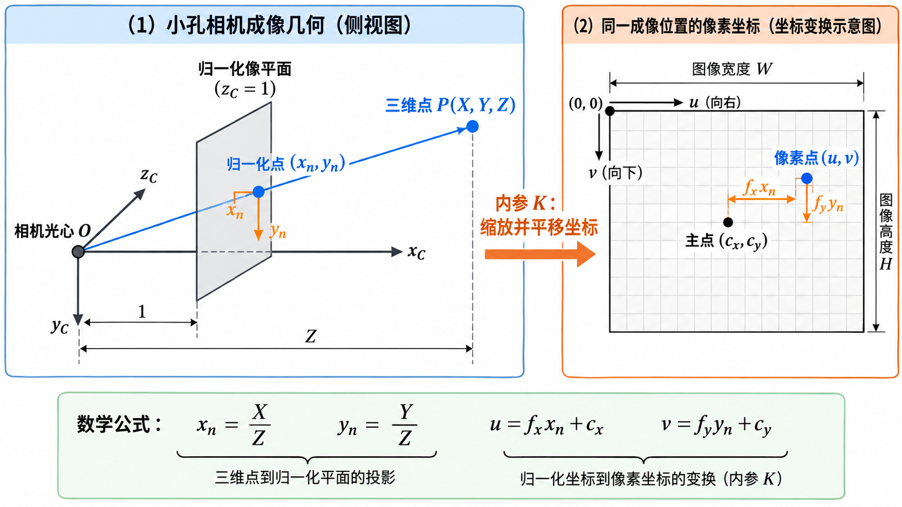
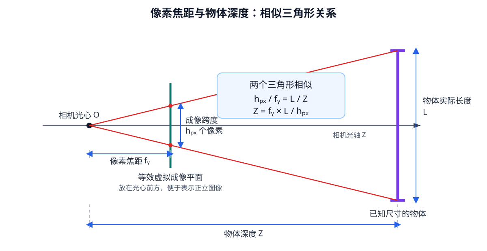
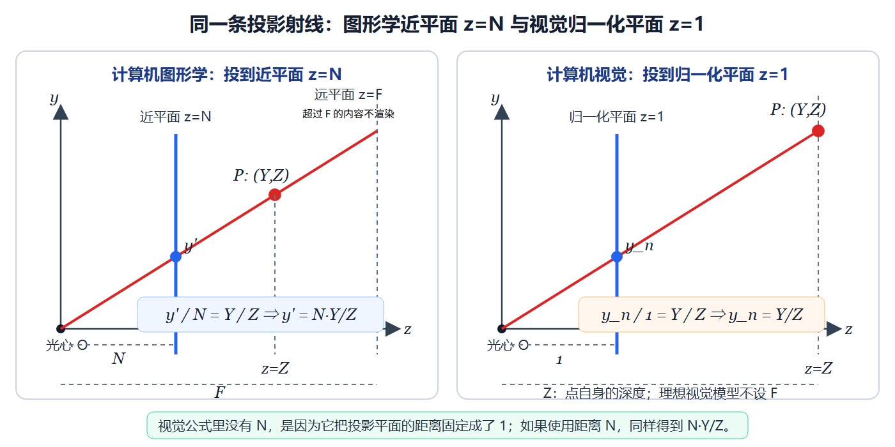

# [3D快速入门] 第四阶段 相机成像

相机成像要回答的核心问题是：**已知一个空间点相对相机的位置，怎样算出它会落在图像的哪个像素？**

整篇只围绕一条计算链展开：

$$
\text{相机坐标 }(X,Y,Z)
\xrightarrow{\text{除以 }Z}
\text{归一化坐标 }(x_n,y_n)
\xrightarrow{\times f,\,+c}
\text{像素坐标 }(u,v).
$$

学完后还要能够沿相反方向计算：已知像素和一种深度信息，恢复相机坐标系下的三维位置。

## 1 物理相机参数、图形学参数及其换算关系

这一节先说明后续公式中各个参数在现实相机上代表什么。可以先把相机想成三部分：

1. 镜头把一定角度范围内的光线汇聚到传感器上；
2. 传感器是一块有实际物理尺寸的感光芯片；
3. 传感器表面排列着许多感光单元，每个感光单元记录所在位置接收到的光。

因此，物理相机中的参数分成三类：镜头参数、传感器物理参数和输出图像参数。它们描述的是同一套成像过程，但单位和作用不同。

### 1.1 分辨率、像元尺寸与传感器有效尺寸

先看传感器及其输出图像中最常见的五个名词：

- **像元（Photosite）**：传感器上的一个感光单元。直观上，它就是芯片表面负责接收一小块光线的格子。本文使用理想化模型，把一个像元对应到输出图像中的一个像素；真实相机还可能经过去马赛克、像素合并、裁剪和缩放。
- **像素（Pixel）**：数字图像中的一个位置和数值。像元位于物理传感器上，像素位于最终图像数据中。
- **分辨率（Resolution）**：图像横向和纵向分别有多少个像素。例如 $1920\times1080$ 表示每行 1920 个像素，共 1080 行。它描述数量，不描述传感器有多少毫米宽。
- **像元尺寸或像素间距（Pixel Pitch）**：相邻像元中心之间的实际距离。常见单位是微米，例如 $2\ \mu\text{m}$。直观上，它表示传感器上每个感光格子有多宽。
- **传感器有效尺寸**：真正参与当前成像的感光区域有多少毫米宽、多少毫米高。它可能小于芯片封装尺寸，也可能因裁剪模式而小于传感器完整感光区域。

设：

- 图像分辨率为 $W\times H$，其中 $W$ 是横向像素数，$H$ 是纵向像素数；
- 传感器有效成像区域的物理宽高为 $S_w\times S_h$，常用单位是毫米；
- 横向、纵向像元尺寸分别为 $p_x$、$p_y$，单位是毫米/像素或微米/像素。

三者满足：

$$
p_x=\frac{S_w}{W},\qquad p_y=\frac{S_h}{H}.
$$

反过来：

$$
S_w=Wp_x,\qquad S_h=Hp_y.
$$

例如，传感器有效宽度为 $7.68$ mm，横向分辨率为 3840 像素，则：

$$
p_x=\frac{7.68}{3840}=0.002\ \text{mm/像素}=2\ \mu\text{m/像素}.
$$

这个例子表示：3840 个横向像元，每个占据 $2\ \mu\text{m}$ 的物理宽度，合起来正好覆盖 $7.68$ mm。

传感器经过裁剪、像素合并或数字缩放后，输出分辨率可能不再对应完整有效区域。此时应以当前成像模式给出的有效区域、缩放比例和标定结果为准，不能直接拿芯片全尺寸除以输出分辨率。

### 1.2 物理焦距、像元尺寸与像素焦距

**物理焦距**描述镜头形成图像时的尺度和视场范围，真实镜头规格中通常给出有效焦距，单位是毫米。在理想针孔模型中，可以把它理解为投影中心到成像平面的距离。真实镜头由多片镜片组成，有效焦距是光学系统的参数，不能直接理解为镜头外壳到传感器的机械距离。焦距越长，同一个物体在传感器上形成的像越大，画面能覆盖的角度越小。镜头的进光能力还与光圈有关，不能只根据焦距判断。

**像素焦距** $f_x$、$f_y$ 是把物理焦距换成像素单位后的结果。直观上，物理焦距回答“相当于多少毫米”，像素焦距回答“在当前像素网格中相当于多少个像素”。转换时需要用物理焦距除以单个像元的尺寸：

$$
f_x=\frac{f_{mm}}{p_x},\qquad f_y=\frac{f_{mm}}{p_y}.
$$

例如，物理焦距为 4 mm，像元尺寸为 $2\ \mu\text{m}=0.002$ mm：

$$
f_x=f_y=\frac{4}{0.002}=2000\ \text{像素}.
$$

这个 $2000$ 不表示图像宽度必须是 2000 像素。它表示：后续将观察方向换成像素偏移时，要用 2000 作为横向和纵向的缩放系数。例如归一化横坐标为 $0.1$，相对主点的横向偏移就是 $2000\times0.1=200$ 像素。

物理焦距和传感器尺寸使用毫米描述真实硬件；像素焦距使用像素描述当前图像网格中的投影比例。图像等比例缩小一半后，镜头的物理焦距没有变化，而当前图像对应的 $f_x$、$f_y$ 也要缩小一半。

后文还会使用**主点** $(c_x,c_y)$。相机光轴可以直观理解为从相机中心朝正前方延伸的中心方向，主点就是这条轴落到图像上的像素位置，通常靠近图像中心。像素焦距负责把观察方向换成像素距离，主点负责确定这些距离从图像中的哪个位置开始计算。$f_x$、$f_y$、$c_x$、$c_y$ 合在一起构成相机的主要**内参**，第 4 节会给出完整矩阵。

### 1.3 视场角、物理焦距、传感器尺寸与分辨率

**视场角（Field of View，FOV）**表示相机能够看见多大的角度范围。水平视场角 $\theta_x$ 表示从画面最左侧到最右侧覆盖的夹角，垂直视场角 $\theta_y$ 表示从最上方到最下方覆盖的夹角。直观上，广角镜头能看见更宽的范围，长焦镜头看到的范围更窄，但远处物体在画面中更大。

视场角由焦距和传感器有效尺寸共同决定。只说“4 mm 镜头”还不能唯一确定视场角，因为同一个镜头配上不同尺寸的传感器，最终画面范围会不同。水平视场角为：

$$
\theta_x=2\arctan\left(\frac{S_w}{2f_{mm}}\right).
$$

垂直方向同理：

$$
\theta_y=2\arctan\left(\frac{S_h}{2f_{mm}}\right).
$$

其中 $S_w$ 是传感器有效宽度，$f_{mm}$ 是物理焦距。焦距越长，视场角越小；传感器有效尺寸越大，视场角越大。把 $S_w=Wp_x$ 和 $f_x=f_{mm}/p_x$ 代入，可以消去毫米单位：

$$
\theta_x=2\arctan\left(\frac{W}{2f_x}\right).
$$

反过来，可以根据分辨率和视场角估算像素焦距：

$$
f_x=\frac{W}{2\tan(\theta_x/2)},\qquad
f_y=\frac{H}{2\tan(\theta_y/2)}.
$$

因此，物理相机的横向参数形成一条完整关系：

$$
S_w=Wp_x,
\qquad
f_x=\frac{f_{mm}}{p_x},
\qquad
\theta_x=2\arctan\left(\frac{S_w}{2f_{mm}}\right)
=2\arctan\left(\frac{W}{2f_x}\right).
$$

这些公式采用理想针孔模型，并假设当前图像使用对应的传感器有效区域。明显镜头畸变、数字裁剪、电子防抖和缩放会改变实际有效视场或当前图像对应的内参。

### 1.4 计算机图形学中的对应参数

计算机图形学使用虚拟相机生成画面。虚拟相机没有真实镜头和感光芯片，因此没有像元尺寸、传感器毫米宽度和物理焦距。程序直接规定下面这些量：

- **视场角** $\theta_x$、$\theta_y$：决定虚拟相机横向和纵向能看到多宽，也直接控制画面的放大程度。
- **视口（Viewport）**：最终接收渲染结果的矩形区域。$W\times H$ 表示这个区域横向和纵向各有多少个像素。
- **近平面（Near Plane）**：距离虚拟相机为 $N$ 的裁剪平面。比它更靠近相机的内容不参与正常渲染。它同时作为构造视锥和投影矩阵的参数。
- **远平面（Far Plane）**：距离虚拟相机为 $F$ 的裁剪平面。比它更远的内容不再渲染。它是渲染系统人为设置的最远可见边界。
- **视锥（Viewing Frustum）**：近平面、远平面以及上下左右边界围成的截头锥体。只有位于这片范围内的场景内容才会进入后续渲染流程。
- **投影矩阵（Projection Matrix）**：把相机空间中的三维点统一变换到裁剪空间的 $4\times4$ 矩阵。它把视场角、宽高比、近平面和远平面等设置装进一次矩阵变换中，供图形渲染管线处理横纵位置、裁剪和深度。
- **标准化设备坐标（Normalized Device Coordinates，NDC）**：投影和透视除法之后使用的统一坐标空间。可见范围会被映射到固定区间，横纵坐标通常为 $[-1,1]$，深度范围取决于图形 API。

这里最容易混淆的是远平面。理想针孔视觉模型只描述空间点怎样成像，点只要位于相机前方，即 $Z>0$，公式就可以计算它的投影。物理相机实际能否看清远处物体，还会受到分辨率、对焦、空气、曝光和目标尺寸影响，但这些限制都不叫远平面，也不存在一个统一的 $F$。远平面只属于图形学渲染规则。

在近平面 $Z=N$ 上，垂直半高和水平半宽分别为：

$$
T=N\tan(\theta_y/2),
$$

$$
R=N\tan(\theta_x/2).
$$

当像素横纵比例一致时，还满足：

$$
R=\frac{W}{H}T.
$$

近平面距离 $N$ 会参与构造视锥，但它不等于物理焦距。图形学固定 FOV 后，改变 $N$ 会同时改变近平面上的投影位置和近平面宽高，二者在转换到 NDC 时相消，所以最终画面放大率不会改变。$N$ 的主要作用是规定最近裁剪边界，并参与深度映射。

物理视觉与图形学可以生成相同的透视画面，但参数来源不同。下表只比较它们在投影计算中的作用，不表示两列是同一个物理量：

| 物理视觉中的量 | 图形学中的量 | 作用与边界 |
|---|---|---|
| 传感器有效宽度 $S_w$ | 近平面全宽 $2R$ | 都能参与描述投影平面的横向范围；$S_w$ 来自硬件，$2R$ 由 $N$ 和 FOV 构造 |
| 物理焦距 $f_{mm}$ 与传感器宽度 $S_w$ 的比例 | 视场角 $\theta_x$ | 两者最终都决定画面的横向透视尺度；图形学通常直接设置 FOV |
| 像元尺寸 $p_x$ | 无直接对应参数 | 图形学没有物理感光像元 |
| 像素焦距 $f_x$ | $W/[2\tan(\theta_x/2)]$ | 都控制 $X/Z$ 到横向图像位置的缩放 |
| 主点 $c_x$ | 视口中心或投影偏移 | 对称视锥通常对应 $W/2$，非对称投影可以加入偏移 |
| 无对应参数 | 近平面 $N$ | 图形学人为规定的最近渲染边界；它不是物理相机焦距 |
| 无对应参数 | 远平面 $F$ | 图形学人为规定的最远渲染边界；理想针孔视觉模型不定义该参数 |

### 1.5 同一个 $X$ 坐标在视觉与图形学中的换算流程

物理视觉从相机坐标 $(X,Z)$ 计算横向像素时，先根据硬件参数得到像素焦距：

$$
f_x=\frac{f_{mm}}{p_x}.
$$

然后将三维点投到 $Z=1$ 的归一化平面：

$$
x_n=\frac{X}{Z}.
$$

最后乘像素焦距并加主点：

$$
u=f_xx_n+c_x=f_x\frac{X}{Z}+c_x.
$$

因此视觉的横向流程是：

$$
(f_{mm},p_x)\rightarrow f_x,
\qquad
(X,Z)\rightarrow\frac{X}{Z},
\qquad
\frac{X}{Z}\rightarrow u.
$$

图形学先根据近平面距离和水平视场角得到近平面半宽：

$$
R=N\tan(\theta_x/2).
$$

空间点投到近平面后的横向位置为：

$$
x_N=N\frac{X}{Z}.
$$

再除以近平面半宽，进入横向范围为 $[-1,1]$ 的 NDC：

$$
x_{ndc}=\frac{x_N}{R}
=\frac{NX/Z}{N\tan(\theta_x/2)}
=\frac{X}{Z\tan(\theta_x/2)}.
$$

最后通过视口变换得到横向像素：

$$
u=\frac{x_{ndc}+1}{2}W.
$$

将 $x_{ndc}$ 代入：

$$
u=\frac{W}{2\tan(\theta_x/2)}\frac{X}{Z}+\frac{W}{2}.
$$

它与视觉公式：

$$
u=f_x\frac{X}{Z}+c_x
$$

完全对应，其中：

$$
f_x=\frac{W}{2\tan(\theta_x/2)},
\qquad
c_x=\frac{W}{2}.
$$

两条路径都使用 $X/Z$ 表示观察方向。视觉通过像元尺寸和物理焦距得到 $f_x$；图形学直接设置 FOV，并通过 NDC 和视口尺寸得到等效像素焦距。

## 2 三维点投影到二维像素的完整路径

### 2.1 先明确：本篇从相机坐标系开始计算

本篇后续所有 $X$、$Y$、$Z$，默认都属于**相机坐标系 C**：原点位于相机光心，$x_C$ 向右，$y_C$ 向下，$z_C$ 指向相机前方。三维点写成：

$$
\mathbf p_C=
\begin{bmatrix}X&Y&Z\end{bmatrix}^{T}.
$$

$X$、$Y$、$Z$ 必须使用同一种长度单位，例如全部使用米。

如果点最初位于世界坐标系，还不能直接套用内参。需要先用相机外参把它变到相机坐标系：

$$
\mathbf p_C=R_{CW}\mathbf p_W+\mathbf t_{CW}.
$$

其中 $R_{CW}$ 和 $\mathbf t_{CW}$ 表示“世界系到相机系”的旋转和平移。得到 $\mathbf p_C$ 后，才进入本文的成像计算。

### 2.2 针孔模型中的参数分别在哪里

针孔模型把相机简化成光心 $O$ 和一条穿过光心的成像射线。为了让公式直观，计算机视觉通常在光心前方放置一张距离为 1 的**虚拟归一化平面**。



先只看图中的三件事：

1. 三维点 $P(X,Y,Z)$ 和光心 $O$ 决定一条射线。
2. 射线与 $z_C=1$ 平面的交点是 $(x_n,y_n)$，它描述观察方向。
3. 内参 $K$ 把这个方向缩放和平移到像素网格，得到 $(u,v)$。

右侧像素网格是一张单独的“坐标换算示意图”，不代表相机内部还有第二张物理平面。它只说明：归一化坐标经过 $f_x$、$f_y$、$c_x$、$c_y$ 换算后，怎样对应到宽 $W$、高 $H$ 的图像。

真实传感器位于光心后方，会形成倒像。计算机视觉使用前方的虚拟平面，可以省去公式中的翻转，得到与常用图像方向一致的表达。

## 3 透视除法与归一化坐标

### 3.1 “归一化”究竟归一化了什么

空间点、光心和归一化平面构成相似三角形，因此：

$$
x_n=\frac{X}{Z},\qquad y_n=\frac{Y}{Z}.
$$

这里的“归一化”表示：沿同一条射线，把三维点等比例移到 $Z=1$ 的平面上。它不表示向量长度变成 1，也不要求 $x_n$、$y_n$ 落在 $[-1,1]$ 内。

例如：

$$
(X,Y,Z)=(3,0.5,2)
\quad\Rightarrow\quad
(x_n,y_n)=(1.5,0.25).
$$

$x_n=1.5$ 完全合法。它表示沿 $z_C$ 方向前进 1 份时，射线同时向右前进 1.5 份。也可以把它理解成观察方向在横向上的斜率：

$$
x_n=\tan\theta_x=\frac{X}{Z}.
$$

归一化坐标没有米、毫米或像素单位。它只描述**从相机光心看向该点的方向**。

### 3.2 归一化坐标为什么能变成像素偏移

有了方向 $(x_n,y_n)$ 后，相机使用像素焦距把它换成相对主点的像素偏移：

$$
\Delta u=f_xx_n,\qquad \Delta v=f_yy_n.
$$

例如 $x_n=0.1$、$f_x=800$ 像素，则：

$$
\Delta u=800\times0.1=80\ \text{像素}.
$$

这表示投影位置位于主点右侧 80 像素。归一化坐标给出方向比例，像素焦距负责把这个比例换成图像上的像素距离。

### 3.3 深度为什么造成“近大远小”

保持 $X=1$、$Y=0.5$ 不变：

$$
Z=2\Rightarrow(x_n,y_n)=(0.5,0.25),
$$

$$
Z=4\Rightarrow(x_n,y_n)=(0.25,0.125).
$$

$Z$ 变成两倍后，归一化坐标和对应像素偏移都变成一半。对固定尺寸的物体，这就是距离越远、图像越小的数学来源。

投影前还要检查 $Z$：$Z>0$ 表示点位于相机前方；$Z=0$ 会发生除零；$Z<0$ 表示点位于相机后方。

## 4 像素焦距、主点与内参矩阵

### 4.1 像素焦距 $f_x$、$f_y$ 是什么

焦距本身是物理量，通常以毫米表示；图像中的位置和长度则用像素表示。为了让焦距能够直接参与像素坐标计算，需要利用像元尺寸，把物理焦距换算成像素单位的焦距。理想的原始成像模式下，像元尺寸表示传感器上一个像素所对应的物理跨度，因此：

$$
f_x=\frac{f_{\text{物理}}}{p_x},\qquad
f_y=\frac{f_{\text{物理}}}{p_y}.
$$

其中 $p_x、p_y$ 分别是横向和纵向的像元尺寸，单位可写成“毫米/像素”。用“毫米”除以“毫米/像素”，最终得到的 $f_x、f_y$ 就以像素表示。经过裁剪、缩放或像素合并的图像，需要使用当前输出模式对应的有效像元跨度或标定结果，不能直接套用传感器原始像元尺寸。

像素焦距的直接作用，是把归一化观察方向换成相对主点的像素偏移：

$$
\Delta u=f_xx_n,\qquad \Delta v=f_yy_n.
$$

因此，像素焦距描述的是投影比例。它的数值可以大于图像宽度或高度，不表示图像必须具有相同数量的像素。

这个换算还有一个很直观的用途：已知物体的真实尺寸和它在画面中的像素跨度时，可以根据相似三角形粗略计算深度。以下图的纵向计算为例，物体实际长度为 $L$，在图像中占 $h_{px}$ 个像素，纵向像素焦距为 $f_y$，则：



$$
\frac{h_{px}}{f_y}=\frac{L}{Z},
$$

因此：

$$
Z=\frac{f_yL}{h_{px}}.
$$

例如，某个物体在画面中占 $10$ 个像素，$f_y=1000$ 像素，并且已知它的实际长度为 $L$，则：

$$
Z=\frac{1000L}{10}=100L.
$$

也就是说，算出的深度是物体实际长度的 100 倍；如果 $L=2\ \text{cm}$，则 $Z\approx200\ \text{cm}$。这个简化公式要求物体长度方向近似平行于成像平面、物体两端深度接近，并且畸变已经校正或影响较小。横向计算完全相同，只需使用物体横向像素宽度和 $f_x$。

### 4.2 主点 $c_x$、$c_y$ 是什么

主点是相机光轴落在图像上的像素位置。它通常靠近图像中心，因此没有标定数据时常近似取：

$$
c_x\approx\frac{W-1}{2},\qquad
c_y\approx\frac{H-1}{2}.
$$

真实相机存在装配偏差，标定得到的主点不一定正好位于几何中心。

像素坐标以左上角为原点，$u$ 向右、$v$ 向下。把相对主点的偏移加到主点上，就得到最终像素：

$$
u=f_xx_n+c_x,\qquad
v=f_yy_n+c_y.
$$

因此，一次完整换算可以直接记成：

$$
(X,Y,Z)
\xrightarrow{X/Z,\,Y/Z}
(x_n,y_n)
\xrightarrow{\times f_x,\,\times f_y}
(\Delta u,\Delta v)
\xrightarrow{+c_x,\,+c_y}
(u,v).
$$

### 4.3 把四个参数合成内参矩阵

把 $f_x$、$f_y$、$c_x$、$c_y$ 放进一个矩阵：

$$
K=
\begin{bmatrix}
f_x&0&c_x\\
0&f_y&c_y\\
0&0&1
\end{bmatrix}.
$$

对相机坐标系中的点，有：

$$
Z
\begin{bmatrix}u\\v\\1\end{bmatrix}
=K
\begin{bmatrix}X\\Y\\Z\end{bmatrix}.
$$

矩阵乘法得到齐次像素坐标 $(Zu,Zv,Z)^T$，再除以第三个分量即可得到 $(u,v)$。展开后仍然是：

$$
u=f_x\frac{X}{Z}+c_x,\qquad
v=f_y\frac{Y}{Z}+c_y.
$$

如果输入点属于世界坐标系，外参与内参可以合写成：

$$
Z_C
\begin{bmatrix}u\\v\\1\end{bmatrix}
=K
\begin{bmatrix}R_{CW}&\mathbf t_{CW}\end{bmatrix}
\begin{bmatrix}X_W\\Y_W\\Z_W\\1\end{bmatrix}.
$$

阅读顺序始终是从右向左：世界点先经外参进入相机系，再经内参进入像素平面。

### 4.4 投影值会不会超过图像大小

会。公式只负责计算射线与像素平面的对应位置，不会自动把结果限制在图像内部。对于宽 $W$、高 $H$ 的图像，还要检查：

$$
0\le u<W,\qquad0\le v<H.
$$

需要分两种场景理解：

- 从任意三维点、地图点或点云向图像投影时，点可能位于相机视场外，算出的 $u$、$v$ 超出边界很常见。
- 从图像中已经检测到的像素出发，再结合匹配的内参和深度做反投影时，该像素原本就在画面内；在畸变、裁剪和参数误差较小时，重新投影通常也会回到画面内。

所以“超过图像大小”不是公式错误。它通常表示点在相机前方，但位于当前图像视场之外，或者内参、外参、畸变和图像模式之间没有正确匹配。

### 4.5 计算机视觉内参与图形学透视投影的对应关系

计算机视觉和计算机图形学都从相机空间中的三维点出发，但二者对投影平面和输出坐标的规定不同：

- 视觉先把点投到距离光心为 1 的归一化平面，再通过内参转换成真实图像像素；
- 图形学先根据近平面距离 $N$ 得到近平面上的位置，再把整个近平面范围转换到标准化设备坐标（Normalized Device Coordinates，NDC）的 $[-1,1]$ 范围。

视觉中的 $Z$ 只在进入内参前参与透视除法：

$$
x_n=\frac{X}{Z},\qquad y_n=\frac{Y}{Z}.
$$

内参 $K$ 接收的是归一化平面上的 $(x_n,y_n,1)$，只负责把横向、纵向观察方向转换成像素位置：

$$
\begin{bmatrix}u\\v\\1\end{bmatrix}
=K
\begin{bmatrix}x_n\\y_n\\1\end{bmatrix}.
$$

它不需要生成深度缓冲使用的第三轴，也不需要设置近平面和远平面。因此视觉使用 $Z=1$ 的归一化成像平面即可，不需要图形学中的 $4\times4$ 透视投影矩阵。

图形学还会设置一个远平面 $F$。它表示本次渲染允许看到的最远深度；当某个点的相机空间深度满足 $Z>F$ 时，GPU 不再渲染它。远平面是图形学为了裁剪和深度缓冲而设置的边界，不是现实相机中的物理平面。

理想针孔视觉模型不定义远平面 $F$。其中的 $Z$ 表示某个具体三维点自身的光轴深度，只要 $Z>0$ 就可以代入投影公式。实际相机能否看清远处目标还会受到分辨率、镜头、空气和曝光等因素影响，但这些限制不属于针孔投影中的远平面。

因此，图形学中的三个深度量要分开理解：

- $N$：固定的近平面距离；
- $F$：固定的远平面距离，超过它不渲染；
- $Z$：当前三维点的光轴深度，可见点通常满足 $N\le Z\le F$。

下面这张图使用普通空间点 $P(Y,Z)$。左侧额外画出了图形学远平面 $F$；右侧视觉模型不设置 $F$：



图形学把点投到 $Z=N$ 的近平面。根据相似三角形：

$$
y_N=N\frac{Y}{Z}.
$$

视觉把归一化平面固定在 $Z=1$，因此：

$$
y_n=1\cdot\frac{Y}{Z}=\frac{Y}{Z}.
$$

视觉公式中没有 $N$，原因就是归一化平面的距离已经固定为 1。如果视觉也把投影平面放在 $Z=N$，同样会得到 $N Y/Z$。

接下来固定同一个空间点和同一组相机参数，分别计算最终像素。为了集中比较投影过程，本例令两套相机坐标都采用 $x$ 向右、$y$ 向下、$z$ 向前。部分图形 API 使用 $y$ 向上或相机朝 $-z$ 方向观察，接入这些 API 时还要处理符号差异。

本例参数为：

$$
W=1280,\qquad H=720,
$$

$$
\theta_y=90^\circ,\qquad N=2,\qquad F=10,
$$

空间点为：

$$
P_C=(X,Y,Z)=(1,0.5,4).
$$

其中 $\theta_y$ 是垂直视场角。$N=2$ 和 $F=10$ 是图形学管线使用的近平面、远平面距离；当前点的深度为 $Z=4$，因此它位于可渲染区间 $[2,10]$ 内。视觉计算只使用该点的 $Z=4$，不使用 $N$ 和 $F$。

**视觉方式：归一化坐标经过内参得到像素。**

根据分辨率和垂直视场角，像素焦距为：

$$
f_y=\frac{H}{2\tan(\theta_y/2)}
=\frac{720}{2\tan45^\circ}
=360.
$$

本例使用正方形像素，因此取 $f_x=f_y=360$。主点位于图像中心：

$$
c_x=640,\qquad c_y=360.
$$

先投到 $Z=1$ 的归一化平面：

$$
x_n=\frac{X}{Z}=\frac14=0.25,
$$

$$
y_n=\frac{Y}{Z}=\frac{0.5}{4}=0.125.
$$

再通过内参转换为像素：

$$
u=f_xx_n+c_x
=360\times0.25+640
=730,
$$

$$
v=f_yy_n+c_y
=360\times0.125+360
=405.
$$

视觉方式最终得到：

$$
(u,v)=(730,405).
$$

**图形学方式：近平面位置经过 NDC 和视口变换得到像素。**

第一步，把空间点沿光心射线投到 $Z=N$ 的近平面：

$$
x_N=N\frac{X}{Z}=2\times\frac14=0.5,
$$

$$
y_N=N\frac{Y}{Z}=2\times\frac{0.5}{4}=0.25.
$$

第二步，根据视场角求近平面的实际范围。近平面的半高为：

$$
T=N\tan(\theta_y/2)
=2\times\tan45^\circ
=2.
$$

图像宽高比为 $W/H=16/9$，所以近平面的半宽为：

$$
R=\frac{W}{H}T
=\frac{32}{9}.
$$

也就是说，近平面上的可见范围是：

$$
x_N\in\left[-\frac{32}{9},\frac{32}{9}\right],
\qquad
y_N\in[-2,2].
$$

第三步，把近平面位置换算到 NDC：

$$
x_{ndc}=\frac{x_N}{R}
=\frac{0.5}{32/9}
=0.140625,
$$

$$
y_{ndc}=\frac{y_N}{T}
=\frac{0.25}{2}
=0.125.
$$

这里可以看到，$x_N$ 和 $y_N$ 中包含的 $N$，会与近平面半宽 $R$、半高 $T$ 中的 $N$ 相消：

$$
x_{ndc}
=\frac{N X/Z}{(W/H)N\tan(\theta_y/2)}
=\frac{X}{Z(W/H)\tan(\theta_y/2)},
$$

$$
y_{ndc}
=\frac{N Y/Z}{N\tan(\theta_y/2)}
=\frac{Y}{Z\tan(\theta_y/2)}.
$$

透视投影矩阵把“投到近平面”和“近平面转换到 NDC”合并成一次矩阵乘法。本例采用相机朝 $+z$ 方向、NDC 深度范围为 $[0,1]$ 的约定：

$$
P=
\begin{bmatrix}
\dfrac{1}{(W/H)\tan(\theta_y/2)}&0&0&0\\[8pt]
0&\dfrac{1}{\tan(\theta_y/2)}&0&0\\[8pt]
0&0&\dfrac{F}{F-N}&-\dfrac{FN}{F-N}\\[8pt]
0&0&1&0
\end{bmatrix}.
$$

代入本例参数：

$$
P=
\begin{bmatrix}
\dfrac{9}{16}&0&0&0\\[6pt]
0&1&0&0\\[6pt]
0&0&\dfrac{5}{4}&-\dfrac{5}{2}\\[6pt]
0&0&1&0
\end{bmatrix}.
$$

把空间点写成齐次坐标并乘以矩阵：

$$
\begin{bmatrix}
x_c\\y_c\\z_c\\w_c
\end{bmatrix}
=P
\begin{bmatrix}
1\\0.5\\4\\1
\end{bmatrix}
=
\begin{bmatrix}
0.5625\\0.5\\2.5\\4
\end{bmatrix}.
$$

矩阵最后一行令 $w_c=Z=4$。对四维裁剪坐标执行透视除法：

$$
x_{ndc}=\frac{x_c}{w_c}
=\frac{0.5625}{4}
=0.140625,
$$

$$
y_{ndc}=\frac{y_c}{w_c}
=\frac{0.5}{4}
=0.125,
$$

$$
z_{ndc}=\frac{z_c}{w_c}
=\frac{2.5}{4}
=0.625.
$$

$x_{ndc}$ 和 $y_{ndc}$ 决定屏幕位置；$z_{ndc}$ 把原始光轴深度 $Z=4$ 映射到 $[0,1]$，供 GPU 的深度缓冲比较遮挡关系。

第四步，通过视口变换把 NDC 转为屏幕像素。本例的 $y$ 轴向下，因此：

$$
u=\frac{x_{ndc}+1}{2}W
=\frac{0.140625+1}{2}\times1280
=730,
$$

$$
v=\frac{y_{ndc}+1}{2}H
=\frac{0.125+1}{2}\times720
=405.
$$

图形学方式最终同样得到：

$$
(u,v)=(730,405).
$$

两条计算路径得到相同像素。视觉中的 $f_x$、$f_y$ 直接完成“观察方向到像素”的缩放；图形学把对应缩放拆成视场角、NDC 和视口变换，并由透视矩阵统一生成裁剪坐标与标准深度。

**图形学为什么还要计算 $z_{ndc}$。**

图形学计算 $z_{ndc}$ 主要有三个原因：

1. 给深度缓冲提供每个片元的深度，用于判断遮挡关系；
2. 让深度能够在投影后的屏幕三角形中直接进行线性插值；
3. 把近平面 $N$ 到远平面 $F$ 的深度统一映射到图形 API 规定的范围。

第二点可以用一条投影后的线段说明。假设线段两个端点的屏幕横坐标分别为 $u_1=1$、$u_2=99$，对应的相机深度分别为：

$$
Z_1=2,\qquad Z_2=10.
$$

屏幕中点为 $u=50$。由于透视投影，屏幕中点对应的真实深度不是 $(2+10)/2=6$。正确关系是对 $1/Z$ 插值：

$$
\frac{1}{Z_{50}}
=\frac{0.5}{Z_1}+\frac{0.5}{Z_2}
=\frac{0.5}{2}+\frac{0.5}{10}
=0.3,
$$

所以：

$$
Z_{50}=\frac{1}{0.3}\approx3.333.
$$

若把原始 $Z$ 线性归一化后直接在屏幕上插值，中点会错误地对应 $Z=6$。$z_{ndc}$ 采用：

$$
z_{ndc}=\frac{F}{F-N}-\frac{FN}{(F-N)Z},
$$

它是 $1/Z$ 的线性形式。因此 GPU 可以直接在屏幕上对 $z_{ndc}$ 做线性插值；本例中插值得到的中间值通过反变换对应 $Z\approx3.333$，从而得到正确的深度和遮挡关系。

### 4.6 没有标定结果时，怎样根据硬件规格估算内参矩阵

没有标定文件时，可以根据镜头和传感器规格估算 $K$。这个结果适合前期验证、仿真和粗略计算。精确测距、PnP 或三维重建仍应使用实际标定结果。

拿到一套现实摄像头后，厂家资料里比较容易找到的通常是：当前输出分辨率、镜头物理焦距、传感器型号、相元尺寸、传感器有效宽高，以及水平/垂直/对角视场角。并不要求这些参数全部具备；下面任意一组完整组合，都可以先估算 $K$。

估算一张常用的简化内参矩阵，需要得到四个数：

$$
f_x,\quad f_y,\quad c_x,\quad c_y.
$$

在没有主点测量结果时，可以先假设主点位于图像中心。难点主要是怎样把已知规格转换成像素焦距 $f_x$、$f_y$。

下面几组信息都可以用来估算内参：

| 已知信息 | 可以算出什么 | 还需要的假设 |
|---|---|---|
| 分辨率、物理焦距、横纵相元尺寸 | $f_x$、$f_y$ | 主点暂取图像中心，斜切参数取 0 |
| 分辨率、物理焦距、传感器有效宽高 | $f_x$、$f_y$ | 当前图像使用完整有效区域，主点暂取中心 |
| 分辨率、水平和垂直视场角 | $f_x$、$f_y$ | 使用普通针孔模型，主点暂取中心 |
| 分辨率、一个方向的视场角 | 对应方向的像素焦距 | 若还要估算另一方向，需增加像素为正方形等假设 |

优先使用与**当前镜头、传感器和输出模式**对应的水平与垂直 FOV；其次使用物理焦距与相元尺寸。规格中的“1/2.8 英寸传感器”属于光学格式名称，通常不能直接当作传感器对角线的真实物理长度代入公式。应继续查传感器手册中的有效成像尺寸或相元尺寸。

常用内参矩阵左上角的非对角参数称为斜切参数，用于描述两条像素轴不完全垂直的情况。现代相机通常先取 0，本篇也采用这个简化。规格信息无法可靠给出真实主点偏移、斜切误差和畸变系数。

**情况一：已知物理焦距和相元尺寸。**

相元尺寸表示传感器上一个像素对应的物理宽度或高度。沿用第 1.1 节的符号，横向和纵向像元尺寸分别是 $p_x$、$p_y$ 毫米/像素，则：

$$
f_x=\frac{f_{mm}}{p_x},\qquad
f_y=\frac{f_{mm}}{p_y}.
$$

例如，焦距为 4 mm，相元尺寸为 $2\ \mu m=0.002$ mm，并且横纵相元尺寸相同：

$$
f_x=f_y=\frac{4}{0.002}=2000\ \text{像素}.
$$

这里能相除，是因为分子和分母都使用毫米。若相元尺寸仍使用微米，结果会产生 1000 倍错误。

**情况二：已知物理焦距、传感器有效尺寸和输出分辨率。**

如果图像使用了完整的传感器有效区域，可以先由传感器尺寸算相元尺寸。设传感器有效宽高为 $S_w$、$S_h$ 毫米，输出分辨率为 $W\times H$：

$$
p_x=\frac{S_w}{W},\qquad
p_y=\frac{S_h}{H}.
$$

代入上一组公式：

$$
f_x=f_{mm}\frac{W}{S_w},\qquad
f_y=f_{mm}\frac{H}{S_h}.
$$

这个计算要求 $S_w$、$S_h$ 对应当前模式真正使用的有效成像区域。传感器经过裁剪、合并像素或缩放输出时，直接使用芯片手册中的全尺寸可能得到错误结果。

**情况三：已知图像分辨率和视场角。**

视场角（Field of View，FOV）表示相机在一个方向上能看到多大的角度。设水平视场角为 $\theta_x$，垂直视场角为 $\theta_y$，并假设使用普通针孔模型、主点接近图像中心：

$$
f_x=\frac{W}{2\tan(\theta_x/2)},\qquad
f_y=\frac{H}{2\tan(\theta_y/2)}.
$$

计算器和程序中的三角函数通常接收弧度。角度需要先转换：

$$
\theta_{rad}=\theta_{deg}\frac{\pi}{180}.
$$

例如图像宽度为 1920 像素，水平视场角为 $60^\circ$：

$$
f_x=
\frac{1920}{2\tan30^\circ}
\approx1662.8\ \text{像素}.
$$

如果同时知道图像高度为 1080、垂直视场角为 $36^\circ$：

$$
f_y=
\frac{1080}{2\tan18^\circ}
\approx1662.0\ \text{像素}.
$$

由此可以构造近似内参：

$$
K\approx
\begin{bmatrix}
1662.8&0&959.5\\
0&1662.0&539.5\\
0&0&1
\end{bmatrix}.
$$

如果只有水平视场角，还需要额外假设。常见近似是假设像素为正方形，于是取 $f_y\approx f_x$。如果只有对角视场角，还需要结合图像宽高和像素形状推算；厂商标注的视场角方向必须先确认。

OpenCV 官方相机模型说明也给出了由毫米焦距、像素尺寸和视场角估算像素焦距的关系，见[Camera Calibration and 3D Reconstruction](https://docs.opencv.org/4.x/d9/d0c/group__calib3d.html)。

用 C++ 根据水平、垂直视场角构造近似 $K$，核心调用只需要标准数学函数：

```cpp
#include <cmath>
#include <opencv2/core.hpp>

const int imageWidth = 1920;
const int imageHeight = 1080;
const double horizontalFovDeg = 60.0;
const double verticalFovDeg = 36.0;

// std::tan() 接收弧度，因此先把角度转换成弧度。
const double horizontalFovRad = horizontalFovDeg * CV_PI / 180.0;
const double verticalFovRad = verticalFovDeg * CV_PI / 180.0;

const double fx = imageWidth /
                  (2.0 * std::tan(horizontalFovRad / 2.0));
const double fy = imageHeight /
                  (2.0 * std::tan(verticalFovRad / 2.0));

// 没有标定主点时，暂时使用像素中心范围的几何中心。
const double cx = (imageWidth - 1) / 2.0;
const double cy = (imageHeight - 1) / 2.0;

const cv::Matx33d cameraMatrix(
    fx, 0.0, cx,
    0.0, fy, cy,
    0.0, 0.0, 1.0);
```

这段代码只能生成近似 $K$，还缺少真实主点偏移和畸变参数。以下情况会让规格估算产生明显误差：

- 厂商给的是对角视场角，但程序按水平视场角计算；
- 输出图像经过传感器裁剪、数字变焦、电子防抖或缩放；
- 镜头存在明显畸变，标称视场角包含畸变后的边缘范围；
- 对焦、变焦或分辨率模式发生改变；
- 相元尺寸和物理焦距来自不同工作模式或不同型号。

因此，规格估算回答的是“在这些假设下，大约可以使用什么内参”。它无法代替真实标定，也无法推出可靠的畸变系数。

## 5 一个三维点的完整投影计算

### 5.1 已知三维点与内参时的手算过程

现在把前面的公式连起来。设图像分辨率为 $1280\times720$，内参为：

$$
K=
\begin{bmatrix}
800&0&640\\
0&800&360\\
0&0&1
\end{bmatrix}.
$$

相机系中有一个点：

$$
\mathbf p_C=
\begin{bmatrix}
0.2\\0.1\\2
\end{bmatrix}\text{米}.
$$

第一步，检查 $Z=2>0$，点位于相机前方。

第二步，计算归一化坐标：

$$
x_n=\frac{0.2}{2}=0.1,\qquad
y_n=\frac{0.1}{2}=0.05.
$$

第三步，使用内参转换到像素坐标：

$$
u=800\times0.1+640=720,
$$

$$
v=800\times0.05+360=400.
$$

所以投影结果是：

$$
(u,v)=(720,400).
$$

第四步，检查图像边界：

$$
0\le720<1280,\qquad0\le400<720.
$$

该投影点位于图像内部。

如果保持 $X=0.2$、$Y=0.1$，把 $Z$ 改为 4 米：

$$
u=800\frac{0.2}{4}+640=680,
$$

$$
v=800\frac{0.1}{4}+360=380.
$$

点从 $(720,400)$ 移到 $(680,380)$，更靠近主点 $(640,360)$。这与第 3.3 节的“距离增加后投影缩小”一致。

### 5.2 输入点在世界坐标系时，再多哪一步

假设世界坐标系与相机坐标系方向一致，相机光心在世界系中的位置为：

$$
\mathbf C_W=
\begin{bmatrix}1\\0\\3\end{bmatrix}\text{ m},
$$

世界中一点为：

$$
\mathbf p_W=
\begin{bmatrix}1.2\\0.1\\5\end{bmatrix}\text{ m}.
$$

由于两套坐标轴方向一致，$R_{CW}=I$。世界点相对相机光心的位置为：

$$
\mathbf p_C
=R_{CW}(\mathbf p_W-\mathbf C_W)
=
\begin{bmatrix}0.2\\0.1\\2\end{bmatrix}\text{ m}.
$$

它正好变成上一节使用的相机坐标，再经内参得到 $(720,400)$。如果采用 $\mathbf p_C=R_{CW}\mathbf p_W+\mathbf t_{CW}$ 的写法，本例中：

$$
\mathbf t_{CW}=-R_{CW}\mathbf C_W=
\begin{bmatrix}-1\\0\\-3\end{bmatrix}.
$$

这一步说明：相机在世界系中的位置 $\mathbf C_W$ 与世界到相机变换中的平移项 $\mathbf t_{CW}$ 不是同一个量，不能直接混用。

### 5.3 `cv::projectPoints()` 的输入与输出

OpenCV 计算机视觉库提供 `cv::projectPoints()`，用于结合外参、内参和畸变参数，把三维点投影到像素平面。它声明在头文件 `opencv2/calib3d.hpp` 中。

这个函数的主要输入是：

| 参数 | 作用 |
|---|---|
| `objectPoints` | 待投影的三维点 |
| `rvec`、`tvec` | 将输入三维点转换到相机坐标系的旋转向量和平移向量 |
| `cameraMatrix` | 内参矩阵 $K$ |
| `distCoeffs` | 畸变参数；理想无畸变模型可以传空数组 |
| `imagePoints` | 输出的二维像素坐标 |

当三维点已经使用相机坐标表示时，外参转换应保持不变，因此 `rvec` 和 `tvec` 都传零：

```cpp
#include <opencv2/calib3d.hpp>
#include <opencv2/core.hpp>
#include <vector>

const std::vector<cv::Point3f> cameraPoints = {
    cv::Point3f(0.2F, 0.1F, 2.0F)
};

const cv::Matx33d cameraMatrix(
    800.0, 0.0, 640.0,
    0.0, 800.0, 360.0,
    0.0, 0.0, 1.0);

// 输入点已经位于相机系，不再进行旋转和平移。
const cv::Vec3d rotationVector(0.0, 0.0, 0.0);
const cv::Vec3d translationVector(0.0, 0.0, 0.0);

std::vector<cv::Point2f> imagePoints;
cv::projectPoints(
    cameraPoints,
    rotationVector,
    translationVector,
    cameraMatrix,
    cv::noArray(),  // 当前按理想针孔模型计算，不加入畸变。
    imagePoints);
```

`imagePoints[0]` 应接近 $(720,400)$。函数内部完成的核心关系仍然是前面的透视除法和内参变换。使用函数可以减少重复代码，但输入点属于哪个坐标系、单位是否一致、畸变参数是否匹配，仍由调用者保证。

如果输入点位于物体系或世界系，`rvec` 和 `tvec` 要提供相应的“输入坐标系到相机坐标系”变换。OpenCV 对该函数的参数和投影模型说明见[`cv::projectPoints()`官方文档](https://docs.opencv.org/4.x/d9/d0c/group__calib3d.html)。

## 6 如何从图像像素位置反推三维位置

反投影的第一步，是把像素 $(u,v)$ 还原成观察方向：

$$
x_n=\frac{u-c_x}{f_x},\qquad
y_n=\frac{v-c_y}{f_y},
$$

$$
\mathbf r=
\begin{bmatrix}x_n\\y_n\\1\end{bmatrix}.
$$

$\mathbf r$ 是一条从相机光心出发的射线方向。只知道像素时，射线上的所有点都可能产生同一个像素。例如：

$$
(0.2,0.1,2),\quad(0.4,0.2,4),\quad(0.8,0.4,8)
$$

三点的 $X/Z$ 都是 0.1，$Y/Z$ 都是 0.05，因此会投到同一位置。二维投影保留了方向，丢失了沿射线的距离。要得到唯一三维点，必须再增加一项深度或几何约束。

### 6.1 已知光轴深度 $Z$ 时怎样反推

有些深度图把“深度”定义成点在相机坐标系中的 $Z$ 坐标，也就是沿相机光轴的前向距离。此时可以直接计算：

$$
X=x_nZ=\frac{u-c_x}{f_x}Z,
$$

$$
Y=y_nZ=\frac{v-c_y}{f_y}Z.
$$

仍使用前面的内参和像素：

$$
K=
\begin{bmatrix}
800&0&640\\
0&800&360\\
0&0&1
\end{bmatrix},qquad (u,v)=(720,400).
$$

先求方向：

$$
x_n=\frac{720-640}{800}=0.1,qquad
y_n=\frac{400-360}{800}=0.05.
$$

如果已知 $Z=2$ m，则：

$$
(X,Y,Z)=(0.1\times2,\ 0.05\times2,\ 2)
=(0.2,0.1,2)\ \text{m}.
$$

### 6.2 已知“相机到物体的直线距离”时怎样反推

激光测距仪、某些 ToF 设备或其他传感器给出的值，可能是相机光心到目标点的欧氏距离 $d$：

$$
d=\sqrt{X^2+Y^2+Z^2}.
$$

这个 $d$ 与光轴深度 $Z$ 不相同。只有目标正好位于光轴上时，两者才相等。

此时先把射线方向变成单位向量。原始方向为：

$$
\mathbf r=
\begin{bmatrix}x_n\\y_n\\1\end{bmatrix},
$$

它的长度为：

$$
\lVert\mathbf r\rVert=\sqrt{x_n^2+y_n^2+1}.
$$

所以三维点为：

$$
\mathbf p_C
=d\frac{\mathbf r}{\lVert\mathbf r\rVert}
=\frac{d}{\sqrt{x_n^2+y_n^2+1}}
\begin{bmatrix}x_n\\y_n\\1\end{bmatrix}.
$$

沿用 $x_n=0.1$、$y_n=0.05$，若直线距离 $d=2$ m：

$$
\lVert\mathbf r\rVert
=\sqrt{0.1^2+0.05^2+1}
\approx1.00623,
$$

$$
(X,Y,Z)
\approx(0.1988,0.0994,1.9876)\ \text{m}.
$$

可以看到，此时 $Z\approx1.9876$ m，小于直线距离 2 m。工程中拿到“深度”字段后，应先查清它表示 $Z$、欧氏距离、逆深度，还是仅有相对尺度。

### 6.3 还可以用哪些信息确定三维点

除了直接获得 $Z$ 或 $d$，还可以增加其他约束：

- 双目相机通过左右视差求深度；
- RGB-D 相机直接给出每个像素的深度值；
- 已知目标位于某个平面上，可计算射线与平面的交点；
- 多个视角观察同一个点，可通过三角化恢复位置；
- 已知目标真实尺寸，可结合成像大小估算距离；
- 单目深度模型可给出预测深度，但要确认输出有没有真实公制尺度。

若输入是带畸变的原始像素，应先用 `cv::undistortPoints()` 恢复理想射线。参数 `P` 留空时，它直接输出归一化坐标，可用于组成 $(x_n,y_n,1)$。具体语义见[`cv::undistortPoints()`官方文档](https://docs.opencv.org/4.x/d9/d0c/group__calib3d.html)。

## 7 图像缩放与裁剪后的内参变化

内参对应一套确定的像素坐标系。图像经过缩放或裁剪后，像素坐标发生变化，内参也要跟着更新。

### 7.1 图像缩放后的焦距与主点

原图尺寸为 $W\times H$，缩放后的尺寸为 $W'\times H'$。横向和纵向缩放比例为：

$$
s_x=\frac{W'}{W},\qquad
s_y=\frac{H'}{H}.
$$

所有横向像素坐标乘 $s_x$，所有纵向像素坐标乘 $s_y$，所以内参更新为：

$$
f'_x=s_xf_x,\qquad c'_x=s_xc_x,
$$

$$
f'_y=s_yf_y,\qquad c'_y=s_yc_y.
$$

例如原图为 $1920\times1080$，缩放到 $960\times540$，两个方向的比例都是 0.5。若原内参为：

$$
K=
\begin{bmatrix}
1600&0&960\\
0&1600&540\\
0&0&1
\end{bmatrix},
$$

缩放后应使用：

$$
K'=
\begin{bmatrix}
800&0&480\\
0&800&270\\
0&0&1
\end{bmatrix}.
$$

如果只修改图像宽度，$s_x$ 和 $s_y$ 不相等，就要分别缩放横向和纵向参数。直接用一个比例同时修改四个参数会产生错误。

`cv::resize()` 只负责生成新图像，不会修改独立保存的内参矩阵。调用者需要根据实际缩放比例更新 $K$。OpenCV 官方文档也说明，图像按比例缩放时，$f_x$、$f_y$、$c_x$、$c_y$ 应相应缩放，而同一镜头模型的畸变系数保持原值，见[OpenCV 相机模型说明](https://docs.opencv.org/4.x/d9/d0c/group__calib3d.html)。

### 7.2 图像裁剪后的主点偏移

假设从原图左上角 $(x_0,y_0)$ 开始裁剪。原图中的像素 $(u,v)$ 在裁剪图中的坐标为：

$$
u'=u-x_0,\qquad
v'=v-y_0.
$$

焦距描述缩放比例，单纯裁剪没有改变像素大小，所以：

$$
f'_x=f_x,\qquad f'_y=f_y.
$$

主点跟随坐标原点移动：

$$
c'_x=c_x-x_0,\qquad
c'_y=c_y-y_0.
$$

例如原主点是 $(960,540)$，从 $(320,180)$ 开始裁剪，则新主点为：

$$
(c'_x,c'_y)=(640,360).
$$

如果流程是“先裁剪，再缩放”，先减裁剪偏移，再乘缩放比例：

$$
c''_x=s_x(c_x-x_0),\qquad
c''_y=s_y(c_y-y_0).
$$

若处理顺序改变，公式也要按照实际顺序改变。工程中最好把原始内参、图像操作和更新后的内参一起记录，避免只保存一张处理后的图像却不知道它对应哪套参数。

## 8 相机标定、畸变参数与图像校正

前面的投影公式假设相机内参已知，并采用理想针孔模型。现实中需要通过**相机标定**同时估计内参 $K$ 和镜头畸变参数 $D$。标定使用已知尺寸的棋盘格，把“棋盘格上的角点位置”和“照片中实际检测到的角点像素”联系起来，再从多张不同姿态的照片中求解相机参数。

### 8.1 从标定照片到去畸变图的整体流程

完整流程为：

1. 固定相机分辨率、焦距和对焦状态，拍摄多张不同位置、距离和倾角的棋盘格照片；
2. 提供棋盘格横纵内部角点数量、方格实际边长和图像分辨率；
3. 检测每张照片中的角点，得到原始图像中的实际像素坐标；
4. 根据方格边长自动生成棋盘格平面坐标；
5. 由每张照片中的两组对应坐标求出一个单应矩阵 $H$；
6. 由多个 $H$ 求出初始内参 $K$；
7. 由初始 $K$ 和每张照片的 $H$ 求出该照片的初始旋转 $R$ 与平移 $T$；
8. 把畸变参数 $D$ 初始化为 0，再联合优化 $K、D$ 以及每张照片的 $R、T$；
9. 使用最终参数检查重投影误差，保存 $K、D$ 和对应分辨率；
10. 根据 $K、D$ 生成去畸变映射表，再从原图重采样得到去畸变图。

这里要先区分两类结果：第 6、7 步只产生优化所需的**初始值**；第 8 步结束后才得到最终标定参数。

### 8.2 标定照片与需要提供的棋盘格信息

棋盘格不需要占满整张画面，但完整内部角点应当清晰可见。多张照片需要让棋盘格覆盖画面中心、边缘和四角，同时改变拍摄距离和倾斜方向。大量位置和角度近似相同的照片不会提供足够的新约束。

除照片外，只需要提供：

- 横向内部角点数量；
- 纵向内部角点数量；
- 每个方格的实际边长；
- 当前图像分辨率。

例如：

```text
内部角点：9 × 6
方格边长：20 mm
图像分辨率：1920 × 1080
```

不需要人工提供棋盘格到相机的距离、倾斜角度或每个角点的坐标。距离和方向会在后续求解中得到；棋盘格角点坐标则由角点数量和方格边长自动生成。

### 8.3 实际像素坐标与棋盘格平面坐标怎样对应

程序首先在每张照片中检测内部角点，并按固定行列顺序排列。得到的坐标是原始图像中的实际像素位置，例如：

```text
(312.4, 208.7)
(356.1, 211.3)
(399.2, 214.6)
```

这些像素来自真实镜头拍摄的原图，因此已经包含畸变。正常标定流程会自动检测角点，不需要人工逐个点击；检测失败或角点严重模糊的照片应当剔除。

假设方格边长为 20 mm，程序同时生成棋盘格自身坐标系中的角点：

```text
(0, 0, 0)
(20, 0, 0)
(40, 0, 0)
(0, 20, 0)
(20, 20, 0)
```

棋盘格表面被定义为 $Z_B=0$ 的平面。把平面坐标按列组成矩阵 $B$，把同一批角点的实际像素坐标按相同顺序组成矩阵 $I$：

$$
B=
\begin{bmatrix}
0&20&40&\cdots\\
0&0&0&\cdots
\end{bmatrix},
\qquad
I=
\begin{bmatrix}
312.4&356.1&399.2&\cdots\\
208.7&211.3&214.6&\cdots
\end{bmatrix}.
$$

相同列表示同一个角点：

$$
(X_B,Y_B)\longleftrightarrow(u_d,v_d).
$$

### 8.4 二维对应点怎样求出 $3\times3$ 单应矩阵 $H$

对一张照片，程序根据 $B$ 与 $I$ 中的所有对应点，通过最小二乘法求出该照片的单应矩阵 $H$：

$$
H=
\begin{bmatrix}
h_{11}&h_{12}&h_{13}\\
h_{21}&h_{22}&h_{23}\\
h_{31}&h_{32}&h_{33}
\end{bmatrix}.
$$

输入和输出虽然都是二维坐标，计算时会把二维点写成齐次坐标 $(X_B,Y_B,1)^T$，所以使用 $3\times3$ 矩阵：

$$
\begin{bmatrix}u'\\v'\\w'\end{bmatrix}
=H
\begin{bmatrix}X_B\\Y_B\\1\end{bmatrix},
\qquad
u=\frac{u'}{w'},\quad v=\frac{v'}{w'}.
$$

$u',v',w'$ 是矩阵计算的中间结果，实际检测到的像素是除法后的 $(u,v)$。例如 $(u',v',w')=(624.8,417.4,2)$ 对应像素 $(312.4,208.7)$。

$H$ 乘任意非零整体倍数都会得到相同的 $(u,v)$，所以它的 9 个元素只有 8 个独立自由度。常见做法是在 $h_{33}\ne0$ 时令 $h_{33}=1$。每组对应点产生 $u、v$ 两个方程，因此理论上至少需要 4 组位置合适的对应点；实际使用全部角点做最小二乘，以减小检测误差。

例如，四组棋盘格平面坐标与图像坐标为：

$$
\begin{aligned}
(0,0)&\longleftrightarrow(100,50),\\
(20,0)&\longleftrightarrow(140,50),\\
(0,20)&\longleftrightarrow(100,90),\\
(40,20)&\longleftrightarrow(180,90).
\end{aligned}
$$

把四组数据代入 $u、v$ 的投影方程并联立求解，可以得到：

$$
H=
\begin{bmatrix}
2&0&100\\
0&2&50\\
0&0&1
\end{bmatrix}.
$$

第一组 $(0,0)\leftrightarrow(100,50)$ 只能直接给出 $h_{13}=100、h_{23}=50$，其余元素必须继续结合其他对应点求解。用 $(20,20)$ 验证：

$$
H
\begin{bmatrix}20\\20\\1\end{bmatrix}
=
\begin{bmatrix}140\\90\\1\end{bmatrix},
$$

因此该点映射到图像像素 $(140,90)$。这个示例没有透视缩放，所以第三行为 $(0,0,1)$；倾斜棋盘格通常会产生非零的 $h_{31}$、$h_{32}$。

将 $H$ 按列写成：

$$
H=\begin{bmatrix}\mathbf h_1&\mathbf h_2&\mathbf h_3\end{bmatrix}.
$$

- $\mathbf h_1$ 汇总棋盘格横坐标 $X_B$ 变化对图像位置的影响；
- $\mathbf h_2$ 汇总棋盘格纵坐标 $Y_B$ 变化对图像位置的影响；
- $\mathbf h_3$ 汇总棋盘格原点的位置影响。

第三行 $(h_{31},h_{32},h_{33})$ 生成透视除法中的分母。若第三行为 $(0,0,1)$，变换退化为没有位置相关透视缩放的仿射变换；棋盘格发生倾斜时，$h_{31}$、$h_{32}$ 通常参与描述近大远小的变化。

### 8.5 多个单应矩阵怎样得到初始内参 $K$

每张照片得到一个 $H_i$，而所有照片由同一相机和同一成像模式拍摄，因此它们共享一套内参 $K$。棋盘格横轴和纵轴在真实平面中始终互相垂直，并使用相同的长度单位。正确的 $K$ 应使：

$$
K^{-1}\mathbf h_{i1}
\quad\text{与}\quad
K^{-1}\mathbf h_{i2}
$$

恢复为互相垂直且长度相等的两个方向。写成约束就是：

$$
(K^{-1}\mathbf h_{i1})^T(K^{-1}\mathbf h_{i2})=0,
$$

$$
\|K^{-1}\mathbf h_{i1}\|^2
=
\|K^{-1}\mathbf h_{i2}\|^2.
$$

每个 $H_i$ 提供两条约束。程序把多张照片的约束放在一起求解，得到初始内参：

$$
K=
\begin{bmatrix}
f_x&s&c_x\\
0&f_y&c_y\\
0&0&1
\end{bmatrix}.
$$

这些 $H_i$ 来自带畸变的实际角点，所以这里的 $K$ 只是联合优化的起点，还不能当作最终精确结果。

### 8.6 初始内参与单应矩阵怎样得到每张照片的 $R、T$

$T=(t_x,t_y,t_z)^T$ 表示棋盘格坐标原点位于相机坐标系的什么位置；$R$ 表示棋盘格以什么方向放在那里。相同位置可以放置不同朝向的棋盘格，所以位置与方向必须分别描述。

结合初始 $K$ 和一张照片的 $H$，可以计算：

$$
\mathbf r_1=\lambda K^{-1}\mathbf h_1,
\qquad
\mathbf r_2=\lambda K^{-1}\mathbf h_2,
$$

$$
\mathbf r_3=\mathbf r_1\times\mathbf r_2,
\qquad
T=\lambda K^{-1}\mathbf h_3.
$$

$\lambda$ 用于消除单应矩阵的整体比例并归一化方向。三个方向组成旋转矩阵：

$$
R=\begin{bmatrix}\mathbf r_1&\mathbf r_2&\mathbf r_3\end{bmatrix}.
$$

其中 $\mathbf r_1$、$\mathbf r_2$ 分别表示棋盘格横轴、纵轴在相机坐标系中的方向，$\mathbf r_3$ 是棋盘格平面的法向。方格边长提供真实尺度，所以 $T$ 与方格边长使用相同单位，$t_z$ 给出棋盘格原点在相机深度方向的位置。每张照片中的棋盘格位置和姿态不同，因此每张照片都有自己的 $R_i、T_i$。

### 8.7 联合优化怎样得到最终的 $K、D、R、T$

初始 $K、R、T$ 都来自带畸变角点的近似计算。接下来先把畸变参数初始化为：

$$
D=(k_1,k_2,p_1,p_2,k_3)=(0,0,0,0,0),
$$

再进行全局非线性最小二乘优化。四组参数的作用分别是：

- $K$：把归一化观察方向换成像素坐标，所有照片共享；
- $D$：描述镜头随图像位置变化的系统偏移，所有照片共享；
- $R_i$：第 $i$ 张照片中棋盘格的朝向；
- $T_i$：第 $i$ 张照片中棋盘格原点的位置。

每轮优化都对所有角点执行完整正向计算：

$$
P_B
\xrightarrow{R_i,T_i}
P_C
\xrightarrow{X_C/Z_C,\,Y_C/Z_C}
(x_n,y_n)
\xrightarrow{D}
(x_d,y_d)
\xrightarrow{K}
(\hat u_d,\hat v_d).
$$

径向畸变主要随归一化点到光轴的距离变化：

$$
r^2=x_n^2+y_n^2,
$$

$$
x_d=x_n(1+k_1r^2+k_2r^4+k_3r^6)
+2p_1x_ny_n+p_2(r^2+2x_n^2),
$$

$$
y_d=y_n(1+k_1r^2+k_2r^4+k_3r^6)
+p_1(r^2+2y_n^2)+2p_2x_ny_n.
$$

$r$ 是归一化成像平面上到光轴中心的距离，不表示相机到物体的空间距离。$k_1、k_2、k_3$ 描述径向畸变，$p_1、p_2$ 描述镜头与传感器未完全对正造成的不对称偏移。

计算位置 $(\hat u_d,\hat v_d)$ 与原图实际检测位置 $(u_d,v_d)$ 的误差为：

$$
e_{ij}=
\begin{bmatrix}
\hat u_{d,ij}-u_{d,ij}\\
\hat v_{d,ij}-v_{d,ij}
\end{bmatrix}.
$$

优化器同时调整 $K、D$ 和所有照片的 $R_i、T_i$，使全部角点误差的平方和尽量小。理想像素位置并非标定开始前已知的数据；它是在每轮优化中由当前 $K、R、T$ 跳过畸变步骤计算出的中间结果。优化结束后才能得到最终 $K、D、R、T$。

### 8.8 最终参数怎样验证和保存

使用最终 $K、D、R_i、T_i$ 把棋盘格角点重新投影到原始图像，再与检测到的角点比较：

$$
e_{ij}=
\sqrt{
(\hat u_{d,ij}-u_{d,ij})^2+
(\hat v_{d,ij}-v_{d,ij})^2
}.
$$

这就是单个角点的重投影误差。除了整体均方根误差，还应检查每张照片的误差和角点叠加效果。某张照片误差明显偏大时，应检查角点是否模糊、棋盘格是否弯曲、对应顺序是否错误，再决定是否剔除并重新标定。

验证通过后，至少保存：

- 标定使用的图像分辨率；
- 最终内参 $K$；
- 最终畸变参数 $D$；
- 整体和各张照片的重投影误差。

每张标定照片的 $R_i、T_i$ 主要用于本次参数优化和误差检查。后续只做同一相机模式的单目去畸变时，主要使用 $K、D$ 和图像尺寸。

### 8.9 $K、D$ 怎样生成去畸变映射表

整图校正采用逆向重映射：遍历去畸变输出图中的每个像素，计算它应当去原始畸变图的哪个位置取颜色。除原始 $K、D$ 外，还要确定输出尺寸和去畸变图使用的新内参 $K_{new}$。

若输出尺寸为 $W\times H$，使用两个单通道浮点映射表时，`mapX` 和 `mapY` 都有 $H$ 行、$W$ 列。对于输出像素 $(u,v)$，先用 $K_{new}$ 得到理想归一化坐标：

$$
x=\frac{u-c'_x}{f'_x},
\qquad
y=\frac{v-c'_y}{f'_y}.
$$

再使用 $D$ 的正向畸变公式算出 $(x_d,y_d)$，最后通过原始 $K$ 回到原图像素：

$$
u_s=f_xx_d+c_x,
\qquad
v_s=f_yy_d+c_y.
$$

映射表保存：

$$
\operatorname{mapX}(v,u)=u_s,
\qquad
\operatorname{mapY}(v,u)=v_s.
$$

例如：

```text
mapX[300][500] = 506.3
mapY[300][500] = 302.1
```

它表示输出去畸变图的像素 $(500,300)$ 应从原始图的 $(506.3,302.1)$ 附近取颜色。映射表保存的是原图采样坐标，不保存颜色，也不直接保存偏移量。采样坐标带小数时，需要通过插值得到输出颜色。

原始畸变图上的像素、原始 $K、D$ 必须配套；去畸变图上的像素要配生成该图时使用的 $K_{new}$。原图发生缩放或裁剪时，还要按照第 7 节同步更新内参。

### 8.10 OpenCV 对标定流程的封装范围

OpenCV 计算机视觉库已经封装了角点检测、核心参数求解和图像重映射，但照片采集、棋盘格规格、数据组织及结果质量判断仍由使用者负责。

| 标定流程 | OpenCV 接口 | 使用者仍需负责的内容 |
|---|---|---|
| 检测棋盘格角点 | `cv::findChessboardCornersSB()`，或 `findChessboardCorners()` 加 `cornerSubPix()` | 提供角点行列数，筛除模糊或检测失败的照片 |
| 生成棋盘格平面坐标 | 通常用两层循环生成 | 提供方格边长和坐标单位 |
| 整理角点对应关系 | 使用 `objectPoints`、`imagePoints` 容器 | 保证每张照片的两组点数量和顺序一致 |
| 初始 $H、K、R、T$ 与联合优化 | `cv::calibrateCamera()` | 提供全部对应点、图像尺寸和合理的标定选项 |
| 输出更详细的不确定性与逐张误差 | C++ 使用 `cv::calibrateCamera()` 的扩展重载；Python 使用 `cv.calibrateCameraExtended()` | 判断异常图片和参数是否可信 |
| 重新投影角点 | `cv::projectPoints()` | 将计算点与检测点比较并检查叠加效果 |
| 保存参数 | `cv::FileStorage` | 决定保存字段，并把 $K、D$ 与分辨率、相机模式绑定 |
| 生成映射表 | `cv::initUndistortRectifyMap()` | 选择输出尺寸和 $K_{new}$ |
| 按映射表生成图像 | `cv::remap()` | 选择插值和边界策略 |
| 单次完成整图去畸变 | `cv::undistort()` | 适合单张图；连续视频更适合预生成映射表后复用 |
| 只校正少量像素点 | `cv::undistortPoints()` | 明确输出需要归一化射线还是新内参下的像素 |

实际调用 `cv::calibrateCamera()` 时，不需要手动逐张求 $H$，也不需要自己实现初始 $K、R、T$ 和全局非线性优化。调用者准备棋盘格平面坐标、检测像素坐标和图像尺寸，函数返回整体重投影均方根误差、最终 $K、D$ 以及每张照片的旋转向量和平移向量。其官方说明见 [`cv::calibrateCamera()` 文档](https://docs.opencv.org/4.x/d9/d0c/group__calib3d.html)。

因此，最简工程调用链为：

```text
检测并整理多张照片的角点
→ calibrateCamera() 求 K、D、R、T
→ 检查重投影误差并保存参数
→ initUndistortRectifyMap() 生成映射表
→ remap() 校正每一帧
```

OpenCV 还提供完整的 `camera_calibration` 官方示例程序。该示例覆盖图像或相机输入、棋盘格检测、参数标定、重投影误差、YAML/XML 保存和去畸变显示，适合直接查看完整工程怎样串起这些函数，参见 [OpenCV Camera Calibration 官方教程与示例](https://docs.opencv.org/4.x/d4/d94/tutorial_camera_calibration.html)。它是一个完整 Demo；标准库接口仍以多个函数组合完成整个流程。

## 9 相机成像的数据流与常见错误

对理想针孔模型，三维点到像素的主线是：

$$
(X,Y,Z)
\xrightarrow{\text{除以 }Z}
(x_n,y_n)
\xrightarrow{K}
(u,v).
$$

真实镜头加入畸变后，完整顺序是：

$$
\text{相机系三维点}
\longrightarrow
\text{理想归一化坐标}
\longrightarrow
\text{畸变归一化坐标}
\longrightarrow
\text{像素坐标}.
$$

从像素反向得到空间信息时，先恢复一条观察射线：

$$
(u,v)
\xrightarrow{K^{-1}\text{ 或去畸变接口}}
(x_n,y_n,1).
$$

再增加深度或其他几何约束，才能得到唯一三维点。已知光轴深度 $Z$ 时，直接使用 $(x_nZ,y_nZ,Z)$；已知相机到物体的直线距离 $d$ 时，要先把射线方向单位化，再乘 $d$。

实际程序最容易在以下位置出错：

| 错误 | 直接后果 | 检查方法 |
|---|---|---|
| 输入点还在世界系，却直接乘内参 | 像素位置完全错误 | 先确认是否已经完成世界到相机变换 |
| 把毫米焦距直接填入 $f_x$、$f_y$ | 投影尺度严重错误 | 确认内参焦距单位是像素 |
| 米和毫米混用 | 坐标变换或深度结果出现 1000 倍误差 | 在数据入口记录单位并统一换算 |
| 对 $Z\le0$ 的点继续投影 | 产生无效值或相机后方的伪像素 | 投影前检查相机系 $Z$ |
| 图像缩放、裁剪后仍使用原内参 | 像素出现固定比例或固定偏移 | 根据缩放比例和裁剪起点更新 $K$ |
| 畸变像素直接使用理想逆投影公式 | 边缘射线方向偏差明显 | 先用匹配的畸变模型校正点 |
| 把 `undistortPoints()` 的归一化输出当像素 | 坐标数值从数百变成小数后仍被错误使用 | 检查是否传入 `P`，确认输出坐标类型 |
| 把欧氏距离 $d$ 直接当作光轴深度 $Z$ | 离光轴越远，反推位置误差越大 | 核对深度字段定义，必要时先单位化射线 |
| 把对角视场角当水平视场角 | 估算的像素焦距错误 | 核对厂商规格中的 FOV 方向 |
| 相机切换分辨率或数字裁剪后沿用旧参数 | 投影与真实图像逐渐或整体错位 | 内参与图像模式成套保存 |

下一阶段会在本篇像素射线的基础上加入有效深度，求出射线上的具体三维点 $(X,Y,Z)$。
