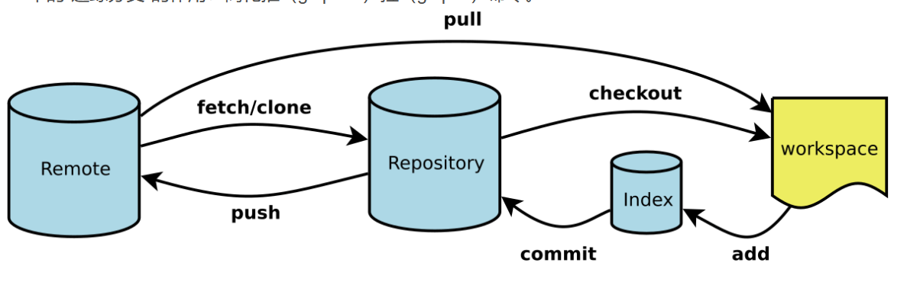
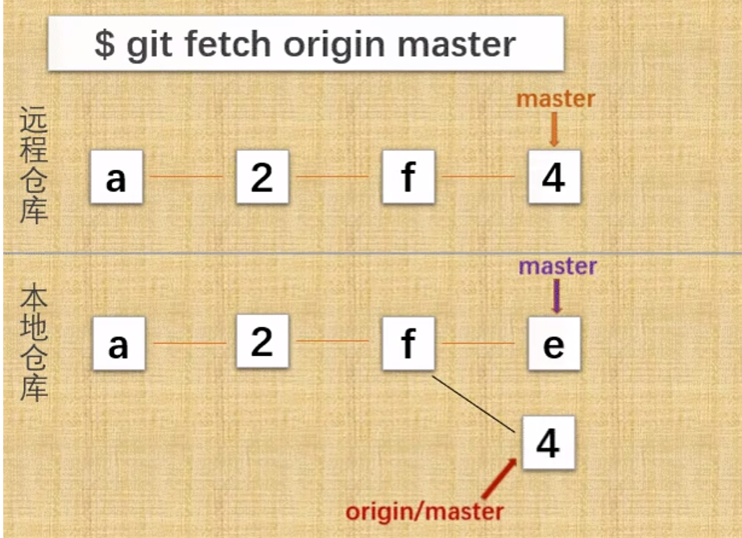
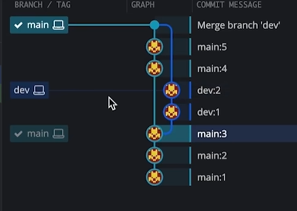
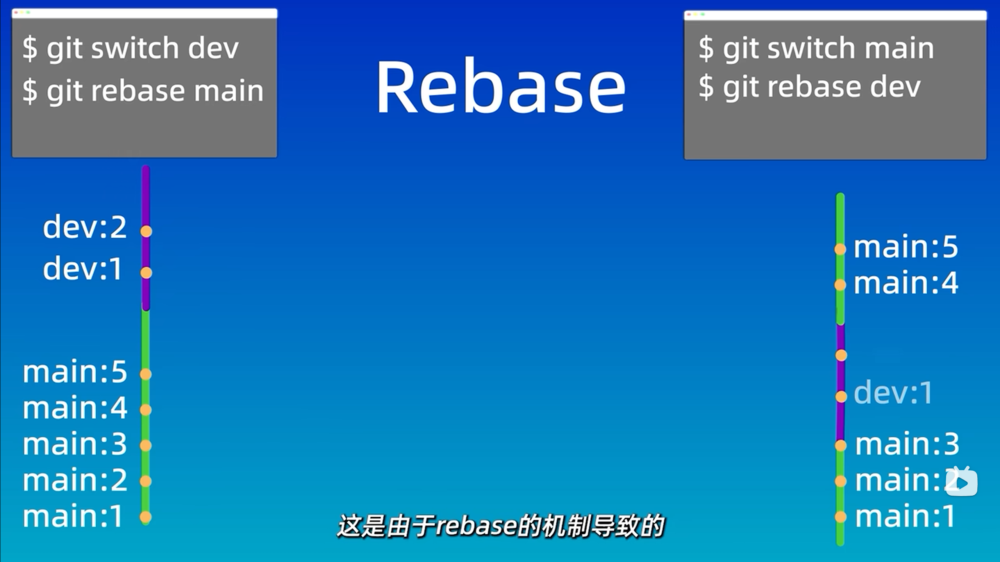

# <font color=green>git 基础</font>

<br>
<br>

---


## 一、git 的基本概念

### 1.1 git 简介

Git 是一个分布式版本控制系统，分布式版本控制系统不必每次都从中央服务器获取最新版本，而是可以从本地仓库中获取历史版本，因此速度更快，更适合开源项目。

Git 主要分为本地仓库和远程仓库，本地仓库是在本地电脑上的仓库，远程仓库是在服务器上的仓库。仓库又分为了三个区域：工作区、暂存区和版本库。

### 1.2 git 的三个区域

- 工作区：就是你在电脑上看到的目录，在此目录下进行写代码操作。
- 暂存区：可以比喻为缓存，修改好了的代码会先添加到暂存区，随后在一起放入版本库中。（它实际上是一个文件，保存了下次将要提交的文件列表信息）
- 版本库：工作区有一个隐藏目录.git，这个不算工作区，而是 Git 的版本库。版本库中的代码就是最终存放在仓库中的版本。

### 1.3 git 特殊文件

- .git: git 仓库的元数据和对象数据库
- .gitignore: git 忽略文件，可以指定不需要 git 管理的文件
- .gitattributes: git 属性文件，可以指定文件的属性
- .gitmodules: git 子模块文件，可以指定子模块的路径
- .gitconfig: git 配置文件，可以指定用户信息和别名
- .gitkeep: 使空目录被提交到 git 仓库

> .gitignore 中放入对应名称就行，支持正则表达式，如`*.txt`表示忽略所有的 txt 文件，`/log`表示忽略根目录下的 log 文件夹，`/log/`表示忽略所有的 log 文件夹。

>在github/ignore中可以找到常用的.gitignore文件

### 1.4 git 分支

因为主线 main 上的代码应该是稳定且能发布使用的版本。直接在 main 线上进行修改会导致项目不稳定。并且项目的开发应该是并行的，所以需要创建分支。不同的分支可以同时进行不同的开发，等开发完成后再合并到 main 线上。

分支的主要作用是用来开发新功能，当开发完成后，合并分支，删除分支。

### 1.5 git 的工作流程

1. 将远程仓库克隆到本地仓库
2. 在本地仓库中进行修改
3. 将修改后的文件添加到暂存区
4. 将暂存区的文件提交到版本库
5. 将版本库的文件推送到远程仓库

<br>
<br>


---

## 二、git 的基本操作

下面的操作都是在 linux 系统下进行的。windows 可以使用 git bash 进行操作。

### 2.1 git 的安装

#### 创建仓库

- 本地创建

```shell
# 创建一个project-name的文件夹并作为git仓库，省略名字则默认为当前文件夹
git init <project-name>
```

- 远程创建

```shell
# 克隆远程仓库到本地，url为远程仓库的url
git clone <url>
```

#### 基本概念

- `main`: 主分支，用于发布稳定版本
- `origin`: 远程仓库的默认名称
- `HEAD`: 指向当前分支的指针
- `HEAD^: 上一个版本`
- `HEAD~4`: 上四个版本

#### 查看信息

```shell
# 查看工作区和暂存区的状态
git status

# 查看版本库的文件
git ls-files

# 查看版本库中某个版本的某个文件，commitid为版本号，比如HEAD为当前版本，HEAD^为上一个版本
git show <commitid>:<file_path>

# 查看提交历史，--oneline为简洁显示
git log --oneline

# 查看引用日志，即查看所有分支的所有操作记录，包括已经被删除的commit（即移动的HEAD）
git reflog

# 查看所有分支,加上-a参数可以查看远程分支
git branch

# 查看所有不同，从上到下比较的是
git diff #（工作区，暂存区）
git diff --cached #（暂存区，版本库）
git diff HEAD #（工作区，版本库）

# 查看两个版本之间的差异,其中id版本号可以通过git log查看
git diff <commitid1> <commitid2>
```
---
<br>

### 2.2 git 的添加与提交

#### 添加文件到暂存区

```shell
# 添加所有文件到暂存区
git add .

# 添加指定文件到暂存区
git add <file>

# 添加符合条件的文件到暂存区（如添加所有.txt文件）
git add *.txt

# 也支持正则表达式
git add [0-9].txt
```

#### 提交文件到版本库

```shell
# 提交暂存区的文件到版本库,message为提交时的一些说明，不加-m则会进入编辑器添加信息
git commit -m "message"
```

#### 添加和提交合并

```shell
# 添加所有文件到暂存区并提交到版本库
git commit -a -m "message"
```
---
<br>

### 2.3 git 的移动与删除

- 移动文件

```shell
# 移动文件到指定目录
git mv <file> <dir>

# 移动文件并重命名
git mv <file1> <file2>
```

- 删除文件

```shell
# 从工作区和暂存区删除文件，暂存区执行删除操作
git rm <file>

# 删除文件夹，也会删除暂存区的文件
git rm -r <dir>

# 从暂存区删除文件，工作区不受影响
git rm --cached <file>

# 恢复文件到之前的版本,course为版本号
git checkout <file> <commitid>

#复制克隆下来的版本库到新的分支的工作区
git checkout -b <branch> <commitid>

# 重置当前分支的HEAD为指定版本，如果后悔了，可以通过git reflog查看commitid，然后git reset --hard <commitid>恢复
git reset --hard <commitid> ## 会删除暂存区和工作区的修改（即id之后的修改都会被删除）
git reset --soft <commitid> ## 会保留工作区的修改
git reset --mixed <commitid> ## 会保留工作区的修改，但是不保留暂存区的修改

# 恢复到上一个版本
git reset --hard HEAD^ # 一个^代表上一个版本

# 重置当前分支为指定版本，但是是通过新的提交（即把之前的版本当新的提交）来实现的，不会删除暂存区和工作区的修改
git revert <commitid>

# 撤销暂存区的修改，将暂存区的文件恢复到工作区
git restore --staged <file>

```

<br>
<br>

---

## 三、git远程仓库

在使用远程仓库前，需要为主机添加 SSH key，这样才能连接到远程仓库。
>添加ssh并关联到github的步骤如下：
>1. 本机作为 Git 客户端，一般已经带有 `ssh`。没有的话安装客户端：`sudo apt install openssh-client`。`openssh-server` 是让别人连进这台机器，推代码用不到，也不必执行 `/etc/init.d/ssh start`。
>2. 生成密钥：`ssh-keygen -t ed25519`。还要兼容很老的服务器时再用 `ssh-keygen -t rsa -b 4096`。密钥在 `~/.ssh/`。默认文件名是 `id_ed25519`，已经有同名文件时会提示是否覆盖，换一个文件名即可。
>3. 把 `.pub` 文件的内容贴到 GitHub：Settings → SSH and GPG keys → New SSH key。

如果是新的密钥（即不是id_rsa），需要在`~/.ssh/`目录下的`config`文件中添加，这样就可以在连接远程仓库时使用新的密钥。
```txt
# github
Host github.com
HostName github.com
PreferredAuthentications publickey
IdentityFile ~/.ssh/test  #这里是新的密钥的名称
```
### 3.1 关联远程仓库

#### 克隆后自动关联

```shell
# 克隆远程仓库后会自动关联远程仓库
git clone <url>
```

#### 手动关联
  
```shell
# 关联远程仓库，其中remote-name为远程仓库的别名，默认为origin
# 一个本地仓库可以关联多个远程仓库，其中一个为默认远程仓库origin,当push和pull不指定远程仓库名称时默认为origin的远程仓库
git remote add <remote-name> <url>

```

### 3.2 远程仓库的操作

#### 查看远程仓库

```shell
# 查看远程仓库
git remote -v
```

#### 删除远程仓库

```shell
# 删除远程仓库，不再关联
git remote rm <remote-name>
```

#### 重命名远程仓库

```shell
# 重命名关联远程仓库，如将origin重命名为new
git remote rename <old-name> <new-name>
```

#### 从远程仓库拉取代码到本地

```shell
# 从远程仓库拉取代码的某个分支到本地
git pull <remote-name> <branch-name>

# 直接pull，会拉取远程仓库的main分支到本地
git pull

# 拉取远程仓库代码并将本地代码rebase到远程仓库的main分支的最新的版本上
git pull --rebase

# 将远程仓库的main的代码拉取到本地，但是不合并(此时拉取的代码会保存在远程仓库的副本中，即下载到本地的副本中但本地版本库中看不见，由FETCH_HEAD指向)
git fetch <remote-name>

# 拉去某个分支的代码到本地副本的对应分支
git fetch <remote-name> <baranch-name>

# 将远程仓库副本的代码的某个分支合并到本地
git merge <remote-name>/<branch-name>

# 查看远程仓库的分支
git branch -r
```


#### 推送本地代码到远程仓库

```shell
# 推送本地代码到远程仓库的main分支
git push 

# 推送本地代码到远程仓库
git push <remote-name> <branch-name>

# 推送本地代码到远程仓库，并创建远程分支
git push <remote-name> <local-branch-name>:<remote-branch-name>

```

### 3.3 远程仓库冲突

主要出现在push时出错,因为远程仓库的代码的版本比本地仓库的版本新，所以需要将本地仓库的代码更新到远程仓库的最新版本后再push。

#### 没有冲突，只有缺少代码

```shell
# 先拉取远程仓库的代码到本地
git pull

# 再推送本地代码到远程仓
git push
```

#### 有冲突

1. 用merge合并代码

```shell
# 先拉取远程仓库的代码到本地
git pull

# 出现冲突，解决冲突

# 再更新版本库
git add .
git commit -m "message"

# 再推送本地代码到远程仓
git push
```
还有一种方法:
```shell
# 回退到远程仓库共有的版本，保留本地修改
git reset --soft xxx
# 锁住本地修改
git stash
# 拉取远程仓库最新版本
git pull
# 解锁本地修改
git stash pop
# 解决冲突
git add .
git commit -m "message"
# 再推送本地代码到远程仓
git push
```

2. 用rebase合并代码

```shell
# 先拉取远程仓库的代码到本地
git pull --rebase

# 出现冲突，解决冲突
git status
#解决冲突
git add .
git rebase --continue

# 再推送本地代码到远程仓
git push
```

>区别：merge是将远程仓库的代码合并到本地仓库的代码（两个分支并行，再合并），rebase是将本地仓库的代码合并到远程仓库的最新的代码（先找到共同版本，将本地共同版本之后修改的版本放到远程仓库最新的版本上面）。merge看起来是分叉后合并，rebase看起来是直线的。

>merge可以保留分支的历史，rebase可以保持提交的顺序。







<br>
<be>

---

## 四、git 分支管理

### 4.1 分支基本操作

```shell
# 查看分支 -a查看所有分支，-r查看远程分支
git branch

# 创建分支
git branch <branch-name>

# 切换分支
git checkout <branch-name>
git switch <branch-name> #（推荐）

# 删除已经合并的分支
git branch -d <branch-name>

# 删除分支
git branch -D <branch-name>

# 给分支打上标签
git tag <tag-name> 
```
### 4.2 分支合并

```shell
# 合并分支
git merge <branch-name>
# 不使用fast forward合并，可以保留分支的历史，不用的话会直接合并，看不出分支的历史
git merge --no-ff <branch-name>

# 合并分支成直线（rebase谁就是把谁当成底座，把新的修改放在其上面）
git rebase <branch-name>
```

### 4.3 分支冲突

上面远程仓库中一样的，如果merge出现冲突，解决发生冲突的文件，然后再提交。

### 4.4 工作区存储

**Stash**操作可以将工作区的修改暂存起来，等以后需要的时候再恢复。-u参数可以将未跟踪的文件也暂存起来。-a未跟踪和忽略的文件也暂存起来。

```shell
# 暂存工作区的修改
git stash

# 暂存工作区的修改并添加说明
git stash save "message"

# 查看保存的工作区
git stash list

# 恢复最近一次保存的工作区，并删除stash信息
git stash pop

# 恢复指定的工作区,num为stash list中的编号
git stash pop stash@{num}

# 恢复最近一次保存的工作区，保留stash信息
git stash apply
git stash apply stash@{num}

# 删除stash信息
git stash drop stash@{num}

```


