# [数据结构] 二叉树
## 一、树的概念

### 1.1 树形结构的形式化

#### 1.1.1 序偶  

定义：设有两个元素x和y，由x和y构成的序偶记为<x,y>。  

>序偶可以描述有先后顺序要求的一对元素之间的关系，顺序很重要<x,y> $\not =$ <y,x>  

#### 1.1.2 树的直接定义  

&emsp;&emsp;树是包括n（n$\geq$0）个元素的集合D，R是D中元素的序偶集合，若D为空，R也为空，此时为空树，否则R满足以下要求：
* 有且仅有一个结点a $\in$ D，不存在任何节点v $\in$ D,v $\not =$ a，使得<v,a> $\in$ R,该结点为树的根。<font color=blue>如果树不为空，则树的根节点是唯一的</font>
* 对于除根结点a以外任一结点u $\in$ D而言，都有且仅有一个结点 v $\in$ D，v $\not =$ u，使得<v,u> $\in$ R成立。<font color=blue>根节点没有前驱，其他结点均有唯一前驱</font>

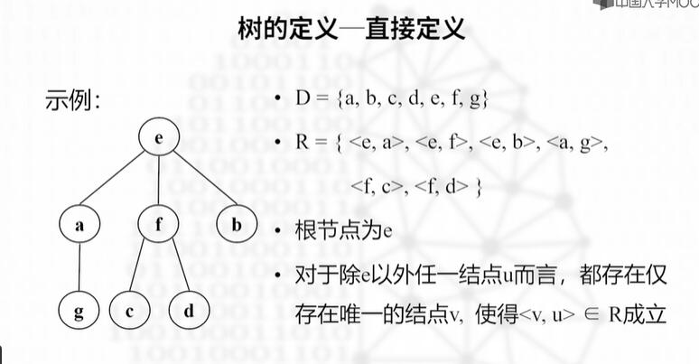

#### 1.1.3 树的递归定义  

&emsp;&emsp;树是包括n个结点的有限集T，若n=0，则该数为空树；否则为非空树，在该非空树中，有且仅有一个特定的称为根的结点（r），其余结点(T-{r})划分成m(m$\geq$0)个互不相交的子集 $ T_1,T_2,...T_m $,其中，每个子集 $T_i$都是树，也称为树根节点r的子树。

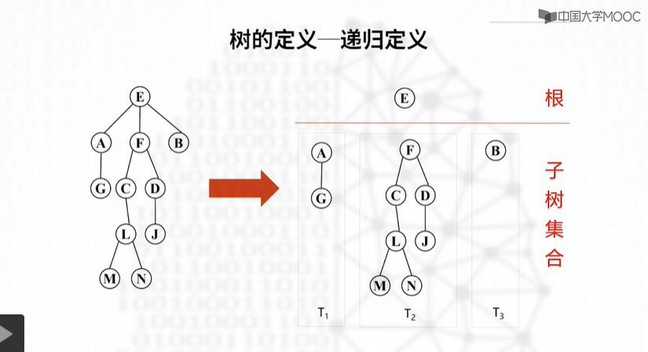

### 1.2 树的基本术语

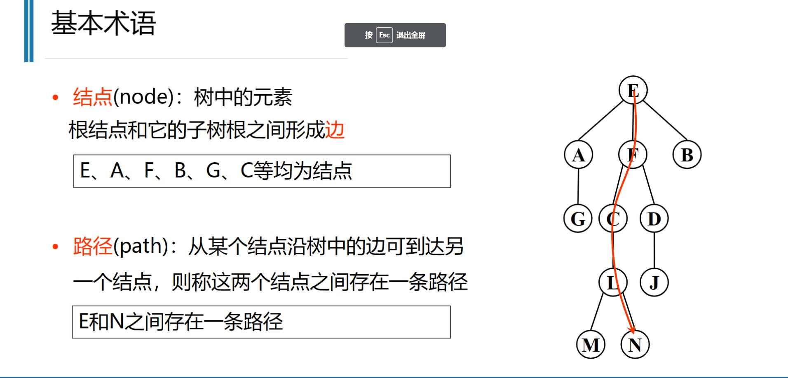

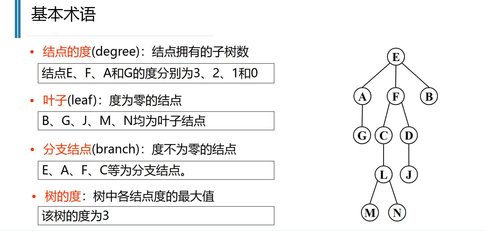

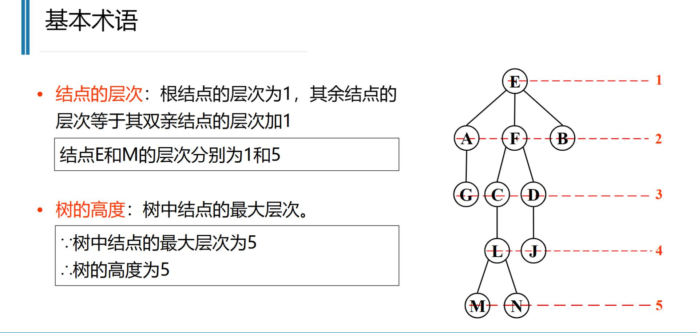

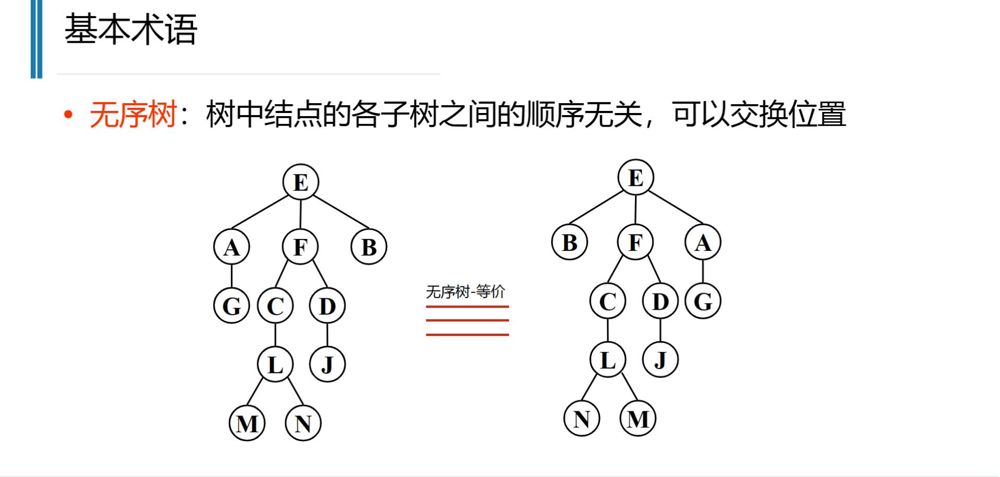

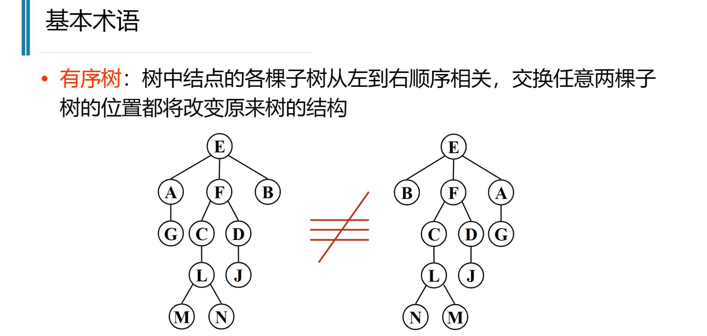

森林：树的集合，0棵或多棵不相交的树组成森林

 <br>
 <br>

 ---

 ## 二、二叉树

 ### 2.1 二叉树的定义

 &emsp;&emsp;定义:二叉树是结点的有限集合，该集合或者为空集，或者是由一个根和两个互不相交的、称为该根的左子树和右子树的二叉树组成。
 * 二叉树要分左右顺序
 * 二叉树的每个结点最多只能有2棵子树

### 2.2 二叉树的性质

1. 性质1：二叉树的第i（i $\geq$ 1）层上至多有 $2^{i-1}$ 个结点。（数学归纳法证明）
2. 性质2：高度为h的二叉树上至多有 $2^h-1$ 个结点
3. 性质3：包含n个节点的二叉树的高度最矮为 $log_2(n+1)$(向上取整) ,最高为n
4. 任一棵二叉树中,若叶节点数量为 $n_0$ ,度为2的节点数量为 $n_2$ ,则有 $n_0=n_2+1$ 

### 2.3 特殊二叉树

* 满二叉树:所有结点饱和  
  
* 完全二叉树:只有最下面两层结点的度可以小于2,且最下一层的叶节点均依次集中在靠左的位置上,<font color=blue>即除了最后一层结点其它结点都是满的,最后一层可以满也可以只有一个结点,但度为1的结点的子结点必须在左边</font>
  >设有n个节点的完全二叉树,按照从上到下,从左到右依次编号0-n-1. 则:
  >1. i>0,则该结点的双亲编号为(i-1)/2向下取整
  >2. 若2i+1 < n,则该节点的左孩子编号为2i+1,否则该节点无左孩子 
  >3. 若2i+2 < n,则该节点的右孩子编号为2i+2,否则该节点无右孩子
* 扩充二叉树:除叶子节点外,其余节点的度必须为2


### 2.4 二叉树ADT

1. 数组存储  
  用完全二叉树的顺序方式存储倒数组对应下标中. 不是完全二叉树就通过添加空结点改造成完全二叉树
  缺点:可能会存在较大的空间浪费
2. 链表存储
   创建一个节点的结构体,其中包含该点数据,和该点的左子节点和右子节点
```c
typedef struct BtBode{
  ElemType element;
  struct BtNode *lChild;
  struct BtNode *rChild;
  //struct btNode *parent
}BTNode;
typedef struct binarytree{
  BtNode *root;
}Binary Tree;
```
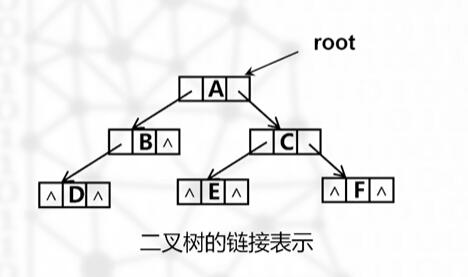

扩展:在链表结点中增加一个parent指针,令它指向该节点的双亲结点,就可以实现二叉树的双向链表结构

### 2.5 二叉树的基本运算

```C
//构造一棵空二叉树
void Create(BinaryTree *bt){
  bt->root=NULL;
}

//创建新节点,该节点的数据为x,ln和m为该节点的左右孩子
BtNode* NewNode(ElemType x,BtNode *ln,BtNode *m){
  BtNode *p=(BtNode *)malloc(sizeof(Btnode));
  p->element=x;
  p->lChild=ln;
  p->rChild=m;
}

//给空的二叉树赋值x,并返回true,如果不是空的二叉树返回false
BOOL Root(Binary Tree *bt,ElemType x){
  if(bt->root){
    x=&bt->root->element;//将root节点的数值的地址赋给x
    return true;
  }else return false;
}

//构造二叉树bt,根节点的值为e,left和right为根的左右子树
void MakeTree(BinaryTree *bt,ElemType e,BinaryTree *left,BinaryTree *right){
  if(bt->root||left==right) return; //判断bt是否为空树以及左子树和右子树是否相同
  bt->root=NewNode(e,left->root,right->root);
  left->root=right->root=NULL; //左右子树的root已经失去作用,置为NULL.
}
```

### 2.6 二叉树的深度优先遍历（DFS）

二叉树的遍历一般分为三种:前序遍历,中序遍历,后序遍历

* 前序遍历:先访问根节点,再访问左子树,最后访问右子树

* 中序遍历:先访问左子树,再访问根节点,最后访问右子树

* 后序遍历:先访问左子树,再访问右子树,最后访问根节点

#### 2.6.1 递归遍历

```C


//前序遍历
void PreOrder(BTNode *bt){
  if(bt){
    printf("%c",bt->element);
    PreOrder(bt->lChild);
    PreOrder(bt->rChild);
  }
}

//中序遍历
void InOrder(BTNode *bt){
  if(bt){
    InOrder(bt->lChild);
    printf("%c",bt->element);
    InOrder(bt->rChild);
  }
}

//后序遍历
void PostOrder(BTNode *bt){
  if(bt){
    PostOrder(bt->lChild);
    PostOrder(bt->rChild);
    printf("%c",bt->element);
  }
}
```

#### 2.6.2 迭代遍历

使用一个栈来存储遍历的节点。

* 前序遍历:先将根节点入栈,然后向左遍历，只要指针不为空就一直入栈，并且将该指针指向的节点的值存入数组，直到指针为空，然后出栈，将指针指向出栈节点的右子树，重复上述过程，直到栈为空。

该方法容易混淆，栈中存储的是节点，只要存入了节点，那么代表该节点的值已经被存入数组了，只剩左右子树的遍历，当左边遍历完了，**该节点就出栈（此时栈顶是父节点）并且指向右子树**，如果右子树也遍历完了，说明该节点的左右子树都遍历完了，**也代表着父节点的左子树遍历完了**，所以父节点也出栈，指向父节点的右子树，重复上述过程，直到栈为空。

* 中序遍历:先将根节点入栈，然后向左遍历，只要指针不为空就一直入栈，直到指针为空，然后将该节点值存入数组后出栈，将指针指向出栈节点的右子树，重复上述过程，直到栈为空。
* 后序遍历:先将根节点入栈，然后向左遍历，只要指针不为空就一直入栈，直到指针为空，然后出栈，将指针指向出栈节点的右子树，重复上述过程，直到栈为空。但是后序遍历比较麻烦，是需要记录是否访问过右子树的，如果访问过右子树，就可以出栈了，如果没有访问过，就需要将指针指向右子树，然后将该节点入栈，重复上述过程，直到栈为空。**所以对于后序遍历。可以使用反转的方法，后序遍历的结果是左右根，反转后就是根右左，和前序遍历的写法大致一样，只不过是先遍历右子树，然后左子树，最后根节点。**
```C
#define MaxSize 6 //节点数
//定义一个二叉树
typedef struct BtNode{
  ElemType element;
  struct BtNode *lChild;
  struct BtNode *rChild;
}BTNode;

//前序遍历
int* PreOrder(BTNode *bt){
  BTNode *stack[MaxSize]; //定义一个栈
  int *result=(int *)malloc(sizeof(int)*MaxSize); //定义一个数组,用来存放遍历的结果
  int top=-1,i=0;
  BTNode *p=bt; //定义用来遍历的指针
  while(p||top!=-1){ //当p不为空或者栈不为空时
    if(p){
      result[i++]=p->element; //将p的值存入数组（根）
      stack[++top]=p;
      p=p->lChild; //（左）
    }else{
      p=stack[top--]->rChild; //当p为空时,出栈,并将指针指向出栈节点的右子树（右）
    }
  }
  return result;
}

//前序遍历c++（栈中先存根节点，弹出根节点，如有左右节点则先入右节点再入左节点，弹出时就是先左再右了）
class Solution {
public:
    vector<int> preorderTraversal(TreeNode* root) {
        stack<TreeNode*> st;
        vector<int> result;
        if (root == NULL) return result;
        st.push(root);
        while(!st.empty()){
            result.push_back(st.top()->val);
            TreeNode* temp = st.top();
            st.pop();
            if(temp->right!=NULL) st.push(temp->right);
            if(temp->left!=NULL) st.push(temp->left);
        }
        return result;
    }
};


//中序遍历
int* InOrder(BTNode *bt){
  BTNode *stack[MaxSize]; //定义一个栈
  int *result=(int *)malloc(sizeof(int)*MaxSize); //定义一个数组,用来存放遍历的结果
  int top=-1,i=0;
  BTNode *p=bt; //定义用来遍历的指针
  while(p||top!=-1){ //当p不为空或者栈不为空时
    if(p){
      stack[++top]=p;
      p=p->lChild; //（左）
    }else{
      result[i++]=stack[top]->element; //将p的值存入数组（根）
      p=stack[top--]->rChild; //当p为空时,出栈,并将指针指向出栈节点的右子树（右）
    }
  }
  return result;
}

//后序遍历，反转法
int* PostOrder(BTNode *bt){
  BTNode *stack[MaxSize]; //定义一个栈
  int *result=(int *)malloc(sizeof(int)*MaxSize); //定义一个数组,用来存放遍历的结果
  int top=-,i=0;
  BTNode *p=bt; //定义用来遍历的指针
  while(p||top!=-1){ //当p不为空或者栈不为空时
    if(p){
      result[i++]=p->element; //将p的值存入数组（根）
      stack[++top]=p;
      p=p->rChild; //（右）
    }else{
      p=stack[top--]->lChild; //当p为空时,出栈,并将指针指向出栈节点的左子树（左）
    }
  }
  //反转数组
  int temp;
  for(int i=0;i<MaxSize/2;i++){
    temp=result[i];
    result[i]=result[MaxSize-i-1];
    result[MaxSize-i-1]=temp;
  }
  return result;
}


```

### 2.7 二叉树的广度优先遍历（BFS）

使用一个队列来存储遍历的节点。先将根节点入队，然后出队，将出队节点的左右子树入队，重复上述过程，直到队列为空。
>过程如下：
>1. 将根节点入队
>2. 当队列不为空时，循环出队（次数为队列大小），每次将出队节点的值存入数组，并把出队节点的左右子树入队。这样就完成了一层的遍历。
>3. 重复上述过程，直到队列为空

因为C语言中没有队列，所以这里用c++来实现
```c++
class Solution {
public:
    vector<vector<int>> levelOrder(TreeNode *root) {
        if (root == nullptr) return {};
        vector<vector<int>> ans; // 创建二维数组
        queue<TreeNode *> q; // 创建队列
        q.push(root);
        while (!q.empty()) {
            vector<int> vals; // 保存一层的元素的值
            for (int n = q.size(); n--;) { // 遍历队列
                auto node = q.front(); // 取出队头元素
                q.pop();
                vals.push_back(node->val); // 将队头元素的值存入一维数组
                if (node->left)  q.push(node->left);
                if (node->right) q.push(node->right);
            }
            ans.emplace_back(vals); // 将一层的元素存入二维数组
        }
        return ans;
    }
};

```

### 2.8 二叉搜索树

#### 2.8.1 二叉搜索树的概念

二叉搜索树是一种特殊的二叉树，它具备以下特点：

1. 每个节点的值都大于其左子树中所有节点的值。
2. 每个节点的值都小于其右子树中所有节点的值。

#### 2.8.2 二叉搜索树的插入

插入较为简单，即从根节点开始，如果插入的值小于根节点的值，就插入到左子树，如果插入的值大于根节点的值，就插入到右子树，直到找到一个空的位置插入。如果插入的值已经存在则不插入。

```C++
TreeNode* insert(TreeNode* root, int val) {
        if (root == nullptr) {
            return new TreeNode(val);
        }
        if (val < root->val) {
            root->left = insert(root->left, val);
        } else if (val > root->val) {
            root->right = insert(root->right, val);
        }
        // 如果 val == root->val，直接返回 root，不插入重复值
        return root;
    }

```

#### 2.8.3 二叉搜索树的删除

删除操作比较复杂，具体可看`leetcode算法题`中的二叉搜索树的删除操作。

#### 2.8.4 二叉搜索树的查找

二叉搜索树的查找和二分法一样。

二叉搜索树的查找、插入和删除操作的时间复杂度在平均情况下是 O(log n)，其中 n 是树中节点的数量。然而，在最坏情况下（例如，当树退化为链表），时间复杂度会变成 O(n)。

#### 2.8.5 二叉搜索树的缺点

二叉搜索树的缺点是可能退化为链表，从而导致时间复杂度降低。

### 2.9 平衡二叉树

#### 2.9.1 平衡二叉树的概念

因为二叉搜索树的缺点是可能退化为链表，所以引入了平衡二叉树，平衡二叉树是一种特殊的二叉搜索树，其特点是任何节点的两个子树的高度差不超过1。通过保持这种平衡性，平衡二叉树可以在最坏情况下仍然保持高效的查找、插入和删除操作。

#### 2.9.2 平衡二叉树的条件

1. 该树必须是二叉搜索树
2. 该树的左右子树的高度差不超过1

#### 2.9.3 平衡二叉树的平衡方法

平衡二叉树的平衡方法有很多，比如红黑树、AVL树、B树等。


### 2.10 B树

B树（B-Tree）是一种自平衡的树数据结构，专门为磁盘或其他存储设备设计，能够保持数据有序，并允许高效的插入、删除和查找操作。

#### 2.10.1 B树的概念

B树是一种广义的二叉搜索树，它不仅可以有两个子节点，还可以有更多的子节点。B树中的每个节点可以包含多个键和子树，并且所有叶子节点都位于同一层。这种设计使得B树非常适合存储大量数据并进行高效的磁盘访问。

其中较为常用的是B+树，二三树，二三树是B树的特例，B+树是B树的变种。

#### 2.10.2 B树的特点

1. 所有叶子节点都在同一层
2. 每个节点可以有多个子节点
3. 每个节点可以有多个键
4. B树是一种平衡二叉搜索树

#### 2.10.3 B树的平衡

1. 节点过载
* B树的每个节点都有多个子节点，这使得B树更加平衡，因为每个节点都有多个子节点，所以树的高度更低。
* 但是一个节点中不能放入太多的值，否则和普通的二叉搜索树没有区别，所以B树中的每个节点都有一个上限，当节点中的键的数量超过上限时，需要进行分裂操作。

2. 节点分裂

* 当一个节点中的键的数量超过上限时，需要进行分裂操作。分裂操作会将节点中的键分成两部分），并将其中一部分向上移动到一个新的节点中。这样可以保持树的平衡性。（比如3为最大容量，过载时将中间的值给父子节点）
* 根节点的分裂操作会使树的高度增加1，这样可以保持树的平衡性。

#### 2.10.4 B树的性能

时间复杂度：B树的查找、插入和删除操作的时间复杂度都是 O(log n)，其中 n 是树中节点的数量。

#### 2.10.5 B树的缺点
B树看起来不错，但是它的实现比较复杂。

### 2.11 B+树

B+树是B树的变种，它在B树的基础上做了一些改进，使得B+树更适合磁盘存储。

#### 2.11.1 B+树的特点

1. 所有叶子节点都在同一层
2. 非叶子节点只存储键，不存储值
3. 叶子节点之间通过指针连接，形成一个双向链表

#### 2.11.2 为什么B+树更适合磁盘存储

1. 磁盘读写效率高：B+树的内部节点只存储关键字，因此每个节点能容纳更多的关键字，树的高度更低，减少了磁盘IO次数。
2. 范围查询高效：由于叶子节点形成有序链表，范围查询可以通过遍历叶子节点实现，而不需要回溯树结构，大大提高了范围查询的效率。
3. 全表扫描效率高：B+树的叶子节点按顺序链在一起，全表扫描可以直接遍历叶子节点，而不需要逐层读取整个树。

### 2.12 AVL树

在说AVL之前，首先要了解平衡二叉树的平衡操作：旋转。

#### 2.12.1 旋转

旋转是平衡二叉树的一种常见操作，用于调整树的平衡性。平衡二叉树的旋转操作主要有两种：左旋和右旋。

旋转后的树仍然是一棵二叉搜索树，只是树的结构发生了变化。

* **左旋**

左旋是将一个节点的右子树变为新的根节点，原来的根节点变为新根节点的左子树。

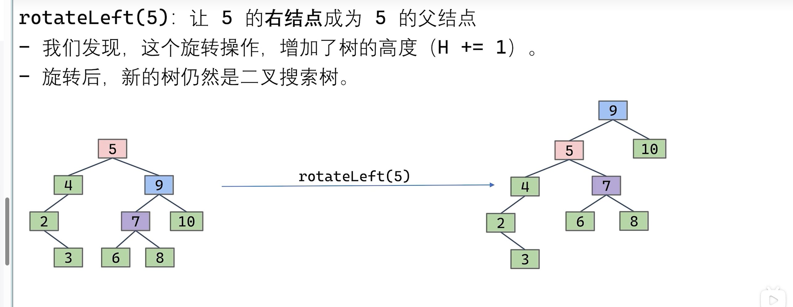

* **右旋**

右旋是将一个节点的左子树变为新的根节点，原来的根节点变为新根节点的右子树。

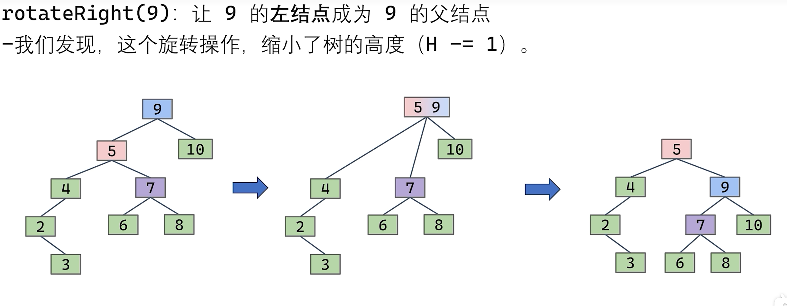

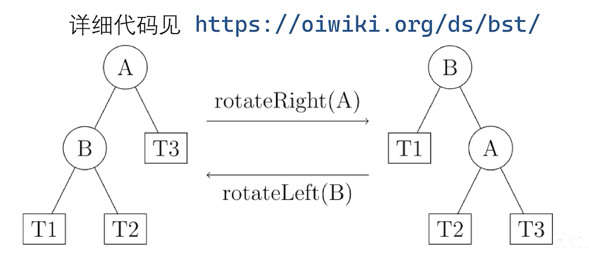

下面是代码实现：
```c++
#include <iostream>

struct TreeNode {
    int key;
    TreeNode *left;
    TreeNode *right;
    TreeNode *parent;

    TreeNode(int k) : key(k), left(nullptr), right(nullptr), parent(nullptr) {}
};

class BinaryTree {
public:
    TreeNode* root;

    BinaryTree() : root(nullptr) {}

    // 左旋操作
    void leftRotate(TreeNode* x) {
        TreeNode* y = x->right; // y 是 x 的右孩子
        x->right = y->left; // 将 y 的左子树挂到 x 的右子树上

        if (y->left != nullptr) {
            y->left->parent = x; // 如果 y 的左子树不为空，将其父节点设为 x
        }

        y->parent = x->parent; // 将 y 的父节点设为 x 的父节点

        if (x->parent == nullptr) {
            root = y; // 如果 x 是根节点，则将根节点设为 y
        } else if (x == x->parent->left) {
            x->parent->left = y; // 如果 x 是其父节点的左孩子，将其父节点的左孩子设为 y
        } else {
            x->parent->right = y; // 如果 x 是其父节点的右孩子，将其父节点的右孩子设为 y
        }

        y->left = x; // 将 x 设为 y 的左孩子
        x->parent = y; // 将 x 的父节点设为 y
    }

    // 右旋操作
    void rightRotate(TreeNode* y) {
        TreeNode* x = y->left; // x 是 y 的左孩子
        y->left = x->right; // 将 x 的右子树挂到 y 的左子树上

        if (x->right != nullptr) {
            x->right->parent = y; // 如果 x 的右子树不为空，将其父节点设为 y
        }

        x->parent = y->parent; // 将 x 的父节点设为 y 的父节点

        if (y->parent == nullptr) {
            root = x; // 如果 y 是根节点，则将根节点设为 x
        } else if (y == y->parent->right) {
            y->parent->right = x; // 如果 y 是其父节点的右孩子，将其父节点的右孩子设为 x
        } else {
            y->parent->left = x; // 如果 y 是其父节点的左孩子，将其父节点的左孩子设为 x
        }

        x->right = y; // 将 y 设为 x 的右孩子
        y->parent = x; // 将 y 的父节点设为 x
    }
};

```

#### AVL树

AVL树中有一个平衡因子，用于衡量树的平衡性。平衡因子是左子树的高度减去右子树的高度。

AVL树是一种自平衡的二叉搜索树，它的每个节点的平衡因子只能是 -1、0 或 1。当插入或删除节点后，AVL树会通过旋转操作来保持树的平衡性。

### 2.13 红黑树

要了解红黑树，首先要知道B树和平衡树的优缺点。

* B树：适合磁盘存储，但是实现复杂。一个节点中的值可变很麻烦
* 平衡树：适合内存存储，但是平衡操作复杂。

所以我们将B树和平衡树结合，用二叉树去表示一个二三树。（补充：二三树的过载阈值是2）

那么二三树中一个节点的多个值该怎么用二叉树表示呢，一个简单的方式就是用颜色表示。比如红色连接的两个节点表示一个节点中的两个值。黑色节点表示一个单独节点

但是这个红线不好表示，所以我们就给节点添加一个颜色属性，红色或者黑色。这就是红黑树。

这里介绍比较红黑树中比较简单的一种实现方式，即左倾红黑树。

#### 2.13.1 红黑树的性质

1. 一个节点不可能有两个红色边（该边包括父节点那个边）
2. 从根节点到叶子节点的路径上，黑色节点的数量相同（即叶子节点都在同一层）
3. 如果是左偏红黑树，那么一个节点的左子节点是红色的，右子节点是黑色的

#### 2.13.2 红黑树的插入


>**插入的节点默认为红色**

1. 如果插入到了右子树(即左节点黑右节点红)，那么左旋
2. 如果插入后产生了相邻的红边（即一个红节点的子节点中有红节点），将上面的红节点进行右旋（还没完，这样会出现一个黑节点会有两个红节点）
3. 插入后出现了黑节点有两个红节点，将颜色翻转（即将黑节点变为红节点，两个红节点变为黑节点）


伪代码如下：
```txt
function insert(value):
    root = insertRec(root, value)
    root.color = BLACK

function insertRec(node, value):
    if node == null:
        return new Node(value, RED) // 新节点总是红色

    if value < node.value:
        node.left = insertRec(node.left, value)
    else:
        node.right = insertRec(node.right, value)

    if isRed(node.right) and not isRed(node.left):
        node = leftRotate(node) // 修复右倾红链接
    if isRed(node.left) and isRed(node.left.left):
        node = rightRotate(node) // 修复两个连续的红链接
    if isRed(node.left) and isRed(node.right):
        flipColors(node) // 修复红红冲突

    return node
```


